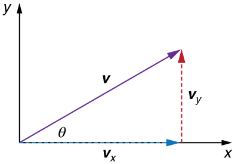

* Apply principles of vector addition to determine relative velocity.
* Explain the significance of the observer in the measurement of velocity.

# Relative Velocity

If a person rows a boat across a rapidly flowing river and tries to head directly for the other shore, the boat instead moves **diagonally** relative to the shore, as in [\[link\]](#import-auto-id1635451). The boat does not move in the direction in which it is pointed. The reason, of course, is that the river carries the boat downstream. Similarly, if a small airplane flies overhead in a strong crosswind, you can sometimes see that the plane is not moving in the direction in which it is pointed, as illustrated in [\[link\]](#import-auto-id1851600). The plane is moving straight ahead relative to the air, but the movement of the air mass relative to the ground carries it sideways.

  relative to the shore is the sum of its velocity relative to the river plus the velocity of the river relative to the shore."){: #import-auto-id1635451}

."){: #import-auto-id1851600}

In each of these situations, an object has a **velocity**{: data-type="term" #import-auto-id1831655} relative to a medium (such as a river) and that medium has a velocity relative to an observer on solid ground. The velocity of the object **relative to the observer** is the sum of these velocity vectors, as indicated in [\[link\]](#import-auto-id1635451) and [\[link\]](#import-auto-id1851600). These situations are only two of many in which it is useful to add velocities. In this module, we first re-examine how to add velocities and then consider certain aspects of what relative velocity means.

How do we add velocities? Velocity is a vector (it has both magnitude and direction); the rules of **vector addition**{: data-type="term" #import-auto-id1402169} discussed in [Vector Addition and Subtraction: Graphical Methods](/m42127) and [Vector Addition and Subtraction: Analytical Methods](/m42128) apply to the addition of velocities, just as they do for any other vectors. In one-dimensional motion, the addition of velocities is simple—they add like ordinary numbers. For example, if a field hockey player is moving at <math xmlns="http://www.w3.org/1998/Math/MathML"><semantics><mrow><mrow><mtext>5 m/s</mtext></mrow><mrow /></mrow><annotation encoding="StarMath 5.0"> size 12{"5 m/s"} {}</annotation></semantics></math>

 straight toward the goal and drives the ball in the same direction with a velocity of <math xmlns="http://www.w3.org/1998/Math/MathML"><semantics><mrow><mrow><mtext>30 m/s</mtext></mrow><mrow /></mrow><annotation encoding="StarMath 5.0"> size 12{"30 m/s"} {}</annotation></semantics></math>

 relative to her body, then the velocity of the ball is <math xmlns="http://www.w3.org/1998/Math/MathML"><semantics><mrow><mrow><mtext>35 m/s</mtext></mrow><mrow /></mrow><annotation encoding="StarMath 5.0"> size 12{"35 m/s"} {}</annotation></semantics></math>

 relative to the stationary, profusely sweating goalkeeper standing in front of the goal.

In two-dimensional motion, either graphical or analytical techniques can be used to add velocities. We will concentrate on analytical techniques. The following equations give the relationships between the magnitude and direction of velocity (<math xmlns="http://www.w3.org/1998/Math/MathML"><semantics><mrow><mrow><mi>v</mi></mrow><mrow /></mrow><annotation encoding="StarMath 5.0"> size 12{v} {}</annotation></semantics></math>

 and <math xmlns="http://www.w3.org/1998/Math/MathML"><semantics><mrow><mrow><mi>θ</mi></mrow><mrow /></mrow><annotation encoding="StarMath 5.0"> size 12{θ} {}</annotation></semantics></math>

) and its components (<math xmlns="http://www.w3.org/1998/Math/MathML"><semantics><mrow><mrow><msub><mi>v</mi><mrow><mi>x</mi></mrow></msub></mrow><mrow /></mrow><annotation encoding="StarMath 5.0"> size 12{v rSub { size 8{x} } } {}</annotation></semantics></math>

 and <math xmlns="http://www.w3.org/1998/Math/MathML"><semantics><mrow><mrow><msub><mi>v</mi><mrow><mi>y</mi></mrow></msub></mrow><mrow /></mrow><annotation encoding="StarMath 5.0"> size 12{v rSub { size 8{y} } } {}</annotation></semantics></math>

) along the **x**- and **y**-axes of an appropriately chosen coordinate system:

<math xmlns="http://www.w3.org/1998/Math/MathML"> <semantics> <mrow> <mrow> <mrow> <mrow> <msub> <mi>v</mi> <mrow> <mi>x</mi> </mrow> </msub> <mo stretchy="false">=</mo> <mi>v</mi> </mrow><mspace width="0.25em" /> <mtext>cos</mtext><mspace width="0.25em" /> <mi>θ</mi> </mrow> </mrow> <mrow /> </mrow> <annotation encoding="StarMath 5.0"> size 12{v rSub { size 8{x} } =v"cos"θ} {}</annotation> </semantics> </math>

<math xmlns="http://www.w3.org/1998/Math/MathML"> <semantics> <mrow> <mrow> <mrow> <mrow> <msub> <mi>v</mi> <mrow> <mi>y</mi> </mrow> </msub> <mo stretchy="false">=</mo> <mi>v</mi><mspace width="0.25em" /> </mrow> <mtext>sin</mtext><mspace width="0.25em" /> <mi>θ</mi> </mrow> </mrow> <mrow /> </mrow> <annotation encoding="StarMath 5.0"> size 12{v rSub { size 8{y} } =v"sin"θ} {}</annotation> </semantics> </math>

<math xmlns="http://www.w3.org/1998/Math/MathML"> <semantics> <mrow> <mrow> <mrow> <mi>v</mi> <mo stretchy="false">=</mo> <msqrt> <mrow> <msubsup> <mi>v</mi> <mrow> <mi>x</mi> </mrow> <mrow> <mn>2</mn> </mrow> </msubsup> <mo stretchy="false">+</mo> <msubsup> <mi>v</mi> <mrow> <mi>y</mi> </mrow> <mrow> <mn>2</mn> </mrow> </msubsup> </mrow> </msqrt> </mrow> </mrow> <mrow /> </mrow> <annotation encoding="StarMath 5.0"> size 12{v= sqrt {v rSub { size 8{x} } rSup { size 8{2} } +v rSub { size 8{y} } rSup { size 8{2} } } } {}</annotation> </semantics> </math>

<math xmlns="http://www.w3.org/1998/Math/MathML"> <semantics> <mrow> <mrow> <mrow> <mrow> <mi>θ</mi> <mo stretchy="false">=</mo> <msup> <mtext>tan</mtext> <mrow> <mrow> <mo stretchy="false">−</mo> <mn>1</mn> </mrow> </mrow> </msup> </mrow> <mo stretchy="false">(</mo> <mrow> <msub> <mi>v</mi> <mrow> <mi>y</mi> </mrow> </msub> <mo stretchy="false">/</mo> <msub> <mi>v</mi> <mrow> <mi>x</mi> </mrow> </msub> </mrow> <mo stretchy="false">)</mo> </mrow> </mrow> <mo>.</mo> <mrow /> </mrow> <annotation encoding="StarMath 5.0"> size 12{θ="tan" rSup { size 8{ - 1} } \( v rSub { size 8{y} } /v rSub { size 8{x} } \) } {}</annotation> </semantics> </math>

{: #import-auto-id1382383}

These equations are valid for any vectors and are adapted specifically for velocity. The first two equations are used to find the components of a velocity when its magnitude and direction are known. The last two are used to find the magnitude and direction of velocity when its components are known.

Take-Home Experiment: Relative Velocity of a Boat

Fill a bathtub half-full of water. Take a toy boat or some other object that floats in water. Unplug the drain so water starts to drain. Try pushing the boat from one side of the tub to the other and perpendicular to the flow of water. Which way do you need to push the boat so that it ends up immediately opposite? Compare the directions of the flow of water, heading of the boat, and actual velocity of the boat.

Adding Velocities: A Boat on a River

{: #import-auto-id2070798}

Refer to [\[link\]](#import-auto-id2070798), which shows a boat trying to go straight across the river. Let us calculate the magnitude and direction of the boat’s velocity relative to an observer on the shore, <math xmlns="http://www.w3.org/1998/Math/MathML"><semantics><mrow><mrow><msub><mtext mathvariant="bold">v</mtext><mrow><mtext>tot</mtext></mrow></msub></mrow><mrow /></mrow><annotation encoding="StarMath 5.0"> size 12{v rSub { size 8{"tot"} } } {}</annotation></semantics></math>

. The velocity of the boat, <math xmlns="http://www.w3.org/1998/Math/MathML"><semantics><mrow><mrow><msub><mtext mathvariant="bold">v</mtext><mrow><mtext>boat</mtext></mrow></msub></mrow><mrow /></mrow><annotation encoding="StarMath 5.0"> size 12{v rSub { size 8{"boat"} } } {}</annotation></semantics></math>

, is 0.75 m/s in the <math xmlns="http://www.w3.org/1998/Math/MathML"> <semantics> <mrow> <mrow> <mi>y</mi> </mrow> <mrow /> </mrow> <annotation encoding="StarMath 5.0"> size 12{y} {}</annotation> </semantics> </math>

-direction relative to the river and the velocity of the river, <math xmlns="http://www.w3.org/1998/Math/MathML"><semantics><mrow><mrow><msub><mtext mathvariant="bold">v</mtext><mrow><mtext>river</mtext></mrow></msub></mrow><mrow /></mrow><annotation encoding="StarMath 5.0"> size 12{v rSub { size 8{"river"} } } {}</annotation></semantics></math>

, is 1.20 m/s to the right.

**Strategy**

We start by choosing a coordinate system with its <math xmlns="http://www.w3.org/1998/Math/MathML"><semantics><mrow><mi>x</mi></mrow></semantics></math>

-axis parallel to the velocity of the river, as shown in [\[link\]](#import-auto-id2070798). Because the boat is directed straight toward the other shore, its velocity relative to the water is parallel to the <math xmlns="http://www.w3.org/1998/Math/MathML"><semantics><mrow><mi>y</mi></mrow></semantics></math>

-axis and perpendicular to the velocity of the river. Thus, we can add the two velocities by using the equations <math xmlns="http://www.w3.org/1998/Math/MathML"><semantics><mrow><mrow><mrow><msub><mi>v</mi><mrow><mtext>tot</mtext></mrow></msub><mo stretchy="false">=</mo><msqrt><mrow><msubsup><mi>v</mi><mrow><mi>x</mi></mrow><mrow><mn>2</mn></mrow></msubsup><mo stretchy="false">+</mo><msubsup><mi>v</mi><mrow><mi>y</mi></mrow><mrow><mn>2</mn></mrow></msubsup></mrow></msqrt></mrow></mrow><mrow /></mrow><annotation encoding="StarMath 5.0"> size 12{v rSub { size 8{"tot"} } = sqrt {v rSub { size 8{x} } rSup { size 8{2} } +v rSub { size 8{y} } rSup { size 8{2} } } } {}</annotation></semantics></math>

 and <math xmlns="http://www.w3.org/1998/Math/MathML"><semantics><mrow><mrow><mrow><mrow><mi>θ</mi><mo stretchy="false">=</mo><msup><mtext>tan</mtext><mrow><mrow><mo stretchy="false">−</mo><mn>1</mn></mrow></mrow></msup></mrow><mo stretchy="false">(</mo><mrow><msub><mi>v</mi><mrow><mi>y</mi></mrow></msub><mo stretchy="false">/</mo><msub><mi>v</mi><mrow><mi>x</mi></mrow></msub></mrow><mo stretchy="false">)</mo></mrow></mrow><mrow /></mrow><annotation encoding="StarMath 5.0"> size 12{θ="tan" rSup { size 8{ - 1} } \( v rSub { size 8{y} } /v rSub { size 8{x} } \) } {}</annotation></semantics></math>

 directly.

**Solution**

The magnitude of the total velocity is

<math xmlns="http://www.w3.org/1998/Math/MathML"><semantics><mrow><mrow><mrow><mrow><msub><mi>v</mi><mrow><mtext>tot</mtext></mrow></msub><mo stretchy="false">=</mo><msqrt><mrow><msubsup><mi>v</mi><mrow><mi>x</mi></mrow><mrow><mn>2</mn></mrow></msubsup><mo stretchy="false">+</mo><msubsup><mi>v</mi><mrow><mi>y</mi></mrow><mrow><mn>2</mn></mrow></msubsup></mrow></msqrt></mrow></mrow><mtext>,</mtext></mrow><mrow /></mrow><annotation encoding="StarMath 5.0"> size 12{v rSub { size 8{"tot"} } = sqrt {v rSub { size 8{x} } rSup { size 8{2} } +v rSub { size 8{y} } rSup { size 8{2} } } ","} {}</annotation></semantics></math>

where

<math xmlns="http://www.w3.org/1998/Math/MathML"> <semantics> <mrow> <mrow> <mrow> <mrow> <mrow> <msub> <mi>v</mi> <mrow> <mi>x</mi> </mrow> </msub> <mo stretchy="false">=</mo> <msub> <mi>v</mi> <mrow> <mtext>river</mtext> </mrow> </msub> </mrow> <mo stretchy="false">=</mo> <mn>1</mn> </mrow> <mtext>.</mtext> <mtext>20 m/s</mtext> </mrow> </mrow> <mrow /> </mrow> <annotation encoding="StarMath 5.0"> size 12{v rSub { size 8{x} } =v rSub { size 8{"river"} } =1 "." "20"" m/s"} {}</annotation> </semantics> </math>

and

<math xmlns="http://www.w3.org/1998/Math/MathML"><semantics><mrow><mrow><mrow><mrow><mrow><msub><mi>v</mi><mrow><mi>y</mi></mrow></msub><mo stretchy="false">=</mo><msub><mi>v</mi><mrow><mrow><mtext>boat</mtext></mrow></mrow></msub></mrow><mo stretchy="false">=</mo><mn>0</mn></mrow><mtext>.</mtext><mtext>750 m/s.</mtext></mrow></mrow><mrow /></mrow><annotation encoding="StarMath 5.0"> size 12{v rSub { size 8{y} } =v rSub { size 8{ ital "boat"} } =0 "." "750 m/s."} {}</annotation></semantics></math>

Thus,

<math xmlns="http://www.w3.org/1998/Math/MathML"> <semantics> <mrow> <mrow> <mrow> <msub> <mi>v</mi> <mrow> <mtext>tot</mtext> </mrow> </msub> <mo stretchy="false">=</mo> <msqrt> <mrow> <mo stretchy="false">(</mo> <mn>1</mn> <mtext>.</mtext> <mtext>20 m/s</mtext> <mrow> <msup> <mo stretchy="false">)</mo> <mrow> <mn>2</mn> </mrow> </msup> <mo stretchy="false">+</mo> <mo stretchy="false">(</mo> </mrow> <mn>0</mn> <mtext>.</mtext> <mtext>750 m/s</mtext> <msup> <mo stretchy="false">)</mo> <mrow> <mn>2</mn> </mrow> </msup> </mrow> </msqrt> </mrow> </mrow> <mrow /> </mrow> <annotation encoding="StarMath 5.0"> size 12{v rSub { size 8{"tot"} } = sqrt { \( 1 "." "20"" m/s" \) rSup { size 8{2} } + \( 0 "." "750"" m/s" \) rSup { size 8{2} } } } {}</annotation> </semantics> </math>

yielding

<math xmlns="http://www.w3.org/1998/Math/MathML"><semantics><mrow><mrow><mrow><mrow><msub><mi>v</mi><mrow><mtext>tot</mtext></mrow></msub><mo stretchy="false">=</mo><mn>1</mn></mrow><mtext>.</mtext><mtext>42 m/s.</mtext></mrow></mrow><mrow /></mrow><annotation encoding="StarMath 5.0"> size 12{v rSub { size 8{"tot"} } =1 "." "42"" m/s."} {}</annotation></semantics></math>

The direction of the total velocity <math xmlns="http://www.w3.org/1998/Math/MathML"> <semantics> <mrow> <mrow> <mi>θ</mi> </mrow> <mrow /> </mrow> <annotation encoding="StarMath 5.0"> size 12{θ} {}</annotation> </semantics> </math>

 is given by:

<math xmlns="http://www.w3.org/1998/Math/MathML"><semantics><mrow><mrow><mrow><mrow><mi>θ</mi><mo stretchy="false">=</mo><msup><mtext>tan</mtext><mrow><mrow><mo stretchy="false">−</mo><mn>1</mn></mrow></mrow></msup></mrow><mo stretchy="false">(</mo><mrow><msub><mi>v</mi><mrow><mi>y</mi></mrow></msub><mo stretchy="false">/</mo><msub><mi>v</mi><mrow><mi>x</mi></mrow></msub></mrow><mrow><mo stretchy="false">)</mo><mo stretchy="false">=</mo><msup><mtext>tan</mtext><mrow><mrow><mo stretchy="false">−</mo><mn>1</mn></mrow></mrow></msup></mrow><mo stretchy="false">(</mo><mn>0</mn><mtext>.</mtext><mrow><mtext>750</mtext><mo stretchy="false">/</mo><mn>1</mn></mrow><mtext>.</mtext><mtext>20</mtext><mo stretchy="false">)</mo></mrow></mrow><mtext>.</mtext><mrow /></mrow><annotation encoding="StarMath 5.0"> size 12{θ="tan" rSup { size 8{ - 1} } \( v rSub { size 8{y} } /v rSub { size 8{x} } \) ="tan" rSup { size 8{ - 1} } \( 0 "." "750"/1 "." "20" \) "."} {}</annotation></semantics></math>

This equation gives

<math xmlns="http://www.w3.org/1998/Math/MathML"><semantics><mrow><mrow><mrow><mrow><mrow><mi>θ</mi><mo stretchy="false">=</mo><mtext>32</mtext></mrow><mtext>.</mtext><mn>0º</mn></mrow></mrow><mtext>.</mtext></mrow><mrow /></mrow><annotation encoding="StarMath 5.0"> size 12{θ="32" "." 0º} {}</annotation></semantics></math>

**Discussion**

Both the magnitude <math xmlns="http://www.w3.org/1998/Math/MathML"><semantics><mrow><mi>v</mi></mrow></semantics></math>

 and the direction <math xmlns="http://www.w3.org/1998/Math/MathML"><semantics><mrow><mi>θ</mi></mrow></semantics></math>

 of the total velocity are consistent with [\[link\]](#import-auto-id2070798). Note that because the velocity of the river is large compared with the velocity of the boat, it is swept rapidly downstream. This result is evidenced by the small angle (only <math xmlns="http://www.w3.org/1998/Math/MathML"><semantics><mrow><mrow><mrow><mn>32.0º</mn></mrow></mrow></mrow><annotation encoding="StarMath 5.0"> size 12{"32.0º"} {}</annotation></semantics></math>

) the total velocity has relative to the riverbank.

Calculating Velocity: Wind Velocity Causes an Airplane to Drift

Calculate the wind velocity for the situation shown in [\[link\]](#import-auto-id1546060). The plane is known to be moving at 45.0 m/s due north relative to the air mass, while its velocity relative to the ground (its total velocity) is 38.0 m/s in a direction <math xmlns="http://www.w3.org/1998/Math/MathML"><semantics><mrow><mrow><mrow><mtext>20</mtext><mtext>.0º</mtext></mrow></mrow><mrow /></mrow><annotation encoding="StarMath 5.0"> size 12{"20" "." 0 rSup { size 8{o} } } {}</annotation></semantics></math>

 west of north.

{: #import-auto-id1546060}

**Strategy**

In this problem, somewhat different from the previous example, we know the total velocity <math xmlns="http://www.w3.org/1998/Math/MathML"><semantics><mrow><mrow><msub><mtext mathvariant="bold">v</mtext><mtext>tot</mtext></msub></mrow></mrow><annotation encoding="StarMath 5.0"> size 12{v rSub { size 8{ bold "tot"} } } {}</annotation></semantics></math>

 and that it is the sum of two other velocities, <math xmlns="http://www.w3.org/1998/Math/MathML"><semantics><mrow><mrow><msub><mtext mathvariant="bold">v</mtext><mrow><mtext>w</mtext></mrow></msub></mrow><mrow /></mrow><annotation encoding="StarMath 5.0"> size 12{v rSub { size 8{w} } } {}</annotation></semantics></math>

 (the wind) and <math xmlns="http://www.w3.org/1998/Math/MathML"><semantics><mrow><mrow><msub><mtext mathvariant="bold">v</mtext><mrow><mtext>p</mtext></mrow></msub></mrow><mrow /></mrow><annotation encoding="StarMath 5.0"> size 12{v rSub { size 8{p} } } {}</annotation></semantics></math>

 (the plane relative to the air mass). The quantity <math xmlns="http://www.w3.org/1998/Math/MathML"><semantics><mrow><mrow><msub><mtext mathvariant="bold">v</mtext><mrow><mtext>p</mtext></mrow></msub></mrow><mrow /></mrow><annotation encoding="StarMath 5.0"> size 12{v rSub { size 8{p} } } {}</annotation></semantics></math>

 is known, and we are asked to find <math xmlns="http://www.w3.org/1998/Math/MathML"><semantics><mrow><mrow><msub><mtext mathvariant="bold">v</mtext><mrow><mtext>w</mtext></mrow></msub></mrow><mrow /></mrow><annotation encoding="StarMath 5.0"> size 12{v rSub { size 8{w} } } {}</annotation></semantics></math>

. None of the velocities are perpendicular, but it is possible to find their components along a common set of perpendicular axes. If we can find the components of <math xmlns="http://www.w3.org/1998/Math/MathML"><semantics><mrow><mrow><msub><mtext mathvariant="bold">v</mtext><mrow><mtext>w</mtext></mrow></msub></mrow><mrow /></mrow><annotation encoding="StarMath 5.0"> size 12{v rSub { size 8{w} } } {}</annotation></semantics></math>

, then we can combine them to solve for its magnitude and direction. As shown in [\[link\]](#import-auto-id1546060), we choose a coordinate system with its *x*-axis due east and its *y*-axis due north (parallel to <math xmlns="http://www.w3.org/1998/Math/MathML"><semantics><mrow><mrow><msub><mtext mathvariant="bold">v</mtext><mrow><mtext>p</mtext></mrow></msub></mrow><mrow /></mrow><annotation encoding="StarMath 5.0"> size 12{v rSub { size 8{p} } } {}</annotation></semantics></math>

). (You may wish to look back at the discussion of the addition of vectors using perpendicular components in [Vector Addition and Subtraction: Analytical Methods](/m42128).)

**Solution**

Because <math xmlns="http://www.w3.org/1998/Math/MathML"><semantics><mrow><mrow><msub><mtext mathvariant="bold">v</mtext><mrow><mrow><mtext>tot</mtext></mrow></mrow></msub></mrow><mrow /></mrow><annotation encoding="StarMath 5.0"> size 12{v rSub { size 8{ bold "tot"} } } {}</annotation></semantics></math>

 is the vector sum of the <math xmlns="http://www.w3.org/1998/Math/MathML"><semantics><mrow><mrow><msub><mtext mathvariant="bold">v</mtext><mrow><mtext>w</mtext></mrow></msub></mrow><mrow /></mrow></semantics></math>

 and <math xmlns="http://www.w3.org/1998/Math/MathML"><semantics><mrow><mrow><msub><mtext mathvariant="bold">v</mtext><mrow><mtext>p</mtext></mrow></msub></mrow><mrow /></mrow></semantics></math>

, its *x*- and *y*-components are the sums of the *x*- and *y*-components of the wind and plane velocities. Note that the plane only has vertical component of velocity so <math xmlns="http://www.w3.org/1998/Math/MathML"><semantics><mrow><mrow><mrow><msub><mi>v</mi><mrow><mn>p</mn><mi>x</mi></mrow></msub><mo stretchy="false">=</mo><mn>0</mn></mrow></mrow><mrow /></mrow></semantics></math>

 and <math xmlns="http://www.w3.org/1998/Math/MathML"><semantics><mrow><mrow><mrow><msub><mi>v</mi><mrow><mn>p</mn><mi>y</mi></mrow></msub><mo stretchy="false">=</mo><msub><mi>v</mi><mrow><mtext>p</mtext></mrow></msub></mrow></mrow><mrow /></mrow></semantics></math>

. That is,

<math xmlns="http://www.w3.org/1998/Math/MathML"> <semantics> <mrow> <mrow> <mrow> <msub> <mi>v</mi> <mrow> <mrow> <mtext>tot</mtext> <mi>x</mi> </mrow> </mrow> </msub> <mo stretchy="false">=</mo> <msub> <mi>v</mi> <mrow> <mtext>w</mtext> <mi fontstyle="italic">x</mi> </mrow> </msub> </mrow> </mrow> <mrow /> </mrow> <annotation encoding="StarMath 5.0"> size 12{v rSub { size 8{"tot"x} } =v rSub { size 8{wx} } } {}</annotation> </semantics> </math>

and

<math xmlns="http://www.w3.org/1998/Math/MathML"><semantics><mrow><mrow><mrow><mrow><msub><mi>v</mi><mrow><mrow><mtext>tot</mtext><mi>y</mi></mrow></mrow></msub><mo stretchy="false">=</mo><mrow><msub><mi>v</mi><mrow><mtext>w</mtext><mi fontstyle="italic">x</mi></mrow></msub><mo stretchy="false">+</mo><msub><mi>v</mi><mrow><mtext>p</mtext></mrow></msub></mrow></mrow></mrow><mtext>.</mtext></mrow><mrow /></mrow><annotation encoding="StarMath 5.0"> size 12{v rSub { size 8{"tot"y} } =v rSub { size 8{wx} } +v rSub { size 8{p} } "."} {}</annotation></semantics></math>

We can use the first of these two equations to find <math xmlns="http://www.w3.org/1998/Math/MathML"> <semantics> <mrow> <mrow> <msub> <mi>v</mi> <mrow> <mrow> <mtext>w</mtext><mi>x</mi> </mrow> </mrow> </msub> </mrow> <mrow /> </mrow> <annotation encoding="StarMath 5.0"> size 12{v rSub { size 8{ ital "wx"} } } {}</annotation> </semantics> </math>

\:

<math xmlns="http://www.w3.org/1998/Math/MathML"><semantics><mrow><mrow><mrow><mrow><mrow><mrow> <msub> <mi>v</mi> <mrow><mtext>w</mtext><mi>x</mi></mrow> </msub><mo stretchy="false">=</mo><msub><mi>v</mi><mrow><mrow><mtext>tot</mtext><mi>x</mi></mrow></mrow></msub></mrow><mo stretchy="false">=</mo><msub><mi>v</mi><mrow><mtext>tot</mtext></mrow></msub></mrow><mtext>cos 110º</mtext></mrow></mrow><mtext>.</mtext></mrow><mrow /></mrow><annotation encoding="StarMath 5.0"> size 12{v rSub { size 8{wx} } =v rSub { size 8{"tot"x} } =v rSub { size 8{"tot"} } "cos110" rSup { size 8{o} } "."} {}</annotation></semantics></math>

Because <math xmlns="http://www.w3.org/1998/Math/MathML"> <semantics> <mrow> <mrow> <mrow> <mrow> <msub> <mi>v</mi> <mrow> <mrow> <mtext>tot</mtext> </mrow> </mrow> </msub> <mo stretchy="false">=</mo> <mtext>38</mtext> </mrow> <mtext>.</mtext> <mrow> <mn>0 m</mn> <mo stretchy="false">/</mo> <mtext>s</mtext> </mrow> </mrow> </mrow> </mrow> <annotation encoding="StarMath 5.0"> size 12{v rSub { size 8{ ital "tot"} } ="38" "." 0m/s} {}</annotation> </semantics> </math>

 and <math xmlns="http://www.w3.org/1998/Math/MathML"> <semantics> <mrow> <mrow> <mtext>cos 110º</mtext> <mo>=</mo> <mo>–</mo> <mn>0.342</mn> </mrow> <mrow /> </mrow> <annotation encoding="StarMath 5.0"> size 12{"cos""110º""=""-""0.342"} {}</annotation> </semantics> </math>

 we have

<math xmlns="http://www.w3.org/1998/Math/MathML"><semantics><mrow><mrow><mrow><mrow><msub><mi>v</mi> <mrow><mtext>w</mtext><mi>x</mi></mrow> </msub><mo stretchy="false">=</mo><mo stretchy="false">(</mo></mrow><mtext>38</mtext><mtext>.</mtext><mtext>0 m/s</mtext><mo stretchy="false">)</mo><mo stretchy="false">(</mo><mtext>–0</mtext><mtext>.</mtext><mtext>342</mtext><mo stretchy="false">)</mo><mtext>=–13</mtext><mtext>.</mtext><mtext>0 m/s.</mtext></mrow></mrow><mrow /></mrow><annotation encoding="StarMath 5.0"> size 12{v rSub { size 8{wx} } = \( "38" "." "0 m/s" \) \( "–0" "." "342" \) "=–13" "." "0 m/s."} {}</annotation></semantics></math>

The minus sign indicates motion west which is consistent with the diagram.

Now, to find <math xmlns="http://www.w3.org/1998/Math/MathML"> <semantics> <mrow> <mrow> <msub> <mi>v</mi> <mrow> <mtext>w</mtext> <mstyle fontstyle="italic"> <mrow> <mtext>y</mtext> </mrow> </mstyle> </mrow> </msub> </mrow> <mrow /> </mrow> <annotation encoding="StarMath 5.0"> size 12{v rSub { size 8{ ital "wy"} } } {}</annotation> </semantics> </math>

 we note that

<math xmlns="http://www.w3.org/1998/Math/MathML"> <semantics> <mrow> <mrow> <mrow> <msub> <mi>v</mi> <mrow> <mrow> <mtext>tot</mtext> <mi>y</mi> </mrow> </mrow> </msub> <mo stretchy="false">=</mo> <mrow> <msub> <mi>v</mi> <mrow> <mtext>w</mtext> <mi fontstyle="italic">x</mi> </mrow> </msub> <mo stretchy="false">+</mo> <msub> <mi>v</mi> <mrow> <mtext>p</mtext> </mrow> </msub> </mrow> </mrow> </mrow> <mrow /> </mrow> <annotation encoding="StarMath 5.0"> size 12{v rSub { size 8{"tot"y} } =v rSub { size 8{wx} } +v rSub { size 8{p} } } {}</annotation> </semantics> </math>

Here <math xmlns="http://www.w3.org/1998/Math/MathML"><semantics><mrow><mrow><mrow><mrow><mrow><msub><mi>v</mi><mrow><mrow><mtext>tot</mtext><mi>y</mi></mrow></mrow></msub><mo stretchy="false">=</mo> </mrow> <msub><mi>v</mi><mrow><mtext>tot</mtext></mrow></msub></mrow><mtext>sin 110º</mtext></mrow></mrow><mrow /></mrow><annotation encoding="StarMath 5.0"> size 12{v rSub { size 8{"tot"y} } =v rSub { size 8{"tot"} }  = v rSub { size 8{"tot"} }  "sin 110º"} {}</annotation></semantics></math>

; thus,

<math xmlns="http://www.w3.org/1998/Math/MathML"><semantics><mrow><mrow><mrow><mrow><msub><mi>v</mi><mrow><mtext>w</mtext><mi fontstyle="italic">y</mi></mrow></msub><mo stretchy="false">=</mo><mo stretchy="false">(</mo></mrow><mtext>38</mtext><mtext>.</mtext><mn>0 m/s</mn><mo stretchy="false">)</mo><mo stretchy="false">(</mo><mn>0</mn><mtext>.</mtext><mtext>940</mtext><mrow><mo stretchy="false">)</mo><mo stretchy="false">−</mo><mtext>45</mtext></mrow><mtext>.</mtext><mn>0 m/s</mn><mrow><mo stretchy="false">=</mo><mrow><mo stretchy="false">−</mo><mn>9</mn></mrow></mrow><mtext>.</mtext><mtext>29 m/s.</mtext></mrow></mrow><mrow /></mrow><annotation encoding="StarMath 5.0"> size 12{v rSub { size 8{wy} } = \( "38" "." 0" m/s" \) \( 0 "." "940" \) - "45" "." 0" m/s"= - 9 "." "29"" m/s."} {}</annotation></semantics></math>

This minus sign indicates motion south which is consistent with the diagram.

Now that the perpendicular components of the wind velocity <math xmlns="http://www.w3.org/1998/Math/MathML"><semantics><mrow><mrow><msub><mi>v</mi><mrow><mtext>w</mtext><mi>x</mi></mrow></msub></mrow><mrow /></mrow><annotation encoding="StarMath 5.0"> size 12{v rSub { size 8{wx} } } {}</annotation></semantics></math>

 and <math xmlns="http://www.w3.org/1998/Math/MathML"><semantics><mrow><mrow><msub><mi>v</mi><mrow><mtext>w</mtext><mi>y</mi></mrow></msub></mrow><mrow /></mrow><annotation encoding="StarMath 5.0"> size 12{v rSub { size 8{wy} } } {}</annotation></semantics></math>

 are known, we can find the magnitude and direction of <math xmlns="http://www.w3.org/1998/Math/MathML"><semantics><mrow><mrow><msub><mtext mathvariant="bold">v</mtext><mrow><mtext>w</mtext></mrow></msub></mrow><mrow /></mrow><annotation encoding="StarMath 5.0"> size 12{v rSub { size 8{w} } } {}</annotation></semantics></math>

. First, the magnitude is

<math xmlns="http://www.w3.org/1998/Math/MathML"> <semantics> <mrow> <mrow> <mtable columnalign="left"> <mtr><mtd> <msub> <mi>v</mi> <mrow> <mtext>w</mtext> </mrow> </msub></mtd> <mtd> <mo stretchy="false">=</mo></mtd><mtd> <mrow> <mrow> <mrow> <msqrt> <mrow> <msubsup> <mi>v</mi> <mrow> <mtext>w</mtext> <mi fontstyle="italic">x</mi> </mrow> <mrow> <mn>2</mn> </mrow> </msubsup> <mo stretchy="false">+</mo> <msubsup> <mi>v</mi> <mrow> <mtext>w</mtext> <mi fontstyle="italic">y</mi> </mrow> <mrow> <mn>2</mn> </mrow> </msubsup> </mrow> </msqrt> </mrow> </mrow> </mrow></mtd> </mtr> <mtr><mtd /><mtd> <mo stretchy="false">=</mo></mtd> <mtd> <mrow> <mrow> <msqrt> <mrow> <mrow> <mo stretchy="false">(</mo> <mo stretchy="false">−</mo> <mtext>13</mtext> </mrow> <mtext>.</mtext> <mn>0 m/s</mn> <mrow> <mrow> <msup> <mo stretchy="false">)</mo> <mrow> <mn>2</mn> </mrow> </msup> <mo stretchy="false">+</mo> <mo stretchy="false">(</mo> </mrow> <mo stretchy="false">−</mo> <mn>9</mn> </mrow> <mtext>.</mtext> <mtext>29 m/s</mtext> <msup> <mo stretchy="false">)</mo> <mrow> <mn>2</mn> </mrow> </msup> </mrow> </msqrt> </mrow> </mrow></mtd> </mtr> </mtable> </mrow> </mrow> </semantics> </math>

so that

<math xmlns="http://www.w3.org/1998/Math/MathML"><semantics><mrow><mrow><mrow><mrow><msub><mi>v</mi><mrow><mtext>w</mtext></mrow></msub><mo stretchy="false">=</mo><mtext>16</mtext></mrow><mtext>.</mtext><mn>0 m/s</mn><mtext>.</mtext></mrow></mrow><mrow /></mrow><annotation encoding="StarMath 5.0"> size 12{v rSub { size 8{w} } ="16" "." 0" m/s."} {}</annotation></semantics></math>

The direction is:

<math xmlns="http://www.w3.org/1998/Math/MathML"> <semantics> <mrow> <mrow> <mrow> <mrow> <mi>θ</mi> <mo stretchy="false">=</mo> <msup> <mtext>tan</mtext> <mrow> <mrow> <mo stretchy="false">−</mo> <mn>1</mn> </mrow> </mrow> </msup> </mrow> <mo stretchy="false">(</mo> <mrow> <msub> <mi>v</mi> <mrow> <mtext>w</mtext> <mi fontstyle="italic">y</mi> </mrow> </msub> <mo stretchy="false">/</mo> <msub> <mi>v</mi> <mrow> <mtext>w</mtext> <mi fontstyle="italic">x</mi> </mrow> </msub> </mrow> <mrow> <mo stretchy="false">)</mo> <mo stretchy="false">=</mo> <msup> <mtext>tan</mtext> <mrow> <mrow> <mo stretchy="false">−</mo> <mn>1</mn> </mrow> </mrow> </msup> </mrow> <mrow> <mo stretchy="false">(</mo> <mo stretchy="false">−</mo> <mn>9</mn> </mrow> <mtext>.</mtext> <mrow> <mtext>29</mtext> <mo stretchy="false">/</mo> <mrow> <mo stretchy="false">−</mo> <mtext>13</mtext> </mrow> </mrow> <mtext>.</mtext> <mn>0</mn> <mo stretchy="false">)</mo> </mrow> </mrow> <mrow /> </mrow> <annotation encoding="StarMath 5.0"> size 12{θ="tan" rSup { size 8{ - 1} } \( v rSub { size 8{wy} } /v rSub { size 8{wx} } \) ="tan" rSup { size 8{ - 1} } \( - 9 "." "29"/ - "13" "." 0 \) } {}</annotation> </semantics> </math>

giving

<math xmlns="http://www.w3.org/1998/Math/MathML"><semantics><mrow><mrow><mrow><mrow><mi>θ</mi><mo stretchy="false">=</mo><mtext>35</mtext></mrow><mtext>.</mtext><mn>6º</mn></mrow></mrow><mtext>.</mtext><mrow /></mrow><annotation encoding="StarMath 5.0"> size 12{θ="35" "." 6º"."} {}</annotation></semantics></math>

**Discussion**

The wind’s speed and direction are consistent with the significant effect the wind has on the total velocity of the plane, as seen in [\[link\]](#import-auto-id1546060). Because the plane is fighting a strong combination of crosswind and head-wind, it ends up with a total velocity significantly less than its velocity relative to the air mass as well as heading in a different direction.

Note that in both of the last two examples, we were able to make the mathematics easier by choosing a coordinate system with one axis parallel to one of the velocities. We will repeatedly find that choosing an appropriate coordinate system makes problem solving easier. For example, in projectile motion we always use a coordinate system with one axis parallel to gravity.

# Relative Velocities and Classical Relativity

When adding velocities, we have been careful to specify that the **velocity is relative to some reference frame**. These velocities are called **relative velocities**{: data-type="term" #import-auto-id1929302}. For example, the velocity of an airplane relative to an air mass is different from its velocity relative to the ground. Both are quite different from the velocity of an airplane relative to its passengers (which should be close to zero). Relative velocities are one aspect of **relativity**{: data-type="term" #import-auto-id1982113}, which is defined to be the study of how different observers moving relative to each other measure the same phenomenon.

Nearly everyone has heard of relativity and immediately associates it with Albert Einstein (1879–1955), the greatest physicist of the 20th century. Einstein revolutionized our view of nature with his **modern** theory of relativity, which we shall study in later chapters. The relative velocities in this section are actually aspects of classical relativity, first discussed correctly by Galileo and Isaac Newton. **Classical relativity**{: data-type="term" #import-auto-id1447237} is limited to situations where speeds are less than about 1% of the speed of light—that is, less than <math xmlns="http://www.w3.org/1998/Math/MathML"><semantics><mrow><mrow><mtext>3,000 km/s</mtext></mrow><mrow /></mrow><annotation encoding="StarMath 5.0"> size 12{"3,000 km/s"} {}</annotation></semantics></math>

. Most things we encounter in daily life move slower than this speed.

Let us consider an example of what two different observers see in a situation analyzed long ago by Galileo. Suppose a sailor at the top of a mast on a moving ship drops his binoculars. Where will it hit the deck? Will it hit at the base of the mast, or will it hit behind the mast because the ship is moving forward? The answer is that if air resistance is negligible, the binoculars will hit at the base of the mast at a point directly below its point of release. Now let us consider what two different observers see when the binoculars drop. One observer is on the ship and the other on shore. The binoculars have no horizontal velocity relative to the observer on the ship, and so he sees them fall straight down the mast. (See [\[link\]](#import-auto-id1892076).) To the observer on shore, the binoculars and the ship have the **same** horizontal velocity, so both move the same distance forward while the binoculars are falling. This observer sees the curved path shown in [\[link\]](#import-auto-id1892076). Although the paths look different to the different observers, each sees the same result—the binoculars hit at the base of the mast and not behind it. To get the correct description, it is crucial to correctly specify the velocities relative to the observer.

"){: #import-auto-id1892076}

Calculating Relative Velocity: An Airline Passenger Drops a Coin

An airline passenger drops a coin while the plane is moving at 260 m/s. What is the velocity of the coin when it strikes the floor 1.50 m below its point of release: (a) Measured relative to the plane? (b) Measured relative to the Earth?

 An observer in the plane sees the coin fall straight down. (b) An observer on the ground sees the coin move almost horizontally."){: #import-auto-id1944737 height="350"}

**Strategy**

Both problems can be solved with the techniques for falling objects and projectiles. In part (a), the initial velocity of the coin is zero relative to the plane, so the motion is that of a falling object (one-dimensional). In part (b), the initial velocity is 260 m/s horizontal relative to the Earth and gravity is vertical, so this motion is a projectile motion. In both parts, it is best to use a coordinate system with vertical and horizontal axes.

**Solution for (a)**

Using the given information, we note that the initial velocity and position are zero, and the final position is 1.50 m. The final velocity can be found using the equation:

<math xmlns="http://www.w3.org/1998/Math/MathML"><semantics><mrow><mrow> <mrow><mrow><mrow> <msup> <mrow> <msub> <mi>v</mi> <mi>y</mi> </msub> </mrow> <mrow> <mn>2</mn> </mrow> </msup> <mo stretchy="false">=</mo> <mrow> <msup><mrow> <msub> <mi>v</mi><mrow> <mn>0</mn><mi>y</mi></mrow></msub></mrow> <mrow> <mn>2</mn> </mrow> </msup> <mo stretchy="false">−</mo><mn>2</mn><mi>g</mi></mrow></mrow><mo stretchy="false">(</mo><mrow><mi>y</mi><mo stretchy="false">−</mo><msub><mi>y</mi><mrow><mn>0</mn></mrow></msub></mrow><mo stretchy="false">)</mo></mrow></mrow><mtext>.</mtext></mrow><mrow /></mrow><annotation encoding="StarMath 5.0"> size 12{v rSub { size 8{y} rSup { size 8{2} } } =v rSub { size 8{0y} rSup { size 8{2} } } - 2g \( y - y rSub { size 8{0} } \) "."} {}</annotation></semantics></math>

Substituting known values into the equation, we get

<math xmlns="http://www.w3.org/1998/Math/MathML"> <semantics> <mrow> <mrow> <mrow> <mrow> <msup> <mrow> <msub> <mi>v</mi> <mi>y</mi> </msub> </mrow> <mn>2</mn> </msup> <mo stretchy="false">=</mo> <mrow> <msup> <mn>0</mn> <mrow> <mn>2</mn> </mrow> </msup> <mo stretchy="false">−</mo> <mn>2</mn> </mrow> </mrow> <mo stretchy="false">(</mo> <mn>9</mn> <mtext>.</mtext> <mtext>80</mtext> <mspace width="0.25em" /> <msup> <mtext> m/s</mtext> <mrow> <mn>2</mn> </mrow> </msup> <mo stretchy="false">)</mo> <mrow> <mo stretchy="false">(</mo> <mo stretchy="false">−</mo> <mn>1</mn> </mrow> <mtext>.</mtext> <mtext>50</mtext> <mspace width="0.25em" /> <mrow> <mtext>m</mtext> <mo stretchy="false">−</mo> <mn>0 m</mn> </mrow> <mrow> <mo stretchy="false">)</mo> <mo stretchy="false">=</mo> <mtext>29</mtext> </mrow> <mtext>.</mtext> <mn>4</mn> <mspace width="0.25em" /> <msup> <mtext>m</mtext> <mrow> <mn>2</mn> </mrow> </msup> <msup> <mtext>/s</mtext> <mrow> <mn>2</mn> </mrow> </msup> </mrow> </mrow> <mrow /> </mrow> <annotation encoding="StarMath 5.0"> size 12{v rSub { size 8{y} rSup { size 8{2} } } =0 rSup { size 8{2} } - 2 \( 9 "." "80"" m/s" rSup { size 8{2} } \) \( - 1 "." "50"" m" - 0" m" \) ="29" "." 4" m" rSup { size 8{2} } "/s" rSup { size 8{2} } } {}</annotation> </semantics> </math>

yielding

<math xmlns="http://www.w3.org/1998/Math/MathML"><semantics><mrow><mrow><mrow><mrow><msub><mi>v</mi><mrow><mi>y</mi></mrow></msub><mo stretchy="false">=</mo><mrow><mo stretchy="false">−</mo><mn>5</mn></mrow></mrow><mtext>.</mtext><mtext>42 m/s.</mtext></mrow></mrow><mrow /></mrow><annotation encoding="StarMath 5.0"> size 12{v rSub { size 8{y} } = - 5 "." "42"" m/s."} {}</annotation></semantics></math>

We know that the square root of 29.4 has two roots: 5.42 and -5.42. We choose the negative root because we know that the velocity is directed downwards, and we have defined the positive direction to be upwards. There is no initial horizontal velocity relative to the plane and no horizontal acceleration, and so the motion is straight down relative to the plane.

**Solution for (b)**

Because the initial vertical velocity is zero relative to the ground and vertical motion is independent of horizontal motion, the final vertical velocity for the coin relative to the ground is <math xmlns="http://www.w3.org/1998/Math/MathML"><semantics> <mrow><mrow><msub><mi>v</mi><mi>y</mi></msub><mo stretchy="false">=</mo><mo stretchy="false">−</mo><mn>5.42</mn><mspace width="0.25em" /><mtext>m/s</mtext></mrow></mrow><annotation /> </semantics> </math>

, the same as found in part (a). In contrast to part (a), there now is a horizontal component of the velocity. However, since there is no horizontal acceleration, the initial and final horizontal velocities are the same and <math xmlns="http://www.w3.org/1998/Math/MathML"><semantics> <mrow><mrow> <msub><mi>v</mi><mrow><mi>x</mi></mrow></msub> <mo>=</mo><mtext>260 m/s</mtext></mrow><mrow /></mrow> <annotation encoding="StarMath 5.0"> size 12{"v subx =260 m/s"} {}</annotation> </semantics></math>

. The *x*- and *y*-components of velocity can be combined to find the magnitude of the final velocity:

<math xmlns="http://www.w3.org/1998/Math/MathML"><semantics> <mrow><mrow><mrow> <mi>v</mi> <mo stretchy="false">=</mo> <msqrt> <mrow><msup><mrow><msub> <mi>v</mi> <mi>x</mi></msub></mrow> <mn>2</mn> </msup> <mo stretchy="false">+</mo> <msup><mrow><msub><mi>v</mi><mi>y</mi></msub></mrow><mn>2</mn></msup></mrow></msqrt></mrow></mrow><mtext>.</mtext><mrow /></mrow><annotation encoding="StarMath 5.0"> size 12{v= sqrt {v rSub { size 8{x} rSup { size 8{2} } } +v rSub { size 8{y} rSup { size 8{2} } } } "."} {}</annotation></semantics></math>

Thus,

<math xmlns="http://www.w3.org/1998/Math/MathML"> <semantics> <mrow> <mrow> <mrow> <mi>v</mi> <mo stretchy="false">=</mo> <msqrt> <mrow> <mo stretchy="false">(</mo> <mtext>260 m/s</mtext> <mrow> <mrow> <msup> <mo stretchy="false">)</mo> <mrow> <mn>2</mn> </mrow> </msup> <mo stretchy="false">+</mo> <mo stretchy="false">(</mo> </mrow> <mo stretchy="false">−</mo> <mn>5</mn> </mrow> <mtext>.</mtext> <mtext>42 m/s</mtext> <msup> <mo stretchy="false">)</mo> <mrow> <mn>2</mn> </mrow> </msup> </mrow> </msqrt> </mrow> </mrow> <mrow /> </mrow> <annotation encoding="StarMath 5.0"> size 12{v= sqrt { \( "260"" m/s" \) rSup { size 8{2} } + \( - 5 "." "42"" m/s" \) rSup { size 8{2} } } } {}</annotation> </semantics> </math>

yielding

<math xmlns="http://www.w3.org/1998/Math/MathML"><semantics><mrow><mrow><mrow><mrow><mi>v</mi><mo stretchy="false">=</mo><mtext>260</mtext></mrow><mtext>.</mtext><mtext>06 m/s.</mtext></mrow></mrow><mrow /></mrow><annotation encoding="StarMath 5.0"> size 12{v="260" "." "06"" m/s."} {}</annotation></semantics></math>

The direction is given by:

<math xmlns="http://www.w3.org/1998/Math/MathML"> <semantics> <mrow> <mrow> <mrow> <mrow> <mi>θ</mi> <mo stretchy="false">=</mo> <msup> <mtext>tan</mtext> <mrow> <mrow> <mo stretchy="false">−</mo> <mn>1</mn> </mrow> </mrow> </msup> </mrow> <mo stretchy="false">(</mo> <mrow> <msub> <mi>v</mi> <mrow> <mi>y</mi> </mrow> </msub> <mo stretchy="false">/</mo> <msub> <mi>v</mi> <mrow> <mi>x</mi> </mrow> </msub> </mrow> <mrow> <mo stretchy="false">)</mo> <mo stretchy="false">=</mo> <msup> <mtext>tan</mtext> <mrow> <mrow> <mo stretchy="false">−</mo> <mn>1</mn> </mrow> </mrow> </msup> </mrow> <mrow> <mo stretchy="false">(</mo> <mo stretchy="false">−</mo> <mn>5</mn> </mrow> <mtext>.</mtext> <mrow> <mtext>42</mtext> <mo stretchy="false">/</mo> <mtext>260</mtext> </mrow> <mo stretchy="false">)</mo> </mrow> </mrow> <mrow /> </mrow> <annotation encoding="StarMath 5.0"> size 12{θ="tan" rSup { size 8{ - 1} } \( v rSub { size 8{y} } /v rSub { size 8{x} } \) ="tan" rSup { size 8{ - 1} } \( - 5 "." "42"/"260" \) } {}</annotation> </semantics> </math>

so that

<math xmlns="http://www.w3.org/1998/Math/MathML"><semantics><mrow><mrow><mrow><mrow><mi>θ</mi><mo stretchy="false">=</mo><msup><mtext>tan</mtext><mrow><mrow><mo stretchy="false">−</mo><mn>1</mn></mrow></mrow></msup></mrow><mrow><mo stretchy="false">(</mo><mo stretchy="false">−</mo><mn>0</mn></mrow><mtext>.</mtext><mtext>0208</mtext><mrow><mo stretchy="false">)</mo><mo stretchy="false">=</mo><mrow><mo stretchy="false">−</mo><mn>1</mn></mrow></mrow><mtext>.</mtext><mtext>19º</mtext></mrow><mtext>.</mtext></mrow></mrow><annotation encoding="StarMath 5.0"> size 12{θ="tan" rSup { size 8{ - 1} } \( - 0 "." "0208" \) = - 1 "." "19"º "."} {}</annotation></semantics></math>

**Discussion**

In part (a), the final velocity relative to the plane is the same as it would be if the coin were dropped from rest on the Earth and fell 1.50 m. This result fits our experience; objects in a plane fall the same way when the plane is flying horizontally as when it is at rest on the ground. This result is also true in moving cars. In part (b), an observer on the ground sees a much different motion for the coin. The plane is moving so fast horizontally to begin with that its final velocity is barely greater than the initial velocity. Once again, we see that in two dimensions, vectors do not add like ordinary numbers—the final velocity v in part (b) is **not** <math xmlns="http://www.w3.org/1998/Math/MathML"><semantics><mrow><mrow><mrow><mo stretchy="false">(</mo><mtext>260 – 5</mtext><mtext>.</mtext><mtext>42</mtext><mo stretchy="false">)</mo><mtext> m/s</mtext></mrow></mrow><mrow /></mrow><annotation encoding="StarMath 5.0"> size 12{ \( "260 – 5" "." "42" \) " m/s"} {}</annotation></semantics></math>

; rather, it is <math xmlns="http://www.w3.org/1998/Math/MathML"><semantics><mrow><mrow><mrow><mtext>260</mtext><mtext>.</mtext><mtext>06 m/s</mtext></mrow></mrow><mrow /></mrow><annotation encoding="StarMath 5.0"> size 12{"260" "." "06 m/s"} {}</annotation></semantics></math>

. The velocity’s magnitude had to be calculated to five digits to see any difference from that of the airplane. The motions as seen by different observers (one in the plane and one on the ground) in this example are analogous to those discussed for the binoculars dropped from the mast of a moving ship, except that the velocity of the plane is much larger, so that the two observers see **very** different paths. (See [\[link\]](#import-auto-id1944737).) In addition, both observers see the coin fall 1.50 m vertically, but the one on the ground also sees it move forward 144 m (this calculation is left for the reader). Thus, one observer sees a vertical path, the other a nearly horizontal path.

Making Connections: Relativity and Einstein

Because Einstein was able to clearly define how measurements are made (some involve light) and because the speed of light is the same for all observers, the outcomes are spectacularly unexpected. Time varies with observer, energy is stored as increased mass, and more surprises await.

PhET Explorations: Motion in 2D

Try the new \"Ladybug Motion 2D\" simulation for the latest updated version. Learn about position, velocity, and acceleration vectors. Move the ball with the mouse or let the simulation move the ball in four types of motion (2 types of linear, simple harmonic, circle).

<figure markdown="1" id="eip-id3126032">
<figcaption>
[Motion in 2D](motion-2d_en.jar)
</figcaption>
 {: data-type="image"}  
</figure>

# Summary

* {: #import-auto-id2094922} Velocities in two dimensions are added using the same analytical vector techniques, which are rewritten as
  

  <math xmlns="http://www.w3.org/1998/Math/MathML"> <semantics> <mrow> <mrow> <mrow> <mrow> <msub> <mi>v</mi> <mrow> <mi>x</mi> </mrow> </msub> <mo stretchy="false">=</mo> <mi>v</mi><mspace width="0.25em" /> </mrow> <mtext>cos</mtext><mspace width="0.25em" /> <mi>θ</mi> </mrow> </mrow> <mrow /> </mrow> <annotation encoding="StarMath 5.0"> size 12{v rSub { size 8{x} } =v"cos"θ} {}</annotation> </semantics> </math>
  

  
  

  <math xmlns="http://www.w3.org/1998/Math/MathML"> <semantics> <mrow> <mrow> <mrow> <mrow> <msub> <mi>v</mi> <mrow> <mi>y</mi> </mrow> </msub> <mo stretchy="false">=</mo> <mi>v</mi><mspace width="0.25em" /> </mrow> <mtext>sin</mtext><mspace width="0.25em" /> <mi>θ</mi> </mrow> </mrow> <mrow /> </mrow> <annotation encoding="StarMath 5.0"> size 12{v rSub { size 8{y} } =v"sin"θ} {}</annotation> </semantics> </math>
  

  
  

  <math xmlns="http://www.w3.org/1998/Math/MathML"> <semantics> <mrow> <mrow> <mrow> <mi>v</mi> <mo stretchy="false">=</mo> <msqrt> <mrow> <msubsup> <mi>v</mi> <mrow> <mi>x</mi> </mrow> <mrow> <mn>2</mn> </mrow> </msubsup> <mo stretchy="false">+</mo> <msubsup> <mi>v</mi> <mrow> <mi>y</mi> </mrow> <mrow> <mn>2</mn> </mrow> </msubsup> </mrow> </msqrt> </mrow> </mrow> <mrow /> </mrow> <annotation encoding="StarMath 5.0"> size 12{v= sqrt {v rSub { size 8{x} } rSup { size 8{2} } +v rSub { size 8{y} } rSup { size 8{2} } } } {}</annotation> </semantics> </math>
  

  
  

  <math xmlns="http://www.w3.org/1998/Math/MathML"><semantics><mrow><mrow><mrow><mrow><mi>θ</mi><mo stretchy="false">=</mo><msup><mtext>tan</mtext><mrow><mrow><mo stretchy="false">−</mo><mn>1</mn></mrow></mrow></msup></mrow><mo stretchy="false">(</mo><mrow><msub><mi>v</mi><mrow><mi>y</mi></mrow></msub><mo stretchy="false">/</mo><msub><mi>v</mi><mrow><mi>x</mi></mrow></msub></mrow><mo stretchy="false">)</mo></mrow></mrow><mrow /><mo>.</mo></mrow><annotation encoding="StarMath 5.0"> size 12{θ="tan" rSup { size 8{ - 1} } \( v rSub { size 8{y} } /v rSub { size 8{x} } \) } {}</annotation></semantics></math>
  

* {: #import-auto-id1847577} Relative velocity is the velocity of an object as observed from a particular reference frame, and it varies dramatically with reference frame.
* {: #import-auto-id1847580} **Relativity** is the study of how different observers measure the same phenomenon, particularly when the observers move relative to one another. **Classical relativity** is limited to situations where speed is less than about 1% of the speed of light (3000 km/s).

# Conceptual Questions

What frame or frames of reference do you instinctively use when driving a car? When flying in a commercial jet airplane?

A basketball player dribbling down the court usually keeps his eyes fixed on the players around him. He is moving fast. Why doesn’t he need to keep his eyes on the ball?

If someone is riding in the back of a pickup truck and throws a softball straight backward, is it possible for the ball to fall straight down as viewed by a person standing at the side of the road? Under what condition would this occur? How would the motion of the ball appear to the person who threw it?

The hat of a jogger running at constant velocity falls off the back of his head. Draw a sketch showing the path of the hat in the jogger’s frame of reference. Draw its path as viewed by a stationary observer.

A clod of dirt falls from the bed of a moving truck. It strikes the ground directly below the end of the truck. What is the direction of its velocity relative to the truck just before it hits? Is this the same as the direction of its velocity relative to ground just before it hits? Explain your answers.

# Problems &amp; Exercises

Bryan Allen pedaled a human-powered aircraft across the English Channel from the cliffs of Dover to Cap Gris-Nez on June 12, 1979. (a) He flew for 169 min at an average velocity of 3.53 m/s in a direction <math xmlns="http://www.w3.org/1998/Math/MathML"><semantics><mrow><mrow><mrow><mtext>45º</mtext></mrow></mrow><mrow /></mrow><annotation encoding="StarMath 5.0"> size 12{"45º"} {}</annotation></semantics></math>

 south of east. What was his total displacement? (b) Allen encountered a headwind averaging 2.00 m/s almost precisely in the opposite direction of his motion relative to the Earth. What was his average velocity relative to the air? (c) What was his total displacement relative to the air mass?

(a) <math xmlns="http://www.w3.org/1998/Math/MathML"><semantics><mrow><mrow><mrow><mtext>35</mtext><mtext>.</mtext><mn>8 km</mn></mrow></mrow><mrow /></mrow><annotation encoding="StarMath 5.0"> size 12{"35" "." 8" km"} {}</annotation></semantics></math>

, <math xmlns="http://www.w3.org/1998/Math/MathML"><semantics><mrow><mrow><mrow><mtext>45º</mtext></mrow></mrow><mrow /></mrow><annotation encoding="StarMath 5.0"> size 12{"45º"} {}</annotation></semantics></math>

 south of east

(b) <math xmlns="http://www.w3.org/1998/Math/MathML"><semantics><mrow><mrow><mrow><mn>5</mn><mtext>.</mtext><mtext>53 m/s</mtext></mrow></mrow><mrow /></mrow><annotation encoding="StarMath 5.0"> size 12{5 "." "53 m/s"} {}</annotation></semantics></math>

, <math xmlns="http://www.w3.org/1998/Math/MathML"><semantics><mrow><mrow><mrow><mtext>45º</mtext></mrow></mrow><mrow /></mrow><annotation encoding="StarMath 5.0"> size 12{"45º"} {}</annotation></semantics></math>

 south of east

(c) <math xmlns="http://www.w3.org/1998/Math/MathML"><semantics><mrow><mrow><mrow><mtext>56</mtext><mtext>.</mtext><mn>1 km</mn></mrow></mrow><mrow /></mrow><annotation encoding="StarMath 5.0"> size 12{"56" "." 1" km"} {}</annotation></semantics></math>

, <math xmlns="http://www.w3.org/1998/Math/MathML"><semantics><mrow><mrow><mrow><mtext>45º</mtext></mrow></mrow><mrow /></mrow><annotation encoding="StarMath 5.0"> size 12{"45"º} {}</annotation></semantics></math>

 south of east

A seagull flies at a velocity of 9.00 m/s straight into the wind. (a) If it takes the bird 20.0 min to travel 6.00 km relative to the Earth, what is the velocity of the wind? (b) If the bird turns around and flies with the wind, how long will he take to return 6.00 km? (c) Discuss how the wind affects the total round-trip time compared to what it would be with no wind.

Near the end of a marathon race, the first two runners are separated by a distance of 45.0 m. The front runner has a velocity of 3.50 m/s, and the second a velocity of 4.20 m/s. (a) What is the velocity of the second runner relative to the first? (b) If the front runner is 250 m from the finish line, who will win the race, assuming they run at constant velocity? (c) What distance ahead will the winner be when she crosses the finish line?

(a) 0.70 m/s faster

(b) Second runner wins

(c) 4.17 m

Verify that the coin dropped by the airline passenger in the [[link]](#fs-id1890300) travels 144 m horizontally while falling 1.50 m in the frame of reference of the Earth.

A football quarterback is moving straight backward at a speed of 2.00 m/s when he throws a pass to a player 18.0 m straight downfield. The ball is thrown at an angle of <math xmlns="http://www.w3.org/1998/Math/MathML"><semantics><mrow><mn>25.0º</mn></mrow></semantics></math>

 relative to the ground and is caught at the same height as it is released. What is the initial velocity of the ball *relative to the quarterback* ?

<math xmlns="http://www.w3.org/1998/Math/MathML"><semantics><mrow><mrow><mrow><mn>17</mn><mtext>.</mtext><mtext>0 m/s</mtext></mrow></mrow><mrow /></mrow><annotation encoding="StarMath 5.0"> size 12{17 "." "0 m/s"} {}</annotation></semantics></math>

, <math xmlns="http://www.w3.org/1998/Math/MathML"><semantics><mrow><mrow><mrow><mtext>22</mtext><mtext>.</mtext><mn>1º</mn></mrow></mrow><mrow /></mrow><annotation encoding="StarMath 5.0"> size 12{"22" "." 1°} {}</annotation></semantics></math>

A ship sets sail from Rotterdam, The Netherlands, heading due north at 7.00 m/s relative to the water. The local ocean current is 1.50 m/s in a direction <math xmlns="http://www.w3.org/1998/Math/MathML"><semantics><mrow><mrow><mrow><mtext>40.0º</mtext></mrow></mrow><mrow /></mrow><annotation encoding="StarMath 5.0"> size 12{"40"°} {}</annotation></semantics></math>

 north of east. What is the velocity of the ship relative to the Earth?

(a) A jet airplane flying from Darwin, Australia, has an air speed of 260 m/s in a direction <math xmlns="http://www.w3.org/1998/Math/MathML"><semantics><mrow><mrow><mrow><mn>5.0º</mn></mrow></mrow><mrow /></mrow><annotation encoding="StarMath 5.0"> size 12{"15"°} {}</annotation></semantics></math>

 south of west. It is in the jet stream, which is blowing at 35.0 m/s in a direction <math xmlns="http://www.w3.org/1998/Math/MathML"><semantics><mrow><mrow><mrow><mn>15º</mn></mrow></mrow><mrow /></mrow><annotation encoding="StarMath 5.0"> size 12{"15"°} {}</annotation></semantics></math>

 south of east. What is the velocity of the airplane relative to the Earth? (b) Discuss whether your answers are consistent with your expectations for the effect of the wind on the plane’s path.

(a) <math xmlns="http://www.w3.org/1998/Math/MathML"><semantics><mrow><mrow><mrow><mn>2</mn><mtext>30 m/s</mtext></mrow></mrow><mrow /></mrow><annotation encoding="StarMath 5.0"> size 12{2"20 m/s"} {}</annotation></semantics></math>

, <math xmlns="http://www.w3.org/1998/Math/MathML"><semantics><mrow><mrow><mrow><mn>8.0º</mn></mrow></mrow><mrow /></mrow><annotation encoding="StarMath 5.0"> size 12{9 "." "96"°} {}</annotation></semantics></math>

 south of west

(b) The wind should make the plane travel slower and more to the south, which is what was calculated.

(a) In what direction would the ship in [[link]](#fs-id1545568) have to travel in order to have a velocity straight north relative to the Earth, assuming its speed relative to the water remains <math xmlns="http://www.w3.org/1998/Math/MathML"><semantics><mrow><mrow><mrow><mn>7</mn><mtext>.</mtext><mtext>00 m/s</mtext></mrow></mrow><mrow /></mrow><annotation encoding="StarMath 5.0"> size 12{7 "." "00 m/s"} {}</annotation></semantics></math>

? (b) What would its speed be relative to the Earth?

(a) Another airplane is flying in a jet stream that is blowing at 45.0 m/s in a direction <math xmlns="http://www.w3.org/1998/Math/MathML"><semantics><mrow><mrow><mrow><mtext>20º</mtext></mrow></mrow><mrow /></mrow><annotation encoding="StarMath 5.0"> size 12{"20º"} {}</annotation></semantics></math>

 south of east (as in [[link]](#eip-741)). Its direction of motion relative to the Earth is <math xmlns="http://www.w3.org/1998/Math/MathML"><semantics><mrow><mrow><mrow><mn>45.0º</mn></mrow></mrow><mrow /></mrow><annotation encoding="StarMath 5.0"> size 12{"45.0º"} {}</annotation></semantics></math>

 south of west, while its direction of travel relative to the air is <math xmlns="http://www.w3.org/1998/Math/MathML"><semantics><mrow><mrow><mrow><mn>5.00º</mn></mrow></mrow><mrow /></mrow><annotation encoding="StarMath 5.0"> size 12{5.00º} {}</annotation></semantics></math>

 south of west. What is the airplane’s speed relative to the air mass? (b) What is the airplane’s speed relative to the Earth?

(a) 63.5 m/s

(b) 29.6 m/s

A sandal is dropped from the top of a 15.0-m-high mast on a ship moving at 1.75 m/s due south. Calculate the velocity of the sandal when it hits the deck of the ship: (a) relative to the ship and (b) relative to a stationary observer on shore. (c) Discuss how the answers give a consistent result for the position at which the sandal hits the deck.

The velocity of the wind relative to the water is crucial to sailboats. Suppose a sailboat is in an ocean current that has a velocity of 2.20 m/s in a direction <math xmlns="http://www.w3.org/1998/Math/MathML"><semantics><mrow><mrow><mn>30.0º</mn></mrow><mrow /></mrow><annotation encoding="StarMath 5.0"> size 12{"30°"} {}</annotation></semantics></math>

 east of north relative to the Earth. It encounters a wind that has a velocity of 4.50 m/s in a direction of <math xmlns="http://www.w3.org/1998/Math/MathML"><semantics><mrow><mrow><mn>50.0º</mn></mrow><mrow /></mrow><annotation encoding="StarMath 5.0"> size 12{"50.0º"} {}</annotation></semantics></math>

 south of west relative to the Earth. What is the velocity of the wind relative to the water?

<math xmlns="http://www.w3.org/1998/Math/MathML"><semantics><mrow><mrow><mrow><mn>6</mn><mtext>.</mtext><mtext>68 m/s</mtext></mrow></mrow><mrow /></mrow><annotation encoding="StarMath 5.0"> size 12{6 "." "68"" m/s"} {}</annotation></semantics></math>

, <math xmlns="http://www.w3.org/1998/Math/MathML"><semantics><mrow><mrow><mrow><mtext>53</mtext><mtext>.</mtext><mn>3º</mn></mrow></mrow><mrow /></mrow><annotation encoding="StarMath 5.0"> size 12{"53" "." 3º} {}</annotation></semantics></math>

 south of west

The great astronomer Edwin Hubble discovered that all distant galaxies are receding from our Milky Way Galaxy with velocities proportional to their distances. It appears to an observer on the Earth that we are at the center of an expanding universe. [[link]](#import-auto-id1915192) illustrates this for five galaxies lying along a straight line, with the Milky Way Galaxy at the center. Using the data from the figure, calculate the velocities: (a) relative to galaxy 2 and (b) relative to galaxy 5. The results mean that observers on all galaxies will see themselves at the center of the expanding universe, and they would likely be aware of relative velocities, concluding that it is not possible to locate the center of expansion with the given information.

 Galaxy. The distances are in millions of light years (Mly), where a light year is the distance light travels in one year. The velocities are nearly proportional to the distances. The sizes of the galaxies are greatly exaggerated; an average galaxy is about 0.1 Mly across."){: #import-auto-id1915192}

(a) Use the distance and velocity data in [[link]](#import-auto-id1915192) to find the rate of expansion as a function of distance.

(b) If you extrapolate back in time, how long ago would all of the galaxies have been at approximately the same position? The two parts of this problem give you some idea of how the Hubble constant for universal expansion and the time back to the Big Bang are determined, respectively.

(a) <math xmlns="http://www.w3.org/1998/Math/MathML"> <semantics> <mrow> <mrow> <mrow> <mrow> <mrow> <msub> <mi>H</mi> <mrow> <mtext>average</mtext> </mrow> </msub> <mo stretchy="false">=</mo> <mrow /> </mrow> </mrow> <mrow /> </mrow> <mrow> <mtext>14</mtext> <mtext>.</mtext> <mtext>9 </mtext> <mfrac> <mtext>km/s</mtext> <mtext>Mly</mtext> </mfrac> <mrow /> </mrow> <mrow /> </mrow> </mrow> <annotation encoding="StarMath 5.0">alignl { stack { size 12{H rSub { size 8{"average"} } ={}} {} # "14" "." "9 " { {"km/s"} over {"Mly"} } {} } } {}</annotation> </semantics> </math>

(b) 20.2 billion years

An athlete crosses a 25-m-wide river by swimming perpendicular to the water current at a speed of 0.5 m/s relative to the water. He reaches the opposite side at a distance 40 m downstream from his starting point. How fast is the water in the river flowing with respect to the ground? What is the speed of the swimmer with respect to a friend at rest on the ground?

A ship sailing in the Gulf Stream is heading <math xmlns="http://www.w3.org/1998/Math/MathML"><semantics><mrow><mrow><mrow><mn>25.0º</mn></mrow></mrow><mrow /></mrow><annotation encoding="StarMath 5.0"> size 12{"25.0"º} {}</annotation></semantics></math>

 west of north at a speed of 4.00 m/s relative to the water. Its velocity relative to the Earth is <math xmlns="http://www.w3.org/1998/Math/MathML"><semantics><mrow><mrow><mrow><mn>4.80 m/s</mn></mrow></mrow><mrow /></mrow><annotation encoding="StarMath 5.0"> size 12{4 "." "80 m/s"} {}</annotation></semantics> </math>

 <math xmlns="http://www.w3.org/1998/Math/MathML"><semantics><mrow><mrow><mrow><mn>5.00º</mn></mrow></mrow><mrow /></mrow><annotation encoding="StarMath 5.0"> size 12{5°} {}</annotation></semantics></math>

 west of north. What is the velocity of the Gulf Stream? (The velocity obtained is typical for the Gulf Stream a few hundred kilometers off the east coast of the United States.)

<math xmlns="http://www.w3.org/1998/Math/MathML"><semantics><mrow><mrow><mrow><mn>1</mn><mtext>.</mtext><mtext>72 m/s</mtext></mrow></mrow><mrow /></mrow><annotation encoding="StarMath 5.0"> size 12{1 "." "72"" m/s"} {}</annotation></semantics></math>

, <math xmlns="http://www.w3.org/1998/Math/MathML"><semantics><mrow><mrow><mrow><mn>42.3º</mn></mrow></mrow><mrow /></mrow><annotation encoding="StarMath 5.0"> size 12{"42" "." 3°} {}</annotation></semantics></math>

 north of east

An ice hockey player is moving at 8.00 m/s when he hits the puck toward the goal. The speed of the puck relative to the player is 29.0 m/s. The line between the center of the goal and the player makes a <math xmlns="http://www.w3.org/1998/Math/MathML"><semantics><mrow><mrow><mrow><mn>90.0º</mn></mrow></mrow><mrow /></mrow><annotation encoding="StarMath 5.0"> size 12{"90.0º"} {}</annotation></semantics></math>

 angle relative to his path as shown in [[link]](#import-auto-id1829266). What angle must the puck’s velocity make relative to the player (in his frame of reference) to hit the center of the goal?

{: #import-auto-id1829266}

**Unreasonable Results** Suppose you wish to shoot supplies straight up to astronauts in an orbit 36,000 km above the surface of the Earth. (a) At what velocity must the supplies be launched? (b) What is unreasonable about this velocity? (c) Is there a problem with the relative velocity between the supplies and the astronauts when the supplies reach their maximum height? (d) Is the premise unreasonable or is the available equation inapplicable? Explain your answer.

**Unreasonable Results** A commercial airplane has an air speed of <math xmlns="http://www.w3.org/1998/Math/MathML"><semantics><mrow><mrow><mtext>280 m/s</mtext></mrow><mrow /></mrow><annotation encoding="StarMath 5.0"> size 12{"280 m/s"} {}</annotation></semantics></math>

 due east and flies with a strong tailwind. It travels 3000 km in a direction <math xmlns="http://www.w3.org/1998/Math/MathML"><semantics><mrow><mrow><mrow><mn>5º</mn></mrow></mrow><mrow /></mrow><annotation encoding="StarMath 5.0"> size 12{5°} {}</annotation></semantics></math>

 south of east in 1.50 h. (a) What was the velocity of the plane relative to the ground? (b) Calculate the magnitude and direction of the tailwind’s velocity. (c) What is unreasonable about both of these velocities? (d) Which premise is unreasonable?

**Construct Your Own Problem** Consider an airplane headed for a runway in a cross wind. Construct a problem in which you calculate the angle the airplane must fly relative to the air mass in order to have a velocity parallel to the runway. Among the things to consider are the direction of the runway, the wind speed and direction (its velocity) and the speed of the plane relative to the air mass. Also calculate the speed of the airplane relative to the ground. Discuss any last minute maneuvers the pilot might have to perform in order for the plane to land with its wheels pointing straight down the runway.

