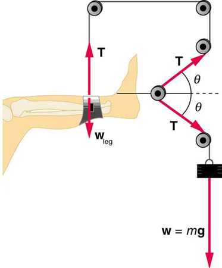

* Define normal and tension forces.
* Apply Newton\'s laws of motion to solve problems involving a variety of forces.
* Use trigonometric identities to resolve weight into components.

Forces are given many names, such as push, pull, thrust, lift, weight, friction, and tension. Traditionally, forces have been grouped into several categories and given names relating to their source, how they are transmitted, or their effects. The most important of these categories are discussed in this section, together with some interesting applications. Further examples of forces are discussed later in this text.

# Normal Force

**Weight**{: data-type="term" #import-auto-id1910210} (also called force of gravity) is a pervasive force that acts at all times and must be counteracted to keep an object from falling. You definitely notice that you must support the weight of a heavy object by pushing up on it when you hold it stationary, as illustrated in [\[link\]](#import-auto-id2672874)(a). But how do inanimate objects like a table support the weight of a mass placed on them, such as shown in [\[link\]](#import-auto-id2672874)(b)? When the bag of dog food is placed on the table, the table actually sags slightly under the load. This would be noticeable if the load were placed on a card table, but even rigid objects deform when a force is applied to them. Unless the object is deformed beyond its limit, it will exert a restoring force much like a deformed spring (or trampoline or diving board). The greater the deformation, the greater the restoring force. So when the load is placed on the table, the table sags until the restoring force becomes as large as the weight of the load. At this point the net external force on the load is zero. That is the situation when the load is stationary on the table. The table sags quickly, and the sag is slight so we do not notice it. But it is similar to the sagging of a trampoline when you climb onto it.

![A person is holding a bag of dog food at some height from a table. He is exerting a force F sub hand, shown by a vector arrow in upward direction, and the weight W of the bag is acting downward, shown by a vector arrow having the same length as vector F sub hand. In a free-body diagram two forces are acting on the red point; one is F sub hand, shown by a vector arrow upward, and another is the weight W, shown by a vector arrow having the same length as vector F sub hand but pointing downward. (b) The bag of dog food is on the table, which deforms due to the weight W, shown by a vector arrow downward; the normal force N is shown by a vector arrow pointing upward having the same length as W. In the free-body diagram, vector W is shown by an arrow downward and vector N is shown by an arrow having the same length as vector W but pointing upward.](../resources/Figure_04_05_01.jpg "(a) The person holding the bag of dog food must supply an upward force Fhand size 12{F rSub { size 8{&quot;hand&quot;} } } {} equal in magnitude and opposite in direction to the weight of the food w size 12{w} {}. (b) The card table sags when the dog food is placed on it, much like a stiff trampoline. Elastic restoring forces in the table grow as it sags until they supply a force N size 12{N} {} equal in magnitude and opposite in direction to the weight of the load."){: #import-auto-id2672874}

We must conclude that whatever supports a load, be it animate or not, must supply an upward force equal to the weight of the load, as we assumed in a few of the previous examples. If the force supporting a load is perpendicular to the surface of contact between the load and its support, this force is defined to be a **normal force**{: data-type="term" #import-auto-id1254224}**** and here is given the symbol <math xmlns="http://www.w3.org/1998/Math/MathML"><semantics><mrow><mrow><mtext mathvariant="bold">N</mtext></mrow><mrow /></mrow><annotation encoding="StarMath 5.0"> size 12{N} {}</annotation></semantics></math>

. (This is not the unit for force N.) The word *normal*{::}** means perpendicular to a surface. The normal force can be less than the object’s weight if the object is on an incline, as you will see in the next example.

Common Misconception: Normal Force (N) vs. Newton (N)

In this section we have introduced the quantity normal force, which is represented by the variable <math xmlns="http://www.w3.org/1998/Math/MathML"><semantics><mrow><mrow><mtext mathvariant="bold">N</mtext></mrow><mrow /></mrow><annotation encoding="StarMath 5.0"> size 12{N} {}</annotation></semantics></math>

. This should not be confused with the symbol for the newton, which is also represented by the letter N. These symbols are particularly important to distinguish because the units of a normal force (<math xmlns="http://www.w3.org/1998/Math/MathML"><semantics><mrow><mrow><mtext mathvariant="bold">N</mtext></mrow><mrow /></mrow><annotation encoding="StarMath 5.0"> size 12{N} {}</annotation></semantics></math>

) happen to be newtons (N). For example, the normal force <math xmlns="http://www.w3.org/1998/Math/MathML"><semantics><mrow><mrow><mtext mathvariant="bold">N</mtext></mrow><mrow /></mrow><annotation encoding="StarMath 5.0"> size 12{N} {}</annotation></semantics></math>

 that the floor exerts on a chair might be <math xmlns="http://www.w3.org/1998/Math/MathML"><semantics><mrow><mrow><mrow><mrow><mtext mathvariant="bold">N</mtext><mo stretchy="false">=</mo><mtext>100 N</mtext></mrow></mrow></mrow><mrow /></mrow><annotation encoding="StarMath 5.0"> size 12{N="100"" N"} {}</annotation></semantics></math>

. One important difference is that normal force is a vector, while the newton is simply a unit. Be careful not to confuse these letters in your calculations! You will encounter more similarities among variables and units as you proceed in physics. Another example of this is the quantity work (<math xmlns="http://www.w3.org/1998/Math/MathML"><semantics><mrow><mrow><mi>W</mi></mrow><mrow /></mrow><annotation encoding="StarMath 5.0"> size 12{W} {}</annotation></semantics></math>

) and the unit watts (W).

Weight on an Incline, a Two-Dimensional Problem

Consider the skier on a slope shown in [\[link\]](#import-auto-id2149297). Her mass including equipment is 60.0 kg. (a) What is her acceleration if friction is negligible? (b) What is her acceleration if friction is known to be 45.0 N?

![A skier is skiing down the slope and the slope makes a twenty-five degree angle with the horizontal. Her weight W, shown by a vector vertically downward, breaks into two components&#x2014;one is W parallel, which is shown by a vector arrow parallel to the slope, and the other is W perpendicular, shown by a vector arrow perpendicular to the slope in the downward direction. Vector N is represented by an arrow pointing upward and perpendicular to the slope, having the same length as W perpendicular. Friction vector f is represented by an arrow along the slope in the uphill direction. IIn a free-body diagram, the vector arrow W for weight is acting downward, the vector arrow for f is shown along the direction of the slope, and the vector arrow for N is shown perpendicular to the slope.](../resources/Figure_04_05_02.jpg "Since motion and friction are parallel to the slope, it is most convenient to project all forces onto a coordinate system where one axis is parallel to the slope and the other is perpendicular (axes shown to left of skier). N size 12{N} {} is perpendicular to the slope and f is parallel to the slope, but w size 12{w} {} has components along both axes, namely w&#x22A5; size 12{w rSub { size 8{ ortho } } } {} and w&#x2225; . N size 12{N} {} is equal in magnitude to w&#x22A5; size 12{w rSub { size 8{ ortho } } } {}, so that there is no motion perpendicular to the slope, but f size 12{f} {} is less than w&#x2225;  size 12{w rSub { size 8{ \lline  \lline } } } {}, so that there is a downslope acceleration (along the parallel axis)."){: #import-auto-id2149297}

**Strategy**

This is a two-dimensional problem, since the forces on the skier (the system of interest) are not parallel. The approach we have used in two-dimensional kinematics also works very well here. Choose a convenient coordinate system and project the vectors onto its axes, creating *two* connected *one*-dimensional problems to solve. The most convenient coordinate system for motion on an incline is one that has one coordinate parallel to the slope and one perpendicular to the slope. (Remember that motions along mutually perpendicular axes are independent.) We use the symbols <math xmlns="http://www.w3.org/1998/Math/MathML"><semantics><mrow><mrow><mo>⊥</mo></mrow><mrow /></mrow><annotation encoding="StarMath 5.0"> size 12{ ortho } {}</annotation></semantics></math>

 and <math xmlns="http://www.w3.org/1998/Math/MathML"><semantics><mrow><mrow><mrow><mo stretchy="false">∥ </mo></mrow></mrow><mrow /></mrow><annotation encoding="StarMath 5.0"> size 12{ \lline \lline } {}</annotation></semantics></math>

 to represent perpendicular and parallel, respectively. This choice of axes simplifies this type of problem, because there is no motion perpendicular to the slope and because friction is always parallel to the surface between two objects. The only external forces acting on the system are the skier’s weight, friction, and the support of the slope, respectively labeled <math xmlns="http://www.w3.org/1998/Math/MathML"><semantics><mrow><mrow><mtext mathvariant="bold">w</mtext></mrow><mrow /></mrow><annotation encoding="StarMath 5.0"> size 12{w} {}</annotation></semantics></math>

, <math xmlns="http://www.w3.org/1998/Math/MathML"><semantics><mrow><mrow><mtext mathvariant="bold">f</mtext></mrow><mrow /></mrow><annotation encoding="StarMath 5.0"> size 12{f} {}</annotation></semantics></math>

, and <math xmlns="http://www.w3.org/1998/Math/MathML"><semantics><mrow><mrow><mtext mathvariant="bold">N</mtext></mrow><mrow /></mrow><annotation encoding="StarMath 5.0"> size 12{N} {}</annotation></semantics></math>

 in [\[link\]](#import-auto-id2149297). <math xmlns="http://www.w3.org/1998/Math/MathML"><semantics><mrow><mrow><mtext mathvariant="bold">N</mtext></mrow><mrow /></mrow><annotation encoding="StarMath 5.0"> size 12{N} {}</annotation></semantics></math>

**** is always perpendicular to the slope, and <math xmlns="http://www.w3.org/1998/Math/MathML"><semantics><mrow><mrow><mtext mathvariant="bold">f</mtext></mrow><mrow /></mrow><annotation encoding="StarMath 5.0"> size 12{f} {}</annotation></semantics></math>

**** is parallel to it. But <math xmlns="http://www.w3.org/1998/Math/MathML"><semantics><mrow><mrow><mtext mathvariant="bold">w</mtext></mrow><mrow /></mrow><annotation encoding="StarMath 5.0"> size 12{w} {}</annotation></semantics></math>

 is not in the direction of either axis, and so the first step we take is to project it into components along the chosen axes, defining <math xmlns="http://www.w3.org/1998/Math/MathML"><semantics><mrow><mrow><msub><mi>w</mi><mrow><mrow><mo stretchy="false">∥ </mo></mrow></mrow></msub></mrow></mrow><annotation encoding="StarMath 5.0"> size 12{w rSub { size 8{ \lline \lline } } } {}</annotation></semantics></math>

 to be the component of weight parallel to the slope and <math xmlns="http://www.w3.org/1998/Math/MathML"><semantics><mrow><mrow><msub><mi>w</mi><mrow><mo>⊥</mo></mrow></msub></mrow><mrow /></mrow><annotation encoding="StarMath 5.0"> size 12{w rSub { size 8{ ortho } } } {}</annotation></semantics></math>

 the component of weight perpendicular to the slope. Once this is done, we can consider the two separate problems of forces parallel to the slope and forces perpendicular to the slope.

**Solution**

The magnitude of the component of the weight parallel to the slope is <math xmlns="http://www.w3.org/1998/Math/MathML"><semantics><mrow><mrow><mrow><mrow><msub><mi>w</mi><mrow><mrow><mo stretchy="false">∥ </mo></mrow></mrow></msub><mo stretchy="false">=</mo><mi mathvariant="italic">w</mi><mspace width="0.25em" /></mrow><mtext>sin</mtext><mspace width="0.25em" /><mo stretchy="false">(</mo><mtext>25º</mtext><mrow><mo stretchy="false">)</mo><mo stretchy="false">=</mo><mrow><mi mathvariant="italic">mg</mi><mspace width="0.25em" /></mrow></mrow><mtext>sin</mtext><mspace width="0.25em" /><mo stretchy="false">(</mo><mtext>25º</mtext><mo stretchy="false">)</mo></mrow></mrow><mrow /></mrow><annotation encoding="StarMath 5.0"> size 12{w rSub { size 8{ \lline \lline } } =w"sin" \( "25"° \) = ital "mg""sin" \( "25"° \) } {}</annotation></semantics></math>

, and the magnitude of the component of the weight perpendicular to the slope is <math xmlns="http://www.w3.org/1998/Math/MathML"><semantics><mrow><mrow><mrow><mrow><msub><mi>w</mi><mrow><mo>⊥</mo></mrow></msub><mo stretchy="false">=</mo><mi mathvariant="italic">w</mi><mspace width="0.25em" /></mrow><mtext>cos</mtext><mspace width="0.25em" /><mo stretchy="false">(</mo><mtext>25º</mtext><mrow><mo stretchy="false">)</mo><mo stretchy="false">=</mo><mrow><mi mathvariant="italic">mg</mi><mspace width="0.25em" /></mrow></mrow><mtext>cos</mtext><mspace width="0.25em" /><mo stretchy="false">(</mo><mtext>25º</mtext><mo stretchy="false">)</mo></mrow></mrow><mrow /></mrow><annotation encoding="StarMath 5.0"> size 12{w rSub { size 8{ ortho } } =w"cos" \( "25"° \) = ital "mg""cos" \( "25"° \) } {}</annotation></semantics></math>

.

(a) Neglecting friction. Since the acceleration is parallel to the slope, we need only consider forces parallel to the slope. (Forces perpendicular to the slope add to zero, since there is no acceleration in that direction.) The forces parallel to the slope are the amount of the skier’s weight parallel to the slope <math xmlns="http://www.w3.org/1998/Math/MathML"><semantics><mrow><mrow><msub><mi>w</mi><mrow><mrow><mo stretchy="false">∥ </mo></mrow></mrow></msub></mrow><mrow /></mrow><annotation encoding="StarMath 5.0"> size 12{w rSub { size 8{ \lline \lline } } } {}</annotation></semantics></math>

 and friction <math xmlns="http://www.w3.org/1998/Math/MathML"><semantics><mrow><mrow><mi>f</mi></mrow><mrow /></mrow><annotation encoding="StarMath 5.0"> size 12{f} {}</annotation></semantics></math>

. Using Newton’s second law, with subscripts to denote quantities parallel to the slope,

<math xmlns="http://www.w3.org/1998/Math/MathML"> <semantics> <mrow><mrow><mrow> <msub> <mi>a</mi> <mrow> <mrow> <mo stretchy="false">∥ </mo> </mrow> </mrow> </msub> <mo stretchy="false">=</mo> <mfrac> <msub> <mi>F</mi> <mrow> <mrow> <mtext>net </mtext> <mo stretchy="false">∥ </mo> </mrow> </mrow> </msub> <mi>m</mi> </mfrac> </mrow></mrow></mrow> </semantics> </math>

where <math xmlns="http://www.w3.org/1998/Math/MathML"><semantics><mrow><mrow><mrow><mrow><mrow><msub><mi>F</mi><mrow><mrow><mtext>net </mtext><mo stretchy="false">∥ </mo></mrow></mrow></msub><mo stretchy="false">=</mo><msub><mi>w</mi><mrow><mrow><mo stretchy="false">∥ </mo></mrow></mrow></msub></mrow><mo stretchy="false">=</mo><mstyle fontstyle="italic"><mrow><mtext>mg</mtext></mrow></mstyle><mspace width="0.25em" /></mrow><mtext>sin</mtext><mspace width="0.25em" /><mo stretchy="false">(</mo><mtext>25º</mtext><mo stretchy="false">)</mo></mrow></mrow><mrow /></mrow><annotation encoding="StarMath 5.0"> size 12{F rSub { size 8{"net " \lline \lline } } =w rSub { size 8{ \lline \lline } } = ital "mg""sin" \( "25"° \) } {}</annotation></semantics></math>

, assuming no friction for this part, so that

<math xmlns="http://www.w3.org/1998/Math/MathML"> <semantics> <mrow> <mrow> <msub> <mi>a</mi> <mrow> <mrow> <mo stretchy="false">∥ </mo> </mrow> </mrow> </msub> <mo stretchy="false">=</mo> <mfrac> <msub> <mi>F</mi> <mrow> <mrow> <mtext>net </mtext> <mo stretchy="false">∥ </mo> </mrow> </mrow> </msub> <mi>m</mi> </mfrac> <mo stretchy="false">=</mo> <mfrac> <mrow> <mstyle fontstyle="italic"> <mrow> <mtext>mg</mtext> </mrow> </mstyle><mspace width="0.25em" /> <mtext>sin</mtext><mspace width="0.25em" /> <mo stretchy="false">(</mo> <mtext>25º</mtext> <mo stretchy="false">)</mo> </mrow> <mi>m</mi> </mfrac> <mo stretchy="false">=</mo> <mi>g</mi><mspace width="0.25em" /> <mtext>sin</mtext><mspace width="0.25em" /> <mo stretchy="false">(</mo> <mtext>25º</mtext> <mo stretchy="false">)</mo> </mrow> </mrow> </semantics> </math>

<math xmlns="http://www.w3.org/1998/Math/MathML"> <semantics> <mrow> <mrow> <mo stretchy="false">(</mo> <mn>9.80</mn><mspace width="0.25em" /> <msup> <mtext> m/s</mtext> <mrow> <mn>2</mn> </mrow> </msup> <mo stretchy="false">)</mo> <mo stretchy="false">(</mo> <mn>0.4226</mn> <mo stretchy="false">)</mo> <mo stretchy="false">=</mo> <mn>4.14</mn><mspace width="0.25em" /> <msup> <mtext>m/s</mtext> <mrow> <mn>2</mn> </mrow> </msup> </mrow> </mrow> </semantics> </math>

is the acceleration.

(b) Including friction. We now have a given value for friction, and we know its direction is parallel to the slope and it opposes motion between surfaces in contact. So the net external force is now

<math xmlns="http://www.w3.org/1998/Math/MathML"><semantics><mrow><mrow><mrow><msub><mi>F</mi><mrow><mrow><mtext>net </mtext><mo stretchy="false">∥ </mo></mrow></mrow></msub><mo stretchy="false">=</mo><mrow><msub><mi>w</mi><mrow><mrow><mo stretchy="false">∥ </mo></mrow></mrow></msub><mo stretchy="false">−</mo><mi>f</mi></mrow></mrow></mrow><mrow /></mrow><annotation encoding="StarMath 5.0"> size 12{F rSub { size 8{"net " \lline \lline } } =w rSub { size 8{ \lline \lline } } - f} {}</annotation></semantics><mo>,</mo></math>

and substituting this into Newton’s second law, <math xmlns="http://www.w3.org/1998/Math/MathML"><semantics><mrow><mrow><mrow><msub><mi>a</mi><mrow><mrow><mo stretchy="false">∥ </mo></mrow></mrow></msub><mo stretchy="false">=</mo><mfrac><msub><mi>F</mi><mrow><mrow><mtext>net </mtext><mo stretchy="false">∥ </mo></mrow></mrow></msub><mi>m</mi></mfrac></mrow></mrow><mrow /></mrow><annotation encoding="StarMath 5.0"> size 12{a rSub { size 8{ \lline \lline } } = { {F rSub { size 8{"net " \lline \lline } } } over {m} } } {}</annotation></semantics></math>

**, gives

<math xmlns="http://www.w3.org/1998/Math/MathML"><semantics><mrow><mrow><mrow><mrow><mrow><msub><mi>a</mi><mrow><mrow><mo stretchy="false">∥ </mo></mrow></mrow></msub><mo stretchy="false">=</mo><mfrac><msub><mi>F</mi><mrow><mrow><mtext>net </mtext><mo stretchy="false">∣</mo><mo stretchy="false">∣</mo></mrow></mrow></msub><mi>m</mi></mfrac></mrow><mo stretchy="false">=</mo><mfrac><mrow><msub><mi>w</mi><mrow><mrow><mo stretchy="false">∥ </mo></mrow></mrow></msub><mo stretchy="false">−</mo><mi>f</mi></mrow><mi>m</mi></mfrac></mrow><mo stretchy="false">=</mo><mfrac><mrow><mstyle fontstyle="italic"><mrow><mtext>mg</mtext><mspace width="0.25em" /></mrow></mstyle><mtext>sin</mtext><mspace width="0.25em" /><mo stretchy="false">(</mo><mtext>25º</mtext><mrow><mo stretchy="false">)</mo><mo stretchy="false">−</mo><mi>f</mi></mrow></mrow><mi>m</mi></mfrac></mrow></mrow><mrow /></mrow><annotation encoding="StarMath 5.0"> size 12{a rSub { size 8{ \lline \lline } } = { {F rSub { size 8{"net " \lline \lline } } } over {m} } = { {w rSub { size 8{ \lline \lline } } - f} over {m} } = { { ital "mg""sin" \( "25"° \) - f} over {m} } } {}</annotation></semantics><mo>.</mo></math>

We substitute known values to obtain

<math xmlns="http://www.w3.org/1998/Math/MathML"><semantics><mrow><mrow><mrow><msub><mi>a</mi><mrow><mrow><mo stretchy="false">∥ </mo></mrow></mrow></msub><mo stretchy="false">=</mo><mfrac><mrow><mo stretchy="false">(</mo><mtext>60</mtext><mtext>.</mtext><mtext>0 kg</mtext><mo stretchy="false">)</mo><mo stretchy="false">(</mo><mn>9</mn><mtext>.</mtext><msup><mtext>80 m/s</mtext><mrow><mn>2</mn></mrow></msup><mo stretchy="false">)</mo><mo stretchy="false">(</mo><mn>0</mn><mtext>.</mtext><mtext>4226</mtext><mrow><mo stretchy="false">)</mo><mo stretchy="false">−</mo><mtext>45</mtext></mrow><mtext>.</mtext><mtext>0 N</mtext></mrow><mrow><mtext>60</mtext><mtext>.</mtext><mtext>0 kg</mtext></mrow></mfrac></mrow></mrow><mrow /></mrow><annotation encoding="StarMath 5.0"> size 12{a rSub { size 8{ \lline \lline } } = { { \( "60" "." "0 kg" \) \( 9 "." "80 m/s" rSup { size 8{2} } \) \( 0 "." "4226" \) - "45" "." "0 N"} over {"60" "." "0 kg"} } } {}</annotation></semantics><mo /><mo>,</mo></math>

which yields

<math xmlns="http://www.w3.org/1998/Math/MathML"><semantics><mrow><mrow><mrow><mrow><msub><mi>a</mi><mrow><mrow><mo stretchy="false">∥ </mo></mrow></mrow></msub><mo stretchy="false">=</mo><mn>3</mn></mrow><mtext>.</mtext><msup><mtext>39 m/s</mtext><mrow><mn>2</mn></mrow></msup></mrow></mrow><mrow /></mrow><annotation encoding="StarMath 5.0"> size 12{a rSub { size 8{ \lline \lline } } =3 "." "39 m/s" rSup { size 8{2} } } {}</annotation></semantics><mo>,</mo></math>

which is the acceleration parallel to the incline when there is 45.0 N of opposing friction.

**Discussion**

Since friction always opposes motion between surfaces, the acceleration is smaller when there is friction than when there is none. In fact, it is a general result that if friction on an incline is negligible, then the acceleration down the incline is <math xmlns="http://www.w3.org/1998/Math/MathML"><semantics><mrow><mrow><mrow><mrow><mi>a</mi><mo stretchy="false">=</mo><mi>g</mi><mspace width="0.25em" /></mrow><mtext>sin</mtext><mi>θ</mi></mrow></mrow><mrow /></mrow><annotation encoding="StarMath 5.0"> size 12{a=g"sin"θ} {}</annotation></semantics></math>

, *regardless of mass*. This is related to the previously discussed fact that all objects fall with the same acceleration in the absence of air resistance. Similarly, all objects, regardless of mass, slide down a frictionless incline with the same acceleration (if the angle is the same).

Resolving Weight into Components

![Vector arrow W for weight is acting downward. It is resolved into components that are parallel and perpendicular to a surface that has a slope at angle theta to the horizontal. The coordinate direction x is labeled parallel to the sloped surface, with positive x pointing uphill. The coordinate direction y is labeled perpendicular to the sloped surface, with positive y pointing up from the surface. The components of w are w parallel, represented by an arrow pointing downhill along the sloped surface, and w perpendicular, represented by an arrow pointing into the sloped surface. W parallel is equal to w sine theta, which is equal to m g sine theta. W perpendicular is equal to w cosine theta, which is equal to m g cosine theta.](../resources/Figure_04_05_03.jpg "An object rests on an incline that makes an angle &#x3B8; with the horizontal."){: #import-auto-id1795220}

When an object rests on an incline that makes an angle <math xmlns="http://www.w3.org/1998/Math/MathML"><semantics><mrow><mrow><mi>θ</mi></mrow><mrow /></mrow><annotation encoding="StarMath 5.0"> size 12{θ} {}</annotation></semantics></math>

 with the horizontal, the force of gravity acting on the object is divided into two components: a force acting perpendicular to the plane, <math xmlns="http://www.w3.org/1998/Math/MathML"><semantics><mrow><mrow><msub><mtext mathvariant="bold">w</mtext><mrow><mo>⊥</mo></mrow></msub></mrow><mrow /></mrow><annotation encoding="StarMath 5.0"> size 12{w rSub { size 8{ ortho } } } {}</annotation></semantics></math>

**,**{::}**** and a force acting parallel to the plane, <math xmlns="http://www.w3.org/1998/Math/MathML"><semantics><mrow><mrow><msub><mtext mathvariant="bold">w</mtext><mrow><mrow><mo stretchy="false">∥ </mo></mrow></mrow></msub></mrow><mrow /></mrow><annotation encoding="StarMath 5.0"> size 12{w rSub { size 8{ \lline \lline } } } {}</annotation></semantics></math>

. The perpendicular force of weight, <math xmlns="http://www.w3.org/1998/Math/MathML"><semantics><mrow><mrow><msub><mtext mathvariant="bold">w</mtext><mrow><mo>⊥</mo></mrow></msub></mrow><mrow /></mrow><annotation encoding="StarMath 5.0"> size 12{w rSub { size 8{ ortho } } } {}</annotation></semantics></math>

**,**{::}**** is typically equal in magnitude and opposite in direction to the normal force, <math xmlns="http://www.w3.org/1998/Math/MathML"><semantics><mrow><mrow><mtext mathvariant="bold">N</mtext></mrow><mrow /></mrow><annotation encoding="StarMath 5.0"> size 12{N} {}</annotation></semantics></math>

. The force acting parallel to the plane, <math xmlns="http://www.w3.org/1998/Math/MathML"><semantics><mrow><mrow><msub><mtext mathvariant="bold">w</mtext><mrow><mrow><mo stretchy="false">∥ </mo></mrow></mrow></msub></mrow><mrow /></mrow><annotation encoding="StarMath 5.0"> size 12{w rSub { size 8{ \lline \lline } } } {}</annotation></semantics></math>

, causes the object to accelerate down the incline. The force of friction, <math xmlns="http://www.w3.org/1998/Math/MathML"><semantics><mrow><mrow><mi mathvariant="bold">f</mi></mrow><mrow /></mrow><annotation encoding="StarMath 5.0"> size 12{f} {}</annotation></semantics></math>

, opposes the motion of the object, so it acts upward along the plane.

It is important to be careful when resolving the weight of the object into components. If the angle of the incline is at an angle <math xmlns="http://www.w3.org/1998/Math/MathML"><semantics><mrow><mrow><mi>θ</mi></mrow><mrow /></mrow><annotation encoding="StarMath 5.0"> size 12{θ} {}</annotation></semantics></math>

 to the horizontal, then the magnitudes of the weight components are

<math xmlns="http://www.w3.org/1998/Math/MathML"> <semantics> <mrow> <mrow> <mrow> <mrow> <msub> <mi>w</mi> <mrow> <mrow> <mo stretchy="false">∥ </mo> </mrow> </mrow> </msub> <mo stretchy="false">=</mo> <mi>w</mi><mspace width="0.25em" /> </mrow> <mtext>sin</mtext><mspace width="0.25em" /> <mo stretchy="false">(</mo> <mi>θ</mi> <mrow> <mo stretchy="false">)</mo> <mo stretchy="false">=</mo> <mstyle fontstyle="italic"> <mrow> <mtext>mg</mtext><mspace width="0.25em" /> </mrow> </mstyle> </mrow> <mtext>sin</mtext><mspace width="0.25em" /> <mo stretchy="false">(</mo> <mi>θ</mi> <mo stretchy="false">)</mo> </mrow> </mrow> <mrow /> </mrow> <annotation encoding="StarMath 5.0"> size 12{w rSub { size 8{ \lline \lline } } =w"sin" \( θ \) = ital "mg""sin" \( θ \) " "} {}</annotation> </semantics> </math>

and

<math xmlns="http://www.w3.org/1998/Math/MathML"><semantics><mrow><mrow><mrow><mrow><msub><mi>w</mi><mrow><mo>⊥</mo></mrow></msub><mo stretchy="false">=</mo><mi>w</mi><mspace width="0.25em" /></mrow><mtext>cos</mtext><mspace width="0.25em" /><mo stretchy="false">(</mo><mi>θ</mi><mrow><mo stretchy="false">)</mo><mo stretchy="false">=</mo><mstyle fontstyle="italic"><mrow><mtext>mg</mtext></mrow></mstyle><mspace width="0.25em" /></mrow><mtext>cos</mtext><mspace width="0.25em" /><mo stretchy="false">(</mo><mi>θ</mi><mo stretchy="false">)</mo></mrow></mrow><mrow /></mrow><annotation encoding="StarMath 5.0"> size 12{w rSub { size 8{ ortho } } =w"cos" \( θ \) = ital "mg""cos" \( θ \) } {}</annotation></semantics><mo>.</mo></math>

Instead of memorizing these equations, it is helpful to be able to determine them from reason. To do this, draw the right triangle formed by the three weight vectors. Notice that the angle <math xmlns="http://www.w3.org/1998/Math/MathML"><semantics><mrow><mrow><mi>θ</mi></mrow><mrow /></mrow><annotation encoding="StarMath 5.0"> size 12{θ} {}</annotation></semantics></math>

 of the incline is the same as the angle formed between <math xmlns="http://www.w3.org/1998/Math/MathML"><semantics><mrow><mrow><mtext mathvariant="bold">w</mtext></mrow><mrow /></mrow><annotation encoding="StarMath 5.0"> size 12{w} {}</annotation></semantics></math>

**** and <math xmlns="http://www.w3.org/1998/Math/MathML"><semantics><mrow><mrow><msub><mtext mathvariant="bold">w</mtext><mrow><mo>⊥</mo></mrow></msub></mrow><mrow /></mrow><annotation encoding="StarMath 5.0"> size 12{w rSub { size 8{ ortho } } } {}</annotation></semantics></math>

****. Knowing this property, you can use trigonometry to determine the magnitude of the weight components:

<math xmlns="http://www.w3.org/1998/Math/MathML"> <semantics> <mrow> <mrow> <mtable columnalign="left"> <mtr> <mtd> <mtext>cos</mtext><mspace width="0.25em" /> <mo stretchy="false">(</mo> <mi>θ</mi> <mo stretchy="false">)</mo> </mtd> <mtd> <mo stretchy="false">=</mo> </mtd> <mtd> <mfrac> <msub> <mi>w</mi> <mrow> <mo>⊥</mo> </mrow> </msub> <mi>w</mi> </mfrac> </mtd> </mtr> <mtr> <mtd> <msub> <mi>w</mi> <mrow> <mo>⊥</mo> </mrow> </msub> </mtd> <mtd> <mo stretchy="false">=</mo> </mtd> <mtd> <mi>w</mi><mspace width="0.25em" /> <mtext>cos</mtext><mspace width="0.25em" /> <mo stretchy="false">(</mo> <mi>θ</mi> <mrow> <mo stretchy="false">)</mo> <mo stretchy="false">=</mo> <mstyle fontstyle="italic"> <mrow> <mtext>mg</mtext><mspace width="0.25em" /> </mrow> </mstyle> </mrow> <mtext>cos</mtext><mspace width="0.25em" /> <mo stretchy="false">(</mo> <mi>θ</mi> <mo stretchy="false">)</mo> </mtd> </mtr> </mtable> <mrow /> </mrow> </mrow> <annotation encoding="StarMath 5.0">alignl { stack { size 12{"cos" \( θ \) = { {w rSub { size 8{ ortho } } } over {w} } } {} # w rSub { size 8{ ortho } } =w"cos" \( θ \) = ital "mg""cos" \( θ \) {} } } {}</annotation> </semantics> </math>

<math xmlns="http://www.w3.org/1998/Math/MathML"> <semantics> <mrow> <mrow> <mtable columnalign="left"> <mtr> <mtd> <mtext>sin</mtext><mspace width="0.25em" /> <mo stretchy="false">(</mo> <mi>θ</mi> <mo stretchy="false">)</mo> </mtd> <mtd> <mo stretchy="false">=</mo> </mtd> <mtd> <mfrac> <msub> <mi>w</mi> <mrow> <mrow> <mo stretchy="false">∥ </mo> </mrow> </mrow> </msub> <mi>w</mi> </mfrac> </mtd> </mtr> <mtr> <mtd> <msub> <mi>w</mi> <mrow> <mrow> <mo stretchy="false">∥ </mo> </mrow> </mrow> </msub> </mtd> <mtd> <mo stretchy="false">=</mo> </mtd> <mtd> <mi>w</mi><mspace width="0.25em" /> <mtext>sin</mtext><mspace width="0.25em" /> <mo stretchy="false">(</mo> <mi>θ</mi> <mrow> <mo stretchy="false">)</mo> <mo stretchy="false">=</mo> <mstyle fontstyle="italic"> <mrow> <mtext>mg</mtext><mspace width="0.25em" /> </mrow> </mstyle> </mrow> <mtext>sin</mtext><mspace width="0.25em" /> <mo stretchy="false">(</mo> <mi>θ</mi> <mo stretchy="false">)</mo> <mrow /> </mtd> </mtr> </mtable> <mrow /> </mrow> </mrow> <annotation encoding="StarMath 5.0">alignl { stack { size 12{"sin" \( θ \) = { {w rSub { size 8{ \lline \lline } } } over {w} } } {} # w rSub { size 8{ \lline \lline } } =w"sin" \( θ \) = ital "mg""sin" \( θ \) {} } } {}</annotation> </semantics> </math>

Take-Home Experiment: Force Parallel

To investigate how a force parallel to an inclined plane changes, find a rubber band, some objects to hang from the end of the rubber band, and a board you can position at different angles. How much does the rubber band stretch when you hang the object from the end of the board? Now place the board at an angle so that the object slides off when placed on the board. How much does the rubber band extend if it is lined up parallel to the board and used to hold the object stationary on the board? Try two more angles. What does this show?

# Tension

A **tension**{: data-type="term" #import-auto-id1608257}**** is a force along the length of a medium, especially a force carried by a flexible medium, such as a rope or cable. The word “tension<em>” </em>comes from a Latin word meaning “to stretch.” Not coincidentally, the flexible cords that carry muscle forces to other parts of the body are called *tendons*. Any flexible connector, such as a string, rope, chain, wire, or cable, can exert pulls only parallel to its length; thus, a force carried by a flexible connector is a tension with direction parallel to the connector. It is important to understand that tension is a pull in a connector. In contrast, consider the phrase: “You can’t push a rope.” The tension force pulls outward along the two ends of a rope.

Consider a person holding a mass on a rope as shown in [\[link\]](#import-auto-id2715102).

  such as this rope transmits a force T size 12{T} {}, that force must be parallel to the length of the rope, as shown. The pull such a flexible connector exerts is a tension. Note that the rope pulls with equal force but in opposite directions on the hand and the supported mass (neglecting the weight of the rope). This is an example of Newton&#x2019;s third law. The rope is the medium that carries the equal and opposite forces between the two objects. The tension anywhere in the rope between the hand and the mass is equal. Once you have determined the tension in one location, you have determined the tension at all locations along the rope."){: #import-auto-id2715102}

Tension in the rope must equal the weight of the supported mass, as we can prove using Newton’s second law. If the 5.00-kg mass in the figure is stationary, then its acceleration is zero, and thus <math xmlns="http://www.w3.org/1998/Math/MathML"><semantics><mrow><mrow><mrow><msub><mtext mathvariant="bold">F</mtext><mrow><mtext>net</mtext></mrow></msub><mo stretchy="false">=</mo><mn>0</mn></mrow></mrow><mrow /></mrow><annotation encoding="StarMath 5.0"> size 12{F rSub { size 8{"net"} } =0} {}</annotation></semantics></math>

. The only external forces acting on the mass are its weight <math xmlns="http://www.w3.org/1998/Math/MathML"><semantics><mrow><mrow><mtext mathvariant="bold">w</mtext></mrow><mrow /></mrow><annotation encoding="StarMath 5.0"> size 12{w} {}</annotation></semantics></math>

**** and the tension <math xmlns="http://www.w3.org/1998/Math/MathML"><semantics><mrow><mrow><mtext mathvariant="bold">T</mtext></mrow><mrow /></mrow><annotation encoding="StarMath 5.0"> size 12{T} {}</annotation></semantics></math>

 supplied by the rope. Thus,

<math xmlns="http://www.w3.org/1998/Math/MathML"><semantics><mrow><mrow><mrow><mrow><msub><mi>F</mi><mrow><mtext>net</mtext></mrow></msub><mo stretchy="false">=</mo><mrow><mi>T</mi><mo stretchy="false">−</mo><mi>w</mi></mrow></mrow><mo stretchy="false">=</mo><mn>0</mn></mrow></mrow><mrow /></mrow><annotation encoding="StarMath 5.0"> size 12{F rSub { size 8{"net"} } =T - w=0} {}</annotation></semantics><mo>,</mo></math>

where <math xmlns="http://www.w3.org/1998/Math/MathML"><semantics><mrow><mrow><mi>T</mi></mrow><mrow /></mrow><annotation encoding="StarMath 5.0"> size 12{T} {}</annotation></semantics></math>

** and <math xmlns="http://www.w3.org/1998/Math/MathML"><semantics><mrow><mrow><mi>w</mi></mrow><mrow /></mrow><annotation encoding="StarMath 5.0"> size 12{w} {}</annotation></semantics></math>

** are the magnitudes of the tension and weight and their signs indicate direction, with up being positive here. Thus, just as you would expect, the tension equals the weight of the supported mass:

<math xmlns="http://www.w3.org/1998/Math/MathML"><semantics><mrow><mrow><mrow><mrow><mi>T</mi><mo stretchy="false">=</mo><mi>w</mi></mrow><mo stretchy="false">=</mo><mstyle fontstyle="italic"><mrow><mtext>mg</mtext></mrow></mstyle></mrow></mrow><mrow /></mrow><annotation encoding="StarMath 5.0"> size 12{T=w= ital "mg"} {}</annotation></semantics><mo>.</mo></math>

For a 5.00-kg mass, then (neglecting the mass of the rope) we see that

<math xmlns="http://www.w3.org/1998/Math/MathML"><semantics><mrow><mrow><mrow><mrow><mrow><mi>T</mi><mo stretchy="false">=</mo><mstyle fontstyle="italic"><mrow><mtext>mg</mtext></mrow></mstyle></mrow><mo stretchy="false">=</mo><mo stretchy="false">(</mo></mrow><mtext>5.00 kg</mtext><mo stretchy="false">)</mo><mo stretchy="false">(</mo><mn>9</mn><mtext>.</mtext><msup><mtext>80 m/s</mtext><mrow><mn>2</mn></mrow></msup><mrow><mo stretchy="false">)</mo><mo stretchy="false">=</mo></mrow><mtext>49.0 N</mtext></mrow></mrow><mrow /></mrow><annotation encoding="StarMath 5.0"> size 12{T= ital "mg"= \( 5 "." "00"" kg" \) \( 9 "." "80 m/s" rSup { size 8{2} } \) ="49" "." 0" N"} {}</annotation></semantics><mo>.</mo></math>

If we cut the rope and insert a spring, the spring would extend a length corresponding to a force of 49.0 N, providing a direct observation and measure of the tension force in the rope.

Flexible connectors are often used to transmit forces around corners, such as in a hospital traction system, a finger joint, or a bicycle brake cable. If there is no friction, the tension is transmitted undiminished. Only its direction changes, and it is always parallel to the flexible connector. This is illustrated in [\[link\]](#import-auto-id1318288) (a) and (b).

 Tendons in the finger carry force T size 12{T} {} from the muscles to other parts of the finger, usually changing the force&#x2019;s direction, but not its magnitude (the tendons are relatively friction free). (b) The brake cable on a bicycle carries the tension T size 12{T} {} from the handlebars to the brake mechanism. Again, the direction but not the magnitude of T size 12{T} {} is changed. "){: #import-auto-id1318288 height="325"}

What Is the Tension in a Tightrope?

Calculate the tension in the wire supporting the 70.0-kg tightrope walker shown in [\[link\]](#import-auto-id2091042).

![A tightrope walker is walking on a wire. His weight W is acting downward, shown by a vector arrow. The wire sags and makes a five-degree angle with the horizontal at both ends. T sub R, shown by a vector arrow, is toward the right along the wire. T sub L is shown by an arrow toward the left along the wire. All three vectors W, T sub L, and T sub R start from the foot of the person on the wire. In a free-body diagram, W is acting downward, T sub R is acting toward the right with a small inclination, and T sub L is acting toward the left with a small inclination.](../resources/Figure_04_05_06.jpg "The weight of a tightrope walker causes a wire to sag by 5.0 degrees. The system of interest here is the point in the wire at which the tightrope walker is standing."){: #import-auto-id2091042}

**Strategy**

As you can see in the figure, the wire is not perfectly horizontal (it cannot be!), but is bent under the person’s weight. Thus, the tension on either side of the person has an upward component that can support his weight. As usual, forces are vectors represented pictorially by arrows having the same directions as the forces and lengths proportional to their magnitudes. The system is the tightrope walker, and the only external forces acting on him are his weight <math xmlns="http://www.w3.org/1998/Math/MathML"><semantics><mrow><mrow><mtext mathvariant="bold">w</mtext></mrow><mrow /></mrow><annotation encoding="StarMath 5.0"> size 12{w} {}</annotation></semantics></math>

 and the two tensions <math xmlns="http://www.w3.org/1998/Math/MathML"><semantics><mrow><mrow><msub><mtext mathvariant="bold">T</mtext><mrow><mtext>L</mtext></mrow></msub></mrow><mrow /></mrow><annotation encoding="StarMath 5.0"> size 12{T rSub { size 8{L} } } {}</annotation></semantics></math>

 (left  tension) and <math xmlns="http://www.w3.org/1998/Math/MathML"><semantics><mrow><mrow><msub><mtext mathvariant="bold">T</mtext><mrow><mtext>R</mtext></mrow></msub></mrow><mrow /></mrow><annotation encoding="StarMath 5.0"> size 12{T rSub { size 8{R} } } {}</annotation></semantics></math>

 (right tension), as illustrated. It is reasonable to neglect the weight of the wire itself. The net external force is zero since the system is stationary. A little trigonometry can now be used to find the tensions. One conclusion is possible at the outset—we can see from part (b) of the figure that the magnitudes of the tensions <math xmlns="http://www.w3.org/1998/Math/MathML"><semantics><mrow><mrow><msub><mi>T</mi><mrow><mtext>L</mtext></mrow></msub></mrow><mrow /></mrow><annotation encoding="StarMath 5.0"> size 12{T rSub { size 8{L} } } {}</annotation></semantics></math>

 and <math xmlns="http://www.w3.org/1998/Math/MathML"><semantics><mrow><mrow><msub><mi>T</mi><mrow><mtext>R</mtext></mrow></msub></mrow><mrow /></mrow><annotation encoding="StarMath 5.0"> size 12{T rSub { size 8{R} } } {}</annotation></semantics></math>

 must be equal. This is because there is no horizontal acceleration in the rope, and the only forces acting to the left and right are <math xmlns="http://www.w3.org/1998/Math/MathML"><semantics><mrow><mrow><msub><mi>T</mi><mrow><mtext>L</mtext></mrow></msub></mrow><mrow /></mrow><annotation encoding="StarMath 5.0"> size 12{T rSub { size 8{L} } } {}</annotation></semantics></math>

 and <math xmlns="http://www.w3.org/1998/Math/MathML"><semantics><mrow><mrow><msub><mi>T</mi><mrow><mi>R</mi></mrow></msub></mrow><mrow /></mrow><annotation encoding="StarMath 5.0"> size 12{T rSub { size 8{R} } } {}</annotation></semantics></math>

. Thus, the magnitude of those forces must be equal so that they cancel each other out.

Whenever we have two-dimensional vector problems in which no two vectors are parallel, the easiest method of solution is to pick a convenient coordinate system and project the vectors onto its axes. In this case the best coordinate system has one axis horizontal and the other vertical. We call the horizontal the <math xmlns="http://www.w3.org/1998/Math/MathML"><semantics><mrow><mrow><mi>x</mi></mrow><mrow /></mrow><annotation encoding="StarMath 5.0"> size 12{x} {}</annotation></semantics></math>

-axis ** and the vertical the <math xmlns="http://www.w3.org/1998/Math/MathML"><semantics><mrow><mrow><mi>y</mi></mrow><mrow /></mrow><annotation encoding="StarMath 5.0"> size 12{y} {}</annotation></semantics></math>

-axis.

**Solution**

First, we need to resolve the tension vectors into their horizontal and vertical components. It helps to draw a new free-body diagram showing all of the horizontal and vertical components of each force acting on the system.

![A vector T sub L making an angle of five degrees with the negative x axis is shown. It has two components, one in the vertical direction, T sub L y, and another horizontal, T sub L x. Another vector is shown making an angle of five degrees with the positive x axis, having two components, one along the y direction, T sub R y, and the other along the x direction, T sub R x. In the free-body diagram, vertical component T sub L y is shown by a vector arrow in the upward direction, T sub R y is shown by a vector arrow in the upward direction, and weight W is shown by a vector arrow in the downward direction. The net force F sub y is equal to zero. In the horizontal direction, T sub R x is shown by a vector arrow pointing toward the right and T sub L x is shown by a vector arrow pointing toward the left, both having the same length so that the net force in the horizontal direction, F sub x, is equal to zero.](../resources/Figure_04_05_07.jpg "When the vectors are projected onto vertical and horizontal axes, their components along those axes must add to zero, since the tightrope walker is stationary. The small angle results in T size 12{T} {} being much greater than w size 12{w} {}."){: #import-auto-id1561864}

Consider the horizontal components of the forces (denoted with a subscript <math xmlns="http://www.w3.org/1998/Math/MathML"><semantics><mrow><mrow><mi>x</mi></mrow><mrow /></mrow><annotation encoding="StarMath 5.0"> size 12{x} {}</annotation></semantics></math>

):

<math xmlns="http://www.w3.org/1998/Math/MathML"> <semantics> <mrow> <mrow> <mrow> <msub> <mi>F</mi> <mrow> <mtext>net </mtext> <mi>x</mi> </mrow> </msub> <mo stretchy="false">=</mo> <mrow> <msub> <mi>T</mi> <mrow> <mtext>L</mtext> <mi>x</mi> </mrow> </msub> <mo stretchy="false">−</mo> <msub> <mi>T</mi> <mrow> <mtext>R</mtext> <mi>x</mi> </mrow> </msub> </mrow> </mrow> </mrow> <mrow /> </mrow> <annotation encoding="StarMath 5.0"> size 12{F rSub { size 8{"net x"} } = T rSub { size 8{"Lx"} } - T rSub { size 8{"Rx"} } } {}</annotation> </semantics> <mo>.</mo> </math>

The net external horizontal force <math xmlns="http://www.w3.org/1998/Math/MathML"><semantics><mrow><mrow><mrow><msub><mi>F</mi><mrow><mtext>net </mtext> <mi>x</mi></mrow></msub><mo stretchy="false">=</mo><mn>0</mn></mrow></mrow><mrow /></mrow><annotation encoding="StarMath 5.0"> size 12{F rSub { size 8{"net x"} } = 0} {}</annotation></semantics></math>

, since the person is stationary. Thus,

<math xmlns="http://www.w3.org/1998/Math/MathML"> <semantics> <mrow> <mrow> <mtable columnalign="left"> <mtr> <mtd> <msub> <mi>F</mi> <mrow> <mtext>net </mtext> <mi>x</mi> </mrow> </msub> <mo stretchy="false">=</mo> <mn>0</mn> </mtd> <mtd> <mo stretchy="false">=</mo> </mtd> <mtd> <mrow> <msub> <mi>T</mi> <mrow> <mtext>L</mtext> <mi>x</mi> </mrow> </msub> <mo stretchy="false">−</mo> <msub> <mi>T</mi> <mrow> <mtext>R</mtext> <mi>x</mi> </mrow> </msub> </mrow> </mtd> </mtr> <mtr> <mtd> <msub> <mi>T</mi> <mrow> <mtext>L</mtext> <mi>x</mi> </mrow> </msub> </mtd> <mtd> <mo stretchy="false">=</mo> </mtd> <mtd> <msub> <mi>T</mi> <mrow> <mtext>R</mtext> <mi>x</mi> </mrow> </msub> <mrow /> <mo>.</mo> </mtd> </mtr> </mtable> <mrow /> </mrow> </mrow> <annotation encoding="StarMath 5.0">alignl { stack { size 12{F rSub { size 8{"net x"} } =0=T rSub { size 8{"LX"} } - T rSub { size 8{"Rx"} } } {} # T rSub { size 8{"Lx"} } = T rSub { size 8{"Rx"} } {} } } {}</annotation> </semantics> </math>

Now, observe [\[link\]](#import-auto-id1561864). You can use trigonometry to determine the magnitude of <math xmlns="http://www.w3.org/1998/Math/MathML"><semantics><mrow><mrow><msub><mi>T</mi><mrow><mtext>L</mtext></mrow></msub></mrow><mrow /></mrow><annotation encoding="StarMath 5.0"> size 12{T rSub { size 8{L} } } {}</annotation></semantics></math>

 and <math xmlns="http://www.w3.org/1998/Math/MathML"><semantics><mrow><mrow><msub><mi>T</mi><mrow><mtext>R</mtext></mrow></msub></mrow><mrow /></mrow><annotation encoding="StarMath 5.0"> size 12{T rSub { size 8{R} } } {}</annotation></semantics></math>

. Notice that:

<math xmlns="http://www.w3.org/1998/Math/MathML"> <semantics> <mrow> <mrow> <mtable columnalign="left"> <mtr> <mtd> <mtext>cos</mtext><mspace width="0.25em" /> <mo stretchy="false">(</mo> <mn>5.0º</mn> <mrow> <mo stretchy="false">)</mo></mrow> </mtd> <mtd> <mo stretchy="false">=</mo> </mtd> <mtd> <mfrac> <msub> <mi>T</mi> <mrow> <mtext>L</mtext> <mi>x</mi> </mrow> </msub> <msub> <mi>T</mi> <mrow> <mtext>L</mtext> </mrow> </msub> </mfrac> </mtd> </mtr> <mtr> <mtd> <msub> <mi>T</mi> <mrow> <mtext>L</mtext> <mi>x</mi> </mrow> </msub> </mtd> <mtd> <mo stretchy="false">=</mo> </mtd> <mtd> <msub> <mi>T</mi> <mrow> <mtext>L</mtext> </mrow> </msub><mspace width="0.25em" /> <mtext>cos</mtext><mspace width="0.25em" /> <mo stretchy="false">(</mo> <mn>5.0º</mn> <mo stretchy="false">)</mo> </mtd> </mtr> <mtr> <mtd> <mtext>cos</mtext><mspace width="0.25em" /> <mo stretchy="false">(</mo> <mn>5.0º</mn> <mrow> <mo stretchy="false">)</mo></mrow> </mtd> <mtd> <mo stretchy="false">=</mo> </mtd> <mtd> <mfrac> <msub> <mi>T</mi> <mrow> <mtext>R</mtext> <mi>x</mi> </mrow> </msub> <msub> <mi>T</mi> <mrow> <mtext>R</mtext> </mrow> </msub> </mfrac> </mtd> </mtr> <mtr> <mtd> <msub> <mi>T</mi> <mrow> <mtext>R</mtext> <mi>x</mi> </mrow> </msub> </mtd> <mtd> <mo stretchy="false">=</mo> </mtd> <mtd> <msub> <mi>T</mi> <mrow> <mtext>R</mtext> </mrow> </msub> <mspace width="0.25em" /> <mtext>cos</mtext><mspace width="0.25em" /> <mo stretchy="false">(</mo> <mn>5.0º</mn> <mo stretchy="false">)</mo> <mrow /><mo>.</mo> </mtd> </mtr> </mtable> </mrow> </mrow> <annotation encoding="StarMath 5.0">alignl { stack { size 12{"cos" \( 5 "." 0° \) = { {T rSub { size 8{"Lx"} } } over {T rSub { size 8{L} } } } } {} # T rSub { size 8{"Lx"} } =T rSub { size 8{L} } "cos" \( 5 "." 0° \) {} # "cos" \( 5 "." 0° \) = { {T rSub { size 8{"RX"} } } over {T rSub { size 8{R} } } } {} # T rSub { size 8{"Rx"} } =T rSub { size 8{R} } "cos" \( 5 "." 0° \) {} } } {}</annotation> </semantics> </math>

Equating <math xmlns="http://www.w3.org/1998/Math/MathML"><semantics><mrow><mrow><msub><mi>T</mi><mrow><mtext>L</mtext> <mi>x</mi></mrow></msub></mrow><mrow /></mrow><annotation encoding="StarMath 5.0"> size 12{T rSub { size 8{"Lx"} } } {}</annotation></semantics></math>

 and <math xmlns="http://www.w3.org/1998/Math/MathML"><semantics><mrow><mrow><msub><mi>T</mi><mrow><mtext>R</mtext><mi>x</mi></mrow></msub></mrow><mrow /></mrow><annotation encoding="StarMath 5.0"> size 12{T rSub { size 8{"Rx"} } } {}</annotation></semantics></math>

\:

<math xmlns="http://www.w3.org/1998/Math/MathML"><semantics><mrow><mrow><mrow><msub><mi>T</mi><mrow><mtext>L</mtext></mrow></msub><mspace width="0.25em" /><mtext>cos</mtext><mspace width="0.25em" /><mo stretchy="false">(</mo><mn>5.0º</mn><mrow><mo stretchy="false">)</mo><mo stretchy="false">=</mo><msub><mi>T</mi><mrow><mtext>R</mtext></mrow></msub></mrow><mspace width="0.25em" /><mtext>cos</mtext><mspace width="0.25em" /><mo stretchy="false">(</mo><mn>5.0º</mn><mo stretchy="false">)</mo></mrow></mrow><mrow /></mrow><annotation encoding="StarMath 5.0"> size 12{T rSub { size 8{L} } "cos" \( 5 "." 0° \) =T rSub { size 8{R} } "cos" \( 5 "." 0° \) } {}</annotation></semantics><mo>.</mo></math>

Thus,

<math xmlns="http://www.w3.org/1998/Math/MathML"><semantics><mrow><mrow><mrow><mrow><msub><mi>T</mi><mrow><mtext>L</mtext></mrow></msub><mo stretchy="false">=</mo><msub><mi>T</mi><mrow><mtext>R</mtext></mrow></msub></mrow><mo stretchy="false">=</mo><mi>T</mi></mrow></mrow><mrow /></mrow><annotation encoding="StarMath 5.0"> size 12{T rSub { size 8{L} } =T rSub { size 8{R} } =T} {}</annotation></semantics><mo>,</mo></math>

as predicted. Now, considering the vertical components (denoted by a subscript <math xmlns="http://www.w3.org/1998/Math/MathML"><semantics><mrow><mrow><mi>y</mi></mrow><mrow /></mrow><annotation encoding="StarMath 5.0"> size 12{y} {}</annotation></semantics></math>

), we can solve for <math xmlns="http://www.w3.org/1998/Math/MathML"><semantics><mrow><mrow><mi>T</mi></mrow><mrow /></mrow><annotation encoding="StarMath 5.0"> size 12{T} {}</annotation></semantics></math>

. Again, since the person is stationary, Newton’s second law implies that net <math xmlns="http://www.w3.org/1998/Math/MathML"><semantics><mrow><mrow><mrow><msub><mi>F</mi><mrow><mi>y</mi></mrow></msub><mo stretchy="false">=</mo><mn>0</mn></mrow></mrow><mrow /></mrow><annotation encoding="StarMath 5.0"> size 12{F rSub { size 8{y} } =0} {}</annotation></semantics></math>

. Thus, as illustrated in the free-body diagram in [\[link\]](#import-auto-id1561864),

<math xmlns="http://www.w3.org/1998/Math/MathML"><semantics><mrow><mrow><mrow><mrow><msub><mi>F</mi><mrow><mtext>net </mtext><mrow><mi>y</mi></mrow></mrow></msub><mo stretchy="false">=</mo><mrow><mrow><msub><mi>T</mi><mrow><mtext>L</mtext><mrow><mi>y</mi></mrow></mrow></msub><mo stretchy="false">+</mo><msub><mi>T</mi><mrow><mtext>R</mtext><mrow><mi>y</mi></mrow></mrow></msub></mrow><mo stretchy="false">−</mo><mi>w</mi></mrow></mrow><mo stretchy="false">=</mo><mn>0</mn></mrow></mrow><mrow /></mrow><annotation encoding="StarMath 5.0"> size 12{F rSub { size 8{"net "} rSub { size 8{y} } } =T rSub { size 8{L} rSub { size 8{y} } } +T rSub { size 8{R} rSub { size 8{y} } } - w=0} {}</annotation></semantics><mo>.</mo></math>

Observing [\[link\]](#import-auto-id1561864), we can use trigonometry to determine the relationship between <math xmlns="http://www.w3.org/1998/Math/MathML"><semantics><mrow><mrow><msub><mi>T</mi><mrow><mtext>L</mtext><mrow><mi>y</mi></mrow></mrow></msub></mrow><mrow /></mrow><annotation encoding="StarMath 5.0"> size 12{T rSub { size 8{L} rSub { size 8{y} } } } {}</annotation></semantics></math>

, <math xmlns="http://www.w3.org/1998/Math/MathML"><semantics><mrow><mrow><msub><mi>T</mi><mrow><mtext>R</mtext><mrow><mi>y</mi></mrow></mrow></msub></mrow><mrow /></mrow><annotation encoding="StarMath 5.0"> size 12{T rSub { size 8{R} rSub { size 8{y} } } } {}</annotation></semantics></math>

, and <math xmlns="http://www.w3.org/1998/Math/MathML"><semantics><mrow><mrow><mi>T</mi></mrow><mrow /></mrow><annotation encoding="StarMath 5.0"> size 12{T} {}</annotation></semantics></math>

. As we determined from the analysis in the horizontal direction, <math xmlns="http://www.w3.org/1998/Math/MathML"><semantics><mrow><mrow><mrow><mrow><msub><mi>T</mi><mrow><mtext>L</mtext></mrow></msub><mo stretchy="false">=</mo><msub><mi>T</mi><mrow><mtext>R</mtext></mrow></msub></mrow><mo stretchy="false">=</mo><mi>T</mi></mrow></mrow><mrow /></mrow><annotation encoding="StarMath 5.0"> size 12{T rSub { size 8{L} } =T rSub { size 8{R} } =T} {}</annotation></semantics></math>

\:

<math xmlns="http://www.w3.org/1998/Math/MathML"> <semantics> <mrow> <mrow> <mtable columnalign="left"> <mtr> <mtd> <mtext>sin</mtext><mspace width="0.25em" /> <mo stretchy="false">(</mo> <mn>5.0º</mn> <mo stretchy="false">)</mo> </mtd> <mtd> <mo stretchy="false">=</mo> </mtd> <mtd> <mfrac> <msub> <mi>T</mi> <mrow> <mtext>L</mtext> <mrow> <mi>y</mi> </mrow> </mrow> </msub> <msub> <mi>T</mi> <mrow> <mtext>L</mtext> </mrow> </msub> </mfrac> </mtd> </mtr> <mtr> <mtd> <msub> <mi>T</mi> <mrow> <mtext>L</mtext> <mrow> <mi>y</mi> </mrow> </mrow> </msub> <mo stretchy="false">=</mo> <msub> <mi>T</mi> <mrow> <mtext>L</mtext> </mrow> </msub> <mspace width="0.25em" /> <mtext>sin</mtext><mspace width="0.25em" /> <mo stretchy="false">(</mo> <mn>5.0º</mn> <mo stretchy="false">)</mo> </mtd> <mtd> <mo stretchy="false">=</mo> </mtd> <mtd> <mi>T</mi> <mspace width="0.25em" /> <mtext>sin</mtext><mspace width="0.25em" /> <mo stretchy="false">(</mo> <mn>5.0º</mn> <mo stretchy="false">)</mo> </mtd> </mtr> <mtr> <mtd> <mtext>sin</mtext><mspace width="0.25em" /> <mo stretchy="false">(</mo> <mn>5.0º</mn> <mo stretchy="false">)</mo> </mtd> <mtd> <mo stretchy="false">=</mo> </mtd> <mtd> <mfrac> <msub> <mi>T</mi> <mrow> <mtext>R</mtext> <mrow> <mi>y</mi> </mrow> </mrow> </msub> <msub> <mi>T</mi> <mrow> <mtext>R</mtext> </mrow> </msub> </mfrac> </mtd> </mtr> <mtr> <mtd> <msub> <mi>T</mi> <mrow> <mtext>R</mtext> <mrow> <mi>y</mi> </mrow> </mrow> </msub> <mo stretchy="false">=</mo> <msub> <mi>T</mi> <mrow> <mtext>R</mtext> </mrow> </msub> <mspace width="0.25em" /> <mtext>sin</mtext><mspace width="0.25em" /> <mo stretchy="false">(</mo> <mn>5.0º</mn> <mo stretchy="false">)</mo> </mtd> <mtd> <mo stretchy="false">=</mo> </mtd> <mtd> <mi>T</mi> <mspace width="0.25em" /> <mtext>sin</mtext><mspace width="0.25em" /> <mo stretchy="false">(</mo> <mn>5.0º</mn> <mo stretchy="false">)</mo> <mo>.</mo> </mtd> </mtr> </mtable> </mrow> </mrow> <annotation encoding="StarMath 5.0">alignl { stack { size 12{"sin" \( 5 "." 0° \) = { {T rSub { size 8{L} rSub { size 8{y} } } } over {T rSub { size 8{L} } } } } {} # T rSub { size 8{L} rSub { size 8{y} } } =T rSub { size 8{L} } "sin" \( 5 "." 0° \) =T"sin" \( 5 "." 0° \) {} # "sin" \( 5 "." 0° \) = { {T rSub { size 8{R} rSub { size 8{y} } } } over {T rSub { size 8{R} } } } {} # T rSub { size 8{R} rSub { size 8{y} } } =T rSub { size 8{R} } "sin" \( 5 "." 0° \) =T"sin" \( 5 "." 0° \) {} } } {}</annotation> </semantics> </math>

Now, we can substitute the values for <math xmlns="http://www.w3.org/1998/Math/MathML"><semantics><mrow><mrow><msub><mi>T</mi><mrow><mtext>L</mtext><mrow><mi>y</mi></mrow></mrow></msub></mrow><mrow /></mrow><annotation encoding="StarMath 5.0"> size 12{T rSub { size 8{L} rSub { size 8{y} } } } {}</annotation></semantics></math>

 and <math xmlns="http://www.w3.org/1998/Math/MathML"><semantics><mrow><mrow><msub><mi>T</mi><mrow><mtext>R</mtext><mrow><mi>y</mi></mrow></mrow></msub></mrow><mrow /></mrow><annotation encoding="StarMath 5.0"> size 12{T rSub { size 8{R} rSub { size 8{y} } } } {}</annotation></semantics></math>

, into the net force equation in the vertical direction:

<math xmlns="http://www.w3.org/1998/Math/MathML"> <semantics> <mrow> <mrow> <mtable columnalign="left"> <mtr> <mtd> <msub> <mi>F</mi> <mrow> <mtext>net </mtext> <mrow> <mi>y</mi> </mrow> </mrow> </msub> </mtd> <mtd> <mo stretchy="false">=</mo> </mtd> <mtd> <msub> <mi>T</mi> <mrow> <mtext>L</mtext> <mrow> <mi>y</mi> </mrow> </mrow> </msub> <mo stretchy="false">+</mo> <msub> <mi>T</mi> <mrow> <mtext>R</mtext> <mrow> <mi>y</mi> </mrow> </mrow> </msub> <mo stretchy="false">−</mo> <mi>w</mi> <mo stretchy="false">=</mo> <mn>0</mn> </mtd> </mtr> <mtr> <mtd> <msub> <mi>F</mi> <mrow> <mtext>net </mtext> <mrow> <mi>y</mi> </mrow> </mrow> </msub> </mtd> <mtd> <mo stretchy="false">=</mo> </mtd> <mtd> <mi>T</mi><mspace width="0.25em" /> <mtext>sin</mtext><mspace width="0.25em" /> <mo stretchy="false">(</mo> <mn>5.0º</mn> <mrow> <mo stretchy="false">)</mo> <mo stretchy="false">+</mo> <mi>T</mi><mspace width="0.25em" /> </mrow> <mtext>sin</mtext><mspace width="0.25em" /> <mo stretchy="false">(</mo> <mn>5.0º</mn> <mrow> <mrow> <mo stretchy="false">)</mo> <mo stretchy="false">−</mo> <mi>w</mi> </mrow> <mo stretchy="false">=</mo> <mn>0</mn> </mrow> </mtd> </mtr> <mtr> <mtd> <mn>2</mn><mspace width="0.25em" /> <mi>T</mi><mspace width="0.25em" /> <mtext>sin</mtext><mspace width="0.25em" /> <mo stretchy="false">(</mo> <mn>5.0º</mn> <mrow> <mo stretchy="false">)</mo> <mo stretchy="false">−</mo> <mi>w</mi> </mrow> </mtd> <mtd> <mo stretchy="false">=</mo> </mtd> <mtd> <mn>0</mn> </mtd> </mtr> <mtr> <mtd> <mn>2</mn><mspace width="0.25em" /> <mi>T</mi> <mspace width="0.25em" /> <mtext>sin</mtext><mspace width="0.25em" /> <mo stretchy="false">(</mo> <mn>5.0º</mn> <mo stretchy="false">)</mo> </mtd> <mtd> <mo stretchy="false">=</mo> </mtd> <mtd> <mi>w</mi> </mtd> </mtr> </mtable> </mrow> </mrow> <annotation encoding="StarMath 5.0">alignl { stack { size 12{F rSub { size 8{"net "} rSub { size 8{y} } } =T rSub { size 8{L} rSub { size 8{y} } } +T rSub { size 8{R} rSub { size 8{y} } } - w=0} {} # F rSub { size 8{"net "} rSub { size 8{y} } } =T"sin" \( 5 "." 0° \) +T"sin" \( 5 "." 0° \) - w=0 {} # 2T"sin" \( 5 "." 0° \) - w=0 {} # 2T"sin" \( 5 "." 0° \) =w {} } } {}</annotation> </semantics> </math>

and

<math xmlns="http://www.w3.org/1998/Math/MathML"><semantics><mrow><mrow><mrow><mrow><mi>T</mi><mo stretchy="false">=</mo><mfrac><mi>w</mi><mrow><mn>2</mn><mspace width="0.25em" /><mtext>sin</mtext><mspace width="0.25em" /><mo stretchy="false">(</mo><mn>5.0º</mn><mo stretchy="false">)</mo></mrow></mfrac></mrow><mo stretchy="false">=</mo><mfrac><mstyle fontstyle="italic"><mrow><mtext>mg</mtext></mrow></mstyle><mrow><mn>2</mn><mspace width="0.25em" /><mtext>sin</mtext><mspace width="0.25em" /><mo stretchy="false">(</mo><mn>5.0º</mn><mo stretchy="false">)</mo></mrow></mfrac></mrow></mrow><mrow /></mrow><annotation encoding="StarMath 5.0"> size 12{T= { {w} over {2"sin" \( 5 "." 0° \) } } = { { ital "mg"} over {2"sin" \( 5 "." 0° \) } } } {}</annotation></semantics><mo>,</mo></math>

so that

<math xmlns="http://www.w3.org/1998/Math/MathML"><semantics><mrow><mrow><mrow><mrow><mi>T</mi><mo stretchy="false">=</mo><mfrac><mrow><mo stretchy="false">(</mo><mtext>70</mtext><mtext>.</mtext><mtext>0 kg</mtext><mo stretchy="false">)</mo><mo stretchy="false">(</mo><mn>9</mn><mtext>.</mtext><msup><mtext>80 m/s</mtext><mrow><mn>2</mn></mrow></msup><mo stretchy="false">)</mo></mrow><mrow><mn>2</mn><mo stretchy="false">(</mo><mn>0</mn><mtext>.</mtext><mtext>0872</mtext><mo stretchy="false">)</mo></mrow></mfrac></mrow></mrow></mrow><mrow /></mrow><annotation encoding="StarMath 5.0"> size 12{T= { { \( "70" "." "0 kg" \) \( 9 "." "80 m/s" rSup { size 8{2} } \) } over {2 \( 0 "." "0872" \) } } = { {"686 N"} over {0 "." "174"} } } {}</annotation></semantics><mo>,</mo></math>

and the tension is

<math xmlns="http://www.w3.org/1998/Math/MathML"><semantics><mrow><mrow><mi>T</mi><mo stretchy="false">=</mo><mtext>3900 N</mtext></mrow></mrow><annotation encoding="StarMath 5.0"> size 12{T="3900"" N"} {}</annotation></semantics><mo>.</mo></math>

**Discussion**

Note that the vertical tension in the wire acts as a normal force that supports the weight of the tightrope walker.**** The tension is almost six times the 686-N weight of the tightrope walker. Since the wire is nearly horizontal, the vertical component of its tension is only a small fraction of the tension in the wire. The large horizontal components are in opposite directions and cancel, and so most of the tension in the wire is not used to support the weight of the tightrope walker.

If we wish to *create* a very large tension, all we have to do is exert a force perpendicular to a flexible connector, as illustrated in [\[link\]](#import-auto-id2847184). As we saw in the last example, the weight of the tightrope walker acted as a force perpendicular to the rope. We saw that the tension in the roped related to the weight of the tightrope walker in the following way:

<math xmlns="http://www.w3.org/1998/Math/MathML"><semantics><mrow><mrow><mrow><mi>T</mi><mo stretchy="false">=</mo><mfrac><mi>w</mi><mrow><mn>2</mn><mspace width="0.25em" /><mtext>sin</mtext><mspace width="0.25em" /><mo stretchy="false">(</mo><mi>θ</mi><mo stretchy="false">)</mo></mrow></mfrac></mrow></mrow><mrow /></mrow><annotation encoding="StarMath 5.0"> size 12{T= { {w} over {2"sin" \( θ \) } } } {}</annotation></semantics><mo>.</mo></math>

We can extend this expression to describe the tension <math xmlns="http://www.w3.org/1998/Math/MathML"><semantics><mrow><mrow><mi>T</mi></mrow><mrow /></mrow><annotation encoding="StarMath 5.0"> size 12{T} {}</annotation></semantics></math>

 created when a perpendicular force (<math xmlns="http://www.w3.org/1998/Math/MathML"><semantics><mrow><mrow><msub><mtext mathvariant="bold">F</mtext><mrow><mo>⊥</mo></mrow></msub></mrow><mrow /></mrow><annotation encoding="StarMath 5.0"> size 12{F rSub { size 8{ ortho } } } {}</annotation></semantics></math>

) is exerted at the middle of a flexible connector:

<math xmlns="http://www.w3.org/1998/Math/MathML"><semantics><mrow><mrow><mrow><mi>T</mi><mo stretchy="false">=</mo><mfrac><msub><mi>F</mi><mrow><mo>⊥</mo></mrow></msub><mrow><mn>2</mn><mspace width="0.25em" /><mtext>sin</mtext><mspace width="0.25em" /><mo stretchy="false">(</mo><mi>θ</mi><mo stretchy="false">)</mo></mrow></mfrac></mrow></mrow><mrow /></mrow><annotation encoding="StarMath 5.0"> size 12{T= { {F rSub { size 8{ ortho } } } over {2"sin" \( θ \) } } } {}</annotation></semantics><mo>.</mo></math>

Note that <math xmlns="http://www.w3.org/1998/Math/MathML"><semantics><mrow><mrow><mi>θ</mi></mrow><mrow /></mrow><annotation encoding="StarMath 5.0"> size 12{θ} {}</annotation></semantics></math>

 is the angle between the horizontal and the bent connector. In this case, <math xmlns="http://www.w3.org/1998/Math/MathML"><semantics><mrow><mrow><mi>T</mi></mrow><mrow /></mrow><annotation encoding="StarMath 5.0"> size 12{T} {}</annotation></semantics></math>

 becomes very large as <math xmlns="http://www.w3.org/1998/Math/MathML"><semantics><mrow><mrow><mi>θ</mi></mrow><mrow /></mrow><annotation encoding="StarMath 5.0"> size 12{θ} {}</annotation></semantics></math>

 approaches zero. Even the relatively small weight of any flexible connector will cause it to sag, since an infinite tension would result if it were horizontal (i.e., <math xmlns="http://www.w3.org/1998/Math/MathML"><semantics><mrow><mrow><mrow><mi>θ</mi><mo stretchy="false">=</mo><mn>0</mn></mrow></mrow><mrow /></mrow></semantics></math>

 and <math xmlns="http://www.w3.org/1998/Math/MathML"><semantics><mrow><mrow><mrow><mtext>sin</mtext><mrow><mspace width="0.25em" /><mi>θ</mi><mo stretchy="false">=</mo><mn>0</mn></mrow></mrow></mrow><mrow /></mrow><annotation encoding="StarMath 5.0"> size 12{"sin"θ=0} {}</annotation></semantics></math>

). (See [\[link\]](#import-auto-id2847184).)

 size 12{T= {  {F rSub { size 8{ ortho } } }  over  {2&quot;sin&quot; \( &#x3B8; \) } } } {} ; since &#x3B8; size 12{&#x3B8;} {} is small, T size 12{T} {} is very large. This situation is analogous to the tightrope walker shown in [link], except that the tensions shown here are those transmitted to the car and the tree rather than those acting at the point where F&#x22A5; size 12{F rSub { size 8{ ortho } } } {} is applied."){: #import-auto-id2847184}

"){: #import-auto-id1545449}

# Extended Topic: Real Forces and Inertial Frames

There is another distinction among forces in addition to the types already mentioned. Some forces are real, whereas others are not. *Real forces*{::}**** are those that have some physical origin, such as the gravitational pull. Contrastingly, <em>fictitious forces </em>****are those that arise simply because an observer is in an accelerating frame of reference, such as one that rotates (like a merry-go-round) or undergoes linear acceleration (like a car slowing down). For example, if a satellite is heading due north above Earth’s northern hemisphere, then to an observer on Earth it will appear to experience a force to the west that has no physical origin. Of course, what is happening here is that Earth is rotating toward the east and moves east under the satellite. In Earth’s frame this looks like a westward force on the satellite, or it can be interpreted as a violation of Newton’s first law (the law of inertia). An **inertial frame of reference**{: data-type="term" #import-auto-id2695882} is one in which all forces are real and, equivalently, one in which Newton’s laws have the simple forms given in this chapter.

Earth’s rotation is slow enough that Earth is nearly an inertial frame. You ordinarily must perform precise experiments to observe fictitious forces and the slight departures from Newton’s laws, such as the effect just described. On the large scale, such as for the rotation of weather systems and ocean currents, the effects can be easily observed.

The crucial factor in determining whether a frame of reference is inertial is whether it accelerates or rotates relative to a known inertial frame. Unless stated otherwise, all phenomena discussed in this text are considered in inertial frames.

All the forces discussed in this section are real forces, but there are a number of other real forces, such as lift and thrust, that are not discussed in this section. They are more specialized, and it is not necessary to discuss every type of force. It is natural, however, to ask where the basic simplicity we seek to find in physics is in the long list of forces. Are some more basic than others? Are some different manifestations of the same underlying force? The answer to both questions is yes, as will be seen in the next (extended) section and in the treatment of modern physics later in the text.
{: xmlns:fo="urn:oasis:names:tc:opendocument:xmlns:xsl-fo-compatible:1.0" fo:font-weight="normal"}

PhET Explorations: Forces in 1 Dimension

Explore the forces at work when you try to push a filing cabinet. Create an applied force and see the resulting friction force and total force acting on the cabinet. Charts show the forces, position, velocity, and acceleration vs. time. View a free-body diagram of all the forces (including gravitational and normal forces).

<figure markdown="1" id="eip-id1762824">
<figcaption>
[Forces in 1 Dimension](forces-1d_en.jar)
</figcaption>
 {: data-type="image"}  
</figure>

# Section Summary

* When objects rest on a surface, the surface applies a force to the object that supports the weight of the object. This supporting force acts perpendicular to and away from the surface. It is called a normal force,
  <math xmlns="http://www.w3.org/1998/Math/MathML"><semantics><mrow><mrow><mtext mathvariant="bold">N</mtext></mrow><mrow /></mrow><annotation encoding="StarMath 5.0"> size 12{N} {}</annotation></semantics></math>
  
  .
* When objects rest on a non-accelerating horizontal surface, the magnitude of the normal force is equal to the weight of the object:
  

  <math xmlns="http://www.w3.org/1998/Math/MathML"><semantics><mrow><mrow><mrow><mi>N</mi><mo stretchy="false">=</mo><mstyle fontstyle="italic"><mrow><mtext>mg</mtext></mrow></mstyle></mrow></mrow><mrow /></mrow><annotation encoding="StarMath 5.0"> size 12{N= ital "mg"} {}</annotation></semantics><mo>.</mo></math>
  

* When objects rest on an inclined plane that makes an angle
  <math xmlns="http://www.w3.org/1998/Math/MathML"><semantics><mrow><mrow><mi>θ</mi></mrow><mrow /></mrow><annotation encoding="StarMath 5.0"> size 12{θ} {}</annotation></semantics></math>
  
  with the horizontal surface, the weight of the object can be resolved into components that act perpendicular (
  <math xmlns="http://www.w3.org/1998/Math/MathML"><semantics><mrow><mrow><msub><mtext mathvariant="bold">w</mtext><mo>⊥</mo></msub></mrow><mrow /></mrow></semantics></math>
  
  ) and parallel (
  <math xmlns="http://www.w3.org/1998/Math/MathML"><semantics><mrow><mrow><msub><mtext mathvariant="bold">w</mtext><mrow><mrow><mo stretchy="false">∥ </mo></mrow></mrow></msub></mrow><mrow /></mrow><annotation encoding="StarMath 5.0"> size 12{w rSub { size 8{ \lline \lline } } } {}</annotation></semantics></math>
  
  <strong>) </strong> to the surface of the plane. These components can be calculated using:
  

  <math xmlns="http://www.w3.org/1998/Math/MathML"><semantics><mrow><mrow><mrow><mrow><msub><mi>w</mi><mrow><mrow><mo stretchy="false">∥ </mo></mrow></mrow></msub><mo stretchy="false">=</mo><mi>w</mi><mspace width="0.25em" /></mrow><mtext>sin</mtext><mspace width="0.25em" /><mo stretchy="false">(</mo><mi>θ</mi><mrow><mo stretchy="false">)</mo><mo stretchy="false">=</mo><mstyle fontstyle="italic"><mrow><mtext>mg</mtext></mrow></mstyle></mrow><mspace width="0.25em" /><mtext>sin</mtext><mspace width="0.25em" /><mo stretchy="false">(</mo><mi>θ</mi><mo stretchy="false">)</mo></mrow></mrow><mrow /></mrow><annotation encoding="StarMath 5.0"> size 12{w rSub { size 8{ \lline \lline } } =w"sin" \( θ \) = ital "mg""sin" \( θ \) } {}</annotation></semantics></math>
  

  
  

  <math xmlns="http://www.w3.org/1998/Math/MathML"><semantics><mrow><mrow><mrow><mrow><msub><mi>w</mi><mrow><mo>⊥</mo></mrow></msub><mo stretchy="false">=</mo><mi>w</mi></mrow><mspace width="0.25em" /><mtext>cos</mtext><mspace width="0.25em" /><mo stretchy="false">(</mo><mi>θ</mi><mrow><mo stretchy="false">)</mo><mo stretchy="false">=</mo><mstyle fontstyle="italic"><mrow><mtext>mg</mtext></mrow><mspace width="0.25em" /></mstyle></mrow><mtext>cos</mtext><mspace width="0.25em" /><mo stretchy="false">(</mo><mi>θ</mi><mo stretchy="false">)</mo></mrow></mrow><mrow /></mrow><annotation encoding="StarMath 5.0"> size 12{w rSub { size 8{ ortho } } =w"cos" \( θ \) = ital "mg""cos" \( θ \) } {}</annotation></semantics><mo>.</mo></math>
  

* The pulling force that acts along a stretched flexible connector, such as a rope or cable, is called tension,
  <math xmlns="http://www.w3.org/1998/Math/MathML"><semantics><mrow><mrow><mtext mathvariant="bold">T</mtext></mrow><mrow /></mrow><annotation encoding="StarMath 5.0"> size 12{T} {}</annotation></semantics></math>
  
  . When a rope supports the weight of an object that is at rest, the tension in the rope is equal to the weight of the object:
  

  <math xmlns="http://www.w3.org/1998/Math/MathML"><semantics><mrow><mrow><mrow><mi>T</mi><mo stretchy="false">=</mo><mstyle fontstyle="italic"><mrow><mtext>mg</mtext></mrow></mstyle></mrow></mrow><mrow /></mrow><annotation encoding="StarMath 5.0"> size 12{T= ital "mg"} {}</annotation></semantics><mo>.</mo></math>
  

* In any inertial frame of reference (one that is not accelerated or rotated), Newton’s laws have the simple forms given in this chapter and all forces are real forces having a physical origin.

# Conceptual Questions

If a leg is suspended by a traction setup as shown in [[link]](#import-auto-id1436486), what is the tension in the rope?

{: #import-auto-id1436486 height="275"}

In a traction setup for a broken bone, with pulleys and rope available, how might we be able to increase the force along the femur using the same weight? (See [[link]](#import-auto-id1436486).) (Note that the femur is the shin bone shown in this image.)

# Problem Exercises

Two teams of nine members each engage in a tug of war. Each of the first team’s members has an average mass of 68 kg and exerts an average force of 1350 N horizontally. Each of the second team’s members has an average mass of 73 kg and exerts an average force of 1365 N horizontally. (a) What is magnitude of the acceleration of the two teams? (b) What is the tension in the section of rope between the teams?

1.  <math xmlns="http://www.w3.org/1998/Math/MathML"> <semantics> <mrow> <mrow> <mrow> <mn>0.</mn> <msup> <mtext>11 m/s</mtext> <mrow> <mn>2</mn> </mrow> </msup> </mrow> </mrow> <mrow /> </mrow> <annotation encoding="StarMath 5.0"> size 12{0 "." "11 m/s" rSup { size 8{2} } } {}</annotation> </semantics> </math>

2.  <math xmlns="http://www.w3.org/1998/Math/MathML"> <semantics> <mrow> <mrow> <mrow> <mn>1</mn> <mtext>.</mtext> <mrow> <mn>2</mn> <mo stretchy="false">×</mo> <msup> <mtext>10</mtext> <mrow> <mn>4</mn> </mrow> </msup> </mrow> <mspace width="0.25em" /> <mtext> N</mtext> </mrow> </mrow> <mrow /> </mrow> <annotation encoding="StarMath 5.0"> size 12{1 "." 2 times "10" rSup { size 8{4} } " N"} {}</annotation> </semantics> </math>
{: data-mark-prefix="(" data-mark-suffix=")" data-number-style="lower-alpha"}

What force does a trampoline have to apply to a 45.0-kg gymnast to accelerate her straight up at <math xmlns="http://www.w3.org/1998/Math/MathML"><semantics><mrow><mrow><mrow><mn>7</mn><mtext>.</mtext><msup><mtext>50 m/s</mtext><mrow><mn>2</mn></mrow></msup></mrow></mrow><mrow /></mrow><annotation encoding="StarMath 5.0"> size 12{7 "." "50 m/s" rSup { size 8{2} } } {}</annotation></semantics></math>

? Note that the answer is independent of the velocity of the gymnast—she can be moving either up or down, or be stationary.

(a) Calculate the tension in a vertical strand of spider web if a spider of mass <math xmlns="http://www.w3.org/1998/Math/MathML"><semantics><mrow><mrow><mrow><mn>8</mn><mtext>.</mtext><mrow><mtext>00</mtext><mo stretchy="false">×</mo><msup><mtext>10</mtext><mrow><mrow><mo stretchy="false">−</mo><mn>5</mn></mrow></mrow></msup></mrow><mspace width="0.25em" /><mtext> kg</mtext></mrow></mrow><mrow /></mrow><annotation encoding="StarMath 5.0"> size 12{8 "." "00" times "10" rSup { size 8{ - 5} } " kg"} {}</annotation></semantics></math>

 hangs motionless on it. (b) Calculate the tension in a horizontal strand of spider web if the same spider sits motionless in the middle of it much like the tightrope walker in [[link]](#import-auto-id2091042). The strand sags at an angle of <math xmlns="http://www.w3.org/1998/Math/MathML"><semantics><mrow><mrow><mrow><mtext>12º</mtext></mrow></mrow><mrow /></mrow><annotation encoding="StarMath 5.0"> size 12{"12"°} {}</annotation></semantics></math>

 below the horizontal. Compare this with the tension in the vertical strand (find their ratio).

(a) <math xmlns="http://www.w3.org/1998/Math/MathML"><semantics><mrow><mrow><mrow><mn>7</mn><mtext>.</mtext><mrow><mtext>84</mtext><mo stretchy="false">×</mo><msup><mtext>10</mtext><mrow><mn>-4</mn></mrow></msup></mrow><mspace width="0.25em" /><mtext> N</mtext></mrow></mrow><mrow /></mrow><annotation encoding="StarMath 5.0"> size 12{7 "." "84" times "10" rSup { size 8{4} } " N"} {}</annotation></semantics></math>

(b) <math xmlns="http://www.w3.org/1998/Math/MathML"><semantics><mrow><mrow><mrow><mn>1</mn><mtext>.</mtext><mrow><mtext>89</mtext><mo stretchy="false">×</mo><msup><mtext>10</mtext><mrow><mn>–3</mn></mrow></msup></mrow><mspace width="0.25em" /><mtext> N</mtext></mrow></mrow><mrow /></mrow><annotation encoding="StarMath 5.0"> size 12{1 "." "89" times "10" rSup { size 8{"–3"} } " N"} {}</annotation></semantics></math>

 . This is 2.41 times the tension in the vertical strand.

Suppose a 60.0-kg gymnast climbs a rope. (a) What is the tension in the rope if he climbs at a constant speed? (b) What is the tension in the rope if he accelerates upward at a rate of <math xmlns="http://www.w3.org/1998/Math/MathML"><semantics><mrow><mrow><mrow><mn>1</mn><mtext>.</mtext><msup><mtext>50 m/s</mtext><mrow><mn>2</mn></mrow></msup></mrow></mrow><mrow /></mrow><annotation encoding="StarMath 5.0"> size 12{1 "." "50 m/s" rSup { size 8{2} } } {}</annotation></semantics></math>

?

Show that, as stated in the text, a force <math xmlns="http://www.w3.org/1998/Math/MathML"><semantics><mrow><mrow><msub><mtext mathvariant="bold">F</mtext><mrow><mo>⊥</mo></mrow></msub></mrow><mrow /></mrow><annotation encoding="StarMath 5.0"> size 12{F rSub { size 8{ ortho } } } {}</annotation></semantics></math>

 exerted on a flexible medium at its center and perpendicular to its length (such as on the tightrope wire in [[link]](#import-auto-id2091042)) gives rise to a tension of magnitude <math xmlns="http://www.w3.org/1998/Math/MathML"><semantics><mrow><mrow><mrow><mi>T</mi><mo stretchy="false">=</mo><mfrac><msub><mi>F</mi><mrow><mo>⊥</mo></mrow></msub><mrow><mn>2</mn><mspace width="0.25em" /><mtext>sin</mtext><mspace width="0.25em" /><mo stretchy="false">(</mo><mi>θ</mi><mo stretchy="false">)</mo></mrow></mfrac></mrow></mrow><mrow /></mrow><annotation encoding="StarMath 5.0"> size 12{T= { {F rSub { size 8{ ortho } } } over {2"sin" \( θ \) } } } {}</annotation></semantics></math>

.

Newton’s second law applied in vertical direction gives

<math xmlns="http://www.w3.org/1998/Math/MathML"><semantics><mrow><mrow><mrow><mrow><msub><mi>F</mi><mrow><mi>y</mi></mrow></msub><mo stretchy="false">=</mo><mrow><mi>F</mi><mo stretchy="false">−</mo><mn>2</mn><mi>T</mi></mrow><mspace width="0.25em" /></mrow><mtext> sin </mtext><mspace width="0.25em" /><mrow><mi>θ</mi><mo stretchy="false">=</mo><mn>0</mn></mrow></mrow></mrow><mrow /></mrow><annotation encoding="StarMath 5.0"> size 12{F rSub { size 8{y} } =F - 2T" sin "θ=0} {}</annotation></semantics></math>

<math xmlns="http://www.w3.org/1998/Math/MathML"> <semantics> <mrow> <mrow> <mrow> <mrow> <msub> <mi>F</mi> <mrow> <mrow /> </mrow> </msub> <mo stretchy="false">=</mo> <mn>2</mn><mi>T</mi><mspace width="0.25em" /> </mrow> <mtext> sin </mtext><mspace width="0.25em" /> <mi>θ</mi> </mrow> </mrow> <mrow /> </mrow> <annotation encoding="StarMath 5.0"> size 12{F rSub { size 8{ ortho } } =2"T sin "θ} {}</annotation> </semantics> </math>

<math xmlns="http://www.w3.org/1998/Math/MathML"> <semantics> <mrow> <mrow> <mrow> <mi>T</mi> <mo stretchy="false">=</mo> <mfrac> <msub> <mi>F</mi> <mrow> <mrow /> </mrow> </msub> <mrow> <mtext>2 sin </mtext><mspace width="0.25em" /> <mi>θ</mi> </mrow> </mfrac> </mrow> </mrow> <mrow /> </mrow> <annotation encoding="StarMath 5.0"> size 12{T= { {F rSub { size 8{ ortho } } } over {"2 sin "θ} } } {}</annotation> </semantics> <mo>.</mo> </math>

Consider the baby being weighed in [[link]](#import-auto-id2140140). (a) What is the mass of the child and basket if a scale reading of 55 N is observed? (b) What is the tension <math xmlns="http://www.w3.org/1998/Math/MathML"><semantics><mrow><mrow><msub><mi>T</mi><mrow><mn>1</mn></mrow></msub></mrow><mrow /></mrow><annotation encoding="StarMath 5.0"> size 12{T rSub { size 8{1} } } {}</annotation></semantics></math>

 in the cord attaching the baby to the scale? (c) What is the tension <math xmlns="http://www.w3.org/1998/Math/MathML"><semantics><mrow><mrow><msub><mi>T</mi><mrow><mn>2</mn></mrow></msub></mrow><mrow /></mrow><annotation encoding="StarMath 5.0"> size 12{T rSub { size 8{2} } } {}</annotation></semantics></math>

 in the cord attaching the scale to the ceiling, if the scale has a mass of 0.500 kg? (d) Draw a sketch of the situation indicating the system of interest used to solve each part. The masses of the cords are negligible.

{: #import-auto-id2140140}

