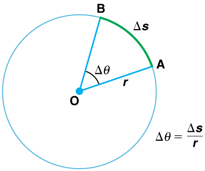

* Define arc length, rotation angle, radius of curvature and angular velocity.
* Calculate the angular velocity of a car wheel spin.

In [Kinematics](/m42122), we studied motion along a straight line and introduced such concepts as displacement, velocity, and acceleration. [Two-Dimensional Kinematics](/m42126) dealt with motion in two dimensions. Projectile motion is a special case of two-dimensional kinematics in which the object is projected into the air, while being subject to the gravitational force, and lands a distance away. In this chapter, we consider situations where the object does not land but moves in a curve. We begin the study of uniform circular motion by defining two angular quantities needed to describe rotational motion.

# Rotation Angle

When objects rotate about some axis—for example, when the CD (compact disc) in [\[link\]](#import-auto-id3402904) rotates about its center—each point in the object follows a circular arc. Consider a line from the center of the CD to its edge. Each **pit**{: data-type="term" #import-auto-id2654027} used to record sound along this line moves through the same angle in the same amount of time. The rotation angle is the amount of rotation and is analogous to linear distance. We define the **rotation angle**{: data-type="term" #import-auto-id3255842} <math xmlns="http://www.w3.org/1998/Math/MathML"><semantics><mrow><mrow><mtext>Δ</mtext><mi fontstyle="italic">θ</mi></mrow><mrow /></mrow><annotation encoding="StarMath 5.0"> size 12{Δθ} {}</annotation></semantics></math>

 to be the ratio of the arc length to the radius of curvature:

<math xmlns="http://www.w3.org/1998/Math/MathML"><semantics><mrow><mrow><mrow><mtext>Δ</mtext><mi fontstyle="italic">θ</mi><mo stretchy="false">=</mo><mfrac><mrow><mtext>Δ</mtext><mi fontstyle="italic">s</mi></mrow><mi>r</mi></mfrac></mrow></mrow><mtext>.</mtext><mrow /></mrow><annotation encoding="StarMath 5.0"> size 12{Δθ= { {Δs} over {r} } "."} {}</annotation></semantics></math>

{: #import-auto-id3402904}

 {: #import-auto-id3418263}

The **arc length**{: data-type="term" #import-auto-id2679165}<math xmlns="http://www.w3.org/1998/Math/MathML"><semantics><mrow><mrow><mspace width="0.25em" /><mtext>Δ</mtext><mi fontstyle="italic">s</mi></mrow><mrow /></mrow><annotation encoding="StarMath 5.0"> size 12{Δs} {}</annotation></semantics></math>

 is the distance traveled along a circular path as shown in [\[link\]](#import-auto-id3418263) Note that <math xmlns="http://www.w3.org/1998/Math/MathML"><semantics><mrow><mrow><mi>r</mi></mrow><mrow /></mrow><annotation encoding="StarMath 5.0"> size 12{r} {}</annotation></semantics></math>

 is the **radius of curvature**{: data-type="term" #import-auto-id2920709} of the circular path.

We know that for one complete revolution, the arc length is the circumference of a circle of radius <math xmlns="http://www.w3.org/1998/Math/MathML"><semantics><mrow><mrow><mi>r</mi></mrow><mrow /></mrow><annotation encoding="StarMath 5.0"> size 12{r} {}</annotation></semantics></math>

. The circumference of a circle is <math xmlns="http://www.w3.org/1998/Math/MathML"><semantics><mrow><mrow><mn>2π</mn><mi>r</mi></mrow><mrow /></mrow><annotation encoding="StarMath 5.0"> size 12{2πr} {}</annotation></semantics></math>

. Thus for one complete revolution the rotation angle is

<math xmlns="http://www.w3.org/1998/Math/MathML"><semantics><mrow><mrow><mrow><mrow><mtext>Δ</mtext><mi fontstyle="italic">θ</mi><mo stretchy="false">=</mo><mfrac><mrow><mn>2π</mn><mi>r</mi></mrow><mi>r</mi></mfrac></mrow><mo stretchy="false">=</mo><mn>2π</mn></mrow></mrow><mtext>.</mtext><mrow /></mrow><annotation encoding="StarMath 5.0"> size 12{Δθ= { {2πr} over {r} } =2π"."} {}</annotation></semantics></math>

This result is the basis for defining the units used to measure rotation angles, <math xmlns="http://www.w3.org/1998/Math/MathML"><semantics><mrow><mrow><mtext>Δ</mtext><mi fontstyle="italic">θ</mi></mrow><mrow /></mrow><annotation encoding="StarMath 5.0"> size 12{Δθ} {}</annotation></semantics></math>

 to be **radians**{: data-type="term" #import-auto-id2625941} (rad), defined so that

<math xmlns="http://www.w3.org/1998/Math/MathML"><semantics><mrow><mrow><mrow><mn>2π</mn><mrow><mspace width="0.25em" /><mtext>rad </mtext><mo stretchy="false">=</mo><mtext> 1 revolution.</mtext></mrow></mrow></mrow><mrow /></mrow><annotation encoding="StarMath 5.0"> size 12{2π" rad "=" 1 revolution."} {}</annotation></semantics></math>

A comparison of some useful angles expressed in both degrees and radians is shown in [\[link\]](#import-auto-id2588905).

<table id="import-auto-id2588905" summary="The table compares various angle measures in degrees (first column) and radians (second colum)."><caption>Comparison of Angular Units</caption><thead>

<tr>
            <th>Degree Measures</th>
            <th>Radian Measure</th>
          </tr></thead><tbody><tr>
            <td>
              <math xmlns="http://www.w3.org/1998/Math/MathML" display="block">
                <semantics>
                  <mrow>
                    
                      <mrow>
                        <mrow>
                          <mtext>30º</mtext>
                          
                        </mrow>
                      </mrow>
                    
                    <mrow />
                  </mrow>
                  <annotation encoding="StarMath 5.0"> size 12{"30"°} {}</annotation>
                </semantics>
              </math> 
            </td>
            <td>
              <math xmlns="http://www.w3.org/1998/Math/MathML" display="block">
                <semantics>
                  <mrow>
                    
                      <mrow>
                        <mfrac>
                          <mi>π</mi>
                          <mn>6</mn>
                        </mfrac>
                      </mrow>
                    
                    <mrow />
                  </mrow>
                  <annotation encoding="StarMath 5.0"> size 12{ {  {π}  over  {6} } } {}</annotation>
                </semantics>
              </math> 
            </td>
          </tr><tr>
            <td>
              <math xmlns="http://www.w3.org/1998/Math/MathML" display="block">
                <semantics>
                  <mrow>
                    
                      <mrow>
                        <mrow>
                          <mtext>60º</mtext>
                         
                        </mrow>
                      </mrow>
                    
                    <mrow />
                  </mrow>
                  <annotation encoding="StarMath 5.0"> size 12{"60"°} {}</annotation>
                </semantics>
              </math> 
            </td>
            <td>
              <math xmlns="http://www.w3.org/1998/Math/MathML" display="block">
                <semantics>
                  <mrow>
                    
                      <mrow>
                        <mfrac>
                          <mi>π</mi>
                          <mn>3</mn>
                        </mfrac>
                      </mrow>
                    
                    <mrow />
                  </mrow>
                  <annotation encoding="StarMath 5.0"> size 12{ {  {π}  over  {3} } } {}</annotation>
                </semantics>
              </math> 
            </td>
          </tr><tr>
            <td>
              <math xmlns="http://www.w3.org/1998/Math/MathML" display="block">
                <semantics>
                  <mrow>
                    
                      <mrow>
                        <mrow>
                          <mtext>90º</mtext>
                       
                        </mrow>
                      </mrow>
                    
                    <mrow />
                  </mrow>
                  <annotation encoding="StarMath 5.0"> size 12{"90"°} {}</annotation>
                </semantics>
              </math> 
            </td>
            <td>
              <math xmlns="http://www.w3.org/1998/Math/MathML" display="block">
                <semantics>
                  <mrow>
                    
                      <mrow>
                        <mfrac>
                          <mi>π</mi>
                          <mn>2</mn>
                        </mfrac>
                      </mrow>
                    
                    <mrow />
                  </mrow>
                  <annotation encoding="StarMath 5.0"> size 12{ {  {π}  over  {2} } } {}</annotation>
                </semantics>
              </math> 
            </td>
          </tr><tr>
            <td>
              <math xmlns="http://www.w3.org/1998/Math/MathML" display="block">
                <semantics>
                  <mrow>
                    
                      <mrow>
                        <mrow>
                          <mtext>120º</mtext>
                    
                        </mrow>
                      </mrow>
                    
                    <mrow />
                  </mrow>
                  <annotation encoding="StarMath 5.0"> size 12{"120"°} {}</annotation>
                </semantics>
              </math> 
            </td>
            <td>
              <math xmlns="http://www.w3.org/1998/Math/MathML" display="block">
                <semantics>
                  <mrow>
                    
                      <mrow>
                        <mfrac>
                          <mn>2π</mn>
                          <mn>3</mn>
                        </mfrac>
                      </mrow>
                    
                    <mrow />
                  </mrow>
                  <annotation encoding="StarMath 5.0"> size 12{ {  {2π}  over  {3} } } {}</annotation>
                </semantics>
              </math> 
            </td>
          </tr><tr>
            <td>
              <math xmlns="http://www.w3.org/1998/Math/MathML" display="block">
                <semantics>
                  <mrow>
                    
                      <mrow>
                        <mrow>
                          <mtext>135º</mtext>
          
                        </mrow>
                      </mrow>
                    
                    <mrow />
                  </mrow>
                  <annotation encoding="StarMath 5.0"> size 12{"135"°} {}</annotation>
                </semantics>
              </math> 
            </td>
            <td>
              <math xmlns="http://www.w3.org/1998/Math/MathML" display="block">
                <semantics>
                  <mrow>
                    
                      <mrow>
                        <mfrac>
                          <mn>3π</mn>
                          <mn>4</mn>
                        </mfrac>
                      </mrow>
                    
                    <mrow />
                  </mrow>
                  <annotation encoding="StarMath 5.0"> size 12{ {  {3π}  over  {4} } } {}</annotation>
                </semantics>
              </math> 
            </td>
          </tr><tr>
            <td>
              <math xmlns="http://www.w3.org/1998/Math/MathML" display="block">
                <semantics>
                  <mrow>
                    
                      <mrow>
                        <mrow>
                          <mtext>180º</mtext>
    
                        </mrow>
                      </mrow>
                    
                    <mrow />
                  </mrow>
                  <annotation encoding="StarMath 5.0"> size 12{"180"°} {}</annotation>
                </semantics>
              </math> 
            </td>
            <td>
              <math xmlns="http://www.w3.org/1998/Math/MathML" display="block">
                <semantics>
                  <mrow>
                    
                      <mrow>
                        <mi>π</mi>
                      </mrow>
                    
                    <mrow />
                  </mrow>
                  <annotation encoding="StarMath 5.0"> size 12{π} {}</annotation>
                </semantics>
              </math> 
            </td>
          </tr></tbody></table>

, but point 2 moves through a greater arc length &#x394;s size 12{ left (&#x394;s right )} {} because it is at a greater distance from the center of rotation (r) size 12{ \( r \) } {}. "){: #import-auto-id2442865}

If <math xmlns="http://www.w3.org/1998/Math/MathML"><semantics><mrow><mrow><mrow><mtext>Δ</mtext><mi fontstyle="italic">θ</mi><mo stretchy="false">=</mo><mn>2</mn><mi>π</mi></mrow></mrow><mrow /></mrow><annotation encoding="StarMath 5.0"> size 12{Δθ=2π} {}</annotation></semantics></math>

 rad, then the CD has made one complete revolution, and every point on the CD is back at its original position. Because there are <math xmlns="http://www.w3.org/1998/Math/MathML"><semantics><mrow><mrow><mrow><mtext>360º</mtext></mrow></mrow><mrow /></mrow><annotation encoding="StarMath 5.0"> size 12{"360"°} {}</annotation></semantics></math>

 in a circle or one revolution, the relationship between radians and degrees is thus

<math xmlns="http://www.w3.org/1998/Math/MathML"> <semantics> <mrow> <mrow> <mrow> <mn>2</mn> <mi>π</mi> <mspace width="0.25em" /> <mrow> <mtext>rad</mtext> <mo stretchy="false">=</mo> <mtext>360º</mtext> </mrow> </mrow> </mrow> <mrow /> </mrow> <annotation encoding="StarMath 5.0"> size 12{2π" rad"="360" rSup { size 8{ circ } } } {}</annotation> </semantics> </math>

so that

<math xmlns="http://www.w3.org/1998/Math/MathML"><semantics><mrow><mrow><mrow><mn>1</mn><mrow><mrow><mspace width="0.25em" /><mtext>rad</mtext><mo stretchy="false">=</mo><mfrac><mtext>360º</mtext><mn>2π</mn></mfrac></mrow><mo stretchy="false">≈</mo><mtext>57.</mtext></mrow><mn>3º</mn></mrow></mrow><mtext>.</mtext><mrow /></mrow><annotation encoding="StarMath 5.0"> size 12{1" rad"= { {"360" rSup { size 8{ circ } } } over {2π} } ="57" "." 3 rSup { size 8{ circ } } "."} {}</annotation></semantics></math>

# Angular Velocity

How fast is an object rotating? We define **angular velocity**{: data-type="term" #import-auto-id2962847} <math xmlns="http://www.w3.org/1998/Math/MathML"><semantics><mrow><mrow><mi>ω</mi></mrow><mrow /></mrow><annotation encoding="StarMath 5.0"> size 12{ω} {}</annotation></semantics></math>

 as the rate of change of an angle. In symbols, this is

<math xmlns="http://www.w3.org/1998/Math/MathML"><semantics><mrow><mrow><mrow><mi>ω</mi><mo stretchy="false">=</mo> <mfrac> <mrow> <mtext>Δ</mtext> <mi fontstyle="italic">θ</mi> </mrow> <mrow> <mtext>Δ</mtext> <mi fontstyle="italic">t</mi> </mrow> </mfrac> </mrow></mrow><mtext>,</mtext><mrow /></mrow><annotation encoding="StarMath 5.0"> size 12{ω= { {Δθ} over {Δt} } ","} {}</annotation></semantics></math>

where an angular rotation <math xmlns="http://www.w3.org/1998/Math/MathML"><semantics><mrow><mrow><mtext>Δ</mtext><mi fontstyle="italic">θ</mi></mrow><mrow /></mrow><annotation encoding="StarMath 5.0"> size 12{Δθ} {}</annotation></semantics></math>

 takes place in a time <math xmlns="http://www.w3.org/1998/Math/MathML"><semantics><mrow><mrow><mtext>Δ</mtext><mi fontstyle="italic">t</mi></mrow><mrow /></mrow><annotation encoding="StarMath 5.0"> size 12{Δt} {}</annotation></semantics></math>

. The greater the rotation angle in a given amount of time, the greater the angular velocity. The units for angular velocity are radians per second (rad/s).

Angular velocity <math xmlns="http://www.w3.org/1998/Math/MathML"><semantics><mrow><mrow><mi>ω</mi></mrow><mrow /></mrow><annotation encoding="StarMath 5.0"> size 12{ω} {}</annotation></semantics></math>

 is analogous to linear velocity <math xmlns="http://www.w3.org/1998/Math/MathML"><semantics><mrow><mrow><mi>v</mi></mrow><mrow /></mrow><annotation encoding="StarMath 5.0"> size 12{v} {}</annotation></semantics></math>

. To get the precise relationship between angular and linear velocity, we again consider a pit on the rotating CD. This pit moves an arc length <math xmlns="http://www.w3.org/1998/Math/MathML"><semantics><mrow><mtext>Δ</mtext><mrow><mi fontstyle="italic">s</mi></mrow><mrow /></mrow><annotation encoding="StarMath 5.0"> size 12{Δs} {}</annotation></semantics></math>

 in a time <math xmlns="http://www.w3.org/1998/Math/MathML"><semantics><mrow><mrow><mtext>Δ</mtext><mi fontstyle="italic">t</mi></mrow><mrow /></mrow><annotation encoding="StarMath 5.0"> size 12{Δt} {}</annotation></semantics></math>

, and so it has a linear velocity

<math xmlns="http://www.w3.org/1998/Math/MathML"><semantics><mrow><mrow><mrow><mi>v</mi><mo stretchy="false">=</mo> <mfrac> <mrow> <mtext>Δ</mtext> <mi fontstyle="italic">s</mi> </mrow> <mrow> <mtext>Δ</mtext> <mi fontstyle="italic">t</mi> </mrow> </mfrac> </mrow></mrow><mtext>.</mtext><mrow /></mrow><annotation encoding="StarMath 5.0"> size 12{v= { {Δs} over {Δt} } "."} {}</annotation></semantics></math>

From <math xmlns="http://www.w3.org/1998/Math/MathML"><semantics><mrow><mrow><mrow><mtext>Δ</mtext><mi fontstyle="italic">θ</mi><mo stretchy="false">=</mo><mfrac><mrow><mtext>Δ</mtext><mi fontstyle="italic">s</mi></mrow><mi>r</mi></mfrac></mrow></mrow><mrow /></mrow><annotation encoding="StarMath 5.0"> size 12{Δθ= { {Δs} over {r} } } {}</annotation></semantics></math>

 we see that <math xmlns="http://www.w3.org/1998/Math/MathML"><semantics><mrow><mrow><mrow><mtext>Δ</mtext><mi fontstyle="italic">s</mi><mo stretchy="false">=</mo> <mi fontstyle="italic">r</mi> <mtext>Δ</mtext> <mi fontstyle="italic">θ</mi> </mrow></mrow><mrow /></mrow><annotation encoding="StarMath 5.0"> size 12{Δs=rΔθ} {}</annotation></semantics></math>

. Substituting this into the expression for <math xmlns="http://www.w3.org/1998/Math/MathML"><semantics><mrow><mrow><mi>v</mi></mrow><mrow /></mrow><annotation encoding="StarMath 5.0"> size 12{v} {}</annotation></semantics></math>

 gives

<math xmlns="http://www.w3.org/1998/Math/MathML"><semantics><mrow><mrow><mrow><mrow><mi>v</mi><mo stretchy="false">=</mo> <mfrac> <mrow> <mi fontstyle="italic">r</mi> <mtext>Δ</mtext> <mi fontstyle="italic">θ</mi> </mrow> <mrow> <mtext>Δ</mtext> <mi fontstyle="italic">t</mi> </mrow> </mfrac> </mrow><mo stretchy="false">=</mo><mi fontstyle="italic">rω</mi></mrow></mrow><mtext>.</mtext><mrow /></mrow><annotation encoding="StarMath 5.0"> size 12{v= { {rΔθ} over {Δt} } =rω"."} {}</annotation></semantics></math>

We write this relationship in two different ways and gain two different insights:

<math xmlns="http://www.w3.org/1998/Math/MathML"><semantics><mrow><mrow><mrow><mrow><mi>v</mi><mo stretchy="false">=</mo><mi fontstyle="italic">rω</mi></mrow><mi /><mtext> or </mtext><mrow><mi>ω</mi><mo stretchy="false">=</mo><mfrac><mi>v</mi><mi>r</mi></mfrac></mrow></mrow></mrow><mtext>.</mtext><mrow /></mrow><annotation encoding="StarMath 5.0"> size 12{v=rω``"or "ω= { {v} over {r} } "."} {}</annotation></semantics></math>

The first relationship in <math xmlns="http://www.w3.org/1998/Math/MathML"><semantics><mrow><mrow><mrow><mrow><mi>v</mi><mo stretchy="false">=</mo><mi fontstyle="italic">rω</mi></mrow><mi /><mtext> or </mtext><mrow><mi>ω</mi><mo stretchy="false">=</mo><mfrac><mi>v</mi><mi>r</mi></mfrac></mrow></mrow></mrow><mrow /></mrow><annotation encoding="StarMath 5.0"> size 12{v=rω``"or "ω= { {v} over {r} } } {}</annotation></semantics></math>

 states that the linear velocity <math xmlns="http://www.w3.org/1998/Math/MathML"><semantics><mrow><mrow><mi>v</mi></mrow><mrow /></mrow><annotation encoding="StarMath 5.0"> size 12{v} {}</annotation></semantics></math>

 is proportional to the distance from the center of rotation, thus, it is largest for a point on the rim (largest <math xmlns="http://www.w3.org/1998/Math/MathML"><semantics><mrow><mrow><mi>r</mi></mrow><mrow /></mrow><annotation encoding="StarMath 5.0"> size 12{r} {}</annotation></semantics></math>

), as you might expect. We can also call this linear speed <math xmlns="http://www.w3.org/1998/Math/MathML"><semantics><mrow><mrow><mi>v</mi></mrow><mrow /></mrow><annotation encoding="StarMath 5.0"> size 12{v} {}</annotation></semantics></math>

 of a point on the rim the *tangential speed*. The second relationship in <math xmlns="http://www.w3.org/1998/Math/MathML"><semantics><mrow><mrow><mrow><mrow><mi>v</mi><mo stretchy="false">=</mo><mi fontstyle="italic">rω</mi></mrow><mi /><mtext> or </mtext><mrow><mi>ω</mi><mo stretchy="false">=</mo><mfrac><mi>v</mi><mi>r</mi></mfrac></mrow></mrow></mrow><mrow /></mrow><annotation encoding="StarMath 5.0"> size 12{v=rω``"or "ω= { {v} over {r} } } {}</annotation></semantics></math>

 can be illustrated by considering the tire of a moving car. Note that the speed of a point on the rim of the tire is the same as the speed <math xmlns="http://www.w3.org/1998/Math/MathML"><semantics><mrow><mrow><mi>v</mi></mrow><mrow /></mrow><annotation encoding="StarMath 5.0"> size 12{v} {}</annotation></semantics></math>

 of the car. See [\[link\]](#import-auto-id2931190). So the faster the car moves, the faster the tire spins—large <math xmlns="http://www.w3.org/1998/Math/MathML"><semantics><mrow><mrow><mi>v</mi></mrow><mrow /></mrow><annotation encoding="StarMath 5.0"> size 12{v} {}</annotation></semantics></math>

 means a large <math xmlns="http://www.w3.org/1998/Math/MathML"><semantics><mrow><mrow><mi>ω</mi></mrow><mrow /></mrow><annotation encoding="StarMath 5.0"> size 12{ω} {}</annotation></semantics></math>

, because <math xmlns="http://www.w3.org/1998/Math/MathML"><semantics><mrow><mrow><mrow><mi>v</mi><mo stretchy="false">=</mo><mi fontstyle="italic">rω</mi></mrow></mrow><mrow /></mrow><annotation encoding="StarMath 5.0"> size 12{v=rω} {}</annotation></semantics></math>

. Similarly, a larger-radius tire rotating at the same angular velocity (<math xmlns="http://www.w3.org/1998/Math/MathML"><semantics><mrow><mrow><mi>ω</mi></mrow><mrow /></mrow><annotation encoding="StarMath 5.0"> size 12{ω} {}</annotation></semantics></math>

) will produce a greater linear speed (<math xmlns="http://www.w3.org/1998/Math/MathML"><semantics><mrow><mrow><mi>v</mi></mrow><mrow /></mrow><annotation encoding="StarMath 5.0"> size 12{v} {}</annotation></semantics></math>

) for the car.

 {: #import-auto-id2931190}

How Fast Does a Car Tire Spin?

Calculate the angular velocity of a 0.300 m radius car tire when the car travels at <math xmlns="http://www.w3.org/1998/Math/MathML"><semantics><mrow><mrow><mrow><mtext>15</mtext><mtext>.</mtext><mn>0</mn><mspace width="0.25em" /><mtext>m/s</mtext></mrow></mrow><mrow /></mrow><annotation encoding="StarMath 5.0"> size 12{"15" "." 0`"m/s"} {}</annotation></semantics></math>

 (about <math xmlns="http://www.w3.org/1998/Math/MathML"><semantics><mrow><mrow><mrow><mtext>54</mtext><mspace width="0.25em" /><mtext>km/h</mtext></mrow></mrow><mrow /></mrow><annotation encoding="StarMath 5.0"> size 12{"54"`"km/h"} {}</annotation></semantics></math>

). See [\[link\]](#import-auto-id2931190).

**Strategy**

Because the linear speed of the tire rim is the same as the speed of the car, we have <math xmlns="http://www.w3.org/1998/Math/MathML"> <semantics> <mrow> <mrow> <mi>v</mi> <mo stretchy="false">=</mo> <mtext>15.0 m/s</mtext> <mo stretchy="false">.</mo> </mrow> </mrow> <annotation encoding="StarMath 5.0"> size 12{v} {}</annotation> </semantics> </math>

 The radius of the tire is given to be <math xmlns="http://www.w3.org/1998/Math/MathML"> <semantics> <mrow> <mrow> <mi>r</mi> <mo stretchy="false">=</mo> <mtext>0.300 m</mtext> <mo stretchy="false">.</mo> </mrow> </mrow> <annotation encoding="StarMath 5.0"> size 12{r} {}</annotation> </semantics> </math>

 Knowing <math xmlns="http://www.w3.org/1998/Math/MathML"><semantics><mrow><mrow><mi>v</mi></mrow><mrow /></mrow><annotation encoding="StarMath 5.0"> size 12{v} {}</annotation></semantics></math>

 and <math xmlns="http://www.w3.org/1998/Math/MathML"><semantics><mrow><mrow><mi>r</mi></mrow><mrow /></mrow><annotation encoding="StarMath 5.0"> size 12{r} {}</annotation></semantics></math>

, we can use the second relationship in <math xmlns="http://www.w3.org/1998/Math/MathML"><semantics><mrow><mrow><mrow><mrow><mi>v</mi><mo stretchy="false">=</mo><mi fontstyle="italic">rω</mi></mrow><mi>, </mi><mi /><mrow><mi>ω</mi><mo stretchy="false">=</mo><mfrac><mi>v</mi><mi>r</mi></mfrac></mrow></mrow></mrow><mrow /></mrow><annotation encoding="StarMath 5.0"> size 12{v=rω,``ω= { {v} over {r} } } {}</annotation></semantics></math>

 to calculate the angular velocity.

**Solution**

To calculate the angular velocity, we will use the following relationship:

<math xmlns="http://www.w3.org/1998/Math/MathML"><semantics><mrow><mrow><mrow><mi>ω</mi><mo stretchy="false">=</mo><mfrac><mi>v</mi><mi>r</mi></mfrac></mrow></mrow><mtext>.</mtext><mrow /></mrow><annotation encoding="StarMath 5.0"> size 12{ω= { {v} over {r} } "."} {}</annotation></semantics></math>

Substituting the knowns,

<math xmlns="http://www.w3.org/1998/Math/MathML"><semantics><mrow><mrow><mrow><mrow><mrow><mi>ω</mi><mo stretchy="false">=</mo><mfrac><mrow><mtext>15</mtext><mtext>.</mtext><mn>0</mn><mspace width="0.25em" /><mtext>m/s</mtext></mrow><mrow><mn>0</mn><mtext>.</mtext><mtext>300</mtext><mspace width="0.25em" /><mtext>m</mtext></mrow></mfrac></mrow><mo stretchy="false">=</mo><mtext>50</mtext></mrow><mtext>.</mtext><mn>0</mn><mspace width="0.25em" /><mtext>rad/s.</mtext></mrow></mrow><mrow /></mrow><annotation encoding="StarMath 5.0"> size 12{ω= { {"15" "." 0" m/s"} over {0 "." "300"" m"} } ="50" "." 0" rad/s."} {}</annotation></semantics></math>

**Discussion**

When we cancel units in the above calculation, we get 50.0/s. But the angular velocity must have units of rad/s. Because radians are actually unitless (radians are defined as a ratio of distance), we can simply insert them into the answer for the angular velocity. Also note that if an earth mover with much larger tires, say 1.20 m in radius, were moving at the same speed of 15.0 m/s, its tires would rotate more slowly. They would have an angular velocity

<math xmlns="http://www.w3.org/1998/Math/MathML"><semantics><mrow><mrow><mrow><mrow><mi>ω</mi><mo stretchy="false">=</mo><mo stretchy="false">(</mo></mrow><mtext>15</mtext><mtext>.</mtext><mn>0</mn><mspace width="0.25em" /><mtext>m/s</mtext><mrow><mo stretchy="false">)</mo><mo stretchy="false">/</mo><mo stretchy="false">(</mo></mrow><mn>1</mn><mtext>.</mtext><mtext>20</mtext><mspace width="0.25em" /><mtext>m</mtext><mrow><mo stretchy="false">)</mo><mo stretchy="false">=</mo><mtext>12</mtext></mrow><mtext>.</mtext><mn>5</mn><mspace width="0.25em" /><mtext>rad/s.</mtext></mrow></mrow><mrow /></mrow><annotation encoding="StarMath 5.0"> size 12{ω= \( "15" "." 0`"m/s" \) / \( 1 "." "20"`m \) ="12" "." 5`"rad/s."} {}</annotation></semantics></math>

Both <math xmlns="http://www.w3.org/1998/Math/MathML"><semantics><mrow><mrow><mi>ω</mi></mrow><mrow /></mrow><annotation encoding="StarMath 5.0"> size 12{ω} {}</annotation></semantics></math>

 and <math xmlns="http://www.w3.org/1998/Math/MathML"><semantics><mrow><mrow><mi>v</mi></mrow><mrow /></mrow><annotation encoding="StarMath 5.0"> size 12{v} {}</annotation></semantics></math>

 have directions (hence they are angular and linear *velocities*, respectively). Angular velocity has only two directions with respect to the axis of rotation—it is either clockwise or counterclockwise. Linear velocity is tangent to the path, as illustrated in [\[link\]](#import-auto-id1452850).

Take-Home Experiment

Tie an object to the end of a string and swing it around in a horizontal circle above your head (swing at your wrist). Maintain uniform speed as the object swings and measure the angular velocity of the motion. What is the approximate speed of the object? Identify a point close to your hand and take appropriate measurements to calculate the linear speed at this point. Identify other circular motions and measure their angular velocities.

![The given figure shows the top view of an old fashioned vinyl record. Two perpendicular line segments are drawn through the center of the circular record, one vertically upward and one horizontal to the right side. Two flies are shown at the end points of the vertical lines near the borders of the record. Two arrows are also drawn perpendicularly rightward through the end points of these vertical lines depicting linear velocities. A curved arrow is also drawn at the center circular part of the record which shows the angular velocity.](../resources/Figure_07_01_04a.jpg "As an object moves in a circle, here a fly on the edge of an old-fashioned vinyl record, its instantaneous velocity is always tangent to the circle. The direction of the angular velocity is clockwise in this case. "){: #import-auto-id1452850}

PhET Explorations: Ladybug Revolution

<figure markdown="1" id="eip-id1171550">
<figcaption>
[Ladybug Revolution](rotation_en.jar)
</figcaption>
 {: data-type="image"}  
</figure>
Join the ladybug in an exploration of rotational motion. Rotate the merry-go-round to change its angle, or choose a constant angular velocity or angular acceleration. Explore how circular motion relates to the bug\'s x,y position, velocity, and acceleration using vectors or graphs.

# Section Summary

* {: #import-auto-id2603294} Uniform circular motion is motion in a circle at constant speed. The rotation angle
  <math xmlns="http://www.w3.org/1998/Math/MathML"><semantics><mrow><mrow><mtext>Δ</mtext><mi fontstyle="italic">θ</mi></mrow><mrow /></mrow><annotation encoding="StarMath 5.0"> size 12{Δθ} {}</annotation></semantics></math>
  
  is defined as the ratio of the arc length to the radius of curvature:
  

  <math xmlns="http://www.w3.org/1998/Math/MathML"><semantics><mrow><mrow><mrow><mtext>Δ</mtext><mi fontstyle="italic">θ</mi><mo stretchy="false">=</mo><mfrac><mrow><mtext>Δ</mtext><mi fontstyle="italic">s</mi></mrow><mi>r</mi></mfrac></mrow></mrow><mtext>,</mtext><mrow /></mrow><annotation encoding="StarMath 5.0"> size 12{Δθ= { {Δs} over {r} } ","} {}</annotation></semantics></math>
  

  
  where arc length <math xmlns="http://www.w3.org/1998/Math/MathML"><semantics><mrow><mrow><mtext>Δ</mtext><mi fontstyle="italic">s</mi></mrow><mrow /></mrow><annotation encoding="StarMath 5.0"> size 12{Δs} {}</annotation></semantics></math>
  
   is distance traveled along a circular path and <math xmlns="http://www.w3.org/1998/Math/MathML"><semantics><mrow><mrow><mi>r</mi></mrow><mrow /></mrow><annotation encoding="StarMath 5.0"> size 12{r} {}</annotation></semantics></math>
  
   is the radius of curvature of the circular path. The quantity <math xmlns="http://www.w3.org/1998/Math/MathML"><semantics><mrow><mrow><mtext>Δ</mtext><mi fontstyle="italic">θ</mi></mrow><mrow /></mrow><annotation encoding="StarMath 5.0"> size 12{Δθ} {}</annotation></semantics></math>
  
   is measured in units of radians (rad), for which
  
  

  <math xmlns="http://www.w3.org/1998/Math/MathML"><semantics><mrow><mrow><mrow><mn>2π</mn><mspace width="0.25em" /><mrow><mtext>rad</mtext><mo stretchy="false">=</mo><mi /></mrow><mtext>360º</mtext><mtext>= </mtext><mi /><mn>1</mn><mi /><mtext> revolution.</mtext></mrow></mrow><mrow /></mrow><annotation encoding="StarMath 5.0"> size 12{2π`"rad"=`"360""°="`1`"revolution."} {}</annotation></semantics></math>
  

* {: #import-auto-id2384053} The conversion between radians and degrees is
  <math xmlns="http://www.w3.org/1998/Math/MathML"><semantics><mrow><mrow><mrow><mn>1</mn><mspace width="0.25em" /><mrow><mtext>rad</mtext><mo stretchy="false">=</mo><mtext>57</mtext></mrow><mtext>.</mtext><mn>3</mn><mtext>º</mtext></mrow></mrow><mrow /></mrow><annotation encoding="StarMath 5.0"> size 12{1"rad"="57" "." 3°} {}</annotation></semantics></math>
  
  .
* {: #import-auto-id2442213} Angular velocity
  <math xmlns="http://www.w3.org/1998/Math/MathML"><semantics><mrow><mrow><mi>ω</mi></mrow><mrow /></mrow><annotation encoding="StarMath 5.0"> size 12{ω} {}</annotation></semantics></math>
  
  is the rate of change of an angle,
  

  <math xmlns="http://www.w3.org/1998/Math/MathML"><semantics><mrow><mrow><mrow><mi>ω</mi><mo stretchy="false">=</mo><mfrac><mrow><mtext>Δ</mtext><mi fontstyle="italic">θ</mi></mrow><mrow><mtext>Δ</mtext><mi fontstyle="italic">t</mi></mrow></mfrac></mrow></mrow><mtext>,</mtext><mrow /></mrow><annotation encoding="StarMath 5.0"> size 12{ω= { {Δθ} over {Δt} } ","} {}</annotation></semantics></math>
  

  
  where a rotation <math xmlns="http://www.w3.org/1998/Math/MathML"><semantics><mrow><mrow><mtext>Δ</mtext><mi fontstyle="italic">θ</mi></mrow><mrow /></mrow><annotation encoding="StarMath 5.0"> size 12{Δθ} {}</annotation></semantics></math>
  
   takes place in a time <math xmlns="http://www.w3.org/1998/Math/MathML"><semantics><mrow><mrow><mtext>Δ</mtext><mi fontstyle="italic">t</mi></mrow><mrow /></mrow><annotation encoding="StarMath 5.0"> size 12{Δt} {}</annotation></semantics></math>
  
  . The units of angular velocity are radians per second (rad/s). Linear velocity <math xmlns="http://www.w3.org/1998/Math/MathML"><semantics><mrow><mrow><mi>v</mi></mrow><mrow /></mrow><annotation encoding="StarMath 5.0"> size 12{v} {}</annotation></semantics></math>
  
   and angular velocity <math xmlns="http://www.w3.org/1998/Math/MathML"><semantics><mrow><mrow><mi>ω</mi></mrow><mrow /></mrow><annotation encoding="StarMath 5.0"> size 12{ω} {}</annotation></semantics></math>
  
   are related by
  
  

  <math xmlns="http://www.w3.org/1998/Math/MathML"><semantics><mrow><mrow><mrow><mrow><mi>v</mi><mo stretchy="false">=</mo><mi fontstyle="italic">rω</mi></mrow><mi /><mtext> or </mtext><mrow><mi>ω</mi><mo stretchy="false">=</mo><mfrac><mi>v</mi><mi>r</mi></mfrac></mrow></mrow></mrow><mtext>.</mtext><mrow /></mrow><annotation encoding="StarMath 5.0"> size 12{v=rω``"or "ω= { {v} over {r} } "."} {}</annotation></semantics></math>
  

# Conceptual Questions

There is an analogy between rotational and linear physical quantities. What rotational quantities are analogous to distance and velocity?

# Problem Exercises

Semi-trailer trucks have an odometer on one hub of a trailer wheel. The hub is weighted so that it does not rotate, but it contains gears to count the number of wheel revolutions—it then calculates the distance traveled. If the wheel has a 1.15 m diameter and goes through 200,000 rotations, how many kilometers should the odometer read?

723 km

Microwave ovens rotate at a rate of about 6 rev/min. What is this in revolutions per second? What is the angular velocity in radians per second?

An automobile with 0.260 m radius tires travels 80,000 km before wearing them out. How many revolutions do the tires make, neglecting any backing up and any change in radius due to wear?

<math xmlns="http://www.w3.org/1998/Math/MathML"><semantics><mrow><mrow><mrow><mn>5</mn><mrow><mo stretchy="false">×</mo><msup><mtext>10</mtext><mrow><mn>7</mn></mrow></msup></mrow><mspace width="0.25em" /><mtext>rotations</mtext></mrow></mrow><mrow /></mrow><annotation encoding="StarMath 5.0"> size 12{9 "." "79" times "10" rSup { size 8{8} } `"rotations"} {}</annotation></semantics></math>

(a) What is the period of rotation of Earth in seconds? (b) What is the angular velocity of Earth? (c) Given that Earth has a radius of <math xmlns="http://www.w3.org/1998/Math/MathML"><semantics><mrow><mrow><mrow><mn>6</mn><mtext>.</mtext><mrow><mn>4</mn><mo stretchy="false">×</mo><msup><mtext>10</mtext><mrow><mn>6</mn></mrow></msup><mspace width="0.25em" /><mtext>m</mtext></mrow></mrow></mrow></mrow><annotation encoding="StarMath 5.0"> size 12{6 "." 4 times "10" rSup { size 8{6} } } {}</annotation></semantics></math>

 at its equator, what is the linear velocity at Earth’s surface?

A baseball pitcher brings his arm forward during a pitch, rotating the forearm about the elbow. If the velocity of the ball in the pitcher’s hand is 35.0 m/s and the ball is 0.300 m from the elbow joint, what is the angular velocity of the forearm?

117 rad/s

In lacrosse, a ball is thrown from a net on the end of a stick by rotating the stick and forearm about the elbow. If the angular velocity of the ball about the elbow joint is 30.0 rad/s and the ball is 1.30 m from the elbow joint, what is the velocity of the ball?

A truck with 0.420-m-radius tires travels at 32.0 m/s. What is the angular velocity of the rotating tires in radians per second? What is this in rev/min?

76\.2 rad/s

728 rpm

**Integrated Concepts** When kicking a football, the kicker rotates his leg about the hip joint.

(a) If the velocity of the tip of the kicker’s shoe is 35.0 m/s and the hip joint is 1.05 m from the tip of the shoe, what is the shoe tip’s angular velocity?

(b) The shoe is in contact with the initially stationary 0.500 kg football for 20.0 ms. What average force is exerted on the football to give it a velocity of 20.0 m/s?

(c) Find the maximum range of the football, neglecting air resistance.

(a) 33.3 rad/s

(b) 500 N

(c) 40.8 m

**Construct Your Own Problem**

Consider an amusement park ride in which participants are rotated about a vertical axis in a cylinder with vertical walls. Once the angular velocity reaches its full value, the floor drops away and friction between the walls and the riders prevents them from sliding down. Construct a problem in which you calculate the necessary angular velocity that assures the riders will not slide down the wall. Include a free body diagram of a single rider. Among the variables to consider are the radius of the cylinder and the coefficients of friction between the riders’ clothing and the wall.

