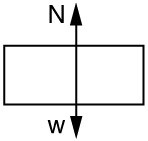

* Establish the expression for centripetal acceleration.
* Explain the centrifuge.

We know from kinematics that acceleration is a change in velocity, either in its magnitude or in its direction, or both. In uniform circular motion, the direction of the velocity changes constantly, so there is always an associated acceleration, even though the magnitude of the velocity might be constant. You experience this acceleration yourself when you turn a corner in your car. (If you hold the wheel steady during a turn and move at constant speed, you are in uniform circular motion.) What you notice is a sideways acceleration because you and the car are changing direction. The sharper the curve and the greater your speed, the more noticeable this acceleration will become. In this section we examine the direction and magnitude of that acceleration.

[\[link\]](#import-auto-id1561888) shows an object moving in a circular path at constant speed. The direction of the instantaneous velocity is shown at two points along the path. Acceleration is in the direction of the change in velocity, which points directly toward the center of rotation (the center of the circular path). This pointing is shown with the vector diagram in the figure. We call the acceleration of an object moving in uniform circular motion (resulting from a net external force) the **centripetal acceleration**{: data-type="term" #import-auto-id3108952}(<math xmlns="http://www.w3.org/1998/Math/MathML"><semantics><mrow><mrow><msub><mi>a</mi><mrow><mtext>c</mtext></mrow></msub></mrow><mrow /></mrow><annotation encoding="StarMath 5.0"> size 12{a rSub { size 8{c} } } {}</annotation></semantics></math>

); centripetal means “toward the center” or “center seeking.”

![The given figure shows a circle, with a triangle having vertices A B C made from the center to the boundry. A is at the center and B and C points are at the circle path. Lines A B and A C act as radii and B C is a chord. Delta theta is shown inside the triangle, and the arc length delta s and the chord length delta r are also given. At point B, velocity of object is shown as v one and at point C, velocity of object is shown as v two. Along the circle an equation is shown as delta v equals v sub 2 minus v sub 1.](../resources/Figure_07_02_01a.jpg "The directions of the velocity of an object at two different points are shown, and the change in velocity &#x394;v size 12{&#x394;v} {} is seen to point directly toward the center of curvature. (See small inset.) Because ac=&#x394;v/&#x394;t {a rSub { {c} } =&#x394;v/&#x394;t} {}, the acceleration is also toward the center; ac size 12{a rSub { size 8{c} } } {} is called centripetal acceleration. (Because &#x394;&#x3B8; size 12{&#x394;&#x3B8;} {} is very small, the arc length &#x394;s size 12{&#x394;s} {} is equal to the chord length &#x394;r size 12{&#x394;r} {} for small time differences.)"){: #import-auto-id1561888}

The direction of centripetal acceleration is toward the center of curvature, but what is its magnitude? Note that the triangle formed by the velocity vectors and the one formed by the radii <math xmlns="http://www.w3.org/1998/Math/MathML"><semantics><mrow><mrow><mi>r</mi></mrow><mrow /></mrow><annotation encoding="StarMath 5.0"> size 12{r} {}</annotation></semantics></math>

 and <math xmlns="http://www.w3.org/1998/Math/MathML"><semantics><mrow><mrow><mtext>Δ</mtext><mi fontstyle="italic">s</mi></mrow><mrow /></mrow><annotation encoding="StarMath 5.0"> size 12{Δs} {}</annotation></semantics></math>

 are similar. Both the triangles ABC and PQR are isosceles triangles (two equal sides). The two equal sides of the velocity vector triangle are the speeds <math xmlns="http://www.w3.org/1998/Math/MathML"><semantics><mrow><mrow><mrow><mrow><msub><mi>v</mi><mrow><mn>1</mn></mrow></msub><mo stretchy="false">=</mo><msub><mi>v</mi><mrow><mn>2</mn></mrow></msub></mrow><mo stretchy="false">=</mo><mi>v</mi></mrow></mrow><mrow /></mrow><annotation encoding="StarMath 5.0"> size 12{v rSub { size 8{1} } =v rSub { size 8{2} } =v} {}</annotation></semantics></math>

. Using the properties of two similar triangles, we obtain

<math xmlns="http://www.w3.org/1998/Math/MathML"><semantics><mrow><mrow><mrow><mfrac><mrow><mtext>Δ</mtext><mi fontstyle="italic">v</mi></mrow><mi>v</mi></mfrac><mo stretchy="false">=</mo><mfrac><mrow><mtext>Δ</mtext><mi fontstyle="italic">s</mi></mrow><mi>r</mi></mfrac></mrow></mrow><mtext>.</mtext><mrow /></mrow><annotation encoding="StarMath 5.0"> size 12{ { {Δv} over {v} } = { {Δs} over {r} } "."} {}</annotation></semantics></math>

Acceleration is <math xmlns="http://www.w3.org/1998/Math/MathML"><semantics><mrow><mrow><mrow><mtext>Δ</mtext><mi fontstyle="italic">v</mi><mo stretchy="false">/</mo><mtext>Δ</mtext><mi fontstyle="italic">t</mi></mrow></mrow><mrow /></mrow><annotation encoding="StarMath 5.0"> size 12{Δv/Δt} {}</annotation></semantics></math>

, and so we first solve this expression for <math xmlns="http://www.w3.org/1998/Math/MathML"><semantics><mrow><mrow><mtext>Δ</mtext><mi fontstyle="italic">v</mi></mrow><mrow /></mrow><annotation encoding="StarMath 5.0"> size 12{Δv} {}</annotation></semantics></math>

\:

<math xmlns="http://www.w3.org/1998/Math/MathML"><semantics><mrow><mrow><mrow><mrow><mtext>Δ</mtext><mi fontstyle="italic">v</mi><mo stretchy="false">=</mo><mfrac><mi>v</mi><mi>r</mi></mfrac></mrow><mtext>Δ</mtext><mi fontstyle="italic">s</mi></mrow></mrow><mtext>.</mtext><mrow /></mrow><annotation encoding="StarMath 5.0"> size 12{Δv= { {v} over {r} } Δs"."} {}</annotation></semantics></math>

Then we divide this by <math xmlns="http://www.w3.org/1998/Math/MathML"><semantics><mrow><mrow><mtext>Δ</mtext><mi fontstyle="italic">t</mi></mrow><mrow /></mrow><annotation encoding="StarMath 5.0"> size 12{Δt} {}</annotation></semantics></math>

, yielding

<math xmlns="http://www.w3.org/1998/Math/MathML"><semantics><mrow><mrow><mrow><mfrac><mrow><mtext>Δ</mtext><mi fontstyle="italic">v</mi></mrow><mrow><mtext>Δ</mtext><mi fontstyle="italic">t</mi></mrow></mfrac><mo stretchy="false">=</mo><mrow><mfrac><mi>v</mi><mi>r</mi></mfrac><mo stretchy="false">×</mo><mfrac><mrow><mtext>Δ</mtext><mi fontstyle="italic">s</mi></mrow><mrow><mtext>Δ</mtext><mi fontstyle="italic">t</mi></mrow></mfrac></mrow></mrow></mrow><mtext>.</mtext><mrow /></mrow><annotation encoding="StarMath 5.0"> size 12{ { {Δv} over {Δt} } = { {v} over {r} } times { {Δs} over {Δt} } "."} {}</annotation></semantics></math>

Finally, noting that <math xmlns="http://www.w3.org/1998/Math/MathML"><semantics><mrow><mrow><mrow><mrow><mtext>Δ</mtext><mi fontstyle="italic">v</mi><mo stretchy="false">/</mo><mtext>Δ</mtext><mi fontstyle="italic">t</mi></mrow><mo stretchy="false">=</mo><msub><mi>a</mi><mrow><mtext>c</mtext></mrow></msub></mrow></mrow><mrow /></mrow><annotation encoding="StarMath 5.0"> size 12{Δv/Δt=a rSub { size 8{c} } } {}</annotation></semantics></math>

 and that <math xmlns="http://www.w3.org/1998/Math/MathML"><semantics><mrow><mrow><mrow><mrow><mtext>Δ</mtext><mi fontstyle="italic">s</mi><mo stretchy="false">/</mo><mtext>Δ</mtext><mi fontstyle="italic">t</mi></mrow><mo stretchy="false">=</mo><mi>v</mi></mrow></mrow><mrow /></mrow><annotation encoding="StarMath 5.0"> size 12{Δs/Δt=v} {}</annotation></semantics></math>

, the linear or tangential speed, we see that the magnitude of the centripetal acceleration is

<math xmlns="http://www.w3.org/1998/Math/MathML"><semantics><mrow><mrow><mrow><msub><mi>a</mi><mrow><mtext>c</mtext></mrow></msub><mo stretchy="false">=</mo><mfrac><msup><mi>v</mi><mrow><mn>2</mn></mrow></msup><mi>r</mi></mfrac></mrow></mrow><mtext>,</mtext><mrow /></mrow><annotation encoding="StarMath 5.0"> size 12{a rSub { size 8{c} } = { {v rSup { size 8{2} } } over {r} } ","} {}</annotation></semantics></math>

which is the acceleration of an object in a circle of radius <math xmlns="http://www.w3.org/1998/Math/MathML"><semantics><mrow><mrow><mi>r</mi></mrow><mrow /></mrow><annotation encoding="StarMath 5.0"> size 12{r} {}</annotation></semantics></math>

 at a speed <math xmlns="http://www.w3.org/1998/Math/MathML"><semantics><mrow><mrow><mi>v</mi></mrow><mrow /></mrow><annotation encoding="StarMath 5.0"> size 12{v} {}</annotation></semantics></math>

. So, centripetal acceleration is greater at high speeds and in sharp curves (smaller radius), as you have noticed when driving a car. But it is a bit surprising that <math xmlns="http://www.w3.org/1998/Math/MathML"><semantics><mrow><mrow><msub><mi>a</mi><mrow><mtext>c</mtext></mrow></msub></mrow><mrow /></mrow><annotation encoding="StarMath 5.0"> size 12{a rSub { size 8{c} } } {}</annotation></semantics></math>

 is proportional to speed squared, implying, for example, that it is four times as hard to take a curve at 100 km/h than at 50 km/h. A sharp corner has a small radius, so that <math xmlns="http://www.w3.org/1998/Math/MathML"><semantics><mrow><mrow><msub><mi>a</mi><mrow><mtext>c</mtext></mrow></msub></mrow><mrow /></mrow><annotation encoding="StarMath 5.0"> size 12{a rSub { size 8{c} } } {}</annotation></semantics></math>

 is greater for tighter turns, as you have probably noticed.

It is also useful to express <math xmlns="http://www.w3.org/1998/Math/MathML"><semantics><mrow><mrow><msub><mi>a</mi><mrow><mtext>c</mtext></mrow></msub></mrow><mrow /></mrow><annotation encoding="StarMath 5.0"> size 12{a rSub { size 8{c} } } {}</annotation></semantics></math>

 in terms of angular velocity. Substituting <math xmlns="http://www.w3.org/1998/Math/MathML"><semantics><mrow><mrow><mrow><mi>v</mi><mo stretchy="false">=</mo><mi fontstyle="italic">rω</mi></mrow></mrow><mrow /></mrow><annotation encoding="StarMath 5.0"> size 12{v=rω} {}</annotation></semantics></math>

 into the above expression, we find <math xmlns="http://www.w3.org/1998/Math/MathML"><semantics><mrow><mrow><mrow><mrow><msub><mi>a</mi><mrow><mtext>c</mtext></mrow></msub><mo stretchy="false">=</mo><mrow><msup><mfenced open="(" close=")"><mi fontstyle="italic">rω</mi></mfenced><mrow><mn>2</mn></mrow></msup><mo stretchy="false">/</mo><mi>r</mi></mrow></mrow><mo stretchy="false">=</mo><msup><mi fontstyle="italic">rω</mi><mrow><mn>2</mn></mrow></msup></mrow></mrow><mrow /></mrow><annotation encoding="StarMath 5.0"> size 12{a rSub { size 8{c} } = left (rω right ) rSup { size 8{2} } /r=rω rSup { size 8{2} } } {}</annotation></semantics></math>

. We can express the magnitude of centripetal acceleration using either of two equations:

<math xmlns="http://www.w3.org/1998/Math/MathML"><semantics><mrow><mrow><mrow><mrow><msub><mi>a</mi><mrow><mtext>c</mtext></mrow></msub><mo stretchy="false">=</mo><mfrac><msup><mi>v</mi><mrow><mn>2</mn></mrow></msup><mi>r</mi></mfrac></mrow><mi /><mi>; </mi><mrow><mspace width="0.25em" /><msub><mi>a</mi><mrow><mtext>c</mtext></mrow></msub><mo stretchy="false">=</mo><msup><mi fontstyle="italic">rω</mi><mrow><mn>2</mn></mrow></msup></mrow></mrow></mrow><mtext>.</mtext><mrow /></mrow><annotation encoding="StarMath 5.0"> size 12{a rSub { size 8{c} } = { {v rSup { size 8{2} } } over {r} } `; a rSub { size 8{c} } =rω rSup { size 8{2} } "."} {}</annotation></semantics></math>

Recall that the direction of <math xmlns="http://www.w3.org/1998/Math/MathML"><semantics><mrow><mrow><msub><mi>a</mi><mrow><mtext>c</mtext></mrow></msub></mrow><mrow /></mrow><annotation encoding="StarMath 5.0"> size 12{a rSub { size 8{c} } } {}</annotation></semantics></math>

 is toward the center. You may use whichever expression is more convenient, as illustrated in examples below.

A **centrifuge**{: data-type="term" #import-auto-id3256561} (see [\[link\]](#import-auto-id3033074)b) is a rotating device used to separate specimens of different densities. High centripetal acceleration significantly decreases the time it takes for separation to occur, and makes separation possible with small samples. Centrifuges are used in a variety of applications in science and medicine, including the separation of single cell suspensions such as bacteria, viruses, and blood cells from a liquid medium and the separation of macromolecules, such as DNA and protein, from a solution. Centrifuges are often rated in terms of their centripetal acceleration relative to acceleration due to gravity <math xmlns="http://www.w3.org/1998/Math/MathML"><semantics><mrow><mrow><mtext>(</mtext><mi>g</mi><mtext>)</mtext></mrow><mrow /></mrow><annotation encoding="StarMath 5.0"> size 12{g} {}</annotation></semantics></math>

; maximum centripetal acceleration of several hundred thousand <math xmlns="http://www.w3.org/1998/Math/MathML"> <semantics> <mi>g</mi> </semantics> </math>

 is possible in a vacuum. Human centrifuges, extremely large centrifuges, have been used to test the tolerance of astronauts to the effects of accelerations larger than that of Earth’s gravity.

How Does the Centripetal Acceleration of a Car Around a Curve Compare with That Due to Gravity?

What is the magnitude of the centripetal acceleration of a car following a curve of radius 500 m at a speed of 25.0 m/s (about 90 km/h)? Compare the acceleration with that due to gravity for this fairly gentle curve taken at highway speed. See [\[link\]](#import-auto-id3033074)(a).

**Strategy**

Because <math xmlns="http://www.w3.org/1998/Math/MathML"><semantics><mrow><mrow><mi>v</mi></mrow><mrow /></mrow><annotation encoding="StarMath 5.0"> size 12{v} {}</annotation></semantics></math>

 and <math xmlns="http://www.w3.org/1998/Math/MathML"><semantics><mrow><mrow><mi>r</mi></mrow><mrow /></mrow><annotation encoding="StarMath 5.0"> size 12{r} {}</annotation></semantics></math>

 are given, the first expression in <math xmlns="http://www.w3.org/1998/Math/MathML"><semantics><mrow><mrow><mrow><mrow><msub><mi>a</mi><mrow><mtext>c</mtext></mrow></msub><mo stretchy="false">=</mo><mfrac><msup><mi>v</mi><mrow><mn>2</mn></mrow></msup><mi>r</mi></mfrac></mrow><mi /><mi>; </mi><mrow><msub><mi>a</mi><mrow><mtext>c</mtext></mrow></msub><mo stretchy="false">=</mo><msup><mi fontstyle="italic">rω</mi><mrow><mn>2</mn></mrow></msup></mrow></mrow></mrow><mrow /></mrow><annotation encoding="StarMath 5.0"> size 12{a rSub { size 8{c} } = { {v rSup { size 8{2} } } over {r} } `; a rSub { size 8{c} } =rω rSup { size 8{2} } } {}</annotation></semantics></math>

 is the most convenient to use.

**Solution**

Entering the given values of <math xmlns="http://www.w3.org/1998/Math/MathML"><semantics><mrow><mrow><mrow><mrow><mi>v</mi><mo stretchy="false">=</mo><mtext>25</mtext></mrow><mtext>.</mtext><mn>0</mn><mspace width="0.25em" /><mtext>m/s</mtext></mrow></mrow><mrow /></mrow><annotation encoding="StarMath 5.0"> size 12{v="25" "." 0`"m/s"} {}</annotation></semantics></math>

 and <math xmlns="http://www.w3.org/1998/Math/MathML"><semantics><mrow><mrow><mrow><mi>r</mi><mo stretchy="false">=</mo><mtext>500 m</mtext></mrow></mrow><mrow /></mrow><annotation encoding="StarMath 5.0"> size 12{r="500"} {}</annotation></semantics></math>

 into the first expression for <math xmlns="http://www.w3.org/1998/Math/MathML"><semantics><mrow><mrow><msub><mi>a</mi><mrow><mtext>c</mtext></mrow></msub></mrow><mrow /></mrow><annotation encoding="StarMath 5.0"> size 12{a rSub { size 8{c} } } {}</annotation></semantics></math>

 gives

<math xmlns="http://www.w3.org/1998/Math/MathML"><semantics><mrow><mrow><mrow><mrow><mrow><mrow><msub><mi>a</mi><mrow><mtext>c</mtext></mrow></msub><mo stretchy="false">=</mo><mfrac><msup><mi>v</mi><mrow><mn>2</mn></mrow></msup><mi>r</mi></mfrac></mrow><mo stretchy="false">=</mo><mfrac><mrow><mo stretchy="false">(</mo><mtext>25</mtext><mtext>.</mtext><mn>0</mn><mspace width="0.25em" /><mtext>m/s</mtext><msup><mo stretchy="false">)</mo><mrow><mn>2</mn></mrow></msup></mrow><mtext>500 m</mtext></mfrac></mrow><mo stretchy="false">=</mo><mn>1</mn></mrow><mtext>.</mtext><mtext>25</mtext><mspace width="0.25em" /><msup><mtext>m/s</mtext><mrow><mn>2</mn></mrow></msup></mrow></mrow><mtext>.</mtext><mrow /></mrow><annotation encoding="StarMath 5.0"> size 12{a rSub { size 8{c} } = { {v rSup { size 8{2} } } over {r} } = { { \( "25" "." 0" m/s" \) rSup { size 8{2} } } over {"500 m"} } =1 "." "25"" m/s" rSup { size 8{2} } "."} {}</annotation></semantics></math>

**Discussion**

To compare this with the acceleration due to gravity <math xmlns="http://www.w3.org/1998/Math/MathML"><semantics><mrow><mrow><mrow><mrow><mo stretchy="false">(</mo><mi>g</mi><mo stretchy="false">=</mo><mn>9</mn></mrow><mtext>.</mtext><mn>80</mn><mspace width="0.25em" /><msup><mtext>m/s</mtext><mrow><mn>2</mn></mrow></msup><mo stretchy="false">)</mo></mrow></mrow><mrow /></mrow><annotation encoding="StarMath 5.0"> size 12{g=9 "." 8`"m/s" rSup { size 8{2} } } {}</annotation></semantics></math>

, we take the ratio of <math xmlns="http://www.w3.org/1998/Math/MathML"><semantics><mrow><mrow><mrow><mrow><mrow><mrow><msub><mi>a</mi><mrow><mtext>c</mtext></mrow></msub><mo stretchy="false">/</mo><mi>g</mi></mrow><mo stretchy="false">=</mo><mrow><mfenced open="(" close=")"><mrow><mn>1</mn><mtext>.</mtext><mtext>25</mtext><mspace width="0.25em" /><msup><mtext>m/s</mtext><mrow><mn>2</mn></mrow></msup></mrow></mfenced><mo stretchy="false">/</mo><mfenced open="(" close=")"><mrow><mn>9</mn><mtext>.</mtext><mtext>80</mtext><mspace width="0.25em" /><msup><mtext>m/s</mtext><mrow><mn>2</mn></mrow></msup></mrow></mfenced></mrow></mrow><mo stretchy="false">=</mo><mn>0</mn></mrow><mtext>.</mtext><mtext>128</mtext></mrow></mrow><mrow /></mrow><annotation encoding="StarMath 5.0"> size 12{a rSub { size 8{c} } /g= left (1 "." "25"`"m/s" rSup { size 8{2} } right )/ left (9 "." "80"`"m/s" rSup { size 8{2} } right )=0 "." "128"} {}</annotation></semantics></math>

. Thus, <math xmlns="http://www.w3.org/1998/Math/MathML"><semantics><mrow><mrow><mrow><mrow><msub><mi>a</mi><mrow><mtext>c</mtext></mrow></msub><mo stretchy="false">=</mo><mn>0</mn></mrow><mtext>.</mtext><mtext>128 g</mtext></mrow></mrow><mrow /></mrow><annotation encoding="StarMath 5.0"> size 12{a rSub { size 8{c} } =0 "." "128"} {}</annotation></semantics></math>

 and is noticeable especially if you were not wearing a seat belt.

 ![In figure a, a car shown from top is running on a circular road around a circular path. The center of the park is termed as the center of this circle and the distance from this point to the car is taken as radius r. The linear velocity is shown in perpendicular direction toward the front of the car, shown as v the centripetal acceleration is shown with an arrow pointed towards the center of rotation. In figure b, a centrifuge is shown an object of mass m is rotating in it at a constant speed. The object is at the distance equal to the radius, r, of the centrifuge. The centripetal acceleration is shown towards the center of rotation, and the velocity, v is shown perpendicular to the object in the clockwise direction.](../resources/Figure_07_02_02a.jpg "(a) The car following a circular path at constant speed is accelerated perpendicular to its velocity, as shown. The magnitude of this centripetal acceleration is found in [link]. (b) A particle of mass in a centrifuge is rotating at constant angular velocity . It must be accelerated perpendicular to its velocity or it would continue in a straight line. The magnitude of the necessary acceleration is found in [link]."){: #import-auto-id3033074}

How Big Is the Centripetal Acceleration in an Ultracentrifuge?

Calculate the centripetal acceleration of a point 7.50 cm from the axis of an **ultracentrifuge**{: data-type="term" #import-auto-id2449410} spinning at <math xmlns="http://www.w3.org/1998/Math/MathML"> <semantics> <mrow> <msup> <mtext>7.5 × 10</mtext> <mtext>4</mtext> </msup> <mspace width="0.25em" /> <mtext> rev/min.</mtext> </mrow> </semantics> </math>

 Determine the ratio of this acceleration to that due to gravity. See [\[link\]](#import-auto-id3033074)(b).

**Strategy**

The term rev/min stands for revolutions per minute. By converting this to radians per second, we obtain the angular velocity <math xmlns="http://www.w3.org/1998/Math/MathML"><semantics><mrow><mrow><mi>ω</mi></mrow><mrow /></mrow><annotation encoding="StarMath 5.0"> size 12{ω} {}</annotation></semantics></math>

. Because <math xmlns="http://www.w3.org/1998/Math/MathML"><semantics><mrow><mrow><mi>r</mi></mrow><mrow /></mrow><annotation encoding="StarMath 5.0"> size 12{r} {}</annotation></semantics></math>

 is given, we can use the second expression in the equation <math xmlns="http://www.w3.org/1998/Math/MathML"> <semantics> <mrow> <mrow> <mrow> <mrow> <msub> <mi> a </mi> <mrow> <mrow> <mrow> <mtext> c </mtext> </mrow> </mrow> </mrow> </msub> <mo stretchy="false"> = </mo> <mrow> <mfrac> <mrow> <msup> <mi> v </mi> <mrow> <mrow> <mrow> <mn> 2 </mn> </mrow> </mrow> </mrow> </msup> </mrow> <mrow> <mi> r </mi> </mrow> </mfrac> </mrow> </mrow> <mi> ; </mi><mspace width="0.25em" /> <mrow> <msub> <mi> a </mi> <mrow> <mrow> <mrow> <mtext> c </mtext> </mrow> </mrow> </mrow> </msub> <mo stretchy="false"> = </mo> <msup> <mi mathvariant="italic"> rω </mi> <mrow> <mrow> <mrow> <mn> 2 </mn> </mrow> </mrow> </mrow> </msup> </mrow> </mrow> </mrow> <mrow /> </mrow> <annotation encoding="StarMath 5.0"> size 12{a rSub { size 8{c} } = { {v rSup { size 8{2} } } over {r} } `; a rSub { size 8{c} } =rω rSup { size 8{2} } } {} </annotation> </semantics> </math>

 to calculate the centripetal acceleration.

**Solution**

To convert <math xmlns="http://www.w3.org/1998/Math/MathML"> <semantics> <mrow> <mstyle mathsize="12pt"> <mrow> <mrow> <mn> 7 </mn> <mtext> . </mtext> <mrow> <mtext> 50 </mtext> <mo stretchy="false"> × </mo> <msup> <mtext> 10 </mtext> <mrow> <mstyle mathsize="8pt"> <mrow> <mrow> <mn> 4 </mn> </mrow> </mrow> </mstyle> </mrow> </msup> </mrow><mspace width="0.25em" /> <mrow> <mrow> <mtext> rev </mtext> </mrow> <mo stretchy="false"> / </mo> <mrow> <mtext> min </mtext> </mrow> </mrow> </mrow> </mrow> </mstyle> <mrow /> </mrow> <annotation encoding="StarMath 5.0"> size 12{7 "." "50" times "10" rSup { size 8{4} } {"rev"} slash {"min"} } {} </annotation> </semantics> </math>

 to radians per second, we use the facts that one revolution is <math xmlns="http://www.w3.org/1998/Math/MathML"><semantics><mrow><mrow><mrow><mn>2π</mn><mi /><mtext>rad</mtext></mrow></mrow><mrow /></mrow><annotation encoding="StarMath 5.0"> size 12{2π`"rad"} {}</annotation></semantics></math>

 and one minute is 60.0 s. Thus,

<math xmlns="http://www.w3.org/1998/Math/MathML"><semantics><mrow><mrow><mrow><mrow><mi>ω</mi><mo stretchy="false">=</mo></mrow> <mtext>7.50</mtext><mo stretchy="false">×</mo><msup><mtext>10</mtext><mtext>4</mtext></msup><mrow><mspace width="0.25em" /><mrow><mrow><mfrac><mtext>rev</mtext><mtext>min</mtext></mfrac><mo stretchy="false">×</mo><mfrac><mrow><mn>2π</mn><mspace width="0.25em" /><mtext>rad</mtext></mrow><mtext>1 rev</mtext></mfrac></mrow><mo stretchy="false">×</mo><mfrac><mrow><mn>1</mn><mspace width="0.25em" /><mtext> min</mtext></mrow><mrow><mtext>60</mtext><mtext>.</mtext><mtext>0 s</mtext></mrow></mfrac></mrow><mo stretchy="false">=</mo><mtext>7854</mtext></mrow><mtext> rad/s.</mtext></mrow></mrow><mrow /></mrow><annotation encoding="StarMath 5.0"> size 12{ω="75","000" { {"rev"} over {"min"} } times { {2π" rad"} over {"1 rev"} } times { {1" min"} over {"60" "." "0 s"} } ="7850"" rad/s."} {}</annotation></semantics></math>

Now the centripetal acceleration is given by the second expression in <math xmlns="http://www.w3.org/1998/Math/MathML"><semantics><mrow><mrow><mrow><mrow><msub><mi>a</mi><mrow><mtext>c</mtext></mrow></msub><mo stretchy="false">=</mo><mfrac><msup><mi>v</mi><mrow><mn>2</mn></mrow></msup><mi>r</mi></mfrac></mrow><mi /><mi>; </mi><mrow><msub><mi>a</mi><mrow><mtext>c</mtext></mrow></msub><mo stretchy="false">=</mo><msup><mi fontstyle="italic">rω</mi><mrow><mn>2</mn></mrow></msup></mrow></mrow></mrow><mrow /></mrow><annotation encoding="StarMath 5.0"> size 12{a rSub { size 8{c} } = { {v rSup { size 8{2} } } over {r} } `; a rSub { size 8{c} } =rω rSup { size 8{2} } } {}</annotation></semantics></math>

 as

<math xmlns="http://www.w3.org/1998/Math/MathML"><semantics><mrow><mrow><mrow><msub><mi>a</mi><mrow><mtext>c</mtext></mrow></msub><mo stretchy="false">=</mo><msup><mi fontstyle="italic">rω</mi><mrow><mn>2</mn></mrow></msup></mrow></mrow><mtext>.</mtext><mrow /></mrow><annotation encoding="StarMath 5.0"> size 12{a rSub { size 8{c} } =rω rSup { size 8{2} } "."} {}</annotation></semantics></math>

Converting 7.50 cm to meters and substituting known values gives

<math xmlns="http://www.w3.org/1998/Math/MathML"><semantics><mrow><mrow><mrow><mrow><msub><mi>a</mi><mrow><mtext>c</mtext></mrow></msub><mo stretchy="false">=</mo><mo stretchy="false">(</mo></mrow><mn>0</mn><mtext>.</mtext><mtext>0750 m</mtext><mo stretchy="false">)</mo><mo stretchy="false">(</mo><mtext>7854 rad/s</mtext><mrow><msup><mo stretchy="false">)</mo><mrow><mn>2</mn></mrow></msup><mo stretchy="false">=</mo><mn>4</mn></mrow><mtext>.</mtext><mrow><mtext>63</mtext><mo stretchy="false">×</mo><msup><mtext>10</mtext><mrow><mn>6</mn></mrow></msup></mrow><mspace width="0.25em" /><msup><mtext> m/s</mtext><mrow><mn>2</mn></mrow></msup></mrow></mrow><mrow /><mo>.</mo></mrow><annotation encoding="StarMath 5.0"> size 12{a rSub { size 8{c} } = \( 0 "." "0750"" m" \) \( "7850"" rad/s" \) rSup { size 8{2} } =4 "." "62" times "10" rSup { size 8{6} } " m/s" rSup { size 8{2} } } {}</annotation></semantics></math>

Note that the unitless radians are discarded in order to get the correct units for centripetal acceleration. Taking the ratio of <math xmlns="http://www.w3.org/1998/Math/MathML"><semantics><mrow><mrow><msub><mi>a</mi><mrow><mtext>c</mtext></mrow></msub></mrow><mrow /></mrow><annotation encoding="StarMath 5.0"> size 12{a rSub { size 8{c} } } {}</annotation></semantics></math>

 to <math xmlns="http://www.w3.org/1998/Math/MathML"><semantics><mrow><mrow><mi>g</mi></mrow><mrow /></mrow><annotation encoding="StarMath 5.0"> size 12{g} {}</annotation></semantics></math>

 yields

<math xmlns="http://www.w3.org/1998/Math/MathML"><semantics><mrow><mrow><mrow><mrow><mfrac><msub><mi>a</mi><mrow><mtext>c</mtext></mrow></msub><mi>g</mi></mfrac><mo stretchy="false">=</mo><mfrac><mrow><mn>4</mn><mtext>.</mtext><mrow><mtext>63</mtext><mo stretchy="false">×</mo><msup><mtext>10</mtext><mrow><mn>6</mn></mrow></msup></mrow></mrow><mrow><mn>9</mn><mtext>.</mtext><mtext>80</mtext></mrow></mfrac></mrow><mo stretchy="false">=</mo><mn>4</mn><mtext>.</mtext><mrow><mtext>72</mtext><mo stretchy="false">×</mo><msup><mtext>10</mtext><mrow><mn>5</mn></mrow></msup></mrow></mrow></mrow><mrow /><mo>.</mo></mrow><annotation encoding="StarMath 5.0"> size 12{ { {a rSub { size 8{c} } } over {g} } = { {4 "." "62" times "10" rSup { size 8{6} } } over {9 "." "80"} } 4 "." "71" times "10" rSup { size 8{5} } } {}</annotation></semantics></math>

**Discussion**

This last result means that the centripetal acceleration is 472,000 times as strong as <math xmlns="http://www.w3.org/1998/Math/MathML"><semantics><mrow><mrow><mi>g</mi></mrow><mrow /></mrow><annotation encoding="StarMath 5.0"> size 12{g} {}</annotation></semantics></math>

. It is no wonder that such high <math xmlns="http://www.w3.org/1998/Math/MathML"><semantics><mrow><mrow><mi>ω</mi></mrow><mrow /></mrow><annotation encoding="StarMath 5.0"> size 12{ω} {}</annotation></semantics></math>

 centrifuges are called ultracentrifuges. The extremely large accelerations involved greatly decrease the time needed to cause the sedimentation of blood cells or other materials.

Of course, a net external force is needed to cause any acceleration, just as Newton proposed in his second law of motion. So a net external force is needed to cause a centripetal acceleration. In [Centripetal Force](/m42086), we will consider the forces involved in circular motion.

PhET Explorations: Ladybug Motion 2D

Learn about position, velocity and acceleration vectors. Move the ladybug by setting the position, velocity or acceleration, and see how the vectors change. Choose linear, circular or elliptical motion, and record and playback the motion to analyze the behavior. * * *
{: data-type="newline"}

<iframe width="660" height="371.4" src="https://archive.cnx.org/specials/317a2b1e-2fbd-11e5-99b5-e38ffb545fe6/ladybug-motion/#sim-ladybug-motion"></iframe>

### Section Summary

* {: #import-auto-id1963039} Centripetal acceleration
  <math xmlns="http://www.w3.org/1998/Math/MathML"><semantics><mrow><mrow><msub><mi>a</mi><mrow><mtext>c</mtext></mrow></msub></mrow><mrow /></mrow><annotation encoding="StarMath 5.0"> size 12{a rSub { size 8{c} } } {}</annotation></semantics></math>
  
  is the acceleration experienced while in uniform circular motion. It always points toward the center of rotation. It is perpendicular to the linear velocity
  <math xmlns="http://www.w3.org/1998/Math/MathML"><semantics><mrow><mrow><mi>v</mi></mrow><mrow /></mrow><annotation encoding="StarMath 5.0"> size 12{v} {}</annotation></semantics></math>
  
  and has the magnitude
  

  <math xmlns="http://www.w3.org/1998/Math/MathML"> <semantics> <mrow> <mrow> <mrow> <mrow> <msub> <mi>a</mi> <mrow> <mtext>c</mtext> </mrow> </msub> <mo stretchy="false">=</mo> <mfrac> <msup> <mi>v</mi> <mrow> <mn>2</mn> </mrow> </msup> <mi>r</mi> </mfrac> </mrow> <mi /> <mi>;</mi><mspace width="0.25em" /> <mrow> <msub> <mi>a</mi> <mrow> <mtext>c</mtext> </mrow> </msub> <mo stretchy="false">=</mo> <msup> <mi fontstyle="italic">rω</mi> <mrow> <mn>2</mn> </mrow> </msup> </mrow> </mrow> </mrow> <mrow /> <mo>.</mo> </mrow> <annotation encoding="StarMath 5.0"> size 12{a rSub { size 8{c} } = { {v rSup { size 8{2} } } over {r} } `; a rSub { size 8{c} } =rω rSup { size 8{2} } } {}</annotation> </semantics> </math>
  

* {: #import-auto-id2624755} The unit of centripetal acceleration is
  <math xmlns="http://www.w3.org/1998/Math/MathML"><semantics><mrow><mrow><mrow><mtext>m</mtext><mo stretchy="false">/</mo><msup><mtext>s</mtext><mrow><mn>2</mn></mrow></msup></mrow></mrow><mrow /></mrow><annotation encoding="StarMath 5.0"> size 12{m/s rSup { size 8{2} } } {}</annotation></semantics></math>
  
  .

### Conceptual Questions

Can centripetal acceleration change the speed of circular motion? Explain.

### Problem Exercises

A fairground ride spins its occupants inside a flying saucer-shaped container. If the horizontal circular path the riders follow has an 8.00 m radius, at how many revolutions per minute will the riders be subjected to a centripetal acceleration whose magnitude is 1.50 times that due to gravity?

12\.9 rev/min

A runner taking part in the 200 m dash must run around the end of a track that has a circular arc with a radius of curvature of 30 m. If he completes the 200 m dash in 23.2 s and runs at constant speed throughout the race, what is the magnitude of his centripetal acceleration as he runs the curved portion of the track?

Taking the age of Earth to be about <math xmlns="http://www.w3.org/1998/Math/MathML"><semantics><mrow><mrow><mrow><mn>4</mn><mo stretchy="false">×</mo><msup><mtext>10</mtext><mrow><mn>9</mn></mrow></msup></mrow></mrow><mrow /></mrow><annotation encoding="StarMath 5.0"> size 12{4 times "10" rSup { size 8{9} } } {}</annotation></semantics></math>

 years and assuming its orbital radius of <math xmlns="http://www.w3.org/1998/Math/MathML"> <semantics> <mrow> <mrow> <mrow> <mn>1.5 ×</mn> <msup> <mtext>10</mtext> <mrow> <mn>11</mn> </mrow> </msup> </mrow> </mrow> </mrow> <annotation encoding="StarMath 5.0"> size 12{4 times "10" rSup { size 8{9} } } {}</annotation> </semantics> </math>

 m has not changed and is circular, calculate the approximate total distance Earth has traveled since its birth (in a frame of reference stationary with respect to the Sun).

<math xmlns="http://www.w3.org/1998/Math/MathML"><semantics><mrow><mrow><mrow><mrow><mn>4</mn><mo stretchy="false">×</mo><msup><mtext>10</mtext><mrow><mtext>21</mtext></mrow></msup></mrow><mspace width="0.25em" /><mtext>m</mtext></mrow></mrow><mrow /></mrow><annotation encoding="StarMath 5.0"> size 12{ {underline {4 times "10" rSup { size 8{"21"} } " m"}} } {}</annotation></semantics></math>

The propeller of a World War II fighter plane is 2.30 m in diameter.

(a) What is its angular velocity in radians per second if it spins at 1200 rev/min?

(b) What is the linear speed of its tip at this angular velocity if the plane is stationary on the tarmac?

(c) What is the centripetal acceleration of the propeller tip under these conditions? Calculate it in meters per second squared and convert to multiples of <math xmlns="http://www.w3.org/1998/Math/MathML"> <semantics> <mi>g</mi> </semantics> </math>

.

An ordinary workshop grindstone has a radius of 7.50 cm and rotates at 6500 rev/min.

(a) Calculate the magnitude of the centripetal acceleration at its edge in meters per second squared and convert it to multiples of <math xmlns="http://www.w3.org/1998/Math/MathML"> <semantics> <mi>g</mi> </semantics> </math>

.

(b) What is the linear speed of a point on its edge?

a) <math xmlns="http://www.w3.org/1998/Math/MathML"><semantics><mrow><mrow><mrow><mrow><mrow><mn>3</mn><mo stretchy="false">.</mo><mtext>47</mtext></mrow><mo stretchy="false">×</mo><msup><mtext>10</mtext><mrow><mtext>4</mtext></mrow></msup></mrow><mrow><mspace width="0.25em" /><mtext>m</mtext><mo stretchy="false">/</mo><msup><mtext>s</mtext><mrow><mn>2</mn></mrow></msup></mrow></mrow></mrow><mrow /></mrow><annotation encoding="StarMath 5.0"> size 12{3 cdot "47" times "10" rSup { size 8{"4"} } m/s rSup { size 8{2} } } {}</annotation></semantics></math>

, <math xmlns="http://www.w3.org/1998/Math/MathML"><semantics><mrow><mrow><mrow><mrow><mrow><mn>3</mn><mo stretchy="false">.</mo><mtext>55</mtext></mrow><mo stretchy="false">×</mo><msup><mtext>10</mtext><mrow><mtext>3</mtext></mrow></msup></mrow><mspace width="0.25em" /><mrow><mi>g</mi></mrow></mrow></mrow><mrow /></mrow><annotation encoding="StarMath 5.0"> size 12{3 cdot "55" times "10" rSup { size 8{"3"} } g} {}</annotation></semantics></math>

b) <math xmlns="http://www.w3.org/1998/Math/MathML"><semantics><mrow><mrow><mrow><mrow><mrow><mn>51</mn><mo stretchy="false">.</mo><mtext>1</mtext></mrow></mrow><mspace width="0.25em" /><mrow><mtext>m</mtext><mo stretchy="false">/</mo><msup><mtext>s</mtext></msup></mrow></mrow></mrow><mrow /></mrow><annotation encoding="StarMath 5.0"> size 12{3 cdot "75" m/s} {}</annotation></semantics></math>

Helicopter blades withstand tremendous stresses. In addition to supporting the weight of a helicopter, they are spun at rapid rates and experience large centripetal accelerations, especially at the tip.

(a) Calculate the magnitude of the centripetal acceleration at the tip of a 4.00 m long helicopter blade that rotates at 300 rev/min.

(b) Compare the linear speed of the tip with the speed of sound (taken to be 340 m/s).

Olympic ice skaters are able to spin at about 5 rev/s.

(a) What is their angular velocity in radians per second?

(b) What is the centripetal acceleration of the skater’s nose if it is 0.120 m from the axis of rotation?

(c) An exceptional skater named Dick Button was able to spin much faster in the 1950s than anyone since—at about 9 rev/s. What was the centripetal acceleration of the tip of his nose, assuming it is at 0.120 m radius?

(d) Comment on the magnitudes of the accelerations found. It is reputed that Button ruptured small blood vessels during his spins.

a) <math xmlns="http://www.w3.org/1998/Math/MathML"> <semantics> <mtext>31.4 rad/s</mtext> </semantics> </math>

b) <math xmlns="http://www.w3.org/1998/Math/MathML"> <semantics> <mtext>118 m/s</mtext> </semantics> </math>

c) <math xmlns="http://www.w3.org/1998/Math/MathML"> <semantics> <mtext>384 m/s</mtext> </semantics> </math>

d)The centripetal acceleration felt by Olympic skaters is 12 times larger than the acceleration due to gravity. That’s quite a lot of acceleration in itself. The centripetal acceleration felt by Button’s nose was 39.2 times larger than the acceleration due to gravity. It is no wonder that he ruptured small blood vessels in his spins.

What percentage of the acceleration at Earth’s surface is the acceleration due to gravity at the position of a satellite located 300 km above Earth?

Verify that the linear speed of an ultracentrifuge is about 0.50 km/s, and Earth in its orbit is about 30 km/s by calculating:

(a) The linear speed of a point on an ultracentrifuge 0.100 m from its center, rotating at 50,000 rev/min.

(b) The linear speed of Earth in its orbit about the Sun (use data from the text on the radius of Earth’s orbit and approximate it as being circular).

a) 0.524 km/s

b) 29.7 km/s

A rotating space station is said to create “artificial gravity”—a loosely-defined term used for an acceleration that would be crudely similar to gravity. The outer wall of the rotating space station would become a floor for the astronauts, and centripetal acceleration supplied by the floor would allow astronauts to exercise and maintain muscle and bone strength more naturally than in non-rotating space environments. If the space station is 200 m in diameter, what angular velocity would produce an “artificial gravity” of <math xmlns="http://www.w3.org/1998/Math/MathML"><semantics><mrow><mrow><mrow><mn>9</mn><mtext>.</mtext><mtext>80</mtext><mspace width="0.25em" /><msup><mtext>m/s</mtext><mrow><mn>2</mn></mrow></msup></mrow></mrow><mrow /></mrow><annotation encoding="StarMath 5.0"> size 12{9 "." "80""m/s" rSup { size 8{2} } } {}</annotation></semantics></math>

 at the rim?

At takeoff, a commercial jet has a 60.0 m/s speed. Its tires have a diameter of 0.850 m.

(a) At how many rev/min are the tires rotating?

(b) What is the centripetal acceleration at the edge of the tire?

(c) With what force must a determined <math xmlns="http://www.w3.org/1998/Math/MathML"><semantics><mrow><mrow><mrow><mn>1</mn><mtext>.</mtext><mrow><mtext>00</mtext><mo stretchy="false">×</mo><msup><mtext>10</mtext><mrow><mrow><mo stretchy="false">−</mo><mtext>15</mtext></mrow></mrow></msup><mspace width="0.25em" /><mtext>kg</mtext></mrow></mrow></mrow><mrow /></mrow><annotation encoding="StarMath 5.0"> size 12{1 "." "00" times "10" rSup { size 8{ - "15"} } } {}</annotation></semantics></math>

 bacterium cling to the rim?

(d) Take the ratio of this force to the bacterium’s weight.

(a) <math xmlns="http://www.w3.org/1998/Math/MathML"> <semantics> <mrow> <mtext>1.35</mtext> <mo stretchy="false">×</mo> <msup> <mtext>10</mtext> <mtext>3</mtext> </msup> <mspace width="0.25em" /> <mtext>rpm</mtext> </mrow> </semantics> </math>

(b) <math xmlns="http://www.w3.org/1998/Math/MathML"> <semantics> <mrow> <mtext>8.47</mtext> <mo stretchy="false">×</mo> <msup> <mtext>10</mtext> <mtext>3</mtext> </msup> <mspace width="0.25em" /> <msup> <mtext>m/s</mtext> <mtext>2</mtext> </msup> </mrow> </semantics> </math>

(c) <math xmlns="http://www.w3.org/1998/Math/MathML"> <semantics> <mrow> <mtext>8.47</mtext> <mo stretchy="false">×</mo> <msup> <mtext>10</mtext> <mtext>–12</mtext> </msup> <mspace width="0.25em" /> <mtext>N</mtext> </mrow> </semantics> </math>

(d) <math xmlns="http://www.w3.org/1998/Math/MathML"> <semantics> <mrow> <mtext>865</mtext> </mrow> </semantics> </math>

**Integrated Concepts**

Riders in an amusement park ride shaped like a Viking ship hung from a large pivot are rotated back and forth like a rigid pendulum. Sometime near the middle of the ride, the ship is momentarily motionless at the top of its circular arc. The ship then swings down under the influence of gravity.

(a) Assuming negligible friction, find the speed of the riders at the bottom of its arc, given the system's center of mass travels in an arc having a radius of 14.0 m and the riders are near the center of mass.

(b) What is the centripetal acceleration at the bottom of the arc?

(c) Draw a free body diagram of the forces acting on a rider at the bottom of the arc.

(d) Find the force exerted by the ride on a 60.0 kg rider and compare it to her weight.

(e) Discuss whether the answer seems reasonable.

(a) <math xmlns="http://www.w3.org/1998/Math/MathML"> <semantics> <mrow> <mrow> <mtext> 16.6</mtext> </mrow><mspace width="0.25em" /> <mrow> <mtext>m/s</mtext> </mrow> </mrow> </semantics> </math>

(b) <math xmlns="http://www.w3.org/1998/Math/MathML"> <semantics> <mrow> <mrow> <mrow> <mrow> <mrow> <mtext> 19.6</mtext> </mrow><mspace width="0.25em" /> <mrow> <mtext>m</mtext> <mo stretchy="false">/</mo> <msup> <mtext>s</mtext> <mrow> <mn>2</mn> </mrow> </msup> </mrow> </mrow> </mrow> </mrow> </mrow> <annotation encoding="StarMath 5.0">alignl { stack { size 12{a \) " 16" cdot "6 " {m} slash {s} } {} # size 12{b \) " 19" cdot "6 " {m} slash {s rSup { size 8{2} } } } {} } } {}</annotation> </semantics> </math>

(c)

{: #eip-id1165317522148}

(d) <math xmlns="http://www.w3.org/1998/Math/MathML"> <semantics> <mrow> <mrow> <mrow> <mrow> <mrow> <mtext> 1</mtext> <mo stretchy="false">.</mo> <mtext>76</mtext> </mrow> <mo stretchy="false">×</mo> <msup> <mtext>10</mtext> <mrow> <mn>3</mn> </mrow> </msup> </mrow><mspace width="0.25em" /> <mrow> <mtext>N or 3</mtext> <mo stretchy="false">.</mo> <mtext>00 </mtext> </mrow><mspace width="0.25em" /> <mi>w</mi> </mrow> </mrow> <mrow /> </mrow> <annotation encoding="StarMath 5.0"> size 12{" 1" cdot "76" times "10" rSup { size 8{3} } " N or 3" cdot "00 "w} {}</annotation> </semantics> </math>

 , that is, the normal force (upward) is three times her weight.

(e) This answer seems reasonable, since she feels like she’s being forced into the chair MUCH stronger than just by gravity.

**Unreasonable Results**

A mother pushes her child on a swing so that his speed is 9.00 m/s at the lowest point of his path. The swing is suspended 2.00 m above the child’s center of mass.

(a) What is the magnitude of the centripetal acceleration of the child at the low point?

(b) What is the magnitude of the force the child exerts on the seat if his mass is 18.0 kg?

(c) What is unreasonable about these results?

(d) Which premises are unreasonable or inconsistent?

a) <math xmlns="http://www.w3.org/1998/Math/MathML"> <semantics> <mrow> <mrow> <mrow> <mrow> <mtext>40</mtext> <mo stretchy="false">.</mo> <mn>5</mn> </mrow> <mspace width="0.25em" /> <mrow> <mtext>m</mtext> <mo stretchy="false">/</mo> <msup> <mtext>s</mtext> <mrow> <mn>2</mn> </mrow> </msup> </mrow> </mrow> </mrow> </mrow> </semantics> </math>

b) 905 N

c) The force in part (b) is very large. The acceleration in part (a) is too much, about 4 g.

d) The speed of the swing is too large. At the given velocity at the bottom of the swing, there is enough kinetic energy to send the child all the way over the top, ignoring friction.

### Glossary
{: data-type="glossary-title"}

centripetal acceleration
: the acceleration of an object moving in a circle, directed toward the center
{: #import-auto-id2577991}

ultracentrifuge
: a centrifuge optimized for spinning a rotor at very high speeds
{: #import-auto-id2603595}

