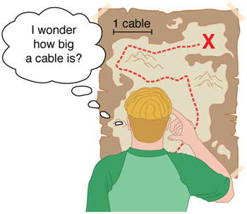
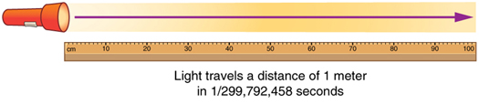

* Perform unit conversions both in the SI and English units.
* Explain the most common prefixes in the SI units and be able to write them in scientific notation.

 "){: #import-auto-id2657097}

The range of objects and phenomena studied in physics is immense. From the incredibly short lifetime of a nucleus to the age of the Earth, from the tiny sizes of sub-nuclear particles to the vast distance to the edges of the known universe, from the force exerted by a jumping flea to the force between Earth and the Sun, there are enough factors of 10 to challenge the imagination of even the most experienced scientist. Giving numerical values for physical quantities and equations for physical principles allows us to understand nature much more deeply than does qualitative description alone. To comprehend these vast ranges, we must also have accepted units in which to express them. And we shall find that (even in the potentially mundane discussion of meters, kilograms, and seconds) a profound simplicity of nature appears—all physical quantities can be expressed as combinations of only four fundamental physical quantities: length, mass, time, and electric current.

We define a **physical quantity**{: data-type="term" #import-auto-id1536256} either by *specifying how it is measured* or by **stating how it is calculated** from other measurements. For example, we define distance and time by specifying methods for measuring them, whereas we define **average speed** by stating that it is calculated as distance traveled divided by time of travel.

Measurements of physical quantities are expressed in terms of **units**{: data-type="term" #import-auto-id1666000}, which are standardized values. For example, the length of a race, which is a physical quantity, can be expressed in units of meters (for sprinters) or kilometers (for distance runners). Without standardized units, it would be extremely difficult for scientists to express and compare measured values in a meaningful way. (See [\[link\]](#import-auto-id2991258).)

 {: #import-auto-id2991258 height="225"}

There are two major systems of units used in the world: **SI units**{: data-type="term"} (also known as the metric system) and **English units**{: data-type="term"} (also known as the customary or imperial system). **English units** were historically used in nations once ruled by the British Empire and are still widely used in the United States. Virtually every other country in the world now uses SI units as the standard; the metric system is also the standard system agreed upon by scientists and mathematicians. The acronym “SI” is derived from the French *Système International*.

### SI Units: Fundamental and Derived Units

[\[link\]](#import-auto-id3094653) gives the fundamental SI units that are used throughout this textbook. This text uses non-SI units in a few applications where they are in very common use, such as the measurement of blood pressure in millimeters of mercury (mm Hg). Whenever non-SI units are discussed, they will be tied to SI units through conversions.

<table id="import-auto-id3094653" summary="A table listing fundamental S I units with two rows. One row lists the physical quantities and the other lists their units."><caption>Fundamental SI Units</caption><thead><tr>
           <th><strong>Length</strong></th>
            <th><strong>Mass</strong></th>
            <th><strong>Time</strong></th>
            <th>
              <strong>Electric Current</strong>
            </th>
          </tr></thead><tbody><tr>
            <td>meter (m)</td>
            <td>kilogram (kg)</td>
            <td>second (s)</td>
            <td>ampere (A)</td>
          </tr></tbody></table>

It is an intriguing fact that some physical quantities are more fundamental than others and that the most fundamental physical quantities can be defined **only** in terms of the procedure used to measure them. The units in which they are measured are thus called **fundamental units**{: data-type="term" #import-auto-id3097983}. In this textbook, the fundamental physical quantities are taken to be length, mass, time, and electric current. (Note that electric current will not be introduced until much later in this text.) All other physical quantities, such as force and electric charge, can be expressed as algebraic combinations of length, mass, time, and current (for example, speed is length divided by time); these units are called **derived units**{: data-type="term" #import-auto-id1950609}.

### Units of Time, Length, and Mass: The Second, Meter, and Kilogram

#### The Second

The SI unit for time, the **second**{: data-type="term" #import-auto-id2526901}(abbreviated s), has a long history. For many years it was defined as 1/86,400 of a mean solar day. More recently, a new standard was adopted to gain greater accuracy and to define the second in terms of a non-varying, or constant, physical phenomenon (because the solar day is getting longer due to very gradual slowing of the Earth’s rotation). Cesium atoms can be made to vibrate in a very steady way, and these vibrations can be readily observed and counted. In 1967 the second was redefined as the time required for 9,192,631,770 of these vibrations. (See [\[link\]](#import-auto-id2575847).) Accuracy in the fundamental units is essential, because all measurements are ultimately expressed in terms of fundamental units and can be no more accurate than are the fundamental units themselves.

 "){: #import-auto-id2575847 height="225"}

#### The Meter

The SI unit for length is the **meter**{: data-type="term" #import-auto-id1629056} (abbreviated m); its definition has also changed over time to become more accurate and precise. The meter was first defined in 1791 as 1/10,000,000 of the distance from the equator to the North Pole. This measurement was improved in 1889 by redefining the meter to be the distance between two engraved lines on a platinum-iridium bar now kept near Paris. By 1960, it had become possible to define the meter even more accurately in terms of the wavelength of light, so it was again redefined as 1,650,763.73 wavelengths of orange light emitted by krypton atoms. In 1983, the meter was given its present definition (partly for greater accuracy) as the distance light travels in a vacuum in 1/299,792,458 of a second. (See [\[link\]](#import-auto-id1381492).) This change defines the speed of light to be exactly 299,792,458 meters per second. The length of the meter will change if the speed of light is someday measured with greater accuracy.

#### The Kilogram

The SI unit for mass is the **kilogram**{: data-type="term" #import-auto-id1989656} (abbreviated kg); it is defined to be the mass of a platinum-iridium cylinder kept with the old meter standard at the International Bureau of Weights and Measures near Paris. Exact replicas of the standard kilogram are also kept at the United States’ National Institute of Standards and Technology, or NIST, located in Gaithersburg, Maryland outside of Washington D.C., and at other locations around the world. The determination of all other masses can be ultimately traced to a comparison with the standard mass.

 {: #import-auto-id1381492}

Electric current and its accompanying unit, the ampere, will be introduced in [Introduction to Electric Current, Resistance, and Ohm\'s Law](/m42339) when electricity and magnetism are covered. The initial modules in this textbook are concerned with mechanics, fluids, heat, and waves. In these subjects all pertinent physical quantities can be expressed in terms of the fundamental units of length, mass, and time.

### Metric Prefixes

SI units are part of the **metric system**{: data-type="term" #import-auto-id2678122}. The metric system is convenient for scientific and engineering calculations because the units are categorized by factors of 10. [\[link\]](#import-auto-id2643474) gives metric prefixes and symbols used to denote various factors of 10.

Metric systems have the advantage that conversions of units involve only powers of 10. There are 100 centimeters in a meter, 1000 meters in a kilometer, and so on. In nonmetric systems, such as the system of U.S. customary units, the relationships are not as simple—there are 12 inches in a foot, 5280 feet in a mile, and so on. Another advantage of the metric system is that the same unit can be used over extremely large ranges of values simply by using an appropriate metric prefix. For example, distances in meters are suitable in construction, while distances in kilometers are appropriate for air travel, and the tiny measure of nanometers are convenient in optical design. With the metric system there is no need to invent new units for particular applications.

The term **order of magnitude**{: data-type="term" #import-auto-id1363292} refers to the scale of a value expressed in the metric system. Each power of <math xmlns="http://www.w3.org/1998/Math/MathML"><semantics><mrow><mtext>10</mtext></mrow><annotation encoding="StarMath 5.0"> size 12{"10"} </annotation></semantics></math>

 in the metric system represents a different order of magnitude. For example, <math xmlns="http://www.w3.org/1998/Math/MathML"><semantics><mrow><mrow><mrow><msup><mtext>10</mtext><mrow><mn>1</mn></mrow></msup><mi>,</mi><mspace width="0.25em" /><msup><mtext>10</mtext><mrow><mn>2</mn></mrow></msup><mi>,</mi><mspace width="0.25em" /><msup><mtext>10</mtext><mrow><mn>3</mn></mrow></msup></mrow></mrow><mrow /></mrow><annotation encoding="StarMath 5.0"> size 12{"10" rSup { size 8{1} } ,`"10" rSup { size 8{2} } ,`"10" rSup { size 8{3} } } {}</annotation></semantics></math>

, and so forth are all different orders of magnitude. All quantities that can be expressed as a product of a specific power of <math xmlns="http://www.w3.org/1998/Math/MathML"><semantics><mrow><mtext>10</mtext></mrow><annotation encoding="StarMath 5.0"> size 12{"10"} </annotation></semantics></math>

 are said to be of the **same** order of magnitude. For example, the number <math xmlns="http://www.w3.org/1998/Math/MathML"><semantics><mrow><mtext>800</mtext></mrow><annotation encoding="StarMath 5.0"> size 12{"800"} </annotation></semantics></math>

 can be written as <math xmlns="http://www.w3.org/1998/Math/MathML"><semantics><mrow><mrow><mrow><mn>8</mn><mo stretchy="false">×</mo><msup><mtext>10</mtext><mrow><mn>2</mn></mrow></msup></mrow></mrow><mrow /></mrow></semantics></math>

, and the number <math xmlns="http://www.w3.org/1998/Math/MathML"><semantics><mrow><mtext>450</mtext></mrow></semantics></math>

 can be written as <math xmlns="http://www.w3.org/1998/Math/MathML"><semantics><mrow><mrow><mrow><mn>4.</mn><mrow><mn>5</mn><mo stretchy="false">×</mo><msup><mtext>10</mtext><mrow><mn>2</mn></mrow></msup></mrow></mrow></mrow><mo>.</mo></mrow></semantics></math>

 Thus, the numbers <math xmlns="http://www.w3.org/1998/Math/MathML"><semantics><mrow><mtext>800</mtext></mrow></semantics></math>

 and <math xmlns="http://www.w3.org/1998/Math/MathML"><semantics><mrow><mtext>450</mtext></mrow></semantics></math>

 are of the same order of magnitude: <math xmlns="http://www.w3.org/1998/Math/MathML"><semantics><mrow><mrow><msup><mtext>10</mtext><mrow><mn>2</mn></mrow></msup></mrow><mo>.</mo></mrow></semantics></math>

 Order of magnitude can be thought of as a ballpark estimate for the scale of a value. The diameter of an atom is on the order of <math xmlns="http://www.w3.org/1998/Math/MathML"><semantics><mrow><mrow><msup><mtext>10</mtext><mrow><mrow><mo stretchy="false">−</mo><mn>9</mn></mrow></mrow></msup><mtext> m,</mtext></mrow></mrow></semantics></math>

 while the diameter of the Sun is on the order of <math xmlns="http://www.w3.org/1998/Math/MathML"><semantics><mrow><mrow><msup><mtext>10</mtext><mrow><mn>9</mn></mrow></msup><mtext> m.</mtext></mrow><mrow /></mrow></semantics></math>

The Quest for Microscopic Standards for Basic Units

The fundamental units described in this chapter are those that produce the greatest accuracy and precision in measurement. There is a sense among physicists that, because there is an underlying microscopic substructure to matter, it would be most satisfying to base our standards of measurement on microscopic objects and fundamental physical phenomena such as the speed of light. A microscopic standard has been accomplished for the standard of time, which is based on the oscillations of the cesium atom.

The standard for length was once based on the wavelength of light (a small-scale length) emitted by a certain type of atom, but it has been supplanted by the more precise measurement of the speed of light. If it becomes possible to measure the mass of atoms or a particular arrangement of atoms such as a silicon sphere to greater precision than the kilogram standard, it may become possible to base mass measurements on the small scale. There are also possibilities that electrical phenomena on the small scale may someday allow us to base a unit of charge on the charge of electrons and protons, but at present current and charge are related to large-scale currents and forces between wires.

<table id="import-auto-id2643474" summary="A table listing metric prefixes for powers of ten and their symbols. The table has the four columns prefix, value, symbol, and example and each row mentions one example."><caption>Metric Prefixes for Powers of 10 and their Symbols</caption><thead>
           
          <tr>
            <th>Prefix</th>
            <th>Symbol</th>
            <th>Value<a data-type="footnote-link" href="#footnote1">1</a></th>
            <th colspan="4">Example (some are approximate)</th>
          </tr>
</thead><tbody>
          <tr>
            <td>exa</td>
            <td>E</td>
            <td>
              <math xmlns="http://www.w3.org/1998/Math/MathML" display="block">
                <semantics>
                  <mrow>
                    
                      <mrow>
                        <msup>
                          <mtext>10</mtext>
                          
                            <mrow>
                              <mtext>18</mtext>
                            </mrow>
                          
                        </msup>
                      </mrow>
                    
                    <mrow />
                  </mrow>
                  <annotation encoding="StarMath 5.0"> size 12{"10" rSup { size 8{"18"} } } {}</annotation>
                </semantics>
              </math> 
            </td>
            <td>exameter</td>
            <td>Em</td>
            <td>
              <math xmlns="http://www.w3.org/1998/Math/MathML" display="block">
                <semantics>
                  <mrow>
                    
                      <mrow>
                        <mrow>
                          <msup>
                            <mtext>10</mtext>
                            
                              <mrow>
                                <mtext>18</mtext>
                              </mrow>
                            
                          </msup>
                          <mtext> m</mtext>
                        </mrow>
                      </mrow>
                    
                    <mrow />
                  </mrow>
                  <annotation encoding="StarMath 5.0"> size 12{"10" rSup { size 8{"18"} } " m"} {}</annotation>
                </semantics>
              </math> 
            </td>
            <td>distance light travels in a century</td>
          </tr>
          <tr>
            <td>peta</td>
            <td>P</td>
            <td>
              <math xmlns="http://www.w3.org/1998/Math/MathML" display="block">
                <semantics>
                  <mrow>
                    
                      <mrow>
                        <msup>
                          <mtext>10</mtext>
                          
                            <mrow>
                              <mtext>15</mtext>
                            </mrow>
                          
                        </msup>
                      </mrow>
                    
                    <mrow />
                  </mrow>
                  <annotation encoding="StarMath 5.0"> size 12{"10" rSup { size 8{"15"} } } {}</annotation>
                </semantics>
              </math> 
            </td>
            <td>petasecond</td>
            <td>Ps</td>
            <td>
              <math xmlns="http://www.w3.org/1998/Math/MathML" display="block">
                <semantics>
                  <mrow>
                    
                      <mrow>
                        <mrow>
                          <msup>
                            <mtext>10</mtext>
                            
                              <mrow>
                                <mtext>15</mtext>
                              </mrow>
                            
                          </msup>
                          <mtext> s</mtext>
                        </mrow>
                      </mrow>
                    
                    <mrow />
                  </mrow>
                  <annotation encoding="StarMath 5.0"> size 12{"10" rSup { size 8{"15"} } " s"} {}</annotation>
                </semantics>
              </math> 
            </td>
            <td>30 million years</td>
          </tr>
          <tr>
            <td>tera</td>
            <td>T</td>
            <td>
              <math xmlns="http://www.w3.org/1998/Math/MathML" display="block">
                <semantics>
                  <mrow>
                    
                      <mrow>
                        <msup>
                          <mtext>10</mtext>
                          
                            <mrow>
                              <mtext>12</mtext>
                            </mrow>
                          
                        </msup>
                      </mrow>
                    
                    <mrow />
                  </mrow>
                  <annotation encoding="StarMath 5.0"> size 12{"10" rSup { size 8{"12"} } } {}</annotation>
                </semantics>
              </math> 
            </td>
            <td>terawatt</td>
            <td>TW</td>
            <td>
              <math xmlns="http://www.w3.org/1998/Math/MathML" display="block">
                <semantics>
                  <mrow>
                    
                      <mrow>
                        <mrow>
                          <msup>
                            <mtext>10</mtext>
                            
                              <mrow>
                                <mtext>12</mtext>
                              </mrow>
                            
                          </msup>
                          <mi />
                          <mtext> W</mtext>
                        </mrow>
                      </mrow>
                    
                    <mrow />
                  </mrow>
                  <annotation encoding="StarMath 5.0"> size 12{"10" rSup { size 8{"12"} } `W} {}</annotation>
                </semantics>
              </math> 
            </td>
            <td>powerful laser output</td>
          </tr>
          <tr>
            <td>giga</td>
            <td>G</td>
            <td>
              <math xmlns="http://www.w3.org/1998/Math/MathML" display="block">
                <semantics>
                  <mrow>
                    
                      <mrow>
                        <msup>
                          <mtext>10</mtext>
                          
                            <mrow>
                              <mn>9</mn>
                            </mrow>
                          
                        </msup>
                      </mrow>
                    
                    <mrow />
                  </mrow>
                  <annotation encoding="StarMath 5.0"> size 12{"10" rSup { size 8{9} } } {}</annotation>
                </semantics>
              </math> 
            </td>
            <td>gigahertz</td>
            <td>GHz</td>
            <td>
              <math xmlns="http://www.w3.org/1998/Math/MathML" display="block">
                <semantics>
                  <mrow>
                    
                      <mrow>
                        <mrow>
                          <msup>
                            <mtext>10</mtext>
                            
                              <mrow>
                                <mn>9</mn>
                              </mrow>
                            
                          </msup>
                          <mi />
                          <mtext> Hz</mtext>
                        </mrow>
                      </mrow>
                    
                    <mrow />
                  </mrow>
                  <annotation encoding="StarMath 5.0"> size 12{"10" rSup { size 8{9} } `"Hz"} {}</annotation>
                </semantics>
              </math> 
            </td>
            <td>a microwave frequency</td>
          </tr>
          <tr>
            <td>mega</td>
            <td>M</td>
            <td>
              <math xmlns="http://www.w3.org/1998/Math/MathML" display="block">
                <semantics>
                  <mrow>
                    
                      <mrow>
                        <msup>
                          <mtext>10</mtext>
                          
                            <mrow>
                              <mn>6</mn>
                            </mrow>
                          
                        </msup>
                      </mrow>
                    
                    <mrow />
                  </mrow>
                  <annotation encoding="StarMath 5.0"> size 12{"10" rSup { size 8{6} } } {}</annotation>
                </semantics>
              </math> 
            </td>
            <td>megacurie</td>
            <td>MCi</td>
            <td>
              <math xmlns="http://www.w3.org/1998/Math/MathML" display="block">
                <semantics>
                  <mrow>
                    
                      <mrow>
                        <mrow>
                          <msup>
                            <mtext>10</mtext>
                            
                              <mrow>
                                <mn>6</mn>
                              </mrow>
                            
                          </msup>
                          <mi />
                          <mtext> Ci</mtext>
                        </mrow>
                      </mrow>
                    
                    <mrow />
                  </mrow>
                  <annotation encoding="StarMath 5.0"> size 12{"10" rSup { size 8{6} } `"Ci"} {}</annotation>
                </semantics>
              </math> 
            </td>
            <td>high radioactivity</td>
          </tr>
          <tr>
            <td>kilo</td>
            <td>k</td>
            <td>
              <math xmlns="http://www.w3.org/1998/Math/MathML" display="block">
                <semantics>
                  <mrow>
                    
                      <mrow>
                        <msup>
                          <mtext>10</mtext>
                          
                            <mrow>
                              <mn>3</mn>
                            </mrow>
                          
                        </msup>
                      </mrow>
                    
                    <mrow />
                  </mrow>
                  <annotation encoding="StarMath 5.0"> size 12{"10" rSup { size 8{3} } } {}</annotation>
                </semantics>
              </math> 
            </td>
            <td>kilometer</td>
            <td>km</td>
            <td>
              <math xmlns="http://www.w3.org/1998/Math/MathML" display="block">
                <semantics>
                  <mrow>
                    
                      <mrow>
                        <mrow>
                          <msup>
                            <mtext>10</mtext>
                            
                              <mrow>
                                <mn>3</mn>
                              </mrow>
                            
                          </msup>
                          <mtext> m</mtext>
                        </mrow>
                      </mrow>
                    
                    <mrow />
                  </mrow>
                  <annotation encoding="StarMath 5.0"> size 12{"10" rSup { size 8{3} } " m"} {}</annotation>
                </semantics>
              </math> 
            </td>
            <td>about 6/10 mile</td>
          </tr>
          <tr>
            <td>hecto</td>
            <td>h</td>
            <td>
              <math xmlns="http://www.w3.org/1998/Math/MathML" display="block">
                <semantics>
                  <mrow>
                    
                      <mrow>
                        <msup>
                          <mtext>10</mtext>
                          
                            <mrow>
                              <mn>2</mn>
                            </mrow>
                          
                        </msup>
                      </mrow>
                    
                    <mrow />
                  </mrow>
                  <annotation encoding="StarMath 5.0"> size 12{"10" rSup { size 8{2} } } {}</annotation>
                </semantics>
              </math> 
            </td>
            <td>hectoliter</td>
            <td>hL</td>
            <td>
              <math xmlns="http://www.w3.org/1998/Math/MathML" display="block">
                <semantics>
                  <mrow>
                    
                      <mrow>
                        <mrow>
                          <msup>
                            <mtext>10</mtext>
                            
                              <mrow>
                                <mn>2</mn>
                              </mrow>
                            
                          </msup>
                          <mtext> L</mtext>
                        </mrow>
                      </mrow>
                    
                    <mrow />
                  </mrow>
                  <annotation encoding="StarMath 5.0"> size 12{"10" rSup { size 8{2} } " L"} {}</annotation>
                </semantics>
              </math> 
            </td>
            <td>26 gallons</td>
          </tr>
          <tr>
            <td>deka</td>
            <td>da</td>
            <td>
              <math xmlns="http://www.w3.org/1998/Math/MathML" display="block">
                <semantics>
                  <mrow>
                    
                      <mrow>
                        <msup>
                          <mtext>10</mtext>
                          
                            <mrow>
                              <mn>1</mn>
                            </mrow>
                          
                        </msup>
                      </mrow>
                    
                    <mrow />
                  </mrow>
                  <annotation encoding="StarMath 5.0"> size 12{"10" rSup { size 8{1} } } {}</annotation>
                </semantics>
              </math> 
            </td>
            <td>dekagram</td>
            <td>dag</td>
            <td>
              <math xmlns="http://www.w3.org/1998/Math/MathML" display="block">
                <semantics>
                  <mrow>
                    
                      <mrow>
                        <mrow>
                          <msup>
                            <mtext>10</mtext>
                            
                              <mrow>
                                <mn>1</mn>
                              </mrow>
                            
                          </msup>
                          <mi />
                          <mtext> g</mtext>
                        </mrow>
                      </mrow>
                    
                    <mrow />
                  </mrow>
                  <annotation encoding="StarMath 5.0"> size 12{"10" rSup { size 8{1} } `g} {}</annotation>
                </semantics>
              </math> 
            </td>
            <td>teaspoon of butter</td>
          </tr>
          <tr>
            <td>—</td>
            <td>—</td>
            <td><math xmlns="http://www.w3.org/1998/Math/MathML" display="block"><semantics><mrow><mrow><msup><mtext>10</mtext><mrow><mn>0</mn></mrow></msup></mrow><mrow /></mrow><annotation encoding="StarMath 5.0"> size 12{"10" rSup { size 8{0} } } {}</annotation></semantics></math> (=1)</td>
            <td />
            <td />
            <td />
            <td />
          </tr>
          <tr>
            <td>deci</td>
            <td>d</td>
            <td>
              <math xmlns="http://www.w3.org/1998/Math/MathML" display="block">
                <semantics>
                  <mrow>
                    
                      <mrow>
                        <msup>
                          <mtext>10</mtext>
                          
                            <mrow>
                              <mrow>
                                <mo stretchy="false">−</mo>
                                <mn>1</mn>
                              </mrow>
                            </mrow>
                          
                        </msup>
                      </mrow>
                    
                    <mrow />
                  </mrow>
                  <annotation encoding="StarMath 5.0"> size 12{"10" rSup { size 8{ - 1} } } {}</annotation>
                </semantics>
              </math> 
            </td>
            <td>deciliter</td>
            <td>dL</td>
            <td>
              <math xmlns="http://www.w3.org/1998/Math/MathML" display="block">
                <semantics>
                  <mrow>
                    
                      <mrow>
                        <mrow>
                          <msup>
                            <mtext>10</mtext>
                            
                              <mrow>
                                <mrow>
                                  <mo stretchy="false">−</mo>
                                  <mn>1</mn>
                                </mrow>
                              </mrow>
                            
                          </msup>
                          <mi />
                          <mtext> L</mtext>
                        </mrow>
                      </mrow>
                    
                    <mrow />
                  </mrow>
                  <annotation encoding="StarMath 5.0"> size 12{"10" rSup { size 8{ - 1} } `L} {}</annotation>
                </semantics>
              </math> 
            </td>
            <td>less than half a soda</td>
          </tr>
          <tr>
            <td>centi</td>
            <td>c</td>
            <td>
              <math xmlns="http://www.w3.org/1998/Math/MathML" display="block">
                <semantics>
                  <mrow>
                    
                      <mrow>
                        <msup>
                          <mtext>10</mtext>
                          
                            <mrow>
                              <mrow>
                                <mo stretchy="false">−</mo>
                                <mn>2</mn>
                              </mrow>
                            </mrow>
                          
                        </msup>
                      </mrow>
                    
                    <mrow />
                  </mrow>
                  <annotation encoding="StarMath 5.0"> size 12{"10" rSup { size 8{ - 2} } } {}</annotation>
                </semantics>
              </math> 
            </td>
            <td>centimeter</td>
            <td>cm</td>
            <td>
              <math xmlns="http://www.w3.org/1998/Math/MathML" display="block">
                <semantics>
                  <mrow>
                    
                      <mrow>
                        <mrow>
                          <msup>
                            <mtext>10</mtext>
                            
                              <mrow>
                                <mrow>
                                  <mo stretchy="false">−</mo>
                                  <mn>2</mn>
                                </mrow>
                              </mrow>
                            
                          </msup>
                          <mi />
                          <mtext> m</mtext>
                        </mrow>
                      </mrow>
                    
                    <mrow />
                  </mrow>
                  <annotation encoding="StarMath 5.0"> size 12{"10" rSup { size 8{ - 2} } `m} {}</annotation>
                </semantics>
              </math> 
            </td>
            <td>fingertip thickness</td>
          </tr>
          <tr>
            <td>milli</td>
            <td>m</td>
            <td>
              <math xmlns="http://www.w3.org/1998/Math/MathML" display="block">
                <semantics>
                  <mrow>
                    
                      <mrow>
                        <msup>
                          <mtext>10</mtext>
                          
                            <mrow>
                              <mrow>
                                <mo stretchy="false">−</mo>
                                <mn>3</mn>
                              </mrow>
                            </mrow>
                          
                        </msup>
                      </mrow>
                    
                    <mrow />
                  </mrow>
                  <annotation encoding="StarMath 5.0"> size 12{"10" rSup { size 8{ - 3} } } {}</annotation>
                </semantics>
              </math> 
            </td>
            <td>millimeter</td>
            <td>mm</td>
            <td>
              <math xmlns="http://www.w3.org/1998/Math/MathML" display="block">
                <semantics>
                  <mrow>
                    
                      <mrow>
                        <mrow>
                          <msup>
                            <mtext>10</mtext>
                            
                              <mrow>
                                <mrow>
                                  <mo stretchy="false">−</mo>
                                  <mn>3</mn>
                                </mrow>
                              </mrow>
                            
                          </msup>
                          <mi />
                          <mtext> m</mtext>
                        </mrow>
                      </mrow>
                    
                    <mrow />
                  </mrow>
                  <annotation encoding="StarMath 5.0"> size 12{"10" rSup { size 8{ - 3} } `m} {}</annotation>
                </semantics>
              </math> 
            </td>
            <td>flea at its shoulders</td>
          </tr>
          <tr>
            <td>micro</td>
            <td>µ</td>
            <td>
              <math xmlns="http://www.w3.org/1998/Math/MathML" display="block">
                <semantics>
                  <mrow>
                    
                      <mrow>
                        <msup>
                          <mtext>10</mtext>
                          
                            <mrow>
                              <mrow>
                                <mo stretchy="false">−</mo>
                                <mn>6</mn>
                              </mrow>
                            </mrow>
                          
                        </msup>
                      </mrow>
                    
                    <mrow />
                  </mrow>
                  <annotation encoding="StarMath 5.0"> size 12{"10" rSup { size 8{ - 6} } } {}</annotation>
                </semantics>
              </math> 
            </td>
            <td>micrometer</td>
            <td>µm</td>
            <td>
              <math xmlns="http://www.w3.org/1998/Math/MathML" display="block">
                <semantics>
                  <mrow>
                    
                      <mrow>
                        <mrow>
                          <msup>
                            <mtext>10</mtext>
                            
                              <mrow>
                                <mrow>
                                  <mo stretchy="false">−</mo>
                                  <mn>6</mn>
                                </mrow>
                              </mrow>
                            
                          </msup>
                          <mi />
                          <mtext> m</mtext>
                        </mrow>
                      </mrow>
                    
                    <mrow />
                  </mrow>
                  <annotation encoding="StarMath 5.0"> size 12{"10" rSup { size 8{ - 6} } `m} {}</annotation>
                </semantics>
              </math> 
            </td>
            <td>detail in microscope</td>
          </tr>
          <tr>
            <td>nano</td>
            <td>n</td>
            <td>
              <math xmlns="http://www.w3.org/1998/Math/MathML" display="block">
                <semantics>
                  <mrow>
                    
                      <mrow>
                        <msup>
                          <mtext>10</mtext>
                          
                            <mrow>
                              <mrow>
                                <mo stretchy="false">−</mo>
                                <mn>9</mn>
                              </mrow>
                            </mrow>
                          
                        </msup>
                      </mrow>
                    
                    <mrow />
                  </mrow>
                  <annotation encoding="StarMath 5.0"> size 12{"10" rSup { size 8{ - 9} } } {}</annotation>
                </semantics>
              </math> 
            </td>
            <td>nanogram</td>
            <td>ng</td>
            <td>
              <math xmlns="http://www.w3.org/1998/Math/MathML" display="block">
                <semantics>
                  <mrow>
                    
                      <mrow>
                        <mrow>
                          <msup>
                            <mtext>10</mtext>
                            
                              <mrow>
                                <mrow>
                                  <mo stretchy="false">−</mo>
                                  <mn>9</mn>
                                </mrow>
                              </mrow>
                            
                          </msup>
                          <mi />
                          <mtext> g</mtext>
                        </mrow>
                      </mrow>
                    
                    <mrow />
                  </mrow>
                  <annotation encoding="StarMath 5.0"> size 12{"10" rSup { size 8{ - 9} } `g} {}</annotation>
                </semantics>
              </math> 
            </td>
            <td>small speck of dust</td>
          </tr>
          <tr>
            <td>pico</td>
            <td>p</td>
            <td>
              <math xmlns="http://www.w3.org/1998/Math/MathML" display="block">
                <semantics>
                  <mrow>
                    
                      <mrow>
                        <msup>
                          <mtext>10</mtext>
                          
                            <mrow>
                              <mrow>
                                <mo stretchy="false">−</mo>
                                <mtext>12</mtext>
                              </mrow>
                            </mrow>
                          
                        </msup>
                      </mrow>
                    
                    <mrow />
                  </mrow>
                  <annotation encoding="StarMath 5.0"> size 12{"10" rSup { size 8{ - "12"} } } {}</annotation>
                </semantics>
              </math> 
            </td>
            <td>picofarad</td>
            <td>pF</td>
            <td>
              <math xmlns="http://www.w3.org/1998/Math/MathML" display="block">
                <semantics>
                  <mrow>
                    
                      <mrow>
                        <mrow>
                          <msup>
                            <mtext>10</mtext>
                            
                              <mrow>
                                <mrow>
                                  <mo stretchy="false">−</mo>
                                  <mtext>12</mtext>
                                </mrow>
                              </mrow>
                            
                          </msup>
                          <mtext> F</mtext>
                        </mrow>
                      </mrow>
                    
                    <mrow />
                  </mrow>
                  <annotation encoding="StarMath 5.0"> size 12{"10" rSup { size 8{ - "12"} } F} {}</annotation>
                </semantics>
              </math> 
            </td>
            <td>small capacitor in radio</td>
          </tr>
          <tr>
            <td>femto</td>
            <td>f</td>
            <td>
              <math xmlns="http://www.w3.org/1998/Math/MathML" display="block">
                <semantics>
                  <mrow>
                    
                      <mrow>
                        <msup>
                          <mtext>10</mtext>
                          
                            <mrow>
                              <mrow>
                                <mo stretchy="false">−</mo>
                                <mtext>15</mtext>
                              </mrow>
                            </mrow>
                          
                        </msup>
                      </mrow>
                    
                    <mrow />
                  </mrow>
                  <annotation encoding="StarMath 5.0"> size 12{"10" rSup { size 8{ - "15"} } } {}</annotation>
                </semantics>
              </math> 
            </td>
            <td>femtometer</td>
            <td>fm</td>
            <td>
              <math xmlns="http://www.w3.org/1998/Math/MathML" display="block">
                <semantics>
                  <mrow>
                    
                      <mrow>
                        <mrow>
                          <msup>
                            <mtext>10</mtext>
                            
                              <mrow>
                                <mrow>
                                  <mo stretchy="false">−</mo>
                                  <mtext>15</mtext>
                                </mrow>
                              </mrow>
                            
                          </msup>
                          <mi />
                          <mtext> m</mtext>
                        </mrow>
                      </mrow>
                    
                    <mrow />
                  </mrow>
                  <annotation encoding="StarMath 5.0"> size 12{"10" rSup { size 8{ - "15"} } `m} {}</annotation>
                </semantics>
              </math> 
            </td>
            <td>size of a proton</td>
          </tr>
          <tr>
            <td>atto</td>
            <td>a</td>
            <td>
              <math xmlns="http://www.w3.org/1998/Math/MathML" display="block">
                <semantics>
                  <mrow>
                    
                      <mrow>
                        <msup>
                          <mtext>10</mtext>
                          
                            <mrow>
                              <mrow>
                                <mo stretchy="false">−</mo>
                                <mtext>18</mtext>
                              </mrow>
                            </mrow>
                          
                        </msup>
                      </mrow>
                    
                    <mrow />
                  </mrow>
                  <annotation encoding="StarMath 5.0"> size 12{"10" rSup { size 8{ - "18"} } } {}</annotation>
                </semantics>
              </math> 
            </td>
            <td>attosecond</td>
            <td>as</td>
            <td>
              <math xmlns="http://www.w3.org/1998/Math/MathML" display="block">
                <semantics>
                  <mrow>
                    
                      <mrow>
                        <mrow>
                          <msup>
                            <mtext>10</mtext>
                            
                              <mrow>
                                <mrow>
                                  <mo stretchy="false">−</mo>
                                  <mtext>18</mtext>
                                </mrow>
                              </mrow>
                            
                          </msup>
                          <mi />
                          <mtext> s</mtext>
                        </mrow>
                      </mrow>
                    
                    <mrow />
                  </mrow>
                  <annotation encoding="StarMath 5.0"> size 12{"10" rSup { size 8{ - "18"} } `s} {}</annotation>
                </semantics>
              </math> 
            </td>
            <td>time light crosses an atom</td>
          </tr>
        </tbody></table>

### Known Ranges of Length, Mass, and Time

The vastness of the universe and the breadth over which physics applies are illustrated by the wide range of examples of known lengths, masses, and times in [\[link\]](#import-auto-id1677589). Examination of this table will give you some feeling for the range of possible topics and numerical values. (See [\[link\]](#import-auto-id3143533) and [\[link\]](#import-auto-id3083060).)

 "){: #import-auto-id3143533}

"){: #import-auto-id3083060 height="250"}

### Unit Conversion and Dimensional Analysis

It is often necessary to convert from one type of unit to another. For example, if you are reading a European cookbook, some quantities may be expressed in units of liters and you need to convert them to cups. Or, perhaps you are reading walking directions from one location to another and you are interested in how many miles you will be walking. In this case, you will need to convert units of feet to miles.

Let us consider a simple example of how to convert units. Let us say that we want to convert 80 meters (m) to kilometers (km).

The first thing to do is to list the units that you have and the units that you want to convert to. In this case, we have units in **meters** and we want to convert to **kilometers**.

Next, we need to determine a **conversion factor**{: data-type="term" #import-auto-id2657858} relating meters to kilometers. A conversion factor is a ratio expressing how many of one unit are equal to another unit. For example, there are 12 inches in 1 foot, 100 centimeters in 1 meter, 60 seconds in 1 minute, and so on. In this case, we know that there are 1,000 meters in 1 kilometer.

Now we can set up our unit conversion. We will write the units that we have and then multiply them by the conversion factor so that the units cancel out, as shown:

<math xmlns="http://www.w3.org/1998/Math/MathML"><semantics><mrow><mrow><mrow><mn>80</mn> <menclose notation="updiagonalstrike"><mtext>m</mtext></menclose><mrow><mrow><mo stretchy="false">×</mo><mfrac><mtext>1 km</mtext><mrow><mn>1000</mn><menclose notation="updiagonalstrike"><mtext>m</mtext></menclose></mrow></mfrac></mrow><mo stretchy="false">=</mo><mn>0</mn></mrow><mtext>.080 km.</mtext></mrow></mrow><mrow /></mrow><annotation encoding="StarMath 5.0"> size 12{"80"" m" times { {"1 km"} over {"1000 m"} } =0 "." "080"`"km"} {}</annotation></semantics></math>

Note that the unwanted m unit cancels, leaving only the desired km unit. You can use this method to convert between any types of unit.

Click [\[link\]](/m42720) for a more complete list of conversion factors.

<table id="import-auto-id1677589" summary="A table is listing approximate values of length, mass, and time with each row containing an example of these."><caption>Approximate Values of Length, Mass, and Time</caption><thead>
      <tr>
            <th colspan="2">Lengths in meters</th>
               <th colspan="2">Masses in kilograms (more precise values in parentheses)</th>
            <th colspan="2">Times in seconds (more precise values in parentheses)</th>
           </tr>
</thead><tbody>
          <tr>
            <td>
              <math xmlns="http://www.w3.org/1998/Math/MathML">
                <semantics>
                  <mrow>
                    
                      <mrow>
                        <msup>
                          <mtext>10</mtext>
                          
                            <mrow>
                              <mrow>
                                <mo stretchy="false">−</mo>
                                <mtext>18</mtext>
                              </mrow>
                            </mrow>
                          
                        </msup>
                      </mrow>
                    
                    <mrow />
                  </mrow>
                 
                </semantics>
              </math> 
            </td>
            <td>Present experimental limit to smallest observable detail</td>
            <td>
              <math xmlns="http://www.w3.org/1998/Math/MathML" display="block">
                <semantics>
                  <mrow>
                    
                      <mrow>
                        <msup>
                          <mtext>10</mtext>
                          
                            <mrow>
                              <mrow>
                                <mo stretchy="false">−</mo>
                                <mtext>30</mtext>
                              </mrow>
                            </mrow>
                          
                        </msup>
                      </mrow>
                    
                    <mrow />
                  </mrow>
                  <annotation encoding="StarMath 5.0"> size 12{"10" rSup { size 8{ - "30"} } } {}</annotation>
                </semantics>
              </math> 
            </td>
            <td>Mass of an electron <math xmlns="http://www.w3.org/1998/Math/MathML"><semantics>
<mfenced open="(" close=")">
<mrow><mrow><mrow><mn>9</mn><mtext>.</mtext><mrow><mtext>11</mtext><mo stretchy="false">×</mo><msup><mtext>10</mtext><mrow><mrow><mo stretchy="false">−</mo><mtext>31</mtext></mrow></mrow></msup></mrow><mspace width="0.25em" /><mtext> kg</mtext></mrow></mrow><mrow /></mrow></mfenced><annotation encoding="StarMath 5.0"> size 12{9 "." "11" times "10" rSup { size 8{ - "31"} } `"kg"} {}</annotation></semantics></math></td>
            <td>
              <math xmlns="http://www.w3.org/1998/Math/MathML" display="block">
                <semantics>
                  <mrow>
                    
                      <mrow>
                        <msup>
                          <mtext>10</mtext>
                          
                            <mrow>
                              <mrow>
                                <mo stretchy="false">−</mo>
                                <mtext>23</mtext>
                              </mrow>
                            </mrow>
                          
                        </msup>
                      </mrow>
                    
                  </mrow>
                  <annotation encoding="StarMath 5.0"> size 12{"10" rSup { size 8{ - "23"} } } {}</annotation>
                </semantics>
              </math> 
            </td>
            <td>Time for light to cross a proton</td>
          </tr>
          <tr>
            <td>
              <math xmlns="http://www.w3.org/1998/Math/MathML" display="block">
                <semantics>
                  <mrow>
                    
                      <mrow>
                        <msup>
                          <mtext>10</mtext>
                          
                            <mrow>
                              <mrow>
                                <mo stretchy="false">−</mo>
                                <mtext>15</mtext>
                              </mrow>
                            </mrow>
                          
                        </msup>
                      </mrow>
                    
                  </mrow>
                  <annotation encoding="StarMath 5.0"> size 12{"10" rSup { size 8{ - "15"} } } {}</annotation>
                </semantics>
              </math> 
            </td>
            <td>Diameter of a proton</td>
            <td>
              <math xmlns="http://www.w3.org/1998/Math/MathML" display="block">
                <semantics>
                  <mrow>
                    
                      <mrow>
                        <msup>
                          <mtext>10</mtext>
                          
                            <mrow>
                              <mrow>
                                <mo stretchy="false">−</mo>
                                <mtext>27</mtext>
                              </mrow>
                            </mrow>
                          
                        </msup>
                      </mrow>
                    
                    <mrow />
                  </mrow>
                  <annotation encoding="StarMath 5.0"> size 12{"10" rSup { size 8{ - "27"} } } {}</annotation>
                </semantics>
              </math> 
            </td>
            <td>Mass of a hydrogen atom <math xmlns="http://www.w3.org/1998/Math/MathML"><semantics><mfenced open="(" close=")"><mrow><mrow><mrow><mn>1</mn><mtext>.</mtext><mrow><mtext>67</mtext><mo stretchy="false">×</mo><msup><mtext>10</mtext><mrow><mrow><mo stretchy="false">−</mo><mtext>27</mtext></mrow></mrow></msup></mrow><mspace width="0.25em" /><mtext> kg</mtext></mrow></mrow><mrow /></mrow></mfenced><annotation encoding="StarMath 5.0"> size 12{1 "." "67" times "10" rSup { size 8{ - "27"} } `"kg"} {}</annotation></semantics></math> </td>
            <td>
              <math xmlns="http://www.w3.org/1998/Math/MathML" display="block">
                <semantics>
                  <mrow>
                    
                      <mrow>
                        <msup>
                          <mtext>10</mtext>
                          
                            <mrow>
                              <mrow>
                                <mo stretchy="false">−</mo>
                                <mtext>22</mtext>
                              </mrow>
                            </mrow>
                          
                        </msup>
                      </mrow>
                    
                    <mrow />
                  </mrow>
                  <annotation encoding="StarMath 5.0"> size 12{"10" rSup { size 8{ - "22"} } } {}</annotation>
                </semantics>
              </math> 
            </td>
            <td>Mean life of an extremely unstable nucleus</td>
          </tr>
          <tr>
            <td>
              <math xmlns="http://www.w3.org/1998/Math/MathML" display="block">
                <semantics>
                  <mrow>
                    
                      <mrow>
                        <msup>
                          <mtext>10</mtext>
                          
                            <mrow>
                              <mrow>
                                <mo stretchy="false">−</mo>
                                <mtext>14</mtext>
                              </mrow>
                            </mrow>
                          
                        </msup>
                      </mrow>
                    
                    <mrow />
                  </mrow>
                  <annotation encoding="StarMath 5.0"> size 12{"10" rSup { size 8{ - "14"} } } {}</annotation>
                </semantics>
              </math> 
            </td>
            <td>Diameter of a uranium nucleus</td>
            <td>
              <math xmlns="http://www.w3.org/1998/Math/MathML" display="block">
                <semantics>
                  <mrow>
                    
                      <mrow>
                        <msup>
                          <mtext>10</mtext>
                          
                            <mrow>
                              <mrow>
                                <mo stretchy="false">−</mo>
                                <mtext>15</mtext>
                              </mrow>
                            </mrow>
                          
                        </msup>
                      </mrow>
                    
                    <mrow />
                  </mrow>
                  <annotation encoding="StarMath 5.0"> size 12{"10" rSup { size 8{ - "15"} } } {}</annotation>
                </semantics>
              </math> 
            </td>
            <td>Mass of a bacterium</td>
            <td>
              <math xmlns="http://www.w3.org/1998/Math/MathML" display="block">
                <semantics>
                  <mrow>
                    
                      <mrow>
                        <msup>
                          <mtext>10</mtext>
                          
                            <mrow>
                              <mrow>
                                <mo stretchy="false">−</mo>
                                <mtext>15</mtext>
                              </mrow>
                            </mrow>
                          
                        </msup>
                      </mrow>
                    
                    <mrow />
                  </mrow>
                  <annotation encoding="StarMath 5.0"> size 12{"10" rSup { size 8{ - "15"} } } {}</annotation>
                </semantics>
              </math> 
            </td>
            <td>Time for one oscillation of visible light</td>
          </tr>
          <tr>
            <td>
              <math xmlns="http://www.w3.org/1998/Math/MathML" display="block">
                <semantics>
                  <mrow>
                    
                      <mrow>
                        <msup>
                          <mtext>10</mtext>
                          
                            <mrow>
                              <mrow>
                                <mo stretchy="false">−</mo>
                                <mtext>10</mtext>
                              </mrow>
                            </mrow>
                          
                        </msup>
                      </mrow>
                    
                    <mrow />
                  </mrow>
                  <annotation encoding="StarMath 5.0"> size 12{"10" rSup { size 8{ - "10"} } } {}</annotation>
                </semantics>
              </math> 
            </td>
            <td>Diameter of a hydrogen atom</td>
            <td>
              <math xmlns="http://www.w3.org/1998/Math/MathML" display="block">
                <semantics>
                  <mrow>
                    
                      <mrow>
                        <msup>
                          <mtext>10</mtext>
                          
                            <mrow>
                              <mrow>
                                <mo stretchy="false">−</mo>
                                <mn>5</mn>
                              </mrow>
                            </mrow>
                          
                        </msup>
                      </mrow>
                    
                    <mrow />
                  </mrow>
                  <annotation encoding="StarMath 5.0"> size 12{"10" rSup { size 8{ - 5} } } {}</annotation>
                </semantics>
              </math> 
            </td>
            <td>Mass of a mosquito</td>
            <td>
              <math xmlns="http://www.w3.org/1998/Math/MathML" display="block">
                <semantics>
                  <mrow>
                    
                      <mrow>
                        <msup>
                          <mtext>10</mtext>
                          
                            <mrow>
                              <mrow>
                                <mo stretchy="false">−</mo>
                                <mtext>13</mtext>
                              </mrow>
                            </mrow>
                          
                        </msup>
                      </mrow>
                    
                    <mrow />
                  </mrow>
                  <annotation encoding="StarMath 5.0"> size 12{"10" rSup { size 8{ - "13"} } } {}</annotation>
                </semantics>
              </math> 
            </td>
            <td>Time for one vibration of an atom in a solid</td>
          </tr>
          <tr>
            <td>
              <math xmlns="http://www.w3.org/1998/Math/MathML" display="block">
                <semantics>
                  <mrow>
                    
                      <mrow>
                        <msup>
                          <mtext>10</mtext>
                          
                            <mrow>
                              <mrow>
                                <mo stretchy="false">−</mo>
                                <mn>8</mn>
                              </mrow>
                            </mrow>
                          
                        </msup>
                      </mrow>
                    
                    <mrow />
                  </mrow>
                  <annotation encoding="StarMath 5.0"> size 12{"10" rSup { size 8{ - 8} } } {}</annotation>
                </semantics>
              </math> 
            </td>
            <td>Thickness of membranes in cells of living organisms</td>
            <td>
              <math xmlns="http://www.w3.org/1998/Math/MathML" display="block">
                <semantics>
                  <mrow>
                    
                      <mrow>
                        <msup>
                          <mtext>10</mtext>
                          
                            <mrow>
                              <mrow>
                                <mo stretchy="false">−</mo>
                                <mn>2</mn>
                              </mrow>
                            </mrow>
                          
                        </msup>
                      </mrow>
                    
                    <mrow />
                  </mrow>
                  <annotation encoding="StarMath 5.0"> size 12{"10" rSup { size 8{ - 2} } } {}</annotation>
                </semantics>
              </math> 
            </td>
            <td>Mass of a hummingbird</td>
            <td>
              <math xmlns="http://www.w3.org/1998/Math/MathML" display="block">
                <semantics>
                  <mrow>
                    
                      <mrow>
                        <msup>
                          <mtext>10</mtext>
                          
                            <mrow>
                              <mrow>
                                <mo stretchy="false">−</mo>
                                <mn>8</mn>
                              </mrow>
                            </mrow>
                          
                        </msup>
                      </mrow>
                    
                    <mrow />
                  </mrow>
                  <annotation encoding="StarMath 5.0"> size 12{"10" rSup { size 8{ - 8} } } {}</annotation>
                </semantics>
              </math> 
            </td>
            <td>Time for one oscillation of an FM radio wave</td>
          </tr>
          <tr>
            <td>
              <math xmlns="http://www.w3.org/1998/Math/MathML" display="block">
                <semantics>
                  <mrow>
                    
                      <mrow>
                        <msup>
                          <mtext>10</mtext>
                          
                            <mrow>
                              <mrow>
                                <mo stretchy="false">−</mo>
                                <mn>6</mn>
                              </mrow>
                            </mrow>
                          
                        </msup>
                      </mrow>
                    
                    <mrow />
                  </mrow>
                  <annotation encoding="StarMath 5.0"> size 12{"10" rSup { size 8{ - 6} } } {}</annotation>
                </semantics>
              </math> 
            </td>
            <td>Wavelength of visible light</td>
            <td><math xmlns="http://www.w3.org/1998/Math/MathML" display="block"><semantics><mrow><mtext>1</mtext>
</mrow><annotation encoding="StarMath 5.0"> size 12{"1"} {}</annotation></semantics></math> </td>
            <td>Mass of a liter of water (about a quart)</td>
            <td>
              <math xmlns="http://www.w3.org/1998/Math/MathML" display="block">
                <semantics>
                  <mrow>
                    
                      <mrow>
                        <msup>
                          <mtext>10</mtext>
                          
                            <mrow>
                              <mrow>
                                <mo stretchy="false">−</mo>
                                <mn>3</mn>
                              </mrow>
                            </mrow>
                          
                        </msup>
                      </mrow>
                    
                    <mrow />
                  </mrow>
                  <annotation encoding="StarMath 5.0"> size 12{"10" rSup { size 8{ - 3} } } {}</annotation>
                </semantics>
              </math> 
            </td>
            <td>Duration of a nerve impulse</td>
          </tr>
          <tr>
            <td>
              <math xmlns="http://www.w3.org/1998/Math/MathML" display="block">
                <semantics>
                  <mrow>
                    
                      <mrow>
                        <msup>
                          <mtext>10</mtext>
                          
                            <mrow>
                              <mrow>
                                <mo stretchy="false">−</mo>
                                <mn>3</mn>
                              </mrow>
                            </mrow>
                          
                        </msup>
                      </mrow>
                    
                    <mrow />
                  </mrow>
                  <annotation encoding="StarMath 5.0"> size 12{"10" rSup { size 8{ - 3} } } {}</annotation>
                </semantics>
              </math> 
            </td>
            <td>Size of a grain of sand</td>
            <td>
              <math xmlns="http://www.w3.org/1998/Math/MathML" display="block">
                <semantics>
                  <mrow>
                    
                      <mrow>
                        <msup>
                          <mtext>10</mtext>
                          
                            <mrow>
                              <mn>2</mn>
                            </mrow>
                          
                        </msup>
                      </mrow>
                    
                    <mrow />
                  </mrow>
                  <annotation encoding="StarMath 5.0"> size 12{"10" rSup { size 8{2} } } {}</annotation>
                </semantics>
              </math> 
            </td>
            <td>Mass of a person</td>
            <td><math xmlns="http://www.w3.org/1998/Math/MathML" display="block"><semantics><mrow><mtext>1</mtext>
</mrow><annotation encoding="StarMath 5.0"> size 12{"1"} {}</annotation></semantics></math> </td>
            <td>Time for one heartbeat</td>
          </tr>
          <tr>
            <td><math xmlns="http://www.w3.org/1998/Math/MathML" display="block"><semantics><mrow><mtext>1</mtext>
</mrow><annotation encoding="StarMath 5.0"> size 12{"1"} {}</annotation></semantics></math> </td>
            <td>Height of a 4-year-old child</td>
            <td>
              <math xmlns="http://www.w3.org/1998/Math/MathML" display="block">
                <semantics>
                  <mrow>
                    
                      <mrow>
                        <msup>
                          <mtext>10</mtext>
                          
                            <mrow>
                              <mn>3</mn>
                            </mrow>
                          
                        </msup>
                      </mrow>
                    
                    <mrow />
                  </mrow>
                  <annotation encoding="StarMath 5.0"> size 12{"10" rSup { size 8{3} } } {}</annotation>
                </semantics>
              </math> 
            </td>
            <td>Mass of a car</td>
            <td>
              <math xmlns="http://www.w3.org/1998/Math/MathML" display="block">
                <semantics>
                  <mrow>
                    
                      <mrow>
                        <msup>
                          <mtext>10</mtext>
                          
                            <mrow>
                              <mn>5</mn>
                            </mrow>
                          
                        </msup>
                      </mrow>
                    
                    <mrow />
                  </mrow>
                  <annotation encoding="StarMath 5.0"> size 12{"10" rSup { size 8{5} } } {}</annotation>
                </semantics>
              </math> 
            </td>
            <td>One day <math xmlns="http://www.w3.org/1998/Math/MathML"><semantics><mfenced open="(" close=")"><mrow><mrow><mrow><mn>8</mn><mtext>.</mtext><mrow><mtext>64</mtext><mo stretchy="false">×</mo><msup><mtext>10</mtext><mrow><mn>4</mn></mrow></msup></mrow><mspace width="0.25em" /><mtext>s</mtext></mrow></mrow><mrow /></mrow></mfenced><annotation encoding="StarMath 5.0"> size 12{8 "." "64" times "10" rSup { size 8{4} } `s} {}</annotation></semantics></math></td>
          </tr>
          <tr>
            <td>
              <math xmlns="http://www.w3.org/1998/Math/MathML" display="block">
                <semantics>
                  <mrow>
                    
                      <mrow>
                        <msup>
                          <mtext>10</mtext>
                          
                            <mrow>
                              <mn>2</mn>
                            </mrow>
                          
                        </msup>
                      </mrow>
                    
                    <mrow />
                  </mrow>
                  <annotation encoding="StarMath 5.0"> size 12{"10" rSup { size 8{2} } } {}</annotation>
                </semantics>
              </math> 
            </td>
            <td>Length of a football field</td>
            <td>
              <math xmlns="http://www.w3.org/1998/Math/MathML" display="block">
                <semantics>
                  <mrow>
                    
                      <mrow>
                        <msup>
                          <mtext>10</mtext>
                          
                            <mrow>
                              <mn>8</mn>
                            </mrow>
                          
                        </msup>
                      </mrow>
                    
                    <mrow />
                  </mrow>
                  <annotation encoding="StarMath 5.0"> size 12{"10" rSup { size 8{8} } } {}</annotation>
                </semantics>
              </math> 
            </td>
            <td>Mass of a large ship </td>
            <td>
              <math xmlns="http://www.w3.org/1998/Math/MathML" display="block">
                <semantics>
                  <mrow>
                    
                      <mrow>
                        <msup>
                          <mtext>10</mtext>
                          
                            <mrow>
                              <mn>7</mn>
                            </mrow>
                          
                        </msup>
                      </mrow>
                    
                    <mrow />
                  </mrow>
                  <annotation encoding="StarMath 5.0"> size 12{"10" rSup { size 8{7} } } {}</annotation>
                </semantics>
              </math> 
            </td>
            <td>One year (y) <math xmlns="http://www.w3.org/1998/Math/MathML"><semantics><mfenced open="(" close=")"><mrow><mrow><mrow><mn>3</mn><mtext>.</mtext><mrow><mtext>16</mtext><mo stretchy="false">×</mo><msup><mtext>10</mtext><mrow><mn>7</mn></mrow></msup></mrow><mspace width="0.25em" /><mtext>s</mtext></mrow></mrow><mrow /></mrow></mfenced><annotation encoding="StarMath 5.0"> size 12{3 "." "16" times "10" rSup { size 8{7} } `s} {}</annotation></semantics></math></td>
          </tr>
          <tr>
            <td>
              <math xmlns="http://www.w3.org/1998/Math/MathML" display="block">
                <semantics>
                  <mrow>
                    
                      <mrow>
                        <msup>
                          <mtext>10</mtext>
                          
                            <mrow>
                              <mn>4</mn>
                            </mrow>
                          
                        </msup>
                      </mrow>
                    
                    <mrow />
                  </mrow>
                  <annotation encoding="StarMath 5.0"> size 12{"10" rSup { size 8{4} } } {}</annotation>
                </semantics>
              </math> 
            </td>
            <td>Greatest ocean depth</td>
            <td>
              <math xmlns="http://www.w3.org/1998/Math/MathML" display="block">
                <semantics>
                  <mrow>
                    
                      <mrow>
                        <msup>
                          <mtext>10</mtext>
                          
                            <mrow>
                              <mtext>12</mtext>
                            </mrow>
                          
                        </msup>
                      </mrow>
                    
                    <mrow />
                  </mrow>
                  <annotation encoding="StarMath 5.0"> size 12{"10" rSup { size 8{"12"} } } {}</annotation>
                </semantics>
              </math> 
            </td>
            <td>Mass of a large iceberg</td>
            <td>
              <math xmlns="http://www.w3.org/1998/Math/MathML" display="block">
                <semantics>
                  <mrow>
                    
                      <mrow>
                        <msup>
                          <mtext>10</mtext>
                          
                            <mrow>
                              <mn>9</mn>
                            </mrow>
                          
                        </msup>
                      </mrow>
                    
                    <mrow />
                  </mrow>
                  <annotation encoding="StarMath 5.0"> size 12{"10" rSup { size 8{9} } } {}</annotation>
                </semantics>
              </math> 
            </td>
            <td>About half the life expectancy of a human</td>
          </tr>
          <tr>
            <td>
              <math xmlns="http://www.w3.org/1998/Math/MathML" display="block">
                <semantics>
                  <mrow>
                    
                      <mrow>
                        <msup>
                          <mtext>10</mtext>
                          
                            <mrow>
                              <mn>7</mn>
                            </mrow>
                          
                        </msup>
                      </mrow>
                    
                    <mrow />
                  </mrow>
                  <annotation encoding="StarMath 5.0"> size 12{"10" rSup { size 8{7} } } {}</annotation>
                </semantics>
              </math> 
            </td>
            <td>Diameter of the Earth</td>
            <td>
              <math xmlns="http://www.w3.org/1998/Math/MathML" display="block">
                <semantics>
                  <mrow>
                    
                      <mrow>
                        <msup>
                          <mtext>10</mtext>
                          
                            <mrow>
                              <mtext>15</mtext>
                            </mrow>
                          
                        </msup>
                      </mrow>
                    
                    <mrow />
                  </mrow>
                  <annotation encoding="StarMath 5.0"> size 12{"10" rSup { size 8{"15"} } } {}</annotation>
                </semantics>
              </math> 
            </td>
            <td>Mass of the nucleus of a comet</td>
            <td>
              <math xmlns="http://www.w3.org/1998/Math/MathML" display="block">
                <semantics>
                  <mrow>
                    
                      <mrow>
                        <msup>
                          <mtext>10</mtext>
                          
                            <mrow>
                              <mtext>11</mtext>
                            </mrow>
                          
                        </msup>
                      </mrow>
                    
                    <mrow />
                  </mrow>
                  <annotation encoding="StarMath 5.0"> size 12{"10" rSup { size 8{"11"} } } {}</annotation>
                </semantics>
              </math> 
            </td>
            <td>Recorded history</td>
          </tr>
          <tr>
            <td>
              <math xmlns="http://www.w3.org/1998/Math/MathML" display="block">
                <semantics>
                  <mrow>
                    
                      <mrow>
                        <msup>
                          <mtext>10</mtext>
                          
                            <mrow>
                              <mtext>11</mtext>
                            </mrow>
                          
                        </msup>
                      </mrow>
                    
                    <mrow />
                  </mrow>
                  <annotation encoding="StarMath 5.0"> size 12{"10" rSup { size 8{"11"} } } {}</annotation>
                </semantics>
              </math> 
            </td>
            <td>Distance from the Earth to the Sun</td>
            <td>
              <math xmlns="http://www.w3.org/1998/Math/MathML" display="block">
                <semantics>
                  <mrow>
                    
                      <mrow>
                        <msup>
                          <mtext>10</mtext>
                          
                            <mrow>
                              <mtext>23</mtext>
                            </mrow>
                          
                        </msup>
                      </mrow>
                    
                    <mrow />
                  </mrow>
                  <annotation encoding="StarMath 5.0"> size 12{"10" rSup { size 8{"23"} } } {}</annotation>
                </semantics>
              </math> 
            </td>
            <td>Mass of the Moon <math xmlns="http://www.w3.org/1998/Math/MathML"><semantics><mfenced open="(" close=")"><mrow><mrow><mrow><mn>7</mn><mtext>.</mtext><mrow><mtext>35</mtext><mo stretchy="false">×</mo><msup><mtext>10</mtext><mrow><mtext>22</mtext></mrow></msup></mrow><mspace width="0.25em" /><mtext> kg</mtext></mrow></mrow><mrow /></mrow></mfenced><annotation encoding="StarMath 5.0"> size 12{7 "." "35" times "10" rSup { size 8{"22"} } `"kg"} {}</annotation></semantics></math></td>
            <td>
              <math xmlns="http://www.w3.org/1998/Math/MathML" display="block">
                <semantics>
                  <mrow>
                    
                      <mrow>
                        <msup>
                          <mtext>10</mtext>
                          
                            <mrow>
                              <mtext>17</mtext>
                            </mrow>
                          
                        </msup>
                      </mrow>
                    
                    <mrow />
                  </mrow>
                  <annotation encoding="StarMath 5.0"> size 12{"10" rSup { size 8{"17"} } } {}</annotation>
                </semantics>
              </math> 
            </td>
            <td>Age of the Earth</td>
          </tr>
          <tr>
            <td>
              <math xmlns="http://www.w3.org/1998/Math/MathML" display="block">
                <semantics>
                  <mrow>
                    
                      <mrow>
                        <msup>
                          <mtext>10</mtext>
                          
                            <mrow>
                              <mtext>16</mtext>
                            </mrow>
                          
                        </msup>
                      </mrow>
                    
                    <mrow />
                  </mrow>
                  <annotation encoding="StarMath 5.0"> size 12{"10" rSup { size 8{"16"} } } {}</annotation>
                </semantics>
              </math> 
            </td>
            <td>Distance traveled by light in 1 year (a light year)</td>
            <td>
              <math xmlns="http://www.w3.org/1998/Math/MathML" display="block">
                <semantics>
                  <mrow>
                    
                      <mrow>
                        <msup>
                          <mtext>10</mtext>
                          
                            <mrow>
                              <mtext>25</mtext>
                            </mrow>
                          
                        </msup>
                      </mrow>
                    
                    <mrow />
                  </mrow>
                  <annotation encoding="StarMath 5.0"> size 12{"10" rSup { size 8{"25"} } } {}</annotation>
                </semantics>
              </math> 
            </td>
            <td>Mass of the Earth <math xmlns="http://www.w3.org/1998/Math/MathML"><semantics><mfenced open="(" close=")"><mrow><mrow><mrow><mn>5</mn><mtext>.</mtext><mrow><mtext>97</mtext><mo stretchy="false">×</mo><msup><mtext>10</mtext><mrow><mtext>24</mtext></mrow></msup></mrow><mspace width="0.25em" /><mtext> kg</mtext></mrow></mrow><mrow /></mrow></mfenced><annotation encoding="StarMath 5.0"> size 12{5 "." "97" times "10" rSup { size 8{"24"} } `"kg"} {}</annotation></semantics></math></td>
            <td>
              <math xmlns="http://www.w3.org/1998/Math/MathML" display="block">
                <semantics>
                  <mrow>
                    
                      <mrow>
                        <msup>
                          <mtext>10</mtext>
                          
                            <mrow>
                              <mtext>18</mtext>
                            </mrow>
                          
                        </msup>
                      </mrow>
                    
                    <mrow />
                  </mrow>
                  <annotation encoding="StarMath 5.0"> size 12{"10" rSup { size 8{"18"} } } {}</annotation>
                </semantics>
              </math> 
            </td>
            <td>Age of the universe</td>
          </tr>
          <tr>
            <td>
              <math xmlns="http://www.w3.org/1998/Math/MathML" display="block">
                <semantics>
                  <mrow>
                    
                      <mrow>
                        <msup>
                          <mtext>10</mtext>
                          
                            <mrow>
                              <mtext>21</mtext>
                            </mrow>
                          
                        </msup>
                      </mrow>
                    
                  </mrow>
                  <annotation encoding="StarMath 5.0"> size 12{"10" rSup { size 8{"21"} } } {}</annotation>
                </semantics>
              </math> 
            </td>
            <td>Diameter of the Milky Way galaxy</td>
            <td>
              <math xmlns="http://www.w3.org/1998/Math/MathML" display="block">
                <semantics>
                  <mrow>
                    
                      <mrow>
                        <msup>
                          <mtext>10</mtext>
                          
                            <mrow>
                              <mtext>30</mtext>
                            </mrow>
                          
                        </msup>
                      </mrow>
                    
                    <mrow />
                  </mrow>
                  <annotation encoding="StarMath 5.0"> size 12{"10" rSup { size 8{"30"} } } {}</annotation>
                </semantics>
              </math> 
            </td>
            <td>Mass of the Sun <math xmlns="http://www.w3.org/1998/Math/MathML"><semantics><mfenced open="(" close=")"><mrow><mrow><mrow><mn>1</mn><mtext>.</mtext><mrow><mtext>99</mtext><mo stretchy="false">×</mo><msup><mtext>10</mtext><mrow><mtext>30</mtext></mrow></msup></mrow><mspace width="0.25em" /><mtext> kg</mtext></mrow></mrow><mrow /></mrow></mfenced><annotation encoding="StarMath 5.0"> size 12{1 "." "99" times "10" rSup { size 8{"30"} } `"kg"} {}</annotation></semantics></math></td>
            <td />
            <td />
          </tr>
          <tr>
            <td>
              <math xmlns="http://www.w3.org/1998/Math/MathML" display="block">
                <semantics>
                  <mrow>
                    
                      <mrow>
                        <msup>
                          <mtext>10</mtext>
                          
                            <mrow>
                              <mtext>22</mtext>
                            </mrow>
                          
                        </msup>
                      </mrow>
                  </mrow>
                  <annotation encoding="StarMath 5.0"> size 12{"10" rSup { size 8{"22"} } } {}</annotation>
                </semantics>
              </math> 
            </td>
            <td>Distance from the Earth to the nearest large galaxy (Andromeda)</td>
            <td>
              <math xmlns="http://www.w3.org/1998/Math/MathML" display="block">
                <semantics>
                  <mrow>
                    
                      <mrow>
                        <msup>
                          <mtext>10</mtext>
                          
                            <mrow>
                              <mtext>42</mtext>
                            </mrow>
                          
                        </msup>
                      </mrow>
                  </mrow>
                  <annotation encoding="StarMath 5.0"> size 12{"10" rSup { size 8{"42"} } } {}</annotation>
                </semantics>
              </math> 
            </td>
            <td>Mass of the Milky Way galaxy (current upper limit)</td>
            <td /><td />
             </tr>
          <tr>
            <td>
              <math xmlns="http://www.w3.org/1998/Math/MathML" display="block">
                <semantics>
                  <mrow>
                    
                      <mrow>
                        <msup>
                          <mtext>10</mtext>
                          
                            <mrow>
                              <mtext>26</mtext>
                            </mrow>
                          
                        </msup>
                      </mrow>
                    
                    <mrow />
                  </mrow>
                  <annotation encoding="StarMath 5.0"> size 12{"10" rSup { size 8{"26"} } } {}</annotation>
                </semantics>
              </math> 
            </td>
            <td>Distance from the Earth to the edges of the known universe</td>
            <td>
              <math xmlns="http://www.w3.org/1998/Math/MathML" display="block">
                <semantics>
                  <mrow>
                    
                      <mrow>
                        <msup>
                          <mtext>10</mtext>
                          
                            <mrow>
                              <mtext>53</mtext>
                            </mrow>
                          
                        </msup>
                      </mrow>
                    
                    <mrow />
                  </mrow>
                  <annotation encoding="StarMath 5.0"> size 12{"10" rSup { size 8{"53"} } } {}</annotation>
                </semantics>
              </math> 
            </td>
            <td>Mass of the known universe (current upper limit)</td>
             <td /><td />
          </tr>
        </tbody></table>

Unit Conversions: A Short Drive Home

Suppose that you drive the 10.0 km from your university to home in 20.0 min. Calculate your average speed (a) in kilometers per hour (km/h) and (b) in meters per second (m/s). (Note: Average speed is distance traveled divided by time of travel.)

**Strategy**

First we calculate the average speed using the given units. Then we can get the average speed into the desired units by picking the correct conversion factor and multiplying by it. The correct conversion factor is the one that cancels the unwanted unit and leaves the desired unit in its place.

**Solution for (a)**

(1) Calculate average speed. Average speed is distance traveled divided by time of travel. (Take this definition as a given for now—average speed and other motion concepts will be covered in a later module.) In equation form,

<math xmlns="http://www.w3.org/1998/Math/MathML"><semantics><mrow><mrow><mrow><mtext>average speed = </mtext><mfrac><mtext>distance</mtext><mtext>time</mtext></mfrac></mrow></mrow><mrow /><mrow><mtext>.</mtext></mrow></mrow><annotation encoding="StarMath 5.0"> size 12{"average speed = " { {"distance"} over {"time"} } } {}</annotation></semantics></math>

(2) Substitute the given values for distance and time.

<math xmlns="http://www.w3.org/1998/Math/MathML"><semantics><mrow><mrow><mrow><mtext>average speed = </mtext><mrow><mfrac><mrow><mtext>10</mtext><mtext>.</mtext><mn>0</mn><mtext> km</mtext></mrow><mrow><mtext>20</mtext><mtext>.</mtext><mn>0</mn><mtext> min</mtext></mrow></mfrac><mo stretchy="false">=</mo><mn>0</mn></mrow><mtext>.</mtext><mtext>500</mtext><mfrac><mtext> km</mtext><mtext> min</mtext></mfrac></mrow></mrow><mrow><mtext>.</mtext></mrow><mrow /></mrow><annotation encoding="StarMath 5.0"> size 12{"average speed = " { {"10" "." 0" km"} over {"20" "." 0" min"} } =0 "." "500" { {"km"} over {"min"} } } {}</annotation></semantics></math>

(3) Convert km/min to km/h: multiply by the conversion factor that will cancel minutes and leave hours. That conversion factor is <math xmlns="http://www.w3.org/1998/Math/MathML"><semantics><mrow><mrow><mtext>60 min/hr</mtext></mrow><mrow /></mrow><annotation encoding="StarMath 5.0"> size 12{"60 min/hr"}{}</annotation></semantics></math>

. Thus,

<math xmlns="http://www.w3.org/1998/Math/MathML"><semantics><mrow><mrow><mrow><mtext>average speed = </mtext><mn>0</mn><mtext>.</mtext><mtext>500</mtext><mrow><mrow><mfrac><mtext> km</mtext><mtext> min</mtext></mfrac><mo stretchy="false">×</mo><mfrac><mrow><mtext>60</mtext><mtext> min</mtext></mrow><mrow><mn>1</mn><mtext> h</mtext></mrow></mfrac></mrow><mo stretchy="false">=</mo><mtext>30</mtext></mrow><mtext>.</mtext><mn>0</mn><mfrac><mtext> km</mtext><mtext> h</mtext></mfrac></mrow></mrow><mrow><mtext>.</mtext></mrow><mrow /></mrow><annotation encoding="StarMath 5.0"> size 12{"average speed = "0 "." "500" { {"km"} over {"min"} } times { {"60"" min"} over {1" h"} } ="30" "." 0 { {"km"} over {h} } } {}</annotation></semantics></math>

**Discussion for (a)**

To check your answer, consider the following:

(1) Be sure that you have properly cancelled the units in the unit conversion. If you have written the unit conversion factor upside down, the units will not cancel properly in the equation. If you accidentally get the ratio upside down, then the units will not cancel; rather, they will give you the wrong units as follows:

<math xmlns="http://www.w3.org/1998/Math/MathML"><semantics><mrow><mrow><mrow><mrow><mrow><mfrac><mtext> km</mtext><mtext>min</mtext></mfrac><mo stretchy="false">×</mo><mfrac><mrow><mn>1</mn><mi /><mtext> hr</mtext></mrow><mrow><mtext>60</mtext><mi /><mtext> min</mtext></mrow></mfrac></mrow><mo stretchy="false">=</mo><mfrac><mn>1</mn><mtext>60</mtext></mfrac></mrow><mfrac><mrow><mtext> km</mtext><mo stretchy="false">⋅</mo><mtext>hr</mtext></mrow><msup><mtext> min</mtext><mrow><mrow><mn>2</mn></mrow></mrow></msup></mfrac></mrow></mrow><mrow><mtext>,</mtext></mrow><mrow /></mrow><annotation encoding="StarMath 5.0"> size 12{ { {"km"} over {"min"} } times { {1`"hr"} over {"60"`"min"} } = { {1} over {"60"} } { {"km" cdot "hr"} over {"min"} } } {}</annotation></semantics></math>

which are obviously not the desired units of km/h.

(2) Check that the units of the final answer are the desired units. The problem asked us to solve for average speed in units of km/h and we have indeed obtained these units.

(3) Check the significant figures. Because each of the values given in the problem has three significant figures, the answer should also have three significant figures. The answer 30.0 km/hr does indeed have three significant figures, so this is appropriate. Note that the significant figures in the conversion factor are not relevant because an hour is *defined* to be 60 minutes, so the precision of the conversion factor is perfect.

(4) Next, check whether the answer is reasonable. Let us consider some information from the problem—if you travel 10 km in a third of an hour (20 min), you would travel three times that far in an hour. The answer does seem reasonable.

**Solution for (b)**

There are several ways to convert the average speed into meters per second.

(1) Start with the answer to (a) and convert km/h to m/s. Two conversion factors are needed—one to convert hours to seconds, and another to convert kilometers to meters.

(2) Multiplying by these yields

<math xmlns="http://www.w3.org/1998/Math/MathML"><semantics><mrow><mrow><mrow><mtext>Average speed</mtext><mi /><mrow><mo stretchy="false">=</mo><mtext>30</mtext></mrow><mtext>.</mtext><mn>0</mn><mrow><mrow><mfrac><mtext>km</mtext><mtext>h</mtext></mfrac><mo stretchy="false">×</mo><mfrac><mrow><mn>1</mn><mspace width="0.25em" /><mtext>h</mtext></mrow><mtext>3,600 s</mtext></mfrac></mrow><mo stretchy="false">×</mo><mfrac><mrow><mn>1,</mn><mtext>000</mtext><mspace width="0.25em" /><mtext>m</mtext></mrow><mtext>1 km</mtext></mfrac></mrow></mrow></mrow><mrow><mtext>,</mtext></mrow><mrow /></mrow><annotation encoding="StarMath 5.0"> size 12{"Average"`"speed"="30" "." 0 { {"km"} over {h} } times { {1" h"} over {"3,600 s"} } times { {1,"000"" m"} over {"1 km"} } } {}</annotation></semantics></math>

<math xmlns="http://www.w3.org/1998/Math/MathML"><semantics><mrow><mrow><mrow><mtext>Average speed</mtext><mi /><mrow><mo stretchy="false">=</mo><mn>8</mn></mrow><mtext>.</mtext><mtext>33</mtext><mfrac><mtext>m</mtext><mtext>s</mtext></mfrac></mrow></mrow><mrow><mtext>.</mtext></mrow><mrow /></mrow><annotation encoding="StarMath 5.0"> size 12{"Average"`"speed"=8 "." "33" { {m} over {s} } } {}</annotation></semantics></math>

**Discussion for (b)**

If we had started with 0.500 km/min, we would have needed different conversion factors, but the answer would have been the same: 8.33 m/s.

You may have noted that the answers in the worked example just covered were given to three digits. Why? When do you need to be concerned about the number of digits in something you calculate? Why not write down all the digits your calculator produces? The module [Accuracy, Precision, and Significant Figures](/m42120) will help you answer these questions.

Nonstandard Units

While there are numerous types of units that we are all familiar with, there are others that are much more obscure. For example, a **firkin** is a unit of volume that was once used to measure beer. One firkin equals about 34 liters. To learn more about nonstandard units, use a dictionary or encyclopedia to research different “weights and measures.” Take note of any unusual units, such as a barleycorn, that are not listed in the text. Think about how the unit is defined and state its relationship to SI units.

Check Your Understanding

Some hummingbirds beat their wings more than 50 times per second. A scientist is measuring the time it takes for a hummingbird to beat its wings once. Which fundamental unit should the scientist use to describe the measurement? Which factor of 10 is the scientist likely to use to describe the motion precisely? Identify the metric prefix that corresponds to this factor of 10.

The scientist will measure the time between each movement using the fundamental unit of seconds. Because the wings beat so fast, the scientist will probably need to measure in milliseconds, or <math xmlns="http://www.w3.org/1998/Math/MathML"><semantics><mrow><mrow><msup><mtext>10</mtext><mrow><mrow><mo stretchy="false">−</mo><mn>3</mn></mrow></mrow></msup></mrow><mrow /></mrow><annotation encoding="StarMath 5.0"> size 12{"10" rSup { size 8{ - 3} } } {}</annotation></semantics></math>

 seconds. (50 beats per second corresponds to 20 milliseconds per beat.)

Check Your Understanding

One cubic centimeter is equal to one milliliter. What does this tell you about the different units in the SI metric system?

The fundamental unit of length (meter) is probably used to create the derived unit of volume (liter). The measure of a milliliter is dependent on the measure of a centimeter.

### Summary

* {: #import-auto-id1958750} Physical quantities are a characteristic or property of an object that can be measured or calculated from other measurements.
* {: #import-auto-id3143608} Units are standards for expressing and comparing the measurement of physical quantities. All units can be expressed as combinations of four fundamental units.
* {: #import-auto-id2946026} The four fundamental units we will use in this text are the meter (for length), the kilogram (for mass), the second (for time), and the ampere (for electric current). These units are part of the metric system, which uses powers of 10 to relate quantities over the vast ranges encountered in nature.
* {: #import-auto-id1951848} The four fundamental units are abbreviated as follows: meter, m; kilogram, kg; second, s; and ampere, A. The metric system also uses a standard set of prefixes to denote each order of magnitude greater than or lesser than the fundamental unit itself.
* {: #import-auto-id1439000} Unit conversions involve changing a value expressed in one type of unit to another type of unit. This is done by using conversion factors, which are ratios relating equal quantities of different units.

### Conceptual Questions

Identify some advantages of metric units.

### Problems &amp; Exercises

The speed limit on some interstate highways is roughly 100 km/h. (a) What is this in meters per second? (b) How many miles per hour is this?

1.  <math xmlns="http://www.w3.org/1998/Math/MathML"> <semantics> <mrow> <mrow> <mrow> <mtext>27</mtext> <mtext>.</mtext> <mi /> <mtext>8 m/s</mtext> </mrow> </mrow> <mrow /> </mrow> <annotation encoding="StarMath 5.0"> size 12{"27" "." 8`"m/s"} {}</annotation> </semantics> </math>

2.  <math xmlns="http://www.w3.org/1998/Math/MathML"><semantics><mrow><mrow><mrow><mtext>62</mtext><mtext>.</mtext><mtext>1 mph</mtext></mrow></mrow><mrow /></mrow><annotation encoding="StarMath 5.0"> size 12{"62" "." 1" mph"} {}</annotation></semantics></math>
{: data-mark-prefix="(" data-mark-suffix=")" type="a"}

A car is traveling at a speed of <math xmlns="http://www.w3.org/1998/Math/MathML"><semantics><mrow><mrow><mrow><mtext>33 m/s</mtext></mrow></mrow><mrow /></mrow><annotation encoding="StarMath 5.0"> size 12{"33"" m/s"} {}</annotation></semantics></math>

. (a) What is its speed in kilometers per hour? (b) Is it exceeding the <math xmlns="http://www.w3.org/1998/Math/MathML"><semantics><mrow><mrow><mrow><mtext>90 km/h</mtext></mrow></mrow><mrow /></mrow><annotation encoding="StarMath 5.0"> size 12{"90"" km/h"} {}</annotation></semantics></math>

 speed limit?

Show that <math xmlns="http://www.w3.org/1998/Math/MathML"><semantics><mrow><mrow><mrow><mn>1</mn><mtext>.</mtext><mi /><mrow><mtext>0 m/s</mtext><mo stretchy="false">=</mo><mn>3</mn></mrow><mtext>.</mtext><mtext>6 km/h</mtext></mrow></mrow><mrow /></mrow><annotation encoding="StarMath 5.0"> size 12{1 "." 0`"m/s"=3 "." "6 km/h"} {}</annotation></semantics></math>

. Hint: Show the explicit steps involved in converting <math xmlns="http://www.w3.org/1998/Math/MathML"><semantics><mrow><mrow><mrow><mn>1</mn><mtext>.</mtext><mi /><mrow><mtext>0 m/s</mtext><mo stretchy="false">=</mo><mn>3</mn></mrow><mtext>.</mtext><mtext>6 km/h.</mtext></mrow></mrow><mrow /></mrow><annotation encoding="StarMath 5.0"> size 12{1 "." 0`"m/s"=3 "." "6 km/h"} {}</annotation></semantics></math>

<math xmlns="http://www.w3.org/1998/Math/MathML"> <semantics> <mrow> <mrow> <mrow> <mfrac> <mrow> <mtext>1.0 m</mtext> </mrow> <mn>s</mn> </mfrac> <mo stretchy="false">=</mo> <mrow> <mrow> <mfrac> <mrow> <mn>1</mn> <mtext>.</mtext> <mtext>0 m</mtext> </mrow> <mn>s</mn> </mfrac> <mo stretchy="false">×</mo> <mfrac> <mtext>3600 s</mtext> <mtext>1 hr</mtext> </mfrac> </mrow> <mo stretchy="false">×</mo> <mfrac> <mrow> <mn>1 km</mn> </mrow> <mtext>1000 m</mtext> </mfrac> </mrow> </mrow> </mrow> <mrow /> </mrow> <annotation encoding="StarMath 5.0"> size 12{ { {1 "." "0 m"} over {s} } = { {1 "." "0 m"} over {s} } times { {"3600 s"} over {"hr"} } times { {1`"km"} over {"1000 m"} } } {}</annotation> </semantics> </math>

<math xmlns="http://www.w3.org/1998/Math/MathML"><semantics><mrow><mrow><mrow><mrow><mrow /><mo stretchy="false">=</mo><mn>3</mn></mrow><mtext>.</mtext><mtext>6 km/h</mtext></mrow></mrow><mrow /></mrow><annotation encoding="StarMath 5.0"> size 12{ {}=3 "." 6" km/h"} {}</annotation></semantics></math>

.

American football is played on a 100-yd-long field, excluding the end zones. How long is the field in meters? (Assume that 1 meter equals 3.281 feet.)

Soccer fields vary in size. A large soccer field is 115 m long and 85 m wide. What are its dimensions in feet and inches? (Assume that 1 meter equals 3.281 feet.)

length: <math xmlns="http://www.w3.org/1998/Math/MathML"><semantics><mrow><mrow><mrow><mtext>377 ft</mtext></mrow></mrow><mrow /></mrow><annotation encoding="StarMath 5.0"> size 12{"377"" ft"} {}</annotation></semantics></math>

; <math xmlns="http://www.w3.org/1998/Math/MathML"><semantics><mrow><mrow><mrow><mn>4</mn><mtext>.</mtext><mrow><mtext>53</mtext><mo stretchy="false">×</mo><msup><mtext>10</mtext><mrow><mn>3</mn></mrow></msup></mrow><mtext> in</mtext><mtext>.</mtext></mrow></mrow><mrow /></mrow><annotation encoding="StarMath 5.0"> size 12{4 "." "53" times "10" rSup { size 8{3} } " in" "." } {}</annotation></semantics></math>

 width: <math xmlns="http://www.w3.org/1998/Math/MathML"><semantics><mrow><mrow><mrow><mtext>280 ft</mtext></mrow></mrow><mrow /></mrow><annotation encoding="StarMath 5.0"> size 12{"280"" ft"} {}</annotation></semantics></math>

; <math xmlns="http://www.w3.org/1998/Math/MathML"><semantics><mrow><mrow><mrow><mn>3</mn><mtext>.</mtext><mrow><mn>3</mn><mo stretchy="false">×</mo><msup><mtext>10</mtext><mrow><mn>3</mn></mrow></msup></mrow><mtext> in</mtext></mrow></mrow><mrow /></mrow><annotation encoding="StarMath 5.0"> size 12{3 "." 3 times "10" rSup { size 8{3} } " in"} {}</annotation></semantics></math>

.

What is the height in meters of a person who is 6 ft 1.0 in. tall? (Assume that 1 meter equals 39.37 in.)

Mount Everest, at 29,028 feet, is the tallest mountain on the Earth. What is its height in kilometers? (Assume that 1 kilometer equals 3,281 feet.)

<math xmlns="http://www.w3.org/1998/Math/MathML"> <semantics> <mrow> <mrow> <mrow> <mn>8</mn> <mtext>.</mtext> <mtext>847 km</mtext> </mrow> </mrow> <mrow /> </mrow> <annotation encoding="StarMath 5.0"> size 12{8 "." "847"" km"} {}</annotation> </semantics> </math>

The speed of sound is measured to be <math xmlns="http://www.w3.org/1998/Math/MathML"><semantics><mrow><mrow><mrow><mtext>342 m/s</mtext></mrow></mrow><mrow /></mrow><annotation encoding="StarMath 5.0"> size 12{"342"" m/s"} {}</annotation></semantics></math>

 on a certain day. What is this in km/h?

Tectonic plates are large segments of the Earth’s crust that move slowly. Suppose that one such plate has an average speed of 4.0 cm/year. (a) What distance does it move in 1 s at this speed? (b) What is its speed in kilometers per million years?

(a) <math xmlns="http://www.w3.org/1998/Math/MathML"><semantics><mrow><mrow><mrow><mn>1</mn><mtext>.</mtext><mrow><mn>3</mn><mo stretchy="false">×</mo><msup><mtext>10</mtext><mrow><mrow><mo stretchy="false">−</mo><mn>9</mn></mrow></mrow></msup></mrow><mtext> m</mtext></mrow></mrow><mrow /></mrow><annotation encoding="StarMath 5.0"> size 12{1 "." 3 times "10" rSup { size 8{ - 9} } " m"} {}</annotation></semantics></math>

(b) <math xmlns="http://www.w3.org/1998/Math/MathML"><semantics><mrow><mrow><mrow><mtext>40 km/My</mtext></mrow></mrow><mrow /></mrow><annotation encoding="StarMath 5.0"> size 12{"40"" km/My"} {}</annotation></semantics></math>

(a) Refer to [[link]](#import-auto-id1677589) to determine the average distance between the Earth and the Sun. Then calculate the average speed of the Earth in its orbit in kilometers per second. (b) What is this in meters per second?

### Footnotes
{: data-type="footnote-refs-title"}

* {: data-type="footnote-ref" #footnote1} [1](#footnote-ref1){: data-type="footnote-ref-link"} See [Appendix A](/m42699) for a discussion of powers of 10.
{: data-list-type="bulleted" data-bullet-style="none"}

### Glossary
{: data-type="glossary-title"}

physical quantity
: a characteristic or property of an object that can be measured or calculated from other measurements
{: #import-auto-id3096670}

units
: a standard used for expressing and comparing measurements
{: #import-auto-id3136233}

SI units
: the international system of units that scientists in most countries have agreed to use; includes units such as meters, liters, and grams
{: #import-auto-id2968885}

English units
: system of measurement used in the United States; includes units of measurement such as feet, gallons, and pounds
{: #import-auto-id2582101}

fundamental units
: units that can only be expressed relative to the procedure used to measure them
{: #import-auto-id3401009}

derived units
: units that can be calculated using algebraic combinations of the fundamental units
{: #import-auto-id2512053}

second
: the SI unit for time, abbreviated (s)
{: #import-auto-id2771646}

meter
: the SI unit for length, abbreviated (m)
{: #import-auto-id2910820}

kilogram
: the SI unit for mass, abbreviated (kg)
{: #import-auto-id2806926}

metric system
: a system in which values can be calculated in factors of 10
{: #import-auto-id1990374}

order of magnitude
: refers to the size of a quantity as it relates to a power of 10
{: #import-auto-id1950368}

conversion factor
: a ratio expressing how many of one unit are equal to another unit
{: #import-auto-id2656746}

