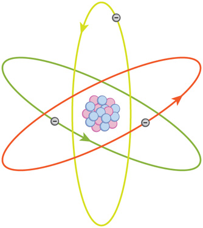

* Explain the difference between a principle and a law.
* Explain the difference between a model and a theory.

 "){: #import-auto-id1580373}

The physical universe is enormously complex in its detail. Every day, each of us observes a great variety of objects and phenomena. Over the centuries, the curiosity of the human race has led us collectively to explore and catalog a tremendous wealth of information. From the flight of birds to the colors of flowers, from lightning to gravity, from quarks to clusters of galaxies, from the flow of time to the mystery of the creation of the universe, we have asked questions and assembled huge arrays of facts. In the face of all these details, we have discovered that a surprisingly small and unified set of physical laws can explain what we observe. As humans, we make generalizations and seek order. We have found that nature is remarkably cooperative—it exhibits the **underlying order and simplicity** we so value.

It is the underlying order of nature that makes science in general, and physics in particular, so enjoyable to study. For example, what do a bag of chips and a car battery have in common? Both contain energy that can be converted to other forms. The law of conservation of energy (which says that energy can change form but is never lost) ties together such topics as food calories, batteries, heat, light, and watch springs. Understanding this law makes it easier to learn about the various forms energy takes and how they relate to one another. Apparently unrelated topics are connected through broadly applicable physical laws, permitting an understanding beyond just the memorization of lists of facts.

The unifying aspect of physical laws and the basic simplicity of nature form the underlying themes of this text. In learning to apply these laws, you will, of course, study the most important topics in physics. More importantly, you will gain analytical abilities that will enable you to apply these laws far beyond the scope of what can be included in a single book. These analytical skills will help you to excel academically, and they will also help you to think critically in any professional career you choose to pursue. This module discusses the realm of physics (to define what physics is), some applications of physics (to illustrate its relevance to other disciplines), and more precisely what constitutes a physical law (to illuminate the importance of experimentation to theory).

### Science and the Realm of Physics

Science consists of the theories and laws that are the general truths of nature as well as the body of knowledge they encompass. Scientists are continually trying to expand this body of knowledge and to perfect the expression of the laws that describe it. **Physics**{: data-type="term" #import-auto-id3095144} is concerned with describing the interactions of energy, matter, space, and time, and it is especially interested in what fundamental mechanisms underlie every phenomenon. The concern for describing the basic phenomena in nature essentially defines the **realm of physics**.

Physics aims to describe the function of everything around us, from the movement of tiny charged particles to the motion of people, cars, and spaceships. In fact, almost everything around you can be described quite accurately by the laws of physics. Consider a smart phone ([\[link\]](#import-auto-id1956069)). Physics describes how electricity interacts with the various circuits inside the device. This knowledge helps engineers select the appropriate materials and circuit layout when building the smart phone. Next, consider a GPS system. Physics describes the relationship between the speed of an object, the distance over which it travels, and the time it takes to travel that distance. When you use a GPS device in a vehicle, it utilizes these physics equations to determine the travel time from one location to another.

 &#10;                "){: #import-auto-id1956069 height="250"}

### Applications of Physics

You need not be a scientist to use physics. On the contrary, knowledge of physics is useful in everyday situations as well as in nonscientific professions. It can help you understand how microwave ovens work, why metals should not be put into them, and why they might affect pacemakers. (See [\[link\]](#import-auto-id1301457) and [\[link\]](#import-auto-id2543552).) Physics allows you to understand the hazards of radiation and rationally evaluate these hazards more easily. Physics also explains the reason why a black car radiator helps remove heat in a car engine, and it explains why a white roof helps keep the inside of a house cool. Similarly, the operation of a car’s ignition system as well as the transmission of electrical signals through our body’s nervous system are much easier to understand when you think about them in terms of basic physics.

Physics is the foundation of many important disciplines and contributes directly to others. Chemistry, for example—since it deals with the interactions of atoms and molecules—is rooted in atomic and molecular physics. Most branches of engineering are applied physics. In architecture, physics is at the heart of structural stability, and is involved in the acoustics, heating, lighting, and cooling of buildings. Parts of geology rely heavily on physics, such as radioactive dating of rocks, earthquake analysis, and heat transfer in the Earth. Some disciplines, such as biophysics and geophysics, are hybrids of physics and other disciplines.

Physics has many applications in the biological sciences. On the microscopic level, it helps describe the properties of cell walls and cell membranes ([\[link\]](#import-auto-id2821668) and [\[link\]](#import-auto-id1622392)). On the macroscopic level, it can explain the heat, work, and power associated with the human body. Physics is involved in medical diagnostics, such as x-rays, magnetic resonance imaging (MRI), and ultrasonic blood flow measurements. Medical therapy sometimes directly involves physics; for example, cancer radiotherapy uses ionizing radiation. Physics can also explain sensory phenomena, such as how musical instruments make sound, how the eye detects color, and how lasers can transmit information.

It is not necessary to formally study all applications of physics. What is most useful is knowledge of the basic laws of physics and a skill in the analytical methods for applying them. The study of physics also can improve your problem-solving skills. Furthermore, physics has retained the most basic aspects of science, so it is used by all of the sciences, and the study of physics makes other sciences easier to understand.

 "){: #import-auto-id1301457}

 also uses electromagnetic waves to yield an image of the brain, from which the exact location of tumors can be determined. (credit: Rashmi Chawla, Daniel Smith, and Paul E. Marik)"){: #import-auto-id2543552 height="225"}

"){: #import-auto-id2821668}

"){: #import-auto-id1622392}

### Models, Theories, and Laws; The Role of Experimentation

The laws of nature are concise descriptions of the universe around us; they are human statements of the underlying laws or rules that all natural processes follow. Such laws are intrinsic to the universe; humans did not create them and so cannot change them. We can only discover and understand them. Their discovery is a very human endeavor, with all the elements of mystery, imagination, struggle, triumph, and disappointment inherent in any creative effort. (See [\[link\]](#import-auto-id2747660) and [\[link\]](#import-auto-id1596747).) The cornerstone of discovering natural laws is observation; science must describe the universe as it is, not as we may imagine it to be.

  was very reluctant to publish his revolutionary work and had to be convinced to do so. In his later years, he stepped down from his academic post and became exchequer of the Royal Mint. He took this post seriously, inventing reeding (or creating ridges) on the edge of coins to prevent unscrupulous people from trimming the silver off of them before using them as currency. (credit: Arthur Shuster and Arthur E. Shipley: Britain&#x2019;s Heritage of Science. London, 1917.)"){: #import-auto-id2747660 height="275"}

 sacrificed monetary assets to help finance her early research and damaged her physical well-being with radiation exposure. She is the only person to win Nobel prizes in both physics and chemistry. One of her daughters also won a Nobel Prize. (credit: Wikimedia Commons)&#10;                "){: #import-auto-id1596747 height="225"}

We all are curious to some extent. We look around, make generalizations, and try to understand what we see—for example, we look up and wonder whether one type of cloud signals an oncoming storm. As we become serious about exploring nature, we become more organized and formal in collecting and analyzing data. We attempt greater precision, perform controlled experiments (if we can), and write down ideas about how the data may be organized and unified. We then formulate models, theories, and laws based on the data we have collected and analyzed to generalize and communicate the results of these experiments.

A **model**{: data-type="term" #import-auto-id2607437} is a representation of something that is often too difficult (or impossible) to display directly. While a model is justified with experimental proof, it is only accurate under limited situations. An example is the planetary model of the atom in which electrons are pictured as orbiting the nucleus, analogous to the way planets orbit the Sun. (See [\[link\]](#fs-id1165298745067).) We cannot observe electron orbits directly, but the mental image helps explain the observations we can make, such as the emission of light from hot gases (atomic spectra). Physicists use models for a variety of purposes. For example, models can help physicists analyze a scenario and perform a calculation, or they can be used to represent a situation in the form of a computer simulation. A **theory**{: data-type="term" #import-auto-id2786489} is an explanation for patterns in nature that is supported by scientific evidence and verified multiple times by various groups of researchers. Some theories include models to help visualize phenomena, whereas others do not. Newton’s theory of gravity, for example, does not require a model or mental image, because we can observe the objects directly with our own senses. The kinetic theory of gases, on the other hand, is a model in which a gas is viewed as being composed of atoms and molecules. Atoms and molecules are too small to be observed directly with our senses—thus, we picture them mentally to understand what our instruments tell us about the behavior of gases.

A **law**{: data-type="term" #import-auto-id1509407} uses concise language to describe a generalized pattern in nature that is supported by scientific evidence and repeated experiments. Often, a law can be expressed in the form of a single mathematical equation. Laws and theories are similar in that they are both scientific statements that result from a tested hypothesis and are supported by scientific evidence. However, the designation **law** is reserved for a concise and very general statement that describes phenomena in nature, such as the law that energy is conserved during any process, or Newton’s second law of motion, which relates force, mass, and acceleration by the simple equation <math xmlns="http://www.w3.org/1998/Math/MathML"><semantics><mrow><mrow><mrow><mi mathvariant="bold">F</mi><mo stretchy="false">=</mo><mi>m</mi><mi mathvariant="bold">a</mi></mrow></mrow><mrow /></mrow><annotation encoding="StarMath 5.0"> size 12{F=ma} {}</annotation></semantics></math>

. A theory, in contrast, is a less concise statement of observed phenomena. For example, the Theory of Evolution and the Theory of Relativity cannot be expressed concisely enough to be considered a law. The biggest difference between a law and a theory is that a theory is much more complex and dynamic. A law describes a single action, whereas a theory explains an entire group of related phenomena. And, whereas a law is a postulate that forms the foundation of the scientific method, a theory is the end result of that process.

Less broadly applicable statements are usually called principles (such as Pascal’s principle, which is applicable only in fluids), but the distinction between laws and principles often is not carefully made.

 {: height="150"}

Models, Theories, and Laws

Models, theories, and laws are used to help scientists analyze the data they have already collected. However, often after a model, theory, or law has been developed, it points scientists toward new discoveries they would not otherwise have made.

The models, theories, and laws we devise sometimes *imply the existence of objects or phenomena as yet unobserved.* These predictions are remarkable triumphs and tributes to the power of science. It is the underlying order in the universe that enables scientists to make such spectacular predictions. However, if **experiment** does not verify our predictions, then the theory or law is wrong, no matter how elegant or convenient it is. Laws can never be known with absolute certainty because it is impossible to perform every imaginable experiment in order to confirm a law in every possible scenario. Physicists operate under the assumption that all scientific laws and theories are valid until a counterexample is observed. If a good-quality, verifiable experiment contradicts a well-established law, then the law must be modified or overthrown completely.

The study of science in general and physics in particular is an adventure much like the exploration of uncharted ocean. Discoveries are made; models, theories, and laws are formulated; and the beauty of the physical universe is made more sublime for the insights gained.

The Scientific Method

As scientists inquire and gather information about the world, they follow a process called the **scientific method**{: data-type="term" #import-auto-id1666405}. This process typically begins with an observation and question that the scientist will research. Next, the scientist typically performs some research about the topic and then devises a hypothesis. Then, the scientist will test the hypothesis by performing an experiment. Finally, the scientist analyzes the results of the experiment and draws a conclusion. Note that the scientific method can be applied to many situations that are not limited to science, and this method can be modified to suit the situation.

Consider an example. Let us say that you try to turn on your car, but it will not start. You undoubtedly wonder: Why will the car not start? You can follow a scientific method to answer this question. First off, you may perform some research to determine a variety of reasons why the car will not start. Next, you will state a hypothesis. For example, you may believe that the car is not starting because it has no engine oil. To test this, you open the hood of the car and examine the oil level. You observe that the oil is at an acceptable level, and you thus conclude that the oil level is not contributing to your car issue. To troubleshoot the issue further, you may devise a new hypothesis to test and then repeat the process again.

### The Evolution of Natural Philosophy into Modern Physics

Physics was not always a separate and distinct discipline. It remains connected to other sciences to this day. The word **physics** comes from Greek, meaning nature. The study of nature came to be called “natural philosophy.” From ancient times through the Renaissance, natural philosophy encompassed many fields, including astronomy, biology, chemistry, physics, mathematics, and medicine. Over the last few centuries, the growth of knowledge has resulted in ever-increasing specialization and branching of natural philosophy into separate fields, with physics retaining the most basic facets. (See [\[link\]](#import-auto-id3143608), [\[link\]](#import-auto-id2681333), and [\[link\]](#import-auto-id2681780).) Physics as it developed from the Renaissance to the end of the 19th century is called **classical physics**{: data-type="term" #import-auto-id2676866}. It was transformed into modern physics by revolutionary discoveries made starting at the beginning of the 20th century.

  wrote on a broad range of topics including physics, animals, the soul, politics, and poetry. (credit: Jastrow (2006)/Ludovisi Collection)&#10;                "){: #import-auto-id3143608 height="225"}

 laid the foundation of modern experimentation and made contributions in mathematics, physics, and astronomy. (credit: Domenico Tintoretto)&#10;                "){: #import-auto-id2681333 height="225"}

 made fundamental contributions to the development of quantum mechanics, one part of modern physics. (credit: United States Library of Congress Prints and Photographs Division)&#10;                "){: #import-auto-id2681780 height="225"}

Classical physics is not an exact description of the universe, but it is an excellent approximation under the following conditions: Matter must be moving at speeds less than about 1% of the speed of light, the objects dealt with must be large enough to be seen with a microscope, and only weak gravitational fields, such as the field generated by the Earth, can be involved. Because humans live under such circumstances, classical physics seems intuitively reasonable, while many aspects of modern physics seem bizarre. This is why models are so useful in modern physics—they let us conceptualize phenomena we do not ordinarily experience. We can relate to models in human terms and visualize what happens when objects move at high speeds or imagine what objects too small to observe with our senses might be like. For example, we can understand an atom’s properties because we can picture it in our minds, although we have never seen an atom with our eyes. New tools, of course, allow us to better picture phenomena we cannot see. In fact, new instrumentation has allowed us in recent years to actually “picture” the atom.

Limits on the Laws of Classical Physics

For the laws of classical physics to apply, the following criteria must be met: Matter must be moving at speeds less than about 1% of the speed of light, the objects dealt with must be large enough to be seen with a microscope, and only weak gravitational fields (such as the field generated by the Earth) can be involved.

 , scientists can see the individual atoms that compose this sheet of gold. (credit: Erwinrossen)"){: #import-auto-id2990813 height="150"}

Some of the most spectacular advances in science have been made in modern physics. Many of the laws of classical physics have been modified or rejected, and revolutionary changes in technology, society, and our view of the universe have resulted. Like science fiction, modern physics is filled with fascinating objects beyond our normal experiences, but it has the advantage over science fiction of being very real. Why, then, is the majority of this text devoted to topics of classical physics? There are two main reasons: Classical physics gives an extremely accurate description of the universe under a wide range of everyday circumstances, and knowledge of classical physics is necessary to understand modern physics.

**Modern physics**{: data-type="term" #import-auto-id2607150} itself consists of the two revolutionary theories, relativity and quantum mechanics. These theories deal with the very fast and the very small, respectively. **Relativity**{: data-type="term" #import-auto-id1309764} must be used whenever an object is traveling at greater than about 1% of the speed of light or experiences a strong gravitational field such as that near the Sun. **Quantum mechanics**{: data-type="term" #import-auto-id2992874} must be used for objects smaller than can be seen with a microscope. The combination of these two theories is *relativistic quantum mechanics,* and it describes the behavior of small objects traveling at high speeds or experiencing a strong gravitational field. Relativistic quantum mechanics is the best universally applicable theory we have. Because of its mathematical complexity, it is used only when necessary, and the other theories are used whenever they will produce sufficiently accurate results. We will find, however, that we can do a great deal of modern physics with the algebra and trigonometry used in this text.

Check Your Understanding

A friend tells you he has learned about a new law of nature. What can you know about the information even before your friend describes the law? How would the information be different if your friend told you he had learned about a scientific theory rather than a law?

Without knowing the details of the law, you can still infer that the information your friend has learned conforms to the requirements of all laws of nature: it will be a concise description of the universe around us; a statement of the underlying rules that all natural processes follow. If the information had been a theory, you would be able to infer that the information will be a large-scale, broadly applicable generalization.

PhET Explorations: Equation Grapher

Learn about graphing polynomials. The shape of the curve changes as the constants are adjusted. View the curves for the individual terms (e.g. <math xmlns="http://www.w3.org/1998/Math/MathML"><semantics><mrow><mrow><mrow><mi>y</mi><mo stretchy="false">=</mo><mi fontstyle="italic">bx</mi></mrow></mrow><mrow /></mrow><annotation encoding="StarMath 5.0"> size 12{y=bx} {}</annotation></semantics></math>

) to see how they add to generate the polynomial curve.

<figure markdown="1" id="eip-id2758870">
<figcaption>
[Equation Grapher](equation-grapher_en.jar)
</figcaption>

[{: data-print="false"}](equation-grapher_en.jar){: data-type="image-with-thumbnail"} {: data-print="true"}

</figure>

### Summary

* {: #import-auto-id1961798} Science seeks to discover and describe the underlying order and simplicity in nature.
* {: #import-auto-id2575847} Physics is the most basic of the sciences, concerning itself with energy, matter, space and time, and their interactions.
* {: #import-auto-id2757516} Scientific laws and theories express the general truths of nature and the body of knowledge they encompass. These laws of nature are rules that all natural processes appear to follow.

### Conceptual Questions

Models are particularly useful in relativity and quantum mechanics, where conditions are outside those normally encountered by humans. What is a model?

How does a model differ from a theory?

If two different theories describe experimental observations equally well, can one be said to be more valid than the other (assuming both use accepted rules of logic)?

What determines the validity of a theory?

Certain criteria must be satisfied if a measurement or observation is to be believed. Will the criteria necessarily be as strict for an expected result as for an unexpected result?

Can the validity of a model be limited, or must it be universally valid? How does this compare to the required validity of a theory or a law?

Classical physics is a good approximation to modern physics under certain circumstances. What are they?

When is it **necessary** to use relativistic quantum mechanics?

Can classical physics be used to accurately describe a satellite moving at a speed of 7500 m/s? Explain why or why not.

### Glossary
{: data-type="glossary-title"}

classical physics
: physics that was developed from the Renaissance to the end of the 19th century
{: #import-auto-id1948935}

physics
: the science concerned with describing the interactions of energy, matter, space, and time; it is especially interested in what fundamental mechanisms underlie every phenomenon
{: #import-auto-id1636862}

model
: representation of something that is often too difficult (or impossible) to display directly
{: #import-auto-id1999008}

theory
: an explanation for patterns in nature that is supported by scientific evidence and verified multiple times by various groups of researchers
{: #import-auto-id3089935}

law
: a description, using concise language or a mathematical formula, a generalized pattern in nature that is supported by scientific evidence and repeated experiments
{: #import-auto-id2724260}

scientific method
: a method that typically begins with an observation and question that the scientist will research; next, the scientist typically performs some research about the topic and then devises a hypothesis; then, the scientist will test the hypothesis by performing an experiment; finally, the scientist analyzes the results of the experiment and draws a conclusion
{: #import-auto-id2998505}

modern physics
: the study of relativity, quantum mechanics, or both
{: #import-auto-id2692942}

relativity
: the study of objects moving at speeds greater than about 1% of the speed of light, or of objects being affected by a strong gravitational field
{: #import-auto-id3113698}

quantum mechanics
: the study of objects smaller than can be seen with a microscope
{: #import-auto-id2723056}

