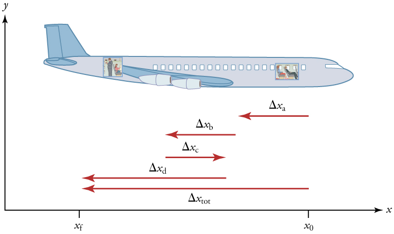
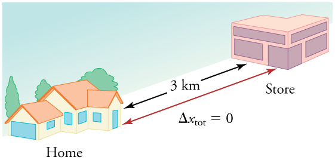

* Explain the relationships between instantaneous velocity, average velocity, instantaneous speed, average speed, displacement, and time.
* Calculate velocity and speed given initial position, initial time, final position, and final time.
* Derive a graph of velocity vs. time given a graph of position vs. time.
* Interpret a graph of velocity vs. time.

 "){: #import-auto-id1690049}

There is more to motion than distance and displacement. Questions such as, “How long does a foot race take?” and “What was the runner’s speed?” cannot be answered without an understanding of other concepts. In this section we add definitions of time, velocity, and speed to expand our description of motion.

### Time

As discussed in [Physical Quantities and Units](/m42091), the most fundamental physical quantities are defined by how they are measured. This is the case with time. Every measurement of time involves measuring a change in some physical quantity. It may be a number on a digital clock, a heartbeat, or the position of the Sun in the sky. In physics, the definition of time is simple—**time**{: data-type="term" #import-auto-id2588516} is *change*, or the interval over which change occurs. It is impossible to know that time has passed unless something changes.

The amount of time or change is calibrated by comparison with a standard. The SI unit for time is the second, abbreviated s. We might, for example, observe that a certain pendulum makes one full swing every 0.75 s. We could then use the pendulum to measure time by counting its swings or, of course, by connecting the pendulum to a clock mechanism that registers time on a dial. This allows us to not only measure the amount of time, but also to determine a sequence of events.

How does time relate to motion? We are usually interested in elapsed time for a particular motion, such as how long it takes an airplane passenger to get from his seat to the back of the plane. To find elapsed time, we note the time at the beginning and end of the motion and subtract the two. For example, a lecture may start at 11:00 A.M. and end at 11:50 A.M., so that the elapsed time would be 50 min. **Elapsed time**{: data-type="term" #import-auto-id4083152} **<math xmlns="http://www.w3.org/1998/Math/MathML"><semantics><mrow><mrow><mn>Δ</mn><mi fontstyle="italic">t</mi></mrow><mrow /></mrow></semantics></math>

** is the difference between the ending time and beginning time,

<math xmlns="http://www.w3.org/1998/Math/MathML"><semantics><mrow><mrow><mrow><mn>Δ</mn><mi fontstyle="italic">t</mi><mo stretchy="false">=</mo><mrow><msub><mi>t</mi><mrow><mn>f</mn></mrow></msub><mo stretchy="false">−</mo><msub><mi>t</mi><mrow><mn>0</mn></mrow></msub></mrow><mo>,</mo></mrow></mrow></mrow></semantics></math>

where <math xmlns="http://www.w3.org/1998/Math/MathML"><semantics><mrow><mrow><mn>Δ</mn><mi fontstyle="italic">t</mi></mrow><mrow /></mrow><annotation encoding="StarMath 5.0"> size 12{Δt} {}</annotation></semantics></math>

 is the change in time or elapsed time, <math xmlns="http://www.w3.org/1998/Math/MathML"><semantics><mrow><mrow><msub><mi>t</mi><mrow><mn>f</mn></mrow></msub></mrow><mrow /></mrow></semantics></math>

 is the time at the end of the motion, and <math xmlns="http://www.w3.org/1998/Math/MathML"><semantics><mrow><mrow><msub><mi>t</mi><mrow><mn>0</mn></mrow></msub></mrow><mrow /></mrow></semantics></math>

 is the time at the beginning of the motion. (As usual, the delta symbol, <math xmlns="http://www.w3.org/1998/Math/MathML"><semantics><mrow><mrow><mn>Δ</mn></mrow><mrow /></mrow><annotation encoding="StarMath 5.0"> size 12{Δ} {}</annotation></semantics></math>

, means the change in the quantity that follows it.)

Life is simpler if the beginning time <math xmlns="http://www.w3.org/1998/Math/MathML"><semantics><mrow><mrow><msub><mi>t</mi><mrow><mn>0</mn></mrow></msub></mrow><mrow /></mrow></semantics></math>

 is taken to be zero, as when we use a stopwatch. If we were using a stopwatch, it would simply read zero at the start of the lecture and 50 min at the end. If <math xmlns="http://www.w3.org/1998/Math/MathML"><semantics><mrow><mrow><mrow><msub><mi>t</mi><mrow><mn>0</mn></mrow></msub><mo stretchy="false">=</mo><mn>0</mn></mrow></mrow></mrow></semantics></math>

, then <math xmlns="http://www.w3.org/1998/Math/MathML"><semantics><mrow><mrow><mrow><mrow><mn>Δ</mn><mi fontstyle="italic">t</mi><mo stretchy="false">=</mo><msub><mi>t</mi><mrow><mn>f</mn></mrow></msub></mrow><mo stretchy="false">≡</mo><mi>t</mi></mrow></mrow></mrow></semantics></math>

.

In this text, for simplicity’s sake,

* {: #import-auto-id2571110} motion starts at time equal to zero
  <math xmlns="http://www.w3.org/1998/Math/MathML"><semantics><mrow><mrow><mrow><mo stretchy="false">(</mo><mrow><msub><mi>t</mi><mrow><mn>0</mn></mrow></msub><mo stretchy="false">=</mo><mn>0</mn></mrow><mo stretchy="false">)</mo></mrow></mrow><mrow /></mrow><annotation encoding="StarMath 5.0"> size 12{ \( t rSub { size 8{0} } =0 \) } {}</annotation></semantics></math>

* {: #import-auto-id4047929} the symbol
  <math xmlns="http://www.w3.org/1998/Math/MathML"><semantics><mrow><mrow><mi>t</mi></mrow><mrow /></mrow><annotation encoding="StarMath 5.0"> size 12{t} {}</annotation></semantics></math>
  
  is used for elapsed time unless otherwise specified
  <math xmlns="http://www.w3.org/1998/Math/MathML"><semantics><mrow><mrow><mrow><mo stretchy="false">(</mo><mrow><mrow><mn>Δ</mn><mi fontstyle="italic">t</mi><mo stretchy="false">=</mo><msub><mi>t</mi><mrow><mn>f</mn></mrow></msub></mrow><mo stretchy="false">≡</mo><mi>t</mi></mrow><mo stretchy="false">)</mo></mrow></mrow><mrow /></mrow><annotation encoding="StarMath 5.0"> size 12{ \( Δt=t rSub { size 8{f} } equiv t \) } {}</annotation></semantics></math>

### Velocity

Your notion of velocity is probably the same as its scientific definition. You know that if you have a large displacement in a small amount of time you have a large velocity, and that velocity has units of distance divided by time, such as miles per hour or kilometers per hour.

Average Velocity

**Average velocity**{: data-type="term" #import-auto-id2596035} is *displacement (change in position) divided by the time of travel*,

<math xmlns="http://www.w3.org/1998/Math/MathML"> <semantics> <mrow> <mrow> <mrow> <mrow> <mrow> <mover accent="true"> <mi>v</mi> <mo stretchy="true">-</mo> </mover> <mo stretchy="false">=</mo> <mfrac> <mrow><mn>Δ</mn><mi fontstyle="italic">x</mi></mrow> <mrow><mn>Δ</mn><mi fontstyle="italic">t</mi></mrow> </mfrac> </mrow> <mo stretchy="false">=</mo> <mfrac> <mrow> <msub> <mi>x</mi> <mrow> <mn>f</mn> </mrow> </msub> <mo stretchy="false">−</mo> <msub> <mi>x</mi> <mrow> <mn>0</mn> </mrow> </msub> </mrow> <mrow> <msub> <mi>t</mi> <mrow> <mn>f</mn> </mrow> </msub> <mo stretchy="false">−</mo> <msub> <mi>t</mi> <mrow> <mn>0</mn> </mrow> </msub> </mrow> </mfrac> </mrow> <mi>,</mi> </mrow> </mrow> <mrow /> </mrow> <annotation encoding="StarMath 5.0"> size 12{ { bar {v}}= { {Δx} over {Δt} } = { {x rSub { size 8{f} } - x rSub { size 8{0} } } over {t rSub { size 8{f} } - t rSub { size 8{0} } } } ,} {}</annotation> </semantics> </math>

where <math xmlns="http://www.w3.org/1998/Math/MathML"><semantics><mrow><mrow><mover accent="true"><mi>v</mi><mo stretchy="true">-</mo></mover></mrow><mrow /></mrow><annotation encoding="StarMath 5.0"> size 12{ { bar {v}}} {}</annotation></semantics></math>

 is the *average* (indicated by the bar over the <math xmlns="http://www.w3.org/1998/Math/MathML"><semantics><mrow><mrow><mi>v</mi></mrow><mrow /></mrow></semantics></math>

) velocity, <math xmlns="http://www.w3.org/1998/Math/MathML"><semantics><mrow><mrow><mn>Δ</mn><mi fontstyle="italic">x</mi></mrow><mrow /></mrow></semantics></math>

 is the change in position (or displacement), and <math xmlns="http://www.w3.org/1998/Math/MathML"><semantics><mrow><mrow><msub><mi>x</mi><mrow><mn>f</mn></mrow></msub></mrow><mrow /></mrow></semantics></math>

 and <math xmlns="http://www.w3.org/1998/Math/MathML"><semantics><mrow><mrow><msub><mi>x</mi><mrow><mn>0</mn></mrow></msub></mrow></mrow></semantics></math>

 are the final and beginning positions at times <math xmlns="http://www.w3.org/1998/Math/MathML"><semantics><mrow><mrow><msub><mi>t</mi><mrow><mn>f</mn></mrow></msub></mrow></mrow></semantics></math>

 and <math xmlns="http://www.w3.org/1998/Math/MathML"><semantics><mrow><mrow><msub><mi>t</mi><mrow><mn>0</mn></mrow></msub></mrow></mrow></semantics></math>

, respectively. If the starting time <math xmlns="http://www.w3.org/1998/Math/MathML"><semantics><mrow><mrow><msub><mi>t</mi><mrow><mn>0</mn></mrow></msub></mrow></mrow></semantics></math>

 is taken to be zero, then the average velocity is simply

<math xmlns="http://www.w3.org/1998/Math/MathML"> <semantics> <mrow> <mrow> <mrow> <mrow> <mover accent="true"> <mi>v</mi> <mo stretchy="true">-</mo> </mover> <mo stretchy="false">=</mo> <mfrac> <mrow><mn>Δ</mn><mi fontstyle="italic">x</mi></mrow> <mi>t</mi> </mfrac> </mrow> <mtext>.</mtext> </mrow> </mrow> <mrow /> </mrow> <annotation encoding="StarMath 5.0"> size 12{ { bar {v}}= { {Δx} over {t} } "." } {}</annotation> </semantics> </math>

Notice that this definition indicates that *velocity is a vector because displacement is a vector*. It has both magnitude and direction. The SI unit for velocity is meters per second or m/s, but many other units, such as km/h, mi/h (also written as mph), and cm/s, are in common use. Suppose, for example, an airplane passenger took 5 seconds to move −4 m (the negative sign indicates that displacement is toward the back of the plane). His average velocity would be

<math xmlns="http://www.w3.org/1998/Math/MathML"> <semantics> <mrow> <mrow> <mrow> <mrow> <mrow> <mrow> <mover accent="true"> <mi>v</mi> <mo stretchy="true">-</mo> </mover> <mo stretchy="false">=</mo> <mfrac> <mrow><mn>Δ</mn><mi fontstyle="italic">x</mi></mrow> <mi>t</mi> </mfrac> </mrow> <mo stretchy="false">=</mo> <mfrac> <mrow> <mo stretchy="false">−</mo> <mn>4</mn><mspace width="0.25em" /><mtext>m</mtext> </mrow> <mrow> <mn>5</mn><mspace width="0.25em" /><mtext>s</mtext> </mrow> </mfrac> </mrow> <mo stretchy="false">=</mo> <mo stretchy="false">−</mo> <mtext>0.8 m/s.</mtext> </mrow> </mrow> </mrow> <mrow /> </mrow> <annotation encoding="StarMath 5.0"> size 12{ { bar {v}}= { {Δx} over {t} } = { { - 4`m} over {5`s} } = - 0 "." 8`"m/s" "." } {}</annotation> </semantics> </math>

The minus sign indicates the average velocity is also toward the rear of the plane.

The average velocity of an object does not tell us anything about what happens to it between the starting point and ending point, however. For example, we cannot tell from average velocity whether the airplane passenger stops momentarily or backs up before he goes to the back of the plane. To get more details, we must consider smaller segments of the trip over smaller time intervals.

 {: #import-auto-id1782958}

The smaller the time intervals considered in a motion, the more detailed the information. When we carry this process to its logical conclusion, we are left with an infinitesimally small interval. Over such an interval, the average velocity becomes the *instantaneous velocity* **or the *velocity at a specific instant*. A car’s speedometer, for example, shows the magnitude (but not the direction) of the instantaneous velocity of the car. (Police give tickets based on instantaneous velocity, but when calculating how long it will take to get from one place to another on a road trip, you need to use average velocity.) **Instantaneous velocity**{: data-type="term" #import-auto-id2579029} <math xmlns="http://www.w3.org/1998/Math/MathML"><semantics><mrow><mrow><mi>v</mi></mrow><mrow /></mrow><annotation encoding="StarMath 5.0"> size 12{v} {}</annotation></semantics></math>

 is the average velocity at a specific instant in time (or over an infinitesimally small time interval).

Mathematically, finding instantaneous velocity, <math xmlns="http://www.w3.org/1998/Math/MathML"><semantics><mrow><mrow><mi>v</mi></mrow><mrow /></mrow><annotation encoding="StarMath 5.0"> size 12{v} {}</annotation></semantics></math>

, at a precise instant <math xmlns="http://www.w3.org/1998/Math/MathML"><semantics><mrow><mrow><mi>t</mi></mrow><mrow /></mrow><annotation encoding="StarMath 5.0"> size 12{t} {}</annotation></semantics></math>

 can involve taking a limit, a calculus operation beyond the scope of this text. However, under many circumstances, we can find precise values for instantaneous velocity without calculus.

### Speed

In everyday language, most people use the terms “speed” and “velocity” interchangeably. In physics, however, they do not have the same meaning and they are distinct concepts. One major difference is that speed has no direction. Thus *speed is a scalar*. Just as we need to distinguish between instantaneous velocity and average velocity, we also need to distinguish between instantaneous speed and average speed.

**Instantaneous speed**{: data-type="term" #import-auto-id2004213} is the magnitude of instantaneous velocity. For example, suppose the airplane passenger at one instant had an instantaneous velocity of −3.0 m/s (the minus meaning toward the rear of the plane). At that same time his instantaneous speed was 3.0 m/s. Or suppose that at one time during a shopping trip your instantaneous velocity is 40 km/h due north. Your instantaneous speed at that instant would be 40 km/h—the same magnitude but without a direction. Average speed, however, is very different from average velocity. **Average speed**{: data-type="term" #import-auto-id2004216} is the distance traveled divided by elapsed time.

We have noted that distance traveled can be greater than displacement. So average speed can be greater than average velocity, which is displacement divided by time. For example, if you drive to a store and return home in half an hour, and your car’s odometer shows the total distance traveled was 6 km, then your average speed was 12 km/h. Your average velocity, however, was zero, because your displacement for the round trip is zero. (Displacement is change in position and, thus, is zero for a round trip.) Thus average speed is *not* simply the magnitude of average velocity.

 {: #import-auto-id2593426}

Another way of visualizing the motion of an object is to use a graph. A plot of position or of velocity as a function of time can be very useful. For example, for this trip to the store, the position, velocity, and speed-vs.-time graphs are displayed in [\[link\]](#import-auto-id1806646). (Note that these graphs depict a very simplified **model**{: data-type="term" #import-auto-id1510828} of the trip. We are assuming that speed is constant during the trip, which is unrealistic given that we’ll probably stop at the store. But for simplicity’s sake, we will model it with no stops or changes in speed. We are also assuming that the route between the store and the house is a perfectly straight line.)

![Three line graphs. First line graph is of position in kilometers versus time in hours. The line increases linearly from 0 kilometers to 6 kilometers in the first 0 point 25 hours. It then decreases linearly from 6 kilometers to 0 kilometers between 0 point 25 and 0 point 5 hours. Second line graph shows velocity in kilometers per hour versus time in hours. The line is flat at 12 kilometers per hour from time 0 to time 0 point 25. It is vertical at time 0 point 25, dropping from 12 kilometers per hour to negative 12 kilometers per hour. It is flat again at negative 12 kilometers per hour from 0 point 25 hours to 0 point 5 hours. Third line graph shows speed in kilometers per hour versus time in hours. The line is flat at 12 kilometers per hour from time equals 0 to time equals 0 point 5 hours.](../resources/Figure_02_02_03.jpg "Position vs. time, velocity vs. time, and speed vs. time on a trip. Note that the velocity for the return trip is negative. "){: #import-auto-id1806646}

Making Connections: Take-Home Investigation—Getting a Sense of Speed

If you have spent much time driving, you probably have a good sense of speeds between about 10 and 70 miles per hour. But what are these in meters per second? What do we mean when we say that something is moving at 10 m/s? To get a better sense of what these values really mean, do some observations and calculations on your own:

* {: #import-auto-id4058974} calculate typical car speeds in meters per second
* {: #import-auto-id4058977} estimate jogging and walking speed by timing yourself; convert the measurements into both m/s and mi/h
* {: #import-auto-id4070923} determine the speed of an ant, snail, or falling leaf

Check Your Understanding

A commuter train travels from Baltimore to Washington, DC, and back in 1 hour and 45 minutes. The distance between the two stations is approximately 40 miles. What is (a) the average velocity of the train, and (b) the average speed of the train in m/s?

(a) The average velocity of the train is zero because <math xmlns="http://www.w3.org/1998/Math/MathML"><semantics><mrow><mrow><mrow><msub><mi>x</mi><mrow><mn>f</mn></mrow></msub><mo stretchy="false">=</mo><msub><mi>x</mi><mrow><mn>0</mn></mrow></msub></mrow></mrow><mrow /></mrow><annotation encoding="StarMath 5.0"> size 12{x rSub { size 8{f} } =x rSub { size 8{0} } } {}</annotation></semantics></math>

; the train ends up at the same place it starts.

(b) The average speed of the train is calculated below. Note that the train travels 40 miles one way and 40 miles back, for a total distance of 80 miles.

<math xmlns="http://www.w3.org/1998/Math/MathML"> <semantics> <mrow> <mrow> <mrow> <mfrac> <mtext>distance</mtext> <mtext>time</mtext> </mfrac> <mo stretchy="false">=</mo> <mfrac> <mtext>80 miles</mtext> <mtext>105 minutes</mtext> </mfrac> </mrow> </mrow> <mrow /> </mrow> <annotation encoding="StarMath 5.0"> size 12{ { {"distance"} over {"time"} } = { {"80 miles"} over {"105 minutes"} } } {}</annotation> </semantics> </math>

<math xmlns="http://www.w3.org/1998/Math/MathML"> <semantics> <mrow> <mrow> <mrow> <mrow> <mrow> <mrow> <mrow> <mfrac> <mtext>80 miles</mtext> <mtext>105 minutes</mtext> </mfrac> <mo stretchy="false">×</mo> <mfrac> <mtext>5280 feet</mtext> <mtext>1 mile</mtext> </mfrac> </mrow> <mo stretchy="false">×</mo> <mfrac> <mtext>1 meter</mtext> <mrow> <mn>3</mn> <mtext>.</mtext> <mtext>28 feet</mtext> </mrow> </mfrac> </mrow> <mo stretchy="false">×</mo> <mfrac> <mtext>1 minute</mtext> <mtext>60 seconds</mtext> </mfrac> </mrow> <mo stretchy="false">=</mo> <mtext>20 m/s</mtext></mrow></mrow> </mrow> </mrow> </semantics> </math>

### Section Summary

* {: #import-auto-id4070541} Time is measured in terms of change, and its SI unit is the second (s). Elapsed time for an event is
  

  <math xmlns="http://www.w3.org/1998/Math/MathML"><semantics><mrow><mrow><mrow><mn>Δ</mn><mi fontstyle="italic">t</mi><mo stretchy="false">=</mo><mrow><msub><mi>t</mi><mrow><mn>f</mn></mrow></msub><mo stretchy="false">−</mo><msub><mi>t</mi><mrow><mn>0</mn></mrow></msub></mrow><mo>,</mo></mrow></mrow><mrow /></mrow><annotation encoding="StarMath 5.0"> size 12{Δt=t rSub { size 8{f} } - t rSub { size 8{0} } } {}</annotation></semantics></math>
  

  
  where
  <math xmlns="http://www.w3.org/1998/Math/MathML"><semantics><mrow><mrow><msub><mi>t</mi><mrow><mn>f</mn></mrow></msub></mrow><mrow /></mrow><annotation encoding="StarMath 5.0"> size 12{t rSub { size 8{f} } } {}</annotation></semantics></math>
  
  is the final time and **
  <math xmlns="http://www.w3.org/1998/Math/MathML"><semantics><mrow><mrow><msub><mi>t</mi><mrow><mn>0</mn></mrow></msub></mrow><mrow /></mrow><annotation encoding="StarMath 5.0"> size 12{t rSub { size 8{0} } } {}</annotation></semantics></math>
  
  is the initial time. The initial time is often taken to be zero, as if measured with a stopwatch; the elapsed time is then just
  <math xmlns="http://www.w3.org/1998/Math/MathML"><semantics><mrow><mrow><mi>t</mi></mrow><mrow /></mrow><annotation encoding="StarMath 5.0"> size 12{t} {}</annotation></semantics></math>
  
  .
* {: #import-auto-id1770783} Average velocity
  <math xmlns="http://www.w3.org/1998/Math/MathML"><semantics><mrow><mrow><mover accent="true"><mi>v</mi><mo stretchy="true">-</mo></mover></mrow><mrow /></mrow><annotation encoding="StarMath 5.0"> size 12{ { bar {v}}} {}</annotation></semantics></math>
  
  is defined as displacement divided by the travel time. In symbols, average velocity is
  

  <math xmlns="http://www.w3.org/1998/Math/MathML"> <semantics> <mrow> <mrow> <mrow> <mrow> <mrow> <mover accent="true"> <mi>v</mi> <mo stretchy="true">-</mo> </mover> <mo stretchy="false">=</mo> <mfrac> <mrow><mn>Δ</mn><mi fontstyle="italic">x</mi></mrow> <mrow><mn>Δ</mn><mi fontstyle="italic">t</mi></mrow> </mfrac> </mrow> <mo stretchy="false">=</mo> <mfrac> <mrow> <msub> <mi>x</mi> <mrow> <mtext>f</mtext> </mrow> </msub> <mo stretchy="false">−</mo> <msub> <mi>x</mi> <mrow> <mn>0</mn> </mrow> </msub> </mrow> <mrow> <msub> <mi>t</mi> <mrow> <mtext>f</mtext> </mrow> </msub> <mo stretchy="false">−</mo> <msub> <mi>t</mi> <mrow> <mn>0</mn> </mrow> </msub> </mrow> </mfrac> </mrow> <mtext>.</mtext> </mrow> </mrow> <mrow /> </mrow> <annotation encoding="StarMath 5.0"> size 12{ { bar {v}}= { {Δx} over {Δt} } = { {x rSub { size 8{f} } - x rSub { size 8{0} } } over {t rSub { size 8{f} } - t rSub { size 8{0} } } } "." } {}</annotation> </semantics> </math>
  

* {: #import-auto-id1795857} The SI unit for velocity is m/s.
* {: #import-auto-id1795847} Velocity is a vector and thus has a direction.
* {: #import-auto-id4097170} Instantaneous velocity
  <math xmlns="http://www.w3.org/1998/Math/MathML"><semantics><mrow><mrow><mi>v</mi></mrow><mrow /></mrow><annotation encoding="StarMath 5.0"> size 12{v} {}</annotation></semantics></math>
  
  is the velocity at a specific instant or the average velocity for an infinitesimal interval.
* {: #import-auto-id4097153} Instantaneous speed is the magnitude of the instantaneous velocity.
* {: #import-auto-id4097155} Instantaneous speed is a scalar quantity, as it has no direction specified.
* {: #import-auto-id4097159} Average speed is the total distance traveled divided by the elapsed time. (Average speed is *not* the magnitude of the average velocity.) Speed is a scalar quantity; it has no direction associated with it.

### Conceptual Questions

Give an example (but not one from the text) of a device used to measure time and identify what change in that device indicates a change in time.
{: xmlns:fo="urn:oasis:names:tc:opendocument:xmlns:xsl-fo-compatible:1.0" fo:font-weight="normal"}

There is a distinction between average speed and the magnitude of average velocity. Give an example that illustrates the difference between these two quantities.
{: xmlns:fo="urn:oasis:names:tc:opendocument:xmlns:xsl-fo-compatible:1.0" fo:font-weight="normal"}

Does a car’s odometer measure position or displacement? Does its speedometer measure speed or velocity?
{: xmlns:fo="urn:oasis:names:tc:opendocument:xmlns:xsl-fo-compatible:1.0" fo:font-weight="normal"}

If you divide the total distance traveled on a car trip (as determined by the odometer) by the time for the trip, are you calculating the average speed or the magnitude of the average velocity? Under what circumstances are these two quantities the same?
{: xmlns:fo="urn:oasis:names:tc:opendocument:xmlns:xsl-fo-compatible:1.0" fo:font-weight="normal"}

How are instantaneous velocity and instantaneous speed related to one another? How do they differ?
{: xmlns:fo="urn:oasis:names:tc:opendocument:xmlns:xsl-fo-compatible:1.0" fo:font-weight="normal"}

### Problems &amp; Exercises

(a) Calculate Earth’s average speed relative to the Sun. (b) What is its average velocity over a period of one year?
{: xmlns:fo="urn:oasis:names:tc:opendocument:xmlns:xsl-fo-compatible:1.0" fo:font-weight="normal"}

(a) <math xmlns="http://www.w3.org/1998/Math/MathML"><semantics><mrow><mrow><mrow><mn>3</mn><mtext>.</mtext><mrow><mtext>0 </mtext><mo stretchy="false">×</mo><msup><mtext>10</mtext><mrow><mn>4</mn></mrow></msup><mspace width="0.25em" /></mrow><mtext> m/s</mtext></mrow></mrow><mrow /></mrow><annotation encoding="StarMath 5.0"> size 12{3 "." "0 " times "10" rSup { size 8{4} } " m/s"} {}</annotation></semantics></math>

(b) 0 m/s
{: xmlns:fo="urn:oasis:names:tc:opendocument:xmlns:xsl-fo-compatible:1.0" fo:font-weight="normal"}

A helicopter blade spins at exactly 100 revolutions per minute. Its tip is 5.00 m from the center of rotation. (a) Calculate the average speed of the blade tip in the helicopter’s frame of reference. (b) What is its average velocity over one revolution?
{: xmlns:fo="urn:oasis:names:tc:opendocument:xmlns:xsl-fo-compatible:1.0" fo:font-weight="normal"}

The North American and European continents are moving apart at a rate of about 3 cm/y. At this rate how long will it take them to drift 500 km farther apart than they are at present?
{: xmlns:fo="urn:oasis:names:tc:opendocument:xmlns:xsl-fo-compatible:1.0" fo:font-weight="normal"}

<math xmlns="http://www.w3.org/1998/Math/MathML"> <semantics> <mrow> <mrow> <mrow> <mrow> <mn>2</mn> <mo stretchy="false">×</mo> <msup> <mtext>10</mtext> <mrow> <mn>7</mn> </mrow> </msup> </mrow><mspace width="0.25em" /> <mtext> years</mtext> </mrow> </mrow> <mrow /> </mrow> <annotation encoding="StarMath 5.0"> size 12{2 times "10" rSup { size 8{7} } " years"} {}</annotation> </semantics> </math>

Land west of the San Andreas fault in southern California is moving at an average velocity of about 6 cm/y northwest relative to land east of the fault. Los Angeles is west of the fault and may thus someday be at the same latitude as San Francisco, which is east of the fault. How far in the future will this occur if the displacement to be made is 590 km northwest, assuming the motion remains constant?

On May 26, 1934, a streamlined, stainless steel diesel train called the Zephyr set the world’s nonstop long-distance speed record for trains. Its run from Denver to Chicago took 13 hours, 4 minutes, 58 seconds, and was witnessed by more than a million people along the route. The total distance traveled was 1633.8 km. What was its average speed in km/h and m/s?

<math xmlns="http://www.w3.org/1998/Math/MathML"> <semantics> <mrow> <mrow> <mrow> <mtext>34</mtext> <mtext>.</mtext> <mtext>689 m/s </mtext> <mo stretchy="false">=</mo> <mtext> 124</mtext> <mtext>.</mtext> <mtext>88 km/h</mtext> </mrow> </mrow> </mrow> </semantics> </math>
{: xmlns:fo="urn:oasis:names:tc:opendocument:xmlns:xsl-fo-compatible:1.0" fo:font-weight="normal"}

Tidal friction is slowing the rotation of the Earth. As a result, the orbit of the Moon is increasing in radius at a rate of approximately 4 cm/year. Assuming this to be a constant rate, how many years will pass before the radius of the Moon’s orbit increases by <math xmlns="http://www.w3.org/1998/Math/MathML"><semantics><mrow><mrow><mrow><mn>3</mn><mtext>.</mtext><mrow><mtext>84</mtext><mo stretchy="false">×</mo><msup><mtext>10</mtext><mrow><mn>6</mn></mrow></msup></mrow><mspace width="0.25em" /><mn>m</mn></mrow></mrow><mrow /></mrow><annotation encoding="StarMath 5.0"> size 12{3 "." "84" times "10" rSup { size 8{6} } `m} {}</annotation></semantics></math>

 (1%)?

A student drove to the university from her home and noted that the odometer reading of her car increased by 12.0 km. The trip took 18.0 min. (a) What was her average speed? (b) If the straight-line distance from her home to the university is 10.3 km in a direction <math xmlns="http://www.w3.org/1998/Math/MathML"><semantics><mrow><mrow><mrow><mtext>25</mtext><mtext>.</mtext><mn>0º</mn></mrow></mrow><mrow /></mrow><annotation encoding="StarMath 5.0"> size 12{"25" "." 0°} {}</annotation></semantics></math>

 south of east, what was her average velocity? (c) If she returned home by the same path 7 h 30 min after she left, what were her average speed and velocity for the entire trip?

(a) <math xmlns="http://www.w3.org/1998/Math/MathML"><semantics><mrow><mrow><mrow><mtext>40</mtext><mtext>.</mtext><mtext>0 km/h</mtext></mrow></mrow><mrow /></mrow><annotation encoding="StarMath 5.0"> size 12{"40" "." "0 km/h"} {}</annotation></semantics></math>

(b) 34.3 km/h, <math xmlns="http://www.w3.org/1998/Math/MathML"><semantics><mrow><mrow><mrow><mtext>25º</mtext><mspace width="0.25em" /><mtext> S of E</mtext><mtext>.</mtext></mrow></mrow><mrow /></mrow><annotation encoding="StarMath 5.0"> size 12{"25"°" S of E" "." } {}</annotation></semantics></math>

(c) <math xmlns="http://www.w3.org/1998/Math/MathML"><semantics><mrow><mrow><mrow><mrow><mrow><mtext>average speed</mtext><mo stretchy="false">=</mo><mtext>3.20 km/h,</mtext><mspace width="0.25em" /><mover accent="true"><mrow><mi>v</mi></mrow><mo stretchy="true">-</mo></mover></mrow></mrow><mo stretchy="false">=</mo><mn>0.</mn></mrow></mrow><mrow /></mrow></semantics></math>

The speed of propagation of the action potential (an electrical signal) in a nerve cell depends (inversely) on the diameter of the axon (nerve fiber). If the nerve cell connecting the spinal cord to your feet is 1.1 m long, and the nerve impulse speed is 18 m/s, how long does it take for the nerve signal to travel this distance?

Conversations with astronauts on the lunar surface were characterized by a kind of echo in which the earthbound person’s voice was so loud in the astronaut’s space helmet that it was picked up by the astronaut’s microphone and transmitted back to Earth. It is reasonable to assume that the echo time equals the time necessary for the radio wave to travel from the Earth to the Moon and back (that is, neglecting any time delays in the electronic equipment). Calculate the distance from Earth to the Moon given that the echo time was 2.56 s and that radio waves travel at the speed of light <math xmlns="http://www.w3.org/1998/Math/MathML"><semantics><mrow><mrow><mrow><mo stretchy="false">(</mo><mn>3</mn><mtext>.</mtext><mrow><mtext>00</mtext><mo stretchy="false">×</mo><msup><mtext>10</mtext><mrow><mn>8</mn></mrow></msup><mspace width="0.25em" /></mrow><mtext> m/s</mtext><mo stretchy="false">)</mo></mrow></mrow></mrow><annotation encoding="StarMath 5.0"> size 12{ \( 3 "." "00" times "10" rSup { size 8{8} } " m/s" \) } {}</annotation></semantics></math>

.

384,000 km
{: xmlns:fo="urn:oasis:names:tc:opendocument:xmlns:xsl-fo-compatible:1.0" fo:font-weight="normal"}

A football quarterback runs 15.0 m straight down the playing field in 2.50 s. He is then hit and pushed 3.00 m straight backward in 1.75 s. He breaks the tackle and runs straight forward another 21.0 m in 5.20 s. Calculate his average velocity (a) for each of the three intervals and (b) for the entire motion.

The planetary model of the atom pictures electrons orbiting the atomic nucleus much as planets orbit the Sun. In this model you can view hydrogen, the simplest atom, as having a single electron in a circular orbit <math xmlns="http://www.w3.org/1998/Math/MathML"><semantics><mrow><mrow><mrow><mn>1</mn><mtext>.</mtext><mtext>06</mtext><mo stretchy="false">×</mo><msup><mtext>10</mtext><mrow><mrow><mo stretchy="false">−</mo><mtext>10</mtext></mrow></mrow></msup><mspace width="0.25em" /><mtext> m</mtext></mrow></mrow></mrow></semantics></math>

 in diameter. (a) If the average speed of the electron in this orbit is known to be <math xmlns="http://www.w3.org/1998/Math/MathML"><semantics><mrow><mrow><mrow><mn>2</mn><mtext>.</mtext><mrow><mtext>20</mtext><mo stretchy="false">×</mo><msup><mtext>10</mtext><mrow><mn>6</mn></mrow></msup></mrow><mspace width="0.25em" /><mtext> m/s</mtext></mrow></mrow></mrow></semantics></math>

, calculate the number of revolutions per second it makes about the nucleus. (b) What is the electron’s average velocity?

(a) <math xmlns="http://www.w3.org/1998/Math/MathML"><semantics><mrow><mrow><mrow><mn>6</mn><mtext>.</mtext><mrow><mtext>61</mtext><mo stretchy="false">×</mo><msup><mtext>10</mtext><mrow><mtext>15</mtext></mrow></msup></mrow><mspace width="0.25em" /><mtext>rev/s</mtext></mrow></mrow><mrow /></mrow><annotation encoding="StarMath 5.0"> size 12{6 "." "61" times "10" rSup { size 8{"15"} } `"rev/s"} {}</annotation></semantics></math>

(b) 0 m/s
{: xmlns:fo="urn:oasis:names:tc:opendocument:xmlns:xsl-fo-compatible:1.0" fo:font-weight="normal"}

### Glossary
{: data-type="glossary-title"}

average speed
: distance traveled divided by time during which motion occurs
{: #import-auto-id4070584}

average velocity
: displacement divided by time over which displacement occurs
{: #import-auto-id4131758}

instantaneous velocity
: velocity at a specific instant, or the average velocity over an infinitesimal time interval
{: #import-auto-id4070580}

instantaneous speed
: magnitude of the instantaneous velocity
{: #import-auto-id4070582}

time
: change, or the interval over which change occurs
{: #import-auto-id4071910}

model
: simplified description that contains only those elements necessary to describe the physics of a physical situation
{: #import-auto-id4022105}

elapsed time
: the difference between the ending time and beginning time
{: #import-auto-id1585138}

