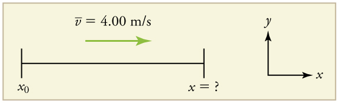
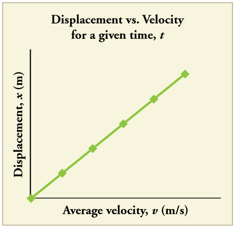
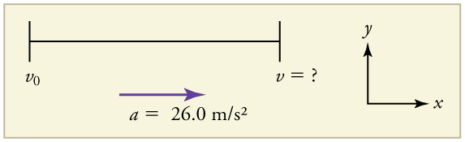
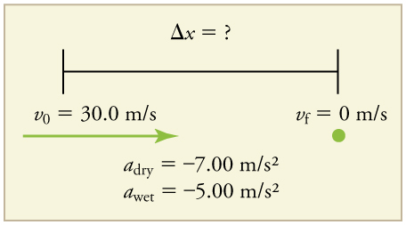
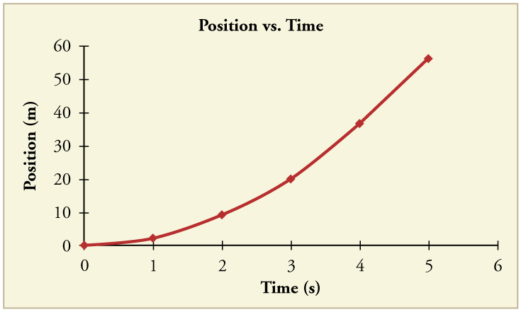

* Calculate displacement of an object that is not accelerating, given initial position and velocity.
* Calculate final velocity of an accelerating object, given initial velocity, acceleration, and time.
* Calculate displacement and final position of an accelerating object, given initial position, initial velocity, time, and acceleration.

 "){: #import-auto-id1489960}

We might know that the greater the acceleration of, say, a car moving away from a stop sign, the greater the displacement in a given time. But we have not developed a specific equation that relates acceleration and displacement. In this section, we develop some convenient equations for kinematic relationships, starting from the definitions of displacement, velocity, and acceleration already covered.

# Notation: *t*, *x*, *v*, *a*

First, let us make some simplifications in notation. Taking the initial time to be zero, as if time is measured with a stopwatch, is a great simplification. Since elapsed time is <math xmlns="http://www.w3.org/1998/Math/MathML"><semantics><mrow><mrow><mrow><mn>Δ</mn><mi fontstyle="italic">t</mi><mo stretchy="false">=</mo><mrow><msub><mi>t</mi><mrow><mn>f</mn></mrow></msub><mo stretchy="false">−</mo><msub><mi>t</mi><mrow><mn>0</mn></mrow></msub></mrow></mrow></mrow><mrow /></mrow></semantics></math>

, taking <math xmlns="http://www.w3.org/1998/Math/MathML"><semantics><mrow><mrow><mrow><msub><mi>t</mi><mrow><mn>0</mn></mrow></msub><mo stretchy="false">=</mo><mn>0</mn></mrow></mrow><mrow /></mrow></semantics></math>

 means that <math xmlns="http://www.w3.org/1998/Math/MathML"><semantics><mrow><mrow><mrow><mn>Δ</mn><mi fontstyle="italic">t</mi><mo stretchy="false">=</mo><msub><mi>t</mi><mrow><mn>f</mn></mrow></msub></mrow></mrow><mrow /></mrow></semantics></math>

, the final time on the stopwatch. When initial time is taken to be zero, we use the subscript 0 to denote initial values of position and velocity. That is, <math xmlns="http://www.w3.org/1998/Math/MathML"><semantics><mrow><mrow><msub><mi>x</mi><mrow><mn>0</mn></mrow></msub></mrow></mrow></semantics></math>

 *is the initial position* and <math xmlns="http://www.w3.org/1998/Math/MathML"><semantics><mrow><mrow><msub><mi>v</mi><mrow><mn>0</mn></mrow></msub></mrow><mrow /></mrow></semantics></math>

 *is the initial velocity*. We put no subscripts on the final values. That is, <math xmlns="http://www.w3.org/1998/Math/MathML"><semantics><mrow><mrow><mi>t</mi></mrow></mrow></semantics></math>

 <em> is the final time</em>, <math xmlns="http://www.w3.org/1998/Math/MathML"><semantics><mrow><mrow><mi>x</mi></mrow><mrow /></mrow></semantics></math>

 <em> is the final position</em>, and <math xmlns="http://www.w3.org/1998/Math/MathML"><semantics><mrow><mrow><mi>v</mi></mrow></mrow></semantics></math>

 *is the final velocity*. This gives a simpler expression for elapsed time—now, <math xmlns="http://www.w3.org/1998/Math/MathML"><semantics><mrow><mrow><mrow><mn>Δ</mn><mi fontstyle="italic">t</mi><mo stretchy="false">=</mo><mi>t</mi></mrow></mrow><mrow /></mrow></semantics></math>

. It also simplifies the expression for displacement, which is now <math xmlns="http://www.w3.org/1998/Math/MathML"><semantics><mrow><mrow><mrow><mn>Δ</mn><mi fontstyle="italic">x</mi><mo stretchy="false">=</mo><mrow><mi>x</mi><mo stretchy="false">−</mo><msub><mi>x</mi><mrow><mn>0</mn></mrow></msub></mrow></mrow></mrow></mrow></semantics></math>

. Also, it simplifies the expression for change in velocity, which is now <math xmlns="http://www.w3.org/1998/Math/MathML"><semantics><mrow><mrow><mrow><mn>Δ</mn><mi fontstyle="italic">v</mi><mo stretchy="false">=</mo><mrow><mi>v</mi><mo stretchy="false">−</mo><msub><mi>v</mi><mrow><mn>0</mn></mrow></msub></mrow></mrow></mrow><mrow /></mrow></semantics></math>

. To summarize, using the simplified notation, with the initial time taken to be zero,

<math xmlns="http://www.w3.org/1998/Math/MathML"> <semantics><mrow><mfenced open="" close="}"> <mtable columnalign="left"> <mtr><mtd><mn>Δ</mn><mi fontstyle="italic">t</mi></mtd> <mtd> <mo stretchy="false">=</mo></mtd> <mtd> <mrow> <mrow> <mi>t</mi> </mrow> </mrow></mtd> </mtr> <mtr><mtd> <mn>Δ</mn><mi fontstyle="italic">x</mi></mtd> <mtd> <mo stretchy="false">=</mo></mtd> <mtd> <mrow> <mi>x</mi> <mo stretchy="false">−</mo> <msub> <mi>x</mi> <mn>0</mn> </msub> </mrow></mtd> </mtr> <mtr><mtd> <mn>Δ</mn><mi fontstyle="italic">v</mi></mtd> <mtd><mo stretchy="false">=</mo></mtd> <mtd> <mrow> <mi>v</mi> <mo stretchy="false">−</mo> <msub> <mi>v</mi> <mn>0</mn> </msub> </mrow></mtd> </mtr> </mtable> </mfenced> </mrow> </semantics> </math>

where *the subscript 0 denotes an initial value and the absence of a subscript denotes a final value* in whatever motion is under consideration.

We now make the important assumption that *acceleration is constant*. This assumption allows us to avoid using calculus to find instantaneous acceleration. Since acceleration is constant, the average and instantaneous accelerations are equal. That is,

<math xmlns="http://www.w3.org/1998/Math/MathML"><semantics><mrow><mrow><mrow><mrow><mover accent="true"><mi>a</mi><mo stretchy="true">-</mo></mover><mo stretchy="false">=</mo><mi>a</mi></mrow><mo stretchy="false">=</mo><mtext>constant</mtext></mrow><mo>,</mo></mrow><mrow /></mrow><annotation encoding="StarMath 5.0"> size 12{ { bar {a}}=a="constant"} {}</annotation></semantics></math>

so we use the symbol <math xmlns="http://www.w3.org/1998/Math/MathML"><semantics><mrow><mrow><mi>a</mi></mrow><mrow /></mrow><annotation encoding="StarMath 5.0"> size 12{a} {}</annotation></semantics></math>

 for acceleration at all times. Assuming acceleration to be constant does not seriously limit the situations we can study nor degrade the accuracy of our treatment. For one thing, acceleration *is* constant in a great number of situations. Furthermore, in many other situations we can accurately describe motion by assuming a constant acceleration equal to the average acceleration for that motion. Finally, in motions where acceleration changes drastically, such as a car accelerating to top speed and then braking to a stop, the motion can be considered in separate parts, each of which has its own constant acceleration.

Solving for Displacement (
<math xmlns="http://www.w3.org/1998/Math/MathML"><semantics><mrow><mrow><mn>Δ</mn><mi fontstyle="italic">x</mi></mrow></mrow></semantics></math>
) and Final Position (
<math xmlns="http://www.w3.org/1998/Math/MathML"><semantics><mrow><mrow><mi>x</mi></mrow><mrow /></mrow><annotation encoding="StarMath 5.0"> size 12{x} {}</annotation></semantics></math>
) from Average Velocity when Acceleration (
<math xmlns="http://www.w3.org/1998/Math/MathML"><semantics><mrow><mrow><mi>a</mi></mrow><mrow /></mrow><annotation encoding="StarMath 5.0"> size 12{a} {}</annotation></semantics></math>
) is Constant

To get our first two new equations, we start with the definition of average velocity:

<math xmlns="http://www.w3.org/1998/Math/MathML"> <semantics> <mrow> <mrow> <mrow> <mrow> <mover accent="true"> <mi>v</mi> <mo stretchy="true">-</mo> </mover> <mo stretchy="false">=</mo> <mfrac> <mrow> <mn>Δ</mn><mi fontstyle="italic">x</mi></mrow> <mrow> <mn>Δ</mn><mi fontstyle="italic">t</mi></mrow> </mfrac> </mrow> <mtext>.</mtext> </mrow> </mrow> <mrow /> </mrow> <annotation encoding="StarMath 5.0"> size 12{ { bar {v}}= { {Δx} over {Δt} } "." } {}</annotation> </semantics> </math>

Substituting the simplified notation for <math xmlns="http://www.w3.org/1998/Math/MathML"><semantics><mrow><mrow><mn>Δ</mn><mi fontstyle="italic">x</mi></mrow></mrow></semantics></math>

 and <math xmlns="http://www.w3.org/1998/Math/MathML"><semantics><mrow><mrow><mn>Δ</mn><mi fontstyle="italic">t</mi></mrow></mrow></semantics></math>

 yields

<math xmlns="http://www.w3.org/1998/Math/MathML"> <semantics> <mrow> <mrow> <mrow> <mrow> <mover accent="true"> <mi>v</mi> <mo stretchy="true">-</mo> </mover> <mo stretchy="false">=</mo> <mfrac> <mrow> <mi>x</mi> <mo stretchy="false">−</mo> <msub> <mi>x</mi> <mrow> <mn>0</mn> </mrow> </msub> </mrow> <mi>t</mi> </mfrac> </mrow> <mtext>.</mtext> </mrow> </mrow> <mrow /> </mrow> <annotation encoding="StarMath 5.0"> size 12{ { bar {v}}= { {x - x rSub { size 8{0} } } over {t} } "." } {}</annotation> </semantics> </math>

Solving for <math xmlns="http://www.w3.org/1998/Math/MathML"><semantics><mrow><mrow><mi>x</mi></mrow><mrow /></mrow><annotation encoding="StarMath 5.0"> size 12{x} {}</annotation></semantics></math>

 yields

<math xmlns="http://www.w3.org/1998/Math/MathML"> <semantics> <mrow> <mrow> <mrow> <mrow> <mi>x</mi> <mo stretchy="false">=</mo> <mrow> <msub> <mi>x</mi> <mrow> <mn>0</mn> </mrow> </msub> <mo stretchy="false">+</mo> <mover accent="true"> <mi>v</mi> <mo stretchy="true">-</mo> </mover> </mrow> </mrow> <mi>t</mi> <mtext>,</mtext> </mrow> </mrow> <mrow /> </mrow> <annotation encoding="StarMath 5.0"> size 12{x=x rSub { size 8{0} } + { bar {v}}t" " \( "constant a" \) ,} {}</annotation> </semantics> </math>

where the average velocity is

<math xmlns="http://www.w3.org/1998/Math/MathML"> <semantics> <mrow> <mrow> <mrow> <mrow> <mover accent="true"> <mi>v</mi> <mo stretchy="true">-</mo> </mover> <mo stretchy="false">=</mo> <mfrac> <mrow> <msub> <mi>v</mi> <mrow> <mn>0</mn> </mrow> </msub> <mo stretchy="false">+</mo> <mi>v</mi> </mrow> <mn>2</mn> </mfrac> </mrow> <mspace width="0.25em" /> <mo stretchy="false">(</mo> <mtext>constant </mtext><mspace width="0.25em" /> <mi>a</mi> <mo stretchy="false">)</mo> <mtext>.</mtext> </mrow> </mrow> <mrow /> </mrow> <annotation encoding="StarMath 5.0"> size 12{ { bar {v}}= { {v rSub { size 8{0} } +v} over {2} } " " \( "constant "a \) "." } {}</annotation> </semantics> </math>

The equation <math xmlns="http://www.w3.org/1998/Math/MathML"><semantics><mrow><mrow><mrow><mover accent="true"><mi>v</mi><mo stretchy="true">-</mo></mover><mo stretchy="false">=</mo><mfrac><mrow><msub><mi>v</mi><mrow><mn>0</mn></mrow></msub><mo stretchy="false">+</mo><mi>v</mi></mrow><mn>2</mn></mfrac></mrow></mrow><mrow /></mrow><annotation encoding="StarMath 5.0"> size 12{ { bar {v}}= { {v rSub { size 8{0} } +v} over {2} } } {}</annotation></semantics></math>

 reflects the fact that, when acceleration is constant, <math xmlns="http://www.w3.org/1998/Math/MathML"><semantics><mrow><mrow><mi>v</mi></mrow><mrow /></mrow><annotation encoding="StarMath 5.0"> size 12{v} {}</annotation></semantics></math>

 is just the simple average of the initial and final velocities. For example, if you steadily increase your velocity (that is, with constant acceleration) from 30 to 60 km/h, then your average velocity during this steady increase is 45 km/h. Using the equation <math xmlns="http://www.w3.org/1998/Math/MathML"><semantics><mrow><mrow><mrow><mover accent="true"><mi>v</mi><mo stretchy="true">-</mo></mover><mo stretchy="false">=</mo><mfrac><mrow><msub><mi>v</mi><mrow><mn>0</mn></mrow></msub><mo stretchy="false">+</mo><mi>v</mi></mrow><mn>2</mn></mfrac></mrow></mrow><mrow /></mrow><annotation encoding="StarMath 5.0"> size 12{ { bar {v}}= { {v rSub { size 8{0} } +v} over {2} } } {}</annotation></semantics></math>

 to check this, we see that

<math xmlns="http://www.w3.org/1998/Math/MathML"> <semantics> <mrow> <mrow> <mrow> <mrow> <mrow> <mover accent="true"> <mi>v</mi> <mo stretchy="true">-</mo> </mover> <mo stretchy="false">=</mo> <mfrac> <mrow> <msub> <mi>v</mi> <mrow> <mn>0</mn> </mrow> </msub> <mo stretchy="false">+</mo> <mi>v</mi> </mrow> <mn>2</mn> </mfrac> </mrow> <mo stretchy="false">=</mo> <mfrac> <mrow> <mtext>30 km/h</mtext> <mo stretchy="false">+</mo> <mtext>60 km/h</mtext> </mrow> <mn>2</mn> </mfrac> </mrow> <mo stretchy="false">=</mo> <mtext>45 km/h,</mtext> </mrow> </mrow> <mrow /> </mrow> <annotation encoding="StarMath 5.0"> size 12{ { bar {v}}= { {v rSub { size 8{0} } +v} over {2} } = { {"30 km/h"+"60 km/h"} over {2} } ="45 km/h,"} {}</annotation> </semantics> </math>

which seems logical.

Calculating Displacement: How Far does the Jogger Run?

A jogger runs down a straight stretch of road with an average velocity of 4.00 m/s for 2.00 min. What is his final position, taking his initial position to be zero?

**Strategy**

Draw a sketch.

{: #import-auto-id2297327}

The final position <math xmlns="http://www.w3.org/1998/Math/MathML"><semantics><mrow><mrow><mi>x</mi></mrow><mrow /></mrow><annotation encoding="StarMath 5.0"> size 12{x} {}</annotation></semantics></math>

 is given by the equation

<math xmlns="http://www.w3.org/1998/Math/MathML"><semantics><mrow><mrow><mrow><mrow><mi>x</mi><mo stretchy="false">=</mo><mrow><msub><mi>x</mi><mrow><mn>0</mn></mrow></msub><mo stretchy="false">+</mo><mover accent="true"><mi>v</mi><mo stretchy="true">-</mo></mover></mrow></mrow><mi>t</mi></mrow><mo>.</mo></mrow><mrow /></mrow><annotation encoding="StarMath 5.0"> size 12{x=x rSub { size 8{0} } + { bar {v}}t} {}</annotation></semantics></math>

To find <math xmlns="http://www.w3.org/1998/Math/MathML"><semantics><mrow><mrow><mi>x</mi></mrow><mrow /></mrow><annotation encoding="StarMath 5.0"> size 12{x} {}</annotation></semantics></math>

, we identify the values of <math xmlns="http://www.w3.org/1998/Math/MathML"><semantics><mrow><mrow><msub><mi>x</mi><mrow><mn>0</mn></mrow></msub></mrow><mrow /></mrow><annotation encoding="StarMath 5.0"> size 12{x rSub { size 8{0} } } {}</annotation></semantics></math>

, *<math xmlns="http://www.w3.org/1998/Math/MathML"><semantics><mrow><mrow><mover accent="true"><mi>v</mi><mo stretchy="true">-</mo></mover></mrow><mrow /></mrow><annotation encoding="StarMath 5.0"> size 12{ { bar {v}}} {}</annotation></semantics></math>

*, and <math xmlns="http://www.w3.org/1998/Math/MathML"><semantics><mrow><mrow><mi>t</mi></mrow><mrow /></mrow><annotation encoding="StarMath 5.0"> size 12{t} {}</annotation></semantics></math>

** from the statement of the problem and substitute them into the equation.

**Solution**

1\. Identify the knowns. <math xmlns="http://www.w3.org/1998/Math/MathML"><semantics><mrow><mrow><mrow><mrow><mover accent="true"><mi>v</mi><mo stretchy="true">-</mo></mover><mo stretchy="false">=</mo><mn>4</mn></mrow><mtext>.</mtext><mtext>00 m/s</mtext></mrow></mrow><mrow /></mrow></semantics></math>

, <math xmlns="http://www.w3.org/1998/Math/MathML"><semantics><mrow><mrow><mrow><mrow><mn>Δ</mn><mi fontstyle="italic">t</mi><mo stretchy="false">=</mo><mn>2</mn></mrow><mtext>.</mtext><mtext>00 min</mtext></mrow></mrow><mrow /></mrow><annotation encoding="StarMath 5.0"> size 12{Δt=2 "." "00 min"} {}</annotation></semantics></math>

, and <math xmlns="http://www.w3.org/1998/Math/MathML"><semantics><mrow><mrow><mrow><msub><mi>x</mi><mrow><mn>0</mn></mrow></msub><mo stretchy="false">=</mo><mtext>0 m</mtext></mrow></mrow><mrow /></mrow><annotation encoding="StarMath 5.0"> size 12{x rSub { size 8{0} } ="0 m"} {}</annotation></semantics></math>

.**

2\. Enter the known values into the equation.

<math xmlns="http://www.w3.org/1998/Math/MathML"> <semantics> <mrow> <mrow> <mrow> <mrow> <mi>x</mi> <mo stretchy="false">=</mo> <mrow> <msub> <mi>x</mi> <mrow> <mn>0</mn> </mrow> </msub> <mo stretchy="false">+</mo> <mover accent="true"> <mi>v</mi> <mo stretchy="true">-</mo> </mover> </mrow> </mrow> <mrow> <mi>t</mi> <mo stretchy="false">=</mo> <mrow> <mn>0</mn> <mo stretchy="false">+</mo> <mfenced open="(" close=")"> <mrow> <mn>4</mn> <mtext>.</mtext> <mtext>00 m/s</mtext> </mrow> </mfenced> </mrow> </mrow> <mrow> <mfenced open="(" close=")"> <mtext>120 s</mtext> </mfenced> <mo stretchy="false">=</mo> <mtext>480 m</mtext> </mrow> </mrow> </mrow> <mrow /> </mrow> <annotation encoding="StarMath 5.0"> size 12{x=x rSub { size 8{0} } + { bar {v}}t=0+ left (4 "." "00 m/s" right ) left ("120 s" right )="480 m"} {}</annotation> </semantics> </math>

**Discussion**

Velocity and final displacement are both positive, which means they are in the same direction.

The equation <math xmlns="http://www.w3.org/1998/Math/MathML"><semantics><mrow><mrow><mrow><mrow><mi>x</mi><mo stretchy="false">=</mo><mrow><msub><mi>x</mi><mrow><mn>0</mn></mrow></msub><mo stretchy="false">+</mo><mover accent="true"><mi>v</mi><mo stretchy="true">-</mo></mover></mrow></mrow><mi>t</mi></mrow></mrow><mrow /></mrow><annotation encoding="StarMath 5.0"> size 12{x=x rSub { size 8{0} } + { bar {v}}t} {}</annotation></semantics></math>

 gives insight into the relationship between displacement, average velocity, and time. It shows, for example, that displacement is a linear function of average velocity. (By linear function, we mean that displacement depends on *<math xmlns="http://www.w3.org/1998/Math/MathML"><semantics><mrow><mrow><mover accent="true"><mi>v</mi><mo stretchy="true">-</mo></mover></mrow><mrow /></mrow><annotation encoding="StarMath 5.0"> size 12{ { bar {v}}} {}</annotation></semantics></math>

* rather than on *<math xmlns="http://www.w3.org/1998/Math/MathML"><semantics><mrow><mrow><mover accent="true"><mi>v</mi><mo stretchy="true">-</mo></mover></mrow><mrow /></mrow><annotation encoding="StarMath 5.0"> size 12{ { bar {v}}} {}</annotation></semantics></math>

* raised to some other power, such as *<math xmlns="http://www.w3.org/1998/Math/MathML"><semantics><mrow><mrow><msup><mover accent="true"><mi>v</mi><mo stretchy="true">-</mo></mover><mrow><mn>2</mn></mrow></msup></mrow><mrow /></mrow><annotation encoding="StarMath 5.0"> size 12{ { bar {v}} rSup { size 8{2} } } {}</annotation></semantics></math>

*. When graphed, linear functions look like straight lines with a constant slope.) On a car trip, for example, we will get twice as far in a given time if we average 90 km/h than if we average 45 km/h.

 {: #import-auto-id1962019}

Solving for Final Velocity

We can derive another useful equation by manipulating the definition of acceleration.

<math xmlns="http://www.w3.org/1998/Math/MathML"> <semantics> <mrow> <mi>a</mi> <mo stretchy="false">=</mo> <mfrac> <mrow><mn>Δ</mn><mi fontstyle="italic">v</mi></mrow> <mrow><mn>Δ</mn><mi fontstyle="italic">t</mi> </mrow> </mfrac> </mrow></semantics> </math>

Substituting the simplified notation for <math xmlns="http://www.w3.org/1998/Math/MathML"><semantics><mrow><mrow><mn>Δ</mn><mi fontstyle="italic">v</mi></mrow><mrow /></mrow></semantics></math>

 and <math xmlns="http://www.w3.org/1998/Math/MathML"><semantics><mrow><mrow><mn>Δ</mn><mi fontstyle="italic">t</mi></mrow></mrow></semantics></math>

 gives us

<math xmlns="http://www.w3.org/1998/Math/MathML"> <semantics> <mrow> <mrow> <mrow> <mrow> <mi>a</mi> <mo stretchy="false">=</mo> <mfrac> <mrow> <mi>v</mi> <mo stretchy="false">−</mo> <msub> <mi>v</mi> <mrow> <mn>0</mn> </mrow> </msub> </mrow> <mi>t</mi> </mfrac> </mrow> <mtext /><mspace width="0.25em" /> <mo stretchy="false">(</mo> <mtext>constant</mtext> <mspace width="0.25em" /> <mi>a</mi> <mo stretchy="false">)</mo> <mtext>.</mtext> </mrow> </mrow> <mrow /> </mrow> <annotation encoding="StarMath 5.0"> size 12{a= { {v - v rSub { size 8{0} } } over {t} } " " \( "constant "a \) "." } {}</annotation> </semantics> </math>

Solving for <math xmlns="http://www.w3.org/1998/Math/MathML"><semantics><mrow><mrow><mi>v</mi></mrow><mrow /></mrow><annotation encoding="StarMath 5.0"> size 12{v} {}</annotation></semantics></math>

 yields

<math xmlns="http://www.w3.org/1998/Math/MathML"> <semantics> <mrow> <mrow> <mrow> <mrow> <mi>v</mi> <mo stretchy="false">=</mo> <mrow> <msub> <mi>v</mi> <mrow> <mn>0</mn> </mrow> </msub> <mo stretchy="false">+</mo> <mstyle fontstyle="italic"> <mrow> <mtext>at</mtext> </mrow> </mstyle> </mrow> </mrow> <mtext /><mspace width="0.25em" /> <mo stretchy="false">(</mo> <mtext>constant</mtext> <mspace width="0.25em" /> <mi>a</mi> <mo stretchy="false">)</mo> <mtext>.</mtext> </mrow> </mrow> <mrow /> </mrow> <annotation encoding="StarMath 5.0"> size 12{v=v rSub { size 8{0} } + ital "at"" " \( "constant "a \) "." } {}</annotation> </semantics> </math>

Calculating Final Velocity: An Airplane Slowing Down after Landing

An airplane lands with an initial velocity of 70.0 m/s and then decelerates at <math xmlns="http://www.w3.org/1998/Math/MathML"><semantics><mrow><mrow><mrow><mn>1</mn><mtext>.</mtext><msup><mtext>50 m/s</mtext><mrow><mn>2</mn></mrow></msup></mrow></mrow><mrow /></mrow><annotation encoding="StarMath 5.0"> size 12{1 "." "50 m/s" rSup { size 8{2} } } {}</annotation></semantics></math>

 for 40.0 s. What is its final velocity?

**Strategy**

Draw a sketch. We draw the acceleration vector in the direction opposite the velocity vector because the plane is decelerating.

{: #import-auto-id2300963}

**Solution**

1\. Identify the knowns. <math xmlns="http://www.w3.org/1998/Math/MathML"><semantics><mrow><mrow><mrow><mrow><mn>Δ</mn><mi fontstyle="italic">v</mi><mo stretchy="false">=</mo><mtext>70</mtext></mrow><mtext>.</mtext><mtext>0 m/s</mtext></mrow></mrow><mrow /></mrow><annotation encoding="StarMath 5.0"> size 12{Δv="70" "." "0 m/s"} {}</annotation></semantics></math>

, <math xmlns="http://www.w3.org/1998/Math/MathML"><semantics><mrow><mrow><mrow><mrow><mi>a</mi><mo stretchy="false">=</mo><mrow><mo stretchy="false">−</mo><mn>1</mn></mrow></mrow><mtext>.</mtext><msup><mtext>50 m/s</mtext><mrow><mn>2</mn></mrow></msup></mrow></mrow><mrow /></mrow><annotation encoding="StarMath 5.0"> size 12{a= - 1 "." "50 m/s" rSup { size 8{2} } } {}</annotation></semantics></math>

, <math xmlns="http://www.w3.org/1998/Math/MathML"><semantics><mrow><mrow><mrow><mrow><mi>t</mi><mo stretchy="false">=</mo><mtext>40</mtext></mrow><mtext>.</mtext><mn>0</mn><mspace width="0.25em" /><mtext>s</mtext></mrow></mrow><mrow /></mrow></semantics></math>

.

2\. Identify the unknown. In this case, it is final velocity, <math xmlns="http://www.w3.org/1998/Math/MathML"><semantics><mrow><mrow><msub><mi>v</mi><mrow><mn>f</mn></mrow></msub></mrow><mrow /></mrow><annotation encoding="StarMath 5.0"> size 12{v rSub { size 8{f} } } {}</annotation></semantics></math>

.

3\. Determine which equation to use. We can calculate the final velocity using the equation <math xmlns="http://www.w3.org/1998/Math/MathML"><semantics><mrow><mrow><mrow><mi>v</mi><mo stretchy="false">=</mo><mrow><msub><mi>v</mi><mrow><mn>0</mn></mrow></msub><mo stretchy="false">+</mo><mstyle fontstyle="italic"><mrow><mtext>at</mtext></mrow></mstyle></mrow></mrow></mrow><mrow /></mrow><annotation encoding="StarMath 5.0"> size 12{v=v rSub { size 8{0} } + ital "at"} {}</annotation></semantics></math>

.

4\. Plug in the known values and solve.

<math xmlns="http://www.w3.org/1998/Math/MathML"> <semantics> <mrow> <mrow> <mrow> <mrow> <mrow> <mi>v</mi> <mo stretchy="false">=</mo> <mrow> <msub> <mi>v</mi> <mrow> <mn>0</mn> </mrow> </msub> <mo stretchy="false">+</mo> <mstyle fontstyle="italic"> <mrow> <mtext>at</mtext> </mrow> </mstyle> </mrow> </mrow> <mo stretchy="false">=</mo> <mtext>70</mtext> </mrow> <mtext>.</mtext> <mrow> <mtext>0 m/s</mtext> <mo stretchy="false">+</mo> <mfenced open="(" close=")"> <mrow> <mrow> <mo stretchy="false">−</mo> <mn>1</mn> </mrow> <mtext>.</mtext> <msup> <mtext>50 m/s</mtext> <mrow> <mn>2</mn> </mrow> </msup> </mrow> </mfenced> </mrow> <mrow> <mfenced open="(" close=")"> <mrow> <mtext>40</mtext> <mtext>.</mtext> <mtext>0 s</mtext> </mrow> </mfenced> <mo stretchy="false">=</mo> <mtext>10</mtext> </mrow> <mtext>.</mtext> <mtext>0 m/s</mtext> </mrow> </mrow> <mrow /> </mrow> <annotation encoding="StarMath 5.0"> size 12{v=v rSub { size 8{0} } + ital "at"="70" "." "0 m/s"+ left ( - 1 "." "50 m/s" rSup { size 8{2} } right ) left ("40" "." "0 s" right )="10" "." "0 m/s"} {}</annotation> </semantics> </math>

**Discussion**

The final velocity is much less than the initial velocity, as desired when slowing down, but still positive. With jet engines, reverse thrust could be maintained long enough to stop the plane and start moving it backward. That would be indicated by a negative final velocity, which is not the case here.

![An airplane moving toward the right at two points in time. At time equals 0 the velocity vector arrow points toward the right and is labeled seventy meters per second. The acceleration vector arrow points toward the left and is labeled negative 1 point 5 meters per second squared. At time equals forty seconds, the velocity arrow is shorter, points toward the right, and is labeled ten meters per second. The acceleration vector arrow is still pointing toward the left and is labeled a equals negative 1 point 5 meters per second squared.](../resources/Figure_02_04_01.jpg "The airplane lands with an initial velocity of 70.0 m/s and slows to a final velocity of 10.0 m/s before heading for the terminal. Note that the acceleration is negative because its direction is opposite to its velocity, which is positive."){: #import-auto-id2173965}

In addition to being useful in problem solving, the equation <math xmlns="http://www.w3.org/1998/Math/MathML"><semantics><mrow><mrow><mrow><mi>v</mi><mo stretchy="false">=</mo><mrow><msub><mi>v</mi><mrow><mn>0</mn></mrow></msub><mo stretchy="false">+</mo><mstyle fontstyle="italic"><mrow><mtext>at</mtext></mrow></mstyle></mrow></mrow></mrow><mrow /></mrow><annotation encoding="StarMath 5.0"> size 12{v=v rSub { size 8{0} } + ital "at"} {}</annotation></semantics></math>

 gives us insight into the relationships among velocity, acceleration, and time. From it we can see, for example, that

* {: #import-auto-id2180047} final velocity depends on how large the acceleration is and how long it lasts
* {: #import-auto-id2180050} if the acceleration is zero, then the final velocity equals the initial velocity
  <math xmlns="http://www.w3.org/1998/Math/MathML"><semantics><mrow><mrow><mrow><mo stretchy="false">(</mo><mrow><mi>v</mi><mo stretchy="false">=</mo><msub><mi>v</mi><mrow><mn>0</mn></mrow></msub></mrow><mo stretchy="false">)</mo></mrow></mrow><mrow /></mrow><annotation encoding="StarMath 5.0"> size 12{ \( v=v rSub { size 8{0} } \) } {}</annotation></semantics></math>
  
  , as expected (i.e., velocity is constant)
* {: #import-auto-id2175665} if *<math xmlns="http://www.w3.org/1998/Math/MathML"><semantics><mrow><mrow><mi>a</mi></mrow><mrow /></mrow><annotation encoding="StarMath 5.0"> size 12{a} {}</annotation></semantics></math>
  
  * is negative, then the final velocity is less than the initial velocity

(All of these observations fit our intuition, and it is always useful to examine basic equations in light of our intuition and experiences to check that they do indeed describe nature accurately.)

Making Connections: Real-World Connection

* * *
{: data-type="newline"}

"){: #import-auto-id2180893}

An intercontinental ballistic missile (ICBM) has a larger average acceleration than the Space Shuttle and achieves a greater velocity in the first minute or two of flight (actual ICBM burn times are classified—short-burn-time missiles are more difficult for an enemy to destroy). But the Space Shuttle obtains a greater final velocity, so that it can orbit the earth rather than come directly back down as an ICBM does. The Space Shuttle does this by accelerating for a longer time.

Solving for Final Position When Velocity is Not Constant (
<math xmlns="http://www.w3.org/1998/Math/MathML"><semantics><mrow><mrow><mrow><mi>a</mi><mo>≠</mo><mn>0</mn></mrow></mrow></mrow></semantics></math>
)

We can combine the equations above to find a third equation that allows us to calculate the final position of an object experiencing constant acceleration. We start with

<math xmlns="http://www.w3.org/1998/Math/MathML"><semantics><mrow><mrow><mrow><mi>v</mi><mo stretchy="false">=</mo><mrow><msub><mi>v</mi><mrow><mn>0</mn></mrow></msub><mo stretchy="false">+</mo><mstyle fontstyle="italic"><mrow><mtext>at</mtext></mrow></mstyle></mrow><mo>.</mo></mrow></mrow><mrow /></mrow><annotation encoding="StarMath 5.0"> size 12{v=v rSub { size 8{0} } + ital "at"} {}</annotation></semantics></math>

Adding <math xmlns="http://www.w3.org/1998/Math/MathML"><semantics><mrow><mrow><msub><mi>v</mi><mrow><mn>0</mn></mrow></msub></mrow><mrow /></mrow><annotation encoding="StarMath 5.0"> size 12{v rSub { size 8{0} } } {}</annotation></semantics></math>

 to each side of this equation and dividing by 2 gives

<math xmlns="http://www.w3.org/1998/Math/MathML"> <semantics> <mrow> <mrow> <mrow> <mrow> <mfrac> <mrow> <msub> <mi>v</mi> <mrow> <mn>0</mn> </mrow> </msub> <mo stretchy="false">+</mo> <mi>v</mi> </mrow> <mn>2</mn> </mfrac> <mo stretchy="false">=</mo> <mrow> <msub> <mi>v</mi> <mrow> <mn>0</mn> </mrow> </msub> <mo stretchy="false">+</mo> <mfrac> <mn>1</mn> <mn>2</mn> </mfrac> </mrow> </mrow> <mstyle fontstyle="italic"> <mrow> <mtext>at</mtext> </mrow> </mstyle> <mtext>.</mtext> </mrow> </mrow> <mrow /> </mrow> <annotation encoding="StarMath 5.0"> size 12{ { {v rSub { size 8{0} } +v} over {2} } =v rSub { size 8{0} } + { {1} over {2} } ital "at" "." } {}</annotation> </semantics> </math>

Since <math xmlns="http://www.w3.org/1998/Math/MathML"><semantics><mrow><mrow><mrow><mfrac><mrow><msub><mi>v</mi><mrow><mn>0</mn></mrow></msub><mo stretchy="false">+</mo><mi>v</mi></mrow><mn>2</mn></mfrac><mo stretchy="false">=</mo><mover accent="true"><mi>v</mi><mo stretchy="true">-</mo></mover></mrow></mrow><mrow /></mrow><annotation encoding="StarMath 5.0"> size 12{ { {v rSub { size 8{0} } +v} over {2} } = { bar {v}}} {}</annotation></semantics></math>

 for constant acceleration, then

<math xmlns="http://www.w3.org/1998/Math/MathML"> <semantics> <mrow> <mrow> <mrow> <mrow> <mover accent="true"> <mi>v</mi> <mo stretchy="true">-</mo> </mover> <mo stretchy="false">=</mo> <mrow> <msub> <mi>v</mi> <mrow> <mn>0</mn> </mrow> </msub> <mo stretchy="false">+</mo> <mfrac> <mn>1</mn> <mn>2</mn> </mfrac> </mrow> </mrow> <mstyle fontstyle="italic"> <mrow> <mtext>at</mtext> </mrow> </mstyle> <mtext>.</mtext> </mrow> </mrow> <mrow /> </mrow> <annotation encoding="StarMath 5.0"> size 12{ { bar {v}}=v rSub { size 8{0} } + { {1} over {2} } ital "at" "." } {}</annotation> </semantics> </math>

Now we substitute this expression for <math xmlns="http://www.w3.org/1998/Math/MathML"><semantics><mrow><mrow><mover accent="true"><mi>v</mi><mo stretchy="true">-</mo></mover></mrow><mrow /></mrow><annotation encoding="StarMath 5.0"> size 12{ { bar {v}}} {}</annotation></semantics></math>

 into the equation for displacement, <math xmlns="http://www.w3.org/1998/Math/MathML"><semantics><mrow><mrow><mrow><mrow><mi>x</mi><mo stretchy="false">=</mo><mrow><msub><mi>x</mi><mrow><mn>0</mn></mrow></msub><mo stretchy="false">+</mo><mover accent="true"><mi>v</mi><mo stretchy="true">-</mo></mover></mrow></mrow><mi>t</mi></mrow></mrow><mrow /></mrow><annotation encoding="StarMath 5.0"> size 12{x=x rSub { size 8{0} } + { bar {v}}t} {}</annotation></semantics></math>

, yielding

<math xmlns="http://www.w3.org/1998/Math/MathML"> <semantics> <mrow> <mrow> <mrow> <mrow> <mi>x</mi> <mo stretchy="false">=</mo> <mrow> <msub> <mi>x</mi> <mrow> <mn>0</mn> </mrow> </msub> <mo stretchy="false">+</mo> <msub> <mi>v</mi> <mrow> <mn>0</mn> </mrow> </msub> </mrow> </mrow> <mrow> <mi>t</mi> <mo stretchy="false">+</mo> <mfrac> <mn>1</mn> <mn>2</mn> </mfrac> </mrow> <mrow> <msup> <mtext fontstyle="italic">at</mtext> <mrow> <mn>2</mn> </mrow> </msup> </mrow><mspace width="0.25em" /> <mo stretchy="false">(</mo> <mtext>constant </mtext><mspace width="0.25em" /> <mi>a</mi> <mo stretchy="false">)</mo> <mtext>.</mtext> </mrow> </mrow> <mrow /> </mrow> <annotation encoding="StarMath 5.0"> size 12{x=x rSub { size 8{0} } +v rSub { size 8{0} } t+ { {1} over {2} } ital "at" rSup { size 8{2} } " " \( "constant "a \) "." } {}</annotation> </semantics> </math>

Calculating Displacement of an Accelerating Object: Dragsters

Dragsters can achieve average accelerations of <math xmlns="http://www.w3.org/1998/Math/MathML"><semantics><mrow><mrow><mrow><mtext>26</mtext><mtext>.</mtext><msup><mtext>0 m/s</mtext><mrow><mn>2</mn></mrow></msup></mrow></mrow><mrow /></mrow><annotation encoding="StarMath 5.0"> size 12{"26" "." "0 m/s" rSup { size 8{2} } } {}</annotation></semantics></math>

. Suppose such a dragster accelerates from rest at this rate for 5.56 s. How far does it travel in this time?

  "){: #import-auto-id2356722}

**Strategy**

Draw a sketch.

{: #import-auto-id2168040}

We are asked to find displacement, which is <math xmlns="http://www.w3.org/1998/Math/MathML"><semantics><mrow><mrow><mi>x</mi></mrow></mrow></semantics></math>

 if we take <math xmlns="http://www.w3.org/1998/Math/MathML"><semantics><mrow><mrow><msub><mi>x</mi><mrow><mn>0</mn></mrow></msub></mrow><mrow /></mrow><annotation encoding="StarMath 5.0"> size 12{x rSub { size 8{0} } } {}</annotation></semantics></math>

 to be zero. (Think about it like the starting line of a race. It can be anywhere, but we call it 0 and measure all other positions relative to it.) We can use the equation <math xmlns="http://www.w3.org/1998/Math/MathML"><semantics><mrow><mrow><mrow><mrow><mi>x</mi><mo stretchy="false">=</mo><mrow><msub><mi>x</mi><mrow><mn>0</mn></mrow></msub><mo stretchy="false">+</mo><msub><mi>v</mi><mrow><mn>0</mn></mrow></msub></mrow></mrow><mrow><mi>t</mi><mo stretchy="false">+</mo><mfrac><mn>1</mn><mn>2</mn></mfrac></mrow><mstyle><mrow><msup><mtext fontstyle="italic">at</mtext><mrow><mn>2</mn></mrow></msup></mrow></mstyle></mrow></mrow><mrow /></mrow><annotation encoding="StarMath 5.0"> size 12{x=x rSub { size 8{0} } +v rSub { size 8{0} } t+ { {1} over {2} } ital "at" rSup { size 8{2} } } {}</annotation></semantics></math>

**once we identify <math xmlns="http://www.w3.org/1998/Math/MathML"><semantics><mrow><mrow><msub><mi>v</mi><mrow><mn>0</mn></mrow></msub></mrow><mrow /></mrow><annotation encoding="StarMath 5.0"> size 12{v rSub { size 8{0} } } {}</annotation></semantics></math>

, <math xmlns="http://www.w3.org/1998/Math/MathML"><semantics><mrow><mrow><mi>a</mi></mrow><mrow /></mrow><annotation encoding="StarMath 5.0"> size 12{a} {}</annotation></semantics></math>

, and <math xmlns="http://www.w3.org/1998/Math/MathML"><semantics><mrow><mrow><mi>t</mi></mrow><mrow /></mrow><annotation encoding="StarMath 5.0"> size 12{t} {}</annotation></semantics></math>

 from the statement of the problem.

**Solution**

1\. Identify the knowns. ****Starting from rest means that <math xmlns="http://www.w3.org/1998/Math/MathML"><semantics><mrow><mrow><mrow><msub><mi>v</mi><mrow><mn>0</mn></mrow></msub><mo stretchy="false">=</mo><mn>0</mn></mrow></mrow><mrow /></mrow><annotation encoding="StarMath 5.0"> size 12{v rSub { size 8{0} } =0} {}</annotation></semantics></math>

, **<math xmlns="http://www.w3.org/1998/Math/MathML"><semantics><mrow><mrow><mi>a</mi></mrow><mrow /></mrow><annotation encoding="StarMath 5.0"> size 12{a} {}</annotation></semantics></math>

** is given as <math xmlns="http://www.w3.org/1998/Math/MathML"><semantics><mrow><mrow><mrow><mtext>26</mtext><mtext>.</mtext><mn>0</mn><mi /><mspace width="0.25em" /><msup><mtext>m/s</mtext><mrow><mn>2</mn></mrow></msup></mrow></mrow><mrow /></mrow><annotation encoding="StarMath 5.0"> size 12{"26" "." 0`"m/s" rSup { size 8{2} } } {}</annotation></semantics></math>

 and <math xmlns="http://www.w3.org/1998/Math/MathML"><semantics><mrow><mrow><mi>t</mi></mrow><mrow /></mrow><annotation encoding="StarMath 5.0"> size 12{t} {}</annotation></semantics></math>

** is given as 5.56 s.

2\. Plug the known values into the equation to solve for the unknown <math xmlns="http://www.w3.org/1998/Math/MathML"><semantics><mrow><mrow><mi>x</mi></mrow><mrow /></mrow><annotation encoding="StarMath 5.0"> size 12{x} {}</annotation></semantics></math>

\:

<math xmlns="http://www.w3.org/1998/Math/MathML"> <semantics> <mrow> <mrow> <mrow> <mrow> <mi>x</mi> <mo stretchy="false">=</mo> <mrow> <msub> <mi>x</mi> <mrow> <mn>0</mn> </mrow> </msub> <mo stretchy="false">+</mo> <msub> <mi>v</mi> <mrow> <mn>0</mn> </mrow> </msub> </mrow> </mrow> <mrow> <mi>t</mi> <mo stretchy="false">+</mo> <mfrac> <mn>1</mn> <mn>2</mn> </mfrac> </mrow> <mstyle> <mrow> <msup> <mtext fontstyle="italic">at</mtext> <mrow> <mn>2</mn> </mrow> </msup> </mrow> </mstyle> <mtext>.</mtext> </mrow> </mrow> <mrow /> </mrow> <annotation encoding="StarMath 5.0"> size 12{x=x rSub { size 8{0} } +v rSub { size 8{0} } t+ { {1} over {2} } ital "at" rSup { size 8{2} } "." } {}</annotation> </semantics> </math>

Since the initial position and velocity are both zero, this simplifies to

<math xmlns="http://www.w3.org/1998/Math/MathML"> <semantics> <mrow> <mrow> <mrow> <mrow> <mi>x</mi> <mo stretchy="false">=</mo> <mfrac> <mn>1</mn> <mn>2</mn> </mfrac> </mrow> <mstyle> <mrow> <msup> <mtext fontstyle="italic">at</mtext> <mrow> <mn>2</mn> </mrow> </msup> </mrow> </mstyle> <mtext>.</mtext> </mrow> </mrow> <mrow /> </mrow> <annotation encoding="StarMath 5.0"> size 12{x= { {1} over {2} } ital "at" rSup { size 8{2} } "." } {}</annotation> </semantics> </math>

Substituting the identified values of <math xmlns="http://www.w3.org/1998/Math/MathML"><semantics><mrow><mrow><mi>a</mi></mrow><mrow /></mrow><annotation encoding="StarMath 5.0"> size 12{a} {}</annotation></semantics></math>

 and <math xmlns="http://www.w3.org/1998/Math/MathML"><semantics><mrow><mrow><mi>t</mi></mrow><mrow /></mrow><annotation encoding="StarMath 5.0"> size 12{t} {}</annotation></semantics></math>

 gives

<math xmlns="http://www.w3.org/1998/Math/MathML"> <semantics> <mrow> <mrow> <mrow> <mrow> <mi>x</mi> <mo stretchy="false">=</mo> <mfrac> <mn>1</mn> <mn>2</mn> </mfrac> </mrow> <mfenced open="(" close=")"> <mrow> <mtext>26</mtext> <mtext>.</mtext> <msup> <mtext>0 m/s</mtext> <mrow> <mn>2</mn> </mrow> </msup> </mrow> </mfenced> <msup> <mfenced open="(" close=")"> <mrow> <mn>5</mn> <mtext>.</mtext> <mtext>56 s</mtext> </mrow> </mfenced> <mrow> <mn>2</mn> </mrow> </msup> <mi>,</mi> </mrow> </mrow> <mrow /> </mrow> <annotation encoding="StarMath 5.0"> size 12{x= { {1} over {2} } left ("26" "." "0 m/s" rSup { size 8{2} } right ) left (5 "." "56 s" right ) rSup { size 8{2} } ,} {}</annotation> </semantics> </math>

yielding

<math xmlns="http://www.w3.org/1998/Math/MathML"><semantics><mrow><mrow><mrow><mi>x</mi><mo stretchy="false">=</mo><mtext>402 m.</mtext></mrow></mrow><mrow /></mrow><annotation encoding="StarMath 5.0"> size 12{x="402 m"} {}</annotation></semantics></math>

**Discussion**

If we convert 402 m to miles, we find that the distance covered is very close to one quarter of a mile, the standard distance for drag racing. So the answer is reasonable. This is an impressive displacement in only 5.56 s, but top-notch dragsters can do a quarter mile in even less time than this.

What else can we learn by examining the equation <math xmlns="http://www.w3.org/1998/Math/MathML"><semantics><mrow><mrow><mrow><mrow><mi>x</mi><mo stretchy="false">=</mo><mrow><msub><mi>x</mi><mrow><mn>0</mn></mrow></msub><mo stretchy="false">+</mo><msub><mi>v</mi><mrow><mn>0</mn></mrow></msub></mrow></mrow><mrow><mi>t</mi><mo stretchy="false">+</mo><mfrac><mn>1</mn><mn>2</mn></mfrac></mrow><mstyle><mrow><msup><mtext fontstyle="italic">at</mtext><mrow><mn>2</mn></mrow></msup></mrow></mstyle></mrow></mrow><mo>?</mo></mrow><annotation encoding="StarMath 5.0"> size 12{x=x rSub { size 8{0} } +v rSub { size 8{0} } t+ { {1} over {2} } ital "at" rSup { size 8{2} } } {}</annotation></semantics></math>

 We see that:

* {: #import-auto-id2166810} displacement depends on the square of the elapsed time when acceleration is not zero. In [\[link\]](#fs-id1164906457202), the dragster covers only one fourth of the total distance in the first half of the elapsed time
* {: #import-auto-id2167534} if acceleration is zero, then the initial velocity equals average velocity (
  <math xmlns="http://www.w3.org/1998/Math/MathML"><semantics><mrow><mrow><mrow><msub><mi>v</mi><mrow><mn>0</mn></mrow></msub><mo stretchy="false">=</mo><mover accent="true"><mi>v</mi><mo stretchy="true">-</mo></mover></mrow></mrow><mrow /></mrow><annotation encoding="StarMath 5.0"> size 12{v rSub { size 8{0} } = { bar {v}}} {}</annotation></semantics></math>
  
  ) and
  <math xmlns="http://www.w3.org/1998/Math/MathML"><semantics><mrow><mrow><mrow><mrow><mi>x</mi><mo stretchy="false">=</mo><mrow><msub><mi>x</mi><mrow><mn>0</mn></mrow></msub><mo stretchy="false">+</mo><msub><mi>v</mi><mrow><mn>0</mn></mrow></msub></mrow></mrow><mrow><mi>t</mi><mo stretchy="false">+</mo><mfrac><mn>1</mn><mn>2</mn></mfrac></mrow><mstyle><mrow><msup><mtext fontstyle="italic">at</mtext><mrow><mn>2</mn></mrow></msup></mrow></mstyle></mrow></mrow><mrow /></mrow><annotation encoding="StarMath 5.0"> size 12{x=x rSub { size 8{0} } +v rSub { size 8{0} } t+ { {1} over {2} } ital "at" rSup { size 8{2} } } {}</annotation></semantics></math>
  
  becomes
  <math xmlns="http://www.w3.org/1998/Math/MathML"><semantics><mrow><mrow><mrow><mrow><mi>x</mi><mo stretchy="false">=</mo><mrow><msub><mi>x</mi><mrow><mn>0</mn></mrow></msub><mo stretchy="false">+</mo><msub><mi>v</mi><mrow><mn>0</mn></mrow></msub></mrow></mrow><mi>t</mi></mrow></mrow><mrow /></mrow><annotation encoding="StarMath 5.0"> size 12{x=x rSub { size 8{0} } +v rSub { size 8{0} } t} {}</annotation></semantics></math>

Solving for Final Velocity when Velocity Is Not Constant (
<math xmlns="http://www.w3.org/1998/Math/MathML"><semantics><mrow><mrow><mrow><mi>a</mi><mo>≠</mo><mn>0</mn></mrow></mrow></mrow></semantics></math>
)

A fourth useful equation can be obtained from another algebraic manipulation of previous equations.

If we solve <math xmlns="http://www.w3.org/1998/Math/MathML"><semantics><mrow><mrow><mrow><mi>v</mi><mo stretchy="false">=</mo><mrow><msub><mi>v</mi><mrow><mn>0</mn></mrow></msub><mo stretchy="false">+</mo><mstyle fontstyle="italic"><mrow><mtext>at</mtext></mrow></mstyle></mrow></mrow></mrow><mrow /></mrow><annotation encoding="StarMath 5.0"> size 12{v=v rSub { size 8{0} } + ital "at"} {}</annotation></semantics></math>

 for <math xmlns="http://www.w3.org/1998/Math/MathML"><semantics><mrow><mrow><mi>t</mi></mrow><mrow /></mrow><annotation encoding="StarMath 5.0"> size 12{t} {}</annotation></semantics></math>

, we get

<math xmlns="http://www.w3.org/1998/Math/MathML"> <semantics> <mrow> <mrow> <mrow> <mrow> <mi>t</mi> <mo stretchy="false">=</mo> <mfrac> <mrow> <mi>v</mi> <mo stretchy="false">−</mo> <msub> <mi>v</mi> <mrow> <mn>0</mn> </mrow> </msub> </mrow> <mi>a</mi> </mfrac> </mrow> <mtext>.</mtext> </mrow> </mrow> <mrow /> </mrow> <annotation encoding="StarMath 5.0"> size 12{t= { {v - v rSub { size 8{0} } } over {a} } "." } {}</annotation> </semantics> </math>

Substituting this and <math xmlns="http://www.w3.org/1998/Math/MathML"><semantics><mrow><mrow><mrow><mover accent="true"><mi>v</mi><mo stretchy="true">-</mo></mover><mo stretchy="false">=</mo><mfrac><mrow><msub><mi>v</mi><mrow><mn>0</mn></mrow></msub><mo stretchy="false">+</mo><mi>v</mi></mrow><mn>2</mn></mfrac></mrow></mrow><mrow /></mrow><annotation encoding="StarMath 5.0"> size 12{ { bar {v}}= { {v rSub { size 8{0} } +v} over {2} } } {}</annotation></semantics></math>

 into <math xmlns="http://www.w3.org/1998/Math/MathML"><semantics><mrow><mrow><mrow><mrow><mi>x</mi><mo stretchy="false">=</mo><mrow><msub><mi>x</mi><mrow><mn>0</mn></mrow></msub><mo stretchy="false">+</mo><mover accent="true"><mi>v</mi><mo stretchy="true">-</mo></mover></mrow></mrow><mi>t</mi></mrow></mrow><mrow /></mrow><annotation encoding="StarMath 5.0"> size 12{x=x rSub { size 8{0} } + { bar {v}}t} {}</annotation></semantics></math>

, we get

<math xmlns="http://www.w3.org/1998/Math/MathML"> <semantics> <mrow> <mrow> <mrow> <mrow> <msup> <mi>v</mi> <mrow> <mn>2</mn> </mrow> </msup> <mo stretchy="false">=</mo> <mrow> <msubsup> <mi>v</mi> <mrow> <mn>0</mn> </mrow> <mrow> <mn>2</mn> </mrow> </msubsup> <mo stretchy="false">+</mo> <mn>2</mn><mi>a</mi> </mrow> </mrow> <mfenced open="(" close=")"> <mrow> <mi>x</mi> <mo stretchy="false">−</mo> <msub> <mi>x</mi> <mrow> <mn>0</mn> </mrow> </msub> </mrow> </mfenced> <mtext /><mspace width="0.25em" /> <mo stretchy="false">(</mo> <mtext>constant</mtext> <mspace width=".25 em" /> <mi>a</mi> <mo stretchy="false">)</mo> <mtext>.</mtext> </mrow> </mrow> </mrow> <annotation encoding="StarMath 5.0"> size 12{v rSup { size 8{2} } =v rSub { size 8{0} } rSup { size 8{2} } +2a left (x - x rSub { size 8{0} } right )" " \( "constant "a \) "." } {}</annotation> </semantics> </math>

Calculating Final Velocity: Dragsters

Calculate the final velocity of the dragster in [\[link\]](#fs-id1164906457202) without using information about time.

**Strategy**

Draw a sketch.

{: #import-auto-id4179116}

The equation <math xmlns="http://www.w3.org/1998/Math/MathML"><semantics><mrow><mrow><mrow><mrow><msup><mi>v</mi><mrow><mn>2</mn></mrow></msup><mo stretchy="false">=</mo><mrow><msubsup><mi>v</mi><mrow><mn>0</mn></mrow><mrow><mn>2</mn></mrow></msubsup><mo stretchy="false">+</mo><mn>2</mn><mi>a</mi></mrow></mrow><mo stretchy="false">(</mo><mrow><mi>x</mi><mo stretchy="false">−</mo><msub><mi>x</mi><mrow><mn>0</mn></mrow></msub></mrow><mo stretchy="false">)</mo></mrow></mrow><mrow /></mrow></semantics></math>

 is ideally suited to this task because it relates velocities, acceleration, and displacement, and no time information is required.

**Solution**

1\. Identify the known values. We know that <math xmlns="http://www.w3.org/1998/Math/MathML"><semantics><mrow><mrow><mrow><msub><mi>v</mi><mrow><mn>0</mn></mrow></msub><mo stretchy="false">=</mo><mn>0</mn></mrow></mrow><mrow /></mrow><annotation encoding="StarMath 5.0"> size 12{v rSub { size 8{0} } =0} {}</annotation></semantics></math>

, since the dragster starts from rest. Then we note that <math xmlns="http://www.w3.org/1998/Math/MathML"><semantics><mrow><mrow><mrow><mrow><mi>x</mi><mo stretchy="false">−</mo><msub><mi>x</mi><mrow><mn>0</mn></mrow></msub></mrow><mo stretchy="false">=</mo><mtext>402 m</mtext></mrow></mrow><mrow /></mrow><annotation encoding="StarMath 5.0"> size 12{x - x rSub { size 8{0} } ="402 m"} {}</annotation></semantics></math>

 (this was the answer in [\[link\]](#fs-id1164906457202)). Finally, the average acceleration was given to be <math xmlns="http://www.w3.org/1998/Math/MathML"><semantics><mrow><mrow><mrow><mrow><mi>a</mi><mo stretchy="false">=</mo><mtext>26</mtext></mrow><mtext>.</mtext><msup><mtext>0 m/s</mtext><mrow><mn>2</mn></mrow></msup></mrow></mrow><mrow /></mrow><annotation encoding="StarMath 5.0"> size 12{a="26" "." "0 m/s" rSup { size 8{2} } } {}</annotation></semantics></math>

.

2\. Plug the knowns into the equation <math xmlns="http://www.w3.org/1998/Math/MathML"><semantics><mrow><mrow><mrow><mrow><msup><mi>v</mi><mrow><mn>2</mn></mrow></msup><mo stretchy="false">=</mo><mrow><msubsup><mi>v</mi><mrow><mn>0</mn></mrow><mrow><mn>2</mn></mrow></msubsup><mo stretchy="false">+</mo><mn>2</mn><mi>a</mi></mrow></mrow><mo stretchy="false">(</mo><mrow><mi>x</mi><mo stretchy="false">−</mo><msub><mi>x</mi><mrow><mn>0</mn></mrow></msub></mrow><mo stretchy="false">)</mo></mrow></mrow></mrow></semantics></math>

 and solve for <math xmlns="http://www.w3.org/1998/Math/MathML"><semantics><mrow><mrow><mi>v</mi></mrow><mo>.</mo></mrow></semantics></math>

<math xmlns="http://www.w3.org/1998/Math/MathML"><semantics><mrow><mrow><mrow><mrow><msup><mi>v</mi><mrow><mn>2</mn></mrow></msup><mo stretchy="false">=</mo><mrow><mn>0</mn><mo stretchy="false">+</mo><mn>2</mn></mrow></mrow><mfenced open="(" close=")"><mrow><mtext>26</mtext><mtext>.</mtext><msup><mtext>0 m/s</mtext><mrow><mn>2</mn></mrow></msup></mrow></mfenced><mfenced open="(" close=")"><mtext>402 m</mtext></mfenced></mrow><mo>.</mo></mrow><mrow /></mrow><annotation encoding="StarMath 5.0"> size 12{v rSup { size 8{2} } =0+2 left ("26" "." "0 m/s" rSup { size 8{2} } right ) left ("402 m" right )} {}</annotation></semantics></math>

Thus

<math xmlns="http://www.w3.org/1998/Math/MathML"><semantics><mrow><mrow><mrow><mrow><msup><mi>v</mi><mrow><mn>2</mn></mrow></msup><mo stretchy="false">=</mo><mn>2</mn></mrow><mtext>.</mtext><mrow><mtext>09</mtext><mo stretchy="false">×</mo><msup><mtext>10</mtext><mrow><mn>4</mn></mrow></msup></mrow><mspace width="0.25em" /><msup><mtext>m</mtext><mrow><mn>2</mn></mrow></msup><msup><mtext>/s</mtext><mrow><mn>2</mn></mrow></msup></mrow><mo>.</mo></mrow><mrow /></mrow><annotation encoding="StarMath 5.0"> size 12{v rSup { size 8{2} } =2 "." "09" times "10" rSup { size 8{4} } `m rSup { size 8{2} } "/s" rSup { size 8{2} } } {}</annotation></semantics></math>

To get <math xmlns="http://www.w3.org/1998/Math/MathML"><semantics><mrow><mrow><mi>v</mi></mrow><mrow /></mrow><annotation encoding="StarMath 5.0"> size 12{v} {}</annotation></semantics></math>

, we take the square root:

<math xmlns="http://www.w3.org/1998/Math/MathML"><semantics><mrow><mrow><mrow><mrow><mi>v</mi><mo stretchy="false">=</mo><msqrt><mrow><mn>2</mn><mtext>.</mtext><mrow><mtext>09</mtext><mo stretchy="false">×</mo><msup><mtext>10</mtext><mrow><mn>4</mn></mrow></msup></mrow><mspace width="0.25em" /><msup><mtext> m</mtext><mrow><mn>2</mn></mrow></msup><msup><mtext>/s</mtext><mrow><mn>2</mn></mrow></msup></mrow></msqrt></mrow><mo stretchy="false">=</mo><mtext>145 m/s</mtext></mrow><mo>.</mo></mrow></mrow></semantics></math>

**Discussion**

145 m/s is about 522 km/h or about 324 mi/h, but even this breakneck speed is short of the record for the quarter mile. Also, note that a square root has two values; we took the positive value to indicate a velocity in the same direction as the acceleration.

An examination of the equation <math xmlns="http://www.w3.org/1998/Math/MathML"><semantics><mrow><mrow><mrow><mrow><msup><mi>v</mi><mrow><mn>2</mn></mrow></msup><mo stretchy="false">=</mo><mrow><msubsup><mi>v</mi><mrow><mn>0</mn></mrow><mrow><mn>2</mn></mrow></msubsup><mo stretchy="false">+</mo><mn>2</mn><mi>a</mi></mrow></mrow><mo stretchy="false">(</mo><mrow><mi>x</mi><mo stretchy="false">−</mo><msub><mi>x</mi><mrow><mn>0</mn></mrow></msub></mrow><mo stretchy="false">)</mo></mrow></mrow><mrow /></mrow><annotation encoding="StarMath 5.0"> size 12{v rSup { size 8{2} } =v rSub { size 8{0} } rSup { size 8{2} } +2a \( x - x rSub { size 8{0} } \) } {}</annotation></semantics></math>

 can produce further insights into the general relationships among physical quantities:

* {: #import-auto-id1680053} The final velocity depends on how large the acceleration is and the distance over which it acts
* {: #import-auto-id1680020} For a fixed deceleration, a car that is going twice as fast doesn’t simply stop in twice the distance—it takes much further to stop. (This is why we have reduced speed zones near schools.)

# Putting Equations Together

In the following examples, we further explore one-dimensional motion, but in situations requiring slightly more algebraic manipulation. The examples also give insight into problem-solving techniques. The box below provides easy reference to the equations needed.

Summary of Kinematic Equations (constant
<math xmlns="http://www.w3.org/1998/Math/MathML"><semantics><mrow><mrow><mi>a</mi></mrow><mrow /></mrow><annotation encoding="StarMath 5.0"> size 12{a} {}</annotation></semantics></math>
)

<math xmlns="http://www.w3.org/1998/Math/MathML"> <semantics> <mrow> <mrow> <mrow> <mrow> <mi>x</mi> <mo stretchy="false">=</mo> <mi /> </mrow> <msub> <mi>x</mi> <mrow> <mn>0</mn> </mrow> </msub> <mrow> <mi /> <mo stretchy="false">+</mo> <mi /> </mrow> <mover accent="true"> <mi>v</mi> <mo stretchy="true">-</mo> </mover> <mi>t</mi> </mrow> </mrow> <mrow /> </mrow> <annotation encoding="StarMath 5.0"> size 12{x=`x rSub { size 8{0} } `+` { bar {v}}t} {}</annotation> </semantics> </math>

<math xmlns="http://www.w3.org/1998/Math/MathML"> <semantics> <mrow> <mrow> <mrow> <mrow> <mover accent="true"> <mi>v</mi> <mo stretchy="true">-</mo> </mover> <mo stretchy="false">=</mo> <mi /> </mrow> <mfrac> <mrow> <msub> <mi>v</mi> <mrow> <mn>0</mn> </mrow> </msub> <mo stretchy="false">+</mo> <mi>v</mi> </mrow> <mn>2</mn> </mfrac> </mrow> </mrow> <mrow /> </mrow> <annotation encoding="StarMath 5.0"> size 12{ { bar {v}}=` { {v rSub { size 8{0} } +v} over {2} } } {}</annotation> </semantics> </math>

<math xmlns="http://www.w3.org/1998/Math/MathML"> <semantics> <mrow> <mrow> <mrow> <mi>v</mi> <mo stretchy="false">=</mo> <mrow> <msub> <mi>v</mi> <mrow> <mn>0</mn> </mrow> </msub> <mo stretchy="false">+</mo> <mstyle fontstyle="italic"> <mrow> <mtext>at</mtext> </mrow> </mstyle> </mrow> </mrow> </mrow> <mrow /> </mrow> <annotation encoding="StarMath 5.0"> size 12{v=v rSub { size 8{0} } + ital "at"} {}</annotation> </semantics> </math>

<math xmlns="http://www.w3.org/1998/Math/MathML"> <semantics> <mrow> <mrow> <mrow> <mrow> <mi>x</mi> <mo stretchy="false">=</mo> <mrow> <msub> <mi>x</mi> <mrow> <mn>0</mn> </mrow> </msub> <mo stretchy="false">+</mo> <msub> <mi>v</mi> <mrow> <mn>0</mn> </mrow> </msub> </mrow> </mrow> <mrow> <mi>t</mi> <mo stretchy="false">+</mo> <mfrac> <mn>1</mn> <mn>2</mn> </mfrac> </mrow> <mstyle> <mrow> <msup> <mtext fontstyle="italic">at</mtext> <mrow> <mn>2</mn> </mrow> </msup> </mrow> </mstyle> </mrow> </mrow> <mrow /> </mrow> <annotation encoding="StarMath 5.0"> size 12{x=x rSub { size 8{0} } +v rSub { size 8{0} } t+ { {1} over {2} } ital "at" rSup { size 8{2} } } {}</annotation> </semantics> </math>

<math xmlns="http://www.w3.org/1998/Math/MathML"> <semantics> <mrow> <mrow> <mrow> <mrow> <msup> <mi>v</mi> <mrow> <mn>2</mn> </mrow> </msup> <mo stretchy="false">=</mo> <mrow> <msubsup> <mi>v</mi> <mrow> <mn>0</mn> </mrow> <mrow> <mn>2</mn> </mrow> </msubsup> <mo stretchy="false">+</mo> <mn>2</mn><mi>a</mi> </mrow> </mrow> <mfenced open="(" close=")"> <mrow> <mi>x</mi> <mo stretchy="false">−</mo> <msub> <mi>x</mi> <mrow> <mn>0</mn> </mrow> </msub> </mrow> </mfenced> </mrow> </mrow> <mrow /> </mrow> <annotation encoding="StarMath 5.0"> size 12{v rSup { size 8{2} } =v rSub { size 8{0} } rSup { size 8{2} } +2a left (x - x rSub { size 8{0} } right )} {}</annotation> </semantics> </math>

Calculating Displacement: How Far Does a Car Go When Coming to a Halt?

On dry concrete, a car can decelerate at a rate of <math xmlns="http://www.w3.org/1998/Math/MathML"><semantics><mrow><mrow><mrow><mn>7</mn><mtext>.</mtext><msup><mtext>00 m/s</mtext><mrow><mn>2</mn></mrow></msup></mrow></mrow><mrow /></mrow><annotation encoding="StarMath 5.0"> size 12{7 "." "00 m/s" rSup { size 8{2} } } {}</annotation></semantics></math>

, whereas on wet concrete it can decelerate at only <math xmlns="http://www.w3.org/1998/Math/MathML"><semantics><mrow><mrow><mrow><mn>5</mn><mtext>.</mtext><msup><mtext>00 m/s</mtext><mrow><mn>2</mn></mrow></msup></mrow></mrow><mrow /></mrow><annotation encoding="StarMath 5.0"> size 12{5 "." "00 m/s" rSup { size 8{2} } } {}</annotation></semantics></math>

. Find the distances necessary to stop a car moving at 30.0 m/s** (about 110 km/h) (a) on dry concrete and (b) on wet concrete. (c) Repeat both calculations, finding the displacement from the point where the driver sees a traffic light turn red, taking into account his reaction time of 0.500 s to get his foot on the brake.

**Strategy**

Draw a sketch.

{: #import-auto-id2174020}

In order to determine which equations are best to use, we need to list all of the known values and identify exactly what we need to solve for. We shall do this explicitly in the next several examples, using tables to set them off.

**Solution for (a)**

1\. Identify the knowns and what we want to solve for. We know that <math xmlns="http://www.w3.org/1998/Math/MathML"><semantics><mrow><mrow><mrow><mrow><msub><mi>v</mi><mrow><mn>0</mn></mrow></msub><mo stretchy="false">=</mo><mtext>30</mtext></mrow><mtext>.</mtext><mtext>0 m/s</mtext></mrow></mrow><mrow /></mrow><annotation encoding="StarMath 5.0"> size 12{v rSub { size 8{0} } ="30" "." "0 m/s"} {}</annotation></semantics></math>

; <math xmlns="http://www.w3.org/1998/Math/MathML"><semantics><mrow><mrow><mrow><mi>v</mi><mo stretchy="false">=</mo><mtext>0 </mtext></mrow></mrow><mrow /></mrow><annotation encoding="StarMath 5.0"> size 12{v="0 "} {}</annotation></semantics></math>

; <math xmlns="http://www.w3.org/1998/Math/MathML"><semantics><mrow><mrow><mrow><mrow><mi>a</mi><mo stretchy="false">=</mo><mrow><mo stretchy="false">−</mo><mn>7</mn></mrow></mrow><mtext>.</mtext><mtext>00</mtext><mi /><mspace width="0.25em" /><msup><mtext>m/s</mtext><mrow><mn>2</mn></mrow></msup></mrow></mrow><mrow /></mrow></semantics></math>

 (<math xmlns="http://www.w3.org/1998/Math/MathML"><semantics><mrow><mrow><mi>a</mi></mrow></mrow></semantics></math>

 is negative because it is in a direction opposite to velocity). We take <math xmlns="http://www.w3.org/1998/Math/MathML"><semantics><mrow><mrow><msub><mi>x</mi><mrow><mn>0</mn></mrow></msub></mrow><mrow /></mrow></semantics></math>

 to be 0. We are looking for displacement <math xmlns="http://www.w3.org/1998/Math/MathML"><semantics><mrow><mrow><mn>Δ</mn><mi fontstyle="italic">x</mi></mrow><mrow /></mrow></semantics></math>

, or <math xmlns="http://www.w3.org/1998/Math/MathML"><semantics><mrow><mrow><mrow><mi>x</mi><mo stretchy="false">−</mo><msub><mi>x</mi><mrow><mn>0</mn></mrow></msub></mrow></mrow><mrow /></mrow><annotation encoding="StarMath 5.0"> size 12{x - x rSub { size 8{0} } } {}</annotation></semantics></math>

.

2\. Identify the equation that will help up solve the problem. The best equation to use is

<math xmlns="http://www.w3.org/1998/Math/MathML"><semantics><mrow><mrow><mrow><mrow><msup><mi>v</mi><mrow><mn>2</mn></mrow></msup><mo stretchy="false">=</mo><mrow><msubsup><mi>v</mi><mrow><mn>0</mn></mrow><mrow><mn>2</mn></mrow></msubsup><mo stretchy="false">+</mo><mn>2</mn><mi>a</mi></mrow></mrow><mfenced open="(" close=")"><mrow><mi>x</mi><mo stretchy="false">−</mo><msub><mi>x</mi><mrow><mn>0</mn></mrow></msub></mrow></mfenced></mrow><mo>.</mo></mrow><mrow /></mrow><annotation encoding="StarMath 5.0"> size 12{v rSup { size 8{2} } =v rSub { size 8{0} } rSup { size 8{2} } +2a left (x - x rSub { size 8{0} } right )} {}</annotation></semantics></math>

This equation is best because it includes only one unknown, <math xmlns="http://www.w3.org/1998/Math/MathML"><semantics><mrow><mrow><mi>x</mi></mrow><mrow /></mrow><annotation encoding="StarMath 5.0"> size 12{x} {}</annotation></semantics></math>

. We know the values of all the other variables in this equation. (There are other equations that would allow us to solve for <math xmlns="http://www.w3.org/1998/Math/MathML"><semantics><mrow><mrow><mi>x</mi></mrow><mrow /></mrow><annotation encoding="StarMath 5.0"> size 12{x} {}</annotation></semantics></math>

, but they require us to know the stopping time, <math xmlns="http://www.w3.org/1998/Math/MathML"><semantics><mrow><mrow><mi>t</mi></mrow><mrow /></mrow><annotation encoding="StarMath 5.0"> size 12{t} {}</annotation></semantics></math>

, which we do not know. We could use them but it would entail additional calculations.)

3\. Rearrange the equation to solve for <math xmlns="http://www.w3.org/1998/Math/MathML"><semantics><mrow><mrow><mi>x</mi></mrow><mrow /></mrow><annotation encoding="StarMath 5.0"> size 12{x} {}</annotation></semantics></math>

.

<math xmlns="http://www.w3.org/1998/Math/MathML"> <semantics> <mrow> <mrow> <mrow> <mrow> <mi>x</mi> <mo stretchy="false">−</mo> <msub><mi>x</mi> <mn>0</mn></msub> <mo stretchy="false">=</mo> <mfrac> <mrow> <msup> <mi>v</mi> <mrow> <mn>2</mn> </mrow> </msup> <mo stretchy="false">−</mo> <msubsup> <mi>v</mi> <mrow> <mn>0</mn> </mrow> <mrow> <mn>2</mn> </mrow> </msubsup> </mrow> <mrow><mn>2</mn><mi>a</mi></mrow> </mfrac> </mrow> </mrow> </mrow> </mrow> </semantics> </math>

4\. Enter known values.

<math xmlns="http://www.w3.org/1998/Math/MathML"> <semantics> <mrow> <mrow> <mrow> <mrow> <mi>x</mi> <mo stretchy="false">−</mo> <mn>0</mn> </mrow> <mo stretchy="false">=</mo> <mfrac> <mrow> <msup> <mn>0</mn> <mrow> <mn>2</mn> </mrow> </msup> <mo stretchy="false">−</mo> <msup> <mfenced open="(" close=")"> <mrow> <mtext>30</mtext> <mtext>.</mtext> <mtext>0 m/s</mtext> </mrow> </mfenced> <mrow> <mn>2</mn> </mrow> </msup> </mrow> <mrow> <mn>2</mn> <mfenced open="(" close=")"> <mrow> <mrow> <mo stretchy="false">−</mo> <mn>7</mn> </mrow> <mtext>.</mtext> <msup> <mtext>00 m/s</mtext> <mrow> <mn>2</mn> </mrow> </msup> </mrow> </mfenced> </mrow> </mfrac> </mrow> </mrow> <mrow /> </mrow> <annotation encoding="StarMath 5.0"> size 12{x - 0= { {0 rSup { size 8{2} } - left ("30" "." "0 m/s" right ) rSup { size 8{2} } } over {2 left ( - 7 "." "00 m/s" rSup { size 8{2} } right )} } } {}</annotation> </semantics> </math>

Thus,

<math xmlns="http://www.w3.org/1998/Math/MathML"> <semantics> <mrow> <mrow> <mrow> <mrow> <mi>x</mi> <mo stretchy="false">=</mo> <mtext>64</mtext> </mrow> <mtext>.</mtext> <mtext>3 m on dry concrete</mtext> <mtext>.</mtext> </mrow> </mrow> <mrow /> </mrow> <annotation encoding="StarMath 5.0"> size 12{x="64" "." "3 m on dry concrete" "." } {}</annotation> </semantics> </math>

**Solution for (b)**

This part can be solved in exactly the same manner as Part A. The only difference is that the deceleration is <math xmlns="http://www.w3.org/1998/Math/MathML"><semantics><mrow><mrow><mrow><mrow><mo stretchy="false">–</mo><mn>5</mn></mrow><mtext>.</mtext><msup><mtext>00 m/s</mtext><mrow><mn>2</mn></mrow></msup></mrow></mrow><mrow /></mrow><annotation encoding="StarMath 5.0"> size 12{ +- 5 "." "00 m/s" rSup { size 8{2} } } {}</annotation></semantics></math>

. The result is

<math xmlns="http://www.w3.org/1998/Math/MathML"> <semantics> <mrow> <mrow> <mrow> <mrow> <msub> <mi>x</mi> <mrow> <mtext>wet</mtext> </mrow> </msub> <mo stretchy="false">=</mo> <mtext>90</mtext> </mrow> <mtext>.</mtext> <mtext>0 m on wet concrete</mtext> <mtext>.</mtext> </mrow> </mrow> <mrow /> </mrow> <annotation encoding="StarMath 5.0"> size 12{x rSub { size 8{"wet"} } ="90" "." "0 m on wet concrete" "." } {}</annotation> </semantics> </math>

**Solution for (c)**

Once the driver reacts, the stopping distance is the same as it is in Parts A and B for dry and wet concrete. So to answer this question, we need to calculate how far the car travels during the reaction time, and then add that to the stopping time. It is reasonable to assume that the velocity remains constant during the driver’s reaction time.

1\. Identify the knowns and what we want to solve for. We know that <math xmlns="http://www.w3.org/1998/Math/MathML"><semantics><mrow><mover accent="true"><mi>v</mi><mo stretchy="true">-</mo></mover><mo stretchy="false">=</mo><mtext>30.0 m/s</mtext></mrow></semantics></math>

; <math xmlns="http://www.w3.org/1998/Math/MathML"><semantics><mrow><msub><mi>t</mi><mrow><mtext>reaction</mtext></mrow></msub><mo stretchy="false">=</mo><mn>0.500</mn><mspace width="0.15em" /><mtext>s</mtext></mrow></semantics></math>

; <math xmlns="http://www.w3.org/1998/Math/MathML"><semantics><mrow><msub><mi>a</mi><mtext>reaction</mtext></msub><mo stretchy="false">=</mo><mn>0</mn></mrow></semantics></math>

. We take <math xmlns="http://www.w3.org/1998/Math/MathML"><semantics><mrow><msub><mi>x</mi><mrow><mn>0</mn><mo stretchy="false">−</mo><mtext>reaction</mtext></mrow></msub></mrow></semantics></math>

 to be 0. We are looking for <math xmlns="http://www.w3.org/1998/Math/MathML"><semantics><mrow><mrow><msub><mi>x</mi><mrow><mtext>reaction</mtext></mrow></msub></mrow><mrow /></mrow></semantics></math>

.

2\. Identify the best equation to use.

<math xmlns="http://www.w3.org/1998/Math/MathML"><semantics><mrow><mrow><mrow><mrow><mi>x</mi><mo stretchy="false">=</mo><mrow><msub><mi>x</mi><mrow><mn>0</mn></mrow></msub><mo stretchy="false">+</mo><mover accent="true"><mi>v</mi><mo stretchy="true">-</mo></mover></mrow></mrow><mi>t</mi></mrow></mrow><mrow /></mrow><annotation encoding="StarMath 5.0"> size 12{x=x rSub { size 8{0} } + { bar {v}}t} {}</annotation></semantics></math>

 works well because the only unknown value is <math xmlns="http://www.w3.org/1998/Math/MathML"><semantics><mrow><mrow><mi>x</mi></mrow><mrow /></mrow><annotation encoding="StarMath 5.0"> size 12{x} {}</annotation></semantics></math>

, which is what we want to solve for.

3\. Plug in the knowns to solve the equation.

<math xmlns="http://www.w3.org/1998/Math/MathML"><semantics><mrow><mrow><mrow><mrow><mi>x</mi><mo stretchy="false">=</mo><mrow><mn>0</mn><mo stretchy="false">+</mo><mfenced open="(" close=")"><mrow><mtext>30</mtext><mtext>.</mtext><mtext>0 m/s</mtext></mrow></mfenced></mrow></mrow><mrow><mfenced open="(" close=")"><mrow><mn>0</mn><mtext>.</mtext><mtext>500 s</mtext></mrow></mfenced><mo stretchy="false">=</mo><mtext>15</mtext></mrow><mtext>.</mtext><mtext>0 m</mtext></mrow><mo>.</mo></mrow><mrow /></mrow><annotation encoding="StarMath 5.0"> size 12{x=0+ left ("30" "." "0 m/s" right ) left (0 "." "500 s" right )="15" "." "0 m"} {}</annotation></semantics></math>

This means the car travels 15.0 m while the driver reacts, making the total displacements in the two cases of dry and wet concrete 15.0 m greater than if he reacted instantly.

4\. Add the displacement during the reaction time to the displacement when braking.

<math xmlns="http://www.w3.org/1998/Math/MathML"> <semantics> <mrow> <mrow> <mrow> <mrow> <msub> <mi>x</mi> <mrow> <mtext>braking</mtext> </mrow> </msub> <mo stretchy="false">+</mo> <msub> <mi>x</mi> <mrow> <mtext>reaction</mtext> </mrow> </msub> </mrow> <mo stretchy="false">=</mo> <msub> <mi>x</mi> <mrow> <mtext>total</mtext> </mrow> </msub> </mrow> </mrow> <mrow /> </mrow> <annotation encoding="StarMath 5.0"> size 12{x rSub { size 8{"braking"} } +x rSub { size 8{"reaction"} } =x rSub { size 8{"total"} } } {}</annotation> </semantics> </math>

1.  {: #import-auto-id1658854} 64\.3 m + 15.0 m = 79.3 m when dry
2.  {: #import-auto-id1658828} 90\.0 m + 15.0 m = 105 m when wet
{: data-number-style="lower-alpha"}

{: #import-auto-id1658840}

**Discussion**

The displacements found in this example seem reasonable for stopping a fast-moving car. It should take longer to stop a car on wet rather than dry pavement. It is interesting that reaction time adds significantly to the displacements. But more important is the general approach to solving problems. We identify the knowns and the quantities to be determined and then find an appropriate equation. There is often more than one way to solve a problem. The various parts of this example can in fact be solved by other methods, but the solutions presented above are the shortest.

Calculating Time: A Car Merges into Traffic

Suppose a car merges into freeway traffic on a 200-m-long ramp. If its initial velocity is 10.0 m/s and it accelerates at <math xmlns="http://www.w3.org/1998/Math/MathML"><semantics><mrow><mrow><mrow><mn>2</mn><mtext>.</mtext><msup><mtext>00 m/s</mtext><mrow><mn>2</mn></mrow></msup></mrow></mrow><mrow /></mrow><annotation encoding="StarMath 5.0"> size 12{2 "." "00 m/s" rSup { size 8{2} } } {}</annotation></semantics></math>

, how long does it take to travel the 200 m up the ramp? (Such information might be useful to a traffic engineer.)

**Strategy**

Draw a sketch.

{: #import-auto-id2296882}

We are asked to solve for the time <math xmlns="http://www.w3.org/1998/Math/MathML"><semantics><mrow><mrow><mi>t</mi></mrow><mrow /></mrow><annotation encoding="StarMath 5.0"> size 12{t} {}</annotation></semantics></math>

. As before, we identify the known quantities in order to choose a convenient physical relationship (that is, an equation with one unknown, <math xmlns="http://www.w3.org/1998/Math/MathML"><semantics><mrow><mrow><mi>t</mi></mrow><mrow /></mrow><annotation encoding="StarMath 5.0"> size 12{t} {}</annotation></semantics></math>

).

**Solution**

1\. Identify the knowns and what we want to solve for. We know that <math xmlns="http://www.w3.org/1998/Math/MathML"><semantics><mrow><mrow><mrow><msub><mi>v</mi><mrow><mn>0</mn></mrow></msub><mo stretchy="false">=</mo><mtext>10 m/s</mtext></mrow></mrow><mrow /></mrow><annotation encoding="StarMath 5.0"> size 12{v rSub { size 8{0} } ="10 m/s"} {}</annotation></semantics></math>

; <math xmlns="http://www.w3.org/1998/Math/MathML"><semantics><mrow><mrow><mrow><mrow><mi>a</mi><mo stretchy="false">=</mo><mn>2</mn></mrow><mtext>.</mtext><msup><mtext>00 m/s</mtext><mrow><mn>2</mn></mrow></msup></mrow></mrow><mrow /></mrow><annotation encoding="StarMath 5.0"> size 12{a=2 "." "00 m/s" rSup { size 8{2} } } {}</annotation></semantics></math>

; and <math xmlns="http://www.w3.org/1998/Math/MathML"><semantics><mrow><mrow><mrow><mi>x</mi><mo stretchy="false">=</mo><mtext>200 m</mtext></mrow></mrow><mrow /></mrow><annotation encoding="StarMath 5.0"> size 12{x="200 m"} {}</annotation></semantics></math>

.

2\. We need to solve for <math xmlns="http://www.w3.org/1998/Math/MathML"><semantics><mrow><mrow><mi>t</mi></mrow><mrow /></mrow><annotation encoding="StarMath 5.0"> size 12{t} {}</annotation></semantics></math>

. Choose the best equation. <math xmlns="http://www.w3.org/1998/Math/MathML"><semantics><mrow><mrow><mrow><mrow><mi>x</mi><mo stretchy="false">=</mo><mrow><msub><mi>x</mi><mrow><mn>0</mn></mrow></msub><mo stretchy="false">+</mo><msub><mi>v</mi><mrow><mn>0</mn></mrow></msub></mrow></mrow><mrow><mi>t</mi><mo stretchy="false">+</mo><mfrac><mn>1</mn><mn>2</mn></mfrac></mrow><mstyle><mrow><msup><mtext fontstyle="italic">at</mtext><mrow><mn>2</mn></mrow></msup></mrow></mstyle></mrow></mrow><mrow /></mrow></semantics></math>

 works best because the only unknown in the equation is the variable <math xmlns="http://www.w3.org/1998/Math/MathML"><semantics><mrow><mrow><mi>t</mi></mrow><mrow /></mrow><annotation encoding="StarMath 5.0"> size 12{t} {}</annotation></semantics></math>

 for which we need to solve.

3\. We will need to rearrange the equation to solve for <math xmlns="http://www.w3.org/1998/Math/MathML"><semantics><mrow><mrow><mi>t</mi></mrow><mrow /></mrow><annotation encoding="StarMath 5.0"> size 12{t} {}</annotation></semantics></math>

. In this case, it will be easier to plug in the knowns first.

<math xmlns="http://www.w3.org/1998/Math/MathML"> <semantics> <mrow> <mrow> <mrow> <mrow> <mtext>200 m</mtext> <mo stretchy="false">=</mo> <mrow> <mtext>0 m</mtext> <mo stretchy="false">+</mo> <mfenced open="(" close=")"> <mrow> <mtext>10</mtext> <mtext>.</mtext> <mtext>0 m/s</mtext> </mrow> </mfenced> </mrow> </mrow> <mrow> <mi>t</mi> <mo stretchy="false">+</mo> <mfrac> <mn>1</mn> <mn>2</mn> </mfrac> </mrow> <mfenced open="(" close=")"> <mrow> <mn>2</mn> <mtext>.</mtext> <msup> <mtext>00 m/s</mtext> <mrow> <mn>2</mn> </mrow> </msup> </mrow> </mfenced> <mspace width="0.15em" /> <mrow> <msup> <mi>t</mi> <mrow> <mn>2</mn> </mrow> </msup> </mrow> </mrow> </mrow> <mrow /> </mrow> <annotation encoding="StarMath 5.0"> size 12{"200 m"="0 m"+ left ("10" "." "0 m/s" right )t+ { {1} over {2} } left (2 "." "00 m/s" rSup { size 8{2} } right )t rSup { size 8{2} } } {}</annotation> </semantics> </math>

4\. Simplify the equation. The units of meters (m) cancel because they are in each term. We can get the units of seconds (s) to cancel by taking <math xmlns="http://www.w3.org/1998/Math/MathML"><semantics><mrow><mrow><mrow><mrow><mi>t</mi><mo stretchy="false">=</mo><mi>t</mi></mrow><mspace width="0.25em" /><mtext>s</mtext></mrow></mrow><mrow /></mrow><annotation encoding="StarMath 5.0"> size 12{t=t" s"} {}</annotation></semantics></math>

, where <math xmlns="http://www.w3.org/1998/Math/MathML"><semantics><mrow><mrow><mi>t</mi></mrow><mrow /></mrow><annotation encoding="StarMath 5.0"> size 12{t} {}</annotation></semantics></math>

 is the magnitude of time and s is the unit. Doing so leaves

<math xmlns="http://www.w3.org/1998/Math/MathML"><semantics><mrow><mrow><mrow><mrow><mtext>200</mtext><mo stretchy="false">=</mo><mtext>10</mtext></mrow><mrow><mi>t</mi><mo stretchy="false">+</mo><msup><mi>t</mi><mrow><mn>2</mn></mrow></msup></mrow></mrow><mtext>.</mtext></mrow><mrow /></mrow><annotation encoding="StarMath 5.0"> size 12{"200"="10"t+t rSup { size 8{2} } } {}</annotation></semantics></math>

5\. Use the quadratic formula to solve for <math xmlns="http://www.w3.org/1998/Math/MathML"><semantics><mrow><mrow><mi>t</mi></mrow><mrow /></mrow><annotation encoding="StarMath 5.0"> size 12{t} {}</annotation></semantics></math>

<em>. </em>

(a) Rearrange the equation to get 0 on one side of the equation.

<math xmlns="http://www.w3.org/1998/Math/MathML"> <semantics> <mrow> <mrow> <mrow> <mrow> <msup> <mi>t</mi> <mrow> <mn>2</mn> </mrow> </msup> <mo stretchy="false">+</mo> <mtext>10</mtext> </mrow> <mrow> <mrow> <mi>t</mi> <mo stretchy="false">−</mo> <mtext>200</mtext> </mrow> <mo stretchy="false">=</mo> <mn>0</mn> </mrow> </mrow> </mrow> <mrow /> </mrow> <annotation encoding="StarMath 5.0"> size 12{t rSup { size 8{2} } +"10"t - "200"=0} {}</annotation> </semantics> </math>

This is a quadratic equation of the form

<math xmlns="http://www.w3.org/1998/Math/MathML"><semantics><mrow><mrow><mrow><mrow><mrow><mstyle><mrow><msup><mtext fontstyle="italic">at</mtext><mrow><mn>2</mn></mrow></msup></mrow></mstyle><mo stretchy="false">+</mo><mstyle><mrow><mtext fontstyle="italic">bt</mtext></mrow></mstyle></mrow><mo stretchy="false">+</mo><mi>c</mi></mrow><mo stretchy="false">=</mo><mn>0</mn></mrow><mo>,</mo></mrow><mrow /></mrow></semantics></math>

where the constants are <math xmlns="http://www.w3.org/1998/Math/MathML"><semantics><mrow><mrow><mrow><mrow><mi>a</mi><mo stretchy="false">=</mo><mn>1</mn></mrow><mtext>.</mtext><mtext>00,</mtext><mi /><mspace width="0.25em" /><mrow><mi>b</mi><mo stretchy="false">=</mo><mtext>10</mtext></mrow><mtext>.</mtext><mtext>0,</mtext><mi /><mspace width="0.25em" /><mtext>and</mtext><mi /><mspace width="0.25em" /><mrow><mi>c</mi><mo stretchy="false">=</mo><mrow><mo stretchy="false">−</mo><mtext>200</mtext></mrow></mrow></mrow></mrow><mrow /></mrow><annotation encoding="StarMath 5.0"> size 12{a=1 "." "00,"`b="10" "." "0,"`"and"`c= - "200"} {}</annotation></semantics></math>

.

(b) Its solutions are given by the quadratic formula:

<math xmlns="http://www.w3.org/1998/Math/MathML"> <semantics> <mrow> <mrow> <mrow> <mrow> <mi>t</mi> <mo stretchy="false">=</mo> <mfrac> <mrow> <mrow> <mo stretchy="false">−</mo> <mi>b</mi> </mrow> <mo stretchy="false">±</mo> <msqrt> <mrow> <mrow> <msup> <mi>b</mi> <mrow> <mn>2</mn> </mrow> </msup> <mo stretchy="false">−</mo> <mn>4</mn> </mrow> <mstyle fontstyle="italic"> <mrow> <mtext>ac</mtext> </mrow> </mstyle> </mrow> </msqrt> </mrow> <mrow><mn>2</mn><mi>a</mi> </mrow> </mfrac> </mrow> <mtext>.</mtext> </mrow> </mrow> </mrow> </semantics> </math>

This yields two solutions for <math xmlns="http://www.w3.org/1998/Math/MathML"><semantics><mrow><mrow><mi>t</mi></mrow><mrow /></mrow><annotation encoding="StarMath 5.0"> size 12{t} {}</annotation></semantics></math>

, which are

<math xmlns="http://www.w3.org/1998/Math/MathML"><semantics><mrow><mrow><mrow><mrow><mi>t</mi><mo stretchy="false">=</mo><mtext>10</mtext></mrow><mtext>.</mtext><mn>0</mn><mi /><mspace width="0.25em" /><mtext>and</mtext><mrow><mi /><mo stretchy="false">−</mo><mtext>20</mtext></mrow><mtext>.</mtext><mn>0</mn></mrow><mo>.</mo></mrow><mrow /></mrow><annotation encoding="StarMath 5.0"> size 12{t="10" "." 0``"and"`` - "20" "." 0} {}</annotation></semantics></math>

In this case, then, the time is <math xmlns="http://www.w3.org/1998/Math/MathML"><semantics><mrow><mrow><mrow><mi>t</mi><mo stretchy="false">=</mo><mi>t</mi></mrow></mrow><mrow /></mrow><annotation encoding="StarMath 5.0"> size 12{t=t} {}</annotation></semantics></math>

** in** seconds, or

<math xmlns="http://www.w3.org/1998/Math/MathML"><semantics><mrow><mrow><mrow><mrow><mi>t</mi><mo stretchy="false">=</mo><mtext>10</mtext></mrow><mtext>.</mtext><mn>0</mn><mi /><mspace width="0.25em" /><mtext>s</mtext><mi /><mspace width="0.25em" /><mrow><mtext>and</mtext><mo stretchy="false">−</mo><mtext>20</mtext></mrow><mtext>.</mtext><mn>0</mn><mi /><mspace width="0.25em" /><mtext>s</mtext></mrow><mo>.</mo></mrow><mrow /></mrow><annotation encoding="StarMath 5.0"> size 12{t="10" "." 0``s`"and" - "20" "." 0`s} {}</annotation></semantics></math>

A negative value for time is unreasonable, since it would mean that the event happened 20 s before the motion began. We can discard that solution. Thus,

<math xmlns="http://www.w3.org/1998/Math/MathML"><semantics><mrow><mrow><mrow><mrow><mi>t</mi><mo stretchy="false">=</mo><mtext>10</mtext></mrow><mtext>.</mtext><mn>0</mn><mi /><mspace width="0.25em" /><mtext>s</mtext></mrow><mo>.</mo></mrow><mrow /></mrow><annotation encoding="StarMath 5.0"> size 12{t="10" "." 0`s} {}</annotation></semantics></math>

**Discussion**

Whenever an equation contains an unknown squared, there will be two solutions. In some problems both solutions are meaningful, but in others, such as the above, only one solution is reasonable. The 10.0 s answer seems reasonable for a typical freeway on-ramp.

With the basics of kinematics established, we can go on to many other interesting examples and applications. In the process of developing kinematics, we have also glimpsed a general approach to problem solving that produces both correct answers and insights into physical relationships. [Problem-Solving Basics](/m42125) discusses problem-solving basics and outlines an approach that will help you succeed in this invaluable task.

Making Connections: Take-Home Experiment—Breaking News

We have been using SI units of meters per second squared to describe some examples of acceleration or deceleration of cars, runners, and trains. To achieve a better feel for these numbers, one can measure the braking deceleration of a car doing a slow (and safe) stop. Recall that, for average acceleration, <math xmlns="http://www.w3.org/1998/Math/MathML"><semantics><mrow><mrow><mrow><mover accent="true"><mi>a</mi><mo stretchy="true">-</mo></mover><mo stretchy="false">=</mo><mrow><mn>Δ</mn><mi fontstyle="italic">v</mi><mo stretchy="false">/</mo><mn>Δ</mn><mi fontstyle="italic">t</mi></mrow></mrow></mrow><mrow /></mrow><annotation encoding="StarMath 5.0"> size 12{ { bar {a}}=Δv/Δt} {}</annotation></semantics></math>

. While traveling in a car, slowly apply the brakes as you come up to a stop sign. Have a passenger note the initial speed in miles per hour and the time taken (in seconds) to stop. From this, calculate the deceleration in miles per hour per second. Convert this to meters per second squared and compare with other decelerations mentioned in this chapter. Calculate the distance traveled in braking.

Check Your Understanding

A manned rocket accelerates at a rate of <math xmlns="http://www.w3.org/1998/Math/MathML"><semantics><mrow><mrow><msup><mtext>20 m/s</mtext><mrow><mn>2</mn></mrow></msup></mrow><mrow /></mrow><annotation encoding="StarMath 5.0"> size 12{"20 m/s" rSup { size 8{2} } } {}</annotation></semantics></math>

 during launch. How long does it take the rocket reach a velocity of 400 m/s?

To answer this, choose an equation that allows you to solve for time *<math xmlns="http://www.w3.org/1998/Math/MathML"><semantics><mrow><mrow><mi>t</mi></mrow><mrow /></mrow><annotation encoding="StarMath 5.0"> size 12{t} {}</annotation></semantics></math>

*, given only <math xmlns="http://www.w3.org/1998/Math/MathML"><semantics><mrow><mrow><mi>a</mi></mrow><mrow /></mrow><annotation encoding="StarMath 5.0"> size 12{a} {}</annotation></semantics></math>

, <math xmlns="http://www.w3.org/1998/Math/MathML"><semantics><mrow><mrow><msub><mi>v</mi><mrow><mn>0</mn></mrow></msub></mrow><mrow /></mrow><annotation encoding="StarMath 5.0"> size 12{v rSub { size 8{0} } } {}</annotation></semantics></math>

, and <math xmlns="http://www.w3.org/1998/Math/MathML"><semantics><mrow><mrow><mi>v</mi></mrow><mrow /></mrow><annotation encoding="StarMath 5.0"> size 12{v} {}</annotation></semantics></math>

.

<math xmlns="http://www.w3.org/1998/Math/MathML"> <semantics> <mrow> <mrow> <mrow> <mrow> <mi>v</mi><mspace width="0.15em" /> <mo stretchy="false">=</mo><mspace width="0.15em" /> <msub><mi>v</mi> <mrow> <mn>0</mn> </mrow></msub> <mo stretchy="false">+</mo> <mstyle fontstyle="italic"> <mrow> <mtext>at</mtext> </mrow> </mstyle> </mrow> </mrow> </mrow> <mrow /> </mrow> <annotation encoding="StarMath 5.0"> size 12{v=v"" lSub { size 8{0} } + ital "at"} {}</annotation> </semantics> </math>

Rearrange to solve for <math xmlns="http://www.w3.org/1998/Math/MathML"><semantics><mrow><mrow><mi>t</mi></mrow><mrow /></mrow><annotation encoding="StarMath 5.0"> size 12{t} {}</annotation></semantics></math>

<em>. </em>

<math xmlns="http://www.w3.org/1998/Math/MathML"> <semantics> <mrow> <mrow> <mrow> <mrow> <mrow> <mi>t</mi> <mo stretchy="false">=</mo> <mfrac> <mrow> <mrow> <mi>v</mi> <mo stretchy="false">−</mo> <mi>v</mi> </mrow> <mmultiscripts> <mtext /> <mprescripts /> <mrow> <mn>0</mn> </mrow> <none /> </mmultiscripts> </mrow> <mi>a</mi> </mfrac> </mrow> <mo stretchy="false">=</mo> <mfrac> <mrow> <mtext>400 m/s</mtext> <mo stretchy="false">−</mo> <mtext>0 m/s</mtext> </mrow> <msup> <mtext>20 m/s</mtext> <mrow> <mn>2</mn> </mrow> </msup> </mfrac> </mrow> <mo stretchy="false">=</mo> <mtext>20 s</mtext> </mrow> </mrow> <mrow /> </mrow> <annotation encoding="StarMath 5.0"> size 12{t= { {v - v"" lSub { size 8{0} } } over {a} } = { {"400 m/s" - "0 m/s"} over {"20 m/s" rSup { size 8{2} } } } ="20 s"} {}</annotation> </semantics> </math>

# Section Summary

* {: #import-auto-id2171459} To simplify calculations we take acceleration to be constant, so that
  <math xmlns="http://www.w3.org/1998/Math/MathML"><semantics><mrow><mrow><mrow><mover accent="true"><mi>a</mi><mo stretchy="true">-</mo></mover><mo stretchy="false">=</mo><mi>a</mi></mrow></mrow><mrow /></mrow><annotation encoding="StarMath 5.0"> size 12{ { bar {a}}=a} {}</annotation></semantics></math>
  
  at all times.
* {: #import-auto-id2168260} We also take initial time to be zero.
* {: #import-auto-id2167408} Initial position and velocity are given a subscript 0; final values have no subscript. Thus,
  

  <math xmlns="http://www.w3.org/1998/Math/MathML"> <semantics><mrow><mfenced open="" close="}"> <mtable columnalign="left"> <mtr><mtd><mn>Δ</mn><mi fontstyle="italic">t</mi></mtd> <mtd> <mo stretchy="false">=</mo></mtd> <mtd> <mrow> <mrow> <mi>t</mi> </mrow> </mrow></mtd> </mtr> <mtr><mtd> <mn>Δ</mn><mi fontstyle="italic">x</mi></mtd> <mtd> <mo stretchy="false">=</mo></mtd> <mtd> <mrow> <mi>x</mi> <mo stretchy="false">−</mo> <msub> <mi>x</mi> <mn>0</mn> </msub> </mrow></mtd> </mtr> <mtr><mtd> <mn>Δ</mn><mi fontstyle="italic">v</mi></mtd> <mtd><mo stretchy="false">=</mo></mtd> <mtd> <mrow> <mi>v</mi> <mo stretchy="false">−</mo> <msub> <mi>v</mi> <mn>0</mn> </msub> </mrow></mtd> </mtr> </mtable> </mfenced> </mrow> </semantics> </math>
  

* {: #import-auto-id2175179} The following kinematic equations for motion with constant
  <math xmlns="http://www.w3.org/1998/Math/MathML"><semantics><mrow><mrow><mi>a</mi></mrow><mrow /></mrow><annotation encoding="StarMath 5.0"> size 12{a} {}</annotation></semantics></math>
  
  are useful:
  

  <math xmlns="http://www.w3.org/1998/Math/MathML"> <semantics> <mrow> <mrow> <mrow> <mrow> <mi>x</mi> <mo stretchy="false">=</mo> <mrow> <msub> <mi>x</mi> <mrow> <mn>0</mn> </mrow> </msub> <mo stretchy="false">+</mo> <mover accent="true"> <mi>v</mi> <mo stretchy="true">-</mo> </mover> </mrow> </mrow> <mi>t</mi> </mrow> </mrow> <mrow /> </mrow> <annotation encoding="StarMath 5.0"> size 12{x=x rSub { size 8{0} } + { bar {v}}t} {}</annotation> </semantics> </math>
  

  
  

  <math xmlns="http://www.w3.org/1998/Math/MathML"> <semantics> <mrow> <mrow> <mrow> <mover accent="true"> <mi>v</mi> <mo stretchy="true">-</mo> </mover> <mo stretchy="false">=</mo> <mfrac> <mrow> <msub> <mi>v</mi> <mrow> <mn>0</mn> </mrow> </msub> <mo stretchy="false">+</mo> <mi>v</mi> </mrow> <mn>2</mn> </mfrac> </mrow> </mrow> <mrow /> </mrow> <annotation encoding="StarMath 5.0"> size 12{ { bar {v}}= { {v rSub { size 8{0} } +v} over {2} } } {}</annotation> </semantics> </math>
  

  
  

  <math xmlns="http://www.w3.org/1998/Math/MathML"> <semantics> <mrow> <mrow> <mrow> <mi>v</mi> <mo stretchy="false">=</mo> <mrow> <msub> <mi>v</mi> <mrow> <mn>0</mn> </mrow> </msub> <mo stretchy="false">+</mo> <mstyle fontstyle="italic"> <mrow> <mtext>at</mtext> </mrow> </mstyle> </mrow> </mrow> </mrow> <mrow /> </mrow> <annotation encoding="StarMath 5.0"> size 12{v=v rSub { size 8{0} } + ital "at"} {}</annotation> </semantics> </math>
  

  
  

  <math xmlns="http://www.w3.org/1998/Math/MathML"> <semantics> <mrow> <mrow> <mrow> <mrow> <mi>x</mi> <mo stretchy="false">=</mo> <mrow> <msub> <mi>x</mi> <mrow> <mn>0</mn> </mrow> </msub> <mo stretchy="false">+</mo> <msub> <mi>v</mi> <mrow> <mn>0</mn> </mrow> </msub> </mrow> </mrow> <mrow> <mi>t</mi> <mo stretchy="false">+</mo> <mfrac> <mn>1</mn> <mn>2</mn> </mfrac> </mrow> <mstyle> <mrow> <msup> <mtext fontstyle="italic">at</mtext> <mrow> <mn>2</mn> </mrow> </msup> </mrow> </mstyle> </mrow> </mrow> <mrow /> </mrow> <annotation encoding="StarMath 5.0"> size 12{x=x rSub { size 8{0} } +v rSub { size 8{0} } t+ { {1} over {2} } ital "at" rSup { size 8{2} } } {}</annotation> </semantics> </math>
  

  
  

  <math xmlns="http://www.w3.org/1998/Math/MathML"> <semantics> <mrow> <mrow> <mrow> <mrow> <msup> <mi>v</mi> <mrow> <mn>2</mn> </mrow> </msup> <mo stretchy="false">=</mo> <mrow> <msubsup> <mi>v</mi> <mrow> <mn>0</mn> </mrow> <mrow> <mn>2</mn> </mrow> </msubsup> <mo stretchy="false">+</mo> <mn>2</mn><mi>a</mi> </mrow> </mrow> <mfenced open="(" close=")"> <mrow> <mi>x</mi> <mo stretchy="false">−</mo> <msub> <mi>x</mi> <mrow> <mn>0</mn> </mrow> </msub> </mrow> </mfenced> </mrow> </mrow> <mrow /> </mrow> <annotation encoding="StarMath 5.0"> size 12{v rSup { size 8{2} } =v rSub { size 8{0} } rSup { size 8{2} } +2a left (x - x rSub { size 8{0} } right )} {}</annotation> </semantics> </math>
  

* {: #import-auto-id2176131} In vertical motion,
  <math xmlns="http://www.w3.org/1998/Math/MathML"><semantics><mrow><mrow><mi>y</mi></mrow><mrow /></mrow><annotation encoding="StarMath 5.0"> size 12{y} {}</annotation></semantics></math>
  
  is substituted for
  <math xmlns="http://www.w3.org/1998/Math/MathML"><semantics><mrow><mrow><mi>x</mi></mrow><mrow /></mrow><annotation encoding="StarMath 5.0"> size 12{x} {}</annotation></semantics></math>
  
  .

# Problems &amp; Exercises

An Olympic-class sprinter starts a race with an acceleration of <math xmlns="http://www.w3.org/1998/Math/MathML"><semantics><mrow><mrow><mrow><mn>4</mn><mtext>.</mtext><msup><mtext>50 m/s</mtext><mrow><mn>2</mn></mrow></msup></mrow></mrow><mrow /></mrow><annotation encoding="StarMath 5.0"> size 12{4 "." "50 m/s" rSup { size 8{2} } } {}</annotation></semantics></math>

. (a) What is her speed 2.40 s later? (b) Sketch a graph of her position vs. time for this period.

(a) <math xmlns="http://www.w3.org/1998/Math/MathML"><semantics><mrow><mrow><mrow><mtext>10</mtext><mtext>.</mtext><mn>8</mn><mspace width="0.25em" /><mtext>m/s</mtext></mrow></mrow><mrow /></mrow><annotation encoding="StarMath 5.0"> size 12{"10" "." 8" m/s"} {}</annotation></semantics></math>

(b)

{: #import-auto-id2179859}

A well-thrown ball is caught in a well-padded mitt. If the deceleration of the ball is <math xmlns="http://www.w3.org/1998/Math/MathML"><semantics><mrow><mrow><mrow><mn>2</mn><mtext>.</mtext><mtext>10</mtext><mo>×</mo><msup><mtext>10</mtext><mrow><mn>4</mn></mrow></msup><mspace width="0.25em" /><msup><mtext> m/s</mtext><mrow><mn>2</mn></mrow></msup></mrow></mrow><mrow /></mrow></semantics></math>

, and 1.85 ms <math xmlns="http://www.w3.org/1998/Math/MathML"><semantics><mrow><mrow><mrow><mo stretchy="false">(</mo><mrow><mtext>1 ms</mtext><mo stretchy="false">=</mo><msup><mtext>10</mtext><mrow><mrow><mo stretchy="false">−</mo><mn>3</mn></mrow></mrow></msup></mrow><mspace width="0.25em" /><mtext> s</mtext><mo stretchy="false">)</mo></mrow></mrow><mrow /></mrow><annotation encoding="StarMath 5.0"> size 12{ \( "1 ms"="10" rSup { size 8{-3} } " s" \) } {}</annotation></semantics></math>

 elapses from the time the ball first touches the mitt until it stops, what was the initial velocity of the ball?

38\.9 m/s (about 87 miles per hour)

A bullet in a gun is accelerated from the firing chamber to the end of the barrel at an average rate of <math xmlns="http://www.w3.org/1998/Math/MathML"><semantics><mrow><mrow><mrow><mn>6</mn><mtext>.20</mtext><mo>×</mo><msup><mtext>10</mtext><mrow><mn>5</mn></mrow></msup><mspace width="0.25em" /><msup><mtext> m/s</mtext><mrow><mn>2</mn></mrow></msup></mrow></mrow><mrow /></mrow><annotation encoding="StarMath 5.0"> size 12{6 "." "20"´"10" rSup { size 8{5} } " m/s" rSup { size 8{2} } } {}</annotation></semantics></math>

 for <math xmlns="http://www.w3.org/1998/Math/MathML"><semantics><mrow><mrow><mrow><mn>8</mn><mtext>.</mtext><mtext>10</mtext><mo>×</mo><msup><mtext>10</mtext><mrow><mrow><mo stretchy="false">−</mo><mn>4</mn></mrow></mrow></msup><mspace width="0.25em" /><mtext> s</mtext></mrow></mrow><mrow /></mrow></semantics></math>

. What is its muzzle velocity (that is, its final velocity)?

(a) A light-rail commuter train accelerates at a rate of <math xmlns="http://www.w3.org/1998/Math/MathML"><semantics><mrow><mrow><mrow><mn>1</mn><mtext>.</mtext><msup><mtext>35 m/s</mtext><mrow><mn>2</mn></mrow></msup></mrow></mrow><mrow /></mrow><annotation encoding="StarMath 5.0"> size 12{1 "." "35 m/s" rSup { size 8{2} } } {}</annotation></semantics></math>

. How long does it take to reach its top speed of 80.0 km/h, starting from rest? (b) The same train ordinarily decelerates at a rate of <math xmlns="http://www.w3.org/1998/Math/MathML"><semantics><mrow><mrow><mrow><mn>1</mn><mtext>.</mtext><msup><mtext>65 m/s</mtext><mrow><mn>2</mn></mrow></msup></mrow></mrow><mrow /></mrow><annotation encoding="StarMath 5.0"> size 12{1 "." "65 m/s" rSup { size 8{2} } } {}</annotation></semantics></math>

. How long does it take to come to a stop from its top speed? (c) In emergencies the train can decelerate more rapidly, coming to rest from 80.0 km/h in 8.30 s. What is its emergency deceleration in <math xmlns="http://www.w3.org/1998/Math/MathML"><semantics><mrow><mrow><msup><mtext>m/s</mtext><mrow><mn>2</mn></mrow></msup></mrow><mrow /></mrow><annotation encoding="StarMath 5.0"> size 12{"m/s" rSup { size 8{2} } } {}</annotation></semantics></math>

?

(a) <math xmlns="http://www.w3.org/1998/Math/MathML"><semantics><mrow><mrow><mrow><mi /><mtext>16</mtext><mtext>.</mtext><mtext>5 s</mtext></mrow></mrow><mrow /></mrow><annotation encoding="StarMath 5.0"> size 12{`"16" "." "5 s"} {}</annotation></semantics></math>

(b) <math xmlns="http://www.w3.org/1998/Math/MathML"><semantics><mrow><mrow><mrow><mtext>13</mtext><mtext>.</mtext><mtext>5 s</mtext></mrow></mrow><mrow /></mrow><annotation encoding="StarMath 5.0"> size 12{"13" "." "5 s"} {}</annotation></semantics></math>

(c) <math xmlns="http://www.w3.org/1998/Math/MathML"><semantics><mrow><mrow><mrow><mrow><mi /><mo stretchy="false">−</mo><mn>2</mn></mrow><mtext>.</mtext><msup><mtext>68 m/s</mtext><mrow><mn>2</mn></mrow></msup></mrow></mrow><mrow /></mrow><annotation encoding="StarMath 5.0"> size 12{` - 2 "." "68 m/s" rSup { size 8{2} } } {}</annotation></semantics></math>

While entering a freeway, a car accelerates from rest at a rate of <math xmlns="http://www.w3.org/1998/Math/MathML"><semantics><mrow><mrow><mrow><mn>2</mn><mtext>.</mtext><msup><mtext>40 m/s</mtext><mrow><mn>2</mn></mrow></msup></mrow></mrow><mrow /></mrow><annotation encoding="StarMath 5.0"> size 12{2 "." "40 m/s" rSup { size 8{2} } } {}</annotation></semantics></math>

 for 12.0 s. (a) Draw a sketch of the situation. (b) List the knowns in this problem. (c) How far does the car travel in those 12.0 s? To solve this part, first identify the unknown, and then discuss how you chose the appropriate equation to solve for it. After choosing the equation, show your steps in solving for the unknown, check your units, and discuss whether the answer is reasonable. (d) What is the car’s final velocity? Solve for this unknown in the same manner as in part (c), showing all steps explicitly.

At the end of a race, a runner decelerates from a velocity of 9.00 m/s at a rate of <math xmlns="http://www.w3.org/1998/Math/MathML"><semantics><mrow><mrow><mrow><mn>2</mn><mtext>.</mtext><msup><mtext>00 m/s</mtext><mrow><mn>2</mn></mrow></msup></mrow></mrow><mrow /></mrow><annotation encoding="StarMath 5.0"> size 12{2 "." "00 m/s" rSup { size 8{2} } } {}</annotation></semantics></math>

. (a) How far does she travel in the next 5.00 s? (b) What is her final velocity? (c) Evaluate the result. Does it make sense?

(a) <math xmlns="http://www.w3.org/1998/Math/MathML"><semantics><mrow><mrow><mrow><mtext>20</mtext><mtext>.</mtext><mtext>0 m</mtext></mrow></mrow><mrow /></mrow><annotation encoding="StarMath 5.0"> size 12{"20" "." "0 m"} {}</annotation></semantics></math>

(b) <math xmlns="http://www.w3.org/1998/Math/MathML"><semantics><mrow><mrow><mrow><mrow><mo stretchy="false">−</mo><mn>1</mn></mrow><mtext>.</mtext><mtext>00 m/s</mtext></mrow></mrow><mrow /></mrow><annotation encoding="StarMath 5.0"> size 12{ - 1 "." "00"`"m/s"} {}</annotation></semantics></math>

(c) This result does not really make sense. If the runner starts at 9.00 m/s and decelerates at <math xmlns="http://www.w3.org/1998/Math/MathML"><semantics><mrow><mrow><mrow><mn>2</mn><mtext>.</mtext><msup><mtext>00 m/s</mtext><mrow><mn>2</mn></mrow></msup></mrow></mrow><mrow /></mrow><annotation encoding="StarMath 5.0"> size 12{2 "." "00 m/s" rSup { size 8{2} } } {}</annotation></semantics></math>

, then she will have stopped after 4.50 s. If she continues to decelerate, she will be running backwards.

**Professional Application:**

Blood is accelerated from rest to 30.0 cm/s in a distance of 1.80 cm by the left ventricle of the heart. (a) Make a sketch of the situation. (b) List the knowns in this problem. (c) How long does the acceleration take? To solve this part, first identify the unknown, and then discuss how you chose the appropriate equation to solve for it. After choosing the equation, show your steps in solving for the unknown, checking your units. (d) Is the answer reasonable when compared with the time for a heartbeat?

In a slap shot, a hockey player accelerates the puck from a velocity of 8.00 m/s to 40.0 m/s in the same direction. If this shot takes <math xmlns="http://www.w3.org/1998/Math/MathML"><semantics><mrow><mrow><mrow><mn>3</mn><mtext>.</mtext><mtext>33</mtext><mo>×</mo><msup><mtext>10</mtext><mrow><mrow><mo stretchy="false">−</mo><mn>2</mn></mrow></mrow></msup><mspace width="0.25em" /><mtext> s</mtext></mrow></mrow><mrow /></mrow><annotation encoding="StarMath 5.0"> size 12{3 "." "33"´"10" rSup { size 8{-2} } " s"} {}</annotation></semantics></math>

, calculate the distance over which the puck accelerates.

<math xmlns="http://www.w3.org/1998/Math/MathML"> <semantics> <mrow> <mrow> <mrow> <mn>0</mn> <mtext>.</mtext> <mtext>799 m</mtext> </mrow> </mrow> <mrow /> </mrow> <annotation encoding="StarMath 5.0"> size 12{0 "." "799 m"} {}</annotation> </semantics> </math>
{: xmlns:fo="urn:oasis:names:tc:opendocument:xmlns:xsl-fo-compatible:1.0" fo:font-weight="normal"}

A powerful motorcycle can accelerate from rest to 26.8 m/s (100 km/h) in only 3.90 s. (a) What is its average acceleration? (b) How far does it travel in that time?
{: xmlns:fo="urn:oasis:names:tc:opendocument:xmlns:xsl-fo-compatible:1.0" fo:font-weight="normal"}

Freight trains can produce only relatively small accelerations and decelerations. (a) What is the final velocity of a freight train that accelerates at a rate of <math xmlns="http://www.w3.org/1998/Math/MathML"><semantics><mrow><mrow><mrow><mn>0</mn><mtext>.</mtext><msup><mtext>0500 m/s</mtext><mrow><mn>2</mn></mrow></msup></mrow></mrow><mrow /></mrow><annotation encoding="StarMath 5.0"> size 12{0 "." "0500 m/s" rSup { size 8{2} } } {}</annotation></semantics></math>

 for 8.00 min, starting with an initial velocity of 4.00 m/s? (b) If the train can slow down at a rate of <math xmlns="http://www.w3.org/1998/Math/MathML"><semantics><mrow><mrow><mrow><mn>0</mn><mtext>.</mtext><msup><mtext>550 m/s</mtext><mrow><mn>2</mn></mrow></msup></mrow></mrow><mrow /></mrow><annotation encoding="StarMath 5.0"> size 12{0 "." "550 m/s" rSup { size 8{2} } } {}</annotation></semantics></math>

, how long will it take to come to a stop from this velocity? (c) How far will it travel in each case?

(a) <math xmlns="http://www.w3.org/1998/Math/MathML"><semantics><mrow><mrow><mrow><mtext>28</mtext><mtext>.</mtext><mtext>0 m/s</mtext></mrow></mrow><mrow /></mrow><annotation encoding="StarMath 5.0"> size 12{"28" "." "0 m/s"} {}</annotation></semantics></math>

(b) <math xmlns="http://www.w3.org/1998/Math/MathML"><semantics><mrow><mrow><mrow><mtext>50</mtext><mtext>.</mtext><mtext>9 s</mtext></mrow></mrow><mrow /></mrow><annotation encoding="StarMath 5.0"> size 12{"50" "." "9 s"} {}</annotation></semantics></math>

(c) 7.68 km to accelerate and 713 m to decelerate

A fireworks shell is accelerated from rest to a velocity of 65.0 m/s over a distance of 0.250 m. (a) How long did the acceleration last? (b) Calculate the acceleration.
{: xmlns:fo="urn:oasis:names:tc:opendocument:xmlns:xsl-fo-compatible:1.0" fo:font-weight="normal"}

A swan on a lake gets airborne by flapping its wings and running on top of the water. (a) If the swan must reach a velocity of 6.00 m/s to take off and it accelerates from rest at an average rate of <math xmlns="http://www.w3.org/1998/Math/MathML"><semantics><mrow><mrow><mrow><mn>0</mn><mtext>.</mtext><msup><mtext>350 m/s</mtext><mrow><mn>2</mn></mrow></msup></mrow></mrow><mrow /></mrow><annotation encoding="StarMath 5.0"> size 12{0 "." "350 m/s" rSup { size 8{2} } } {}</annotation></semantics></math>

, how far will it travel before becoming airborne? (b) How long does this take?

(a) <math xmlns="http://www.w3.org/1998/Math/MathML"><semantics><mrow><mrow><mrow><mn>51</mn><mtext>.</mtext><mn>4</mn><mspace width="0.25em" /><mtext>m</mtext></mrow></mrow><mrow /></mrow><annotation encoding="StarMath 5.0"> size 12{51 "." 4" m"} {}</annotation></semantics></math>

(b) <math xmlns="http://www.w3.org/1998/Math/MathML"><semantics><mrow><mrow><mrow><mtext>17</mtext><mtext>.</mtext><mtext>1 s</mtext></mrow></mrow><mrow /></mrow><annotation encoding="StarMath 5.0"> size 12{"17" "." "1 s"} {}</annotation></semantics></math>

**Professional Application:**

A woodpecker’s brain is specially protected from large decelerations by tendon-like attachments inside the skull. While pecking on a tree, the woodpecker’s head comes to a stop from an initial velocity of 0.600 m/s in a distance of only 2.00 mm. (a) Find the acceleration in <math xmlns="http://www.w3.org/1998/Math/MathML"><semantics><mrow><mrow><msup><mtext>m/s</mtext><mrow><mn>2</mn></mrow></msup></mrow><mrow /></mrow></semantics></math>

 and in multiples of <math xmlns="http://www.w3.org/1998/Math/MathML"><semantics><mrow><mrow><mrow><mi>g</mi><mspace width="0.25em" /><mfenced open="(" close=")"><mrow><mrow><mi>g</mi><mo stretchy="false">=</mo><mn>9</mn></mrow><mtext>.</mtext><mtext>80</mtext><mspace width="0.25em" /><msup><mtext> m/s</mtext><mrow><mn>2</mn></mrow></msup></mrow></mfenced></mrow></mrow><mrow /></mrow><annotation encoding="StarMath 5.0"> size 12{g left (g=9 "." "80"" m/s" rSup { size 8{2} } right )} {}</annotation></semantics></math>

. (b) Calculate the stopping time. (c) The tendons cradling the brain stretch, making its stopping distance 4.50 mm (greater than the head and, hence, less deceleration of the brain). What is the brain’s deceleration, expressed in multiples of <math xmlns="http://www.w3.org/1998/Math/MathML"><semantics><mrow><mrow><mi>g</mi></mrow></mrow></semantics></math>

?

An unwary football player collides with a padded goalpost while running at a velocity of 7.50 m/s and comes to a full stop after compressing the padding and his body 0.350 m. (a) What is his deceleration? (b) How long does the collision last?

(a) <math xmlns="http://www.w3.org/1998/Math/MathML"><semantics><mrow><mrow><mrow><mrow><mo stretchy="false">−</mo><mtext>80</mtext></mrow><mtext>.</mtext><mn>4</mn><mspace width="0.25em" /><msup><mtext>m/s</mtext><mrow><mn>2</mn></mrow></msup></mrow></mrow><mrow /></mrow><annotation encoding="StarMath 5.0"> size 12{ - "80" "." 4" m/s" rSup { size 8{2} } } {}</annotation></semantics></math>

(b) <math xmlns="http://www.w3.org/1998/Math/MathML"><semantics><mrow><mrow><mrow><mn>9</mn><mtext>.</mtext><mrow><mtext>33</mtext><mo stretchy="false">×</mo><msup><mtext>10</mtext><mrow><mrow><mo stretchy="false">−</mo><mn>2</mn></mrow></mrow></msup><mspace width="0.25em" /></mrow><mtext> s</mtext></mrow></mrow><mrow /></mrow><annotation encoding="StarMath 5.0"> size 12{9 "." "33" times "10" rSup { size 8{ - 2} } " s"} {}</annotation></semantics></math>

In World War II, there were several reported cases of airmen who jumped from their flaming airplanes with no parachute to escape certain death. Some fell about 20,000 feet (6000 m), and some of them survived, with few life-threatening injuries. For these lucky pilots, the tree branches and snow drifts on the ground allowed their deceleration to be relatively small. If we assume that a pilot’s speed upon impact was 123 mph (54 m/s), then what was his deceleration? Assume that the trees and snow stopped him over a distance of 3.0 m.

Consider a grey squirrel falling out of a tree to the ground. (a) If we ignore air resistance in this case (only for the sake of this problem), determine a squirrel’s velocity just before hitting the ground, assuming it fell from a height of 3.0 m. (b) If the squirrel stops in a distance of 2.0 cm through bending its limbs, compare its deceleration with that of the airman in the previous problem.
{: xmlns:fo="urn:oasis:names:tc:opendocument:xmlns:xsl-fo-compatible:1.0" fo:font-weight="normal"}

(a) <math xmlns="http://www.w3.org/1998/Math/MathML"><semantics><mrow><mrow><mrow><mn>7</mn><mtext>.</mtext><mtext>7 m/s</mtext></mrow></mrow><mrow /></mrow><annotation encoding="StarMath 5.0"> size 12{7 "." "7 m/s"} {}</annotation></semantics></math>

(b) <math xmlns="http://www.w3.org/1998/Math/MathML"><semantics><mrow><mrow><mrow><mrow><mrow><mo stretchy="false">−</mo><mtext>15</mtext></mrow><mo stretchy="false">×</mo><msup><mtext>10</mtext><mrow><mn>2</mn></mrow></msup></mrow><mspace width="0.25em" /><msup><mtext>m/s</mtext><mrow><mn>2</mn></mrow></msup></mrow></mrow><mrow /></mrow><annotation encoding="StarMath 5.0"> size 12{ - "15" times "10" rSup { size 8{2} } " m/s" rSup { size 8{2} } } {}</annotation></semantics></math>

. This is about 3 times the deceleration of the pilots, who were falling from thousands of meters high!

An express train passes through a station. It enters with an initial velocity of 22.0 m/s and decelerates at a rate of <math xmlns="http://www.w3.org/1998/Math/MathML"><semantics><mrow><mrow><mrow><mn>0</mn><mtext>.</mtext><msup><mtext>150 m/s</mtext><mrow><mn>2</mn></mrow></msup></mrow></mrow><mrow /></mrow><annotation encoding="StarMath 5.0"> size 12{0 "." "150 m/s" rSup { size 8{2} } } {}</annotation></semantics></math>

 as it goes through. The station is 210 m long. (a) How long is the nose of the train in the station? (b) How fast is it going when the nose leaves the station? (c) If the train is 130 m long, when does the end of the train leave the station? (d) What is the velocity of the end of the train as it leaves?

Dragsters can actually reach a top speed of 145 m/s in only 4.45 s—considerably less time than given in [[link]](#fs-id1164906457202) and [[link]](#fs-id1164906443776). (a) Calculate the average acceleration for such a dragster. (b) Find the final velocity of this dragster starting from rest and accelerating at the rate found in (a) for 402 m (a quarter mile) without using any information on time. (c) Why is the final velocity greater than that used to find the average acceleration? *Hint*: Consider whether the assumption of constant acceleration is valid for a dragster. If not, discuss whether the acceleration would be greater at the beginning or end of the run and what effect that would have on the final velocity.

(a) <math xmlns="http://www.w3.org/1998/Math/MathML"><semantics><mrow><mrow><mrow><mtext>32</mtext><mtext>.</mtext><msup><mtext>6 m/s</mtext><mrow><mn>2</mn></mrow></msup></mrow></mrow><mrow /></mrow><annotation encoding="StarMath 5.0"> size 12{"32" "." "6 m/s" rSup { size 8{2} } } {}</annotation></semantics></math>

(b) <math xmlns="http://www.w3.org/1998/Math/MathML"><semantics><mrow><mrow><mtext>162 m/s</mtext></mrow><mrow /></mrow><annotation encoding="StarMath 5.0"> size 12{"162 m/s"} {}</annotation></semantics></math>

(c) <math xmlns="http://www.w3.org/1998/Math/MathML"><semantics><mrow><mrow><mrow><mi>v</mi><mo stretchy="false">&gt;</mo><msub><mi>v</mi><mrow><mtext>max</mtext></mrow></msub></mrow></mrow><mrow /></mrow><annotation encoding="StarMath 5.0"> size 12{v&gt;v rSub { size 8{"max"} } } {}</annotation></semantics></math>

, because the assumption of constant acceleration is not valid for a dragster. A dragster changes gears, and would have a greater acceleration in first gear than second gear than third gear, etc. The acceleration would be greatest at the beginning, so it would not be accelerating at <math xmlns="http://www.w3.org/1998/Math/MathML"><semantics><mrow><mrow><mrow><mtext>32</mtext><mtext>.</mtext><msup><mtext>6 m/s</mtext><mrow><mn>2</mn></mrow></msup></mrow></mrow><mrow /></mrow><annotation encoding="StarMath 5.0"> size 12{"32" "." "6 m/s" rSup { size 8{2} } } {}</annotation></semantics></math>

 during the last few meters, but substantially less, and the final velocity would be less than 162 m/s.

A bicycle racer sprints at the end of a race to clinch a victory. The racer has an initial velocity of 11.5 m/s and accelerates at the rate of <math xmlns="http://www.w3.org/1998/Math/MathML"><semantics><mrow><mrow><mrow><mn>0</mn><mtext>.</mtext><msup><mtext>500 m/s</mtext><mrow><mn>2</mn></mrow></msup></mrow></mrow><mrow /></mrow><annotation encoding="StarMath 5.0"> size 12{0 "." "500 m/s" rSup { size 8{2} } } {}</annotation></semantics></math>

 for 7.00 s. (a) What is his final velocity? (b) The racer continues at this velocity to the finish line. If he was 300 m from the finish line when he started to accelerate, how much time did he save? (c) One other racer was 5.00 m ahead when the winner started to accelerate, but he was unable to accelerate, and traveled at 11.8 m/s until the finish line. How far ahead of him (in meters and in seconds) did the winner finish?

In 1967, New Zealander Burt Munro set the world record for an Indian motorcycle, on the Bonneville Salt Flats in Utah, with a maximum speed of 183.58 mi/h. The one-way course was 5.00 mi long. Acceleration rates are often described by the time it takes to reach 60.0 mi/h from rest. If this time was 4.00 s, and Burt accelerated at this rate until he reached his maximum speed, how long did it take Burt to complete the course?

104 s
{: xmlns:fo="urn:oasis:names:tc:opendocument:xmlns:xsl-fo-compatible:1.0" fo:font-weight="normal"}

(a) A world record was set for the men’s 100-m dash in the 2008 Olympic Games in Beijing by Usain Bolt of Jamaica. Bolt “coasted” across the finish line with a time of 9.69 s. If we assume that Bolt accelerated for 3.00 s to reach his maximum speed, and maintained that speed for the rest of the race, calculate his maximum speed and his acceleration. (b) During the same Olympics, Bolt also set the world record in the 200-m dash with a time of 19.30 s. Using the same assumptions as for the 100-m dash, what was his maximum speed for this race?

(a) <math xmlns="http://www.w3.org/1998/Math/MathML"><semantics><mrow><mrow><mrow><mrow><mi>v</mi><mo stretchy="false">=</mo><mtext>12</mtext></mrow><mtext>.</mtext><mtext>2 m/s</mtext></mrow></mrow><mrow /></mrow><annotation encoding="StarMath 5.0"> size 12{v="12" "." "2 m/s"} {}</annotation></semantics></math>

; <math xmlns="http://www.w3.org/1998/Math/MathML"><semantics><mrow><mrow><mrow><mrow><mi>a</mi><mo stretchy="false">=</mo><mn>4</mn></mrow><mtext>.</mtext><msup><mtext>07 m/s</mtext><mrow><mn>2</mn></mrow></msup></mrow></mrow><mrow /></mrow><annotation encoding="StarMath 5.0"> size 12{a=4 "." "06 m/s" rSup { size 8{2} } } {}</annotation></semantics></math>

(b) <math xmlns="http://www.w3.org/1998/Math/MathML"><semantics><mrow><mrow><mrow><mrow><mi>v</mi><mo stretchy="false">=</mo><mtext>11</mtext></mrow><mtext>.</mtext><mtext>2 m/s</mtext></mrow></mrow><mrow /></mrow><annotation encoding="StarMath 5.0"> size 12{v="11" "." "2 m/s"} {}</annotation></semantics></math>

