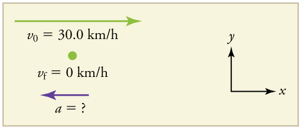
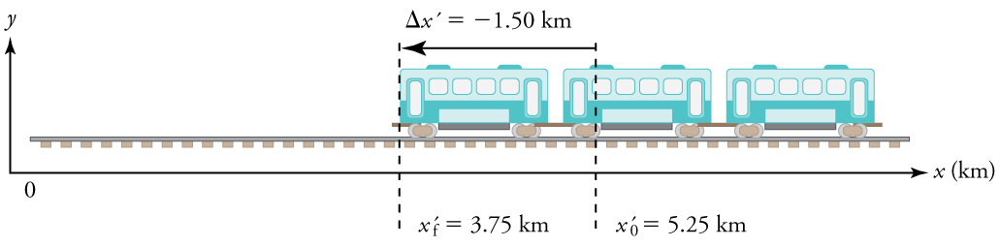
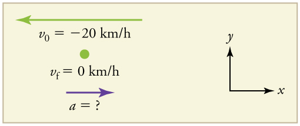

* Define and distinguish between instantaneous acceleration, average acceleration, and deceleration.
* Calculate acceleration given initial time, initial velocity, final time, and final velocity.

 "){: #import-auto-id3514068}

In everyday conversation, to accelerate means to speed up. The accelerator in a car can in fact cause it to speed up. The greater the **acceleration**{: data-type="term" #import-auto-id1298945}, the greater the change in velocity over a given time. The formal definition of acceleration is consistent with these notions, but more inclusive.

Average Acceleration

**Average Acceleration**{: data-type="term" #import-auto-id2580108} is *the rate at which velocity changes*,

<math xmlns="http://www.w3.org/1998/Math/MathML"><semantics><mrow><mrow><mrow><mrow><mover accent="true"><mi>a</mi><mo stretchy="true">-</mo></mover><mo stretchy="false">=</mo><mfrac><mrow><mn>Δ</mn><mi fontstyle="italic">v</mi></mrow><mrow><mn>Δ</mn><mi fontstyle="italic">t</mi></mrow></mfrac></mrow><mo stretchy="false">=</mo><mfrac><mrow><msub><mi>v</mi><mn>f</mn></msub><mrow><mrow /><mo stretchy="false">−</mo><msub><mi>v</mi><mrow><mn>0</mn></mrow></msub></mrow></mrow><mrow><msub><mi>t</mi><mrow><mn>f</mn></mrow></msub><mo stretchy="false">−</mo><msub><mi>t</mi><mrow><mn>0</mn></mrow></msub></mrow></mfrac></mrow><mo>,</mo></mrow><mrow /></mrow><annotation encoding="StarMath 5.0"> size 12{ { bar {a}}= { {Δv} over {Δt} } = { {v"" lSub { size 8{f} } - v rSub { size 8{0} } } over {t rSub { size 8{f} } - t rSub { size 8{0} } } } } {}</annotation></semantics></math>

where *<math xmlns="http://www.w3.org/1998/Math/MathML"><semantics><mrow><mrow><mover accent="true"><mi>a</mi><mo stretchy="true">-</mo></mover></mrow><mrow /></mrow><annotation encoding="StarMath 5.0"> size 12{ { bar {a}}} {}</annotation></semantics></math>

* is average acceleration, *<math xmlns="http://www.w3.org/1998/Math/MathML"><semantics><mrow><mrow><mi>v</mi></mrow><mrow /></mrow><annotation encoding="StarMath 5.0"> size 12{v} {}</annotation></semantics></math>

* is velocity, and *<math xmlns="http://www.w3.org/1998/Math/MathML"><semantics><mrow><mrow><mi>t</mi></mrow><mrow /></mrow><annotation encoding="StarMath 5.0"> size 12{t} {}</annotation></semantics></math>

* is time. (The bar over the <math xmlns="http://www.w3.org/1998/Math/MathML"><semantics><mrow><mrow><mi>a</mi></mrow><mrow /></mrow><annotation encoding="StarMath 5.0"> size 12{a} {}</annotation></semantics></math>

 means *average* acceleration.)

Because acceleration is velocity in m/s divided by time in s, the SI units for acceleration are <math xmlns="http://www.w3.org/1998/Math/MathML"><semantics><mrow><mrow><msup><mtext>m/s</mtext><mrow><mn>2</mn></mrow></msup></mrow><mrow /></mrow><annotation encoding="StarMath 5.0"> size 12{"m/s" rSup { size 8{2} } } {}</annotation></semantics></math>

, meters per second squared or meters per second per second, which literally means by how many meters per second the velocity changes every second.

Recall that velocity is a vector—it has both magnitude and direction. This means that a change in velocity can be a change in magnitude (or speed), but it can also be a change in *direction*. For example, if a car turns a corner at constant speed, it is accelerating because its direction is changing. The quicker you turn, the greater the acceleration. So there is an acceleration when velocity changes either in magnitude (an increase or decrease in speed) or in direction, or both.

Acceleration as a Vector

Acceleration is a vector in the same direction as the *change* in velocity, <math xmlns="http://www.w3.org/1998/Math/MathML"><semantics><mrow><mrow><mn>Δ</mn><mi fontstyle="italic">v</mi></mrow><mrow /></mrow><annotation encoding="StarMath 5.0"> size 12{Dv} {}</annotation></semantics></math>

. Since velocity is a vector, it can change either in magnitude or in direction. Acceleration is therefore a change in either speed or direction, or both.

Keep in mind that although acceleration is in the direction of the *change* in velocity, it is not always in the direction of *motion*. When an object slows down, its acceleration is opposite to the direction of its motion. This is known as **deceleration**{: data-type="term" #import-auto-id3583719}.

"){: #import-auto-id1515319}

Misconception Alert: Deceleration vs. Negative Acceleration

Deceleration always refers to acceleration in the direction opposite to the direction of the velocity. Deceleration always reduces speed. Negative acceleration, however, is acceleration *in the negative direction in the chosen coordinate system*. Negative acceleration may or may not be deceleration, and deceleration may or may not be considered negative acceleration. For example, consider [\[link\]](#import-auto-id3579626).

![Four separate diagrams of cars moving. Diagram a: A car moving toward the right. A velocity vector arrow points toward the right. An acceleration vector arrow also points toward the right. Diagram b: A car moving toward the right in the positive x direction. A velocity vector arrow points toward the right. An acceleration vector arrow points toward the left. Diagram c: A car moving toward the left. A velocity vector arrow points toward the left. An acceleration vector arrow points toward the right. Diagram d: A car moving toward the left. A velocity vector arrow points toward the left. An acceleration vector arrow also points toward the left.](../resources/Figure_02_04_00b.jpg "(a) This car is speeding up as it moves toward the right. It therefore has positive acceleration in our coordinate system. (b) This car is slowing down as it moves toward the right. Therefore, it has negative acceleration in our coordinate system, because its acceleration is toward the left. The car is also decelerating: the direction of its acceleration is opposite to its direction of motion. (c) This car is moving toward the left, but slowing down over time. Therefore, its acceleration is positive in our coordinate system because it is toward the right. However, the car is decelerating because its acceleration is opposite to its motion. (d) This car is speeding up as it moves toward the left. It has negative acceleration because it is accelerating toward the left. However, because its acceleration is in the same direction as its motion, it is speeding up (not decelerating)."){: #import-auto-id3579626}

Calculating Acceleration: A Racehorse Leaves the Gate

A racehorse coming out of the gate accelerates from rest to a velocity of 15.0 m/s due west in 1.80 s. What is its average acceleration?

"){: #import-auto-id1806246}

**Strategy**

First we draw a sketch and assign a coordinate system to the problem. This is a simple problem, but it always helps to visualize it. Notice that we assign east as positive and west as negative. Thus, in this case, we have negative velocity.

{: #import-auto-id1464243}

We can solve this problem by identifying <math xmlns="http://www.w3.org/1998/Math/MathML"><semantics><mrow><mrow><mn>Δ</mn><mi fontstyle="italic">v</mi></mrow><mrow /></mrow></semantics></math>

 and <math xmlns="http://www.w3.org/1998/Math/MathML"><semantics><mrow><mrow><mn>Δ</mn><mi fontstyle="italic">t</mi></mrow><mrow /></mrow></semantics></math>

 from the given information and then calculating the average acceleration directly from the equation <math xmlns="http://www.w3.org/1998/Math/MathML"><semantics><mrow><mrow><mrow><mrow><mover accent="true"><mi>a</mi><mo stretchy="true">-</mo></mover><mo stretchy="false">=</mo><mfrac><mrow><mn>Δ</mn><mi fontstyle="italic">v</mi></mrow><mrow><mn>Δ</mn><mi fontstyle="italic">t</mi></mrow></mfrac></mrow><mo stretchy="false">=</mo><mfrac><mrow><msub><mi>v</mi><mn>f</mn></msub><mrow><mrow /><mo stretchy="false">−</mo><msub><mi>v</mi><mrow><mn>0</mn></mrow></msub></mrow></mrow><mrow><msub><mi>t</mi><mrow><mn>f</mn></mrow></msub><mo stretchy="false">−</mo><msub><mi>t</mi><mrow><mn>0</mn></mrow></msub></mrow></mfrac></mrow></mrow><mrow /></mrow></semantics></math>

.

**Solution**

1\. Identify the knowns. <math xmlns="http://www.w3.org/1998/Math/MathML"><semantics><mrow><mrow><mrow><msub><mi>v</mi><mrow><mn>0</mn></mrow></msub><mo stretchy="false">=</mo><mn>0</mn></mrow></mrow><mrow /></mrow></semantics></math>

, <math xmlns="http://www.w3.org/1998/Math/MathML"><semantics><mrow><mrow><mrow><mrow><msub><mi>v</mi><mrow><mn>f</mn></mrow></msub><mo stretchy="false">=</mo><mrow><mo stretchy="false">−</mo><mtext>15</mtext></mrow></mrow><mtext>.0 m/s</mtext></mrow></mrow></mrow></semantics></math>

 (the negative sign indicates direction toward the west), <math xmlns="http://www.w3.org/1998/Math/MathML"><semantics><mrow><mrow><mrow><mrow><mn>Δ</mn><mi fontstyle="italic">t</mi><mo stretchy="false">=</mo><mn>1</mn></mrow><mtext>.80 s</mtext></mrow></mrow><mrow /></mrow></semantics></math>

.

2\. Find the change in velocity. Since the horse is going from zero to <math xmlns="http://www.w3.org/1998/Math/MathML"><semantics><mrow><mrow><mrow><mrow><mo stretchy="false">−</mo></mrow><mtext>15.0 m/s</mtext></mrow></mrow><mrow /></mrow><annotation encoding="StarMath 5.0"> size 12{ - "15" "." 0`"m/s"} {}</annotation></semantics></math>

, its change in velocity equals its final velocity: <math xmlns="http://www.w3.org/1998/Math/MathML"><semantics><mrow><mrow><mrow><mrow><mrow><mn>Δ</mn><mi fontstyle="italic">v</mi><mo stretchy="false">=</mo><msub><mi>v</mi><mrow><mn>f</mn></mrow></msub></mrow><mo stretchy="false">=</mo><mrow><mo stretchy="false">−</mo><mtext>15</mtext></mrow></mrow><mtext>.0 m/s</mtext></mrow></mrow><mrow /></mrow></semantics></math>

.

3\. Plug in the known values (<math xmlns="http://www.w3.org/1998/Math/MathML"><semantics><mrow><mrow><mn>Δ</mn><mi fontstyle="italic">v</mi></mrow><mrow /></mrow></semantics></math>

 and <math xmlns="http://www.w3.org/1998/Math/MathML"><semantics><mrow><mrow><mn>Δ</mn><mi fontstyle="italic">t</mi></mrow></mrow></semantics></math>

) and solve for the unknown <math xmlns="http://www.w3.org/1998/Math/MathML"><semantics><mrow><mrow><mover accent="true"><mi>a</mi><mo stretchy="true">-</mo></mover></mrow><mrow /></mrow></semantics></math>

.

<math xmlns="http://www.w3.org/1998/Math/MathML"><semantics><mrow><mrow><mrow><mrow><mrow><mrow><mover accent="true"><mi>a</mi><mo stretchy="true">-</mo></mover><mo stretchy="false">=</mo><mfrac><mrow><mn>Δ</mn><mi fontstyle="italic">v</mi></mrow><mrow><mn>Δ</mn><mi fontstyle="italic">t</mi></mrow></mfrac></mrow><mo stretchy="false">=</mo><mspace width="0.15em" /><mfrac><mrow><mrow><mo stretchy="false">−</mo><mtext>15</mtext></mrow><mtext>.0 m/s </mtext></mrow><mrow><mn>1</mn><mtext>.80 s</mtext></mrow></mfrac></mrow><mo stretchy="false">=</mo><mrow><mo stretchy="false">−</mo><mn>8</mn></mrow></mrow><mtext>.33 m</mtext><msup><mtext>/s</mtext><mrow><mn>2</mn></mrow></msup></mrow><mo>.</mo></mrow><mrow /></mrow></semantics></math>

**Discussion**

The negative sign for acceleration indicates that acceleration is toward the west. An acceleration of <math xmlns="http://www.w3.org/1998/Math/MathML"><semantics><mrow><mrow><mrow><mn>8</mn><mtext>.33 m</mtext><msup><mtext>/s</mtext><mrow><mn>2</mn></mrow></msup></mrow></mrow><mrow /></mrow></semantics></math>

 due west means that the horse increases its velocity by 8.33 m/s due west each second, that is, 8.33 meters per second per second, which we write as <math xmlns="http://www.w3.org/1998/Math/MathML"><semantics><mrow><mrow><mrow><mn>8</mn><mtext>.33 m</mtext><msup><mtext>/s</mtext><mrow><mn>2</mn></mrow></msup></mrow></mrow><mrow /></mrow><annotation encoding="StarMath 5.0"> size 12{8 "." "33"`"m/s" rSup { size 8{2} } } {}</annotation></semantics></math>

. This is truly an average acceleration, because the ride is not smooth. We shall see later that an acceleration of this magnitude would require the rider to hang on with a force nearly equal to his weight.

### Instantaneous Acceleration

**Instantaneous acceleration**{: data-type="term" #import-auto-id2303194} <math xmlns="http://www.w3.org/1998/Math/MathML"><semantics><mrow><mrow><mi>a</mi></mrow><mrow /></mrow></semantics></math>

, or the *acceleration at a specific instant in time*, is obtained by the same process as discussed for instantaneous velocity in [Time, Velocity, and Speed](/m42096)—that is, by considering an infinitesimally small interval of time. How do we find instantaneous acceleration using only algebra? The answer is that we choose an average acceleration that is representative of the motion. [\[link\]](#import-auto-id2590846) shows graphs of instantaneous acceleration versus time for two very different motions. In [\[link\]](#import-auto-id2590846)(a), the acceleration varies slightly and the average over the entire interval is nearly the same as the instantaneous acceleration at any time. In this case, we should treat this motion as if it had a constant acceleration equal to the average (in this case about <math xmlns="http://www.w3.org/1998/Math/MathML"><semantics><mrow><mrow><mrow><mn>1</mn><mtext>.</mtext><mn>8 m</mn><mi /><msup><mtext>/s</mtext><mrow><mn>2</mn></mrow></msup></mrow></mrow><mrow /></mrow></semantics></math>

). In [\[link\]](#import-auto-id2590846)(b), the acceleration varies drastically over time. In such situations it is best to consider smaller time intervals and choose an average acceleration for each. For example, we could consider motion over the time intervals from 0 to 1.0 s and from 1.0 to 3.0 s as separate motions with accelerations of <math xmlns="http://www.w3.org/1998/Math/MathML"><semantics><mrow><mrow><mrow><mrow><mo stretchy="false">+</mo><mn>3</mn></mrow><mtext>.</mtext><mn>0 m</mn><msup><mtext>/s</mtext><mrow><mn>2</mn></mrow></msup></mrow></mrow></mrow></semantics></math>

 and <math xmlns="http://www.w3.org/1998/Math/MathML"><semantics><mrow><mrow><mrow><mtext>–2</mtext><mtext>.</mtext><mn>0 m</mn><msup><mtext>/s</mtext><mrow><mn>2</mn></mrow></msup></mrow></mrow></mrow></semantics></math>

, respectively.

![Line graphs of instantaneous acceleration in meters per second per second versus time in seconds. The line on graph (a) shows slight variation above and below an average acceleration of about 1 point 8 meters per second per second. The line on graph (b) shows great variation over time, with instantaneous acceleration constant at 3 point 0 meters per second per second for 1 second, then dropping to negative 2 point 0 meters per second per second for the next 2 seconds, and then rising again, and so forth.](../resources/Figure_02_03_02.jpg "Graphs of instantaneous acceleration versus time for two different one-dimensional motions. (a) Here acceleration varies only slightly and is always in the same direction, since it is positive. The average over the interval is nearly the same as the acceleration at any given time. (b) Here the acceleration varies greatly, perhaps representing a package on a post office conveyor belt that is accelerated forward and backward as it bumps along. It is necessary to consider small time intervals (such as from 0 to 1.0 s) with constant or nearly constant acceleration in such a situation."){: #import-auto-id2590846}

The next several examples consider the motion of the subway train shown in [\[link\]](#import-auto-id2590556). In (a) the shuttle moves to the right, and in (b) it moves to the left. The examples are designed to further illustrate aspects of motion and to illustrate some of the reasoning that goes into solving problems.

 The subway train moves to the right from x0 to &#10;xf. Its displacement &#10;&#x394;x is +2.0 km. (b) The train moves to the left from &#10;x&#x2032;0 to &#10;x&#x2032;f size 12{ { {x}} sup { ' } rSub { size 8{f} } } {}. Its displacement &#x394;x&#x2032; size 12{&#x394;x'} {} is &#x2212;1.5 km. (Note that the prime symbol (&#x2032;) is used simply to distinguish between displacement in the two different situations. The distances of travel and the size of the cars are on different scales to fit everything into the diagram.)"){: #import-auto-id2590556}

Calculating Displacement: A Subway Train

What are the magnitude and sign of displacements for the motions of the subway train shown in parts (a) and (b) of [\[link\]](#import-auto-id2590556)?

**Strategy**

A drawing with a coordinate system is already provided, so we don’t need to make a sketch, but we should analyze it to make sure we understand what it is showing. Pay particular attention to the coordinate system. To find displacement, we use the equation <math xmlns="http://www.w3.org/1998/Math/MathML"><semantics><mrow><mrow><mrow><mn>Δ</mn><mi fontstyle="italic">x</mi><mo stretchy="false">=</mo><mrow><msub><mi>x</mi><mrow><mn>f</mn></mrow></msub><mo stretchy="false">−</mo><msub><mi>x</mi><mrow><mn>0</mn></mrow></msub></mrow></mrow></mrow><mrow /></mrow><annotation encoding="StarMath 5.0"> size 12{Δx=x rSub { size 8{f} } - x rSub { size 8{0} } } {}</annotation></semantics></math>

. This is straightforward since the initial and final positions are given.

**Solution**

1\. Identify the knowns. In the figure we see that <math xmlns="http://www.w3.org/1998/Math/MathML"><semantics><mrow><mrow><mrow><mrow><msub><mi>x</mi><mrow><mn>f</mn></mrow></msub><mo stretchy="false">=</mo></mrow><mtext>6.70 km</mtext></mrow></mrow></mrow></semantics></math>

 and <math xmlns="http://www.w3.org/1998/Math/MathML"><semantics><mrow><mrow><mrow><mrow><msub><mi>x</mi><mrow><mn>0</mn></mrow></msub><mo stretchy="false">=</mo></mrow><mtext>4.70 km</mtext></mrow></mrow></mrow></semantics></math>

 for part (a), and <math xmlns="http://www.w3.org/1998/Math/MathML"><semantics><mrow><mrow><mrow><mrow><msub><mrow><mi>x</mi><mo>′</mo></mrow><mn>f</mn></msub><mo stretchy="false">=</mo><mn>3</mn></mrow><mtext>.75 km</mtext></mrow></mrow></mrow></semantics></math>

 and <math xmlns="http://www.w3.org/1998/Math/MathML"><semantics><mrow><mrow><mrow><mrow><msub><mrow><mi>x</mi><mo>′</mo></mrow><mn>0</mn></msub><mo stretchy="false">=</mo><mn>5</mn></mrow><mtext>.25 km</mtext></mrow></mrow></mrow></semantics></math>

 for part (b).

2\. Solve for displacement in part (a).

<math xmlns="http://www.w3.org/1998/Math/MathML"> <semantics> <mrow> <mrow> <mrow> <mrow> <mrow><mn>Δ</mn> <mi fontstyle="italic">x</mi> <mo stretchy="false">=</mo> <mrow> <msub> <mi>x</mi> <mrow> <mn>f</mn> </mrow> </msub> <mo stretchy="false">−</mo> <msub> <mi>x</mi> <mrow> <mn>0</mn> </mrow> </msub> </mrow> </mrow> <mo stretchy="false">=</mo> <mn>6</mn> </mrow> <mtext>.</mtext> <mrow> <mtext>70 km</mtext> <mo stretchy="false">−</mo> <mn>4</mn> </mrow> <mtext>.</mtext> <mtext>70 km</mtext> <mtext>=</mtext><mspace width="0.20em" /> <mtext>+</mtext> <mn>2</mn> <mtext>.</mtext> <mtext>00 km</mtext> </mrow> </mrow> <mrow /> </mrow> <annotation encoding="StarMath 5.0"> size 12{Δx=x rSub { size 8{f} } - x rSub { size 8{0} } =6 "." "70 km" - 4 "." "70 km""=+"2 "." "00 km"} {}</annotation> </semantics> </math>

3\. Solve for displacement in part (b).

<math xmlns="http://www.w3.org/1998/Math/MathML"> <semantics> <mrow> <mrow> <mrow> <mn>Δ</mn><mi fontstyle="italic">x</mi><mo>′</mo> <mrow> <mrow> <mo stretchy="false">=</mo> <mrow> <msub> <mrow> <mi>x</mi><mo>′</mo> </mrow> <mn>f</mn> </msub> <mo stretchy="false">−</mo> <msub> <mrow> <mi>x</mi><mo>′</mo> </mrow> <mn>0</mn> </msub> </mrow> </mrow> <mo stretchy="false">=</mo> <mtext>3.75 km</mtext> <mo stretchy="false">−</mo> <mtext>5.25 km</mtext> <mo stretchy="false">=</mo> <mo stretchy="false">−</mo> <mtext>1.50 km</mtext> </mrow> </mrow> </mrow> </mrow> <annotation encoding="StarMath 5.0"> size 12{Δx'= { {x}} sup { ' } rSub { size 8{f} } - { {x}} sup { ' } rSub { size 8{0} } =3 "." "75 km" - 5 "." "25 km"= - 1 "." "50 km"} {}</annotation> </semantics> </math>

**Discussion**

The direction of the motion in (a) is to the right and therefore its displacement has a positive sign, whereas motion in (b) is to the left and thus has a negative sign.

Comparing Distance Traveled with Displacement: A Subway Train

What are the distances traveled for the motions shown in parts (a) and (b) of the subway train in [\[link\]](#import-auto-id2590556)?

**Strategy**

To answer this question, think about the definitions of distance and distance traveled, and how they are related to displacement. Distance between two positions is defined to be the magnitude of displacement, which was found in [\[link\]](#fs-id1744930). Distance traveled is the total length of the path traveled between the two positions. (See [Displacement](/m42033).) In the case of the subway train shown in [\[link\]](#import-auto-id2590556), the distance traveled is the same as the distance between the initial and final positions of the train.

**Solution**

1\. The displacement for part (a) was +2.00 km. Therefore, the distance between the initial and final positions was 2.00 km, and the distance traveled was 2.00 km.

2\. The displacement for part (b) was <math xmlns="http://www.w3.org/1998/Math/MathML"><semantics><mrow><mtext>−1.5 km.</mtext></mrow></semantics></math>

 Therefore, the distance between the initial and final positions was 1.50 km, and the distance traveled was 1.50 km.

**Discussion**

Distance is a scalar. It has magnitude but no sign to indicate direction.

Calculating Acceleration: A Subway Train Speeding Up

Suppose the train in [\[link\]](#import-auto-id2590556)(a) accelerates from rest to 30.0 km/h in the first 20.0 s of its motion. What is its average acceleration during that time interval?

**Strategy**

It is worth it at this point to make a simple sketch:

{: #import-auto-id2400753}

This problem involves three steps. First we must determine the change in velocity, then we must determine the change in time, and finally we use these values to calculate the acceleration.

**Solution**

1\. Identify the knowns. <math xmlns="http://www.w3.org/1998/Math/MathML"><semantics><mrow><mrow><mrow><msub><mi>v</mi><mrow><mn>0</mn></mrow></msub><mo stretchy="false">=</mo><mn>0</mn></mrow></mrow><mrow /></mrow><annotation encoding="StarMath 5.0"> size 12{v rSub { size 8{0} } =0} {}</annotation></semantics></math>

 (the trains starts at rest), <math xmlns="http://www.w3.org/1998/Math/MathML"><semantics><mrow><mrow><mrow><mrow><msub><mi>v</mi><mrow><mn>f</mn></mrow></msub><mo stretchy="false">=</mo><mtext>30</mtext></mrow><mtext>.</mtext><mtext>0 km/h</mtext></mrow></mrow><mrow /></mrow><annotation encoding="StarMath 5.0"> size 12{v rSub { size 8{f} } ="30" "." "0 km/h"} {}</annotation></semantics></math>

, and <math xmlns="http://www.w3.org/1998/Math/MathML"><semantics><mrow><mrow><mrow><mrow><mn>Δ</mn><mi fontstyle="italic">t</mi><mo stretchy="false">=</mo><mtext>20</mtext></mrow><mtext>.</mtext><mtext>0 s</mtext></mrow></mrow><mrow /></mrow><annotation encoding="StarMath 5.0"> size 12{Δt="20" "." "0 s"} {}</annotation></semantics></math>

.

2\. Calculate <math xmlns="http://www.w3.org/1998/Math/MathML"><semantics><mrow><mrow><mn>Δ</mn><mi fontstyle="italic">v</mi></mrow><mrow /></mrow><annotation encoding="StarMath 5.0"> size 12{Δv} {}</annotation></semantics></math>

. Since the train starts from rest, its change in velocity is <math xmlns="http://www.w3.org/1998/Math/MathML"><semantics><mrow><mrow><mrow><mn>Δ</mn><mi fontstyle="italic">v</mi><mtext>=</mtext><mspace width="0.20em" /><mtext>+</mtext><mtext>30.0 km/h</mtext></mrow></mrow></mrow><annotation encoding="StarMath 5.0"> size 12{Δv"=+""30" "." 0`"km/h"} {}</annotation></semantics></math>

, where the plus sign means velocity to the right.

3\. Plug in known values and solve for the unknown, <math xmlns="http://www.w3.org/1998/Math/MathML"><semantics><mrow><mrow><mover accent="true"><mi>a</mi><mo stretchy="true">-</mo></mover></mrow><mrow /></mrow><annotation encoding="StarMath 5.0"> size 12{ { bar {a}}} {}</annotation></semantics></math>

.

<math xmlns="http://www.w3.org/1998/Math/MathML"> <semantics> <mrow> <mrow> <mrow> <mrow> <mover accent="true"> <mi>a</mi> <mo stretchy="true">-</mo> </mover> <mo stretchy="false">=</mo> <mfrac> <mrow><mn>Δ</mn><mi fontstyle="italic">v</mi></mrow> <mrow><mn>Δ</mn><mi fontstyle="italic">t</mi></mrow> </mfrac> </mrow> <mo stretchy="false">=</mo> <mfrac> <mrow> <mo stretchy="false">+</mo> <mtext>30.0 km/h</mtext> </mrow> <mrow> <mtext>20</mtext> <mtext>.</mtext> <mn>0 s</mn> </mrow> </mfrac> </mrow> </mrow> <mrow /> </mrow> <annotation encoding="StarMath 5.0"> size 12{ { bar {a}}= { {Δv} over {Δt} } = { {+"30" "." 0`"km/h"} over {"20" "." 0`s} } } {}</annotation> </semantics> </math>

4\. Since the units are mixed (we have both hours and seconds for time), we need to convert everything into SI units of meters and seconds. (See [Physical Quantities and Units](/m42091) for more guidance.)

<math xmlns="http://www.w3.org/1998/Math/MathML"> <semantics> <mrow> <mrow> <mrow> <mrow> <mover accent="true"> <mi>a</mi> <mo stretchy="true">-</mo> </mover> <mo stretchy="false">=</mo> <mfenced open="(" close=")"> <mfrac> <mrow> <mo stretchy="false">+</mo> <mtext>30 km/h</mtext> </mrow> <mrow> <mtext>20.0 s</mtext> </mrow> </mfrac> </mfenced> </mrow> <mfenced open="(" close=")"> <mfrac> <mrow> <msup> <mtext>10</mtext> <mrow> <mn>3</mn> </mrow> </msup><mspace width="0.25em" /> <mtext> m</mtext> </mrow> <mtext>1 km</mtext> </mfrac> </mfenced> <mrow> <mfenced open="(" close=")"> <mfrac> <mtext>1 h</mtext> <mtext>3600 s</mtext> </mfrac> </mfenced> <mo stretchy="false">=</mo> <mn>0</mn> </mrow> <mtext>.</mtext> <msup> <mtext>417 m/s</mtext> <mrow> <mn>2</mn> </mrow> </msup> </mrow> </mrow> <mrow /> </mrow> <annotation encoding="StarMath 5.0"> size 12{ { bar {a}}= left ( { {+"30 km/h"} over {"20" "." "0 s"} } right ) left ( { {"10" rSup { size 8{3} } " m"} over {"1 km"} } right ) left ( { {"1 h"} over {"3600 s"} } right )=0 "." "417 m/s" rSup { size 8{2} } } {}</annotation> </semantics> </math>

**Discussion**

The plus sign means that acceleration is to the right. This is reasonable because the train starts from rest and ends up with a velocity to the right (also positive). So acceleration is in the same direction as the *change* in velocity, as is always the case.

Calculate Acceleration: A Subway Train Slowing Down

Now suppose that at the end of its trip, the train in [\[link\]](#import-auto-id2590556)(a) slows to a stop from a speed of 30.0 km/h in 8.00 s. What is its average acceleration while stopping?

**Strategy**

{: #import-auto-id2324504}

In this case, the train is decelerating and its acceleration is negative because it is toward the left. As in the previous example, we must find the change in velocity and the change in time and then solve for acceleration.

**Solution**

1\. Identify the knowns. <math xmlns="http://www.w3.org/1998/Math/MathML"><semantics><mrow><mrow><mrow><mrow><msub><mi>v</mi><mrow><mn>0</mn></mrow></msub><mo stretchy="false">=</mo><mtext>30</mtext></mrow><mtext>.0 km/h</mtext></mrow></mrow><mrow /></mrow></semantics></math>

, <math xmlns="http://www.w3.org/1998/Math/MathML"><semantics><mrow><mrow><mrow><msub><mi>v</mi><mrow><mn>f</mn></mrow></msub><mo stretchy="false">=</mo><mn>0 km/h</mn></mrow></mrow><mrow /></mrow></semantics></math>

 (the train is stopped, so its velocity is 0), and <math xmlns="http://www.w3.org/1998/Math/MathML"><semantics><mrow><mrow><mrow><mrow><mn>Δ</mn><mi fontstyle="italic">t</mi><mo stretchy="false">=</mo></mrow><mtext>8.00 s</mtext></mrow></mrow></mrow></semantics></math>

.

2\. Solve for the change in velocity, <math xmlns="http://www.w3.org/1998/Math/MathML"><semantics><mrow><mrow><mn>Δ</mn><mi fontstyle="italic">v</mi></mrow><mrow /></mrow><annotation encoding="StarMath 5.0"> size 12{Δv} {}</annotation></semantics></math>

.

<math xmlns="http://www.w3.org/1998/Math/MathML"> <semantics> <mrow> <mrow> <mrow> <mrow> <mrow><mn>Δ</mn> <mi fontstyle="italic">v</mi> <mo stretchy="false">=</mo> <mrow> <msub> <mi>v</mi> <mrow> <mn>f</mn> </mrow> </msub> <mo stretchy="false">−</mo> <msub> <mi>v</mi> <mrow> <mn>0</mn> </mrow> </msub> </mrow> </mrow> <mo stretchy="false">=</mo> <mn>0</mn> <mo stretchy="false">−</mo> <mtext>30</mtext> </mrow> <mtext>.</mtext> <mrow> <mtext>0 km/h</mtext> <mo stretchy="false">=</mo> <mrow> <mo stretchy="false">−</mo> <mtext>30</mtext> </mrow> </mrow> <mtext>.0 km/h</mtext> </mrow> </mrow> </mrow> <annotation encoding="StarMath 5.0"> size 12{Δv=v rSub { size 8{f} } - v rSub { size 8{0} } =0 - "30" "." "0 km/h"= - "30" "." "0 km/h"} {}</annotation> </semantics> </math>

3\. Plug in the knowns, <math xmlns="http://www.w3.org/1998/Math/MathML"><semantics><mrow><mrow><mn>Δ</mn><mi fontstyle="italic">v</mi></mrow><mrow /></mrow><annotation encoding="StarMath 5.0"> size 12{Δv} {}</annotation></semantics></math>

 and <math xmlns="http://www.w3.org/1998/Math/MathML"><semantics><mrow><mrow><mn>Δ</mn><mi fontstyle="italic">t</mi></mrow><mrow /></mrow></semantics></math>

, and solve for <math xmlns="http://www.w3.org/1998/Math/MathML"><semantics><mrow><mrow><mover accent="true"><mi>a</mi><mo stretchy="true">-</mo></mover></mrow><mrow /></mrow></semantics></math>

.

<math xmlns="http://www.w3.org/1998/Math/MathML"> <semantics> <mrow> <mrow> <mrow> <mrow> <mover accent="true"> <mi>a</mi> <mo stretchy="true">-</mo> </mover> <mo stretchy="false">=</mo> <mfrac> <mrow><mn>Δ</mn><mi fontstyle="italic">v</mi></mrow> <mrow><mn>Δ</mn><mi fontstyle="italic">t</mi></mrow> </mfrac> </mrow> <mo stretchy="false">=</mo> <mfrac> <mrow> <mrow> <mo stretchy="false">−</mo> <mtext>30</mtext> </mrow> <mtext>.</mtext> <mtext>0 km/h</mtext> </mrow> <mrow> <mn>8</mn> <mtext>.</mtext> <mtext>00 s</mtext> </mrow> </mfrac> </mrow> </mrow> <mrow /> </mrow> <annotation encoding="StarMath 5.0"> size 12{ { bar {a}}= { {Δv} over {Δt} } = { { - "30" "." "0 km/h"} over {8 "." "00 s"} } } {}</annotation> </semantics> </math>

4\. Convert the units to meters and seconds.

<math xmlns="http://www.w3.org/1998/Math/MathML"> <semantics> <mrow> <mrow> <mrow> <mrow> <mrow> <mover accent="true"> <mi>a</mi> <mo stretchy="true">-</mo> </mover> <mo stretchy="false">=</mo> <mfrac> <mrow><mn>Δ</mn><mi fontstyle="italic">v</mi></mrow> <mrow><mn>Δ</mn><mi fontstyle="italic">t</mi></mrow> </mfrac> </mrow> <mo stretchy="false">=</mo> <mfenced open="(" close=")"> <mfrac> <mrow> <mo stretchy="false">−</mo> <mtext>30.0 km/h</mtext> </mrow> <mrow> <mtext>8.00 s</mtext> </mrow> </mfrac> </mfenced> </mrow> <mfenced open="(" close=")"> <mfrac> <mrow> <msup> <mtext>10</mtext> <mrow> <mn>3</mn> </mrow> </msup><mspace width="0.25em" /> <mtext> m</mtext> </mrow> <mtext>1 km</mtext> </mfrac> </mfenced> <mrow> <mfenced open="(" close=")"> <mfrac> <mtext>1 h</mtext> <mtext>3600 s</mtext> </mfrac> </mfenced> <mo stretchy="false">=</mo> <msup> <mtext>−1.04 m/s</mtext> <mrow> <mn>2</mn> </mrow> </msup> </mrow> </mrow> <mtext>.</mtext> </mrow> </mrow> <annotation encoding="StarMath 5.0"> size 12{ { bar {a}}= { {Δv} over {Δt} } = left ( { { - "30" "." "0 km/h"} over {8 "." "00 s"} } right ) left ( { {"10" rSup { size 8{3} } " m"} over {"1 km"} } right ) left ( { {"1 h"} over {"3600 s"} } right )= - 1 "." "04 m/s" rSup { size 8{2} } "." } {}</annotation> </semantics> </math>

**Discussion**

The minus sign indicates that acceleration is to the left. This sign is reasonable because the train initially has a positive velocity in this problem, and a negative acceleration would oppose the motion. Again, acceleration is in the same direction as the *change* in velocity, which is negative here. This acceleration can be called a deceleration because it has a direction opposite to the velocity.

The graphs of position, velocity, and acceleration vs. time for the trains in [\[link\]](#fs-id1372721) and [\[link\]](#fs-id3600466) are displayed in [\[link\]](#import-auto-id2596938). (We have taken the velocity to remain constant from 20 to 40 s, after which the train decelerates.)

![Three graphs. The first is a line graph of position in meters versus time in seconds. The line begins at the origin and has a concave up shape from time equals zero to time equals twenty seconds. It is straight with a positive slope from twenty seconds to forty seconds. It is then convex up from forty to fifty seconds. The second graph is a line graph of velocity in meters per second versus time in seconds. The line is straight with a positive slope beginning at the origin from 0 to twenty seconds. It is flat from twenty to forty seconds. From forty to fifty seconds the line is straight with a negative slope back down to a velocity of 0. The third graph is a line graph of acceleration in meters per second per second versus time in seconds. The line is flat with a positive constant acceleration from zero to twenty seconds. The line then drops to an acceleration of 0 from twenty to forty seconds. The line drops again to a negative acceleration from forty to fifty seconds.](../resources/Figure_02_03_04.jpg "(a) Position of the train over time. Notice that the train&#x2019;s position changes slowly at the beginning of the journey, then more and more quickly as it picks up speed. Its position then changes more slowly as it slows down at the end of the journey. In the middle of the journey, while the velocity remains constant, the position changes at a constant rate. (b) Velocity of the train over time. The train&#x2019;s velocity increases as it accelerates at the beginning of the journey. It remains the same in the middle of the journey (where there is no acceleration). It decreases as the train decelerates at the end of the journey. (c) The acceleration of the train over time. The train has positive acceleration as it speeds up at the beginning of the journey. It has no acceleration as it travels at constant velocity in the middle of the journey. Its acceleration is negative as it slows down at the end of the journey."){: #import-auto-id2596938}

Calculating Average Velocity: The Subway Train

What is the average velocity of the train in part b of [\[link\]](#fs-id1744930), and shown again below, if it takes 5.00 min to make its trip?

{: #import-auto-id2412190}

**Strategy**

Average velocity is displacement divided by time. It will be negative here, since the train moves to the left and has a negative displacement.

**Solution**

1\. Identify the knowns. <math xmlns="http://www.w3.org/1998/Math/MathML"><semantics><mrow><mrow><mrow><mrow><msub><mrow><mi>x</mi><mo>′</mo></mrow><mn>f</mn></msub><mo stretchy="false">=</mo><mn>3</mn></mrow><mtext>.75 km</mtext></mrow></mrow></mrow></semantics></math>

, <math xmlns="http://www.w3.org/1998/Math/MathML"><semantics><mrow><mrow><mrow><mrow><msub><mrow><mi>x</mi><mo>′</mo></mrow><mn>0</mn></msub><mo stretchy="false">=</mo></mrow><mtext>5.25 km</mtext></mrow></mrow></mrow></semantics></math>

, <math xmlns="http://www.w3.org/1998/Math/MathML"><semantics><mrow><mrow><mrow><mrow><mn>Δ</mn><mi fontstyle="italic">t</mi><mo stretchy="false">=</mo></mrow><mtext>5.00 min</mtext></mrow></mrow><mrow /></mrow></semantics></math>

.

2\. Determine displacement, <math xmlns="http://www.w3.org/1998/Math/MathML"><semantics><mrow><mn>Δ</mn><mi fontstyle="italic">x</mi><mo>′</mo></mrow></semantics></math>

. We found <math xmlns="http://www.w3.org/1998/Math/MathML"><semantics><mrow><mn>Δ</mn><mi fontstyle="italic">x</mi><mo>′</mo></mrow></semantics></math>

 to be <math xmlns="http://www.w3.org/1998/Math/MathML"><semantics><mrow><mrow><mrow><mrow><mo stretchy="false">−</mo></mrow><mtext>1.5 km</mtext></mrow></mrow><mrow /></mrow></semantics></math>

 in [\[link\]](#fs-id1744930).

3\. Solve for average velocity.

<math xmlns="http://www.w3.org/1998/Math/MathML"> <semantics> <mrow> <mrow> <mrow> <mrow> <mover accent="true"> <mi>v</mi> <mo stretchy="true">-</mo> </mover> <mo stretchy="false">=</mo> <mfrac> <mrow> <mn>Δ</mn> <mi>x</mi> <mo>′</mo> </mrow> <mrow><mn>Δ</mn> <mi fontstyle="italic">t</mi></mrow> </mfrac> </mrow> <mo stretchy="false">=</mo> <mfrac> <mrow> <mo stretchy="false">−</mo> <mtext>1.50 km</mtext> </mrow> <mrow> <mtext>5.00 min</mtext> </mrow> </mfrac> </mrow> </mrow> </mrow> <annotation encoding="StarMath 5.0"> size 12{ { bar {v}}= { {Δ { {x}} sup { ' }} over {Δt} } = { { - 1 "." "50 km"} over {5 "." "00 min"} } } {}</annotation> </semantics> </math>

4\. Convert units.

<math xmlns="http://www.w3.org/1998/Math/MathML"> <semantics> <mrow> <mrow> <mrow> <mrow> <mrow> <mover accent="true"> <mi>v</mi> <mo stretchy="true">-</mo> </mover> <mo stretchy="false">=</mo> <mfrac> <mrow> <mn>Δ</mn> <mi>x</mi> <mo>′</mo> </mrow> <mrow><mn>Δ</mn> <mi fontstyle="italic">t</mi></mrow> </mfrac> </mrow> <mo stretchy="false">=</mo> <mfenced open="(" close=")"> <mfrac> <mrow> <mrow> <mo stretchy="false">−</mo> <mn>1</mn> </mrow> <mtext>.</mtext> <mtext>50 km</mtext> </mrow> <mrow> <mn>5</mn> <mtext>.</mtext> <mtext>00 min</mtext> </mrow> </mfrac> </mfenced> </mrow> <mrow> <mfenced open="(" close=")"> <mfrac> <mrow> <mtext>60 min</mtext> </mrow> <mrow> <mn>1 h</mn> </mrow> </mfrac> </mfenced> <mo stretchy="false">=</mo> <mrow> <mo stretchy="false">−</mo> <mtext>18</mtext> </mrow> </mrow> <mtext>.0 km/h</mtext> </mrow> </mrow> </mrow> <annotation encoding="StarMath 5.0"> size 12{ { bar {v}}= { {Δx'} over {Δt} } = left ( { { - 1 "." "50"`"km"} over {5 "." "00"`"min"} } right ) left ( { {"60"`"min"} over {1`h} } right )= - "18" "." 0`"km/h"} {}</annotation> </semantics> </math>

**Discussion**

The negative velocity indicates motion to the left.

Calculating Deceleration: The Subway Train

Finally, suppose the train in [\[link\]](#import-auto-id2412190) slows to a stop from a velocity of 20.0 km/h in 10.0 s. What is its average acceleration?

**Strategy**

Once again, let’s draw a sketch:

{: #import-auto-id2412073}

As before, we must find the change in velocity and the change in time to calculate average acceleration.

**Solution**

1\. Identify the knowns. <math xmlns="http://www.w3.org/1998/Math/MathML"><semantics><mrow><mrow><mrow><msub><mi>v</mi><mrow><mn>0</mn></mrow></msub><mo stretchy="false">=</mo><mrow><mo stretchy="false">−</mo><mtext>20 km/h</mtext></mrow></mrow></mrow></mrow></semantics></math>

, <math xmlns="http://www.w3.org/1998/Math/MathML"><semantics><mrow><mrow><mrow><msub><mi>v</mi><mrow><mn>f</mn></mrow></msub><mo stretchy="false">=</mo><mn>0 km/h</mn></mrow></mrow></mrow></semantics></math>

, <math xmlns="http://www.w3.org/1998/Math/MathML"><semantics><mrow><mrow><mrow><mrow><mn>Δ</mn><mi fontstyle="italic">t</mi><mo stretchy="false">=</mo><mtext>10</mtext></mrow><mtext>.</mtext><mn>0 s</mn></mrow></mrow><mrow /></mrow></semantics></math>

.

2\. Calculate <math xmlns="http://www.w3.org/1998/Math/MathML"><semantics><mrow><mrow><mn>Δ</mn><mi fontstyle="italic">v</mi></mrow><mrow /></mrow><annotation encoding="StarMath 5.0"> size 12{Δv} {}</annotation></semantics></math>

. The change in velocity here is actually positive, since

<math xmlns="http://www.w3.org/1998/Math/MathML"><semantics><mrow><mrow><mrow><mrow><mrow><mn>Δ</mn><mi fontstyle="italic">v</mi><mo stretchy="false">=</mo><mrow><msub><mi>v</mi><mrow><mn>f</mn></mrow></msub><mo stretchy="false">−</mo><msub><mi>v</mi><mrow><mn>0</mn></mrow></msub></mrow></mrow><mo stretchy="false">=</mo><mrow><mn>0</mn><mo stretchy="false">−</mo><mfenced open="(" close=")"><mrow><mo stretchy="false">−</mo><mtext>20 km/h</mtext></mrow></mfenced></mrow></mrow><mtext>=</mtext><mspace width="0.25" /><mtext>+</mtext><mtext>20 km/h</mtext></mrow><mo>.</mo></mrow><mrow /></mrow><annotation encoding="StarMath 5.0"> size 12{Δv=v rSub { size 8{f} } - v rSub { size 8{0} } =0 - left ( - "20 km/h" right )"=+""20 km/h"} {}</annotation></semantics></math>

3\. Solve for <math xmlns="http://www.w3.org/1998/Math/MathML"><semantics><mrow><mrow><mover accent="true"><mi>a</mi><mo stretchy="true">-</mo></mover></mrow><mrow /></mrow><annotation encoding="StarMath 5.0"> size 12{ { bar {a}}} {}</annotation></semantics></math>

.

<math xmlns="http://www.w3.org/1998/Math/MathML"> <semantics> <mrow> <mrow> <mrow> <mrow> <mover accent="true"> <mi>a</mi> <mo stretchy="true">-</mo> </mover> <mo stretchy="false">=</mo> <mfrac> <mrow><mn>Δ</mn><mi fontstyle="italic">v</mi></mrow> <mrow><mn>Δ</mn><mi fontstyle="italic">t</mi></mrow> </mfrac> </mrow> <mo stretchy="false">=</mo> <mfrac> <mrow> <mrow> <mo stretchy="false">+</mo> <mtext>20</mtext> </mrow> <mtext>.0 km/h</mtext> </mrow> <mrow> <mtext>10</mtext> <mtext>.</mtext> <mn>0 s</mn> </mrow> </mfrac> </mrow> </mrow> </mrow> </semantics> </math>

4\. Convert units.

<math xmlns="http://www.w3.org/1998/Math/MathML"> <semantics> <mrow> <mrow> <mrow> <mrow> <mover accent="true"> <mi>a</mi> <mo stretchy="true">-</mo> </mover> <mo stretchy="false">=</mo> <mfenced open="(" close=")"> <mfrac> <mrow> <mrow> <mo stretchy="false">+</mo> <mtext>20</mtext> </mrow> <mtext>.</mtext> <mtext>0 km/h</mtext> </mrow> <mrow> <mtext>10</mtext> <mtext>.</mtext> <mtext>0 s</mtext> </mrow> </mfrac> </mfenced> </mrow> <mfenced open="(" close=")"> <mfrac> <mrow> <msup> <mtext>10</mtext> <mrow> <mn>3</mn> </mrow> </msup> <mspace width="0.25em" /> <mn>m</mn> </mrow> <mrow> <mn>1 km</mn> </mrow> </mfrac> </mfenced> <mfenced open="(" close=")"> <mfrac> <mrow> <mn>1 h</mn> </mrow> <mrow> <mtext>3600 s</mtext> </mrow> </mfrac> </mfenced> <mtext>=</mtext> <mspace width="0.25em" /> <mtext>+</mtext> <mn>0</mn> <mtext>.556 m</mtext> <msup> <mtext>/s</mtext> <mrow> <mn>2</mn> </mrow> </msup> </mrow> </mrow> </mrow> </semantics> </math>

**Discussion**

The plus sign means that acceleration is to the right. This is reasonable because the train initially has a negative velocity (to the left) in this problem and a positive acceleration opposes the motion (and so it is to the right). Again, acceleration is in the same direction as the *change* in velocity, which is positive here. As in [\[link\]](#fs-id3600466), this acceleration can be called a deceleration since it is in the direction opposite to the velocity.

### Sign and Direction

Perhaps the most important thing to note about these examples is the signs of the answers. In our chosen coordinate system, plus means the quantity is to the right and minus means it is to the left. This is easy to imagine for displacement and velocity. But it is a little less obvious for acceleration. Most people interpret negative acceleration as the slowing of an object. This was not the case in [\[link\]](#fs-id4015260), where a positive acceleration slowed a negative velocity. The crucial distinction was that the acceleration was in the opposite direction from the velocity. In fact, a negative acceleration will *increase* a negative velocity. For example, the train moving to the left in [\[link\]](#import-auto-id2412190) is sped up by an acceleration to the left. In that case, both <math xmlns="http://www.w3.org/1998/Math/MathML"><semantics><mrow><mrow><mi>v</mi></mrow><mrow /></mrow><annotation encoding="StarMath 5.0"> size 12{v} {}</annotation></semantics></math>

 and <math xmlns="http://www.w3.org/1998/Math/MathML"><semantics><mrow><mrow><mi>a</mi></mrow><mrow /></mrow><annotation encoding="StarMath 5.0"> size 12{a} {}</annotation></semantics></math>

 are negative. The plus and minus signs give the directions of the accelerations. If acceleration has the same sign as the velocity, the object is speeding up. If acceleration has the opposite sign as the velocity, the object is slowing down.

Check Your Understanding

An airplane lands on a runway traveling east. Describe its acceleration.

If we take east to be positive, then the airplane has negative acceleration, as it is accelerating toward the west. It is also decelerating: its acceleration is opposite in direction to its velocity.

PhET Explorations: Moving Man Simulation

Learn about position, velocity, and acceleration graphs. Move the little man back and forth with the mouse and plot his motion. Set the position, velocity, or acceleration and let the simulation move the man for you.

<figure markdown="1" id="eip-id2056703">
<figcaption>
[Moving Man][1]
</figcaption>
 [{: data-print="false"}][1]{: data-type="image"}  
</figure>

### Section Summary

* {: #import-auto-id2412645} Acceleration is the rate at which velocity changes. In symbols, **average acceleration**{: data-type="term"}
  <math xmlns="http://www.w3.org/1998/Math/MathML"><semantics><mrow><mrow><mover accent="true"><mi>a</mi><mo stretchy="true">-</mo></mover></mrow><mrow /></mrow><annotation encoding="StarMath 5.0"> size 12{ { bar {a}}} {}</annotation></semantics></math>
  
  is
  

  <math xmlns="http://www.w3.org/1998/Math/MathML"> <semantics> <mrow> <mrow> <mrow> <mrow> <mrow> <mover accent="true"> <mi>a</mi> <mo stretchy="true">-</mo> </mover> <mo stretchy="false">=</mo><mfrac> <mrow> <mn>Δ</mn> <mi>v</mi> </mrow> <mrow><mn>Δ</mn> <mi fontstyle="italic">t</mi></mrow> </mfrac> </mrow> <mo stretchy="false">=</mo> <mfrac> <mrow> <msub> <mi>v</mi> <mrow> <mn>f</mn> </mrow> </msub> <mo stretchy="false">−</mo> <msub> <mi>v</mi> <mrow> <mn>0</mn> </mrow> </msub> </mrow> <mrow> <msub> <mi>t</mi> <mrow> <mn>f</mn> </mrow> </msub> <mo stretchy="false">−</mo> <msub> <mi>t</mi> <mrow> <mn>0</mn> </mrow> </msub> </mrow> </mfrac> </mrow> <mtext>.</mtext> </mrow> </mrow> <mrow /> </mrow> <annotation encoding="StarMath 5.0"> size 12{ { bar {a}}= { {Δv} over {Δt} } = { {v rSub { size 8{f} } - v rSub { size 8{0} } } over {t rSub { size 8{f} } - t rSub { size 8{0} } } } "." } {}</annotation> </semantics> </math>
  

* {: #import-auto-id2412738} The SI unit for acceleration is
  <math xmlns="http://www.w3.org/1998/Math/MathML"><semantics><mrow><mrow><msup><mtext>m/s</mtext><mrow><mn>2</mn></mrow></msup></mrow><mrow /></mrow><annotation encoding="StarMath 5.0"> size 12{"m/s" rSup { size 8{2} } } {}</annotation></semantics></math>
  
  .
* {: #import-auto-id2412758} Acceleration is a vector, and thus has a both a magnitude and direction.
* {: #import-auto-id2412770} Acceleration can be caused by either a change in the magnitude or the direction of the velocity.
* {: #import-auto-id2412772} Instantaneous acceleration
  <math xmlns="http://www.w3.org/1998/Math/MathML"><semantics><mrow><mrow><mi>a</mi></mrow><mrow /></mrow><annotation encoding="StarMath 5.0"> size 12{a} {}</annotation></semantics></math>
  
  is the acceleration at a specific instant in time.
* {: #import-auto-id2412729} Deceleration is an acceleration with a direction opposite to that of the velocity.

### Conceptual Questions

Is it possible for speed to be constant while acceleration is not zero? Give an example of such a situation.
{: xmlns:fo="urn:oasis:names:tc:opendocument:xmlns:xsl-fo-compatible:1.0" fo:font-weight="normal"}

Is it possible for velocity to be constant while acceleration is not zero? Explain.
{: xmlns:fo="urn:oasis:names:tc:opendocument:xmlns:xsl-fo-compatible:1.0" fo:font-weight="normal"}

Give an example in which velocity is zero yet acceleration is not.
{: xmlns:fo="urn:oasis:names:tc:opendocument:xmlns:xsl-fo-compatible:1.0" fo:font-weight="normal"}

If a subway train is moving to the left (has a negative velocity) and then comes to a stop, what is the direction of its acceleration? Is the acceleration positive or negative?

Plus and minus signs are used in one-dimensional motion to indicate direction. What is the sign of an acceleration that reduces the magnitude of a negative velocity? Of a positive velocity?
{: xmlns:fo="urn:oasis:names:tc:opendocument:xmlns:xsl-fo-compatible:1.0" fo:font-weight="normal"}

### Problems &amp; Exercises

A cheetah can accelerate from rest to a speed of 30.0 m/s in 7.00 s. What is its acceleration?
{: xmlns:fo="urn:oasis:names:tc:opendocument:xmlns:xsl-fo-compatible:1.0" fo:font-weight="normal"}

<math xmlns="http://www.w3.org/1998/Math/MathML"> <semantics> <mrow> <mrow> <mrow> <mn>4</mn> <mtext>.</mtext> <mtext>29</mtext> <mspace width="0.25em" /> <msup> <mtext>m/s</mtext> <mrow> <mn>2</mn> </mrow> </msup> </mrow> </mrow> <mrow /> </mrow> <annotation encoding="StarMath 5.0"> size 12{4 "." "29"`"m/s" rSup { size 8{2} } } {}</annotation> </semantics> </math>
{: xmlns:fo="urn:oasis:names:tc:opendocument:xmlns:xsl-fo-compatible:1.0" fo:font-weight="normal"}

**Professional Application**

Dr. John Paul Stapp was U.S. Air Force officer who studied the effects of extreme deceleration on the human body. On December 10, 1954, Stapp rode a rocket sled, accelerating from rest to a top speed of 282 m/s (1015 km/h) in 5.00 s, and was brought jarringly back to rest in only 1.40 s! Calculate his (a) acceleration and (b) deceleration. Express each in multiples of <math xmlns="http://www.w3.org/1998/Math/MathML"><semantics><mrow><mrow><mi>g</mi></mrow><mrow /></mrow></semantics></math>

 <math xmlns="http://www.w3.org/1998/Math/MathML"><semantics><mrow><mrow><mrow><mo stretchy="false">(</mo><mn>9</mn><mtext>.</mtext><mtext>80 m</mtext><msup><mtext>/s</mtext><mrow><mn>2</mn></mrow></msup><mo stretchy="false">)</mo></mrow></mrow><mrow /></mrow></semantics></math>

 by taking its ratio to the acceleration of gravity.

A commuter backs her car out of her garage with an acceleration of <math xmlns="http://www.w3.org/1998/Math/MathML"><semantics><mrow><mrow><mrow><mn>1</mn><mtext>.</mtext><msup><mtext>40 m/s</mtext><mrow><mn>2</mn></mrow></msup></mrow></mrow><mrow /></mrow><annotation encoding="StarMath 5.0"> size 12{1 "." "40 m/s" rSup { size 8{2} } } {}</annotation></semantics></math>

. (a) How long does it take her to reach a speed of 2.00 m/s? (b) If she then brakes to a stop in 0.800 s, what is her deceleration?

(a) <math xmlns="http://www.w3.org/1998/Math/MathML"><semantics><mrow><mrow><mrow><mn>1</mn><mtext>.</mtext><mtext>43 s</mtext></mrow></mrow><mrow /></mrow><annotation encoding="StarMath 5.0"> size 12{1 "." "43"`s} {}</annotation></semantics></math>

(b) <math xmlns="http://www.w3.org/1998/Math/MathML"><semantics><mrow><mrow><mrow><mrow><mo stretchy="false">−</mo><mn>2</mn></mrow><mtext>.</mtext><mtext>50</mtext><mspace width="0.25em" /><msup><mtext>m/s</mtext><mrow><mn>2</mn></mrow></msup></mrow></mrow><mrow /></mrow><annotation encoding="StarMath 5.0"> size 12{ - 2 "." "50"`"m/s" rSup { size 8{2} } } {}</annotation></semantics></math>

Assume that an intercontinental ballistic missile goes from rest to a suborbital speed of 6.50 km/s in 60.0 s (the actual speed and time are classified). What is its average acceleration in <math xmlns="http://www.w3.org/1998/Math/MathML"><semantics><mrow><mrow><msup><mtext>m/s</mtext><mrow><mn>2</mn></mrow></msup></mrow><mrow /></mrow><annotation encoding="StarMath 5.0"> size 12{"m/s" rSup { size 8{2} } } {}</annotation></semantics></math>

 and in multiples of <math xmlns="http://www.w3.org/1998/Math/MathML"><semantics><mrow><mrow><mi>g</mi></mrow><mrow /></mrow></semantics></math>

 <math xmlns="http://www.w3.org/1998/Math/MathML"><semantics><mrow><mrow><mrow><mo stretchy="false">(</mo><mn>9</mn><mtext>.</mtext><mtext>80 m</mtext><msup><mtext>/s</mtext><mrow><mn>2</mn></mrow></msup><mo stretchy="false">)</mo></mrow><mo>?</mo></mrow><mrow /></mrow></semantics></math>

### Glossary
{: data-type="glossary-title"}

acceleration
: the rate of change in velocity; the change in velocity over time
{: #import-auto-id2412629}

average acceleration
: the change in velocity divided by the time over which it changes
{: #import-auto-id2412631}

instantaneous acceleration
: acceleration at a specific point in time
{: #import-auto-id2412633}

deceleration
: acceleration in the direction opposite to velocity; acceleration that results in a decrease in velocity
{: #import-auto-id2412635}

[1]: https://archive.cnx.org/specials/e2ca52af-8c6b-450e-ac2f-9300b38e8739/moving-man/
