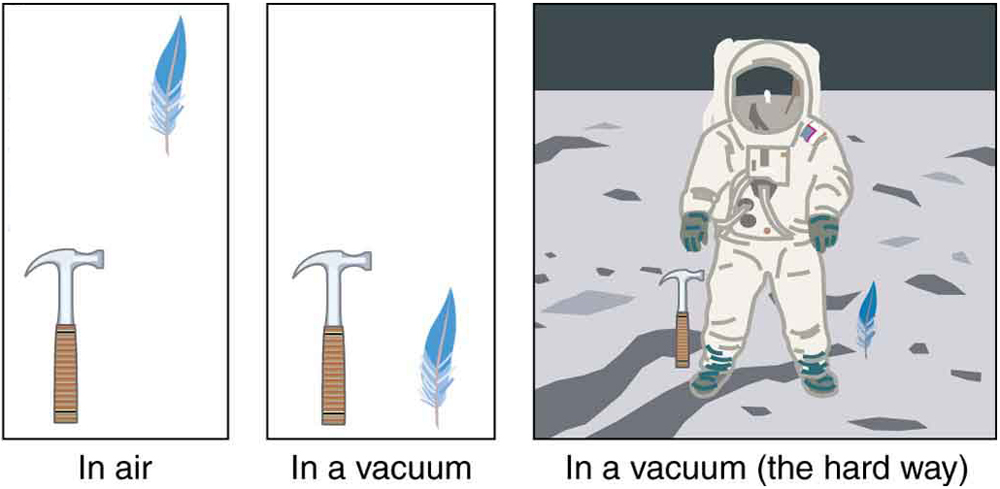
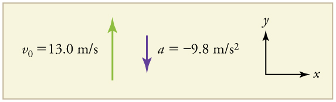
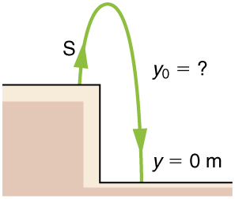

* Describe the effects of gravity on objects in motion.
* Describe the motion of objects that are in free fall.
* Calculate the position and velocity of objects in free fall.

Falling objects form an interesting class of motion problems. For example, we can estimate the depth of a vertical mine shaft by dropping a rock into it and listening for the rock to hit the bottom. By applying the kinematics developed so far to falling objects, we can examine some interesting situations and learn much about gravity in the process.

### Gravity

The most remarkable and unexpected fact about falling objects is that, if air resistance and friction are negligible, then in a given location all objects fall toward the center of Earth with the *same constant acceleration*, *independent of their mass*. This experimentally determined fact is unexpected, because we are so accustomed to the effects of air resistance and friction that we expect light objects to fall slower than heavy ones.

 {: #import-auto-id4126662}

In the real world, air resistance can cause a lighter object to fall slower than a heavier object of the same size. A tennis ball will reach the ground after a hard baseball dropped at the same time. (It might be difficult to observe the difference if the height is not large.) Air resistance opposes the motion of an object through the air, while friction between objects—such as between clothes and a laundry chute or between a stone and a pool into which it is dropped—also opposes motion between them. For the ideal situations of these first few chapters, an object *falling without air resistance or friction* is defined to be in **free-fall**{: data-type="term" #import-auto-id1714641}.

The force of gravity causes objects to fall toward the center of Earth. The acceleration of free-falling objects is therefore called the **acceleration due to gravity**{: data-type="term" #import-auto-id1707599}. The acceleration due to gravity is *constant*, which means we can apply the kinematics equations to any falling object where air resistance and friction are negligible. This opens a broad class of interesting situations to us. The acceleration due to gravity is so important that its magnitude is given its own symbol, <math xmlns="http://www.w3.org/1998/Math/MathML"><semantics><mrow><mrow><mi>g</mi></mrow><mrow /></mrow><annotation encoding="StarMath 5.0"> size 12{g} {}</annotation></semantics></math>

. It is constant at any given location on Earth and has the average value

<math xmlns="http://www.w3.org/1998/Math/MathML"><semantics><mrow><mrow><mrow><mrow><mi>g</mi><mo stretchy="false">=</mo><mn>9</mn></mrow><mtext>.</mtext><msup><mtext>80 m/s</mtext><mrow><mn>2</mn></mrow></msup></mrow></mrow><mtext>.</mtext><mrow /></mrow><annotation encoding="StarMath 5.0"> size 12{g=9 "." "80 m/s" rSup { size 8{2} } } {}</annotation></semantics></math>

Although <math xmlns="http://www.w3.org/1998/Math/MathML"><semantics><mrow><mrow><mi>g</mi></mrow><mrow /></mrow><annotation encoding="StarMath 5.0"> size 12{g} {}</annotation></semantics></math>

 varies from <math xmlns="http://www.w3.org/1998/Math/MathML"><semantics><mrow><mrow><mrow><mn>9</mn><mtext>.</mtext><msup><mtext>78 m/s</mtext><mrow><mn>2</mn></mrow></msup></mrow></mrow><mrow /></mrow><annotation encoding="StarMath 5.0"> size 12{9 "." "78 m/s" rSup { size 8{2} } } {}</annotation></semantics></math>

 to <math xmlns="http://www.w3.org/1998/Math/MathML"><semantics><mrow /><annotation encoding="StarMath 5.0">{}</annotation></semantics></math>

<math xmlns="http://www.w3.org/1998/Math/MathML"><semantics><mrow><mrow><mrow><mn>9</mn><mtext>.</mtext><msup><mtext>83 m/s</mtext><mrow><mn>2</mn></mrow></msup></mrow></mrow><mrow /></mrow><annotation encoding="StarMath 5.0"> size 12{9 "." "83 m/s" rSup { size 8{2} } } {}</annotation></semantics></math>

, depending on latitude, altitude, underlying geological formations, and local topography, the average value of <math xmlns="http://www.w3.org/1998/Math/MathML"><semantics><mrow><mrow><mrow><mn>9</mn><mtext>.</mtext><msup><mtext>80 m/s</mtext><mrow><mn>2</mn></mrow></msup></mrow></mrow><mrow /></mrow><annotation encoding="StarMath 5.0"> size 12{9 "." "80 m/s" rSup { size 8{2} } } {}</annotation></semantics></math>

 will be used in this text unless otherwise specified. The direction of the acceleration due to gravity is *downward (towards the center of Earth)*. In fact, its direction *defines* what we call vertical. Note that whether the acceleration <math xmlns="http://www.w3.org/1998/Math/MathML"><semantics><mrow><mrow><mi>a</mi></mrow><mrow /></mrow><annotation encoding="StarMath 5.0"> size 12{a} {}</annotation></semantics></math>

 in the kinematic equations has the value <math xmlns="http://www.w3.org/1998/Math/MathML"><semantics><mrow><mrow><mrow><mo stretchy="false">+</mo><mi>g</mi></mrow></mrow><mrow /></mrow><annotation encoding="StarMath 5.0"> size 12{+g} {}</annotation></semantics></math>

 or <math xmlns="http://www.w3.org/1998/Math/MathML"><semantics><mrow><mrow><mrow><mo stretchy="false">−</mo><mi>g</mi></mrow></mrow><mrow /></mrow><annotation encoding="StarMath 5.0"> size 12{ - g} {}</annotation></semantics></math>

 depends on how we define our coordinate system. If we define the upward direction as positive, then <math xmlns="http://www.w3.org/1998/Math/MathML"><semantics><mrow><mrow><mrow><mrow><mrow><mi>a</mi><mo stretchy="false">=</mo><mrow><mo stretchy="false">−</mo><mi>g</mi></mrow></mrow><mo stretchy="false">=</mo><mrow><mo stretchy="false">−</mo><mn>9</mn></mrow></mrow><mtext>.</mtext><msup><mtext>80 m/s</mtext><mrow><mn>2</mn></mrow></msup></mrow></mrow><mrow /></mrow><annotation encoding="StarMath 5.0"> size 12{a= - g= - 9 "." "80 m/s" rSup { size 8{2} } } {}</annotation></semantics></math>

, and if we define the downward direction as positive, then <math xmlns="http://www.w3.org/1998/Math/MathML"><semantics><mrow><mrow><mrow><mrow><mrow><mi>a</mi><mo stretchy="false">=</mo><mi>g</mi></mrow><mo stretchy="false">=</mo><mn>9</mn></mrow><mtext>.</mtext><msup><mtext>80 m/s</mtext><mrow><mn>2</mn></mrow></msup></mrow></mrow><mrow /></mrow><annotation encoding="StarMath 5.0"> size 12{a=g=9 "." "80 m/s" rSup { size 8{2} } } {}</annotation></semantics></math>

.

### One-Dimensional Motion Involving Gravity

The best way to see the basic features of motion involving gravity is to start with the simplest situations and then progress toward more complex ones. So we start by considering straight up and down motion with no air resistance or friction. These assumptions mean that the velocity (if there is any) is vertical. If the object is dropped, we know the initial velocity is zero. Once the object has left contact with whatever held or threw it, the object is in free-fall. Under these circumstances, the motion is one-dimensional and has constant acceleration of magnitude <math xmlns="http://www.w3.org/1998/Math/MathML"><semantics><mrow><mrow><mi>g</mi></mrow><mrow /></mrow><annotation encoding="StarMath 5.0"> size 12{g} {}</annotation></semantics></math>

. We will also represent vertical displacement with the symbol <math xmlns="http://www.w3.org/1998/Math/MathML"><semantics><mrow><mrow><mi>y</mi></mrow><mrow /></mrow><annotation encoding="StarMath 5.0"> size 12{y} {}</annotation></semantics></math>

 and use <math xmlns="http://www.w3.org/1998/Math/MathML"><semantics><mrow><mrow><mi>x</mi></mrow><mrow /></mrow><annotation encoding="StarMath 5.0"> size 12{x} {}</annotation></semantics></math>

 for horizontal displacement.

Kinematic Equations for Objects in Free-Fall where Acceleration = -*g*

<math xmlns="http://www.w3.org/1998/Math/MathML"> <semantics> <mrow> <mrow> <mrow> <mi>v</mi> <mo stretchy="false">=</mo> <mrow> <msub> <mi>v</mi> <mrow> <mn>0</mn> </mrow> </msub> <mo stretchy="false">-</mo> <mstyle fontstyle="italic"> <mrow> <mtext>gt</mtext> </mrow> </mstyle> </mrow> </mrow> </mrow> <mrow /> </mrow> <annotation encoding="StarMath 5.0"> size 12{v=v rSub { size 8{0} } + ital "gt"} {}</annotation> </semantics> </math>

<math xmlns="http://www.w3.org/1998/Math/MathML"> <semantics> <mrow> <mrow> <mrow> <mrow> <mi>y</mi> <mo stretchy="false">=</mo> <mrow> <msub> <mi>y</mi> <mrow> <mn>0</mn> </mrow> </msub> <mo stretchy="false">+</mo> <msub> <mi>v</mi> <mrow> <mn>0</mn> </mrow> </msub> </mrow> </mrow> <mrow> <mi>t</mi> <mo stretchy="false">-</mo> <mfrac> <mn>1</mn> <mn>2</mn> </mfrac> </mrow> <mstyle> <mrow> <msup> <mtext fontstyle="italic">gt</mtext> <mrow> <mn>2</mn> </mrow> </msup> </mrow> </mstyle> </mrow> </mrow> <mrow /> </mrow> <annotation encoding="StarMath 5.0"> size 12{y=y rSub { size 8{0} } +v rSub { size 8{0} } t+ { {1} over {2} } ital "gt" rSup { size 8{2} } } {}</annotation> </semantics> </math>

<math xmlns="http://www.w3.org/1998/Math/MathML"> <semantics> <mrow> <mrow> <mrow> <mrow> <msup> <mi>v</mi> <mrow> <mn>2</mn> </mrow> </msup> <mo stretchy="false">=</mo> <mrow> <msubsup> <mi>v</mi> <mrow> <mn>0</mn> </mrow> <mrow> <mn>2</mn> </mrow> </msubsup> <mo stretchy="false">-</mo> <mn>2</mn><mi>g</mi> </mrow> </mrow> <mfenced open="(" close=")"> <mrow> <mi>y</mi> <mo stretchy="false">−</mo> <msub> <mi>y</mi> <mrow> <mn>0</mn> </mrow> </msub> </mrow> </mfenced> </mrow> </mrow> <mrow /> </mrow> <annotation encoding="StarMath 5.0"> size 12{v rSup { size 8{2} } =v rSub { size 8{0} } rSup { size 8{2} } +2g left (y - y rSub { size 8{0} } right )} {}</annotation> </semantics> </math>

Calculating Position and Velocity of a Falling Object: A Rock Thrown Upward

A person standing on the edge of a high cliff throws a rock straight up with an initial velocity of 13.0 m/s*.* The rock misses the edge of the cliff as it falls back to earth. Calculate the position and velocity of the rock 1.00 s, 2.00 s, and 3.00 s after it is thrown, neglecting the effects of air resistance.

**Strategy**

Draw a sketch.

{: #import-auto-id2188586}

We are asked to determine the position <math xmlns="http://www.w3.org/1998/Math/MathML"><semantics><mrow><mrow><mi>y</mi></mrow><mrow /></mrow><annotation encoding="StarMath 5.0"> size 12{y} {}</annotation></semantics></math>

 at various times. It is reasonable to take the initial position <math xmlns="http://www.w3.org/1998/Math/MathML"><semantics><mrow><mrow><msub><mi>y</mi><mrow><mn>0</mn></mrow></msub></mrow><mrow /></mrow><annotation encoding="StarMath 5.0"> size 12{y rSub { size 8{0} } } {}</annotation></semantics></math>

 to be zero. This problem involves one-dimensional motion in the vertical direction. We use plus and minus signs to indicate direction, with up being positive and down negative. Since up is positive, and the rock is thrown upward, the initial velocity must be positive too. The acceleration due to gravity is downward, so <math xmlns="http://www.w3.org/1998/Math/MathML"><semantics><mrow><mrow><mi>a</mi></mrow><mrow /></mrow><annotation encoding="StarMath 5.0"> size 12{a} {}</annotation></semantics></math>

 is negative. It is crucial that the initial velocity and the acceleration due to gravity have opposite signs. Opposite signs indicate that the acceleration due to gravity opposes the initial motion and will slow and eventually reverse it.

Since we are asked for values of position and velocity at three times, we will refer to these as <math xmlns="http://www.w3.org/1998/Math/MathML"><semantics><mrow><mrow><msub><mi>y</mi><mrow><mn>1</mn></mrow></msub></mrow><mrow /></mrow><annotation encoding="StarMath 5.0"> size 12{y rSub { size 8{1} } } {}</annotation></semantics></math>

 and <math xmlns="http://www.w3.org/1998/Math/MathML"><semantics><mrow><mrow><msub><mi>v</mi><mrow><mn>1</mn></mrow></msub></mrow><mrow /></mrow><annotation encoding="StarMath 5.0"> size 12{v rSub { size 8{1} } } {}</annotation></semantics></math>

; *<math xmlns="http://www.w3.org/1998/Math/MathML"><semantics><mrow><mrow><msub><mi>y</mi><mrow><mn>2</mn></mrow></msub></mrow><mrow /></mrow><annotation encoding="StarMath 5.0"> size 12{y rSub { size 8{2} } } {}</annotation></semantics></math>

* and <math xmlns="http://www.w3.org/1998/Math/MathML"><semantics><mrow><mrow><msub><mi>v</mi><mrow><mn>2</mn></mrow></msub></mrow><mrow /></mrow><annotation encoding="StarMath 5.0"> size 12{v rSub { size 8{2} } } {}</annotation></semantics></math>

; and <math xmlns="http://www.w3.org/1998/Math/MathML"><semantics><mrow><mrow><msub><mi>y</mi><mrow><mn>3</mn></mrow></msub></mrow><mrow /></mrow><annotation encoding="StarMath 5.0"> size 12{y rSub { size 8{3} } } {}</annotation></semantics></math>

 and <math xmlns="http://www.w3.org/1998/Math/MathML"><semantics><mrow><mrow><msub><mi>v</mi><mrow><mn>3</mn></mrow></msub></mrow><mrow /></mrow><annotation encoding="StarMath 5.0"> size 12{v rSub { size 8{3} } } {}</annotation></semantics></math>

.

<strong>Solution for Position </strong> <math xmlns="http://www.w3.org/1998/Math/MathML"> <semantics> <mrow> <mrow> <msub> <mi>y</mi> <mrow> <mn>1</mn> </mrow> </msub> </mrow> <mrow /> </mrow> <annotation encoding="StarMath 5.0"> size 12{y rSub { size 8{1} } } {}</annotation> </semantics> </math>

1\. Identify the knowns. We know that <math xmlns="http://www.w3.org/1998/Math/MathML"><semantics><mrow><mrow><mrow><msub><mi>y</mi><mrow><mn>0</mn></mrow></msub><mo stretchy="false">=</mo><mn>0</mn></mrow></mrow><mrow /></mrow><annotation encoding="StarMath 5.0"> size 12{y rSub { size 8{0} } =0} {}</annotation></semantics></math>

; <math xmlns="http://www.w3.org/1998/Math/MathML"><semantics><mrow><mrow><mrow><mrow><msub><mi>v</mi><mrow><mn>0</mn></mrow></msub><mo stretchy="false">=</mo><mtext>13</mtext></mrow><mtext>.</mtext><mtext>0 m/s</mtext></mrow></mrow><mrow /></mrow><annotation encoding="StarMath 5.0"> size 12{v rSub { size 8{0} } ="13" "." "0 m/s"} {}</annotation></semantics></math>

; <math xmlns="http://www.w3.org/1998/Math/MathML"><semantics><mrow><mrow><mrow><mrow><mrow><mi>a</mi><mo stretchy="false">=</mo><mrow><mo stretchy="false">−</mo><mi>g</mi></mrow></mrow><mo stretchy="false">=</mo><mrow><mo stretchy="false">−</mo><mn>9</mn></mrow></mrow><mtext>.</mtext><msup><mtext>80 m/s</mtext><mrow><mn>2</mn></mrow></msup></mrow></mrow><mrow /></mrow><annotation encoding="StarMath 5.0"> size 12{a= - g= - 9 "." "80 m/s" rSup { size 8{2} } } {}</annotation></semantics></math>

; and <math xmlns="http://www.w3.org/1998/Math/MathML"><semantics><mrow><mrow><mrow><mrow><mi>t</mi><mo stretchy="false">=</mo><mn>1</mn></mrow><mtext>.</mtext><mtext>00 s</mtext></mrow></mrow><mrow /></mrow><annotation encoding="StarMath 5.0"> size 12{t=1 "." "00 s"} {}</annotation></semantics></math>

.

2\. Identify the best equation to use. We will use <math xmlns="http://www.w3.org/1998/Math/MathML"><semantics><mrow><mrow><mrow><mrow><mi>y</mi><mo stretchy="false">=</mo><mrow><msub><mi>y</mi><mrow><mn>0</mn></mrow></msub><mo stretchy="false">+</mo><msub><mi>v</mi><mrow><mn>0</mn></mrow></msub></mrow></mrow><mrow><mi>t</mi><mo stretchy="false">+</mo><mfrac><mn>1</mn><mn>2</mn></mfrac></mrow><mstyle><mrow><msup><mtext fontstyle="italic">at</mtext><mrow><mn>2</mn></mrow></msup></mrow></mstyle></mrow></mrow><mrow /></mrow><annotation encoding="StarMath 5.0"> size 12{y=y rSub { size 8{0} } +v rSub { size 8{0} } t+ { {1} over {2} } ital "at" rSup { size 8{2} } } {}</annotation></semantics></math>

 because it includes only one unknown, <math xmlns="http://www.w3.org/1998/Math/MathML"><semantics><mrow><mrow><mi>y</mi></mrow><mrow /></mrow><annotation encoding="StarMath 5.0"> size 12{y} {}</annotation></semantics></math>

 (or <math xmlns="http://www.w3.org/1998/Math/MathML"><semantics><mrow><mrow><msub><mi>y</mi><mrow><mn>1</mn></mrow></msub></mrow><mrow /></mrow><annotation encoding="StarMath 5.0"> size 12{y rSub { size 8{1} } } {}</annotation></semantics></math>

, here),** which is the value we want to find.

3\. Plug in the known values and solve for <math xmlns="http://www.w3.org/1998/Math/MathML"><semantics><mrow><mrow><msub><mi>y</mi><mrow><mn>1</mn></mrow></msub></mrow><mrow /></mrow><annotation encoding="StarMath 5.0"> size 12{y rSub { size 8{1} } } {}</annotation></semantics></math>

.

<math xmlns="http://www.w3.org/1998/Math/MathML"> <semantics> <mrow> <mrow> <mrow> <mi>y</mi> <mrow> <mmultiscripts> <mtext /> <mprescripts /> <mrow> <mn>1</mn> </mrow> <none /> </mmultiscripts> <mo stretchy="false">=</mo> <mrow> <mn>0</mn> <mo stretchy="false">+</mo> <mfenced open="(" close=")"> <mrow> <mtext>13</mtext> <mtext>.</mtext> <mtext>0 m/s</mtext> </mrow> </mfenced> </mrow> </mrow> <mrow> <mfenced open="(" close=")"> <mrow> <mn>1</mn> <mtext>.</mtext> <mtext>00 s</mtext> </mrow> </mfenced> <mo stretchy="false">+</mo> <mfrac> <mn>1</mn> <mn>2</mn> </mfrac> </mrow> <mfenced open="(" close=")"> <mrow> <mrow> <mo stretchy="false">−</mo> <mn>9</mn> </mrow> <mtext>.</mtext> <mtext>80</mtext><mspace width="0.25em" /> <msup> <mtext>m/s</mtext> <mrow> <mn>2</mn> </mrow> </msup> </mrow> </mfenced> <mrow> <msup> <mfenced open="(" close=")"> <mrow> <mn>1</mn> <mtext>.</mtext> <mtext>00 s</mtext> </mrow> </mfenced> <mrow> <mn>2</mn> </mrow> </msup> <mo stretchy="false">=</mo> <mn>8</mn> </mrow> <mtext>.</mtext> <mtext>10</mtext> <mi /><mspace width="0.25em" /> <mtext>m</mtext> </mrow> </mrow> <mrow /> </mrow> <annotation encoding="StarMath 5.0"> size 12{y"" lSub { size 8{1} } =0+ left ("13" "." "0 m/s" right ) left (1 "." "00 s" right )+ { {1} over {2} } left ( - 9 "." "80"" m/s" rSup { size 8{2} } right ) left (1 "." "00 s" right ) rSup { size 8{2} } =8 "." "10"`m} {}</annotation> </semantics> </math>

**Discussion**

The rock is 8.10 m above its starting point at <math xmlns="http://www.w3.org/1998/Math/MathML"><semantics><mrow><mrow><mrow><mrow><mi>t</mi><mo stretchy="false">=</mo><mn>1</mn></mrow><mtext>.</mtext><mtext>00</mtext></mrow></mrow><mrow /></mrow><annotation encoding="StarMath 5.0"> size 12{t=1 "." "00"} {}</annotation></semantics></math>

 s, since <math xmlns="http://www.w3.org/1998/Math/MathML"><semantics><mrow><mrow><mrow><msub><mi>y</mi><mrow><mn>1</mn></mrow></msub><mo stretchy="false">&gt;</mo><msub><mi>y</mi><mrow><mn>0</mn></mrow></msub></mrow></mrow><mrow /></mrow><annotation encoding="StarMath 5.0"> size 12{y rSub { size 8{1} } &gt;y rSub { size 8{0} } } {}</annotation></semantics></math>

. It could be *moving* up or down; the only way to tell is to calculate <math xmlns="http://www.w3.org/1998/Math/MathML"><semantics><mrow><mrow><msub><mi>v</mi><mrow><mn>1</mn></mrow></msub></mrow><mrow /></mrow><annotation encoding="StarMath 5.0"> size 12{v rSub { size 8{1} } } {}</annotation></semantics></math>

 and find out if it is positive or negative.

<strong>Solution for Velocity </strong> <math xmlns="http://www.w3.org/1998/Math/MathML"> <semantics> <mrow> <mrow> <msub> <mi>v</mi> <mrow> <mn>1</mn> </mrow> </msub> </mrow> <mrow /> </mrow> <annotation encoding="StarMath 5.0"> size 12{v rSub { size 8{1} } } {}</annotation> </semantics> </math>

1\. Identify the knowns. We know that <math xmlns="http://www.w3.org/1998/Math/MathML"><semantics><mrow><mrow><mrow><msub><mi>y</mi><mrow><mn>0</mn></mrow></msub><mo stretchy="false">=</mo><mn>0</mn></mrow></mrow><mrow /></mrow><annotation encoding="StarMath 5.0"> size 12{y rSub { size 8{0} } =0} {}</annotation></semantics></math>

; <math xmlns="http://www.w3.org/1998/Math/MathML"><semantics><mrow><mrow><mrow><mrow><msub><mi>v</mi><mrow><mn>0</mn></mrow></msub><mo stretchy="false">=</mo><mtext>13</mtext></mrow><mtext>.</mtext><mtext>0 m/s</mtext></mrow></mrow><mrow /></mrow><annotation encoding="StarMath 5.0"> size 12{v rSub { size 8{0} } ="13" "." "0 m/s"} {}</annotation></semantics></math>

; <math xmlns="http://www.w3.org/1998/Math/MathML"><semantics><mrow><mrow><mrow><mrow><mrow><mi>a</mi><mo stretchy="false">=</mo><mrow><mo stretchy="false">−</mo><mi>g</mi></mrow></mrow><mo stretchy="false">=</mo><mrow><mo stretchy="false">−</mo><mn>9</mn></mrow></mrow><mtext>.</mtext><msup><mtext>80 m/s</mtext><mrow><mn>2</mn></mrow></msup></mrow></mrow><mrow /></mrow><annotation encoding="StarMath 5.0"> size 12{a= - g= - 9 "." "80 m/s" rSup { size 8{2} } } {}</annotation></semantics></math>

; and <math xmlns="http://www.w3.org/1998/Math/MathML"><semantics><mrow><mrow><mrow><mrow><mi>t</mi><mo stretchy="false">=</mo><mn>1</mn></mrow><mtext>.</mtext><mtext>00 s</mtext></mrow></mrow><mrow /></mrow><annotation encoding="StarMath 5.0"> size 12{t=1 "." "00 s"} {}</annotation></semantics></math>

. We also know from the solution above that <math xmlns="http://www.w3.org/1998/Math/MathML"><semantics><mrow><mrow><mrow><mrow><msub><mi>y</mi><mrow><mn>1</mn></mrow></msub><mo stretchy="false">=</mo><mn>8</mn></mrow><mtext>.</mtext><mtext>10 m</mtext></mrow></mrow><mrow /></mrow><annotation encoding="StarMath 5.0"> size 12{y rSub { size 8{1} } =8 "." "10 m"} {}</annotation></semantics></math>

.

2\. Identify the best equation to use. The most straightforward is <math xmlns="http://www.w3.org/1998/Math/MathML"><semantics><mrow><mrow><mrow><mi>v</mi><mo stretchy="false">=</mo><mrow><msub><mi>v</mi><mrow><mn>0</mn></mrow></msub><mo stretchy="false">−</mo><mstyle fontstyle="italic"><mrow><mtext>gt</mtext></mrow></mstyle></mrow></mrow></mrow><mrow /></mrow><annotation encoding="StarMath 5.0"> size 12{v=v rSub { size 8{0} } - ital "gt"} {}</annotation></semantics></math>

 (from <math xmlns="http://www.w3.org/1998/Math/MathML"><semantics><mrow><mrow><mrow><mi>v</mi><mo stretchy="false">=</mo><mrow><msub><mi>v</mi><mrow><mn>0</mn></mrow></msub><mo stretchy="false">+</mo><mstyle fontstyle="italic"><mrow><mtext>at</mtext></mrow></mstyle></mrow></mrow></mrow><mrow /></mrow><annotation encoding="StarMath 5.0"> size 12{v=v rSub { size 8{0} } + ital "at"} {}</annotation></semantics></math>

, where <math xmlns="http://www.w3.org/1998/Math/MathML"><semantics><mrow><mrow><mrow><mrow><mi>a</mi><mo stretchy="false">=</mo><mtext>gravitational acceleration</mtext></mrow><mo stretchy="false">=</mo><mrow><mo stretchy="false">−</mo><mi>g</mi></mrow></mrow></mrow><mrow /></mrow><annotation encoding="StarMath 5.0"> size 12{a="gravitational acceleration"= - g} {}</annotation></semantics></math>

).

3\. Plug in the knowns and solve.

<math xmlns="http://www.w3.org/1998/Math/MathML"> <semantics> <mrow> <mrow> <mrow> <mrow> <mrow> <msub> <mi>v</mi> <mrow> <mn>1</mn> </mrow> </msub> <mo stretchy="false">=</mo> <mrow> <msub> <mi>v</mi> <mrow> <mn>0</mn> </mrow> </msub> <mo stretchy="false">−</mo> <mstyle fontstyle="italic"> <mrow> <mtext>gt</mtext> </mrow> </mstyle> </mrow> </mrow> <mo stretchy="false">=</mo> <mtext>13</mtext> </mrow> <mtext>.</mtext> <mrow> <mtext>0 m/s</mtext> <mo stretchy="false">−</mo> <mfenced open="(" close=")"> <mrow> <mn>9</mn> <mtext>.</mtext> <msup> <mtext>80 m/s</mtext> <mrow> <mn>2</mn> </mrow> </msup> </mrow> </mfenced> </mrow> <mrow> <mfenced open="(" close=")"> <mrow> <mn>1</mn> <mtext>.</mtext> <mtext>00 s</mtext> </mrow> </mfenced> <mo stretchy="false">=</mo> <mn>3</mn> </mrow> <mtext>.</mtext> <mtext>20 m/s</mtext> </mrow> </mrow> <mrow /> </mrow> <annotation encoding="StarMath 5.0"> size 12{v rSub { size 8{1} } =v rSub { size 8{0} } - ital "gt"="13" "." "0 m/s" - left (9 "." "80 m/s" rSup { size 8{2} } right ) left (1 "." "00 s" right )=3 "." "20 m/s"} {}</annotation> </semantics> </math>

**Discussion**

The positive value for <math xmlns="http://www.w3.org/1998/Math/MathML"><semantics><mrow><mrow><msub><mi>v</mi><mrow><mn>1</mn></mrow></msub></mrow><mrow /></mrow></semantics></math>

 means that the rock is still heading upward at <math xmlns="http://www.w3.org/1998/Math/MathML"><semantics><mrow><mrow><mrow><mrow><mi>t</mi><mo stretchy="false">=</mo><mn>1</mn></mrow><mtext>.</mtext><mtext>00</mtext><mspace width="0.25em" /><mtext>s</mtext></mrow></mrow><mrow /></mrow></semantics></math>

. However, it has slowed from its original 13.0** m/s, as expected.

**Solution for Remaining Times**

The procedures for calculating the position and velocity at <math xmlns="http://www.w3.org/1998/Math/MathML"><semantics><mrow><mrow><mrow><mrow><mi>t</mi><mo stretchy="false">=</mo><mn>2</mn></mrow><mtext>.</mtext><mtext>00</mtext><mi /><mspace width="0.25em" /><mtext>s</mtext></mrow></mrow><mrow /></mrow><annotation encoding="StarMath 5.0"> size 12{t=2 "." "00"`s} {}</annotation></semantics></math>

 and <math xmlns="http://www.w3.org/1998/Math/MathML"><semantics><mrow><mrow><mrow><mn>3</mn><mtext>.</mtext><mtext>00 s</mtext></mrow></mrow><mrow /></mrow><annotation encoding="StarMath 5.0"> size 12{3 "." "00 s"} {}</annotation></semantics></math>

 are the same as those above. The results are summarized in [\[link\]](#eip-304) and illustrated in [\[link\]](#import-auto-id4064055).

<table id="eip-304" summary="Table with four columns showing the time, position, velocity, and acceleration of a rock thrown in the air. Times are listed in column one, and corresponding position, velocity, and acceleration are listed in the next three columns."><caption>Results</caption><thead>
          <tr>
            <th data-align="center">
            Time, <em>t</em>
            </th>
            <th data-align="center">
              Position, <em>y</em>
            </th>
            <th data-align="center">
              Velocity, <em>v</em>
            </th>
            <th data-align="center">
              Acceleration, <em>a</em>
            </th>
          </tr></thead><tbody>
          <tr>
            <td data-align="center">
              <math xmlns="http://www.w3.org/1998/Math/MathML">
                <semantics>
                  <mrow>
                    <mrow>
                      <mrow>
                        <mn>1</mn>
                        <mtext>.</mtext>
                        <mtext>00 s</mtext>
                      </mrow>
                    </mrow>
                    <mrow />
                  </mrow>
                  <annotation encoding="StarMath 5.0"> size 12{1 "." "00 s"} {}</annotation>
                </semantics>
              </math>
            </td>
            <td data-align="center">
              <math xmlns="http://www.w3.org/1998/Math/MathML">
                <semantics>
                  <mrow>
                    <mrow>
                      <mrow>
                        <mn>8</mn>
                        <mtext>.</mtext>
                        <mtext>10 m</mtext>
                      </mrow>
                    </mrow>
                    <mrow />
                  </mrow>
                  <annotation encoding="StarMath 5.0"> size 12{8 "." "10 m"} {}</annotation>
                </semantics>
              </math>
            </td>
            <td data-align="center">
              <math xmlns="http://www.w3.org/1998/Math/MathML">
                <semantics>
                  <mrow>
                    <mrow>
                      <mrow>
                        <mn>3</mn>
                        <mtext>.</mtext>
                        <mtext>20 m/s</mtext>
                      </mrow>
                    </mrow>
                    <mrow />
                  </mrow>
                  <annotation encoding="StarMath 5.0"> size 12{3 "." "20 m/s"} {}</annotation>
                </semantics>
              </math>
            </td>
            <td data-align="center">
              <math xmlns="http://www.w3.org/1998/Math/MathML">
                <semantics>
                  <mrow>
                    <mrow>
                      <mrow>
                        <mrow>
                          <mo stretchy="false">−</mo>
                          <mn>9</mn>
                        </mrow>
                        <mtext>.</mtext>
                        <msup>
                          <mtext>80 m/s</mtext>
                          <mrow>
                            <mn>2</mn>
                          </mrow>
                        </msup>
                      </mrow>
                    </mrow>
                    <mrow />
                  </mrow>
                  <annotation encoding="StarMath 5.0"> size 12{-9 "." "80 m/s" rSup { size 8{2} } } {}</annotation>
                </semantics>
              </math>
            </td>
          </tr>
          <tr>
            <td data-align="center">
              <math xmlns="http://www.w3.org/1998/Math/MathML">
                <semantics>
                  <mrow>
                    <mrow>
                      <mrow>
                        <mn>2</mn>
                        <mtext>.</mtext>
                        <mtext>00 s</mtext>
                      </mrow>
                    </mrow>
                    <mrow />
                  </mrow>
                  <annotation encoding="StarMath 5.0"> size 12{2 "." "00 s"} {}</annotation>
                </semantics>
              </math>
            </td>
            <td data-align="center">
              <math xmlns="http://www.w3.org/1998/Math/MathML">
                <semantics>
                  <mrow>
                    <mrow>
                      <mrow>
                        <mn>6</mn>
                        <mtext>.</mtext>
                        <mtext>40 m</mtext>
                      </mrow>
                    </mrow>
                    <mrow />
                  </mrow>
                  <annotation encoding="StarMath 5.0"> size 12{6 "." "40 m"} {}</annotation>
                </semantics>
              </math>
            </td>
            <td data-align="center">
              <math xmlns="http://www.w3.org/1998/Math/MathML">
                <semantics>
                  <mrow>
                    <mrow>
                      <mrow>
                        <mrow>
                          <mo stretchy="false">−</mo>
                          <mn>6</mn>
                        </mrow>
                        <mtext>.</mtext>
                        <mtext>60 m/s</mtext>
                      </mrow>
                    </mrow>
                    <mrow />
                  </mrow>
                  <annotation encoding="StarMath 5.0"> size 12{ - 6 "." "60 m/s"} {}</annotation>
                </semantics>
              </math>
            </td>
            <td data-align="center">
              <math xmlns="http://www.w3.org/1998/Math/MathML">
                <semantics>
                  <mrow>
                    <mrow>
                      <mrow>
                        <mrow>
                          <mo stretchy="false">−</mo>
                          <mn>9</mn>
                        </mrow>
                        <mtext>.</mtext>
                        <msup>
                          <mtext>80 m/s</mtext>
                          <mrow>
                            <mn>2</mn>
                          </mrow>
                        </msup>
                      </mrow>
                    </mrow>
                    <mrow />
                  </mrow>
                  <annotation encoding="StarMath 5.0"> size 12{-9 "." "80 m/s" rSup { size 8{2} } } {}</annotation>
                </semantics>
              </math>
            </td>
          </tr>
          <tr>
            <td data-align="center">
              <math xmlns="http://www.w3.org/1998/Math/MathML">
                <semantics>
                  <mrow>
                    <mrow>
                      <mrow>
                        <mn>3</mn>
                        <mtext>.</mtext>
                        <mtext>00 s</mtext>
                      </mrow>
                    </mrow>
                    <mrow />
                  </mrow>
                  <annotation encoding="StarMath 5.0"> size 12{3 "." "00 s"} {}</annotation>
                </semantics>
              </math>
            </td>
            <td data-align="center">
              <math xmlns="http://www.w3.org/1998/Math/MathML">
                <semantics>
                  <mrow>
                    <mrow>
                      <mrow>
                        <mrow>
                          <mo stretchy="false">−</mo>
                          <mn>5</mn>
                        </mrow>
                        <mtext>.</mtext>
                        <mtext>10 m</mtext>
                      </mrow>
                    </mrow>
                    <mrow />
                  </mrow>
                  <annotation encoding="StarMath 5.0"> size 12{ - 5 "." "10 m"} {}</annotation>
                </semantics>
              </math>
            </td>
            <td data-align="center">
              <math xmlns="http://www.w3.org/1998/Math/MathML">
                <semantics>
                  <mrow>
                    <mrow>
                      <mrow>
                        <mrow>
                          <mo stretchy="false">−</mo>
                          <mtext>16</mtext>
                        </mrow>
                        <mtext>.</mtext>
                        <mtext>4 m/s</mtext>
                      </mrow>
                    </mrow>
                    <mrow />
                  </mrow>
                  <annotation encoding="StarMath 5.0"> size 12{ - "16" "." "4 m/s"} {}</annotation>
                </semantics>
              </math>
            </td>
            <td data-align="center">
              <math xmlns="http://www.w3.org/1998/Math/MathML">
                <semantics>
                  <mrow>
                    <mrow>
                      <mrow>
                        <mrow>
                          <mo stretchy="false">−</mo>
                          <mn>9</mn>
                        </mrow>
                        <mtext>.</mtext>
                        <msup>
                          <mtext>80 m/s</mtext>
                          <mrow>
                            <mn>2</mn>
                          </mrow>
                        </msup>
                      </mrow>
                    </mrow>
                    <mrow />
                  </mrow>
                  <annotation encoding="StarMath 5.0"> size 12{-9 "." "80 m/s" rSup { size 8{2} } } {}</annotation>
                </semantics>
              </math>
            </td>
          </tr>
        </tbody></table>
Graphing the data helps us understand it more clearly.

![Three panels showing three graphs. The top panel shows a graph of vertical position in meters versus time in seconds. The line begins at the origin and has a positive slope that decreases over time until it hits a turning point between seconds 1 and 2. After that it has a negative slope that increases over time. The middle panel shows a graph of velocity in meters per second versus time in seconds. The line is straight, with a negative slope, beginning at time zero velocity of thirteen meters per second and ending at time 3 seconds with a velocity just over negative sixteen meters per second. The bottom panel shows a graph of acceleration in meters per second squared versus time in seconds. The line is straight and flat at a y value of negative 9 point 80 meters per second squared from time 0 to time 3 seconds.](../resources/Figure_02_06_01.jpg "Vertical position, vertical velocity, and vertical acceleration vs. time for a rock thrown vertically up at the edge of a cliff. Notice that velocity changes linearly with time and that acceleration is constant. Misconception Alert! Notice that the position vs. time graph shows vertical position only. It is easy to get the impression that the graph shows some horizontal motion&#x2014;the shape of the graph looks like the path of a projectile. But this is not the case; the horizontal axis is time, not space. The actual path of the rock in space is straight up, and straight down.&#10;      "){: #import-auto-id4064055}

**Discussion**

The interpretation of these results is important. At 1.00 s the rock is above its starting point and heading upward, since <math xmlns="http://www.w3.org/1998/Math/MathML"><semantics><mrow><mrow><msub><mi>y</mi><mrow><mn>1</mn></mrow></msub></mrow><mrow /></mrow><annotation encoding="StarMath 5.0"> size 12{y rSub { size 8{1} } } {}</annotation></semantics></math>

 and <math xmlns="http://www.w3.org/1998/Math/MathML"><semantics><mrow><mrow><msub><mi>v</mi><mrow><mn>1</mn></mrow></msub></mrow><mrow /></mrow><annotation encoding="StarMath 5.0"> size 12{v rSub { size 8{1} } } {}</annotation></semantics></math>

 are both positive. At 2.00 s, the rock is still above its starting point, but the negative velocity means it is moving downward. At 3.00 s, both <math xmlns="http://www.w3.org/1998/Math/MathML"><semantics><mrow><mrow><msub><mi>y</mi><mrow><mn>3</mn></mrow></msub></mrow><mrow /></mrow><annotation encoding="StarMath 5.0"> size 12{y rSub { size 8{3} } } {}</annotation></semantics></math>

 and <math xmlns="http://www.w3.org/1998/Math/MathML"><semantics><mrow><mrow><msub><mi>v</mi><mrow><mn>3</mn></mrow></msub></mrow><mrow /></mrow><annotation encoding="StarMath 5.0"> size 12{v rSub { size 8{3} } } {}</annotation></semantics></math>

 are negative, meaning the rock is below its starting point and continuing to move downward. Notice that when the rock is at its highest point (at 1.5 s), its velocity is zero, but its acceleration is still <math xmlns="http://www.w3.org/1998/Math/MathML"><semantics><mrow><mrow><mrow><mrow><mo stretchy="false">−</mo><mn>9</mn></mrow><mtext>.</mtext><msup><mtext>80 m/s</mtext><mrow><mn>2</mn></mrow></msup></mrow></mrow><mrow /></mrow><annotation encoding="StarMath 5.0"> size 12{-9 "." "80 m/s" rSup { size 8{2} } } {}</annotation></semantics></math>

. Its acceleration is <math xmlns="http://www.w3.org/1998/Math/MathML"><semantics><mrow><mrow><mrow><mrow><mo stretchy="false">−</mo><mn>9</mn></mrow><mtext>.</mtext><msup><mtext>80 m/s</mtext><mrow><mn>2</mn></mrow></msup></mrow></mrow><mrow /></mrow><annotation encoding="StarMath 5.0"> size 12{-9 "." "80 m/s" rSup { size 8{2} } } {}</annotation></semantics></math>

 for the whole trip—while it is moving up and while it is moving down. Note that the values for <math xmlns="http://www.w3.org/1998/Math/MathML"><semantics><mrow><mrow><mi>y</mi></mrow><mrow /></mrow><annotation encoding="StarMath 5.0"> size 12{y} {}</annotation></semantics></math>

** are the positions (or displacements) of the rock, not the total distances traveled. Finally, note that free-fall applies to upward motion as well as downward. Both have the same acceleration—the acceleration due to gravity, which remains constant the entire time. Astronauts training in the famous Vomit Comet, for example, experience free-fall while arcing up as well as down, as we will discuss in more detail later.

Making Connections: Take-Home Experiment—Reaction Time

A simple experiment can be done to determine your reaction time. Have a friend hold a ruler between your thumb and index finger, separated by about 1 cm. Note the mark on the ruler that is right between your fingers. Have your friend drop the ruler unexpectedly, and try to catch it between your two fingers. Note the new reading on the ruler. Assuming acceleration is that due to gravity, calculate your reaction time. How far would you travel in a car (moving at 30 m/s) if the time it took your foot to go from the gas pedal to the brake was twice this reaction time?

Calculating Velocity of a Falling Object: A Rock Thrown Down

What happens if the person on the cliff throws the rock straight down, instead of straight up? To explore this question, calculate the velocity of the rock when it is 5.10 m below the starting point, and has been thrown downward with an initial speed of 13.0 m/s.

**Strategy**

Draw a sketch.

{: #import-auto-id2150750}

Since up is positive, the final position of the rock will be negative because it finishes below the starting point at <math xmlns="http://www.w3.org/1998/Math/MathML"><semantics><mrow><mrow><mrow><msub><mi>y</mi><mrow><mn>0</mn></mrow></msub><mo stretchy="false">=</mo><mn>0</mn></mrow></mrow><mrow /></mrow><annotation encoding="StarMath 5.0"> size 12{y rSub { size 8{0} } =0} {}</annotation></semantics></math>

. Similarly, the initial velocity is downward and therefore negative, as is the acceleration due to gravity. We expect the final velocity to be negative since the rock will continue to move downward.

**Solution**

1\. Identify the knowns. <math xmlns="http://www.w3.org/1998/Math/MathML"><semantics><mrow><mrow><mrow><msub><mi>y</mi><mn>0</mn></msub><mo stretchy="false">=</mo><mn>0</mn></mrow></mrow></mrow></semantics></math>

; <math xmlns="http://www.w3.org/1998/Math/MathML"><semantics><mrow><mrow><msub><mi>y</mi><mn>1</mn></msub><mrow><mo stretchy="false">=</mo><mo stretchy="false">−</mo><mn>5</mn></mrow></mrow><mtext>.</mtext><mtext>10 m</mtext></mrow></semantics></math>

; <math xmlns="http://www.w3.org/1998/Math/MathML"><semantics><mrow><mrow><msub><mrow><mi>v</mi></mrow><mrow><mn>0</mn></mrow></msub><mo stretchy="false">=</mo><mrow><mo stretchy="false">−</mo><mtext>13</mtext></mrow><mtext>.0 m/s</mtext></mrow></mrow></semantics></math>

; <math xmlns="http://www.w3.org/1998/Math/MathML"><semantics><mrow><mrow><mrow><mrow><mrow><mi>a</mi><mo stretchy="false">=</mo><mrow><mo stretchy="false">−</mo><mi>g</mi></mrow></mrow><mo stretchy="false">=</mo><mrow><mo stretchy="false">−</mo><mn>9</mn></mrow></mrow><mtext>.</mtext><mtext>80 m</mtext><msup><mtext>/s</mtext><mrow><mn>2</mn></mrow></msup></mrow></mrow><mrow /></mrow><annotation encoding="StarMath 5.0"> size 12{a= - g= - 9 "." "80"" m/s" rSup { size 8{2} } } {}</annotation></semantics></math>

.

2\. Choose the kinematic equation that makes it easiest to solve the problem. The equation <math xmlns="http://www.w3.org/1998/Math/MathML"><semantics><mrow><mrow><mrow><mrow><msup><mi>v</mi><mrow><mn>2</mn></mrow></msup><mo stretchy="false">=</mo><mrow><msubsup><mi>v</mi><mrow><mn>0</mn></mrow><mrow><mn>2</mn></mrow></msubsup><mo stretchy="false">+</mo><mn>2</mn><mi>a</mi></mrow></mrow><mo stretchy="false">(</mo><mrow><mi>y</mi><mo stretchy="false">−</mo><msub><mi>y</mi><mrow><mn>0</mn></mrow></msub></mrow><mo stretchy="false">)</mo></mrow></mrow><mrow /></mrow></semantics></math>

 works well because the only unknown in it is <math xmlns="http://www.w3.org/1998/Math/MathML"><semantics><mrow><mrow><mi>v</mi></mrow><mrow /></mrow></semantics></math>

. (We will plug <math xmlns="http://www.w3.org/1998/Math/MathML"><semantics><mrow><mrow><msub><mi>y</mi><mrow><mn>1</mn></mrow></msub></mrow><mrow /></mrow></semantics></math>

 in for <math xmlns="http://www.w3.org/1998/Math/MathML"><semantics><mrow><mrow><mi>y</mi></mrow><mrow /></mrow></semantics></math>

.)

3\. Enter the known values

<math xmlns="http://www.w3.org/1998/Math/MathML"><semantics><mrow><mrow><mrow><mrow><msup><mi>v</mi><mrow><mn>2</mn></mrow></msup><mo stretchy="false">=</mo><mrow><msup><mfenced open="(" close=")"><mrow><mrow><mo stretchy="false">−</mo><mtext>13</mtext></mrow><mtext>.</mtext><mtext>0 m/s</mtext></mrow></mfenced><mrow><mn>2</mn></mrow></msup><mo stretchy="false">+</mo><mn>2</mn></mrow></mrow><mfenced open="(" close=")"><mrow><mrow><mo stretchy="false">−</mo><mn>9</mn></mrow><mtext>.</mtext><msup><mtext>80 m/s</mtext><mrow><mn>2</mn></mrow></msup></mrow></mfenced><mrow><mfenced open="(" close=")"><mrow><mrow><mo stretchy="false">−</mo><mn>5</mn></mrow><mtext>.</mtext><mrow><mtext>10 m</mtext><mo stretchy="false">−</mo><mtext>0 m</mtext></mrow></mrow></mfenced><mo stretchy="false">=</mo><mtext>268</mtext></mrow><mtext>.</mtext><msup><mtext>96 m</mtext><mrow><mn>2</mn></mrow></msup><msup><mtext>/s</mtext><mrow><mn>2</mn></mrow></msup></mrow><mo>,</mo></mrow><mrow /></mrow><annotation encoding="StarMath 5.0"> size 12{v rSup { size 8{2} } = left ( - "13" "." "0 m/s" right ) rSup { size 8{2} } +2 left ( - 9 "." "80 m/s" rSup { size 8{2} } right ) left ( - 5 "." "10 m" - "0 m" right )="268" "." "96 m" rSup { size 8{2} } "/s" rSup { size 8{2} } } {}</annotation></semantics></math>

where we have retained extra significant figures because this is an intermediate result.

Taking the square root, and noting that a square root can be positive or negative, gives

<math xmlns="http://www.w3.org/1998/Math/MathML"><semantics><mrow><mrow><mrow><mrow><mi>v</mi><mo stretchy="false">=</mo><mrow><mo stretchy="false">±</mo><mtext>16</mtext></mrow></mrow><mtext>.4 m/s</mtext></mrow><mo>.</mo></mrow><mrow /></mrow></semantics></math>

The negative root is chosen to indicate that the rock is still heading down. Thus,

<math xmlns="http://www.w3.org/1998/Math/MathML"><semantics><mrow><mrow><mrow><mrow><mi>v</mi><mo stretchy="false">=</mo><mrow><mo stretchy="false">−</mo><mtext>16</mtext></mrow></mrow><mtext>.4 m/s</mtext></mrow><mo>.</mo></mrow><mrow /></mrow><annotation encoding="StarMath 5.0"> size 12{v= - "16" "." 4`"m/s"} {}</annotation></semantics></math>

**Discussion**

Note that *this is exactly the same velocity the rock had at this position when it was thrown straight upward with the same initial speed*. (See [\[link\]](#fs-id4067058) and [\[link\]](#import-auto-id4173440)(a).) This is not a coincidental result. Because we only consider the acceleration due to gravity in this problem, the *speed* of a falling object depends only on its initial speed and its vertical position relative to the starting point. For example, if the velocity of the rock is calculated at a height of 8.10 m above the starting point (using the method from [\[link\]](#fs-id4067058)) when the initial velocity is 13.0 m/s straight up, a result of <math xmlns="http://www.w3.org/1998/Math/MathML"><semantics><mrow><mrow><mrow><mrow><mo stretchy="false">±</mo><mn>3</mn></mrow><mtext>.</mtext><mtext>20 m/s</mtext></mrow></mrow><mrow /></mrow><annotation encoding="StarMath 5.0"> size 12{ +- 3 "." "20"`"m/s"} {}</annotation></semantics></math>

 is obtained. Here both signs are meaningful; the positive value occurs when the rock is at 8.10 m and heading up, and the negative value occurs when the rock is at 8.10 m and heading back down. It has the same *speed* but the opposite direction.

![Two figures are shown. At left, a man standing on the edge of a cliff throws a rock straight up with an initial speed of thirteen meters per second. At right, the man throws the rock straight down with a speed of thirteen meters per second. In both figures, a line indicates the rock&#x2019;s trajectory. When the rock is thrown straight up, it has a speed of minus sixteen point four meters per second at minus five point one zero meters below the point where the man released the rock. When the rock is thrown straight down, the velocity is the same at this position.](../resources/Figure_02_06_00b.jpg "(a) A person throws a rock straight up, as explored in [link]. The arrows are velocity vectors at 0, 1.00, 2.00, and 3.00 s. (b) A person throws a rock straight down from a cliff with the same initial speed as before, as in [link]. Note that at the same distance below the point of release, the rock has the same velocity in both cases. "){: #import-auto-id4173440}

Another way to look at it is this: In [\[link\]](#fs-id4067058), the rock is thrown up with an initial velocity of <math xmlns="http://www.w3.org/1998/Math/MathML"><semantics><mrow><mrow><mrow><mtext>13</mtext><mtext>.0 m/s</mtext></mrow></mrow><mrow /></mrow></semantics></math>

. It rises and then falls back down. When its position is <math xmlns="http://www.w3.org/1998/Math/MathML"><semantics><mrow><mrow><mrow><mi>y</mi><mo stretchy="false">=</mo><mn>0</mn></mrow></mrow></mrow></semantics></math>

 on its way back down, its velocity is <math xmlns="http://www.w3.org/1998/Math/MathML"><semantics><mrow><mrow><mrow><mrow><mo stretchy="false">−</mo><mtext>13</mtext></mrow><mtext>.0 m/s</mtext></mrow></mrow><mrow /></mrow></semantics></math>

. That is, it has the same speed on its way down as on its way up. We would then expect its velocity at a position of <math xmlns="http://www.w3.org/1998/Math/MathML"><semantics><mrow><mrow><mrow><mrow><mi>y</mi><mo stretchy="false">=</mo><mrow><mo stretchy="false">−</mo><mn>5</mn></mrow></mrow><mtext>.</mtext><mtext>10 m</mtext></mrow></mrow><mrow /></mrow></semantics></math>

 to be the same whether we have thrown it upwards at <math xmlns="http://www.w3.org/1998/Math/MathML"><semantics><mrow><mrow><mrow><mrow><mo stretchy="false">+</mo><mtext>13</mtext></mrow><mtext>.0 m/s</mtext></mrow></mrow></mrow></semantics></math>

 or thrown it downwards at <math xmlns="http://www.w3.org/1998/Math/MathML"><semantics><mrow><mrow><mrow><mrow><mo stretchy="false">−</mo><mtext>13</mtext></mrow><mtext>.0 m/s</mtext></mrow></mrow></mrow></semantics></math>

. The velocity of the rock on its way down from <math xmlns="http://www.w3.org/1998/Math/MathML"><semantics><mrow><mrow><mrow><mi>y</mi><mo stretchy="false">=</mo><mn>0</mn></mrow></mrow></mrow></semantics></math>

 is the same whether we have thrown it up or down to start with, as long as the speed with which it was initially thrown is the same.

Find *g* from Data on a Falling Object

The acceleration due to gravity on Earth differs slightly from place to place, depending on topography (e.g., whether you are on a hill or in a valley) and subsurface geology (whether there is dense rock like iron ore as opposed to light rock like salt beneath you.) The precise acceleration due to gravity can be calculated from data taken in an introductory physics laboratory course. An object, usually a metal ball for which air resistance is negligible, is dropped and the time it takes to fall a known distance is measured. See, for example, [\[link\]](#import-auto-id4097254). Very precise results can be produced with this method if sufficient care is taken in measuring the distance fallen and the elapsed time.

![Figure has four panels. The first panel (on the top) is an illustration of a ball falling toward the ground at intervals of one tenth of a second. The space between the vertical position of the ball at one time step and the next increases with each time step. At time equals 0, position and velocity are also 0. At time equals 0 point 1 seconds, y position equals negative 0 point 049 meters and velocity is negative 0 point 98 meters per second. At 0 point 5 seconds, y position is negative 1 point 225 meters and velocity is negative 4 point 90 meters per second. The second panel (in the middle) is a line graph of position in meters versus time in seconds. Line begins at the origin and slopes down with increasingly negative slope. The third panel (bottom left) is a line graph of velocity in meters per second versus time in seconds. Line is straight, beginning at the origin and with a constant negative slope. The fourth panel (bottom right) is a line graph of acceleration in meters per second squared versus time in seconds. Line is flat, at a constant y value of negative 9 point 80 meters per second squared.](../resources/Figure_02_06_02.jpg "Positions and velocities of a metal ball released from rest when air resistance is negligible. Velocity is seen to increase linearly with time while displacement increases with time squared. Acceleration is a constant and is equal to gravitational acceleration."){: #import-auto-id4097254}

Suppose the ball falls 1.0000 m in 0.45173 s. Assuming the ball is not affected by air resistance, what is the precise acceleration due to gravity at this location?

**Strategy**

Draw a sketch.

{: #import-auto-id4051158}

We need to solve for acceleration <math xmlns="http://www.w3.org/1998/Math/MathML"><semantics><mrow><mrow><mi>a</mi></mrow><mrow /></mrow><annotation encoding="StarMath 5.0"> size 12{a} {}</annotation></semantics></math>

. Note that in this case, displacement is downward and therefore negative, as is acceleration.

**Solution**

1\. Identify the knowns. <math xmlns="http://www.w3.org/1998/Math/MathML"><semantics><mrow><mrow><mrow><msub><mi>y</mi><mrow><mn>0</mn></mrow></msub><mo stretchy="false">=</mo><mn>0</mn></mrow></mrow></mrow></semantics></math>

; <math xmlns="http://www.w3.org/1998/Math/MathML"><semantics><mrow><mrow><mrow><mi>y</mi><mo>=</mo><mn>–1</mn><mtext>.0000 m</mtext></mrow></mrow></mrow></semantics></math>

; <math xmlns="http://www.w3.org/1998/Math/MathML"><semantics><mrow><mrow><mrow><mrow><mi>t</mi><mo stretchy="false">=</mo><mn>0</mn></mrow><mtext>.45173</mtext></mrow></mrow><mrow /></mrow></semantics></math>

; <math xmlns="http://www.w3.org/1998/Math/MathML"><semantics><mrow><mrow><mrow><msub><mi>v</mi><mrow><mn>0</mn></mrow></msub><mo stretchy="false">=</mo><mn>0</mn></mrow></mrow><mrow /></mrow><annotation encoding="StarMath 5.0"> size 12{v rSub { size 8{0} } =0} {}</annotation></semantics></math>

.

2\. Choose the equation that allows you to solve for <math xmlns="http://www.w3.org/1998/Math/MathML"><semantics><mrow><mrow><mi>a</mi></mrow><mrow /></mrow><annotation encoding="StarMath 5.0"> size 12{a} {}</annotation></semantics></math>

 using the known values.

<math xmlns="http://www.w3.org/1998/Math/MathML"> <semantics> <mrow> <mrow> <mrow> <mrow> <mi>y</mi> <mo stretchy="false">=</mo> <mrow> <msub> <mi>y</mi> <mrow> <mn>0</mn> </mrow> </msub> <mo stretchy="false">+</mo> <msub> <mi>v</mi> <mrow> <mn>0</mn> </mrow> </msub> </mrow> </mrow> <mrow> <mi>t</mi> <mo stretchy="false">+</mo> <mfrac> <mn>1</mn> <mn>2</mn> </mfrac> </mrow> <mstyle> <mrow> <msup> <mtext fontstyle="italic">at</mtext> <mrow> <mn>2</mn> </mrow> </msup> </mrow> </mstyle> </mrow> </mrow> <mrow /> </mrow> <annotation encoding="StarMath 5.0"> size 12{y=y rSub { size 8{0} } +v rSub { size 8{0} } t+ { {1} over {2} } ital "at" rSup { size 8{2} } } {}</annotation> </semantics> </math>

3\. Substitute 0 for <math xmlns="http://www.w3.org/1998/Math/MathML"><semantics><mrow><mrow><msub><mi>v</mi><mrow><mn>0</mn></mrow></msub></mrow><mrow /></mrow><annotation encoding="StarMath 5.0"> size 12{v rSub { size 8{0} } } {}</annotation></semantics></math>

 and rearrange the equation to solve for <math xmlns="http://www.w3.org/1998/Math/MathML"><semantics><mrow><mrow><mi>a</mi></mrow><mrow /></mrow><annotation encoding="StarMath 5.0"> size 12{a} {}</annotation></semantics></math>

. Substituting 0 for <math xmlns="http://www.w3.org/1998/Math/MathML"><semantics><mrow><mrow><msub><mi>v</mi><mrow><mn>0</mn></mrow></msub></mrow><mrow /></mrow><annotation encoding="StarMath 5.0"> size 12{v rSub { size 8{0} } } {}</annotation></semantics></math>

 yields

<math xmlns="http://www.w3.org/1998/Math/MathML"> <semantics> <mrow> <mrow> <mrow> <mrow> <mi>y</mi> <mo stretchy="false">=</mo> <mrow> <msub> <mi>y</mi> <mrow> <mn>0</mn> </mrow> </msub> <mo stretchy="false">+</mo> <mfrac> <mn>1</mn> <mn>2</mn> </mfrac> </mrow> </mrow> <mstyle> <mrow> <msup> <mtext fontstyle="italic">at</mtext> <mrow> <mn>2</mn> </mrow> </msup> </mrow> </mstyle> <mtext>.</mtext> </mrow> </mrow> <mrow /> </mrow> <annotation encoding="StarMath 5.0"> size 12{y=y rSub { size 8{0} } + { {1} over {2} } ital "at" rSup { size 8{2} } "." } {}</annotation> </semantics> </math>

Solving for <math xmlns="http://www.w3.org/1998/Math/MathML"><semantics><mrow><mrow><mi>a</mi></mrow><mrow /></mrow><annotation encoding="StarMath 5.0"> size 12{a} {}</annotation></semantics></math>

 gives

<math xmlns="http://www.w3.org/1998/Math/MathML"> <semantics> <mrow> <mrow> <mrow> <mrow> <mi>a</mi> <mo stretchy="false">=</mo> <mfrac> <mrow> <mn>2</mn> <mfenced open="(" close=")"> <mrow> <mi>y</mi> <mo stretchy="false">−</mo> <msub> <mi>y</mi> <mrow> <mn>0</mn> </mrow> </msub> </mrow> </mfenced> </mrow> <msup> <mi>t</mi> <mrow> <mn>2</mn> </mrow> </msup> </mfrac> </mrow> <mtext>.</mtext> </mrow> </mrow> <mrow /> </mrow> <annotation encoding="StarMath 5.0"> size 12{a= { {2 left (y - y rSub { size 8{0} } right )} over {t rSup { size 8{2} } } } "." } {}</annotation> </semantics> </math>

4\. Substitute known values yields

<math xmlns="http://www.w3.org/1998/Math/MathML"> <semantics> <mrow> <mrow> <mrow> <mrow> <mrow> <mi>a</mi> <mo stretchy="false">=</mo> <mfrac> <mrow> <mn>2</mn> <mrow> <mo stretchy="false">(</mo> <mo stretchy="false">−</mo> <mn>1</mn> </mrow> <mtext>.</mtext> <mtext>0000 m – 0</mtext> <mo stretchy="false">)</mo> </mrow> <mrow> <mo stretchy="false">(</mo> <mn>0</mn> <mtext>.</mtext> <mtext>45173 s</mtext> <msup> <mo stretchy="false">)</mo> <mrow> <mn>2</mn> </mrow> </msup> </mrow> </mfrac> </mrow> <mo stretchy="false">=</mo> <mrow> <mo stretchy="false">−</mo> <mn>9</mn> </mrow> </mrow> <mtext>.</mtext> <msup> <mtext>8010 m/s</mtext> <mrow> <mn>2</mn> </mrow> </msup> <mi>,</mi> </mrow> </mrow> <mrow /> </mrow> <annotation encoding="StarMath 5.0"> size 12{a= { {2 \( - 1 "." "0000 m–0" \) } over { \( 0 "." "45173 s" \) rSup { size 8{2} } } } = - 9 "." "8010 m/s" rSup { size 8{2} } ,} {}</annotation> </semantics> </math>

so, because <math xmlns="http://www.w3.org/1998/Math/MathML"><semantics><mrow><mrow><mrow><mi>a</mi><mo stretchy="false">=</mo><mrow><mo stretchy="false">−</mo><mi>g</mi></mrow></mrow></mrow><mrow /></mrow><annotation encoding="StarMath 5.0"> size 12{a= - g} {}</annotation></semantics></math>

 with the directions we have chosen,

<math xmlns="http://www.w3.org/1998/Math/MathML"><semantics><mrow><mrow><mrow><mrow><mi>g</mi><mo stretchy="false">=</mo><mn>9</mn></mrow><mtext>.</mtext><msup><mtext>8010 m/s</mtext><mrow><mn>2</mn></mrow></msup></mrow><mo>.</mo></mrow><mrow /></mrow><annotation encoding="StarMath 5.0"> size 12{g=9 "." "8010 m/s" rSup { size 8{2} } } {}</annotation></semantics></math>

**Discussion**

The negative value for <math xmlns="http://www.w3.org/1998/Math/MathML"><semantics><mrow><mrow><mi>a</mi></mrow><mrow /></mrow><annotation encoding="StarMath 5.0"> size 12{a} {}</annotation></semantics></math>

 indicates that the gravitational acceleration is downward, as expected. We expect the value to be somewhere around the average value of <math xmlns="http://www.w3.org/1998/Math/MathML"><semantics><mrow><mrow><mrow><mn>9</mn><mtext>.</mtext><msup><mtext>80 m/s</mtext><mrow><mn>2</mn></mrow></msup></mrow></mrow><mrow /></mrow><annotation encoding="StarMath 5.0"> size 12{9 "." "80 m/s" rSup { size 8{2} } } {}</annotation></semantics></math>

, so <math xmlns="http://www.w3.org/1998/Math/MathML"><semantics><mrow><mrow><mrow><mn>9</mn><mtext>.</mtext><msup><mtext>8010 m/s</mtext><mrow><mn>2</mn></mrow></msup></mrow></mrow><mrow /></mrow><annotation encoding="StarMath 5.0"> size 12{9 "." "8010 m/s" rSup { size 8{2} } } {}</annotation></semantics></math>

 makes sense. Since the data going into the calculation are relatively precise, this value for <math xmlns="http://www.w3.org/1998/Math/MathML"><semantics><mrow><mrow><mi>g</mi></mrow><mrow /></mrow><annotation encoding="StarMath 5.0"> size 12{g} {}</annotation></semantics></math>

 is more precise than the average value of <math xmlns="http://www.w3.org/1998/Math/MathML"><semantics><mrow><mrow><mrow><mn>9</mn><mtext>.</mtext><msup><mtext>80 m/s</mtext><mrow><mn>2</mn></mrow></msup></mrow></mrow><mrow /></mrow><annotation encoding="StarMath 5.0"> size 12{9 "." "80 m/s" rSup { size 8{2} } } {}</annotation></semantics></math>

; it represents the local value for the acceleration due to gravity.

Check Your Understanding

A chunk of ice breaks off a glacier and falls 30.0 meters before it hits the water. Assuming it falls freely (there is no air resistance), how long does it take to hit the water?

We know that initial position <math xmlns="http://www.w3.org/1998/Math/MathML"><semantics><mrow><mrow><mrow><msub><mi>y</mi><mrow><mn>0</mn></mrow></msub><mo stretchy="false">=</mo><mn>0</mn></mrow></mrow><mrow /></mrow></semantics></math>

, final position <math xmlns="http://www.w3.org/1998/Math/MathML"><semantics><mrow><mrow><mrow><mi>y</mi><mo>=</mo><mtext>−30</mtext><mtext>.</mtext><mtext>0 m</mtext></mrow></mrow><mrow /></mrow></semantics></math>

, and <math xmlns="http://www.w3.org/1998/Math/MathML"><semantics><mrow><mrow><mrow><mrow><mrow><mi>a</mi><mo stretchy="false">=</mo><mrow><mo stretchy="false">−</mo><mi>g</mi></mrow></mrow><mo stretchy="false">=</mo><mrow><mo stretchy="false">−</mo><mn>9</mn></mrow></mrow><mtext>.</mtext><msup><mtext>80 m/s</mtext><mrow><mn>2</mn></mrow></msup></mrow></mrow></mrow></semantics></math>

. We can then use the equation <math xmlns="http://www.w3.org/1998/Math/MathML"><semantics><mrow><mrow><mrow><mrow><mi>y</mi><mo stretchy="false">=</mo><mrow><msub><mi>y</mi><mrow><mn>0</mn></mrow></msub><mo stretchy="false">+</mo><msub><mi>v</mi><mrow><mn>0</mn></mrow></msub></mrow></mrow><mrow><mi>t</mi><mo stretchy="false">+</mo><mfrac><mn>1</mn><mn>2</mn></mfrac></mrow><msup> <mtext fontstyle="italic">at</mtext><mrow><mn>2</mn></mrow></msup></mrow></mrow></mrow></semantics></math>

 to solve for <math xmlns="http://www.w3.org/1998/Math/MathML"><semantics><mrow><mrow><mi>t</mi></mrow></mrow></semantics></math>

. Inserting <math xmlns="http://www.w3.org/1998/Math/MathML"><semantics><mrow><mrow><mrow><mi>a</mi><mo stretchy="false">=</mo><mrow><mo stretchy="false">−</mo><mi>g</mi></mrow></mrow></mrow><mrow /></mrow></semantics></math>

, we obtain

<math xmlns="http://www.w3.org/1998/Math/MathML"> <semantics> <mrow> <mrow> <mtable columnalign="left"> <mtr><mtd> <mi>y</mi></mtd> <mtd> <mo stretchy="false">=</mo></mtd> <mtd> <mrow> <mrow> <mrow> <mrow> <mrow> <mrow> <mn>0</mn> <mo stretchy="false">+</mo> <mn>0</mn> </mrow> <mo stretchy="false">−</mo> <mfrac> <mn>1</mn> <mn>2</mn> </mfrac> </mrow> <msup> <mtext fontstyle="italic">gt</mtext> <mrow> <mn>2</mn> </mrow> </msup> </mrow> </mrow> </mrow> </mrow></mtd> </mtr> <mtr><mtd> <msup> <mi>t</mi> <mrow> <mn>2</mn> </mrow> </msup></mtd> <mtd> <mo stretchy="false">=</mo></mtd> <mtd> <mrow> <mfrac> <mrow> <mn>2</mn><mi>y</mi></mrow> <mrow> <mo stretchy="false">−</mo> <mi>g</mi> </mrow> </mfrac> </mrow></mtd> </mtr> <mtr><mtd> <mi>t</mi></mtd> <mtd> <mo stretchy="false">=</mo></mtd> <mtd> <mrow> <mrow> <mrow> <mrow> <mo stretchy="false">±</mo> <msqrt> <mfrac> <mrow> <mn>2</mn><mi>y</mi></mrow> <mrow> <mo stretchy="false">−</mo> <mi>g</mi> </mrow> </mfrac> </msqrt> <mo stretchy="false">=</mo> <mrow> <mo stretchy="false">±</mo> <msqrt> <mfrac> <mrow> <mn>2</mn> <mo stretchy="false">(</mo> <mo stretchy="false">−</mo> <mtext>30.0 m</mtext> <mo stretchy="false">)</mo> </mrow> <mrow> <mo stretchy="false">−</mo> <mn>9.80 m</mn> <msup> <mtext>/s</mtext> <mn>2</mn> </msup> </mrow> </mfrac> </msqrt> </mrow> </mrow> <mo stretchy="false">=</mo> <mrow> <mo stretchy="false">±</mo> <msqrt> <mrow> <mtext>6.12</mtext><mspace width="0.25em" /> <msup> <mn>s</mn> <mn>2</mn> </msup> </mrow> </msqrt> </mrow> </mrow> <mo stretchy="false">=</mo> <mtext>2.47 s</mtext> <mo stretchy="false">≈</mo> </mrow> <mtext>2.5 s</mtext> </mrow></mtd> </mtr> </mtable> </mrow> </mrow> </semantics> </math>

where we take the positive value as the physically relevant answer. Thus, it takes about 2.5 seconds for the piece of ice to hit the water.

PhET Explorations: Equation Grapher

Learn about graphing polynomials. The shape of the curve changes as the constants are adjusted. View the curves for the individual terms (e.g. <math xmlns="http://www.w3.org/1998/Math/MathML"><semantics><mrow><mrow><mrow><mi>y</mi><mo stretchy="false">=</mo><mstyle fontstyle="italic"><mrow><mtext>bx</mtext></mrow></mstyle></mrow></mrow><mrow /></mrow><annotation encoding="StarMath 5.0"> size 12{y= ital "bx"} {}</annotation></semantics></math>

) to see how they add to generate the polynomial curve. * * *
{: data-type="newline"}

<iframe width="660" height="371.4" src="https://phet.colorado.edu/sims/equation-grapher/equation-grapher_en.html"></iframe>

### Section Summary

* {: #import-auto-id1715211} An object in free-fall experiences constant acceleration if air resistance is negligible.
* {: #import-auto-id1715213} On Earth, all free-falling objects have an acceleration due to gravity
  <math xmlns="http://www.w3.org/1998/Math/MathML"><semantics><mrow><mrow><mi>g</mi></mrow><mrow /></mrow><annotation encoding="StarMath 5.0"> size 12{g} {}</annotation></semantics></math>
  
  , which averages
  

  <math xmlns="http://www.w3.org/1998/Math/MathML"><semantics><mrow><mrow><mrow><mrow><mi>g</mi><mo stretchy="false">=</mo><mn>9</mn></mrow><mtext>.</mtext><msup><mtext>80 m/s</mtext><mrow><mn>2</mn></mrow></msup></mrow><mo>.</mo></mrow><mrow /></mrow><annotation encoding="StarMath 5.0"> size 12{g=9 "." "80 m/s" rSup { size 8{2} } } {}</annotation></semantics></math>
  

* {: #import-auto-id2150922} Whether the acceleration <em>a </em>should be taken as
  <math xmlns="http://www.w3.org/1998/Math/MathML"><semantics><mrow><mrow><mrow><mo stretchy="false">+</mo><mi>g</mi></mrow></mrow><mrow /></mrow><annotation encoding="StarMath 5.0"> size 12{+g} {}</annotation></semantics></math>
  
  or
  <math xmlns="http://www.w3.org/1998/Math/MathML"><semantics><mrow><mrow><mrow><mo stretchy="false">−</mo><mi>g</mi></mrow></mrow><mrow /></mrow></semantics></math>
  
  is determined by your choice of coordinate system. If you choose the upward direction as positive,
  <math xmlns="http://www.w3.org/1998/Math/MathML"><semantics><mrow><mrow><mrow><mrow><mrow><mi>a</mi><mo stretchy="false">=</mo><mrow><mo stretchy="false">−</mo><mi>g</mi></mrow></mrow><mo stretchy="false">=</mo><mrow><mo stretchy="false">−</mo><mn>9</mn></mrow></mrow><mtext>.</mtext><mtext>80 m</mtext><msup><mtext>/s</mtext><mrow><mn>2</mn></mrow></msup></mrow></mrow></mrow></semantics></math>
  
  is negative. In the opposite case,
  <math xmlns="http://www.w3.org/1998/Math/MathML"><semantics><mrow><mrow><mrow><mi>a</mi><mo>=</mo><mrow><mi>+g</mi><mo stretchy="false">=</mo><mn>9</mn></mrow><mtext>.</mtext><msup><mtext>80 m/s</mtext><mrow><mn>2</mn></mrow></msup></mrow></mrow><mrow /></mrow></semantics></math>
  
  is positive. Since acceleration is constant, the kinematic equations above can be applied with the appropriate
  <math xmlns="http://www.w3.org/1998/Math/MathML"><semantics><mrow><mrow><mrow><mo stretchy="false">+</mo><mi>g</mi></mrow></mrow><mrow /></mrow></semantics></math>
  
  or
  <math xmlns="http://www.w3.org/1998/Math/MathML"><semantics><mrow><mrow><mrow><mo stretchy="false">−</mo><mi>g</mi></mrow></mrow><mrow /></mrow></semantics></math>
  
  substituted for
  <math xmlns="http://www.w3.org/1998/Math/MathML"><semantics><mrow><mrow><mi>a</mi></mrow><mrow /></mrow></semantics></math>
  
  .
* {: #import-auto-id4051701} For objects in free-fall, up is normally taken as positive for displacement, velocity, and acceleration.

### Conceptual Questions

What is the acceleration of a rock thrown straight upward on the way up? At the top of its flight? On the way down?

An object that is thrown straight up falls back to Earth. This is one-dimensional motion. (a) When is its velocity zero? (b) Does its velocity change direction? (c) Does the acceleration due to gravity have the same sign on the way up as on the way down?

Suppose you throw a rock nearly straight up at a coconut in a palm tree, and the rock misses on the way up but hits the coconut on the way down. Neglecting air resistance, how does the speed of the rock when it hits the coconut on the way down compare with what it would have been if it had hit the coconut on the way up? Is it more likely to dislodge the coconut on the way up or down? Explain.
{: xmlns:fo="urn:oasis:names:tc:opendocument:xmlns:xsl-fo-compatible:1.0" fo:font-weight="normal"}

If an object is thrown straight up and air resistance is negligible, then its speed when it returns to the starting point is the same as when it was released. If air resistance were not negligible, how would its speed upon return compare with its initial speed? How would the maximum height to which it rises be affected?
{: xmlns:fo="urn:oasis:names:tc:opendocument:xmlns:xsl-fo-compatible:1.0" fo:font-weight="normal"}

The severity of a fall depends on your speed when you strike the ground. All factors but the acceleration due to gravity being the same, how many times higher could a safe fall on the Moon be than on Earth (gravitational acceleration on the Moon is about 1/6 that of the Earth)?
{: xmlns:fo="urn:oasis:names:tc:opendocument:xmlns:xsl-fo-compatible:1.0" fo:font-weight="normal"}

How many times higher could an astronaut jump on the Moon than on Earth if his takeoff speed is the same in both locations (gravitational acceleration on the Moon is about 1/6 of <math xmlns="http://www.w3.org/1998/Math/MathML"><semantics><mrow><mrow><mi>g</mi></mrow><mrow /></mrow><annotation encoding="StarMath 5.0"> size 12{g} {}</annotation></semantics></math>

 on Earth)?

### Problems &amp; Exercises

Assume air resistance is negligible unless otherwise stated.

Calculate the displacement and velocity at times of (a) 0.500, (b) 1.00, (c) 1.50, and (d) 2.00 s for a ball thrown straight up with an initial velocity of 15.0 m/s. Take the point of release to be <math xmlns="http://www.w3.org/1998/Math/MathML"><semantics><mrow><mrow><mrow><msub><mi>y</mi><mrow><mn>0</mn></mrow></msub><mo stretchy="false">=</mo><mn>0</mn></mrow></mrow><mrow /></mrow><annotation encoding="StarMath 5.0"> size 12{y rSub { size 8{0} } =0} {}</annotation></semantics></math>

.

(a) <math xmlns="http://www.w3.org/1998/Math/MathML"><semantics><mrow><mrow><mrow><mrow><msub><mi>y</mi><mrow><mn>1</mn></mrow></msub><mo stretchy="false">=</mo><mn>6</mn></mrow><mtext>.</mtext><mtext>28 m</mtext></mrow></mrow><mrow /></mrow><annotation encoding="StarMath 5.0"> size 12{y rSub { size 8{1} } =6 "." "28 m"} {}</annotation></semantics></math>

; <math xmlns="http://www.w3.org/1998/Math/MathML"><semantics><mrow><mrow><mrow><mrow><msub><mi>v</mi><mrow><mn>1</mn></mrow></msub><mo stretchy="false">=</mo><mtext>10</mtext></mrow><mtext>.</mtext><mtext>1 m/s</mtext></mrow></mrow><mrow /></mrow><annotation encoding="StarMath 5.0"> size 12{v rSub { size 8{1} } ="10" "." "1 m/s"} {}</annotation></semantics></math>

(b) <math xmlns="http://www.w3.org/1998/Math/MathML"><semantics><mrow><mrow><mrow><mrow><msub><mi>y</mi><mrow><mn>2</mn></mrow></msub><mo stretchy="false">=</mo><mtext>10</mtext></mrow><mtext>.</mtext><mtext>1 m</mtext></mrow></mrow><mrow /></mrow><annotation encoding="StarMath 5.0"> size 12{y rSub { size 8{2} } ="10" "." "1 m"} {}</annotation></semantics></math>

; <math xmlns="http://www.w3.org/1998/Math/MathML"><semantics><mrow><mrow><mrow><mrow><msub><mi>v</mi><mrow><mn>2</mn></mrow></msub><mo stretchy="false">=</mo><mn>5</mn></mrow><mtext>.</mtext><mtext>20 m/s</mtext></mrow></mrow><mrow /></mrow><annotation encoding="StarMath 5.0"> size 12{v rSub { size 8{2} } =5 "." "20 m/s"} {}</annotation></semantics></math>

(c) <math xmlns="http://www.w3.org/1998/Math/MathML"><semantics><mrow><mrow><mrow><mrow><msub><mi>y</mi><mrow><mn>3</mn></mrow></msub><mo stretchy="false">=</mo><mn>11</mn></mrow><mtext>.</mtext><mn>5 m</mn></mrow></mrow><mrow /></mrow></semantics></math>

; <math xmlns="http://www.w3.org/1998/Math/MathML"><semantics><mrow><mrow><mrow><mrow><msub><mi>v</mi><mrow><mn>3</mn></mrow></msub><mo stretchy="false">=</mo><mn>0</mn></mrow><mtext>.300 m/s</mtext></mrow></mrow><mrow /></mrow><annotation encoding="StarMath 5.0"> size 12{v rSub { size 8{3} } =0 "." "300"" m/s"} {}</annotation></semantics></math>

(d) <math xmlns="http://www.w3.org/1998/Math/MathML"><semantics><mrow><mrow><mrow><mrow><msub><mi>y</mi><mrow><mn>4</mn></mrow></msub><mo stretchy="false">=</mo><mn>10</mn></mrow><mtext>.4 m</mtext></mrow></mrow></mrow></semantics></math>

; <math xmlns="http://www.w3.org/1998/Math/MathML"><semantics><mrow><mrow><mrow><mrow><msub><mi>v</mi><mrow><mn>4</mn></mrow></msub><mo stretchy="false">=</mo><mrow><mo stretchy="false">−</mo><mn>4</mn></mrow></mrow><mtext>.60 m/s</mtext></mrow></mrow><mrow /></mrow><annotation encoding="StarMath 5.0"> size 12{v rSub { size 8{4} } = - 4 "." "60"" m/s"} {}</annotation></semantics></math>

Calculate the displacement and velocity at times of (a) 0.500, (b) 1.00, (c) 1.50, (d) 2.00, and (e) 2.50 s for a rock thrown straight down with an initial velocity of 14.0 m/s from the Verrazano Narrows Bridge in New York City. The roadway of this bridge is 70.0 m above the water.
{: xmlns:fo="urn:oasis:names:tc:opendocument:xmlns:xsl-fo-compatible:1.0" fo:font-weight="normal"}

A basketball referee tosses the ball straight up for the starting tip-off. At what velocity must a basketball player leave the ground to rise 1.25 m above the floor in an attempt to get the ball?

<math xmlns="http://www.w3.org/1998/Math/MathML"> <semantics> <mrow> <mrow> <mrow> <mrow> <msub> <mi>v</mi> <mrow> <mn>0</mn> </mrow> </msub> <mo stretchy="false">=</mo> <mn>4</mn> </mrow> <mtext>.</mtext> <mtext>95 m/s</mtext> </mrow> </mrow> <mrow /> </mrow> <annotation encoding="StarMath 5.0"> size 12{v rSub { size 8{0} } =4 "." "95 m/s"} {}</annotation> </semantics> </math>
{: xmlns:fo="urn:oasis:names:tc:opendocument:xmlns:xsl-fo-compatible:1.0" fo:font-weight="normal"}

A rescue helicopter is hovering over a person whose boat has sunk. One of the rescuers throws a life preserver straight down to the victim with an initial velocity of 1.40 m/s and observes that it takes 1.8 s to reach the water. (a) List the knowns in this problem. (b) How high above the water was the preserver released? Note that the downdraft of the helicopter reduces the effects of air resistance on the falling life preserver, so that an acceleration equal to that of gravity is reasonable.

A dolphin in an aquatic show jumps straight up out of the water at a velocity of 13.0 m/s. (a) List the knowns in this problem. (b) How high does his body rise above the water? To solve this part, first note that the final velocity is now a known and identify its value. Then identify the unknown, and discuss how you chose the appropriate equation to solve for it. After choosing the equation, show your steps in solving for the unknown, checking units, and discuss whether the answer is reasonable. (c) How long is the dolphin in the air? Neglect any effects due to his size or orientation.

(a) <math xmlns="http://www.w3.org/1998/Math/MathML"><semantics><mrow><mrow><mrow><mrow><mi>a</mi><mo stretchy="false">=</mo><mrow><mo stretchy="false">−</mo><mn>9</mn></mrow></mrow><mtext>.</mtext><msup><mtext>80 m/s</mtext><mrow><mn>2</mn></mrow></msup></mrow></mrow><mrow /></mrow><annotation encoding="StarMath 5.0"> size 12{a= - 9 "." "80 m/s" rSup { size 8{2} } } {}</annotation></semantics></math>

; <math xmlns="http://www.w3.org/1998/Math/MathML"><semantics><mrow><mrow><mrow><mrow><msub><mi>v</mi><mrow><mn>0</mn></mrow></msub><mo stretchy="false">=</mo><mtext>13</mtext></mrow><mtext>.</mtext><mtext>0 m/s</mtext></mrow></mrow><mrow /></mrow><annotation encoding="StarMath 5.0"> size 12{v rSub { size 8{0} } ="13" "." "0 m/s"} {}</annotation></semantics></math>

; <math xmlns="http://www.w3.org/1998/Math/MathML"><semantics><mrow><mrow><mrow><msub><mi>y</mi><mrow><mn>0</mn></mrow></msub><mo stretchy="false">=</mo><mtext>0 m</mtext></mrow></mrow><mrow /></mrow><annotation encoding="StarMath 5.0"> size 12{y rSub { size 8{0} } ="0 m"} {}</annotation></semantics></math>

(b) <math xmlns="http://www.w3.org/1998/Math/MathML"><semantics><mrow><mrow><mrow><mrow><mi>v</mi><mo stretchy="false">=</mo><mn>0</mn></mrow><mi /><mtext>m/s</mtext></mrow></mrow><mrow /></mrow></semantics></math>

. Unknown is distance <math xmlns="http://www.w3.org/1998/Math/MathML"><semantics><mrow><mrow><mi>y</mi></mrow><mrow /></mrow></semantics></math>

 to top of trajectory, where velocity is zero. Use equation <math xmlns="http://www.w3.org/1998/Math/MathML"><semantics><mrow><mrow><mrow><mrow><msup><mi>v</mi><mrow><mn>2</mn></mrow></msup><mo stretchy="false">=</mo><mrow><msubsup><mi>v</mi><mrow><mn>0</mn></mrow><mrow><mn>2</mn></mrow></msubsup><mo stretchy="false">+</mo><mn>2</mn><mi>a</mi></mrow></mrow><mfenced open="(" close=")"><mrow><mi>y</mi><mo stretchy="false">−</mo><msub><mi>y</mi><mrow><mn>0</mn></mrow></msub></mrow></mfenced></mrow></mrow><mrow /></mrow><annotation encoding="StarMath 5.0"> size 12{v rSup { size 8{2} } =v rSub { size 8{0} } rSup { size 8{2} } +2a left (y - y rSub { size 8{0} } right )} {}</annotation></semantics></math>

 because it contains all known values except for <math xmlns="http://www.w3.org/1998/Math/MathML"><semantics><mrow><mrow><mi>y</mi></mrow><mrow /></mrow></semantics></math>

, so we can solve for <math xmlns="http://www.w3.org/1998/Math/MathML"><semantics><mrow><mrow><mi>y</mi></mrow><mrow /></mrow><annotation encoding="StarMath 5.0"> size 12{y} {}</annotation></semantics></math>

. Solving for <math xmlns="http://www.w3.org/1998/Math/MathML"><semantics><mrow><mrow><mi>y</mi></mrow><mrow /></mrow><annotation encoding="StarMath 5.0"> size 12{y} {}</annotation></semantics></math>

 gives

<math xmlns="http://www.w3.org/1998/Math/MathML"> <semantics> <mrow> <mrow> <mtable columnalign="left"> <mtr><mtd> <msup> <mi>v</mi> <mn>2</mn> </msup> <mo stretchy="false">−</mo> <msubsup> <mi>v</mi> <mn>0</mn> <mn>2</mn> </msubsup></mtd> <mtd> <mo stretchy="false">=</mo></mtd> <mtd> <mrow> <mrow> <mrow> <mn>2</mn><mi>a</mi> <mfenced open="(" close=")"> <mrow> <mi>y</mi> <mo stretchy="false">−</mo> <msub> <mi>y</mi> <mn>0</mn> </msub> </mrow> </mfenced> </mrow> </mrow> </mrow></mtd> </mtr> <mtr><mtd> <mfrac> <mrow> <msup> <mi>v</mi> <mn>2</mn> </msup> <mo stretchy="false">−</mo> <msubsup> <mi>v</mi> <mn>0</mn> <mn>2</mn> </msubsup> </mrow> <mrow><mn>2</mn><mi>a</mi></mrow> </mfrac></mtd> <mtd> <mo stretchy="false">=</mo></mtd> <mtd> <mrow> <mi>y</mi> <mo stretchy="false">−</mo> <msub> <mi>y</mi> <mn>0</mn> </msub> </mrow></mtd> </mtr> <mtr><mtd> <mi>y</mi></mtd> <mtd> <mo stretchy="false">=</mo></mtd> <mtd> <mrow> <mrow> <mrow> <mrow> <msub> <mi>y</mi> <mrow> <mn>0</mn> </mrow> </msub> <mo stretchy="false">+</mo> <mfrac> <mrow> <msup> <mi>v</mi> <mrow> <mn>2</mn> </mrow> </msup> <mo stretchy="false">−</mo> <msubsup> <mi>v</mi> <mrow> <mn>0</mn> </mrow> <mrow> <mn>2</mn> </mrow> </msubsup> </mrow> <mrow><mn>2</mn><mi>a</mi></mrow> </mfrac> </mrow> <mo stretchy="false">=</mo> <mn>0 m</mn> <mo stretchy="false">+</mo> <mfrac> <mrow> <msup> <mfenced open="(" close=")"> <mtext>0 m/s</mtext> </mfenced> <mrow> <mn>2</mn> </mrow> </msup> <mo stretchy="false">−</mo> <msup> <mfenced open="(" close=")"> <mrow> <mtext>13.0 m/s</mtext> </mrow> </mfenced> <mrow> <mn>2</mn> </mrow> </msup> </mrow> <mrow> <mn>2</mn> <mfenced open="(" close=")"> <mrow> <mo stretchy="false">−</mo> <mtext>9.80 m</mtext> <msup> <mtext>/s</mtext> <mrow> <mn>2</mn> </mrow> </msup> </mrow> </mfenced> </mrow> </mfrac> </mrow> <mo stretchy="false">=</mo> </mrow> <mtext>8.62 m</mtext> </mrow></mtd> </mtr> </mtable> </mrow> </mrow> <annotation encoding="StarMath 5.0">alignl { stack { size 12{v rSup { size 8{2} } - v rSub { size 8{0} } rSup { size 8{2} } =2a left (y - y rSub { size 8{0} } right )} {} # { {v rSup { size 8{2} } - v rSub { size 8{0} } rSup { size 8{2} } } over {2a} } =y - y rSub { size 8{0} } {} # y=y rSub { size 8{0} } + { {v rSup { size 8{2} } - v rSub { size 8{0} } rSup { size 8{2} } } over {2a} } =0`m+ { { left (0`"m/s" right ) rSup { size 8{2} } - left ("13" "." 0`"m/s" right ) rSup { size 8{2} } } over {2 left ( - 9 "." "80"`"m/s" rSup { size 8{2} } right )} } =8 "." "62"`m {} } } {}</annotation> </semantics> </math>

Dolphins measure about 2 meters long and can jump several times their length out of the water, so this is a reasonable result.
{: xmlns:fo="urn:oasis:names:tc:opendocument:xmlns:xsl-fo-compatible:1.0" fo:font-weight="normal"}

(c) <math xmlns="http://www.w3.org/1998/Math/MathML"><semantics><mrow><mrow><mrow><mn>2</mn><mtext>.</mtext><mtext>65 s</mtext></mrow></mrow><mrow /></mrow><annotation encoding="StarMath 5.0"> size 12{2 "." "65 s"} {}</annotation></semantics></math>

A swimmer bounces straight up from a diving board and falls feet first into a pool. She starts with a velocity of 4.00 m/s, and her takeoff point is 1.80 m above the pool. (a) How long are her feet in the air? (b) What is her highest point above the board? (c) What is her velocity when her feet hit the water?
{: xmlns:fo="urn:oasis:names:tc:opendocument:xmlns:xsl-fo-compatible:1.0" fo:font-weight="normal"}

(a) Calculate the height of a cliff if it takes 2.35 s for a rock to hit the ground when it is thrown straight up from the cliff with an initial velocity of 8.00 m/s. (b) How long would it take to reach the ground if it is thrown straight down with the same speed?

{: #import-auto-id1658354}

(a) 8.26 m

(b) 0.717 s

A very strong, but inept, shot putter puts the shot straight up vertically with an initial velocity of 11.0 m/s. How long does he have to get out of the way if the shot was released at a height of 2.20 m, and he is 1.80 m tall?
{: xmlns:fo="urn:oasis:names:tc:opendocument:xmlns:xsl-fo-compatible:1.0" fo:font-weight="normal"}

You throw a ball straight up with an initial velocity of 15.0 m/s. It passes a tree branch on the way up at a height of 7.00 m. How much additional time will pass before the ball passes the tree branch on the way back down?
{: xmlns:fo="urn:oasis:names:tc:opendocument:xmlns:xsl-fo-compatible:1.0" fo:font-weight="normal"}

1\.91 s

A kangaroo can jump over an object 2.50 m high. (a) Calculate its vertical speed when it leaves the ground. (b) How long is it in the air?
{: xmlns:fo="urn:oasis:names:tc:opendocument:xmlns:xsl-fo-compatible:1.0" fo:font-weight="normal"}

Standing at the base of one of the cliffs of Mt. Arapiles in Victoria, Australia, a hiker hears a rock break loose from a height of 105 m. He can’t see the rock right away but then does, 1.50 s later. (a) How far above the hiker is the rock when he can see it? (b) How much time does he have to move before the rock hits his head?
{: xmlns:fo="urn:oasis:names:tc:opendocument:xmlns:xsl-fo-compatible:1.0" fo:font-weight="normal"}

(a) 94.0 m
{: xmlns:fo="urn:oasis:names:tc:opendocument:xmlns:xsl-fo-compatible:1.0" fo:font-weight="normal"}

(b) 3.13 s
{: xmlns:fo="urn:oasis:names:tc:opendocument:xmlns:xsl-fo-compatible:1.0" fo:font-weight="normal"}

An object is dropped from a height of 75.0 m above ground level. (a) Determine the distance traveled during the first second. (b) Determine the final velocity at which the object hits the ground. (c) Determine the distance traveled during the last second of motion before hitting the ground.
{: xmlns:fo="urn:oasis:names:tc:opendocument:xmlns:xsl-fo-compatible:1.0" fo:font-weight="normal"}

There is a 250-m-high cliff at Half Dome in Yosemite National Park in California. Suppose a boulder breaks loose from the top of this cliff. (a) How fast will it be going when it strikes the ground? (b) Assuming a reaction time of 0.300 s, how long will a tourist at the bottom have to get out of the way after hearing the sound of the rock breaking loose (neglecting the height of the tourist, which would become negligible anyway if hit)? The speed of sound is 335 m/s on this day.

(a) -70.0 m/s (downward)

(b) 6.10 s
{: xmlns:fo="urn:oasis:names:tc:opendocument:xmlns:xsl-fo-compatible:1.0" fo:font-weight="normal"}

A ball is thrown straight up. It passes a 2.00-m-high window 7.50 m off the ground on its path up and takes 0.312 s to go past the window. What was the ball’s initial velocity? Hint: First consider only the distance along the window, and solve for the ball's velocity at the bottom of the window. Next, consider only the distance from the ground to the bottom of the window, and solve for the initial velocity using the velocity at the bottom of the window as the final velocity.

Suppose you drop a rock into a dark well and, using precision equipment, you measure the time for the sound of a splash to return. (a) Neglecting the time required for sound to travel up the well, calculate the distance to the water if the sound returns in 2.0000 s. (b) Now calculate the distance taking into account the time for sound to travel up the well. The speed of sound is 332.00 m/s in this well.
{: xmlns:fo="urn:oasis:names:tc:opendocument:xmlns:xsl-fo-compatible:1.0" fo:font-weight="normal"}

(a) <math xmlns="http://www.w3.org/1998/Math/MathML"><semantics><mrow><mrow><mrow><mtext>19</mtext><mtext>.</mtext><mtext>6 m</mtext></mrow></mrow><mrow /></mrow><annotation encoding="StarMath 5.0"> size 12{"19" "." "6 m"} {}</annotation></semantics></math>

(b) <math xmlns="http://www.w3.org/1998/Math/MathML"><semantics><mrow><mrow><mrow><mtext>18</mtext><mtext>.</mtext><mtext>5 m</mtext></mrow></mrow><mrow /></mrow><annotation encoding="StarMath 5.0"> size 12{"18" "." "5 m"} {}</annotation></semantics></math>

A steel ball is dropped onto a hard floor from a height of 1.50 m and rebounds to a height of 1.45 m. (a) Calculate its velocity just before it strikes the floor. (b) Calculate its velocity just after it leaves the floor on its way back up. (c) Calculate its acceleration during contact with the floor if that contact lasts 0.0800 ms <math xmlns="http://www.w3.org/1998/Math/MathML"><semantics><mrow><mrow><mrow><mo stretchy="false">(</mo><mn>8</mn><mtext>.</mtext><mrow><mtext>00</mtext><mo stretchy="false">×</mo><msup><mtext>10</mtext><mrow><mrow><mo stretchy="false">−</mo><mn>5</mn></mrow></mrow></msup></mrow><mspace width="0.25em" /><mtext> s</mtext><mo stretchy="false">)</mo></mrow></mrow><mrow /></mrow><annotation encoding="StarMath 5.0"> size 12{ \( 8 "." "00" times "10" rSup { size 8{ - 5} } " s" \) } {}</annotation></semantics></math>

. (d) How much did the ball compress during its collision with the floor, assuming the floor is absolutely rigid?

A coin is dropped from a hot-air balloon that is 300 m above the ground and rising at 10.0 m/s upward. For the coin, find (a) the maximum height reached, (b) its position and velocity 4.00 s after being released, and (c) the time before it hits the ground.

(a) 305 m
{: xmlns:fo="urn:oasis:names:tc:opendocument:xmlns:xsl-fo-compatible:1.0" fo:font-weight="normal"}

(b) 262 m, -29.2 m/s

(c) 8.91 s

A soft tennis ball is dropped onto a hard floor from a height of 1.50 m and rebounds to a height of 1.10 m. (a) Calculate its velocity just before it strikes the floor. (b) Calculate its velocity just after it leaves the floor on its way back up. (c) Calculate its acceleration during contact with the floor if that contact lasts 3.50 ms <math xmlns="http://www.w3.org/1998/Math/MathML"><semantics><mrow><mrow><mrow><mo stretchy="false">(</mo><mn>3</mn><mtext>.</mtext><mrow><mtext>50</mtext><mo stretchy="false">×</mo><msup><mtext>10</mtext><mrow><mrow><mo stretchy="false">−</mo><mn>3</mn></mrow></mrow></msup></mrow><mspace width="0.25em" /><mtext> s</mtext><mo stretchy="false">)</mo></mrow></mrow><mrow /></mrow><annotation encoding="StarMath 5.0"> size 12{ \( 3 "." "50" times "10" rSup { size 8{ - 3} } " s" \) } {}</annotation></semantics></math>

. (d) How much did the ball compress during its collision with the floor, assuming the floor is absolutely rigid?

### Glossary
{: data-type="glossary-title"}

free-fall
: the state of movement that results from gravitational force only
{: #import-auto-id2801708}

acceleration due to gravity
: acceleration of an object as a result of gravity
{: #import-auto-id2801710}

