

* Describe a straight-line graph in terms of its slope and y-intercept.
* Determine average velocity or instantaneous velocity from a graph of position vs. time.
* Determine average or instantaneous acceleration from a graph of velocity vs. time.
* Derive a graph of velocity vs. time from a graph of position vs. time.
* Derive a graph of acceleration vs. time from a graph of velocity vs. time.

A graph, like a picture, is worth a thousand words. Graphs not only contain numerical information; they also reveal relationships between physical quantities. This section uses graphs of position, velocity, and acceleration versus time to illustrate one-dimensional kinematics.

### Slopes and General Relationships

First note that graphs in this text have perpendicular axes, one horizontal and the other vertical. When two physical quantities are plotted against one another in such a graph, the horizontal axis is usually considered to be an **independent variable**{: data-type="term" #import-auto-id1690042} and the vertical axis a **dependent variable**{: data-type="term" #import-auto-id2013112}. If we call the horizontal axis the <math xmlns="http://www.w3.org/1998/Math/MathML"><semantics><mrow><mrow><mi>x</mi></mrow><mrow /></mrow><annotation encoding="StarMath 5.0"> size 12{x} {}</annotation></semantics></math>

-axis and the vertical axis the <math xmlns="http://www.w3.org/1998/Math/MathML"><semantics><mrow><mrow><mi>y</mi></mrow><mrow /></mrow><annotation encoding="StarMath 5.0"> size 12{y} {}</annotation></semantics></math>

-axis, as in [\[link\]](#import-auto-id2359358), a straight-line graph has the general form

<math xmlns="http://www.w3.org/1998/Math/MathML"><semantics><mrow><mrow><mrow><mrow><mi>y</mi><mo stretchy="false">=</mo><mrow><mstyle fontstyle="italic"><mrow><mtext>mx</mtext></mrow></mstyle><mo stretchy="false">+</mo><mi /></mrow></mrow><mi>b</mi></mrow><mo>.</mo></mrow><mrow /></mrow><annotation encoding="StarMath 5.0"> size 12{y= ital "mx"+`b} {}</annotation></semantics></math>

Here <math xmlns="http://www.w3.org/1998/Math/MathML"><semantics><mrow><mrow><mi>m</mi></mrow><mrow /></mrow><annotation encoding="StarMath 5.0"> size 12{m} {}</annotation></semantics></math>

 is the **slope**{: data-type="term" #import-auto-id1773074}, defined to be the rise divided by the run (as seen in the figure) of the straight line. The letter <math xmlns="http://www.w3.org/1998/Math/MathML"><semantics><mrow><mrow><mi>b</mi></mrow><mrow /></mrow><annotation encoding="StarMath 5.0"> size 12{b} {}</annotation></semantics></math>

 is used for the ***y*-intercept**{: data-type="term" #import-auto-id2955215}, which is the point at which the line crosses the vertical axis.

{: #import-auto-id2359358}

### Graph of Position vs. Time (*a* = 0, so *v* is constant)

Time is usually an independent variable that other quantities, such as position, depend upon. A graph of position versus time would, thus, have <math xmlns="http://www.w3.org/1998/Math/MathML"><semantics><mrow><mrow><mi>x</mi></mrow><mrow /></mrow><annotation encoding="StarMath 5.0"> size 12{x} {}</annotation></semantics></math>

 on the vertical axis and <math xmlns="http://www.w3.org/1998/Math/MathML"><semantics><mrow><mrow><mi>t</mi></mrow><mrow /></mrow><annotation encoding="StarMath 5.0"> size 12{t} {}</annotation></semantics></math>

 on the horizontal axis. [\[link\]](#import-auto-id2574769) is just such a straight-line graph. It shows a graph of position versus time for a jet-powered car on a very flat dry lake bed in Nevada.

{: #import-auto-id2574769}

Using the relationship between dependent and independent variables, we see that the slope in the graph above is average velocity <math xmlns="http://www.w3.org/1998/Math/MathML"><semantics><mrow><mrow><mover accent="true"><mi>v</mi><mo stretchy="true">-</mo></mover></mrow><mrow /></mrow><annotation encoding="StarMath 5.0"> size 12{ { bar {v}}} {}</annotation></semantics></math>

 and the intercept is position at time zero—that is, <math xmlns="http://www.w3.org/1998/Math/MathML"><semantics><mrow><mrow><msub><mi>x</mi><mrow><mn>0</mn></mrow></msub></mrow><mrow /></mrow><annotation encoding="StarMath 5.0"> size 12{x rSub { size 8{0} } } {}</annotation></semantics></math>

. Substituting these symbols into <math xmlns="http://www.w3.org/1998/Math/MathML"><semantics><mrow><mrow><mrow><mi>y</mi><mo stretchy="false">=</mo><mrow><mstyle fontstyle="italic"><mrow><mtext>mx</mtext></mrow></mstyle><mo stretchy="false">+</mo><mi>b</mi></mrow></mrow></mrow><mrow /></mrow><annotation encoding="StarMath 5.0"> size 12{y= ital "mx"+b} {}</annotation></semantics></math>

 gives

<math xmlns="http://www.w3.org/1998/Math/MathML"> <semantics> <mrow> <mrow> <mrow> <mrow> <mi>x</mi> <mo stretchy="false">=</mo> <mover accent="true"> <mi>v</mi> <mo stretchy="true">-</mo> </mover> </mrow> <mrow> <mi>t</mi> <mo stretchy="false">+</mo> <msub> <mi>x</mi> <mrow> <mn>0</mn> </mrow> </msub> </mrow> </mrow> </mrow> <mrow /> </mrow> <annotation encoding="StarMath 5.0"> size 12{x= { bar {v}}t+x rSub { size 8{0} } } {}</annotation> </semantics> </math>

or

<math xmlns="http://www.w3.org/1998/Math/MathML"><semantics><mrow><mrow><mrow><mrow><mi>x</mi><mo stretchy="false">=</mo><mrow><msub><mi>x</mi><mrow><mn>0</mn></mrow></msub><mo stretchy="false">+</mo><mover accent="true"><mi>v</mi><mo stretchy="true">-</mo></mover></mrow></mrow><mi>t</mi></mrow><mo>.</mo></mrow><mrow /></mrow><annotation encoding="StarMath 5.0"> size 12{x=x rSub { size 8{0} } + { bar {v}}t} {}</annotation></semantics></math>

Thus a graph of position versus time gives a general relationship among displacement(change in position), velocity, and time, as well as giving detailed numerical information about a specific situation.

The Slope of *x* vs. *t*

The slope of the graph of position <math xmlns="http://www.w3.org/1998/Math/MathML"><semantics><mrow><mrow><mi>x</mi></mrow><mrow /></mrow><annotation encoding="StarMath 5.0"> size 12{x} {}</annotation></semantics></math>

 vs. time <math xmlns="http://www.w3.org/1998/Math/MathML"><semantics><mrow><mrow><mi>t</mi></mrow><mrow /></mrow><annotation encoding="StarMath 5.0"> size 12{t} {}</annotation></semantics></math>

** is velocity <math xmlns="http://www.w3.org/1998/Math/MathML"><semantics><mrow><mrow><mi>v</mi></mrow><mrow /></mrow><annotation encoding="StarMath 5.0"> size 12{v} {}</annotation></semantics></math>

.

<math xmlns="http://www.w3.org/1998/Math/MathML"> <semantics> <mrow> <mrow> <mrow> <mtext>slope</mtext> <mo stretchy="false">=</mo> <mfrac> <mrow><mn>Δ</mn> <mi fontstyle="italic">x</mi> </mrow> <mrow><mn>Δ</mn><mi fontstyle="italic">t</mi></mrow> </mfrac> <mo stretchy="false">=</mo> <mi>v</mi> </mrow> </mrow> </mrow> </semantics> </math>

Notice that this equation is the same as that derived algebraically from other motion equations in [Motion Equations for Constant Acceleration in One Dimension](/m42099).

From the figure we can see that the car has a position of 25 m at 0.50 s and 2000 m at 6.40 s. Its position at other times can be read from the graph; furthermore, information about its velocity and acceleration can also be obtained from the graph.

Determining Average Velocity from a Graph of Position versus Time: Jet Car

Find the average velocity of the car whose position is graphed in [\[link\]](#import-auto-id2574769).

**Strategy**

The slope of a graph of <math xmlns="http://www.w3.org/1998/Math/MathML"><semantics><mrow><mrow><mi>x</mi></mrow><mrow /></mrow><annotation encoding="StarMath 5.0"> size 12{x} {}</annotation></semantics></math>

 vs. <math xmlns="http://www.w3.org/1998/Math/MathML"><semantics><mrow><mrow><mi>t</mi></mrow><mrow /></mrow><annotation encoding="StarMath 5.0"> size 12{t} {}</annotation></semantics></math>

 is average velocity, since slope equals rise over run. In this case, rise = change in position and run = change in time, so that

<math xmlns="http://www.w3.org/1998/Math/MathML"> <semantics> <mrow> <mrow> <mrow> <mtext>slope</mtext> <mo stretchy="false">=</mo> <mfrac> <mrow><mn>Δ</mn> <mi fontstyle="italic">x</mi> </mrow> <mrow><mn>Δ</mn><mi fontstyle="italic">t</mi></mrow> </mfrac> <mo stretchy="false">=</mo> <mover accent="true"><mi>v</mi><mo stretchy="true">-</mo></mover> </mrow> <mo>.</mo> </mrow> </mrow> </semantics> </math>

Since the slope is constant here, any two points on the graph can be used to find the slope. (Generally speaking, it is most accurate to use two widely separated points on the straight line. This is because any error in reading data from the graph is proportionally smaller if the interval is larger.)

**Solution**

1\. Choose two points on the line. In this case, we choose the points labeled on the graph: (6.4 s, 2000 m) and (0.50 s, 525 m). (Note, however, that you could choose any two points.)

2\. Substitute the <math xmlns="http://www.w3.org/1998/Math/MathML"><semantics><mrow><mrow><mi>x</mi></mrow></mrow></semantics></math>

 and <math xmlns="http://www.w3.org/1998/Math/MathML"><semantics><mrow><mrow><mi>t</mi></mrow></mrow></semantics></math>

 values of the chosen points into the equation. Remember in calculating change <math xmlns="http://www.w3.org/1998/Math/MathML"><semantics><mrow><mrow><mrow><mo stretchy="false">(</mo><mn>Δ</mn><mo stretchy="false">)</mo></mrow></mrow><mrow /></mrow><annotation encoding="StarMath 5.0"> size 12{ \( Δ \) } {}</annotation></semantics></math>

 we always use final value minus initial value.

<math xmlns="http://www.w3.org/1998/Math/MathML"><semantics><mrow><mrow><mrow><mrow><mover accent="true"><mi>v</mi><mo stretchy="true">-</mo></mover><mo stretchy="false">=</mo><mfrac> <mrow><mn>Δ</mn><mi fontstyle="italic">x</mi></mrow> <mrow><mn>Δ</mn><mi fontstyle="italic">t</mi></mrow> </mfrac></mrow><mo stretchy="false">=</mo><mfrac><mrow><mtext>2000 m</mtext><mo stretchy="false">−</mo><mtext>525 m</mtext></mrow><mrow><mn>6</mn><mtext>.</mtext><mrow><mtext>4 s</mtext><mo stretchy="false">−</mo><mn>0</mn></mrow><mtext>.</mtext><mtext>50 s</mtext></mrow></mfrac></mrow><mo>,</mo></mrow><mrow /></mrow><annotation encoding="StarMath 5.0"> size 12{ { bar {v}}= { {Δx} over {Δt} } = { {"2000 m" - "525 m"} over {6 "." "4 s" - 0 "." "50 s"} } } {}</annotation></semantics></math>

yielding

<math xmlns="http://www.w3.org/1998/Math/MathML"><semantics><mrow><mrow><mrow><mover accent="true"><mi>v</mi><mo stretchy="true">-</mo></mover><mo stretchy="false">=</mo><mtext>250 m/s</mtext></mrow><mo>.</mo></mrow><mrow /></mrow><annotation encoding="StarMath 5.0"> size 12{ { bar {v}}="250 m/s"} {}</annotation></semantics></math>

**Discussion**

This is an impressively large land speed (900 km/h, or about 560 mi/h): much greater than the typical highway speed limit of 60 mi/h (27 m/s or 96 km/h), but considerably shy of the record of 343 m/s (1234 km/h or 766 mi/h) set in 1997.

### Graphs of Motion when <math xmlns="http://www.w3.org/1998/Math/MathML"><semantics><mrow><mrow><mi>a</mi></mrow><mrow /></mrow><annotation encoding="StarMath 5.0"> size 12{a} {}</annotation></semantics></math>

 is constant but <math xmlns="http://www.w3.org/1998/Math/MathML"><semantics><mrow><mrow><mrow><mi>a</mi><mo stretchy="false">≠</mo><mn>0</mn></mrow></mrow><mrow /></mrow><annotation encoding="StarMath 5.0"> size 12{a &lt;&gt; 0} {}</annotation></semantics></math>

The graphs in [\[link\]](#import-auto-id3596921) below represent the motion of the jet-powered car as it accelerates toward its top speed, but only during the time when its acceleration is constant. Time starts at zero for this motion (as if measured with a stopwatch), and the position and velocity are initially 200 m and 15 m/s, respectively.

 The slope of an x size 12{x} {} vs. t size 12{t} {} graph is velocity. This is shown at two points, and the instantaneous velocities obtained are plotted in the next graph. Instantaneous velocity at any point is the slope of the tangent at that point. (b) The slope of the v size 12{v} {} vs. t size 12{t} {} graph is constant for this part of the motion, indicating constant acceleration. (c) Acceleration has the constant value of 5.0 m/s2 size 12{5 &quot;.&quot; &quot;0 m/s&quot; rSup { size 8{2} } } {} over the time interval plotted."){: #import-auto-id3596921}

"){: #import-auto-id3583460}

The graph of position versus time in [\[link\]](#import-auto-id3596921)(a) is a curve rather than a straight line. The slope of the curve becomes steeper as time progresses, showing that the velocity is increasing over time. The slope at any point on a position-versus-time graph is the instantaneous velocity at that point. It is found by drawing a straight line tangent to the curve at the point of interest and taking the slope of this straight line. Tangent lines are shown for two points in [\[link\]](#import-auto-id3596921)(a). If this is done at every point on the curve and the values are plotted against time, then the graph of velocity versus time shown in [\[link\]](#import-auto-id3596921)(b) is obtained. Furthermore, the slope of the graph of velocity versus time is acceleration, which is shown in [\[link\]](#import-auto-id3596921)(c).

Determining Instantaneous Velocity from the Slope at a Point: Jet Car

Calculate the velocity of the jet car at a time of 25 s by finding the slope of the <math xmlns="http://www.w3.org/1998/Math/MathML"><semantics><mrow><mrow><mi>x</mi></mrow><mrow /></mrow><annotation encoding="StarMath 5.0"> size 12{x} {}</annotation></semantics></math>

 vs. <math xmlns="http://www.w3.org/1998/Math/MathML"><semantics><mrow><mrow><mi>t</mi></mrow><mrow /></mrow><annotation encoding="StarMath 5.0"> size 12{t} {}</annotation></semantics></math>

 graph in the graph below.

![A graph of displacement versus time for a jet car. The x axis for time runs from zero to thirty five seconds. The y axis for displacement runs from zero to three thousand meters. The curve depicting displacement is concave up. The slope of the curve increases over time. Slope equals velocity v. There are two points on the curve, labeled, P and Q. P is located at time equals ten seconds. Q is located and time equals twenty-five seconds. A line tangent to P at ten seconds is drawn and has a slope delta x sub P over delta t sub p. A line tangent to Q at twenty five seconds is drawn and has a slope equal to delta x sub q over delta t sub q. Select coordinates are given in a table and consist of the following: time zero seconds displacement two hundred meters; time five seconds displacement three hundred thirty eight meters; time ten seconds displacement six hundred meters; time fifteen seconds displacement nine hundred eighty eight meters. Time twenty seconds displacement one thousand five hundred meters; time twenty five seconds displacement two thousand one hundred thirty eight meters; time thirty seconds displacement two thousand nine hundred meters.](../resources/Figure02_07_03b.jpg "The slope of an x size 12{x} {} vs. t size 12{t} {} graph is velocity. This is shown at two points. Instantaneous velocity at any point is the slope of the tangent at that point.&#10;      "){: #import-auto-id4141386}

**Strategy**

The slope of a curve at a point is equal to the slope of a straight line tangent to the curve at that point. This principle is illustrated in [\[link\]](#import-auto-id4141386), where Q is the point at <math xmlns="http://www.w3.org/1998/Math/MathML"><semantics><mrow><mrow><mrow><mrow><mi>t</mi><mo stretchy="false">=</mo><mtext>25 s</mtext></mrow></mrow></mrow><mrow /></mrow><annotation encoding="StarMath 5.0"> size 12{t="25"`s} {}</annotation></semantics></math>

.

**Solution**

1\. Find the tangent line to the curve at <math xmlns="http://www.w3.org/1998/Math/MathML"><semantics><mrow><mrow><mrow><mrow><mi>t</mi><mo stretchy="false">=</mo><mtext>25 s</mtext></mrow></mrow></mrow><mrow /></mrow><annotation encoding="StarMath 5.0"> size 12{t="25"`s} {}</annotation></semantics></math>

.

2\. Determine the endpoints of the tangent. These correspond to a position of 1300 m at time 19 s and a position of 3120 m at time 32 s.

3\. Plug these endpoints into the equation to solve for the slope, *<math xmlns="http://www.w3.org/1998/Math/MathML"><semantics><mrow><mrow><mi>v</mi></mrow><mrow /></mrow><annotation encoding="StarMath 5.0"> size 12{v} {}</annotation></semantics></math>

*.

<math xmlns="http://www.w3.org/1998/Math/MathML"> <semantics> <mrow> <mrow> <mrow> <mrow> <mrow> <mtext>slope</mtext> <mo stretchy="false">=</mo> <msub> <mi>v</mi> <mrow> <mn>Q</mn> </mrow> </msub> </mrow> <mo stretchy="false">=</mo> <mfrac> <msub> <mrow><mn>Δ</mn><mi fontstyle="italic">x</mi></mrow> <mn>Q</mn> </msub> <msub> <mrow><mn>Δ</mn><mi fontstyle="italic">t</mi></mrow> <mrow> <mn>Q</mn> </mrow> </msub> </mfrac> </mrow> <mo stretchy="false">=</mo> <mfrac> <mfenced open="(" close=")"> <mrow> <mtext>3120 m</mtext> <mo stretchy="false">−</mo> <mtext>1300 m</mtext> </mrow> </mfenced> <mfenced open="(" close=")"> <mrow> <mtext>32 s</mtext> <mo stretchy="false">−</mo> <mtext>19 s</mtext> </mrow> </mfenced> </mfrac> </mrow> </mrow> </mrow> <annotation encoding="StarMath 5.0"> size 12{"slope"=v rSub { size 8{Q} } = { {Δx rSub { size 8{Q} } } over {Δt rSub { size 8{Q} } } } = { { left ("3120"`m - "1300"`m right )} over { left ("32"`s - "19"`s right )} } } {}</annotation> </semantics> </math>

Thus,

<math xmlns="http://www.w3.org/1998/Math/MathML"> <semantics> <mrow> <mrow> <mrow> <mrow> <mrow> <msub> <mi>v</mi> <mrow> <mn>Q</mn> </mrow> </msub> <mo stretchy="false">=</mo> <mfrac> <mrow> <mtext>1820 m</mtext> </mrow> <mrow> <mtext>13 s</mtext> </mrow> </mfrac> </mrow> <mo stretchy="false">=</mo> <mtext>140 m/s.</mtext> </mrow> </mrow> </mrow> </mrow> </semantics> </math>

**Discussion**

This is the value given in this figure’s table for <math xmlns="http://www.w3.org/1998/Math/MathML"><semantics><mrow><mrow><mi>v</mi></mrow><mrow /></mrow><annotation encoding="StarMath 5.0"> size 12{v} {}</annotation></semantics></math>

 at <math xmlns="http://www.w3.org/1998/Math/MathML"><semantics><mrow><mrow><mrow><mi>t</mi><mo stretchy="false">=</mo><mtext>25 s</mtext></mrow></mrow></mrow></semantics></math>

. The value of 140 m/s for <math xmlns="http://www.w3.org/1998/Math/MathML"><semantics><mrow><mrow><msub><mi>v</mi><mrow><mn>Q</mn></mrow></msub></mrow></mrow></semantics></math>

 is plotted in [\[link\]](#import-auto-id4141386). The entire graph of <math xmlns="http://www.w3.org/1998/Math/MathML"><semantics><mrow><mrow><mi>v</mi></mrow><mrow /></mrow></semantics></math>

 vs. <math xmlns="http://www.w3.org/1998/Math/MathML"><semantics><mrow><mrow><mi>t</mi></mrow></mrow></semantics></math>

 can be obtained in this fashion.

Carrying this one step further, we note that the slope of a velocity versus time graph is acceleration. Slope is rise divided by run; on a <math xmlns="http://www.w3.org/1998/Math/MathML"><semantics><mrow><mrow><mi>v</mi></mrow><mrow /></mrow><annotation encoding="StarMath 5.0"> size 12{v} {}</annotation></semantics></math>

 vs. <math xmlns="http://www.w3.org/1998/Math/MathML"><semantics><mrow><mrow><mi>t</mi></mrow></mrow></semantics></math>

 graph, rise = change in velocity <math xmlns="http://www.w3.org/1998/Math/MathML"><semantics><mrow><mrow><mn>Δ</mn><mi fontstyle="italic">v</mi></mrow><mrow /></mrow><annotation encoding="StarMath 5.0"> size 12{Dv} {}</annotation></semantics></math>

 and run = change in time <math xmlns="http://www.w3.org/1998/Math/MathML"><semantics><mrow><mrow><mn>Δ</mn><mi fontstyle="italic">t</mi></mrow><mrow /></mrow><annotation encoding="StarMath 5.0"> size 12{Dt} {}</annotation></semantics></math>

.

The Slope of *v* vs. *t*

The slope of a graph of velocity <math xmlns="http://www.w3.org/1998/Math/MathML"><semantics><mrow><mrow><mi>v</mi></mrow><mrow /></mrow><annotation encoding="StarMath 5.0"> size 12{v} {}</annotation></semantics></math>

 vs. time <math xmlns="http://www.w3.org/1998/Math/MathML"><semantics><mrow><mrow><mi>t</mi></mrow><mrow /></mrow><annotation encoding="StarMath 5.0"> size 12{t} {}</annotation></semantics></math>

 is acceleration <math xmlns="http://www.w3.org/1998/Math/MathML"><semantics><mrow><mrow><mi>a</mi></mrow><mrow /></mrow><annotation encoding="StarMath 5.0"> size 12{a} {}</annotation></semantics></math>

*.*

<math xmlns="http://www.w3.org/1998/Math/MathML"> <semantics> <mrow> <mrow> <mrow> <mtext>slope</mtext> <mo stretchy="false">=</mo> <mfrac> <mrow><mn>Δ</mn><mi fontstyle="italic">v</mi></mrow> <mrow><mn>Δ</mn><mi fontstyle="italic">t</mi></mrow> </mfrac> <mo stretchy="false">=</mo> <mi>a</mi> </mrow> </mrow> </mrow> </semantics> </math>

Since the velocity versus time graph in [\[link\]](#import-auto-id3596921)(b) is a straight line, its slope is the same everywhere, implying that acceleration is constant. Acceleration versus time is graphed in [\[link\]](#import-auto-id3596921)(c).

Additional general information can be obtained from [\[link\]](#import-auto-id4141386) and the expression for a straight line, <math xmlns="http://www.w3.org/1998/Math/MathML"><semantics><mrow><mrow><mrow><mi>y</mi><mo stretchy="false">=</mo><mrow><mstyle fontstyle="italic"><mrow><mtext>mx</mtext></mrow></mstyle><mo stretchy="false">+</mo><mi>b</mi></mrow></mrow></mrow><mrow /></mrow><annotation encoding="StarMath 5.0"> size 12{y= ital "mx"+b} {}</annotation></semantics></math>

.

In this case, the vertical axis <math xmlns="http://www.w3.org/1998/Math/MathML"><semantics><mrow><mrow><mi>y</mi></mrow><mrow /></mrow><annotation encoding="StarMath 5.0"> size 12{y} {}</annotation></semantics></math>

 is <math xmlns="http://www.w3.org/1998/Math/MathML"><semantics><mrow><mrow><mi>V</mi></mrow><mrow /></mrow><annotation encoding="StarMath 5.0"> size 12{V} {}</annotation></semantics></math>

, the intercept <math xmlns="http://www.w3.org/1998/Math/MathML"><semantics><mrow><mrow><mi>b</mi></mrow><mrow /></mrow><annotation encoding="StarMath 5.0"> size 12{b} {}</annotation></semantics></math>

 is <math xmlns="http://www.w3.org/1998/Math/MathML"><semantics><mrow><mrow><msub><mi>v</mi><mrow><mn>0</mn></mrow></msub></mrow><mrow /></mrow><annotation encoding="StarMath 5.0"> size 12{v rSub { size 8{0} } } {}</annotation></semantics></math>

, the slope <math xmlns="http://www.w3.org/1998/Math/MathML"><semantics><mrow><mrow><mi>m</mi></mrow><mrow /></mrow><annotation encoding="StarMath 5.0"> size 12{m} {}</annotation></semantics></math>

 is <math xmlns="http://www.w3.org/1998/Math/MathML"><semantics><mrow><mrow><mi>a</mi></mrow><mrow /></mrow><annotation encoding="StarMath 5.0"> size 12{a} {}</annotation></semantics></math>

, and the horizontal axis <math xmlns="http://www.w3.org/1998/Math/MathML"><semantics><mrow><mrow><mi>x</mi></mrow><mrow /></mrow><annotation encoding="StarMath 5.0"> size 12{x} {}</annotation></semantics></math>

 is <math xmlns="http://www.w3.org/1998/Math/MathML"><semantics><mrow><mrow><mi>t</mi></mrow><mrow /></mrow><annotation encoding="StarMath 5.0"> size 12{t} {}</annotation></semantics></math>

. Substituting these symbols yields

<math xmlns="http://www.w3.org/1998/Math/MathML"><semantics><mrow><mrow><mrow><mi>v</mi><mo stretchy="false">=</mo><mrow><msub><mi>v</mi><mrow><mn>0</mn></mrow></msub><mo stretchy="false">+</mo><mstyle fontstyle="italic"><mrow><mtext>at</mtext></mrow></mstyle></mrow><mo>.</mo></mrow></mrow><mrow /></mrow><annotation encoding="StarMath 5.0"> size 12{v=v rSub { size 8{0} } + ital "at"} {}</annotation></semantics></math>

A general relationship for velocity, acceleration, and time has again been obtained from a graph. Notice that this equation was also derived algebraically from other motion equations in [Motion Equations for Constant Acceleration in One Dimension](/m42099).

It is not accidental that the same equations are obtained by graphical analysis as by algebraic techniques. In fact, an important way to *discover* physical relationships is to measure various physical quantities and then make graphs of one quantity against another to see if they are correlated in any way. Correlations imply physical relationships and might be shown by smooth graphs such as those above. From such graphs, mathematical relationships can sometimes be postulated. Further experiments are then performed to determine the validity of the hypothesized relationships.

### Graphs of Motion Where Acceleration is Not Constant

Now consider the motion of the jet car as it goes from 165 m/s to its top velocity of 250 m/s, graphed in [\[link\]](#import-auto-id1534076). Time again starts at zero, and the initial position and velocity are 2900 m and 165 m/s, respectively. (These were the final position and velocity of the car in the motion graphed in [\[link\]](#import-auto-id3596921).) Acceleration gradually decreases from <math xmlns="http://www.w3.org/1998/Math/MathML"><semantics><mrow><mrow><mrow><mn>5</mn><mtext>.</mtext><msup><mtext>0 m/s</mtext><mrow><mn>2</mn></mrow></msup></mrow></mrow></mrow></semantics></math>

 to zero when the car hits 250 m/s. The slope of the <math xmlns="http://www.w3.org/1998/Math/MathML"><semantics><mrow><mrow><mi>x</mi></mrow><mrow /></mrow></semantics></math>

 vs. <math xmlns="http://www.w3.org/1998/Math/MathML"><semantics><mrow><mrow><mi>t</mi></mrow><mrow /></mrow></semantics></math>

 graph increases until <math xmlns="http://www.w3.org/1998/Math/MathML"><semantics><mrow><mrow><mrow><mrow><mi>t</mi><mo stretchy="false">=</mo><mtext>55 s</mtext></mrow></mrow></mrow><mrow /></mrow><annotation encoding="StarMath 5.0"> size 12{t="55"`s} {}</annotation></semantics></math>

, after which time the slope is constant. Similarly, velocity increases until 55 s and then becomes constant, since acceleration decreases to zero at 55 s and remains zero afterward.

 The slope of this graph is velocity; it is plotted in the next graph. (b) The velocity gradually approaches its top value. The slope of this graph is acceleration; it is plotted in the final graph. (c) Acceleration gradually declines to zero when velocity becomes constant."){: #import-auto-id1534076}

Calculating Acceleration from a Graph of Velocity versus Time

Calculate the acceleration of the jet car at a time of 25 s by finding the slope of the <math xmlns="http://www.w3.org/1998/Math/MathML"><semantics><mrow><mrow><mi>v</mi></mrow><mrow /></mrow><annotation encoding="StarMath 5.0"> size 12{v} {}</annotation></semantics></math>

 vs. <math xmlns="http://www.w3.org/1998/Math/MathML"><semantics><mrow><mrow><mi>t</mi></mrow><mrow /></mrow><annotation encoding="StarMath 5.0"> size 12{t} {}</annotation></semantics></math>

 graph in [\[link\]](#import-auto-id1534076)(b).

**Strategy**

The slope of the curve at <math xmlns="http://www.w3.org/1998/Math/MathML"><semantics><mrow><mrow><mrow><mrow><mi>t</mi><mo stretchy="false">=</mo><mtext>25 s</mtext></mrow></mrow></mrow><mrow /></mrow><annotation encoding="StarMath 5.0"> size 12{t="25"`s} {}</annotation></semantics></math>

 is equal to the slope of the line tangent at that point, as illustrated in [\[link\]](#import-auto-id1534076)(b).

**Solution**

Determine endpoints of the tangent line from the figure, and then plug them into the equation to solve for slope, <math xmlns="http://www.w3.org/1998/Math/MathML"><semantics><mrow><mrow><mi>a</mi></mrow><mrow /></mrow><annotation encoding="StarMath 5.0"> size 12{a} {}</annotation></semantics></math>

.

<math xmlns="http://www.w3.org/1998/Math/MathML"> <semantics> <mrow> <mrow> <mrow> <mtext>slope</mtext> <mo stretchy="false">=</mo> <mfrac> <mrow><mn>Δ</mn><mi fontstyle="italic">v</mi></mrow> <mrow><mn>Δ</mn><mi fontstyle="italic">t</mi></mrow> </mfrac> <mo stretchy="false">=</mo> <mfrac> <mfenced open="(" close=")"> <mrow> <mtext>260 m/s</mtext> <mo stretchy="false">−</mo> <mtext>210 m/s</mtext> </mrow> </mfenced> <mfenced open="(" close=")"> <mrow> <mtext>51 s</mtext> <mo stretchy="false">−</mo> <mn>1.0 s</mn> </mrow> </mfenced> </mfrac> </mrow> </mrow> </mrow> </semantics> </math>

<math xmlns="http://www.w3.org/1998/Math/MathML"><semantics><mrow><mrow><mrow><mrow><mrow><mi>a</mi><mo stretchy="false">=</mo><mfrac><mrow><mtext>50 m/s</mtext></mrow><mrow><mtext>50 s</mtext></mrow></mfrac></mrow><mo stretchy="false">=</mo><mn>1</mn></mrow><mtext>.</mtext><mn>0 m</mn><msup><mtext>/s</mtext><mrow><mn>2</mn></mrow></msup></mrow><mo>.</mo></mrow></mrow></semantics></math>

**Discussion**

Note that this value for <math xmlns="http://www.w3.org/1998/Math/MathML"><semantics><mrow><mrow><mi>a</mi></mrow><mrow /></mrow></semantics></math>

 is consistent with the value plotted in [\[link\]](#import-auto-id1534076)(c) at <math xmlns="http://www.w3.org/1998/Math/MathML"><semantics><mrow><mrow><mrow><mrow><mi>t</mi><mo stretchy="false">=</mo><mtext>25 s</mtext></mrow></mrow></mrow><mrow /></mrow><annotation encoding="StarMath 5.0"> size 12{t="25"`s} {}</annotation></semantics></math>

.

A graph of position versus time can be used to generate a graph of velocity versus time, and a graph of velocity versus time can be used to generate a graph of acceleration versus time. We do this by finding the slope of the graphs at every point. If the graph is linear (i.e., a line with a constant slope), it is easy to find the slope at any point and you have the slope for every point. Graphical analysis of motion can be used to describe both specific and general characteristics of kinematics. Graphs can also be used for other topics in physics. An important aspect of exploring physical relationships is to graph them and look for underlying relationships.

Check Your Understanding

A graph of velocity vs. time of a ship coming into a harbor is shown below. (a) Describe the motion of the ship based on the graph. (b)What would a graph of the ship’s acceleration look like?

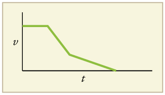{: #import-auto-id3504346}

(a) The ship moves at constant velocity and then begins to decelerate at a constant rate. At some point, its deceleration rate decreases. It maintains this lower deceleration rate until it stops moving.

(b) A graph of acceleration vs. time would show zero acceleration in the first leg, large and constant negative acceleration in the second leg, and constant negative acceleration.

{: #import-auto-id1666671}

### Section Summary

* {: #import-auto-id2388505} Graphs of motion can be used to analyze motion.
* {: #import-auto-id4097898} Graphical solutions yield identical solutions to mathematical methods for deriving motion equations.
* {: #import-auto-id2294483} The slope of a graph of displacement
  <math xmlns="http://www.w3.org/1998/Math/MathML"><semantics><mrow><mrow><mi>x</mi></mrow><mrow /></mrow><annotation encoding="StarMath 5.0"> size 12{x} {}</annotation></semantics></math>
  
  vs. time
  <math xmlns="http://www.w3.org/1998/Math/MathML"><semantics><mrow><mrow><mi>t</mi></mrow><mrow /></mrow><annotation encoding="StarMath 5.0"> size 12{t} {}</annotation></semantics></math>
  
  is velocity
  <math xmlns="http://www.w3.org/1998/Math/MathML"><semantics><mrow><mrow><mi>v</mi></mrow><mrow /></mrow><annotation encoding="StarMath 5.0"> size 12{v} {}</annotation></semantics></math>
  
  *.*
* {: #import-auto-id2025741} The slope of a graph of velocity
  <math xmlns="http://www.w3.org/1998/Math/MathML"><semantics><mrow><mrow><mi>v</mi></mrow><mrow /></mrow><annotation encoding="StarMath 5.0"> size 12{v} {}</annotation></semantics></math>
  
  ** vs. time
  <math xmlns="http://www.w3.org/1998/Math/MathML"><semantics><mrow><mrow><mi>t</mi></mrow><mrow /></mrow><annotation encoding="StarMath 5.0"> size 12{t} {}</annotation></semantics></math>
  
  graph is acceleration
  <math xmlns="http://www.w3.org/1998/Math/MathML"><semantics><mrow><mrow><mi>a</mi></mrow><mrow /></mrow><annotation encoding="StarMath 5.0"> size 12{a} {}</annotation></semantics></math>
  
  *.*
* {: #import-auto-id1561758} Average velocity, instantaneous velocity, and acceleration can all be obtained by analyzing graphs.

### Conceptual Questions

(a) Explain how you can use the graph of position versus time in [[link]](#import-auto-id4064025) to describe the change in velocity over time. Identify (b) the time (<math xmlns="http://www.w3.org/1998/Math/MathML"><semantics><mrow><msub><mi>t</mi><mrow><mn>a</mn></mrow></msub></mrow></semantics></math>

, <math xmlns="http://www.w3.org/1998/Math/MathML"><semantics><mrow><msub><mi>t</mi><mrow><mn>b</mn></mrow></msub></mrow></semantics></math>

, <math xmlns="http://www.w3.org/1998/Math/MathML"><semantics><mrow><mrow><msub><mi>t</mi><mrow><mn>c</mn></mrow></msub></mrow></mrow></semantics></math>

, <math xmlns="http://www.w3.org/1998/Math/MathML"><semantics><mrow><mrow><msub><mi>t</mi><mrow><mn>d</mn></mrow></msub></mrow></mrow></semantics></math>

, or <math xmlns="http://www.w3.org/1998/Math/MathML"><semantics><mrow><mrow><msub><mi>t</mi><mrow><mn>e</mn></mrow></msub></mrow></mrow></semantics></math>

) at which the instantaneous velocity is greatest, (c) the time at which it is zero, and (d) the time at which it is negative.

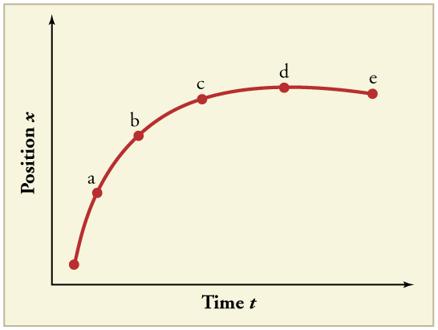{: #import-auto-id4064025}

(a) Sketch a graph of velocity versus time corresponding to the graph of position versus time given in [[link]](#import-auto-id2562897). (b) Identify the time or times (<math xmlns="http://www.w3.org/1998/Math/MathML"><semantics><mrow><msub><mi>t</mi><mrow><mn>a</mn></mrow></msub></mrow></semantics></math>

, <math xmlns="http://www.w3.org/1998/Math/MathML"><semantics><mrow><msub><mi>t</mi><mrow><mn>b</mn></mrow></msub></mrow></semantics></math>

, <math xmlns="http://www.w3.org/1998/Math/MathML"><semantics><mrow><mrow><msub><mi>t</mi><mrow><mn>c</mn></mrow></msub></mrow></mrow></semantics></math>

, etc.) at which the instantaneous velocity is greatest. (c) At which times is it zero? (d) At which times is it negative?

{: #import-auto-id2562897}

(a) Explain how you can determine the acceleration over time from a velocity versus time graph such as the one in [[link]](#import-auto-id1778975). (b) Based on the graph, how does acceleration change over time?

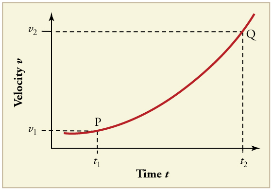{: #import-auto-id1778975}

(a) Sketch a graph of acceleration versus time corresponding to the graph of velocity versus time given in [[link]](#import-auto-id1447833). (b) Identify the time or times (<math xmlns="http://www.w3.org/1998/Math/MathML"><semantics><mrow><msub><mi>t</mi><mrow><mn>a</mn></mrow></msub></mrow></semantics></math>

, <math xmlns="http://www.w3.org/1998/Math/MathML"><semantics><mrow><msub><mi>t</mi><mrow><mn>b</mn></mrow></msub></mrow></semantics></math>

, <math xmlns="http://www.w3.org/1998/Math/MathML"><semantics><mrow><mrow><msub><mi>t</mi><mrow><mn>c</mn></mrow></msub></mrow></mrow></semantics></math>

, etc.) at which the acceleration is greatest. (c) At which times is it zero? (d) At which times is it negative?

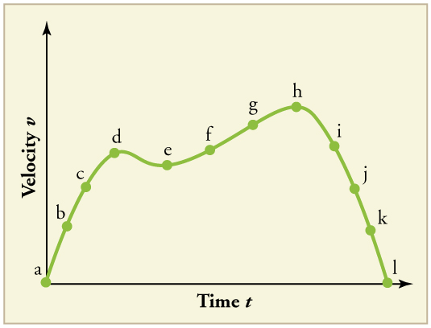{: #import-auto-id1447833}

Consider the velocity vs. time graph of a person in an elevator shown in [[link]](#import-auto-id2006890). Suppose the elevator is initially at rest. It then accelerates for 3 seconds, maintains that velocity for 15 seconds, then decelerates for 5 seconds until it stops. The acceleration for the entire trip is not constant so we cannot use the equations of motion from [Motion Equations for Constant Acceleration in One Dimension](/m42099) for the complete trip. (We could, however, use them in the three individual sections where acceleration is a constant.) Sketch graphs of (a) position vs. time and (b) acceleration vs. time for this trip.

{: #import-auto-id2006890}

A cylinder is given a push and then rolls up an inclined plane. If the origin is the starting point, sketch the position, velocity, and acceleration of the cylinder vs. time as it goes up and then down the plane.
{: xmlns:fo="urn:oasis:names:tc:opendocument:xmlns:xsl-fo-compatible:1.0" fo:font-weight="normal"}

### Problems &amp; Exercises

Note: There is always uncertainty in numbers taken from graphs. If your answers differ from expected values, examine them to see if they are within data extraction uncertainties estimated by you.

(a) By taking the slope of the curve in [[link]](#import-auto-id1798398), verify that the velocity of the jet car is 115 m/s at <math xmlns="http://www.w3.org/1998/Math/MathML"><semantics><mrow><mrow><mrow><mrow><mi>t</mi><mo stretchy="false">=</mo><mtext>20 s</mtext></mrow></mrow></mrow><mrow /></mrow><annotation encoding="StarMath 5.0"> size 12{t="20"`s} {}</annotation></semantics></math>

. (b) By taking the slope of the curve at any point in [[link]](#import-auto-id4101417), verify that the jet car’s acceleration is <math xmlns="http://www.w3.org/1998/Math/MathML"><semantics><mrow><mrow><mrow><mn>5</mn><mtext>.</mtext><msup><mtext>0 m/s</mtext><mrow><mn>2</mn></mrow></msup></mrow></mrow><mrow /></mrow><annotation encoding="StarMath 5.0"> size 12{5 "." "0 m/s" rSup { size 8{2} } } {}</annotation></semantics></math>

.

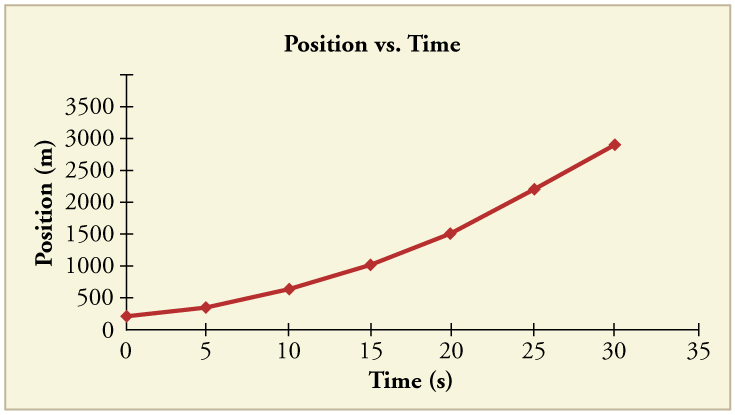{: #import-auto-id1798398}

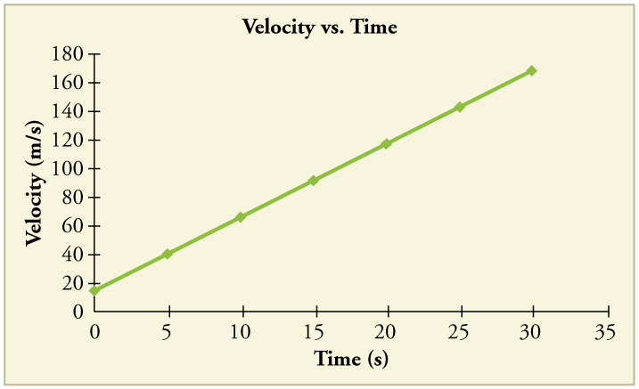{: #import-auto-id4101417}

(a) <math xmlns="http://www.w3.org/1998/Math/MathML"><semantics><mrow><mrow><mtext>115 m/s</mtext></mrow><mrow /></mrow><annotation encoding="StarMath 5.0"> size 12{"115 m/s"} {}</annotation></semantics></math>

(b) <math xmlns="http://www.w3.org/1998/Math/MathML"><semantics><mrow><mrow><mrow><mn>5</mn><mtext>.</mtext><msup><mtext>0 m/s</mtext><mrow><mn>2</mn></mrow></msup></mrow></mrow><mrow /></mrow><annotation encoding="StarMath 5.0"> size 12{5 "." "0 m/s" rSup { size 8{2} } } {}</annotation></semantics></math>

Using approximate values, calculate the slope of the curve in [[link]](#import-auto-id4122996) to verify that the velocity at <math xmlns="http://www.w3.org/1998/Math/MathML"><semantics><mrow><mrow><mrow><mrow><mi>t</mi><mo stretchy="false">=</mo><mtext>10.0 s</mtext></mrow></mrow></mrow><mrow /></mrow><annotation encoding="StarMath 5.0"> size 12{t="10"`s} {}</annotation></semantics></math>

 is 0.208 m/s. Assume all values are known to 3 significant figures.

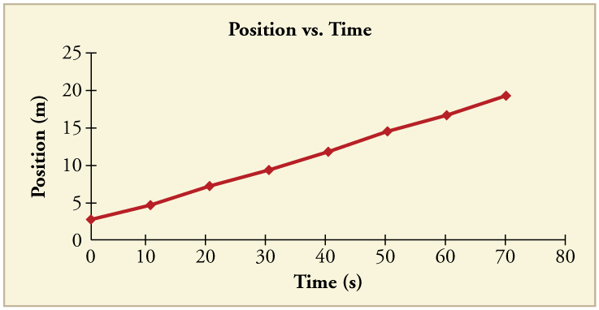{: #import-auto-id4122996}

Using approximate values, calculate the slope of the curve in [[link]](#import-auto-id4122996) to verify that the velocity at <math xmlns="http://www.w3.org/1998/Math/MathML"><semantics><mrow><mrow><mrow><mrow><mi>t</mi><mo stretchy="false">=</mo><mtext>30.0 s</mtext></mrow></mrow></mrow></mrow></semantics></math>

 is approximately 0.24 m/s.

<math xmlns="http://www.w3.org/1998/Math/MathML"> <semantics> <mrow> <mrow> <mrow> <mrow> <mrow> <mi>v</mi> <mo stretchy="false">=</mo> <mfrac> <mrow> <mo stretchy="false">(</mo> <mtext>11.7</mtext> <mo stretchy="false">−</mo> <mn>6.95</mn> <mo stretchy="false">)</mo> <mo stretchy="false">×</mo> <msup> <mtext>10</mtext> <mrow> <mn>3</mn> </mrow> </msup><mspace width="0.25em" /> <mtext> m</mtext> </mrow> <mrow> <mo stretchy="false">(</mo> <mn>40</mn> <mtext>.</mtext> <mtext>0 – 20</mtext> <mn>.0</mn> <mo stretchy="false">)</mo><mspace width="0.25em" /> <mtext> s</mtext> </mrow> </mfrac> </mrow> <mo stretchy="false">=</mo> <mtext>238 m/s</mtext> </mrow> </mrow> </mrow> </mrow> </semantics> </math>

By taking the slope of the curve in [[link]](#import-auto-id3552017), verify that the acceleration is <math xmlns="http://www.w3.org/1998/Math/MathML"><semantics><mrow><mrow><mrow><mn>3</mn><mtext>.</mtext><mn>2 m</mn><msup><mtext>/s</mtext><mrow><mn>2</mn></mrow></msup></mrow></mrow><mrow /></mrow></semantics></math>

 at <math xmlns="http://www.w3.org/1998/Math/MathML"><semantics><mrow><mrow><mrow><mrow><mi>t</mi><mo stretchy="false">=</mo><mtext>10 s</mtext></mrow></mrow></mrow><mrow /></mrow><annotation encoding="StarMath 5.0"> size 12{t="10"`s} {}</annotation></semantics></math>

.

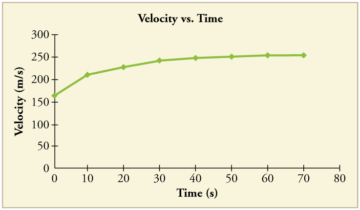{: #import-auto-id3552017}

Construct the position graph for the subway shuttle train as shown in [[link]](/m42100#import-auto-id2590556)(a). Your graph should show the position of the train, in kilometers, from t = 0 to 20 s. You will need to use the information on acceleration and velocity given in the examples for this figure.

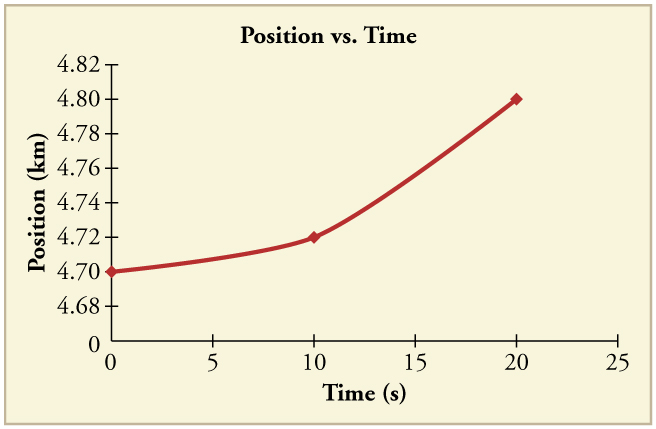{: #import-auto-id3597350}

(a) Take the slope of the curve in [[link]](#import-auto-id4064858) to find the jogger’s velocity at <math xmlns="http://www.w3.org/1998/Math/MathML"><semantics><mrow><mrow><mrow><mrow><mi>t</mi><mo stretchy="false">=</mo><mn>2</mn></mrow><mtext>.</mtext><mn>5 s</mn></mrow></mrow><mrow /></mrow><annotation encoding="StarMath 5.0"> size 12{t=2 "." 5`s} {}</annotation></semantics></math>

. (b) Repeat at 7.5 s. These values must be consistent with the graph in [[link]](#import-auto-id4128350).

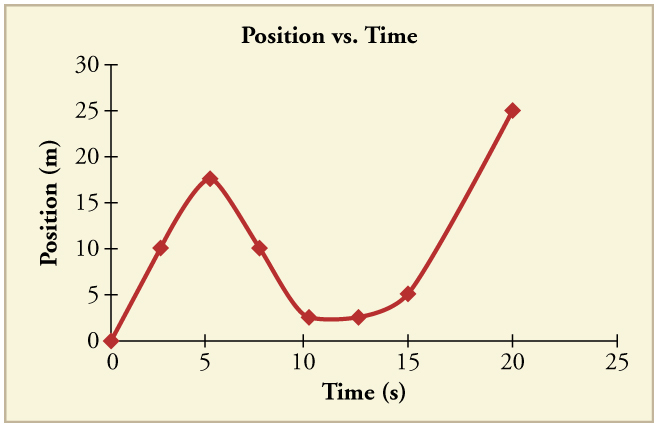{: #import-auto-id4064858}

{: #import-auto-id4128350}

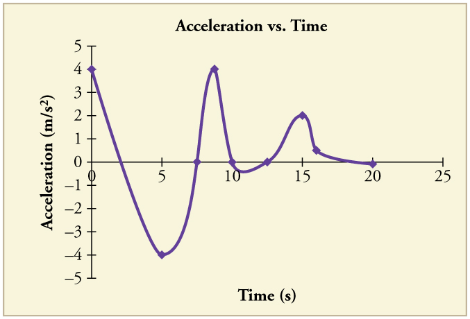{: #import-auto-id4151339}

A graph of <math xmlns="http://www.w3.org/1998/Math/MathML"><semantics><mrow><mrow><mrow><mi>v</mi><mfenced open="(" close=")"><mi>t</mi></mfenced></mrow></mrow><mrow /></mrow></semantics></math>

 is shown for a world-class track sprinter in a 100-m race. (See [[link]](#import-auto-id4125036)). (a) What is his average velocity for the first 4 s? (b) What is his instantaneous velocity at <math xmlns="http://www.w3.org/1998/Math/MathML"><semantics><mrow><mrow><mrow><mrow><mi>t</mi><mo stretchy="false">=</mo><mn>5 s</mn></mrow></mrow></mrow><mrow /></mrow></semantics></math>

? (c) What is his average acceleration between 0 and 4 s? (d) What is his time for the race?

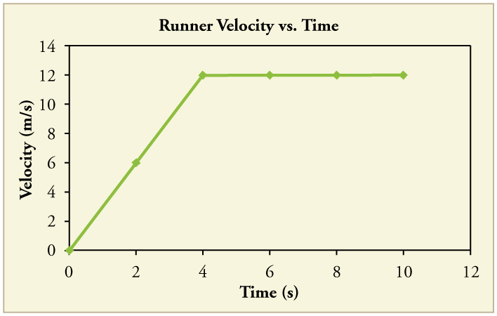{: #import-auto-id4125036}

(a) 6 m/s
{: xmlns:fo="urn:oasis:names:tc:opendocument:xmlns:xsl-fo-compatible:1.0" fo:font-weight="normal"}

(b) 12 m/s
{: xmlns:fo="urn:oasis:names:tc:opendocument:xmlns:xsl-fo-compatible:1.0" fo:font-weight="normal"}

(c) <math xmlns="http://www.w3.org/1998/Math/MathML"><semantics><mrow><mrow><msup><mtext>3 m/s</mtext><mrow><mn>2</mn></mrow></msup></mrow><mrow /></mrow><annotation encoding="StarMath 5.0"> size 12{"3 m/s" rSup { size 8{2} } } {}</annotation></semantics></math>

(d) 10 s
{: xmlns:fo="urn:oasis:names:tc:opendocument:xmlns:xsl-fo-compatible:1.0" fo:font-weight="normal"}

[[link]](#import-auto-id4035681) shows the position graph for a particle for 5 s. Draw the corresponding velocity and acceleration graphs.

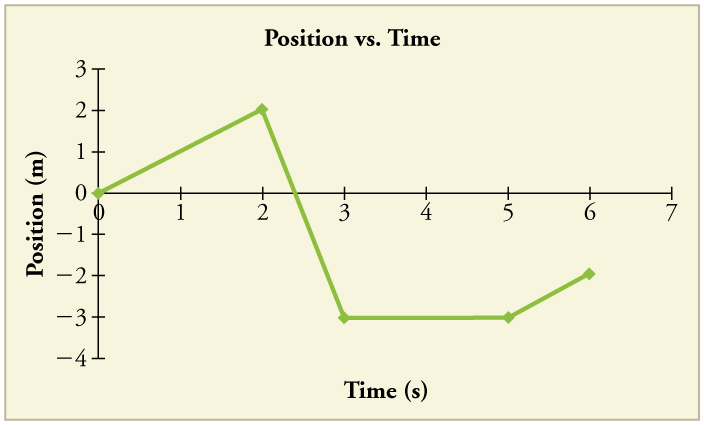{: #import-auto-id4035681}

### Glossary
{: data-type="glossary-title"}

independent variable
: the variable that the dependent variable is measured with respect to; usually plotted along the
  <math xmlns="http://www.w3.org/1998/Math/MathML"><semantics><mrow><mrow><mi>x</mi></mrow><mrow /></mrow><annotation encoding="StarMath 5.0"> size 12{x} {}</annotation></semantics></math>
  
  -axis
^

dependent variable
: the variable that is being measured; usually plotted along the
  <math xmlns="http://www.w3.org/1998/Math/MathML"><semantics><mrow><mrow><mi>y</mi></mrow><mrow /></mrow><annotation encoding="StarMath 5.0"> size 12{y} {}</annotation></semantics></math>
  
  -axis
{: #import-auto-id1845390}

slope
: the difference in
  <math xmlns="http://www.w3.org/1998/Math/MathML"><semantics><mrow><mrow><mi>y</mi></mrow><mrow /></mrow><annotation encoding="StarMath 5.0"> size 12{y} {}</annotation></semantics></math>
  
  -value (the rise) divided by the difference in
  <math xmlns="http://www.w3.org/1998/Math/MathML"><semantics><mrow><mrow><mi>x</mi></mrow><mrow /></mrow><annotation encoding="StarMath 5.0"> size 12{x} {}</annotation></semantics></math>
  
  -value (the run) of two points on a straight line
{: #import-auto-id3600469}

y-intercept
: the
  <math xmlns="http://www.w3.org/1998/Math/MathML"><semantics><mrow><mrow><mi>y</mi><mtext>-</mtext></mrow><mrow /></mrow><annotation encoding="StarMath 5.0"> size 12{y} {}</annotation></semantics></math>
  
  value when
  <math xmlns="http://www.w3.org/1998/Math/MathML"><semantics><mrow><mrow><mi>x</mi></mrow><mrow /></mrow><annotation encoding="StarMath 5.0"> size 12{x} {}</annotation></semantics></math>
  
  **= 0, or when the graph crosses the
  <math xmlns="http://www.w3.org/1998/Math/MathML"><semantics><mrow><mrow><mi>y</mi></mrow><mrow /></mrow><annotation encoding="StarMath 5.0"> size 12{y} {}</annotation></semantics></math>
  
  -axis
{: #import-auto-id4021637}

