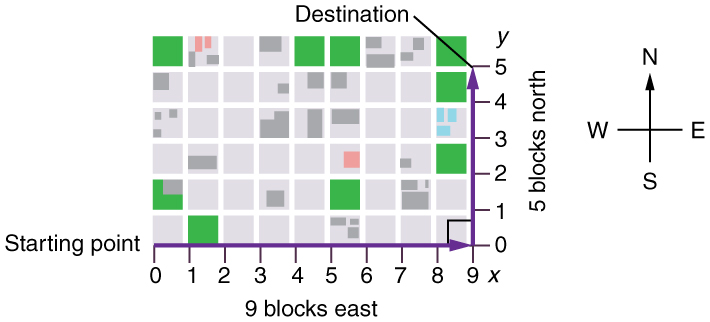
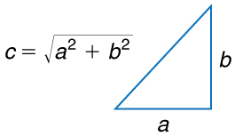

* Observe that motion in two dimensions consists of horizontal and vertical components.
* Understand the independence of horizontal and vertical vectors in two-dimensional motion.

 "){: #import-auto-id1165298608692}

# Two-Dimensional Motion: Walking in a City

Suppose you want to walk from one point to another in a city with uniform square blocks, as pictured in [\[link\]](#import-auto-id1165296250183).

 {: #import-auto-id1165296250183}

The straight-line path that a helicopter might fly is blocked to you as a pedestrian, and so you are forced to take a two-dimensional path, such as the one shown. You walk 14 blocks in all, 9 east followed by 5 north. What is the straight-line distance?

An old adage states that the shortest distance between two points is a straight line. The two legs of the trip and the straight-line path form a right triangle, and so the Pythagorean theorem, <math xmlns="http://www.w3.org/1998/Math/MathML"><semantics><mrow><mrow><mrow><msup><mi>a</mi><mrow><mn>2</mn></mrow></msup><mtext> + </mtext><msup><mi>b</mi><mrow><mn>2</mn></mrow></msup><mtext> = </mtext><msup><mi>c</mi><mrow><mn>2</mn></mrow></msup></mrow></mrow><mrow /></mrow><annotation encoding="StarMath 5.0"> size 12{a rSup { size 8{2} } " + "b rSup { size 8{2} } " = "c rSup { size 8{2} } } {}</annotation></semantics></math>

, can be used to find the straight-line distance.

{: #import-auto-id1165298608693}

The hypotenuse of the triangle is the straight-line path, and so in this case its length in units of city blocks is <math xmlns="http://www.w3.org/1998/Math/MathML"><semantics><mrow><mrow><mrow><msqrt><mrow><mo stretchy="false">(</mo><mtext>9 blocks</mtext><msup><mo stretchy="false">)</mo><mrow><mn>2</mn></mrow></msup><mtext>+ </mtext><mo stretchy="false">(</mo><mtext>5 blocks</mtext><msup><mo stretchy="false">)</mo><mrow><mn>2</mn></mrow></msup></mrow></msqrt><mtext>= 10</mtext><mtext>.</mtext><mtext>3 blocks</mtext></mrow></mrow><mrow /></mrow><annotation encoding="StarMath 5.0"> size 12{ sqrt { \( "9 blocks" \) rSup { size 8{2} }  "+ " \( "5 blocks" \) rSup { size 8{2} } }  "= 10" "." "3 blocks"} {}</annotation></semantics></math>

, considerably shorter than the 14 blocks you walked. (Note that we are using three significant figures in the answer. Although it appears that “9” and “5” have only one significant digit, they are discrete numbers. In this case “9 blocks” is the same as “9.0 or 9.00 blocks.” We have decided to use three significant figures in the answer in order to show the result more precisely.)

{: #import-auto-id1165298535408}

The fact that the straight-line distance (10.3 blocks) in [\[link\]](#import-auto-id1165298535408) is less than the total distance walked (14 blocks) is one example of a general characteristic of vectors. (Recall that **vectors**{: data-type="term" #import-auto-id1165298541000} are quantities that have both magnitude and direction.)

As for one-dimensional kinematics, we use arrows to represent vectors. The length of the arrow is proportional to the vector’s magnitude. The arrow’s length is indicated by hash marks in [\[link\]](#import-auto-id1165296250183) and [\[link\]](#import-auto-id1165298535408). The arrow points in the same direction as the vector. For two-dimensional motion, the path of an object can be represented with three vectors: one vector shows the straight-line path between the initial and final points of the motion, one vector shows the horizontal component of the motion, and one vector shows the vertical component of the motion. The horizontal and vertical components of the motion add together to give the straight-line path. For example, observe the three vectors in [\[link\]](#import-auto-id1165298535408). The first represents a 9-block displacement east. The second represents a 5-block displacement north. These vectors are added to give the third vector, with a 10.3-block total displacement. The third vector is the straight-line path between the two points. Note that in this example, the vectors that we are adding are perpendicular to each other and thus form a right triangle. This means that we can use the Pythagorean theorem to calculate the magnitude of the total displacement. (Note that we cannot use the Pythagorean theorem to add vectors that are not perpendicular. We will develop techniques for adding vectors having any direction, not just those perpendicular to one another, in [Vector Addition and Subtraction: Graphical Methods](/m42127) and [Vector Addition and Subtraction: Analytical Methods](/m42128).)

# The Independence of Perpendicular Motions

The person taking the path shown in [\[link\]](#import-auto-id1165298535408) walks east and then north (two perpendicular directions). How far he or she walks east is only affected by his or her motion eastward. Similarly, how far he or she walks north is only affected by his or her motion northward.

Independence of Motion

The horizontal and vertical components of two-dimensional motion are independent of each other. Any motion in the horizontal direction does not affect motion in the vertical direction, and vice versa.

This is true in a simple scenario like that of walking in one direction first, followed by another. It is also true of more complicated motion involving movement in two directions at once. For example, let’s compare the motions of two baseballs. One baseball is dropped from rest. At the same instant, another is thrown horizontally from the same height and follows a curved path. A stroboscope has captured the positions of the balls at fixed time intervals as they fall.

 {: #import-auto-id1165296248287}

It is remarkable that for each flash of the strobe, the vertical positions of the two balls are the same. This similarity implies that the vertical motion is independent of whether or not the ball is moving horizontally. (Assuming no air resistance, the vertical motion of a falling object is influenced by gravity only, and not by any horizontal forces.) Careful examination of the ball thrown horizontally shows that it travels the same horizontal distance between flashes. This is due to the fact that there are no additional forces on the ball in the horizontal direction after it is thrown. This result means that the horizontal velocity is constant, and affected neither by vertical motion nor by gravity (which is vertical). Note that this case is true only for ideal conditions. In the real world, air resistance will affect the speed of the balls in both directions.

The two-dimensional curved path of the horizontally thrown ball is composed of two independent one-dimensional motions (horizontal and vertical). The key to analyzing such motion, called **projectile motion**, is to **resolve** (break) it into motions along perpendicular directions. Resolving two-dimensional motion into perpendicular components is possible because the components are independent. We shall see how to resolve vectors in [Vector Addition and Subtraction: Graphical Methods](/m42127) and [Vector Addition and Subtraction: Analytical Methods](/m42128). We will find such techniques to be useful in many areas of physics.

PhET Explorations: Ladybug Motion 2D

Learn about position, velocity and acceleration vectors. Move the ladybug by setting the position, velocity or acceleration, and see how the vectors change. Choose linear, circular or elliptical motion, and record and playback the motion to analyze the behavior.

<figure markdown="1" id="eip-id2971785">
<figcaption>
[Ladybug Motion 2D](ladybug-motion-2d_en.jar)
</figcaption>
 [{: data-print="false"}](ladybug-motion-2d_en.jar){: data-type="image"}  
</figure>

# Summary

* {: xmlns:fo="urn:oasis:names:tc:opendocument:xmlns:xsl-fo-compatible:1.0" #import-auto-id1165296313373 fo:font-weight="normal"} The shortest path between any two points is a straight line. In two dimensions, this path can be represented by a vector with horizontal and vertical components.
* {: xmlns:fo="urn:oasis:names:tc:opendocument:xmlns:xsl-fo-compatible:1.0" #import-auto-id1165296414067 fo:font-weight="normal"} The horizontal and vertical components of a vector are independent of one another. Motion in the horizontal direction does not affect motion in the vertical direction, and vice versa.

## Glossary
{: data-type="glossary-title"}

vector
: a quantity that has both magnitude and direction; an arrow used to represent quantities with both magnitude and direction
{: .definition #import-auto-id1165298860990}

