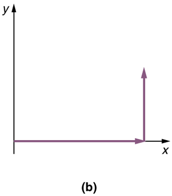
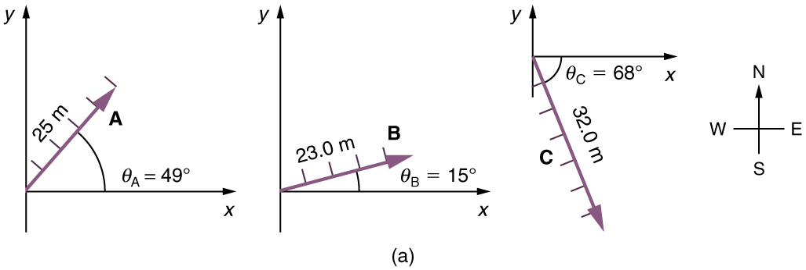
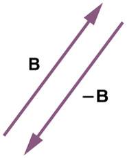
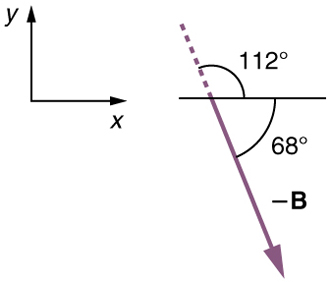
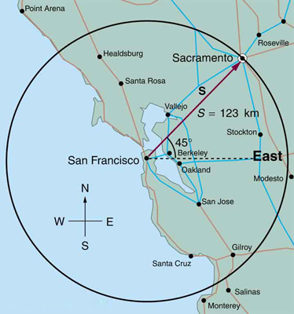

* Understand the rules of vector addition, subtraction, and multiplication.
* Apply graphical methods of vector addition and subtraction to determine the displacement of moving objects.

 "){: #import-auto-id1165296227310}

### Vectors in Two Dimensions

A **vector**{: data-type="term" #import-auto-id1165296389850} is a quantity that has magnitude and direction. Displacement, velocity, acceleration, and force, for example, are all vectors. In one-dimensional, or straight-line, motion, the direction of a vector can be given simply by a plus or minus sign. In two dimensions (2-d), however, we specify the direction of a vector relative to some reference frame (i.e., coordinate system), using an arrow having length proportional to the vector’s magnitude and pointing in the direction of the vector.

[\[link\]](#import-auto-id1165298666909) shows such a *graphical representation of a vector*, using as an example the total displacement for the person walking in a city considered in [Kinematics in Two Dimensions: An Introduction](/m42104). We shall use the notation that a boldface symbol, such as <math xmlns="http://www.w3.org/1998/Math/MathML"><semantics><mrow><mstyle fontweight="bold"><mrow><mtext>D</mtext></mrow></mstyle><mrow /></mrow><annotation encoding="StarMath 5.0"> size 12{D} {}</annotation></semantics></math>

, stands for a vector. Its magnitude is represented by the symbol in italics, <math xmlns="http://www.w3.org/1998/Math/MathML"><semantics><mrow><mrow><mi>D</mi></mrow><mrow /></mrow><annotation encoding="StarMath 5.0"> size 12{D} {}</annotation></semantics></math>

, and its direction by <math xmlns="http://www.w3.org/1998/Math/MathML"><semantics><mrow><mrow><mi>θ</mi></mrow><mrow /></mrow><annotation encoding="StarMath 5.0"> size 12{θ} {}</annotation></semantics></math>

.

Vectors in this Text

In this text, we will represent a vector with a boldface variable. For example, we will represent the quantity force with the vector <math xmlns="http://www.w3.org/1998/Math/MathML"><semantics><mrow><mstyle fontweight="bold"><mrow><mtext>F</mtext></mrow></mstyle><mrow /></mrow><annotation encoding="StarMath 5.0"> size 12{F} {}</annotation></semantics></math>

, which has both magnitude and direction. The magnitude of the vector will be represented by a variable in italics, such as <math xmlns="http://www.w3.org/1998/Math/MathML"><semantics><mrow><mrow><mi>F</mi></mrow><mrow /></mrow><annotation encoding="StarMath 5.0"> size 12{F} {}</annotation></semantics></math>

, and the direction of the variable will be given by an angle <math xmlns="http://www.w3.org/1998/Math/MathML"><semantics><mrow><mrow><mi>θ</mi></mrow><mrow /></mrow><annotation encoding="StarMath 5.0"> size 12{θ} {}</annotation></semantics></math>

.

 ![A graph is shown. On the axes the scale is set to one block is equal to one unit. A helicopter starts moving from the origin at an angle of twenty nine point one degrees above the x axis. The current position of the helicopter is ten point three blocks along its line of motion. The destination of the helicopter is the point which is nine blocks in the positive x direction and five blocks in the positive y direction. The positive direction of the x axis is east and the positive direction of the y axis is north.](../resources/Figure_03_02_01.jpg "A person walks 9 blocks east and 5 blocks north. The displacement is 10.3 blocks at an angle 29.1&#xBA; size 12{&quot;29&quot; &quot;.&quot; &quot;1&#xBA;&quot;} {} north of east."){: #import-auto-id1165298666909}

{: #import-auto-id1165298918248 height="250"}

### Vector Addition: Head-to-Tail Method

The **head-to-tail method**{: data-type="term" #import-auto-id1165298552505} is a graphical way to add vectors, described in [\[link\]](#import-auto-id1165298643218) below and in the steps following. The **tail**{: data-type="term" #import-auto-id1165298535408} of the vector is the starting point of the vector, and the **head**{: data-type="term" #import-auto-id1165298982372} (or tip) of a vector is the final, pointed end of the arrow.

![In part a, a vector of magnitude of nine units and making an angle of theta is equal to zero degrees is drawn from the origin and along the positive direction of x axis. In part b a vector of magnitude of nine units and making an angle of theta is equal to zero degree is drawn from the origin and along the positive direction of x axis. Then a vertical arrow from the head of the horizontal arrow is drawn. In part c a vector D of magnitude ten point three is drawn from the tail of the horizontal vector at an angle theta is equal to twenty nine point one degrees from the positive direction of x axis. The head of the vector D meets the head of the vertical vector. A scale is shown parallel to the vector D to measure its length. Also a protractor is shown to measure the inclination of the vectorD.](../resources/Figure_03_02_03.jpg "Head-to-Tail Method: The head-to-tail method of graphically adding vectors is illustrated for the two displacements of the person walking in a city considered in [link].  (a) Draw a vector representing the displacement to the east. (b) Draw a vector representing the displacement to the north. The tail of this vector should originate from the head of the first, east-pointing vector. (c) Draw a line from the tail of the east-pointing vector to the head of the north-pointing vector to form the sum or resultant vector D size 12{A} {}. The length of the arrow D size 12{A} {} is proportional to the vector&#x2019;s magnitude and is measured to be 10.3 units . Its direction, described as the angle with respect to the east (or horizontal axis) &#x3B8; size 12{&#x3B8;} {} is measured with a protractor to be &#10;        &#10;          &#10;            &#10;              &#10;                &#10;                  29&#10;                  .&#10;                  1&#xBA;&#10;                &#10;              &#10;            &#10;            &#10;          &#10;           size 12{&quot;29&quot; &quot;.&quot; 1&#xB0;} {}&#10;        &#10;      ."){: #import-auto-id1165298643218}

***Step 1.*** **Draw an arrow to represent the first vector (9 blocks to the east) using a ruler and protractor**.

 {: #import-auto-id1165298876451 height="200"}

***Step 2.*** Now draw an arrow to represent the second vector (5 blocks to the north). *Place the tail of the second vector at the head of the first vector*.

{: #import-auto-id1165298818267 height="200"}

***Step 3.*** *If there are more than two vectors, continue this process for each vector to be added. Note that in our example, we have only two vectors, so we have finished placing arrows tip to tail*.

***Step 4.*** *Draw an arrow from the tail of the first vector to the head of the last vector*. This is the **resultant**{: data-type="term" #import-auto-id1165296311722}, or the sum, of the other vectors.

{: #import-auto-id1165299000967}

***Step 5.*** To get the **magnitude**{: data-type="term" #import-auto-id1165298794109} of the resultant, *measure its length with a ruler. (Note that in most calculations, we will use the Pythagorean theorem to determine this length.)*

<strong><em>Step 6. </em></strong>To get the **direction**{: data-type="term" #import-auto-id1165298932041} of the resultant, **measure the angle it makes with the reference frame using a protractor. (Note that in most calculations, we will use trigonometric relationships to determine this angle.)**

The graphical addition of vectors is limited in accuracy only by the precision with which the drawings can be made and the precision of the measuring tools. It is valid for any number of vectors.

Adding Vectors Graphically Using the Head-to-Tail Method: A Woman Takes a Walk

Use the graphical technique for adding vectors to find the total displacement of a person who walks the following three paths (displacements) on a flat field. First, she walks 25.0 m in a direction <math xmlns="http://www.w3.org/1998/Math/MathML"><semantics><mrow><mrow><mrow><mtext>49.0º</mtext></mrow></mrow><mrow /></mrow><annotation encoding="StarMath 5.0"> size 12{"49" "." "0º"} {}</annotation></semantics></math>

 north of east. Then, she walks 23.0 m heading <math xmlns="http://www.w3.org/1998/Math/MathML"><semantics><mrow><mrow><mrow><mtext>15.0º</mtext></mrow></mrow><mrow /></mrow><annotation encoding="StarMath 5.0"> size 12{"15" "." "º°"} {}</annotation></semantics></math>

 north of east. Finally, she turns and walks 32.0 m in a direction 68.0° south of east.

**Strategy**

Represent each displacement vector graphically with an arrow, labeling the first <math xmlns="http://www.w3.org/1998/Math/MathML"><semantics><mrow><mstyle fontweight="bold"><mrow><mtext>A</mtext></mrow></mstyle><mrow /></mrow><annotation encoding="StarMath 5.0"> size 12{A} {}</annotation></semantics></math>

, the second <math xmlns="http://www.w3.org/1998/Math/MathML"><semantics><mrow><mstyle fontweight="bold"><mrow><mtext>B</mtext></mrow></mstyle><mrow /></mrow><annotation encoding="StarMath 5.0"> size 12{B} {}</annotation></semantics></math>

, and the third <math xmlns="http://www.w3.org/1998/Math/MathML"><semantics><mrow><mstyle fontweight="bold"><mrow><mtext>C</mtext></mrow></mstyle><mrow /></mrow><annotation encoding="StarMath 5.0"> size 12{C} {}</annotation></semantics></math>

, making the lengths proportional to the distance and the directions as specified relative to an east-west line. The head-to-tail method outlined above will give a way to determine the magnitude and direction of the resultant displacement, denoted <math xmlns="http://www.w3.org/1998/Math/MathML"><semantics><mrow><mrow><mtext mathvariant="bold">R</mtext></mrow><mrow /></mrow><annotation encoding="StarMath 5.0"> size 12{R} {}</annotation></semantics></math>

.

**Solution**

(1) Draw the three displacement vectors.

{: #import-auto-id1165296232338}

(2) Place the vectors head to tail retaining both their initial magnitude and direction.

{: #import-auto-id1165298788198}

(3) Draw the resultant vector, <math xmlns="http://www.w3.org/1998/Math/MathML"><semantics><mrow><mstyle fontweight="bold"><mrow><mtext>R</mtext></mrow></mstyle><mrow /></mrow><annotation encoding="StarMath 5.0"> size 12{R} {}</annotation></semantics></math>

.

{: #import-auto-id1165298786300}

(4) Use a ruler to measure the magnitude of <math xmlns="http://www.w3.org/1998/Math/MathML"><semantics><mrow><mrow><mtext mathvariant="bold">R</mtext></mrow><mrow /></mrow><annotation encoding="StarMath 5.0"> size 12{R} {}</annotation></semantics></math>

, and a protractor to measure the direction of <math xmlns="http://www.w3.org/1998/Math/MathML"><semantics><mrow><mstyle fontweight="bold"><mrow><mtext>R</mtext></mrow></mstyle><mrow /></mrow><annotation encoding="StarMath 5.0"> size 12{R} {}</annotation></semantics></math>

. While the direction of the vector can be specified in many ways, the easiest way is to measure the angle between the vector and the nearest horizontal or vertical axis. Since the resultant vector is south of the eastward pointing axis, we flip the protractor upside down and measure the angle between the eastward axis and the vector.

![In this figure a vector A with a positive slope is drawn from the origin. Then from the head of the vector A another vector B with positive slope is drawn and then another vector C with negative slope from the head of the vector B is drawn which cuts the x axis. From the tail of the vector A a vector R of magnitude of fifty meter and with negative slope of seven degrees is drawn. The head of this vector R meets the head of the vector C. The vector R is known as the resultant vector. A ruler is placed along the vector R to measure it. Also there is a protractor to measure the angle.](../resources/Figure_03_02_11a.jpg){: #import-auto-id1165298931707}

In this case, the total displacement <math xmlns="http://www.w3.org/1998/Math/MathML"><semantics><mrow><mrow><mtext mathvariant="bold">R</mtext></mrow><mrow /></mrow><annotation encoding="StarMath 5.0"> size 12{R} {}</annotation></semantics></math>

 is seen to have a magnitude of 50.0 m and to lie in a direction <math xmlns="http://www.w3.org/1998/Math/MathML"><semantics><mrow><mrow><mrow><mn>7.0º</mn></mrow></mrow><mrow /></mrow><annotation encoding="StarMath 5.0"> size 12{7 "." 0°} {}</annotation></semantics></math>

 south of east. By using its magnitude and direction, this vector can be expressed as <math xmlns="http://www.w3.org/1998/Math/MathML"> <semantics> <mrow> <mrow> <mrow> <mi>R</mi> <mo stretchy="false">=</mo> <mtext>50.0 m</mtext> </mrow> </mrow> <mrow /> </mrow> <annotation encoding="StarMath 5.0"> size 12{R" = 50" "." "0 m"} {}</annotation> </semantics> </math>

 and <math xmlns="http://www.w3.org/1998/Math/MathML"><semantics><mrow><mrow><mrow><mrow><mi>θ</mi><mo stretchy="false">=</mo><mn>7</mn></mrow><mtext>.</mtext><mtext>0º</mtext></mrow></mrow><mrow /></mrow><annotation encoding="StarMath 5.0"> size 12{θ=7 "." "0°"} {}</annotation></semantics></math>

 south of east.

**Discussion**

The head-to-tail graphical method of vector addition works for any number of vectors. It is also important to note that the resultant is independent of the order in which the vectors are added. Therefore, we could add the vectors in any order as illustrated in [\[link\]](#import-auto-id1165298931858) and we will still get the same solution.

{: #import-auto-id1165298931858}

Here, we see that when the same vectors are added in a different order, the result is the same. This characteristic is true in every case and is an important characteristic of vectors. Vector addition is **commutative**{: data-type="term"}. Vectors can be added in any order.

<math xmlns="http://www.w3.org/1998/Math/MathML"><semantics><mrow><mrow><mtext mathvariant="bold">A</mtext><mo stretchy="false">+</mo><mtext mathvariant="bold">B</mtext><mo stretchy="false">=</mo><mtext mathvariant="bold">B</mtext><mo stretchy="false">+</mo><mtext mathvariant="bold">A</mtext></mrow><mrow /><mtext>.</mtext></mrow><annotation encoding="StarMath 5.0"> size 12{"A+B=B+A"} {}</annotation></semantics></math>

(This is true for the addition of ordinary numbers as well—you get the same result whether you add <math xmlns="http://www.w3.org/1998/Math/MathML"><semantics><mrow><mrow><mtext mathvariant="bold">2</mtext><mo stretchy="false">+</mo><mtext mathvariant="bold">3</mtext></mrow><mrow /></mrow><annotation encoding="StarMath 5.0"> size 12{"2+3"} {}</annotation></semantics></math>

 or <math xmlns="http://www.w3.org/1998/Math/MathML"><semantics><mrow><mrow><mtext mathvariant="bold">3</mtext><mo stretchy="false">+</mo><mtext mathvariant="bold">2</mtext></mrow><mrow /></mrow><annotation encoding="StarMath 5.0"> size 12{"3+2"} {}</annotation></semantics></math>

, for example).

### Vector Subtraction

Vector subtraction is a straightforward extension of vector addition. To define subtraction (say we want to subtract <math xmlns="http://www.w3.org/1998/Math/MathML"><semantics><mrow><mrow><mrow><mtext mathvariant="bold">B</mtext></mrow></mrow></mrow><annotation encoding="StarMath 5.0"> size 12{B} {}</annotation></semantics></math>

 from <math xmlns="http://www.w3.org/1998/Math/MathML"><semantics><mrow><mrow><mrow><mtext mathvariant="bold">A</mtext></mrow></mrow></mrow><annotation encoding="StarMath 5.0"> size 12{A} {}</annotation></semantics></math>

 , written <math xmlns="http://www.w3.org/1998/Math/MathML"><semantics><mrow><mrow><mrow><mtext mathvariant="bold">A</mtext> <mo>–</mo> <mtext mathvariant="bold">B</mtext></mrow></mrow></mrow><annotation encoding="StarMath 5.0"> size 12{ "A" "-B"} {}</annotation></semantics></math>

 , we must first define what we mean by subtraction. The *negative* of a vector <math xmlns="http://www.w3.org/1998/Math/MathML"><semantics><mrow><mrow><mrow><mtext mathvariant="bold">B</mtext></mrow></mrow><mrow /></mrow></semantics></math>

 is defined to be <math xmlns="http://www.w3.org/1998/Math/MathML"><semantics><mrow><mrow><mtext mathvariant="bold">–B</mtext></mrow></mrow></semantics></math>

; that is, graphically *the negative of any vector has the same magnitude but the opposite direction*, as shown in [\[link\]](#import-auto-id1165298692950). In other words, <math xmlns="http://www.w3.org/1998/Math/MathML"><semantics><mrow><mrow><mtext mathvariant="bold">B</mtext></mrow><mrow /></mrow><annotation encoding="StarMath 5.0"> size 12{B} {}</annotation></semantics></math>

 has the same length as <math xmlns="http://www.w3.org/1998/Math/MathML"><semantics><mrow><mrow><mrow><mtext mathvariant="bold">–B</mtext></mrow></mrow><mrow /></mrow><annotation encoding="StarMath 5.0"> size 12{"-" "B"} {}</annotation></semantics></math>

, but points in the opposite direction. Essentially, we just flip the vector so it points in the opposite direction.

{: #import-auto-id1165298692950 height="200"}

The **subtraction** of vector <math xmlns="http://www.w3.org/1998/Math/MathML"><semantics><mrow><mrow><mtext mathvariant="bold">B</mtext></mrow><mrow /></mrow></semantics></math>

 from vector <math xmlns="http://www.w3.org/1998/Math/MathML"><semantics><mrow><mrow><mtext mathvariant="bold">A</mtext></mrow><mrow /></mrow></semantics></math>

 is then simply defined to be the addition of <math xmlns="http://www.w3.org/1998/Math/MathML"><semantics><mrow><mrow><mtext mathvariant="bold">–B</mtext></mrow><mrow /></mrow></semantics></math>

 to <math xmlns="http://www.w3.org/1998/Math/MathML"><semantics><mrow><mrow><mtext mathvariant="bold">A</mtext></mrow><mrow /></mrow></semantics></math>

. Note that vector subtraction is the addition of a negative vector. The order of subtraction does not affect the results.

<math xmlns="http://www.w3.org/1998/Math/MathML"><semantics><mrow><mrow><mrow><mstyle fontweight="bold"><mrow><mtext>A – B = A + </mtext></mrow></mstyle><mo stretchy="false">(</mo><mstyle><mrow><mtext fontweight="bold">–B</mtext></mrow></mstyle><mo stretchy="false">)</mo></mrow></mrow><mrow /><mtext>.</mtext></mrow><annotation encoding="StarMath 5.0"> size 12{ bold "A – B = A + " \( bold "–B" \) } {}</annotation></semantics></math>

This is analogous to the subtraction of scalars (where, for example, <math xmlns="http://www.w3.org/1998/Math/MathML"><semantics><mrow><mrow><mrow><mtext>5 – 2 = 5 + </mtext><mo stretchy="false">(</mo><mtext>–2</mtext><mo stretchy="false">)</mo></mrow></mrow><mrow /></mrow><annotation encoding="StarMath 5.0"> size 12{"5 – 2 = 5 + " \( "–2" \) } {}</annotation></semantics></math>

). Again, the result is independent of the order in which the subtraction is made. When vectors are subtracted graphically, the techniques outlined above are used, as the following example illustrates.

Subtracting Vectors Graphically: A Woman Sailing a Boat

A woman sailing a boat at night is following directions to a dock. The instructions read to first sail 27.5 m in a direction <math xmlns="http://www.w3.org/1998/Math/MathML"><semantics><mrow><mrow><mrow><mtext>66.0º</mtext></mrow></mrow><mrow /></mrow><annotation encoding="StarMath 5.0"> size 12{"66" "." 0º} {}</annotation></semantics></math>

 north of east from her current location, and then travel 30.0 m in a direction <math xmlns="http://www.w3.org/1998/Math/MathML"><semantics><mrow><mtext>112º</mtext></mrow><annotation encoding="StarMath 5.0"> size 12{"112"º} {}</annotation></semantics></math>

 north of east (or <math xmlns="http://www.w3.org/1998/Math/MathML"><semantics><mrow><mrow><mrow><mtext>22.0º</mtext></mrow></mrow><mrow /></mrow><annotation encoding="StarMath 5.0"> size 12{"22" "." 0º} {}</annotation></semantics></math>

 west of north). If the woman makes a mistake and travels in the **opposite** direction for the second leg of the trip, where will she end up? Compare this location with the location of the dock.

{: #import-auto-id1165296408744}

**Strategy**

We can represent the first leg of the trip with a vector <math xmlns="http://www.w3.org/1998/Math/MathML"><semantics><mrow><mrow><mtext mathvariant="bold">A</mtext></mrow></mrow></semantics></math>

, and the second leg of the trip with a vector <math xmlns="http://www.w3.org/1998/Math/MathML"><semantics><mrow><mrow><mtext mathvariant="bold">B</mtext></mrow><mrow /></mrow><annotation encoding="StarMath 5.0"> size 12{B} {}</annotation></semantics></math>

. The dock is located at a location <math xmlns="http://www.w3.org/1998/Math/MathML"><semantics><mrow><mrow><mtext mathvariant="bold">A </mtext><mo>+</mo><mtext mathvariant="bold"> B</mtext></mrow><mrow /></mrow></semantics></math>

. If the woman mistakenly travels in the *opposite* direction for the second leg of the journey, she will travel a distance <math xmlns="http://www.w3.org/1998/Math/MathML"><semantics><mrow><mrow><mi>B</mi></mrow></mrow></semantics></math>

 (30.0 m) in the direction <math xmlns="http://www.w3.org/1998/Math/MathML"><semantics><mrow><mrow><mn>180º</mn><mo>–</mo><mn>112º</mn><mo>=</mo><mn>68º</mn></mrow><mrow /></mrow></semantics></math>

 south of east. We represent this as <math xmlns="http://www.w3.org/1998/Math/MathML"><semantics><mrow><mrow><mtext mathvariant="bold">–B</mtext></mrow><mrow /></mrow></semantics></math>

, as shown below. The vector <math xmlns="http://www.w3.org/1998/Math/MathML"><semantics><mrow><mrow><mrow><mtext mathvariant="bold">–B</mtext></mrow></mrow></mrow></semantics></math>

 has the same magnitude as <math xmlns="http://www.w3.org/1998/Math/MathML"><semantics><mrow><mrow><mtext mathvariant="bold">B</mtext></mrow></mrow></semantics></math>

 but is in the opposite direction. Thus, she will end up at a location <math xmlns="http://www.w3.org/1998/Math/MathML"><semantics><mrow><mrow><mrow><mrow><mtext mathvariant="bold">A</mtext><mo>+</mo></mrow><mo stretchy="false">(</mo><mrow><mtext mathvariant="bold">–B</mtext></mrow><mo stretchy="false">)</mo></mrow></mrow></mrow></semantics></math>

, or <math xmlns="http://www.w3.org/1998/Math/MathML"><semantics><mrow><mrow><mrow><mtext mathvariant="bold">A</mtext><mo>–</mo><mtext mathvariant="bold">B</mtext></mrow></mrow><mrow /></mrow></semantics></math>

.

{: #import-auto-id1165296408745}

We will perform vector addition to compare the location of the dock, <math xmlns="http://www.w3.org/1998/Math/MathML"><semantics><mrow><mrow><mrow><mstyle fontweight="bold"><mrow><mtext>A </mtext></mrow></mstyle><mtext>+ </mtext><mi mathvariant="bold">B</mi></mrow></mrow><mrow /></mrow><annotation encoding="StarMath 5.0"> size 12{ ital "A ""+ "B} {}</annotation></semantics></math>

, with the location at which the woman mistakenly arrives, <math xmlns="http://www.w3.org/1998/Math/MathML"><semantics><mrow><mrow><mrow><mstyle fontweight="bold"><mrow><mtext>A + </mtext></mrow></mstyle><mo stretchy="false">(</mo><mstyle fontweight="bold"><mrow><mtext>–B</mtext></mrow></mstyle><mo stretchy="false">)</mo></mrow></mrow><mrow /></mrow><annotation encoding="StarMath 5.0"> size 12{ bold "A + " \( bold "–B" \) } {}</annotation></semantics></math>

.

**Solution**

(1) To determine the location at which the woman arrives by accident, draw vectors <math xmlns="http://www.w3.org/1998/Math/MathML"><semantics><mrow><mrow><mtext mathvariant="bold">A</mtext></mrow><mrow /></mrow><annotation encoding="StarMath 5.0"> size 12{A} {}</annotation></semantics></math>

 and <math xmlns="http://www.w3.org/1998/Math/MathML"><semantics><mrow><mrow><mtext mathvariant="bold">–B</mtext></mrow><mrow /></mrow></semantics></math>

.

(2) Place the vectors head to tail.

(3) Draw the resultant vector <math xmlns="http://www.w3.org/1998/Math/MathML"><semantics><mrow><mrow><mi mathvariant="bold">R</mi></mrow><mrow /></mrow><annotation encoding="StarMath 5.0"> size 12{R} {}</annotation></semantics></math>

.

(4) Use a ruler and protractor to measure the magnitude and direction of <math xmlns="http://www.w3.org/1998/Math/MathML"><semantics><mrow><mrow><mi mathvariant="bold">R</mi></mrow><mrow /></mrow><annotation encoding="StarMath 5.0"> size 12{R} {}</annotation></semantics></math>

.

{: #import-auto-id1165298476927}

In this case, <math xmlns="http://www.w3.org/1998/Math/MathML"> <semantics> <mrow> <mrow> <mrow> <mi>R</mi> <mo stretchy="false">=</mo> <mtext>23</mtext> <mtext>.</mtext> <mtext>0 m</mtext> </mrow> </mrow> <mrow /> </mrow> <annotation encoding="StarMath 5.0"> size 12{R"=23" "." "0 m"} {}</annotation> </semantics> </math>

 and <math xmlns="http://www.w3.org/1998/Math/MathML"> <semantics> <mrow> <mrow> <mrow> <mrow> <mi>θ</mi> <mo stretchy="false">=</mo> <mn>7</mn> </mrow> <mtext>.</mtext> <mtext>5º</mtext> </mrow> </mrow> <mrow /> </mrow> <annotation encoding="StarMath 5.0"> size 12{θ=7 "." "5° south of east"} {}</annotation> </semantics> </math>

 south of east.

(5) To determine the location of the dock, we repeat this method to add vectors <math xmlns="http://www.w3.org/1998/Math/MathML"><semantics><mrow><mrow><mtext mathvariant="bold">A</mtext></mrow><mrow /></mrow><annotation encoding="StarMath 5.0"> size 12{A} {}</annotation></semantics></math>

 and <math xmlns="http://www.w3.org/1998/Math/MathML"><semantics><mrow><mrow><mtext mathvariant="bold">B</mtext></mrow><mrow /></mrow><annotation encoding="StarMath 5.0"> size 12{B} {}</annotation></semantics></math>

. We obtain the resultant vector <math xmlns="http://www.w3.org/1998/Math/MathML"><semantics><mrow><mrow><mtext mathvariant="bold">R</mtext><mo>'</mo></mrow><mrow /></mrow><annotation encoding="StarMath 5.0"> size 12{R'} {}</annotation></semantics></math>

\:

{: #import-auto-id1165296298190}

In this case <math xmlns="http://www.w3.org/1998/Math/MathML"> <semantics> <mrow> <mrow> <mrow> <mi>R</mi> <mtext> = 52.9 m</mtext> </mrow> </mrow> </mrow> <annotation encoding="StarMath 5.0"> size 12{R" = 52" "." "9 m"} {}</annotation> </semantics> </math>

 and <math xmlns="http://www.w3.org/1998/Math/MathML"> <semantics> <mrow> <mrow> <mrow> <mrow> <mi>θ</mi> <mo stretchy="false">=</mo> <mtext>90.1º</mtext> </mrow> </mrow> </mrow> <mrow /> </mrow> <annotation encoding="StarMath 5.0"> size 12{θ="90" "." "1° north of east "} {}</annotation> </semantics> </math>

  north of east.

We can see that the woman will end up a significant distance from the dock if she travels in the opposite direction for the second leg of the trip.

**Discussion**

Because subtraction of a vector is the same as addition of a vector with the opposite direction, the graphical method of subtracting vectors works the same as for addition.

### Multiplication of Vectors and Scalars

If we decided to walk three times as far on the first leg of the trip considered in the preceding example, then we would walk <math xmlns="http://www.w3.org/1998/Math/MathML"><semantics><mrow><mrow><mrow><mrow><mtext>3 </mtext><mo stretchy="false">×</mo><mtext> 27</mtext></mrow><mtext>.</mtext><mtext>5 m</mtext></mrow></mrow><mrow /></mrow><annotation encoding="StarMath 5.0"> size 12{"3 " times " 27" "." "5 m"} {}</annotation></semantics></math>

, or 82.5 m, in a direction <math xmlns="http://www.w3.org/1998/Math/MathML"><semantics><mrow><mrow><mrow><mtext>66</mtext><mtext>.</mtext><mn>0</mn><mrow><mtext>º</mtext></mrow></mrow></mrow><mrow /></mrow><annotation encoding="StarMath 5.0"> size 12{"66" "." 0 { size 12{º} } } {}</annotation></semantics></math>

 north of east. This is an example of multiplying a vector by a positive **scalar**{: data-type="term" #import-auto-id1165296219603}. Notice that the magnitude changes, but the direction stays the same.

If the scalar is negative, then multiplying a vector by it changes the vector’s magnitude and gives the new vector the **opposite** direction. For example, if you multiply by –2, the magnitude doubles but the direction changes. We can summarize these rules in the following way: When vector <math xmlns="http://www.w3.org/1998/Math/MathML"><semantics><mrow><mrow><mi mathvariant="bold">A</mi></mrow><mrow /></mrow><annotation encoding="StarMath 5.0"> size 12{A} {}</annotation></semantics></math>

 is multiplied by a scalar <math xmlns="http://www.w3.org/1998/Math/MathML"><semantics><mrow><mrow><mi>c</mi></mrow><mrow /></mrow><annotation encoding="StarMath 5.0"> size 12{c} {}</annotation></semantics></math>

,

* {: #import-auto-id1165298651742} the magnitude of the vector becomes the absolute value of
  <math xmlns="http://www.w3.org/1998/Math/MathML"><semantics><mrow><mrow><mi>c</mi></mrow><mrow /></mrow><annotation encoding="StarMath 5.0"> size 12{c} {}</annotation></semantics></math>
  
  <math xmlns="http://www.w3.org/1998/Math/MathML"><semantics><mrow><mrow><mi>A</mi></mrow><mrow /></mrow><annotation encoding="StarMath 5.0"> size 12{A} {}</annotation></semantics></math>
  
  ,
* {: #import-auto-id1165298881521} if
  <math xmlns="http://www.w3.org/1998/Math/MathML"><semantics><mrow><mrow><mi>c</mi></mrow><mrow /></mrow><annotation encoding="StarMath 5.0"> size 12{A} {}</annotation></semantics></math>
  
  is positive, the direction of the vector does not change,
* {: #import-auto-id1165298455414} if
  <math xmlns="http://www.w3.org/1998/Math/MathML"><semantics><mrow><mrow><mi>c</mi></mrow><mrow /></mrow><annotation encoding="StarMath 5.0"> size 12{A} {}</annotation></semantics></math>
  
  is negative, the direction is reversed.

In our case, <math xmlns="http://www.w3.org/1998/Math/MathML"><semantics><mrow><mrow><mrow><mi>c</mi><mo>=</mo><mn>3</mn></mrow></mrow></mrow><annotation encoding="StarMath 5.0">size 12{c=3}</annotation></semantics></math>

 and <math xmlns="http://www.w3.org/1998/Math/MathML"><semantics><mrow><mrow><mrow><mi>A</mi><mo>=</mo><mn>27.5 m</mn></mrow></mrow></mrow><annotation encoding="StarMath 5.0">size 12{"A= 27.5 m"}</annotation></semantics></math>

. Vectors are multiplied by scalars in many situations. Note that division is the inverse of multiplication. For example, dividing by 2 is the same as multiplying by the value (1/2). The rules for multiplication of vectors by scalars are the same for division; simply treat the divisor as a scalar between 0 and 1.

### Resolving a Vector into Components

In the examples above, we have been adding vectors to determine the resultant vector. In many cases, however, we will need to do the opposite. We will need to take a single vector and find what other vectors added together produce it. In most cases, this involves determining the perpendicular <strong data-type="term" id="import-auto-id1165298555736">components </strong>of a single vector, for example the **x**-<em> and</em> **y**-components, or the north-south and east-west components.

For example, we may know that the total displacement of a person walking in a city is 10.3 blocks in a direction <math xmlns="http://www.w3.org/1998/Math/MathML"><semantics><mrow><mrow><mrow><mtext>29</mtext><mtext>.0º</mtext></mrow></mrow></mrow><annotation encoding="StarMath 5.0"> size 12{"29" "." 0º} } {}</annotation></semantics></math>

 north of east and want to find out how many blocks east and north had to be walked. This method is called **finding the components (or parts)** of the displacement in the east and north directions, and it is the inverse of the process followed to find the total displacement. It is one example of finding the components of a vector. There are many applications in physics where this is a useful thing to do. We will see this soon in [Projectile Motion](/m42042), and much more when we cover **forces** in [Dynamics: Newton’s Laws of Motion](/m42129). Most of these involve finding components along perpendicular axes (such as north and east), so that right triangles are involved. The analytical techniques presented in [Vector Addition and Subtraction: Analytical Methods](/m42128) are ideal for finding vector components.

PhET Explorations: Maze Game

Learn about position, velocity, and acceleration in the \"Arena of Pain\". Use the green arrow to move the ball. Add more walls to the arena to make the game more difficult. Try to make a goal as fast as you can. * * *
{: data-type="newline"}

<iframe width="660" height="371.4" src="https://archive.cnx.org/specials/30e37034-2fbd-11e5-83a2-03be60006ece/maze-game/#sim-maze-game"></iframe>

### Summary

* {: #import-auto-id1165296253334} The **graphical method of adding vectors**
  <math xmlns="http://www.w3.org/1998/Math/MathML"><semantics><mrow><mrow><mi mathvariant="bold">A</mi></mrow><mrow /></mrow><annotation encoding="StarMath 5.0"> size 12{A} {}</annotation></semantics></math>
  
  and
  <math xmlns="http://www.w3.org/1998/Math/MathML"><semantics><mrow><mrow><mi mathvariant="bold">B</mi></mrow><mrow /></mrow><annotation encoding="StarMath 5.0"> size 12{B} {}</annotation></semantics></math>
  
  involves drawing vectors on a graph and adding them using the head-to-tail method. The resultant vector
  <math xmlns="http://www.w3.org/1998/Math/MathML"><semantics><mrow><mrow><mi mathvariant="bold">R</mi></mrow><mrow /></mrow><annotation encoding="StarMath 5.0"> size 12{A} {}</annotation></semantics></math>
  
  is defined such that
  <math xmlns="http://www.w3.org/1998/Math/MathML"><semantics><mrow><mrow><mtext mathvariant="bold">A</mtext><mo>+</mo><mtext mathvariant="bold">B</mtext><mo>=</mo><mtext mathvariant="bold">R</mtext></mrow><mrow /></mrow></semantics></math>
  
  . The magnitude and direction of
  <math xmlns="http://www.w3.org/1998/Math/MathML"><semantics><mrow><mrow><mi mathvariant="bold">R</mi></mrow><mrow /></mrow><annotation encoding="StarMath 5.0"> size 12{A} {}</annotation></semantics></math>
  
  are then determined with a ruler and protractor, respectively.
* {: #import-auto-id1165298573640} The <strong>graphical method of subtracting vector </strong>
  <math xmlns="http://www.w3.org/1998/Math/MathML"><semantics><mrow><mrow><mi mathvariant="bold">B </mi></mrow></mrow></semantics></math>
  
  from
  <math xmlns="http://www.w3.org/1998/Math/MathML"><semantics><mrow><mrow><mi mathvariant="bold">A</mi></mrow><mrow /></mrow></semantics></math>
  
  involves adding the opposite of vector
  <math xmlns="http://www.w3.org/1998/Math/MathML"><semantics><mrow><mrow><mi mathvariant="bold">B</mi></mrow><mrow /></mrow></semantics></math>
  
  , which is defined as
  <math xmlns="http://www.w3.org/1998/Math/MathML"><semantics><mrow><mrow><mrow><mo stretchy="false">−</mo><mi mathvariant="bold">B</mi></mrow></mrow><mrow /></mrow><annotation encoding="StarMath 5.0"> size 12{ - B} {}</annotation></semantics></math>
  
  . In this case,
  <math xmlns="http://www.w3.org/1998/Math/MathML"><semantics><mrow><mrow><mrow><mstyle><mrow><mtext fontweight="bold">A</mtext><mo>–</mo><mtext mathvariant="bold">B</mtext><mo>=</mo><mtext mathvariant="bold">A</mtext><mo>+</mo></mrow></mstyle><mo stretchy="false">(</mo><mrow><mtext fontweight="bold">–B</mtext></mrow><mo stretchy="false">)</mo><mrow><mo>=</mo><mtext fontweight="bold">R</mtext></mrow></mrow></mrow></mrow></semantics></math>
  
  . Then, the head-to-tail method of addition is followed in the usual way to obtain the resultant vector
  <math xmlns="http://www.w3.org/1998/Math/MathML"><semantics><mrow><mrow><mi mathvariant="bold">R</mi></mrow></mrow></semantics></math>
  
  .
* {: #import-auto-id1165296680072} Addition of vectors is **commutative**{: data-type="term" #import-auto-id1165296680069} such that
  <math xmlns="http://www.w3.org/1998/Math/MathML"><semantics><mrow><mrow><mtext mathvariant="bold">A</mtext><mo>+</mo><mtext mathvariant="bold">B</mtext><mo>=</mo><mtext mathvariant="bold">B</mtext><mo>+</mo><mtext mathvariant="bold">A</mtext></mrow><mrow /></mrow><annotation encoding="StarMath 5.0"> size 12{"A + B = B + A"} {}</annotation></semantics></math>
  
  .
* {: #import-auto-id1165296269519} The **head-to-tail method**{: data-type="term" #import-auto-id1165298982089} of adding vectors involves drawing the first vector on a graph and then placing the tail of each subsequent vector at the head of the previous vector. The resultant vector is then drawn from the tail of the first vector to the head of the final vector.
* {: #import-auto-id1165298819524} If a vector
  <math xmlns="http://www.w3.org/1998/Math/MathML"><semantics><mrow><mrow><mi mathvariant="bold">A</mi></mrow><mrow /></mrow><annotation encoding="StarMath 5.0"> size 12{A} {}</annotation></semantics></math>
  
  is multiplied by a scalar quantity
  <math xmlns="http://www.w3.org/1998/Math/MathML"><semantics><mrow><mrow><mi>c</mi></mrow><mrow /></mrow><annotation encoding="StarMath 5.0"> size 12{A} {}</annotation></semantics></math>
  
  , the magnitude of the product is given by
  <math xmlns="http://www.w3.org/1998/Math/MathML"><semantics><mrow><mrow><mstyle fontstyle="italic"><mrow><mtext>cA</mtext></mrow></mstyle></mrow><mrow /></mrow><annotation encoding="StarMath 5.0"> size 12{ ital "cA"} {}</annotation></semantics></math>
  
  . If
  <math xmlns="http://www.w3.org/1998/Math/MathML"><semantics><mrow><mrow><mi>c</mi></mrow><mrow /></mrow><annotation encoding="StarMath 5.0"> size 12{c} {}</annotation></semantics></math>
  
  is positive, the direction of the product points in the same direction as
  <math xmlns="http://www.w3.org/1998/Math/MathML"><semantics><mrow><mrow><mi mathvariant="bold">A</mi></mrow><mrow /></mrow><annotation encoding="StarMath 5.0"> size 12{A} {}</annotation></semantics></math>
  
  ; if
  <math xmlns="http://www.w3.org/1998/Math/MathML"><semantics><mrow><mrow><mi>c</mi></mrow><mrow /></mrow><annotation encoding="StarMath 5.0"> size 12{c} {}</annotation></semantics></math>
  
  is negative, the direction of the product points in the opposite direction as
  <math xmlns="http://www.w3.org/1998/Math/MathML"><semantics><mrow><mrow><mi mathvariant="bold">A</mi></mrow><mrow /></mrow><annotation encoding="StarMath 5.0"> size 12{A} {}</annotation></semantics></math>
  
  .

### Conceptual Questions

Which of the following is a vector: a person’s height, the altitude on Mt. Everest, the age of the Earth, the boiling point of water, the cost of this book, the Earth’s population, the acceleration of gravity?

Give a specific example of a vector, stating its magnitude, units, and direction.

What do vectors and scalars have in common? How do they differ?

Two campers in a national park hike from their cabin to the same spot on a lake, each taking a different path, as illustrated below. The total distance traveled along Path 1 is 7.5 km, and that along Path 2 is 8.2 km. What is the final displacement of each camper?

{: #import-auto-id1165298840401}

If an airplane pilot is told to fly 123 km in a straight line to get from San Francisco to Sacramento, explain why he could end up anywhere on the circle shown in [[link]](#import-auto-id1165296384452). What other information would he need to get to Sacramento?

{: #import-auto-id1165296384452 height="300"}

Suppose you take two steps <math xmlns="http://www.w3.org/1998/Math/MathML"><semantics><mrow><mrow><mtext mathvariant="bold">A</mtext></mrow></mrow></semantics></math>

 and <math xmlns="http://www.w3.org/1998/Math/MathML"><semantics><mrow><mrow><mtext mathvariant="bold">B</mtext></mrow></mrow></semantics></math>

 (that is, two nonzero displacements). Under what circumstances can you end up at your starting point? More generally, under what circumstances can two nonzero vectors add to give zero? Is the maximum distance you can end up from the starting point <math xmlns="http://www.w3.org/1998/Math/MathML"><semantics><mrow><mrow><mtext mathvariant="bold">A</mtext><mo>+</mo><mtext mathvariant="bold">B</mtext></mrow></mrow></semantics></math>

 the sum of the lengths of the two steps?

Explain why it is not possible to add a scalar to a vector.

If you take two steps of different sizes, can you end up at your starting point? More generally, can two vectors with different magnitudes ever add to zero? Can three or more?

### Problems &amp; Exercises

**Use graphical methods to solve these problems. You may assume data taken from graphs is accurate to three digits.**
{: xmlns:fo="urn:oasis:names:tc:opendocument:xmlns:xsl-fo-compatible:1.0" fo:font-weight="bold"}

Find the following for path A in [[link]](#import-auto-id1165298872310): (a) the total distance traveled, and (b) the magnitude and direction of the displacement from start to finish.

{: #import-auto-id1165298872310}

(a) <math xmlns="http://www.w3.org/1998/Math/MathML"><semantics><mrow><mrow><mtext>480 m</mtext></mrow><mrow /></mrow><annotation encoding="StarMath 5.0"> size 12{"480 m"} {}</annotation></semantics></math>

(b) <math xmlns="http://www.w3.org/1998/Math/MathML"><semantics><mrow><mrow><mtext>379 m</mtext></mrow><mrow /></mrow><annotation encoding="StarMath 5.0"> size 12{"379 m"} {}</annotation></semantics></math>

, <math xmlns="http://www.w3.org/1998/Math/MathML"><semantics><mrow><mrow><mrow><mtext>18.4º</mtext></mrow></mrow><mrow /></mrow><annotation encoding="StarMath 5.0"> size 12{"18" "." "4º east of north"} {}</annotation></semantics></math>

 east of north

Find the following for path B in [[link]](#import-auto-id1165298872310): (a) the total distance traveled, and (b) the magnitude and direction of the displacement from start to finish.

Find the north and east components of the displacement for the hikers shown in [[link]](#import-auto-id1165298840401).

north component 3.21 km, east component 3.83 km

Suppose you walk 18.0 m straight west and then 25.0 m straight north. How far are you from your starting point, and what is the compass direction of a line connecting your starting point to your final position? (If you represent the two legs of the walk as vector displacements <math xmlns="http://www.w3.org/1998/Math/MathML"><semantics><mrow><mrow><mtext mathvariant="bold">A</mtext></mrow><mrow /></mrow><annotation encoding="StarMath 5.0"> size 12{A} {}</annotation></semantics></math>

 and <math xmlns="http://www.w3.org/1998/Math/MathML"><semantics><mrow><mrow><mtext mathvariant="bold">B</mtext></mrow><mrow /></mrow><annotation encoding="StarMath 5.0"> size 12{B} {}</annotation></semantics></math>

, as in [[link]](#import-auto-id1165296241785), then this problem asks you to find their sum <math xmlns="http://www.w3.org/1998/Math/MathML"><semantics><mrow><mrow><mtext mathvariant="bold">R</mtext><mo>=</mo><mtext mathvariant="bold">A</mtext><mo>+</mo><mtext mathvariant="bold">B</mtext></mrow><mrow /></mrow><annotation encoding="StarMath 5.0"> size 12{"R = A + B"} {}</annotation></semantics></math>

.)

{: #import-auto-id1165296241785}

Suppose you first walk 12.0 m in a direction <math xmlns="http://www.w3.org/1998/Math/MathML"><semantics><mrow><mrow><mtext>20º</mtext></mrow><mrow /></mrow><annotation encoding="StarMath 5.0"> size 12{"20" { size 12{°} } } {}</annotation></semantics></math>

 west of north and then 20.0 m in a direction <math xmlns="http://www.w3.org/1998/Math/MathML"><semantics><mrow><mrow><mtext>40.0º</mtext></mrow><mrow /></mrow><annotation encoding="StarMath 5.0"> size 12{"40" { size 12{°} } } {}</annotation></semantics></math>

 south of west. How far are you from your starting point, and what is the compass direction of a line connecting your starting point to your final position? (If you represent the two legs of the walk as vector displacements <math xmlns="http://www.w3.org/1998/Math/MathML"><semantics><mrow><mrow><mi mathvariant="bold">A</mi></mrow><mrow /></mrow><annotation encoding="StarMath 5.0"> size 12{A} {}</annotation></semantics></math>

 and <math xmlns="http://www.w3.org/1998/Math/MathML"><semantics><mrow><mrow><mi mathvariant="bold">B</mi></mrow><mrow /></mrow><annotation encoding="StarMath 5.0"> size 12{B} {}</annotation></semantics></math>

, as in [[link]](#import-auto-id1165296430663), then this problem finds their sum <math xmlns="http://www.w3.org/1998/Math/MathML"><semantics><mrow><mrow><mstyle fontweight="bold"><mrow><mtext>R = A + B</mtext></mrow></mstyle></mrow><mrow /></mrow><annotation encoding="StarMath 5.0"> size 12{ bold "R = A + B"} {}</annotation></semantics></math>

.)

{: #import-auto-id1165296430663}

<math xmlns="http://www.w3.org/1998/Math/MathML"><semantics><mrow><mrow><mrow><mtext>19</mtext><mtext>.</mtext><mtext>5 m</mtext></mrow></mrow><mrow /></mrow><annotation encoding="StarMath 5.0"> size 12{"19" "." "5 m"} {}</annotation></semantics></math>

, <math xmlns="http://www.w3.org/1998/Math/MathML"><semantics><mrow><mrow><mrow><mn>4</mn><mtext>.</mtext><mtext>65º</mtext></mrow></mrow><mrow /></mrow><annotation encoding="StarMath 5.0"> size 12{4 "." "65°"} {}</annotation></semantics></math>

 south of west

Repeat the problem above, but reverse the order of the two legs of the walk; show that you get the same final result. That is, you first walk leg <math xmlns="http://www.w3.org/1998/Math/MathML"><semantics><mrow><mrow><mi mathvariant="bold">B</mi></mrow><mrow /></mrow><annotation encoding="StarMath 5.0"> size 12{B} {}</annotation></semantics></math>

, which is 20.0 m in a direction exactly <math xmlns="http://www.w3.org/1998/Math/MathML"><semantics><mrow><mrow><mtext>40º</mtext></mrow><mrow /></mrow><annotation encoding="StarMath 5.0"> size 12{"20" { size 12{°} } } {}</annotation></semantics></math>

 south of west, and then leg <math xmlns="http://www.w3.org/1998/Math/MathML"><semantics><mrow><mrow><mi mathvariant="bold">A</mi></mrow><mrow /></mrow><annotation encoding="StarMath 5.0"> size 12{A} {}</annotation></semantics></math>

, which is 12.0 m in a direction exactly <math xmlns="http://www.w3.org/1998/Math/MathML"><semantics><mrow><mrow><mtext>20º</mtext></mrow><mrow /></mrow><annotation encoding="StarMath 5.0"> size 12{"20" { size 12{°} } } {}</annotation></semantics></math>

 west of north. (This problem shows that <math xmlns="http://www.w3.org/1998/Math/MathML"><semantics><mrow><mrow><mrow><mrow><mi mathvariant="bold">A</mi><mo stretchy="false">+</mo><mi mathvariant="bold">B</mi></mrow><mo stretchy="false">=</mo><mrow><mi mathvariant="bold">B</mi><mo stretchy="false">+</mo><mi mathvariant="bold">A</mi></mrow></mrow></mrow><mrow /></mrow><annotation encoding="StarMath 5.0"> size 12{A+B=B+A} {}</annotation></semantics></math>

.)

(a) Repeat the problem two problems prior, but for the second leg you walk 20.0 m in a direction <math xmlns="http://www.w3.org/1998/Math/MathML"><semantics><mrow><mrow><mtext>40.0º</mtext></mrow><mrow /></mrow><annotation encoding="StarMath 5.0"> size 12{"40.0" { size 12{°} } }</annotation></semantics></math>

 north of east (which is equivalent to subtracting <math xmlns="http://www.w3.org/1998/Math/MathML"><semantics><mrow><mrow><mtext mathvariant="bold">B</mtext></mrow><mrow /></mrow><annotation encoding="StarMath 5.0"> size 12{B} {}</annotation></semantics></math>

 from <math xmlns="http://www.w3.org/1998/Math/MathML"><semantics><mrow><mrow><mi mathvariant="bold">A</mi></mrow><mrow /></mrow><annotation encoding="StarMath 5.0"> size 12{A} {}</annotation></semantics></math>

 —that is, to finding <math xmlns="http://www.w3.org/1998/Math/MathML"><semantics><mrow><mrow><mrow><mstyle><mrow><mtext mathvariant="bold">R</mtext><mo>′</mo></mrow></mstyle><mo stretchy="false">=</mo><mrow><mtext mathvariant="bold">A</mtext><mo stretchy="false">−</mo><mtext mathvariant="bold">B</mtext></mrow></mrow></mrow><mrow /></mrow><annotation encoding="StarMath 5.0"> size 12{ bold "R'"=A - B} {}</annotation></semantics></math>

). (b) Repeat the problem two problems prior, but now you first walk 20.0 m in a direction <math xmlns="http://www.w3.org/1998/Math/MathML"><semantics><mrow><mrow><mtext>40.0º</mtext></mrow><mrow /></mrow><annotation encoding="StarMath 5.0"> size 12{"40.0" { size 12{°} } }</annotation></semantics></math>

 south of west and then 12.0 m in a direction <math xmlns="http://www.w3.org/1998/Math/MathML"><semantics><mrow><mrow><mtext>20.0º</mtext></mrow><mrow /></mrow><annotation encoding="StarMath 5.0"> size 12{"20.0" { size 12{ ° } } } {}</annotation></semantics></math>

 east of south (which is equivalent to subtracting <math xmlns="http://www.w3.org/1998/Math/MathML"><semantics><mrow><mrow><mtext mathvariant="bold">A</mtext></mrow><mrow /></mrow><annotation encoding="StarMath 5.0"> size 12{A} {}</annotation></semantics></math>

 from <math xmlns="http://www.w3.org/1998/Math/MathML"><semantics><mrow><mrow><mtext mathvariant="bold">B</mtext></mrow><mrow /></mrow><annotation encoding="StarMath 5.0"> size 12{B} {}</annotation></semantics></math>

 —that is, to finding <math xmlns="http://www.w3.org/1998/Math/MathML"><semantics><mrow><mrow><mtext mathvariant="bold">R</mtext><mo>′′</mo><mo>=</mo> <mtext mathvariant="bold">B</mtext><mo>-</mo><mtext mathvariant="bold">A</mtext><mo>=</mo><mo>-</mo><mtext mathvariant="bold">R</mtext><mo>′</mo></mrow><mrow /></mrow><annotation encoding="StarMath 5.0"> size 12{R''= B – A = -R' } {}</annotation></semantics></math>

). Show that this is the case.

(a) <math xmlns="http://www.w3.org/1998/Math/MathML"><semantics><mrow><mrow><mrow><mtext>26</mtext><mtext>.</mtext><mtext>6 m</mtext></mrow></mrow><mrow /></mrow><annotation encoding="StarMath 5.0"> size 12{"26" "." "6 m"} {}</annotation></semantics></math>

, <math xmlns="http://www.w3.org/1998/Math/MathML"><semantics><mrow><mrow><mrow><mtext>65</mtext><mtext>.</mtext><mtext>1º</mtext></mrow></mrow><mrow /></mrow><annotation encoding="StarMath 5.0"> size 12{"65" "." "1º"} {}</annotation></semantics></math>

 north of east

(b) <math xmlns="http://www.w3.org/1998/Math/MathML"><semantics><mrow><mrow><mrow><mtext>26</mtext><mtext>.</mtext><mtext>6 m</mtext></mrow></mrow><mrow /></mrow><annotation encoding="StarMath 5.0"> size 12{"26" "." "6 m"} {}</annotation></semantics></math>

, <math xmlns="http://www.w3.org/1998/Math/MathML"><semantics><mrow><mrow><mrow><mtext>65</mtext><mtext>.</mtext><mtext>1º</mtext></mrow></mrow><mrow /></mrow><annotation encoding="StarMath 5.0"> size 12{"65" "." "1º"} {}</annotation></semantics></math>

 south of west

Show that the **order** of addition of three vectors does not affect their sum. Show this property by choosing any three vectors <math xmlns="http://www.w3.org/1998/Math/MathML"><semantics><mrow><mrow><mi mathvariant="bold">A</mi></mrow><mrow /></mrow><annotation encoding="StarMath 5.0"> size 12{A} {}</annotation></semantics></math>

, <math xmlns="http://www.w3.org/1998/Math/MathML"><semantics><mrow><mrow><mi mathvariant="bold">B</mi></mrow><mrow /></mrow><annotation encoding="StarMath 5.0"> size 12{B} {}</annotation></semantics></math>

, and <math xmlns="http://www.w3.org/1998/Math/MathML"><semantics><mrow><mrow><mi mathvariant="bold">C</mi></mrow><mrow /></mrow><annotation encoding="StarMath 5.0"> size 12{C} {}</annotation></semantics></math>

, all having different lengths and directions. Find the sum <math xmlns="http://www.w3.org/1998/Math/MathML"><semantics><mrow><mrow><mstyle fontweight="bold"><mrow><mtext>A + B + C</mtext></mrow></mstyle></mrow><mrow /></mrow><annotation encoding="StarMath 5.0"> size 12{ bold "A + B + C"} {}</annotation></semantics></math>

 then find their sum when added in a different order and show the result is the same. (There are five other orders in which <math xmlns="http://www.w3.org/1998/Math/MathML"><semantics><mrow><mrow><mi mathvariant="bold">A</mi></mrow><mrow /></mrow><annotation encoding="StarMath 5.0"> size 12{A} {}</annotation></semantics></math>

, <math xmlns="http://www.w3.org/1998/Math/MathML"><semantics><mrow><mrow><mi mathvariant="bold">B</mi></mrow><mrow /></mrow><annotation encoding="StarMath 5.0"> size 12{B} {}</annotation></semantics></math>

, and <math xmlns="http://www.w3.org/1998/Math/MathML"><semantics><mrow><mrow><mi mathvariant="bold">C</mi></mrow><mrow /></mrow><annotation encoding="StarMath 5.0"> size 12{C} {}</annotation></semantics></math>

 can be added; choose only one.)

Show that the sum of the vectors discussed in [[link]](#fs-id1165296679497) gives the result shown in [[link]](#import-auto-id1165296298190).

<math xmlns="http://www.w3.org/1998/Math/MathML"><semantics><mrow><mrow><mrow><mtext>52</mtext><mtext>.</mtext><mtext>9 m</mtext></mrow></mrow><mrow /></mrow><annotation encoding="StarMath 5.0"> size 12{"52" "." "9 m"} {}</annotation></semantics></math>

, <math xmlns="http://www.w3.org/1998/Math/MathML"><semantics><mrow><mrow><mrow><mtext>90</mtext><mtext>.</mtext><mtext>1º</mtext></mrow></mrow><mrow /></mrow><annotation encoding="StarMath 5.0"> size 12{"90" "." "1º"} {}</annotation></semantics></math>

 with respect to the *x*-axis.

Find the magnitudes of velocities <math xmlns="http://www.w3.org/1998/Math/MathML"><semantics><mrow><mrow><msub><mi>v</mi><mrow><mtext>A</mtext></mrow></msub></mrow><mrow /></mrow><annotation encoding="StarMath 5.0"> size 12{v rSub { size 8{A} } } {}</annotation></semantics></math>

 and <math xmlns="http://www.w3.org/1998/Math/MathML"><semantics><mrow><mrow><msub><mi>v</mi><mrow><mtext>B</mtext></mrow></msub></mrow><mrow /></mrow><annotation encoding="StarMath 5.0"> size 12{v rSub { size 8{B} } } {}</annotation></semantics></math>

 in [[link]](#import-auto-id1165296217666)

{: #import-auto-id1165296217666}

Find the components of <math xmlns="http://www.w3.org/1998/Math/MathML"><semantics><mrow><mrow><msub><mi>v</mi><mrow><mtext>tot</mtext></mrow></msub></mrow><mrow /></mrow><annotation encoding="StarMath 5.0"> size 12{v rSub { size 8{"tot"} } } {}</annotation></semantics></math>

 along the **x**- and **y**-axes in [[link]](#import-auto-id1165296217666).

*x*-component 4.41 m/s

*y*-component 5.07 m/s

Find the components of <math xmlns="http://www.w3.org/1998/Math/MathML"><semantics><mrow><mrow><msub><mi>v</mi><mrow><mtext>tot</mtext></mrow></msub></mrow><mrow /></mrow><annotation encoding="StarMath 5.0"> size 12{v rSub { size 8{"tot"} } } {}</annotation></semantics></math>

 along a set of perpendicular axes rotated <math xmlns="http://www.w3.org/1998/Math/MathML"><semantics><mrow><mrow><mtext>30º</mtext></mrow><mrow /></mrow><annotation encoding="StarMath 5.0"> size 12{"30º"} {}</annotation></semantics></math>

 counterclockwise relative to those in [[link]](#import-auto-id1165296217666).

### Glossary
{: data-type="glossary-title"}

component (of a 2-d vector)
: a piece of a vector that points in either the vertical or the horizontal direction; every 2-d vector can be expressed as a sum of two vertical and horizontal vector components
{: #import-auto-id1165296580417}

commutative
: refers to the interchangeability of order in a function; vector addition is commutative because the order in which vectors are added together does not affect the final sum
{: #import-auto-id1165298785711}

direction (of a vector)
: the orientation of a vector in space
{: #import-auto-id1165298785715}

head (of a vector)
: the end point of a vector; the location of the tip of the vector’s arrowhead; also referred to as the “tip”
{: #import-auto-id1165298785717}

head-to-tail method
: a method of adding vectors in which the tail of each vector is placed at the head of the previous vector
{: #import-auto-id1165298837859}

magnitude (of a vector)
: the length or size of a vector; magnitude is a scalar quantity
{: #import-auto-id1165298837863}

resultant
: the sum of two or more vectors
{: #import-auto-id1165298837865}

resultant vector
: the vector sum of two or more vectors
{: #import-auto-id1165298863819}

scalar
: a quantity with magnitude but no direction
{: #import-auto-id1165298863821}

tail
: the start point of a vector; opposite to the head or tip of the arrow
{: #import-auto-id1165298863823}

