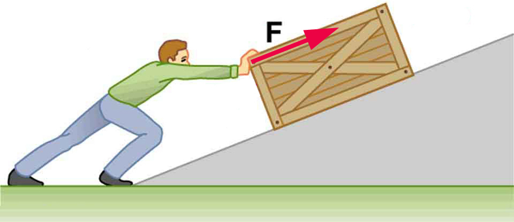

* Explain how an object must be displaced for a force on it to do work.
* Explain how relative directions of force and displacement determine whether the work done is positive, negative, or zero.

# What It Means to Do Work

The scientific definition of work differs in some ways from its everyday meaning. Certain things we think of as hard work, such as writing an exam or carrying a heavy load on level ground, are not work as defined by a scientist. The scientific definition of work reveals its relationship to energy—whenever work is done, energy is transferred.

For work, in the scientific sense, to be done, a force must be exerted and there must be motion or displacement in the direction of the force.

Formally, the **work**{: data-type="term" #import-auto-id1418415} done on a system by a constant force is defined to be *the product of the component of the force in the direction of motion times the distance through which the force acts*. For one-way motion in one dimension, this is expressed in equation form as

<math xmlns="http://www.w3.org/1998/Math/MathML"> <semantics> <mrow> <mrow> <mrow> <mrow> <mi>W</mi> <mo stretchy="false">=</mo><mspace width="0.15em" /> <mrow> <mo stretchy="false">∣</mo> <mi mathvariant="bold">F</mi> <mo stretchy="false">∣</mo> </mrow> </mrow> <mfenced open="(" close=")"> <mrow> <mtext>cos</mtext><mspace width="0.15em" /> <mi>θ</mi> </mrow> </mfenced> <mrow> <mo stretchy="false">∣</mo> <mi mathvariant="bold">d</mi> <mo stretchy="false">∣</mo> </mrow> <mo>,</mo> </mrow> </mrow> <mrow /> </mrow> <annotation encoding="StarMath 5.0"> size 12{W= lline F rline left ("cos"θ right ) lline d rline } {}</annotation> </semantics> </math>

where <math xmlns="http://www.w3.org/1998/Math/MathML"><semantics><mrow><mrow><mi>W</mi></mrow><mrow /></mrow><annotation encoding="StarMath 5.0"> size 12{W} {}</annotation></semantics></math>

 is work, <math xmlns="http://www.w3.org/1998/Math/MathML"><semantics><mrow><mrow><mi mathvariant="bold">d</mi></mrow><mrow /></mrow><annotation encoding="StarMath 5.0"> size 12{d} {}</annotation></semantics></math>

 is the displacement of the system, and <math xmlns="http://www.w3.org/1998/Math/MathML"><semantics><mrow><mrow><mi>θ</mi></mrow><mrow /></mrow><annotation encoding="StarMath 5.0"> size 12{θ} {}</annotation></semantics></math>

 is the angle between the force vector <math xmlns="http://www.w3.org/1998/Math/MathML"><semantics><mrow><mrow><mi mathvariant="bold">F</mi></mrow><mrow /></mrow><annotation encoding="StarMath 5.0"> size 12{F} {}</annotation></semantics></math>

 and the displacement vector <math xmlns="http://www.w3.org/1998/Math/MathML"><semantics><mrow><mrow><mi mathvariant="bold">d</mi></mrow><mrow /></mrow><annotation encoding="StarMath 5.0"> size 12{d} {}</annotation></semantics></math>

, as in [\[link\]](#import-auto-id2495459). We can also write this as

<math xmlns="http://www.w3.org/1998/Math/MathML"><semantics><mrow><mrow><mrow><mrow><mi>W</mi><mo stretchy="false">=</mo><mstyle fontstyle="italic"><mrow><mtext>Fd</mtext></mrow></mstyle></mrow><mspace width="0.25em" /><mtext> cos</mtext><mspace width="0.25em" /><mi>θ</mi></mrow><mo>.</mo></mrow><mrow /></mrow><annotation encoding="StarMath 5.0"> size 12{W= ital "Fd"" cos"θ} {}</annotation></semantics></math>

To find the work done on a system that undergoes motion that is not one-way or that is in two or three dimensions, we divide the motion into one-way one-dimensional segments and add up the work done over each segment.

What is Work?

The work done on a system by a constant force is *the product of the component of the force in the direction of motion times the distance through which the force acts*. For one-way motion in one dimension, this is expressed in equation form as

<math xmlns="http://www.w3.org/1998/Math/MathML"><semantics><mrow><mrow><mrow><mrow><mrow><mi>W</mi><mo stretchy="false">=</mo><mstyle fontstyle="italic"><mrow><mtext>Fd</mtext></mrow></mstyle></mrow><mspace width="0.25em" /><mtext>cos</mtext><mspace width="0.25em" /><mi>θ</mi></mrow></mrow><mrow><mtext>,</mtext></mrow></mrow><mrow /></mrow><annotation encoding="StarMath 5.0"> size 12{W= ital "Fd"" cos"θ} {}</annotation></semantics></math>

where <math xmlns="http://www.w3.org/1998/Math/MathML"><semantics><mrow><mrow><mi>W</mi></mrow><mrow /></mrow><annotation encoding="StarMath 5.0"> size 12{W} {}</annotation></semantics></math>

 is work, <math xmlns="http://www.w3.org/1998/Math/MathML"><semantics><mrow><mrow><mi>F</mi></mrow><mrow /></mrow><annotation encoding="StarMath 5.0"> size 12{F} {}</annotation></semantics></math>

 is the magnitude of the force on the system, <math xmlns="http://www.w3.org/1998/Math/MathML"><semantics><mrow><mrow><mi>d</mi></mrow><mrow /></mrow><annotation encoding="StarMath 5.0"> size 12{d} {}</annotation></semantics></math>

 is the magnitude of the displacement of the system, and <math xmlns="http://www.w3.org/1998/Math/MathML"><semantics><mrow><mrow><mi>θ</mi></mrow><mrow /></mrow><annotation encoding="StarMath 5.0"> size 12{q} {}</annotation></semantics></math>

 is the angle between the force vector <math xmlns="http://www.w3.org/1998/Math/MathML"><semantics><mrow><mrow><mi mathvariant="bold">F</mi></mrow><mrow /></mrow><annotation encoding="StarMath 5.0"> size 12{F} {}</annotation></semantics></math>

 and the displacement vector <math xmlns="http://www.w3.org/1998/Math/MathML"><semantics><mrow><mrow><mi mathvariant="bold">d</mi></mrow><mrow /></mrow><annotation encoding="StarMath 5.0"> size 12{d} {}</annotation></semantics></math>

.

 ![Five drawings labeled a through e. In (a), person pushing a lawn mower with a force F. Force is represented by a vector making an angle theta with the horizontal and displacement of the mower is represented by vector d. The component of vector F along vector d is F cosine theta. Work done by the person W is equal to F d cosine theta. (b) A person is standing with a briefcase in his hand. The force F shown by a vector arrow pointing upwards starting from the handle of briefcase and the displacement d is equal to zero. (c) A person is walking holding the briefcase in his hand. Force vector F is in the vertical direction starting from the handle of briefcase and displacement vector d is in horizontal direction starting from the same point as vector F. The angle between F and d theta is equal to 90 degrees. Cosine theta is equal to zero. (d) A briefcase is shown in front of a set of stairs. A vector d starting from the first stair points along the incline of the stair and a force vector F is in vertical direction starting from the same point as vector d. The angle between them is theta. A component of vector F along vector d is F d cosine theta. (e) A briefcase is shown lowered vertically down from an electric generator. The displacement vector d points downwards and force vector F points upwards acting on the briefcase.](../resources/Figure_08_02_01.jpg "Examples of work. (a) The work done by the force F size 12{F} {} on this lawn mower is Fdcos&#x3B8; size 12{ ital &quot;Fd&quot;&quot;cos&quot;&#x3B8;} {}. Note that Fcos&#x3B8; size 12{F&quot;cos&quot;&#x3B8;} {} is the component of the force in the direction of motion. (b) A person holding a briefcase does no work on it, because there is no motion. No energy is transferred to or from the briefcase. (c) The person moving the briefcase horizontally at a constant speed does no work on it, and transfers no energy to it. (d) Work is done on the briefcase by carrying it up stairs at constant speed, because there is necessarily a component of force F size 12{F} {} in the direction of the motion. Energy is transferred to the briefcase and could in turn be used to do work. (e) When the briefcase is lowered, energy is transferred out of the briefcase and into an electric generator. Here the work done on the briefcase by the generator is negative, removing energy from the briefcase, because F size 12{F} {} and d size 12{d} {} are in opposite directions."){: #import-auto-id2495459}

To examine what the definition of work means, let us consider the other situations shown in [\[link\]](#import-auto-id2495459). The person holding the briefcase in [\[link\]](#import-auto-id2495459)(b) does no work, for example. Here <math xmlns="http://www.w3.org/1998/Math/MathML"><semantics><mrow><mrow><mrow><mi>d</mi><mo stretchy="false">=</mo><mn>0</mn></mrow></mrow><mrow /></mrow><annotation encoding="StarMath 5.0"> size 12{d=0} {}</annotation></semantics></math>

, so <math xmlns="http://www.w3.org/1998/Math/MathML"><semantics><mrow><mrow><mrow><mi>W</mi><mo stretchy="false">=</mo><mn>0</mn></mrow></mrow><mrow /></mrow><annotation encoding="StarMath 5.0"> size 12{W=0} {}</annotation></semantics></math>

. Why is it you get tired just holding a load? The answer is that your muscles are doing work against one another, *but they are doing no work on the system of interest* (the “briefcase-Earth system”—see [Gravitational Potential Energy](/m42148) for more details). There must be motion for work to be done, and there must be a component of the force in the direction of the motion. For example, the person carrying the briefcase on level ground in [\[link\]](#import-auto-id2495459)(c) does no work on it, because the force is perpendicular to the motion. That is, <math xmlns="http://www.w3.org/1998/Math/MathML"><semantics><mrow><mrow><mrow><mtext>cos</mtext><mspace width="0.25em" /><mtext>90</mtext><mtext>º =</mtext><mspace width="0.25em" /><mn>0</mn></mrow></mrow><mrow /></mrow><annotation encoding="StarMath 5.0"> size 12{"cos""90""°="0} {}</annotation></semantics></math>

, and so <math xmlns="http://www.w3.org/1998/Math/MathML"><semantics><mrow><mrow><mrow><mi>W</mi><mo stretchy="false">=</mo><mn>0</mn></mrow></mrow><mrow /></mrow><annotation encoding="StarMath 5.0"> size 12{W=0} {}</annotation></semantics></math>

.

In contrast, when a force exerted on the system has a component in the direction of motion, such as in [\[link\]](#import-auto-id2495459)(d), work *is* done—energy is transferred to the briefcase. Finally, in [\[link\]](#import-auto-id2495459)(e), energy is transferred from the briefcase to a generator. There are two good ways to interpret this energy transfer. One interpretation is that the briefcase’s weight does work on the generator, giving it energy. The other interpretation is that the generator does negative work on the briefcase, thus removing energy from it. The drawing shows the latter, with the force from the generator upward on the briefcase, and the displacement downward. This makes <math xmlns="http://www.w3.org/1998/Math/MathML"><semantics><mrow><mrow><mrow><mrow><mi>θ</mi><mo stretchy="false">=</mo><mtext>180</mtext></mrow><mtext>º</mtext></mrow></mrow><mrow /></mrow><annotation encoding="StarMath 5.0"> size 12{θ="180"°} {}</annotation></semantics></math>

, and <math xmlns="http://www.w3.org/1998/Math/MathML"><semantics><mrow><mrow><mrow><mtext>cos 180</mtext><mrow><mtext>º</mtext><mo stretchy="false">=</mo><mrow><mn>–1</mn></mrow></mrow></mrow></mrow><mrow /></mrow><annotation encoding="StarMath 5.0"> size 12{"cos 180"°= +- 1} {}</annotation></semantics></math>

; therefore, <math xmlns="http://www.w3.org/1998/Math/MathML"><semantics><mrow><mrow><mi>W</mi></mrow><mrow /></mrow><annotation encoding="StarMath 5.0"> size 12{W} {}</annotation></semantics></math>

 is negative.

# Calculating Work

Work and energy have the same units. From the definition of work, we see that those units are force times distance. Thus, in SI units, work and energy are measured in **newton-meters**{: data-type="term" #import-auto-id2692776}. A newton-meter is given the special name **joule**{: data-type="term" #import-auto-id2681417} (J), and <math xmlns="http://www.w3.org/1998/Math/MathML"><semantics><mrow><mrow><mrow><mn>1</mn><mrow><mspace width="0.25em" /><mtext> J</mtext><mo stretchy="false">=</mo><mn>1</mn></mrow><mrow><mrow><mspace width="0.25em" /><mtext> N</mtext><mo stretchy="false">⋅</mo><mtext>m</mtext></mrow><mo stretchy="false">=</mo><mn>1</mn></mrow><mrow><mspace width="0.25em" /><mtext> kg</mtext><mo stretchy="false">⋅</mo><msup><mtext>m</mtext><mrow><mn>2</mn></mrow></msup></mrow><msup><mtext>/s</mtext><mrow><mn>2</mn></mrow></msup></mrow></mrow><mrow /></mrow><annotation encoding="StarMath 5.0"> size 12{1" J"=1" N" cdot m=1" kg" cdot m rSup { size 8{2} } "/s" rSup { size 8{2} } } {}</annotation></semantics></math>

. One joule is not a large amount of energy; it would lift a small 100-gram apple a distance of about 1 meter.

Calculating the Work You Do to Push a Lawn Mower Across a Large Lawn

How much work is done on the lawn mower by the person in [\[link\]](#import-auto-id2495459)(a) if he exerts a constant force of <math xmlns="http://www.w3.org/1998/Math/MathML"><semantics><mrow><mrow><mrow><mtext>75</mtext><mtext>.</mtext><mn>0</mn><mspace width="0.25em" /><mtext>N</mtext></mrow></mrow><mrow /></mrow><annotation encoding="StarMath 5.0"> size 12{"75" "." 0" N"} {}</annotation></semantics></math>

 at an angle <math xmlns="http://www.w3.org/1998/Math/MathML"><semantics><mrow><mrow><mrow><mtext>35</mtext><mtext>º</mtext></mrow></mrow><mrow /></mrow><annotation encoding="StarMath 5.0"> size 12{"35"°} {}</annotation></semantics></math>

 below the horizontal and pushes the mower <math xmlns="http://www.w3.org/1998/Math/MathML"><semantics><mrow><mrow><mrow><mtext>25</mtext><mtext>.</mtext><mn>0</mn><mspace width="0.25em" /><mtext>m</mtext></mrow></mrow><mrow /></mrow><annotation encoding="StarMath 5.0"> size 12{"25" "." 0" m"} {}</annotation></semantics></math>

 on level ground? Convert the amount of work from joules to kilocalories and compare it with this person’s average daily intake of <math xmlns="http://www.w3.org/1998/Math/MathML"><semantics><mrow><mrow><mrow><mtext>10</mtext><mi>,</mi><mtext>000</mtext><mspace width="0.25em" /><mtext>kJ</mtext></mrow></mrow><mrow /></mrow><annotation encoding="StarMath 5.0"> size 12{"10","000"" kJ"} {}</annotation></semantics></math>

 (about <math xmlns="http://www.w3.org/1998/Math/MathML"><semantics><mrow><mrow><mrow><mtext>2400</mtext><mspace width="0.25em" /><mtext>kcal</mtext></mrow></mrow><mrow /></mrow><annotation encoding="StarMath 5.0"> size 12{"2400"" kcal"} {}</annotation></semantics></math>

) of food energy. One *calorie* (1 cal) of heat is the amount required to warm 1 g of water by <math xmlns="http://www.w3.org/1998/Math/MathML"><semantics><mrow><mrow><mrow><mn>1</mn><mtext>º</mtext><mtext>C</mtext></mrow></mrow><mrow /></mrow><annotation encoding="StarMath 5.0"> size 12{1°C} {}</annotation></semantics></math>

, and is equivalent to <math xmlns="http://www.w3.org/1998/Math/MathML"><semantics><mrow><mrow><mrow><mn>4</mn><mtext>.</mtext><mtext>184</mtext><mspace width="0.25em" /><mtext>J</mtext></mrow></mrow><mrow /></mrow><annotation encoding="StarMath 5.0"> size 12{4 "." "184"" J"} {}</annotation></semantics></math>

, while one *food calorie* (1 kcal) is equivalent to <math xmlns="http://www.w3.org/1998/Math/MathML"><semantics><mrow><mrow><mrow><mtext>4184</mtext><mspace width="0.25em" /><mtext>J</mtext></mrow></mrow><mrow /></mrow><annotation encoding="StarMath 5.0"> size 12{"4184"" J"} {}</annotation></semantics></math>

.

**Strategy**

We can solve this problem by substituting the given values into the definition of work done on a system, stated in the equation <math xmlns="http://www.w3.org/1998/Math/MathML"><semantics><mrow><mrow><mrow><mrow><mi>W</mi><mo stretchy="false">=</mo><mstyle fontstyle="italic"><mrow><mtext>Fd</mtext></mrow></mstyle></mrow><mspace width="0.25em" /><mtext>cos</mtext><mspace width="0.25em" /><mi>θ</mi></mrow></mrow><mrow /></mrow><annotation encoding="StarMath 5.0"> size 12{W= ital "Fd"" cos"θ} {}</annotation></semantics></math>

. The force, angle, and displacement are given, so that only the work <math xmlns="http://www.w3.org/1998/Math/MathML"><semantics><mrow><mrow><mi>W</mi></mrow><mrow /></mrow><annotation encoding="StarMath 5.0"> size 12{W} {}</annotation></semantics></math>

 is unknown.

**Solution**

The equation for the work is

<math xmlns="http://www.w3.org/1998/Math/MathML"><semantics><mrow><mrow><mrow><mrow><mi>W</mi><mo stretchy="false">=</mo><mstyle fontstyle="italic"><mrow><mtext>Fd</mtext></mrow></mstyle></mrow><mspace width="0.25em" /><mtext>cos</mtext><mspace width="0.25em" /><mi>θ</mi></mrow><mo>.</mo></mrow><mrow /></mrow><annotation encoding="StarMath 5.0"> size 12{W= ital "Fd"" cos"θ} {}</annotation></semantics></math>

Substituting the known values gives

<math xmlns="http://www.w3.org/1998/Math/MathML"> <semantics> <mrow> <mrow> <mtable columnalign="left"> <mtr><mtd> <mi>W</mi></mtd> <mtd> <mo stretchy="false">=</mo></mtd> <mtd> <mrow> <mrow> <mrow> <mrow> <mfenced open="(" close=")"> <mrow> <mtext>75.0 N</mtext> </mrow> </mfenced> </mrow> <mfenced open="(" close=")"> <mrow> <mtext>25.0 m</mtext> </mrow> </mfenced><mspace width="0.25em" /> <mtext>cos</mtext><mspace width="0.25em" /> <mfenced open="(" close=")"> <mrow> <mtext>35.0º</mtext> </mrow> </mfenced> </mrow> </mrow> </mrow></mtd> </mtr> <mtr><mtd /> <mtd> <mo stretchy="false">=</mo></mtd> <mtd> <mrow> <mrow> <mrow> <mrow> <mtext>1536 J</mtext> <mo stretchy="false">=</mo> <mtext>1.54</mtext> <mo stretchy="false">×</mo> <msup> <mtext>10</mtext> <mrow> <mn>3</mn> </mrow> </msup> </mrow><mspace width="0.25em" /> <mtext>J.</mtext> </mrow> </mrow> </mrow></mtd> </mtr> </mtable> <mrow /> </mrow> </mrow> <annotation encoding="StarMath 5.0">alignl { stack { size 12{W= left ("75" "." "0 N" right ) left ("25" "." "0 m" right )"cos " left ("35" "." 0° right )} {} # size 12{" "="1536"" J"=1 "." "54" times "10" rSup { size 8{3} } " J" "." } {} } } {}</annotation> </semantics> </math>

Converting the work in joules to kilocalories yields <math xmlns="http://www.w3.org/1998/Math/MathML"><semantics><mrow><mrow><mrow><mrow><mi>W</mi><mo stretchy="false">=</mo><mo stretchy="false">(</mo></mrow><mtext>1536</mtext><mspace width="0.25em" /><mtext>J</mtext><mo stretchy="false">)</mo><mo stretchy="false">(</mo><mn>1</mn><mspace width="0.25em" /><mrow><mtext>kcal</mtext><mo stretchy="false">/</mo><mtext>4184</mtext></mrow><mspace width="0.25em" /><mtext>J</mtext><mrow><mo stretchy="false">)</mo><mo stretchy="false">=</mo><mn>0</mn></mrow><mtext>.</mtext><mtext>367</mtext><mspace width="0.25em" /><mtext>kcal</mtext></mrow></mrow><mrow /></mrow><annotation encoding="StarMath 5.0"> size 12{W= \( "1536"`J \) \( 1`"kcal"/"4184"`J \) =0 "." "367"`"kcal"} {}</annotation></semantics></math>

. The ratio of the work done to the daily consumption is

<math xmlns="http://www.w3.org/1998/Math/MathML"> <semantics> <mrow> <mrow> <mrow> <mrow> <mfrac> <mi>W</mi> <mrow> <mtext>2400</mtext> <mspace width="0.25em" /> <mtext>kcal</mtext> </mrow> </mfrac> <mo stretchy="false">=</mo> <mn>1</mn> </mrow> <mtext>.</mtext> <mrow> <mtext>53</mtext> <mo stretchy="false">×</mo> <msup> <mtext>10</mtext> <mrow> <mrow> <mo stretchy="false">−</mo> <mn>4</mn> </mrow> </mrow> </msup> </mrow> <mtext>.</mtext> </mrow> </mrow> <mrow /> </mrow> <annotation encoding="StarMath 5.0"> size 12{ { {W} over {"2400"`"kcal"} } =1 "." "53" times "10" rSup { size 8{ - 4} } "." } {}</annotation> </semantics> </math>

**Discussion**

This ratio is a tiny fraction of what the person consumes, but it is typical. Very little of the energy released in the consumption of food is used to do work. Even when we “work” all day long, less than 10% of our food energy intake is used to do work and more than 90% is converted to thermal energy or stored as chemical energy in fat.

# Section Summary

* Work is the transfer of energy by a force acting on an object as it is displaced.
* The work
  <math xmlns="http://www.w3.org/1998/Math/MathML"><semantics><mrow><mrow><mi>W</mi></mrow><mrow /></mrow><annotation encoding="StarMath 5.0"> size 12{W} {}</annotation></semantics></math>
  
  that a force
  <math xmlns="http://www.w3.org/1998/Math/MathML"><semantics><mrow><mrow><mi mathvariant="bold">F</mi></mrow><mrow /></mrow><annotation encoding="StarMath 5.0"> size 12{F} {}</annotation></semantics></math>
  
  does on an object is the product of the magnitude
  <math xmlns="http://www.w3.org/1998/Math/MathML"><semantics><mrow><mrow><mi>F</mi></mrow><mrow /></mrow><annotation encoding="StarMath 5.0"> size 12{F} {}</annotation></semantics></math>
  
  of the force, times the magnitude
  <math xmlns="http://www.w3.org/1998/Math/MathML"><semantics><mrow><mrow><mi>d</mi></mrow><mrow /></mrow><annotation encoding="StarMath 5.0"> size 12{d} {}</annotation></semantics></math>
  
  of the displacement, times the cosine of the angle
  <math xmlns="http://www.w3.org/1998/Math/MathML"><semantics><mrow><mrow><mi>θ</mi></mrow><mrow /></mrow><annotation encoding="StarMath 5.0"> size 12{q} {}</annotation></semantics></math>
  
  between them. In symbols,
  

  <math xmlns="http://www.w3.org/1998/Math/MathML"> <semantics> <mrow> <mrow> <mrow> <mrow> <mi>W</mi> <mo stretchy="false">=</mo> <mstyle fontstyle="italic"> <mrow> <mtext>Fd</mtext> </mrow> </mstyle> </mrow><mspace width="0.25em" /> <mtext>cos</mtext><mspace width="0.25em" /> <mi>θ</mi> <mtext>.</mtext> </mrow> </mrow> <mrow /> </mrow> <annotation encoding="StarMath 5.0"> size 12{W= ital "Fd""cos"θ "." } {}</annotation> </semantics> </math>
  

* The SI unit for work and energy is the joule (J), where
  <math xmlns="http://www.w3.org/1998/Math/MathML"><semantics><mrow><mrow><mrow><mn>1</mn><mrow><mspace width="0.25em" /><mtext>J</mtext><mo stretchy="false">=</mo><mn>1</mn></mrow><mrow><mrow><mspace width="0.25em" /><mtext>N</mtext><mo stretchy="false">⋅</mo><mtext>m</mtext></mrow><mo stretchy="false">=</mo><mrow><mtext>1 kg</mtext><mo stretchy="false">⋅</mo><msup><mtext>m</mtext><mrow><mn>2</mn></mrow></msup></mrow></mrow><msup><mtext>/s</mtext><mrow><mn>2</mn></mrow></msup></mrow></mrow><mrow /></mrow><annotation encoding="StarMath 5.0"> size 12{1" J"=1" N" cdot m="1 kg" cdot m rSup { size 8{2} } "/s" rSup { size 8{2} } } {}</annotation></semantics></math>
  
  .
* The work done by a force is zero if the displacement is either zero or perpendicular to the force.
* The work done is positive if the force and displacement have the same direction, and negative if they have opposite direction.

# Conceptual Questions

Give an example of something we think of as work in everyday circumstances that is not work in the scientific sense. Is energy transferred or changed in form in your example? If so, explain how this is accomplished without doing work.

Give an example of a situation in which there is a force and a displacement, but the force does no work. Explain why it does no work.

Describe a situation in which a force is exerted for a long time but does no work. Explain.

# Problems &amp; Exercises

How much work does a supermarket checkout attendant do on a can of soup he pushes 0.600 m horizontally with a force of 5.00 N? Express your answer in joules and kilocalories.

<math xmlns="http://www.w3.org/1998/Math/MathML"> <semantics> <mrow> <mrow> <mrow> <mrow> <mrow> <mn>3</mn> <mtext>.</mtext> <mtext>00</mtext> <mrow> <mtext> J</mtext> <mo stretchy="false">=</mo> <mrow /> </mrow> </mrow> </mrow> <mrow /> </mrow> <mrow> <mrow> <mrow> <mn>7</mn> <mtext>.</mtext> <mrow> <mtext>17</mtext> <mo stretchy="false">×</mo> <msup> <mtext>10</mtext> <mrow> <mrow> <mo stretchy="false">−</mo> <mn>4</mn> </mrow> </mrow> </msup> </mrow> <mtext> kcal</mtext> </mrow> </mrow> <mrow /> </mrow> <mrow /> </mrow> </mrow> <annotation encoding="StarMath 5.0">alignl { stack { size 12{3 "." "00"" J"={}} {} # size 12{7 "." "17" times "10" rSup { size 8{ - 4} } " kcal"} {} } } {}</annotation> </semantics> </math>

A 75.0-kg person climbs stairs, gaining 2.50 meters in height. Find the work done to accomplish this task.

(a) Calculate the work done on a 1500-kg elevator car by its cable to lift it 40.0 m at constant speed, assuming friction averages 100 N. (b) What is the work done on the lift by the gravitational force in this process? (c) What is the total work done on the lift?

(a) <math xmlns="http://www.w3.org/1998/Math/MathML"><semantics><mrow><mrow><mrow><mn>5</mn><mtext>.</mtext><mrow><mtext>92</mtext><mo stretchy="false">×</mo><msup><mtext>10</mtext><mrow><mn>5</mn></mrow></msup></mrow><mspace width="0.25em" /><mtext>J</mtext></mrow></mrow><mrow /></mrow><annotation encoding="StarMath 5.0"> size 12{5 "." "92" times "10" rSup { size 8{5} } " J"} {}</annotation></semantics></math>

(b) <math xmlns="http://www.w3.org/1998/Math/MathML"><semantics><mrow><mrow><mrow><mrow><mo stretchy="false">−</mo><mn>5</mn></mrow><mtext>.</mtext><mrow><mtext>88</mtext><mo stretchy="false">×</mo><msup><mtext>10</mtext><mrow><mn>5</mn></mrow></msup></mrow><mspace width="0.25em" /><mtext>J</mtext></mrow></mrow><mrow /></mrow><annotation encoding="StarMath 5.0"> size 12{ - 5 "." "88" times "10" rSup { size 8{5} } " J"} {}</annotation></semantics></math>

(c) The net force is zero.

Suppose a car travels 108 km at a speed of 30.0 m/s, and uses 2.0 gal of gasoline. Only 30% of the gasoline goes into useful work by the force that keeps the car moving at constant speed despite friction. (See [[link]](/m42151#import-auto-id2866785) for the energy content of gasoline.) (a) What is the magnitude of the force exerted to keep the car moving at constant speed? (b) If the required force is directly proportional to speed, how many gallons will be used to drive 108 km at a speed of 28.0 m/s?

Calculate the work done by an 85.0-kg man who pushes a crate 4.00 m up along a ramp that makes an angle of <math xmlns="http://www.w3.org/1998/Math/MathML"><semantics><mrow><mrow><mrow><mtext>20</mtext><mtext>.</mtext><mn>0</mn><mtext>º</mtext></mrow></mrow><mrow /></mrow><annotation encoding="StarMath 5.0"> size 12{"20" "." 0°} {}</annotation></semantics></math>

 with the horizontal. (See [[link]](#fs-id2047040).) He exerts a force of 500 N on the crate parallel to the ramp and moves at a constant speed. Be certain to include the work he does on the crate *and* on his body to get up the ramp.

{:}

<math xmlns="http://www.w3.org/1998/Math/MathML"> <semantics> <mrow> <mrow> <mrow> <mn>3</mn> <mtext>.</mtext> <mrow> <mtext>14</mtext> <mo stretchy="false">×</mo> <msup> <mtext>10</mtext> <mrow> <mn>3</mn> </mrow> </msup> </mrow><mspace width="0.25em" /> <mtext> J</mtext> </mrow> </mrow> <mrow /> </mrow> <annotation encoding="StarMath 5.0"> size 12{3 "." "14" times "10" rSup { size 8{3} } " J"} {}</annotation> </semantics> </math>

How much work is done by the boy pulling his sister 30.0 m in a wagon as shown in [[link]](#import-auto-id1538391)? Assume no friction acts on the wagon.

{: #import-auto-id1538391}

A shopper pushes a grocery cart 20.0 m at constant speed on level ground, against a 35.0 N frictional force. He pushes in a direction <math xmlns="http://www.w3.org/1998/Math/MathML"><semantics><mrow><mrow><mrow><mtext>25</mtext><mtext>.</mtext><mn>0</mn><mtext>º</mtext></mrow></mrow><mrow /></mrow><annotation encoding="StarMath 5.0"> size 12{"25" "." 0°} {}</annotation></semantics></math>

 below the horizontal. (a) What is the work done on the cart by friction? (b) What is the work done on the cart by the gravitational force? (c) What is the work done on the cart by the shopper? (d) Find the force the shopper exerts, using energy considerations. (e) What is the total work done on the cart?

(a) <math xmlns="http://www.w3.org/1998/Math/MathML"> <semantics> <mrow> <mrow> <mrow> <mrow> <mo stretchy="false">−</mo> <mtext>700</mtext> </mrow> <mspace width="0.25em" /> <mtext>J</mtext> </mrow> </mrow> <mrow /> </mrow> <annotation encoding="StarMath 5.0"> size 12{ - "700"`J} {}</annotation> </semantics> </math>

(b) 0

(c) 700 J

(d) 38.6 N

(e) 0

Suppose the ski patrol lowers a rescue sled and victim, having a total mass of 90.0 kg, down a <math xmlns="http://www.w3.org/1998/Math/MathML"><semantics><mrow><mrow><mrow><mtext>60</mtext><mtext>.</mtext><mn>0</mn><mtext>º</mtext></mrow></mrow><mrow /></mrow><annotation encoding="StarMath 5.0"> size 12{"60" "." 0°} {}</annotation></semantics></math>

 slope at constant speed, as shown in [[link]](#import-auto-id2504152). The coefficient of friction between the sled and the snow is 0.100. (a) How much work is done by friction as the sled moves 30.0 m along the hill? (b) How much work is done by the rope on the sled in this distance? (c) What is the work done by the gravitational force on the sled? (d) What is the total work done?

{: #import-auto-id2504152}

