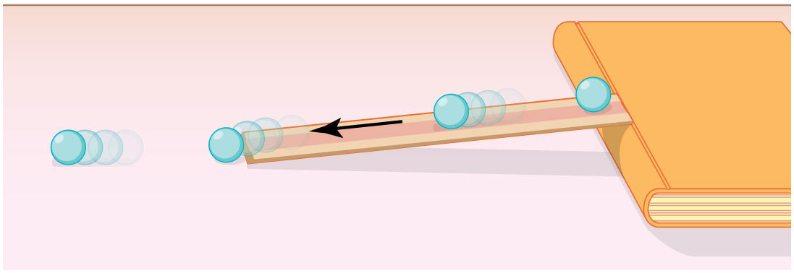

* Explain gravitational potential energy in terms of work done against gravity.
* Show that the gravitational potential energy of an object of mass
  <math xmlns="http://www.w3.org/1998/Math/MathML"><semantics><mrow><mrow><mi>m</mi></mrow><mrow /></mrow><annotation encoding="StarMath 5.0"> size 12{m} {}</annotation></semantics></math>
  
  at height
  <math xmlns="http://www.w3.org/1998/Math/MathML"><semantics><mrow><mrow><mi>h</mi></mrow><mrow /></mrow><annotation encoding="StarMath 5.0"> size 12{h} {}</annotation></semantics></math>
  
  on Earth is given by
  <math xmlns="http://www.w3.org/1998/Math/MathML"><semantics><mrow><msub><mtext>PE</mtext><mrow><mtext>g</mtext></mrow></msub><mo stretchy="false">=</mo><mstyle fontstyle="italic"><mrow><mtext>mgh</mtext></mrow></mstyle></mrow></semantics></math>
  
  .
* Show how knowledge of the potential energy as a function of position can be used to simplify calculations and explain physical phenomena.

### Work Done Against Gravity

Climbing stairs and lifting objects is work in both the scientific and everyday sense—it is work done against the gravitational force. When there is work, there is a transformation of energy. The work done against the gravitational force goes into an important form of stored energy that we will explore in this section.

Let us calculate the work done in lifting an object of mass <math xmlns="http://www.w3.org/1998/Math/MathML"><semantics><mrow><mrow><mi>m</mi></mrow><mrow /></mrow><annotation encoding="StarMath 5.0"> size 12{m} {}</annotation></semantics></math>

 through a height <math xmlns="http://www.w3.org/1998/Math/MathML"><semantics><mrow><mrow><mi>h</mi></mrow><mrow /></mrow><annotation encoding="StarMath 5.0"> size 12{h} {}</annotation></semantics></math>

, such as in [\[link\]](#import-auto-id1697782). If the object is lifted straight up at constant speed, then the force needed to lift it is equal to its weight <math xmlns="http://www.w3.org/1998/Math/MathML"><semantics><mrow><mrow><mstyle fontstyle="italic"><mrow><mtext>mg</mtext></mrow></mstyle></mrow><mrow /></mrow><annotation encoding="StarMath 5.0"> size 12{ ital "mg"} {}</annotation></semantics></math>

. The work done on the mass is then <math xmlns="http://www.w3.org/1998/Math/MathML"><semantics><mrow><mrow><mstyle fontstyle="italic"><mrow><mtext>W = Fd = mgh</mtext></mrow></mstyle></mrow><mrow /></mrow><annotation encoding="StarMath 5.0"> size 12{ ital "W = Fd = mgh"} {}</annotation></semantics></math>

. We define this to be the **gravitational potential energy**{: data-type="term"} <math xmlns="http://www.w3.org/1998/Math/MathML"><semantics><mrow><mrow><mrow><mo stretchy="false">(</mo><msub><mtext>PE</mtext><mrow><mtext>g</mtext></mrow></msub><mo stretchy="false">)</mo></mrow></mrow><mrow /></mrow></semantics></math>

 put into (or gained by) the object-Earth system. This energy is associated with the state of separation between two objects that attract each other by the gravitational force. For convenience, we refer to this as the <math xmlns="http://www.w3.org/1998/Math/MathML"><semantics><mrow><mrow><msub><mtext>PE</mtext><mrow><mtext>g</mtext></mrow></msub></mrow><mrow /></mrow><annotation encoding="StarMath 5.0"> size 12{"PE" rSub { size 8{g} } } {}</annotation></semantics></math>

 gained by the object, recognizing that this is energy stored in the gravitational field of Earth. Why do we use the word “system”? Potential energy is a property of a system rather than of a single object—due to its physical position. An object’s gravitational potential is due to its position relative to the surroundings within the Earth-object system. The force applied to the object is an external force, from outside the system. When it does positive work it increases the gravitational potential energy of the system. Because gravitational potential energy depends on relative position, we need a reference level at which to set the potential energy equal to 0. We usually choose this point to be Earth’s surface, but this point is arbitrary; what is important is the *difference* in gravitational potential energy, because this difference is what relates to the work done. The difference in gravitational potential energy of an object (in the Earth-object system) between two rungs of a ladder will be the same for the first two rungs as for the last two rungs.

### Converting Between Potential Energy and Kinetic Energy

Gravitational potential energy may be converted to other forms of energy, such as kinetic energy. If we release the mass, gravitational force will do an amount of work equal to <math xmlns="http://www.w3.org/1998/Math/MathML"><semantics><mrow><mrow><mstyle fontstyle="italic"><mrow><mtext>mgh</mtext></mrow></mstyle></mrow><mrow /></mrow><annotation encoding="StarMath 5.0"> size 12{ ital "mgh"} {}</annotation></semantics></math>

 on it, thereby increasing its kinetic energy by that same amount (by the work-energy theorem). We will find it more useful to consider just the conversion of <math xmlns="http://www.w3.org/1998/Math/MathML"><semantics><mrow><mrow><msub><mtext>PE</mtext><mrow><mtext>g</mtext></mrow></msub></mrow><mrow /></mrow><annotation encoding="StarMath 5.0"> size 12{"PE" rSub { size 8{g} } } {}</annotation></semantics></math>

 to <math xmlns="http://www.w3.org/1998/Math/MathML"><semantics><mrow><mrow><mtext>KE</mtext></mrow><mrow /></mrow><annotation encoding="StarMath 5.0"> size 12{"KE"} {}</annotation></semantics></math>

 without explicitly considering the intermediate step of work. (See [\[link\]](#fs-id2895434).) This shortcut makes it is easier to solve problems using energy (if possible) rather than explicitly using forces.

 The work done to lift the weight is stored in the mass-Earth system as gravitational potential energy. (b) As the weight moves downward, this gravitational potential energy is transferred to the cuckoo clock."){: #import-auto-id1697782}

More precisely, we define the *change* in gravitational potential energy <math xmlns="http://www.w3.org/1998/Math/MathML"><semantics><mrow><mrow><mrow><mtext>Δ</mtext><msub><mtext>PE</mtext><mrow><mtext>g</mtext></mrow></msub></mrow></mrow><mrow /></mrow><annotation encoding="StarMath 5.0"> size 12{Δ"PE" rSub { size 8{g} } } {}</annotation></semantics></math>

 to be

<math xmlns="http://www.w3.org/1998/Math/MathML"><semantics><mrow><mrow><mrow><mtext>Δ</mtext><mrow><msub><mtext>PE</mtext><mrow><mtext>g</mtext></mrow></msub><mo stretchy="false">=</mo><mstyle fontstyle="italic"><mrow><mtext>mgh</mtext></mrow></mstyle></mrow><mo>,</mo></mrow></mrow><mrow /></mrow><annotation encoding="StarMath 5.0"> size 12{Δ"PE" rSub { size 8{g} } = ital "mgh"} {}</annotation></semantics></math>

where, for simplicity, we denote the change in height by <math xmlns="http://www.w3.org/1998/Math/MathML"><semantics><mrow><mrow><mi>h</mi></mrow><mrow /></mrow><annotation encoding="StarMath 5.0"> size 12{h} {}</annotation></semantics></math>

 rather than the usual <math xmlns="http://www.w3.org/1998/Math/MathML"><semantics><mrow><mrow><mtext>Δ</mtext><mi fontstyle="italic">h</mi></mrow><mrow /></mrow><annotation encoding="StarMath 5.0"> size 12{Δh} {}</annotation></semantics></math>

. Note that <math xmlns="http://www.w3.org/1998/Math/MathML"><semantics><mrow><mrow><mi>h</mi></mrow><mrow /></mrow><annotation encoding="StarMath 5.0"> size 12{h} {}</annotation></semantics></math>

 is positive when the final height is greater than the initial height, and vice versa. For example, if a 0.500-kg mass hung from a cuckoo clock is raised 1.00 m, then its change in gravitational potential energy is

<math xmlns="http://www.w3.org/1998/Math/MathML"> <semantics> <mrow> <mrow> <mtable columnalign="left"> <mtr><mtd> <mtext fontstyle="italic">mgh</mtext></mtd> <mtd> <mo>=</mo></mtd> <mtd> <mrow> <mrow> <mrow> <mfenced open="(" close=")"> <mtext>0.500 kg</mtext> </mfenced> <mfenced open="(" close=")"> <mrow> <msup> <mrow> <mtext>9.80</mtext><mspace width="0.25em" /><mtext>m/s</mtext> </mrow> <mrow> <mn>2</mn> </mrow> </msup> </mrow> </mfenced> <mfenced open="(" close=")"> <mtext>1.00 m</mtext> </mfenced> </mrow> </mrow> </mrow></mtd> </mtr> <mtr><mtd /> <mtd><mo>=</mo></mtd> <mtd> <mrow> <mrow> <mtext>4.90 kg</mtext> <mo stretchy="false">⋅</mo> <msup> <mn>m</mn> <mrow> <mn>2</mn> </mrow> </msup> </mrow> <msup> <mtext>/s</mtext> <mrow> <mn>2</mn> </mrow> </msup> <mtext> = 4.90 J.</mtext> </mrow></mtd> </mtr> </mtable> </mrow> </mrow> </semantics> </math>

Note that the units of gravitational potential energy turn out to be joules, the same as for work and other forms of energy. As the clock runs, the mass is lowered. We can think of the mass as gradually giving up its 4.90 J of gravitational potential energy, *without directly considering the force of gravity that does the work*.

### Using Potential Energy to Simplify Calculations

The equation <math xmlns="http://www.w3.org/1998/Math/MathML"><semantics><mrow><mrow><mrow><mtext>Δ</mtext><mrow><msub><mtext>PE</mtext><mrow><mtext>g</mtext></mrow></msub><mo stretchy="false">=</mo><mstyle fontstyle="italic"><mrow><mtext>mgh</mtext></mrow></mstyle></mrow></mrow></mrow><mrow /></mrow><annotation encoding="StarMath 5.0"> size 12{Δ"PE" rSub { size 8{g} } = ital "mgh"} {}</annotation></semantics></math>

 applies for any path that has a change in height of <math xmlns="http://www.w3.org/1998/Math/MathML"><semantics><mrow><mrow><mi>h</mi></mrow><mrow /></mrow><annotation encoding="StarMath 5.0"> size 12{h} {}</annotation></semantics></math>

, not just when the mass is lifted straight up. (See [\[link\]](#import-auto-id1556510).) It is much easier to calculate <math xmlns="http://www.w3.org/1998/Math/MathML"><semantics><mrow><mrow><mstyle fontstyle="italic"><mrow><mtext>mgh</mtext></mrow></mstyle></mrow><mrow /></mrow><annotation encoding="StarMath 5.0"> size 12{ ital "mgh"} {}</annotation></semantics></math>

 (a simple multiplication) than it is to calculate the work done along a complicated path. The idea of gravitational potential energy has the double advantage that it is very broadly applicable and it makes calculations easier. From now on, we will consider that any change in vertical position <math xmlns="http://www.w3.org/1998/Math/MathML"><semantics><mrow><mrow><mi>h</mi></mrow><mrow /></mrow><annotation encoding="StarMath 5.0"> size 12{h} {}</annotation></semantics></math>

 of a mass <math xmlns="http://www.w3.org/1998/Math/MathML"><semantics><mrow><mrow><mi>m</mi></mrow><mrow /></mrow><annotation encoding="StarMath 5.0"> size 12{m} {}</annotation></semantics></math>

 is accompanied by a change in gravitational potential energy <math xmlns="http://www.w3.org/1998/Math/MathML"><semantics><mrow><mrow><mstyle fontstyle="italic"><mrow><mtext>mgh</mtext></mrow></mstyle></mrow><mrow /></mrow><annotation encoding="StarMath 5.0"> size 12{ ital "mgh"} {}</annotation></semantics></math>

, and we will avoid the equivalent but more difficult task of calculating work done by or against the gravitational force.

 size 12{ \( &#x394;&quot;PE&quot; rSub { size 8{g} }  \) } {} between points A and B is independent of the path. &#x394;PEg=mgh size 12{&#x394;&quot;PE&quot; rSub { size 8{g} } = ital &quot;mgh&quot;} {} for any path between the two points. Gravity is one of a small class of forces where the work done by or against the force depends only on the starting and ending points, not on the path between them."){: #import-auto-id1556510}

The Force to Stop Falling

A 60.0-kg person jumps onto the floor from a height of 3.00 m. If he lands stiffly (with his knee joints compressing by 0.500 cm), calculate the force on the knee joints.

**Strategy**

This person’s energy is brought to zero in this situation by the work done on him by the floor as he stops. The initial <math xmlns="http://www.w3.org/1998/Math/MathML"><semantics><mrow><mrow><msub><mtext>PE</mtext><mrow><mtext>g</mtext></mrow></msub></mrow><mrow /></mrow><annotation encoding="StarMath 5.0"> size 12{"PE" rSub { size 8{g} } } {}</annotation></semantics></math>

 is transformed into <math xmlns="http://www.w3.org/1998/Math/MathML"><semantics><mrow><mrow><mtext>KE</mtext></mrow><mrow /></mrow><annotation encoding="StarMath 5.0"> size 12{"KE"} {}</annotation></semantics></math>

 as he falls. The work done by the floor reduces this kinetic energy to zero.

**Solution**

The work done on the person by the floor as he stops is given by

<math xmlns="http://www.w3.org/1998/Math/MathML"><semantics><mrow><mrow><mrow><mrow><mi>W</mi><mo stretchy="false">=</mo><mstyle fontstyle="italic"><mrow><mtext>Fd</mtext></mrow></mstyle></mrow><mspace width="0.25em" /><mtext>cos</mtext><mspace width="0.25em" /><mrow><mi>θ</mi><mo stretchy="false">=</mo><mrow><mo stretchy="false">−</mo><mstyle fontstyle="italic"><mrow><mtext>Fd</mtext></mrow></mstyle></mrow><mo>,</mo></mrow></mrow></mrow><mrow /></mrow><annotation encoding="StarMath 5.0"> size 12{W= ital "Fd""cos"θ= - ital "Fd"} {}</annotation></semantics></math>

with a minus sign because the displacement while stopping and the force from floor are in opposite directions <math xmlns="http://www.w3.org/1998/Math/MathML"><semantics><mrow><mrow><mrow><mo stretchy="false">(</mo><mtext>cos</mtext><mrow><mspace width="0.25em" /><mi>θ</mi><mo stretchy="false">=</mo><mtext>cos</mtext><mspace width="0.25em" /></mrow><mtext>180º</mtext><mrow><mo>=</mo><mo stretchy="false">−</mo><mn>1</mn></mrow><mo stretchy="false">)</mo></mrow></mrow><mrow /></mrow><annotation encoding="StarMath 5.0"> size 12{ \( "cos"θ="cos""180""°=" - 1 \) } {}</annotation></semantics></math>

. The floor removes energy from the system, so it does negative work.

The kinetic energy the person has upon reaching the floor is the amount of potential energy lost by falling through height <math xmlns="http://www.w3.org/1998/Math/MathML"><semantics><mrow><mrow><mi>h</mi></mrow><mrow /></mrow><annotation encoding="StarMath 5.0"> size 12{h} {}</annotation></semantics></math>

\:

<math xmlns="http://www.w3.org/1998/Math/MathML"><semantics><mrow><mrow><mrow><mrow><mtext>KE</mtext><mo stretchy="false">=</mo><mrow><mo stretchy="false">−</mo><mtext>Δ</mtext></mrow></mrow><mrow><msub><mtext>PE</mtext><mrow><mtext>g</mtext></mrow></msub><mo stretchy="false">=</mo><mrow><mo stretchy="false">−</mo><mstyle fontstyle="italic"><mrow><mtext>mgh</mtext></mrow></mstyle></mrow><mo>,</mo></mrow></mrow></mrow><mrow /></mrow><annotation encoding="StarMath 5.0"> size 12{"KE"= - Δ"PE" rSub { size 8{g} } = - ital "mgh"} {}</annotation></semantics></math>

The distance <math xmlns="http://www.w3.org/1998/Math/MathML"><semantics><mrow><mrow><mi>d</mi></mrow><mrow /></mrow><annotation encoding="StarMath 5.0"> size 12{d} {}</annotation></semantics></math>

 that the person’s knees bend is much smaller than the height <math xmlns="http://www.w3.org/1998/Math/MathML"><semantics><mrow><mrow><mi>h</mi></mrow><mrow /></mrow><annotation encoding="StarMath 5.0"> size 12{h} {}</annotation></semantics></math>

 of the fall, so the additional change in gravitational potential energy during the knee bend is ignored.

The work <math xmlns="http://www.w3.org/1998/Math/MathML"><semantics><mrow><mrow><mi>W</mi></mrow><mrow /></mrow><annotation encoding="StarMath 5.0"> size 12{W} {}</annotation></semantics></math>

 done by the floor on the person stops the person and brings the person’s kinetic energy to zero:

<math xmlns="http://www.w3.org/1998/Math/MathML"><semantics><mrow><mrow><mrow><mrow><mi>W</mi><mo stretchy="false">=</mo><mrow><mo stretchy="false">−</mo><mtext>KE</mtext></mrow></mrow><mo stretchy="false">=</mo><mstyle fontstyle="italic"><mrow><mtext>mgh</mtext></mrow></mstyle></mrow><mo>.</mo></mrow><mrow /></mrow><annotation encoding="StarMath 5.0"> size 12{W= - "KE"= ital "mgh"} {}</annotation></semantics></math>

Combining this equation with the expression for <math xmlns="http://www.w3.org/1998/Math/MathML"><semantics><mrow><mrow><mi>W</mi></mrow><mrow /></mrow><annotation encoding="StarMath 5.0"> size 12{W} {}</annotation></semantics></math>

 gives

<math xmlns="http://www.w3.org/1998/Math/MathML"><semantics><mrow><mrow><mrow><mrow><mo stretchy="false">−</mo><mstyle fontstyle="italic"><mrow><mtext>Fd</mtext></mrow></mstyle></mrow><mo stretchy="false">=</mo><mstyle fontstyle="italic"><mrow><mtext>mgh</mtext></mrow></mstyle></mrow><mo>.</mo></mrow><mrow /></mrow><annotation encoding="StarMath 5.0"> size 12{ - ital "Fd"= ital "mgh"} {}</annotation></semantics></math>

Recalling that <math xmlns="http://www.w3.org/1998/Math/MathML"><semantics><mrow><mrow><mi>h</mi></mrow><mrow /></mrow><annotation encoding="StarMath 5.0"> size 12{h} {}</annotation></semantics></math>

 is negative because the person fell *down*, the force on the knee joints is given by

<math xmlns="http://www.w3.org/1998/Math/MathML"> <semantics> <mrow> <mrow> <mrow> <mrow> <mrow> <mrow> <mi>F</mi> <mo stretchy="false">=</mo> <mrow> <mo stretchy="false">−</mo> <mfrac> <mstyle fontstyle="italic"> <mrow> <mtext>mgh</mtext> </mrow> </mstyle> <mi>d</mi> </mfrac> </mrow> </mrow> <mo stretchy="false">=</mo> <mrow> <mo stretchy="false">−</mo> <mfrac> <mrow> <mfenced open="(" close=")"> <mrow> <mtext>60.0 kg</mtext> </mrow> </mfenced> <mfenced open="(" close=")"> <mrow> <mtext>9.80 m</mtext> <msup> <mtext>/s</mtext> <mrow> <mn>2</mn> </mrow> </msup> </mrow> </mfenced> <mfenced open="(" close=")"> <mrow> <mrow> <mo stretchy="false">−</mo> <mn>3</mn> </mrow> <mtext>.</mtext> <mtext>00 m</mtext> </mrow> </mfenced> </mrow> <mrow> <mn>5</mn> <mtext>.</mtext> <mrow> <mtext>00</mtext> <mo stretchy="false">×</mo> <msup> <mtext>10</mtext> <mrow> <mrow> <mo stretchy="false">−</mo> <mn>3</mn> </mrow> </mrow> </msup> </mrow><mspace width="0.25em" /> <mtext> m</mtext> </mrow> </mfrac> </mrow> </mrow> <mo stretchy="false">=</mo> <mn>3</mn> </mrow> <mtext>.</mtext> <mrow> <mtext>53</mtext> <mo stretchy="false">×</mo> <msup> <mtext>10</mtext> <mrow> <mn>5</mn> </mrow> </msup> </mrow> <mspace width="0.25em" /> <mn>N.</mn> </mrow> </mrow> <mrow /> </mrow> <annotation encoding="StarMath 5.0"> size 12{F= - { { ital "mgh"} over {d} } = - { { left ("60" "." 0" kg" right ) left (9 "." "80"" m/s" rSup { size 8{2} } right ) left ( - 3 "." "00"`m right )} over {5 "." "00" times "10" rSup { size 8{ - 3} } " m"} } =3 "." "53" times "10" rSup { size 8{5} } `N "." } {}</annotation> </semantics> </math>

**Discussion**

Such a large force (500 times more than the person’s weight) over the short impact time is enough to break bones. A much better way to cushion the shock is by bending the legs or rolling on the ground, increasing the time over which the force acts. A bending motion of 0.5 m this way yields a force 100 times smaller than in the example. A kangaroo\'s hopping shows this method in action. The kangaroo is the only large animal to use hopping for locomotion, but the shock in hopping is cushioned by the bending of its hind legs in each jump.(See [\[link\]](#fs-id1503032).)

 "){: height="300"}

Finding the Speed of a Roller Coaster from its Height

(a) What is the final speed of the roller coaster shown in [\[link\]](#import-auto-id1349448) if it starts from rest at the top of the 20.0 m hill and work done by frictional forces is negligible? (b) What is its final speed (again assuming negligible friction) if its initial speed is 5.00 m/s?

{: #import-auto-id1349448 height="200"}

**Strategy**

The roller coaster loses potential energy as it goes downhill. We neglect friction, so that the remaining force exerted by the track is the normal force, which is perpendicular to the direction of motion and does no work. The net work on the roller coaster is then done by gravity alone. The *loss* of gravitational potential energy from moving *downward* through a distance <math xmlns="http://www.w3.org/1998/Math/MathML"><semantics><mrow><mrow><mi>h</mi></mrow><mrow /></mrow><annotation encoding="StarMath 5.0"> size 12{h} {}</annotation></semantics></math>

 equals the *gain* in kinetic energy. This can be written in equation form as <math xmlns="http://www.w3.org/1998/Math/MathML"><semantics><mrow><mrow><mrow><mrow><mo stretchy="false">−</mo><mtext>Δ</mtext></mrow><mrow><msub><mtext>PE</mtext><mrow><mtext>g</mtext></mrow></msub><mo stretchy="false">=</mo><mtext>Δ</mtext></mrow><mtext>KE</mtext></mrow></mrow><mrow /></mrow><annotation encoding="StarMath 5.0"> size 12{ - Δ"PE" rSub { size 8{g} } =Δ"KE"} {}</annotation></semantics></math>

. Using the equations for <math xmlns="http://www.w3.org/1998/Math/MathML"><semantics><mrow><mrow><msub><mtext>PE</mtext><mrow><mtext>g</mtext></mrow></msub></mrow><mrow /></mrow><annotation encoding="StarMath 5.0"> size 12{"PE" rSub { size 8{g} } } {}</annotation></semantics></math>

 and <math xmlns="http://www.w3.org/1998/Math/MathML"><semantics><mrow><mrow><mtext>KE</mtext></mrow><mrow /></mrow><annotation encoding="StarMath 5.0"> size 12{"KE"} {}</annotation></semantics></math>

, we can solve for the final speed <math xmlns="http://www.w3.org/1998/Math/MathML"><semantics><mrow><mrow><mi>v</mi></mrow><mrow /></mrow><annotation encoding="StarMath 5.0"> size 12{v} {}</annotation></semantics></math>

, which is the desired quantity.

**Solution for (a)**

Here the initial kinetic energy is zero, so that <math xmlns="http://www.w3.org/1998/Math/MathML"><semantics><mrow><mrow><mrow><mrow><mtext>ΔKE</mtext><mo stretchy="false">=</mo><mfrac><mn>1</mn><mn>2</mn></mfrac></mrow><mstyle><mrow><msup><mtext fontstyle="italic">mv</mtext><mrow><mn>2</mn></mrow></msup></mrow></mstyle></mrow></mrow><mrow /></mrow></semantics></math>

. The equation for change in potential energy states that <math xmlns="http://www.w3.org/1998/Math/MathML"><semantics><mrow><mrow><mrow><mrow><msub><mtext>ΔPE</mtext><mrow><mtext>g</mtext></mrow></msub><mo stretchy="false">=</mo><mstyle><mrow><mtext fontstyle="italic">mgh</mtext></mrow></mstyle></mrow></mrow></mrow><mrow /></mrow></semantics></math>

. Since <math xmlns="http://www.w3.org/1998/Math/MathML"><semantics><mrow><mrow><mi>h</mi></mrow></mrow></semantics></math>

 is negative in this case, we will rewrite this as <math xmlns="http://www.w3.org/1998/Math/MathML"><semantics><mrow><mrow><mrow><mrow><msub><mtext>ΔPE</mtext><mrow><mtext>g</mtext></mrow></msub><mo stretchy="false">=</mo><mrow><mo stretchy="false">−</mo><mstyle><mrow><mtext fontstyle="italic">mg</mtext></mrow></mstyle></mrow></mrow><mrow><mo stretchy="false">∣</mo><mi>h</mi><mo stretchy="false">∣</mo></mrow></mrow></mrow><mrow /></mrow></semantics></math>

 to show the minus sign clearly. Thus,

<math xmlns="http://www.w3.org/1998/Math/MathML"> <semantics> <mrow> <mrow> <mrow> <mrow> <mo stretchy="false">−</mo> <mtext>Δ</mtext> </mrow> <mrow> <msub> <mtext>PE</mtext> <mrow> <mtext>g</mtext> </mrow> </msub> <mo stretchy="false">=</mo> <mtext>Δ</mtext> </mrow> <mtext>KE</mtext> </mrow> </mrow> <mrow /> </mrow> <annotation encoding="StarMath 5.0"> size 12{ - Δ"PE" rSub { size 8{g} } =Δ"KE"} {}</annotation> </semantics> </math>

becomes

<math xmlns="http://www.w3.org/1998/Math/MathML"> <semantics> <mrow> <mrow> <mrow> <mstyle fontstyle="italic"> <mrow> <mtext>mg</mtext> </mrow> </mstyle> <mrow> <mrow> <mo stretchy="false">∣</mo> <mi>h</mi> <mo stretchy="false">∣</mo> </mrow> <mo stretchy="false">=</mo> <mfrac> <mn>1</mn> <mn>2</mn> </mfrac> </mrow> <mstyle> <mrow> <msup> <mtext fontstyle="italic">mv</mtext> <mrow> <mn>2</mn> </mrow> </msup> </mrow> </mstyle> <mtext>.</mtext> </mrow> </mrow> </mrow> <annotation encoding="StarMath 5.0"> size 12{ ital "mg" lline h rline = { {1} over {2} } ital "mv" rSup { size 8{2} } "." } {}</annotation> </semantics> </math>

Solving for <math xmlns="http://www.w3.org/1998/Math/MathML"><semantics><mrow><mrow><mi>v</mi></mrow><mrow /></mrow><annotation encoding="StarMath 5.0"> size 12{v} {}</annotation></semantics></math>

, we find that mass cancels and that

<math xmlns="http://www.w3.org/1998/Math/MathML"><semantics><mrow><mrow><mrow><mi>v</mi><mo stretchy="false">=</mo><msqrt><mrow><mn>2</mn><mi>g</mi><mrow><mo stretchy="false">∣</mo><mi>h</mi><mo stretchy="false">∣</mo></mrow></mrow></msqrt></mrow><mo>.</mo></mrow><mrow /></mrow><annotation encoding="StarMath 5.0"> size 12{v= sqrt {2g lline h rline } } {}</annotation></semantics></math>

Substituting known values,

<math xmlns="http://www.w3.org/1998/Math/MathML"> <semantics> <mrow> <mrow> <mtable columnalign="left"> <mtr><mtd> <mi>v</mi></mtd> <mtd> <mo stretchy="false">=</mo></mtd> <mtd> <mrow> <mrow> <mrow> <msqrt> <mrow> <mn>2</mn> <mfenced open="(" close=")"> <mrow> <mn>9</mn> <mtext>.</mtext> <mtext>80 m</mtext> <msup> <mtext>/s</mtext> <mrow> <mn>2</mn> </mrow> </msup> </mrow> </mfenced> <mfenced open="(" close=")"> <mrow> <mtext>20.0 m</mtext> </mrow> </mfenced> </mrow> </msqrt> </mrow> </mrow> </mrow></mtd> </mtr> <mtr><mtd /> <mtd> <mo stretchy="false">=</mo></mtd> <mtd> <mrow> <mrow> <mtext> 19</mtext> </mrow> <mtext>.8 m/s.</mtext> </mrow></mtd> </mtr> </mtable> </mrow> </mrow> <annotation encoding="StarMath 5.0">alignl { stack { size 12{v= sqrt {2 left (9 "." "80"" m/s" rSup { size 8{2} } right ) left ("20" "." 0" m" right )} } {} # " "=" 19" "." "8 m/s" "." {} } } {}</annotation> </semantics> </math>

**Solution for (b)**

Again <math xmlns="http://www.w3.org/1998/Math/MathML"><semantics><mrow><mrow><mrow><mrow><mo stretchy="false">−</mo></mrow><mrow><msub><mtext>ΔPE</mtext><mrow><mtext>g</mtext></mrow></msub><mo stretchy="false">=</mo><mi /></mrow><mtext>ΔKE</mtext></mrow></mrow><mrow /></mrow><annotation encoding="StarMath 5.0"> size 12{ - Δ"PE" rSub { size 8{g} } =Δ"KE"} {}</annotation></semantics></math>

. In this case there is initial kinetic energy, so <math xmlns="http://www.w3.org/1998/Math/MathML"><semantics><mrow><mrow><mrow><mi /><mrow><mtext>ΔKE</mtext><mo stretchy="false">=</mo><mfrac><mn>1</mn><mn>2</mn></mfrac></mrow><mrow> <mi>m</mi> <mrow> <msup> <mi>v</mi> <mrow> <mn>2</mn> </mrow> </msup> </mrow> <mo stretchy="false">−</mo><mfrac><mn>1</mn><mn>2</mn></mfrac></mrow><mi>m</mi> <mrow> <msup> <msub> <mi>v</mi> <mrow> <mn>0</mn> </mrow> </msub> <mn>2</mn> </msup> </mrow></mrow></mrow><mrow /></mrow><annotation encoding="StarMath 5.0"> size 12{Δ"KE"= { {1} over {2} } ital "mv" rSup { size 8{2} } - { {1} over {2} } ital "mv" rSub { size 8{0} rSup { size 8{2} } } } {}</annotation></semantics></math>

. Thus,

<math xmlns="http://www.w3.org/1998/Math/MathML"> <semantics> <mrow> <mrow> <mrow> <mstyle fontstyle="italic"> <mrow> <mtext>mg</mtext> </mrow> </mstyle> <mrow> <mrow> <mo stretchy="false">∣</mo> <mi>h</mi> <mo stretchy="false">∣</mo> </mrow> <mo stretchy="false">=</mo> <mfrac> <mn>1</mn> <mn>2</mn> </mfrac> </mrow> <mrow> <mstyle> <mrow> <msup> <mtext fontstyle="italic">mv</mtext> <mrow> <mn>2</mn> </mrow> </msup> </mrow> </mstyle> <mo stretchy="false">−</mo> <mfrac> <mn>1</mn> <mn>2</mn> </mfrac> </mrow> <mi>m</mi> <mrow> <msup> <msub> <mi>v</mi> <mrow> <mn>0</mn> </mrow> </msub> <mn>2</mn> </msup> </mrow> <mtext>.</mtext> </mrow> </mrow> <mrow /> </mrow> <annotation encoding="StarMath 5.0"> size 12{ ital "mg" lline h rline = { {1} over {2} } ital "mv" rSup { size 8{2} } - { {1} over {2} } ital "mv" rSub { size 8{0} rSup { size 8{2} } } "." } {}</annotation> </semantics> </math>

Rearranging gives

<math xmlns="http://www.w3.org/1998/Math/MathML"> <semantics> <mrow> <mrow> <mrow> <mfrac> <mn>1</mn> <mn>2</mn> </mfrac> <mrow> <mstyle> <mrow> <msup> <mtext fontstyle="italic">mv</mtext> <mrow> <mn>2</mn> </mrow> </msup> </mrow> </mstyle> <mo stretchy="false">=</mo> <mstyle fontstyle="italic"> <mrow> <mtext>mg</mtext> </mrow> </mstyle> </mrow> <mrow> <mrow> <mo stretchy="false">∣</mo> <mi>h</mi> <mo stretchy="false">∣</mo> </mrow> <mo stretchy="false">+</mo> <mfrac> <mn>1</mn> <mn>2</mn> </mfrac> </mrow> <mi>m</mi> <mrow> <msup> <msub> <mi>v</mi> <mrow> <mn>0</mn> </mrow> </msub> <mn>2</mn> </msup> </mrow> <mtext>.</mtext> </mrow> </mrow> <mrow /> </mrow> <annotation encoding="StarMath 5.0"> size 12{ { {1} over {2} } ital "mv" rSup { size 8{2} } = ital "mg" lline h rline + { {1} over {2} } ital "mv" rSub { size 8{0} rSup { size 8{2} } } "." } {}</annotation> </semantics> </math>

This means that the final kinetic energy is the sum of the initial kinetic energy and the gravitational potential energy. Mass again cancels, and

<math xmlns="http://www.w3.org/1998/Math/MathML"><semantics><mrow><mrow><mrow><mi>v</mi><mo stretchy="false">=</mo><msqrt><mrow><mn>2</mn><mi>g</mi><mrow><mrow><mo stretchy="false">∣</mo><mi>h</mi><mo stretchy="false">∣</mo></mrow><mo stretchy="false">+</mo> <mrow> <msup> <msub> <mi>v</mi> <mrow> <mn>0</mn> </mrow> </msub> <mn>2</mn> </msup> </mrow></mrow></mrow></msqrt></mrow><mo>.</mo></mrow><mrow /></mrow><annotation encoding="StarMath 5.0"> size 12{v= sqrt {2g lline h rline +v rSub { size 8{0} rSup { size 8{2} } } } } {}</annotation></semantics></math>

This equation is very similar to the kinematics equation <math xmlns="http://www.w3.org/1998/Math/MathML"><semantics><mrow><mrow><mrow><mi>v</mi><mo stretchy="false">=</mo><msqrt><mrow><mrow> <mrow> <msup> <msub> <mi>v</mi> <mrow> <mn>0</mn> </mrow> </msub> <mn>2</mn> </msup> </mrow><mo stretchy="false">+</mo><mn>2</mn></mrow><mstyle fontstyle="italic"><mrow><mtext>ad</mtext></mrow></mstyle></mrow></msqrt></mrow></mrow><mrow /></mrow><annotation encoding="StarMath 5.0"> size 12{v= sqrt {v rSub { size 8{0} } rSup { size 8{2} } +2 ital "ad"} } {}</annotation></semantics></math>

, but it is more general—the kinematics equation is valid only for constant acceleration, whereas our equation above is valid for any path regardless of whether the object moves with a constant acceleration. Now, substituting known values gives

<math xmlns="http://www.w3.org/1998/Math/MathML"> <semantics> <mrow> <mrow> <mtable columnalign="left"> <mtr><mtd> <mi>v</mi></mtd> <mtd> <mo stretchy="false">=</mo></mtd> <mtd> <mrow> <mrow> <mrow> <msqrt> <mrow> <mn>2</mn> <mo stretchy="false">(</mo> <mn>9</mn> <mtext>.</mtext> <mtext>80</mtext><mspace width="0.25em" /> <msup> <mtext> m/s</mtext> <mrow> <mn>2</mn> </mrow> </msup> <mo stretchy="false">)</mo> <mo stretchy="false">(</mo> <mtext>20</mtext> <mtext>.0 m</mtext> <mrow> <mo stretchy="false">)</mo> <mo stretchy="false">+</mo> <mo stretchy="false">(</mo> </mrow> <mn>5</mn> <mtext>.00 m/s</mtext> <msup> <mo stretchy="false">)</mo> <mrow> <mn>2</mn> </mrow> </msup> </mrow> </msqrt> </mrow> </mrow> </mrow></mtd> </mtr> <mtr><mtd /> <mtd> <mo stretchy="false">=</mo></mtd> <mtd> <mtext> 20.4 m/s.</mtext></mtd> </mtr> </mtable> <mrow /> </mrow> </mrow> <annotation encoding="StarMath 5.0">alignl { stack { size 12{v= sqrt {2 \( 9 "." "80"" m/s" rSup { size 8{2} } \) \( "20" "." 0" m" \) + \( 5 "." "00"" m/s" \) rSup { size 8{2} } } } {} # " "=" 20" "." "4 m/s" "." {} } } {}</annotation> </semantics> </math>

**Discussion and Implications**

First, note that mass cancels. This is quite consistent with observations made in [Falling Objects](/m42102) that all objects fall at the same rate if friction is negligible. Second, only the speed of the roller coaster is considered; there is no information about its direction at any point. This reveals another general truth. When friction is negligible, the speed of a falling body depends only on its initial speed and height, and not on its mass or the path taken. For example, the roller coaster will have the same final speed whether it falls 20.0 m straight down or takes a more complicated path like the one in the figure. Third, and perhaps unexpectedly, the final speed in part (b) is greater than in part (a), but by far less than 5.00 m/s. Finally, note that speed can be found at *any* height along the way by simply using the appropriate value of <math xmlns="http://www.w3.org/1998/Math/MathML"><semantics><mrow><mrow><mi>h</mi></mrow><mrow /></mrow><annotation encoding="StarMath 5.0"> size 12{h} {}</annotation></semantics></math>

 at the point of interest.

We have seen that work done by or against the gravitational force depends only on the starting and ending points, and not on the path between, allowing us to define the simplifying concept of gravitational potential energy. We can do the same thing for a few other forces, and we will see that this leads to a formal definition of the law of conservation of energy.

Making Connections: Take-Home Investigation—Converting Potential to Kinetic Energy

One can study the conversion of gravitational potential energy into kinetic energy in this experiment. On a smooth, level surface, use a ruler of the kind that has a groove running along its length and a book to make an incline (see [\[link\]](#import-auto-id1965985)). Place a marble at the 10-cm position on the ruler and let it roll down the ruler. When it hits the level surface, measure the time it takes to roll one meter. Now place the marble at the 20-cm and the 30-cm positions and again measure the times it takes to roll 1 m on the level surface. Find the velocity of the marble on the level surface for all three positions. Plot velocity squared versus the distance traveled by the marble. What is the shape of each plot? If the shape is a straight line, the plot shows that the marble’s kinetic energy at the bottom is proportional to its potential energy at the release point.

{: #import-auto-id1965985 height="150"}

### Section Summary

* {: #import-auto-id2742012} Work done against gravity in lifting an object becomes potential energy of the object-Earth system.
* {: #import-auto-id2449367} The change in gravitational potential energy,
  <math xmlns="http://www.w3.org/1998/Math/MathML"><semantics><mrow><mrow><mrow><mn>Δ</mn><msub><mtext>PE</mtext><mrow><mtext>g</mtext></mrow></msub></mrow></mrow><mrow /></mrow><annotation encoding="StarMath 5.0"> size 12{Δ"PE" rSub { size 8{g} } } {}</annotation></semantics></math>
  
  , is
  <math xmlns="http://www.w3.org/1998/Math/MathML"><semantics><mrow><mrow><mrow><mrow><msub><mtext>ΔPE</mtext><mrow><mn>g</mn></mrow></msub><mo stretchy="false">=</mo><mstyle fontstyle="italic"><mrow><mtext>mgh</mtext></mrow></mstyle></mrow></mrow></mrow><mrow /></mrow><annotation encoding="StarMath 5.0"> size 12{Δ"PE" rSub { size 8{g} } = ital "mgh"} {}</annotation></semantics></math>
  
  , with
  <math xmlns="http://www.w3.org/1998/Math/MathML"><semantics><mrow><mrow><mi>h</mi></mrow><mrow /></mrow><annotation encoding="StarMath 5.0"> size 12{h} {}</annotation></semantics></math>
  
  being the increase in height and
  <math xmlns="http://www.w3.org/1998/Math/MathML"><semantics><mrow><mrow><mn>g</mn></mrow><mrow /></mrow><annotation encoding="StarMath 5.0"> size 12{g} {}</annotation></semantics></math>
  
  the acceleration due to gravity.
* {: #import-auto-id2746176} The gravitational potential energy of an object near Earth’s surface is due to its position in the mass-Earth system. Only differences in gravitational potential energy,
  <math xmlns="http://www.w3.org/1998/Math/MathML"><semantics><mrow><mrow><mrow><msub><mtext>ΔPE</mtext><mrow><mn>g</mn></mrow></msub></mrow></mrow><mrow /></mrow><annotation encoding="StarMath 5.0"> size 12{Δ"PE" rSub { size 8{g} } } {}</annotation></semantics></math>
  
  , have physical significance.
* {: #import-auto-id1527618} As an object descends without friction, its gravitational potential energy changes into kinetic energy corresponding to increasing speed, so that
  <math xmlns="http://www.w3.org/1998/Math/MathML"><semantics><mrow><mrow><mrow><mtext>ΔKE</mtext><mtext>= −</mtext><msub><mtext>ΔPE</mtext><mrow><mtext>g</mtext></mrow></msub></mrow></mrow><mrow /></mrow><annotation encoding="StarMath 5.0"> size 12{D"KE""=-"D"PE" rSub { size 8{g} } } {}</annotation></semantics></math>
  
  .

### Conceptual Questions

In [[link]](#fs-id2895434), we calculated the final speed of a roller coaster that descended 20 m in height and had an initial speed of 5 m/s downhill. Suppose the roller coaster had had an initial speed of 5 m/s *uphill* instead, and it coasted uphill, stopped, and then rolled back down to a final point 20 m below the start. We would find in that case that it had the same final speed. Explain in terms of conservation of energy.

Does the work you do on a book when you lift it onto a shelf depend on the path taken? On the time taken? On the height of the shelf? On the mass of the book?

### Problems &amp; Exercises

A hydroelectric power facility (see [[link]](#import-auto-id1889215)) converts the gravitational potential energy of water behind a dam to electric energy. (a) What is the gravitational potential energy relative to the generators of a lake of volume <math xmlns="http://www.w3.org/1998/Math/MathML"><semantics><mrow><mrow><mrow><mtext>50</mtext><mtext>.</mtext><mn>0 k</mn><mi /><msup><mtext>m</mtext><mrow><mn>3</mn></mrow></msup></mrow></mrow><mrow /></mrow><annotation encoding="StarMath 5.0"> size 12{"50" "." 0`"km" rSup { size 8{3} } } {}</annotation></semantics></math>

 (<math xmlns="http://www.w3.org/1998/Math/MathML"><semantics><mrow><mrow><mrow><mrow><mtext>mass</mtext><mo stretchy="false">=</mo><mn>5</mn></mrow><mtext>.</mtext><mrow><mtext>00</mtext><mo stretchy="false">×</mo><msup><mtext>10</mtext><mrow><mtext>13</mtext></mrow></msup></mrow><mspace width="0.25em" /><mtext>kg </mtext><mo stretchy="false">)</mo></mrow></mrow><mrow /></mrow><annotation encoding="StarMath 5.0"> size 12{"mass"=5 "." "00" times "10" rSup { size 8{"13"} } `"kg " \) } {}</annotation></semantics></math>

, given that the lake has an average height of 40.0 m above the generators? (b) Compare this with the energy stored in a 9-megaton fusion bomb.

"){: #import-auto-id1889215 height="250"}

(a) <math xmlns="http://www.w3.org/1998/Math/MathML"><semantics><mrow><mrow><mrow><mn>1</mn><mtext>.</mtext><mtext>96</mtext><mi> × </mi><msup><mtext>10</mtext><mrow><mtext>16</mtext></mrow></msup><mspace width="0.25em" /><mtext> J</mtext></mrow></mrow><mrow /></mrow><annotation encoding="StarMath 5.0"> size 12{1 "." "96" times "10" rSup { size 8{"16"} } " J"} {}</annotation></semantics></math>

(b) The ratio of gravitational potential energy in the lake to the energy stored in the bomb is 0.52. That is, the energy stored in the lake is approximately half that in a 9-megaton fusion bomb.

(a) How much gravitational potential energy (relative to the ground on which it is built) is stored in the Great Pyramid of Cheops, given that its mass is about <math xmlns="http://www.w3.org/1998/Math/MathML"><semantics><mrow><mrow><mrow><mn>7</mn><mi> × </mi><msup><mtext>10</mtext><mrow><mn>9</mn></mrow></msup><mtext> kg</mtext></mrow></mrow><mrow /></mrow><annotation encoding="StarMath 5.0"> size 12{7 times "10" rSup { size 8{9} } " kg"} {}</annotation></semantics></math>

 and its center of mass is 36.5 m above the surrounding ground? (b) How does this energy compare with the daily food intake of a person?

Suppose a 350-g kookaburra (a large kingfisher bird) picks up a 75-g snake and raises it 2.5 m from the ground to a branch. (a) How much work did the bird do on the snake? (b) How much work did it do to raise its own center of mass to the branch?

(a) 1.8 J

(b) 8.6 J

In [[link]](#fs-id2895434), we found that the speed of a roller coaster that had descended 20.0 m was only slightly greater when it had an initial speed of 5.00 m/s than when it started from rest. This implies that <math xmlns="http://www.w3.org/1998/Math/MathML"><semantics><mrow><mrow><mrow><mtext>Δ</mtext><msub><mtext>PE &gt;&gt; KE</mtext><mrow><mtext>i</mtext></mrow></msub></mrow></mrow><mrow /></mrow><annotation encoding="StarMath 5.0"> size 12{D"PE&gt;&gt;KE" rSub { size 8{i} } } {}</annotation></semantics></math>

. Confirm this statement by taking the ratio of <math xmlns="http://www.w3.org/1998/Math/MathML"><semantics><mrow><mrow><mrow><mtext>Δ</mtext><mtext>PE</mtext></mrow></mrow><mrow /></mrow><annotation encoding="StarMath 5.0"> size 12{D"PE"} {}</annotation></semantics></math>

 to <math xmlns="http://www.w3.org/1998/Math/MathML"><semantics><mrow><mrow><msub><mtext>KE</mtext><mrow><mtext>i</mtext></mrow></msub></mrow><mrow /></mrow><annotation encoding="StarMath 5.0"> size 12{"KE" rSub { size 8{i} } } {}</annotation></semantics></math>

. (Note that mass cancels.)

A 100-g toy car is propelled by a compressed spring that starts it moving. The car follows the curved track in [[link]](#import-auto-id1299469). Show that the final speed of the toy car is 0.687 m/s if its initial speed is 2.00 m/s and it coasts up the frictionless slope, gaining 0.180 m in altitude.

"){: #import-auto-id1299469 height="200"}

<math xmlns="http://www.w3.org/1998/Math/MathML"> <semantics> <mrow> <mrow> <mrow> <mrow> <mrow> <mrow> <msub> <mi>v</mi> <mrow> <mi>f</mi> </mrow> </msub> <mo stretchy="false">=</mo> <msqrt> <mrow> <mn>2</mn> <mrow> <mstyle fontstyle="italic"> <mrow> <mtext>gh</mtext> </mrow> </mstyle> <mo stretchy="false">+</mo> <msup> <msub> <mi>v</mi> <mrow> <mn>0</mn> </mrow> </msub> <mrow> <mn>2</mn> </mrow> </msup> </mrow> </mrow> </msqrt> </mrow> <mo stretchy="false">=</mo> <msqrt> <mrow> <mn>2</mn> <mo stretchy="false">(</mo> <mtext>9.80 m</mtext> <msup> <mtext>/s</mtext> <mrow> <mn>2</mn> </mrow> </msup> <mo stretchy="false">)</mo> <mrow> <mo stretchy="false">(</mo> <mo stretchy="false">−</mo> <mn>0</mn> </mrow> <mtext>.180 m</mtext> <mrow> <mo stretchy="false">)</mo> <mo stretchy="false">+</mo> <mo stretchy="false">(</mo> </mrow> <mn>2</mn> <mtext>.00 m/s</mtext> <msup> <mo stretchy="false">)</mo> <mrow> <mn>2</mn> </mrow> </msup> </mrow> </msqrt> </mrow> <mo stretchy="false">=</mo> <mn>0</mn> </mrow> <mtext>.687 m/s</mtext> </mrow> </mrow> <mrow /> </mrow> <annotation encoding="StarMath 5.0"> size 12{v rSub { size 8{f} } = sqrt {2 ital "gh"+v rSub { size 8{0} rSup { size 8{2} } } } = sqrt {2 \( 9 "." "80"" m/s" rSup { size 8{2} } \) \( - 0 "." "180"" m" \) + \( 2 "." "00 m/s" \) rSup { size 8{2} } } =0 "." "687"" m/s"} {}</annotation> </semantics> </math>

In a downhill ski race, surprisingly, little advantage is gained by getting a running start. (This is because the initial kinetic energy is small compared with the gain in gravitational potential energy on even small hills.) To demonstrate this, find the final speed and the time taken for a skier who skies 70.0 m along a <math xmlns="http://www.w3.org/1998/Math/MathML"><semantics><mrow><mrow><mrow><mtext>30º</mtext></mrow></mrow><mrow /></mrow><annotation encoding="StarMath 5.0"> size 12{"30"°} {}</annotation></semantics></math>

 slope neglecting friction: (a) Starting from rest. (b) Starting with an initial speed of 2.50 m/s. (c) Does the answer surprise you? Discuss why it is still advantageous to get a running start in very competitive events.

### Glossary
{: data-type="glossary-title"}

gravitational potential energy
: the energy an object has due to its position in a gravitational field

