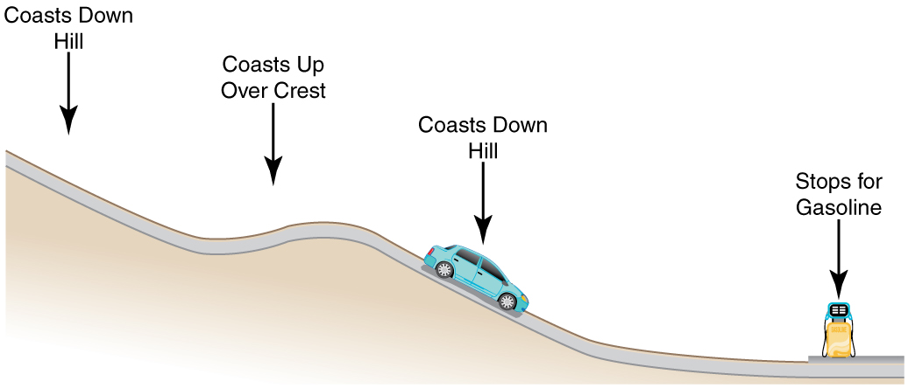

* Explain the law of the conservation of energy.
* Describe some of the many forms of energy.
* Define efficiency of an energy conversion process as the fraction left as useful energy or work, rather than being transformed, for example, into thermal energy.

# Law of Conservation of Energy

Energy, as we have noted, is conserved, making it one of the most important physical quantities in nature. The **law of conservation of energy**{: data-type="term" #import-auto-id2096012} can be stated as follows:

*Total energy is constant in any process. It may change in form or be transferred from one system to another, but the total remains the same.*

We have explored some forms of energy and some ways it can be transferred from one system to another. This exploration led to the definition of two major types of energy—mechanical energy <math xmlns="http://www.w3.org/1998/Math/MathML"><semantics><mrow><mrow><mfenced open="(" close=")"><mrow><mtext>KE</mtext><mo stretchy="false">+</mo><mtext>PE</mtext></mrow></mfenced></mrow><mrow /></mrow><annotation encoding="StarMath 5.0"> size 12{ left ("KE"+"PE" right )} {}</annotation></semantics></math>

 and energy transferred via work done by nonconservative forces <math xmlns="http://www.w3.org/1998/Math/MathML"><semantics><mrow><mrow><mrow><mo stretchy="false">(</mo><msub><mi>W</mi><mrow><mtext>nc</mtext></mrow></msub><mo stretchy="false">)</mo></mrow></mrow><mrow /></mrow><annotation encoding="StarMath 5.0"> size 12{ \( W rSub { size 8{"nc"} } \) } {}</annotation></semantics></math>

. But energy takes *many* other forms, manifesting itself in *many* different ways, and we need to be able to deal with all of these before we can write an equation for the above general statement of the conservation of energy.

# Other Forms of Energy than Mechanical Energy

At this point, we deal with all other forms of energy by lumping them into a single group called **other energy** (<math xmlns="http://www.w3.org/1998/Math/MathML"><semantics><mrow><mrow><mtext>OE</mtext></mrow><mrow /></mrow><annotation encoding="StarMath 5.0"> size 12{"OE"} {}</annotation></semantics></math>

). Then we can state the conservation of energy in equation form as

<math xmlns="http://www.w3.org/1998/Math/MathML"><semantics><mrow><mrow><mrow><mrow><mrow><mrow><mrow><msub><mtext>KE</mtext><mrow><mtext>i</mtext></mrow></msub><mo stretchy="false">+</mo><msub><mtext>PE</mtext><mrow><mtext>i</mtext></mrow></msub></mrow><mo stretchy="false">+</mo><msub><mi>W</mi><mrow><mtext>nc</mtext></mrow></msub></mrow><mo stretchy="false">+</mo><msub><mtext>OE</mtext><mrow><mtext>i</mtext></mrow></msub></mrow><mo stretchy="false">=</mo><mrow><mrow><msub><mtext>KE</mtext><mrow><mtext>f</mtext></mrow></msub><mo stretchy="false">+</mo><msub><mtext>PE</mtext><mrow><mtext>f</mtext></mrow></msub></mrow><mo stretchy="false">+</mo><msub><mtext>OE</mtext><mrow><mtext>f</mtext></mrow></msub></mrow></mrow></mrow><mrow><mtext>.</mtext></mrow></mrow><mrow /></mrow><annotation encoding="StarMath 5.0"> size 12{"KE" rSub { size 8{i} } +"PE" rSub { size 8{i} } +W rSub { size 8{"nc"} } +"OE" rSub { size 8{i} } ="KE" rSub { size 8{f} } +"PE" rSub { size 8{f} } +"OE" rSub { size 8{f} } } {}</annotation></semantics></math>

All types of energy and work can be included in this very general statement of conservation of energy. Kinetic energy is <math xmlns="http://www.w3.org/1998/Math/MathML"><semantics><mrow><mrow><mtext>KE</mtext></mrow><mrow /></mrow><annotation encoding="StarMath 5.0"> size 12{"KE"} {}</annotation></semantics></math>

, work done by a conservative force is represented by <math xmlns="http://www.w3.org/1998/Math/MathML"><semantics><mrow><mrow><mtext>PE</mtext></mrow><mrow /></mrow><annotation encoding="StarMath 5.0"> size 12{"PE"} {}</annotation></semantics></math>

, work done by nonconservative forces is <math xmlns="http://www.w3.org/1998/Math/MathML"><semantics><mrow><mrow><msub><mi>W</mi><mrow><mtext>nc</mtext></mrow></msub></mrow><mrow /></mrow><annotation encoding="StarMath 5.0"> size 12{W rSub { size 8{"nc"} } } {}</annotation></semantics></math>

, and all other energies are included as <math xmlns="http://www.w3.org/1998/Math/MathML"><semantics><mrow><mrow><mtext>OE</mtext></mrow><mrow /></mrow><annotation encoding="StarMath 5.0"> size 12{"OE"} {}</annotation></semantics></math>

. This equation applies to all previous examples; in those situations <math xmlns="http://www.w3.org/1998/Math/MathML"><semantics><mrow><mrow><mtext>OE</mtext></mrow><mrow /></mrow><annotation encoding="StarMath 5.0"> size 12{"OE"} {}</annotation></semantics></math>

 was constant, and so it subtracted out and was not directly considered.

Making Connections: Usefulness of the Energy Conservation Principle

The fact that energy is conserved and has many forms makes it very important. You will find that energy is discussed in many contexts, because it is involved in all processes. It will also become apparent that many situations are best understood in terms of energy and that problems are often most easily conceptualized and solved by considering energy.

When does <math xmlns="http://www.w3.org/1998/Math/MathML"><semantics><mrow><mrow><mtext>OE</mtext></mrow><mrow /></mrow><annotation encoding="StarMath 5.0"> size 12{"OE"} {}</annotation></semantics></math>

 play a role? One example occurs when a person eats. Food is oxidized with the release of carbon dioxide, water, and energy. Some of this chemical energy is converted to kinetic energy when the person moves, to potential energy when the person changes altitude, and to thermal energy (another form of <math xmlns="http://www.w3.org/1998/Math/MathML"><semantics><mrow><mrow><mtext>OE</mtext></mrow><mrow /></mrow><annotation encoding="StarMath 5.0"> size 12{"OE"} {}</annotation></semantics></math>

).

# Some of the Many Forms of Energy

What are some other forms of energy? You can probably name a number of forms of energy not yet discussed. Many of these will be covered in later chapters, but let us detail a few here. **Electrical energy**{: data-type="term" #import-auto-id2771762} is a common form that is converted to many other forms and does work in a wide range of practical situations. Fuels, such as gasoline and food, carry **chemical energy**{: data-type="term" #import-auto-id2094176} that can be transferred to a system through oxidation. Chemical fuel can also produce electrical energy, such as in batteries. Batteries can in turn produce light, which is a very pure form of energy. Most energy sources on Earth are in fact stored energy from the energy we receive from the Sun. We sometimes refer to this as **radiant energy**{: data-type="term" #import-auto-id2739439}, or electromagnetic radiation, which includes visible light, infrared, and ultraviolet radiation. **Nuclear energy**{: data-type="term" #import-auto-id2580734} comes from processes that convert measurable amounts of mass into energy. Nuclear energy is transformed into the energy of sunlight, into electrical energy in power plants, and into the energy of the heat transfer and blast in weapons. Atoms and molecules inside all objects are in random motion. This internal mechanical energy from the random motions is called **thermal energy**{: data-type="term" #import-auto-id2393416}, because it is related to the temperature of the object. These and all other forms of energy can be converted into one another and can do work.

[\[link\]](#import-auto-id2866785) gives the amount of energy stored, used, or released from various objects and in various phenomena. The range of energies and the variety of types and situations is impressive.

Problem-Solving Strategies for Energy

You will find the following problem-solving strategies useful whenever you deal with energy. The strategies help in organizing and reinforcing energy concepts. In fact, they are used in the examples presented in this chapter. The familiar general problem-solving strategies presented earlier—involving identifying physical principles, knowns, and unknowns, checking units, and so on—continue to be relevant here.

**Step 1.** Determine the system of interest and identify what information is given and what quantity is to be calculated. A sketch will help.

**Step 2.** Examine all the forces involved and determine whether you know or are given the potential energy from the work done by the forces. Then use step 3 or step 4.

**Step 3.** If you know the potential energies for the forces that enter into the problem, then forces are all conservative, and you can apply conservation of mechanical energy simply in terms of potential and kinetic energy. The equation expressing conservation of energy is

<math xmlns="http://www.w3.org/1998/Math/MathML"><semantics><mrow><mrow><mrow><mrow><msub><mtext>KE</mtext><mrow><mtext>i</mtext></mrow></msub><mo stretchy="false">+</mo><msub><mtext>PE</mtext><mrow><mtext>i</mtext></mrow></msub></mrow><mo stretchy="false">=</mo><mrow><msub><mtext>KE</mtext><mrow><mtext>f</mtext></mrow></msub><mo stretchy="false">+</mo><msub><mtext>PE</mtext><mrow><mtext>f</mtext></mrow></msub></mrow><mo>.</mo></mrow></mrow><mrow /></mrow><annotation encoding="StarMath 5.0"> size 12{"KE" rSub { size 8{i} } +"PE" rSub { size 8{i} } ="KE" rSub { size 8{f} } +"PE" rSub { size 8{f} } } {}</annotation></semantics></math>

**Step 4.** If you know the potential energy for only some of the forces, possibly because some of them are nonconservative and do not have a potential energy, or if there are other energies that are not easily treated in terms of force and work, then the conservation of energy law in its most general form must be used.

<math xmlns="http://www.w3.org/1998/Math/MathML"><semantics><mrow><mrow><mrow><mrow><mrow><mrow><mrow><msub><mtext>KE</mtext><mrow><mtext>i</mtext></mrow></msub><mo stretchy="false">+</mo><msub><mtext>PE</mtext><mrow><mtext>i</mtext></mrow></msub></mrow><mo stretchy="false">+</mo><msub><mi>W</mi><mrow><mtext>nc</mtext></mrow></msub></mrow><mo stretchy="false">+</mo><msub><mtext>OE</mtext><mrow><mtext>i</mtext></mrow></msub></mrow><mo stretchy="false">=</mo><mrow><mrow><msub><mtext>KE</mtext><mrow><mtext>f</mtext></mrow></msub><mo stretchy="false">+</mo><msub><mtext>PE</mtext><mrow><mtext>f</mtext></mrow></msub></mrow><mo stretchy="false">+</mo><msub><mtext>OE</mtext><mrow><mtext>f</mtext></mrow></msub></mrow></mrow></mrow><mrow><mtext>.</mtext></mrow></mrow><mrow /></mrow><annotation encoding="StarMath 5.0"> size 12{"KE" rSub { size 8{i} } +"PE" rSub { size 8{i} } +W rSub { size 8{"nc"} } +"OE" rSub { size 8{i} } ="KE" rSub { size 8{f} } +"PE" rSub { size 8{f} } +"OE" rSub { size 8{f} } } {}</annotation></semantics></math>

In most problems, one or more of the terms is zero, simplifying its solution. Do not calculate <math xmlns="http://www.w3.org/1998/Math/MathML"><semantics><mrow><mrow><msub><mi>W</mi><mrow><mn>c</mn></mrow></msub></mrow><mrow /></mrow><annotation encoding="StarMath 5.0"> size 12{W rSub { size 8{c} } } {}</annotation></semantics></math>

, the work done by conservative forces; it is already incorporated in the <math xmlns="http://www.w3.org/1998/Math/MathML"><semantics><mrow><mrow><mtext>PE</mtext></mrow><mrow /></mrow><annotation encoding="StarMath 5.0"> size 12{"PE"} {}</annotation></semantics></math>

 terms.

**Step 5.** You have already identified the types of work and energy involved (in step 2). Before solving for the unknown, *eliminate terms wherever possible* to simplify the algebra. For example, choose <math xmlns="http://www.w3.org/1998/Math/MathML"><semantics><mrow><mrow><mrow><mi>h</mi><mo stretchy="false">=</mo><mn>0</mn></mrow></mrow><mrow /></mrow><annotation encoding="StarMath 5.0"> size 12{h=0} {}</annotation></semantics></math>

 at either the initial or final point, so that <math xmlns="http://www.w3.org/1998/Math/MathML"><semantics><mrow><mrow><msub><mtext>PE</mtext><mrow><mtext>g</mtext></mrow></msub></mrow><mrow /></mrow><annotation encoding="StarMath 5.0"> size 12{"PE" rSub { size 8{g} } } {}</annotation></semantics></math>

 is zero there. Then solve for the unknown in the customary manner.

**Step 6.** *Check the answer to see if it is reasonable*. Once you have solved a problem, reexamine the forms of work and energy to see if you have set up the conservation of energy equation correctly. For example, work done against friction should be negative, potential energy at the bottom of a hill should be less than that at the top, and so on. Also check to see that the numerical value obtained is reasonable. For example, the final speed of a skateboarder who coasts down a 3-m-high ramp could reasonably be 20 km/h, but *not* 80 km/h.

# Transformation of Energy

The transformation of energy from one form into others is happening all the time. The chemical energy in food is converted into thermal energy through metabolism; light energy is converted into chemical energy through photosynthesis. In a larger example, the chemical energy contained in coal is converted into thermal energy as it burns to turn water into steam in a boiler. This thermal energy in the steam in turn is converted to mechanical energy as it spins a turbine, which is connected to a generator to produce electrical energy. (In all of these examples, not all of the initial energy is converted into the forms mentioned. This important point is discussed later in this section.)

Another example of energy conversion occurs in a solar cell. Sunlight impinging on a solar cell (see [\[link\]](#import-auto-id1626980)) produces electricity, which in turn can be used to run an electric motor. Energy is converted from the primary source of solar energy into electrical energy and then into mechanical energy.

 "){: #import-auto-id1626980 data-media-type="image/jpg"}

<table id="import-auto-id2866785" summary="A table listing various energies containing two columns. One column lists an object or a phenomenon and the corresponding cell in the next column lists the energy associated with the object or phenomenon in joules."><caption>Energy of Various Objects and Phenomena </caption><thead>
     <tr>
            <th>Object/phenomenon</th>
            <th>Energy in joules</th>
          </tr>
</thead><tbody>
          <tr>
            <td>Big Bang</td>
            <td>
              <math xmlns="http://www.w3.org/1998/Math/MathML" display="block">
                <semantics>
                  <mrow>
                    
                      <mrow>
                        <msup>
                          <mtext>10</mtext>
                          
                            <mrow>
                              <mtext>68</mtext>
                            </mrow>
                          
                        </msup>
                      </mrow>
                    
                    <mrow />
                  </mrow>
                  <annotation encoding="StarMath 5.0"> size 12{"10" rSup { size 8{"68"} } } {}</annotation>
                </semantics>
              </math> 
            </td>
          </tr>
          <tr>
            <td>Energy released in a supernova</td>
            <td>
              <math xmlns="http://www.w3.org/1998/Math/MathML" display="block">
                <semantics>
                  <mrow>
                    
                      <mrow>
                        <msup>
                          <mtext>10</mtext>
                          
                            <mrow>
                              <mtext>44</mtext>
                            </mrow>
                          
                        </msup>
                      </mrow>
                    
                    <mrow />
                  </mrow>
                  <annotation encoding="StarMath 5.0"> size 12{"10" rSup { size 8{"44"} } } {}</annotation>
                </semantics>
              </math> 
            </td>
          </tr>
          <tr>
            <td>Fusion of all the hydrogen in Earth’s oceans</td>
            <td>
              <math xmlns="http://www.w3.org/1998/Math/MathML" display="block">
                <semantics>
                  <mrow>
                    
                      <mrow>
                        <msup>
                          <mtext>10</mtext>
                          
                            <mrow>
                              <mtext>34</mtext>
                            </mrow>
                          
                        </msup>
                      </mrow>
                    
                    <mrow />
                  </mrow>
                  <annotation encoding="StarMath 5.0"> size 12{"10" rSup { size 8{"34"} } } {}</annotation>
                </semantics>
              </math> 
            </td>
          </tr>
          <tr>
            <td>Annual world energy use</td>
            <td>
              <math xmlns="http://www.w3.org/1998/Math/MathML" display="block">
                <semantics>
                  <mrow>
                    
                      <mrow>
                        <mrow>
                          <mn>4</mn>
                          <mi>×</mi>
                          <msup>
                            <mtext>10</mtext>
                            
                              <mrow>
                                <mtext>20</mtext>
                              </mrow>
                            
                          </msup>
                        </mrow>
                      </mrow>
                    
                    <mrow />
                  </mrow>
                  <annotation encoding="StarMath 5.0"> size 12{4 times "10" rSup { size 8{"20"} } } {}</annotation>
                </semantics>
              </math> 
            </td>
          </tr>
          <tr>
            <td>Large fusion bomb (9 megaton)</td>
            <td>
              <math xmlns="http://www.w3.org/1998/Math/MathML" display="block">
                <semantics>
                  <mrow>
                    
                      <mrow>
                        <mrow>
                          <mn>3</mn>
                          <mtext>.</mtext>
                          <mn>8</mn>
                          <mi>×</mi>
                          <msup>
                            <mtext>10</mtext>
                            
                              <mrow>
                                <mtext>16</mtext>
                              </mrow>
                            
                          </msup>
                        </mrow>
                      </mrow>
                    
                    <mrow />
                  </mrow>
                  <annotation encoding="StarMath 5.0"> size 12{3 "." 8 times "10" rSup { size 8{"16"} } } {}</annotation>
                </semantics>
              </math> 
            </td>
          </tr>
          <tr>
            <td>1 kg hydrogen (fusion to helium)</td>
            <td>
              <math xmlns="http://www.w3.org/1998/Math/MathML" display="block">
                <semantics>
                  <mrow>
                    
                      <mrow>
                        <mrow>
                          <mn>6</mn>
                          <mtext>.</mtext>
                          <mn>4</mn>
                          <mi>×</mi>
                          <msup>
                            <mtext>10</mtext>
                            
                              <mrow>
                                <mtext>14</mtext>
                              </mrow>
                            
                          </msup>
                        </mrow>
                      </mrow>
                    
                    <mrow />
                  </mrow>
                  <annotation encoding="StarMath 5.0"> size 12{6 "." 4 times "10" rSup { size 8{"14"} } } {}</annotation>
                </semantics>
              </math> 
            </td>
          </tr>
          <tr>
            <td>1 kg uranium (nuclear fission)</td>
            <td>
              <math xmlns="http://www.w3.org/1998/Math/MathML" display="block">
                <semantics>
                  <mrow>
                    
                      <mrow>
                        <mrow>
                          <mn>8</mn>
                          <mtext>.</mtext>
                          <mn>0</mn>
                          <mi>×</mi>
                          <msup>
                            <mtext>10</mtext>
                            
                              <mrow>
                                <mtext>13</mtext>
                              </mrow>
                            
                          </msup>
                        </mrow>
                      </mrow>
                    
                    <mrow />
                  </mrow>
                  <annotation encoding="StarMath 5.0"> size 12{8 "." 0 times "10" rSup { size 8{"13"} } } {}</annotation>
                </semantics>
              </math> 
            </td>
          </tr>
          <tr>
            <td>Hiroshima-size fission bomb (10 kiloton)</td>
            <td>
              <math xmlns="http://www.w3.org/1998/Math/MathML" display="block">
                <semantics>
                  <mrow>
                    
                      <mrow>
                        <mrow>
                          <mn>4</mn>
                          <mtext>.</mtext>
                          <mn>2</mn>
                          <mi>×</mi>
                          <msup>
                            <mtext>10</mtext>
                            
                              <mrow>
                                <mtext>13</mtext>
                              </mrow>
                            
                          </msup>
                        </mrow>
                      </mrow>
                    
                    <mrow />
                  </mrow>
                  <annotation encoding="StarMath 5.0"> size 12{4 "." 2 times "10" rSup { size 8{"13"} } } {}</annotation>
                </semantics>
              </math> 
            </td>
          </tr>
          <tr>
            <td>90,000-ton aircraft carrier at 30 knots</td>
            <td>
              <math xmlns="http://www.w3.org/1998/Math/MathML" display="block">
                <semantics>
                  <mrow>
                    
                      <mrow>
                        <mrow>
                          <mn>1</mn>
                          <mtext>.</mtext>
                          <mn>1</mn>
                          <mi>×</mi>
                          <msup>
                            <mtext>10</mtext>
                            
                              <mrow>
                                <mtext>10</mtext>
                              </mrow>
                            
                          </msup>
                        </mrow>
                      </mrow>
                    
                    <mrow />
                  </mrow>
                  <annotation encoding="StarMath 5.0"> size 12{1 "." 1 times "10" rSup { size 8{"10"} } } {}</annotation>
                </semantics>
              </math> 
            </td>
          </tr>
          <tr>
            <td>1 barrel crude oil</td>
            <td>
              <math xmlns="http://www.w3.org/1998/Math/MathML" display="block">
                <semantics>
                  <mrow>
                    
                      <mrow>
                        <mrow>
                          <mn>5</mn>
                          <mtext>.</mtext>
                          <mn>9</mn>
                          <mi>×</mi>
                          <msup>
                            <mtext>10</mtext>
                            
                              <mrow>
                                <mn>9</mn>
                              </mrow>
                            
                          </msup>
                        </mrow>
                      </mrow>
                    
                    <mrow />
                  </mrow>
                  <annotation encoding="StarMath 5.0"> size 12{5 "." 9 times "10" rSup { size 8{9} } } {}</annotation>
                </semantics>
              </math> 
            </td>
          </tr>
          <tr>
            <td>1 ton TNT</td>
            <td>
              <math xmlns="http://www.w3.org/1998/Math/MathML" display="block">
                <semantics>
                  <mrow>
                    
                      <mrow>
                        <mrow>
                          <mn>4</mn>
                          <mtext>.</mtext>
                          <mn>2</mn>
                          <mi>×</mi>
                          <msup>
                            <mtext>10</mtext>
                            
                              <mrow>
                                <mn>9</mn>
                              </mrow>
                            
                          </msup>
                        </mrow>
                      </mrow>
                    
                    <mrow />
                  </mrow>
                  <annotation encoding="StarMath 5.0"> size 12{4 "." 2 times "10" rSup { size 8{9} } } {}</annotation>
                </semantics>
              </math> 
            </td>
          </tr>
          <tr>
            <td>1 gallon of gasoline</td>
            <td>
              <math xmlns="http://www.w3.org/1998/Math/MathML" display="block">
                <semantics>
                  <mrow>
                    
                      <mrow>
                        <mrow>
                          <mn>1</mn>
                          <mtext>.</mtext>
                          <mn>2</mn>
                          <mi>×</mi>
                          <msup>
                            <mtext>10</mtext>
                            
                              <mrow>
                                <mn>8</mn>
                              </mrow>
                            
                          </msup>
                        </mrow>
                      </mrow>
                    
                    <mrow />
                  </mrow>
                  <annotation encoding="StarMath 5.0"> size 12{1 "." 2 times "10" rSup { size 8{8} } } {}</annotation>
                </semantics>
              </math> 
            </td>
          </tr>
          <tr>
            <td>Daily home electricity use (developed countries)</td>
            <td>
              <math xmlns="http://www.w3.org/1998/Math/MathML" display="block">
                <semantics>
                  <mrow>
                    
                      <mrow>
                        <mrow>
                          <mn>7</mn>
                          <mi>×</mi>
                          <msup>
                            <mtext>10</mtext>
                            
                              <mrow>
                                <mn>7</mn>
                              </mrow>
                            
                          </msup>
                        </mrow>
                      </mrow>
                    
                    <mrow />
                  </mrow>
                  <annotation encoding="StarMath 5.0"> size 12{7 times "10" rSup { size 8{7} } } {}</annotation>
                </semantics>
              </math> 
            </td>
          </tr>
          <tr>
            <td>Daily adult food intake (recommended)</td>
            <td>
              <math xmlns="http://www.w3.org/1998/Math/MathML" display="block">
                <semantics>
                  <mrow>
                    
                      <mrow>
                        <mrow>
                          <mn>1</mn>
                          <mtext>.</mtext>
                          <mn>2</mn>
                          <mi>×</mi>
                          <msup>
                            <mtext>10</mtext>
                            
                              <mrow>
                                <mn>7</mn>
                              </mrow>
                            
                          </msup>
                        </mrow>
                      </mrow>
                    
                    <mrow />
                  </mrow>
                  <annotation encoding="StarMath 5.0"> size 12{1 "." 2 times "10" rSup { size 8{7} } } {}</annotation>
                </semantics>
              </math> 
            </td>
          </tr>
          <tr>
            <td>1000-kg car at 90 km/h</td>
            <td>
              <math xmlns="http://www.w3.org/1998/Math/MathML" display="block">
                <semantics>
                  <mrow>
                    
                      <mrow>
                        <mrow>
                          <mn>3</mn>
                          <mtext>.</mtext>
                          <mn>1</mn>
                          <mi>×</mi>
                          <msup>
                            <mtext>10</mtext>
                            
                              <mrow>
                                <mn>5</mn>
                              </mrow>
                            
                          </msup>
                        </mrow>
                      </mrow>
                    
                    <mrow />
                  </mrow>
                  <annotation encoding="StarMath 5.0"> size 12{3 "." 1 times "10" rSup { size 8{5} } } {}</annotation>
                </semantics>
              </math> 
            </td>
          </tr>
          <tr>
            <td>1 g fat (9.3 kcal)</td>
            <td>
              <math xmlns="http://www.w3.org/1998/Math/MathML" display="block">
                <semantics>
                  <mrow>
                    
                      <mrow>
                        <mrow>
                          <mn>3</mn>
                          <mtext>.</mtext>
                          <mn>9</mn>
                          <mi>×</mi>
                          <msup>
                            <mtext>10</mtext>
                            
                              <mrow>
                                <mn>4</mn>
                              </mrow>
                            
                          </msup>
                        </mrow>
                      </mrow>
                    
                    <mrow />
                  </mrow>
                  <annotation encoding="StarMath 5.0"> size 12{3 "." 9 times "10" rSup { size 8{4} } } {}</annotation>
                </semantics>
              </math> 
            </td>
          </tr>
          <tr>
            <td>ATP hydrolysis reaction</td>
            <td>
              <math xmlns="http://www.w3.org/1998/Math/MathML" display="block">
                <semantics>
                  <mrow>
                    
                      <mrow>
                        <mrow>
                          <mn>3</mn>
                          <mtext>.</mtext>
                          <mn>2</mn>
                          <mi>×</mi>
                          <msup>
                            <mtext>10</mtext>
                            
                              <mrow>
                                <mn>4</mn>
                              </mrow>
                            
                          </msup>
                        </mrow>
                      </mrow>
                    
                    <mrow />
                  </mrow>
                  <annotation encoding="StarMath 5.0"> size 12{3 "." 2 times "10" rSup { size 8{4} } } {}</annotation>
                </semantics>
              </math> 
            </td>
          </tr>
          <tr>
            <td>1 g carbohydrate (4.1 kcal)</td>
            <td>
              <math xmlns="http://www.w3.org/1998/Math/MathML" display="block">
                <semantics>
                  <mrow>
                    
                      <mrow>
                        <mrow>
                          <mn>1</mn>
                          <mtext>.</mtext>
                          <mn>7</mn>
                          <mi>×</mi>
                          <msup>
                            <mtext>10</mtext>
                            
                              <mrow>
                                <mn>4</mn>
                              </mrow>
                            
                          </msup>
                        </mrow>
                      </mrow>
                    
                    <mrow />
                  </mrow>
                  <annotation encoding="StarMath 5.0"> size 12{1 "." 7 times "10" rSup { size 8{4} } } {}</annotation>
                </semantics>
              </math> 
            </td>
          </tr>
          <tr>
            <td>1 g protein (4.1 kcal)</td>
            <td>
              <math xmlns="http://www.w3.org/1998/Math/MathML" display="block">
                <semantics>
                  <mrow>
                    
                      <mrow>
                        <mrow>
                          <mn>1</mn>
                          <mtext>.</mtext>
                          <mn>7</mn>
                          <mi>×</mi>
                          <msup>
                            <mtext>10</mtext>
                            
                              <mrow>
                                <mn>4</mn>
                              </mrow>
                            
                          </msup>
                        </mrow>
                      </mrow>
                    
                    <mrow />
                  </mrow>
                  <annotation encoding="StarMath 5.0"> size 12{1 "." 7 times "10" rSup { size 8{4} } } {}</annotation>
                </semantics>
              </math> 
            </td>
          </tr>
          <tr>
            <td>Tennis ball at 100 km/h</td>
            <td>
<math xmlns="http://www.w3.org/1998/Math/MathML" display="block">
<mtext>22</mtext>
 </math>
</td>
          </tr>
          <tr>
            <td>Mosquito <math xmlns="http://www.w3.org/1998/Math/MathML"><semantics><mrow><mo>(</mo><msup><mn>10</mn><mn>–2</mn></msup><mspace width="0.25em" /><mn>g at 0.5 m/s</mn><mo>)</mo></mrow></semantics></math></td>
            <td>
              <math xmlns="http://www.w3.org/1998/Math/MathML" display="block">
                <semantics>
                  <mrow>
                    
                      <mrow>
                        <mrow>
                          <mn>1</mn>
                          <mtext>.</mtext>
                          <mn>3</mn>
                          <mi>×</mi>
                          <msup>
                            <mtext>10</mtext>
                            
                              <mrow>
                                <mrow>
                                  <mo stretchy="false">−</mo>
                                  <mn>6</mn>
                                </mrow>
                              </mrow>
                            
                          </msup>
                        </mrow>
                      </mrow>
                    
                    <mrow />
                  </mrow>
                  <annotation encoding="StarMath 5.0"> size 12{1 "." 3 times "10" rSup { size 8{-6} } } {}</annotation>
                </semantics>
              </math> 
            </td>
          </tr>
          <tr>
            <td>Single electron in a TV tube beam</td>
            <td>
              <math xmlns="http://www.w3.org/1998/Math/MathML" display="block">
                <semantics>
                  <mrow>
                    
                      <mrow>
                        <mrow>
                          <mn>4</mn>
                          <mtext>.</mtext>
                          <mn>0</mn>
                          <mi>×</mi>
                          <msup>
                            <mtext>10</mtext>
                            
                              <mrow>
                                <mrow>
                                  <mo stretchy="false">−</mo>
                                  <mtext>15</mtext>
                                </mrow>
                              </mrow>
                            
                          </msup>
                        </mrow>
                      </mrow>
                    
                    <mrow />
                  </mrow>
                  <annotation encoding="StarMath 5.0"> size 12{4 "." 0 times "10" rSup { size 8{-"15"} } } {}</annotation>
                </semantics>
              </math> 
            </td>
          </tr>

          <tr>
            <td>Energy to break one DNA strand</td>
            <td>
              <math xmlns="http://www.w3.org/1998/Math/MathML" display="block">
                <semantics>
                  <mrow>
                    
                      <mrow>
                        <msup>
                          <mtext>10</mtext>
                          
                            <mrow>
                              <mrow>
                                <mo stretchy="false">−</mo>
                                <mtext>19</mtext>
                              </mrow>
                            </mrow>
                          
                        </msup>
                      </mrow>
                    
                    <mrow />
                  </mrow>
                  <annotation encoding="StarMath 5.0"> size 12{"10" rSup { size 8{-"19"} } } {}</annotation>
                </semantics>
              </math> 
            </td>
          </tr>

        </tbody></table>

# Efficiency

Even though energy is conserved in an energy conversion process, the output of *useful energy* or work will be less than the energy input. The **efficiency**{: data-type="term" #import-auto-id2408157} <math xmlns="http://www.w3.org/1998/Math/MathML"><semantics><mrow><mrow><mstyle fontstyle="italic"><mrow><mtext>Eff</mtext></mrow></mstyle></mrow><mrow /></mrow><annotation encoding="StarMath 5.0"> size 12{ ital "Eff"} {}</annotation></semantics></math>

 of an energy conversion process is defined as

<math xmlns="http://www.w3.org/1998/Math/MathML"> <semantics> <mrow> <mrow> <mrow> <mtext>Efficiency </mtext> <mo stretchy="false">(</mo> <mstyle fontstyle="italic"> <mrow> <mtext>Eff</mtext> </mrow> </mstyle> <mrow> <mrow> <mo stretchy="false">)</mo> <mo stretchy="false">=</mo> <mfrac> <mtext>useful energy or work output</mtext> <mtext>total energy input</mtext> </mfrac> </mrow> <mo stretchy="false">=</mo> <mfrac> <msub> <mi>W</mi> <mrow> <mtext>out</mtext> </mrow> </msub> <msub> <mi>E</mi> <mrow> <mtext>in</mtext> </mrow> </msub> </mfrac> </mrow> <mtext>.</mtext> </mrow> </mrow> <mrow /> </mrow> <annotation encoding="StarMath 5.0"> size 12{"Efficiency " \( ital "Eff" \) = { {"useful energy or work output"} over {"total energy input"} } = { {W rSub { size 8{"out"} } } over {E rSub { size 8{"in"} } } } "." } {}</annotation> </semantics> </math>

[\[link\]](#import-auto-id1330125) lists some efficiencies of mechanical devices and human activities. In a coal-fired power plant, for example, about 40% of the chemical energy in the coal becomes useful electrical energy. The other 60% transforms into other (perhaps less useful) energy forms, such as thermal energy, which is then released to the environment through combustion gases and cooling towers.

<table id="import-auto-id1330125" summary="A table titled efficiency of the human body and mechanical devices, containing two columns. One column lists a human activity or a mechanical device and the corresponding cell in the next column lists the efficiency in percentage associated with the respective human activity or mechanical device."><caption>Efficiency of the Human Body and Mechanical Devices</caption><thead>
          <tr>
            <th>Activity/device</th>
            <th>Efficiency (%)
Representative values
</th>
          </tr>
        </thead><tbody>
          <tr>
            <td>Cycling and climbing</td>
            <td>20</td>
          </tr>
          <tr>
            <td>Swimming, surface</td>
            <td>2</td>
          </tr>
          <tr>
            <td>Swimming, submerged</td>
            <td>4</td>
          </tr>
          <tr>
            <td>Shoveling</td>
            <td>3</td>
          </tr>
          <tr>
            <td>Weightlifting</td>
            <td>9</td>
          </tr>
          <tr>
            <td>Steam engine</td>
            <td>17</td>
          </tr>
          <tr>
            <td>Gasoline engine</td>
            <td>30</td>
          </tr>
          <tr>
            <td>Diesel engine</td>
            <td>35</td>
          </tr>
          <tr>
            <td>Nuclear power plant</td>
            <td>35</td>
          </tr>
          <tr>
            <td>Coal power plant</td>
            <td>42</td>
          </tr>
          <tr>
            <td>Electric motor</td>
            <td>98</td>
          </tr>
          <tr>
            <td>Compact fluorescent light</td>
            <td>20</td>
          </tr>
          <tr>
            <td>Gas heater (residential)</td>
            <td>90</td>
          </tr>
          <tr>
            <td>Solar cell</td>
            <td>10</td>
          </tr>
                </tbody></table>

PhET Explorations: Masses and Springs

A realistic mass and spring laboratory. Hang masses from springs and adjust the spring stiffness and damping. You can even slow time. Transport the lab to different planets. A chart shows the kinetic, potential, and thermal energies for each spring.

<figure markdown="1" id="eip-id1637749">
<figcaption>
[Masses and Springs](mass-spring-lab_en.jar)
</figcaption>
 {: data-type="image"}  
</figure>

# Section Summary

* {: #import-auto-id1537867} The law of conservation of energy states that the total energy is constant in any process. Energy may change in form or be transferred from one system to another, but the total remains the same.
* {: #import-auto-id1839690} When all forms of energy are considered, conservation of energy is written in equation form as
  <math xmlns="http://www.w3.org/1998/Math/MathML"><semantics><mrow><mrow><mrow><mrow><mrow><mrow><msub><mtext>KE</mtext><mrow><mn>i</mn></mrow></msub><mo stretchy="false">+</mo><msub><mtext>PE</mtext><mrow><mn>i</mn></mrow></msub></mrow><mo stretchy="false">+</mo><msub><mi>W</mi><mrow><mtext>nc</mtext></mrow></msub></mrow><mo stretchy="false">+</mo><msub><mtext>OE</mtext><mrow><mn>i</mn></mrow></msub></mrow><mo stretchy="false">=</mo><mrow><mrow><msub><mtext>KE</mtext><mrow><mn>f</mn></mrow></msub><mo stretchy="false">+</mo><msub><mtext>PE</mtext><mrow><mn>f</mn></mrow></msub></mrow><mo stretchy="false">+</mo><msub><mtext>OE</mtext><mrow><mn>f</mn></mrow></msub></mrow></mrow></mrow><mrow /></mrow><annotation encoding="StarMath 5.0"> size 12{"KE" rSub { size 8{i} } +"PE" rSub { size 8{i} } +W rSub { size 8{"nc"} } +"OE" rSub { size 8{i} } ="KE" rSub { size 8{f} } +"PE" rSub { size 8{f} } +"OE" rSub { size 8{f} } } {}</annotation></semantics></math>
  
  , where
  <math xmlns="http://www.w3.org/1998/Math/MathML"><semantics><mrow><mrow><mtext>OE</mtext></mrow><mrow /></mrow><annotation encoding="StarMath 5.0"> size 12{"OE"} {}</annotation></semantics></math>
  
  is all **other forms of energy** besides mechanical energy.
* {: #import-auto-id1317294} Commonly encountered forms of energy include electric energy, chemical energy, radiant energy, nuclear energy, and thermal energy.
* {: #import-auto-id1787512} Energy is often utilized to do work, but it is not possible to convert all the energy of a system to work.
* {: #import-auto-id1628394} The efficiency
  <math xmlns="http://www.w3.org/1998/Math/MathML"><semantics><mrow><mrow><mstyle fontstyle="italic"><mrow><mtext>Eff</mtext></mrow></mstyle></mrow><mrow /></mrow><annotation encoding="StarMath 5.0"> size 12{ ital "Eff"} {}</annotation></semantics></math>
  
  of a machine or human is defined to be
  <math xmlns="http://www.w3.org/1998/Math/MathML"><semantics><mrow><mrow><mrow><mstyle fontstyle="italic"><mrow><mtext>Eff</mtext></mrow></mstyle><mo stretchy="false">=</mo><mfrac><msub><mi>W</mi><mrow><mtext>out</mtext></mrow></msub><msub><mi>E</mi><mrow><mtext>in</mtext></mrow></msub></mfrac></mrow></mrow><mrow /></mrow><annotation encoding="StarMath 5.0"> size 12{ ital "Eff"= { {W rSub { size 8{"out"} } } over {E rSub { size 8{"in"} } } } } {}</annotation></semantics></math>
  
  , where
  <math xmlns="http://www.w3.org/1998/Math/MathML"><semantics><mrow><mrow><msub><mi>W</mi><mrow><mtext>out</mtext></mrow></msub></mrow><mrow /></mrow><annotation encoding="StarMath 5.0"> size 12{W rSub { size 8{"out"} } } {}</annotation></semantics></math>
  
   is useful work output and
  <math xmlns="http://www.w3.org/1998/Math/MathML"><semantics><mrow><mrow><msub><mi>E</mi><mrow><mtext>in</mtext></mrow></msub></mrow><mrow /></mrow><annotation encoding="StarMath 5.0"> size 12{E rSub { size 8{"in"} } } {}</annotation></semantics></math>
  
   is the energy consumed.

# Conceptual Questions

Consider the following scenario. A car for which friction is *not* negligible accelerates from rest down a hill, running out of gasoline after a short distance. The driver lets the car coast farther down the hill, then up and over a small crest. He then coasts down that hill into a gas station, where he brakes to a stop and fills the tank with gasoline. Identify the forms of energy the car has, and how they are changed and transferred in this series of events. (See [[link]](#import-auto-id2100801).)

{: #import-auto-id2100801 data-media-type="image/jpg"}

Describe the energy transfers and transformations for a javelin, starting from the point at which an athlete picks up the javelin and ending when the javelin is stuck into the ground after being thrown.

Do devices with efficiencies of less than one violate the law of conservation of energy? Explain.

List four different forms or types of energy. Give one example of a conversion from each of these forms to another form.

List the energy conversions that occur when riding a bicycle.

# Problems &amp; Exercises

Using values from [[link]](#import-auto-id2866785), how many DNA molecules could be broken by the energy carried by a single electron in the beam of an old-fashioned TV tube? (These electrons were not dangerous in themselves, but they did create dangerous x rays. Later model tube TVs had shielding that absorbed x rays before they escaped and exposed viewers.)

<math xmlns="http://www.w3.org/1998/Math/MathML"> <semantics> <mrow> <mrow> <mrow> <mn>4</mn> <mi>×</mi> <msup> <mtext>10</mtext> <mrow> <mn>4</mn> </mrow> </msup> <mtext> molecules</mtext> </mrow> </mrow> <mrow /> </mrow> <annotation encoding="StarMath 5.0"> size 12{4 times "10" rSup { size 8{4} } " molecules"} {}</annotation> </semantics> </math>

Using energy considerations and assuming negligible air resistance, show that a rock thrown from a bridge 20.0 m above water with an initial speed of 15.0 m/s strikes the water with a speed of 24.8 m/s independent of the direction thrown.

Equating <math xmlns="http://www.w3.org/1998/Math/MathML"><semantics><mrow><mrow><mrow><msub><mtext>ΔPE</mtext><mrow><mn>g</mn></mrow></msub></mrow></mrow><mrow /></mrow><annotation encoding="StarMath 5.0"> size 12{Δ"PE" rSub { size 8{g} } } {}</annotation></semantics></math>

 and <math xmlns="http://www.w3.org/1998/Math/MathML"><semantics><mrow><mrow><mrow><mtext>ΔKE</mtext></mrow></mrow><mrow /></mrow><annotation encoding="StarMath 5.0"> size 12{Δ"KE"} {}</annotation></semantics></math>

, we obtain <math xmlns="http://www.w3.org/1998/Math/MathML"><semantics><mrow><mrow><mrow><mrow><mrow><mrow><mi>v</mi><mo stretchy="false">=</mo><msqrt><mrow><mn>2</mn><mrow><mstyle fontstyle="italic"><mrow><mtext>gh</mtext></mrow></mstyle> <mo stretchy="false">+</mo><msup> <msub><mi>v</mi><mrow><mn>0</mn></mrow></msub><mrow><mn>2</mn></mrow></msup></mrow></mrow></msqrt></mrow><mo stretchy="false">=</mo><msqrt><mrow><mn>2</mn><mo stretchy="false">(</mo><mtext>9.80 m</mtext><msup><mtext>/s</mtext><mrow><mn>2</mn></mrow></msup><mo stretchy="false">)</mo><mo stretchy="false">(</mo><mtext>20.0 m</mtext><mrow><mo stretchy="false">)</mo><mo stretchy="false">+</mo><mo stretchy="false">(</mo></mrow><mtext>15.0 m/s</mtext><msup><mo stretchy="false">)</mo><mrow><mn>2</mn></mrow></msup></mrow></msqrt></mrow><mo stretchy="false">=</mo><mtext>24.8 m/s</mtext></mrow></mrow></mrow><mrow /></mrow><annotation encoding="StarMath 5.0"> size 12{v= sqrt {2 ital "gh"+v rSub { size 8{0} rSup { size 8{2} } } } = sqrt {2 \( 9 "." "80"" m/s" rSup { size 8{2} } \) \( "20" "." 0" m" \) + \( "15" "." "0 m/s" \) rSup { size 8{2} } } ="24" "." 8" m/s"} {}</annotation></semantics></math>

If the energy in fusion bombs were used to supply the energy needs of the world, how many of the 9-megaton variety would be needed for a year’s supply of energy (using data from [[link]](#import-auto-id2866785))? This is not as far-fetched as it may sound—there are thousands of nuclear bombs, and their energy can be trapped in underground explosions and converted to electricity, as natural geothermal energy is.

(a) Use of hydrogen fusion to supply energy is a dream that may be realized in the next century. Fusion would be a relatively clean and almost limitless supply of energy, as can be seen from [[link]](#import-auto-id2866785). To illustrate this, calculate how many years the present energy needs of the world could be supplied by one millionth of the oceans’ hydrogen fusion energy. (b) How does this time compare with historically significant events, such as the duration of stable economic systems?

(a) <math xmlns="http://www.w3.org/1998/Math/MathML"><semantics><mrow><mrow><mrow><mrow><mtext>25</mtext><mo stretchy="false">×</mo><msup><mtext>10</mtext><mrow><mn>6</mn></mrow></msup></mrow><mspace width="0.25em" /><mtext>years</mtext></mrow></mrow><mrow /></mrow><annotation encoding="StarMath 5.0"> size 12{"25" times "10" rSup { size 8{6} } `"years"} {}</annotation></semantics></math>

(b) This is much, much longer than human time scales.

