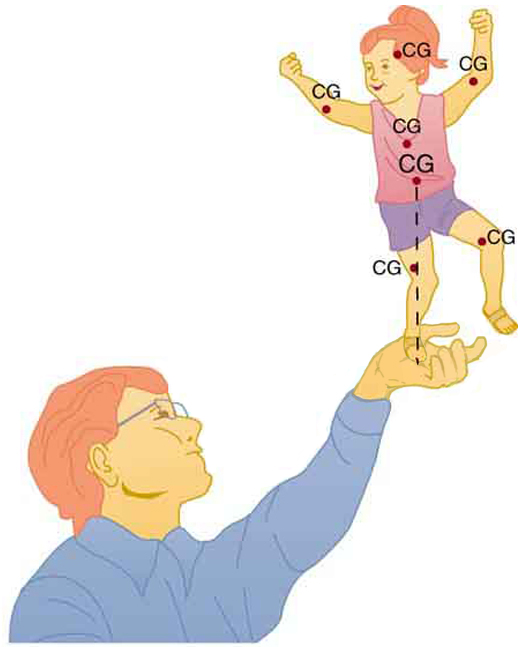
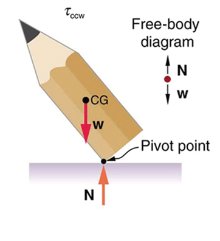
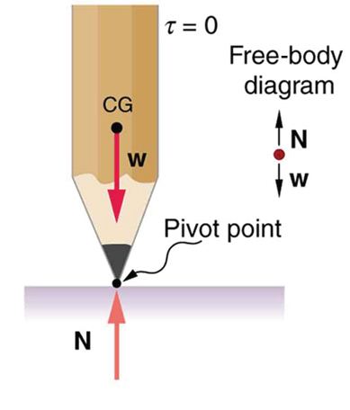
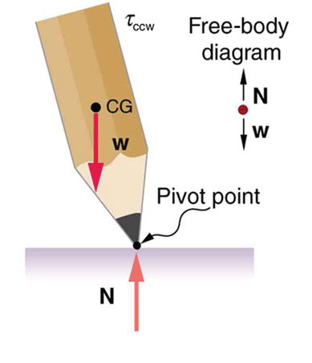

* State the types of equilibrium.
* Describe stable and unstable equilibriums.
* Describe neutral equilibrium.

It is one thing to have a system in equilibrium; it is quite another for it to be stable. The toy doll perched on the man’s hand in [\[link\]](#import-auto-id3549449), for example, is not in stable equilibrium. There are *three types of equilibrium*\: *stable*, *unstable*, and *neutral*. Figures throughout this module illustrate various examples.

[\[link\]](#import-auto-id3549449)**** presents ****a balanced system, such as the toy doll on the man’s hand, which has its center of gravity (cg) directly over the pivot, so that the torque of the total weight is zero. This is equivalent to having the torques of the individual parts balanced about the pivot point, in this case the hand. The cgs of the arms, legs, head, and torso are labeled with smaller type.

{: #import-auto-id3549449}

A system is said to be in **stable equilibrium**{: data-type="term" #import-auto-id2720918}**** if, when displaced from equilibrium, it experiences a net force or torque in a direction opposite to the direction of the displacement. For example, a marble at the bottom of a bowl will experience a *restoring* force when displaced from its equilibrium position. This force moves it back toward the equilibrium position. Most systems are in stable equilibrium, especially for small displacements. For another example of stable equilibrium, see the pencil in [\[link\]](#import-auto-id1425416).

{: #import-auto-id1425416}

A system is in **unstable equilibrium**{: data-type="term"} if, when displaced, it experiences a net force or torque in the *same* direction as the displacement from equilibrium. A system in unstable equilibrium accelerates away from its equilibrium position if displaced even slightly. An obvious example is a ball resting on top of a hill. Once displaced, it accelerates away from the crest. See the next several figures for examples of unstable equilibrium.

, it is no longer in equilibrium. Its weight produces a clockwise torque that returns the pencil to its equilibrium position."){: #import-auto-id2803696}

{: #import-auto-id1373481}

{: #import-auto-id1373427}

{: #eip-id1165317514478}

A system is in **neutral equilibrium**{: data-type="term"} if its equilibrium is independent of displacements from its original position. A marble on a flat horizontal surface is an example. Combinations of these situations are possible. For example, a marble on a saddle is stable for displacements toward the front or back of the saddle and unstable for displacements to the side. [\[link\]](#eip-id1469477) shows another example of neutral equilibrium.

![In figure a,  a ball is lying on a flat surface and the point of contact with the surface is labeled pivot point. The weight of the ball is acting at the center of gravity of the ball. The normal force N is in the same line as the weight of the ball. The torque on the ball is zero. In figure b, a side view of a pencil lying flat on a table is shown. The sharp end of the pencil is toward right. The weight of the pencil is acting at the center of gravity of the pencil. The normal reaction N of the table surface is in the same line of action as the weight but in the upward direction.](../resources/Figure_10_03_04a.jpg "(a) Here we see neutral equilibrium. The cg of a sphere on a flat surface lies directly above the point of support, independent of the position on the surface. The sphere is therefore in equilibrium in any location, and if displaced, it will remain put. (b) Because it has a circular cross section, the pencil is in neutral equilibrium for displacements perpendicular to its length."){: #eip-id1469477}

When we consider how far a system in stable equilibrium can be displaced before it becomes unstable, we find that some systems in stable equilibrium are more stable than others. The pencil in [\[link\]](#import-auto-id1425416) and the person in [\[link\]](#import-auto-id3049283)(a) are in stable equilibrium, but become unstable for relatively small displacements to the side. The critical point is reached when the cg is no longer *above* the base of support. Additionally, since the cg of a person’s body is above the pivots in the hips, displacements must be quickly controlled. This control is a central nervous system function that is developed when we learn to hold our bodies erect as infants. For increased stability while standing, the feet should be spread apart, giving a larger base of support. Stability is also increased by lowering one’s center of gravity by bending the knees, as when a football player prepares to receive a ball or braces themselves for a tackle. A cane, a crutch, or a walker increases the stability of the user, even more as the base of support widens. Usually, the cg of a female is lower (closer to the ground) than a male. Young children have their center of gravity between their shoulders, which increases the challenge of learning to walk.

![Part a of the figure shows a man standing on the ground. The feet are a shoulder-width apart from each other. The weight W of the man is acting at the center of gravity of the body of the man. Two normal reactions N each are shown acting on the feet of the man. The distance between the feet of the man is marked as the base of support. A free body diagram is also shown on the left side of the figure.  Part b of the figure shows a man standing upright with his knees bent. The feet are a distance apart from each other. The weight W of the man is acting at the center of gravity of the body of the man. Two normal reactions N each are shown acting on the feet of the man. The distance between the feet of the man is marked as the base of support.](../resources/Figure_10_03_05a.jpg "(a) The  center of gravity of an adult is above the hip joints (one of the main pivots in the body) and lies between two narrowly-separated feet. Like a pencil standing on its eraser, this person is in stable equilibrium in relation to sideways displacements, but relatively small displacements take his cg outside the base of support and make him unstable. Humans are less stable relative to forward and backward displacements because the feet are not very long. Muscles are used extensively to balance the body in the front-to-back direction. (b) While bending in the manner shown, stability is increased by lowering the center of gravity. Stability is also increased if the base is expanded by placing the feet farther apart."){: #import-auto-id3049283}

Animals such as chickens have easier systems to control. [\[link\]](#import-auto-id3038931) shows that the cg of a chicken lies below its hip joints and between its widely separated and broad feet. Even relatively large displacements of the chicken’s cg are stable and result in restoring forces and torques that return the cg to its equilibrium position with little effort on the chicken’s part. Not all birds are like chickens, of course. Some birds, such as the flamingo, have balance systems that are almost as sophisticated as that of humans.

[\[link\]](#import-auto-id3038931) shows that the cg of a chicken is below the hip joints and lies above a broad base of support formed by widely-separated and large feet. Hence, the chicken is in very stable equilibrium, since a relatively large displacement is needed to render it unstable. The body of the chicken is supported from above by the hips and acts as a pendulum between the hips. Therefore, the chicken is stable for front-to-back displacements as well as for side-to-side displacements.

 {: #import-auto-id3038931}

Engineers and architects strive to achieve extremely stable equilibriums for buildings and other systems that must withstand wind, earthquakes, and other forces that displace them from equilibrium. Although the examples in this section emphasize gravitational forces, the basic conditions for equilibrium are the same for all types of forces. The net external force must be zero, and the net torque must also be zero.

Take-Home Experiment

Stand straight with your heels, back, and head against a wall. Bend forward from your waist, keeping your heels and bottom against the wall, to touch your toes. Can you do this without toppling over? Explain why and what you need to do to be able to touch your toes without losing your balance. Is it easier for a woman to do this?

### Section Summary

* {: #import-auto-id2997403} A system is said to be in stable equilibrium if, when displaced from equilibrium, it experiences a net force or torque in a direction opposite the direction of the displacement.
* {: #import-auto-id1375503} A system is in unstable equilibrium if, when displaced from equilibrium, it experiences a net force or torque in the same direction as the displacement from equilibrium.
* {: #import-auto-id1189194} A system is in neutral equilibrium if its equilibrium is independent of displacements from its original position.

### Conceptual Questions

A round pencil lying on its side as in [[link]](#import-auto-id1373481) is in neutral equilibrium relative to displacements perpendicular to its length. What is its stability relative to displacements parallel to its length?

Explain the need for tall towers on a suspension bridge to ensure stable equilibrium.

### Problems &amp; Exercises

Suppose a horse leans against a wall as in [[link]](#import-auto-id3087934). Calculate the force exerted on the wall assuming that force is horizontal while using the data in the schematic representation of the situation. Note that the force exerted on the wall is equal in magnitude and opposite in direction to the force exerted on the horse, keeping it in equilibrium. The total mass of the horse and rider is 500 kg. Take the data to be accurate to three digits.

![In part a, a horse is standing next to a wall with its legs crossed. A sleepy-looking rider is leaning against the wall. Part b is a drawing of the same horse from a rear view, but this time with no rider.  The horse is crossing its rear legs, and its rump is leaning against the wall. The reaction of the wall F is acting on the horse at a height one point two meters above the ground. The weight of the horse is acting at its center of gravity near the base of the tail. The center of gravity is one point four meters above the ground. The line of action of weight is zero point three five meters away from the feet of the horse.](../resources/Figure_10_03_07a.jpg){: #import-auto-id3087934}

<math xmlns="http://www.w3.org/1998/Math/MathML"> <semantics> <mrow> <mrow> <mrow> <mrow> <msub> <mi>F</mi> <mrow> <mtext>wall</mtext> </mrow> </msub> <mo stretchy="false">=</mo> <mrow> <mn>1.43</mn> </mrow> </mrow> <mrow> <mi /> <mo stretchy="false">×</mo> </mrow> <msup> <mtext>10</mtext> <mrow> <mn>3</mn> </mrow> </msup> <mspace width="0.25em" /> <mtext>N</mtext> </mrow> </mrow> </mrow> <annotation encoding="StarMath 5.0"> size 12{F rSub { size 8{"wall"} } =1 cdot "43"` times `"10" rSup { size 8{3} } `N} {}</annotation> </semantics> </math>

Two children of mass 20.0 kg and 30.0 kg sit balanced on a seesaw with the pivot point located at the center of the seesaw. If the children are separated by a distance of 3.00 m, at what distance from the pivot point is the small child sitting in order to maintain the balance?

(a) Calculate the magnitude and direction of the force on each foot of the horse in [[link]](#import-auto-id3087934) (two are on the ground), assuming the center of mass of the horse is midway between the feet. The total mass of the horse and rider is 500kg. (b) What is the minimum coefficient of friction between the hooves and ground? Note that the force exerted by the wall is horizontal.

a) <math xmlns="http://www.w3.org/1998/Math/MathML"><semantics><mrow><mtext>2.55</mtext><msup><mn>×10</mn><mn>3</mn></msup><mspace width="0.25em" /><mtext> N, 16.3º to the left of vertical (i.e., toward the wall)</mtext></mrow><annotation encoding="StarMath 5.0"> size 12{θ} {}</annotation></semantics></math>

b) 0.292

A person carries a plank of wood 2.00 m long with one hand pushing down on it at one end with a force <math xmlns="http://www.w3.org/1998/Math/MathML"><semantics><mrow><mrow><msub><mtext>F</mtext><mrow><mn>1</mn></mrow></msub></mrow><mrow /></mrow><annotation encoding="StarMath 5.0"> size 12{F rSub { size 8{1} } } {}</annotation></semantics></math>

 and the other hand holding it up at .500 m from the end of the plank with force <math xmlns="http://www.w3.org/1998/Math/MathML"><semantics><mrow><mrow><msub><mtext>F</mtext><mrow><mn>2</mn></mrow></msub></mrow><mrow /></mrow><annotation encoding="StarMath 5.0"> size 12{F rSub { size 8{2} } } {}</annotation></semantics></math>

. If the plank has a mass of 20.0 kg and its center of gravity is at the middle of the plank, what are the magnitudes of the forces <math xmlns="http://www.w3.org/1998/Math/MathML"><semantics><mrow><mrow><msub><mtext>F</mtext><mrow><mn>1</mn></mrow></msub></mrow><mrow /></mrow></semantics></math>

 and <math xmlns="http://www.w3.org/1998/Math/MathML"><semantics><mrow><mrow><msub><mtext>F</mtext><mrow><mn>2</mn></mrow></msub></mrow><mrow /></mrow><annotation encoding="StarMath 5.0"> size 12{F rSub { size 8{2} } } {}</annotation></semantics></math>

?

A 17.0-m-high and 11.0-m-long wall under construction and its bracing are shown in [[link]](#import-auto-id3104849). The wall is in stable equilibrium without the bracing but can pivot at its base. Calculate the force exerted by each of the 10 braces if a strong wind exerts a horizontal force of 650 N on each square meter of the wall. Assume that the net force from the wind acts at a height halfway up the wall and that all braces exert equal forces parallel to their lengths. Neglect the thickness of the wall.

{: #import-auto-id3104849}

<math xmlns="http://www.w3.org/1998/Math/MathML"> <semantics> <mrow> <mrow> <mrow> <mrow> <msub> <mi>F</mi> <mrow> <mtext>B</mtext> </mrow> </msub> <mo stretchy="false">=</mo> <mrow> <mrow> <mn>2.12</mn> </mrow> <mo stretchy="false">×</mo> <msup> <mtext>10</mtext> <mrow> <mn>4</mn> </mrow> </msup> </mrow> </mrow> <mspace width="0.25em" /> <mtext>N</mtext> </mrow> </mrow> <mrow /> </mrow> <annotation encoding="StarMath 5.0"> size 12{F rSub { size 8{B} } =2 cdot "12" times "10" rSup { size 8{4} } `N} {}</annotation> </semantics> </math>

(a) What force must be exerted by the wind to support a 2.50-kg chicken in the position shown in [[link]](#import-auto-id2601839)? (b) What is the ratio of this force to the chicken’s weight? (c) Does this support the contention that the chicken has a relatively stable construction?

{: #import-auto-id2601839}

Suppose the weight of the drawbridge in [[link]](#import-auto-id2806088) is supported entirely by its hinges and the opposite shore, so that its cables are slack. (a) What fraction of the weight is supported by the opposite shore if the point of support is directly beneath the cable attachments? (b) What is the direction and magnitude of the force the hinges exert on the bridge under these circumstances? The mass of the bridge is 2500 kg.

, its weight (w size 12{w} {}), and the tension in its wires (T size 12{T} {})."){: #import-auto-id2806088}

a) 0.167, or about one-sixth of the weight is supported by the opposite shore.

b) <math xmlns="http://www.w3.org/1998/Math/MathML"><semantics><mrow><mrow><mrow><mrow><mi>F</mi><mo stretchy="false">=</mo><mn>2</mn></mrow><mtext>.</mtext><mrow><mn>0</mn><mo stretchy="false">×</mo><msup><mtext>10</mtext><mrow><mn>4</mn></mrow></msup></mrow><mspace width="0.25em" /><mtext>N</mtext></mrow></mrow><mrow /></mrow><annotation encoding="StarMath 5.0"> size 12{F=2 "." 0 times "10" rSup { size 8{4} } N} {}</annotation></semantics></math>

, straight up.

Suppose a 900-kg car is on the bridge in [[link]](#import-auto-id2806088) with its center of mass halfway between the hinges and the cable attachments. (The bridge is supported by the cables and hinges only.) (a) Find the force in the cables. (b) Find the direction and magnitude of the force exerted by the hinges on the bridge.

A sandwich board advertising sign is constructed as shown in [[link]](#import-auto-id803062). The sign’s mass is 8.00 kg. (a) Calculate the tension in the chain assuming no friction between the legs and the sidewalk. (b) What force is exerted by each side on the hinge?

{: #import-auto-id803062}

a) 21.6 N

b) 21.6 N

(a) What minimum coefficient of friction is needed between the legs and the ground to keep the sign in [[link]](#import-auto-id803062) in the position shown if the chain breaks? (b) What force is exerted by each side on the hinge?

A gymnast is attempting to perform splits. From the information given in [[link]](#import-auto-id3517398), calculate the magnitude and direction of the force exerted on each foot by the floor.

{: #import-auto-id3517398}

350 N directly upwards

### Glossary
{: data-type="glossary-title"}

neutral equilibrium
: a state of equilibrium that is independent of a system’s displacements from its original position
{: #import-auto-id1245467}

stable equilibrium
: a system, when displaced, experiences a net force or torque in a direction opposite to the direction of the displacement
{: #import-auto-id2729973}

unstable equilibrium
: a system, when displaced, experiences a net force or torque in the same direction as the displacement from equilibrium
{: #import-auto-id2867216}

