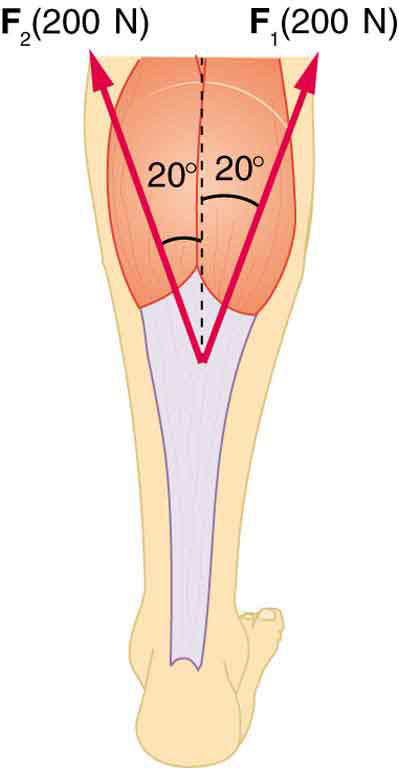

* Explain the forces exerted by muscles.
* State how a bad posture causes back strain.
* Discuss the benefits of skeletal muscles attached close to joints.
* Discuss various complexities in the real system of muscles, bones, and joints.

Muscles, bones, and joints are some of the most interesting applications of statics. There are some surprises. Muscles, for example, exert far greater forces than we might think. [\[link\]](#import-auto-id2793101) shows a forearm holding a book and a schematic diagram of an analogous lever system. The schematic is a good approximation for the forearm, which looks more complicated than it is, and we can get some insight into the way typical muscle systems function by analyzing it.

Muscles can only contract, so they occur in pairs. In the arm, the biceps muscle is a flexor—that is, it closes the limb. The triceps muscle is an extensor that opens the limb. This configuration is typical of skeletal muscles, bones, and joints in humans and other vertebrates. Most skeletal muscles exert much larger forces within the body than the limbs apply to the outside world. The reason is clear once we realize that most muscles are attached to bones via tendons close to joints, causing these systems to have mechanical advantages much less than one. Viewing them as simple machines, the input force is much greater than the output force, as seen in [\[link\]](#import-auto-id2793101).

![A forearm of a person holding a physics book is shown. The biceps and triceps muscles of the arm are visible. The elbow joint is the pivot point. The upper part of the arm is vertical and the lower part is horizontal. Biceps muscles are applying a force F B upward. The vertical bone of hand exerts a force F E on the pivot. At the midpoint of the lower part of the hand, the center of gravity of the hand is shown where the weight of the hand acts. The midpoint of the front face of the book is its center of gravity, where its weight acts downward. A free body diagram is also shown and the distances of the three forces F-B, C-G of arm, and C-G of book from the pivot are shown as r one, r two and r three.](../resources/Figure_10_06_01a.jpg "(a) The figure shows the forearm of a person holding a book. The biceps exert a force &#10; &#10;    &#10;     F&#10;     B&#10;    &#10; &#10;&#10;&#10;to support the weight of the forearm and the book. The triceps are assumed to be relaxed. (b) Here, you can view an approximately equivalent mechanical system with the pivot at the elbow joint as seen in [link]."){: #import-auto-id2793101}

Muscles Exert Bigger Forces Than You Might Think

Calculate the force the biceps muscle must exert to hold the forearm and its load as shown in [\[link\]](#import-auto-id2793101), and compare this force with the weight of the forearm plus its load. You may take the data in the figure to be accurate to three significant figures.

**Strategy**

There are four forces acting on the forearm and its load (the system of interest). The magnitude of the force of the biceps is <math xmlns="http://www.w3.org/1998/Math/MathML"><semantics><mrow><mrow><msub><mi>F</mi><mrow><mtext>B</mtext></mrow></msub></mrow><mrow /></mrow><annotation encoding="StarMath 5.0"> size 12{F rSub { size 8{B} } } {}</annotation></semantics></math>

; that of the elbow joint is <math xmlns="http://www.w3.org/1998/Math/MathML"><semantics><mrow><mrow><msub><mi>F</mi><mrow><mtext>E</mtext></mrow></msub></mrow><mrow /></mrow><annotation encoding="StarMath 5.0"> size 12{F rSub { size 8{E} } } {}</annotation></semantics></math>

; that of the weights of the forearm is <math xmlns="http://www.w3.org/1998/Math/MathML"><semantics><mrow><mrow><msub><mi>w</mi><mrow><mtext>a</mtext></mrow></msub></mrow><mrow /></mrow><annotation encoding="StarMath 5.0"> size 12{w rSub { size 8{a} } } {}</annotation></semantics></math>

, and its load is <math xmlns="http://www.w3.org/1998/Math/MathML"><semantics><mrow><mrow><msub><mi>w</mi><mrow><mtext>b</mtext></mrow></msub></mrow><mrow /></mrow><annotation encoding="StarMath 5.0"> size 12{w rSub { size 8{b} } } {}</annotation></semantics></math>

. Two of these are unknown (<math xmlns="http://www.w3.org/1998/Math/MathML"><semantics><mrow><mrow><msub><mi>F</mi><mrow><mtext>B</mtext></mrow></msub></mrow><mrow /></mrow><annotation encoding="StarMath 5.0"> size 12{F rSub { size 8{B} } } {}</annotation></semantics></math>

 and <math xmlns="http://www.w3.org/1998/Math/MathML"><semantics><mrow><mrow><msub><mi>F</mi><mrow><mtext>E</mtext></mrow></msub></mrow><mrow /></mrow><annotation encoding="StarMath 5.0"> size 12{F rSub { size 8{E} } } {}</annotation></semantics></math>

), so that the first condition for equilibrium cannot by itself yield <math xmlns="http://www.w3.org/1998/Math/MathML"><semantics><mrow><mrow><msub><mi>F</mi><mrow><mtext>B</mtext></mrow></msub></mrow><mrow /></mrow><annotation encoding="StarMath 5.0"> size 12{F rSub { size 8{B} } } {}</annotation></semantics></math>

. But if we use the second condition and choose the pivot to be at the elbow, then the torque due to <math xmlns="http://www.w3.org/1998/Math/MathML"><semantics><mrow><mrow><msub><mi>F</mi><mrow><mtext>E</mtext></mrow></msub></mrow><mrow /></mrow><annotation encoding="StarMath 5.0"> size 12{F rSub { size 8{E} } } {}</annotation></semantics></math>

 is zero, and the only unknown becomes <math xmlns="http://www.w3.org/1998/Math/MathML"><semantics><mrow><mrow><msub><mi>F</mi><mrow><mtext>B</mtext></mrow></msub></mrow><mrow /></mrow><annotation encoding="StarMath 5.0"> size 12{F rSub { size 8{B} } } {}</annotation></semantics></math>

.

**Solution**

The torques created by the weights are clockwise relative to the pivot, while the torque created by the biceps is counterclockwise; thus, the second condition for equilibrium <math xmlns="http://www.w3.org/1998/Math/MathML"><semantics><mrow><mrow><mfenced open="(" close=")"><mrow><mtext>net</mtext><mspace width="0.25em" /><mrow><mi>τ</mi><mo stretchy="false">=</mo><mtext>0</mtext></mrow></mrow></mfenced></mrow><mrow /></mrow><annotation encoding="StarMath 5.0"> size 12{ left ("net "τ rSub { size 8{"cw"} } ="net "τ rSub { size 8{"ccw"} } right )} {}</annotation></semantics></math>

 becomes

<math xmlns="http://www.w3.org/1998/Math/MathML"><semantics><mrow><mrow><mrow><msub><mi>r</mi><mrow><mn>2</mn></mrow></msub><mrow><msub><mi>w</mi><mrow><mtext>a</mtext></mrow></msub><mo stretchy="false">+</mo><msub><mi>r</mi><mrow><mn>3</mn></mrow></msub></mrow><mrow><msub><mi>w</mi><mrow><mtext>b</mtext></mrow></msub><mo stretchy="false">=</mo><msub><mi>r</mi><mrow><mn>1</mn></mrow></msub></mrow><msub><mi>F</mi><mrow><mtext>B</mtext></mrow></msub></mrow></mrow><mrow /><mo>.</mo></mrow><annotation encoding="StarMath 5.0"> size 12{r rSub { size 8{2} } w rSub { size 8{a} } +r rSub { size 8{3} } w rSub { size 8{b} } =r rSub { size 8{1} } F rSub { size 8{B} } } {}</annotation></semantics></math>

Note that <math xmlns="http://www.w3.org/1998/Math/MathML"><semantics><mrow><mrow><mrow><mtext>sin</mtext><mspace width="0.25em" /><mrow><mi>θ</mi><mo stretchy="false">=</mo><mn>1</mn></mrow></mrow></mrow><mrow /></mrow><annotation encoding="StarMath 5.0"> size 12{"sin"θ=1} {}</annotation></semantics></math>

 for all forces, since <math xmlns="http://www.w3.org/1998/Math/MathML"><semantics><mrow><mrow><mrow><mrow><mi>θ</mi><mo stretchy="false">=</mo><mtext>90º</mtext></mrow></mrow></mrow><mrow /></mrow><annotation encoding="StarMath 5.0"> size 12{θ="90"°} {}</annotation></semantics></math>

 for all forces. This equation can easily be solved for <math xmlns="http://www.w3.org/1998/Math/MathML"><semantics><mrow><mrow><msub><mi>F</mi><mrow><mtext>B</mtext></mrow></msub></mrow><mrow /></mrow><annotation encoding="StarMath 5.0"> size 12{F rSub { size 8{B} } } {}</annotation></semantics></math>

 in terms of known quantities, yielding

<math xmlns="http://www.w3.org/1998/Math/MathML"><semantics><mrow><mrow><mrow><msub><mi>F</mi><mrow><mtext>B</mtext></mrow></msub><mo stretchy="false">=</mo><mfrac><mrow><msub><mi>r</mi><mrow><mn>2</mn></mrow></msub><mrow><msub><mi>w</mi><mrow><mtext>a</mtext></mrow></msub><mo stretchy="false">+</mo><msub><mi>r</mi><mrow><mn>3</mn></mrow></msub></mrow><msub><mi>w</mi><mrow><mtext>b</mtext></mrow></msub></mrow><msub><mi>r</mi><mrow><mn>1</mn></mrow></msub></mfrac></mrow></mrow><mrow /><mo>.</mo></mrow><annotation encoding="StarMath 5.0"> size 12{F rSub { size 8{B} } = { {r rSub { size 8{2} } w rSub { size 8{a} } +r rSub { size 8{3} } w rSub { size 8{b} } } over {r rSub { size 8{1} } } } } {}</annotation></semantics></math>

Entering the known values gives

<math xmlns="http://www.w3.org/1998/Math/MathML"> <semantics> <mrow> <mrow> <mrow> <msub> <mi>F</mi> <mrow> <mtext>B</mtext> </mrow> </msub> <mo stretchy="false">=</mo> <mfrac> <mrow> <mfenced open="(" close=")"> <mrow> <mn>0</mn> <mtext>.</mtext> <mtext>160</mtext><mspace width="0.25em" /> <mtext> m</mtext> </mrow> </mfenced> <mfenced open="(" close=")"> <mrow> <mn>2</mn> <mtext>.</mtext> <mtext>50</mtext><mspace width="0.25em" /> <mtext> kg</mtext> </mrow> </mfenced> <mrow> <mfenced open="(" close=")"> <mrow> <mn>9</mn> <mtext>.</mtext> <mtext>80</mtext><mspace width="0.25em" /> <msup> <mtext> m/s</mtext> <mrow> <mn>2</mn> </mrow> </msup> </mrow> </mfenced> <mo stretchy="false">+</mo> <mfenced open="(" close=")"> <mrow> <mn>0</mn> <mtext>.</mtext> <mtext>380</mtext><mspace width="0.25em" /> <mtext> m</mtext> </mrow> </mfenced> </mrow> <mfenced open="(" close=")"> <mrow> <mn>4</mn> <mtext>.</mtext> <mtext>00</mtext><mspace width="0.25em" /> <mtext> kg</mtext> </mrow> </mfenced> <mfenced open="(" close=")"> <mrow> <mn>9</mn> <mtext>.</mtext> <mtext>80</mtext><mspace width="0.25em" /> <msup> <mtext> m/s</mtext> <mrow> <mn>2</mn> </mrow> </msup> </mrow> </mfenced> </mrow> <mrow> <mn>0</mn> <mtext>.</mtext> <mtext>0400</mtext><mspace width="0.25em" /> <mtext> m</mtext> </mrow> </mfrac> </mrow> </mrow> <mrow /> </mrow> <annotation encoding="StarMath 5.0"> size 12{F rSub { size 8{B} } = { { left (0 "." "16"" m" right ) left (2 "." "50"" kg" right ) left (9 "." "80"" m/s" rSup { size 8{2} } right )+ left (0 "." "38"" m" right ) left (4 "." "00"" kg" right ) left (9 "." "80"" m/s" rSup { size 8{2} } right )} over {0 "." "04"" m"} } } {}</annotation> </semantics> </math>

which yields

<math xmlns="http://www.w3.org/1998/Math/MathML"><semantics><mrow><mrow><mrow><mrow><msub><mi>F</mi><mrow><mtext>B</mtext></mrow></msub><mo stretchy="false">=</mo></mrow><mtext>470 N</mtext></mrow></mrow><mrow /><mo>.</mo></mrow><annotation encoding="StarMath 5.0"> size 12{F rSub { size 8{B} } ="470"" N"} {}</annotation></semantics></math>

Now, the combined weight of the arm and its load is <math xmlns="http://www.w3.org/1998/Math/MathML"><semantics><mrow><mrow><mfenced open="(" close=")"><mtext>6.50 kg</mtext></mfenced><mfenced open="(" close=")"><mrow><mtext>9.80</mtext><mspace width="0.25em" /><msup><mtext>m/s</mtext><mrow><mn>2</mn></mrow></msup></mrow></mfenced><mo stretchy="false">=</mo><mtext>63.7 N</mtext></mrow></mrow><annotation encoding="StarMath 5.0"> size 12{ left (6 "." "50"`"kg" right ) left (9 "." "80"`"m/s" rSup { size 8{2} } right )="63" "." 7`N} {}</annotation></semantics></math>

, so that the ratio of the force exerted by the biceps to the total weight is

<math xmlns="http://www.w3.org/1998/Math/MathML"><semantics><mrow><mrow><mrow><mrow><mrow><mfrac><msub><mi>F</mi><mrow><mtext>B</mtext></mrow></msub><mrow><msub><mi>w</mi><mrow><mtext>a</mtext></mrow></msub><mo stretchy="false">+</mo><msub><mi>w</mi><mrow><mtext>b</mtext></mrow></msub></mrow></mfrac><mo stretchy="false">=</mo><mfrac><mtext>470</mtext><mrow><mtext>63</mtext><mtext>.</mtext><mn>7</mn></mrow></mfrac></mrow><mo stretchy="false">=</mo><mn>7</mn></mrow><mtext>.</mtext><mtext>38</mtext></mrow></mrow><mrow /><mo>.</mo></mrow><annotation encoding="StarMath 5.0"> size 12{ { {F rSub { size 8{B} } } over {w rSub { size 8{a} } +w rSub { size 8{b} } } } = { {"470"} over {"63" "." 7} } =7 "." "38"} {}</annotation></semantics></math>

**Discussion**

This means that the biceps muscle is exerting a force 7.38 times the weight supported.

In the above example of the biceps muscle, the angle between the forearm and upper arm is 90°. If this angle changes, the force exerted by the biceps muscle also changes. In addition, the length of the biceps muscle changes. The force the biceps muscle can exert depends upon its length; it is smaller when it is shorter than when it is stretched.

Very large forces are also created in the joints. In the previous example, the downward force <math xmlns="http://www.w3.org/1998/Math/MathML"><semantics><mrow><mrow><msub><mi>F</mi><mrow><mtext>E</mtext></mrow></msub></mrow><mrow /></mrow><annotation encoding="StarMath 5.0"> size 12{F rSub { size 8{E} } } {}</annotation></semantics></math>

 exerted by the humerus at the elbow joint equals 407 N, or 6.38 times the total weight supported. (The calculation of <math xmlns="http://www.w3.org/1998/Math/MathML"><semantics><mrow><mrow><msub><mi>F</mi><mrow><mtext>E</mtext></mrow></msub></mrow><mrow /></mrow><annotation encoding="StarMath 5.0"> size 12{F rSub { size 8{E} } } {}</annotation></semantics></math>

 is straightforward and is left as an end-of-chapter problem.) Because muscles can contract, but not expand beyond their resting length, joints and muscles often exert forces that act in opposite directions and thus subtract. (In the above example, the upward force of the muscle minus the downward force of the joint equals the weight supported—that is, <math xmlns="http://www.w3.org/1998/Math/MathML"><semantics><mrow><mrow><mrow><mtext>470 N</mtext><mo stretchy="false">–</mo><mtext>407 N</mtext><mo stretchy="false">=</mo><mtext>63 N</mtext></mrow></mrow></mrow><annotation encoding="StarMath 5.0"> size 12{"470"`N - "407"`N="63"`N} {}</annotation></semantics></math>

, approximately equal to the weight supported.) Forces in muscles and joints are largest when their load is a long distance from the joint, as the book is in the previous example.

In racquet sports such as tennis the constant extension of the arm during game play creates large forces in this way. The mass times the lever arm of a tennis racquet is an important factor, and many players use the heaviest racquet they can handle. It is no wonder that joint deterioration and damage to the tendons in the elbow, such as “tennis elbow,” can result from repetitive motion, undue torques, and possibly poor racquet selection in such sports. Various tried techniques for holding and using a racquet or bat or stick not only increases sporting prowess but can minimize fatigue and long-term damage to the body. For example, tennis balls correctly hit at the “sweet spot” on the racquet will result in little vibration or impact force being felt in the racquet and the body—less torque as explained in [Collisions of Extended Bodies in Two Dimensions](/m42183). Twisting the hand to provide top spin on the ball or using an extended rigid elbow in a backhand stroke can also aggravate the tendons in the elbow.

Training coaches and physical therapists use the knowledge of relationships between forces and torques in the treatment of muscles and joints. In physical therapy, an exercise routine can apply a particular force and torque which can, over a period of time, revive muscles and joints. Some exercises are designed to be carried out under water, because this requires greater forces to be exerted, further strengthening muscles. However, connecting tissues in the limbs, such as tendons and cartilage as well as joints are sometimes damaged by the large forces they carry. Often, this is due to accidents, but heavily muscled athletes, such as weightlifters, can tear muscles and connecting tissue through effort alone.

The back is considerably more complicated than the arm or leg, with various muscles and joints between vertebrae, all having mechanical advantages less than 1. Back muscles must, therefore, exert very large forces, which are borne by the spinal column. Discs crushed by mere exertion are very common. The jaw is somewhat exceptional—the masseter muscles that close the jaw have a mechanical advantage greater than 1 for the back teeth, allowing us to exert very large forces with them. A cause of stress headaches is persistent clenching of teeth where the sustained large force translates into fatigue in muscles around the skull.

[\[link\]](#import-auto-id1430599) shows how bad posture causes back strain. In part (a), we see a person with good posture. Note that her upper body’s cg is directly above the pivot point in the hips, which in turn is directly above the base of support at her feet. Because of this, her upper body’s weight exerts no torque about the hips. The only force needed is a vertical force at the hips equal to the weight supported. No muscle action is required, since the bones are rigid and transmit this force from the floor. This is a position of unstable equilibrium, but only small forces are needed to bring the upper body back to vertical if it is slightly displaced. Bad posture is shown in part (b); we see that the upper body’s cg is in front of the pivot in the hips. This creates a clockwise torque around the hips that is counteracted by muscles in the lower back. These muscles must exert large forces, since they have typically small mechanical advantages. (In other words, the perpendicular lever arm for the muscles is much smaller than for the cg.) Poor posture can also cause muscle strain for people sitting at their desks using computers. Special chairs are available that allow the body’s CG to be more easily situated above the seat, to reduce back pain. Prolonged muscle action produces muscle strain. Note that the cg of the entire body is still directly above the base of support in part (b) of [\[link\]](#import-auto-id1430599). This is compulsory; otherwise the person would not be in equilibrium. We lean forward for the same reason when carrying a load on our backs, to the side when carrying a load in one arm, and backward when carrying a load in front of us, as seen in [\[link\]](#import-auto-id3039508).

![In part a of the figure, a side view of a girl standing on a surface is shown. The weight of the girl is acting vertically downward and is in the line with her hips. A point above her legs is marked as the pivot point. The weight vector is in the direction of the pivot. In part b, a side view of a girl standing on a surface is shown. The girl is bending slightly toward her front. The weight of her upper body is acting downward and the line of action of weight is not passing through the upper body pivot point.](../resources/Figure_10_06_02a.jpg "(a) Good posture places the upper body&#x2019;s cg over the pivots in the hips, eliminating the need for muscle action to balance the body. (b) Poor posture requires exertion by the back muscles to counteract the clockwise torque produced around the pivot by the upper body&#x2019;s weight. The back muscles have a small effective perpendicular lever arm, rb&#x22A5; size 12{r rSub { size 8{b ortho } } } {} &#10;, and must therefore exert a large force Fb size 12{F rSub { size 8{b} } } {}. Note that the legs lean backward to keep the cg of the entire body above the base of support in the feet."){: #import-auto-id1430599}

You have probably been warned against lifting objects with your back. This action, even more than bad posture, can cause muscle strain and damage discs and vertebrae, since abnormally large forces are created in the back muscles and spine.

 ![In image a, a man with a child on his shoulders is shown in which the child is holding the head of the man. The center of gravity is marked at the center of his body. In image b, a man with a long bag on his left shoulder and leaning toward the right is shown. The center of gravity is marked at the center of his body slightly left of the middle. In image c, a lady walking toward the right is shown. She is holding books in her hands. The center of gravity is marked at the center of her body above her legs.](../resources/Figure_10_06_03a.jpg "People adjust their stance to maintain balance. (a) A father carrying his son piggyback leans forward to position their overall cg above the base of support at his feet. (b) A student carrying a shoulder bag leans to the side to keep the overall cg over his feet. (c) Another student carrying a load of books in her arms leans backward for the same reason."){: #import-auto-id3039508}

Do Not Lift with Your Back

Consider the person lifting a heavy box with his back, shown in [\[link\]](#import-auto-id2552526). (a) Calculate the magnitude of the force <math xmlns="http://www.w3.org/1998/Math/MathML"><semantics><mrow><mrow><msub><mi>F</mi><mrow><mtext>B</mtext></mrow></msub><mo stretchy="false">–</mo></mrow><mrow /></mrow><annotation encoding="StarMath 5.0"> size 12{F rSub { size 8{v} } } {}</annotation></semantics></math>

 in the back muscles that is needed to support the upper body plus the box and compare this with his weight. The mass of the upper body is 55.0 kg and the mass of the box is 30.0 kg. (b) Calculate the magnitude and direction of the force <math xmlns="http://www.w3.org/1998/Math/MathML"><semantics><mrow><mrow><msub><mtext mathvariant="bold">F</mtext><mrow><mtext>V</mtext></mrow></msub><mo stretchy="false">–</mo></mrow><mrow /></mrow><annotation encoding="StarMath 5.0"> size 12{F rSub { size 8{v} } } {}</annotation></semantics></math>

 exerted by the vertebrae on the spine at the indicated pivot point. Again, data in the figure may be taken to be accurate to three significant figures.

**Strategy**

By now, we sense that the second condition for equilibrium is a good place to start, and inspection of the known values confirms that it can be used to solve for <math xmlns="http://www.w3.org/1998/Math/MathML"><semantics><mrow><mrow><msub><mi>F</mi><mrow><mtext>B</mtext></mrow></msub><mo stretchy="false">–</mo></mrow><mrow /></mrow><annotation encoding="StarMath 5.0"> size 12{F rSub { size 8{B} } } {}</annotation></semantics></math>

 if the pivot is chosen to be at the hips. The torques created by <math xmlns="http://www.w3.org/1998/Math/MathML"><semantics><mrow><mrow><msub><mtext mathvariant="bold">w</mtext><mrow><mtext>ub</mtext></mrow></msub></mrow><mrow /></mrow><annotation encoding="StarMath 5.0"> size 12{w rSub { size 8{"ub"} } } {}</annotation></semantics></math>

 and <math xmlns="http://www.w3.org/1998/Math/MathML"><semantics><mrow><mrow><msub><mtext mathvariant="bold">w</mtext><mrow><mtext>box</mtext></mrow></msub><mo stretchy="false">–</mo></mrow><mrow /></mrow><annotation encoding="StarMath 5.0"> size 12{w rSub { size 8{"box"} } } {}</annotation></semantics></math>

 are clockwise, while that created by <math xmlns="http://www.w3.org/1998/Math/MathML"><semantics><mrow><mrow><msub><mtext mathvariant="bold">F</mtext><mrow><mtext>B</mtext></mrow></msub><mo stretchy="false">–</mo></mrow><mrow /></mrow><annotation encoding="StarMath 5.0"> size 12{F rSub { size 8{B} } } {}</annotation></semantics></math>

 is counterclockwise.

**Solution for (a)**

Using the perpendicular lever arms given in the figure, the second condition for equilibrium <math xmlns="http://www.w3.org/1998/Math/MathML"><semantics><mrow><mrow><mfenced open="(" close=")"><mrow><mtext>net </mtext><mspace width="0.25em" /><mrow><mi>τ</mi><mo stretchy="false">=</mo><mtext>0</mtext></mrow></mrow></mfenced></mrow><mrow /></mrow><annotation encoding="StarMath 5.0"> size 12{ left ("net "τ rSub { size 8{"cw"} } =" net"τ rSub { size 8{"ccw"} } right )} {}</annotation></semantics></math>

 becomes

<math xmlns="http://www.w3.org/1998/Math/MathML"><semantics><mrow><mrow><mrow><mfenced open="(" close=")"><mrow><mn>0</mn><mtext>.</mtext><mtext>350 m</mtext></mrow></mfenced><mfenced open="(" close=")"><mrow><mtext>55.0 kg</mtext></mrow></mfenced><mrow><mfenced open="(" close=")"><mrow><mtext>9.80</mtext><mspace width="0.25em" /><msup><mtext> m/s</mtext><mrow><mn>2</mn></mrow></msup></mrow></mfenced><mo stretchy="false">+</mo><mfenced open="(" close=")"> <mrow><mtext>0.500 m</mtext></mrow></mfenced></mrow><mfenced open="(" close=")"><mrow><mtext>30.0 kg</mtext></mrow></mfenced><mrow><mfenced open="(" close=")"><mrow><mn>9.80</mn><mspace width="0.25em" /><msup><mtext> m/s</mtext><mrow><mn>2</mn></mrow></msup></mrow></mfenced><mo stretchy="false">=</mo><mfenced open="(" close=")"><mrow><mtext>0.0800 m</mtext></mrow></mfenced></mrow><msub><mi>F</mi><mrow><mtext>B</mtext></mrow></msub></mrow></mrow><mrow /><mo>.</mo></mrow><annotation encoding="StarMath 5.0"> size 12{ left (0 "." "35"" m" right ) left ("55" "." 0" kg" right ) left (9 "." "80" m/s" rSup { size 8{2} } right )+ left (0 "." "50"" m" right ) left ("30" "." 0" kg" right ) left (9 "." "80" m/s" rSup { size 8{2} } right )= left (0 "." "08" m" right )F rSub { size 8{B} } } {}</annotation></semantics></math>

Solving for <math xmlns="http://www.w3.org/1998/Math/MathML"><semantics><mrow><mrow><msub><mi>F</mi><mrow><mtext>B</mtext></mrow></msub></mrow><mrow /></mrow><annotation encoding="StarMath 5.0"> size 12{F rSub { size 8{B} } } {}</annotation></semantics></math>

 yields

<math xmlns="http://www.w3.org/1998/Math/MathML"><semantics><mrow><mrow><mrow><mrow><msub><mi>F</mi><mrow><mtext>B</mtext></mrow></msub> <mo stretchy="false">=</mo> <mtext>4.20</mtext> <mo stretchy="false">×</mo> <msup> <mtext>10</mtext> <mtext>3</mtext> </msup> </mrow> <mspace width="0.25em" /><mtext>N</mtext> </mrow></mrow><mrow /><mo>.</mo></mrow><annotation encoding="StarMath 5.0"> size 12{F rSub { size 8{B} } ="4200"" N"} {}</annotation></semantics></math>

The ratio of the force the back muscles exert to the weight of the upper body plus its load is

<math xmlns="http://www.w3.org/1998/Math/MathML"><semantics><mrow><mrow><mrow><mrow><mrow><mfrac><msub><mi>F</mi><mrow><mtext>B</mtext></mrow></msub><mrow><msub><mi>w</mi><mrow><mrow><mtext>ub</mtext></mrow></mrow></msub><mo stretchy="false">+</mo><msub><mi>w</mi><mrow><mtext>box</mtext></mrow></msub></mrow></mfrac><mo stretchy="false">=</mo><mfrac><mrow><mtext>4200 N</mtext></mrow><mtext>833 N</mtext></mfrac></mrow></mrow><mo stretchy="false">=</mo><mtext>5.04</mtext></mrow></mrow><mrow /><mo>.</mo></mrow><annotation encoding="StarMath 5.0"> size 12{ { {F rSub { size 8{B} } } over {w rSub { size 8{ ital "ub"} } +w rSub { size 8{"box"} } } } = { {"4200"" N"} over {"833 N"} } =5 "." "04"} {}</annotation></semantics></math>

This force is considerably larger than it would be if the load were not present.

**Solution for (b)**

More important in terms of its damage potential is the force on the vertebrae <math xmlns="http://www.w3.org/1998/Math/MathML"><semantics><mrow><mrow><msub><mtext mathvariant="bold">F</mtext><mrow><mtext>V</mtext></mrow></msub></mrow><mrow /></mrow><annotation encoding="StarMath 5.0"> size 12{F rSub { size 8{V} } } {}</annotation></semantics></math>

. The first condition for equilibrium (<math xmlns="http://www.w3.org/1998/Math/MathML"><semantics><mrow><mrow><mrow><mtext>net</mtext><mspace width="0.25em" /><mrow><mtext mathvariant="bold">F</mtext><mo stretchy="false">=</mo><mn>0</mn></mrow></mrow></mrow><mrow /></mrow><annotation encoding="StarMath 5.0"> size 12{"net"`F=0} {}</annotation></semantics></math>

) can be used to find its magnitude and direction. Using <math xmlns="http://www.w3.org/1998/Math/MathML"><semantics><mrow><mrow><mi>y</mi></mrow><mrow /></mrow><annotation encoding="StarMath 5.0"> size 12{y} {}</annotation></semantics></math>

 for vertical and <math xmlns="http://www.w3.org/1998/Math/MathML"><semantics><mrow><mrow><mi>x</mi></mrow><mrow /></mrow><annotation encoding="StarMath 5.0"> size 12{x} {}</annotation></semantics></math>

 for horizontal, the condition for the net external forces along those axes to be zero

<math xmlns="http://www.w3.org/1998/Math/MathML"><semantics><mrow><mrow><mrow><mtext>net</mtext><mspace width="0.25em" /><mrow><msub><mi>F</mi><mrow><mi>y</mi></mrow></msub><mo stretchy="false">=</mo><mn>0</mn></mrow><mi /><mspace width="0.2em" /><mtext>and</mtext><mspace width="0.2em" /><mi /><mtext>net</mtext><mspace width="0.25em" /><mrow><msub><mi>F</mi><mrow><mi>x</mi></mrow></msub><mo stretchy="false">=</mo><mn>0</mn></mrow></mrow></mrow><mrow /><mo>.</mo></mrow><annotation encoding="StarMath 5.0"> size 12{"net "F rSub { size 8{y} } =0``"and"`"net "F rSub { size 8{x} } =0} {}</annotation></semantics></math>

Starting with the vertical (*<math xmlns="http://www.w3.org/1998/Math/MathML"><semantics><mrow><mrow><mi>y</mi></mrow><mrow /></mrow><annotation encoding="StarMath 5.0"> size 12{y} {}</annotation></semantics></math>

*) components, this yields

<math xmlns="http://www.w3.org/1998/Math/MathML"><semantics> <mrow><msub><mi>F</mi> <mrow><mtext>V</mtext><mi>y</mi></mrow></msub> <mo stretchy="false">–</mo> <msub><mi>w</mi><mtext>ub</mtext></msub> <mo stretchy="false">–</mo> <msub><mi>w</mi><mtext>box</mtext></msub> <mo stretchy="false">–</mo> <msub><mi>F</mi><mtext>B</mtext></msub><mspace width="0.25em" /> <mtext>sin 29.0º</mtext><mo>=</mo><mn>0.</mn> </mrow><annotation encoding="StarMath 5.0"> size 12{F rSub { size 8{"Vy"} } - w rSub { size 8{"ub"} } - w rSub { size 8{"box"} } - F rSub { size 8{B} } "sin""29" "." 0"°="0} {}</annotation></semantics></math>

Thus,

<math xmlns="http://www.w3.org/1998/Math/MathML"> <semantics> <mrow> <mrow> <mtable columnalign="left"> <mtr><mtd> <msub> <mi>F</mi> <mrow> <mtext>V</mtext><mi>y</mi> </mrow> </msub></mtd> <mtd> <mo stretchy="false">=</mo></mtd> <mtd><mrow> <mrow> <mrow> <mrow> <mrow> <mrow> <msub> <mi>w</mi> <mrow> <mtext>ub</mtext> </mrow> </msub> <mo stretchy="false">+</mo> <msub> <mi>w</mi> <mrow> <mtext>box</mtext> </mrow> </msub> </mrow> <mo stretchy="false">+</mo> <msub> <mi>F</mi> <mrow> <mtext>B</mtext> </mrow> </msub> </mrow> </mrow><mspace width="0.25em" /> <mtext>sin 29.0º</mtext> </mrow> </mrow> </mrow></mtd> </mtr> <mtr><mtd /> <mtd> <mo stretchy="false">=</mo></mtd> <mtd> <mrow> <mrow> <mrow> <mtext> 833 N</mtext> <mo stretchy="false">+</mo> <mfenced open="(" close=")"> <mrow> <mtext>4200 N</mtext> </mrow> </mfenced> </mrow> </mrow><mspace width="0.25em" /> <mtext>sin 29.0º</mtext> </mrow></mtd> </mtr> </mtable> </mrow> </mrow> <annotation encoding="StarMath 5.0">alignl { stack { size 12{F rSub { size 8{"Vy"} } =w rSub { size 8{"ub"} } +w rSub { size 8{"box"} } +F rSub { size 8{B} } "sin"" 29" "." 0°} {} # " "=" 833 N"+ left ("4200"" N" right )"sin"" 29" "." 0° {} } } {}</annotation> </semantics> </math>

yielding

<math xmlns="http://www.w3.org/1998/Math/MathML"><semantics><mrow><mrow><mrow><mrow><msub><mi>F</mi><mrow><mtext>V</mtext><mi>y</mi></mrow></msub><mo stretchy="false">=</mo><mtext>2.87</mtext> <mo stretchy="false">×</mo> <msup> <mtext>10</mtext> <mtext>3</mtext> </msup><mspace width="0.25em" /><mtext>N</mtext></mrow></mrow></mrow><mrow /><mo>.</mo></mrow><annotation encoding="StarMath 5.0"> size 12{F rSub { size 8{"Vy"} } ="2870"" N"} {}</annotation></semantics></math>

Similarly, for the horizontal (*<math xmlns="http://www.w3.org/1998/Math/MathML"><semantics><mrow><mrow><mi>x</mi></mrow><mrow /></mrow><annotation encoding="StarMath 5.0"> size 12{x} {}</annotation></semantics></math>

*) components,

<math xmlns="http://www.w3.org/1998/Math/MathML"> <semantics> <mrow> <mrow> <mrow> <mrow> <msub> <mi>F</mi> <mrow> <mtext>V</mtext><mi>x</mi> </mrow> </msub> <mo stretchy="false">–</mo> <msub> <mi>F</mi> <mtext>B</mtext> </msub> </mrow><mspace width="0.25em" /> <mtext>cos 29.0º</mtext> <mo>=</mo> <mn>0</mn> </mrow> </mrow> <mrow /> </mrow> <annotation encoding="StarMath 5.0"> size 12{F rSub { size 8{"Vx"} } - F rSub { size 8{B} } "cos"" 29" "." 0"°="0} {}</annotation> </semantics> </math>

yielding

<math xmlns="http://www.w3.org/1998/Math/MathML"><semantics><mrow><mrow><mrow><mrow><msub><mi>F</mi><mrow><mtext>V</mtext><mi>x</mi></mrow></msub><mo stretchy="false">=</mo><mtext>3.67</mtext> <mo stretchy="false">×</mo> <msup> <mtext>10</mtext> <mtext>3</mtext> </msup></mrow><mspace width="0.25em" /><mtext> N</mtext></mrow></mrow><mrow /><mo>.</mo></mrow><annotation encoding="StarMath 5.0"> size 12{F rSub { size 8{"Vx"} } ="3670"" N"} {}</annotation></semantics></math>

The magnitude of <math xmlns="http://www.w3.org/1998/Math/MathML"><semantics><mrow><mrow><msub><mtext mathvariant="bold">F</mtext><mrow><mtext>V</mtext></mrow></msub></mrow><mrow /></mrow><annotation encoding="StarMath 5.0"> size 12{F rSub { size 8{v} } } {}</annotation></semantics></math>

 is given by the Pythagorean theorem:

<math xmlns="http://www.w3.org/1998/Math/MathML"> <semantics> <mrow> <mrow> <mrow> <mrow> <mrow> <msub> <mi>F</mi> <mrow> <mtext>V</mtext> </mrow> </msub> <mo stretchy="false">=</mo> <msqrt> <mrow> <msubsup> <mi>F</mi> <mrow> <mrow> <mtext>V</mtext> <mi>x</mi> </mrow> </mrow> <mrow> <mn>2</mn> </mrow> </msubsup> <mo stretchy="false">+</mo> <msubsup> <mi>F</mi> <mrow> <mrow> <mtext>V</mtext> <mi>y</mi> </mrow> </mrow> <mrow> <mn>2</mn> </mrow> </msubsup> </mrow> </msqrt> </mrow> <mo stretchy="false">=</mo> <mtext>4.66</mtext><mo stretchy="false">×</mo><msup><mn>10</mn><mn>3</mn></msup><mspace width="0.25em" /><mtext>N.</mtext> </mrow> </mrow> </mrow> </mrow> <annotation encoding="StarMath 5.0"> size 12{F rSub { size 8{v} } = left (F rSub { size 8{ ital "Vy"} } rSup { size 8{2} } +F rSub { size 8{ ital "Vx"} } rSup { size 8{2} } right ) rSup { size 8{1/2} } ="4660"" N" "." } {}</annotation> </semantics> </math>

The direction of <math xmlns="http://www.w3.org/1998/Math/MathML"><semantics><mrow><mrow><msub><mtext mathvariant="bold">F</mtext><mrow><mtext>V</mtext></mrow></msub></mrow></mrow><annotation encoding="StarMath 5.0"> size 12{F rSub { size 8{v} } } {}</annotation></semantics></math>

 is

<math xmlns="http://www.w3.org/1998/Math/MathML"><semantics><mrow><mrow><mrow><mrow><mi>θ</mi><mo stretchy="false">=</mo><msup><mtext>tan</mtext><mrow><mrow><mo stretchy="false">–</mo><mn>1</mn></mrow></mrow></msup></mrow><mrow><mfenced open="(" close=")"><mfrac><msub><mi>F</mi><mrow><mtext>V</mtext><mi>y</mi></mrow></msub><msub><mi>F</mi><mrow><mtext>V</mtext><mi>x</mi></mrow></msub></mfrac></mfenced></mrow><mo stretchy="false">=</mo><mtext>38.0º</mtext></mrow></mrow><mrow /><mo>.</mo></mrow><annotation encoding="StarMath 5.0"> size 12{θ="tan" rSup { size 8{ - 1} } left ( { {F rSub { size 8{"Vy"} } } over {F rSub { size 8{"Vx"} } } } right )="38" "." 0°} {}</annotation></semantics></math>

Note that the ratio of <math xmlns="http://www.w3.org/1998/Math/MathML"><semantics><mrow><mrow><msub><mi>F</mi><mrow><mtext>V</mtext></mrow></msub></mrow><mrow /></mrow><annotation encoding="StarMath 5.0"> size 12{F rSub { size 8{v} } } {}</annotation></semantics></math>

 to the weight supported is

<math xmlns="http://www.w3.org/1998/Math/MathML"><semantics><mrow><mrow><mrow><mrow><mrow><mfrac><msub><mi>F</mi><mrow><mtext>V</mtext></mrow></msub><mrow><msub><mi>w</mi><mrow><mtext>ub</mtext></mrow></msub><mo stretchy="false">+</mo><msub><mi>w</mi><mrow><mtext>box</mtext></mrow></msub></mrow></mfrac><mo stretchy="false">=</mo><mfrac><mrow><mtext>4660 N</mtext></mrow><mtext>833 N</mtext></mfrac></mrow><mo stretchy="false">=</mo><mn>5</mn></mrow><mtext>.</mtext><mtext>59</mtext></mrow></mrow><mrow /><mo>.</mo></mrow><annotation encoding="StarMath 5.0"> size 12{ { {F rSub { size 8{V} } } over {w rSub { size 8{"ub"} } +w rSub { size 8{"box"} } } } = { {"4660"" N"} over {"833 N"} } =5 "." "60"} {}</annotation></semantics></math>

**Discussion**

This force is about 5.6 times greater than it would be if the person were standing erect. The trouble with the back is not so much that the forces are large—because similar forces are created in our hips, knees, and ankles—but that our spines are relatively weak. Proper lifting, performed with the back erect and using the legs to raise the body and load, creates much smaller forces in the back—in this case, about 5.6 times smaller.

 {: #import-auto-id2552526}

What are the benefits of having most skeletal muscles attached so close to joints? One advantage is speed because small muscle contractions can produce large movements of limbs in a short period of time. Other advantages are flexibility and agility, made possible by the large numbers of joints and the ranges over which they function. For example, it is difficult to imagine a system with biceps muscles attached at the wrist that would be capable of the broad range of movement we vertebrates possess.

There are some interesting complexities in real systems of muscles, bones, and joints. For instance, the pivot point in many joints changes location as the joint is flexed, so that the perpendicular lever arms and the mechanical advantage of the system change, too. Thus the force the biceps muscle must exert to hold up a book varies as the forearm is flexed. Similar mechanisms operate in the legs, which explain, for example, why there is less leg strain when a bicycle seat is set at the proper height. The methods employed in this section give a reasonable description of real systems provided enough is known about the dimensions of the system. There are many other interesting examples of force and torque in the body—a few of these are the subject of end-of-chapter problems.

# Section Summary

* Statics plays an important part in understanding everyday strains in our muscles and bones.
* Many lever systems in the body have a mechanical advantage of significantly less than one, as many of our muscles are attached close to joints.
* Someone with good posture stands or sits in such as way that their center of gravity lies directly above the pivot point in their hips, thereby avoiding back strain and damage to disks.

# Conceptual Questions

Why are the forces exerted on the outside world by the limbs of our bodies usually much smaller than the forces exerted by muscles inside the body?

Explain why the forces in our joints are several times larger than the forces we exert on the outside world with our limbs. Can these forces be even greater than muscle forces?

Certain types of dinosaurs were bipedal (walked on two legs). What is a good reason that these creatures invariably had long tails if they had long necks?

Swimmers and athletes during competition need to go through certain postures at the beginning of the race. Consider the balance of the person and why start-offs are so important for races.

If the maximum force the biceps muscle can exert is 1000 N, can we pick up an object that weighs 1000 N? Explain your answer.

Suppose the biceps muscle was attached through tendons to the upper arm close to the elbow and the forearm near the wrist. What would be the advantages and disadvantages of this type of construction for the motion of the arm?

Explain one of the reasons why pregnant women often suffer from back strain late in their pregnancy.

# Problems &amp; Exercises

Verify that the force in the elbow joint in [[link]](#fs-id1169737940047) is 407 N, as stated in the text.

<math xmlns="http://www.w3.org/1998/Math/MathML"><semantics><mrow> <mrow><mtable columnalign="left"><mtr><mtd> <msub> <mi>F</mi> <mrow> <mtext>B</mtext> </mrow> </msub></mtd> <mtd> <mo stretchy="false">=</mo></mtd> <mtd> <mrow> <mrow> <mrow> <mrow> </mrow> <mtext>470 N; </mtext><mspace width="0.25em" /> <mrow> <msub> <mi>r</mi> <mrow> <mn>1</mn> </mrow> </msub> </mrow> <mo stretchy="false">=</mo> <mtext>4.00 cm; </mtext><mspace width="0.25em" /> <mrow> <msub> <mi>w</mi> <mtext>a</mtext> </msub> </mrow> <mo stretchy="false">=</mo> <mtext>2.50 kg;</mtext><mspace width="0.25em" /> </mrow> <msub> <mi>r</mi> <mn>2</mn> </msub> </mrow> <mo stretchy="false">=</mo> <mtext>16.0 cm;</mtext> <mrow> <msub> <mi>w</mi> <mrow> <mtext>b</mtext> </mrow> </msub> </mrow> <mo stretchy="false">=</mo> <mtext>4.00 kg; </mtext><mspace width="0.25em" /> <mrow> <msub> <mi>r</mi> <mrow> <mn>3</mn> </mrow> </msub> </mrow> <mo stretchy="false">=</mo> <mtext>38.0 cm</mtext> </mrow></mtd> </mtr> <mtr><mtd> <msub> <mi>F</mi> <mrow> <mtext>E</mtext> </mrow> </msub></mtd> <mtd> <mo stretchy="false">=</mo></mtd> <mtd> <mrow> <mrow> <msub> <mi>w</mi> <mtext>a</mtext> </msub> </mrow> <mrow> <mfenced open="(" close=")"> <mrow> <mfrac> <msub> <mi>r</mi> <mrow> <mn>2</mn> </mrow> </msub> <msub> <mi>r</mi> <mrow> <mn>1</mn> </mrow> </msub> </mfrac> <mo stretchy="false">−</mo> <mn>1</mn> </mrow> </mfenced> <mo stretchy="false">+</mo> <msub> <mi>w</mi> <mrow> <mtext>b</mtext> </mrow> </msub> </mrow> <mfenced open="(" close=")"> <mrow> <mfrac> <msub> <mi>r</mi> <mrow> <mn>3</mn> </mrow> </msub> <msub> <mi>r</mi> <mrow> <mn>1</mn> </mrow> </msub> </mfrac> <mo stretchy="false">−</mo> <mn>1</mn> </mrow> </mfenced> </mrow></mtd> </mtr> <mtr><mtd /> <mtd> <mo stretchy="false">=</mo></mtd> <mtd> <mrow> <mfenced open="(" close=")"> <mtext>2.50 kg</mtext> </mfenced> <mfenced open="(" close=")"> <mrow> <mn>9.80 </mn> <mrow> <mspace width="0.25em" /><mtext>m</mtext> <mo stretchy="false">/</mo> <msup> <mtext>s</mtext> <mrow> <mn>2</mn> </mrow> </msup> </mrow> </mrow> </mfenced> <mfenced open="(" close=")"> <mrow> <mfrac> <mrow> <mtext>16.0 cm</mtext> </mrow> <mrow> <mtext>4.0 cm</mtext> </mrow> </mfrac> <mo stretchy="false">–</mo> <mn>1</mn> </mrow> </mfenced> </mrow></mtd> </mtr> <mtr><mtd /><mtd /><mtd> <mrow> <mrow> <mo stretchy="false">+</mo> <mfenced open="(" close=")"> <mrow> <mtext>4.00 kg</mtext> </mrow> </mfenced> </mrow> <mfenced open="(" close=")"> <mrow> <mrow> <mn>9.80 </mn> </mrow> <mrow> <mspace width="0.25em" /><mtext>m</mtext> <mo stretchy="false">/</mo> <msup> <mtext>s</mtext> <mrow> <mn>2</mn> </mrow> </msup> </mrow> </mrow> </mfenced> <mfenced open="(" close=")"> <mrow> <mfrac> <mrow> <mtext>38.0 cm</mtext> </mrow> <mrow> <mtext>4.00 cm</mtext> </mrow> </mfrac> <mo stretchy="false">–</mo> <mn>1</mn> </mrow> </mfenced> </mrow></mtd> </mtr> <mtr><mtd /> <mtd> <mo>=</mo></mtd> <mtd> <mrow> <mrow> <mtext>407 N</mtext> </mrow> </mrow></mtd> </mtr> </mtable> </mrow> </mrow> <annotation encoding="StarMath 5.0">alignl { stack { size 12{F rSub { size 8{B} } ="470"" N ; "r rSub { size 8{1} } =4 cdot "00"" cm ; "w rSub { size 8{a} } =2 cdot "50"" kg ;"} {} # r rSub { size 8{2} } ="16" cdot 0" cm ;" {} # w rSub { size 8{b} } =4 cdot "00"" kg ; "r rSub { size 8{3} } ="38" cdot 0" cm" {} # F rSub { size 8{E} } times r rSub { size 8{1} } =w rSub { size 8{a} } left ( { {r rSub { size 8{2} } } over {r rSub { size 8{1} } } } - 1 right )+w rSub { size 8{b} } left ( { {r rSub { size 8{3} } } over {r rSub { size 8{1} } } } - 1 right ) {} # = left (2 cdot "50 kg" right ) left (9 cdot "80 " {m} slash {s rSup { size 8{2} } } right ) left ( { {"16" cdot "0 cm"} over {4 cdot "0 cm"} } - 1 right ) {} # + left (4 cdot "00 kg" right ) left (9 cdot "80 " {m} slash {s rSup { size 8{2} } } right ) left ( { {"38" cdot "0 cm"} over {4 cdot "00 cm"} } - 1 right ) {} # = {underline {"407"" N"}} {} } } {}</annotation> </semantics> </math>

Two muscles in the back of the leg pull on the Achilles tendon as shown in [[link]](#import-auto-id1344427). What total force do they exert?

{: #import-auto-id1344427}

The upper leg muscle (quadriceps) exerts a force of 1250 N, which is carried by a tendon over the kneecap (the patella) at the angles shown in [[link]](#import-auto-id1219605). Find the direction and magnitude of the force exerted by the kneecap on the upper leg bone (the femur).

{: #import-auto-id1219605}

<math xmlns="http://www.w3.org/1998/Math/MathML"> <semantics> <mrow> <mrow> <mtable> <mtr> <mtd> <mrow> <mrow> <mrow> <mn> 1.1 </mn> <mrow> <mo stretchy="false"> × </mo> <msup> <mtext> 10 </mtext> <mrow> <mrow> <mrow> <mn> 3 </mn><mspace width="0.25em" /> </mrow> </mrow> </mrow> </msup> </mrow> <mtext> N </mtext> </mrow> </mrow> <mrow /> </mrow> </mtd> </mtr> <mtr> <mtd> <mrow> <mrow> <mi> θ </mi> <mo stretchy="false"> = </mo> <mtext> 190 </mtext> </mrow> <mtext> º </mtext><mspace width="0.25em" /> <mi /> <mtext> ccw from positive </mtext><mspace width="0.25em" /> <mi> x </mi><mspace width="0.25em" /> <mtext> axis </mtext> </mrow> </mtd> </mtr> </mtable> </mrow> <mrow /> </mrow> <annotation encoding="StarMath 5.0"> alignl { stack { size 12{1 "." 1 times "10" rSup { size 8{3} } `N} {} # θ="190"°`"ccw"`"from"`"positive"`x`"axis" {} } } {} </annotation> </semantics> </math>

A device for exercising the upper leg muscle is shown in [[link]](#import-auto-id794844), together with a schematic representation of an equivalent lever system. Calculate the force exerted by the upper leg muscle to lift the mass at a constant speed. Explicitly show how you follow the steps in the Problem-Solving Strategy for static equilibrium in [Applications of Statistics, Including Problem-Solving Strategies](/m42173).

{: #import-auto-id794844}

A person working at a drafting board may hold her head as shown in [[link]](#import-auto-id2576232), requiring muscle action to support the head. The three major acting forces are shown. Calculate the direction and magnitude of the force supplied by the upper vertebrae <math xmlns="http://www.w3.org/1998/Math/MathML"><semantics><mrow><mrow><msub><mtext mathvariant="bold">F</mtext><mrow><mtext>V</mtext></mrow></msub></mrow><mrow /></mrow><annotation encoding="StarMath 5.0"> size 12{F rSub { size 8{V} } } {}</annotation></semantics></math>

 to hold the head stationary, assuming that this force acts along a line through the center of mass as do the weight and muscle force.

{: #import-auto-id2576232 height="275"}

<math xmlns="http://www.w3.org/1998/Math/MathML"> <semantics> <mrow> <mrow> <mrow> <mrow> <msub> <mi> F </mi> <mrow> <mrow> <mrow> <mtext> V </mtext> </mrow> </mrow> </mrow> </msub> <mo stretchy="false"> = </mo> <mtext> 97 </mtext> </mrow> <mspace width="0.25em" /> <mtext> N, </mtext> <mrow><mspace width="0.25em" /> <mi> θ </mi> <mo stretchy="false"> = </mo> <mtext> 59º </mtext> </mrow> </mrow> </mrow> </mrow> <annotation encoding="StarMath 5.0"> size 12{F rSub { size 8{V} } ="97"`N,`θ="59"°} {} </annotation> </semantics> </math>

We analyzed the biceps muscle example with the angle between forearm and upper arm set at <math xmlns="http://www.w3.org/1998/Math/MathML"> <semantics> <mtext>90º</mtext> </semantics> </math>

. Using the same numbers as in [[link]](#fs-id1169737940047), find the force exerted by the biceps muscle when the angle is <math xmlns="http://www.w3.org/1998/Math/MathML"> <semantics> <mtext>120º</mtext> </semantics> </math>

 and the forearm is in a downward position.

Even when the head is held erect, as in [[link]](#import-auto-id1297271), its center of mass is not directly over the principal point of support (the atlanto-occipital joint). The muscles at the back of the neck should therefore exert a force to keep the head erect. That is why your head falls forward when you fall asleep in the class. (a) Calculate the force exerted by these muscles using the information in the figure. (b) What is the force exerted by the pivot on the head?

{: #import-auto-id1297271}

(a) 25 N downward

(b) 75 N upward

A 75-kg man stands on his toes by exerting an upward force through the Achilles tendon, as in [[link]](#import-auto-id3514813). (a) What is the force in the Achilles tendon if he stands on one foot? (b) Calculate the force at the pivot of the simplified lever system shown—that force is representative of forces in the ankle joint.

{: #import-auto-id3514813}

(a) <math xmlns="http://www.w3.org/1998/Math/MathML"><semantics><mrow><mrow><mrow><mrow><msub><mi>F</mi><mrow><mtext>A</mtext></mrow></msub><mo stretchy="false">=</mo><mn>2</mn></mrow><mtext>.</mtext><mrow><mtext>21</mtext><mo stretchy="false">×</mo><msup><mtext>10</mtext><mrow><mn>3</mn></mrow></msup></mrow><mspace width="0.25em" /><mtext>N</mtext></mrow></mrow></mrow><annotation encoding="StarMath 5.0"> size 12{F rSub { size 8{A} } =2 "." "21" times "10" rSup { size 8{3} } `N} {}</annotation></semantics></math>

 upward

(b) <math xmlns="http://www.w3.org/1998/Math/MathML"><semantics><mrow><mrow><mrow><mrow><msub><mi>F</mi><mrow><mtext>B</mtext></mrow></msub></mrow><mo stretchy="false">=</mo><mtext>2.94</mtext><mrow><mo stretchy="false">×</mo><msup><mtext>10</mtext><mrow><mn>3</mn></mrow></msup></mrow><mspace width="0.25em" /><mtext>N</mtext></mrow></mrow><mrow /></mrow><annotation encoding="StarMath 5.0"> size 12{F rSub { size 8{B} } =2 "." "94" times "10" rSup { size 8{3} } `N} {}</annotation></semantics></math>

 downward

A father lifts his child as shown in [[link]](#import-auto-id3016714). What force should the upper leg muscle exert to lift the child at a constant speed?

{: #import-auto-id3016714}

Unlike most of the other muscles in our bodies, the masseter muscle in the jaw, as illustrated in [[link]](#import-auto-id1237747), is attached relatively far from the joint, enabling large forces to be exerted by the back teeth. (a) Using the information in the figure, calculate the force exerted by the lower teeth on the bullet. (b) Calculate the force on the joint.

{: #import-auto-id1237747}

(a) <math xmlns="http://www.w3.org/1998/Math/MathML"><semantics><mrow><mrow><mrow><mrow><msub><mi>F</mi><mrow><mtext>teeth on bullet</mtext></mrow></msub></mrow><mo stretchy="false">=</mo><mtext>1.2</mtext><mo stretchy="true">×</mo><msup><mtext>10</mtext><mtext>2</mtext></msup><mspace width="0.25em" /><mtext>N</mtext></mrow></mrow><mrow /></mrow><annotation encoding="StarMath 5.0"> size 12{F rSub { size 8{r} } ="116"`N} {}</annotation></semantics></math>

 upward

(b) <math xmlns="http://www.w3.org/1998/Math/MathML"><semantics><mrow><mrow><mrow><mrow><msub><mi>F</mi><mrow><mtext>J</mtext></mrow></msub></mrow><mo stretchy="false">=</mo><mtext>84 N</mtext></mrow></mrow><mrow /></mrow><annotation encoding="StarMath 5.0"> size 12{F rSub { size 8{J} } ="84"`N} {}</annotation></semantics></math>

 downward

**Integrated Concepts**

Suppose we replace the 4.0-kg book in [[link]](#fs-id1169737911368) of the biceps muscle with an elastic exercise rope that obeys Hooke’s Law. Assume its force constant <math xmlns="http://www.w3.org/1998/Math/MathML"><semantics><mrow><mrow><mrow><mrow><mi>k</mi><mo stretchy="false">=</mo><mtext>600</mtext></mrow><mspace width="0.25em" /><mtext>N/m</mtext></mrow></mrow><mrow /></mrow><annotation encoding="StarMath 5.0"> size 12{k="600"`"N/m"} {}</annotation></semantics></math>

. (a) How much is the rope stretched (past equilibrium) to provide the same force <math xmlns="http://www.w3.org/1998/Math/MathML"><semantics><mrow><mrow><msub><mi>F</mi><mrow><mtext>B</mtext></mrow></msub></mrow><mrow /></mrow><annotation encoding="StarMath 5.0"> size 12{F rSub { size 8{B} } } {}</annotation></semantics></math>

 as in this example? Assume the rope is held in the hand at the same location as the book. (b) What force is on the biceps muscle if the exercise rope is pulled straight up so that the forearm makes an angle of <math xmlns="http://www.w3.org/1998/Math/MathML"><semantics><mrow><mrow><mrow><mtext>25º</mtext></mrow></mrow><mrow /></mrow><annotation encoding="StarMath 5.0"> size 12{"25"°} {}</annotation></semantics></math>

 with the horizontal? Assume the biceps muscle is still perpendicular to the forearm.

(a) What force should the woman in [[link]](#import-auto-id2573200) exert on the floor with each hand to do a push-up? Assume that she moves up at a constant speed. (b) The triceps muscle at the back of her upper arm has an effective lever arm of 1.75 cm, and she exerts force on the floor at a horizontal distance of 20.0 cm from the elbow joint. Calculate the magnitude of the force in each triceps muscle, and compare it to her weight. (c) How much work does she do if her center of mass rises 0.240 m? (d) What is her useful power output if she does 25 pushups in one minute?

{: #import-auto-id2573200}

(a) 147 N downward

(b) 1680 N, 3.4 times her weight

(c) 118 J

(d) 49.0 W

You have just planted a sturdy 2-m-tall palm tree in your front lawn for your mother’s birthday. Your brother kicks a 500 g ball, which hits the top of the tree at a speed of 5 m/s and stays in contact with it for 10 ms. The ball falls to the ground near the base of the tree and the recoil of the tree is minimal. (a) What is the force on the tree? (b) The length of the sturdy section of the root is only 20 cm. Furthermore, the soil around the roots is loose and we can assume that an effective force is applied at the tip of the 20 cm length. What is the effective force exerted by the end of the tip of the root to keep the tree from toppling? Assume the tree will be uprooted rather than bend. (c) What could you have done to ensure that the tree does not uproot easily?

**Unreasonable Results**

Suppose two children are using a uniform seesaw that is 3.00 m long and has its center of mass over the pivot. The first child has a mass of 30.0 kg and sits 1.40 m from the pivot. (a) Calculate where the second 18.0 kg child must sit to balance the seesaw. (b) What is unreasonable about the result? (c) Which premise is unreasonable, or which premises are inconsistent?

a) <math xmlns="http://www.w3.org/1998/Math/MathML"><semantics><mrow><mrow><mrow><mrow><msub><mover accent="true"><mi>x</mi><mo stretchy="true">-</mo></mover><mrow><mn>2</mn></mrow></msub></mrow><mo stretchy="false">=</mo><mtext>2.33 m</mtext></mrow></mrow><mrow /></mrow><annotation encoding="StarMath 5.0"> size 12{ { bar {x}} rSub { size 8{2} } =2 "." "33"`m} {}</annotation></semantics></math>

b) The seesaw is 3.0 m long, and hence, there is only 1.50 m of board on the other side of the pivot. The second child is off the board.

c) The position of the first child must be shortened, i.e. brought closer to the pivot.

**Construct Your Own Problem**

Consider a method for measuring the mass of a person’s arm in anatomical studies. The subject lies on her back, extends her relaxed arm to the side and two scales are placed below the arm. One is placed under the elbow and the other under the back of her hand. Construct a problem in which you calculate the mass of the arm and find its center of mass based on the scale readings and the distances of the scales from the shoulder joint. You must include a free body diagram of the arm to direct the analysis. Consider changing the position of the scale under the hand to provide more information, if needed. You may wish to consult references to obtain reasonable mass values.

