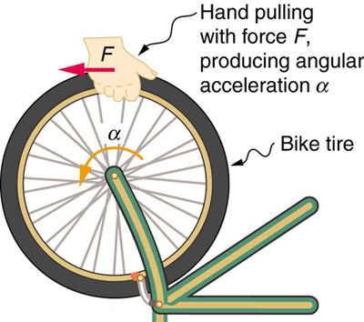

<div data-type="abstract" markdown="1">
* Understand the relationship between force, mass and acceleration.
* Study the turning effect of force.
* Study the analogy between force and torque, mass and moment of inertia, and linear acceleration and angular acceleration.

</div>

If you have ever spun a bike wheel or pushed a merry-go-round, you know that force is needed to change angular velocity as seen in [\[link\]](#import-auto-id1545882). In fact, your intuition is reliable in predicting many of the factors that are involved. For example, we know that a door opens slowly if we push too close to its hinges. Furthermore, we know that the more massive the door, the more slowly it opens. The first example implies that the farther the force is applied from the pivot, the greater the angular acceleration; another implication is that angular acceleration is inversely proportional to mass. These relationships should seem very similar to the familiar relationships among force, mass, and acceleration embodied in Newton’s second law of motion. There are, in fact, precise rotational analogs to both force and mass.

{: #import-auto-id1545882}

To develop the precise relationship among force, mass, radius, and angular acceleration, consider what happens if we exert a force <math xmlns="http://www.w3.org/1998/Math/MathML"><semantics><mrow><mrow><mi>F</mi></mrow><mrow /></mrow><annotation encoding="StarMath 5.0"> size 12{F} {}</annotation></semantics></math>

 on a point mass <math xmlns="http://www.w3.org/1998/Math/MathML"><semantics><mrow><mrow><mi>m</mi></mrow><mrow /></mrow><annotation encoding="StarMath 5.0"> size 12{m} {}</annotation></semantics></math>

 that is at a distance <math xmlns="http://www.w3.org/1998/Math/MathML"><semantics><mrow><mrow><mi>r</mi></mrow><mrow /></mrow><annotation encoding="StarMath 5.0"> size 12{r} {}</annotation></semantics></math>

 from a pivot point, as shown in [\[link\]](#import-auto-id2062858). Because the force is perpendicular to <math xmlns="http://www.w3.org/1998/Math/MathML"><semantics><mrow><mrow><mi>r</mi></mrow><mrow /></mrow><annotation encoding="StarMath 5.0"> size 12{r} {}</annotation></semantics></math>

, an acceleration <math xmlns="http://www.w3.org/1998/Math/MathML"><semantics><mrow><mrow><mrow><mi>a</mi><mo stretchy="false">=</mo><mfrac><mi>F</mi><mi>m</mi></mfrac></mrow></mrow><mrow /></mrow><annotation encoding="StarMath 5.0"> size 12{a= { {F} over {m} } } {}</annotation></semantics></math>

 is obtained in the direction of <math xmlns="http://www.w3.org/1998/Math/MathML"><semantics><mrow><mrow><mi>F</mi></mrow><mrow /></mrow><annotation encoding="StarMath 5.0"> size 12{F} {}</annotation></semantics></math>

. We can rearrange this equation such that <math xmlns="http://www.w3.org/1998/Math/MathML"><semantics><mrow><mrow><mrow><mi>F</mi><mo stretchy="false">=</mo><mstyle fontstyle="italic"><mrow><mtext>ma</mtext></mrow></mstyle></mrow></mrow><mrow /></mrow><annotation encoding="StarMath 5.0"> size 12{F= ital "ma"} {}</annotation></semantics></math>

 and then look for ways to relate this expression to expressions for rotational quantities. We note that <math xmlns="http://www.w3.org/1998/Math/MathML"><semantics><mrow><mrow><mrow><mi>a</mi><mo stretchy="false">=</mo><mi fontstyle="italic">rα</mi></mrow></mrow><mrow /></mrow><annotation encoding="StarMath 5.0"> size 12{a=rα} {}</annotation></semantics></math>

, and we substitute this expression into <math xmlns="http://www.w3.org/1998/Math/MathML"><semantics><mrow><mrow><mrow><mi>F</mi><mo stretchy="false">=</mo><mstyle fontstyle="italic"><mrow><mtext>ma</mtext></mrow></mstyle></mrow></mrow><mrow /></mrow><annotation encoding="StarMath 5.0"> size 12{F= ital "ma"} {}</annotation></semantics></math>

, yielding

<div data-type="equation" id="eip-426">
<math xmlns="http://www.w3.org/1998/Math/MathML"><semantics><mrow><mrow><mrow><mrow><mi>F</mi><mo stretchy="false">=</mo><mstyle fontstyle="italic"><mrow><mtext>mr</mtext></mrow></mstyle></mrow><mi>α</mi></mrow></mrow><mtext>.</mtext><mrow /></mrow><annotation encoding="StarMath 5.0"> size 12{F= ital "mr"α"."} {}</annotation></semantics></math>
</div>

Recall that **torque**{: data-type="term" #import-auto-id1429483} is the turning effectiveness of a force. In this case, because <math xmlns="http://www.w3.org/1998/Math/MathML"><semantics><mrow><mrow><mtext mathvariant="bold">F</mtext></mrow><mrow /></mrow><annotation encoding="StarMath 5.0"> size 12{"F"} {}</annotation></semantics></math>

 is perpendicular to <math xmlns="http://www.w3.org/1998/Math/MathML"><semantics><mrow><mrow><mi>r</mi></mrow><mrow /></mrow><annotation encoding="StarMath 5.0"> size 12{r} {}</annotation></semantics></math>

, torque is simply <math xmlns="http://www.w3.org/1998/Math/MathML"><semantics><mrow><mrow><mrow><mi>τ</mi><mo stretchy="false">=</mo><mi fontstyle="italic">Fr</mi></mrow></mrow><mrow /></mrow><annotation encoding="StarMath 5.0"> size 12{τ=rα} {}</annotation></semantics></math>

. So, if we multiply both sides of the equation above by <math xmlns="http://www.w3.org/1998/Math/MathML"><semantics><mrow><mrow><mi>r</mi></mrow><mrow /></mrow><annotation encoding="StarMath 5.0"> size 12{r} {}</annotation></semantics></math>

, we get torque on the left-hand side. That is,

<div data-type="equation" id="eip-304">
<math xmlns="http://www.w3.org/1998/Math/MathML"> <semantics> <mrow> <mrow> <mrow> <mrow> <mstyle fontstyle="italic"> <mrow> <mtext>rF</mtext> </mrow> </mstyle> <mo stretchy="false">=</mo> <mrow> <msup> <mstyle fontstyle="italic"> <mtext>mr</mtext> </mstyle> <mrow> <mn>2</mn> </mrow> </msup> </mrow> </mrow> <mi>α</mi> </mrow> </mrow> <mrow /> </mrow> <annotation encoding="StarMath 5.0"> size 12{ ital "rF"= ital "mr" rSup { size 8{2} } α} {}</annotation> </semantics> </math>
</div>

or

<div data-type="equation" id="eip-357">
<math xmlns="http://www.w3.org/1998/Math/MathML"><semantics><mrow><mrow><mrow><mrow><mi>τ</mi><mo stretchy="false">=</mo><mrow><msup><mstyle fontstyle="italic"><mtext>mr</mtext></mstyle><mrow><mn>2</mn></mrow></msup></mrow></mrow><mi>α.</mi></mrow></mrow><mrow /></mrow><annotation encoding="StarMath 5.0"> size 12{τ= ital "mr" rSup { size 8{2} } α.} {}</annotation></semantics></math>
</div>

This last equation is the rotational analog of Newton’s second law (<math xmlns="http://www.w3.org/1998/Math/MathML"><semantics><mrow><mrow><mrow><mi>F</mi><mo stretchy="false">=</mo><mstyle fontstyle="italic"><mrow><mtext>ma</mtext></mrow></mstyle></mrow></mrow><mrow /></mrow><annotation encoding="StarMath 5.0"> size 12{F= ital "ma"} {}</annotation></semantics></math>

), where torque is analogous to force, angular acceleration is analogous to translational acceleration, and <math xmlns="http://www.w3.org/1998/Math/MathML"><semantics><mrow><mrow><mrow><msup><mstyle fontstyle="italic"><mtext>mr</mtext></mstyle><mrow><mn>2</mn></mrow></msup></mrow></mrow><mrow /></mrow><annotation encoding="StarMath 5.0"> size 12{ ital "mr" rSup { size 8{2} } } {}</annotation></semantics></math>

 is analogous to mass (or inertia). The quantity <math xmlns="http://www.w3.org/1998/Math/MathML"><semantics><mrow><mrow><mrow><msup><mstyle fontstyle="italic"><mtext>mr</mtext></mstyle><mrow><mn>2</mn></mrow></msup></mrow></mrow><mrow /></mrow><annotation encoding="StarMath 5.0"> size 12{ ital "mr" rSup { size 8{2} } } {}</annotation></semantics></math>

 is called the **rotational inertia**{: data-type="term" #import-auto-id3450318} or **moment of inertia**{: data-type="term" #import-auto-id1383999} of a point mass <math xmlns="http://www.w3.org/1998/Math/MathML"><semantics><mrow><mrow><mi>m</mi></mrow><mrow /></mrow><annotation encoding="StarMath 5.0"> size 12{m} {}</annotation></semantics></math>

 a distance <math xmlns="http://www.w3.org/1998/Math/MathML"><semantics><mrow><mrow><mi>r</mi></mrow><mrow /></mrow><annotation encoding="StarMath 5.0"> size 12{r} {}</annotation></semantics></math>

 from the center of rotation.

{: #import-auto-id2062858}

<div data-type="note" data-label="" markdown="1">
<div data-type="title">
Making Connections: Rotational Motion Dynamics
</div>
Dynamics for rotational motion is completely analogous to linear or translational dynamics. Dynamics is concerned with force and mass and their effects on motion. For rotational motion, we will find direct analogs to force and mass that behave just as we would expect from our earlier experiences.

</div>

# Rotational Inertia and Moment of Inertia

Before we can consider the rotation of anything other than a point mass like the one in [\[link\]](#import-auto-id2062858), we must extend the idea of rotational inertia to all types of objects. To expand our concept of rotational inertia, we define the **moment of inertia**{: data-type="term" #import-auto-id3400355} <math xmlns="http://www.w3.org/1998/Math/MathML"><semantics><mrow><mrow><mi>I</mi></mrow><mrow /></mrow><annotation encoding="StarMath 5.0"> size 12{I} {}</annotation></semantics></math>

 of an object to be the sum of <math xmlns="http://www.w3.org/1998/Math/MathML"><semantics><mrow><mrow><mrow><msup><mstyle fontstyle="italic"><mtext>mr</mtext></mstyle><mrow><mn>2</mn></mrow></msup></mrow></mrow><mrow /></mrow><annotation encoding="StarMath 5.0"> size 12{ ital "mr" rSup { size 8{2} } } {}</annotation></semantics></math>

 for all the point masses of which it is composed. That is, <math xmlns="http://www.w3.org/1998/Math/MathML"><semantics><mrow><mrow><mrow><mrow><mi>I</mi><mo stretchy="false">=</mo><mrow><mo stretchy="false">∑</mo><mrow /></mrow></mrow><mrow><msup><mstyle fontstyle="italic"><mtext>mr</mtext></mstyle><mrow><mn>2</mn></mrow></msup></mrow></mrow></mrow><mrow /></mrow><annotation encoding="StarMath 5.0"> size 12{I= Sum {} ital "mr" rSup { size 8{2} } } {}</annotation></semantics></math>

. Here <math xmlns="http://www.w3.org/1998/Math/MathML"><semantics><mrow><mrow><mi>I</mi></mrow><mrow /></mrow><annotation encoding="StarMath 5.0"> size 12{I} {}</annotation></semantics></math>

 is analogous to <math xmlns="http://www.w3.org/1998/Math/MathML"><semantics><mrow><mrow><mi>m</mi></mrow><mrow /></mrow><annotation encoding="StarMath 5.0"> size 12{m} {}</annotation></semantics></math>

 in translational motion. Because of the distance <math xmlns="http://www.w3.org/1998/Math/MathML"><semantics><mrow><mi>r</mi><mrow /></mrow><annotation encoding="StarMath 5.0"> size 12{r} {}</annotation></semantics></math>

, the moment of inertia for any object depends on the chosen axis. Actually, calculating <math xmlns="http://www.w3.org/1998/Math/MathML"><semantics><mrow><mrow><mi>I</mi></mrow><mrow /></mrow><annotation encoding="StarMath 5.0"> size 12{I} {}</annotation></semantics></math>

 is beyond the scope of this text except for one simple case—that of a hoop, which has all its mass at the same distance from its axis. A hoop’s moment of inertia around its axis is therefore <math xmlns="http://www.w3.org/1998/Math/MathML"><semantics><mrow><mrow><msup><mstyle fontstyle="italic"><mtext>MR</mtext></mstyle><mrow><mn>2</mn></mrow></msup></mrow></mrow><annotation encoding="StarMath 5.0"> size 12{ ital "MR" rSup { size 8{2} } } {}</annotation></semantics></math>

, where <math xmlns="http://www.w3.org/1998/Math/MathML"><semantics><mrow><mrow><mi>M</mi></mrow><mrow /></mrow><annotation encoding="StarMath 5.0"> size 12{M} {}</annotation></semantics></math>

 is its total mass and <math xmlns="http://www.w3.org/1998/Math/MathML"><semantics><mrow><mrow><mi>R</mi></mrow><mrow /></mrow><annotation encoding="StarMath 5.0"> size 12{R} {}</annotation></semantics></math>

 its radius. (We use <math xmlns="http://www.w3.org/1998/Math/MathML"><semantics><mrow><mrow><mi>M</mi></mrow><mrow /></mrow><annotation encoding="StarMath 5.0"> size 12{M} {}</annotation></semantics></math>

 and <math xmlns="http://www.w3.org/1998/Math/MathML"><semantics><mrow><mrow><mi>R</mi></mrow><mrow /></mrow><annotation encoding="StarMath 5.0"> size 12{R} {}</annotation></semantics></math>

 for an entire object to distinguish them from <math xmlns="http://www.w3.org/1998/Math/MathML"><semantics><mrow><mrow><mi>m</mi></mrow><mrow /></mrow><annotation encoding="StarMath 5.0"> size 12{m} {}</annotation></semantics></math>

 and <math xmlns="http://www.w3.org/1998/Math/MathML"><semantics><mrow><mrow><mi>r</mi></mrow><mrow /></mrow><annotation encoding="StarMath 5.0"> size 12{r} {}</annotation></semantics></math>

 for point masses.) In all other cases, we must consult [\[link\]](#fs-id1838666) (note that the table is piece of artwork that has shapes as well as formulae) for formulas for <math xmlns="http://www.w3.org/1998/Math/MathML"><semantics><mrow><mrow><mi>I</mi></mrow><mrow /></mrow><annotation encoding="StarMath 5.0"> size 12{I} {}</annotation></semantics></math>

 that have been derived from integration over the continuous body. Note that <math xmlns="http://www.w3.org/1998/Math/MathML"><semantics><mrow><mrow><mi>I</mi></mrow><mrow /></mrow><annotation encoding="StarMath 5.0"> size 12{I} {}</annotation></semantics></math>

 has units of mass multiplied by distance squared (<math xmlns="http://www.w3.org/1998/Math/MathML"><semantics><mrow><mrow><mrow><mtext>kg</mtext><mo stretchy="false">⋅</mo><msup><mtext>m</mtext><mrow><mn>2</mn></mrow></msup></mrow></mrow><mrow /></mrow><annotation encoding="StarMath 5.0"> size 12{"kg" cdot "m" rSup { size 8{2} } } {}</annotation></semantics></math>

), as we might expect from its definition.

The general relationship among torque, moment of inertia, and angular acceleration is

<div data-type="equation" id="eip-724">
<math xmlns="http://www.w3.org/1998/Math/MathML"> <semantics> <mrow> <mrow> <mrow> <mtext>net τ</mtext> <mo stretchy="false">=</mo> <mi fontstyle="italic">Iα</mi> </mrow> </mrow> <mrow /> </mrow> <annotation encoding="StarMath 5.0"> size 12{τ=Iα} {}</annotation> </semantics> </math>
</div>

or

<div data-type="equation" id="eip-480">
<math xmlns="http://www.w3.org/1998/Math/MathML"><semantics><mrow><mrow><mrow><mi>α</mi><mo stretchy="false">=</mo><mfrac><mrow><mrow><mtext>net τ</mtext></mrow></mrow><mi>I</mi></mfrac></mrow></mrow><mtext>,</mtext><mrow /></mrow><annotation encoding="StarMath 5.0"> size 12{α= { { ital "net"τ} over {I} } ","} {}</annotation></semantics></math>
</div>

where net <math xmlns="http://www.w3.org/1998/Math/MathML"><semantics><mrow><mrow><mi>τ</mi></mrow><mrow /></mrow><annotation encoding="StarMath 5.0"> size 12{τ} {}</annotation></semantics></math>

 is the total torque from all forces relative to a chosen axis. For simplicity, we will only consider torques exerted by forces in the plane of the rotation. Such torques are either positive or negative and add like ordinary numbers. The relationship in <math xmlns="http://www.w3.org/1998/Math/MathML"><semantics><mrow><mrow><mrow><mrow><mi>τ</mi><mo stretchy="false">=</mo><mi fontstyle="italic">Iα</mi></mrow><mi>, </mi><mi /><mrow><mi>α</mi><mo stretchy="false">=</mo><mfrac><mrow><mtext>net τ</mtext></mrow><mi>I</mi></mfrac></mrow></mrow></mrow><mrow /></mrow><annotation encoding="StarMath 5.0"> size 12{τ=Iα,`````α= { { ital "net"τ} over {I} } } {}</annotation></semantics></math>

 is the rotational analog to Newton’s second law and is very generally applicable. This equation is actually valid for *any* torque, applied to *any* object, relative to *any* axis.

As we might expect, the larger the torque is, the larger the angular acceleration is. For example, the harder a child pushes on a merry-go-round, the faster it accelerates. Furthermore, the more massive a merry-go-round, the slower it accelerates for the same torque. The basic relationship between moment of inertia and angular acceleration is that the larger the moment of inertia, the smaller is the angular acceleration. But there is an additional twist. The moment of inertia depends not only on the mass of an object, but also on its *distribution* of mass relative to the axis around which it rotates. For example, it will be much easier to accelerate a merry-go-round full of children if they stand close to its axis than if they all stand at the outer edge. The mass is the same in both cases; but the moment of inertia is much larger when the children are at the edge.

<div data-type="note" data-label="" markdown="1">
<div data-type="title">
Take-Home Experiment
</div>
Cut out a circle that has about a 10 cm radius from stiff cardboard. Near the edge of the circle, write numbers 1 to 12 like hours on a clock face. Position the circle so that it can rotate freely about a horizontal axis through its center, like a wheel. (You could loosely nail the circle to a wall.) Hold the circle stationary and with the number 12 positioned at the top, attach a lump of blue putty (sticky material used for fixing posters to walls) at the number 3. How large does the lump need to be to just rotate the circle? Describe how you can change the moment of inertia of the circle. How does this change affect the amount of blue putty needed at the number 3 to just rotate the circle? Change the circle’s moment of inertia and then try rotating the circle by using different amounts of blue putty. Repeat this process several times.

</div>

<div data-type="note" data-label="" markdown="1">
<div data-type="title">
Problem-Solving Strategy for Rotational Dynamics
</div>
1.  {: #import-auto-id1575417} *Examine the situation to determine that torque and mass are involved in the rotation*. Draw a careful sketch of the situation.
2.  {: #import-auto-id1900500} *Determine the system of interest*.
3.  {: #import-auto-id3026238} *Draw a free body diagram*. That is, draw and label all external forces acting on the system of interest.
4.  {: #import-auto-id2067161} *Apply <math xmlns="http://www.w3.org/1998/Math/MathML"><semantics><mrow><mrow><mrow><mrow><mi> net τ</mi><mo stretchy="false">=</mo><mi fontstyle="italic">Iα</mi></mrow><mi>, </mi><mi /><mrow><mi>α</mi><mo stretchy="false">=</mo><mfrac><mrow><mtext>net τ</mtext></mrow><mi>I</mi></mfrac></mrow></mrow></mrow><mrow /></mrow><annotation encoding="StarMath 5.0"> size 12{τ=Iα,```α= { { ital "net"τ} over {I} } } {}</annotation></semantics></math>
    
    , the rotational equivalent of Newton’s second law, to solve the problem*. Care must be taken to use the correct moment of inertia and to consider the torque about the point of rotation.
5.  {: #import-auto-id3072381} *As always, check the solution to see if it is reasonable*.
{: data-number-style="arabic"}

</div>

<div data-type="note" data-label="" markdown="1">
<div data-type="title">
Making Connections
</div>
In statics, the net torque is zero, and there is no angular acceleration. In rotational motion, net torque is the cause of angular acceleration, exactly as in Newton’s second law of motion for rotation.

{: height="525"}


</div>

<div data-type="example" markdown="1">
<div data-type="title">
Calculating the Effect of Mass Distribution on a Merry-Go-Round
</div>
Consider the father pushing a playground merry-go-round in [\[link\]](#import-auto-id1468671). He exerts a force of 250 N at the edge of the 50.0-kg merry-go-round, which has a 1.50 m radius. Calculate the angular acceleration produced (a) when no one is on the merry-go-round and (b) when an 18.0-kg child sits 1.25 m away from the center. Consider the merry-go-round itself to be a uniform disk with negligible retarding friction.

{: #import-auto-id1468671}


**Strategy**

Angular acceleration is given directly by the expression <math xmlns="http://www.w3.org/1998/Math/MathML"> <semantics> <mrow> <mrow> <mi>α</mi> <mo stretchy="false">=</mo> <mfrac> <mrow> <mtext>net τ</mtext> </mrow> <mi>I</mi> </mfrac> </mrow> </mrow> <annotation encoding="StarMath 5.0"> size 12{τ=Iα,`α= { { ital "net"τ} over {I} } } {}</annotation> </semantics> </math>

\:

<div data-type="equation" id="eip-704">
<math xmlns="http://www.w3.org/1998/Math/MathML"> <semantics> <mrow> <mrow> <mrow> <mi>α</mi> <mo stretchy="false">=</mo> <mfrac> <mi>τ</mi> <mi>I</mi> </mfrac> </mrow> </mrow> <mo>.</mo> <mrow /> </mrow> <annotation encoding="StarMath 5.0"> size 12{α= { {τ} over {I} } } {}</annotation> </semantics> </math>
</div>
To solve for <math xmlns="http://www.w3.org/1998/Math/MathML"><semantics><mrow><mrow><mi>α</mi></mrow><mrow /></mrow><annotation encoding="StarMath 5.0"> size 12{α} {}</annotation></semantics></math>

, we must first calculate the torque <math xmlns="http://www.w3.org/1998/Math/MathML"><semantics><mrow><mrow><mi>τ</mi></mrow><mrow /></mrow><annotation encoding="StarMath 5.0"> size 12{τ} {}</annotation></semantics></math>

 (which is the same in both cases) and moment of inertia <math xmlns="http://www.w3.org/1998/Math/MathML"><semantics><mrow><mrow><mi>I</mi></mrow><mrow /></mrow><annotation encoding="StarMath 5.0"> size 12{I} {}</annotation></semantics></math>

 (which is greater in the second case). To find the torque, we note that the applied force is perpendicular to the radius and friction is negligible, so that

<div data-type="equation" id="eip-946">
<math xmlns="http://www.w3.org/1998/Math/MathML"><semantics><mrow><mrow><mrow><mrow><mrow><mi mathvariant="normal">τ</mi><mo stretchy="false">=</mo><mi fontstyle="italic">rF</mi><mspace width="0.25em" /><mtext>sin θ</mtext></mrow><mo stretchy="false">=</mo><mo stretchy="false">(</mo></mrow><mtext>1.50 m</mtext><mo stretchy="false">)</mo><mo stretchy="false">(</mo><mtext>250 N</mtext><mo stretchy="false">)</mo><mo stretchy="false">=</mo><mtext>375 N</mtext><mo>⋅</mo><mtext>m.</mtext></mrow></mrow><mrow /></mrow><annotation encoding="StarMath 5.0"> size 12{τ="rFsinθ"= \( 1 "." "50m" \) \( "250N" \) ="375N" "." "m."} {}</annotation></semantics></math>
</div>
**Solution for (a)**

The moment of inertia of a solid disk about this axis is given in [\[link\]](#fs-id1838666) to be

<div data-type="equation" id="eip-659">
<math xmlns="http://www.w3.org/1998/Math/MathML"><semantics><mrow><mrow><mrow><mfrac><mn>1</mn><mn>2</mn></mfrac><mrow><msup><mstyle fontstyle="italic"><mtext>MR</mtext></mstyle><mrow><mn>2</mn></mrow></msup></mrow></mrow></mrow><mtext>,</mtext><mrow /></mrow><annotation encoding="StarMath 5.0"> size 12{ { {1} over {2} } ital "MR" rSup { size 8{2} } ","} {}</annotation></semantics></math>
</div>
where <math xmlns="http://www.w3.org/1998/Math/MathML"><semantics><mrow><mrow><mrow><mi>M</mi><mo stretchy="false">=</mo><mtext>50.0 kg</mtext></mrow></mrow><mrow /></mrow><annotation encoding="StarMath 5.0"> size 12{M="50" "." 0 ital "kg"} {}</annotation></semantics></math>

 and <math xmlns="http://www.w3.org/1998/Math/MathML"><semantics><mrow><mrow><mrow><mi>R</mi><mo stretchy="false">=</mo><mtext>1.50 m</mtext></mrow></mrow><mrow /></mrow><annotation encoding="StarMath 5.0"> size 12{R=1 "." "50"m} {}</annotation></semantics></math>

, so that

<div data-type="equation" id="eip-768">
<math xmlns="http://www.w3.org/1998/Math/MathML"><semantics><mrow><mrow><mrow><mrow><mi>I</mi><mo stretchy="false">=</mo><mn>(0</mn></mrow><mtext>.</mtext><mn>500)</mn><mo stretchy="false">(</mo><mtext>50.0 kg</mtext><mo stretchy="false">)</mo><mo stretchy="false">(</mo><mtext>1.50 m</mtext><mrow><msup><mo stretchy="false">)</mo><mrow><mn>2</mn></mrow></msup><mo stretchy="false">=</mo></mrow><mtext>56.25 kg</mtext><mo>⋅</mo><msup><mtext>m</mtext><mrow><mn>2</mn></mrow></msup></mrow></mrow><mtext>.</mtext><mrow /></mrow><annotation encoding="StarMath 5.0"> size 12{I=0 "." 5 \( "50" "." "0kg" \) \( 1 "." "50m" \) rSup { size 8{2} } ="56" "." "25kg" "." "m" rSup { size 8{2} } "."} {}</annotation></semantics></math>
</div>
Now, after we substitute the known values, we find the angular acceleration to be

<div data-type="equation" id="eip-861">
<math xmlns="http://www.w3.org/1998/Math/MathML"><semantics><mrow><mrow><mrow><mrow><mrow><mrow><mi>α</mi><mo stretchy="false">=</mo><mfrac><mi>τ</mi><mi>I</mi></mfrac></mrow><mo stretchy="false">=</mo><mfrac><mrow><mtext>375 N</mtext><mspace width="0.25em" /><mtext>⋅</mtext><mspace width="0.25em" /><mtext>m</mtext></mrow><mrow><mtext>56.25 kg</mtext><mo>⋅</mo><msup><mtext>m</mtext><mrow><mn>2</mn></mrow></msup></mrow></mfrac></mrow><mo stretchy="false">=</mo></mrow><mtext>6.67</mtext><mfrac><mtext>rad</mtext><msup><mtext>s</mtext><mrow><mn>2</mn></mrow></msup></mfrac></mrow></mrow><mtext>.</mtext><mrow /></mrow><annotation encoding="StarMath 5.0"> size 12{α= { {τ} over {I} } = { {"375"`"N" "." "m"} over {"56" "." "25"`"kg" "." "m" rSup { size 8{2} } } } =6 "." "67"` { {"rad"} over {s rSup { size 8{2} } } } "."} {}</annotation></semantics></math>
</div>
**Solution for (b)**

We expect the angular acceleration for the system to be less in this part, because the moment of inertia is greater when the child is on the merry-go-round. To find the total moment of inertia <math xmlns="http://www.w3.org/1998/Math/MathML"><semantics><mrow><mrow><mi>I</mi></mrow></mrow><annotation encoding="StarMath 5.0"> size 12{I} {}</annotation></semantics></math>

, we first find the child’s moment of inertia <math xmlns="http://www.w3.org/1998/Math/MathML"><semantics><mrow><msub><mi>I</mi><mrow><mtext>c</mtext></mrow></msub></mrow><annotation encoding="StarMath 5.0"> size 12{I rSub { size 8{c} } } {}</annotation></semantics></math>

 by considering the child to be equivalent to a point mass at a distance of 1.25 m from the axis. Then,

<div data-type="equation" id="eip-266">
<math xmlns="http://www.w3.org/1998/Math/MathML"><semantics><mrow><mrow><mrow><mrow><mrow><msub><mi>I</mi><mrow><mtext>c</mtext></mrow></msub><mo stretchy="false">=</mo><msup><mi fontstyle="italic">MR</mi><mrow><mn>2</mn></mrow></msup></mrow><mo stretchy="false">=</mo><mo stretchy="false">(</mo></mrow><mtext>18.0 kg</mtext><mo stretchy="false">)</mo><mo stretchy="false">(</mo><mtext>1.25 m</mtext><mrow><msup><mo stretchy="false">)</mo><mrow><mn>2</mn></mrow></msup><mo stretchy="false">=</mo></mrow><mtext>28.13 kg</mtext><mo>⋅</mo><msup><mtext>m</mtext><mrow><mn>2</mn></mrow></msup></mrow></mrow><mtext>.</mtext><mrow /></mrow><annotation encoding="StarMath 5.0"> size 12{I rSub { size 8{c} } ="MR" rSup { size 8{2} } = \( "18" "." 0`"kg" \) \( 1 "." "25"`m \) rSup { size 8{2} } ="28" "." "13"`"kg" "." m rSup { size 8{2} } "."} {}</annotation></semantics></math>
</div>
The total moment of inertia is the sum of moments of inertia of the merry-go-round and the child (about the same axis). To justify this sum to yourself, examine the definition of <math xmlns="http://www.w3.org/1998/Math/MathML"><semantics><mrow><mrow><mi>I</mi></mrow><mrow /></mrow><annotation encoding="StarMath 5.0"> size 12{I} {}</annotation></semantics></math>

\:

<div data-type="equation" id="eip-141">
<math xmlns="http://www.w3.org/1998/Math/MathML"> <semantics> <mrow> <mrow> <mrow> <mi>I</mi> <mo stretchy="false">=</mo> <mtext>28.13 kg</mtext> <mo>⋅</mo> <msup> <mtext>m</mtext> <mn>2</mn> </msup> <mo stretchy="false">+</mo> <mtext>56.25 kg</mtext> <mo>⋅</mo> <msup> <mtext>m</mtext> <mn>2</mn> </msup> <mo stretchy="false">=</mo> <mtext>84.38 kg</mtext> <mo>⋅</mo> <msup> <mtext>m</mtext> <mn>2</mn> </msup> </mrow><mo>.</mo> </mrow> </mrow> <annotation encoding="StarMath 5.0"> size 12{I="28" "." "13"`"kg" "." m rSup { size 8{2} } +"56" "." "25"`"kg" "." m rSup { size 8{2} } ="84" "." "38"`"kg" "." m rSup { size 8{2} } } {}</annotation> </semantics> </math>
</div>
Substituting known values into the equation for <math xmlns="http://www.w3.org/1998/Math/MathML"><semantics><mrow><mrow><mi>α</mi></mrow><mrow /></mrow><annotation encoding="StarMath 5.0"> size 12{α} {}</annotation></semantics></math>

 gives

<div data-type="equation" id="eip-50">
<math xmlns="http://www.w3.org/1998/Math/MathML"><semantics><mrow><mrow><mrow><mrow><mrow><mrow><mi>α</mi><mo stretchy="false">=</mo><mfrac><mtext>τ</mtext><mi>I</mi></mfrac></mrow><mo stretchy="false">=</mo><mfrac><mrow><mtext>375 N</mtext><mo>⋅</mo><mtext>m</mtext></mrow><mrow><mtext>84.38 kg</mtext><mo>⋅</mo><msup><mtext>m</mtext><mn>2</mn></msup></mrow></mfrac></mrow><mo stretchy="false">=</mo></mrow><mtext>4.44</mtext><mfrac><mtext>rad</mtext><msup><mtext>s</mtext><mrow><mn>2</mn></mrow></msup></mfrac></mrow></mrow><mtext>.</mtext><mrow /></mrow><annotation encoding="StarMath 5.0"> size 12{α= { {τ} over {I} } = { {"375N" "." m} over {"84" "." "38kg" "." m rSup { size 8{2} } } } =4 "." "44" { {"rad"} over {s rSup { size 8{2} } } } "."} {}</annotation></semantics></math>
</div>
**Discussion**

The angular acceleration is less when the child is on the merry-go-round than when the merry-go-round is empty, as expected. The angular accelerations found are quite large, partly due to the fact that friction was considered to be negligible. If, for example, the father kept pushing perpendicularly for 2.00 s, he would give the merry-go-round an angular velocity of 13.3 rad/s when it is empty but only 8.89 rad/s when the child is on it. In terms of revolutions per second, these angular velocities are 2.12 rev/s and 1.41 rev/s, respectively. The father would end up running at about 50 km/h in the first case. Summer Olympics, here he comes! Confirmation of these numbers is left as an exercise for the reader.

</div>

<div data-type="exercise" data-label="">
<div data-type="title">
Check Your Understanding
</div>
<div data-type="problem" markdown="1">
Torque is the analog of force and moment of inertia is the analog of mass. Force and mass are physical quantities that depend on only one factor. For example, mass is related solely to the numbers of atoms of various types in an object. Are torque and moment of inertia similarly simple?

</div>
<div data-type="solution" print-placement="here" markdown="1">
No. Torque depends on three factors: force magnitude, force direction, and point of application. Moment of inertia depends on both mass and its distribution relative to the axis of rotation. So, while the analogies are precise, these rotational quantities depend on more factors.

</div>
</div>

# Section Summary

* {: #import-auto-id3170008} The farther the force is applied from the pivot, the greater is the angular acceleration; angular acceleration is inversely proportional to mass.
* {: #import-auto-id2684041} If we exert a force
  <math xmlns="http://www.w3.org/1998/Math/MathML"><semantics><mrow><mrow><mi>F</mi></mrow><mrow /></mrow><annotation encoding="StarMath 5.0"> size 12{F} {}</annotation></semantics></math>
  
  on a point mass
  <math xmlns="http://www.w3.org/1998/Math/MathML"><semantics><mrow><mrow><mi>m</mi></mrow><mrow /></mrow><annotation encoding="StarMath 5.0"> size 12{m} {}</annotation></semantics></math>
  
  that is at a distance
  <math xmlns="http://www.w3.org/1998/Math/MathML"><semantics><mrow><mrow><mi>r</mi></mrow><mrow /></mrow><annotation encoding="StarMath 5.0"> size 12{r} {}</annotation></semantics></math>
  
  from a pivot point and because the force is perpendicular to
  <math xmlns="http://www.w3.org/1998/Math/MathML"><semantics><mrow><mrow><mi>r</mi></mrow><mrow /></mrow><annotation encoding="StarMath 5.0"> size 12{r} {}</annotation></semantics></math>
  
  , an acceleration
  <math xmlns="http://www.w3.org/1998/Math/MathML"><semantics><mrow><mrow><mtext fontstyle="italic">a = F/m</mtext></mrow><mrow /></mrow><annotation encoding="StarMath 5.0"> size 12{F} {}</annotation></semantics></math>
  
  is obtained in the direction of
  <math xmlns="http://www.w3.org/1998/Math/MathML"><semantics><mrow><mrow><mi>F</mi></mrow><mrow /></mrow><annotation encoding="StarMath 5.0"> size 12{F} {}</annotation></semantics></math>
  
  . We can rearrange this equation such that
  <div data-type="equation">
  <math xmlns="http://www.w3.org/1998/Math/MathML"><semantics><mrow><mrow><mi fontstyle="italic">F = ma</mi></mrow><mtext>,</mtext><mrow /></mrow><annotation encoding="StarMath 5.0"> size 12{F} {","}</annotation></semantics></math>
  </div>
  
  and then look for ways to relate this expression to expressions for rotational quantities. We note that <math xmlns="http://www.w3.org/1998/Math/MathML"><semantics><mrow><mrow><mi fontstyle="italic">a = rα</mi></mrow><mrow /></mrow><annotation encoding="StarMath 5.0"> size 12{F} {}</annotation></semantics></math>
  
  , and we substitute this expression into <math xmlns="http://www.w3.org/1998/Math/MathML"><semantics><mrow><mrow><mi fontstyle="italic">F=ma</mi></mrow><mrow /></mrow><annotation encoding="StarMath 5.0"> size 12{F} {}</annotation></semantics></math>
  
  , yielding
  
  <div data-type="equation">
  <math xmlns="http://www.w3.org/1998/Math/MathML"><semantics><mrow><mrow><mi fontstyle="italic">F=mrα</mi></mrow><mrow /></mrow><annotation encoding="StarMath 5.0"> size 12{F} {}</annotation></semantics></math>
  </div>

* {: #import-auto-id969263} Torque is the turning effectiveness of a force. In this case, because
  <math xmlns="http://www.w3.org/1998/Math/MathML"><semantics><mrow><mrow><mi>F</mi></mrow><mrow /></mrow><annotation encoding="StarMath 5.0"> size 12{F} {}</annotation></semantics></math>
  
  is perpendicular to
  <math xmlns="http://www.w3.org/1998/Math/MathML"><semantics><mrow><mrow><mi>r</mi></mrow><mrow /></mrow><annotation encoding="StarMath 5.0"> size 12{r} {}</annotation></semantics></math>
  
  , torque is simply
  <math xmlns="http://www.w3.org/1998/Math/MathML"><semantics><mrow><mrow><mi>τ</mi><mo>=</mo><mi mathvariant="italic">rF</mi></mrow></mrow><annotation encoding="StarMath 5.0"> size 12{F} {}</annotation></semantics></math>
  
  . If we multiply both sides of the equation above by
  <math xmlns="http://www.w3.org/1998/Math/MathML"><semantics><mrow><mrow><mi>r</mi></mrow><mrow /></mrow><annotation encoding="StarMath 5.0"> size 12{r} {}</annotation></semantics></math>
  
  , we get torque on the left-hand side. That is,
  <div data-type="equation">
  <math xmlns="http://www.w3.org/1998/Math/MathML"> <semantics> <mrow> <mrow> <mrow> <mrow> <mstyle fontstyle="italic"> <mrow> <mtext>rF</mtext> </mrow> </mstyle> <mo stretchy="false">=</mo> <mrow> <msup> <mstyle fontstyle="italic"> <mtext>mr</mtext> </mstyle> <mrow> <mn>2</mn> </mrow> </msup> </mrow> </mrow> <mi>α</mi> </mrow> </mrow> <mrow /> </mrow> <annotation encoding="StarMath 5.0"> size 12{ ital "rF"= ital "mr" rSup { size 8{2} } α} {}</annotation> </semantics> </math>
  </div>
  
  or
  
  <div data-type="equation" id="import-auto-id2930863">
  <math xmlns="http://www.w3.org/1998/Math/MathML"> <semantics> <mrow> <mrow> <mrow> <mrow> <mi>τ</mi> <mo stretchy="false">=</mo> <mrow> <msup> <mstyle fontstyle="italic"> <mtext>mr</mtext> </mstyle> <mrow> <mn>2</mn> </mrow> </msup> </mrow> </mrow> <mi>α</mi> <mtext>.</mtext> </mrow> </mrow> <mrow /> </mrow> <annotation encoding="StarMath 5.0"> size 12{τ= ital "mr" rSup { size 8{2} } α "." } {}</annotation> </semantics> </math>
  </div>

* {: #import-auto-id3175767} The moment of inertia
  <math xmlns="http://www.w3.org/1998/Math/MathML"><semantics><mrow><mrow><mi>I</mi></mrow><mrow /></mrow><annotation encoding="StarMath 5.0"> size 12{I} {}</annotation></semantics></math>
  
  of an object is the sum of
  <math xmlns="http://www.w3.org/1998/Math/MathML"><semantics><mrow><mrow><mrow><msup><mstyle fontstyle="italic"><mtext>MR</mtext></mstyle><mrow><mn>2</mn></mrow></msup></mrow></mrow><mrow /></mrow><annotation encoding="StarMath 5.0"> size 12{ ital "MR" rSup { size 8{2} } } {}</annotation></semantics></math>
  
  for all the point masses of which it is composed. That is,
  <div data-type="equation" id="import-auto-id3110206">
  <math xmlns="http://www.w3.org/1998/Math/MathML"> <semantics> <mrow> <mrow> <mrow> <mrow> <mi>I</mi> <mo stretchy="false">=</mo> <mrow> <mo stretchy="false">∑</mo> <mrow> <msup> <mstyle fontstyle="italic"> <mtext>mr</mtext> </mstyle> <mrow> <mn>2</mn> </mrow> </msup> </mrow> </mrow> </mrow> <mtext>.</mtext> </mrow> </mrow> <mrow /> </mrow> <annotation encoding="StarMath 5.0"> size 12{I= sum ital "mr" rSup { size 8{2} } "." } {}</annotation> </semantics> </math>
  </div>

* {: #import-auto-id1011742} The general relationship among torque, moment of inertia, and angular acceleration is
  <div data-type="equation" id="eip-139">
  <math xmlns="http://www.w3.org/1998/Math/MathML"> <semantics> <mrow> <mrow> <mrow> <mi>τ</mi> <mo stretchy="false">=</mo> <mi fontstyle="italic">Iα</mi> </mrow> </mrow> <mrow /> </mrow> <annotation encoding="StarMath 5.0"> size 12{τ=Iα} {}</annotation> </semantics> </math>
  </div>
  
  or
  
  <div data-type="equation" id="eip-317">
  <math xmlns="http://www.w3.org/1998/Math/MathML"> <semantics> <mtable> <mtr> <mrow> <mrow> <mi>α</mi> <mo stretchy="false">=</mo> <mrow> <mfrac> <mrow> <mrow> <mtext>net τ</mtext> </mrow> </mrow> <mi>I</mi> </mfrac> <mo stretchy="false">⋅</mo> <mrow /> </mrow> </mrow> <mrow /> </mrow> </mtr> <mtr> <mrow> <mrow /> </mrow> </mtr> </mtable> <annotation encoding="StarMath 5.0"> size 12{α= { { ital "net"`τ} over {I} } cdot } {}</annotation> </semantics> </math>
  </div>

# Conceptual Questions

<div data-type="exercise" data-label="conceptual-questions">
<div data-type="problem" markdown="1">
The moment of inertia of a long rod spun around an axis through one end perpendicular to its length is <math xmlns="http://www.w3.org/1998/Math/MathML"><semantics><mrow><mrow><mrow><msup><mi mathvariant="italic">ML</mi><mrow><mn>2</mn></mrow></msup><mtext>/3</mtext></mrow></mrow><mrow /></mrow><annotation encoding="StarMath 5.0"> size 12{"ML" rSup { size 8{2} } "/3"} {}</annotation></semantics></math>

. Why is this moment of inertia greater than it would be if you spun a point mass <math xmlns="http://www.w3.org/1998/Math/MathML"> <semantics> <mi>M</mi> </semantics> </math>

 at the location of the center of mass of the rod (at <math xmlns="http://www.w3.org/1998/Math/MathML"> <semantics> <mrow> <mrow> <mrow> <mi>L</mi> <mo stretchy="false">/</mo> <mn>2</mn> </mrow> </mrow> <mrow /> </mrow> <annotation encoding="StarMath 5.0"> size 12{L/2} {}</annotation> </semantics> </math>

 )? (That would be <math xmlns="http://www.w3.org/1998/Math/MathML"><semantics><mrow><mrow><mrow><msup><mi mathvariant="italic">ML</mi><mrow><mn>2</mn></mrow></msup><mtext>/4</mtext></mrow></mrow><mrow /></mrow><annotation encoding="StarMath 5.0"> size 12{"ML" rSup { size 8{2} } "/4"} {}</annotation></semantics></math>

.)

</div>
</div>

<div data-type="exercise" data-label="conceptual-questions">
<div data-type="problem" markdown="1">
Why is the moment of inertia of a hoop that has a mass <math xmlns="http://www.w3.org/1998/Math/MathML"> <semantics> <mi>M</mi> </semantics> </math>

 and a radius <math xmlns="http://www.w3.org/1998/Math/MathML"> <semantics> <mi>R</mi> </semantics> </math>

 greater than the moment of inertia of a disk that has the same mass and radius? Why is the moment of inertia of a spherical shell that has a mass <math xmlns="http://www.w3.org/1998/Math/MathML"> <semantics> <mi>M</mi> </semantics> </math>

 and a radius <math xmlns="http://www.w3.org/1998/Math/MathML"> <semantics> <mi>R</mi> </semantics> </math>

 greater than that of a solid sphere that has the same mass and radius?

</div>
</div>

<div data-type="exercise" data-label="conceptual-questions">
<div data-type="problem" markdown="1">
Give an example in which a small force exerts a large torque. Give another example in which a large force exerts a small torque.

</div>
</div>

<div data-type="exercise" data-label="conceptual-questions">
<div data-type="problem" markdown="1">
While reducing the mass of a racing bike, the greatest benefit is realized from reducing the mass of the tires and wheel rims. Why does this allow a racer to achieve greater accelerations than would an identical reduction in the mass of the bicycle’s frame?

"){:}


</div>
</div>

<div data-type="exercise" data-label="conceptual-questions">
<div data-type="problem" markdown="1">
A ball slides up a frictionless ramp. It is then rolled without slipping and with the same initial velocity up another frictionless ramp (with the same slope angle). In which case does it reach a greater height, and why?

</div>
</div>

# Problems &amp; Exercises

<div data-type="exercise" data-label="problems-exercises">
<div data-type="problem" markdown="1">
This problem considers additional aspects of example [Calculating the Effect of Mass Distribution on a Merry-Go-Round](/m42179#fs-id1468671). (a) How long does it take the father to give the merry-go-round an angular velocity of 1.50 rad/s? (b) How many revolutions must he go through to generate this velocity? (c) If he exerts a slowing force of 300 N at a radius of 1.35 m, how long would it take him to stop them?

</div>
<div data-type="solution" markdown="1">
(a) 0.338 s

(b) 0.0403 rev

(c) 0.313 s

</div>
</div>

<div data-type="exercise" data-label="problems-exercises">
<div data-type="problem" markdown="1">
Calculate the moment of inertia of a skater given the following information. (a) The 60.0-kg skater is approximated as a cylinder that has a 0.110-m radius. (b) The skater with arms extended is approximately a cylinder that is 52.5 kg, has a 0.110-m radius, and has two 0.900-m-long arms which are 3.75 kg each and extend straight out from the cylinder like rods rotated about their ends.

</div>
</div>

<div data-type="exercise" data-label="problems-exercises">
<div data-type="problem" markdown="1">
The triceps muscle in the back of the upper arm extends the forearm. This muscle in a professional boxer exerts a force of <math xmlns="http://www.w3.org/1998/Math/MathML"><semantics><mrow><mrow><mtext>2.00</mtext><mo stretchy="false">×</mo><msup><mtext>10</mtext><mn>3</mn></msup><mspace width="0.25em" /> <mtext>N</mtext></mrow><mrow /></mrow><annotation encoding="StarMath 5.0"> size 12{2 "." "00" times "10" rSup { size 8{3} } `N} {}</annotation></semantics></math>

 with an effective perpendicular lever arm of 3.00 cm, producing an angular acceleration of the forearm of <math xmlns="http://www.w3.org/1998/Math/MathML"><semantics><mrow><mrow><mtext>120</mtext><mspace width="0.25em" /><msup><mtext>rad/s</mtext><mn>2</mn></msup></mrow></mrow><annotation encoding="StarMath 5.0"> size 12{"120"``"rad/s" rSup { size 8{2} } } {}</annotation></semantics></math>

. What is the moment of inertia of the boxer’s forearm?

</div>
<div data-type="solution" markdown="1">
<math xmlns="http://www.w3.org/1998/Math/MathML"> <semantics> <mrow> <mrow> <mtext>0.50 kg</mtext> <mo stretchy="false">⋅</mo> <msup> <mtext>m</mtext> <mn>2</mn> </msup> </mrow> </mrow> <annotation encoding="StarMath 5.0"> size 12{5 "." "00"``"kg" cdot m rSup { size 8{2} } } {}</annotation> </semantics> </math>

</div>
</div>

<div data-type="exercise" data-label="problems-exercises">
<div data-type="problem" markdown="1">
A soccer player extends her lower leg in a kicking motion by exerting a force with the muscle above the knee in the front of her leg. She produces an angular acceleration of <math xmlns="http://www.w3.org/1998/Math/MathML"><semantics><mrow><mn>30.00 rad/</mn><msup><mtext>s</mtext><mn>2</mn></msup></mrow></semantics></math>

 and her lower leg has a moment of inertia of <math xmlns="http://www.w3.org/1998/Math/MathML"><semantics><mrow><mtext>0.750 kg</mtext><mo stretchy="false">⋅</mo><msup><mtext>m</mtext><mn>2</mn></msup></mrow><annotation encoding="StarMath 5.0"> size 12{0 "." "750"`"kg" cdot m rSup { size 8{2} } } {}</annotation></semantics></math>

. What is the force exerted by the muscle if its effective perpendicular lever arm is 1.90 cm?

</div>
</div>

<div data-type="exercise" data-label="problems-exercises">
<div data-type="problem" markdown="1">
Suppose you exert a force of 180 N tangential to a 0.280-m-radius 75.0-kg grindstone (a solid disk).

(a)What torque is exerted? (b) What is the angular acceleration assuming negligible opposing friction? (c) What is the angular acceleration if there is an opposing frictional force of 20.0 N exerted 1.50 cm from the axis?

</div>
<div data-type="solution" markdown="1">
(a) <math xmlns="http://www.w3.org/1998/Math/MathML"><semantics><mrow><mn>50.4 N</mn><mo>⋅</mo><mtext>m</mtext></mrow></semantics></math>

(b) <math xmlns="http://www.w3.org/1998/Math/MathML"><semantics><mrow><mrow><mrow><mtext>17.1</mtext><mspace width="0.25em" /> <msup><mtext>rad/s</mtext><mrow><mn>2</mn></mrow></msup></mrow></mrow><mrow /></mrow><annotation encoding="StarMath 5.0"> size 12{"17" "." 1``"rad/s" rSup { size 8{2} } } {}</annotation></semantics></math>

(c) <math xmlns="http://www.w3.org/1998/Math/MathML"><semantics><mrow><mrow><mrow><mn>17.0</mn><mspace width="0.25em" /> <msup><mtext>rad/s</mtext><mrow><mn>2</mn></mrow></msup></mrow></mrow><mrow /></mrow><annotation encoding="StarMath 5.0"> size 12{"17" "." 0``"rad/s" rSup { size 8{2} } } {}</annotation></semantics></math>

</div>
</div>

<div data-type="exercise" data-label="problems-exercises">
<div data-type="problem" markdown="1">
Consider the 12.0 kg motorcycle wheel shown in [[link]](#import-auto-id3370574). Assume it to be approximately an annular ring with an inner radius of 0.280 m and an outer radius of 0.330 m. The motorcycle is on its center stand, so that the wheel can spin freely. (a) If the drive chain exerts a force of 2200 N at a radius of 5.00 cm, what is the angular acceleration of the wheel? (b) What is the tangential acceleration of a point on the outer edge of the tire? (c) How long, starting from rest, does it take to reach an angular velocity of 80.0 rad/s?

{: #import-auto-id3370574}


</div>
</div>

<div data-type="exercise" data-label="problems-exercises">
<div data-type="problem" markdown="1">
Zorch, an archenemy of Superman, decides to slow Earth’s rotation to once per 28.0 h by exerting an opposing force at and parallel to the equator. Superman is not immediately concerned, because he knows Zorch can only exert a force of <math xmlns="http://www.w3.org/1998/Math/MathML"><semantics><mrow><mrow><mn>4.00</mn><mo stretchy="false">×</mo><msup><mtext>10</mtext><mn>7</mn></msup><mspace width="0.25em" /> <mtext>N</mtext></mrow><mrow /></mrow><annotation encoding="StarMath 5.0"> size 12{4 "." "00" times "10" rSup { size 8{7} } `N} {}</annotation></semantics></math>

 (a little greater than a Saturn V rocket’s thrust). How long must Zorch push with this force to accomplish his goal? (This period gives Superman time to devote to other villains.) Explicitly show how you follow the steps found in [Problem-Solving Strategy for Rotational Dynamics](/m42179#fs-id2929358).

</div>
<div data-type="solution" markdown="1">
<math xmlns="http://www.w3.org/1998/Math/MathML"> <semantics> <mrow> <mrow> <mrow> <mn>3</mn> <mtext>.</mtext> <mrow> <mtext>96</mtext> <mo stretchy="false">×</mo> <msup> <mtext>10</mtext> <mtext>18</mtext> </msup> </mrow> <mspace width="0.25em" /> <mtext>s</mtext> </mrow> </mrow> <mrow /> </mrow> <annotation encoding="StarMath 5.0"> size 12{3 "." "96" times "10" rSup { size 8{"18"} } `s} {}</annotation> </semantics> </math>

or <math xmlns="http://www.w3.org/1998/Math/MathML"> <semantics> <mrow> <mn>1.26</mn> <mo stretchy="false">×</mo> <msup> <mtext>10</mtext> <mtext>11</mtext> </msup> <mspace width="0.25em" /> <mtext>y</mtext> </mrow> <annotation encoding="StarMath 5.0"> size 12{1 "." "26" times "10" rSup { size 8{"11"} } `y} {}</annotation> </semantics> </math>

</div>
</div>

<div data-type="exercise" data-label="problems-exercises">
<div data-type="problem" markdown="1">
An automobile engine can produce 200 N ∙ m of torque. Calculate the angular acceleration produced if 95.0% of this torque is applied to the drive shaft, axle, and rear wheels of a car, given the following information. The car is suspended so that the wheels can turn freely. Each wheel acts like a 15.0 kg disk that has a 0.180 m radius. The walls of each tire act like a 2.00-kg annular ring that has inside radius of 0.180 m and outside radius of 0.320 m. The tread of each tire acts like a 10.0-kg hoop of radius 0.330 m. The 14.0-kg axle acts like a rod that has a 2.00-cm radius. The 30.0-kg drive shaft acts like a rod that has a 3.20-cm radius.

</div>
</div>

<div data-type="exercise" data-label="problems-exercises">
<div data-type="problem" markdown="1">
Starting with the formula for the moment of inertia of a rod rotated around an axis through one end perpendicular to its length <math xmlns="http://www.w3.org/1998/Math/MathML"> <semantics> <mrow> <mrow> <mrow><mo>(</mo> <mi>I</mi> <mo stretchy="false">=</mo> <mrow> <msup> <mi fontstyle="italic">Mℓ</mi> <mrow> <mn> 2</mn> </mrow> </msup> <mo stretchy="false">/</mo> <mn>3</mn> </mrow> </mrow> </mrow> <mo>)</mo> </mrow> </semantics> </math>

 , prove that the moment of inertia of a rod rotated about an axis through its center perpendicular to its length is <math xmlns="http://www.w3.org/1998/Math/MathML"> <semantics> <mrow> <mrow> <mrow> <mi>I</mi> <mo stretchy="false">=</mo> <mrow> <msup> <mi fontstyle="italic">Mℓ</mi> <mrow> <mn> 2</mn> </mrow> </msup> <mo stretchy="false">/</mo> <mn>12</mn> </mrow> </mrow> </mrow> <mrow /> </mrow> <annotation encoding="StarMath 5.0"> size 12{I=Mℓ rSup { size 8{2} } /12} {}</annotation> </semantics> </math>

. You will find the graphics in [[link]](#fs-id1838666) useful in visualizing these rotations.

</div>
<div data-type="solution" markdown="1">
<math xmlns="http://www.w3.org/1998/Math/MathML"> <semantics> <mrow> <mrow> <mtable> <mtr> <mtd> <mrow> <mstyle mathsize="12pt"> <mrow> <mrow> <mrow> <msub> <mi> I </mi> <mrow> <mstyle mathsize="8pt"> <mrow> <mrow> <mstyle mathvariant="italic"> <mrow> <mtext> end </mtext> </mrow> </mstyle> </mrow> </mrow> </mstyle> </mrow> </msub> <mo stretchy="false"> = </mo> <mrow> <msub> <mi> I </mi> <mrow> <mstyle mathsize="8pt"> <mrow> <mrow> <mstyle mathvariant="italic"> <mrow> <mtext> center </mtext> </mrow> </mstyle> </mrow> </mrow> </mstyle> </mrow> </msub> <mo stretchy="false"> + </mo> <mi> m </mi> </mrow> </mrow> <msup> <mfenced open="(" close=")"> <mrow> <mrow> <mfrac> <mrow> <mi> l </mi> </mrow> <mrow> <mn> 2 </mn> </mrow> </mfrac> </mrow> </mrow> </mfenced> <mrow> <mstyle mathsize="8pt"> <mrow> <mrow> <mn> 2 </mn> </mrow> </mrow> </mstyle> </mrow> </msup> </mrow> </mrow> </mstyle> <mrow /> </mrow> </mtd> </mtr> <mtr> <mtd> <mrow> <mtext> Thus, </mtext><mspace width="0.25em" /> <mrow> <msub> <mi> I </mi> <mrow> <mstyle mathsize="8pt"> <mrow> <mrow> <mstyle mathvariant="italic"> <mrow> <mtext> center </mtext> </mrow> </mstyle> </mrow> </mrow> </mstyle> </mrow> </msub> <mo stretchy="false"> = </mo> <mrow> <msub> <mi> I </mi> <mrow> <mstyle mathsize="8pt"> <mrow> <mrow> <mstyle mathvariant="italic"> <mrow> <mtext> end </mtext> </mrow> </mstyle> </mrow> </mrow> </mstyle> </mrow> </msub> <mo stretchy="false"> − </mo> <mrow> <mfrac> <mrow> <mn> 1 </mn> </mrow> <mrow> <mn> 4 </mn> </mrow> </mfrac> </mrow> </mrow> </mrow> <mrow> <msup> <mstyle mathvariant="italic"> <mtext> ml </mtext> </mstyle> <mrow> <mn> 2 </mn> </mrow> </msup> <mo stretchy="false"> = </mo> <mrow> <mfrac> <mrow> <mn> 1 </mn> </mrow> <mrow> <mn> 3 </mn> </mrow> </mfrac> </mrow> </mrow> <mrow> <mrow> <msup> <mstyle mathvariant="italic"> <mtext> ml </mtext> </mstyle> <mrow> <mn> 2 </mn> </mrow> </msup> </mrow> <mo stretchy="false"> − </mo> <mrow> <mfrac> <mrow> <mn> 1 </mn> </mrow> <mrow> <mn> 4 </mn> </mrow> </mfrac> </mrow> </mrow> <mrow> <mrow> <msup> <mstyle mathvariant="italic"> <mtext> ml </mtext> </mstyle> <mrow> <mn> 2 </mn> </mrow> </msup> </mrow> <mo stretchy="false"> = </mo> <mrow> <mfrac> <mrow> <mn> 1 </mn> </mrow> <mrow> <mtext> 12 </mtext> </mrow> </mfrac> </mrow> </mrow> <mrow> <msup> <mstyle mathvariant="italic"> <mtext> ml </mtext> </mstyle> <mrow> <mrow> <mn> 2 </mn> </mrow> </mrow> </msup> </mrow> </mrow> </mtd> </mtr> </mtable> </mrow> </mrow> </semantics> </math>

</div>
</div>

<div data-type="exercise" data-label="problems-exercises">
<div data-type="problem" markdown="1">
**Unreasonable Results**

A gymnast doing a forward flip lands on the mat and exerts a 500-N ∙ m torque to slow and then reverse her angular velocity. Her initial angular velocity is 10.0 rad/s, and her moment of inertia is <math xmlns="http://www.w3.org/1998/Math/MathML"><semantics><mrow><mn>0.050</mn><mspace width="0.25em" /> <mtext>kg</mtext><mo stretchy="false">⋅</mo><msup><mtext>m</mtext><mn>2</mn></msup></mrow><annotation encoding="StarMath 5.0"> size 12{0 "." "050"`"kg" cdot m rSup { size 8{2} } } {}</annotation></semantics></math>

. (a) What time is required for her to exactly reverse her spin? (b) What is unreasonable about the result? (c) Which premises are unreasonable or inconsistent?

</div>
<div data-type="solution" markdown="1">
(a) 2.0 ms

(b) The time interval is too short.

(c) The moment of inertia is much too small, by one to two orders of magnitude. A torque of <math xmlns="http://www.w3.org/1998/Math/MathML"><semantics><mrow><mrow><mrow><mtext>500 N</mtext><mo stretchy="false">⋅</mo><mtext>m</mtext></mrow></mrow><mrow /></mrow><annotation encoding="StarMath 5.0"> size 12{"500 N" cdot m} {}</annotation></semantics></math>

 is reasonable.

</div>
</div>

<div data-type="exercise" data-label="problems-exercises">
<div data-type="problem" markdown="1">
**Unreasonable Results**

An advertisement claims that an 800-kg car is aided by its 20.0-kg flywheel, which can accelerate the car from rest to a speed of 30.0 m/s. The flywheel is a disk with a 0.150-m radius. (a) Calculate the angular velocity the flywheel must have if 95.0% of its rotational energy is used to get the car up to speed. (b) What is unreasonable about the result? (c) Which premise is unreasonable or which premises are inconsistent?

</div>
<div data-type="solution" markdown="1">
(a) 17,500 rpm

(b) This angular velocity is very high for a disk of this size and mass. The radial acceleration at the edge of the disk is &gt; 50,000 gs.

(c) Flywheel mass and radius should both be much greater, allowing for a lower spin rate (angular velocity).

</div>
</div>

