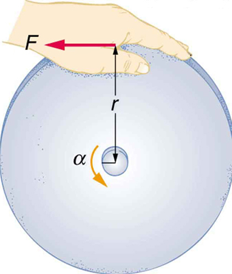

* Derive the equation for rotational work.
* Calculate rotational kinetic energy.
* Demonstrate the Law of Conservation of Energy.

In this module, we will learn about work and energy associated with rotational motion. [\[link\]](#import-auto-id3229349) shows a worker using an electric grindstone propelled by a motor. Sparks are flying, and noise and vibration are created as layers of steel are pared from the pole. The stone continues to turn even after the motor is turned off, but it is eventually brought to a stop by friction. Clearly, the motor had to work to get the stone spinning. This work went into heat, light, sound, vibration, and considerable **rotational kinetic energy**{: data-type="term" #import-auto-id2669979}.

 "){: #import-auto-id3229349}

Work must be done to rotate objects such as grindstones or merry-go-rounds. Work was defined in [Uniform Circular Motion and Gravitation](/m42140) for translational motion, and we can build on that knowledge when considering work done in rotational motion. The simplest rotational situation is one in which the net force is exerted perpendicular to the radius of a disk (as shown in [\[link\]](#import-auto-id2009471)) and remains perpendicular as the disk starts to rotate. The force is parallel to the displacement, and so the net work done is the product of the force times the arc length traveled:

<math xmlns="http://www.w3.org/1998/Math/MathML"> <semantics> <mrow> <mrow> <mrow> <mtext>net </mtext><mspace width="0.25em" /> <mi>W</mi> <mo stretchy="false">=</mo> <mo>(</mo> <mtext>net </mtext><mspace width="0.25em" /> <mi>F</mi> <mo>)</mo> <mtext>Δ</mtext> <mi fontstyle="italic">s</mi> </mrow> <mo>.</mo> </mrow> </mrow> <annotation encoding="StarMath 5.0"> size 12{"net "W= left ("net "F right ) cdot Δs} {}</annotation> </semantics> </math>

To get torque and other rotational quantities into the equation, we multiply and divide the right-hand side of the equation by <math xmlns="http://www.w3.org/1998/Math/MathML"><semantics><mrow><mrow><mi>r</mi></mrow><mrow /></mrow><annotation encoding="StarMath 5.0"> size 12{r} {}</annotation></semantics></math>

, and gather terms:

<math xmlns="http://www.w3.org/1998/Math/MathML"> <semantics> <mrow> <mrow> <mrow> <mtext>net</mtext> <mspace width="0.25em" /><mi>W</mi> <mo stretchy="false">=</mo> <mo stretchy="false">(</mo> <mi>r</mi><mspace width="0.25em" /> <mtext> net </mtext><mspace width="0.25em" /> <mi>F</mi> <mo stretchy="false">)</mo> <mfrac> <mrow> <mtext>Δ</mtext><mi>s</mi></mrow> <mi>r</mi> </mfrac> </mrow> </mrow> <mo>.</mo> <mrow /> </mrow> <annotation encoding="StarMath 5.0"> size 12{"net"W= left (r" net "F right ) { {Δs} over {r} } } {}</annotation> </semantics> </math>

We recognize that <math xmlns="http://www.w3.org/1998/Math/MathML"><semantics><mrow><mi>r</mi><mspace width="0.25em" /><mtext> net </mtext><mspace width="0.25em" /><mi>F</mi><mo stretchy="false">=</mo><mtext> net τ</mtext></mrow><annotation encoding="StarMath 5.0"> size 12{r" net "F=" net "τ} {}</annotation></semantics></math>

 and <math xmlns="http://www.w3.org/1998/Math/MathML"><semantics><mrow><mrow><mrow><mrow><mn>Δ</mn><mi fontstyle="italic">s</mi></mrow><mo stretchy="false">/</mo><mi>r</mi><mo stretchy="false">=</mo><mi>θ</mi></mrow></mrow><mrow /></mrow><annotation encoding="StarMath 5.0"> size 12{Δs/r=θ} {}</annotation></semantics></math>

, so that

<math xmlns="http://www.w3.org/1998/Math/MathML"><semantics><mrow><mrow><mrow><mtext>net </mtext><mspace width="0.25em" /><mrow><mi>W</mi><mo stretchy="false">=</mo><mfenced open="(" close=")"><mrow><mtext>net τ</mtext></mrow></mfenced></mrow><mi>θ</mi></mrow></mrow><mrow /><mo>.</mo></mrow><annotation encoding="StarMath 5.0"> size 12{"net "W= left ("net "τ right )θ} {}</annotation></semantics></math>

This equation is the expression for rotational work. It is very similar to the familiar definition of translational work as force multiplied by distance. Here, torque is analogous to force, and angle is analogous to distance. The equation <math xmlns="http://www.w3.org/1998/Math/MathML"><semantics><mrow><mrow><mrow><mtext>net </mtext><mspace width="0.25em" /><mrow><mi>W</mi><mo stretchy="false">=</mo><mfenced open="(" close=")"><mrow><mtext>net τ</mtext></mrow></mfenced></mrow><mi>θ</mi></mrow></mrow><mrow /></mrow><annotation encoding="StarMath 5.0"> size 12{"net "W= left ("net "τ right )θ} {}</annotation></semantics></math>

 is valid in general, even though it was derived for a special case.

To get an expression for rotational kinetic energy, we must again perform some algebraic manipulations. The first step is to note that <math xmlns="http://www.w3.org/1998/Math/MathML"><semantics><mrow><mrow><mrow><mtext>net τ</mtext><mo stretchy="false">=</mo><mi fontstyle="italic">Iα</mi></mrow></mrow></mrow><annotation encoding="StarMath 5.0"> size 12{"net "W=Iα} {}</annotation></semantics></math>

, so that

<math xmlns="http://www.w3.org/1998/Math/MathML"><semantics><mrow><mrow><mrow><mtext>net </mtext><mspace width="0.25em" /><mrow><mi>W</mi><mo stretchy="false">=</mo><mi>I</mi></mrow><mstyle fontstyle="italic"><mrow><mtext>αθ</mtext></mrow></mstyle></mrow></mrow><mrow /><mo>.</mo></mrow><annotation encoding="StarMath 5.0"> size 12{"net "W=I ital "αθ"} {}</annotation></semantics></math>

  cdot &#x394;s} {}. The net work goes into rotational kinetic energy."){: #import-auto-id2009471}

Making Connections

Work and energy in rotational motion are completely analogous to work and energy in translational motion, first presented in [Uniform Circular Motion and Gravitation](/m42140).

Now, we solve one of the rotational kinematics equations for <math xmlns="http://www.w3.org/1998/Math/MathML"><semantics><mrow><mrow><mstyle fontstyle="italic"><mrow><mtext>αθ</mtext></mrow></mstyle></mrow><mrow /></mrow><annotation encoding="StarMath 5.0"> size 12{ ital "αθ"} {}</annotation></semantics></math>

. We start with the equation

<math xmlns="http://www.w3.org/1998/Math/MathML"> <semantics> <mrow> <mrow> <mrow> <mrow> <msup> <mrow> <msub> <mi>ω</mi> </msub> </mrow> <mrow> <mn>2</mn> </mrow> </msup> <mo stretchy="false">=</mo> <mrow> <msup> <mrow> <msub> <mi>ω</mi> <mtext>0</mtext> </msub> </mrow> <mrow> <mn>2</mn> </mrow> </msup> <mo stretchy="false">+</mo> <mn>2</mn> </mrow> </mrow> <mstyle fontstyle="italic"> <mrow> <mtext>αθ</mtext> </mrow> </mstyle> </mrow> </mrow> <mo>.</mo> <mrow /> </mrow> <annotation encoding="StarMath 5.0"> size 12{ω rSup { size 8{2} } =ω rSub { size 8{0} rSup { size 8{2} } } +2 ital "αθ"} {}</annotation> </semantics> </math>

Next, we solve for <math xmlns="http://www.w3.org/1998/Math/MathML"><semantics><mrow><mrow><mstyle fontstyle="italic"><mrow><mtext>αθ</mtext></mrow></mstyle></mrow><mrow /></mrow><annotation encoding="StarMath 5.0"> size 12{ ital "αθ"} {}</annotation></semantics></math>

\:

<math xmlns="http://www.w3.org/1998/Math/MathML"> <semantics> <mrow> <mrow> <mrow> <mstyle fontstyle="italic"> <mrow> <mtext>αθ</mtext> </mrow> </mstyle> <mo stretchy="false">=</mo> <mfrac> <mrow> <msup> <mi>ω</mi> <mn>2</mn> </msup> <mo stretchy="false">−</mo> <msup> <mrow> <msub> <mi>ω</mi> <mtext>0</mtext> </msub> </mrow> <mrow> <mn>2</mn> </mrow> </msup> </mrow> <mn>2</mn> </mfrac> </mrow> </mrow> <mo>.</mo> <mrow /> </mrow> <annotation encoding="StarMath 5.0"> size 12{ ital "αθ"= { {ω rSup { size 8{2} } - ω rSub { size 8{0} rSup { size 8{2} } } } over {2} } } {}</annotation> </semantics> </math>

Substituting this into the equation for net <math xmlns="http://www.w3.org/1998/Math/MathML"><semantics><mrow><mrow><mi>W</mi></mrow><mrow /></mrow><annotation encoding="StarMath 5.0"> size 12{W} {}</annotation></semantics></math>

 and gathering terms yields

<math xmlns="http://www.w3.org/1998/Math/MathML"><semantics><mrow><mrow><mrow><mtext>net </mtext><mrow><mspace width="0.25em" /><mi>W</mi><mo stretchy="false">=</mo><mfrac><mn>1</mn><mn>2</mn></mfrac></mrow><mrow><msup><mi fontstyle="italic">Iω</mi><mn>2</mn></msup><mo stretchy="false">−</mo><mfrac><mn>1</mn><mn>2</mn></mfrac></mrow><mi fontstyle="italic">I</mi><msup> <mrow> <msub> <mi>ω</mi> <mtext>0</mtext> </msub> </mrow> <mrow> <mn>2</mn> </mrow> </msup></mrow></mrow><mrow /><mo>.</mo></mrow><annotation encoding="StarMath 5.0"> size 12{"net "W= { {1} over {2} } Iω rSup { size 8{2} } - { {1} over {2} } Iω rSub { size 8{0} rSup { size 8{2} } } } {}</annotation></semantics></math>

This equation is the **work-energy theorem**{: data-type="term" #import-auto-id2409820} for rotational motion only. As you may recall, net work changes the kinetic energy of a system. Through an analogy with translational motion, we define the term <math xmlns="http://www.w3.org/1998/Math/MathML"><semantics><mrow><mrow><mrow><mfenced open="(" close=")"><mfrac><mn>1</mn><mn>2</mn></mfrac></mfenced><msup><mi fontstyle="italic">Iω</mi><mrow><mn>2</mn></mrow></msup></mrow></mrow><mrow /></mrow><annotation encoding="StarMath 5.0"> size 12{ left ( { {1} over {2} } right )Iω rSup { size 8{2} } } {}</annotation></semantics></math>

 to be **rotational kinetic energy**{: data-type="term" #import-auto-id3012447} <math xmlns="http://www.w3.org/1998/Math/MathML"><semantics><mrow><mrow><mrow><msub><mtext>KE</mtext><mrow><mrow><mtext>rot</mtext></mrow></mrow></msub></mrow></mrow><mrow /></mrow><annotation encoding="StarMath 5.0"> size 12{ ital "KE" rSub { size 8{ ital "rot"} } } {}</annotation></semantics></math>

 for an object with a moment of inertia <math xmlns="http://www.w3.org/1998/Math/MathML"><semantics><mrow><mrow><mi>I</mi></mrow><mrow /></mrow><annotation encoding="StarMath 5.0"> size 12{I} {}</annotation></semantics></math>

 and an angular velocity <math xmlns="http://www.w3.org/1998/Math/MathML"><semantics><mrow><mrow><mi>ω</mi></mrow><mrow /></mrow><annotation encoding="StarMath 5.0"> size 12{ω} {}</annotation></semantics></math>

\:

<math xmlns="http://www.w3.org/1998/Math/MathML"> <semantics> <mrow> <mrow> <mrow> <mrow> <msub> <mtext>KE</mtext> <mrow> <mtext>rot</mtext> </mrow> </msub> <mo stretchy="false">=</mo> <mfrac> <mn>1</mn> <mn>2</mn> </mfrac> </mrow> <msup> <mi fontstyle="italic">Iω</mi> <mrow> <mn>2</mn> </mrow> </msup> </mrow> </mrow> <mo>.</mo> <mrow /> </mrow> <annotation encoding="StarMath 5.0"> size 12{"KE" rSub { size 8{"rot"} } = { {1} over {2} } Iω rSup { size 8{2} } } {}</annotation> </semantics> </math>

The expression for rotational kinetic energy is exactly analogous to translational kinetic energy, with <math xmlns="http://www.w3.org/1998/Math/MathML"><semantics><mrow><mrow><mi>I</mi></mrow><mrow /></mrow><annotation encoding="StarMath 5.0"> size 12{I} {}</annotation></semantics></math>

 being analogous to <math xmlns="http://www.w3.org/1998/Math/MathML"><semantics><mrow><mrow><mi>m</mi></mrow><mrow /></mrow><annotation encoding="StarMath 5.0"> size 12{m} {}</annotation></semantics></math>

 and <math xmlns="http://www.w3.org/1998/Math/MathML"><semantics><mrow><mrow><mi>ω</mi></mrow><mrow /></mrow><annotation encoding="StarMath 5.0"> size 12{ω} {}</annotation></semantics></math>

 to <math xmlns="http://www.w3.org/1998/Math/MathML"><semantics><mrow><mrow><mi>v</mi></mrow><mrow /></mrow><annotation encoding="StarMath 5.0"> size 12{v} {}</annotation></semantics></math>

. Rotational kinetic energy has important effects. Flywheels, for example, can be used to store large amounts of rotational kinetic energy in a vehicle, as seen in [\[link\]](#import-auto-id1614457).

{: #import-auto-id1614457}

Calculating the Work and Energy for Spinning a Grindstone

Consider a person who spins a large grindstone by placing her hand on its edge and exerting a force through part of a revolution as shown in [\[link\]](#import-auto-id2674234). In this example, we verify that the work done by the torque she exerts equals the change in rotational energy. (a) How much work is done if she exerts a force of 200 N through a rotation of <math xmlns="http://www.w3.org/1998/Math/MathML"><semantics><mrow><mtext>1.00 rad</mtext><mo stretchy="false">(</mo><mn>57.3º</mn><mo stretchy="false">)</mo></mrow><annotation encoding="StarMath 5.0"> size 12{1 "." "00"`"rad" \( "57" "." 3 \) rSup { size 8{ circ } } } {}</annotation></semantics></math>

? The force is kept perpendicular to the grindstone’s 0.320-m radius at the point of application, and the effects of friction are negligible. (b) What is the final angular velocity if the grindstone has a mass of 85.0 kg? (c) What is the final rotational kinetic energy? (It should equal the work.)

**Strategy**

To find the work, we can use the equation <math xmlns="http://www.w3.org/1998/Math/MathML"><semantics><mrow><mrow><mrow><mtext>net </mtext><mspace width="0.25em" /><mrow><mi>W</mi><mo stretchy="false">=</mo><mfenced open="(" close=")"><mrow><mtext>net τ</mtext></mrow></mfenced></mrow><mi>θ</mi></mrow></mrow><mrow /></mrow><annotation encoding="StarMath 5.0"> size 12{"net "W= left ("net "τ right )θ} {}</annotation></semantics></math>

. We have enough information to calculate the torque and are given the rotation angle. In the second part, we can find the final angular velocity using one of the kinematic relationships. In the last part, we can calculate the rotational kinetic energy from its expression in <math xmlns="http://www.w3.org/1998/Math/MathML"><semantics><mrow><mrow><mrow><mrow><msub><mtext>KE</mtext><mrow><mtext>rot</mtext></mrow></msub><mo stretchy="false">=</mo><mfrac><mn>1</mn><mn>2</mn></mfrac></mrow><msup><mi fontstyle="italic">Iω</mi><mrow><mn>2</mn></mrow></msup></mrow></mrow><mrow /></mrow><annotation encoding="StarMath 5.0"> size 12{"KE" rSub { size 8{"rot"} } = { {1} over {2} } Iω rSup { size 8{2} } } {}</annotation></semantics></math>

.

**Solution for (a)**

The net work is expressed in the equation

<math xmlns="http://www.w3.org/1998/Math/MathML"><semantics><mrow><mrow><mrow><mtext>net </mtext><mspace width="0.25em" /><mrow><mi>W</mi><mo stretchy="false">=</mo><mfenced open="(" close=")"><mrow><mtext>net τ</mtext></mrow></mfenced></mrow><mi>θ</mi></mrow></mrow><mo>,</mo><mrow /></mrow><annotation encoding="StarMath 5.0"> size 12{"net "W= left ("net "τ right )θ} {}</annotation></semantics></math>

where net <math xmlns="http://www.w3.org/1998/Math/MathML"><semantics><mrow><mrow><mi>τ</mi></mrow><mrow /></mrow><annotation encoding="StarMath 5.0"> size 12{τ} {}</annotation></semantics></math>

 is the applied force multiplied by the radius <math xmlns="http://www.w3.org/1998/Math/MathML"><semantics><mrow><mrow><mrow><mo stretchy="false">(</mo><mstyle fontstyle="italic"><mrow><mtext>rF</mtext></mrow></mstyle><mo stretchy="false">)</mo></mrow></mrow><mrow /></mrow><annotation encoding="StarMath 5.0"> size 12{ \( ital "rF" \) } {}</annotation></semantics></math>

 because there is no retarding friction, and the force is perpendicular to <math xmlns="http://www.w3.org/1998/Math/MathML"><semantics><mrow><mrow><mi>r</mi></mrow><mrow /></mrow><annotation encoding="StarMath 5.0"> size 12{r} {}</annotation></semantics></math>

. The angle <math xmlns="http://www.w3.org/1998/Math/MathML"><semantics><mrow><mrow><mi>θ</mi></mrow><mrow /></mrow><annotation encoding="StarMath 5.0"> size 12{θ} {}</annotation></semantics></math>

 is given. Substituting the given values in the equation above yields

<math xmlns="http://www.w3.org/1998/Math/MathML"><semantics><mrow><mrow><mtable columnalign="left"><mtr> <mtd><mtext>net </mtext><mspace width="0.25em" /><mi>W</mi></mtd> <mtd><mo stretchy="false">=</mo></mtd> <mtd><mrow><mrow><mrow><mrow><mstyle fontstyle="italic"><mrow><mtext>rF</mtext></mrow></mstyle></mrow><mrow> <mi>θ</mi><mo stretchy="false">=</mo><mfenced open="(" close=")"> <mtext>0.320 m</mtext> </mfenced></mrow><mfenced open="(" close=")"> <mrow><mtext>200 N</mtext></mrow></mfenced><mfenced open="(" close=")"><mrow> <mtext>1.00 rad</mtext></mrow></mfenced></mrow></mrow><mrow /></mrow></mtd></mtr> <mtr><mtd /><mtd><mo stretchy="false">=</mo></mtd> <mtd><mrow><mrow><mrow><mtext>64.0 N</mtext><mo stretchy="false">⋅</mo><mtext>m.</mtext></mrow></mrow></mrow></mtd></mtr></mtable><mrow /></mrow></mrow></semantics></math>

Noting that <math xmlns="http://www.w3.org/1998/Math/MathML"><semantics><mrow><mn>1 N</mn><mo>·</mo><mtext>m</mtext><mo>=</mo><mn>1 J</mn></mrow></semantics></math>

,

<math xmlns="http://www.w3.org/1998/Math/MathML"><semantics><mrow><mrow><mrow><mtext>net </mtext><mspace width="0.25em" /><mi>W</mi><mo stretchy="false">=</mo><mtext>64.0 J</mtext></mrow></mrow><mo>.</mo></mrow><annotation encoding="StarMath 5.0"> size 12{"net "W="64" "." 0" J"} {}</annotation></semantics></math>

{: #import-auto-id2674234 height="225"}

**Solution for (b)**

To find <math xmlns="http://www.w3.org/1998/Math/MathML"><semantics><mrow><mrow><mi>ω</mi></mrow><mrow /></mrow><annotation encoding="StarMath 5.0"> size 12{ω} {}</annotation></semantics></math>

 from the given information requires more than one step. We start with the kinematic relationship in the equation

<math xmlns="http://www.w3.org/1998/Math/MathML"><semantics><mrow><mrow><mrow><mrow><msup><mi>ω</mi><mrow><mn>2</mn></mrow></msup><mo stretchy="false">=</mo><mrow><msup> <mrow> <msub> <mi>ω</mi> <mtext>0</mtext> </msub> </mrow> <mrow> <mn>2</mn> </mrow> </msup><mo stretchy="false">+</mo><mn>2</mn></mrow></mrow><mstyle fontstyle="italic"><mrow><mtext>αθ</mtext></mrow></mstyle></mrow></mrow><mrow /><mo>.</mo></mrow><annotation encoding="StarMath 5.0"> size 12{ω rSup { size 8{2} } =ω rSub { size 8{0} rSup { size 8{2} } } +2 ital "αθ"} {}</annotation></semantics></math>

Note that <math xmlns="http://www.w3.org/1998/Math/MathML"><semantics><mrow><mrow><mrow><msub><mi>ω</mi><mrow><mn>0</mn></mrow></msub><mo stretchy="false">=</mo><mn>0</mn></mrow></mrow><mrow /></mrow><annotation encoding="StarMath 5.0"> size 12{ω rSub { size 8{0} } =0} {}</annotation></semantics></math>

 because we start from rest. Taking the square root of the resulting equation gives

<math xmlns="http://www.w3.org/1998/Math/MathML"><semantics><mrow><mrow><mrow><mi>ω</mi><mo stretchy="false">=</mo><msup><mfenced open="(" close=")"><mrow><mn>2</mn><mstyle fontstyle="italic"><mrow><mtext>αθ</mtext></mrow></mstyle></mrow></mfenced><mrow><mrow><mn>1</mn><mo stretchy="false">/</mo><mn>2</mn></mrow></mrow></msup></mrow></mrow><mrow /><mo>.</mo></mrow><annotation encoding="StarMath 5.0"> size 12{ω= left (2 ital "αθ" right ) rSup { size 8{1/2} } } {}</annotation></semantics></math>

Now we need to find <math xmlns="http://www.w3.org/1998/Math/MathML"><semantics><mrow><mrow><mi>α</mi></mrow><mrow /></mrow><annotation encoding="StarMath 5.0"> size 12{α} {}</annotation></semantics></math>

. One possibility is

<math xmlns="http://www.w3.org/1998/Math/MathML"><semantics><mrow><mrow><mrow><mi>α</mi><mo stretchy="false">=</mo><mfrac><mrow><mtext>net τ</mtext></mrow><mi>I</mi></mfrac></mrow></mrow><mrow /><mo>,</mo></mrow><annotation encoding="StarMath 5.0"> size 12{α= { {"net "τ} over {I} } } {}</annotation></semantics></math>

where the torque is

<math xmlns="http://www.w3.org/1998/Math/MathML"><semantics><mrow><mrow><mrow><mtext>net τ</mtext><mo stretchy="false">=</mo><mstyle fontstyle="italic"><mrow><mtext>rF</mtext></mrow></mstyle></mrow><mo stretchy="false">=</mo><mfenced open="(" close=")"><mrow><mtext>0.320 m</mtext></mrow></mfenced><mrow><mfenced open="(" close=")"><mrow><mtext>200 N</mtext></mrow></mfenced><mo stretchy="false">=</mo><mtext>64.0 N</mtext><mo stretchy="false">⋅</mo><mtext>m</mtext></mrow></mrow><mrow /><mo>.</mo></mrow><annotation encoding="StarMath 5.0"> size 12{"net "τ= ital "rF"= left (0 "." "320"" m" right ) left ("200"" N" right )="64" "." 0" N" cdot m} {}</annotation></semantics></math>

The formula for the moment of inertia for a disk is found in [\[link\]](/m42179#fs-id1838666)\:

<math xmlns="http://www.w3.org/1998/Math/MathML"> <semantics> <mrow> <mi>I</mi> <mo stretchy="false">=</mo> <mfrac> <mn>1</mn> <mn>2</mn> </mfrac> <msup> <mstyle fontstyle="italic"> <mtext>MR</mtext> </mstyle> <mn>2</mn> </msup> <mo stretchy="false">=</mo> <mn>0.5</mn> <mfenced open="(" close=")"> <mtext>85.0 kg</mtext> </mfenced> <msup> <mfenced open="(" close=")"> <mtext>0.320 m</mtext> </mfenced> <mn>2</mn> </msup> <mo stretchy="false">=</mo> <mtext>4.352 kg</mtext> <mo stretchy="false">⋅</mo> <msup> <mtext>m</mtext> <mn>2</mn> </msup> <mo>.</mo> </mrow> <annotation encoding="StarMath 5.0"> size 12{I= { {1} over {2} } ital "MR" rSup { size 8{2} } =0 "." 5 left ("85" "." 0" kg" right ) left (0 "." "320"" m" right ) rSup { size 8{2} } =4 "." "352"" kg" cdot m rSup { size 8{2} } } {}</annotation> </semantics> </math>

Substituting the values of torque and moment of inertia into the expression for <math xmlns="http://www.w3.org/1998/Math/MathML"><semantics><mrow><mrow><mi>α</mi></mrow><mrow /></mrow><annotation encoding="StarMath 5.0"> size 12{α} {}</annotation></semantics></math>

, we obtain

<math xmlns="http://www.w3.org/1998/Math/MathML"><semantics><mrow><mrow><mrow><mrow><mrow><mi>α</mi><mo stretchy="false">=</mo><mfrac><mrow><mtext>64</mtext><mtext>.</mtext><mrow><mtext>0 N</mtext><mo stretchy="false">⋅</mo><mtext>m</mtext></mrow></mrow><mrow><mtext>4.352 kg</mtext><mrow><mo stretchy="false">⋅</mo><msup><mtext>m</mtext><mrow><mn>2</mn></mrow></msup></mrow></mrow></mfrac></mrow></mrow><mo stretchy="false">=</mo><mtext>14.7</mtext><mfrac><mtext>rad</mtext><msup><mtext>s</mtext><mrow><mn>2</mn></mrow></msup></mfrac></mrow></mrow><mrow /><mo>.</mo></mrow><annotation encoding="StarMath 5.0"> size 12{α= { {"64" "." "0 N" cdot m} over {4 "." "352"" kg" cdot m rSup { size 8{2} } } } ="14" "." 7 { {"rad"} over {s rSup { size 8{2} } } } } {}</annotation></semantics></math>

Now, substitute this value and the given value for <math xmlns="http://www.w3.org/1998/Math/MathML"><semantics><mrow><mrow><mi>θ</mi></mrow><mrow /></mrow><annotation encoding="StarMath 5.0"> size 12{θ} {}</annotation></semantics></math>

 into the above expression for <math xmlns="http://www.w3.org/1998/Math/MathML"><semantics><mrow><mrow><mi>ω</mi></mrow><mrow /></mrow><annotation encoding="StarMath 5.0"> size 12{ω} {}</annotation></semantics></math>

\:

<math xmlns="http://www.w3.org/1998/Math/MathML"> <semantics> <mrow> <mrow> <mrow> <mrow> <mrow> <mrow> <mi>ω</mi> <mo stretchy="false">=</mo> <msup> <mfenced open="(" close=")"> <mrow> <mn>2</mn> <mstyle fontstyle="italic"> <mrow> <mtext>αθ</mtext> </mrow> </mstyle> </mrow> </mfenced> <mrow> <mrow> <mn>1</mn> <mo stretchy="false">/</mo> <mn>2</mn> </mrow> </mrow> </msup> </mrow> <mo stretchy="false">=</mo> <msup> <mfenced open="[" close="]"> <mrow> <mn>2</mn> <mfenced open="(" close=")"> <mrow> <mtext>14.7</mtext> <mfrac> <mtext>rad</mtext> <msup> <mtext>s</mtext> <mrow> <mn>2</mn> </mrow> </msup> </mfrac> </mrow> </mfenced> <mfenced open="(" close=")"> <mrow> <mtext>1.00 rad</mtext> </mrow> </mfenced> </mrow> </mfenced> <mrow> <mn>1</mn> <mo stretchy="false">/</mo> <mn>2</mn> </mrow> </msup> </mrow> </mrow> <mo stretchy="false">=</mo> <mtext>5.42</mtext> <mfrac> <mtext>rad</mtext> <mtext>s</mtext> </mfrac> </mrow> </mrow> <mo>.</mo> </mrow> <annotation encoding="StarMath 5.0"> size 12{ω= left (2 ital "αθ" right ) rSup { size 8{1/2} } = left [2 left ("14" "." 7 { {"rad"} over {s rSup { size 8{2} } } } right ) left (1 "." "00"" rad" right ) right ] rSup { size 8{1/2} } =5 "." "42" { {"rad"} over {s} } } {}</annotation> </semantics> </math>

**Solution for (c)**

The final rotational kinetic energy is

<math xmlns="http://www.w3.org/1998/Math/MathML"><semantics><mrow><mrow><mrow><mrow><msub><mtext>KE</mtext><mrow><mtext>rot</mtext></mrow></msub><mo stretchy="false">=</mo><mfrac><mn>1</mn><mn>2</mn></mfrac></mrow><msup><mi fontstyle="italic">Iω</mi><mrow><mn>2</mn></mrow></msup></mrow></mrow><mrow /><mo>.</mo></mrow><annotation encoding="StarMath 5.0"> size 12{"KE" rSub { size 8{"rot"} } = { {1} over {2} } Iω rSup { size 8{2} } } {}</annotation></semantics></math>

Both <math xmlns="http://www.w3.org/1998/Math/MathML"><semantics><mrow><mrow><mi>I</mi></mrow><mrow /></mrow><annotation encoding="StarMath 5.0"> size 12{I} {}</annotation></semantics></math>

 and <math xmlns="http://www.w3.org/1998/Math/MathML"><semantics><mrow><mrow><mi>ω</mi></mrow><mrow /></mrow><annotation encoding="StarMath 5.0"> size 12{ω} {}</annotation></semantics></math>

 were found above. Thus,

<math xmlns="http://www.w3.org/1998/Math/MathML"><semantics> <mrow> <mrow> <mrow> <msub> <mrow> <mtext>KE</mtext> </mrow> <mrow> <mtext>rot</mtext> </mrow> </msub> <mo stretchy="false">=</mo> <mfenced open="(" close=")"> <mn>0.5</mn> </mfenced> <mfenced open="(" close=")"><mrow><mtext>4.352 kg</mtext><mo stretchy="false">⋅</mo><msup><mtext>m</mtext><mn>2</mn></msup></mrow></mfenced><mrow><msup><mfenced open="(" close=")"><mrow><mtext>5.42 rad/s</mtext></mrow></mfenced><mrow><mn>2</mn></mrow></msup></mrow><mo stretchy="false">=</mo><mtext>64.0 J</mtext></mrow></mrow><mrow /><mo>.</mo></mrow><annotation encoding="StarMath 5.0"> size 12{"KE" rSub { size 8{"rot"} } =0 "." 5 left (4 "." "352"" kg" cdot m rSup { size 8{2} } right ) left (5 "." "42"" rad/s" right ) rSup { size 8{2} } ="64" "." 0" J"} {}</annotation></semantics></math>

**Discussion**

The final rotational kinetic energy equals the work done by the torque, which confirms that the work done went into rotational kinetic energy. We could, in fact, have used an expression for energy instead of a kinematic relation to solve part (b). We will do this in later examples.

Helicopter pilots are quite familiar with rotational kinetic energy. They know, for example, that a point of no return will be reached if they allow their blades to slow below a critical angular velocity during flight. The blades lose lift, and it is impossible to immediately get the blades spinning fast enough to regain it. Rotational kinetic energy must be supplied to the blades to get them to rotate faster, and enough energy cannot be supplied in time to avoid a crash. Because of weight limitations, helicopter engines are too small to supply both the energy needed for lift and to replenish the rotational kinetic energy of the blades once they have slowed down. The rotational kinetic energy is put into them before takeoff and must not be allowed to drop below this crucial level. One possible way to avoid a crash is to use the gravitational potential energy of the helicopter to replenish the rotational kinetic energy of the blades by losing altitude and aligning the blades so that the helicopter is spun up in the descent. Of course, if the helicopter’s altitude is too low, then there is insufficient time for the blade to regain lift before reaching the ground.

Problem-Solving Strategy for Rotational Energy

1.  {: #import-auto-id3054599} *Determine that energy or work is involved in the rotation*.
2.  {: #import-auto-id1389478} *Determine the system of interest*. A sketch usually helps.
3.  {: #import-auto-id2930250} *Analyze the situation to determine the types of work and energy involved*.
4.  {: #import-auto-id2937257} *For closed systems, mechanical energy is conserved*. That is,
    <math xmlns="http://www.w3.org/1998/Math/MathML"><semantics><mrow><mrow><mrow><mrow><msub><mtext>KE</mtext><mrow><mtext>i</mtext></mrow></msub><mo stretchy="false">+</mo><msub><mtext>PE</mtext><mrow><mtext>i</mtext></mrow></msub></mrow><mo stretchy="false">=</mo><mrow><msub><mtext>KE</mtext><mrow><mtext>f</mtext></mrow></msub><mo stretchy="false">+</mo><msub><mtext>PE</mtext><mrow><mtext>f</mtext></mrow></msub></mrow></mrow></mrow><mrow /><mo>.</mo></mrow><annotation encoding="StarMath 5.0"> size 12{"KE" rSub { size 8{i} } +"PE" rSub { size 8{i} } ="KE" rSub { size 8{f} } +"PE" rSub { size 8{f} } } {}</annotation></semantics></math>
    
    Note that
    <math xmlns="http://www.w3.org/1998/Math/MathML"><semantics><mrow><mrow><msub><mtext>KE</mtext><mrow><mtext>i</mtext></mrow></msub></mrow><mrow /></mrow><annotation encoding="StarMath 5.0"> size 12{"KE" rSub { size 8{i} } } {}</annotation></semantics></math>
    
    and
    <math xmlns="http://www.w3.org/1998/Math/MathML"><semantics><mrow><msub><mtext>KE</mtext><mtext>f</mtext></msub></mrow></semantics></math>
    
    may each include translational and rotational contributions.
5.  {: #import-auto-id1439188} *For open systems*, mechanical energy may not be conserved, and other forms of energy (referred to previously as
    <math xmlns="http://www.w3.org/1998/Math/MathML"><semantics><mrow><mrow><mstyle fontstyle="italic"><mrow><mtext>OE</mtext></mrow></mstyle></mrow><mrow /></mrow><annotation encoding="StarMath 5.0"> size 12{ ital "OE"} {}</annotation></semantics></math>
    
    ), such as heat transfer, may enter or leave the system. Determine what they are, and calculate them as necessary.
6.  {: #import-auto-id1429438} *Eliminate terms wherever possible to simplify the algebra*.
7.  {: #import-auto-id3386776} *Check the answer to see if it is reasonable*.
{: data-number-style="arabic"}

Calculating Helicopter Energies

A typical small rescue helicopter, similar to the one in [\[link\]](#import-auto-id2420248), has four blades, each is 4.00 m long and has a mass of 50.0 kg. The blades can be approximated as thin rods that rotate about one end of an axis perpendicular to their length. The helicopter has a total loaded mass of 1000 kg. (a) Calculate the rotational kinetic energy in the blades when they rotate at 300 rpm. (b) Calculate the translational kinetic energy of the helicopter when it flies at 20.0 m/s, and compare it with the rotational energy in the blades. (c) To what height could the helicopter be raised if all of the rotational kinetic energy could be used to lift it?

**Strategy**

Rotational and translational kinetic energies can be calculated from their definitions. The last part of the problem relates to the idea that energy can change form, in this case from rotational kinetic energy to gravitational potential energy.

**Solution for (a)**

The rotational kinetic energy is

<math xmlns="http://www.w3.org/1998/Math/MathML"><semantics><mrow><mrow><mrow><mrow><msub><mtext>KE</mtext><mrow><mtext>rot</mtext></mrow></msub><mo stretchy="false">=</mo><mfrac><mn>1</mn><mn>2</mn></mfrac></mrow><msup><mi fontstyle="italic">Iω</mi><mrow><mn>2</mn></mrow></msup></mrow></mrow><mrow /><mo>.</mo></mrow><annotation encoding="StarMath 5.0"> size 12{"KE" rSub { size 8{"rot"} } = { {1} over {2} } Iω rSup { size 8{2} } } {}</annotation></semantics></math>

We must convert the angular velocity to radians per second and calculate the moment of inertia before we can find <math xmlns="http://www.w3.org/1998/Math/MathML"><semantics><mrow><msub><mtext>KE</mtext><mtext>rot</mtext></msub></mrow></semantics></math>

. The angular velocity <math xmlns="http://www.w3.org/1998/Math/MathML"><semantics><mrow><mi>ω</mi></mrow><annotation encoding="StarMath 5.0"> size 12{ω} {}</annotation></semantics></math>

 is

<math xmlns="http://www.w3.org/1998/Math/MathML"><semantics><mrow><mrow><mrow><mrow><mrow><mi>ω</mi><mo stretchy="false">=</mo><mrow><mrow><mfrac><mrow><mtext>300 rev</mtext></mrow><mrow><mtext>1.00 min</mtext></mrow></mfrac><mo stretchy="false">⋅</mo><mfrac><mrow><mtext>2π rad</mtext></mrow><mtext>1 rev</mtext></mfrac></mrow><mo stretchy="false">⋅</mo><mfrac><mrow><mtext>1.00 min</mtext></mrow><mrow><mtext>60.0 s</mtext></mrow></mfrac></mrow></mrow></mrow><mo stretchy="false">=</mo><mtext>31.4</mtext><mfrac><mtext>rad</mtext><mtext>s</mtext></mfrac></mrow></mrow><mrow /><mo>.</mo></mrow><annotation encoding="StarMath 5.0"> size 12{ω= { {"300"" rev"} over {1 "." "00 min"} } cdot { {2π" rad"} over {"1 rev"} } cdot { {1 "." "00"" min"} over {"60" "." 0" s"} } ="31" "." 4 { {"rad"} over {s} } } {}</annotation></semantics></math>

The moment of inertia of one blade will be that of a thin rod rotated about its end, found in [\[link\]](/m42179#fs-id1838666). The total <math xmlns="http://www.w3.org/1998/Math/MathML"><semantics><mrow><mrow><mi>I</mi></mrow><mrow /></mrow><annotation encoding="StarMath 5.0"> size 12{I} {}</annotation></semantics></math>

 is four times this moment of inertia, because there are four blades. Thus,

<math xmlns="http://www.w3.org/1998/Math/MathML"><semantics><mrow><mrow><mrow><mrow><mi>I</mi><mo stretchy="false">=</mo><mn>4</mn></mrow><mrow><mrow><mfrac><msup><mi fontstyle="italic">Mℓ</mi><mrow><mn>2</mn></mrow></msup><mn>3</mn></mfrac><mo stretchy="false">=</mo><mrow><mn>4</mn><mo stretchy="false">×</mo><mfrac><mrow><mfenced open="(" close=")"><mrow><mtext>50.0 kg</mtext></mrow></mfenced><msup><mfenced open="(" close=")"><mrow><mtext>4.00 m</mtext></mrow></mfenced><mrow><mn>2</mn></mrow></msup></mrow><mn>3</mn></mfrac></mrow></mrow><mo stretchy="false">=</mo><mtext>1067 kg</mtext><mo stretchy="false">⋅</mo><msup><mtext>m</mtext><mrow><mn>2</mn></mrow></msup></mrow></mrow></mrow><mrow /><mo>.</mo></mrow><annotation encoding="StarMath 5.0"> size 12{I=4 { {Mℓ rSup { size 8{2} } } over {3} } =4 times { { left ("50" "." 0" kg" right ) left (4 "." "00"" m" right ) rSup { size 8{2} } } over {3} } ="1067"" kg" cdot m rSup { size 8{2} } } {}</annotation></semantics></math>

Entering <math xmlns="http://www.w3.org/1998/Math/MathML"><semantics><mrow><mrow><mi>ω</mi></mrow><mrow /></mrow><annotation encoding="StarMath 5.0"> size 12{ω} {}</annotation></semantics></math>

 and <math xmlns="http://www.w3.org/1998/Math/MathML"><semantics><mrow><mrow><mi>I</mi></mrow><mrow /></mrow><annotation encoding="StarMath 5.0"> size 12{I} {}</annotation></semantics></math>

 into the expression for rotational kinetic energy gives

<math xmlns="http://www.w3.org/1998/Math/MathML"> <semantics> <mrow> <mrow> <mtable columnalign="left"> <mtr><mtd> <msub> <mtext>KE</mtext> <mtext>rot</mtext> </msub></mtd><mtd> <mo stretchy="false">=</mo></mtd> <mtd> <mrow> <mrow> <mrow> <mn>0.5</mn> <mo stretchy="false">(</mo> <mtext>1067 kg</mtext> <mo stretchy="false">⋅</mo> <msup> <mtext>m</mtext> <mn>2</mn> </msup> <mo stretchy="false">)</mo> <msup> <mfenced open="(" close=")"> <mtext>31.4 rad/s</mtext> </mfenced> <mn>2</mn> </msup> </mrow> </mrow> </mrow></mtd> </mtr> <mtr><mtd /> <mtd> <mo stretchy="false">=</mo></mtd> <mtd> <mrow> <mrow> </mrow> <mn>5.26</mn> <mo stretchy="false">×</mo> <msup> <mtext>10</mtext> <mn>5</mn> </msup><mspace width="0.25em" /> <mtext> J</mtext> </mrow></mtd> </mtr> </mtable> <mrow /> </mrow> </mrow> <annotation encoding="StarMath 5.0">alignl { stack { size 12{"KE" rSub { size 8{"rot"} } =0 "." 5 left ("1067"" kg" cdot m rSup { size 8{2} } right ) left ("31" "." 4" rad/s" right ) rSup { size 8{2} } } {} # " "=5 "." "26" times "10" rSup { size 8{5} } " J" {} } } {}</annotation> </semantics> </math>

**Solution for (b)**

Translational kinetic energy was defined in [Uniform Circular Motion and Gravitation](/m42140). Entering the given values of mass and velocity, we obtain

<math xmlns="http://www.w3.org/1998/Math/MathML"><semantics><mrow><mrow><mrow><mrow><msub><mtext>KE</mtext><mtext>trans</mtext></msub><mo stretchy="false">=</mo><mfrac><mn>1</mn><mn>2</mn></mfrac></mrow><mrow><mrow><msup><mi mathvariant="italic">mv</mi><mrow><mn>2</mn></mrow></msup></mrow><mo stretchy="false">=</mo><mfenced open="(" close=")"><mn>0.5</mn></mfenced></mrow><mfenced open="(" close=")"><mrow><mtext>1000 kg</mtext></mrow></mfenced><mrow><msup><mfenced open="(" close=")"><mrow><mtext>20.0 m/s</mtext></mrow></mfenced><mrow><mn>2</mn></mrow></msup><mo stretchy="false">=</mo><mn>2</mn></mrow><mtext>.</mtext><mrow><mtext>00</mtext><mo stretchy="false">×</mo><msup><mtext>10</mtext><mrow><mn>5</mn></mrow></msup></mrow><mspace width="0.25em" /><mtext> J</mtext></mrow></mrow><mrow /><mo>.</mo></mrow><annotation encoding="StarMath 5.0"> size 12{"KE" rSub { size 8{"trans"} } = { {1} over {2} } ital "mv" rSup { size 8{2} } =0 "." 5 left ("1000"" kg" right ) left ("20" "." 0" m/s" right ) rSup { size 8{2} } =2 "." "00" times "10" rSup { size 8{5} } " J"} {}</annotation></semantics></math>

To compare kinetic energies, we take the ratio of translational kinetic energy to rotational kinetic energy. This ratio is

<math xmlns="http://www.w3.org/1998/Math/MathML"><semantics><mrow><mrow><mrow><mrow><mfrac><mrow><mn>2</mn><mtext>.</mtext><mrow><mtext>00</mtext><mo stretchy="false">×</mo><msup><mtext>10</mtext><mrow><mn>5</mn></mrow></msup></mrow><mspace width="0.25em" /><mtext> J</mtext></mrow><mrow><mn>5</mn><mtext>.</mtext><mrow><mtext>26</mtext><mo stretchy="false">×</mo><msup><mtext>10</mtext><mrow><mn>5</mn></mrow></msup></mrow><mspace width="0.25em" /><mtext> J</mtext></mrow></mfrac></mrow><mo stretchy="false">=</mo><mn>0.380</mn></mrow></mrow><mo>.</mo></mrow><annotation encoding="StarMath 5.0"> size 12{ { {2 "." "00" times "10" rSup { size 8{5} } " J"} over {5 "." "26" times "10" rSup { size 8{5} } " J"} } =0 "." "380"} {}</annotation></semantics></math>

**Solution for (c)**

At the maximum height, all rotational kinetic energy will have been converted to gravitational energy. To find this height, we equate those two energies:

<math xmlns="http://www.w3.org/1998/Math/MathML"> <semantics> <mrow> <mrow> <mrow> <msub> <mtext>KE</mtext> <mrow> <mtext>rot</mtext> </mrow> </msub> <mo stretchy="false">=</mo> <msub> <mtext>PE</mtext> <mrow> <mtext>grav</mtext> </mrow> </msub> </mrow> </mrow> <mrow /> </mrow> <annotation encoding="StarMath 5.0"> size 12{"KE" rSub { size 8{"rot"} } ="PE" rSub { size 8{"grav"} } } {}</annotation> </semantics> </math>

or

<math xmlns="http://www.w3.org/1998/Math/MathML"> <semantics> <mrow> <mrow> <mrow> <mfrac> <mn>1</mn> <mn>2</mn> </mfrac> <mrow> <msup> <mi fontstyle="italic">Iω</mi> <mrow> <mn>2</mn> </mrow> </msup> <mo stretchy="false">=</mo> <mstyle fontstyle="italic"> <mrow> <mtext>mgh</mtext> </mrow> </mstyle> </mrow> </mrow> </mrow> <mo>.</mo> <mrow /> </mrow> <annotation encoding="StarMath 5.0"> size 12{ { {1} over {2} } Iω rSup { size 8{2} } = ital "mgh"} {}</annotation> </semantics> </math>

We now solve for <math xmlns="http://www.w3.org/1998/Math/MathML"><semantics><mrow><mrow><mi>h</mi></mrow><mrow /></mrow><annotation encoding="StarMath 5.0"> size 12{h} {}</annotation></semantics></math>

 and substitute known values into the resulting equation

<math xmlns="http://www.w3.org/1998/Math/MathML"> <semantics> <mrow> <mrow> <mrow> <mrow> <mrow> <mrow> <mi>h</mi> <mo stretchy="false">=</mo> <mfrac> <mrow> <msup><mrow><mfrac><mn>1</mn><mn>2</mn></mfrac> <mi fontstyle="italic">Iω</mi> </mrow> <mrow> <mn>2</mn> </mrow> </msup> </mrow> <mstyle fontstyle="italic"> <mrow> <mtext>mg</mtext> </mrow> </mstyle> </mfrac> </mrow> <mo stretchy="false">=</mo> <mfrac> <mrow> <mn>5.26</mn> <mo stretchy="false">×</mo> <mrow> <msup> <mtext>10</mtext> <mn>5</mn> </msup> </mrow><mspace width="0.25em" /> <mtext> J</mtext> </mrow> <mrow> <mfenced open="(" close=")"> <mrow> <mtext>1000 kg</mtext> </mrow> </mfenced> <mfenced open="(" close=")"> <mrow> <mn>9.80</mn><mspace width="0.25em" /> <msup> <mtext> m/s</mtext> <mrow> <mn>2</mn> </mrow> </msup> </mrow> </mfenced> </mrow> </mfrac> </mrow> </mrow> <mo stretchy="false">=</mo> <mtext>53.7 m</mtext> </mrow> </mrow> <mo>.</mo> <mrow /> </mrow> <annotation encoding="StarMath 5.0"> size 12{h= { { { size 8{1} } wideslash { size 8{2} } Iω rSup { size 8{2} } } over { ital "mg"} } = { {5 "." "26" times "10" rSup { size 8{5} } " J"} over { left ("1000"" kg" right ) left (9 "." "80"" m/s" rSup { size 8{2} } right )} } ="53" "." 7" m"} {}</annotation> </semantics> </math>

**Discussion**

The ratio of translational energy to rotational kinetic energy is only 0.380. This ratio tells us that most of the kinetic energy of the helicopter is in its spinning blades—something you probably would not suspect. The 53.7 m height to which the helicopter could be raised with the rotational kinetic energy is also impressive, again emphasizing the amount of rotational kinetic energy in the blades.

 "){: #import-auto-id2420248 height="300"}

Making Connections

Conservation of energy includes rotational motion, because rotational kinetic energy is another form of <math xmlns="http://www.w3.org/1998/Math/MathML"> <semantics> <mrow> <mrow> <mtext>KE</mtext> </mrow> <mrow /> </mrow> <annotation encoding="StarMath 5.0"> size 12{"KE"} {}</annotation> </semantics> </math>

 . [Uniform Circular Motion and Gravitation](/m42140) has a detailed treatment of conservation of energy.

### How Thick Is the Soup? Or Why Don’t All Objects Roll Downhill at the Same Rate?

One of the quality controls in a tomato soup factory consists of rolling filled cans down a ramp. If they roll too fast, the soup is too thin. Why should cans of identical size and mass roll down an incline at different rates? And why should the thickest soup roll the slowest?

The easiest way to answer these questions is to consider energy. Suppose each can starts down the ramp from rest. Each can starting from rest means each starts with the same gravitational potential energy <math xmlns="http://www.w3.org/1998/Math/MathML"><semantics><mrow><mrow><mrow><msub><mtext>PE</mtext><mrow><mrow><mtext>grav</mtext></mrow></mrow></msub></mrow></mrow><mrow /></mrow><annotation encoding="StarMath 5.0"> size 12{ ital "PE" rSub { size 8{ ital "grav"} } } {}</annotation></semantics></math>

, which is converted entirely to <math xmlns="http://www.w3.org/1998/Math/MathML"><semantics><mrow><mtext>KE</mtext></mrow></semantics></math>

, provided each rolls without slipping. <math xmlns="http://www.w3.org/1998/Math/MathML"><semantics><mrow><mtext>KE</mtext></mrow></semantics></math>

, however, can take the form of <math xmlns="http://www.w3.org/1998/Math/MathML"><semantics><mrow><mrow><mrow><msub><mtext>KE</mtext><mrow><mrow><mtext>trans</mtext></mrow></mrow></msub></mrow></mrow><mrow /></mrow><annotation encoding="StarMath 5.0"> size 12{ ital "KE" rSub { size 8{ ital "trans"} } } {}</annotation></semantics></math>

 or <math xmlns="http://www.w3.org/1998/Math/MathML"><semantics><mrow><mrow><mrow><msub><mtext>KE</mtext><mrow><mrow><mtext>rot</mtext></mrow></mrow></msub></mrow></mrow><mrow /></mrow><annotation encoding="StarMath 5.0"> size 12{ ital "KE" rSub { size 8{ ital "rot"} } } {}</annotation></semantics></math>

, and total <math xmlns="http://www.w3.org/1998/Math/MathML"><semantics><mrow><mtext>KE</mtext></mrow></semantics></math>

 is the sum of the two. If a can rolls down a ramp, it puts part of its energy into rotation, leaving less for translation. Thus, the can goes slower than it would if it slid down. Furthermore, the thin soup does not rotate, whereas the thick soup does, because it sticks to the can. The thick soup thus puts more of the can’s original gravitational potential energy into rotation than the thin soup, and the can rolls more slowly, as seen in [\[link\]](#import-auto-id3105621).

. The third can contains thick soup. It comes in third because the soup rotates along with the can, taking even more of the initial PE for rotational KE, leaving less for translational KE."){: #import-auto-id3105621}

Assuming no losses due to friction, there is only one force doing work—gravity. Therefore the total work done is the change in kinetic energy. As the cans start moving, the potential energy is changing into kinetic energy. Conservation of energy gives

<math xmlns="http://www.w3.org/1998/Math/MathML"><semantics><mrow><mrow><mrow><msub><mtext>PE</mtext><mrow><mtext>i</mtext></mrow></msub><mo stretchy="false">=</mo><msub><mtext>KE</mtext><mrow><mtext>f</mtext></mrow></msub></mrow></mrow><mrow /><mo>.</mo></mrow><annotation encoding="StarMath 5.0"> size 12{"PE" rSub { size 8{i} } ="KE" rSub { size 8{f} } } {}</annotation></semantics></math>

More specifically,

<math xmlns="http://www.w3.org/1998/Math/MathML"> <semantics> <mrow> <mrow> <mrow> <msub> <mtext>PE</mtext> <mrow> <mtext>grav</mtext> </mrow> </msub> <mo stretchy="false">=</mo> <mrow> <msub> <mtext>KE</mtext> <mrow> <mtext>trans</mtext> </mrow> </msub> <mo stretchy="false">+</mo> <msub> <mtext>KE</mtext> <mrow> <mtext>rot</mtext> </mrow> </msub> </mrow> </mrow> </mrow> <mrow /> </mrow> <annotation encoding="StarMath 5.0"> size 12{"PE" rSub { size 8{"grav"} } ="KE" rSub { size 8{"trans"} } +"KE" rSub { size 8{"rot"} } } {}</annotation> </semantics> </math>

or

<math xmlns="http://www.w3.org/1998/Math/MathML"><semantics><mrow><mrow><mrow><mrow><mstyle fontstyle="italic"><mrow><mtext>mgh</mtext></mrow></mstyle><mo stretchy="false">=</mo><mfrac><mn>1</mn><mn>2</mn></mfrac></mrow><mrow><mrow><msup><mstyle fontstyle="italic"><mtext>mv</mtext></mstyle><mrow><mn>2</mn></mrow></msup></mrow><mo stretchy="false">+</mo><mfrac><mn>1</mn><mn>2</mn></mfrac></mrow><msup><mi fontstyle="italic">Iω</mi><mrow><mn>2</mn></mrow></msup></mrow></mrow><mrow /><mo>.</mo></mrow><annotation encoding="StarMath 5.0"> size 12{ ital "mgh"= { {1} over {2} } ital "mv" rSup { size 8{2} } + { {1} over {2} } Iω rSup { size 8{2} } } {}</annotation></semantics></math>

So, the initial <math xmlns="http://www.w3.org/1998/Math/MathML"><semantics><mrow><mrow><mstyle fontstyle="italic"><mrow><mtext>mgh</mtext></mrow></mstyle></mrow><mrow /></mrow><annotation encoding="StarMath 5.0"> size 12{ ital "mgh"} {}</annotation></semantics></math>

 is divided between translational kinetic energy and rotational kinetic energy; and the greater <math xmlns="http://www.w3.org/1998/Math/MathML"><semantics><mrow><mrow><mi>I</mi></mrow><mrow /></mrow><annotation encoding="StarMath 5.0"> size 12{I} {}</annotation></semantics></math>

 is, the less energy goes into translation. If the can slides down without friction, then <math xmlns="http://www.w3.org/1998/Math/MathML"><semantics><mrow><mrow><mrow><mi>ω</mi><mo stretchy="false">=</mo><mn>0</mn></mrow></mrow><mrow /></mrow><annotation encoding="StarMath 5.0"> size 12{ω=0} {}</annotation></semantics></math>

 and all the energy goes into translation; thus, the can goes faster.

Take-Home Experiment

Locate several cans each containing different types of food. First, predict which can will win the race down an inclined plane and explain why. See if your prediction is correct. You could also do this experiment by collecting several empty cylindrical containers of the same size and filling them with different materials such as wet or dry sand.

Calculating the Speed of a Cylinder Rolling Down an Incline

Calculate the final speed of a solid cylinder that rolls down a 2.00-m-high incline. The cylinder starts from rest, has a mass of 0.750 kg, and has a radius of 4.00 cm.

**Strategy**

We can solve for the final velocity using conservation of energy, but we must first express rotational quantities in terms of translational quantities to end up with <math xmlns="http://www.w3.org/1998/Math/MathML"><semantics><mrow><mi>v</mi></mrow></semantics></math>

 as the only unknown.

**Solution**

Conservation of energy for this situation is written as described above:

<math xmlns="http://www.w3.org/1998/Math/MathML"> <semantics> <mrow> <mrow> <mrow> <mrow> <mstyle fontstyle="italic"> <mrow> <mtext>mgh</mtext> </mrow> </mstyle> <mo stretchy="false">=</mo> <mfrac> <mn>1</mn> <mn>2</mn> </mfrac> </mrow> <mrow> <mrow> <msup> <mi mathvariant="italic">mv</mi> <mrow> <mn>2</mn> </mrow> </msup> </mrow> <mo stretchy="false">+</mo> <mfrac> <mn>1</mn> <mn>2</mn> </mfrac> </mrow> <msup> <mi fontstyle="italic">Iω</mi> <mrow> <mn>2</mn> </mrow> </msup> </mrow> </mrow> <mo>.</mo> <mrow /> </mrow> <annotation encoding="StarMath 5.0"> size 12{ ital "mgh"= { {1} over {2} } ital "mv" rSup { size 8{2} } + { {1} over {2} } Iω rSup { size 8{2} } } {}</annotation> </semantics> </math>

Before we can solve for <math xmlns="http://www.w3.org/1998/Math/MathML"><semantics><mrow><mrow><mi>v</mi></mrow><mrow /></mrow><annotation encoding="StarMath 5.0"> size 12{v} {}</annotation></semantics></math>

 , we must get an expression for <math xmlns="http://www.w3.org/1998/Math/MathML"><semantics><mrow><mrow><mi>I</mi></mrow><mrow /></mrow><annotation encoding="StarMath 5.0"> size 12{I} {}</annotation></semantics></math>

 from [\[link\]](/m42179#fs-id1838666). Because <math xmlns="http://www.w3.org/1998/Math/MathML"><semantics><mrow><mrow><mi>v</mi></mrow><mrow /></mrow><annotation encoding="StarMath 5.0"> size 12{v} {}</annotation></semantics></math>

 and <math xmlns="http://www.w3.org/1998/Math/MathML"><semantics><mrow><mrow><mi>ω</mi></mrow><mrow /></mrow><annotation encoding="StarMath 5.0"> size 12{ω} {}</annotation></semantics></math>

 are related (note here that the cylinder is rolling without slipping), we must also substitute the relationship <math xmlns="http://www.w3.org/1998/Math/MathML"><semantics><mrow><mrow><mrow><mi>ω</mi><mo stretchy="false">=</mo><mrow><mi>v</mi><mo stretchy="false">/</mo><mi>R</mi></mrow></mrow></mrow><mrow /></mrow><annotation encoding="StarMath 5.0"> size 12{ω=v/R} {}</annotation></semantics></math>

 into the expression. These substitutions yield

<math xmlns="http://www.w3.org/1998/Math/MathML"><semantics><mrow><mrow><mrow><mrow><mstyle fontstyle="italic"><mrow><mtext>mgh</mtext></mrow></mstyle><mo stretchy="false">=</mo><mfrac><mn>1</mn><mn>2</mn></mfrac></mrow><mrow><mrow><msup><mi mathvariant="italic">mv</mi><mrow><mn>2</mn></mrow></msup></mrow><mo stretchy="false">+</mo><mfrac><mn>1</mn><mn>2</mn></mfrac></mrow><mfenced open="(" close=")"><mrow><mfrac><mn>1</mn><mn>2</mn></mfrac><mrow><msup><mi mathvariant="italic">mR</mi><mrow><mn>2</mn></mrow></msup></mrow></mrow></mfenced><mfenced open="(" close=")"><mfrac><msup><mi>v</mi><mrow><mn>2</mn></mrow></msup><msup><mi>R</mi><mrow><mn>2</mn></mrow></msup></mfrac></mfenced></mrow></mrow><mrow /><mo>.</mo></mrow><annotation encoding="StarMath 5.0"> size 12{ ital "mgh"= { {1} over {2} } ital "mv" rSup { size 8{2} } + { {1} over {2} } left ( { {1} over {2} } ital "mR" rSup { size 8{2} } right ) left ( { {v rSup { size 8{2} } } over {R rSup { size 8{2} } } } right )} {}</annotation></semantics></math>

Interestingly, the cylinder’s radius <math xmlns="http://www.w3.org/1998/Math/MathML"><semantics><mrow><mi>R</mi></mrow></semantics></math>

 and mass <math xmlns="http://www.w3.org/1998/Math/MathML"><semantics><mrow><mi>m</mi></mrow></semantics></math>

 cancel, yielding

<math xmlns="http://www.w3.org/1998/Math/MathML"><semantics><mrow><mrow><mrow><mrow><mstyle fontstyle="italic"><mrow><mtext>gh</mtext></mrow></mstyle><mo stretchy="false">=</mo><mfrac><mn>1</mn><mn>2</mn></mfrac></mrow><mrow><msup><mi>v</mi><mrow><mn>2</mn></mrow></msup><mo stretchy="false">+</mo><mfrac><mn>1</mn><mn>4</mn></mfrac></mrow><mrow><msup><mi>v</mi><mrow><mn>2</mn></mrow></msup><mo stretchy="false">=</mo><mfrac><mn>3</mn><mn>4</mn></mfrac></mrow><msup><mi>v</mi><mrow><mn>2</mn></mrow></msup></mrow></mrow><mrow /><mo>.</mo></mrow><annotation encoding="StarMath 5.0"> size 12{ ital "gh"= { {1} over {2} } v rSup { size 8{2} } + { {1} over {4} } v rSup { size 8{2} } = { {3} over {4} } v rSup { size 8{2} } } {}</annotation></semantics></math>

Solving algebraically, the equation for the final velocity <math xmlns="http://www.w3.org/1998/Math/MathML"> <semantics> <mrow> <mrow> <mi>v</mi> </mrow> <mrow /> </mrow> <annotation encoding="StarMath 5.0"> size 12{v} {}</annotation> </semantics> </math>

 gives

<math xmlns="http://www.w3.org/1998/Math/MathML"><semantics><mrow><mrow><mrow><mi>v</mi><mo stretchy="false">=</mo><msup><mfenced open="(" close=")"><mfrac><mrow><mn>4</mn><mstyle fontstyle="italic"><mrow><mtext>gh</mtext></mrow></mstyle></mrow><mn>3</mn></mfrac></mfenced><mrow><mrow><mn>1</mn><mo stretchy="false">/</mo><mn>2</mn></mrow></mrow></msup></mrow></mrow><mrow /><mo>.</mo></mrow><annotation encoding="StarMath 5.0"> size 12{v= left ( { {4 ital "gh"} over {3} } right ) rSup { size 8{1/2} } } {}</annotation></semantics></math>

Substituting known values into the resulting expression yields

<math xmlns="http://www.w3.org/1998/Math/MathML"><semantics><mrow><mrow><mrow><mrow><mrow><mi>v</mi><mo stretchy="false">=</mo><msup><mfenced open="[" close="]"><mfrac><mrow><mn>4</mn><mfenced open="(" close=")"><mrow><mn>9.80</mn><mspace width="0.25em" /><msup><mtext> m/s</mtext><mn>2</mn></msup></mrow></mfenced><mfenced open="(" close=")"><mrow><mtext>2.00 m</mtext></mrow></mfenced></mrow><mn>3</mn></mfrac></mfenced><mrow><mrow><mn>1</mn><mo stretchy="false">/</mo><mn>2</mn></mrow></mrow></msup></mrow><mo stretchy="false">=</mo></mrow><mtext>5.11 m/s</mtext></mrow></mrow><mrow /><mo>.</mo></mrow><annotation encoding="StarMath 5.0"> size 12{v= left [ { {4 left (9 "." "80"" m/s" rSup { size 8{2} } right ) left (2 "." "00"" m" right )} over {3} } right ] rSup { size 8{1/2} } =5 "." "11"" m/s"} {}</annotation></semantics></math>

**Discussion**

Because <math xmlns="http://www.w3.org/1998/Math/MathML"><semantics><mrow><mrow><mi>m</mi></mrow><mrow /></mrow><annotation encoding="StarMath 5.0"> size 12{m} {}</annotation></semantics></math>

 and <math xmlns="http://www.w3.org/1998/Math/MathML"><semantics><mrow><mrow><mi>R</mi></mrow><mrow /></mrow><annotation encoding="StarMath 5.0"> size 12{R} {}</annotation></semantics></math>

 cancel, the result <math xmlns="http://www.w3.org/1998/Math/MathML"><semantics><mrow><mrow><mrow><mi>v</mi><mo stretchy="false">=</mo><msup><mfenced open="(" close=")"><mrow><mfrac><mn>4</mn><mn>3</mn></mfrac><mstyle fontstyle="italic"><mrow><mtext>gh</mtext></mrow></mstyle></mrow></mfenced><mrow><mrow><mn>1</mn><mo stretchy="false">/</mo><mn>2</mn></mrow></mrow></msup></mrow></mrow><mrow /></mrow><annotation encoding="StarMath 5.0"> size 12{v= left ( { {4} over {3} } ital "gh" right ) rSup { size 8{1/2} } } {}</annotation></semantics></math>

 is valid for any solid cylinder, implying that all solid cylinders will roll down an incline at the same rate independent of their masses and sizes. (Rolling cylinders down inclines is what Galileo actually did to show that objects fall at the same rate independent of mass.) Note that if the cylinder slid without friction down the incline without rolling, then the entire gravitational potential energy would go into translational kinetic energy. Thus, <math xmlns="http://www.w3.org/1998/Math/MathML"><semantics><mrow><mrow><mrow><mfrac><mn>1</mn><mn>2</mn></mfrac><mrow><msup><mstyle fontstyle="italic"><mtext>mv</mtext></mstyle><mrow><mn>2</mn></mrow></msup></mrow><mrow><mi /><mo stretchy="false">=</mo><mstyle fontstyle="italic"><mrow><mtext>mgh</mtext></mrow></mstyle></mrow></mrow></mrow><mrow /></mrow><annotation encoding="StarMath 5.0"> size 12{ \( 1/2 \) ital "mv" rSup { size 8{2} } `= ital "mgh"} {}</annotation></semantics></math>

 and <math xmlns="http://www.w3.org/1998/Math/MathML"><semantics><mrow><mrow><mrow><mrow><mi>v</mi><mo stretchy="false">=</mo><mo stretchy="false">(</mo></mrow><mn>2</mn><mstyle fontstyle="italic"><mrow><mtext>gh</mtext></mrow></mstyle><msup><mo stretchy="false">)</mo><mrow><mrow><mn>1</mn><mo stretchy="false">/</mo><mn>2</mn></mrow></mrow></msup></mrow></mrow><mrow /></mrow><annotation encoding="StarMath 5.0"> size 12{v= \( 2 ital "gh" \) rSup { size 8{1/2} } } {}</annotation></semantics></math>

, which is 22% greater than <math xmlns="http://www.w3.org/1998/Math/MathML"><semantics><mrow><mrow><mrow><mo stretchy="false">(</mo><mn>4</mn><mrow><mstyle fontstyle="italic"><mrow><mtext>gh</mtext></mrow></mstyle><mo stretchy="false">/</mo><mn>3</mn></mrow><msup><mo stretchy="false">)</mo><mrow><mrow><mn>1</mn><mo stretchy="false">/</mo><mn>2</mn></mrow></mrow></msup></mrow></mrow><mrow /></mrow><annotation encoding="StarMath 5.0"> size 12{ \( 4 ital "gh"/3 \) rSup { size 8{1/2} } } {}</annotation></semantics></math>

. That is, the cylinder would go faster at the bottom.

Check Your Understanding

Analogy of Rotational and Translational Kinetic EnergyIs rotational kinetic energy completely analogous to translational kinetic energy? What, if any, are their differences? Give an example of each type of kinetic energy.

Yes, rotational and translational kinetic energy are exact analogs. They both are the energy of motion involved with the coordinated (non-random) movement of mass relative to some reference frame. The only difference between rotational and translational kinetic energy is that translational is straight line motion while rotational is not. An example of both kinetic and translational kinetic energy is found in a bike tire while being ridden down a bike path. The rotational motion of the tire means it has rotational kinetic energy while the movement of the bike along the path means the tire also has translational kinetic energy. If you were to lift the front wheel of the bike and spin it while the bike is stationary, then the wheel would have only rotational kinetic energy relative to the Earth.

PhET Explorations: My Solar System

Build your own system of heavenly bodies and watch the gravitational ballet. With this orbit simulator, you can set initial positions, velocities, and masses of 2, 3, or 4 bodies, and then see them orbit each other.

<figure markdown="1" id="eip-id2625118">
<figcaption>
[My Solar System](my-solar-system_en.jar)
</figcaption>

[{: data-print="false"}](my-solar-system_en.jar){: data-type="image-with-thumbnail"} {: data-print="true"}

</figure>

### Section Summary

* {: #import-auto-id1360816} The rotational kinetic energy
  <math xmlns="http://www.w3.org/1998/Math/MathML"><semantics><mrow><mrow><mrow><msub><mtext>KE</mtext><mrow><mrow><mtext>rot</mtext></mrow></mrow></msub></mrow></mrow><mrow /></mrow><annotation encoding="StarMath 5.0"> size 12{ ital "KE" rSub { size 8{ ital "rot"} } } {}</annotation></semantics></math>
  
  for an object with a moment of inertia
  <math xmlns="http://www.w3.org/1998/Math/MathML"><semantics><mrow><mi>I</mi></mrow></semantics></math>
  
  and an angular velocity
  <math xmlns="http://www.w3.org/1998/Math/MathML"><semantics><mrow><mrow><mi>ω</mi></mrow><mrow /></mrow><annotation encoding="StarMath 5.0"> size 12{ω} {}</annotation></semantics></math>
  
  is given by
  

  <math xmlns="http://www.w3.org/1998/Math/MathML"><semantics><mrow><mrow><mrow><mrow><msub><mtext>KE</mtext><mrow><mtext>rot</mtext></mrow></msub><mo stretchy="false">=</mo><mfrac><mn>1</mn><mn>2</mn></mfrac></mrow><msup><mi fontstyle="italic">Iω</mi><mrow><mn>2</mn></mrow></msup></mrow></mrow><mrow /><mo>.</mo></mrow><annotation encoding="StarMath 5.0"> size 12{"KE" rSub { size 8{"rot"} } = { {1} over {2} } Iω rSup { size 8{2} } } {}</annotation></semantics></math>
  

* {: #import-auto-id1972580} Helicopters store large amounts of rotational kinetic energy in their blades. This energy must be put into the blades before takeoff and maintained until the end of the flight. The engines do not have enough power to simultaneously provide lift and put significant rotational energy into the blades.
* {: #import-auto-id3224025} Work and energy in rotational motion are completely analogous to work and energy in translational motion.
* {: #import-auto-id2453212} The equation for the **work-energy theorem**{: data-type="term"} for rotational motion is,
  

  <math xmlns="http://www.w3.org/1998/Math/MathML"><semantics><mrow><mrow><mrow><mtext>net </mtext><mspace width="0.25em" /><mrow><mi>W</mi><mo stretchy="false">=</mo><mfrac><mn>1</mn><mn>2</mn></mfrac></mrow><mrow><msup><mi fontstyle="italic">Iω</mi><mrow><mn>2</mn></mrow></msup><mo stretchy="false">−</mo><mfrac><mn>1</mn><mn>2</mn></mfrac></mrow><mi fontstyle="italic">I</mi><msup> <mrow> <msub> <mi>ω</mi> <mtext>0</mtext> </msub> </mrow> <mrow> <mn>2</mn> </mrow> </msup></mrow></mrow><mrow /><mo>.</mo></mrow><annotation encoding="StarMath 5.0"> size 12{"net "W= { {1} over {2} } Iω rSup { size 8{2} } - { {1} over {2} } Iω rSub { size 8{0} rSup { size 8{2} } } } {}</annotation></semantics></math>
  

### Conceptual Questions

Describe the energy transformations involved when a yo-yo is thrown downward and then climbs back up its string to be caught in the user’s hand.

What energy transformations are involved when a dragster engine is revved, its clutch let out rapidly, its tires spun, and it starts to accelerate forward? Describe the source and transformation of energy at each step.

The Earth has more rotational kinetic energy now than did the cloud of gas and dust from which it formed. Where did this energy come from?

"){: #import-auto-id2615448}

### Problems &amp; Exercises

This problem considers energy and work aspects of [[link]](/m42179#fs-id1468671)—use data from that example as needed. (a) Calculate the rotational kinetic energy in the merry-go-round plus child when they have an angular velocity of 20.0 rpm. (b) Using energy considerations, find the number of revolutions the father will have to push to achieve this angular velocity starting from rest. (c) Again, using energy considerations, calculate the force the father must exert to stop the merry-go-round in two revolutions

(a) 185 J

(b) 0.0785 rev

(c) <math xmlns="http://www.w3.org/1998/Math/MathML"><semantics><mrow><mrow><mrow><mi>W</mi><mo stretchy="false">=</mo><mrow><mn>9</mn><mtext>.</mtext><mtext>81 N</mtext></mrow></mrow></mrow><mrow /></mrow><annotation encoding="StarMath 5.0"> size 12{W= {underline {9 "." "81 N"}} } {}</annotation></semantics></math>

What is the final velocity of a hoop that rolls without slipping down a 5.00-m-high hill, starting from rest?

(a) Calculate the rotational kinetic energy of Earth on its axis. (b) What is the rotational kinetic energy of Earth in its orbit around the Sun?

(a) <math xmlns="http://www.w3.org/1998/Math/MathML"><semantics><mrow><mrow><mrow><mn>2.57</mn><mo stretchy="false">×</mo><msup><mtext>10</mtext><mtext>29</mtext></msup></mrow><mspace width="0.25em" /><mtext> J</mtext></mrow></mrow><annotation encoding="StarMath 5.0"> size 12{9 "." "736" times "10" rSup { size 8{"37"} } " kg" "." m rSup { size 8{2} } } {}</annotation></semantics></math>

(b) <math xmlns="http://www.w3.org/1998/Math/MathML"><semantics><mrow><msub><mtext>KE</mtext><mrow><mtext>rot</mtext></mrow></msub><mo stretchy="false">=</mo><mrow><mn>2</mn><mtext>.</mtext><mrow><mtext>65</mtext><mo stretchy="false">×</mo><msup><mtext>10</mtext><mrow><mtext>33</mtext></mrow></msup></mrow><mspace width="0.25em" /><mtext> J</mtext></mrow></mrow><annotation encoding="StarMath 5.0"> size 12{"KE" rSub { size 8{"tot"} } = {underline {2 "." "65" times "10" rSup { size 8{"33"} } " J"}} } {}</annotation></semantics></math>

Calculate the rotational kinetic energy in the motorcycle wheel ([[link]](/m42179#import-auto-id3370574)) if its angular velocity is 120 rad/s. Assume M = 12.0 kg, R1 = 0.280 m, and R2 = 0.330 m.

A baseball pitcher throws the ball in a motion where there is rotation of the forearm about the elbow joint as well as other movements. If the linear velocity of the ball relative to the elbow joint is 20.0 m/s at a distance of 0.480 m from the joint and the moment of inertia of the forearm is <math xmlns="http://www.w3.org/1998/Math/MathML"><semantics><mrow><mrow><mrow><mtext>0.500 kg</mtext><mrow><mo stretchy="false">⋅</mo><msup><mtext>m</mtext><mrow><mn>2</mn></mrow></msup></mrow></mrow></mrow><mrow /></mrow><annotation encoding="StarMath 5.0"> size 12{0 "." "500"`"kg" cdot m rSup { size 8{2} } } {}</annotation></semantics></math>

, what is the rotational kinetic energy of the forearm?

<math xmlns="http://www.w3.org/1998/Math/MathML"><semantics><mrow><mrow><mrow><mrow><msub><mtext>KE</mtext><mrow><mrow><mtext>rot</mtext></mrow></mrow></msub></mrow><mo stretchy="false">=</mo><mtext>434 J</mtext><mo /></mrow></mrow><mrow /></mrow><annotation encoding="StarMath 5.0"> size 12{ ital "KE" rSub { size 8{ ital "rot"} } = {"434 J"} } {}</annotation></semantics></math>

While punting a football, a kicker rotates his leg about the hip joint. The moment of inertia of the leg is <math xmlns="http://www.w3.org/1998/Math/MathML"><semantics><mrow><mrow><mrow><mtext>3.75 kg</mtext><mo stretchy="false">⋅</mo><msup><mtext>m</mtext><mrow><mn>2</mn></mrow></msup></mrow></mrow><mrow /></mrow><annotation encoding="StarMath 5.0"> size 12{3 "." "75"`"kg" cdot m rSup { size 8{2} } } {}</annotation></semantics></math>

 and its rotational kinetic energy is 175 J. (a) What is the angular velocity of the leg? (b) What is the velocity of tip of the punter’s shoe if it is 1.05 m from the hip joint? (c) Explain how the football can be given a velocity greater than the tip of the shoe (necessary for a decent kick distance).

A bus contains a 1500 kg flywheel (a disk that has a 0.600 m radius) and has a total mass of 10,000 kg. (a) Calculate the angular velocity the flywheel must have to contain enough energy to take the bus from rest to a speed of 20.0 m/s, assuming 90.0% of the rotational kinetic energy can be transformed into translational energy. (b) How high a hill can the bus climb with this stored energy and still have a speed of 3.00 m/s at the top of the hill? Explicitly show how you follow the steps in the [Problem-Solving Strategy for Rotational Energy](#fs-id1986333).

(a) <math xmlns="http://www.w3.org/1998/Math/MathML"><semantics><mrow><mrow><mtext>128 rad/s</mtext><mo /></mrow><mrow /></mrow><annotation encoding="StarMath 5.0"> size 12{ {underline {"128 rad/s"}} } {}</annotation></semantics></math>

(b) <math xmlns="http://www.w3.org/1998/Math/MathML"><semantics><mrow><mtext>19.9 m</mtext></mrow></semantics></math>

A ball with an initial velocity of 8.00 m/s rolls up a hill without slipping. Treating the ball as a spherical shell, calculate the vertical height it reaches. (b) Repeat the calculation for the same ball if it slides up the hill without rolling.

While exercising in a fitness center, a man lies face down on a bench and lifts a weight with one lower leg by contacting the muscles in the back of the upper leg. (a) Find the angular acceleration produced given the mass lifted is 10.0 kg at a distance of 28.0 cm from the knee joint, the moment of inertia of the lower leg is <math xmlns="http://www.w3.org/1998/Math/MathML"><semantics><mrow><mrow><mrow><mtext>0.900 kg</mtext><mrow><mo stretchy="false">⋅</mo><msup><mtext>m</mtext><mrow><mn>2</mn></mrow></msup></mrow></mrow></mrow><mrow /></mrow><annotation encoding="StarMath 5.0"> size 12{0 "." "900""kg" cdot m rSup { size 8{2} } } {}</annotation></semantics></math>

, the muscle force is 1500 N, and its effective perpendicular lever arm is 3.00 cm. (b) How much work is done if the leg rotates through an angle of <math xmlns="http://www.w3.org/1998/Math/MathML"><semantics><mrow><mtext>20.0º</mtext></mrow><annotation encoding="StarMath 5.0"> size 12{"20" "." 0 rSup { size 8{ circ } } } {}</annotation></semantics></math>

 with a constant force exerted by the muscle?

(a) <math xmlns="http://www.w3.org/1998/Math/MathML"><semantics><mrow><mrow><mtext>10.</mtext><msup><mtext>4 rad/s</mtext><mrow><mn>2</mn></mrow></msup></mrow></mrow><annotation encoding="StarMath 5.0"> size 12{α= {underline {"19" "." "5 rad/s" rSup { size 8{2} } }} } {}</annotation></semantics></math>

(b) <math xmlns="http://www.w3.org/1998/Math/MathML"><semantics><mrow><mrow><mrow><mtext> net </mtext><mspace width="0.25em" /><mi>W</mi><mo stretchy="false">=</mo><mrow><mn>6.</mn><mtext>11 J</mtext></mrow></mrow></mrow><mrow /></mrow><annotation encoding="StarMath 5.0"> size 12{" net W"= {underline {6 "." "31 J"}} } {}</annotation></semantics></math>

To develop muscle tone, a woman lifts a 2.00-kg weight held in her hand. She uses her biceps muscle to flex the lower arm through an angle of <math xmlns="http://www.w3.org/1998/Math/MathML"><semantics><mrow><mtext>60.0º</mtext></mrow><annotation encoding="StarMath 5.0"> size 12{"60" "." 0 rSup { size 8{ circ } } } {}</annotation></semantics></math>

. (a) What is the angular acceleration if the weight is 24.0 cm from the elbow joint, her forearm has a moment of inertia of <math xmlns="http://www.w3.org/1998/Math/MathML"><semantics><mrow><mtext>0.250 kg</mtext><mo stretchy="false">⋅</mo><msup><mtext>m</mtext><mn>2</mn></msup></mrow></semantics></math>

, and the net force she exerts is 750 N at an effective perpendicular lever arm of 2.00 cm? (b) How much work does she do?

Consider two cylinders that start down identical inclines from rest except that one is frictionless. Thus one cylinder rolls without slipping, while the other slides frictionlessly without rolling. They both travel a short distance at the bottom and then start up another incline. (a) Show that they both reach the same height on the other incline, and that this height is equal to their original height. (b) Find the ratio of the time the rolling cylinder takes to reach the height on the second incline to the time the sliding cylinder takes to reach the height on the second incline. (c) Explain why the time for the rolling motion is greater than that for the sliding motion.

What is the moment of inertia of an object that rolls without slipping down a 2.00-m-high incline starting from rest, and has a final velocity of 6.00 m/s? Express the moment of inertia as a multiple of <math xmlns="http://www.w3.org/1998/Math/MathML"><semantics><mrow><mrow><msup><mi mathvariant="italic">MR</mi><mrow><mn>2</mn></mrow></msup></mrow><mrow /></mrow><annotation encoding="StarMath 5.0"> size 12{"MR" rSup { size 8{2} } } {}</annotation></semantics></math>

, where <math xmlns="http://www.w3.org/1998/Math/MathML"><semantics><mrow><mrow><mi>M</mi></mrow><mrow /></mrow><annotation encoding="StarMath 5.0"> size 12{M} {}</annotation></semantics></math>

 is the mass of the object and <math xmlns="http://www.w3.org/1998/Math/MathML"><semantics><mrow><mrow><mi>R</mi></mrow><mrow /></mrow><annotation encoding="StarMath 5.0"> size 12{R} {}</annotation></semantics></math>

 is its radius.

Suppose a 200-kg motorcycle has two wheels like, [the one described in Problem 10.15](/m42179#import-auto-id3370574) and is heading toward a hill at a speed of 30.0 m/s. (a) How high can it coast up the hill, if you neglect friction? (b) How much energy is lost to friction if the motorcycle only gains an altitude of 35.0 m before coming to rest?

In softball, the pitcher throws with the arm fully extended (straight at the elbow). In a fast pitch the ball leaves the hand with a speed of 139 km/h. (a) Find the rotational kinetic energy of the pitcher’s arm given its moment of inertia is <math xmlns="http://www.w3.org/1998/Math/MathML"><semantics><mrow><mtext>0.720 kg</mtext><mo stretchy="false">⋅</mo><msup><mtext>m</mtext><mn>2</mn></msup></mrow></semantics></math>

 and the ball leaves the hand at a distance of 0.600 m from the pivot at the shoulder. (b) What force did the muscles exert to cause the arm to rotate if their effective perpendicular lever arm is 4.00 cm and the ball is 0.156 kg?

(a) 1.49 kJ

(b) <math xmlns="http://www.w3.org/1998/Math/MathML"><semantics><mrow><mrow><mrow><mn>2.52</mn><mo stretchy="false">×</mo><msup><mtext>10</mtext><mn>4</mn></msup><mspace width="0.25em" /><mtext> N</mtext></mrow></mrow></mrow><annotation encoding="StarMath 5.0"> size 12{I= {underline {9 "." "61" times "10" rSup { size 8{3} } " N"}} } {}</annotation></semantics></math>

**Construct Your Own Problem**

Consider the work done by a spinning skater pulling her arms in to increase her rate of spin. Construct a problem in which you calculate the work done with a “force multiplied by distance” calculation and compare it to the skater’s increase in kinetic energy.

### Glossary
{: data-type="glossary-title"}

work-energy theorem
: if one or more external forces act upon a rigid object, causing its kinetic energy to change from
  <math xmlns="http://www.w3.org/1998/Math/MathML"><semantics><mrow><mrow><msub><mtext>KE</mtext><mrow><mtext>1</mtext></mrow></msub></mrow><mrow /></mrow><annotation encoding="StarMath 5.0"> size 12{E rSub { size 8{k1} } } {}</annotation></semantics></math>
  
  to
  <math xmlns="http://www.w3.org/1998/Math/MathML"><semantics><mrow><mrow><msub><mtext>KE</mtext><mrow><mtext>2</mtext></mrow></msub></mrow><mrow /></mrow><annotation encoding="StarMath 5.0"> size 12{E rSub { size 8{k2} } } {}</annotation></semantics></math>
  
  , then the work
  <math xmlns="http://www.w3.org/1998/Math/MathML"><semantics><mrow><mrow><mi>W</mi></mrow><mrow /></mrow><annotation encoding="StarMath 5.0"> size 12{W} {}</annotation></semantics></math>
  
  done by the net force is equal to the change in kinetic energy
{: #import-auto-id3007462}

rotational kinetic energy
: the kinetic energy due to the rotation of an object. This is part of its total kinetic energy
{: #import-auto-id1771451}

