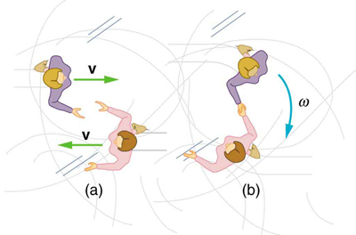

* Observe collisions of extended bodies in two dimensions.
* Examine collision at the point of percussion.

Bowling pins are sent flying and spinning when hit by a bowling ball—angular momentum as well as linear momentum and energy have been imparted to the pins. (See [\[link\]](#import-auto-id1930706)). Many collisions involve angular momentum. Cars, for example, may spin and collide on ice or a wet surface. Baseball pitchers throw curves by putting spin on the baseball. A tennis player can put a lot of top spin on the tennis ball which causes it to dive down onto the court once it crosses the net. We now take a brief look at what happens when objects that can rotate collide.

Consider the relatively simple collision shown in [\[link\]](#import-auto-id2932439), in which a disk strikes and adheres to an initially motionless stick nailed at one end to a frictionless surface. After the collision, the two rotate about the nail. There is an unbalanced external force on the system at the nail. This force exerts no torque because its lever arm <math xmlns="http://www.w3.org/1998/Math/MathML"><semantics><mrow><mrow><mi>r</mi></mrow><mrow /></mrow><annotation encoding="StarMath 5.0"> size 12{r} {}</annotation></semantics></math>

 is zero. Angular momentum is therefore conserved in the collision. Kinetic energy is not conserved, because the collision is inelastic. It is possible that momentum is not conserved either because the force at the nail may have a component in the direction of the disk’s initial velocity. Let us examine a case of rotation in a collision in [\[link\]](#fs-id3007371).

"){: #import-auto-id1930706 data-media-type="image/png"}

 A disk slides toward a motionless stick on a frictionless surface. &#10;        (b) The disk hits the stick at one end and adheres to it, and they rotate together, pivoting around the nail. Angular momentum is conserved for this inelastic collision because the surface is frictionless and the unbalanced external force at the nail exerts no torque."){: #import-auto-id2932439 data-media-type="image/jpg"}

Rotation in a Collision

Suppose the disk in [\[link\]](#import-auto-id2932439) has a mass of 50.0 g and an initial velocity of 30.0 m/s when it strikes the stick that is 1.20 m long and 2.00 kg.

(a) What is the angular velocity of the two after the collision?

(b) What is the kinetic energy before and after the collision?

(c) What is the total linear momentum before and after the collision?

**Strategy for (a)**

We can answer the first question using conservation of angular momentum as noted. Because angular momentum is <math xmlns="http://www.w3.org/1998/Math/MathML"><semantics><mrow><mrow><mi fontstyle="italic">Iω</mi></mrow><mrow /></mrow><annotation encoding="StarMath 5.0"> size 12{Iω} {}</annotation></semantics></math>

, we can solve for angular velocity.

**Solution for (a)**

Conservation of angular momentum states

<math xmlns="http://www.w3.org/1998/Math/MathML"><semantics><mrow><mrow><mrow><mrow><mi>L</mi><mo stretchy="false">=</mo><mi>L</mi></mrow><mo>′</mo></mrow></mrow><mrow /><mo>,</mo></mrow><annotation encoding="StarMath 5.0"> size 12{L=L'} {}</annotation></semantics></math>

where primed quantities stand for conditions after the collision and both momenta are calculated relative to the pivot point. The initial angular momentum of the system of stick-disk is that of the disk just before it strikes the stick. That is,

<math xmlns="http://www.w3.org/1998/Math/MathML"><semantics><mrow><mrow><mrow><mi>L</mi><mo stretchy="false">=</mo><mi fontstyle="italic">Iω</mi></mrow></mrow><mrow /><mo>,</mo></mrow><annotation encoding="StarMath 5.0"> size 12{L=Iω} {}</annotation></semantics></math>

where <math xmlns="http://www.w3.org/1998/Math/MathML"><semantics><mrow><mrow><mi>I</mi></mrow><mrow /></mrow><annotation encoding="StarMath 5.0"> size 12{I} {}</annotation></semantics></math>

 is the moment of inertia of the disk and <math xmlns="http://www.w3.org/1998/Math/MathML"><semantics><mrow><mrow><mi>ω</mi></mrow><mrow /></mrow><annotation encoding="StarMath 5.0"> size 12{ω} {}</annotation></semantics></math>

 is its angular velocity around the pivot point. Now, <math xmlns="http://www.w3.org/1998/Math/MathML"><semantics><mrow><mrow><mrow><mi>I</mi><mo stretchy="false">=</mo><mrow><msup><mtext fontstyle="italic">mr</mtext><mrow><mtext mathvariant="normal">2</mtext></mrow></msup></mrow></mrow></mrow><mrow /></mrow><annotation encoding="StarMath 5.0"> size 12{I= ital "mr" rSup { size 8{2} } } {}</annotation></semantics></math>

 (taking the disk to be approximately a point mass) and <math xmlns="http://www.w3.org/1998/Math/MathML"><semantics><mrow><mrow><mrow><mi>ω</mi><mo stretchy="false">=</mo><mrow><mi>v</mi><mo stretchy="false">/</mo><mi>r</mi></mrow></mrow></mrow><mrow /></mrow><annotation encoding="StarMath 5.0"> size 12{ω=v/r} {}</annotation></semantics></math>

, so that

<math xmlns="http://www.w3.org/1998/Math/MathML"><semantics><mrow><mrow><mrow><mrow><mi>L</mi><mo stretchy="false">=</mo><mrow><msup><mtext fontstyle="italic">mr</mtext><mrow><mn>2</mn></mrow></msup></mrow></mrow><mrow><mfrac><mi>v</mi><mi>r</mi></mfrac><mo stretchy="false">=</mo><mstyle fontstyle="italic"><mrow><mtext>mvr</mtext></mrow></mstyle></mrow></mrow></mrow><mrow /><mo>.</mo></mrow><annotation encoding="StarMath 5.0"> size 12{L= ital "mr" rSup { size 8{2} } { {v} over {r} } = ital "mvr"} {}</annotation></semantics></math>

After the collision,

<math xmlns="http://www.w3.org/1998/Math/MathML"><semantics><mrow><mrow><mrow><mi>L</mi><mrow><mo>′</mo><mo stretchy="false">=</mo><mi>I</mi></mrow><mi>′</mi><mi>ω</mi><mi>′</mi></mrow></mrow><mrow /><mo>.</mo></mrow><annotation encoding="StarMath 5.0"> size 12{L'=I'ω'} {}</annotation></semantics></math>

It is <math xmlns="http://www.w3.org/1998/Math/MathML"> <semantics> <mrow> <mrow> <mi>ω</mi> <mrow> <mo>′</mo> </mrow> </mrow> </mrow> <annotation encoding="StarMath 5.0"> size 12{ω rSup { size 8{'} } } {}</annotation> </semantics> </math>

 that we wish to find. Conservation of angular momentum gives

<math xmlns="http://www.w3.org/1998/Math/MathML"><semantics><mrow><mrow><mrow><mi>I</mi><mo>′</mo><mi>ω</mi><mrow><mo>′</mo><mo stretchy="false">=</mo><mstyle fontstyle="italic"><mrow><mtext>mvr</mtext></mrow></mstyle></mrow></mrow></mrow><mrow /><mo>.</mo></mrow><annotation encoding="StarMath 5.0"> size 12{I'ω'= ital "mvr"} {}</annotation></semantics></math>

Rearranging the equation yields

<math xmlns="http://www.w3.org/1998/Math/MathML"><semantics><mrow><mrow><mrow><mi>ω</mi><mrow><mo>′</mo><mo stretchy="false">=</mo><mfrac><mstyle fontstyle="italic"><mrow><mtext>mvr</mtext></mrow></mstyle><mrow><mi>I</mi><mi>′</mi></mrow></mfrac></mrow></mrow></mrow><mrow /><mo>,</mo></mrow><annotation encoding="StarMath 5.0"> size 12{ω'= { { ital "mvr"} over {I'} } } {}</annotation></semantics></math>

where <math xmlns="http://www.w3.org/1998/Math/MathML"><semantics><mrow><mrow><mrow><mi>I</mi><mo>′</mo></mrow></mrow><mrow /></mrow><annotation encoding="StarMath 5.0"> size 12{I'} {}</annotation></semantics></math>

 is the moment of inertia of the stick and disk stuck together, which is the sum of their individual moments of inertia about the nail. [\[link\]](/m42179#fs-id1838666) gives the formula for a rod rotating around one end to be <math xmlns="http://www.w3.org/1998/Math/MathML"><semantics><mrow><mrow><mrow><mi>I</mi><mo stretchy="false">=</mo><mrow><mrow><msup><mtext fontstyle="italic">Mr</mtext><mrow><mn>2</mn></mrow></msup></mrow><mo stretchy="false">/</mo><mn>3</mn></mrow></mrow></mrow><mrow /></mrow><annotation encoding="StarMath 5.0"> size 12{I= ital "Mr" rSup { size 8{2} } /3} {}</annotation></semantics></math>

. Thus,

<math xmlns="http://www.w3.org/1998/Math/MathML"><semantics><mrow><mrow><mrow><mi>I</mi><mrow><mrow><mi>′</mi><mo stretchy="false">=</mo><mrow><mrow><msup><mtext fontstyle="italic">mr</mtext><mrow><mn>2</mn></mrow></msup></mrow><mo stretchy="false">+</mo><mfrac><mrow><msup><mtext fontstyle="italic">Mr</mtext><mrow><mn>2</mn></mrow></msup></mrow><mn>3</mn></mfrac></mrow></mrow><mo stretchy="false">=</mo><mfenced open="(" close=")"><mrow><mi>m</mi><mo stretchy="false">+</mo><mfrac><mi>M</mi><mn>3</mn></mfrac></mrow></mfenced></mrow><msup><mi>r</mi><mrow><mn>2</mn></mrow></msup></mrow></mrow><mrow /><mo>.</mo></mrow><annotation encoding="StarMath 5.0"> size 12{I'= ital "mr" rSup { size 8{2} } + { { ital "Mr" rSup { size 8{2} } } over {3} } = left (m+ { {M} over {3} } right )r rSup { size 8{2} } } {}</annotation></semantics></math>

Entering known values in this equation yields,

<math xmlns="http://www.w3.org/1998/Math/MathML"><semantics><mrow><mrow><mrow><mi>I</mi><mrow><mtext>′</mtext><mo stretchy="false">=</mo><mfenced open="(" close=")"><mrow><mn>0</mn><mtext>.</mtext><mtext>0500</mtext><mrow><mspace width="0.25em" /><mtext> kg</mtext><mo stretchy="false">+</mo><mn>0</mn></mrow><mtext>.</mtext><mtext>667 kg</mtext></mrow></mfenced></mrow><mrow><msup><mfenced open="(" close=")"><mrow><mn>1</mn><mtext>.</mtext><mtext>20</mtext><mspace width="0.25em" /><mtext> m</mtext></mrow></mfenced><mrow><mn>2</mn></mrow></msup><mo stretchy="false">=</mo><mn>1</mn></mrow><mtext>.</mtext><mtext>032</mtext><mrow><mspace width="0.25em" /><mtext> kg</mtext><mo stretchy="false">⋅</mo><msup><mtext>m</mtext><mrow><mn>2</mn></mrow></msup></mrow></mrow></mrow><mrow /><mo>.</mo></mrow><annotation encoding="StarMath 5.0"> size 12{I'= left (0 "." "0500"" kg"+0 "." "667 kg" right ) left (1 "." "20"" m" right ) rSup { size 8{2} } =1 "." "032"" kg" cdot m rSup { size 8{2} } } {}</annotation></semantics></math>

The value of <math xmlns="http://www.w3.org/1998/Math/MathML"><semantics><mrow><mi>I</mi><mo>′</mo></mrow></semantics></math>

 is now entered into the expression for <math xmlns="http://www.w3.org/1998/Math/MathML"><semantics><mrow><mrow><mi>ω</mi><mo>′</mo></mrow></mrow></semantics></math>

, which yields

<math xmlns="http://www.w3.org/1998/Math/MathML"><semantics><mrow><mrow><mtable columnalign="left"><mtr><mtd><mi>ω</mi><mo>′</mo></mtd> <mtd><mo stretchy="false">=</mo></mtd> <mtd><mrow><mrow><mrow><mrow><mrow><mfrac><mstyle fontstyle="italic"><mrow><mtext>mvr</mtext></mrow></mstyle><mrow><mi>I</mi><mo>′</mo></mrow></mfrac></mrow><mo stretchy="false">=</mo><mfrac><mrow><mfenced open="(" close=")"><mrow><mn>0</mn><mtext>.</mtext><mtext>0500 kg</mtext></mrow></mfenced><mfenced open="(" close=")"><mrow><mtext>30</mtext><mtext>.</mtext><mn>0 m/s</mn></mrow></mfenced><mfenced open="(" close=")"><mrow><mn>1</mn><mtext>.</mtext><mtext>20 m</mtext></mrow></mfenced></mrow><mrow><mrow><mn>1</mn><mtext>.</mtext><mtext>032 kg</mtext><mo stretchy="false">⋅</mo><msup><mtext>m</mtext><mrow><mn>2</mn></mrow></msup></mrow></mrow></mfrac></mrow></mrow></mrow><mrow /></mrow></mtd></mtr> <mtr><mtd /> <mtd><mo stretchy="false">=</mo></mtd> <mtd><mrow><mrow><mn>1</mn></mrow><mtext>.</mtext><mrow><mtext>744 rad/s</mtext><mo stretchy="false">≈</mo><mn>1</mn></mrow><mtext>.</mtext><mtext>74 rad/s</mtext><mrow /><mo>.</mo></mrow></mtd></mtr></mtable><mrow /></mrow></mrow></semantics></math>

**Strategy for (b)**

The kinetic energy before the collision is the incoming disk’s translational kinetic energy, and after the collision, it is the rotational kinetic energy of the two stuck together.

**Solution for (b)**

First, we calculate the translational kinetic energy by entering given values for the mass and speed of the incoming disk.

<math xmlns="http://www.w3.org/1998/Math/MathML"> <semantics> <mrow> <mrow> <mrow> <mrow> <mtext>KE</mtext> <mo stretchy="false">=</mo> <mfrac> <mn>1</mn> <mn>2</mn> </mfrac> </mrow> <mrow> <mrow> <msup> <mtext fontstyle="italic">mv</mtext> <mrow> <mn>2</mn> </mrow> </msup> </mrow> <mo stretchy="false">=</mo> <mo stretchy="false">(</mo> <mn>0</mn> </mrow> <mtext>.</mtext> <mtext>500</mtext> <mo stretchy="false">)</mo> <mfenced open="(" close=")"> <mrow> <mn>0</mn> <mtext>.</mtext> <mtext>0500</mtext><mspace width="0.25em" /> <mtext> kg</mtext> </mrow> </mfenced> <mrow> <msup> <mfenced open="(" close=")"> <mrow> <mtext>30</mtext> <mtext>.</mtext> <mn>0</mn><mspace width="0.25em" /> <mtext> m/s</mtext> </mrow> </mfenced> <mrow> <mn>2</mn> </mrow> </msup> </mrow> <mo stretchy="false">=</mo> <mtext>22.5 J</mtext> </mrow> </mrow> <mrow /> </mrow> <annotation encoding="StarMath 5.0"> size 12{"KE"= { {1} over {2} } ital "mv" rSup { size 8{2} } =0 "." "500" left (0 "." "0500"" kg" right ) left ("30" "." 0" m/s" right ) rSup { size 8{2} } ="22" "." 5" J"} {}</annotation> </semantics> </math>

After the collision, the rotational kinetic energy can be found because we now know the final angular velocity and the final moment of inertia. Thus, entering the values into the rotational kinetic energy equation gives

<math xmlns="http://www.w3.org/1998/Math/MathML"><semantics><mrow><mrow><mtable columnalign="left"><mtr> <mtd><mtext>KE′</mtext></mtd> <mtd><mo stretchy="false">=</mo></mtd> <mtd><mrow><mrow><mrow><mrow><mfrac><mn>1</mn><mn>2</mn></mfrac></mrow><mi>I</mi><mo>′</mo><msup><mrow><mi>ω</mi><mo>′</mo></mrow><mn>2</mn></msup><mo stretchy="false">=</mo> <mo stretchy="false">(</mo> <mn>0.5</mn> <mo stretchy="false">)</mo> </mrow> <mfenced open="(" close=")"><mrow><mn>1.032</mn><mrow><mspace width="0.25em" /><mtext> kg</mtext><mo stretchy="false">⋅</mo><msup><mtext>m</mtext><mrow><mn>2</mn></mrow></msup></mrow></mrow></mfenced><msup><mfenced open="(" close=")"><mrow><mn>1</mn><mtext>.</mtext><mtext>744</mtext><mfrac><mtext>rad</mtext><mtext>s</mtext></mfrac></mrow></mfenced><mrow><mn>2</mn></mrow></msup></mrow></mrow></mtd></mtr> <mtr><mtd /> <mtd><mo stretchy="false">=</mo></mtd> <mtd><mrow><mrow /><mtext>1.57 J.</mtext><mrow /></mrow></mtd></mtr></mtable><mrow /></mrow></mrow></semantics></math>

**Strategy for (c)**

The linear momentum before the collision is that of the disk. After the collision, it is the sum of the disk’s momentum and that of the center of mass of the stick.

**Solution of (c)**

Before the collision, then, linear momentum is

<math xmlns="http://www.w3.org/1998/Math/MathML"><semantics><mrow><mrow><mrow><mrow><mrow><mi>p</mi><mo stretchy="false">=</mo><mstyle fontstyle="italic"><mrow><mtext>mv</mtext></mrow></mstyle></mrow><mo stretchy="false">=</mo><mfenced open="(" close=")"><mrow><mn>0</mn><mtext>.</mtext><mtext>0500</mtext><mspace width="0.25em" /><mtext> kg</mtext></mrow></mfenced></mrow><mrow><mfenced open="(" close=")"><mrow><mtext>30</mtext><mtext>.</mtext><mn>0</mn><mspace width="0.25em" /><mtext> m/s</mtext></mrow></mfenced><mo stretchy="false">=</mo><mn>1</mn></mrow><mtext>.</mtext><mtext>50</mtext><mrow><mspace width="0.25em" /><mtext> kg</mtext><mo stretchy="false">⋅</mo><mtext>m/s</mtext></mrow></mrow></mrow><mo>.</mo><mrow /></mrow><annotation encoding="StarMath 5.0"> size 12{p= ital "mv"= left (0 "." "0500"" kg" right ) left ("30" "." 0" m/s" right )=1 "." "50"" kg" cdot "m/s"} {}</annotation></semantics></math>

After the collision, the disk and the stick’s center of mass move in the same direction. The total linear momentum is that of the disk moving at a new velocity <math xmlns="http://www.w3.org/1998/Math/MathML"><semantics><mrow><mrow><mrow><mi>v</mi><mrow><mo>′</mo><mo stretchy="false">=</mo><mi fontstyle="italic">rω</mi></mrow><mo>′</mo></mrow></mrow><mrow /></mrow><annotation encoding="StarMath 5.0"> size 12{v'=rω'} {}</annotation></semantics></math>

 plus that of the stick’s center of mass,

which moves at half this speed because <math xmlns="http://www.w3.org/1998/Math/MathML"><semantics><mrow><mrow><mrow><mrow><msub><mi>v</mi><mrow><mtext>CM</mtext></mrow></msub><mo stretchy="false">=</mo><mfenced open="(" close=")"><mfrac><mi>r</mi><mn>2</mn></mfrac></mfenced></mrow><mi>ω</mi><mrow><mo>′</mo><mo stretchy="false">=</mo><mfrac><mrow><mi>v</mi><mo>′</mo></mrow><mn>2</mn></mfrac></mrow></mrow></mrow><mrow /></mrow><annotation encoding="StarMath 5.0"> size 12{v rSub { size 8{"CM"} } = left ( { {r} over {2} } right )ω'= { {v'} over {2} } } {}</annotation></semantics></math>

. Thus,

<math xmlns="http://www.w3.org/1998/Math/MathML"><semantics><mrow><mrow><mrow><mi>p</mi><mrow><mo>′</mo><mo stretchy="false">=</mo><mstyle fontstyle="italic"><mrow><mtext>mv</mtext></mrow></mstyle></mrow><mrow><mo>′</mo><mo stretchy="false">+</mo><mrow><msub><mtext fontstyle="italic">Mv</mtext><mrow><mtext>CM</mtext></mrow></msub></mrow></mrow><mrow><mo stretchy="false">=</mo><mstyle fontstyle="italic"><mrow><mtext>mv</mtext></mrow></mstyle></mrow><mrow><mo>′</mo><mo stretchy="false">+</mo><mfrac><mrow><mstyle fontstyle="italic"><mrow><mtext>Mv</mtext></mrow></mstyle><mo>′</mo></mrow><mn>2</mn></mfrac></mrow></mrow></mrow><mrow /><mo>.</mo></mrow><annotation encoding="StarMath 5.0"> size 12{p'= ital "mv"'+ ital "Mv" rSub { size 8{"CM"} } '= ital "mv"'+ { { ital "Mv"'} over {2} } } {}</annotation></semantics></math>

Gathering similar terms in the equation yields,

<math xmlns="http://www.w3.org/1998/Math/MathML"> <semantics> <mrow> <mrow> <mrow> <mi>p</mi> <mrow> <mo>′</mo> <mo stretchy="false">=</mo> <mfenced open="(" close=")"> <mrow> <mi>m</mi> <mo stretchy="false">+</mo> <mfrac> <mi>M</mi> <mn>2</mn> </mfrac> </mrow> </mfenced> </mrow> <mi>v</mi> <mo>′</mo> </mrow> </mrow> <mrow /> </mrow> <annotation encoding="StarMath 5.0"> size 12{p'= left (m+ { {M} over {2} } right )v'} {}</annotation> </semantics> </math>

so that

<math xmlns="http://www.w3.org/1998/Math/MathML"><semantics><mrow><mrow><mrow><mi>p</mi><mrow><mo>′</mo><mo stretchy="false">=</mo><mfenced open="(" close=")"><mrow><mi>m</mi><mo stretchy="false">+</mo><mfrac><mi>M</mi><mn>2</mn></mfrac></mrow></mfenced></mrow><mi fontstyle="italic">rω</mi><mo>′</mo></mrow></mrow><mrow /><mo>.</mo></mrow><annotation encoding="StarMath 5.0"> size 12{p'= left (m+ { {M} over {2} } right )rω'} {}</annotation></semantics></math>

Substituting known values into the equation,

<math xmlns="http://www.w3.org/1998/Math/MathML"><semantics><mrow><mrow><mrow><mi>p</mi><mrow><mo>′</mo><mo stretchy="false">=</mo><mfenced open="(" close=")"><mrow><mn>1</mn><mtext>.</mtext><mtext>050 kg</mtext></mrow></mfenced></mrow><mfenced open="(" close=")"><mrow><mn>1</mn><mtext>.</mtext><mtext>20</mtext><mi /><mspace width="0.25em" /><mtext> m</mtext></mrow></mfenced><mrow><mfenced open="(" close=")"><mrow><mn>1</mn><mtext>.</mtext><mtext>744 rad/s</mtext></mrow></mfenced><mo stretchy="false">=</mo><mtext>2.20 kg</mtext><mo stretchy="false">⋅</mo><mtext>m/s</mtext></mrow></mrow></mrow><mrow /><mo>.</mo></mrow></semantics></math>

**Discussion**

First note that the kinetic energy is less after the collision, as predicted, because the collision is inelastic. More surprising is that the momentum after the collision is actually greater than before the collision. This result can be understood if you consider how the nail affects the stick and vice versa. Apparently, the stick pushes backward on the nail when first struck by the disk. The nail’s reaction (consistent with Newton’s third law) is to push forward on the stick, imparting momentum to it in the same direction in which the disk was initially moving, thereby increasing the momentum of the system.

The above example has other implications. For example, what would happen if the disk hit very close to the nail? Obviously, a force would be exerted on the nail in the forward direction. So, when the stick is struck at the end farthest from the nail, a backward force is exerted on the nail, and when it is hit at the end nearest the nail, a forward force is exerted on the nail. Thus, striking it at a certain point in between produces no force on the nail. This intermediate point is known as the *percussion point*.

An analogous situation occurs in tennis as seen in [\[link\]](#import-auto-id3078115). If you hit a ball with the end of your racquet, the handle is pulled away from your hand. If you hit a ball much farther down, for example, on the shaft of the racquet, the handle is pushed into your palm. And if you hit the ball at the racquet’s percussion point (what some people call the “sweet spot”), then little or *no* force is exerted on your hand, and there is less vibration, reducing chances of a tennis elbow. The same effect occurs for a baseball bat.

![In figure a, a disk hitting a stick is compared to a tennis ball being hit by a racquet. When the ball strikes the racquet near the end with a force denoted by f ball as shown by the direction of the arrow, a backward force, f hand is exerted on the hand, In figure b, when the racquet is struck much farther down by a force F ball, a forward force, f hand is exerted on the hand as shown by the arrows. In figure (c), when the racquet is struck by the ball with a force f ball at the percussion point, no force is delivered to the hand. This implies that f hand is equal to zero.](../resources/Figure_11_06_03.jpg "A disk hitting a stick is compared to a tennis ball being hit by a racquet. (a) When the ball strikes the racquet near the end, a backward force is exerted on the hand. (b) When the racquet is struck much farther down, a forward force is exerted on the hand. (c) When the racquet is struck at the percussion point, no force is delivered to the hand."){: #import-auto-id3078115 data-media-type="image/jpg"}

Check Your Understanding

Is rotational kinetic energy a vector? Justify your answer.

No, energy is always scalar whether motion is involved or not. No form of energy has a direction in space and you can see that rotational kinetic energy does not depend on the direction of motion just as linear kinetic energy is independent of the direction of motion.

# Section Summary

* {: #import-auto-id3089539} Angular momentum
  <math xmlns="http://www.w3.org/1998/Math/MathML"><semantics><mrow><mi>L</mi></mrow></semantics></math>
  
  is analogous to linear momentum and is given by
  <math xmlns="http://www.w3.org/1998/Math/MathML"><semantics><mrow><mrow><mrow><mi>L</mi><mo stretchy="false">=</mo><mi fontstyle="italic">Iω</mi></mrow></mrow><mrow /></mrow><annotation encoding="StarMath 5.0"> size 12{L=Iω} {}</annotation></semantics></math>
  
  .
* Angular momentum is changed by torque, following the relationship
  <math xmlns="http://www.w3.org/1998/Math/MathML"> <semantics> <mrow> <mtext>net</mtext> <mspace width="0.25em" /> <mi>τ</mi> <mo stretchy="false">=</mo> <mfrac> <mrow> <mtext>Δ</mtext> <mi fontstyle="italic">L</mi> </mrow> <mrow> <mtext>Δ</mtext> <mi fontstyle="italic">t</mi> </mrow> </mfrac> <mo>.</mo> </mrow> </semantics> </math>

* {: #import-auto-id2603851} Angular momentum is conserved if the net torque is zero
  <math xmlns="http://www.w3.org/1998/Math/MathML"> <semantics> <mrow> <mrow> <mrow> <mrow> <mi>L</mi> <mo stretchy="false">=</mo> <mtext>constant</mtext> <mspace width="0.25em" /> </mrow> <mi /> <mfenced open="(" close=")"> <mrow> <mtext>net </mtext><mspace width="0.25em" /> <mrow> <mi>τ</mi> <mo stretchy="false">=</mo> <mtext>0</mtext> </mrow> </mrow> </mfenced> </mrow> </mrow> </mrow> </semantics> </math>
  
  or
  <math xmlns="http://www.w3.org/1998/Math/MathML"> <semantics> <mrow> <mrow> <mrow> <mrow> <mi>L</mi> <mo stretchy="false">=</mo> <mi>L</mi> </mrow> <mo>′</mo> <mi /> <mspace width="0.25em" /> <mfenced open="(" close=")"> <mrow> <mtext>net </mtext> <mspace width="0.25em" /> <mrow> <mi>τ</mi> <mo stretchy="false">=</mo> <mn>0</mn> </mrow> </mrow> </mfenced> </mrow> </mrow> </mrow> </semantics> </math>
  
  . This equation is known as the law of conservation of angular momentum, which may be conserved in collisions.

# Conceptual Questions

Describe two different collisions—one in which angular momentum is conserved, and the other in which it is not. Which condition determines whether or not angular momentum is conserved in a collision?

Suppose an ice hockey puck strikes a hockey stick that lies flat on the ice and is free to move in any direction. Which quantities are likely to be conserved: angular momentum, linear momentum, or kinetic energy (assuming the puck and stick are very resilient)?

While driving his motorcycle at highway speed, a physics student notices that pulling back lightly on the right handlebar tips the cycle to the left and produces a left turn. Explain why this happens.

# Problems &amp; Exercises

Repeat [[link]](#fs-id3007371) in which the disk strikes and adheres to the stick 0.100 m from the nail.

(a) <math xmlns="http://www.w3.org/1998/Math/MathML"><semantics><mrow><mn>0.156 rad/s</mn></mrow></semantics></math>

(b) <math xmlns="http://www.w3.org/1998/Math/MathML"><semantics><mrow><mrow><mrow><mn>1</mn><mtext>.</mtext><mrow><mtext>17</mtext><mo stretchy="false">×</mo><msup><mtext>10</mtext><mrow><mrow><mo stretchy="false">−</mo><mn>2</mn></mrow></mrow></msup></mrow><mspace width="0.25em" /><mtext> J</mtext></mrow></mrow><mrow /></mrow><annotation encoding="StarMath 5.0"> size 12{1 "." "17" times "10" rSup { size 8{ - 2} } " J"} {}</annotation></semantics></math>

(c) <math xmlns="http://www.w3.org/1998/Math/MathML"><semantics><mrow><mrow><mrow><mn>0</mn><mtext>.</mtext><mrow><mtext>188 kg</mtext><mo stretchy="false">⋅</mo><mtext>m/s</mtext></mrow></mrow></mrow><mrow /></mrow><annotation encoding="StarMath 5.0"> size 12{0 "." "188 kg" cdot "m/s"} {}</annotation></semantics></math>

Repeat [[link]](#fs-id3007371) in which the disk originally spins clockwise at 1000 rpm and has a radius of 1.50 cm.

Twin skaters approach one another as shown in [[link]](#import-auto-id2558735) and lock hands. (a) Calculate their final angular velocity, given each had an initial speed of 2.50 m/s relative to the ice. Each has a mass of 70.0 kg, and each has a center of mass located 0.800 m from their locked hands. You may approximate their moments of inertia to be that of point masses at this radius. (b) Compare the initial kinetic energy and final kinetic energy.

{: #import-auto-id2558735 data-media-type="image/jpg"}

(a) 3.13 rad/s

(b) Initial KE = 438 J, final KE = 438 J

Suppose a 0.250-kg ball is thrown at 15.0 m/s to a motionless person standing on ice who catches it with an outstretched arm as shown in [[link]](#import-auto-id2514290).

(a) Calculate the final linear velocity of the person, given his mass is 70.0 kg.

(b) What is his angular velocity if each arm is 5.00 kg? You may treat the ball as a point mass and treat the person's arms as uniform rods (each has a length of 0.900 m) and the rest of his body as a uniform cylinder of radius 0.180 m. Neglect the effect of the ball on his center of mass so that his center of mass remains in his geometrical center.

(c) Compare the initial and final total kinetic energies.

{: #import-auto-id2514290 data-media-type="image/jpg"}

Repeat [[link]](#fs-id3007371) in which the stick is free to have translational motion as well as rotational motion.

(a) 1.70 rad/s

(b) Initial KE = 22.5 J, final KE = 2.04 J

(c) <math xmlns="http://www.w3.org/1998/Math/MathML"><semantics><mrow><mrow><mrow><mn>1</mn><mtext>.</mtext><mrow><mtext>50 kg</mtext><mo stretchy="false">⋅</mo><mtext>m/s</mtext></mrow></mrow></mrow><mrow /></mrow><annotation encoding="StarMath 5.0"> size 12{1 "." "50 kg" cdot "m/s"} {}</annotation></semantics></math>

