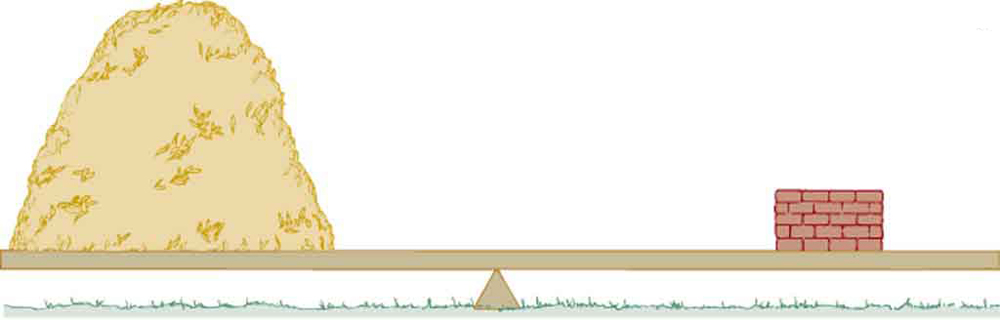
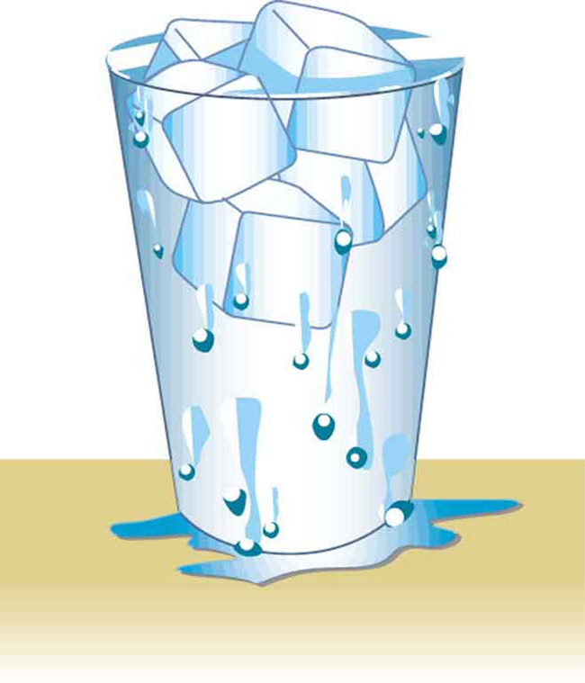

* Define density.
* Calculate the mass of a reservoir from its density.
* Compare and contrast the densities of various substances.

Which weighs more, a ton of feathers or a ton of bricks? This old riddle plays with the distinction between mass and density. A ton is a ton, of course; but bricks have much greater density than feathers, and so we are tempted to think of them as heavier. (See [\[link\]](#import-auto-id950378).)

**Density**{: data-type="term" #import-auto-id2660162}, as you will see, is an important characteristic of substances. It is crucial, for example, in determining whether an object sinks or floats in a fluid. Density is the mass per unit volume of a substance or object. In equation form, density is defined as

<math xmlns="http://www.w3.org/1998/Math/MathML"><semantics><mrow><mrow><mrow><mi>ρ</mi><mo stretchy="false">=</mo><mfrac><mi>m</mi><mi>V</mi></mfrac></mrow><mo>,</mo></mrow><mrow /></mrow><annotation encoding="StarMath 5.0"> size 12{ρ= { {m} over {V} } } {}</annotation></semantics></math>

where the Greek letter <math xmlns="http://www.w3.org/1998/Math/MathML"><semantics><mrow><mrow><mi>ρ</mi></mrow><mrow /></mrow><annotation encoding="StarMath 5.0"> size 12{ρ} {}</annotation></semantics></math>

 (rho) is the symbol for density, <math xmlns="http://www.w3.org/1998/Math/MathML"><semantics><mrow><mrow><mi>m</mi></mrow><mrow /></mrow><annotation encoding="StarMath 5.0"> size 12{m} {}</annotation></semantics></math>

 is the mass, and <math xmlns="http://www.w3.org/1998/Math/MathML"><semantics><mrow><mrow><mi>V</mi></mrow><mrow /></mrow><annotation encoding="StarMath 5.0"> size 12{V} {}</annotation></semantics></math>

 is the volume occupied by the substance.

Density

Density is mass per unit volume.

<math xmlns="http://www.w3.org/1998/Math/MathML"><semantics><mrow><mrow><mrow><mi>ρ</mi><mo stretchy="false">=</mo><mfrac><mi>m</mi><mi>V</mi></mfrac></mrow><mo>,</mo></mrow><mrow /></mrow><annotation encoding="StarMath 5.0"> size 12{ρ= { {m} over {V} } } {}</annotation></semantics></math>

where <math xmlns="http://www.w3.org/1998/Math/MathML"><semantics><mrow><mrow><mi>ρ</mi></mrow><mrow /></mrow><annotation encoding="StarMath 5.0"> size 12{ρ} {}</annotation></semantics></math>

 is the symbol for density, <math xmlns="http://www.w3.org/1998/Math/MathML"><semantics><mrow><mrow><mi>m</mi></mrow><mrow /></mrow><annotation encoding="StarMath 5.0"> size 12{m} {}</annotation></semantics></math>

 is the mass, and <math xmlns="http://www.w3.org/1998/Math/MathML"><semantics><mrow><mrow><mi>V</mi></mrow><mrow /></mrow><annotation encoding="StarMath 5.0"> size 12{V} {}</annotation></semantics></math>

 is the volume occupied by the substance.

In the riddle regarding the feathers and bricks, the masses are the same, but the volume occupied by the feathers is much greater, since their density is much lower. The SI unit of density is <math xmlns="http://www.w3.org/1998/Math/MathML"><semantics><mrow><mrow><msup><mtext>kg/m</mtext><mrow><mn>3</mn></mrow></msup></mrow><mrow /></mrow><annotation encoding="StarMath 5.0"> size 12{"kg/m" rSup { size 8{3} } } {}</annotation></semantics></math>

, representative values are given in [\[link\]](#fs-id1769034). The metric system was originally devised so that water would have a density of <math xmlns="http://www.w3.org/1998/Math/MathML"><semantics><mrow><mrow><mrow><mn>1</mn><mspace width="0.25em" /><msup><mtext>g/cm</mtext><mrow><mn>3</mn></mrow></msup></mrow></mrow><mrow /></mrow><annotation encoding="StarMath 5.0"> size 12{1`"g/cm" rSup { size 8{3} } } {}</annotation></semantics></math>

, equivalent to <math xmlns="http://www.w3.org/1998/Math/MathML"><semantics><mrow><mrow><mrow><msup><mtext>10</mtext><mrow><mn>3</mn></mrow></msup><mspace width="0.25em" /><msup><mtext>kg/m</mtext><mrow><mn>3</mn></mrow></msup></mrow></mrow><mrow /></mrow><annotation encoding="StarMath 5.0"> size 12{"10" rSup { size 8{3} } `"kg/m" rSup { size 8{3} } } {}</annotation></semantics></math>

. Thus the basic mass unit, the kilogram, was first devised to be the mass of 1000 mL of water, which has a volume of 1000 cm3.

<table summary="The table shows the value of density in units of kilogram per meter cubed for certain solids, liquids, and gases."><caption>Densities of Various Substances</caption><thead>
          <tr>
            <th>Substance</th>
            <th>
              <math xmlns="http://www.w3.org/1998/Math/MathML" display="block">
                <semantics>
                  <mrow>
                    <mrow>
                      <mrow>
                        <mi>ρ</mi>
                        <mi />
                        <mo stretchy="false">(</mo>
                        <msup>
                          <mtext>10</mtext>
                          <mrow>
                            <mn>3</mn>
                          </mrow>
                        </msup>
                        <mspace width="0.25em" />
                        <msup>
                          <mtext>kg/m</mtext>
                          <mrow>
                            <mn>3</mn>
                          </mrow>
                        </msup>
                       <mspace width="0.25em" />
                        <mtext>or</mtext>
                     <mspace width="0.25em" />
                        <mtext>g/mL</mtext>
                        <mo stretchy="false">)</mo>
                      </mrow>
                    </mrow>
                    <mrow />
                  </mrow>
                  <annotation encoding="StarMath 5.0"> size 12{ρ` \( "10" rSup { size 8{3} } `"kg/m" rSup { size 8{3} } `"or"`"g/mL" \) } {}</annotation>
                </semantics>
              </math>
            </th>
            <th>Substance</th>
            <th>
              <math xmlns="http://www.w3.org/1998/Math/MathML" display="block">
                <semantics>
                  <mrow>
                    <mrow>
                      <mrow>
                        <mi>ρ</mi>
                        <mi />
                        <mo stretchy="false">(</mo>
                        <msup>
                          <mtext>10</mtext>
                          <mrow>
                            <mn>3</mn>
                          </mrow>
                        </msup>
                       <mspace width="0.25em" />
                        <msup>
                          <mtext>kg/m</mtext>
                          <mrow>
                            <mn>3</mn>
                          </mrow>
                        </msup>
                      <mspace width="0.25em" />
                        <mtext>or</mtext>
                      <mspace width="0.25em" />
                        <mtext>g/mL</mtext>
                        <mo stretchy="false">)</mo>
                      </mrow>
                    </mrow>
                  </mrow>
                  <annotation encoding="StarMath 5.0"> size 12{ρ` \( "10" rSup { size 8{3} } `"kg/m" rSup { size 8{3} } `"or"`"g/mL" \) } {}</annotation>
                </semantics>
              </math>
            </th>
            <th>Substance</th>
            <th>
              <math xmlns="http://www.w3.org/1998/Math/MathML" display="block">
                <semantics>
                  <mrow>
                    <mrow>
                      <mrow>
                        <mi>ρ</mi>
                        <mo stretchy="false">(</mo>
                        <msup>
                          <mtext>10</mtext>
                          <mrow>
                            <mn>3</mn>
                          </mrow>
                        </msup>
                      <mspace width="0.25em" />
                        <msup>
                          <mtext>kg/m</mtext>
                          <mrow>
                            <mn>3</mn>
                          </mrow>
                        </msup>
                     <mspace width="0.25em" />
                        <mtext>or</mtext>
                     <mspace width="0.25em" />
                        <mtext>g/mL</mtext>
                        <mo stretchy="false">)</mo>
                      </mrow>
                    </mrow>
                  </mrow>
                  <annotation encoding="StarMath 5.0"> size 12{ρ` \( "10" rSup { size 8{3} } `"kg/m" rSup { size 8{3} } `"or"`"g/mL" \) } {}</annotation>
                </semantics>
              </math>
            </th>
          </tr>
</thead><tbody>
        
          <tr>
            <td><strong>Solids</strong></td>
            <td />
            <td><strong>Liquids</strong></td>
            <td />
            <td><strong>Gases</strong></td>
            <td />
          </tr>
          <tr>
            <td>Aluminum</td>
            <td>2.7</td>
            <td>Water (4ºC)</td>
            <td>1.000</td>
            <td>Air</td>
            <td>
              <math xmlns="http://www.w3.org/1998/Math/MathML" display="block">
                <semantics>
                  <mrow>
                    <mrow>
                      <mrow>
                        <mn>1</mn>
                        <mtext>.</mtext>
                        <mrow>
                          <mtext>29</mtext>
                          <mo stretchy="false">×</mo>
                          <msup>
                            <mtext>10</mtext>
                            <mrow>
                              <mrow>
                                <mo stretchy="false">−</mo>
                                <mn>3</mn>
                              </mrow>
                            </mrow>
                          </msup>
                        </mrow>
                      </mrow>
                    </mrow>
                    <mrow />
                  </mrow>
                  <annotation encoding="StarMath 5.0"> size 12{1 "." "29" times "10" rSup { size 8{ - 3} } } {}</annotation>
                </semantics>
              </math>
            </td>
          </tr>
          <tr>
            <td>Brass</td>
            <td>8.44</td>
            <td>Blood</td>
            <td>1.05</td>
            <td>Carbon dioxide</td>
            <td>
              <math xmlns="http://www.w3.org/1998/Math/MathML" display="block">
                <semantics>
                  <mrow>
                    <mrow>
                      <mrow>
                        <mn>1</mn>
                        <mtext>.</mtext>
                        <mrow>
                          <mtext>98</mtext>
                          <mo stretchy="false">×</mo>
                          <msup>
                            <mtext>10</mtext>
                            <mrow>
                              <mrow>
                                <mo stretchy="false">−</mo>
                                <mn>3</mn>
                              </mrow>
                            </mrow>
                          </msup>
                        </mrow>
                      </mrow>
                    </mrow>
                    <mrow />
                  </mrow>
                  <annotation encoding="StarMath 5.0"> size 12{1 "." "98" times "10" rSup { size 8{ - 3} } } {}</annotation>
                </semantics>
              </math>
            </td>
          </tr>
          <tr>
            <td>Copper (average)</td>
            <td>8.8</td>
            <td>Sea water</td>
            <td>1.025</td>
            <td>Carbon monoxide</td>
            <td>
              <math xmlns="http://www.w3.org/1998/Math/MathML" display="block">
                <semantics>
                  <mrow>
                    <mrow>
                      <mrow>
                        <mn>1</mn>
                        <mtext>.</mtext>
                        <mrow>
                          <mtext>25</mtext>
                          <mo stretchy="false">×</mo>
                          <msup>
                            <mtext>10</mtext>
                            <mrow>
                              <mrow>
                                <mo stretchy="false">−</mo>
                                <mn>3</mn>
                              </mrow>
                            </mrow>
                          </msup>
                        </mrow>
                      </mrow>
                    </mrow>
                    <mrow />
                  </mrow>
                  <annotation encoding="StarMath 5.0"> size 12{1 "." "25" times "10" rSup { size 8{ - 3} } } {}</annotation>
                </semantics>
              </math>
            </td>
          </tr>
          <tr>
            <td>Gold</td>
            <td>19.32</td>
            <td>Mercury</td>
            <td>13.6</td>
            <td>Hydrogen</td>
            <td>
              <math xmlns="http://www.w3.org/1998/Math/MathML" display="block">
                <semantics>
                  <mrow>
                    <mrow>
                      <mrow>
                        <mn>0</mn>
                        <mtext>.</mtext>
                        <mrow>
                          <mtext>090</mtext>
                          <mo stretchy="false">×</mo>
                          <msup>
                            <mtext>10</mtext>
                            <mrow>
                              <mrow>
                                <mo stretchy="false">−</mo>
                                <mn>3</mn>
                              </mrow>
                            </mrow>
                          </msup>
                        </mrow>
                      </mrow>
                    </mrow>
                    <mrow />
                  </mrow>
                  <annotation encoding="StarMath 5.0"> size 12{0 "." "090" times "10" rSup { size 8{ - 3} } } {}</annotation>
                </semantics>
              </math>
            </td>
          </tr>
          <tr>
            <td>Iron or steel</td>
            <td>7.8</td>
            <td>Ethyl alcohol</td>
            <td>0.79</td>
            <td>Helium</td>
            <td>
              <math xmlns="http://www.w3.org/1998/Math/MathML" display="block">
                <semantics>
                  <mrow>
                    <mrow>
                      <mrow>
                        <mn>0</mn>
                        <mtext>.</mtext>
                        <mrow>
                          <mtext>18</mtext>
                          <mo stretchy="false">×</mo>
                          <msup>
                            <mtext>10</mtext>
                            <mrow>
                              <mrow>
                                <mo stretchy="false">−</mo>
                                <mn>3</mn>
                              </mrow>
                            </mrow>
                          </msup>
                        </mrow>
                      </mrow>
                    </mrow>
                    <mrow />
                  </mrow>
                  <annotation encoding="StarMath 5.0"> size 12{0 "." "18" times "10" rSup { size 8{ - 3} } } {}</annotation>
                </semantics>
              </math>
            </td>
          </tr>
          <tr>
            <td>Lead</td>
            <td>11.3</td>
            <td>Petrol</td>
            <td>0.68</td>
            <td>Methane</td>
            <td>
              <math xmlns="http://www.w3.org/1998/Math/MathML" display="block">
                <semantics>
                  <mrow>
                    <mrow>
                      <mrow>
                        <mn>0</mn>
                        <mtext>.</mtext>
                        <mrow>
                          <mtext>72</mtext>
                          <mo stretchy="false">×</mo>
                          <msup>
                            <mtext>10</mtext>
                            <mrow>
                              <mrow>
                                <mo stretchy="false">−</mo>
                                <mn>3</mn>
                              </mrow>
                            </mrow>
                          </msup>
                        </mrow>
                      </mrow>
                    </mrow>
                    <mrow />
                  </mrow>
                  <annotation encoding="StarMath 5.0"> size 12{0 "." "72" times "10" rSup { size 8{ - 3} } } {}</annotation>
                </semantics>
              </math>
            </td>
          </tr>
          <tr>
            <td>Polystyrene</td>
            <td>0.10</td>
            <td>Glycerin</td>
            <td>1.26</td>
            <td>Nitrogen</td>
            <td>
              <math xmlns="http://www.w3.org/1998/Math/MathML" display="block">
                <semantics>
                  <mrow>
                    <mrow>
                      <mrow>
                        <mn>1</mn>
                        <mtext>.</mtext>
                        <mrow>
                          <mtext>25</mtext>
                          <mo stretchy="false">×</mo>
                          <msup>
                            <mtext>10</mtext>
                            <mrow>
                              <mrow>
                                <mo stretchy="false">−</mo>
                                <mn>3</mn>
                              </mrow>
                            </mrow>
                          </msup>
                        </mrow>
                      </mrow>
                    </mrow>
                    <mrow />
                  </mrow>
                  <annotation encoding="StarMath 5.0"> size 12{1 "." "25" times "10" rSup { size 8{ - 3} } } {}</annotation>
                </semantics>
              </math>
            </td>
          </tr>
          <tr>
            <td>Tungsten</td>
            <td>19.30</td>
            <td>Olive oil</td>
            <td>0.92</td>
            <td>Nitrous oxide</td>
            <td>
              <math xmlns="http://www.w3.org/1998/Math/MathML" display="block">
                <semantics>
                  <mrow>
                    <mrow>
                      <mrow>
                        <mn>1</mn>
                        <mtext>.</mtext>
                        <mrow>
                          <mtext>98</mtext>
                          <mo stretchy="false">×</mo>
                          <msup>
                            <mtext>10</mtext>
                            <mrow>
                              <mrow>
                                <mo stretchy="false">−</mo>
                                <mn>3</mn>
                              </mrow>
                            </mrow>
                          </msup>
                        </mrow>
                      </mrow>
                    </mrow>
                    <mrow />
                  </mrow>
                  <annotation encoding="StarMath 5.0"> size 12{1 "." "98" times "10" rSup { size 8{ - 3} } } {}</annotation>
                </semantics>
              </math>
            </td>
          </tr>
          <tr>
            <td>Uranium</td>
            <td>18.70</td>
            <td />
            <td />
            <td>Oxygen</td>
            <td>
              <math xmlns="http://www.w3.org/1998/Math/MathML" display="block">
                <semantics>
                  <mrow>
                    <mrow>
                      <mrow>
                        <mn>1</mn>
                        <mtext>.</mtext>
                        <mrow>
                          <mtext>43</mtext>
                          <mo stretchy="false">×</mo>
                          <msup>
                            <mtext>10</mtext>
                            <mrow>
                              <mrow>
                                <mo stretchy="false">−</mo>
                                <mn>3</mn>
                              </mrow>
                            </mrow>
                          </msup>
                        </mrow>
                      </mrow>
                    </mrow>
                    <mrow />
                  </mrow>
                  <annotation encoding="StarMath 5.0"> size 12{1 "." "43" times "10" rSup { size 8{ - 3} } } {}</annotation>
                </semantics>
              </math>
            </td>
          </tr>
          <tr>
            <td>Concrete</td>
            <td>2.30–3.0</td>
            <td />
            <td />
            <td>Steam <math xmlns="http://www.w3.org/1998/Math/MathML" display="block"><semantics><mrow><mrow><mfenced open="(" close=")"><mrow><mtext>100º C</mtext></mrow></mfenced></mrow><mrow /></mrow><annotation encoding="StarMath 5.0"> size 12{ left ("100""°C" right )} {}</annotation></semantics></math></td>
            <td>
              <math xmlns="http://www.w3.org/1998/Math/MathML" display="block">
                <semantics>
                  <mrow>
                    <mrow>
                      <mrow>
                        <mn>0</mn>
                        <mtext>.</mtext>
                        <mrow>
                          <mtext>60</mtext>
                          <mo stretchy="false">×</mo>
                          <msup>
                            <mtext>10</mtext>
                            <mrow>
                              <mrow>
                                <mo stretchy="false">−</mo>
                                <mn>3</mn>
                              </mrow>
                            </mrow>
                          </msup>
                        </mrow>
                      </mrow>
                    </mrow>
                    <mrow />
                  </mrow>
                  <annotation encoding="StarMath 5.0"> size 12{0 "." "60" times "10" rSup { size 8{ - 3} } } {}</annotation>
                </semantics>
              </math>
            </td>
          </tr>
          <tr>
            <td>Cork</td>
            <td>0.24</td>
            <td />
            <td />
            <td />
            <td />
          </tr>
          <tr>
            <td>Glass, common (average)</td>
            <td>2.6</td>
            <td />
            <td />
            <td />
            <td />
          </tr>
          <tr>
            <td>Granite</td>
            <td>2.7</td>
            <td />
            <td />
            <td />
            <td />
          </tr>
          <tr>
            <td>Earth’s crust</td>
            <td>3.3</td>
            <td />
            <td />
            <td />
            <td />
          </tr>
          <tr>
            <td>Wood</td>
            <td>0.3–0.9</td>
            <td />
            <td />
            <td />
            <td />
          </tr>
          <tr>
            <td>Ice (0°C)</td>
            <td>0.917</td>
            <td />
            <td />
            <td />
            <td />
          </tr>
          <tr>
            <td>Bone</td>
            <td>1.7–2.0</td>
            <td />
            <td />
            <td />
            <td />
          </tr>
</tbody></table>

{: #import-auto-id950378}

As you can see by examining [\[link\]](#fs-id1769034), the density of an object may help identify its composition. The density of gold, for example, is about 2.5 times the density of iron, which is about 2.5 times the density of aluminum. Density also reveals something about the phase of the matter and its substructure. Notice that the densities of liquids and solids are roughly comparable, consistent with the fact that their atoms are in close contact. The densities of gases are much less than those of liquids and solids, because the atoms in gases are separated by large amounts of empty space.

Take-Home Experiment Sugar and Salt

A pile of sugar and a pile of salt look pretty similar, but which weighs more? If the volumes of both piles are the same, any difference in mass is due to their different densities (including the air space between crystals). Which do you think has the greater density? What values did you find? What method did you use to determine these values?

Calculating the Mass of a Reservoir From Its Volume

A reservoir has a surface area of <math xmlns="http://www.w3.org/1998/Math/MathML"><semantics><mrow><mrow><mrow><mtext>50</mtext><mtext>.</mtext><mn>0</mn><mspace width="0.25em" /><msup><mtext>km</mtext><mrow><mn>2</mn></mrow></msup></mrow></mrow><mrow /></mrow><annotation encoding="StarMath 5.0"> size 12{"50" "." 0`"km" rSup { size 8{2} } } {}</annotation></semantics></math>

 and an average depth of 40.0 m. What mass of water is held behind the dam? (See [\[link\]](#import-auto-id1371721) for a view of a large reservoir—the Three Gorges Dam site on the Yangtze River in central China.)

<strong>Strategy </strong>

We can calculate the volume <math xmlns="http://www.w3.org/1998/Math/MathML"><semantics><mrow><mrow><mi>V</mi></mrow><mrow /></mrow><annotation encoding="StarMath 5.0"> size 12{V} {}</annotation></semantics></math>

 of the reservoir from its dimensions, and find the density of water <math xmlns="http://www.w3.org/1998/Math/MathML"><semantics><mrow><mrow><mi>ρ</mi></mrow><mrow /></mrow><annotation encoding="StarMath 5.0"> size 12{ρ} {}</annotation></semantics></math>

 in [\[link\]](#fs-id1769034). Then the mass <math xmlns="http://www.w3.org/1998/Math/MathML"><semantics><mrow><mrow><mi>m</mi></mrow><mrow /></mrow><annotation encoding="StarMath 5.0"> size 12{m} {}</annotation></semantics></math>

 can be found from the definition of density

<math xmlns="http://www.w3.org/1998/Math/MathML"><semantics><mrow><mrow><mrow><mi>ρ</mi><mo stretchy="false">=</mo><mfrac><mi>m</mi><mi>V</mi></mfrac></mrow></mrow><mrow /><mo>.</mo></mrow><annotation encoding="StarMath 5.0"> size 12{ρ= { {m} over {V} } } {}</annotation></semantics></math>

**Solution**

Solving equation <math xmlns="http://www.w3.org/1998/Math/MathML"><semantics><mrow><mrow><mrow><mi>ρ</mi><mo stretchy="false">=</mo><mrow><mi>m</mi><mo stretchy="false">/</mo><mi>V</mi></mrow></mrow></mrow><mrow /></mrow><annotation encoding="StarMath 5.0"> size 12{ρ= {m} slash {V} } {}</annotation></semantics></math>

 for <math xmlns="http://www.w3.org/1998/Math/MathML"><semantics><mrow><mrow><mi>m</mi></mrow><mrow /></mrow><annotation encoding="StarMath 5.0"> size 12{m} {}</annotation></semantics></math>

 gives <math xmlns="http://www.w3.org/1998/Math/MathML"><semantics><mrow><mrow><mrow> <mi>m</mi> <mo stretchy="false">=</mo> <mrow> <mi>ρ</mi> <mi>V</mi> </mrow> </mrow></mrow><mrow /></mrow><annotation encoding="StarMath 5.0"> size 12{ρ= {m} slash {V} } {}</annotation></semantics></math>

.

The volume <math xmlns="http://www.w3.org/1998/Math/MathML"><semantics><mrow><mrow><mi>V</mi></mrow><mrow /></mrow><annotation encoding="StarMath 5.0"> size 12{V} {}</annotation></semantics></math>

 of the reservoir is its surface area <math xmlns="http://www.w3.org/1998/Math/MathML"><semantics><mrow><mrow><mi>A</mi></mrow><mrow /></mrow><annotation encoding="StarMath 5.0"> size 12{A} {}</annotation></semantics></math>

 times its average depth <math xmlns="http://www.w3.org/1998/Math/MathML"><semantics><mrow><mrow><mi>h</mi></mrow><mrow /></mrow><annotation encoding="StarMath 5.0"> size 12{h} {}</annotation></semantics></math>

\:

<math xmlns="http://www.w3.org/1998/Math/MathML"> <semantics> <mrow> <mrow> <mtable columnalign="left"> <mtr><mtd> <mi>V</mi></mtd> <mtd> <mo stretchy="false">=</mo></mtd> <mtd> <mrow> <mrow> <mrow> <mrow> <mrow> <mstyle fontstyle="italic"> <mrow> <mtext>Ah</mtext> </mrow> </mstyle> </mrow> <mo stretchy="false">=</mo> <mfenced open="(" close=")"> <mrow> <mtext>50.0</mtext> <mspace width="0.25em" /> <msup> <mtext>km</mtext> <mrow> <mn>2</mn> </mrow> </msup> </mrow> </mfenced> </mrow> <mfenced open="(" close=")"> <mrow> <mtext>40.0</mtext> <mspace width="0.25em" /> <mtext>m</mtext> </mrow> </mfenced> </mrow> </mrow> </mrow></mtd> </mtr> <mtr> <mtd /> <mtd> <mo stretchy="false">=</mo></mtd> <mtd> <mrow> <mfenced open="[" close="]"> <mrow> <mfenced open="(" close=")"> <mrow> <mtext>50.0 k</mtext> <msup> <mtext>m</mtext> <mrow> <mn>2</mn> </mrow> </msup> </mrow> </mfenced> <msup> <mfenced open="(" close=")"> <mfrac> <mrow> <msup> <mtext>10</mtext> <mrow> <mn>3</mn> </mrow> </msup> <mspace width="0.25em" /> <mtext>m</mtext> </mrow> <mrow> <mn>1</mn> <mspace width="0.25em" /> <mtext>km</mtext> </mrow> </mfrac> </mfenced> <mrow> <mn>2</mn> </mrow> </msup> </mrow> </mfenced> <mrow> <mfenced open="(" close=")"> <mrow> <mtext>40.0 m</mtext> </mrow> </mfenced> <mo stretchy="false">=</mo> <mn>2</mn> </mrow> <mtext>.</mtext> <mrow> <mtext>00</mtext> <mo stretchy="false">×</mo> <msup> <mtext>10</mtext> <mrow> <mn>9</mn> </mrow> </msup> </mrow> <mspace width="0.25em" /> <msup> <mtext>m</mtext> <mrow> <mn>3</mn> </mrow> </msup> </mrow></mtd> </mtr> </mtable> </mrow> </mrow> </semantics> </math>

The density of water <math xmlns="http://www.w3.org/1998/Math/MathML"><semantics><mrow><mrow><mi>ρ</mi></mrow><mrow /></mrow><annotation encoding="StarMath 5.0"> size 12{ρ} {}</annotation></semantics></math>

 from [\[link\]](#fs-id1769034) is <math xmlns="http://www.w3.org/1998/Math/MathML"><semantics><mrow><mrow><mrow><mn>1</mn><mtext>.</mtext><mrow><mtext>000</mtext><mo stretchy="false">×</mo><msup><mtext>10</mtext><mrow><mn>3</mn></mrow></msup></mrow><mspace width="0.25em" /><msup><mtext>kg/m</mtext><mrow><mn>3</mn></mrow></msup></mrow></mrow><mrow /></mrow><annotation encoding="StarMath 5.0"> size 12{1 "." "000" times "10" rSup { size 8{3} } `"kg/m" rSup { size 8{3} } } {}</annotation></semantics></math>

. Substituting <math xmlns="http://www.w3.org/1998/Math/MathML"><semantics><mrow><mrow><mi>V</mi></mrow><mrow /></mrow><annotation encoding="StarMath 5.0"> size 12{V} {}</annotation></semantics></math>

 and <math xmlns="http://www.w3.org/1998/Math/MathML"><semantics><mrow><mrow><mi>ρ</mi></mrow><mrow /></mrow><annotation encoding="StarMath 5.0"> size 12{ρ} {}</annotation></semantics></math>

 into the expression for mass gives

<math xmlns="http://www.w3.org/1998/Math/MathML"> <semantics> <mrow> <mrow> <mtable columnalign="left"> <mtr><mtd> <mi>m</mi></mtd> <mtd> <mo stretchy="false">=</mo></mtd> <mtd> <mrow> <mrow> <mrow> <mrow> <mfenced open="(" close=")"> <mrow> <mn>1</mn> <mtext>.</mtext> <mrow> <mtext>00</mtext> <mo stretchy="false">×</mo> <msup> <mtext>10</mtext> <mrow> <mn>3</mn> </mrow> </msup> </mrow> <mspace width="0.25em" /> <msup> <mtext>kg/m</mtext> <mrow> <mn>3</mn> </mrow> </msup> </mrow> </mfenced> </mrow> <mfenced open="(" close=")"> <mrow> <mn>2</mn> <mtext>.</mtext> <mrow> <mtext>00</mtext> <mo stretchy="false">×</mo> <msup> <mtext>10</mtext> <mrow> <mn>9</mn> </mrow> </msup> </mrow> <mspace width="0.25em" /> <msup> <mtext>m</mtext> <mrow> <mn>3</mn> </mrow> </msup> </mrow> </mfenced> </mrow> </mrow> </mrow></mtd> </mtr> <mtr><mtd /> <mtd><mo stretchy="false">=</mo></mtd> <mtd> <mrow> <mn>2.00</mn> <mo stretchy="false">×</mo> <msup> <mtext>10</mtext> <mtext>12</mtext> </msup> <mspace width="0.25em" /> <mtext>kg.</mtext> </mrow></mtd> </mtr> </mtable> </mrow> </mrow> <annotation encoding="StarMath 5.0">alignl { stack { size 12{m= left (1 "." "00" times "10" rSup { size 8{3} } `"kg/m" rSup { size 8{3} } right ) left (2 "." "00" times "10" rSup { size 8{9} } `m rSup { size 8{3} } right )} {} # =2 "." "00" times "10" rSup { size 8{"12"} } `"kg" "." {} } } {}</annotation> </semantics> </math>

**Discussion**

A large reservoir contains a very large mass of water. In this example, the weight of the water in the reservoir is <math xmlns="http://www.w3.org/1998/Math/MathML"><semantics><mrow><mrow><mrow><mrow><mstyle fontstyle="italic"><mrow><mtext>mg</mtext></mrow></mstyle><mo stretchy="false">=</mo><mn>1</mn></mrow><mtext>.</mtext><mrow><mtext>96</mtext><mo stretchy="false">×</mo><msup><mtext>10</mtext><mrow><mtext>13</mtext></mrow></msup></mrow><mspace width="0.25em" /><mtext>N</mtext></mrow></mrow><mrow /></mrow><annotation encoding="StarMath 5.0"> size 12{ ital "mg"=1 "." "96" times "10" rSup { size 8{"13"} } `N} {}</annotation></semantics></math>

, where <math xmlns="http://www.w3.org/1998/Math/MathML"><semantics><mrow><mrow><mi>g</mi></mrow><mrow /></mrow><annotation encoding="StarMath 5.0"> size 12{g} {}</annotation></semantics></math>

 is the acceleration due to the Earth’s gravity (about <math xmlns="http://www.w3.org/1998/Math/MathML"><semantics><mrow><mrow><mrow><mn>9</mn><mtext>.</mtext><mtext>80</mtext><mspace width="0.25em" /><msup><mtext>m/s</mtext><mrow><mn>2</mn></mrow></msup></mrow></mrow><mrow /></mrow><annotation encoding="StarMath 5.0"> size 12{9 "." "80"`"m/s" rSup { size 8{2} } } {}</annotation></semantics></math>

). It is reasonable to ask whether the dam must supply a force equal to this tremendous weight. The answer is no. As we shall see in the following sections, the force the dam must supply can be much smaller than the weight of the water it holds back.

 "){: #import-auto-id1371721}

# Section Summary

* {: #import-auto-id2438220} Density is the mass per unit volume of a substance or object. In equation form, density is defined as
  

  <math xmlns="http://www.w3.org/1998/Math/MathML"><semantics><mrow><mrow><mrow><mi>ρ</mi><mo stretchy="false">=</mo><mfrac><mi>m</mi><mi>V</mi></mfrac></mrow></mrow><mrow /><mo>.</mo></mrow><annotation encoding="StarMath 5.0"> size 12{ρ= { {m} over {V} } } {}</annotation></semantics></math>
  

* {: #import-auto-id1588322} The SI unit of density is
  <math xmlns="http://www.w3.org/1998/Math/MathML"><semantics><mrow><mrow><msup><mtext>kg/m</mtext><mrow><mn>3</mn></mrow></msup></mrow><mrow /></mrow><annotation encoding="StarMath 5.0"> size 12{"kg/m" rSup { size 8{3} } } {}</annotation></semantics></math>
  
  .

# Conceptual Questions

Approximately how does the density of air vary with altitude?

Give an example in which density is used to identify the substance composing an object. Would information in addition to average density be needed to identify the substances in an object composed of more than one material?

[[link]](#import-auto-id1988132) shows a glass of ice water filled to the brim. Will the water overflow when the ice melts? Explain your answer.

{: #import-auto-id1988132}

# Problems &amp; Exercises

Gold is sold by the troy ounce (31.103 g). What is the volume of 1 troy ounce of pure gold?

<math xmlns="http://www.w3.org/1998/Math/MathML"> <semantics> <mrow> <mrow> <mrow> <mn>1</mn> <mtext>.</mtext> <mtext>610</mtext> <mspace width="0.25em" /> <msup> <mtext>cm</mtext> <mrow> <mn>3</mn> </mrow> </msup> </mrow> </mrow> <mrow /> </mrow> <annotation encoding="StarMath 5.0"> size 12{1 "." "610"`"cm" rSup { size 8{3} } } {}</annotation> </semantics> </math>
{: xmlns:fo="urn:oasis:names:tc:opendocument:xmlns:xsl-fo-compatible:1.0" fo:font-weight="normal"}

Mercury is commonly supplied in flasks containing 34.5 kg (about 76 lb). What is the volume in liters of this much mercury?

(a) What is the mass of a deep breath of air having a volume of 2.00 L? (b) Discuss the effect taking such a breath has on your body’s volume and density.

(a) 2.58 g

(b) The volume of your body increases by the volume of air you inhale. The average density of your body decreases when you take a deep breath, because the density of air is substantially smaller than the average density of the body before you took the deep breath.

A straightforward method of finding the density of an object is to measure its mass and then measure its volume by submerging it in a graduated cylinder. What is the density of a 240-g rock that displaces <math xmlns="http://www.w3.org/1998/Math/MathML"><semantics><mrow><mrow><mrow><mtext>89</mtext><mtext>.</mtext><mn>0</mn><mspace width="0.25em" /><msup><mtext>cm</mtext><mrow><mn>3</mn></mrow></msup></mrow></mrow><mrow /></mrow><annotation encoding="StarMath 5.0"> size 12{"89" "." 0`"cm" rSup { size 8{3} } } {}</annotation></semantics></math>

 of water? (Note that the accuracy and practical applications of this technique are more limited than a variety of others that are based on Archimedes’ principle.)

<math xmlns="http://www.w3.org/1998/Math/MathML"> <semantics> <mrow> <mrow> <mrow> <mn>2</mn> <mtext>.</mtext> <mtext>70</mtext> <mspace width="0.25em" /> <msup> <mtext>g/cm</mtext> <mrow> <mn>3</mn> </mrow> </msup> </mrow> </mrow> <mrow /> </mrow> <annotation encoding="StarMath 5.0"> size 12{2 "." "70"`"g/cm" rSup { size 8{3} } } {}</annotation> </semantics> </math>

Suppose you have a coffee mug with a circular cross section and vertical sides (uniform radius). What is its inside radius if it holds 375 g of coffee when filled to a depth of 7.50 cm? Assume coffee has the same density as water.

(a) A rectangular gasoline tank can hold 50.0 kg of gasoline when full. What is the depth of the tank if it is 0.500-m wide by 0.900-m long? (b) Discuss whether this gas tank has a reasonable volume for a passenger car.

(a) 0.163 m

(b) Equivalent to 19.4 gallons, which is reasonable

A trash compactor can reduce the volume of its contents to 0.350 their original value. Neglecting the mass of air expelled, by what factor is the density of the rubbish increased?

A 2.50-kg steel gasoline can holds 20.0 L of gasoline when full. What is the average density of the full gas can, taking into account the volume occupied by steel as well as by gasoline?

<math xmlns="http://www.w3.org/1998/Math/MathML"> <semantics> <mrow> <mrow> <mrow> <mn>7</mn> <mtext>.</mtext> <mrow> <mn>9</mn> <mo stretchy="false">×</mo> <msup> <mtext>10</mtext> <mrow> <mn>2</mn> </mrow> </msup> </mrow> <mspace width="0.25em" /> <mspace> </mspace> <msup> <mtext>kg/m</mtext> <mrow> <mn>3</mn> </mrow> </msup> </mrow> </mrow> <mrow /> </mrow> <annotation encoding="StarMath 5.0"> size 12{7 "." 9 times "10" rSup { size 8{2} } `"kg/m" rSup { size 8{3} } } {}</annotation> </semantics> </math>

What is the density of 18.0-karat gold that is a mixture of 18 parts gold, 5 parts silver, and 1 part copper? (These values are parts by mass, not volume.) Assume that this is a simple mixture having an average density equal to the weighted densities of its constituents.

<math xmlns="http://www.w3.org/1998/Math/MathML"> <semantics> <mrow> <mrow> <mrow> <mtext>15</mtext> <mtext>.</mtext> <mn>6</mn> <mspace width="0.25em" /> <msup> <mtext>g/cm</mtext> <mrow> <mn>3</mn> </mrow> </msup> </mrow> </mrow> </mrow> <annotation encoding="StarMath 5.0"> size 12{"15" "." 6`"g/cm" rSup { size 8{3} } } {}</annotation> </semantics> </math>

There is relatively little empty space between atoms in solids and liquids, so that the average density of an atom is about the same as matter on a macroscopic scale—approximately <math xmlns="http://www.w3.org/1998/Math/MathML"><semantics><mrow><mrow><mrow><msup><mtext>10</mtext><mrow><mn>3</mn></mrow></msup><mspace width="0.25em" /><msup><mtext>kg/m</mtext><mrow><mn>3</mn></mrow></msup></mrow></mrow><mrow /></mrow><annotation encoding="StarMath 5.0"> size 12{"10" rSup { size 8{3} } `"kg/m" rSup { size 8{3} } } {}</annotation></semantics></math>

. The nucleus of an atom has a radius about <math xmlns="http://www.w3.org/1998/Math/MathML"><semantics><mrow><mrow><msup><mtext>10</mtext><mrow><mrow><mo stretchy="false">−</mo><mn>5</mn></mrow></mrow></msup></mrow><mrow /></mrow><annotation encoding="StarMath 5.0"> size 12{"10" rSup { size 8{ - 5} } } {}</annotation></semantics></math>

 that of the atom and contains nearly all the mass of the entire atom. (a) What is the approximate density of a nucleus? (b) One remnant of a supernova, called a neutron star, can have the density of a nucleus. What would be the radius of a neutron star with a mass 10 times that of our Sun (the radius of the Sun is <math xmlns="http://www.w3.org/1998/Math/MathML"><semantics><mrow><mrow><mrow><mrow><mn>7</mn><mo stretchy="false">×</mo><msup><mtext>10</mtext><mrow><mn>8</mn></mrow></msup></mrow><mspace width="0.25em" /><mtext>m</mtext></mrow></mrow><mrow /></mrow><annotation encoding="StarMath 5.0"> size 12{7 times "10" rSup { size 8{8} } `m} {}</annotation></semantics></math>

)?

(a) <math xmlns="http://www.w3.org/1998/Math/MathML"><semantics><mrow><mrow><mrow><msup><mtext>10</mtext><mrow><mtext>18</mtext></mrow></msup><mspace width="0.25em" /><msup><mtext>kg/m</mtext><mrow><mn>3</mn></mrow></msup></mrow></mrow><mrow /></mrow><annotation encoding="StarMath 5.0"> size 12{"10" rSup { size 8{"18"} } `"kg/m" rSup { size 8{3} } } {}</annotation></semantics></math>

(b) <math xmlns="http://www.w3.org/1998/Math/MathML"><semantics><mrow><mrow><mrow><mrow><mn>2</mn><mo stretchy="false">×</mo><msup><mtext>10</mtext><mrow><mn>4</mn></mrow></msup></mrow><mspace width="0.25em" /><mtext>m</mtext></mrow></mrow><mrow /></mrow><annotation encoding="StarMath 5.0"> size 12{2 times "10" rSup { size 8{4} } `m} {}</annotation></semantics></math>

## Glossary
{: data-type="glossary-title"}

density
: the mass per unit volume of a substance or object
{: .definition #import-auto-id3125373}

