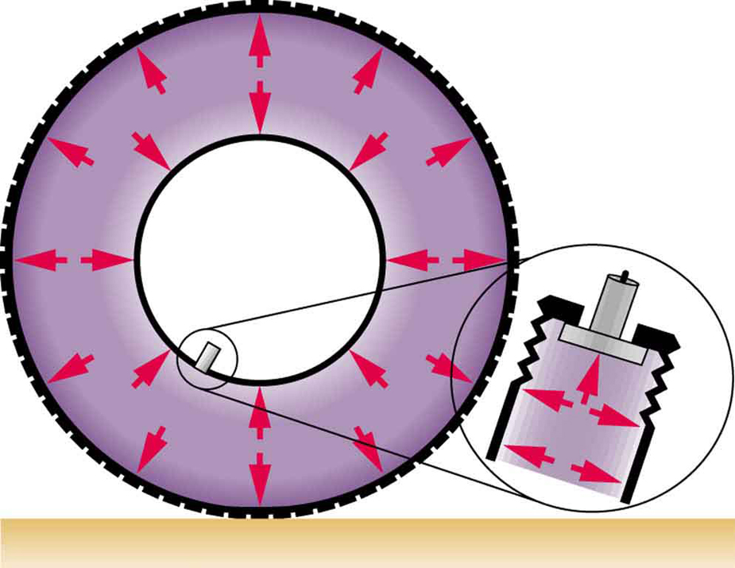
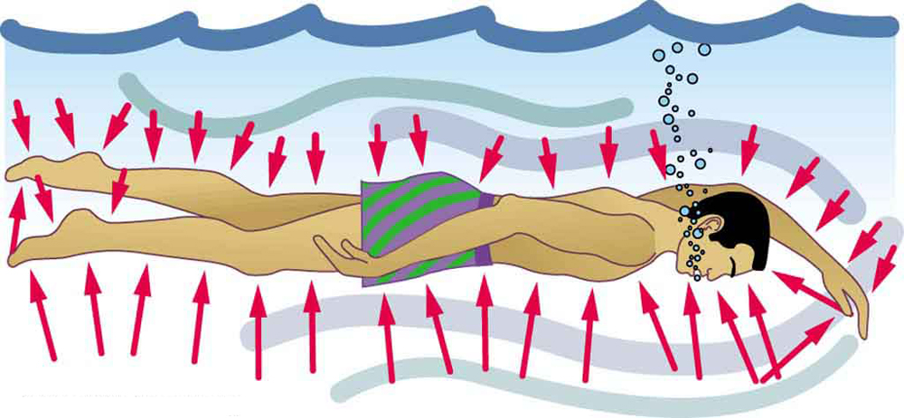

* Define pressure.
* Explain the relationship between pressure and force.
* Calculate force given pressure and area.

You have no doubt heard the word **pressure**{: data-type="term" #import-auto-id1932275} being used in relation to blood (high or low blood pressure) and in relation to the weather (high- and low-pressure weather systems). These are only two of many examples of pressures in fluids. Pressure <math xmlns="http://www.w3.org/1998/Math/MathML"><semantics><mrow><mrow><mi>P</mi></mrow><mrow /></mrow><annotation encoding="StarMath 5.0"> size 12{P} {}</annotation></semantics></math>

 is defined as

<math xmlns="http://www.w3.org/1998/Math/MathML"><semantics><mrow><mrow><mrow><mi>P</mi><mo stretchy="false">=</mo><mfrac><mi>F</mi><mi>A</mi></mfrac></mrow></mrow><mrow /></mrow><annotation encoding="StarMath 5.0"> size 12{P= { {F} over {A} } } {}</annotation></semantics></math>

where <math xmlns="http://www.w3.org/1998/Math/MathML"><semantics><mrow><mrow><mi>F</mi></mrow><mrow /></mrow><annotation encoding="StarMath 5.0"> size 12{P} {}</annotation></semantics></math>

 is a force applied to an area <math xmlns="http://www.w3.org/1998/Math/MathML"><semantics><mrow><mrow><mi>A</mi></mrow><mrow /></mrow><annotation encoding="StarMath 5.0"> size 12{P} {}</annotation></semantics></math>

 that is perpendicular to the force.

Pressure

Pressure is defined as the force divided by the area perpendicular to the force over which the force is applied, or

<math xmlns="http://www.w3.org/1998/Math/MathML"><semantics><mrow><mrow><mrow><mi>P</mi><mo stretchy="false">=</mo><mfrac><mi>F</mi><mi>A</mi></mfrac></mrow></mrow><mrow /><mo>.</mo></mrow><annotation encoding="StarMath 5.0"> size 12{P= { {F} over {A} } } {}</annotation></semantics></math>

A given force can have a significantly different effect depending on the area over which the force is exerted, as shown in [\[link\]](#import-auto-id3175803). The SI unit for pressure is the *pascal*, where 

<math xmlns="http://www.w3.org/1998/Math/MathML"><semantics><mrow><mrow><mrow><mn>1 Pa</mn><mrow><mo stretchy="false">=</mo><mn>1</mn></mrow><mspace width="0.25em" /><msup><mtext>N/m</mtext><mrow><mn>2</mn></mrow></msup><mo>.</mo></mrow></mrow></mrow><annotation encoding="StarMath 5.0"> size 12{1`"Pa"=1`"Nm" rSup { size 8{2} } } {}</annotation></semantics></math>

In addition to the pascal, there are many other units for pressure that are in common use. In meteorology, atmospheric pressure is often described in units of millibar (mb), where

<math xmlns="http://www.w3.org/1998/Math/MathML"><semantics><mrow><mrow><mrow><mtext>100 mb</mtext><mrow><mo stretchy="false">=</mo><mrow><mn>1</mn><mo stretchy="false">×</mo><msup><mtext>10</mtext><mrow><mn>5</mn></mrow></msup></mrow></mrow><mspace width="0.25em" /><mtext>Pa</mtext></mrow></mrow><mrow /><mo> .</mo></mrow><annotation encoding="StarMath 5.0"> size 12{"100"`"mb"=1 times "10" rSup { size 8{5} } `"Pa"} {}</annotation></semantics></math>

Pounds per square inch <math xmlns="http://www.w3.org/1998/Math/MathML"><semantics><mrow><mrow><mfenced open="(" close=")"><mrow><msup><mtext>lb/in</mtext><mrow><mn>2</mn></mrow></msup><mspace width="0.25em" /><mtext>or</mtext><mspace width="0.25em" /><mtext>psi</mtext></mrow></mfenced></mrow><mrow /></mrow><annotation encoding="StarMath 5.0"> size 12{ left ("lb/in" rSup { size 8{2} } `"or"``"psi" right )} {}</annotation></semantics></math>

 is still sometimes used as a measure of tire pressure, and millimeters of mercury (mm Hg) is still often used in the measurement of blood pressure. Pressure is defined for all states of matter but is particularly important when discussing fluids.

 While the person being poked with the finger might be irritated, the force has little lasting effect. (b) In contrast, the same force applied to an area the size of the sharp end of a needle is great enough to break the skin."){: #import-auto-id3175803}

Calculating Force Exerted by the Air: What Force Does a Pressure Exert?

An astronaut is working outside the International Space Station where the atmospheric pressure is essentially zero. The pressure gauge on her air tank reads <math xmlns="http://www.w3.org/1998/Math/MathML"><semantics><mrow><mrow><mrow><mn>6</mn><mtext>.</mtext><mrow><mtext>90</mtext><mo stretchy="false">×</mo><msup><mtext>10</mtext><mrow><mn>6</mn></mrow></msup></mrow><mspace width="0.25em" /><mtext>Pa</mtext></mrow></mrow><mrow /></mrow><annotation encoding="StarMath 5.0"> size 12{6 "." "90" times "10" rSup { size 8{6} } `"Pa"} {}</annotation></semantics></math>

. What force does the air inside the tank exert on the flat end of the cylindrical tank, a disk 0.150 m in diameter?

**Strategy**

We can find the force exerted from the definition of pressure given in <math xmlns="http://www.w3.org/1998/Math/MathML"><semantics><mrow><mrow><mrow><mi>P</mi><mo stretchy="false">=</mo><mfrac><mi>F</mi><mi>A</mi></mfrac></mrow></mrow><mrow /></mrow><annotation encoding="StarMath 5.0"> size 12{P= { {F} over {A} } } {}</annotation></semantics></math>

, provided we can find the area <math xmlns="http://www.w3.org/1998/Math/MathML"><semantics><mrow><mrow><mi>A</mi></mrow><mrow /></mrow><annotation encoding="StarMath 5.0"> size 12{A} {}</annotation></semantics></math>

 acted upon.

**Solution**

By rearranging the definition of pressure to solve for force, we see that

<math xmlns="http://www.w3.org/1998/Math/MathML"><semantics><mrow><mrow><mrow><mi>F</mi><mo stretchy="false">=</mo><mstyle fontstyle="italic"><mrow><mtext>PA</mtext></mrow></mstyle></mrow></mrow><mrow /><mo>.</mo></mrow><annotation encoding="StarMath 5.0"> size 12{F= ital "PA"} {}</annotation></semantics></math>

Here, the pressure <math xmlns="http://www.w3.org/1998/Math/MathML"><semantics><mrow><mrow><mi>P</mi></mrow><mrow /></mrow><annotation encoding="StarMath 5.0"> size 12{P} {}</annotation></semantics></math>

 is given, as is the area of the end of the cylinder <math xmlns="http://www.w3.org/1998/Math/MathML"><semantics><mrow><mrow><mi>A</mi></mrow><mrow /></mrow><annotation encoding="StarMath 5.0"> size 12{A} {}</annotation></semantics></math>

, given by <math xmlns="http://www.w3.org/1998/Math/MathML"><semantics><mrow><mrow><mrow><mi>A</mi><mo stretchy="false">=</mo><msup><mi fontstyle="italic">πr</mi><mrow><mn>2</mn></mrow></msup></mrow></mrow><mrow /></mrow><annotation encoding="StarMath 5.0"> size 12{A=πr rSup { size 8{2} } } {}</annotation></semantics></math>

. Thus,

<math xmlns="http://www.w3.org/1998/Math/MathML"> <semantics> <mrow> <mrow> <mtable columnalign="left"> <mtr><mtd> <mi>F</mi></mtd> <mtd> <mo stretchy="false">=</mo></mtd> <mtd> <mrow> <mrow> <mrow> <mrow> <mfenced open="(" close=")"> <mrow> <mn>6.90</mn> <mrow> <mo stretchy="false">×</mo> <msup> <mtext>10</mtext> <mrow> <mn>6</mn> </mrow> </msup> </mrow> <mspace width="0.25em" /> <msup> <mtext>N/m</mtext> <mrow> <mn>2</mn> </mrow> </msup> </mrow> </mfenced> </mrow> <mfenced open="(" close=")"> <mrow> <mn>3.14</mn> </mrow> </mfenced> <msup> <mfenced open="(" close=")"> <mrow> <mn>0.0750 m</mn> </mrow> </mfenced> <mrow> <mn>2</mn> </mrow> </msup> </mrow> </mrow> </mrow></mtd> </mtr> <mtr><mtd /> <mtd><mo stretchy="false">=</mo></mtd> <mtd> <mrow> <mn>1.22</mn> <mrow> <mo stretchy="false">×</mo> <msup> <mtext>10</mtext> <mrow> <mn>5</mn> </mrow> </msup> </mrow> <mspace width="0.25em" /> <mtext>N.</mtext> </mrow></mtd> </mtr> </mtable> </mrow> </mrow> <annotation encoding="StarMath 5.0">alignl { stack { size 12{F= left (6 "." "90" times "10" rSup { size 8{6} } `"N/m" rSup { size 8{2} } right ) left (3 "." "14" right ) left (0 "." "0750"`m right ) rSup { size 8{2} } } {} # =1 "." "22" times "10" rSup { size 8{5} } `N "." {} } } {}</annotation> </semantics> </math>

**Discussion**

Wow! No wonder the tank must be strong. Since we found <math xmlns="http://www.w3.org/1998/Math/MathML"><semantics><mrow><mrow><mrow><mi>F</mi><mo stretchy="false">=</mo><mstyle fontstyle="italic"><mrow><mtext>PA</mtext></mrow></mstyle></mrow></mrow><mrow /></mrow><annotation encoding="StarMath 5.0"> size 12{F= ital "PA"} {}</annotation></semantics></math>

, we see that the force exerted by a pressure is directly proportional to the area acted upon as well as the pressure itself.

The force exerted on the end of the tank is perpendicular to its inside surface. This direction is because the force is exerted by a static or stationary fluid. We have already seen that fluids cannot *withstand* shearing (sideways) forces; they cannot *exert* shearing forces, either. Fluid pressure has no direction, being a scalar quantity. The forces due to pressure have well-defined directions: they are always exerted perpendicular to any surface. (See the tire in [\[link\]](#import-auto-id2055656), for example.) Finally, note that pressure is exerted on all surfaces. Swimmers, as well as the tire, feel pressure on all sides. (See [\[link\]](#import-auto-id3130778).)

 {: #import-auto-id2055656}

{: #import-auto-id3130778}

PhET Explorations: Gas Properties

Pump gas molecules to a box and see what happens as you change the volume, add or remove heat, change gravity, and more. Measure the temperature and pressure, and discover how the properties of the gas vary in relation to each other.

<figure markdown="1" id="eip-id3028052">
<figcaption>
[Gas Properties](gas-properties_en.jar)
</figcaption>
 [{: data-print="false"}](gas-properties_en.jar){: data-type="image"}  
</figure>

# Section Summary

* {: #import-auto-id2602098} Pressure is the force per unit perpendicular area over which the force is applied. In equation form, pressure is defined as
  

  <math xmlns="http://www.w3.org/1998/Math/MathML"> <semantics> <mrow> <mrow> <mrow> <mrow> <mi>P</mi> <mo stretchy="false">=</mo> <mfrac> <mi>F</mi> <mi>A</mi> </mfrac> </mrow> <mtext>.</mtext> </mrow> </mrow> </mrow> <annotation encoding="StarMath 5.0"> size 12{P= { {F} over {A} } "." } {}</annotation> </semantics> </math>
  

* {: #import-auto-id1228614} The SI unit of pressure is pascal and
  <math xmlns="http://www.w3.org/1998/Math/MathML"><semantics><mrow><mrow><mrow><mrow><mtext>1 Pa</mtext><mo stretchy="false">=</mo><mn>1</mn></mrow><mspace width="0.25em" /><msup><mtext>N/m</mtext><mrow><mn>2</mn></mrow></msup></mrow></mrow><mrow /></mrow><annotation encoding="StarMath 5.0"> size 12{1`"Pa"=1`"N/m" rSup { size 8{2} } } {}</annotation></semantics></math>
  
  .

# Conceptual Questions

How is pressure related to the sharpness of a knife and its ability to cut?

Why does a dull hypodermic needle hurt more than a sharp one?

The outward force on one end of an air tank was calculated in [[link]](#fs-id2601795). How is this force balanced? (The tank does not accelerate, so the force must be balanced.)

Why is force exerted by static fluids always perpendicular to a surface?

In a remote location near the North Pole, an iceberg floats in a lake. Next to the lake (assume it is not frozen) sits a comparably sized glacier sitting on land. If both chunks of ice should melt due to rising global temperatures (and the melted ice all goes into the lake), which ice chunk would give the greatest increase in the level of the lake water, if any?

How do jogging on soft ground and wearing padded shoes reduce the pressures to which the feet and legs are subjected?

Toe dancing (as in ballet) is much harder on toes than normal dancing or walking. Explain in terms of pressure.

How do you convert pressure units like millimeters of mercury, centimeters of water, and inches of mercury into units like newtons per meter squared without resorting to a table of pressure conversion factors?

# Problems &amp; Exercises

As a woman walks, her entire weight is momentarily placed on one heel of her high-heeled shoes. Calculate the pressure exerted on the floor by the heel if it has an area of <math xmlns="http://www.w3.org/1998/Math/MathML"><semantics><mrow><mrow><mrow><mn>1</mn><mtext>.</mtext><mtext>50</mtext><mspace width="0.25em" /><msup><mtext>cm</mtext><mrow><mn>2</mn></mrow></msup></mrow></mrow><mrow /></mrow><annotation encoding="StarMath 5.0"> size 12{1 "." "50"`"cm" rSup { size 8{2} } } {}</annotation></semantics></math>

 and the woman’s mass is 55.0 kg. Express the pressure in Pa. (In the early days of commercial flight, women were not allowed to wear high-heeled shoes because aircraft floors were too thin to withstand such large pressures.)

<math xmlns="http://www.w3.org/1998/Math/MathML"><semantics><mrow><mrow><mrow><mrow><mrow><mn>3.59</mn><mo stretchy="false">×</mo><msup><mtext>10</mtext><mrow><mn>6</mn></mrow></msup></mrow></mrow><mspace width="0.25em" /><mtext>Pa</mtext></mrow></mrow></mrow></semantics></math>

; or <math xmlns="http://www.w3.org/1998/Math/MathML"> <semantics> <mrow> <mrow> <mrow> <mtext>521</mtext> <mspace width="0.25em" /> <msup> <mtext>lb/in</mtext> <mrow> <mn>2</mn> </mrow> </msup> </mrow> </mrow> <mrow /> </mrow> <annotation encoding="StarMath 5.0"> size 12{"521"`"lb/in" rSup { size 8{2} } } {}</annotation> </semantics> </math>

The pressure exerted by a phonograph needle on a record is surprisingly large. If the equivalent of 1.00 g is supported by a needle, the tip of which is a circle 0.200 mm in radius, what pressure is exerted on the record in <math xmlns="http://www.w3.org/1998/Math/MathML"><semantics><mrow><mrow><msup><mtext>N/m</mtext><mrow><mn>2</mn></mrow></msup></mrow><mrow /></mrow><annotation encoding="StarMath 5.0"> size 12{"N/m" rSup { size 8{2} } } {}</annotation></semantics></math>

?

Nail tips exert tremendous pressures when they are hit by hammers because they exert a large force over a small area. What force must be exerted on a nail with a circular tip of 1.00 mm diameter to create a pressure of <math xmlns="http://www.w3.org/1998/Math/MathML"><semantics><mrow><mrow><mrow><mn>3</mn><mtext>.</mtext><mrow><mtext>00</mtext><mo stretchy="false">×</mo><msup><mtext>10</mtext><mrow><mn>9</mn></mrow></msup></mrow><mspace width="0.25em" /><msup><mtext>N/m</mtext><mrow><mn>2</mn></mrow></msup><mn>?</mn></mrow></mrow><mrow /></mrow></semantics></math>

(This high pressure is possible because the hammer striking the nail is brought to rest in such a short distance.)

<math xmlns="http://www.w3.org/1998/Math/MathML"> <semantics> <mrow> <mrow> <mrow> <mn>2.36</mn> <mrow> <mo stretchy="false">×</mo> <msup> <mtext>10</mtext> <mrow> <mn>3</mn> </mrow> </msup> </mrow> <mspace width="0.25em" /> <mtext>N</mtext> </mrow> </mrow> <mrow /> </mrow> <annotation encoding="StarMath 5.0"> size 12{2 "." "36" times "10" rSup { size 8{3} } `N} {}</annotation> </semantics> </math>

## Glossary
{: data-type="glossary-title"}

pressure
: the force per unit area perpendicular to the force, over which the force acts
{: .definition #import-auto-id1818589}

