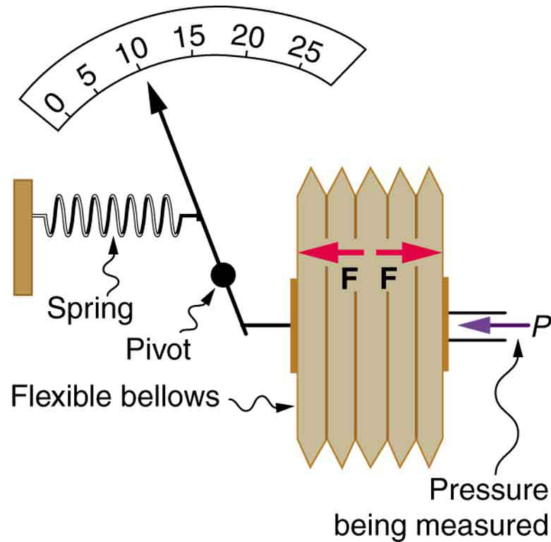
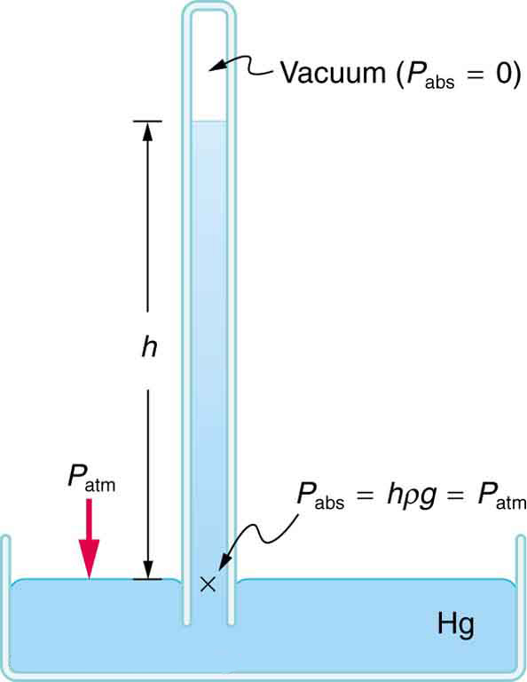

* Define gauge pressure and absolute pressure.
* Understand the working of aneroid and open-tube barometers.

If you limp into a gas station with a nearly flat tire, you will notice the tire gauge on the airline reads nearly zero when you begin to fill it. In fact, if there were a gaping hole in your tire, the gauge would read zero, even though atmospheric pressure exists in the tire. Why does the gauge read zero? There is no mystery here. Tire gauges are simply designed to read zero at atmospheric pressure and positive when pressure is greater than atmospheric.

Similarly, atmospheric pressure adds to blood pressure in every part of the circulatory system. (As noted in [Pascal’s Principle](/m42193), the total pressure in a fluid is the sum of the pressures from different sources—here, the heart and the atmosphere.) But atmospheric pressure has no net effect on blood flow since it adds to the pressure coming out of the heart and going back into it, too. What is important is how much *greater* blood pressure is than atmospheric pressure. Blood pressure measurements, like tire pressures, are thus made relative to atmospheric pressure.

In brief, it is very common for pressure gauges to ignore atmospheric pressure—that is, to read zero at atmospheric pressure. We therefore define **gauge pressure**{: data-type="term" #import-auto-id2065562} to be the pressure relative to atmospheric pressure. Gauge pressure is positive for pressures above atmospheric pressure, and negative for pressures below it.

Gauge Pressure

Gauge pressure is the pressure relative to atmospheric pressure. Gauge pressure is positive for pressures above atmospheric pressure, and negative for pressures below it.

In fact, atmospheric pressure does add to the pressure in any fluid not enclosed in a rigid container. This happens because of Pascal’s principle. The total pressure, or **absolute pressure**{: data-type="term" #import-auto-id1861458}, is thus the sum of gauge pressure and atmospheric pressure: <math xmlns="http://www.w3.org/1998/Math/MathML"><semantics><mrow><mrow><mrow><msub><mi>P</mi><mrow><mtext>abs</mtext></mrow></msub><mo stretchy="false">=</mo><mrow><msub><mi>P</mi><mrow><mtext>g</mtext></mrow></msub><mo stretchy="false">+</mo><msub><mi>P</mi><mrow><mtext>atm</mtext></mrow></msub></mrow></mrow></mrow><mrow /></mrow><annotation encoding="StarMath 5.0"> size 12{P rSub { size 8{"abs"} } =P rSub { size 8{g} } +P rSub { size 8{"atm"} } } {}</annotation></semantics></math>

 where <math xmlns="http://www.w3.org/1998/Math/MathML"><semantics><mrow><mrow><msub><mi>P</mi><mrow><mtext>abs</mtext></mrow></msub></mrow><mrow /></mrow><annotation encoding="StarMath 5.0"> size 12{P rSub { size 8{"abs"} } } {}</annotation></semantics></math>

 is absolute pressure, <math xmlns="http://www.w3.org/1998/Math/MathML"><semantics><mrow><mrow><msub><mi>P</mi><mrow><mtext>g</mtext></mrow></msub></mrow><mrow /></mrow><annotation encoding="StarMath 5.0"> size 12{P rSub { size 8{g} } } {}</annotation></semantics></math>

 is gauge pressure, and <math xmlns="http://www.w3.org/1998/Math/MathML"><semantics><mrow><mrow><msub><mi>P</mi><mrow><mtext>atm</mtext></mrow></msub></mrow><mrow /></mrow><annotation encoding="StarMath 5.0"> size 12{P rSub { size 8{"atm"} } } {}</annotation></semantics></math>

 is atmospheric pressure. For example, if your tire gauge reads 34 psi (pounds per square inch), then the absolute pressure is 34 psi plus 14.7 psi (<math xmlns="http://www.w3.org/1998/Math/MathML"><semantics><mrow><mrow><msub><mi>P</mi><mrow><mtext>atm</mtext></mrow></msub></mrow><mrow /></mrow><annotation encoding="StarMath 5.0"> size 12{P rSub { size 8{"atm"} } } {}</annotation></semantics></math>

 in psi), or 48.7 psi (equivalent to 336 kPa).

Absolute Pressure

Absolute pressure is the sum of gauge pressure and atmospheric pressure.

For reasons we will explore later, in most cases the absolute pressure in fluids cannot be negative. Fluids push rather than pull, so the smallest absolute pressure is zero. (A negative absolute pressure is a pull.) Thus the smallest possible gauge pressure is <math xmlns="http://www.w3.org/1998/Math/MathML"><semantics><mrow><mrow><mrow><msub><mi>P</mi><mrow><mtext>g</mtext></mrow></msub><mo stretchy="false">=</mo><mrow><mo stretchy="false">−</mo><msub><mi>P</mi><mrow><mtext>atm</mtext></mrow></msub></mrow></mrow></mrow><mrow /></mrow><annotation encoding="StarMath 5.0"> size 12{P rSub { size 8{g} } = - P rSub { size 8{"atm"} } } {}</annotation></semantics></math>

 (this makes <math xmlns="http://www.w3.org/1998/Math/MathML"><semantics><mrow><mrow><msub><mi>P</mi><mrow><mtext>abs</mtext></mrow></msub></mrow><mrow /></mrow><annotation encoding="StarMath 5.0"> size 12{P rSub { size 8{"abs"} } } {}</annotation></semantics></math>

 zero). There is no theoretical limit to how large a gauge pressure can be.

There are a host of devices for measuring pressure, ranging from tire gauges to blood pressure cuffs. Pascal’s principle is of major importance in these devices. The undiminished transmission of pressure through a fluid allows precise remote sensing of pressures. Remote sensing is often more convenient than putting a measuring device into a system, such as a person’s artery.

[\[link\]](#import-auto-id2010699) shows one of the many types of mechanical pressure gauges in use today. In all mechanical pressure gauges, pressure results in a force that is converted (or transduced) into some type of readout.

 {: #import-auto-id2010699}

An entire class of gauges uses the property that pressure due to the weight of a fluid is given by <math xmlns="http://www.w3.org/1998/Math/MathML"><semantics><mrow><mrow><mrow><mrow><mi>P</mi><mo stretchy="false">=</mo><mi fontstyle="italic">hρg</mi></mrow><mtext>.</mtext></mrow></mrow><mrow /></mrow><annotation encoding="StarMath 5.0"> size 12{P=hρg "." } {}</annotation></semantics></math>

 Consider the U-shaped tube shown in [\[link\]](#import-auto-id1840451), for example. This simple tube is called a *manometer*. In [\[link\]](#import-auto-id1840451)(a), both sides of the tube are open to the atmosphere. Atmospheric pressure therefore pushes down on each side equally so its effect cancels. If the fluid is deeper on one side, there is a greater pressure on the deeper side, and the fluid flows away from that side until the depths are equal.

Let us examine how a manometer is used to measure pressure. Suppose one side of the U-tube is connected to some source of pressure <math xmlns="http://www.w3.org/1998/Math/MathML"><semantics><mrow><mrow><msub><mi>P</mi><mrow><mtext>abs</mtext></mrow></msub></mrow><mrow /></mrow><annotation encoding="StarMath 5.0"> size 12{P rSub { size 8{"abs"} } } {}</annotation></semantics></math>

 such as the toy balloon in [\[link\]](#import-auto-id1840451)(b) or the vacuum-packed peanut jar shown in [\[link\]](#import-auto-id1840451)(c). Pressure is transmitted undiminished to the manometer, and the fluid levels are no longer equal. In [\[link\]](#import-auto-id1840451)(b), <math xmlns="http://www.w3.org/1998/Math/MathML"><semantics><mrow><mrow><msub><mi>P</mi><mrow><mtext>abs</mtext></mrow></msub></mrow><mrow /></mrow><annotation encoding="StarMath 5.0"> size 12{P rSub { size 8{"abs"} } } {}</annotation></semantics></math>

 is greater than atmospheric pressure, whereas in [\[link\]](#import-auto-id1840451)(c), <math xmlns="http://www.w3.org/1998/Math/MathML"><semantics><mrow><mrow><msub><mi>P</mi><mrow><mtext>abs</mtext></mrow></msub></mrow><mrow /></mrow><annotation encoding="StarMath 5.0"> size 12{P rSub { size 8{"abs"} } } {}</annotation></semantics></math>

 is less than atmospheric pressure. In both cases, <math xmlns="http://www.w3.org/1998/Math/MathML"><semantics><mrow><mrow><msub><mi>P</mi><mrow><mtext>abs</mtext></mrow></msub></mrow><mrow /></mrow><annotation encoding="StarMath 5.0"> size 12{P rSub { size 8{"abs"} } } {}</annotation></semantics></math>

 differs from atmospheric pressure by an amount <math xmlns="http://www.w3.org/1998/Math/MathML"><semantics><mrow><mrow><mi fontstyle="italic">hρg</mi></mrow><mrow /></mrow><annotation encoding="StarMath 5.0"> size 12{hρg} {}</annotation></semantics></math>

, where <math xmlns="http://www.w3.org/1998/Math/MathML"><semantics><mrow><mrow><mi>ρ</mi></mrow><mrow /></mrow><annotation encoding="StarMath 5.0"> size 12{ρ} {}</annotation></semantics></math>

 is the density of the fluid in the manometer. In [\[link\]](#import-auto-id1840451)(b), <math xmlns="http://www.w3.org/1998/Math/MathML"><semantics><mrow><mrow><msub><mi>P</mi><mrow><mtext>abs</mtext></mrow></msub></mrow><mrow /></mrow><annotation encoding="StarMath 5.0"> size 12{P rSub { size 8{"abs"} } } {}</annotation></semantics></math>

 can support a column of fluid of height <math xmlns="http://www.w3.org/1998/Math/MathML"><semantics><mrow><mrow><mi>h</mi></mrow><mrow /></mrow><annotation encoding="StarMath 5.0"> size 12{h} {}</annotation></semantics></math>

, and so it must exert a pressure <math xmlns="http://www.w3.org/1998/Math/MathML"><semantics><mrow><mrow><mi fontstyle="italic">hρg</mi></mrow><mrow /></mrow><annotation encoding="StarMath 5.0"> size 12{hρg} {}</annotation></semantics></math>

 greater than atmospheric pressure (the gauge pressure <math xmlns="http://www.w3.org/1998/Math/MathML"><semantics><mrow><mrow><msub><mi>P</mi><mrow><mtext>g</mtext></mrow></msub></mrow><mrow /></mrow><annotation encoding="StarMath 5.0"> size 12{P rSub { size 8{g} } } {}</annotation></semantics></math>

 is positive). In [\[link\]](#import-auto-id1840451)(c), atmospheric pressure can support a column of fluid of height <math xmlns="http://www.w3.org/1998/Math/MathML"><semantics><mrow><mrow><mi>h</mi></mrow><mrow /></mrow><annotation encoding="StarMath 5.0"> size 12{h} {}</annotation></semantics></math>

, and so <math xmlns="http://www.w3.org/1998/Math/MathML"><semantics><mrow><mrow><msub><mi>P</mi><mrow><mtext>abs</mtext></mrow></msub></mrow><mrow /></mrow><annotation encoding="StarMath 5.0"> size 12{P rSub { size 8{"abs"} } } {}</annotation></semantics></math>

 is less than atmospheric pressure by an amount <math xmlns="http://www.w3.org/1998/Math/MathML"><semantics><mrow><mrow><mi fontstyle="italic">hρg</mi></mrow><mrow /></mrow><annotation encoding="StarMath 5.0"> size 12{hρg} {}</annotation></semantics></math>

 (the gauge pressure <math xmlns="http://www.w3.org/1998/Math/MathML"><semantics><mrow><mrow><msub><mi>P</mi><mrow><mtext>g</mtext></mrow></msub></mrow><mrow /></mrow><annotation encoding="StarMath 5.0"> size 12{P rSub { size 8{g} } } {}</annotation></semantics></math>

 is negative). A manometer with one side open to the atmosphere is an ideal device for measuring gauge pressures. The gauge pressure is <math xmlns="http://www.w3.org/1998/Math/MathML"><semantics><mrow><mrow><mrow><msub><mi>P</mi><mrow><mtext>g</mtext></mrow></msub><mo stretchy="false">=</mo><mi fontstyle="italic">hρg</mi></mrow></mrow><mrow /></mrow><annotation encoding="StarMath 5.0"> size 12{P rSub { size 8{g} } =hρg} {}</annotation></semantics></math>

 and is found by measuring <math xmlns="http://www.w3.org/1998/Math/MathML"><semantics><mrow><mrow><mi>h</mi></mrow><mrow /></mrow><annotation encoding="StarMath 5.0"> size 12{h} {}</annotation></semantics></math>

.

 Fluid depth must be the same on both sides, or the pressure each side exerts at the bottom will be unequal and there will be flow from the deeper side. (b) A positive gauge pressure Pg=h&#x3C1;g size 12{P rSub { size 8{g} } =h&#x3C1;g} {} transmitted to one side of the manometer can support a column of fluid of height h size 12{h} {}. (c) Similarly, atmospheric pressure is greater than a negative gauge pressure Pg size 12{P rSub { size 8{g} } } {} by an amount h&#x3C1;g size 12{h&#x3C1;g} {}. The jar&#x2019;s rigidity prevents atmospheric pressure from being transmitted to the peanuts."){: #import-auto-id1840451}

Mercury manometers are often used to measure arterial blood pressure. An inflatable cuff is placed on the upper arm as shown in [\[link\]](#import-auto-id2688887). By squeezing the bulb, the person making the measurement exerts pressure, which is transmitted undiminished to both the main artery in the arm and the manometer. When this applied pressure exceeds blood pressure, blood flow below the cuff is cut off. The person making the measurement then slowly lowers the applied pressure and listens for blood flow to resume. Blood pressure pulsates because of the pumping action of the heart, reaching a maximum, called **systolic pressure**{: data-type="term" #import-auto-id1934980}, and a minimum, called **diastolic pressure**{: data-type="term" #import-auto-id1506745}, with each heartbeat. Systolic pressure is measured by noting the value of <math xmlns="http://www.w3.org/1998/Math/MathML"><semantics><mrow><mrow><mi>h</mi></mrow><mrow /></mrow><annotation encoding="StarMath 5.0"> size 12{h} {}</annotation></semantics></math>

 when blood flow first begins as cuff pressure is lowered. Diastolic pressure is measured by noting <math xmlns="http://www.w3.org/1998/Math/MathML"><semantics><mrow><mrow><mi>h</mi></mrow><mrow /></mrow><annotation encoding="StarMath 5.0"> size 12{h} {}</annotation></semantics></math>

 when blood flows without interruption. The typical blood pressure of a young adult raises the mercury to a height of 120 mm at systolic and 80 mm at diastolic. This is commonly quoted as 120 over 80, or 120/80. The first pressure is representative of the maximum output of the heart; the second is due to the elasticity of the arteries in maintaining the pressure between beats. The density of the mercury fluid in the manometer is 13.6 times greater than water, so the height of the fluid will be 1/13.6 of that in a water manometer. This reduced height can make measurements difficult, so mercury manometers are used to measure larger pressures, such as blood pressure. The density of mercury is such that <math xmlns="http://www.w3.org/1998/Math/MathML"><semantics><mrow><mn>1.0 mm Hg</mn><mo>=</mo><mn>133</mn><mspace width="0.25em" /><mtext>Pa</mtext></mrow></semantics></math>

.

Systolic Pressure

Systolic pressure is the maximum blood pressure.

Diastolic Pressure

Diastolic pressure is the minimum blood pressure.

 "){: #import-auto-id2688887}

Calculating Height of IV Bag: Blood Pressure and Intravenous Infusions

Intravenous infusions are usually made with the help of the gravitational force. Assuming that the density of the fluid being administered is 1.00 g/ml, at what height should the IV bag be placed above the entry point so that the fluid just enters the vein if the blood pressure in the vein is 18 mm Hg above atmospheric pressure? Assume that the IV bag is collapsible.

**Strategy for (a)**

For the fluid to just enter the vein, its pressure at entry must exceed the blood pressure in the vein (18 mm Hg above atmospheric pressure). We therefore need to find the height of fluid that corresponds to this gauge pressure.

**Solution**

We first need to convert the pressure into SI units. Since <math xmlns="http://www.w3.org/1998/Math/MathML"><semantics><mrow><mn>1.0 mm Hg</mn><mo stretchy="false">=</mo><mtext>133 Pa</mtext></mrow></semantics></math>

,

<math xmlns="http://www.w3.org/1998/Math/MathML"> <semantics> <mrow> <mrow> <mrow> <mrow> <mi>P</mi> <mo stretchy="false">=</mo> <mtext>18 mm Hg</mtext> </mrow> <mrow> <mrow> <mo stretchy="false">×</mo> <mfrac> <mrow> <mtext>133 Pa</mtext> </mrow> <mrow> <mn>1.0 mm Hg</mn> </mrow> </mfrac> </mrow> <mo stretchy="false">=</mo> <mtext>2400 Pa</mtext> </mrow> <mtext>.</mtext> </mrow> </mrow> <mrow /> </mrow> <annotation encoding="StarMath 5.0"> size 12{P="18"`"mm"`"Hg" times { {"133"`"Pa"} over {1 "." 0`"mm"`"Hg"} } ="2400"`"Pa" "." } {}</annotation> </semantics> </math>

Rearranging <math xmlns="http://www.w3.org/1998/Math/MathML"><semantics><mrow><mrow><mrow><msub><mi>P</mi><mrow><mtext>g</mtext></mrow></msub><mo stretchy="false">=</mo><mi fontstyle="italic">hρg</mi></mrow></mrow><mrow /></mrow><annotation encoding="StarMath 5.0"> size 12{P rSub { size 8{g} } =hρg} {}</annotation></semantics></math>

 for <math xmlns="http://www.w3.org/1998/Math/MathML"><semantics><mrow><mrow><mi>h</mi></mrow><mrow /></mrow><annotation encoding="StarMath 5.0"> size 12{h} {}</annotation></semantics></math>

 gives <math xmlns="http://www.w3.org/1998/Math/MathML"><semantics><mrow><mrow><mrow><mi>h</mi><mo stretchy="false">=</mo><mfrac><msub><mi>P</mi><mrow><mtext>g</mtext></mrow></msub><mi fontstyle="italic">ρg</mi></mfrac></mrow></mrow><mrow /></mrow><annotation encoding="StarMath 5.0"> size 12{h= { {P rSub { size 8{g} } } over {ρg} } } {}</annotation></semantics></math>

. Substituting known values into this equation gives

<math xmlns="http://www.w3.org/1998/Math/MathML"> <semantics> <mrow> <mrow> <mtable columnalign="left"> <mtr><mtd> <mi>h</mi></mtd> <mtd> <mo stretchy="false">=</mo></mtd> <mtd> <mrow> <mrow> <mrow> <mfrac> <mrow> <mtext>2400 N</mtext> <msup> <mtext>/m</mtext> <mrow> <mn>2</mn> </mrow> </msup> </mrow> <mrow> <mfenced open="(" close=")"> <mrow> <mn>1</mn> <mtext>.</mtext> <mrow> <mn>0</mn> <mo stretchy="false">×</mo> <msup> <mtext>10</mtext> <mrow> <mn>3</mn> </mrow> </msup> </mrow> <mspace width="0.25em" /> <msup> <mtext>kg/m</mtext> <mrow> <mn>3</mn> </mrow> </msup> </mrow> </mfenced> <mfenced open="(" close=")"> <mrow> <mn>9</mn> <mtext>.</mtext> <mtext>80</mtext> <mspace width="0.25em" /> <msup> <mtext>m/s</mtext> <mrow> <mn>2</mn> </mrow> </msup> </mrow> </mfenced> </mrow> </mfrac> </mrow> </mrow> </mrow></mtd> </mtr> <mtr><mtd /> <mtd> <mo stretchy="false">=</mo></mtd> <mtd> <mrow> <mrow> <mtext>0.24 m.</mtext> </mrow> </mrow></mtd> </mtr> </mtable> </mrow> </mrow> <annotation encoding="StarMath 5.0">alignl { stack { size 12{h= { {"2400"`"N/m" rSup { size 8{2} } } over { left (1 "." 0 times "10" rSup { size 8{3} } `"kg/m" rSup { size 8{3} } right ) left (9 "." "80"`"m/s" rSup { size 8{2} } right )} } } {} # " "=" 0" "." "24"`m "." {} } } {}</annotation> </semantics> </math>

**Discussion**

The IV bag must be placed at 0.24 m above the entry point into the arm for the fluid to just enter the arm. Generally, IV bags are placed higher than this. You may have noticed that the bags used for blood collection are placed below the donor to allow blood to flow easily from the arm to the bag, which is the opposite direction of flow than required in the example presented here.

A *barometer* is a device that measures atmospheric pressure. A mercury barometer is shown in [\[link\]](#import-auto-id2403521). This device measures atmospheric pressure, rather than gauge pressure, because there is a nearly pure vacuum above the mercury in the tube. The height of the mercury is such that <math xmlns="http://www.w3.org/1998/Math/MathML"><semantics><mrow><mrow><mrow><mi fontstyle="italic">hρg</mi><mo stretchy="false">=</mo><msub><mi>P</mi><mrow><mtext>atm</mtext></mrow></msub></mrow></mrow><mrow /></mrow><annotation encoding="StarMath 5.0"> size 12{hρg=P rSub { size 8{"atm"} } } {}</annotation></semantics></math>

. When atmospheric pressure varies, the mercury rises or falls, giving important clues to weather forecasters. The barometer can also be used as an altimeter, since average atmospheric pressure varies with altitude. Mercury barometers and manometers are so common that units of mm Hg are often quoted for atmospheric pressure and blood pressures. [\[link\]](#eip-286) gives conversion factors for some of the more commonly used units of pressure.

{: #import-auto-id2403521}

<table id="eip-286" summary="Conversion Factors for Various Pressure Units"><caption>Conversion Factors for Various Pressure Units</caption><thead>
          <tr>
            <th>Conversion to N/m2 (Pa)</th>
            <th>Conversion from atm</th>
          </tr>
       </thead><tbody>
          <tr>
            <td>
              <math xmlns="http://www.w3.org/1998/Math/MathML" display="block">
                <semantics>
                  <mrow>
                    <mrow>
                      <mrow>
                        <mn>1.0 atm</mn>
                        <mrow>
                          <mo stretchy="false">=</mo>
                          <mn>1</mn>
                        </mrow>
                        <mtext>.</mtext>
                        <mrow>
                          <mtext>013</mtext>
                          <mo stretchy="false">×</mo>
                          <msup>
                            <mtext>10</mtext>
                            <mrow>
                              <mn>5</mn>
                            </mrow>
                          </msup>
                        </mrow>
                      <mspace width="0.25em" />
                        <msup>
                          <mtext>N/m</mtext>
                          <mrow>
                            <mn>2</mn>
                          </mrow>
                        </msup>
                      </mrow>
                    </mrow>
                  </mrow>
                  <annotation encoding="StarMath 5.0"> size 12{1 "." 0`"atm"=1 "." "013" times "10" rSup { size 8{5} } `"N/m" rSup { size 8{2} } } {}</annotation>
                </semantics>
              </math>
            </td>
            <td>
              <math xmlns="http://www.w3.org/1998/Math/MathML" display="block">
                <semantics>
                  <mrow>
                    <mrow>
                      <mrow>
                        <mn>1.0 atm</mn>
                        <mrow>
                          <mo stretchy="false">=</mo>
                          <mn>1</mn>
                        </mrow>
                        <mtext>.</mtext>
                        <mrow>
                          <mtext>013</mtext>
                          <mo stretchy="false">×</mo>
                          <msup>
                            <mtext>10</mtext>
                            <mrow>
                              <mn>5</mn>
                            </mrow>
                          </msup>
                        </mrow>
                       <mspace width="0.25em" />
                        <msup>
                          <mtext>N/m</mtext>
                          <mrow>
                            <mn>2</mn>
                          </mrow>
                        </msup>
                      </mrow>
                    </mrow>
                  </mrow>
                  <annotation encoding="StarMath 5.0"> size 12{1 "." 0`"atm"=1 "." "013" times "10" rSup { size 8{5} } `"N/m" rSup { size 8{2} } } {}</annotation>
                </semantics>
              </math>
            </td>
          </tr>
          <tr>
            <td>
              <math xmlns="http://www.w3.org/1998/Math/MathML" display="block">
                <semantics>
                  <mrow>
                    <mrow>
                      <mrow>
                        <mn>1.0</mn><mspace width="0.25em" />
                        <mrow>
                          <msup>
                            <mtext>dyne/cm</mtext>
                            <mrow>
                              <mn>2</mn>
                            </mrow>
                          </msup>
                          <mo stretchy="false">=</mo>
                          <mn>0</mn>
                        </mrow>
                        <mtext>.</mtext>
                        <mtext>10</mtext>
                       <mspace width="0.25em" />
                        <msup>
                          <mtext>N/m</mtext>
                          <mrow>
                            <mn>2</mn>
                          </mrow>
                        </msup>
                      </mrow>
                    </mrow>
                  </mrow>
                  <annotation encoding="StarMath 5.0"> size 12{1 "." 0`"dyne/cm" rSup { size 8{2} } =0 "." "10"`"N/m" rSup { size 8{2} } } {}</annotation>
                </semantics>
              </math>
            </td>
            <td>
              <math xmlns="http://www.w3.org/1998/Math/MathML" display="block">
                <semantics>
                  <mrow>
                    <mrow>
                      <mrow>
                        <mn>1</mn>
                        <mtext>.</mtext>
                        <mn>0</mn>
                      <mspace width="0.25em" />
                        <mrow>
                          <mtext>atm</mtext>
                          <mo stretchy="false">=</mo>
                          <mn>1</mn>
                        </mrow>
                        <mtext>.</mtext>
                        <mrow>
                          <mtext>013</mtext>
                          <mo stretchy="false">×</mo>
                          <msup>
                            <mtext>10</mtext>
                            <mrow>
                              <mn>6</mn>
                            </mrow>
                          </msup>
                        </mrow>
                      <mspace width="0.25em" />
                        <msup>
                          <mtext>dyne/cm</mtext>
                          <mrow>
                            <mn>2</mn>
                          </mrow>
                        </msup>
                      </mrow>
                    </mrow>
                  </mrow>
                  <annotation encoding="StarMath 5.0"> size 12{1 "." 0`"atm"=1 "." "013" times "10" rSup { size 8{6} } `"dyne/cm" rSup { size 8{2} } } {}</annotation>
                </semantics>
              </math>
            </td>
          </tr>
          <tr>
            <td>
              <math xmlns="http://www.w3.org/1998/Math/MathML" display="block">
                <semantics>
                  <mrow>
                    <mrow>
                      <mrow>
                        <mn>1</mn>
                        <mtext>.</mtext>
                        <mn>0</mn>
                     <mspace width="0.25em" />
                        <mrow>
                          <msup>
                            <mtext>kg/cm</mtext>
                            <mrow>
                              <mn>2</mn>
                            </mrow>
                          </msup>
                          <mo stretchy="false">=</mo>
                          <mn>9</mn>
                        </mrow>
                        <mtext>.</mtext>
                        <mrow>
                          <mn>8</mn>
                          <mo stretchy="false">×</mo>
                          <msup>
                            <mtext>10</mtext>
                            <mrow>
                              <mn>4</mn>
                            </mrow>
                          </msup>
                        </mrow>
                    <mspace width="0.25em" />
                        <msup>
                          <mtext>N/m</mtext>
                          <mrow>
                            <mn>2</mn>
                          </mrow>
                        </msup>
                      </mrow>
                    </mrow>
                  </mrow>
                  <annotation encoding="StarMath 5.0"> size 12{1 "." 0`"kg/cm" rSup { size 8{2} } =9 "." 8 times "10" rSup { size 8{4} } `"N/m" rSup { size 8{2} } } {}</annotation>
                </semantics>
              </math>
            </td>
            <td>
              <math xmlns="http://www.w3.org/1998/Math/MathML" display="block">
                <semantics>
                  <mrow>
                    <mrow>
                      <mrow>
                        <mn>1</mn>
                        <mtext>.</mtext>
                        <mn>0</mn>
                     <mspace width="0.25em" />
                        <mrow>
                          <mtext>atm</mtext>
                          <mo stretchy="false">=</mo>
                          <mn>1</mn>
                        </mrow>
                        <mtext>.</mtext>
                        <mtext>013</mtext>
                     <mspace width="0.25em" />
                        <msup>
                          <mtext>kg/cm</mtext>
                          <mrow>
                            <mn>2</mn>
                          </mrow>
                        </msup>
                      </mrow>
                    </mrow>
                  </mrow>
                  <annotation encoding="StarMath 5.0"> size 12{1 "." 0`"atm"=1 "." "013"`"kg/cm" rSup { size 8{2} } } {}</annotation>
                </semantics>
              </math>
            </td>
          </tr>
          <tr>
            <td>
              <math xmlns="http://www.w3.org/1998/Math/MathML" display="block">
                <semantics>
                  <mrow>
                    <mrow>
                      <mrow>
                        <mn>1</mn>
                        <mtext>.</mtext>
                        <mn>0</mn>
                    <mspace width="0.25em" />
                        <mtext>lb/in</mtext>
                        <mrow>
                          <msup>
                            <mtext>.</mtext>
                            <mrow>
                              <mn>2</mn>
                            </mrow>
                          </msup>
                          <mo stretchy="false">=</mo>
                          <mn>6</mn>
                        </mrow>
                        <mtext>.</mtext>
                        <mrow>
                          <mtext>90</mtext>
                          <mo stretchy="false">×</mo>
                          <msup>
                            <mtext>10</mtext>
                            <mrow>
                              <mn>3</mn>
                            </mrow>
                          </msup>
                        </mrow>
                      <mspace width="0.25em" />
                        <msup>
                          <mtext>N/m</mtext>
                          <mrow>
                            <mn>2</mn>
                          </mrow>
                        </msup>
                      </mrow>
                    </mrow>
                  </mrow>
                  <annotation encoding="StarMath 5.0"> size 12{1 "." 0`"lb/in" "."  rSup { size 8{2} } =6 "." "90" times "10" rSup { size 8{3} } `"N/m" rSup { size 8{2} } } {}</annotation>
                </semantics>
              </math>
            </td>
            <td>
              <math xmlns="http://www.w3.org/1998/Math/MathML" display="block">
                <semantics>
                  <mrow>
                    <mrow>
                      <mrow>
                        <mn>1</mn>
                        <mtext>.</mtext>
                        <mn>0</mn>
                     <mspace width="0.25em" />
                        <mrow>
                          <mtext>atm</mtext>
                          <mo stretchy="false">=</mo>
                          <mtext>14</mtext>
                        </mrow>
                        <mtext>.</mtext>
                        <mn>7</mn>
                     <mspace width="0.25em" />
                        <mtext>lb/in</mtext>
                        <msup>
                          <mtext>.</mtext>
                          <mrow>
                            <mn>2</mn>
                          </mrow>
                        </msup>
                      </mrow>
                    </mrow>
                  </mrow>
                  <annotation encoding="StarMath 5.0"> size 12{1 "." 0`"atm"="14" "." 7`"lb/in" "."  rSup { size 8{2} } } {}</annotation>
                </semantics>
              </math>
            </td>
          </tr>
          <tr>
            <td>
              <math xmlns="http://www.w3.org/1998/Math/MathML" display="block">
                <semantics>
                  <mrow>
                    <mrow>
                      <mrow>
                        <mn>1.0 mm Hg</mn>
                        <mrow>
                          <mo stretchy="false">=</mo>
                          <mtext>133</mtext>
                        </mrow>
<mspace width="0.25em" />
                        <msup>
                          <mtext>N/m</mtext>
                          <mrow>
                            <mn>2</mn>
                          </mrow>
                        </msup>
                      </mrow>
                    </mrow>
                  </mrow>
                  <annotation encoding="StarMath 5.0"> size 12{1 "." 0`"mm"`"Hg"="133"`"N/m" rSup { size 8{2} } } {}</annotation>
                </semantics>
              </math>
            </td>
            <td>
              <math xmlns="http://www.w3.org/1998/Math/MathML" display="block">
                <semantics>
                  <mrow>
                    <mrow>
                      <mrow>
                        <mn>1</mn>
                        <mtext>.</mtext>
                        <mn>0</mn>
                       <mspace width="0.25em" />
                        <mrow>
                          <mtext>atm</mtext>
                          <mo stretchy="false">=</mo>
                          <mtext>760 mm Hg</mtext>
                        </mrow>
                      </mrow>
                    </mrow>
                  </mrow>
                  <annotation encoding="StarMath 5.0"> size 12{1 "." 0`"atm"="760"`"mm"`"Hg"} {}</annotation>
                </semantics>
              </math>
            </td>
          </tr>
          <tr>
            <td>
              <math xmlns="http://www.w3.org/1998/Math/MathML" display="block">
                <semantics>
                  <mrow>
                    <mrow>
                      <mrow>
                        <mn>1</mn>
                        <mtext>.</mtext>
                        <mn>0 cm Hg</mn>
                       
                        <mrow>
                          <mo stretchy="false">=</mo>
                          <mn>1</mn>
                        </mrow>
                        <mtext>.</mtext>
                        <mrow>
                          <mtext>33</mtext>
                          <mo stretchy="false">×</mo>
                          <msup>
                            <mtext>10</mtext>
                            <mrow>
                              <mn>3</mn>
                            </mrow>
                          </msup>
                        </mrow>
                       <mspace width="0.25em" />
                        <msup>
                          <mtext>N/m</mtext>
                          <mrow>
                            <mn>2</mn>
                          </mrow>
                        </msup>
                      </mrow>
                    </mrow>
                  </mrow>
                  <annotation encoding="StarMath 5.0"> size 12{1 "." 0`"cm"`"Hg"=1 "." "33" times "10" rSup { size 8{3} } `"N/m" rSup { size 8{2} } } {}</annotation>
                </semantics>
              </math>
            </td>
            <td>
              <math xmlns="http://www.w3.org/1998/Math/MathML" display="block">
                <semantics>
                  <mrow>
                    <mrow>
                      <mrow>
                        <mn>1</mn>
                        <mtext>.</mtext>
                        <mn>0</mn>
                     <mspace width="0.25em" />
                        <mrow>
                          <mtext>atm</mtext>
                          <mo stretchy="false">=</mo>
                          <mtext>76</mtext>
                        </mrow>
                        <mtext>.</mtext>
                        <mn>0 cm Hg</mn>
                      </mrow>
                    </mrow>
                  </mrow>
                  <annotation encoding="StarMath 5.0"> size 12{1 "." 0`"atm"="76" "." 0`"cm"`"Hg"} {}</annotation>
                </semantics>
              </math>
            </td>
          </tr>
          <tr>
            <td>
              <math xmlns="http://www.w3.org/1998/Math/MathML" display="block">
                <semantics>
                  <mrow>
                    <mrow>
                      <mrow>
                        <mn>1</mn>
                        <mtext>.</mtext>
                        <mn>0 cm water</mn>
                        <mrow>
                          <mo stretchy="false">=</mo>
                          <mtext>98</mtext>
                        </mrow>
                        <mtext>.</mtext>
                        <mn>1</mn>
                      <mspace width="0.25em" />
                        <msup>
                          <mtext>N/m</mtext>
                          <mrow>
                            <mn>2</mn>
                          </mrow>
                        </msup>
                      </mrow>
                    </mrow>
                  </mrow>
                  <annotation encoding="StarMath 5.0"> size 12{1 "." 0`"cm"`"water"="98" "." 1`"N/m" rSup { size 8{2} } } {}</annotation>
                </semantics>
              </math>
            </td>
            <td>
              <math xmlns="http://www.w3.org/1998/Math/MathML" display="block">
                <semantics>
                  <mrow>
                    <mrow>
                      <mrow>
                        <mn>1</mn>
                        <mtext>.</mtext>
                        <mn>0</mn>
                       <mspace width="0.25em" />
                        <mrow>
                          <mtext>atm</mtext>
                          <mo stretchy="false">=</mo>
                          <mn>1</mn>
                        </mrow>
                        <mtext>.</mtext>
                        <mrow>
                          <mtext>03</mtext>
                          <mo stretchy="false">×</mo>
                          <msup>
                            <mtext>10</mtext>
                            <mrow>
                              <mn>3</mn>
                            </mrow>
                          </msup>
                        </mrow>
                    <mspace width="0.25em" />
                        <mtext>cm water</mtext>
                      </mrow>
                    </mrow>
                  </mrow>
                  <annotation encoding="StarMath 5.0"> size 12{1 "." 0`"atm"=1 "." "03" times "10" rSup { size 8{3} } `"cm"`"water"} {}</annotation>
                </semantics>
              </math>
            </td>
          </tr>
          <tr>
            <td>
              <math xmlns="http://www.w3.org/1998/Math/MathML" display="block">
                <semantics>
                  <mrow>
                    <mrow>
                      <mrow>
                        <mn>1.0 bar</mn>
                        <mrow>
                          <mo stretchy="false">=</mo>
                          <mn>1</mn>
                        </mrow>
                        <mtext>.</mtext>
                        <mrow>
                          <mtext>000</mtext>
                          <mo stretchy="false">×</mo>
                          <msup>
                            <mtext>10</mtext>
                            <mrow>
                              <mn>5</mn>
                            </mrow>
                          </msup>
                        </mrow>
                      <mspace width="0.25em" />
                        <msup>
                          <mtext>N/m</mtext>
                          <mrow>
                            <mn>2</mn>
                          </mrow>
                        </msup>
                      </mrow>
                    </mrow>
                  </mrow>
                  <annotation encoding="StarMath 5.0"> size 12{1 "." 0`"bar"=1 "." "000" times "10" rSup { size 8{5} } `"N/m" rSup { size 8{2} } } {}</annotation>
                </semantics>
              </math>
            </td>
            <td>
              <math xmlns="http://www.w3.org/1998/Math/MathML" display="block">
                <semantics>
                  <mrow>
                    <mrow>
                      <mrow>
                        <mn>1</mn>
                        <mtext>.</mtext>
                        <mn>0</mn>
                      <mspace width="0.25em" />
                        <mrow>
                          <mtext>atm</mtext>
                          <mo stretchy="false">=</mo>
                          <mn>1.013 bar</mn>
                        </mrow>
                      </mrow>
                    </mrow>
                  </mrow>
                  <annotation encoding="StarMath 5.0"> size 12{1 "." 0`"atm"=1 "." "013"`"bar"} {}</annotation>
                </semantics>
              </math>
            </td>
          </tr>
          <tr>
            <td>
              <math xmlns="http://www.w3.org/1998/Math/MathML" display="block">
                <semantics>
                  <mrow>
                    <mrow>
                      <mrow>
                        <mn>1.0 millibar</mn>
                        <mrow>
                          <mo stretchy="false">=</mo>
                          <mn>1</mn>
                        </mrow>
                        <mtext>.</mtext>
                        <mrow>
                          <mtext>000</mtext>
                          <mo stretchy="false">×</mo>
                          <msup>
                            <mtext>10</mtext>
                            <mrow>
                              <mn>2</mn>
                            </mrow>
                          </msup>
                        </mrow>
                      <mspace width="0.25em" />
                        <msup>
                          <mtext>N/m</mtext>
                          <mrow>
                            <mn>2</mn>
                          </mrow>
                        </msup>
                      </mrow>
                    </mrow>
                  </mrow>
                  <annotation encoding="StarMath 5.0"> size 12{1 "." 0`"millibar"=1 "." "000" times "10" rSup { size 8{2} } `"N/m" rSup { size 8{2} } } {}</annotation>
                </semantics>
              </math>
            </td>
            <td>
              <math xmlns="http://www.w3.org/1998/Math/MathML" display="block">
                <semantics>
                  <mrow>
                    <mrow>
                      <mrow>
                        <mn>1.0 atm</mn>
                        <mrow>
                          <mo stretchy="false">=</mo>
                          <mtext>1013 millibar</mtext>
                        </mrow>
                      </mrow>
                    </mrow>
                  </mrow>
                </semantics>
              </math>
            </td>
          </tr>
        </tbody></table>

# Section Summary

* {: #import-auto-id2626448} Gauge pressure is the pressure relative to atmospheric pressure.
* {: #import-auto-id3154736} Absolute pressure is the sum of gauge pressure and atmospheric pressure.
* {: #import-auto-id2026029} Aneroid gauge measures pressure using a bellows-and-spring arrangement connected to the pointer of a calibrated scale.
* {: #import-auto-id2603246} Open-tube manometers have U-shaped tubes and one end is always open. It is used to measure pressure.
* {: #import-auto-id1383953} A mercury barometer is a device that measures atmospheric pressure.

# Conceptual Questions

Explain why the fluid reaches equal levels on either side of a manometer if both sides are open to the atmosphere, even if the tubes are of different diameters.
{: xmlns:fo="urn:oasis:names:tc:opendocument:xmlns:xsl-fo-compatible:1.0" fo:font-weight="normal"}

[[link]](#import-auto-id2688887) shows how a common measurement of arterial blood pressure is made. Is there any effect on the measured pressure if the manometer is lowered? What is the effect of raising the arm above the shoulder? What is the effect of placing the cuff on the upper leg with the person standing? Explain your answers in terms of pressure created by the weight of a fluid.

Considering the magnitude of typical arterial blood pressures, why are mercury rather than water manometers used for these measurements?
{: xmlns:fo="urn:oasis:names:tc:opendocument:xmlns:xsl-fo-compatible:1.0" fo:font-weight="normal"}

# Problems &amp; Exercises

Find the gauge and absolute pressures in the balloon and peanut jar shown in [[link]](#import-auto-id1840451), assuming the manometer connected to the balloon uses water whereas the manometer connected to the jar contains mercury. Express in units of centimeters of water for the balloon and millimeters of mercury for the jar, taking <math xmlns="http://www.w3.org/1998/Math/MathML"><semantics><mrow><mrow><mrow><mrow><mi>h</mi><mo stretchy="false">=</mo><mn>0</mn></mrow><mtext>.</mtext><mtext>0500 m</mtext></mrow></mrow><mrow /></mrow><annotation encoding="StarMath 5.0"> size 12{h=0 "." "0500"`m} {}</annotation></semantics></math>

 for each.

Balloon:

<math xmlns="http://www.w3.org/1998/Math/MathML"> <semantics> <mrow> <mrow> <mtable columnalign="left"> <mtr><mtd> <msub> <mi>P</mi> <mrow> <mtext>g</mtext> </mrow> </msub></mtd> <mtd> <mo stretchy="false">=</mo></mtd> <mtd> <mrow> <mrow> <mrow> <mrow> <mn>5.00 cm</mn> </mrow><mspace width="0.25em" /> <msub> <mtext> H</mtext> <mrow> <mn>2</mn> </mrow> </msub> <mtext>O,</mtext> </mrow> </mrow> </mrow></mtd> </mtr> <mtr><mtd> <msub> <mi>P</mi> <mrow> <mtext>abs</mtext> </mrow> </msub></mtd> <mtd> <mo stretchy="false">=</mo></mtd> <mtd> <mrow> <mrow> <mn>1.035</mn> </mrow> <mrow> <mo stretchy="false">×</mo> <msup> <mtext>10</mtext> <mrow> <mn>3</mn> </mrow> </msup> </mrow> <mspace width="0.25em" /> <mtext>cm</mtext><mspace width="0.25em" /> <msub> <mtext>H</mtext> <mrow> <mn>2</mn> </mrow> </msub> <mtext>O.</mtext> </mrow></mtd> </mtr> </mtable> </mrow> </mrow> <annotation encoding="StarMath 5.0">alignl { stack { size 12{P rSub { size 8{g} } =5 "." "00"`"cm"`H rSub { size 8{2} } "O,"} {} # P rSub { size 8{"abs"} } =1 "." "035" times "10" rSup { size 8{3} } `"cm"`H rSub { size 8{2} } O "." {} } } {}</annotation> </semantics> </math>
{: xmlns:fo="urn:oasis:names:tc:opendocument:xmlns:xsl-fo-compatible:1.0" fo:font-weight="normal"}

Jar:
{: xmlns:fo="urn:oasis:names:tc:opendocument:xmlns:xsl-fo-compatible:1.0" fo:font-weight="normal"}

<math xmlns="http://www.w3.org/1998/Math/MathML"> <semantics> <mrow> <mrow> <mtable columnalign="left"> <mtr><mtd> <msub> <mi>P</mi> <mrow> <mtext>g</mtext> </mrow> </msub></mtd> <mtd> <mo stretchy="false">=</mo></mtd> <mtd> <mrow> <mrow> <mrow> <mrow> <mrow> <mo stretchy="false">−</mo> <mtext>50.0 mm Hg</mtext> </mrow> </mrow> <mtext>,</mtext> </mrow> </mrow> </mrow></mtd> </mtr> <mtr><mtd> <msub> <mi>P</mi> <mrow> <mtext>abs</mtext> </mrow> </msub></mtd> <mtd> <mo stretchy="false">=</mo></mtd> <mtd> <mrow> <mrow> <mtext>710 mm Hg.</mtext> </mrow> </mrow></mtd> </mtr> </mtable> </mrow> </mrow> <annotation encoding="StarMath 5.0">alignl { stack { size 12{P rSub { size 8{g} } = - "50" "." 0`"mm"`"Hg,"} {} # P rSub { size 8{"abs"} } ="710"`"mm"`"Hg" "." {} } } {}</annotation> </semantics> </math>
{: xmlns:fo="urn:oasis:names:tc:opendocument:xmlns:xsl-fo-compatible:1.0" fo:font-weight="normal"}

(a) Convert normal blood pressure readings of 120 over 80 mm Hg to newtons per meter squared using the relationship for pressure due to the weight of a fluid <math xmlns="http://www.w3.org/1998/Math/MathML"><semantics><mrow><mrow><mrow><mo stretchy="false">(</mo><mrow><mi>P</mi><mo stretchy="false">=</mo><mi fontstyle="italic">hρg</mi></mrow><mo stretchy="false">)</mo></mrow></mrow><mrow /></mrow><annotation encoding="StarMath 5.0"> size 12{ \( P=hρg \) } {}</annotation></semantics></math>

 rather than a conversion factor. (b) Discuss why blood pressures for an infant could be smaller than those for an adult. Specifically, consider the smaller height to which blood must be pumped.

How tall must a water-filled manometer be to measure blood pressures as high as 300 mm Hg?

4\.08 m

Pressure cookers have been around for more than 300 years, although their use has strongly declined in recent years (early models had a nasty habit of exploding). How much force must the latches holding the lid onto a pressure cooker be able to withstand if the circular lid is <math xmlns="http://www.w3.org/1998/Math/MathML"><semantics><mrow><mrow><mrow><mtext>25.0 cm</mtext></mrow></mrow><mrow /></mrow><annotation encoding="StarMath 5.0"> size 12{"25" "." 0`"cm"} {}</annotation></semantics></math>

 in diameter and the gauge pressure inside is 300 atm? Neglect the weight of the lid.

Suppose you measure a standing person’s blood pressure by placing the cuff on his leg 0.500 m below the heart. Calculate the pressure you would observe (in units of mm Hg) if the pressure at the heart were 120 over 80 mm Hg. Assume that there is no loss of pressure due to resistance in the circulatory system (a reasonable assumption, since major arteries are large).

<math xmlns="http://www.w3.org/1998/Math/MathML"> <semantics> <mrow> <mrow> <mtable> <mtr> <mrow> <mrow> <mrow> <mrow> <mn>Δ</mn><mi fontstyle="italic">P</mi> <mo stretchy="false">=</mo> <mtext>38.7 mm Hg,</mtext> </mrow> </mrow> </mrow> </mrow> </mtr> <mtr> <mrow> <mrow> <mrow> <mtext>Leg blood pressure</mtext> <mrow> <mo stretchy="false">=</mo> <mfrac> <mtext>159</mtext> <mtext>119</mtext> </mfrac> </mrow> <mtext>.</mtext> </mrow> </mrow> </mrow> </mtr> </mtable> </mrow> </mrow> <annotation encoding="StarMath 5.0">alignl { stack { size 12{ΔP="38" "." 7`"mm"`"Hg,"} {} # size 12{"Leg"`"blood"`"pressure"= { {"159"} over {"119"} } "." } {} } } {}</annotation> </semantics> </math>

A submarine is stranded on the bottom of the ocean with its hatch 25.0 m below the surface. Calculate the force needed to open the hatch from the inside, given it is circular and 0.450 m in diameter. Air pressure inside the submarine is 1.00 atm.

Assuming bicycle tires are perfectly flexible and support the weight of bicycle and rider by pressure alone, calculate the total area of the tires in contact with the ground. The bicycle plus rider has a mass of 80.0 kg, and the gauge pressure in the tires is <math xmlns="http://www.w3.org/1998/Math/MathML"><semantics><mrow><mrow><mrow><mn>3</mn><mtext>.</mtext><mrow><mtext>50</mtext><mo stretchy="false">×</mo><msup><mtext>10</mtext><mrow><mn>5</mn></mrow></msup></mrow><mspace width="0.25em" /><mtext>Pa</mtext></mrow></mrow><mrow /></mrow><annotation encoding="StarMath 5.0"> size 12{3 "." "50" times "10" rSup { size 8{5} } `"Pa"} {}</annotation></semantics></math>

.

<math xmlns="http://www.w3.org/1998/Math/MathML"> <semantics> <mrow> <mrow> <mrow> <mtext>22</mtext> <mtext>.</mtext> <mn>4</mn> <mspace width="0.25em" /> <msup> <mtext>cm</mtext> <mrow> <mn>2</mn> </mrow> </msup> </mrow> </mrow> <mrow /> </mrow> <annotation encoding="StarMath 5.0"> size 12{"22" "." 4`"cm" rSup { size 8{2} } } {}</annotation> </semantics> </math>

