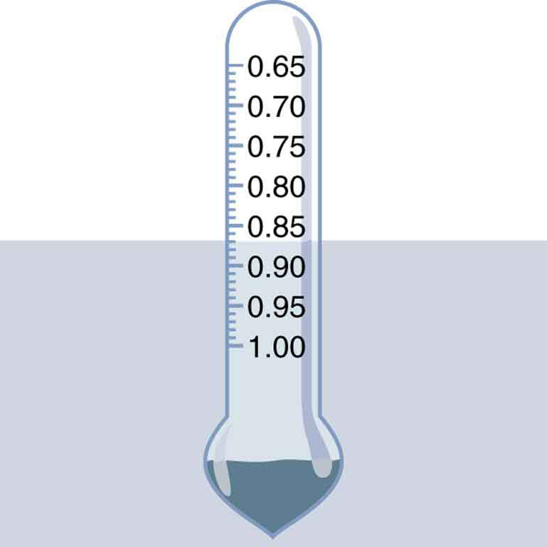

* Define buoyant force.
* State Archimedes’ principle.
* Understand why objects float or sink.
* Understand the relationship between density and Archimedes’ principle.

When you rise from lounging in a warm bath, your arms feel strangely heavy. This is because you no longer have the buoyant support of the water. Where does this buoyant force come from? Why is it that some things float and others do not? Do objects that sink get any support at all from the fluid? Is your body buoyed by the atmosphere, or are only helium balloons affected? (See [\[link\]](#import-auto-id1840242).)

  Even objects that sink, like this anchor, are partly supported by water when submerged. (b) Submarines have adjustable density (ballast tanks) so that they may float or sink as desired. (credit: Allied Navy) (c) Helium-filled balloons tug upward on their strings, demonstrating air&#x2019;s buoyant effect. (credit: Crystl)"){: #import-auto-id1840242 data-media-type="image/png"}

Answers to all these questions, and many others, are based on the fact that pressure increases with depth in a fluid. This means that the upward force on the bottom of an object in a fluid is greater than the downward force on the top of the object. There is a net upward, or ****{::}**buoyant force**{: data-type="term" #import-auto-id3402524} on any object in any fluid. (See [\[link\]](#import-auto-id2980301).) If the buoyant force is greater than the object’s weight, the object will rise to the surface and float. If the buoyant force is less than the object’s weight, the object will sink. If the buoyant force equals the object’s weight, the object will remain suspended at that depth. The buoyant force is always present whether the object floats, sinks, or is suspended in a fluid.

Buoyant Force

The buoyant force is the net upward force on any object in any fluid.

 "){: #import-auto-id2980301 data-media-type="image/jpg"}

Just how great is this buoyant force? To answer this question, think about what happens when a submerged object is removed from a fluid, as in [\[link\]](#fs-id1860048).

 An object submerged in a fluid experiences a buoyant force FB size 12{F rSub { size 8{B} } } {}. If FB size 12{F rSub { size 8{B} } } {} is greater than the weight of the object, the object will rise. If FB size 12{F rSub { size 8{B} } } {} is less than the weight of the object, the object will sink. (b) If the object is removed, it is replaced by fluid having weight wfl size 12{w rSub { size 8{&quot;fl&quot;} } } {}. Since this weight is supported by surrounding fluid, the buoyant force must equal the weight of the fluid displaced. That is, FB=wfl size 12{F rSub { size 8{B} } =w rSub { size 8{&quot;fl&quot;} } } {},a statement of Archimedes&#x2019; principle."){: data-media-type="image/jpeg"}

The space it occupied is filled by fluid having a weight <math xmlns="http://www.w3.org/1998/Math/MathML"><semantics><mrow><mrow><msub><mi>w</mi><mrow><mtext>fl</mtext></mrow></msub></mrow><mrow /></mrow><annotation encoding="StarMath 5.0"> size 12{w rSub { size 8{"fl"} } } {}</annotation></semantics></math>

. This weight is supported by the surrounding fluid, and so the buoyant force must equal <math xmlns="http://www.w3.org/1998/Math/MathML"><semantics><mrow><mrow><msub><mi>w</mi><mrow><mtext>fl</mtext></mrow></msub></mrow><mrow /></mrow><annotation encoding="StarMath 5.0"> size 12{w rSub { size 8{"fl"} } } {}</annotation></semantics></math>

, the weight of the fluid displaced by the object. It is a tribute to the genius of the Greek mathematician and inventor Archimedes (ca. 287–212 B.C.) that he stated this principle long before concepts of force were well established. Stated in words, **Archimedes’ principle**{: data-type="term" #import-auto-id3085839} is as follows: The buoyant force on an object equals the weight of the fluid it displaces. In equation form, Archimedes’ principle is

<math xmlns="http://www.w3.org/1998/Math/MathML"><semantics><mrow><mrow><mrow><msub><mi>F</mi><mrow><mtext>B</mtext></mrow></msub><mo stretchy="false">=</mo><msub><mi>w</mi><mrow><mtext>fl</mtext></mrow></msub></mrow></mrow><mrow /><mo>,</mo></mrow><annotation encoding="StarMath 5.0"> size 12{F rSub { size 8{B} } =w rSub { size 8{"fl"} } } {}</annotation></semantics></math>

where <math xmlns="http://www.w3.org/1998/Math/MathML"><semantics><mrow><mrow><msub><mi>F</mi><mrow><mtext>B</mtext></mrow></msub></mrow><mrow /></mrow><annotation encoding="StarMath 5.0"> size 12{F rSub { size 8{B} } } {}</annotation></semantics></math>

 is the buoyant force and <math xmlns="http://www.w3.org/1998/Math/MathML"><semantics><mrow><mrow><msub><mi>w</mi><mrow><mtext>fl</mtext></mrow></msub></mrow><mrow /></mrow><annotation encoding="StarMath 5.0"> size 12{w rSub { size 8{"fl"} } } {}</annotation></semantics></math>

 is the weight of the fluid displaced by the object. Archimedes’ principle is valid in general, for any object in any fluid, whether partially or totally submerged.

Archimedes’ Principle

According to this principle the buoyant force on an object equals the weight of the fluid it displaces. In equation form, Archimedes’ principle is

<math xmlns="http://www.w3.org/1998/Math/MathML"><semantics><mrow><mrow><mrow><msub><mi>F</mi><mrow><mtext>B</mtext></mrow></msub><mo stretchy="false">=</mo><msub><mi>w</mi><mrow><mtext>fl</mtext></mrow></msub></mrow></mrow><mrow /><mo>,</mo></mrow><annotation encoding="StarMath 5.0"> size 12{F rSub { size 8{B} } =w rSub { size 8{"fl"} } } {}</annotation></semantics></math>

where <math xmlns="http://www.w3.org/1998/Math/MathML"><semantics><mrow><mrow><msub><mi>F</mi><mrow><mtext>B</mtext></mrow></msub></mrow><mrow /></mrow><annotation encoding="StarMath 5.0"> size 12{F rSub { size 8{B} } } {}</annotation></semantics></math>

 is the buoyant force and <math xmlns="http://www.w3.org/1998/Math/MathML"><semantics><mrow><mrow><msub><mi>w</mi><mrow><mtext>fl</mtext></mrow></msub></mrow><mrow /></mrow><annotation encoding="StarMath 5.0"> size 12{w rSub { size 8{"fl"} } } {}</annotation></semantics></math>

 is the weight of the fluid displaced by the object.

*Humm …* High-tech body swimsuits were introduced in 2008 in preparation for the Beijing Olympics. One concern (and international rule) was that these suits should not provide any buoyancy advantage. How do you think that this rule could be verified?

Making Connections: Take-Home Investigation

The density of aluminum foil is 2.7 times the density of water. Take a piece of foil, roll it up into a ball and drop it into water. Does it sink? Why or why not? Can you make it sink?

# Floating and Sinking

Drop a lump of clay in water. It will sink. Then mold the lump of clay into the shape of a boat, and it will float. Because of its shape, the boat displaces more water than the lump and experiences a greater buoyant force. The same is true of steel ships.

Calculating buoyant force: dependency on shape

(a) Calculate the buoyant force on 10,000 metric tons <math xmlns="http://www.w3.org/1998/Math/MathML"><semantics><mrow><mrow><mrow><mo stretchy="false">(</mo><mn>1</mn><mtext>.</mtext><mrow><mtext>00</mtext><mo stretchy="false">×</mo><msup><mtext>10</mtext><mrow><mn>7</mn></mrow></msup></mrow><mspace width="0.25em" /><mtext>kg</mtext><mo stretchy="false">)</mo></mrow></mrow><mrow /></mrow><annotation encoding="StarMath 5.0"> size 12{ \( 1 "." "00" times "10" rSup { size 8{7} } `"kg" \) } {}</annotation></semantics></math>

 of solid steel completely submerged in water, and compare this with the steel’s weight. (b) What is the maximum buoyant force that water could exert on this same steel if it were shaped into a boat that could displace <math xmlns="http://www.w3.org/1998/Math/MathML"><semantics><mrow><mrow><mrow><mn>1</mn><mtext>.</mtext><mrow><mtext>00</mtext><mo stretchy="false">×</mo><msup><mtext>10</mtext><mrow><mn>5</mn></mrow></msup></mrow><mspace width="0.25em" /><msup><mtext>m</mtext><mrow><mn>3</mn></mrow></msup></mrow></mrow><mrow /></mrow><annotation encoding="StarMath 5.0"> size 12{1 "." "00" times "10" rSup { size 8{5} } `m rSup { size 8{3} } } {}</annotation></semantics></math>

 of water?

**Strategy for (a)**

To find the buoyant force, we must find the weight of water displaced. We can do this by using the densities of water and steel given in [\[link\]](/m42187#fs-id1769034). We note that, since the steel is completely submerged, its volume and the water’s volume are the same. Once we know the volume of water, we can find its mass and weight.

**Solution for (a)**

First, we use the definition of density <math xmlns="http://www.w3.org/1998/Math/MathML"><semantics><mrow><mrow><mrow><mi>ρ</mi><mo stretchy="false">=</mo><mfrac><mi>m</mi><mi>V</mi></mfrac></mrow></mrow><mrow /></mrow><annotation encoding="StarMath 5.0"> size 12{ρ= { {m} over {V} } } {}</annotation></semantics></math>

 to find the steel’s volume, and then we substitute values for mass and density. This gives

<math xmlns="http://www.w3.org/1998/Math/MathML"><semantics><mrow><mrow><mrow><mrow><mrow><mrow><msub><mi>V</mi><mrow><mtext>st</mtext></mrow></msub><mo stretchy="false">=</mo><mfrac><msub><mi>m</mi><mrow><mtext>st</mtext></mrow></msub><msub><mi>ρ</mi><mrow><mtext>st</mtext></mrow></msub></mfrac></mrow><mo stretchy="false">=</mo><mfrac><mrow><mn>1</mn><mtext>.</mtext><mrow><mtext>00</mtext><mo stretchy="false">×</mo><msup><mtext>10</mtext><mrow><mn>7</mn></mrow></msup></mrow><mspace width="0.25em" /><mtext>kg</mtext></mrow><mrow><mn>7</mn><mtext>.</mtext><mrow><mn>8</mn><mo stretchy="false">×</mo><msup><mtext>10</mtext><mrow><mn>3</mn></mrow></msup></mrow><mspace width="0.25em" /><msup><mtext>kg/m</mtext><mrow><mn>3</mn></mrow></msup></mrow></mfrac></mrow><mo stretchy="false">=</mo><mn>1</mn></mrow><mtext>.</mtext><mrow><mtext>28</mtext><mo stretchy="false">×</mo><msup><mtext>10</mtext><mrow><mn>3</mn></mrow></msup></mrow><mspace width="0.25em" /><msup><mtext>m</mtext><mrow><mn>3</mn></mrow></msup></mrow></mrow><mrow /><mo>.</mo></mrow><annotation encoding="StarMath 5.0"> size 12{v rSub { size 8{"st"} } = { {m rSub { size 8{"st"} } } over {ρ rSub { size 8{"st"} } } } = { {1 "." "00" times "10" rSup { size 8{7} } `"kg"} over {7 "." 8 times "10" rSup { size 8{3} } `"kg/m" rSup { size 8{3} } } } =1 "." "28" times "10" rSup { size 8{3} } `m rSup { size 8{3} } } {}</annotation></semantics></math>

Because the steel is completely submerged, this is also the volume of water displaced, <math xmlns="http://www.w3.org/1998/Math/MathML"><semantics><mrow><mrow><msub><mi>V</mi><mrow><mtext>w</mtext></mrow></msub></mrow><mrow /></mrow><annotation encoding="StarMath 5.0"> size 12{V rSub { size 8{w} } } {}</annotation></semantics></math>

. We can now find the mass of water displaced from the relationship between its volume and density, both of which are known. This gives

<math xmlns="http://www.w3.org/1998/Math/MathML"> <semantics> <mrow> <mrow> <mtable columnalign="left"> <mtr><mtd> <msub> <mi>m</mi> <mrow> <mn>w</mn> </mrow> </msub></mtd> <mtd> <mo stretchy="false">=</mo></mtd> <mtd> <mrow> <mrow> <mrow> <mrow> <msub> <mi>ρ</mi> <mrow> <mn>w</mn> </mrow> </msub> </mrow> <mrow> <msub> <mi>V</mi> <mrow> <mn>w</mn> </mrow> </msub> <mo stretchy="false">=</mo> <mo stretchy="false">(</mo> <mtext>1.000</mtext> <mo stretchy="false">×</mo> <msup> <mtext>10</mtext> <mrow> <mn>3</mn> </mrow> </msup> </mrow> <mspace width="0.25em" /> <msup> <mtext>kg/m</mtext> <mrow> <mn>3</mn> </mrow> </msup> <mo stretchy="false">)</mo> <mo stretchy="false">(</mo> <mn>1.28</mn> <mrow> <mo stretchy="false">×</mo> <msup> <mtext>10</mtext> <mrow> <mn>3</mn> </mrow> </msup> </mrow><mspace width="0.25em" /> <msup> <mn>m</mn> <mrow> <mn>3</mn> </mrow> </msup> <mo stretchy="false">)</mo> </mrow> </mrow> </mrow></mtd> </mtr> <mtr><mtd /> <mtd> <mo stretchy="false">=</mo> </mtd> <mtd> <mrow> <mrow> <mtext>1.28</mtext> <mo stretchy="false">×</mo> <msup> <mtext>10</mtext> <mrow> <mn>6</mn> </mrow> </msup> </mrow> <mspace width="0.25em" /> <mtext>kg.</mtext> </mrow></mtd> </mtr> </mtable> </mrow> </mrow> <annotation encoding="StarMath 5.0">alignc { stack { size 12{m rSub { size 8{w} } =ρ rSub { size 8{w} } V rSub { size 8{w} } = \( 1 "." "000" times "10" rSup { size 8{3} } `"kg/m" rSup { size 8{3} } \) \( 1 "." "28" times "10" rSup { size 8{3} } `m rSup { size 8{3} } \) } {} # =1 "." "28" times "10" rSup { size 8{6} } `"kg" "." {} } } {}</annotation> </semantics> </math>

By Archimedes’ principle, the weight of water displaced is <math xmlns="http://www.w3.org/1998/Math/MathML"><semantics><mrow><mrow><mrow><msub><mi>m</mi><mrow><mtext>w</mtext></mrow></msub><mi>g</mi></mrow></mrow><mrow /></mrow><annotation encoding="StarMath 5.0"> size 12{m rSub { size 8{w} } g} {}</annotation></semantics></math>

, so the buoyant force is

<math xmlns="http://www.w3.org/1998/Math/MathML"> <semantics> <mrow> <mrow> <mtable columnalign="left"> <mtr><mtd> <msub> <mi>F</mi> <mrow> <mn>B</mn> </mrow> </msub></mtd> <mtd> <mo stretchy="false">=</mo></mtd> <mtd> <mrow> <mrow> <mrow> <mrow> <mrow> <msub> <mi>w</mi> <mrow> <mn>w</mn> </mrow> </msub> </mrow> <mo stretchy="false">=</mo> <msub> <mi>m</mi> <mrow> <mn>w</mn> </mrow> </msub> </mrow> <mrow> <mi>g</mi> <mo stretchy="false">=</mo> <mfenced open="(" close=")"> <mrow> <mrow> <mtext>1.28</mtext> <mo stretchy="false">×</mo> <msup> <mtext>10</mtext> <mrow> <mn>6</mn> </mrow> </msup> </mrow> <mspace width="0.25em" /> <mtext>kg</mtext> </mrow> </mfenced> </mrow> <mfenced open="(" close=")"> <mrow> <mn>9.80</mn> <mspace width="0.25em" /> <msup> <mtext>m/s</mtext> <mrow> <mn>2</mn> </mrow> </msup> </mrow> </mfenced> </mrow> </mrow> </mrow></mtd> </mtr> <mtr><mtd /> <mtd> <mo stretchy="false">=</mo> </mtd> <mtd> <mrow> <mrow> <mn>1.3</mn> <mo stretchy="false">×</mo> <msup> <mtext>10</mtext> <mrow> <mn>7</mn> </mrow> </msup> </mrow> <mspace width="0.25em" /> <mtext>N.</mtext> </mrow></mtd> </mtr> </mtable> </mrow> </mrow> <annotation encoding="StarMath 5.0">alignc { stack { size 12{F rSub { size 8{B} } =w rSub { size 8{w} } =m rSub { size 8{w} } g= left (1 "." "28" times "10" rSup { size 8{6} } `"kg" right ) left (9 "." "80"`"m/s" rSup { size 8{2} } right )} {} # =1 "." 3 times "10" rSup { size 8{7} } `N "." {} } } {}</annotation> </semantics> </math>

The steel’s weight is <math xmlns="http://www.w3.org/1998/Math/MathML"><semantics><mrow><mrow><mrow><msub><mi>m</mi><mrow><mtext>w</mtext></mrow></msub><mrow><mi>g</mi><mo stretchy="false">=</mo><mn>9</mn></mrow><mtext>.</mtext><mrow><mtext>80</mtext><mo stretchy="false">×</mo><msup><mtext>10</mtext><mrow><mn>7</mn></mrow></msup></mrow><mspace width="0.25em" /><mtext>N</mtext></mrow></mrow><mrow /></mrow><annotation encoding="StarMath 5.0"> size 12{m rSub { size 8{w} } g=9 "." "80" times "10" rSup { size 8{7} } `N} {}</annotation></semantics></math>

, which is much greater than the buoyant force, so the steel will remain submerged. Note that the buoyant force is rounded to two digits because the density of steel is given to only two digits.

**Strategy for (b)**

Here we are given the maximum volume of water the steel boat can displace. The buoyant force is the weight of this volume of water.

**Solution for (b)**

The mass of water displaced is found from its relationship to density and volume, both of which are known. That is,

<math xmlns="http://www.w3.org/1998/Math/MathML"> <semantics> <mrow> <mrow> <mtable columnalign="left"> <mtr><mtd> <msub> <mi>m</mi> <mrow> <mn>w</mn> </mrow> </msub></mtd> <mtd> <mo stretchy="false">=</mo></mtd> <mtd> <mrow> <mrow> <mrow> <mrow> <msub> <mi>ρ</mi> <mrow> <mn>w</mn> </mrow> </msub> </mrow> <mrow> <msub> <mi>V</mi> <mrow> <mn>w</mn> </mrow> </msub> <mo stretchy="false">=</mo> <mfenced open="(" close=")"> <mrow> <mrow> <mtext>1.000</mtext> <mo stretchy="false">×</mo> <msup> <mtext>10</mtext> <mrow> <mn>3</mn> </mrow> </msup> </mrow> <mspace width="0.25em" /> <msup> <mtext>kg/m</mtext> <mrow> <mn>3</mn> </mrow> </msup> </mrow> </mfenced> </mrow> <mfenced open="(" close=")"> <mrow> <mrow> <mtext>1.00</mtext> <mo stretchy="false">×</mo> <msup> <mtext>10</mtext> <mrow> <mn>5</mn> </mrow> </msup> </mrow> <mspace width="0.25em" /> <msup> <mn>m</mn> <mrow> <mn>3</mn> </mrow> </msup> </mrow> </mfenced> </mrow> </mrow> </mrow></mtd> </mtr> <mtr><mtd /> <mtd><mo stretchy="false">=</mo></mtd> <mtd> <mrow> <mrow> <mtext>1.00</mtext> <mo stretchy="false">×</mo> <msup> <mtext>10</mtext> <mrow> <mn>8</mn> </mrow> </msup> </mrow> <mspace width="0.25em" /> <mtext>kg.</mtext> </mrow></mtd> </mtr> </mtable> </mrow> </mrow> <annotation encoding="StarMath 5.0">alignc { stack { size 12{m rSub { size 8{w} } =ρ rSub { size 8{w} } V rSub { size 8{w} } = left (1 "." "000" times "10" rSup { size 8{3} } `"kg/m" rSup { size 8{3} } right ) left (1 "." "00" times "10" rSup { size 8{5} } `m rSup { size 8{3} } right )} {} # =1 "." "00" times "10" rSup { size 8{8} } `"kg" "." {} } } {}</annotation> </semantics> </math>

The maximum buoyant force is the weight of this much water, or

<math xmlns="http://www.w3.org/1998/Math/MathML"> <semantics> <mrow> <mrow> <mtable columnalign="left"> <mtr><mtd> <msub> <mi>F</mi> <mrow> <mn>B</mn> </mrow> </msub></mtd> <mtd> <mo stretchy="false">=</mo></mtd> <mtd> <mrow> <mrow> <mrow> <mrow> <mrow> <msub> <mi>w</mi> <mrow> <mn>w</mn> </mrow> </msub> </mrow> <mo stretchy="false">=</mo> <msub> <mi>m</mi> <mrow> <mn>w</mn> </mrow> </msub> </mrow> <mrow> <mi>g</mi> <mo stretchy="false">=</mo> <mfenced open="(" close=")"> <mrow> <mrow> <mtext>1.00</mtext> <mo stretchy="false">×</mo> <msup> <mtext>10</mtext> <mrow> <mn>8</mn> </mrow> </msup> </mrow> <mspace width="0.25em" /> <mtext>kg</mtext> </mrow> </mfenced> </mrow> <mfenced open="(" close=")"> <mrow> <mtext>9.80</mtext> <mspace width="0.25em" /> <msup> <mtext>m/s</mtext> <mrow> <mn>2</mn> </mrow> </msup> </mrow> </mfenced> </mrow> </mrow> </mrow></mtd> </mtr> <mtr><mtd /> <mtd><mo stretchy="false">=</mo></mtd> <mtd> <mrow> <mrow> <mtext>9.80</mtext> <mo stretchy="false">×</mo> <msup> <mtext>10</mtext> <mrow> <mn>8</mn> </mrow> </msup> </mrow> <mspace width="0.25em" /> <mtext>N.</mtext> </mrow></mtd> </mtr> </mtable> </mrow> </mrow> </semantics> </math>

**Discussion**

The maximum buoyant force is ten times the weight of the steel, meaning the ship can carry a load nine times its own weight without sinking.

Making Connections: Take-Home Investigation

A piece of household aluminum foil is 0.016 mm thick. Use a piece of foil that measures 10 cm by 15 cm. (a) What is the mass of this amount of foil? (b) If the foil is folded to give it four sides, and paper clips or washers are added to this “boat,” what shape of the boat would allow it to hold the most “cargo” when placed in water? Test your prediction.

# Density and Archimedes’ Principle

Density plays a crucial role in Archimedes’ principle. The average density of an object is what ultimately determines whether it floats. If its average density is less than that of the surrounding fluid, it will float. This is because the fluid, having a higher density, contains more mass and hence more weight in the same volume. The buoyant force, which equals the weight of the fluid displaced, is thus greater than the weight of the object. Likewise, an object denser than the fluid will sink.

The extent to which a floating object is submerged depends on how the object’s density is related to that of the fluid. In [\[link\]](#import-auto-id2595427), for example, the unloaded ship has a lower density and less of it is submerged compared with the same ship loaded. We can derive a quantitative expression for the fraction submerged by considering density. The fraction submerged is the ratio of the volume submerged to the volume of the object, or

<math xmlns="http://www.w3.org/1998/Math/MathML"><semantics><mrow><mrow><mrow><mtext>fraction submerged = </mtext><mfrac><msub><mi>V</mi><mrow><mtext>sub</mtext></mrow></msub><msub><mi>V</mi><mrow><mtext>obj</mtext></mrow></msub></mfrac><mo stretchy="false">=</mo><mfrac><msub><mi>V</mi><mrow><mtext>fl</mtext></mrow></msub><msub><mi>V</mi><mrow><mtext>obj</mtext></mrow></msub></mfrac></mrow></mrow><mrow /><mo>.</mo></mrow><annotation encoding="StarMath 5.0"> size 12{ { {V rSub { size 8{"sub"} } } over {V rSub { size 8{"obj"} } } } = { {V rSub { size 8{"fl"} } } over {V rSub { size 8{"obj"} } } } } {}</annotation></semantics></math>

The volume submerged equals the volume of fluid displaced, which we call <math xmlns="http://www.w3.org/1998/Math/MathML"><semantics><mrow><mrow><msub><mi>V</mi><mrow><mtext>fl</mtext></mrow></msub></mrow><mrow /></mrow><annotation encoding="StarMath 5.0"> size 12{V rSub { size 8{"fl"} } } {}</annotation></semantics></math>

. Now we can obtain the relationship between the densities by substituting <math xmlns="http://www.w3.org/1998/Math/MathML"><semantics><mrow><mrow><mrow><mi>ρ</mi><mo stretchy="false">=</mo><mfrac><mi>m</mi><mi>V</mi></mfrac></mrow></mrow><mrow /></mrow><annotation encoding="StarMath 5.0"> size 12{ρ= { {m} over {V} } } {}</annotation></semantics></math>

 into the expression. This gives

<math xmlns="http://www.w3.org/1998/Math/MathML"><semantics><mrow><mrow><mrow><mfrac><msub><mi>V</mi><mrow><mtext>fl</mtext></mrow></msub><msub><mi>V</mi><mrow><mtext>obj</mtext></mrow></msub></mfrac><mo stretchy="false">=</mo><mfrac><mrow><msub><mi>m</mi><mrow><mtext>fl</mtext></mrow></msub><mo stretchy="false">/</mo><msub><mi>ρ</mi><mrow><mtext>fl</mtext></mrow></msub></mrow><mrow><msub><mi>m</mi><mrow><mtext>obj</mtext></mrow></msub><mo stretchy="false">/</mo><msub><mover accent="true"><mi>ρ</mi><mo>¯</mo></mover><mrow><mtext>obj</mtext></mrow></msub></mrow></mfrac></mrow></mrow><mrow /><mo>,</mo></mrow></semantics></math>

where <math xmlns="http://www.w3.org/1998/Math/MathML"><semantics><mrow><mrow><msub><mover accent="true"><mi>ρ</mi><mo>¯</mo></mover><mrow><mtext>obj</mtext></mrow></msub></mrow><mrow /></mrow><annotation encoding="StarMath 5.0"> size 12{ { bar {ρ}} rSub { size 8{"obj"} } } {}</annotation></semantics></math>

 is the average density of the object and <math xmlns="http://www.w3.org/1998/Math/MathML"><semantics><mrow><mrow><msub><mi>ρ</mi><mrow><mtext>fl</mtext></mrow></msub></mrow><mrow /></mrow><annotation encoding="StarMath 5.0"> size 12{ρ rSub { size 8{"fl"} } } {}</annotation></semantics></math>

 is the density of the fluid. Since the object floats, its mass and that of the displaced fluid are equal, and so they cancel from the equation, leaving

<math xmlns="http://www.w3.org/1998/Math/MathML"><semantics><mrow><mrow><mrow><mtext>fraction submerged</mtext><mi /><mrow><mo stretchy="false">=</mo><mfrac><msub><mover accent="true"><mi>ρ</mi><mo>¯</mo></mover><mrow><mtext>obj</mtext></mrow></msub><msub><mi>ρ</mi><mrow><mtext>fl</mtext></mrow></msub></mfrac></mrow></mrow></mrow><mrow /><mo>.</mo></mrow><annotation encoding="StarMath 5.0"> size 12{"fraction"`"submerged"= { { { bar {ρ}} rSub { size 8{"obj"} } } over {ρ rSub { size 8{"fl"} } } } } {}</annotation></semantics></math>

 floats higher in the water than a loaded ship (b)."){: #import-auto-id2595427 data-media-type="image/jpg"}

We use this last relationship to measure densities. This is done by measuring the fraction of a floating object that is submerged—for example, with a hydrometer. It is useful to define the ratio of the density of an object to a fluid (usually water) as **specific gravity**{: data-type="term" #import-auto-id3437631}\:

<math xmlns="http://www.w3.org/1998/Math/MathML"><semantics><mrow><mrow><mrow><mtext>specific gravity</mtext><mi /><mrow><mo stretchy="false">=</mo><mfrac><mrow><mover> <mi>ρ</mi> <mo>¯</mo> </mover></mrow><msub><mi>ρ</mi><mrow><mtext>w</mtext></mrow></msub></mfrac></mrow></mrow></mrow><mrow /><mo>,</mo></mrow><annotation encoding="StarMath 5.0"> size 12{"specific"`"gravity"= { {ρ} over {ρ rSub { size 8{w} } } } } {}</annotation></semantics></math>

where <math xmlns="http://www.w3.org/1998/Math/MathML"><semantics><mrow><mrow><mover> <mi>ρ</mi> <mo>¯</mo> </mover></mrow><mrow /></mrow><annotation encoding="StarMath 5.0"> size 12{ρ} {}</annotation></semantics></math>

 is the average density of the object or substance and <math xmlns="http://www.w3.org/1998/Math/MathML"><semantics><mrow><mrow><msub><mi>ρ</mi><mrow><mtext>w</mtext></mrow></msub></mrow><mrow /></mrow><annotation encoding="StarMath 5.0"> size 12{ρ rSub { size 8{w} } } {}</annotation></semantics></math>

 is the density of water at 4.00°C. Specific gravity is dimensionless, independent of whatever units are used for <math xmlns="http://www.w3.org/1998/Math/MathML"><semantics><mrow><mrow><mi>ρ</mi></mrow><mrow /></mrow><annotation encoding="StarMath 5.0"> size 12{ρ} {}</annotation></semantics></math>

. If an object floats, its specific gravity is less than one. If it sinks, its specific gravity is greater than one. Moreover, the fraction of a floating object that is submerged equals its specific gravity. If an object’s specific gravity is exactly 1, then it will remain suspended in the fluid, neither sinking nor floating. Scuba divers try to obtain this state so that they can hover in the water. We measure the specific gravity of fluids, such as battery acid, radiator fluid, and urine, as an indicator of their condition. One device for measuring specific gravity is shown in [\[link\]](#import-auto-id3063970).

Specific Gravity

Specific gravity is the ratio of the density of an object to a fluid (usually water).

 {: #import-auto-id3063970 data-media-type="image/jpg"}

Calculating Average Density: Floating Woman

Suppose a 60.0-kg woman floats in freshwater with <math xmlns="http://www.w3.org/1998/Math/MathML"><semantics><mn>97.0%</mn></semantics></math>

 of her volume submerged when her lungs are full of air. What is her average density?

**Strategy**

We can find the woman’s density by solving the equation

<math xmlns="http://www.w3.org/1998/Math/MathML"> <semantics> <mrow> <mrow> <mrow> <mtext>fraction submerged</mtext> <mi /> <mrow> <mo stretchy="false">=</mo> <mfrac> <msub> <mover accent="true"> <mi>ρ</mi> <mo stretchy="true">¯</mo> </mover> <mrow> <mtext>obj</mtext> </mrow> </msub> <msub> <mi>ρ</mi> <mrow> <mtext>fl</mtext> </mrow> </msub> </mfrac> </mrow> </mrow> </mrow> <mrow /> </mrow> <annotation encoding="StarMath 5.0"> size 12{"fraction"`"submerged"= { { { bar {ρ}} rSub { size 8{"obj"} } } over {ρ rSub { size 8{"fl"} } } } } {}</annotation> </semantics> </math>

for the density of the object. This yields

<math xmlns="http://www.w3.org/1998/Math/MathML"><semantics><mrow><mrow><mrow><mrow><mrow><msub><mover accent="true"><mi>ρ</mi><mo stretchy="true">¯</mo></mover><mrow><mtext>obj</mtext></mrow></msub><mo stretchy="false">=</mo><msub><mover accent="true"><mi>ρ</mi><mo stretchy="true">¯</mo></mover><mrow><mtext>person</mtext></mrow></msub></mrow><mo stretchy="false">=</mo><mo stretchy="false">(</mo></mrow><mtext>fraction submerged</mtext><mrow><mo stretchy="false">)</mo><mo stretchy="false">⋅</mo><msub><mi>ρ</mi><mrow><mtext>fl</mtext></mrow></msub></mrow></mrow></mrow><mrow /><mo>.</mo></mrow><annotation encoding="StarMath 5.0"> size 12{ { bar {ρ}} rSub { size 8{"obj"} } = { bar {ρ}} rSub { size 8{"person"} } = \( "fraction submerged" \) cdot ρ rSub { size 8{"fl"} } } {}</annotation></semantics></math>

We know both the fraction submerged and the density of water, and so we can calculate the woman’s density.

**Solution**

Entering the known values into the expression for her density, we obtain

<math xmlns="http://www.w3.org/1998/Math/MathML"><semantics><mrow><mrow><mrow><mrow><msub><mover accent="true"><mi>ρ</mi><mo stretchy="true">¯</mo></mover><mrow><mtext>person</mtext></mrow></msub><mo stretchy="false">=</mo><mn>0</mn></mrow><mtext>.</mtext><mrow><mrow><mtext>970</mtext><mo stretchy="false">⋅</mo><mfenced open="(" close=")"><mrow><msup><mtext>10</mtext><mrow><mn>3</mn></mrow></msup><mfrac><mtext>kg</mtext><msup><mtext>m</mtext><mrow><mn>3</mn></mrow></msup></mfrac></mrow></mfenced></mrow><mo stretchy="false">=</mo><mtext>970</mtext></mrow><mfrac><mtext>kg</mtext><msup><mtext>m</mtext><mrow><mn>3</mn></mrow></msup></mfrac></mrow></mrow><mrow /><mo>.</mo></mrow><annotation encoding="StarMath 5.0"> size 12{ { bar {ρ}} rSub { size 8{"person"} } =0 "." "970" cdot left ("10" rSup { size 8{3} } { {"kg"} over {m rSup { size 8{3} } } } right )="970" { {"kg"} over {m rSup { size 8{3} } } } } {}</annotation></semantics></math>

**Discussion**

Her density is less than the fluid density. We expect this because she floats. Body density is one indicator of a person’s percent body fat, of interest in medical diagnostics and athletic training. (See [\[link\]](#import-auto-id3246233).)

  and the metal weight. His corrected submerged weight, his weight in air, and pinch tests of strategic fatty areas are used to calculate his percent body fat."){: #import-auto-id3246233 data-media-type="image/jpg"}

There are many obvious examples of lower-density objects or substances floating in higher-density fluids—oil on water, a hot-air balloon, a bit of cork in wine, an iceberg, and hot wax in a “lava lamp,” to name a few. Less obvious examples include lava rising in a volcano and mountain ranges floating on the higher-density crust and mantle beneath them. Even seemingly solid Earth has fluid characteristics.

# More Density Measurements

One of the most common techniques for determining density is shown in [\[link\]](#fs-id2951234).

 A coin is weighed in air. (b) The apparent weight of the coin is determined while it is completely submerged in a fluid of known density. These two measurements are used to calculate the density of the coin."){: data-media-type="image/jpeg"}

An object, here a coin, is weighed in air and then weighed again while submerged in a liquid. The density of the coin, an indication of its authenticity, can be calculated if the fluid density is known. This same technique can also be used to determine the density of the fluid if the density of the coin is known. All of these calculations are based on Archimedes’ principle.

Archimedes’ principle states that the buoyant force on the object equals the weight of the fluid displaced. This, in turn, means that the object *appears* to weigh less when submerged; we call this measurement the object’s *apparent weight*. The object suffers an *apparent weight loss* equal to the weight of the fluid displaced. Alternatively, on balances that measure mass, the object suffers an *apparent mass loss* equal to the mass of fluid displaced. That is

<math xmlns="http://www.w3.org/1998/Math/MathML"><mrow><mtext>apparent weight loss = weight of fluid displaced</mtext></mrow></math>

or

<math xmlns="http://www.w3.org/1998/Math/MathML"><mrow><mtext>apparent mass loss = mass of fluid displaced.</mtext></mrow></math>

The next example illustrates the use of this technique.

Calculating Density: Is the Coin Authentic?

The mass of an ancient Greek coin is determined in air to be 8.630 g. When the coin is submerged in water as shown in [\[link\]](#fs-id2951234), its apparent mass is 7.800 g. Calculate its density, given that water has a density of <math xmlns="http://www.w3.org/1998/Math/MathML"><semantics><mrow><mrow><mrow><mn>1</mn><mtext>.</mtext><mtext>000</mtext><mspace width="0.25em" /><msup><mtext>g/cm</mtext><mrow><mn>3</mn></mrow></msup></mrow></mrow><mrow /></mrow><annotation encoding="StarMath 5.0"> size 12{1 "." "000"`"g/cm" rSup { size 8{3} } } {}</annotation></semantics></math>

 and that effects caused by the wire suspending the coin are negligible.

**Strategy**

To calculate the coin’s density, we need its mass (which is given) and its volume. The volume of the coin equals the volume of water displaced. The volume of water displaced <math xmlns="http://www.w3.org/1998/Math/MathML"><semantics><mrow><mrow><msub><mi>V</mi><mrow><mtext>w</mtext></mrow></msub></mrow><mrow /></mrow><annotation encoding="StarMath 5.0"> size 12{V rSub { size 8{w} } } {}</annotation></semantics></math>

 can be found by solving the equation for density <math xmlns="http://www.w3.org/1998/Math/MathML"><semantics><mrow><mrow><mrow><mi>ρ</mi><mo stretchy="false">=</mo><mfrac><mi>m</mi><mi>V</mi></mfrac></mrow></mrow><mrow /></mrow><annotation encoding="StarMath 5.0"> size 12{ρ= { {m} over {V} } } {}</annotation></semantics></math>

 for <math xmlns="http://www.w3.org/1998/Math/MathML"><semantics><mrow><mrow><mi>V</mi></mrow><mrow /></mrow><annotation encoding="StarMath 5.0"> size 12{V} {}</annotation></semantics></math>

.

**Solution**

The volume of water is <math xmlns="http://www.w3.org/1998/Math/MathML"><semantics><mrow><mrow><mrow><msub><mi>V</mi><mrow><mtext>w</mtext></mrow></msub><mo stretchy="false">=</mo><mfrac><msub><mi>m</mi><mrow><mtext>w</mtext></mrow></msub><msub><mi>ρ</mi><mrow><mtext>w</mtext></mrow></msub></mfrac></mrow></mrow><mrow /></mrow><annotation encoding="StarMath 5.0"> size 12{V rSub { size 8{w} } = { {m rSub { size 8{w} } } over {ρ rSub { size 8{w} } } } } {}</annotation></semantics></math>

 where <math xmlns="http://www.w3.org/1998/Math/MathML"><semantics><mrow><mrow><msub><mi>m</mi><mrow><mtext>w</mtext></mrow></msub></mrow><mrow /></mrow><annotation encoding="StarMath 5.0"> size 12{m rSub { size 8{w} } } {}</annotation></semantics></math>

 is the mass of water displaced. As noted, the mass of the water displaced equals the apparent mass loss, which is <math xmlns="http://www.w3.org/1998/Math/MathML"><semantics><mrow><mrow><mrow><mrow><msub><mi>m</mi><mrow><mtext>w</mtext></mrow></msub><mo stretchy="false">=</mo><mn>8</mn></mrow><mtext>.</mtext><mtext>630 g</mtext><mrow><mo stretchy="false">−</mo><mn>7</mn></mrow><mtext>.</mtext><mtext>800 g</mtext><mi /><mrow><mo stretchy="false">=</mo><mn>0</mn></mrow><mtext>.</mtext><mtext>830 g</mtext></mrow></mrow><mrow /></mrow><annotation encoding="StarMath 5.0"> size 12{m rSub { size 8{w} } =8 "." "630"`g - 7 "." "800"`g=0 "." "830"`g} {}</annotation></semantics></math>

. Thus the volume of water is <math xmlns="http://www.w3.org/1998/Math/MathML"><semantics><mrow><mrow><mrow><mrow><mrow><msub><mi>V</mi><mrow><mtext>w</mtext></mrow></msub><mo stretchy="false">=</mo><mfrac><mrow><mn>0</mn><mtext>.</mtext><mtext>830 g</mtext></mrow><mrow><mn>1</mn><mtext>.</mtext><mtext>000 g</mtext><msup><mtext>/cm</mtext><mrow><mn>3</mn></mrow></msup></mrow></mfrac></mrow><mo stretchy="false">=</mo><mn>0</mn></mrow><mtext>.</mtext><mtext>830</mtext><mspace width="0.25em" /><msup><mtext>cm</mtext><mrow><mn>3</mn></mrow></msup></mrow></mrow><mrow /></mrow><annotation encoding="StarMath 5.0"> size 12{V rSub { size 8{w} } = { {0 "." "830"`g} over {1 "." "000"`"g/cm" rSup { size 8{3} } } } =0 "." "830"`"cm" rSup { size 8{3} } } {}</annotation></semantics></math>

. This is also the volume of the coin, since it is completely submerged. We can now find the density of the coin using the definition of density:

<math xmlns="http://www.w3.org/1998/Math/MathML"><semantics><mrow><mrow><mrow><mrow><mrow><mrow><msub><mi>ρ</mi><mrow><mtext>c</mtext></mrow></msub><mo stretchy="false">=</mo><mfrac><msub><mi>m</mi><mrow><mtext>c</mtext></mrow></msub><msub><mi>V</mi><mrow><mn>c</mn></mrow></msub></mfrac></mrow><mo stretchy="false">=</mo><mfrac><mrow><mn>8</mn><mtext>.</mtext><mtext>630 g</mtext></mrow><mrow><mn>0</mn><mtext>.830 c</mtext><msup><mtext>m</mtext><mrow><mn>3</mn></mrow></msup></mrow></mfrac></mrow><mo stretchy="false">=</mo><mtext>10</mtext></mrow><mtext>.</mtext><mn>4 g</mn><msup><mtext>/cm</mtext><mrow><mn>3</mn></mrow></msup></mrow></mrow><mrow /><mo>.</mo></mrow><annotation encoding="StarMath 5.0"> size 12{ρ rSub { size 8{c} } = { {m rSub { size 8{c} } } over {V rSub { size 8{c} } } } = { {8 "." "630"`g} over {0 "." "830"`"g/cm" rSup { size 8{3} } } } ="10" "." 4`"g/cm" rSup { size 8{3} } } {}</annotation></semantics></math>

**Discussion**

You can see from [\[link\]](/m42187#fs-id1769034) that this density is very close to that of pure silver, appropriate for this type of ancient coin. Most modern counterfeits are not pure silver.

This brings us back to Archimedes’ principle and how it came into being. As the story goes, the king of Syracuse gave Archimedes the task of determining whether the royal crown maker was supplying a crown of pure gold. The purity of gold is difficult to determine by color (it can be diluted with other metals and still look as yellow as pure gold), and other analytical techniques had not yet been conceived. Even ancient peoples, however, realized that the density of gold was greater than that of any other then-known substance. Archimedes purportedly agonized over his task and had his inspiration one day while at the public baths, pondering the support the water gave his body. He came up with his now-famous principle, saw how to apply it to determine density, and ran naked down the streets of Syracuse crying “Eureka!” (Greek for “I have found it”). Similar behavior can be observed in contemporary physicists from time to time!

PhET Explorations: Buoyancy

When will objects float and when will they sink? Learn how buoyancy works with blocks. Arrows show the applied forces, and you can modify the properties of the blocks and the fluid.

<figure markdown="1" id="eip-id1686709">
<figcaption>
[Buoyancy](buoyancy_en.jar)
</figcaption>
 {: data-type="image"}  
</figure>

# Section Summary

* {: #import-auto-id3386268} Buoyant force is the net upward force on any object in any fluid. If the buoyant force is greater than the object’s weight, the object will rise to the surface and float. If the buoyant force is less than the object’s weight, the object will sink. If the buoyant force equals the object’s weight, the object will remain suspended at that depth. The buoyant force is always present whether the object floats, sinks, or is suspended in a fluid.
* {: #import-auto-id1350873} Archimedes’ principle states that the buoyant force on an object equals the weight of the fluid it displaces.
* {: #import-auto-id2600259} Specific gravity is the ratio of the density of an object to a fluid (usually water).

# Conceptual Questions

More force is required to pull the plug in a full bathtub than when it is empty. Does this contradict Archimedes’ principle? Explain your answer.
{: xmlns:fo="urn:oasis:names:tc:opendocument:xmlns:xsl-fo-compatible:1.0" fo:font-weight="normal"}

Do fluids exert buoyant forces in a “weightless” environment, such as in the space shuttle? Explain your answer.
{: xmlns:fo="urn:oasis:names:tc:opendocument:xmlns:xsl-fo-compatible:1.0" fo:font-weight="normal"}

Will the same ship float higher in salt water than in freshwater? Explain your answer.
{: xmlns:fo="urn:oasis:names:tc:opendocument:xmlns:xsl-fo-compatible:1.0" fo:font-weight="normal"}

Marbles dropped into a partially filled bathtub sink to the bottom. Part of their weight is supported by buoyant force, yet the downward force on the bottom of the tub increases by exactly the weight of the marbles. Explain why.

# Problem Exercises

What fraction of ice is submerged when it floats in freshwater, given the density of water at 0°C is very close to <math xmlns="http://www.w3.org/1998/Math/MathML"><semantics><mrow><mrow><mrow><mtext>1000 kg</mtext><msup><mtext>/m</mtext><mrow><mn>3</mn></mrow></msup></mrow></mrow><mrow /></mrow><annotation encoding="StarMath 5.0"> size 12{"1000"`"kg/m" rSup { size 8{3} } } {}</annotation></semantics></math>

?

<math xmlns="http://www.w3.org/1998/Math/MathML"> <semantics> <mrow> <mrow> <mrow> <mtext>91</mtext> <mtext>.</mtext> <mn>7%</mn> <mtext /> </mrow> </mrow> <mrow /> </mrow> <annotation encoding="StarMath 5.0"> size 12{"91" "." 7%} {}</annotation> </semantics> </math>

Logs sometimes float vertically in a lake because one end has become water-logged and denser than the other. What is the average density of a uniform-diameter log that floats with <math xmlns="http://www.w3.org/1998/Math/MathML"><semantics><mn>20.0%</mn></semantics></math>

 of its length above water?

Find the density of a fluid in which a hydrometer having a density of <math xmlns="http://www.w3.org/1998/Math/MathML"><semantics><mrow><mrow><mrow><mn>0</mn><mtext>.</mtext><mtext>750 g</mtext><mi /><mtext>/mL</mtext></mrow></mrow><mrow /></mrow><annotation encoding="StarMath 5.0"> size 12{0 "." "750"`"g/mL"} {}</annotation></semantics></math>

 floats with <math xmlns="http://www.w3.org/1998/Math/MathML"><semantics><mrow><mrow><mrow><mtext>92.0%</mtext></mrow></mrow><mrow /></mrow><annotation encoding="StarMath 5.0"> size 12{"92" "." 0%} {}</annotation></semantics></math>

 of its volume submerged.

<math xmlns="http://www.w3.org/1998/Math/MathML"> <semantics> <mrow> <mrow> <mrow> <mtext>815 kg</mtext> <msup> <mtext>/m</mtext> <mrow> <mn>3</mn> </mrow> </msup> </mrow> </mrow> <mrow /> </mrow> <annotation encoding="StarMath 5.0"> size 12{"815"`"kg/m" rSup { size 8{3} } } {}</annotation> </semantics> </math>

If your body has a density of <math xmlns="http://www.w3.org/1998/Math/MathML"><semantics><mrow><mrow><mrow><mtext>995 kg</mtext><msup><mtext>/m</mtext><mrow><mn>3</mn></mrow></msup></mrow></mrow><mrow /></mrow><annotation encoding="StarMath 5.0"> size 12{"995"`"kg/m" rSup { size 8{3} } } {}</annotation></semantics></math>

, what fraction of you will be submerged when floating gently in: (a) Freshwater? (b) Salt water, which has a density of <math xmlns="http://www.w3.org/1998/Math/MathML"><semantics><mrow><mrow><mrow><mtext>1027 kg</mtext><msup><mtext>/m</mtext><mrow><mn>3</mn></mrow></msup></mrow></mrow><mrow /></mrow><annotation encoding="StarMath 5.0"> size 12{"1027"`"kg/m" rSup { size 8{3} } } {}</annotation></semantics></math>

?

Bird bones have air pockets in them to reduce their weight—this also gives them an average density significantly less than that of the bones of other animals. Suppose an ornithologist weighs a bird bone in air and in water and finds its mass is <math xmlns="http://www.w3.org/1998/Math/MathML"><semantics><mrow><mrow><mrow><mtext>45.0 g</mtext></mrow></mrow><mrow /></mrow></semantics></math>

 and its apparent mass when submerged is <math xmlns="http://www.w3.org/1998/Math/MathML"><semantics><mrow><mrow><mrow><mn>3.60 g</mn></mrow></mrow><mrow /></mrow><annotation encoding="StarMath 5.0"> size 12{3 "." "60"`g} {}</annotation></semantics></math>

 (the bone is watertight). (a) What mass of water is displaced? (b) What is the volume of the bone? (c) What is its average density?

(a) 41.4 g

(b) <math xmlns="http://www.w3.org/1998/Math/MathML"><semantics><mrow><mrow><mrow><mtext>41</mtext><mtext>.</mtext><mn>4</mn><mspace width="0.25em" /><msup><mtext>cm</mtext><mrow><mn>3</mn></mrow></msup></mrow></mrow><mrow /></mrow><annotation encoding="StarMath 5.0"> size 12{"41" "." 4`"cm" rSup { size 8{3} } } {}</annotation></semantics></math>

(c) <math xmlns="http://www.w3.org/1998/Math/MathML"><semantics><mrow><mrow><mrow><mn>1</mn><mtext>.</mtext><mtext>09 g</mtext><mi /><msup><mtext>/cm</mtext><mrow><mn>3</mn></mrow></msup></mrow></mrow><mrow /></mrow><annotation encoding="StarMath 5.0"> size 12{1 "." "09"`"g/cm" rSup { size 8{3} } } {}</annotation></semantics></math>

A rock with a mass of 540 g in air is found to have an apparent mass of 342 g when submerged in water. (a) What mass of water is displaced? (b) What is the volume of the rock? (c) What is its average density? Is this consistent with the value for granite?

Archimedes’ principle can be used to calculate the density of a fluid as well as that of a solid. Suppose a chunk of iron with a mass of 390.0 g in air is found to have an apparent mass of 350.5 g when completely submerged in an unknown liquid. (a) What mass of fluid does the iron displace? (b) What is the volume of iron, using its density as given in [[link]](/m42187#fs-id1769034) (c) Calculate the fluid’s density and identify it.

(a) 39.5 g

(b) <math xmlns="http://www.w3.org/1998/Math/MathML"><semantics><mrow><mrow><mrow><mtext>50</mtext><mspace width="0.25em" /><msup><mtext>cm</mtext><mrow><mn>3</mn></mrow></msup></mrow></mrow><mrow /></mrow><annotation encoding="StarMath 5.0"> size 12{"50"`"cm" rSup { size 8{3} } } {}</annotation></semantics></math>

(c) <math xmlns="http://www.w3.org/1998/Math/MathML"><semantics><mrow><mrow><mrow><mn>0</mn><mtext>.</mtext><mtext>79</mtext><mspace width="0.25em" /><msup><mtext>g/cm</mtext><mrow><mn>3</mn></mrow></msup></mrow></mrow><mrow /></mrow><annotation encoding="StarMath 5.0"> size 12{0 "." "79"`"g/cm" rSup { size 8{3} } } {}</annotation></semantics></math>

It is ethyl alcohol.

In an immersion measurement of a woman’s density, she is found to have a mass of 62.0 kg in air and an apparent mass of 0.0850 kg when completely submerged with lungs empty. (a) What mass of water does she displace? (b) What is her volume? (c) Calculate her density. (d) If her lung capacity is 1.75 L, is she able to float without treading water with her lungs filled with air?

Some fish have a density slightly less than that of water and must exert a force (swim) to stay submerged. What force must an 85.0-kg grouper exert to stay submerged in salt water if its body density is <math xmlns="http://www.w3.org/1998/Math/MathML"><semantics><mrow><mrow><mrow><mtext>1015</mtext><mspace width="0.25em" /><msup><mtext>kg/m</mtext><mrow><mn>3</mn></mrow></msup></mrow></mrow><mrow /></mrow><annotation encoding="StarMath 5.0"> size 12{"1015" `"kg/m" rSup { size 8{3} } } {}</annotation></semantics></math>

?

8\.21 N

(a) Calculate the buoyant force on a 2.00-L helium balloon. (b) Given the mass of the rubber in the balloon is 1.50 g, what is the net vertical force on the balloon if it is let go? You can neglect the volume of the rubber.

(a) What is the density of a woman who floats in freshwater with <math xmlns="http://www.w3.org/1998/Math/MathML"><semantics><mn>4.00%</mn></semantics></math>

 of her volume above the surface? This could be measured by placing her in a tank with marks on the side to measure how much water she displaces when floating and when held under water (briefly). (b) What percent of her volume is above the surface when she floats in seawater?

(a) <math xmlns="http://www.w3.org/1998/Math/MathML"><semantics><mrow><mrow><mrow><mtext>960</mtext><mspace width="0.25em" /><msup><mtext>kg/m</mtext><mrow><mn>3</mn></mrow></msup></mrow></mrow><mrow /></mrow><annotation encoding="StarMath 5.0"> size 12{"960" `"kg/m" rSup { size 8{3} } } {}</annotation></semantics></math>

(b) <math xmlns="http://www.w3.org/1998/Math/MathML"><semantics><mn>6.34%</mn></semantics></math>

She indeed floats more in seawater.

A certain man has a mass of 80 kg and a density of <math xmlns="http://www.w3.org/1998/Math/MathML"><semantics><mrow><mrow><mrow><mtext>955</mtext><mspace width="0.25em" /><msup><mtext>kg/m</mtext><mrow><mn>3</mn></mrow></msup></mrow></mrow><mrow /></mrow><annotation encoding="StarMath 5.0"> size 12{"955" `"kg/m" rSup { size 8{3} } } {}</annotation></semantics></math>

 (excluding the air in his lungs). (a) Calculate his volume. (b) Find the buoyant force air exerts on him. (c) What is the ratio of the buoyant force to his weight?

A simple compass can be made by placing a small bar magnet on a cork floating in water. (a) What fraction of a plain cork will be submerged when floating in water? (b) If the cork has a mass of 10.0 g and a 20.0-g magnet is placed on it, what fraction of the cork will be submerged? (c) Will the bar magnet and cork float in ethyl alcohol?

(a) <math xmlns="http://www.w3.org/1998/Math/MathML"><semantics><mrow><mrow><mrow><mn>0</mn><mtext>.</mtext><mtext>24</mtext></mrow></mrow><mrow /></mrow><annotation encoding="StarMath 5.0"> size 12{0 "." "24"} {}</annotation></semantics></math>

(b) <math xmlns="http://www.w3.org/1998/Math/MathML"><semantics><mrow><mrow><mrow><mn>0</mn><mtext>.</mtext><mtext>68</mtext></mrow></mrow><mrow /></mrow><annotation encoding="StarMath 5.0"> size 12{0 "." "68"} {}</annotation></semantics></math>

(c) Yes, the cork will float because <math xmlns="http://www.w3.org/1998/Math/MathML"><semantics><mrow><mrow><mrow><mrow><msub><mi>ρ</mi><mrow><mtext>obj</mtext></mrow></msub><mo stretchy="false">&lt;</mo><msub><mi>ρ</mi><mrow><mrow><mtext>ethyl alcohol</mtext></mrow></mrow></msub></mrow><mo stretchy="false">(</mo><mn>0</mn><mtext>.</mtext><mtext>678</mtext><mspace width="0.25em" /><mrow><msup><mtext>g/cm</mtext><mrow><mn>3</mn></mrow></msup><mo stretchy="false">&lt;</mo><mn>0</mn></mrow><mtext>.</mtext><mtext>79</mtext><mspace width="0.25em" /><msup><mtext>g/cm</mtext><mrow><mn>3</mn></mrow></msup><mo stretchy="false">)</mo></mrow></mrow><mrow /></mrow><annotation encoding="StarMath 5.0"> size 12{ρ rSub { size 8{"obj"} } &lt;ρ rSub { size 8{"ethyl"`"alcohol"} } \( 0 "." "678"`"g/cm" rSup { size 8{3} } &lt;0 "." "79"`"g/cm" rSup { size 8{3} } \) } {}</annotation></semantics></math>

What fraction of an iron anchor’s weight will be supported by buoyant force when submerged in saltwater?

Scurrilous con artists have been known to represent gold-plated tungsten ingots as pure gold and sell them to the greedy at prices much below gold value but deservedly far above the cost of tungsten. With what accuracy must you be able to measure the mass of such an ingot in and out of water to tell that it is almost pure tungsten rather than pure gold?

The difference is <math xmlns="http://www.w3.org/1998/Math/MathML"><semantics><mn>0.006%.</mn></semantics></math>

A twin-sized air mattress used for camping has dimensions of 100 cm by 200 cm by 15 cm when blown up. The weight of the mattress is 2 kg. How heavy a person could the air mattress hold if it is placed in freshwater?

Referring to [[link]](#fs-id1860048), prove that the buoyant force on the cylinder is equal to the weight of the fluid displaced (Archimedes’ principle). You may assume that the buoyant force is <math xmlns="http://www.w3.org/1998/Math/MathML"><semantics><mrow><mrow><mrow><msub><mi>F</mi><mrow><mn>2</mn></mrow></msub><mo stretchy="false">−</mo><msub><mi>F</mi><mrow><mn>1</mn></mrow></msub></mrow></mrow><mrow /></mrow><annotation encoding="StarMath 5.0"> size 12{F rSub { size 8{2} } - F rSub { size 8{1} } } {}</annotation></semantics></math>

 and that the ends of the cylinder have equal areas <math xmlns="http://www.w3.org/1998/Math/MathML"><semantics><mrow><mrow><mi>A</mi></mrow><mrow /></mrow><annotation encoding="StarMath 5.0"> size 12{A} {}</annotation></semantics></math>

. Note that the volume of the cylinder (and that of the fluid it displaces) equals <math xmlns="http://www.w3.org/1998/Math/MathML"><semantics><mrow><mrow><mrow><mo stretchy="false">(</mo><mrow><msub><mi>h</mi><mrow><mn>2</mn></mrow></msub><mo stretchy="false">−</mo><msub><mi>h</mi><mrow><mn>1</mn></mrow></msub></mrow><mo stretchy="false">)</mo><mi>A</mi></mrow></mrow><mrow /></mrow><annotation encoding="StarMath 5.0"> size 12{ \( h rSub { size 8{2} } - h rSub { size 8{1} } \) A} {}</annotation></semantics></math>

.

<math xmlns="http://www.w3.org/1998/Math/MathML"> <semantics> <mrow> <mrow> <mrow> <mrow> <mrow> <msub> <mi>F</mi> <mrow> <mtext>net</mtext> </mrow> </msub> <mo stretchy="false">=</mo> <mrow> <msub> <mi>F</mi> <mrow> <mn>2</mn> </mrow> </msub> <mo stretchy="false">−</mo> <msub> <mi>F</mi> <mrow> <mn>1</mn> </mrow> </msub> </mrow> </mrow> <mo stretchy="false">=</mo> <msub> <mi>P</mi> <mrow> <mn>2</mn> </mrow> </msub> </mrow> <mrow> <mi>A</mi> <mo stretchy="false">−</mo> <msub> <mi>P</mi> <mrow> <mn>1</mn> </mrow> </msub> </mrow> <mrow> <mi>A</mi> <mo stretchy="false">=</mo> <mfenced open="(" close=")"> <mrow> <msub> <mi>P</mi> <mrow> <mn>2</mn> </mrow> </msub> <mo stretchy="false">−</mo> <msub> <mi>P</mi> <mrow> <mn>1</mn> </mrow> </msub> </mrow> </mfenced> </mrow> <mi>A</mi> </mrow> </mrow> <mrow /> </mrow> <annotation encoding="StarMath 5.0"> size 12{F rSub { size 8{"net"} } =F rSub { size 8{2} } - F rSub { size 8{1} } =P rSub { size 8{2} } A - P rSub { size 8{1} } A= left (P rSub { size 8{2} } - P rSub { size 8{1} } right )A} {}</annotation> </semantics> </math>

<math xmlns="http://www.w3.org/1998/Math/MathML"> <semantics> <mrow> <mrow> <mrow> <mrow> <mrow /> <mo stretchy="false">=</mo> <mfenced open="(" close=")"> <mrow> <msub> <mi>h</mi> <mrow> <mn>2</mn> </mrow> </msub> <msub> <mi>ρ</mi> <mrow> <mtext>fl</mtext> </mrow> </msub> <mrow> <mi>g</mi> <mo stretchy="false">−</mo> <msub> <mi>h</mi> <mrow> <mn>1</mn> </mrow> </msub> </mrow> <msub> <mi>ρ</mi> <mrow> <mtext>fl</mtext> </mrow> </msub> <mi>g</mi> </mrow> </mfenced> </mrow> <mi>A</mi> </mrow> </mrow> <mrow /> </mrow> <annotation encoding="StarMath 5.0"> size 12{ {}= left (h rSub { size 8{2} } ρ rSub { size 8{"fl"} } g - h rSub { size 8{1} } ρ rSub { size 8{"fl"} } g right )A} {}</annotation> </semantics> </math>

<math xmlns="http://www.w3.org/1998/Math/MathML"> <semantics> <mrow> <mrow> <mrow> <mrow> <mrow /> <mo stretchy="false">=</mo> <mfenced open="(" close=")"> <mrow> <msub> <mi>h</mi> <mrow> <mn>2</mn> </mrow> </msub> <mo stretchy="false">−</mo> <msub> <mi>h</mi> <mrow> <mn>1</mn> </mrow> </msub> </mrow> </mfenced> </mrow> <msub> <mi>ρ</mi> <mrow> <mtext>fl</mtext> </mrow> </msub> <mstyle fontstyle="italic"> <mrow> <mtext>gA</mtext> </mrow> </mstyle> </mrow> </mrow> <mrow /> </mrow> <annotation encoding="StarMath 5.0"> size 12{ {}= left (h rSub { size 8{2} } - h rSub { size 8{1} } right )ρ rSub { size 8{"fl"} } ital "gA"} {}</annotation> </semantics> </math>

where <math xmlns="http://www.w3.org/1998/Math/MathML"><semantics><mrow><mrow><msub><mi>ρ</mi><mrow><mtext>fl</mtext></mrow></msub></mrow><mrow /></mrow><annotation encoding="StarMath 5.0"> size 12{ρ rSub { size 8{"fl"} } } {}</annotation></semantics></math>

 = density of fluid. Therefore,

<math xmlns="http://www.w3.org/1998/Math/MathML"> <semantics> <mrow> <mrow> <mrow> <mrow> <msub> <mi>F</mi> <mrow> <mtext>net</mtext> </mrow> </msub> <mo stretchy="false">=</mo> <mo stretchy="false">(</mo> </mrow> <mrow> <msub> <mi>h</mi> <mrow> <mn>2</mn> </mrow> </msub> <mo stretchy="false">−</mo> <msub> <mi>h</mi> <mrow> <mn>1</mn> </mrow> </msub> </mrow> <mo stretchy="false">)</mo> <msub> <mi fontstyle="italic">Aρ</mi> <mrow> <mtext>fl</mtext> </mrow> </msub> <mrow> <mi>g</mi> <mo stretchy="false">=</mo> <msub> <mi>V</mi> <mrow> <mtext>fl</mtext> </mrow> </msub> </mrow> <msub> <mi>ρ</mi> <mrow> <mtext>fl</mtext> </mrow> </msub> <mrow> <mi>g</mi> <mo stretchy="false">=</mo> <msub> <mi>m</mi> <mrow> <mtext>fl</mtext> </mrow> </msub> </mrow> <mrow> <mi>g</mi> <mo stretchy="false">=</mo> <msub> <mi>w</mi> <mrow> <mtext>fl</mtext> </mrow> </msub> </mrow> </mrow> </mrow> <mrow /> </mrow> <annotation encoding="StarMath 5.0"> size 12{F rSub { size 8{"net"} } = \( h rSub { size 8{2} } - h rSub { size 8{1} } \) Aρ rSub { size 8{"fl"} } g=V rSub { size 8{"fl"} } ρ rSub { size 8{"fl"} } g=m rSub { size 8{"fl"} } g=w rSub { size 8{"fl"} } } {}</annotation> </semantics> </math>

where is <math xmlns="http://www.w3.org/1998/Math/MathML"><semantics><mrow><mrow><msub><mi>w</mi><mrow><mtext>fl</mtext></mrow></msub></mrow><mrow /></mrow><annotation encoding="StarMath 5.0"> size 12{w rSub { size 8{"fl"} } } {}</annotation></semantics></math>

 the weight of the fluid displaced.

(a) A 75.0-kg man floats in freshwater with <math xmlns="http://www.w3.org/1998/Math/MathML"><semantics><mn>3.00%</mn></semantics></math>

 of his volume above water when his lungs are empty, and <math xmlns="http://www.w3.org/1998/Math/MathML"><semantics><mn>5.00%</mn></semantics></math>

 of his volume above water when his lungs are full. Calculate the volume of air he inhales—called his lung capacity—in liters. (b) Does this lung volume seem reasonable?

