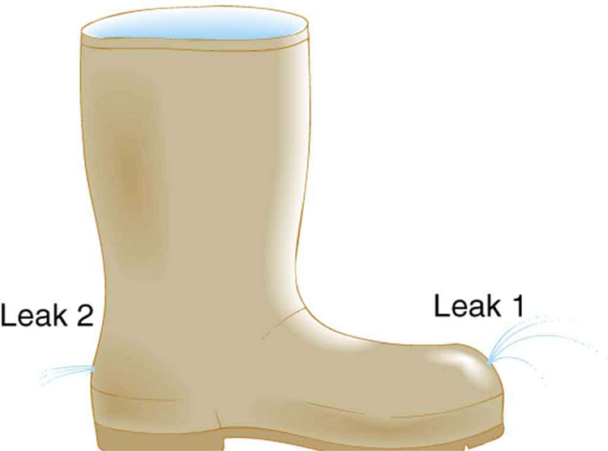

* Calculate using Torricelli’s theorem.
* Calculate power in fluid flow.

### Torricelli’s Theorem

[\[link\]](#import-auto-id1602915) shows water gushing from a large tube through a dam. What is its speed as it emerges? Interestingly, if resistance is negligible, the speed is just what it would be if the water fell a distance <math xmlns="http://www.w3.org/1998/Math/MathML"><semantics><mrow><mrow><mi>h</mi></mrow><mrow /></mrow><annotation encoding="StarMath 5.0"> size 12{h} {}</annotation></semantics></math>

 from the surface of the reservoir; the water’s speed is independent of the size of the opening. Let us check this out. Bernoulli’s equation must be used since the depth is not constant. We consider water flowing from the surface (point 1) to the tube’s outlet (point 2). Bernoulli’s equation as stated in previously is

<math xmlns="http://www.w3.org/1998/Math/MathML"><semantics><mrow><mrow><mrow><mrow><mrow><msub><mi>P</mi><mrow><mn>1</mn></mrow></msub><mo stretchy="false">+</mo><mfrac><mrow><mn>1</mn></mrow><mrow><mn>2</mn></mrow></mfrac></mrow><mrow><msubsup><mi fontstyle="italic">ρv</mi><mrow><mn>1</mn></mrow><mrow><mn>2</mn></mrow></msubsup><mo stretchy="false">+</mo><mi>ρ</mi></mrow><mrow><mstyle><mrow><msub><mtext fontstyle="italic">gh</mtext><mrow><mn>1</mn></mrow></msub></mrow></mstyle><mo stretchy="false">=</mo><mrow><msub><mi>P</mi><mrow><mn>2</mn></mrow></msub><mo stretchy="false">+</mo><mfrac><mrow><mn>1</mn></mrow><mrow><mn>2</mn></mrow></mfrac></mrow></mrow><mrow><msubsup><mi fontstyle="italic">ρv</mi><mrow><mn>2</mn></mrow><mrow><mn>2</mn></mrow></msubsup><mo stretchy="false">+</mo><mi>ρ</mi></mrow><mstyle><mrow><msub><mtext fontstyle="italic">gh</mtext><mrow><mn>2</mn></mrow></msub></mrow></mstyle></mrow></mrow><mtext>.</mtext></mrow><mrow /></mrow><annotation encoding="StarMath 5.0"> size 12{P rSub { size 8{1} } + { { size 8{1} } over { size 8{2} } } ρv rSub { size 8{1} } rSup { size 8{2} } +ρ ital "gh" rSub { size 8{1} } =P rSub { size 8{2} } + { { size 8{1} } over { size 8{2} } } ρv rSub { size 8{2} } rSup { size 8{2} } +ρ ital "gh" rSub { size 8{2} } } {}</annotation></semantics></math>

Both <math xmlns="http://www.w3.org/1998/Math/MathML"><semantics><mrow><mrow><msub><mi>P</mi><mrow><mn>1</mn></mrow></msub></mrow><mrow /></mrow><annotation encoding="StarMath 5.0"> size 12{P rSub { size 8{1} } } {}</annotation></semantics></math>

 and <math xmlns="http://www.w3.org/1998/Math/MathML"><semantics><mrow><mrow><msub><mi>P</mi><mrow><mn>2</mn></mrow></msub></mrow><mrow /></mrow><annotation encoding="StarMath 5.0"> size 12{P rSub { size 8{2} } } {}</annotation></semantics></math>

 equal atmospheric pressure (<math xmlns="http://www.w3.org/1998/Math/MathML"><semantics><mrow><mrow><msub><mi>P</mi><mrow><mn>1</mn></mrow></msub></mrow><mrow /></mrow><annotation encoding="StarMath 5.0"> size 12{P rSub { size 8{1} } } {}</annotation></semantics></math>

 is atmospheric pressure because it is the pressure at the top of the reservoir. <math xmlns="http://www.w3.org/1998/Math/MathML"><semantics><mrow><mrow><msub><mi>P</mi><mrow><mn>2</mn></mrow></msub></mrow><mrow /></mrow><annotation encoding="StarMath 5.0"> size 12{P rSub { size 8{2} } } {}</annotation></semantics></math>

 must be atmospheric pressure, since the emerging water is surrounded by the atmosphere and cannot have a pressure different from atmospheric pressure.) and subtract out of the equation, leaving

<math xmlns="http://www.w3.org/1998/Math/MathML"><semantics><mrow><mrow><mrow><mfrac><mrow><mn>1</mn></mrow><mrow><mn>2</mn></mrow></mfrac><mrow><msubsup><mi fontstyle="italic">ρv</mi><mrow><mn>1</mn></mrow><mrow><mn>2</mn></mrow></msubsup><mo stretchy="false">+</mo><mi>ρ</mi></mrow><mrow><mstyle><mrow><msub><mtext fontstyle="italic">gh</mtext><mrow><mn>1</mn></mrow></msub></mrow></mstyle><mo stretchy="false">=</mo><mfrac><mrow><mn>1</mn></mrow><mrow><mn>2</mn></mrow></mfrac></mrow><mrow><msubsup><mi fontstyle="italic">ρv</mi><mrow><mn>2</mn></mrow><mrow><mn>2</mn></mrow></msubsup><mo stretchy="false">+</mo><mi>ρ</mi></mrow><mstyle><mrow><msub><mtext fontstyle="italic">gh</mtext><mrow><mn>2</mn></mrow></msub></mrow><mtext>.</mtext></mstyle></mrow></mrow><mrow /></mrow><annotation encoding="StarMath 5.0"> size 12{ { { size 8{1} } over { size 8{2} } } ρv rSub { size 8{1} } rSup { size 8{2} } +ρ ital "gh" rSub { size 8{1} } = { { size 8{1} } over { size 8{2} } } ρv rSub { size 8{2} } rSup { size 8{2} } +ρ ital "gh" rSub { size 8{2} } } {}</annotation></semantics></math>

Solving this equation for <math xmlns="http://www.w3.org/1998/Math/MathML"><semantics><mrow><mrow><msubsup><mi>v</mi><mrow><mn>2</mn></mrow><mrow><mn>2</mn></mrow></msubsup></mrow><mrow /></mrow><annotation encoding="StarMath 5.0"> size 12{v rSub { size 8{2} } rSup { size 8{2} } } {}</annotation></semantics></math>

, noting that the density <math xmlns="http://www.w3.org/1998/Math/MathML"> <semantics> <mi>ρ</mi> </semantics> </math>

 cancels (because the fluid is incompressible), yields

<math xmlns="http://www.w3.org/1998/Math/MathML"><semantics><mrow><mrow><mrow><mrow><mrow><msubsup><mi>v</mi><mrow><mn>2</mn></mrow><mrow><mn>2</mn></mrow></msubsup><mo stretchy="false">=</mo><mrow><msubsup><mi>v</mi><mrow><mn>1</mn></mrow><mrow><mn>2</mn></mrow></msubsup><mo stretchy="false">+</mo><mn>2</mn><mi>g</mi></mrow></mrow><mo stretchy="false">(</mo><mrow><msub><mi>h</mi><mrow><mn>1</mn></mrow></msub><mo stretchy="false">−</mo><msub><mi>h</mi><mrow><mn>2</mn></mrow></msub></mrow><mo stretchy="false">)</mo></mrow></mrow><mtext>.</mtext></mrow><mrow /></mrow><annotation encoding="StarMath 5.0"> size 12{v rSub { size 8{2} } rSup { size 8{2} } =v rSub { size 8{1} } rSup { size 8{2} } +2g \( h rSub { size 8{1} } - h rSub { size 8{2} } \) } {}</annotation></semantics></math>

We let <math xmlns="http://www.w3.org/1998/Math/MathML"><semantics><mrow><mrow><mrow><mi>h</mi><mo stretchy="false">=</mo><mrow><msub><mi>h</mi><mrow><mn>1</mn></mrow></msub><mo stretchy="false">−</mo><msub><mi>h</mi><mrow><mn>2</mn></mrow></msub></mrow></mrow></mrow><mrow /></mrow><annotation encoding="StarMath 5.0"> size 12{h=h rSub { size 8{1} } - h rSub { size 8{2} } } {}</annotation></semantics></math>

; the equation then becomes

<math xmlns="http://www.w3.org/1998/Math/MathML"><semantics><mrow><mrow><mrow><mrow><mrow><msubsup><mi>v</mi><mrow><mn>2</mn></mrow><mrow><mn>2</mn></mrow></msubsup><mo stretchy="false">=</mo><mrow><msubsup><mi>v</mi><mrow><mn>1</mn></mrow><mrow><mn>2</mn></mrow></msubsup><mo stretchy="false">+</mo><mn>2</mn></mrow></mrow><mstyle fontstyle="italic"><mrow><mtext>gh</mtext></mrow></mstyle></mrow></mrow></mrow><mrow /></mrow><annotation encoding="StarMath 5.0"> size 12{v rSub { size 8{2} } rSup { size 8{2} } =v rSub { size 8{1} } rSup { size 8{2} } +2 ital "gh"} {}</annotation></semantics></math>

where <math xmlns="http://www.w3.org/1998/Math/MathML"><semantics><mrow><mrow><mi>h</mi></mrow><mrow /></mrow><annotation encoding="StarMath 5.0"> size 12{h} {}</annotation></semantics></math>

 is the height dropped by the water. This is simply a kinematic equation for any object falling a distance <math xmlns="http://www.w3.org/1998/Math/MathML"><semantics><mrow><mrow><mi>h</mi></mrow><mrow /></mrow><annotation encoding="StarMath 5.0"> size 12{h} {}</annotation></semantics></math>

 with negligible resistance. In fluids, this last equation is called *Torricelli’s theorem*. Note that the result is independent of the velocity’s direction, just as we found when applying conservation of energy to falling objects.

 ![Part a of the figure shows a photograph of a dam with water gushing from a large tube at the base of a dam. Part b shows the schematic diagram for the flow of water in a reservoir. The reservoir is shown in the form of a triangular section with a horizontal opening along the base little near to the base. The water is shown to flow through the horizontal opening near the base. The height which it falls is shown as h two. The pressure and velocity of water at this point are P two and v two. The height to which the water can fall if it falls from a height h above the opening is given by h 2. The pressure and velocity of water at this point are P one and v one.](../resources/Figure_13_03_01a.jpg "(a) Water gushes from the base of the Studen Kladenetz dam in Bulgaria. (credit: Kiril Kapustin; http://www.ImagesFromBulgaria.com) (b) In the absence of significant resistance, water flows from the reservoir with the same speed it would have if it fell the distance h size 12{h} {} without friction. This is an example of Torricelli&#x2019;s theorem."){: #import-auto-id1602915}

{: #import-auto-id3306423}

All preceding applications of Bernoulli’s equation involved simplifying conditions, such as constant height or constant pressure. The next example is a more general application of Bernoulli’s equation in which pressure, velocity, and height all change. (See [\[link\]](#import-auto-id3306423).)

Calculating Pressure: A Fire Hose Nozzle

Fire hoses used in major structure fires have inside diameters of 6.40 cm. Suppose such a hose carries a flow of 40.0 L/s starting at a gauge pressure of <math xmlns="http://www.w3.org/1998/Math/MathML"><semantics><mrow><mrow><mrow><mn>1</mn><mtext>.</mtext><mrow><mtext>62</mtext><mo stretchy="false">×</mo><msup><mtext>10</mtext><mrow><mn>6</mn></mrow></msup></mrow><mspace width="0.25em" /><msup><mtext>N/m</mtext><mrow><mn>2</mn></mrow></msup></mrow></mrow><mrow /></mrow><annotation encoding="StarMath 5.0"> size 12{1 "." "62" times "10" rSup { size 8{6} } `"N/m" rSup { size 8{2} } } {}</annotation></semantics></math>

. The hose goes 10.0 m up a ladder to a nozzle having an inside diameter of 3.00 cm. Assuming negligible resistance, what is the pressure in the nozzle?

**Strategy**

Here we must use Bernoulli’s equation to solve for the pressure, since depth is not constant.

**Solution**

Bernoulli’s equation states

<math xmlns="http://www.w3.org/1998/Math/MathML"><semantics><mrow> <mrow><mrow><mrow> <msub> <mi>P</mi> <mrow><mn>1</mn></mrow> </msub> <mo stretchy="false">+</mo> <mfrac> <mrow><mn>1</mn></mrow> <mrow><mn>2</mn></mrow> </mfrac> </mrow><mrow> <msubsup><mi fontstyle="italic">ρv</mi> <mrow><mn>1</mn></mrow> <mrow><mn>2</mn></mrow> </msubsup> <mo stretchy="false">+</mo><mi>ρ</mi></mrow><mrow> <mrow><msub><mtext fontstyle="italic">gh</mtext><mrow><mn>1</mn></mrow></msub></mrow> <mo stretchy="false">=</mo><mrow><msub><mi>P</mi><mrow><mn>2</mn></mrow></msub><mo stretchy="false">+</mo> <mfrac><mrow><mn>1</mn></mrow><mrow><mn>2</mn></mrow></mfrac> </mrow></mrow><mrow> <msubsup><mi fontstyle="italic">ρv</mi><mrow><mn>2</mn></mrow><mrow><mn>2</mn></mrow></msubsup> <mo stretchy="false">+</mo><mi>ρ</mi></mrow> <mstyle><mrow> <msub><mtext fontstyle="italic">gh</mtext><mrow><mn>2</mn></mrow></msub> </mrow></mstyle> </mrow></mrow><mtext>,</mtext></mrow><annotation encoding="StarMath 5.0"> size 12{P rSub { size 8{1} } + { { size 8{1} } over { size 8{2} } } ρv rSub { size 8{1} } rSup { size 8{2} } +ρ ital "gh" rSub { size 8{1} } =P rSub { size 8{2} } + { { size 8{1} } over { size 8{2} } } ρv rSub { size 8{2} } rSup { size 8{2} } +ρ ital "gh" rSub { size 8{2} } } {}</annotation></semantics></math>

where the subscripts 1 and 2 refer to the initial conditions at ground level and the final conditions inside the nozzle, respectively. We must first find the speeds <math xmlns="http://www.w3.org/1998/Math/MathML"><semantics><mrow><mrow><msub><mi>v</mi><mrow><mn>1</mn></mrow></msub></mrow><mrow /></mrow><annotation encoding="StarMath 5.0"> size 12{v rSub { size 8{1} } } {}</annotation></semantics></math>

 and <math xmlns="http://www.w3.org/1998/Math/MathML"><semantics><mrow><mrow><msub><mi>v</mi><mrow><mn>2</mn></mrow></msub></mrow><mrow /></mrow><annotation encoding="StarMath 5.0"> size 12{v rSub { size 8{2} } } {}</annotation></semantics></math>

. Since <math xmlns="http://www.w3.org/1998/Math/MathML"> <semantics> <mrow> <mrow> <mrow> <mrow> <mi>Q</mi> <mo stretchy="false">=</mo> <msub> <mi>A</mi> <mrow> <mn>1</mn> </mrow> </msub> </mrow> <msub> <mi>v</mi> <mrow> <mn>1</mn> </mrow> </msub> </mrow> </mrow> <mrow /> </mrow> <annotation encoding="StarMath 5.0"> size 12{Q=A rSub { size 8{1} } v"" lSub { size 8{1} } } {}</annotation> </semantics> </math>

 , we get

<math xmlns="http://www.w3.org/1998/Math/MathML"><semantics><mrow><mrow><mrow><mrow><mrow><mrow><mrow><msub><mi>v</mi><mrow><mn>1</mn></mrow></msub><mo stretchy="false">=</mo><mfrac><mi>Q</mi><msub><mi>A</mi><mrow><mn>1</mn></mrow></msub></mfrac></mrow><mo stretchy="false">=</mo><mfrac><mrow><mtext>40</mtext><mtext>.</mtext><mrow><mn>0</mn><mo stretchy="false">×</mo><msup><mtext>10</mtext><mrow><mrow><mo stretchy="false">−</mo><mn>3</mn></mrow></mrow></msup><mspace width="0.25em" /></mrow><msup><mtext>m</mtext><mrow><mn>3</mn></mrow></msup><mtext>/s</mtext></mrow><mrow><mi>π</mi><mo stretchy="false">(</mo><mn>3</mn><mtext>.</mtext><mrow><mtext>20</mtext><mo stretchy="false">×</mo><msup><mtext>10</mtext><mrow><mrow><mo stretchy="false">−</mo><mn>2</mn></mrow></mrow></msup></mrow><mspace width="0.25em" /><mtext>m</mtext><msup><mo stretchy="false">)</mo><mrow><mn>2</mn></mrow></msup></mrow></mfrac></mrow><mo stretchy="false">=</mo><mtext>12</mtext></mrow><mtext>.</mtext><mn>4</mn><mspace width="0.25em" /><mtext>m/s</mtext></mrow></mrow><mtext>.</mtext></mrow><mrow /></mrow><annotation encoding="StarMath 5.0"> size 12{v rSub { size 8{1} } = { {Q} over {A rSub { size 8{1} } } } = { {"40" "." 0 times "10" rSup { size 8{ - 3} } " m" rSup { size 8{3} } "/s"} over {π \( 3 "." "20" times "10" rSup { size 8{ - 2} } " m" \) rSup { size 8{2} } } } ="12" "." 4" m/s"} {}</annotation></semantics></math>

Similarly, we find

<math xmlns="http://www.w3.org/1998/Math/MathML"><semantics><mrow><mrow><mrow><mrow><mrow><msub><mi>v</mi><mrow><mn>2</mn></mrow></msub><mo stretchy="false">=</mo><mtext>56.6 m/s</mtext></mrow></mrow></mrow><mtext>.</mtext></mrow><mrow /></mrow><annotation encoding="StarMath 5.0"> size 12{v rSub { size 8{2} } ="56" "." 6" m/s"} {}</annotation></semantics></math>

(This rather large speed is helpful in reaching the fire.) Now, taking <math xmlns="http://www.w3.org/1998/Math/MathML"><semantics><mrow><mrow><msub><mi>h</mi><mrow><mn>1</mn></mrow></msub></mrow><mrow /></mrow><annotation encoding="StarMath 5.0"> size 12{h rSub { size 8{1} } } {}</annotation></semantics></math>

 to be zero, we solve Bernoulli’s equation for <math xmlns="http://www.w3.org/1998/Math/MathML"><semantics><mrow><mrow><msub><mi>P</mi><mrow><mn>2</mn></mrow></msub></mrow><mrow /></mrow><annotation encoding="StarMath 5.0"> size 12{P rSub { size 8{2} } } {}</annotation></semantics></math>

\:

<math xmlns="http://www.w3.org/1998/Math/MathML"><semantics><mrow><mrow><mrow><mrow><mrow><msub><mi>P</mi><mrow><mn>2</mn></mrow></msub><mo stretchy="false">=</mo><mrow><msub><mi>P</mi><mrow><mn>1</mn></mrow></msub><mo stretchy="false">+</mo><mfrac><mn>1</mn><mn>2</mn></mfrac></mrow></mrow><mi>ρ</mi> <mfenced> <mrow> <msubsup> <mi>v</mi> <mn>1</mn> <mn>2</mn> </msubsup> <mo stretchy="false">−</mo> <msubsup> <mi>v</mi> <mn>2</mn> <mn>2</mn> </msubsup> </mrow> </mfenced> <mrow><mo stretchy="false">−</mo><mi>ρ</mi></mrow><mstyle><mrow><msub><mtext fontstyle="italic">gh</mtext><mrow><mn>2</mn></mrow></msub></mrow></mstyle></mrow></mrow><mtext>.</mtext></mrow><mrow /></mrow><annotation encoding="StarMath 5.0"> size 12{P rSub { size 8{2} } =P rSub { size 8{1} } + { {1} over {2} } ρ \( v rSub { size 8{1} rSup { size 8{2} } } - v rSub { size 8{2} rSup { size 8{2} } } \) - ρ ital "gh" rSub { size 8{2} } } {}</annotation></semantics></math>

Substituting known values yields

<math xmlns="http://www.w3.org/1998/Math/MathML"><semantics><mrow><mrow><mrow><mrow><mrow><msub><mi>P</mi><mrow><mn>2</mn></mrow></msub><mo stretchy="false">=</mo><mn>1</mn></mrow><mtext>.</mtext><mrow><mtext>62</mtext><mo stretchy="false">×</mo><msup><mtext>10</mtext><mrow><mn>6</mn></mrow></msup></mrow><mrow><mspace width="0.25em" /><msup><mtext>N/m</mtext><mrow><mn>2</mn></mrow></msup><mo stretchy="false">+</mo><mfrac><mn>1</mn><mn>2</mn></mfrac></mrow><mo stretchy="false">(</mo><mtext>1000</mtext><mspace width="0.25em" /><msup><mtext>kg/m</mtext><mrow><mn>3</mn></mrow></msup><mo stretchy="false">)</mo><mrow><mfenced open="[" close="]"><mrow><mo stretchy="false">(</mo><mtext>12</mtext><mtext>.</mtext><mn>4</mn><mspace width="0.25em" /><mtext>m/s</mtext><mrow><msup><mo stretchy="false">)</mo><mrow><mn>2</mn></mrow></msup><mo stretchy="false">−</mo><mo stretchy="false">(</mo></mrow><mtext>56</mtext><mtext>.</mtext><mn>6</mn><mspace width="0.25em" /><mtext>m/s</mtext><msup><mo stretchy="false">)</mo><mrow><mn>2</mn></mrow></msup></mrow></mfenced><mo stretchy="false">−</mo><mo stretchy="false">(</mo></mrow><mtext>1000</mtext><mspace width="0.25em" /><msup><mtext>kg/m</mtext><mrow><mn>3</mn></mrow></msup><mo stretchy="false">)</mo><mo stretchy="false">(</mo><mn>9</mn><mtext>.</mtext><mn>80</mn><mspace width="0.25em" /><msup><mtext>m/s</mtext><mrow><mn>2</mn></mrow></msup><mo stretchy="false">)</mo><mo stretchy="false">(</mo><mtext>10</mtext><mtext>.</mtext><mn>0</mn><mspace width="0.25em" /><mtext>m</mtext><mrow><mo stretchy="false">)</mo><mo stretchy="false">=</mo><mn>0</mn></mrow></mrow></mrow><mtext>.</mtext></mrow><mrow /></mrow><annotation encoding="StarMath 5.0"> size 12{P rSub { size 8{2} } =1 "." "62" times "10" rSup { size 8{6} } " N/m" rSup { size 8{2} } + { {1} over {2} } \( "1000"" kg/m" rSup { size 8{3} } \) left [ \( "12" "." 4" m/s" \) rSup { size 8{2} } - \( "56" "." 6" m/s" \) rSup { size 8{2} } right ] - \( "1000"" kg/m" rSup { size 8{3} } \) \( 9 "." 8" m/s" rSup { size 8{2} } \) \( "10" "." 0" m" \) =0} {}</annotation></semantics></math>

**Discussion**

This value is a gauge pressure, since the initial pressure was given as a gauge pressure. Thus the nozzle pressure equals atmospheric pressure, as it must because the water exits into the atmosphere without changes in its conditions.

### Power in Fluid Flow

Power is the *rate* at which work is done or energy in any form is used or supplied. To see the relationship of power to fluid flow, consider Bernoulli’s equation:

<math xmlns="http://www.w3.org/1998/Math/MathML"><semantics><mrow><mrow><mrow><mrow><mrow><mi>P</mi><mo stretchy="false">+</mo><mfrac><mn>1</mn><mn>2</mn></mfrac></mrow><mrow><msup><mi fontstyle="italic">ρv</mi><mrow><mn>2</mn></mrow></msup><mo stretchy="false">+</mo><mi>ρ</mi></mrow><mrow><mstyle fontstyle="italic"><mrow><mtext>gh</mtext></mrow></mstyle><mo stretchy="false">=</mo><mtext>constant</mtext></mrow></mrow></mrow><mtext>.</mtext></mrow><mrow /></mrow><annotation encoding="StarMath 5.0"> size 12{P+ { {1} over {2} } ρv rSup { size 8{2} } +ρ ital "gh"="constant"} {}</annotation></semantics></math>

All three terms have units of energy per unit volume, as discussed in the previous section. Now, considering units, if we multiply energy per unit volume by flow rate (volume per unit time), we get units of power. That is, <math xmlns="http://www.w3.org/1998/Math/MathML"><semantics><mrow><mrow><mrow><mo stretchy="false">(</mo><mrow><mi>E</mi><mo stretchy="false">/</mo><mi>V</mi></mrow><mo stretchy="false">)</mo><mo stretchy="false">(</mo><mrow><mi>V</mi><mo stretchy="false">/</mo><mi>t</mi></mrow><mrow><mo stretchy="false">)</mo><mo stretchy="false">=</mo><mrow><mi>E</mi><mo stretchy="false">/</mo><mi>t</mi></mrow></mrow></mrow></mrow><mrow /></mrow><annotation encoding="StarMath 5.0"> size 12{ \( E/V \) \( V/t \) =E/t} {}</annotation></semantics></math>

. This means that if we multiply Bernoulli’s equation by flow rate *<math xmlns="http://www.w3.org/1998/Math/MathML"><semantics><mrow><mrow><mi>Q</mi></mrow><mrow /></mrow><annotation encoding="StarMath 5.0"> size 12{Q} {}</annotation></semantics></math>

*, we get power. In equation form, this is

<math xmlns="http://www.w3.org/1998/Math/MathML"><semantics><mrow><mrow><mrow><mrow><mfenced open="(" close=")"><mrow><mrow><mi>P</mi><mo stretchy="false">+</mo><mfrac><mn>1</mn><mn>2</mn></mfrac></mrow><mrow><msup><mi fontstyle="italic">ρv</mi><mrow><mn>2</mn></mrow></msup><mo stretchy="false">+</mo><mi>ρ</mi></mrow><mstyle fontstyle="italic"><mrow><mtext>gh</mtext></mrow></mstyle></mrow></mfenced><mrow><mi>Q</mi><mo stretchy="false">=</mo><mtext>power</mtext></mrow></mrow></mrow><mtext>.</mtext></mrow><mrow /></mrow><annotation encoding="StarMath 5.0"> size 12{ left (P+ { {1} over {2} } ρv rSup { size 8{2} } +ρ ital "gh" right )Q="power"} {}</annotation></semantics></math>

Each term has a clear physical meaning. For example, *<math xmlns="http://www.w3.org/1998/Math/MathML"><semantics><mrow><mrow><mstyle fontstyle="italic"><mrow><mtext>PQ</mtext></mrow></mstyle></mrow><mrow /></mrow><annotation encoding="StarMath 5.0"> size 12{ ital "PQ"} {}</annotation></semantics></math>

* is the power supplied to a fluid, perhaps by a pump, to give it its pressure *<math xmlns="http://www.w3.org/1998/Math/MathML"><semantics><mrow><mrow><mi>P</mi></mrow><mrow /></mrow><annotation encoding="StarMath 5.0"> size 12{P} {}</annotation></semantics></math>

*. Similarly, <math xmlns="http://www.w3.org/1998/Math/MathML"><semantics><mrow><mrow><mrow><mfrac><mrow><mn>1</mn></mrow><mrow><mn>2</mn></mrow></mfrac><msup><mi fontstyle="italic">ρv</mi><mrow><mn>2</mn></mrow></msup><mi>Q</mi></mrow></mrow><mrow /></mrow><annotation encoding="StarMath 5.0"> size 12{ { { size 8{1} } over { size 8{2} } } ρv rSup { size 8{2} } Q} {}</annotation></semantics></math>

 is the power supplied to a fluid to give it its kinetic energy. And <math xmlns="http://www.w3.org/1998/Math/MathML"><semantics><mrow><mrow><mrow><mi>ρ</mi><mstyle fontstyle="italic"><mrow><mtext>ghQ</mtext></mrow></mstyle></mrow></mrow><mrow /></mrow><annotation encoding="StarMath 5.0"> size 12{ρ ital "ghQ"} {}</annotation></semantics></math>

 is the power going to gravitational potential energy.

Making Connections: Power

Power is defined as the rate of energy transferred, or *<math xmlns="http://www.w3.org/1998/Math/MathML"><semantics><mrow><mrow><mrow><mi>E</mi><mo stretchy="false">/</mo><mi>t</mi></mrow></mrow><mrow /></mrow><annotation encoding="StarMath 5.0"> size 12{E/t} {}</annotation></semantics></math>

*. Fluid flow involves several types of power. Each type of power is identified with a specific type of energy being expended or changed in form.

Calculating Power in a Moving Fluid

Suppose the fire hose in the previous example is fed by a pump that receives water through a hose with a 6.40-cm diameter coming from a hydrant with a pressure of <math xmlns="http://www.w3.org/1998/Math/MathML"><semantics><mrow><mrow><mrow><mn>0</mn><mtext>.</mtext><mrow><mtext>700</mtext><mo stretchy="false">×</mo><msup><mtext>10</mtext><mrow><mn>6</mn></mrow></msup></mrow><mspace width="0.25em" /><msup><mtext>N/m</mtext><mrow><mn>2</mn></mrow></msup></mrow></mrow><mrow /></mrow><annotation encoding="StarMath 5.0"> size 12{0 "." "700" times "10" rSup { size 8{6} } `"N/m" rSup { size 8{2} } } {}</annotation></semantics></math>

. What power does the pump supply to the water?

**Strategy**

Here we must consider energy forms as well as how they relate to fluid flow. Since the input and output hoses have the same diameters and are at the same height, the pump does not change the speed of the water nor its height, and so the water’s kinetic energy and gravitational potential energy are unchanged. That means the pump only supplies power to increase water pressure by <math xmlns="http://www.w3.org/1998/Math/MathML"><semantics><mrow><mrow><mrow><mn>0</mn><mtext>.</mtext><mrow><mtext>92</mtext><mo stretchy="false">×</mo><msup><mtext>10</mtext><mrow><mn>6</mn></mrow></msup></mrow><mspace width="0.25em" /><msup><mtext>N/m</mtext><mrow><mn>2</mn></mrow></msup></mrow></mrow><mrow /></mrow><annotation encoding="StarMath 5.0"> size 12{0 "." "92" times "10" rSup { size 8{6} } `"N/m" rSup { size 8{2} } } {}</annotation></semantics></math>

 (from <math xmlns="http://www.w3.org/1998/Math/MathML"><semantics><mrow><mrow><mrow><mn>0.700</mn><mrow><mo stretchy="false">×</mo><msup><mtext>10</mtext><mrow><mn>6</mn></mrow></msup></mrow><mspace width="0.25em" /><msup><mtext>N/m</mtext><mrow><mn>2</mn></mrow></msup></mrow></mrow><mrow /></mrow><annotation encoding="StarMath 5.0"> size 12{0 "." "700" times "10" rSup { size 8{6} } `"N/m" rSup { size 8{2} } } {}</annotation></semantics></math>

 to <math xmlns="http://www.w3.org/1998/Math/MathML"><semantics><mrow><mrow><mrow><mn>1.62</mn><mrow><mo stretchy="false">×</mo><msup><mtext>10</mtext><mrow><mn>6</mn></mrow></msup></mrow><mspace width="0.25em" /><msup><mtext>N/m</mtext><mrow><mn>2</mn></mrow></msup></mrow></mrow><mrow /></mrow><annotation encoding="StarMath 5.0"> size 12{1 "." "62" times "10" rSup { size 8{6} } `"N/m" rSup { size 8{2} } } {}</annotation></semantics></math>

).

**Solution**

As discussed above, the power associated with pressure is

<math xmlns="http://www.w3.org/1998/Math/MathML"><semantics><mrow><mrow><mtable columnalign="left"><mtr> <mtd><mtext>power</mtext></mtd> <mtd><mo stretchy="false">=</mo></mtd> <mtd><mstyle fontstyle="italic"><mrow><mtext>PQ</mtext></mrow></mstyle></mtd> </mtr><mtr> <mtd /> <mtd><mo stretchy="false">=</mo></mtd> <mtd> <mfenced><mrow><mtext>0.920</mtext><mo stretchy="false">×</mo><msup><mtext>10</mtext><mrow><mn>6</mn></mrow></msup><mspace width="0.25em" /><msup><mtext>N/m</mtext><mrow><mn>2</mn></mrow></msup></mrow></mfenced> <mfenced><mrow><mtext>40</mtext><mtext>.</mtext><mrow><mn>0</mn><mo stretchy="false">×</mo><msup><mtext>10</mtext><mrow><mrow><mo stretchy="false">−</mo><mn>3</mn></mrow></mrow></msup></mrow><mspace width="0.25em" /><msup><mtext>m</mtext><mrow><mn>3</mn></mrow></msup><mtext>/s</mtext></mrow></mfenced><mtext>.</mtext> </mtd> </mtr><mtr> <mtd><mtext /></mtd> <mtd><mo stretchy="false">=</mo></mtd> <mtd><mn>3</mn><mtext>.</mtext><mrow><mtext>68</mtext><mo stretchy="false">×</mo><msup><mtext>10</mtext><mrow><mn>4</mn></mrow></msup></mrow><mrow><mspace width="0.25em" /><mtext>W</mtext><mo stretchy="false">=</mo><mtext>36</mtext></mrow><mtext>.</mtext><mn>8</mn><mspace width="0.25em" /><mtext>kW</mtext></mtd> </mtr></mtable><mrow /></mrow></mrow><mtext>.</mtext></semantics></math>

**Discussion**

Such a substantial amount of power requires a large pump, such as is found on some fire trucks. (This kilowatt value converts to about 50 hp.) The pump in this example increases only the water’s pressure. If a pump—such as the heart—directly increases velocity and height as well as pressure, we would have to calculate all three terms to find the power it supplies.

### Summary

* {: #import-auto-id2384811} Power in fluid flow is given by the equation
  <math xmlns="http://www.w3.org/1998/Math/MathML"><semantics><mrow><mrow><mrow><mrow><mfenced open="(" close=")"><mrow><mrow><msub><mi>P</mi><mrow><mn>1</mn></mrow></msub><mo stretchy="false">+</mo><mfrac><mn>1</mn><mn>2</mn></mfrac></mrow><mrow><msup><mi fontstyle="italic">ρv</mi><mrow><mn>2</mn></mrow></msup><mo stretchy="false">+</mo><mi>ρ</mi></mrow><mstyle fontstyle="italic"><mrow><mtext>gh</mtext></mrow></mstyle></mrow></mfenced><mrow><mi>Q</mi><mo stretchy="false">=</mo><mtext>power</mtext></mrow></mrow></mrow><mtext>,</mtext></mrow><mrow /></mrow><annotation encoding="StarMath 5.0"> size 12{ left (P rSub { size 8{1} } + { {1} over {2} } ρv rSup { size 8{2} } +ρ ital "gh" right )Q="power"} {}</annotation></semantics></math>
  
  where the first term is power associated with pressure, the second is power associated with velocity, and the third is power associated with height.

### Conceptual Questions

Based on Bernoulli’s equation, what are three forms of energy in a fluid? (Note that these forms are conservative, unlike heat transfer and other dissipative forms not included in Bernoulli’s equation.)

Water that has emerged from a hose into the atmosphere has a gauge pressure of zero. Why? When you put your hand in front of the emerging stream you feel a force, yet the water’s gauge pressure is zero. Explain where the force comes from in terms of energy.

The old rubber boot shown in [[link]](#import-auto-id1573387) has two leaks. To what maximum height can the water squirt from Leak 1? How does the velocity of water emerging from Leak 2 differ from that of leak 1? Explain your responses in terms of energy.

{: #import-auto-id1573387}

Water pressure inside a hose nozzle can be less than atmospheric pressure due to the Bernoulli effect. Explain in terms of energy how the water can emerge from the nozzle against the opposing atmospheric pressure.

### Problems &amp; Exercises

Hoover Dam on the Colorado River is the highest dam in the United States at 221 m, with an output of 1300 MW. The dam generates electricity with water taken from a depth of 150 m and an average flow rate of <math xmlns="http://www.w3.org/1998/Math/MathML"><semantics><mrow><mrow><mrow><mtext>650</mtext><mspace width="0.25em" /><msup><mtext>m</mtext><mrow><mn>3</mn></mrow></msup><mtext>/s</mtext></mrow></mrow><mrow /></mrow><annotation encoding="StarMath 5.0"> size 12{"650"`m rSup { size 8{3} } "/s"} {}</annotation></semantics></math>

. (a) Calculate the power in this flow. (b) What is the ratio of this power to the facility’s average of 680 MW?

(a) <math xmlns="http://www.w3.org/1998/Math/MathML"><semantics><mrow><mtext>9.56</mtext><mo stretchy="false">×</mo><msup><mtext>10</mtext><mrow><mn>8</mn></mrow></msup><mspace width="0.25em" /><mtext>W</mtext></mrow></semantics></math>

(b) 1.4

A frequently quoted rule of thumb in aircraft design is that wings should produce about 1000 N of lift per square meter of wing. (The fact that a wing has a top and bottom surface does not double its area.) (a) At takeoff, an aircraft travels at 60.0 m/s, so that the air speed relative to the bottom of the wing is 60.0 m/s. Given the sea level density of air to be <math xmlns="http://www.w3.org/1998/Math/MathML"><semantics><mrow><mrow><mrow><mn>1</mn><mtext>.</mtext><mtext>29</mtext><mspace width="0.25em" /><msup><mtext>kg/m</mtext><mrow><mn>3</mn></mrow></msup></mrow></mrow><mrow /></mrow><annotation encoding="StarMath 5.0"> size 12{1 "." "29"`"kg/m" rSup { size 8{3} } } {}</annotation></semantics></math>

, how fast must it move over the upper surface to create the ideal lift? (b) How fast must air move over the upper surface at a cruising speed of 245 m/s and at an altitude where air density is one-fourth that at sea level? (Note that this is not all of the aircraft’s lift—some comes from the body of the plane, some from engine thrust, and so on. Furthermore, Bernoulli’s principle gives an approximate answer because flow over the wing creates turbulence.)

The left ventricle of a resting adult’s heart pumps blood at a flow rate of <math xmlns="http://www.w3.org/1998/Math/MathML"><semantics><mrow><mrow><mrow><mtext>83</mtext><mtext>.</mtext><mn>0</mn><mspace width="0.25em" /><msup><mtext>cm</mtext><mrow><mn>3</mn></mrow></msup><mtext>/s</mtext></mrow></mrow><mrow /></mrow><annotation encoding="StarMath 5.0"> size 12{"83" "." 0`"cm" rSup { size 8{3} } "/s"} {}</annotation></semantics></math>

, increasing its pressure by 110 mm Hg, its speed from zero to 30.0 cm/s, and its height by 5.00 cm. (All numbers are averaged over the entire heartbeat.) Calculate the total power output of the left ventricle. Note that most of the power is used to increase blood pressure.

1\.26 W

A sump pump (used to drain water from the basement of houses built below the water table) is draining a flooded basement at the rate of 0.750 L/s, with an output pressure of <math xmlns="http://www.w3.org/1998/Math/MathML"><semantics><mrow><mrow><mrow><mn>3.00</mn><mrow><mo stretchy="false">×</mo><msup><mtext>10</mtext><mrow><mn>5</mn></mrow></msup></mrow><mspace width="0.25em" /><msup><mtext>N/m</mtext><mrow><mn>2</mn></mrow></msup></mrow></mrow><mrow /></mrow><annotation encoding="StarMath 5.0"> size 12{3 "." "00" times "10" rSup { size 8{5} } `"N/m" rSup { size 8{2} } } {}</annotation></semantics></math>

. (a) The water enters a hose with a 3.00-cm inside diameter and rises 2.50 m above the pump. What is its pressure at this point? (b) The hose goes over the foundation wall, losing 0.500 m in height, and widens to 4.00 cm in diameter. What is the pressure now? You may neglect frictional losses in both parts of the problem.

