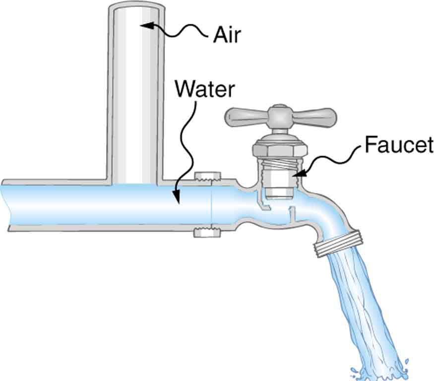

* Define laminar flow and turbulent flow.
* Explain what viscosity is.
* Calculate flow and resistance with Poiseuille’s law.
* Explain how pressure drops due to resistance.

# Laminar Flow and Viscosity

When you pour yourself a glass of juice, the liquid flows freely and quickly. But when you pour syrup on your pancakes, that liquid flows slowly and sticks to the pitcher. The difference is fluid friction, both within the fluid itself and between the fluid and its surroundings. We call this property of fluids *viscosity*. Juice has low viscosity, whereas syrup has high viscosity. In the previous sections we have considered ideal fluids with little or no viscosity. In this section, we will investigate what factors, including viscosity, affect the rate of fluid flow.

The precise definition of viscosity is based on *laminar*, or nonturbulent, flow. Before we can define viscosity, then, we need to define laminar flow and turbulent flow. [\[link\]](#import-auto-id3356410) shows both types of flow. **Laminar**{: data-type="term" #import-auto-id1473823} flow is characterized by the smooth flow of the fluid in layers that do not mix. Turbulent flow, or **turbulence**{: data-type="term" #import-auto-id2688377}, is characterized by eddies and swirls that mix layers of fluid together.

 , you will notice that it rises more rapidly when flowing smoothly than after it becomes turbulent, implying that turbulence poses more resistance to flow. (credit: Creativity103)"){: #import-auto-id3356410 data-media-type="image/png"}

[\[link\]](#fs-id3007528) shows schematically how laminar and turbulent flow differ. Layers flow without mixing when flow is laminar. When there is turbulence, the layers mix, and there are significant velocities in directions other than the overall direction of flow. The lines that are shown in many illustrations are the paths followed by small volumes of fluids. These are called *streamlines*. Streamlines are smooth and continuous when flow is laminar, but break up and mix when flow is turbulent. Turbulence has two main causes. First, any obstruction or sharp corner, such as in a faucet, creates turbulence by imparting velocities perpendicular to the flow. Second, high speeds cause turbulence. The drag both between adjacent layers of fluid and between the fluid and its surroundings forms swirls and eddies, if the speed is great enough. We shall concentrate on laminar flow for the remainder of this section, leaving certain aspects of turbulence for later sections.

 ![Part a of the figure shows a laminar flow on a fixed smooth surface. The different layers of the liquid are shown as different colored bands along the horizontal surface. The friction is shown to act all along the line separating two layers. The direction of flow of the fluid is toward right and the velocity is shown as v b for layers at the bottom and v t for layers on top. Part b of the figure shows turbulent flow on a surface with some obstruction. The fluid directions are horizontal on smooth path and irregular near the area of the obstruction. The velocity is v on top as well as at the bottom of the fluid.](../resources/Figure_13_04_02a.jpg "(a) Laminar flow occurs in layers without mixing. Notice that viscosity causes drag between layers as well as with the fixed surface. (b) An obstruction in the vessel produces turbulence. Turbulent flow mixes the fluid. There is more interaction, greater heating, and more resistance than in laminar flow."){: data-media-type="image/jpg"}

Making Connections: Take-Home Experiment: Go Down to the River

Try dropping simultaneously two sticks into a flowing river, one near the edge of the river and one near the middle. Which one travels faster? Why?

[\[link\]](#import-auto-id1580837) shows how viscosity is measured for a fluid. Two parallel plates have the specific fluid between them. The bottom plate is held fixed, while the top plate is moved to the right, dragging fluid with it. The layer (or lamina) of fluid in contact with either plate does not move relative to the plate, and so the top layer moves at *<math xmlns="http://www.w3.org/1998/Math/MathML"><semantics><mrow><mrow><mi>v</mi></mrow><mrow /></mrow><annotation encoding="StarMath 5.0"> size 12{v} {}</annotation></semantics></math>

* while the bottom layer remains at rest. Each successive layer from the top down exerts a force on the one below it, trying to drag it along, producing a continuous variation in speed from *<math xmlns="http://www.w3.org/1998/Math/MathML"><semantics><mrow><mrow><mi>v</mi></mrow><mrow /></mrow><annotation encoding="StarMath 5.0"> size 12{v} {}</annotation></semantics></math>

* to 0 as shown. Care is taken to insure that the flow is laminar; that is, the layers do not mix. The motion in [\[link\]](#import-auto-id1580837) is like a continuous shearing motion. Fluids have zero shear strength, but the *rate* at which they are sheared is related to the same geometrical factors *<math xmlns="http://www.w3.org/1998/Math/MathML"><semantics><mrow><mrow><mi>A</mi></mrow><mrow /></mrow><annotation encoding="StarMath 5.0"> size 12{A} {}</annotation></semantics></math>

* and *<math xmlns="http://www.w3.org/1998/Math/MathML"><semantics><mrow><mrow><mi>L</mi></mrow><mrow /></mrow><annotation encoding="StarMath 5.0"> size 12{L} {}</annotation></semantics></math>

* as is shear deformation for solids.

 ![The figure shows the laminar flow of fluid between two rectangular plates each of area A. The bottom plate is shown as fixed. The distance between the plates is L. The top plate is shown to be pushed to right with a force F. The direction of movement of the layer of fluid in contact with the top plate is also toward right with velocity v. The fluid in contact with the plate in the bottom is shown to be in rest with v equals zero. As we see through the layers above the one on the bottom plate, each show a small displacement toward right in increasing order of value with the topmost layer showing the maximum.](../resources/Figure_13_04_03a.jpg "The graphic shows laminar flow of fluid between two plates of area A size 12{A} {}. The bottom plate is fixed. When the top plate is pushed to the right, it drags the fluid along with it."){: #import-auto-id1580837 data-media-type="image/jpg"}

A force *<math xmlns="http://www.w3.org/1998/Math/MathML"><semantics><mrow><mrow><mi>F</mi></mrow><mrow /></mrow><annotation encoding="StarMath 5.0"> size 12{F} {}</annotation></semantics></math>

* is required to keep the top plate in [\[link\]](#import-auto-id1580837) moving at a constant velocity *<math xmlns="http://www.w3.org/1998/Math/MathML"><semantics><mrow><mrow><mi>v</mi></mrow><mrow /></mrow><annotation encoding="StarMath 5.0"> size 12{v} {}</annotation></semantics></math>

*, and experiments have shown that this force depends on four factors. First, *<math xmlns="http://www.w3.org/1998/Math/MathML"><semantics><mrow><mrow><mi>F</mi></mrow><mrow /></mrow><annotation encoding="StarMath 5.0"> size 12{F} {}</annotation></semantics></math>

* is directly proportional to *<math xmlns="http://www.w3.org/1998/Math/MathML"><semantics><mrow><mrow><mi>v</mi></mrow><mrow /></mrow><annotation encoding="StarMath 5.0"> size 12{v} {}</annotation></semantics></math>

* (until the speed is so high that turbulence occurs—then a much larger force is needed, and it has a more complicated dependence on *<math xmlns="http://www.w3.org/1998/Math/MathML"><semantics><mrow><mrow><mi>v</mi></mrow><mrow /></mrow><annotation encoding="StarMath 5.0"> size 12{v} {}</annotation></semantics></math>

*). Second, *<math xmlns="http://www.w3.org/1998/Math/MathML"><semantics><mrow><mrow><mi>F</mi></mrow><mrow /></mrow><annotation encoding="StarMath 5.0"> size 12{F} {}</annotation></semantics></math>

* is proportional to the area *<math xmlns="http://www.w3.org/1998/Math/MathML"><semantics><mrow><mrow><mi>A</mi></mrow><mrow /></mrow><annotation encoding="StarMath 5.0"> size 12{A} {}</annotation></semantics></math>

* of the plate. This relationship seems reasonable, since *<math xmlns="http://www.w3.org/1998/Math/MathML"><semantics><mrow><mrow><mi>A</mi></mrow><mrow /></mrow><annotation encoding="StarMath 5.0"> size 12{A} {}</annotation></semantics></math>

* is directly proportional to the amount of fluid being moved. Third, *<math xmlns="http://www.w3.org/1998/Math/MathML"><semantics><mrow><mrow><mi>F</mi></mrow><mrow /></mrow><annotation encoding="StarMath 5.0"> size 12{F} {}</annotation></semantics></math>

* is inversely proportional to the distance between the plates *<math xmlns="http://www.w3.org/1998/Math/MathML"><semantics><mrow><mrow><mi>L</mi></mrow><mrow /></mrow><annotation encoding="StarMath 5.0"> size 12{L} {}</annotation></semantics></math>

*. This relationship is also reasonable; *<math xmlns="http://www.w3.org/1998/Math/MathML"><semantics><mrow><mrow><mi>L</mi></mrow><mrow /></mrow><annotation encoding="StarMath 5.0"> size 12{L} {}</annotation></semantics></math>

* is like a lever arm, and the greater the lever arm, the less force that is needed. Fourth, *<math xmlns="http://www.w3.org/1998/Math/MathML"><semantics><mrow><mrow><mi>F</mi></mrow><mrow /></mrow><annotation encoding="StarMath 5.0"> size 12{F} {}</annotation></semantics></math>

* is directly proportional to *the **coefficient of viscosity*, *<math xmlns="http://www.w3.org/1998/Math/MathML"><semantics><mrow><mrow><mi>η</mi></mrow><mrow /></mrow><annotation encoding="StarMath 5.0"> size 12{η} {}</annotation></semantics></math>

*. The greater the viscosity, the greater the force required. These dependencies are combined into the equation

<math xmlns="http://www.w3.org/1998/Math/MathML"><semantics><mrow><mrow><mrow><mrow><mrow><mi>F</mi><mo stretchy="false">=</mo></mrow><mi>η</mi><mfrac><mstyle fontstyle="italic"><mrow><mtext>vA</mtext></mrow></mstyle><mi>L</mi></mfrac></mrow></mrow><mtext>,</mtext></mrow><mrow /></mrow><annotation encoding="StarMath 5.0"> size 12{F=η { { ital "vA"} over {L} } } {}</annotation></semantics></math>

which gives us a working definition of fluid **viscosity**{: data-type="term" #import-auto-id3157304}****<em> <math xmlns="http://www.w3.org/1998/Math/MathML"><semantics><mrow><mrow><mi>η</mi></mrow><mrow /></mrow><annotation encoding="StarMath 5.0"> size 12{η} {}</annotation></semantics></math></em>.**** Solving for *<math xmlns="http://www.w3.org/1998/Math/MathML"><semantics><mrow><mrow><mi>η</mi></mrow><mrow /></mrow><annotation encoding="StarMath 5.0"> size 12{η} {}</annotation></semantics></math>

* gives

<math xmlns="http://www.w3.org/1998/Math/MathML"><semantics><mrow><mrow><mrow><mrow><mrow><mi>η</mi><mo stretchy="false">=</mo></mrow><mfrac><mstyle fontstyle="italic"><mrow><mtext>FL</mtext></mrow></mstyle><mstyle fontstyle="italic"><mrow><mtext>vA</mtext></mrow></mstyle></mfrac></mrow></mrow><mtext>,</mtext></mrow><mrow /></mrow><annotation encoding="StarMath 5.0"> size 12{F=η { { ital "FL"} over { ital "vA"} } } {}</annotation></semantics></math>

which defines viscosity in terms of how it is measured. The SI unit of viscosity is <math xmlns="http://www.w3.org/1998/Math/MathML"><semantics><mrow><mrow><mrow><mrow><mtext>N</mtext><mo stretchy="false">⋅</mo><mtext>m/</mtext></mrow><mo stretchy="false">[</mo><mo stretchy="false">(</mo><mtext>m/s</mtext><mo stretchy="false">)</mo><msup><mtext>m</mtext><mrow><mn>2</mn></mrow></msup><mrow><mo stretchy="false">]</mo><mo stretchy="false">=</mo><mo stretchy="false">(</mo></mrow><msup><mtext>N/m</mtext><mrow><mn>2</mn></mrow></msup><mo stretchy="false">)</mo><mrow><mtext>s or Pa</mtext><mo stretchy="false">⋅</mo><mtext>s</mtext></mrow></mrow></mrow><mrow /></mrow><annotation encoding="StarMath 5.0"> size 12{N cdot "m/" \[ \( "m/s" \) m rSup { size 8{2} } \] = \( "N/m" rSup { size 8{2} } \) "sorPa" cdot s} {}</annotation></semantics></math>

. [\[link\]](#import-auto-id3073392) lists the coefficients of viscosity for various fluids.

Viscosity varies from one fluid to another by several orders of magnitude. As you might expect, the viscosities of gases are much less than those of liquids, and these viscosities are often temperature dependent. The viscosity of blood can be reduced by aspirin consumption, allowing it to flow more easily around the body. (When used over the long term in low doses, aspirin can help prevent heart attacks, and reduce the risk of blood clotting.)

# Laminar Flow Confined to Tubes—Poiseuille’s Law

What causes flow? The answer, not surprisingly, is pressure difference. In fact, there is a very simple relationship between horizontal flow and pressure. Flow rate *<math xmlns="http://www.w3.org/1998/Math/MathML"><semantics><mrow><mrow><mi>Q</mi></mrow><mrow /></mrow><annotation encoding="StarMath 5.0"> size 12{Q} {}</annotation></semantics></math>

* is in the direction from high to low pressure. The greater the pressure differential between two points, the greater the flow rate. This relationship can be stated as

<math xmlns="http://www.w3.org/1998/Math/MathML"><semantics><mrow><mrow><mrow><mrow><mi>Q</mi><mo stretchy="false">=</mo><mfrac><mrow><msub><mi>P</mi><mrow><mn>2</mn></mrow></msub><mo stretchy="false">−</mo><msub><mi>P</mi><mrow><mn>1</mn></mrow></msub></mrow><mi>R</mi></mfrac></mrow></mrow><mtext>,</mtext></mrow><mrow /></mrow><annotation encoding="StarMath 5.0"> size 12{Q= { {P rSub { size 8{2} } - P rSub { size 8{1} } } over {R} } } {}</annotation></semantics></math>

where <math xmlns="http://www.w3.org/1998/Math/MathML"><semantics><mrow><mrow><msub><mi>P</mi><mrow><mn>1</mn></mrow></msub></mrow><mrow /></mrow><annotation encoding="StarMath 5.0"> size 12{P rSub { size 8{1} } } {}</annotation></semantics></math>

 and <math xmlns="http://www.w3.org/1998/Math/MathML"><semantics><mrow><mrow><msub><mi>P</mi><mrow><mn>2</mn></mrow></msub></mrow><mrow /></mrow><annotation encoding="StarMath 5.0"> size 12{P rSub { size 8{2} } } {}</annotation></semantics></math>

 are the pressures at two points, such as at either end of a tube, and *<math xmlns="http://www.w3.org/1998/Math/MathML"><semantics><mrow><mrow><mi>R</mi></mrow><mrow /></mrow><annotation encoding="StarMath 5.0"> size 12{R} {}</annotation></semantics></math>

* is the resistance to flow. The resistance *<math xmlns="http://www.w3.org/1998/Math/MathML"><semantics><mrow><mrow><mi>R</mi></mrow><mrow /></mrow><annotation encoding="StarMath 5.0"> size 12{R} {}</annotation></semantics></math>

* includes everything, except pressure, that affects flow rate. For example, *<math xmlns="http://www.w3.org/1998/Math/MathML"><semantics><mrow><mrow><mi>R</mi></mrow><mrow /></mrow><annotation encoding="StarMath 5.0"> size 12{R} {}</annotation></semantics></math>

* is greater for a long tube than for a short one. The greater the viscosity of a fluid, the greater the value of *<math xmlns="http://www.w3.org/1998/Math/MathML"><semantics><mrow><mrow><mi>R</mi></mrow><mrow /></mrow><annotation encoding="StarMath 5.0"> size 12{R} {}</annotation></semantics></math>

*. Turbulence greatly increases *<math xmlns="http://www.w3.org/1998/Math/MathML"><semantics><mrow><mrow><mi>R</mi></mrow><mrow /></mrow><annotation encoding="StarMath 5.0"> size 12{R} {}</annotation></semantics></math>

*, whereas increasing the diameter of a tube decreases *<math xmlns="http://www.w3.org/1998/Math/MathML"><semantics><mrow><mrow><mi>R</mi></mrow><mrow /></mrow><annotation encoding="StarMath 5.0"> size 12{R} {}</annotation></semantics></math>

*.

If viscosity is zero, the fluid is frictionless and the resistance to flow is also zero. Comparing frictionless flow in a tube to viscous flow, as in [\[link\]](#import-auto-id2578515), we see that for a viscous fluid, speed is greatest at midstream because of drag at the boundaries. We can see the effect of viscosity in a Bunsen burner flame, even though the viscosity of natural gas is small.

The resistance *<math xmlns="http://www.w3.org/1998/Math/MathML"><semantics><mrow><mrow><mi>R</mi></mrow><mrow /></mrow><annotation encoding="StarMath 5.0"> size 12{R} {}</annotation></semantics></math>

* to laminar flow of an incompressible fluid having viscosity *<math xmlns="http://www.w3.org/1998/Math/MathML"><semantics><mrow><mrow><mi>η</mi></mrow><mrow /></mrow><annotation encoding="StarMath 5.0"> size 12{η} {}</annotation></semantics></math>

* through a horizontal tube of uniform radius *<math xmlns="http://www.w3.org/1998/Math/MathML"><semantics><mrow><mrow><mi>r</mi></mrow><mrow /></mrow><annotation encoding="StarMath 5.0"> size 12{r} {}</annotation></semantics></math>

* and length *<math xmlns="http://www.w3.org/1998/Math/MathML"><semantics><mrow><mrow><mi>l</mi></mrow><mrow /></mrow><annotation encoding="StarMath 5.0"> size 12{l} {}</annotation></semantics></math>

*, such as the one in [\[link\]](#import-auto-id1462104), is given by

<math xmlns="http://www.w3.org/1998/Math/MathML"> <semantics> <mrow> <mrow> <mrow> <mi>R</mi> <mo stretchy="false">=</mo> <mfrac> <mrow> <mn>8</mn> <mi>η</mi> <mi>l</mi> </mrow> <mrow> <mi>π</mi> <msup> <mi>r</mi> <mrow> <mn>4</mn> </mrow> </msup> </mrow> </mfrac> </mrow> </mrow> <mtext>.</mtext> <mrow /> </mrow> <annotation encoding="StarMath 5.0"> size 12{R= { {8η l} over {π r rSup { size 8{4} } } } "."} {}</annotation> </semantics> </math>

This equation is called **Poiseuille’s law for resistance**{: data-type="term" #import-auto-id2057762} after the French scientist J. L. Poiseuille (1799–1869), who derived it in an attempt to understand the flow of blood, an often turbulent fluid.

 ![Part a of the diagram shows a fluid flow across a rectangular non viscous medium. The speed of the fluid is shown to be same across the tube represented as same length of vertical rising arrows. Part b of the diagram shows a fluid flow across a rectangular viscous medium. The speed of the fluid speed at the walls is zero, increasing steadily to its maximum at the center of the tube represented as wave like variation for length of vertical rising arrows. Part c of the figure shows a burning Bunsen burner.](../resources/Figure_13_04_04a.jpg "(a) If fluid flow in a tube has negligible resistance, the speed is the same all across the tube. (b) When a viscous fluid flows through a tube, its speed at the walls is zero, increasing steadily to its maximum at the center of the tube. (c) The shape of the Bunsen burner flame is due to the velocity profile across the tube. (credit: Jason Woodhead)"){: #import-auto-id2578515 data-media-type="image/jpg"}

Let us examine Poiseuille’s expression for *<math xmlns="http://www.w3.org/1998/Math/MathML"><semantics><mrow><mrow><mi>R</mi></mrow><mrow /></mrow><annotation encoding="StarMath 5.0"> size 12{R} {}</annotation></semantics></math>

* to see if it makes good intuitive sense. We see that resistance is directly proportional to both fluid viscosity *<math xmlns="http://www.w3.org/1998/Math/MathML"><semantics><mrow><mrow><mi>η</mi></mrow><mrow /></mrow><annotation encoding="StarMath 5.0"> size 12{η} {}</annotation></semantics></math>

* and the length *<math xmlns="http://www.w3.org/1998/Math/MathML"><semantics><mrow><mrow><mi>l</mi></mrow><mrow /></mrow><annotation encoding="StarMath 5.0"> size 12{l} {}</annotation></semantics></math>

* of a tube. After all, both of these directly affect the amount of friction encountered—the greater either is, the greater the resistance and the smaller the flow. The radius *<math xmlns="http://www.w3.org/1998/Math/MathML"><semantics><mrow><mrow><mi>r</mi></mrow><mrow /></mrow><annotation encoding="StarMath 5.0"> size 12{r} {}</annotation></semantics></math>

* of a tube affects the resistance, which again makes sense, because the greater the radius, the greater the flow (all other factors remaining the same). But it is surprising that *<math xmlns="http://www.w3.org/1998/Math/MathML"><semantics><mrow><mrow><mi>r</mi></mrow><mrow /></mrow><annotation encoding="StarMath 5.0"> size 12{r} {}</annotation></semantics></math>

* is raised to the *fourth* power in Poiseuille’s law. This exponent means that any change in the radius of a tube has a very large effect on resistance. For example, doubling the radius of a tube decreases resistance by a factor of <math xmlns="http://www.w3.org/1998/Math/MathML"><semantics><mrow><mrow><mrow><msup><mn>2</mn><mrow><mn>4</mn></mrow></msup><mo stretchy="false">=</mo><mtext>16</mtext></mrow></mrow><mrow /></mrow><annotation encoding="StarMath 5.0"> size 12{2 rSup { size 8{4} } ="16"} {}</annotation></semantics></math>

.

Taken together, <math xmlns="http://www.w3.org/1998/Math/MathML"><semantics><mrow><mrow><mrow><mi>Q</mi><mo stretchy="false">=</mo><mfrac><mrow><msub><mi>P</mi><mrow><mn>2</mn></mrow></msub><mo stretchy="false">−</mo><msub><mi>P</mi><mrow><mn>1</mn></mrow></msub></mrow><mi>R</mi></mfrac></mrow></mrow><mrow /></mrow><annotation encoding="StarMath 5.0"> size 12{Q= { {P rSub { size 8{2} } - P rSub { size 8{1} } } over {R} } } {}</annotation></semantics></math>

 and <math xmlns="http://www.w3.org/1998/Math/MathML"><semantics><mrow><mrow><mrow><mi>R</mi><mo stretchy="false">=</mo><mfrac><mrow><mn>8</mn><mi>η</mi><mi>l</mi></mrow><mrow><mi>π</mi><mi /><msup><mi>r</mi><mrow><mn>4</mn></mrow></msup></mrow></mfrac></mrow></mrow><mrow /></mrow><annotation encoding="StarMath 5.0"> size 12{R= { {8ηl} over {π`r rSup { size 8{4} } } } } {}</annotation></semantics></math>

 give the following expression for flow rate:

<math xmlns="http://www.w3.org/1998/Math/MathML"><semantics><mrow><mrow><mrow><mrow><mi>Q</mi><mo stretchy="false">=</mo><mfrac><mrow><mo stretchy="false">(</mo><mrow><msub><mi>P</mi><mrow><mn>2</mn></mrow></msub><mo stretchy="false">−</mo><msub><mi>P</mi><mrow><mn>1</mn></mrow></msub></mrow><mo stretchy="false">)</mo><msup><mi fontstyle="italic">πr</mi><mrow><mn>4</mn></mrow></msup></mrow><mrow><mn>8</mn><mi>η</mi><mi>l</mi></mrow></mfrac></mrow></mrow><mtext>.</mtext></mrow><mrow /></mrow><annotation encoding="StarMath 5.0"> size 12{Q= { { \( P rSub { size 8{2} } - P rSub { size 8{1} } \) πr rSup { size 8{4} } } over {8ηl} } } {}</annotation></semantics></math>

This equation describes laminar flow through a tube. It is sometimes called Poiseuille’s law for laminar flow, or simply **Poiseuille’s law**{: data-type="term" #import-auto-id1816387}.

Using Flow Rate: Plaque Deposits Reduce Blood Flow

Suppose the flow rate of blood in a coronary artery has been reduced to half its normal value by plaque deposits. By what factor has the radius of the artery been reduced, assuming no turbulence occurs?

**Strategy**

Assuming laminar flow, Poiseuille’s law states that

<math xmlns="http://www.w3.org/1998/Math/MathML"><semantics><mrow><mrow><mrow><mrow><mi>Q</mi><mo stretchy="false">=</mo><mfrac><mrow><mo stretchy="false">(</mo><mrow><msub><mi>P</mi><mrow><mn>2</mn></mrow></msub><mo stretchy="false">−</mo><msub><mi>P</mi><mrow><mn>1</mn></mrow></msub></mrow><mo stretchy="false">)</mo><msup><mi fontstyle="italic">πr</mi><mrow><mn>4</mn></mrow></msup></mrow><mrow><mn>8</mn><mi>η</mi><mi>l</mi></mrow></mfrac></mrow></mrow><mtext>.</mtext></mrow><mrow /></mrow><annotation encoding="StarMath 5.0"> size 12{Q= { { \( P rSub { size 8{2} } - P rSub { size 8{1} } \) πr rSup { size 8{4} } } over {8ηl} } } {}</annotation></semantics></math>

We need to compare the artery radius before and after the flow rate reduction.

**Solution**

With a constant pressure difference assumed and the same length and viscosity, along the artery we have

<math xmlns="http://www.w3.org/1998/Math/MathML"><semantics><mrow><mrow><mrow><mrow><mfrac><msub><mi>Q</mi><mrow><mn>1</mn></mrow></msub><msubsup><mi>r</mi><mrow><mn>1</mn></mrow><mrow><mn>4</mn></mrow></msubsup></mfrac><mo stretchy="false">=</mo><mfrac><msub><mi>Q</mi><mrow><mn>2</mn></mrow></msub><msubsup><mi>r</mi><mrow><mn>2</mn></mrow><mrow><mn>4</mn></mrow></msubsup></mfrac></mrow></mrow><mtext>.</mtext></mrow><mrow /></mrow><annotation encoding="StarMath 5.0"> size 12{ { {Q rSub { size 8{1} } } over {r rSub { size 8{1} } rSup { size 8{4} } } } = { {Q rSub { size 8{2} } } over {r rSub { size 8{2} } rSup { size 8{4} } } } } {}</annotation></semantics></math>

So, given that <math xmlns="http://www.w3.org/1998/Math/MathML"><semantics><mrow><mrow><mrow><mrow><msub><mi>Q</mi><mrow><mn>2</mn></mrow></msub><mo stretchy="false">=</mo><mn>0</mn></mrow><mtext>.</mtext><mtext>5</mtext><msub><mi>Q</mi><mrow><mn>1</mn></mrow></msub></mrow></mrow><mrow /></mrow><annotation encoding="StarMath 5.0"> size 12{Q rSub { size 8{2} } =0 "." 5Q rSub { size 8{1} } } {}</annotation></semantics></math>

, we find that <math xmlns="http://www.w3.org/1998/Math/MathML"><semantics><mrow><mrow><mrow><mrow><msubsup><mi>r</mi><mrow><mn>2</mn></mrow><mrow><mn>4</mn></mrow></msubsup><mo stretchy="false">=</mo><mn>0</mn></mrow><mtext>.</mtext><msubsup><mrow><mn>5</mn><mi>r</mi></mrow><mrow><mn>1</mn></mrow><mrow><mn>4</mn></mrow></msubsup></mrow></mrow><mrow /></mrow><annotation encoding="StarMath 5.0"> size 12{r rSub { size 8{2} } rSup { size 8{4} } =0 "." 5r rSub { size 8{1} } rSup { size 8{4} } } {}</annotation></semantics></math>

.

Therefore, <math xmlns="http://www.w3.org/1998/Math/MathML"><semantics><mrow><mrow><mrow><mrow><msub><mi>r</mi><mrow><mn>2</mn></mrow></msub><mo stretchy="false">=</mo><msup><mfenced open="(" close=")"><mrow><mn>0</mn><mtext>.</mtext><mn>5</mn></mrow></mfenced><mrow><mrow><mn>0</mn><mtext>.</mtext><mtext>25</mtext></mrow></mrow></msup></mrow><mrow><msub><mi>r</mi><mrow><mn>1</mn></mrow></msub><mo stretchy="false">=</mo><mn>0</mn></mrow><mtext>.</mtext><mtext>841</mtext><msub><mi>r</mi><mrow><mn>1</mn></mrow></msub></mrow></mrow><mrow /></mrow><annotation encoding="StarMath 5.0"> size 12{r rSub { size 8{2} } = left (0 "." 5 right ) rSup { size 8{0 "." "25"} } r rSub { size 8{1} } =0 "." "841"r rSub { size 8{1} } } {}</annotation></semantics></math>

, a decrease in the artery radius of 16%.

**Discussion**

This decrease in radius is surprisingly small for this situation. To restore the blood flow in spite of this buildup would require an increase in the pressure difference <math xmlns="http://www.w3.org/1998/Math/MathML"><semantics><mrow><mrow><mfenced open="(" close=")"><mrow><msub><mi>P</mi><mrow><mn>2</mn></mrow></msub><mo stretchy="false">−</mo><msub><mi>P</mi><mrow><mn>1</mn></mrow></msub></mrow></mfenced></mrow><mrow /></mrow><annotation encoding="StarMath 5.0"> size 12{ left (P rSub { size 8{2} } - P rSub { size 8{1} } right )} {}</annotation></semantics></math>

 of a factor of two, with subsequent strain on the heart.

<table id="import-auto-id3073392" summary="Coefficients of Viscosity of Various Fluids"><caption>Coefficients of Viscosity of Various Fluids</caption><thead><tr>
            <th>Fluid</th>
            <th>Temperature (ºC)</th>
            <th>Viscosity 
<math xmlns="http://www.w3.org/1998/Math/MathML">
 <semantics>
<mrow>
  <mi>η</mi><mspace width="0.25em" /><mtext>(mPa·s)</mtext> 
</mrow>
 </semantics>
</math></th>
          </tr></thead><tbody><tr>
            <td><strong><em>Gases</em></strong></td>
            <td />
            <td />
          </tr><tr>
            <td rowspan="4">Air</td>
            <td>0</td>
            <td>0.0171</td>
          </tr><tr>

            <td>20</td>
            <td>0.0181</td>
          </tr><tr>
            
            <td>40</td>
            <td>0.0190</td>
          </tr><tr>
            
            <td>100</td>
            <td>0.0218</td>
          </tr><tr>
            <td>Ammonia</td>
            <td>20</td>
            <td>0.00974</td>
          </tr><tr>
            <td>Carbon dioxide</td>
            <td>20</td>
            <td>0.0147</td>
          </tr><tr>
            <td>Helium</td>
            <td>20</td>
            <td>0.0196</td>
          </tr><tr>
            <td>Hydrogen</td>
            <td>0</td>
            <td>0.0090</td>
          </tr><tr>
            <td>Mercury</td>
            <td>20</td>
            <td>0.0450</td>
          </tr><tr>
            <td>Oxygen</td>
            <td>20</td>
            <td>0.0203</td>
          </tr><tr>
            <td>Steam</td>
            <td>100</td>
            <td>0.0130</td>
          </tr><tr>
            <td><strong><em>Liquids</em></strong></td>
            <td />
            <td />
          </tr><tr>
            <td rowspan="5">Water</td>
            <td>0</td>
            <td>1.792</td>
          </tr><tr>
         
            <td>20</td>
            <td>1.002</td>
          </tr><tr>
           
            <td>37</td>
            <td>0.6947</td>
          </tr><tr>
           
            <td>40</td>
            <td>0.653</td>
          </tr><tr>
         
            <td>100</td>
            <td>0.282</td>
          </tr><tr>
            <td rowspan="2">Whole bloodThe ratios of the viscosities of blood to water are nearly constant between 0°C and 37°C.</td>
            <td>20</td>
            <td>3.015 </td>
          </tr><tr>
            
            <td>37</td>
            <td>2.084</td>
          </tr><tr>
            <td rowspan="2">Blood plasmaSee note on Whole Blood.</td>
            <td>20</td>
            <td>1.810 </td>
          </tr><tr>
       
            <td>37</td>
            <td>1.257</td>
          </tr><tr>
            <td>Ethyl alcohol</td>
            <td>20</td>
            <td>1.20 </td>
          </tr><tr>
            <td>Methanol</td>
            <td>20</td>
            <td>0.584</td>
          </tr><tr>
            <td>Oil (heavy machine)</td>
            <td>20</td>
            <td>660</td>
          </tr><tr>
            <td>Oil (motor, SAE 10)</td>
            <td>30</td>
            <td>200</td>
          </tr><tr>
            <td>Oil (olive)</td>
            <td>20</td>
            <td>138</td>
          </tr><tr>
            <td>Glycerin</td>
            <td>20</td>
            <td>1500</td>
          </tr><tr>
            <td>Honey</td>
            <td>20</td>
            <td>2000–10000</td>
          </tr><tr>
            <td>Maple Syrup</td>
            <td>20</td>
            <td>2000–3000</td>
          </tr><tr>
            <td>Milk</td>
            <td>20</td>
            <td>3.0</td>
          </tr><tr>
            <td>Oil (Corn)</td>
            <td>20</td>
            <td>65</td>
          </tr></tbody></table>

The circulatory system provides many examples of Poiseuille’s law in action—with blood flow regulated by changes in vessel size and blood pressure. Blood vessels are not rigid but elastic. Adjustments to blood flow are primarily made by varying the size of the vessels, since the resistance is so sensitive to the radius. During vigorous exercise, blood vessels are selectively dilated to important muscles and organs and blood pressure increases. This creates both greater overall blood flow and increased flow to specific areas. Conversely, decreases in vessel radii, perhaps from plaques in the arteries, can greatly reduce blood flow. If a vessel’s radius is reduced by only 5% (to 0.95 of its original value), the flow rate is reduced to about <math xmlns="http://www.w3.org/1998/Math/MathML"><semantics><mrow><mrow><mrow><mo stretchy="false">(</mo><mn>0</mn><mtext>.</mtext><mtext>95</mtext><mrow><msup><mo stretchy="false">)</mo><mrow><mn>4</mn></mrow></msup><mo stretchy="false">=</mo><mn>0</mn></mrow><mtext>.</mtext><mtext>81</mtext></mrow></mrow><mrow /></mrow><annotation encoding="StarMath 5.0"> size 12{ \( 0 "." "95" \) rSup { size 8{4} } =0 "." "81"} {}</annotation></semantics></math>

 of its original value. A 19% decrease in flow is caused by a 5% decrease in radius. The body may compensate by increasing blood pressure by 19%, but this presents hazards to the heart and any vessel that has weakened walls. Another example comes from automobile engine oil. If you have a car with an oil pressure gauge, you may notice that oil pressure is high when the engine is cold. Motor oil has greater viscosity when cold than when warm, and so pressure must be greater to pump the same amount of cold oil.

 {: #import-auto-id1462104 data-media-type="image/jpg"}

What Pressure Produces This Flow Rate?

An intravenous (IV) system is supplying saline solution to a patient at the rate of <math xmlns="http://www.w3.org/1998/Math/MathML"><semantics><mrow><mrow><mrow><mn>0</mn><mtext>.</mtext><mtext>120</mtext><mspace width="0.25em" /><msup><mtext>cm</mtext><mrow><mn>3</mn></mrow></msup><mtext>/s</mtext></mrow></mrow><mrow /></mrow><annotation encoding="StarMath 5.0"> size 12{0 "." "120"``"cm" rSup { size 8{3} } "/s"} {}</annotation></semantics></math>

 through a needle of radius 0.150 mm and length 2.50 cm. What pressure is needed at the entrance of the needle to cause this flow, assuming the viscosity of the saline solution to be the same as that of water? The gauge pressure of the blood in the patient’s vein is 8.00 mm Hg. (Assume that the temperature is <math xmlns="http://www.w3.org/1998/Math/MathML"> <semantics> <mtext>20ºC</mtext> </semantics> </math>

 .)

**Strategy**

Assuming laminar flow, Poiseuille’s law applies. This is given by

<math xmlns="http://www.w3.org/1998/Math/MathML"><semantics><mrow><mrow><mrow><mrow><mi>Q</mi><mo stretchy="false">=</mo><mfrac><mrow><mo stretchy="false">(</mo><mrow><msub><mi>P</mi><mrow><mn>2</mn></mrow></msub><mo stretchy="false">−</mo><msub><mi>P</mi><mrow><mn>1</mn></mrow></msub></mrow><mo stretchy="false">)</mo><mi>π</mi><mi /><msup><mi>r</mi><mrow><mn>4</mn></mrow></msup></mrow><mrow><mn>8</mn><mi>η</mi><mi>l</mi></mrow></mfrac></mrow></mrow><mtext>,</mtext></mrow><mrow /></mrow><annotation encoding="StarMath 5.0"> size 12{Q= { { \( P rSub { size 8{2} } - P rSub { size 8{1} } \) π`r rSup { size 8{4} } } over {8ηl} } } {}</annotation></semantics></math>

where <math xmlns="http://www.w3.org/1998/Math/MathML"><semantics><mrow><mrow><msub><mi>P</mi><mrow><mn>2</mn></mrow></msub></mrow><mrow /></mrow><annotation encoding="StarMath 5.0"> size 12{P rSub { size 8{2} } } {}</annotation></semantics></math>

 is the pressure at the entrance of the needle and <math xmlns="http://www.w3.org/1998/Math/MathML"><semantics><mrow><mrow><msub><mi>P</mi><mrow><mn>1</mn></mrow></msub></mrow><mrow /></mrow><annotation encoding="StarMath 5.0"> size 12{P rSub { size 8{1} } } {}</annotation></semantics></math>

 is the pressure in the vein. The only unknown is <math xmlns="http://www.w3.org/1998/Math/MathML"><semantics><mrow><mrow><msub><mi>P</mi><mrow><mn>2</mn></mrow></msub></mrow><mrow /></mrow><annotation encoding="StarMath 5.0"> size 12{P rSub { size 8{2} } } {}</annotation></semantics></math>

.

**Solution**

Solving for <math xmlns="http://www.w3.org/1998/Math/MathML"><semantics><mrow><mrow><msub><mi>P</mi><mrow><mn>2</mn></mrow></msub></mrow><mrow /></mrow><annotation encoding="StarMath 5.0"> size 12{P rSub { size 8{2} } } {}</annotation></semantics></math>

 yields

<math xmlns="http://www.w3.org/1998/Math/MathML"><semantics><mrow><mrow><mrow><mrow><msub><mi>P</mi><mrow><mn>2</mn></mrow></msub><mo stretchy="false">=</mo><mfrac><mrow><mn>8</mn><mi>η</mi><mi>l</mi></mrow><msup><mi fontstyle="italic">πr</mi><mrow><mn>4</mn></mrow></msup></mfrac></mrow><mrow><mi>Q</mi><mo stretchy="false">+</mo><msub><mi>P</mi><mrow><mrow><mn>1</mn></mrow><mtext>.</mtext></mrow></msub></mrow></mrow></mrow><mrow /></mrow><annotation encoding="StarMath 5.0"> size 12{P rSub { size 8{2} } = { {8ηl} over {πr rSup { size 8{4} } } } Q+P rSub { size 8{1} } } {}</annotation></semantics></math>

<math xmlns="http://www.w3.org/1998/Math/MathML"><semantics><mrow><mrow><msub><mi>P</mi><mrow><mn>1</mn></mrow></msub></mrow><mrow /></mrow><annotation encoding="StarMath 5.0"> size 12{P rSub { size 8{1} } } {}</annotation></semantics></math>

 is given as 8.00 mm Hg, which converts to <math xmlns="http://www.w3.org/1998/Math/MathML"><semantics><mrow><mrow><mrow><mn>1</mn><mtext>.</mtext><mrow><mtext>066</mtext><mo stretchy="false">×</mo><msup><mtext>10</mtext><mrow><mn>3</mn></mrow></msup></mrow><mi /><mspace width="0.25em" /><msup><mtext>N/m</mtext><mrow><mn>2</mn></mrow></msup></mrow></mrow><mrow /></mrow><annotation encoding="StarMath 5.0"> size 12{1 "." "066" times "10" rSup { size 8{3} } `"N/m" rSup { size 8{2} } } {}</annotation></semantics></math>

. Substituting this and the other known values yields

<math xmlns="http://www.w3.org/1998/Math/MathML"><semantics><mrow><mrow><mtable columnalign="left"><mtr> <mtd><msub><mi>P</mi><mrow><mn>2</mn></mrow></msub></mtd> <mtd><mo stretchy="false">=</mo></mtd> <mtd><mfenced open="[" close="]"><mfrac><mrow><mn>8</mn><mo stretchy="false">(</mo><mn>1</mn><mtext>.</mtext><mrow><mtext>00</mtext><mo stretchy="false">×</mo><msup><mtext>10</mtext><mrow><mrow><mo stretchy="false">−</mo><mn>3</mn></mrow></mrow></msup></mrow><mrow><mspace width="0.25em" /><mtext>N</mtext><mo stretchy="false">⋅</mo><msup><mtext>s/m</mtext><mrow><mn>2</mn></mrow></msup></mrow><mo stretchy="false">)</mo><mo stretchy="false">(</mo><mn>2</mn><mtext>.</mtext><mrow><mtext>50</mtext><mo stretchy="false">×</mo><msup><mtext>10</mtext><mrow><mrow><mo stretchy="false">−</mo><mn>2</mn></mrow></mrow></msup></mrow><mspace width="0.25em" /><mtext>m</mtext><mo stretchy="false">)</mo></mrow><mrow><mi>π</mi><mo stretchy="false">(</mo><mn>0</mn><mtext>.</mtext><mrow><mtext>150</mtext><mo stretchy="false">×</mo><msup><mtext>10</mtext><mrow><mrow><mo stretchy="false">−</mo><mn>3</mn></mrow></mrow></msup></mrow><mspace width="0.25em" /><mtext>m</mtext><msup><mo stretchy="false">)</mo><mrow><mn>4</mn></mrow></msup></mrow></mfrac></mfenced><mo stretchy="false">(</mo><mn>1</mn><mtext>.</mtext><mrow><mtext>20</mtext><mo stretchy="false">×</mo><msup><mtext>10</mtext><mrow><mrow><mo stretchy="false">−</mo><mn>7</mn></mrow></mrow></msup></mrow><mspace width="0.25em" /><msup><mtext>m</mtext><mrow><mn>3</mn></mrow></msup><mtext>/s</mtext><mrow><mo stretchy="false">)</mo><mo stretchy="false">+</mo><mn>1</mn></mrow><mtext>.</mtext><mrow><mtext>066</mtext><mo stretchy="false">×</mo><msup><mtext>10</mtext><mrow><mn>3</mn></mrow></msup></mrow><mspace width="0.25em" /><msup><mtext>N/m</mtext><mrow><mn>2</mn></mrow></msup></mtd> </mtr><mtr> <mtd /> <mtd><mo stretchy="false">=</mo></mtd> <mtd><mn>1</mn><mtext>.</mtext><mrow><mtext>62</mtext><mo stretchy="false">×</mo><msup><mtext>10</mtext><mrow><mn>4</mn></mrow></msup></mrow><mspace width="0.25em" /><msup><mtext>N/m</mtext><mrow><mn>2</mn></mrow></msup><mtext>.</mtext></mtd> </mtr></mtable><mrow /></mrow></mrow></semantics></math>

**Discussion**

This pressure could be supplied by an IV bottle with the surface of the saline solution 1.61 m above the entrance to the needle (this is left for you to solve in this chapter’s Problems and Exercises), assuming that there is negligible pressure drop in the tubing leading to the needle.

# Flow and Resistance as Causes of Pressure Drops

You may have noticed that water pressure in your home might be lower than normal on hot summer days when there is more use. This pressure drop occurs in the water main before it reaches your home. Let us consider flow through the water main as illustrated in [\[link\]](#import-auto-id3191604). We can understand why the pressure <math xmlns="http://www.w3.org/1998/Math/MathML"><semantics><mrow><mrow><msub><mi>P</mi><mrow><mn>1</mn></mrow></msub></mrow><mrow /></mrow><annotation encoding="StarMath 5.0"> size 12{P rSub { size 8{1} } } {}</annotation></semantics></math>

 to the home drops during times of heavy use by rearranging

<math xmlns="http://www.w3.org/1998/Math/MathML"> <semantics> <mrow> <mrow> <mrow> <mi>Q</mi> <mo stretchy="false">=</mo> <mfrac> <mrow> <msub> <mi>P</mi> <mrow> <mn>2</mn> </mrow> </msub> <mo stretchy="false">−</mo> <msub> <mi>P</mi> <mrow> <mn>1</mn> </mrow> </msub> </mrow> <mi>R</mi> </mfrac> </mrow> </mrow> <mrow /> </mrow> <annotation encoding="StarMath 5.0"> size 12{Q= { {P rSub { size 8{2} } - P rSub { size 8{1} } } over {R} } } {}</annotation> </semantics> </math>

to

<math xmlns="http://www.w3.org/1998/Math/MathML"><semantics><mrow><mrow><mrow><mrow><mrow><mrow><msub><mi>P</mi><mrow><mn>2</mn></mrow></msub><mo stretchy="false">−</mo><msub><mi>P</mi><mrow><mn>1</mn></mrow></msub></mrow><mo stretchy="false">=</mo><mi>R</mi></mrow><mi /><mi>Q</mi></mrow></mrow><mtext>,</mtext></mrow><mrow /></mrow><annotation encoding="StarMath 5.0"> size 12{P rSub { size 8{2} } - P rSub { size 8{1} } =R`Q} {}</annotation></semantics></math>

where, in this case, <math xmlns="http://www.w3.org/1998/Math/MathML"><semantics><mrow><mrow><msub><mi>P</mi><mrow><mn>2</mn></mrow></msub></mrow><mrow /></mrow><annotation encoding="StarMath 5.0"> size 12{P rSub { size 8{2} } } {}</annotation></semantics></math>

 is the pressure at the water works and *<math xmlns="http://www.w3.org/1998/Math/MathML"><semantics><mrow><mrow><mi>R</mi></mrow><mrow /></mrow><annotation encoding="StarMath 5.0"> size 12{R} {}</annotation></semantics></math>

* is the resistance of the water main. During times of heavy use, the flow rate *<math xmlns="http://www.w3.org/1998/Math/MathML"><semantics><mrow><mrow><mi>Q</mi></mrow><mrow /></mrow><annotation encoding="StarMath 5.0"> size 12{Q} {}</annotation></semantics></math>

* is large. This means that <math xmlns="http://www.w3.org/1998/Math/MathML"><semantics><mrow><mrow><mrow><msub><mi>P</mi><mrow><mn>2</mn></mrow></msub><mo stretchy="false">−</mo><msub><mi>P</mi><mrow><mn>1</mn></mrow></msub></mrow></mrow><mrow /></mrow><annotation encoding="StarMath 5.0"> size 12{P rSub { size 8{2} } - P rSub { size 8{1} } } {}</annotation></semantics></math>

 must also be large. Thus <math xmlns="http://www.w3.org/1998/Math/MathML"><semantics><mrow><mrow><msub><mi>P</mi><mrow><mn>1</mn></mrow></msub></mrow><mrow /></mrow><annotation encoding="StarMath 5.0"> size 12{P rSub { size 8{1} } } {}</annotation></semantics></math>

 must decrease. It is correct to think of flow and resistance as causing the pressure to drop from <math xmlns="http://www.w3.org/1998/Math/MathML"><semantics><mrow><mrow><msub><mi>P</mi><mrow><mn>2</mn></mrow></msub></mrow><mrow /></mrow><annotation encoding="StarMath 5.0"> size 12{P rSub { size 8{2} } } {}</annotation></semantics></math>

 to <math xmlns="http://www.w3.org/1998/Math/MathML"><semantics><mrow><mrow><msub><mi>P</mi><mrow><mn>1</mn></mrow></msub></mrow><mrow /></mrow><annotation encoding="StarMath 5.0"> size 12{P rSub { size 8{1} } } {}</annotation></semantics></math>

. <math xmlns="http://www.w3.org/1998/Math/MathML"><semantics><mrow><mrow><mrow><mrow><mrow><msub><mi>P</mi><mrow><mn>2</mn></mrow></msub><mo stretchy="false">−</mo><msub><mi>P</mi><mrow><mn>1</mn></mrow></msub></mrow><mo stretchy="false">=</mo><mi>R</mi></mrow><mi /><mi>Q</mi></mrow></mrow><mrow /></mrow><annotation encoding="StarMath 5.0"> size 12{P rSub { size 8{2} } - P rSub { size 8{1} } =R`Q} {}</annotation></semantics></math>

 is valid for both laminar and turbulent flows.

 {: #import-auto-id3191604 data-media-type="image/jpg"}

We can use <math xmlns="http://www.w3.org/1998/Math/MathML"><semantics><mrow><mrow><mrow><mrow><mrow><msub><mi>P</mi><mrow><mn>2</mn></mrow></msub><mo stretchy="false">−</mo><msub><mi>P</mi><mrow><mn>1</mn></mrow></msub></mrow><mo stretchy="false">=</mo><mi>R</mi></mrow><mi /><mi>Q</mi></mrow></mrow><mrow /></mrow><annotation encoding="StarMath 5.0"> size 12{P rSub { size 8{2} } - P rSub { size 8{1} } =R`Q} {}</annotation></semantics></math>

 to analyze pressure drops occurring in more complex systems in which the tube radius is not the same everywhere. Resistance will be much greater in narrow places, such as an obstructed coronary artery. For a given flow rate *<math xmlns="http://www.w3.org/1998/Math/MathML"><semantics><mrow><mrow><mi>Q</mi></mrow><mrow /></mrow><annotation encoding="StarMath 5.0"> size 12{Q} {}</annotation></semantics></math>

*, the pressure drop will be greatest where the tube is most narrow. This is how water faucets control flow. Additionally, *<math xmlns="http://www.w3.org/1998/Math/MathML"><semantics><mrow><mrow><mi>R</mi></mrow><mrow /></mrow><annotation encoding="StarMath 5.0"> size 12{Q} {}</annotation></semantics></math>

* is greatly increased by turbulence, and a constriction that creates turbulence greatly reduces the pressure downstream. Plaque in an artery reduces pressure and hence flow, both by its resistance and by the turbulence it creates.

[\[link\]](#fs-id2660781) is a schematic of the human circulatory system, showing average blood pressures in its major parts for an adult at rest. Pressure created by the heart’s two pumps, the right and left ventricles, is reduced by the resistance of the blood vessels as the blood flows through them. The left ventricle increases arterial blood pressure that drives the flow of blood through all parts of the body except the lungs. The right ventricle receives the lower pressure blood from two major veins and pumps it through the lungs for gas exchange with atmospheric gases – the disposal of carbon dioxide from the blood and the replenishment of oxygen. Only one major organ is shown schematically, with typical branching of arteries to ever smaller vessels, the smallest of which are the capillaries, and rejoining of small veins into larger ones. Similar branching takes place in a variety of organs in the body, and the circulatory system has considerable flexibility in flow regulation to these organs by the dilation and constriction of the arteries leading to them and the capillaries within them. The sensitivity of flow to tube radius makes this flexibility possible over a large range of flow rates.

 {: data-media-type="image/jpg"}

Each branching of larger vessels into smaller vessels increases the total cross-sectional area of the tubes through which the blood flows. For example, an artery with a cross section of <math xmlns="http://www.w3.org/1998/Math/MathML"><semantics><mrow><mrow><mrow><mn>1</mn><mspace width="0.25em" /><msup><mtext>cm</mtext><mrow><mn>2</mn></mrow></msup></mrow></mrow><mrow /></mrow><annotation encoding="StarMath 5.0"> size 12{1`"cm" rSup { size 8{2} } } {}</annotation></semantics></math>

 may branch into 20 smaller arteries, each with cross sections of <math xmlns="http://www.w3.org/1998/Math/MathML"><semantics><mrow><mrow><mrow><mn>0.5</mn><mspace width="0.25em" /><msup><mtext>cm</mtext><mrow><mn>2</mn></mrow></msup></mrow></mrow><mrow /></mrow><annotation encoding="StarMath 5.0"> size 12{0 "." 5`"cm" rSup { size 8{2} } } {}</annotation></semantics></math>

, with a total of <math xmlns="http://www.w3.org/1998/Math/MathML"><semantics><mrow><mrow><mrow><mtext>10</mtext><mspace width="0.25em" /><msup><mtext>cm</mtext><mrow><mn>2</mn></mrow></msup></mrow></mrow><mrow /></mrow><annotation encoding="StarMath 5.0"> size 12{"10"`"cm" rSup { size 8{2} } } {}</annotation></semantics></math>

. In that manner, the resistance of the branchings is reduced so that pressure is not entirely lost. Moreover, because <math xmlns="http://www.w3.org/1998/Math/MathML"><semantics><mrow><mrow><mrow><mrow> <mi>Q</mi><mo stretchy="false">=</mo><mi>A</mi></mrow> <mrow> <mover> <mi>v</mi> <mo>¯</mo> </mover> </mrow> </mrow></mrow><mrow /></mrow><annotation encoding="StarMath 5.0"> size 12{Q=A { bar {v}}} {}</annotation></semantics></math>

 and <math xmlns="http://www.w3.org/1998/Math/MathML"> <semantics> <mi>A</mi> </semantics> </math>

 increases through branching, the average velocity of the blood in the smaller vessels is reduced. The blood velocity in the aorta (<math xmlns="http://www.w3.org/1998/Math/MathML"><semantics><mrow><mrow><mrow><mrow><mtext>diameter</mtext><mo stretchy="false">=</mo><mn>1</mn></mrow><mspace width="0.25em" /><mtext>cm</mtext></mrow></mrow><mrow /></mrow><annotation encoding="StarMath 5.0"> size 12{"diameter"=1`"cm"} {}</annotation></semantics></math>

) is about 25 cm/s, while in the capillaries (<math xmlns="http://www.w3.org/1998/Math/MathML"> <semantics> <mrow> <mtext>20 </mtext><mi>μ</mi><mtext>m</mtext> </mrow> </semantics> </math>

 in diameter) the velocity is about 1 mm/s. This reduced velocity allows the blood to exchange substances with the cells in the capillaries and alveoli in particular.

# Section Summary

* {: #import-auto-id1997134} Laminar flow is characterized by smooth flow of the fluid in layers that do not mix.
* {: #import-auto-id1995521} Turbulence is characterized by eddies and swirls that mix layers of fluid together.
* {: #import-auto-id1538950} Fluid viscosity *<math xmlns="http://www.w3.org/1998/Math/MathML"><semantics><mrow><mrow><mi>η</mi></mrow><mrow /></mrow><annotation encoding="StarMath 5.0"> size 12{η} {}</annotation></semantics></math>
  
  * is due to friction within a fluid. Representative values are given in [\[link\]](#import-auto-id3073392). Viscosity has units of
  <math xmlns="http://www.w3.org/1998/Math/MathML"> <semantics> <mrow> <mrow> <mrow> <mo stretchy="false"> ( </mo> <msup> <mtext> N/m </mtext> <mrow> <mrow> <mrow> <mn> 2 </mn> </mrow> </mrow> </mrow> </msup> <mo stretchy="false"> ) </mo> <mtext> s </mtext> </mrow> </mrow> <mrow /> </mrow> <annotation encoding="StarMath 5.0"> size 12{ \( "N/m" rSup { size 8{2} } \) s} {} </annotation> </semantics> </math>
  
  or
  <math xmlns="http://www.w3.org/1998/Math/MathML"> <semantics> <mrow> <mrow> <mrow> <mrow> <mtext> Pa </mtext> <mo stretchy="false"> ⋅ </mo> <mtext> s </mtext> </mrow> </mrow> </mrow> </mrow> <annotation encoding="StarMath 5.0"> size 12{"Pa" cdot s} {} </annotation> </semantics> </math>
  
  .
* {: #import-auto-id2653755} Flow is proportional to pressure difference and inversely proportional to resistance:
  

  <math xmlns="http://www.w3.org/1998/Math/MathML"><semantics><mrow><mrow><mrow><mi>Q</mi><mo stretchy="false">=</mo><mfrac><mrow><msub><mi>P</mi><mrow><mn>2</mn></mrow></msub><mo stretchy="false">−</mo><msub><mi>P</mi><mrow><mn>1</mn></mrow></msub></mrow><mi>R</mi></mfrac></mrow></mrow><mrow /><mo>.</mo></mrow><annotation encoding="StarMath 5.0"> size 12{Q= { {P rSub { size 8{2} } - P rSub { size 8{1} } } over {R} } } {}</annotation></semantics></math>
  

* {: #import-auto-id1936008} For laminar flow in a tube, Poiseuille’s law for resistance states that
  

  <math xmlns="http://www.w3.org/1998/Math/MathML"><semantics><mrow><mrow><mrow><mi>R</mi><mo stretchy="false">=</mo><mfrac><mrow><mn>8</mn><mi>η</mi><mi>l</mi></mrow><msup><mi fontstyle="italic">πr</mi><mrow><mn>4</mn></mrow></msup></mfrac></mrow></mrow><mrow /><mo>.</mo></mrow><annotation encoding="StarMath 5.0"> size 12{R= { {8ηl} over {πr rSup { size 8{4} } } } } {}</annotation></semantics></math>
  

* {: #import-auto-id2446122} Poiseuille’s law for flow in a tube is
  

  <math xmlns="http://www.w3.org/1998/Math/MathML"><semantics><mrow><mrow><mrow><mi>Q</mi><mo stretchy="false">=</mo><mfrac><mrow><mo stretchy="false">(</mo><mrow><msub><mi>P</mi><mrow><mn>2</mn></mrow></msub><mo stretchy="false">−</mo><msub><mi>P</mi><mrow><mn>1</mn></mrow></msub></mrow><mo stretchy="false">)</mo><mi>π</mi><mi /><msup><mi>r</mi><mrow><mn>4</mn></mrow></msup></mrow><mrow><mn>8</mn><mi>η</mi><mi>l</mi></mrow></mfrac></mrow></mrow><mrow /><mo>.</mo></mrow><annotation encoding="StarMath 5.0"> size 12{Q= { { \( P rSub { size 8{2} } - P rSub { size 8{1} } \) π`r rSup { size 8{4} } } over {8ηl} } } {}</annotation></semantics></math>
  

* {: #import-auto-id3034519} The pressure drop caused by flow and resistance is given by
  

  <math xmlns="http://www.w3.org/1998/Math/MathML"><semantics><mrow><mrow><mrow><mrow><mrow><msub><mi>P</mi><mrow><mn>2</mn></mrow></msub><mo stretchy="false">−</mo><msub><mi>P</mi><mrow><mn>1</mn></mrow></msub></mrow><mo stretchy="false">=</mo><mi>R</mi></mrow><mi /><mi>Q</mi></mrow></mrow><mrow /><mo>.</mo></mrow><annotation encoding="StarMath 5.0"> size 12{P rSub { size 8{2} } - P rSub { size 8{1} } =R`Q} {}</annotation></semantics></math>
  

# Conceptual Questions

Explain why the viscosity of a liquid decreases with temperature—that is, how might increased temperature reduce the effects of cohesive forces in a liquid? Also explain why the viscosity of a gas increases with temperature—that is, how does increased gas temperature create more collisions between atoms and molecules?

When paddling a canoe upstream, it is wisest to travel as near to the shore as possible. When canoeing downstream, it may be best to stay near the middle. Explain why.

Why does flow decrease in your shower when someone flushes the toilet?

Plumbing usually includes air-filled tubes near water faucets, as shown in [[link]](#import-auto-id3154513). Explain why they are needed and how they work.

{: #import-auto-id3154513 data-media-type="image/jpg"}

# Problems &amp; Exercises

(a) Calculate the retarding force due to the viscosity of the air layer between a cart and a level air track given the following information—air temperature is <math xmlns="http://www.w3.org/1998/Math/MathML"><semantics><mrow><mrow><mrow><mtext>20º C</mtext></mrow></mrow><mrow /></mrow><annotation encoding="StarMath 5.0"> size 12{"20" rSup { size 8{ circ } } C} {}</annotation></semantics></math>

, the cart is moving at 0.400 m/s, its surface area is <math xmlns="http://www.w3.org/1998/Math/MathML"><semantics><mrow><mrow><mrow><mn>2</mn><mtext>.</mtext><mrow><mtext>50</mtext><mo stretchy="false">×</mo><msup><mtext>10</mtext><mrow><mn>−2</mn></mrow></msup></mrow><mspace width="0.25em" /><msup><mtext>m</mtext><mrow><mn>2</mn></mrow></msup></mrow></mrow><mrow /></mrow><annotation encoding="StarMath 5.0"> size 12{2 "." "50" times "10" rSup { size 8{2} } `m rSup { size 8{2} } } {}</annotation></semantics></math>

, and the thickness of the air layer is <math xmlns="http://www.w3.org/1998/Math/MathML"><semantics><mrow><mrow><mrow><mn>6.00</mn><mrow><mo stretchy="false">×</mo><msup><mtext>10</mtext><mrow><mrow><mo stretchy="false">−</mo><mn>5</mn></mrow></mrow></msup></mrow><mspace width="0.25em" /><mtext>m</mtext></mrow></mrow><mrow /></mrow><annotation encoding="StarMath 5.0"> size 12{6 "." "00" times "10" rSup { size 8{ - 5} } `m} {}</annotation></semantics></math>

. (b) What is the ratio of this force to the weight of the 0.300-kg cart?

(a) <math xmlns="http://www.w3.org/1998/Math/MathML"><semantics><mrow><mrow><mrow><mn>3</mn><mtext>.</mtext><mrow><mtext>02</mtext><mo stretchy="false">×</mo><msup><mtext>10</mtext><mrow><mrow><mo stretchy="false">−</mo><mn>3</mn></mrow></mrow></msup></mrow><mspace width="0.25em" /><mtext> N</mtext></mrow></mrow><mrow /></mrow><annotation encoding="StarMath 5.0"> size 12{3 "." "02" times "10" rSup { size 8{ - 3} } " N"} {}</annotation></semantics></math>

(b) <math xmlns="http://www.w3.org/1998/Math/MathML"><semantics><mrow><mrow><mrow><mn>1</mn><mtext>.</mtext><mrow><mtext>03</mtext><mo stretchy="false">×</mo><msup><mtext>10</mtext><mrow><mrow><mo stretchy="false">−</mo><mn>3</mn></mrow></mrow></msup></mrow></mrow></mrow><mrow /></mrow><annotation encoding="StarMath 5.0"> size 12{1 "." "03" times "10" rSup { size 8{ - 3} } } {}</annotation></semantics></math>

What force is needed to pull one microscope slide over another at a speed of 1.00 cm/s, if there is a 0.500-mm-thick layer of <math xmlns="http://www.w3.org/1998/Math/MathML"><semantics><mrow><mrow><mrow><mtext>20º C</mtext></mrow></mrow><mrow /></mrow><annotation encoding="StarMath 5.0"> size 12{"20" rSup { size 12{ circ } } C} {}</annotation></semantics></math>

 water between them and the contact area is <math xmlns="http://www.w3.org/1998/Math/MathML"><semantics><mrow><mrow><mrow><mn>8.00</mn><mspace width="0.25em" /><msup><mtext>cm</mtext><mrow><mn>2</mn></mrow></msup></mrow></mrow><mrow /></mrow><annotation encoding="StarMath 5.0"> size 12{8 "." "00"`"cm" rSup { size 8{2} } } {}</annotation></semantics></math>

?

A glucose solution being administered with an IV has a flow rate of <math xmlns="http://www.w3.org/1998/Math/MathML"><semantics><mrow><mrow><mrow><mn>4</mn><mtext>.</mtext><mtext>00</mtext><mspace width="0.25em" /><msup><mtext>cm</mtext><mrow><mn>3</mn></mrow></msup><mtext>/min</mtext></mrow></mrow><mrow /></mrow><annotation encoding="StarMath 5.0"> size 12{4 "." "00"`"cm" rSup { size 8{3} } "/min"} {}</annotation></semantics></math>

. What will the new flow rate be if the glucose is replaced by whole blood having the same density but a viscosity 2.50 times that of the glucose? All other factors remain constant.

<math xmlns="http://www.w3.org/1998/Math/MathML"> <semantics> <mrow> <mrow> <mrow> <mn>1</mn> <mtext>.</mtext> <msup> <mtext>60 cm</mtext> <mrow> <mn>3</mn> </mrow> </msup> <mtext>/min</mtext> </mrow> </mrow> <mrow /> </mrow> <annotation encoding="StarMath 5.0"> size 12{1 "." "60 cm" rSup { size 8{3} } "/min"} {}</annotation> </semantics> </math>

The pressure drop along a length of artery is 100 Pa, the radius is 10 mm, and the flow is laminar. The average speed of the blood is 15 mm/s. (a) What is the net force on the blood in this section of artery? (b) What is the power expended maintaining the flow?

A small artery has a length of <math xmlns="http://www.w3.org/1998/Math/MathML"><semantics><mrow><mrow><mrow><mn>1</mn><mtext>.</mtext><mrow><mn>1</mn><mo stretchy="false">×</mo><msup><mtext>10</mtext><mrow><mrow><mo stretchy="false">−</mo><mn>3</mn></mrow></mrow></msup></mrow><mspace width="0.25em" /><mtext>m</mtext></mrow></mrow><mrow /></mrow><annotation encoding="StarMath 5.0"> size 12{1 "." 1 times "10" rSup { size 8{ - 3} } `m} {}</annotation></semantics></math>

 and a radius of <math xmlns="http://www.w3.org/1998/Math/MathML"><semantics><mrow><mrow><mrow><mn>2.5</mn><mrow><mo stretchy="false">×</mo><msup><mtext>10</mtext><mrow><mrow><mo stretchy="false">−</mo><mn>5</mn></mrow></mrow></msup></mrow><mspace width="0.25em" /><mtext>m</mtext></mrow></mrow><mrow /></mrow><annotation encoding="StarMath 5.0"> size 12{2 "." 5 times "10" rSup { size 8{ - 5} } `m} {}</annotation></semantics></math>

. If the pressure drop across the artery is 1.3 kPa, what is the flow rate through the artery? (Assume that the temperature is <math xmlns="http://www.w3.org/1998/Math/MathML"> <semantics> <mrow> <mrow> <mrow> <mtext> 37º C </mtext> </mrow> </mrow> </mrow> <annotation encoding="StarMath 5.0"> size 12{"37"°C} {} </annotation> </semantics> </math>
.)

<math xmlns="http://www.w3.org/1998/Math/MathML"> <semantics> <mrow> <mrow> <mrow> <mn> 8.7 </mn> <mrow> <mo stretchy="false"> × </mo> <msup> <mtext> 10 </mtext> <mrow> <mrow> <mrow> <mrow> <mo stretchy="false"> − </mo> <mtext> 11 </mtext> </mrow> </mrow> </mrow> </mrow> </msup> </mrow> <mspace width="0.25em" /> <msup> <mtext> m </mtext> <mrow> <mrow> <mrow> <mn> 3 </mn> </mrow> </mrow> </mrow> </msup> <mtext> /s </mtext> </mrow> </mrow> </mrow> <annotation encoding="StarMath 5.0"> size 12{8 "." 7 times "10" rSup { size 8{ - "11"} } `m rSup { size 8{3} } "/s"} {} </annotation> </semantics> </math>

Fluid originally flows through a tube at a rate of <math xmlns="http://www.w3.org/1998/Math/MathML"><semantics><mrow><mrow><mrow><mtext>100</mtext><mspace width="0.25em" /><msup><mtext>cm</mtext><mrow><mn>3</mn></mrow></msup><mtext>/s</mtext></mrow></mrow><mrow /></mrow><annotation encoding="StarMath 5.0"> size 12{"100"`"cm" rSup { size 8{3} } "/s"} {}</annotation></semantics></math>

. To illustrate the sensitivity of flow rate to various factors, calculate the new flow rate for the following changes with all other factors remaining the same as in the original conditions. (a) Pressure difference increases by a factor of 1.50. (b) A new fluid with 3.00 times greater viscosity is substituted. (c) The tube is replaced by one having 4.00 times the length. (d) Another tube is used with a radius 0.100 times the original. (e) Yet another tube is substituted with a radius 0.100 times the original and half the length, *and* the pressure difference is increased by a factor of 1.50.

The arterioles (small arteries) leading to an organ, constrict in order to decrease flow to the organ. To shut down an organ, blood flow is reduced naturally to 1.00% of its original value. By what factor did the radii of the arterioles constrict? Penguins do this when they stand on ice to reduce the blood flow to their feet.

0\.316

Angioplasty is a technique in which arteries partially blocked with plaque are dilated to increase blood flow. By what factor must the radius of an artery be increased in order to increase blood flow by a factor of 10?

(a) Suppose a blood vessel’s radius is decreased to 90.0% of its original value by plaque deposits and the body compensates by increasing the pressure difference along the vessel to keep the flow rate constant. By what factor must the pressure difference increase? (b) If turbulence is created by the obstruction, what additional effect would it have on the flow rate?

(a) 1.52

(b) Turbulence will decrease the flow rate of the blood, which would require an even larger increase in the pressure difference, leading to higher blood pressure.

A spherical particle falling at a terminal speed in a liquid must have the gravitational force balanced by the drag force and the buoyant force. The buoyant force is equal to the weight of the displaced fluid, while the drag force is assumed to be given by Stokes Law, <math xmlns="http://www.w3.org/1998/Math/MathML" style="block"><semantics><mrow><mrow><mrow><msub><mi>F</mi><mrow><mi>s</mi></mrow></msub><mo stretchy="false">=</mo><mrow><mtext>6</mtext><mi>π</mi><mi>r</mi><mi>η</mi><mi>v</mi></mrow></mrow></mrow><mrow /></mrow><annotation encoding="StarMath 5.0"> size 12{F rSub { size 8{s} } =6πrηv} {}</annotation></semantics></math>

. Show that the terminal speed is given by

<math xmlns="http://www.w3.org/1998/Math/MathML"><semantics><mrow><mrow><mrow><mrow><mi>v</mi><mo stretchy="false">=</mo><mfrac><mrow><msup><mrow><mn>2</mn><mi>R</mi></mrow><mrow><mn>2</mn></mrow></msup><mi>g</mi></mrow><mrow><mn>9</mn><mi>η</mi></mrow></mfrac></mrow><mfenced open="(" close=")"><mrow><msub><mi>ρ</mi><mrow><mtext>s</mtext></mrow></msub><mo stretchy="false">−</mo><msub><mi>ρ</mi><mrow><mn>1</mn></mrow></msub></mrow></mfenced></mrow></mrow><mrow /><mo>,</mo></mrow><annotation encoding="StarMath 5.0"> size 12{v= { {2R rSup { size 8{2} } g} over {9η} } left (ρ rSub { size 8{s} } - ρ rSub { size 8{1} } right )} {}</annotation></semantics></math>

where *<math xmlns="http://www.w3.org/1998/Math/MathML"><semantics><mrow><mrow><mi>R</mi></mrow><mrow /></mrow><annotation encoding="StarMath 5.0"> size 12{R} {}</annotation></semantics></math>

* is the radius of the sphere, <math xmlns="http://www.w3.org/1998/Math/MathML"><semantics><mrow><mrow><msub><mi>ρ</mi><mrow><mtext>s</mtext></mrow></msub></mrow><mrow /></mrow><annotation encoding="StarMath 5.0"> size 12{ρ rSub { size 8{s} } } {}</annotation></semantics></math>

 is its density, and <math xmlns="http://www.w3.org/1998/Math/MathML"><semantics><mrow><mrow><msub><mi>ρ</mi><mrow><mn>1</mn></mrow></msub></mrow><mrow /></mrow><annotation encoding="StarMath 5.0"> size 12{ρ rSub { size 8{1} } } {}</annotation></semantics></math>

 is the density of the fluid and <math xmlns="http://www.w3.org/1998/Math/MathML"><semantics><mrow><mrow><mi>η</mi></mrow><mrow /></mrow><annotation encoding="StarMath 5.0"> size 12{η} {}</annotation></semantics></math>

 the coefficient of viscosity.

Using the equation of the previous problem, find the viscosity of motor oil in which a steel ball of radius 0.8 mm falls with a terminal speed of 4.32 cm/s. The densities of the ball and the oil are 7.86 and 0.88 g/mL, respectively.

<math xmlns="http://www.w3.org/1998/Math/MathML"> <semantics> <mrow> <mstyle mathsize="12pt"> <mrow> <mrow> <mtext> 225 </mtext> <mspace width="0.25em" /> <mrow> <mtext> mPa </mtext> <mo stretchy="false"> ⋅ </mo> <mtext> s </mtext> </mrow> </mrow> </mrow> </mstyle> <mrow /> </mrow> <annotation encoding="StarMath 5.0"> size 12{"225"`"mPa" cdot s} {} </annotation> </semantics> </math>

A skydiver will reach a terminal velocity when the air drag equals their weight. For a skydiver with high speed and a large body, turbulence is a factor. The drag force then is approximately proportional to the square of the velocity. Taking the drag force to be <math xmlns="http://www.w3.org/1998/Math/MathML"><semantics><mrow><mrow><mrow><mrow><msub><mi>F</mi><mrow><mtext>D</mtext></mrow></msub><mo stretchy="false">=</mo><mfrac><mrow><mn>1</mn></mrow><mrow><mn>2</mn></mrow></mfrac></mrow><mi>ρ</mi><mrow><msup><mi fontstyle="italic">Av</mi><mrow><mtext>2</mtext></mrow></msup></mrow></mrow></mrow><mrow /></mrow><annotation encoding="StarMath 5.0"> size 12{F rSub { size 8{D} } = { { size 8{1} } over { size 8{2} } } ρ ital "Av" rSup { size 8{2} } } {}</annotation></semantics></math>

 and setting this equal to the person’s weight, find the terminal speed for a person falling “spread eagle.” Find both a formula and a number for <math xmlns="http://www.w3.org/1998/Math/MathML"><semantics><mrow><mrow><msub><mi>v</mi><mrow><mtext fontstyle="normal">t</mtext></mrow></msub></mrow><mrow /></mrow><annotation encoding="StarMath 5.0"> size 12{v rSub { size 8{t} } } {}</annotation></semantics></math>

, with assumptions as to size.

A layer of oil 1.50 mm thick is placed between two microscope slides. Researchers find that a force of <math xmlns="http://www.w3.org/1998/Math/MathML"><semantics><mrow><mrow><mrow><mn>5</mn><mtext>.</mtext><mrow><mtext>50</mtext><mo stretchy="false">×</mo><msup><mtext>10</mtext><mrow><mrow><mo stretchy="false">−</mo><mn>4</mn></mrow></mrow></msup></mrow><mspace width="0.25em" /><mtext>N</mtext></mrow></mrow><mrow /></mrow><annotation encoding="StarMath 5.0"> size 12{5 "." "50" times "10" rSup { size 8{ - 4} } `N} {}</annotation></semantics></math>

 is required to glide one over the other at a speed of 1.00 cm/s when their contact area is <math xmlns="http://www.w3.org/1998/Math/MathML"><semantics><mrow><mrow><mrow><mn>6</mn><mtext>.</mtext><mtext>00</mtext><mspace width="0.25em" /><msup><mtext>cm</mtext><mrow><mn>2</mn></mrow></msup></mrow></mrow><mrow /></mrow><annotation encoding="StarMath 5.0"> size 12{6 "." "00"`"cm" rSup { size 8{2} } } {}</annotation></semantics></math>

. What is the oil’s viscosity? What type of oil might it be?

<math xmlns="http://www.w3.org/1998/Math/MathML"> <semantics> <mrow> <mrow> <mrow> <mn> 0 </mn> <mtext> . </mtext> <mrow> <mtext> 138 Pa </mtext> <mo stretchy="false"> ⋅ </mo> <mtext> s, </mtext> </mrow> </mrow> </mrow> <mrow /> </mrow> <annotation encoding="StarMath 5.0"> size 12{0 "." "138 Pa" cdot s} {} </annotation> </semantics> </math>

or

Olive oil.

(a) Verify that a 19.0% decrease in laminar flow through a tube is caused by a 5.00% decrease in radius, assuming that all other factors remain constant, as stated in the text. (b) What increase in flow is obtained from a 5.00% increase in radius, again assuming all other factors remain constant?

[[link]](#fs-id1969731) dealt with the flow of saline solution in an IV system. (a) Verify that a pressure of <math xmlns="http://www.w3.org/1998/Math/MathML"><semantics><mrow><mrow><mrow><mn>1</mn><mtext>.</mtext><mrow><mtext>62</mtext><mo stretchy="false">×</mo><msup><mtext>10</mtext><mrow><mn>4</mn></mrow></msup></mrow><mspace width="0.25em" /><msup><mtext>N/m</mtext><mrow><mn>2</mn></mrow></msup></mrow></mrow><mrow /></mrow><annotation encoding="StarMath 5.0"> size 12{1 "." "62" times "10" rSup { size 8{4} } `"N/m" rSup { size 8{2} } } {}</annotation></semantics></math>

 is created at a depth of 1.61 m in a saline solution, assuming its density to be that of sea water. (b) Calculate the new flow rate if the height of the saline solution is decreased to 1.50 m. (c) At what height would the direction of flow be reversed? (This reversal can be a problem when patients stand up.)

(a) <math xmlns="http://www.w3.org/1998/Math/MathML"><semantics><mrow><mrow><mrow><mn>1</mn><mtext>.</mtext><mrow><mtext>62</mtext><mo stretchy="false">×</mo><msup><mtext>10</mtext><mrow><mtext>4 </mtext></mrow></msup></mrow><mspace width="0.25em" /><msup><mtext>N/m</mtext><mrow><mn>2</mn></mrow></msup></mrow></mrow><mrow /></mrow><annotation encoding="StarMath 5.0"> size 12{1 "." "62" times "10" rSup { size 8{"4 "} } "N/m" rSup { size 8{2} } } {}</annotation></semantics></math>

(b) <math xmlns="http://www.w3.org/1998/Math/MathML"><semantics><mrow><mrow><mrow><mn>0</mn><mtext>.</mtext><msup><mtext>111 cm</mtext><mrow><mn>3</mn></mrow></msup><mtext>/s</mtext></mrow></mrow><mrow /></mrow><annotation encoding="StarMath 5.0"> size 12{0 "." "111 cm" rSup { size 8{3} } "/s"} {}</annotation></semantics></math>

(c)10.6 cm

When physicians diagnose arterial blockages, they quote the reduction in flow rate. If the flow rate in an artery has been reduced to 10.0% of its normal value by a blood clot and the average pressure difference has increased by 20.0%, by what factor has the clot reduced the radius of the artery?

During a marathon race, a runner’s blood flow increases to 10.0 times her resting rate. Her blood’s viscosity has dropped to 95.0% of its normal value, and the blood pressure difference across the circulatory system has increased by 50.0%. By what factor has the average radii of her blood vessels increased?

1\.59

Water supplied to a house by a water main has a pressure of <math xmlns="http://www.w3.org/1998/Math/MathML"><semantics><mrow><mrow><mrow><mn>3</mn><mtext>.</mtext><mrow><mtext>00</mtext><mo stretchy="false">×</mo><msup><mtext>10</mtext><mrow><mn>5</mn></mrow></msup></mrow><mspace width="0.25em" /><msup><mtext>N/m</mtext><mrow><mn>2</mn></mrow></msup></mrow></mrow><mrow /></mrow><annotation encoding="StarMath 5.0"> size 12{3 "." "00" times "10" rSup { size 8{5} } `"N/m" rSup { size 8{2} } } {}</annotation></semantics></math>

 early on a summer day when neighborhood use is low. This pressure produces a flow of 20.0 L/min through a garden hose. Later in the day, pressure at the exit of the water main and entrance to the house drops, and a flow of only 8.00 L/min is obtained through the same hose. (a) What pressure is now being supplied to the house, assuming resistance is constant? (b) By what factor did the flow rate in the water main increase in order to cause this decrease in delivered pressure? The pressure at the entrance of the water main is <math xmlns="http://www.w3.org/1998/Math/MathML"><semantics><mrow><mrow><mrow><mn>5</mn><mtext>.</mtext><mrow><mtext>00</mtext><mo stretchy="false">×</mo><msup><mtext>10</mtext><mrow><mn>5</mn></mrow></msup></mrow><mspace width="0.25em" /><msup><mtext>N/m</mtext><mrow><mn>2</mn></mrow></msup></mrow></mrow><mrow /></mrow><annotation encoding="StarMath 5.0"> size 12{5 "." "00" times "10" rSup { size 8{5} } `"N/m" rSup { size 8{2} } } {}</annotation></semantics></math>

, and the original flow rate was 200 L/min. (c) How many more users are there, assuming each would consume 20.0 L/min in the morning?

An oil gusher shoots crude oil 25.0 m into the air through a pipe with a 0.100-m diameter. Neglecting air resistance but not the resistance of the pipe, and assuming laminar flow, calculate the gauge pressure at the entrance of the 50.0-m-long vertical pipe. Take the density of the oil to be <math xmlns="http://www.w3.org/1998/Math/MathML"><semantics><mrow><mrow><mrow><mtext>900</mtext><mspace width="0.25em" /><msup><mtext>kg/m</mtext><mrow><mn>3</mn></mrow></msup></mrow></mrow><mrow /></mrow><annotation encoding="StarMath 5.0"> size 12{"900"`"kg/m" rSup { size 8{3} } } {}</annotation></semantics></math>

 and its viscosity to be <math xmlns="http://www.w3.org/1998/Math/MathML"><semantics><mrow><mrow><mrow><mn>1</mn><mtext>.</mtext><mtext>00</mtext><mspace width="0.25em" /><mo stretchy="false">(</mo><msup><mtext>N/m</mtext><mrow><mn>2</mn></mrow></msup><mrow><mo stretchy="false">)</mo><mo stretchy="false">⋅</mo><mtext>s</mtext></mrow></mrow></mrow><mrow /></mrow><annotation encoding="StarMath 5.0"> size 12{1 "." "00"` \( "N/m" rSup { size 8{2} } \) cdot s} {}</annotation></semantics></math>

 (or <math xmlns="http://www.w3.org/1998/Math/MathML"> <semantics> <mrow> <mrow> <mrow> <mn> 1.00 </mn> <mspace width="0.25em" /> <mrow> <mtext> Pa </mtext> <mo stretchy="false"> ⋅ </mo> <mtext> s </mtext> </mrow> </mrow> </mrow> </mrow> <annotation encoding="StarMath 5.0"> size 12{1 "." "00"`"Pa" cdot s} {} </annotation> </semantics> </math>

). Note that you must take into account the pressure due to the 50.0-m column of oil in the pipe.

<math xmlns="http://www.w3.org/1998/Math/MathML"><semantics><mrow><mrow><mrow><mn>2</mn><mtext>.</mtext><mrow><mtext>21</mtext><mo stretchy="false">×</mo><msup><mtext>10</mtext><mrow><mn>6</mn></mrow></msup></mrow><mspace width="0.25em" /><msup><mtext> N/m</mtext><mrow><mn>2</mn></mrow></msup></mrow></mrow><mrow /></mrow><annotation encoding="StarMath 5.0"> size 12{2 "." "21" times "10" rSup { size 8{6} } " N/m" rSup { size 8{2} } } {}</annotation></semantics></math>

(gauge pressure)

Concrete is pumped from a cement mixer to the place it is being laid, instead of being carried in wheelbarrows. The flow rate is 200.0 L/min through a 50.0-m-long, 8.00-cm-diameter hose, and the pressure at the pump is <math xmlns="http://www.w3.org/1998/Math/MathML"><semantics><mrow><mrow><mrow><mn>8</mn><mtext>.</mtext><mrow><mtext>00</mtext><mo stretchy="false">×</mo><msup><mtext>10</mtext><mrow><mn>6</mn></mrow></msup></mrow><mspace width="0.25em" /><msup><mtext>N/m</mtext><mrow><mn>2</mn></mrow></msup></mrow></mrow><mrow /></mrow><annotation encoding="StarMath 5.0"> size 12{8 "." "00" times "10" rSup { size 8{6} } `"N/m" rSup { size 8{2} } } {}</annotation></semantics></math>

. (a) Calculate the resistance of the hose. (b) What is the viscosity of the concrete, assuming the flow is laminar? (c) How much power is being supplied, assuming the point of use is at the same level as the pump? You may neglect the power supplied to increase the concrete’s velocity.

**Construct Your Own Problem**

Consider a coronary artery constricted by arteriosclerosis. Construct a problem in which you calculate the amount by which the diameter of the artery is decreased, based on an assessment of the decrease in flow rate.

Consider a river that spreads out in a delta region on its way to the sea. Construct a problem in which you calculate the average speed at which water moves in the delta region, based on the speed at which it was moving up river. Among the things to consider are the size and flow rate of the river before it spreads out and its size once it has spread out. You can construct the problem for the river spreading out into one large river or into multiple smaller rivers.

