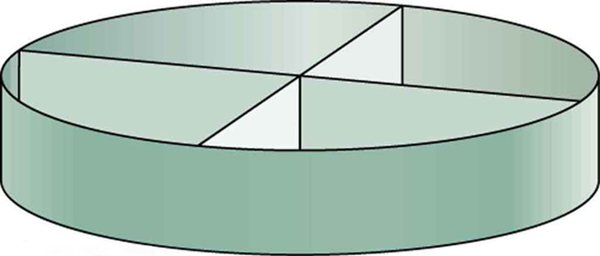

* Calculate Reynolds number.
* Use the Reynolds number for a system to determine whether it is laminar or turbulent.

Sometimes we can predict if flow will be laminar or turbulent. We know that flow in a very smooth tube or around a smooth, streamlined object will be laminar at low velocity. We also know that at high velocity, even flow in a smooth tube or around a smooth object will experience turbulence. In between, it is more difficult to predict. In fact, at intermediate velocities, flow may oscillate back and forth indefinitely between laminar and turbulent.

An occlusion, or narrowing, of an artery, such as shown in [\[link\]](#import-auto-id3342274), is likely to cause turbulence because of the irregularity of the blockage, as well as the complexity of blood as a fluid. Turbulence in the circulatory system is noisy and can sometimes be detected with a stethoscope, such as when measuring diastolic pressure in the upper arm’s partially collapsed brachial artery. These turbulent sounds, at the onset of blood flow when the cuff pressure becomes sufficiently small, are called *Korotkoff sounds*. Aneurysms, or ballooning of arteries, create significant turbulence and can sometimes be detected with a stethoscope. Heart murmurs, consistent with their name, are sounds produced by turbulent flow around damaged and insufficiently closed heart valves. Ultrasound can also be used to detect turbulence as a medical indicator in a process analogous to Doppler-shift radar used to detect storms.

![Figure shows a rectangular section of a blood vessel. The blood flow is shown toward right. The blood vessel is shown to be broader at one end and narrow toward the opposite end. The flow is shown to be laminar as shown by horizontal parallel lines. The velocity is v one in the broader section of blood vessel. The junction where the tube narrows the velocity is v two. The lines of flow are shown to bend. The regions where the blood vessels are narrow, the flow is shown to be turbulent as shown to by curling arrows. The velocity is given by v three toward right. The length of the arrows depicting the velocities represent that v three is greater than v two greater than v one.](../resources/Figure_13_05_01a.jpg "Flow is laminar in the large part of this blood vessel and turbulent in the part narrowed by plaque, where velocity is high. In the transition region, the flow can oscillate chaotically between laminar and turbulent flow."){: #import-auto-id3342274 data-media-type="image/jpg"}

An indicator called the **Reynolds number**{: data-type="term" #import-auto-id2891021} <math xmlns="http://www.w3.org/1998/Math/MathML"><semantics><mrow><mrow><msub><mi>N</mi><mrow><mtext>R</mtext></mrow></msub></mrow><mrow /></mrow><annotation encoding="StarMath 5.0"> size 12{N rSub { size 8{R} } } {}</annotation></semantics></math>

 can reveal whether flow is laminar or turbulent. For flow in a tube of uniform diameter, the Reynolds number is defined as

<math xmlns="http://www.w3.org/1998/Math/MathML"><semantics><mrow><mrow><mrow><mrow><msub><mi>N</mi><mrow><mtext>R</mtext></mrow></msub><mo stretchy="false">=</mo><mfrac><mrow><mn>2</mn><mi>ρ</mi><mstyle fontstyle="italic"><mrow><mtext>vr</mtext></mrow></mstyle></mrow><mi>η</mi></mfrac></mrow></mrow><mtext> (flow in tube),</mtext></mrow><mrow /></mrow><annotation encoding="StarMath 5.0"> size 12{N rSub { size 8{R} } = { {2ρ ital "vr"} over {η} } } {}</annotation></semantics></math>

where <math xmlns="http://www.w3.org/1998/Math/MathML"><semantics><mrow><mrow><mi>ρ</mi></mrow><mrow /></mrow><annotation encoding="StarMath 5.0"> size 12{ρ} {}</annotation></semantics></math>

 is the fluid density, <math xmlns="http://www.w3.org/1998/Math/MathML"><semantics><mrow><mrow><mi>v</mi></mrow><mrow /></mrow><annotation encoding="StarMath 5.0"> size 12{v} {}</annotation></semantics></math>

 its speed, <math xmlns="http://www.w3.org/1998/Math/MathML"><semantics><mrow><mrow><mi>η</mi></mrow><mrow /></mrow><annotation encoding="StarMath 5.0"> size 12{η} {}</annotation></semantics></math>

 its viscosity, and <math xmlns="http://www.w3.org/1998/Math/MathML"><semantics><mrow><mrow><mi>r</mi></mrow><mrow /></mrow><annotation encoding="StarMath 5.0"> size 12{r} {}</annotation></semantics></math>

 the tube radius. The Reynolds number is a unitless quantity. Experiments have revealed that <math xmlns="http://www.w3.org/1998/Math/MathML"><semantics><mrow><mrow><msub><mi>N</mi><mrow><mtext>R</mtext></mrow></msub></mrow><mrow /></mrow><annotation encoding="StarMath 5.0"> size 12{N rSub { size 8{R} } } {}</annotation></semantics></math>

 is related to the onset of turbulence. For <math xmlns="http://www.w3.org/1998/Math/MathML"><semantics><mrow><mrow><msub><mi>N</mi><mrow><mtext>R</mtext></mrow></msub></mrow><mrow /></mrow><annotation encoding="StarMath 5.0"> size 12{N rSub { size 8{R} } } {}</annotation></semantics></math>

 below about 2000, flow is laminar. For <math xmlns="http://www.w3.org/1998/Math/MathML"><semantics><mrow><mrow><msub><mi>N</mi><mrow><mtext>R</mtext></mrow></msub></mrow><mrow /></mrow><annotation encoding="StarMath 5.0"> size 12{N rSub { size 8{R} } } {}</annotation></semantics></math>

 above about 3000, flow is turbulent. For values of <math xmlns="http://www.w3.org/1998/Math/MathML"><semantics><mrow><mrow><msub><mi>N</mi><mrow><mtext>R</mtext></mrow></msub></mrow><mrow /></mrow><annotation encoding="StarMath 5.0"> size 12{N rSub { size 8{R} } } {}</annotation></semantics></math>

 between about 2000 and 3000, flow is unstable—that is, it can be laminar, but small obstructions and surface roughness can make it turbulent, and it may oscillate randomly between being laminar and turbulent. The blood flow through most of the body is a quiet, laminar flow. The exception is in the aorta, where the speed of the blood flow rises above a critical value of 35 m/s and becomes turbulent.

Is This Flow Laminar or Turbulent?

Calculate the Reynolds number for flow in the needle considered in [Example 12.8](/m42209#fs-id1969731) to verify the assumption that the flow is laminar. Assume that the density of the saline solution is <math xmlns="http://www.w3.org/1998/Math/MathML"><semantics><mrow><mn>1025 kg/</mn><msup><mtext>m</mtext><mn>3</mn></msup></mrow></semantics></math>

.

**Strategy**

We have all of the information needed, except the fluid speed <math xmlns="http://www.w3.org/1998/Math/MathML"><semantics><mrow><mrow><mi>v</mi></mrow><mrow /></mrow><annotation encoding="StarMath 5.0"> size 12{v} {}</annotation></semantics></math>

, which can be calculated from <math xmlns="http://www.w3.org/1998/Math/MathML"><semantics><mrow><mrow><mrow><mrow><mrow><mrow> <mrow> <mover> <mi>v</mi> <mo>¯</mo> </mover> </mrow> </mrow><mo stretchy="false">=</mo><mrow><mi>Q</mi><mo stretchy="false">/</mo><mi>A</mi></mrow></mrow><mo stretchy="false">=</mo><mn>1.70 m/s</mn></mrow></mrow></mrow><mrow /></mrow><annotation encoding="StarMath 5.0"> size 12{ {overline {v}} =Q/A=1 "." "70"" m/s"} {}</annotation></semantics></math>

 (verification of this is in this chapter’s Problems and Exercises).

**Solution**

Entering the known values into <math xmlns="http://www.w3.org/1998/Math/MathML"><semantics><mrow><mrow><mrow><msub><mi>N</mi><mrow><mtext>R</mtext></mrow></msub><mo stretchy="false">=</mo><mfrac><mrow><mn>2</mn><mi>ρ</mi><mstyle fontstyle="italic"><mrow><mtext>vr</mtext></mrow></mstyle></mrow><mi>η</mi></mfrac></mrow></mrow><mrow /></mrow><annotation encoding="StarMath 5.0"> size 12{N rSub { size 8{R} } = { {2ρ ital "vr"} over {η} } } {}</annotation></semantics></math>

 gives

<math xmlns="http://www.w3.org/1998/Math/MathML"><semantics><mrow><mrow><mtable columnalign="left"><mtr> <mtd><msub><mi>N</mi><mrow><mtext>R</mtext></mrow></msub></mtd> <mtd><mo stretchy="false">=</mo></mtd> <mtd><mfrac><mrow><mn>2</mn><mi>ρ</mi><mstyle fontstyle="italic"><mrow><mtext>vr</mtext></mrow></mstyle></mrow><mi>η</mi></mfrac></mtd> </mtr><mtr> <mtd /> <mtd><mo stretchy="false">=</mo></mtd> <mtd><mfrac><mrow><mn>2</mn><mo stretchy="false">(</mo><msup><mtext>1025 kg/m</mtext><mrow><mn>3</mn></mrow></msup><mo stretchy="false">)</mo><mo stretchy="false">(</mo><mtext>1.70 m/s</mtext><mo stretchy="false">)</mo><mo stretchy="false">(</mo><mn>0.150</mn><mrow><mo stretchy="false">×</mo><msup><mtext>10</mtext><mrow><mrow><mo stretchy="false">−</mo><mn>3</mn></mrow></mrow></msup></mrow><mspace width="0.25em" /><mtext> m</mtext><mo stretchy="false">)</mo></mrow><mrow><mn>1</mn><mtext>.</mtext><mrow><mtext>00</mtext><mo stretchy="false">×</mo><msup><mtext>10</mtext><mrow><mrow><mo stretchy="false">−</mo><mn>3</mn></mrow></mrow></msup></mrow><mspace width="0.25em" /><mrow><mtext> N</mtext><mo stretchy="false">⋅</mo><msup><mtext>s/m</mtext><mrow><mn>2</mn></mrow></msup></mrow></mrow></mfrac></mtd> </mtr><mtr> <mtd /> <mtd><mo stretchy="false">=</mo></mtd> <mtd><mtext>523</mtext><mtext>.</mtext></mtd> </mtr></mtable><mrow /></mrow></mrow></semantics></math>

**Discussion**

Since <math xmlns="http://www.w3.org/1998/Math/MathML"><semantics><mrow><mrow><msub><mi>N</mi><mrow><mtext>R</mtext></mrow></msub></mrow><mrow /></mrow><annotation encoding="StarMath 5.0"> size 12{N rSub { size 8{R} } } {}</annotation></semantics></math>

 is well below 2000, the flow should indeed be laminar.

Take-Home Experiment: Inhalation

Under the conditions of normal activity, an adult inhales about 1 L of air during each inhalation. With the aid of a watch, determine the time for one of your own inhalations by timing several breaths and dividing the total length by the number of breaths. Calculate the average flow rate <math xmlns="http://www.w3.org/1998/Math/MathML"><semantics><mrow><mrow><mi>Q</mi></mrow><mrow /></mrow><annotation encoding="StarMath 5.0"> size 12{Q} {}</annotation></semantics></math>

 of air traveling through the trachea during each inhalation.

The topic of chaos has become quite popular over the last few decades. A system is defined to be *chaotic* when its behavior is so sensitive to some factor that it is extremely difficult to predict. The field of *chaos* is the study of chaotic behavior. A good example of chaotic behavior is the flow of a fluid with a Reynolds number between 2000 and 3000. Whether or not the flow is turbulent is difficult, but not impossible, to predict—the difficulty lies in the extremely sensitive dependence on factors like roughness and obstructions on the nature of the flow. A tiny variation in one factor has an exaggerated (or nonlinear) effect on the flow. Phenomena as disparate as turbulence, the orbit of Pluto, and the onset of irregular heartbeats are chaotic and can be analyzed with similar techniques.

# Section Summary

* {: #import-auto-id1355852} The Reynolds number
  <math xmlns="http://www.w3.org/1998/Math/MathML"><semantics><mrow><mrow><msub><mi>N</mi><mrow><mtext>R</mtext></mrow></msub></mrow><mrow /></mrow><annotation encoding="StarMath 5.0"> size 12{N rSub { size 8{R} } } {}</annotation></semantics></math>
  
  can reveal whether flow is laminar or turbulent. It is
  

  <math xmlns="http://www.w3.org/1998/Math/MathML"><semantics><mrow><mrow><mrow><msub><mi>N</mi><mrow><mtext>R</mtext></mrow></msub><mo stretchy="false">=</mo><mfrac><mrow><mn>2</mn><mi>ρ</mi><mstyle fontstyle="italic"><mrow><mtext>vr</mtext></mrow></mstyle></mrow><mi>η</mi></mfrac></mrow></mrow><mrow /><mo>.</mo></mrow><annotation encoding="StarMath 5.0"> size 12{N rSub { size 8{R} } = { {2ρ ital "vr"} over {η} } } {}</annotation></semantics></math>
  

* {: #import-auto-id953571} For
  <math xmlns="http://www.w3.org/1998/Math/MathML"><semantics><mrow><mrow><msub><mi>N</mi><mrow><mtext>R</mtext></mrow></msub></mrow><mrow /></mrow><annotation encoding="StarMath 5.0"> size 12{N rSub { size 8{R} } } {}</annotation></semantics></math>
  
  below about 2000, flow is laminar. For
  <math xmlns="http://www.w3.org/1998/Math/MathML"><semantics><mrow><mrow><msub><mi>N</mi><mrow><mtext>R</mtext></mrow></msub></mrow><mrow /></mrow><annotation encoding="StarMath 5.0"> size 12{N rSub { size 8{R} } } {}</annotation></semantics></math>
  
  above about 3000, flow is turbulent. For values of
  <math xmlns="http://www.w3.org/1998/Math/MathML"><semantics><mrow><mrow><msub><mi>N</mi><mrow><mtext>R</mtext></mrow></msub></mrow><mrow /></mrow><annotation encoding="StarMath 5.0"> size 12{N rSub { size 8{R} } } {}</annotation></semantics></math>
  
  between 2000 and 3000, it may be either or both.

# Conceptual Questions

Doppler ultrasound can be used to measure the speed of blood in the body. If there is a partial constriction of an artery, where would you expect blood speed to be greatest, at or nearby the constriction? What are the two distinct causes of higher resistance in the constriction?

Sink drains often have a device such as that shown in [[link]](#eip-id1419266) to help speed the flow of water. How does this work?

{: #eip-id1419266 data-media-type="image/jpg"}

Some ceiling fans have decorative wicker reeds on their blades. Discuss whether these fans are as quiet and efficient as those with smooth blades.

# Problems &amp; Exercises

Verify that the flow of oil is laminar (barely) for an oil gusher that shoots crude oil 25.0 m into the air through a pipe with a 0.100-m diameter. The vertical pipe is 50 m long. Take the density of the oil to be <math xmlns="http://www.w3.org/1998/Math/MathML"><semantics><mrow><mrow><mrow><mtext>900 kg</mtext><msup><mtext>/m</mtext><mrow><mn>3</mn></mrow></msup></mrow></mrow><mrow /></mrow><annotation encoding="StarMath 5.0"> size 12{"900"`"kg/m" rSup { size 8{3} } } {}</annotation></semantics></math>

 and its viscosity to be <math xmlns="http://www.w3.org/1998/Math/MathML"><semantics><mrow><mrow><mrow><mn>1.00</mn><mspace width="0.25em" /><mo stretchy="false">(</mo><msup><mtext>N/m</mtext><mrow><mn>2</mn></mrow></msup><mrow><mo stretchy="false">)</mo><mo stretchy="false">⋅</mo><mtext>s</mtext></mrow></mrow></mrow><mrow /></mrow><annotation encoding="StarMath 5.0"> size 12{1 "." "00"` \( "N/m" rSup { size 8{2} } \) cdot s} {}</annotation></semantics></math>

 (or <math xmlns="http://www.w3.org/1998/Math/MathML"><semantics><mrow><mn>1.00 Pa</mn><mo stretchy="false">⋅</mo><mtext>s</mtext></mrow></semantics></math>

).

<math xmlns="http://www.w3.org/1998/Math/MathML"><semantics><mrow><msub><mi>N</mi><mtext>R</mtext></msub><mo>=</mo><mn>1.99</mn><mo>×</mo><msup><mn>10</mn><mn>2</mn></msup><mn> &lt; 2000</mn></mrow></semantics></math>

Show that the Reynolds number <math xmlns="http://www.w3.org/1998/Math/MathML"><semantics><mrow><mrow><msub><mi>N</mi><mrow><mtext>R</mtext></mrow></msub></mrow><mrow /></mrow><annotation encoding="StarMath 5.0"> size 12{N rSub { size 8{R} } } {}</annotation></semantics></math>

 is unitless by substituting units for all the quantities in its definition and cancelling.

Calculate the Reynolds numbers for the flow of water through (a) a nozzle with a radius of 0.250 cm and (b) a garden hose with a radius of 0.900 cm, when the nozzle is attached to the hose. The flow rate through hose and nozzle is 0.500 L/s. Can the flow in either possibly be laminar?

(a) nozzle: <math xmlns="http://www.w3.org/1998/Math/MathML"><semantics><mrow><mrow><mrow><mn>1</mn><mtext>.</mtext><mrow><mtext>27</mtext><mo stretchy="false">×</mo><msup><mtext>10</mtext><mrow><mn>5</mn></mrow></msup></mrow></mrow></mrow><mrow /></mrow><annotation encoding="StarMath 5.0"> size 12{1 "." "27" times "10" rSup { size 8{5} } } {}</annotation></semantics></math>

 , not laminar

(b) hose: <math xmlns="http://www.w3.org/1998/Math/MathML"><semantics><mrow><mrow><mrow><mn>3</mn><mtext>.</mtext><mrow><mtext>51</mtext><mo stretchy="false">×</mo><msup><mtext>10</mtext><mrow><mn>4</mn></mrow></msup></mrow></mrow></mrow><mrow /></mrow><annotation encoding="StarMath 5.0"> size 12{1 "." "27" times "10" rSup { size 8{5} } } {}</annotation></semantics></math>

, not laminar.

A fire hose has an inside diameter of 6.40 cm. Suppose such a hose carries a flow of 40.0 L/s starting at a gauge pressure of <math xmlns="http://www.w3.org/1998/Math/MathML"><semantics><mrow><mrow><mrow><mn>1</mn><mtext>.</mtext><mrow><mtext>62</mtext><mo stretchy="false">×</mo><msup><mtext>10</mtext><mrow><mn>6</mn></mrow></msup></mrow><mspace width="0.25em" /><msup><mtext>N/m</mtext><mrow><mn>2</mn></mrow></msup></mrow></mrow><mrow /></mrow><annotation encoding="StarMath 5.0"> size 12{1 "." "62" times "10" rSup { size 8{6} } `"N/m" rSup { size 8{2} } } {}</annotation></semantics></math>

. The hose goes 10.0 m up a ladder to a nozzle having an inside diameter of 3.00 cm. Calculate the Reynolds numbers for flow in the fire hose and nozzle to show that the flow in each must be turbulent.

Concrete is pumped from a cement mixer to the place it is being laid, instead of being carried in wheelbarrows. The flow rate is 200.0 L/min through a 50.0-m-long, 8.00-cm-diameter hose, and the pressure at the pump is <math xmlns="http://www.w3.org/1998/Math/MathML"><semantics><mrow><mrow><mrow><mn>8</mn><mtext>.</mtext><mrow><mtext>00</mtext><mo stretchy="false">×</mo><msup><mtext>10</mtext><mrow><mn>6</mn></mrow></msup></mrow><mspace width="0.25em" /><msup><mtext>N/m</mtext><mrow><mn>2</mn></mrow></msup></mrow></mrow><mrow /></mrow></semantics></math>

. Verify that the flow of concrete is laminar taking concrete’s viscosity to be <math xmlns="http://www.w3.org/1998/Math/MathML"><semantics> <mrow><mn>48.0</mn><mspace width="0.25em" /><mo stretchy="false">(</mo><mtext>N/</mtext><msup><mtext>m</mtext><mn>2</mn></msup><mo stretchy="false">)</mo><mo>·</mo><mtext>s</mtext></mrow></semantics></math>

, and given its density is <math xmlns="http://www.w3.org/1998/Math/MathML"><semantics><mrow><mn>2300 kg/</mn><msup><mtext>m</mtext><mn>3</mn></msup></mrow></semantics></math>

.

2\.54 &lt;&lt; 2000, laminar.

At what flow rate might turbulence begin to develop in a water main with a 0.200-m diameter? Assume a <math xmlns="http://www.w3.org/1998/Math/MathML"><semantics><mrow><mrow><mrow><mtext>20º C</mtext><mrow /></mrow></mrow><mrow /></mrow><annotation encoding="StarMath 5.0"> size 12{"20" rSup { size 12{ circ } } C} {}</annotation></semantics></math>

 temperature.

What is the greatest average speed of blood flow at <math xmlns="http://www.w3.org/1998/Math/MathML"><semantics><mrow><mtext>37º C</mtext></mrow></semantics></math>

 in an artery of radius 2.00 mm if the flow is to remain laminar? What is the corresponding flow rate? Take the density of blood to be <math xmlns="http://www.w3.org/1998/Math/MathML"><semantics><mrow><mn>1025 kg</mn><mo stretchy="false">/</mo><msup><mtext>m</mtext><mn>3</mn></msup></mrow></semantics></math>

.

1\.02 m/s

<math xmlns="http://www.w3.org/1998/Math/MathML"><semantics><mrow><mn>1.28</mn><mo stretchy="false">×</mo><msup><mtext>10</mtext><mn>–2</mn></msup><mspace width="0.25em" /><mtext>L/s</mtext></mrow></semantics></math>

In [Take-Home Experiment: Inhalation](#fs-id1861353), we measured the average flow rate *<math xmlns="http://www.w3.org/1998/Math/MathML"><semantics><mrow><mrow><mi>Q</mi></mrow><mrow /></mrow><annotation encoding="StarMath 5.0"> size 12{Q} {}</annotation></semantics></math>

* of air traveling through the trachea during each inhalation. Now calculate the average air speed in meters per second through your trachea during each inhalation. The radius of the trachea in adult humans is approximately <math xmlns="http://www.w3.org/1998/Math/MathML"><semantics><mrow><mrow><mrow><msup><mtext>10</mtext><mrow><mrow><mo stretchy="false">−</mo><mn>2</mn></mrow></mrow></msup><mspace width="0.25em" /><mtext>m</mtext></mrow></mrow><mrow /></mrow><annotation encoding="StarMath 5.0"> size 12{"10" rSup { size 8{ - 2} } `m} {}</annotation></semantics></math>

. From the data above, calculate the Reynolds number for the air flow in the trachea during inhalation. Do you expect the air flow to be laminar or turbulent?

Gasoline is piped underground from refineries to major users. The flow rate is <math xmlns="http://www.w3.org/1998/Math/MathML"><semantics><mrow><mrow><mrow><mn>3</mn><mtext>.</mtext><mrow><mtext>00</mtext><mo stretchy="false">×</mo><msup><mtext>10</mtext><mrow><mn>–2</mn></mrow></msup></mrow><mspace width="0.25em" /><msup><mtext>m</mtext><mrow><mn>3</mn></mrow></msup><mtext>/s</mtext></mrow></mrow><mrow /></mrow><annotation encoding="StarMath 5.0"> size 12{3 "." "00" times "10" rSup { size 8{2} } `m rSup { size 8{3} } "/s"} {}</annotation></semantics></math>

 (about 500 gal/min), the viscosity of gasoline is <math xmlns="http://www.w3.org/1998/Math/MathML"><semantics><mrow><mrow><mrow><mn>1.00</mn><mrow><mo stretchy="false">×</mo><msup><mtext>10</mtext><mrow><mn>–3</mn></mrow></msup></mrow><mspace width="0.25em" /><mo stretchy="false">(</mo><msup><mtext>N/m</mtext><mrow><mn>2</mn></mrow></msup><mrow><mo stretchy="false">)</mo><mo stretchy="false">⋅</mo><mtext>s</mtext></mrow></mrow></mrow><mrow /></mrow><annotation encoding="StarMath 5.0"> size 12{1 "." "00" times "10" rSup { size 8{5} } ` \( "N/m" rSup { size 8{2} } \) cdot s} {}</annotation></semantics></math>

, and its density is <math xmlns="http://www.w3.org/1998/Math/MathML"><semantics><mrow><mrow><mrow><mtext>680</mtext><mspace width="0.25em" /><msup><mtext>kg/m</mtext><mrow><mn>3</mn></mrow></msup></mrow></mrow><mrow /></mrow><annotation encoding="StarMath 5.0"> size 12{"680"`"kg/m" rSup { size 8{3} } } {}</annotation></semantics></math>

. (a) What minimum diameter must the pipe have if the Reynolds number is to be less than 2000? (b) What pressure difference must be maintained along each kilometer of the pipe to maintain this flow rate?

(a)<math xmlns="http://www.w3.org/1998/Math/MathML"><semantics><mrow><mtext>≥ 13.0 m</mtext></mrow></semantics></math>

(b) <math xmlns="http://www.w3.org/1998/Math/MathML"><semantics><mrow><mrow><mrow><mn>2</mn><mtext>.</mtext><mrow><mtext>68</mtext><mo stretchy="false">×</mo><msup><mtext>10</mtext><mrow><mrow><mo stretchy="false">−</mo><mn>6</mn></mrow></mrow></msup></mrow><mspace width="0.25em" /><msup><mtext> N/m</mtext><mrow><mn>2</mn></mrow></msup></mrow></mrow></mrow><annotation encoding="StarMath 5.0"> size 12{2 "." "68" times "10" rSup { size 8{ - 6} } " N/m" rSup { size 8{2} } } {}</annotation></semantics></math>

Assuming that blood is an ideal fluid, calculate the critical flow rate at which turbulence is a certainty in the aorta. Take the diameter of the aorta to be 2.50 cm. (Turbulence will actually occur at lower average flow rates, because blood is not an ideal fluid. Furthermore, since blood flow pulses, turbulence may occur during only the high-velocity part of each heartbeat.)

**Unreasonable Results**

A fairly large garden hose has an internal radius of 0.600 cm and a length of 23.0 m. The nozzleless horizontal hose is attached to a faucet, and it delivers 50.0 L/s. (a) What water pressure is supplied by the faucet? (b) What is unreasonable about this pressure? (c) What is unreasonable about the premise? (d) What is the Reynolds number for the given flow? (Take the viscosity of water as <math xmlns="http://www.w3.org/1998/Math/MathML"><semantics><mrow><mn>1.005</mn><mo>×</mo><msup><mn>10</mn><mn>–3</mn></msup><mspace width="0.25em" /><mo>(</mo><mtext>N</mtext><mo stretchy="false">/</mo><msup><mn>m</mn><mn>2</mn></msup><mo>)</mo><mo>⋅</mo><mtext>s</mtext></mrow></semantics></math>

.)

(a) 23.7 atm or <math xmlns="http://www.w3.org/1998/Math/MathML"><semantics><mrow><mtext>344 lb/</mtext><msup><mtext>in</mtext><mn>2</mn></msup></mrow></semantics></math>

(b) The pressure is much too high.

(c) The assumed flow rate is very high for a garden hose.

(d) <math xmlns="http://www.w3.org/1998/Math/MathML"><semantics><mrow><mrow><mrow><mn>5.27</mn><mrow><mo stretchy="false">×</mo><msup><mtext>10</mtext><mrow><mn>6</mn></mrow></msup></mrow></mrow></mrow><mrow /></mrow><annotation encoding="StarMath 5.0"> size 12{5 "." "27" times "10" rSup { size 8{6} } } {}</annotation></semantics></math>

 &gt; &gt; 3000, turbulent, contrary to the assumption of laminar flow when using this equation.

