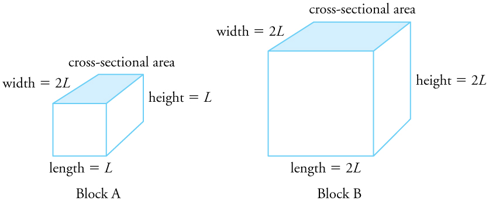

* Define and describe thermal expansion.
* Calculate the linear expansion of an object given its initial length, change in temperature, and coefficient of linear expansion.
* Calculate the volume expansion of an object given its initial volume, change in temperature, and coefficient of volume expansion.
* Calculate thermal stress on an object given its original volume, temperature change, volume change, and bulk modulus.

 "){: #import-auto-id2186444}

The expansion of alcohol in a thermometer is one of many commonly encountered examples of **thermal expansion**{: data-type="term" #import-auto-id1965463}, the change in size or volume of a given mass with temperature. Hot air rises because its volume increases, which causes the hot air’s density to be smaller than the density of surrounding air, causing a buoyant (upward) force on the hot air. The same happens in all liquids and gases, driving natural heat transfer upwards in homes, oceans, and weather systems. Solids also undergo thermal expansion. Railroad tracks and bridges, for example, have expansion joints to allow them to freely expand and contract with temperature changes.

What are the basic properties of thermal expansion? First, thermal expansion is clearly related to temperature change. The greater the temperature change, the more a bimetallic strip will bend. Second, it depends on the material. In a thermometer, for example, the expansion of alcohol is much greater than the expansion of the glass containing it.

What is the underlying cause of thermal expansion? As is discussed in [Kinetic Theory: Atomic and Molecular Explanation of Pressure and Temperature](/m42147), an increase in temperature implies an increase in the kinetic energy of the individual atoms. In a solid, unlike in a gas, the atoms or molecules are closely packed together, but their kinetic energy (in the form of small, rapid vibrations) pushes neighboring atoms or molecules apart from each other. This neighbor-to-neighbor pushing results in a slightly greater distance, on average, between neighbors, and adds up to a larger size for the whole body. For most substances under ordinary conditions, there is no preferred direction, and an increase in temperature will increase the solid’s size by a certain fraction in each dimension.

Linear Thermal Expansion—Thermal Expansion in One Dimension

The change in length <math xmlns="http://www.w3.org/1998/Math/MathML"><semantics><mrow><mrow><mtext>Δ</mtext><mi fontstyle="italic">L</mi></mrow><mrow /></mrow><annotation encoding="StarMath 5.0"> size 12{ΔL} {}</annotation></semantics></math>

 is proportional to length <math xmlns="http://www.w3.org/1998/Math/MathML"><semantics><mrow><mrow><mi>L</mi></mrow><mrow /></mrow><annotation encoding="StarMath 5.0"> size 12{L} {}</annotation></semantics></math>

. The dependence of thermal expansion on temperature, substance, and length is summarized in the equation

<math xmlns="http://www.w3.org/1998/Math/MathML"><semantics><mrow><mrow><mrow><mtext>Δ</mtext><mi fontstyle="italic">L</mi><mo stretchy="false">=</mo><mi fontstyle="italic">αL</mi><mtext>Δ</mtext><mi fontstyle="italic">T</mi></mrow><mo>,</mo></mrow><mrow /></mrow><annotation encoding="StarMath 5.0"> size 12{ΔL=αLΔT} {}</annotation></semantics></math>

where <math xmlns="http://www.w3.org/1998/Math/MathML"><semantics><mrow><mrow><mtext>Δ</mtext><mi fontstyle="italic">L</mi></mrow><mrow /></mrow><annotation encoding="StarMath 5.0"> size 12{ΔL} {}</annotation></semantics></math>

 is the change in length <math xmlns="http://www.w3.org/1998/Math/MathML"><semantics><mrow><mrow><mi>L</mi></mrow><mrow /></mrow><annotation encoding="StarMath 5.0"> size 12{L} {}</annotation></semantics></math>

, <math xmlns="http://www.w3.org/1998/Math/MathML"><semantics><mrow><mrow><mtext>Δ</mtext><mi fontstyle="italic">T</mi></mrow><mrow /></mrow><annotation encoding="StarMath 5.0"> size 12{ΔT} {}</annotation></semantics></math>

 is the change in temperature, and *<math xmlns="http://www.w3.org/1998/Math/MathML"><semantics><mrow><mrow><mi>α</mi></mrow><mrow /></mrow><annotation encoding="StarMath 5.0"> size 12{α} {}</annotation></semantics></math>

* is the **coefficient of linear expansion**{: data-type="term" #import-auto-id1961436}, which varies slightly with temperature.

[\[link\]](#import-auto-id1814176) lists representative values of the coefficient of linear expansion, which may have units of <math xmlns="http://www.w3.org/1998/Math/MathML"><semantics><mrow><mrow><mrow><mrow><mn>1</mn><mo stretchy="false">/</mo><mtext>º</mtext></mrow><mtext>C</mtext></mrow></mrow><mrow /></mrow><annotation encoding="StarMath 5.0"> size 12{1/°C} {}</annotation></semantics></math>

 or 1/K. Because the size of a kelvin and a degree Celsius are the same, both *<math xmlns="http://www.w3.org/1998/Math/MathML"><semantics><mrow><mrow><mi>α</mi></mrow><mrow /></mrow><annotation encoding="StarMath 5.0"> size 12{α} {}</annotation></semantics></math>

* and <math xmlns="http://www.w3.org/1998/Math/MathML"><semantics><mrow><mrow><mtext>Δ</mtext><mi fontstyle="italic">T</mi></mrow><mrow /></mrow><annotation encoding="StarMath 5.0"> size 12{ΔT} {}</annotation></semantics></math>

 can be expressed in units of kelvins or degrees Celsius. The equation <math xmlns="http://www.w3.org/1998/Math/MathML"><semantics><mrow><mrow><mrow><mtext>Δ</mtext><mi fontstyle="italic">L</mi><mo stretchy="false">=</mo><mi fontstyle="italic">αL</mi><mtext>Δ</mtext><mi fontstyle="italic">T </mi></mrow></mrow><mrow /></mrow><annotation encoding="StarMath 5.0"> size 12{ΔL=αLΔT} {}</annotation></semantics></math>

 is accurate for small changes in temperature and can be used for large changes in temperature if an average value of *<math xmlns="http://www.w3.org/1998/Math/MathML"><semantics><mrow><mrow><mi>α</mi></mrow><mrow /></mrow><annotation encoding="StarMath 5.0"> size 12{α} {}</annotation></semantics></math>

* is used.

<table id="import-auto-id1814176" summary="Three-column table gives the thermal expansion coefficients of various solids, liquids, and gases at twenty degrees Celsius. The left column gives the names of the materials; the middle column gives the coefficient of linear expansion of various solids; and the right column gives the coefficient of volume expansion of solids, liquids, and gases."><caption>Thermal Expansion Coefficients at <math xmlns="http://www.w3.org/1998/Math/MathML"><semantics><mrow><mrow><mrow><mtext>20</mtext><mtext>º</mtext><mtext>C</mtext></mrow></mrow><mrow /></mrow><annotation encoding="StarMath 5.0"> size 12{"20"°C} {}</annotation></semantics></math><strong><a data-type="footnote-link" href="#footnote1">1</a></strong></caption><thead>  
          <tr>
            <th>Material</th>
            <th>Coefficient of linear expansion <math xmlns="http://www.w3.org/1998/Math/MathML" display="block"><semantics><mrow><mrow><mrow><mi>α</mi><mo stretchy="false">(</mo><mrow><mn>1</mn><mo stretchy="false">/</mo><mtext>º</mtext></mrow><mtext>C</mtext><mo stretchy="false">)</mo></mrow></mrow><mrow /></mrow><annotation encoding="StarMath 5.0"> size 12{α  \( 1/°C \) } {}</annotation></semantics></math></th>
            <th>Coefficient of volume expansion <math xmlns="http://www.w3.org/1998/Math/MathML" display="block"><semantics><mrow><mrow><mrow><mi>β</mi><mo stretchy="false">(</mo><mrow><mn>1</mn><mo stretchy="false">/</mo><mtext>º</mtext></mrow><mtext>C</mtext><mo stretchy="false">)</mo></mrow></mrow><mrow /></mrow><annotation encoding="StarMath 5.0"> size 12{β  \( 1/°C \) } {}</annotation></semantics></math></th>
          </tr></thead><tbody>
          <tr>
            <td colspan="3">
              <strong>Solids</strong>
            </td>
            
          </tr>
          <tr>
            <td>Aluminum</td>
            <td>
              <math xmlns="http://www.w3.org/1998/Math/MathML" display="block">
                <semantics>
                  <mrow>
                    <mrow>
                      <mrow>
                        <mtext>25</mtext>
                        <mo stretchy="false">×</mo>
                        <msup>
                          <mtext>10</mtext>
                          <mrow>
                            <mrow>
                              <mi>–</mi>
                              <mn>6</mn>
                            </mrow>
                          </mrow>
                        </msup>
                      </mrow>
                    </mrow>
                    <mrow />
                  </mrow>
                  <annotation encoding="StarMath 5.0"> size 12{"25" times "10" rSup { size 8{–6} } } {}</annotation>
                </semantics>
              </math>
            </td>
            <td>
              <math xmlns="http://www.w3.org/1998/Math/MathML" display="block">
                <semantics>
                  <mrow>
                    <mrow>
                      <mrow>
                        <mtext>75</mtext>
                        <mo stretchy="false">×</mo>
                        <msup>
                          <mtext>10</mtext>
                          <mrow>
                            <mrow>
                              <mi>–</mi>
                              <mn>6</mn>
                            </mrow>
                          </mrow>
                        </msup>
                      </mrow>
                    </mrow>
                    <mrow />
                  </mrow>
                  <annotation encoding="StarMath 5.0"> size 12{"75"´"10" rSup { size 8{ +- 6} } } {}</annotation>
                </semantics>
              </math>
            </td>
          </tr>
          <tr>
            <td>Brass</td>
            <td>
              <math xmlns="http://www.w3.org/1998/Math/MathML" display="block">
                <semantics>
                  <mrow>
                    <mrow>
                      <mrow>
                        <mtext>19</mtext>
                        <mo stretchy="false">×</mo>
                        <msup>
                          <mtext>10</mtext>
                          <mrow>
                            <mrow>
                              <mi>–</mi>
                              <mn>6</mn>
                            </mrow>
                          </mrow>
                        </msup>
                      </mrow>
                    </mrow>
                    <mrow />
                  </mrow>
                  <annotation encoding="StarMath 5.0"> size 12{"19" times "10" rSup { size 8{–6} } } {}</annotation>
                </semantics>
              </math>
            </td>
            <td>
              <math xmlns="http://www.w3.org/1998/Math/MathML" display="block">
                <semantics>
                  <mrow>
                    <mrow>
                      <mrow>
                        <mtext>56</mtext>
                        <mo stretchy="false">×</mo>
                        <msup>
                          <mtext>10</mtext>
                          <mrow>
                            <mrow>
                              <mi>–</mi>
                              <mn>6</mn>
                            </mrow>
                          </mrow>
                        </msup>
                      </mrow>
                    </mrow>
                    <mrow />
                  </mrow>
                  <annotation encoding="StarMath 5.0"> size 12{"56"´"10" rSup { size 8{ +- 6} } } {}</annotation>
                </semantics>
              </math>
            </td>
          </tr>
          <tr>
            <td>Copper</td>
            <td>
              <math xmlns="http://www.w3.org/1998/Math/MathML" display="block">
                <semantics>
                  <mrow>
                    <mrow>
                      <mrow>
                        <mtext>17</mtext>
                        <mo stretchy="false">×</mo>
                        <msup>
                          <mtext>10</mtext>
                          <mrow>
                            <mrow>
                              <mi>–</mi>
                              <mn>6</mn>
                            </mrow>
                          </mrow>
                        </msup>
                      </mrow>
                    </mrow>
                    <mrow />
                  </mrow>
                  <annotation encoding="StarMath 5.0"> size 12{"17" times "10" rSup { size 8{–6} } } {}</annotation>
                </semantics>
              </math>
            </td>
            <td>
              <math xmlns="http://www.w3.org/1998/Math/MathML" display="block">
                <semantics>
                  <mrow>
                    <mrow>
                      <mrow>
                        <mtext>51</mtext>
                        <mo stretchy="false">×</mo>
                        <msup>
                          <mtext>10</mtext>
                          <mrow>
                            <mrow>
                              <mi>–</mi>
                              <mn>6</mn>
                            </mrow>
                          </mrow>
                        </msup>
                      </mrow>
                    </mrow>
                    <mrow />
                  </mrow>
                  <annotation encoding="StarMath 5.0"> size 12{"51" times "10" rSup { size 8{–6} } } {}</annotation>
                </semantics>
              </math>
            </td>
          </tr>
          <tr>
            <td>Gold</td>
            <td>
              <math xmlns="http://www.w3.org/1998/Math/MathML" display="block">
                <semantics>
                  <mrow>
                    <mrow>
                      <mrow>
                        <mtext>14</mtext>
                        <mo stretchy="false">×</mo>
                        <msup>
                          <mtext>10</mtext>
                          <mrow>
                            <mrow>
                              <mi>–</mi>
                              <mn>6</mn>
                            </mrow>
                          </mrow>
                        </msup>
                      </mrow>
                    </mrow>
                    <mrow />
                  </mrow>
                  <annotation encoding="StarMath 5.0"> size 12{"14" times "10" rSup { size 8{–6} } } {}</annotation>
                </semantics>
              </math>
            </td>
            <td>
              <math xmlns="http://www.w3.org/1998/Math/MathML" display="block">
                <semantics>
                  <mrow>
                    <mrow>
                      <mrow>
                        <mtext>42</mtext>
                        <mo stretchy="false">×</mo>
                        <msup>
                          <mtext>10</mtext>
                          <mrow>
                            <mrow>
                              <mi>–</mi>
                              <mn>6</mn>
                            </mrow>
                          </mrow>
                        </msup>
                      </mrow>
                    </mrow>
                    <mrow />
                  </mrow>
                  <annotation encoding="StarMath 5.0"> size 12{"42" times "10" rSup { size 8{–6} } } {}</annotation>
                </semantics>
              </math>
            </td>
          </tr>
          <tr>
            <td>Iron or Steel</td>
            <td>
              <math xmlns="http://www.w3.org/1998/Math/MathML" display="block">
                <semantics>
                  <mrow>
                    <mrow>
                      <mrow>
                        <mtext>12</mtext>
                        <mo stretchy="false">×</mo>
                        <msup>
                          <mtext>10</mtext>
                          <mrow>
                            <mrow>
                              <mi>–</mi>
                              <mn>6</mn>
                            </mrow>
                          </mrow>
                        </msup>
                      </mrow>
                    </mrow>
                    <mrow />
                  </mrow>
                  <annotation encoding="StarMath 5.0"> size 12{"12" times "10" rSup { size 8{–6} } } {}</annotation>
                </semantics>
              </math>
            </td>
            <td>
              <math xmlns="http://www.w3.org/1998/Math/MathML" display="block">
                <semantics>
                  <mrow>
                    <mrow>
                      <mrow>
                        <mtext>35</mtext>
                        <mo stretchy="false">×</mo>
                        <msup>
                          <mtext>10</mtext>
                          <mrow>
                            <mrow>
                              <mi>–</mi>
                              <mn>6</mn>
                            </mrow>
                          </mrow>
                        </msup>
                      </mrow>
                    </mrow>
                    <mrow />
                  </mrow>
                  <annotation encoding="StarMath 5.0"> size 12{"35" times "10" rSup { size 8{–6} } } {}</annotation>
                </semantics>
              </math>
            </td>
          </tr>
          <tr>
            <td>Invar (Nickel-iron alloy)</td>
            <td>
              <math xmlns="http://www.w3.org/1998/Math/MathML" display="block">
                <semantics>
                  <mrow>
                    <mrow>
                      <mrow>
                        <mn>0</mn>
                        <mtext>.</mtext>
                        <mrow>
                          <mn>9</mn>
                          <mo stretchy="false">×</mo>
                          <msup>
                            <mtext>10</mtext>
                            <mrow>
                              <mrow>
                                <mi>–</mi>
                                <mn>6</mn>
                              </mrow>
                            </mrow>
                          </msup>
                        </mrow>
                      </mrow>
                    </mrow>
                    <mrow />
                  </mrow>
                  <annotation encoding="StarMath 5.0"> size 12{0 "." 9 times "10" rSup { size 8{–6} } } {}</annotation>
                </semantics>
              </math>
            </td>
            <td>
              <math xmlns="http://www.w3.org/1998/Math/MathML" display="block">
                <semantics>
                  <mrow>
                    <mrow>
                      <mrow>
                        <mn>2</mn>
                        <mtext>.</mtext>
                        <mrow>
                          <mn>7</mn>
                          <mo stretchy="false">×</mo>
                          <msup>
                            <mtext>10</mtext>
                            <mrow>
                              <mrow>
                                <mi>–</mi>
                                <mn>6</mn>
                              </mrow>
                            </mrow>
                          </msup>
                        </mrow>
                      </mrow>
                    </mrow>
                    <mrow />
                  </mrow>
                  <annotation encoding="StarMath 5.0"> size 12{2 "." 7 times "10" rSup { size 8{–6} } } {}</annotation>
                </semantics>
              </math>
            </td>
          </tr>
          <tr>
            <td>Lead</td>
            <td>
              <math xmlns="http://www.w3.org/1998/Math/MathML" display="block">
                <semantics>
                  <mrow>
                    <mrow>
                      <mrow>
                        <mtext>29</mtext>
                        <mo stretchy="false">×</mo>
                        <msup>
                          <mtext>10</mtext>
                          <mrow>
                            <mrow>
                              <mi>–</mi>
                              <mn>6</mn>
                            </mrow>
                          </mrow>
                        </msup>
                      </mrow>
                    </mrow>
                    <mrow />
                  </mrow>
                  <annotation encoding="StarMath 5.0"> size 12{"29" times "10" rSup { size 8{–6} } } {}</annotation>
                </semantics>
              </math>
            </td>
            <td>
              <math xmlns="http://www.w3.org/1998/Math/MathML" display="block">
                <semantics>
                  <mrow>
                    <mrow>
                      <mrow>
                        <mtext>87</mtext>
                        <mo stretchy="false">×</mo>
                        <msup>
                          <mtext>10</mtext>
                          <mrow>
                            <mrow>
                              <mi>–</mi>
                              <mn>6</mn>
                            </mrow>
                          </mrow>
                        </msup>
                      </mrow>
                    </mrow>
                    <mrow />
                  </mrow>
                  <annotation encoding="StarMath 5.0"> size 12{"87" times "10" rSup { size 8{–6} } } {}</annotation>
                </semantics>
              </math>
            </td>
          </tr>
          <tr>
            <td>Silver</td>
            <td>
              <math xmlns="http://www.w3.org/1998/Math/MathML" display="block">
                <semantics>
                  <mrow>
                    <mrow>
                      <mrow>
                        <mtext>18</mtext>
                        <mo stretchy="false">×</mo>
                        <msup>
                          <mtext>10</mtext>
                          <mrow>
                            <mrow>
                              <mi>–</mi>
                              <mn>6</mn>
                            </mrow>
                          </mrow>
                        </msup>
                      </mrow>
                    </mrow>
                    <mrow />
                  </mrow>
                  <annotation encoding="StarMath 5.0"> size 12{"18" times "10" rSup { size 8{–6} } } {}</annotation>
                </semantics>
              </math>
            </td>
            <td>
              <math xmlns="http://www.w3.org/1998/Math/MathML" display="block">
                <semantics>
                  <mrow>
                    <mrow>
                      <mrow>
                        <mtext>54</mtext>
                        <mo stretchy="false">×</mo>
                        <msup>
                          <mtext>10</mtext>
                          <mrow>
                            <mrow>
                              <mi>–</mi>
                              <mn>6</mn>
                            </mrow>
                          </mrow>
                        </msup>
                      </mrow>
                    </mrow>
                    <mrow />
                  </mrow>
                  <annotation encoding="StarMath 5.0"> size 12{"54" times "10" rSup { size 8{–6} } } {}</annotation>
                </semantics>
              </math>
            </td>
          </tr>
          <tr>
            <td>Glass (ordinary)</td>
            <td>
              <math xmlns="http://www.w3.org/1998/Math/MathML" display="block">
                <semantics>
                  <mrow>
                    <mrow>
                      <mrow>
                        <mn>9</mn>
                        <mo stretchy="false">×</mo>
                        <msup>
                          <mtext>10</mtext>
                          <mrow>
                            <mrow>
                              <mi>–</mi>
                              <mn>6</mn>
                            </mrow>
                          </mrow>
                        </msup>
                      </mrow>
                    </mrow>
                    <mrow />
                  </mrow>
                  <annotation encoding="StarMath 5.0"> size 12{9 times "10" rSup { size 8{–6} } } {}</annotation>
                </semantics>
              </math>
            </td>
            <td>
              <math xmlns="http://www.w3.org/1998/Math/MathML" display="block">
                <semantics>
                  <mrow>
                    <mrow>
                      <mrow>
                        <mtext>27</mtext>
                        <mo stretchy="false">×</mo>
                        <msup>
                          <mtext>10</mtext>
                          <mrow>
                            <mrow>
                              <mi>–</mi>
                              <mn>6</mn>
                            </mrow>
                          </mrow>
                        </msup>
                      </mrow>
                    </mrow>
                    <mrow />
                  </mrow>
                  <annotation encoding="StarMath 5.0"> size 12{"27" times "10" rSup { size 8{–6} } } {}</annotation>
                </semantics>
              </math>
            </td>
          </tr>
          <tr>
            <td>Glass (Pyrex®)</td>
            <td>
              <math xmlns="http://www.w3.org/1998/Math/MathML" display="block">
                <semantics>
                  <mrow>
                    <mrow>
                      <mrow>
                        <mn>3</mn>
                        <mo stretchy="false">×</mo>
                        <msup>
                          <mtext>10</mtext>
                          <mrow>
                            <mrow>
                              <mi>–</mi>
                              <mn>6</mn>
                            </mrow>
                          </mrow>
                        </msup>
                      </mrow>
                    </mrow>
                    <mrow />
                  </mrow>
                  <annotation encoding="StarMath 5.0"> size 12{3 times "10" rSup { size 8{–6} } } {}</annotation>
                </semantics>
              </math>
            </td>
            <td>
              <math xmlns="http://www.w3.org/1998/Math/MathML" display="block">
                <semantics>
                  <mrow>
                    <mrow>
                      <mrow>
                        <mn>9</mn>
                        <mo stretchy="false">×</mo>
                        <msup>
                          <mtext>10</mtext>
                          <mrow>
                            <mrow>
                              <mi>–</mi>
                              <mn>6</mn>
                            </mrow>
                          </mrow>
                        </msup>
                      </mrow>
                    </mrow>
                    <mrow />
                  </mrow>
                  <annotation encoding="StarMath 5.0"> size 12{9 times "10" rSup { size 8{–6} } } {}</annotation>
                </semantics>
              </math>
            </td>
          </tr>
          <tr>
            <td>Quartz</td>
            <td>
              <math xmlns="http://www.w3.org/1998/Math/MathML" display="block">
                <semantics>
                  <mrow>
                    <mrow>
                      <mrow>
                        <mn>0</mn>
                        <mtext>.</mtext>
                        <mn>4</mn>
                        <mo stretchy="false">×</mo>
                        <msup>
                          <mtext>10</mtext>
                          <mrow>
                            <mrow>
                              <mi>–</mi>
                              <mn>6</mn>
                            </mrow>
                          </mrow>
                        </msup>
                      </mrow>
                    </mrow>
                    <mrow />
                  </mrow>
                  <annotation encoding="StarMath 5.0"> size 12{0 "." 4´"10" rSup { size 8{ +- 6} } } {}</annotation>
                </semantics>
              </math>
            </td>
            <td>
              <math xmlns="http://www.w3.org/1998/Math/MathML" display="block">
                <semantics>
                  <mrow>
                    <mrow>
                      <mrow>
                        <mn>1</mn>
                        <mo stretchy="false">×</mo>
                        <msup>
                          <mtext>10</mtext>
                          <mrow>
                            <mrow>
                              <mi>–</mi>
                              <mn>6</mn>
                            </mrow>
                          </mrow>
                        </msup>
                      </mrow>
                    </mrow>
                    <mrow />
                  </mrow>
                  <annotation encoding="StarMath 5.0"> size 12{1 times "10" rSup { size 8{–6} } } {}</annotation>
                </semantics>
              </math>
            </td>
          </tr>
          <tr>
            <td>Concrete, Brick</td>
            <td>
              <math xmlns="http://www.w3.org/1998/Math/MathML" display="block">
                <semantics>
                  <mrow>
                    <mrow>
                      <mrow>
                        <mtext>~</mtext>
                        <mtext>12</mtext>
                        <mo stretchy="false">×</mo>
                        <msup>
                          <mtext>10</mtext>
                          <mrow>
                            <mrow>
                              <mi>–</mi>
                              <mn>6</mn>
                            </mrow>
                          </mrow>
                        </msup>
                      </mrow>
                    </mrow>
                    <mrow />
                  </mrow>
                  <annotation encoding="StarMath 5.0"> size 12{ "~" "12"´"10" rSup { size 8{ +- 6} } } {}</annotation>
                </semantics>
              </math>
            </td>
            <td>
              <math xmlns="http://www.w3.org/1998/Math/MathML" display="block">
                <semantics>
                  <mrow>
                    <mrow>
                      <mrow>
                        <mtext>~</mtext>
                        <mrow>
                          <mtext>36</mtext>
                          <mo stretchy="false">×</mo>
                          <msup>
                            <mtext>10</mtext>
                            <mrow>
                              <mrow>
                                <mi>–</mi>
                                <mn>6</mn>
                              </mrow>
                            </mrow>
                          </msup>
                        </mrow>
                      </mrow>
                    </mrow>
                    <mrow />
                  </mrow>
                  <annotation encoding="StarMath 5.0"> size 12{ "~" "36" times "10" rSup { size 8{–6} } } {}</annotation>
                </semantics>
              </math>
            </td>
          </tr>
          <tr>
            <td>Marble (average)</td>
            <td>
              <math xmlns="http://www.w3.org/1998/Math/MathML" display="block">
                <semantics>
                  <mrow>
                    <mrow>
                      <mrow>
                        <mn>7</mn>
                     
                        <mo stretchy="false">×</mo>
                        <msup>
                          <mtext>10</mtext>
                          <mrow>
                            <mrow>
                              <mi>–</mi>
                              <mn>6</mn>
                            </mrow>
                          </mrow>
                        </msup>
                      </mrow>
                    </mrow>
                    <mrow />
                  </mrow>
                  <annotation encoding="StarMath 5.0"> size 12{2 "." 5´"10" rSup { size 8{ +- 6} } } {}</annotation>
                </semantics>
              </math>
            </td>
            <td>
              <math xmlns="http://www.w3.org/1998/Math/MathML" display="block">
                <semantics>
                  <mrow>
                    <mrow>
                      <mrow>
                        <mn>2</mn>
                        <mtext>.</mtext>
                        <mrow>
                          <mn>1</mn>
                          <mo stretchy="false">×</mo>
                          <msup>
                            <mtext>10</mtext>
                            <mrow>
                              <mrow>
                                <mi>–</mi>
                                <mn>5</mn>
                              </mrow>
                            </mrow>
                          </msup>
                        </mrow>
                      </mrow>
                    </mrow>
                    <mrow />
                  </mrow>
                  <annotation encoding="StarMath 5.0"> size 12{7 "." 5 times "10" rSup { size 8{–6} } } {}</annotation>
                </semantics>
              </math>
            </td>
          </tr>
          <tr>
            <td colspan="3">
              <strong>Liquids</strong>
            </td>
          </tr>
          <tr>
            <td>Ether</td>
            <td />
            <td>
              <math xmlns="http://www.w3.org/1998/Math/MathML" display="block">
                <semantics>
                  <mrow>
                    <mrow>
                      <mrow>
                        <mtext>1650</mtext>
                        <mo stretchy="false">×</mo>
                        <msup>
                          <mtext>10</mtext>
                          <mrow>
                            <mrow>
                              <mi>–</mi>
                              <mn>6</mn>
                            </mrow>
                          </mrow>
                        </msup>
                      </mrow>
                    </mrow>
                    <mrow />
                  </mrow>
                  <annotation encoding="StarMath 5.0"> size 12{"1650" times "10" rSup { size 8{–6} } } {}</annotation>
                </semantics>
              </math>
            </td>
          </tr>
          <tr>
            <td>Ethyl alcohol</td>
            <td />
            <td>
              <math xmlns="http://www.w3.org/1998/Math/MathML" display="block">
                <semantics>
                  <mrow>
                    <mrow>
                      <mrow>
                        <mtext>1100</mtext>
                        <mo stretchy="false">×</mo>
                        <msup>
                          <mtext>10</mtext>
                          <mrow>
                            <mrow>
                              <mi>–</mi>
                              <mn>6</mn>
                            </mrow>
                          </mrow>
                        </msup>
                      </mrow>
                    </mrow>
                    <mrow />
                  </mrow>
                  <annotation encoding="StarMath 5.0"> size 12{"1100" times "10" rSup { size 8{–6} } } {}</annotation>
                </semantics>
              </math>
            </td>
          </tr>
          <tr>
            <td>Petrol</td>
            <td />
            <td>
              <math xmlns="http://www.w3.org/1998/Math/MathML" display="block">
                <semantics>
                  <mrow>
                    <mrow>
                      <mrow>
                        <mtext>950</mtext>
                        <mo stretchy="false">×</mo>
                        <msup>
                          <mtext>10</mtext>
                          <mrow>
                            <mrow>
                              <mi>–</mi>
                              <mn>6</mn>
                            </mrow>
                          </mrow>
                        </msup>
                      </mrow>
                    </mrow>
                    <mrow />
                  </mrow>
                  <annotation encoding="StarMath 5.0"> size 12{"950" times "10" rSup { size 8{–6} } } {}</annotation>
                </semantics>
              </math>
            </td>
          </tr>
          <tr>
            <td>Glycerin</td>
            <td />
            <td>
              <math xmlns="http://www.w3.org/1998/Math/MathML" display="block">
                <semantics>
                  <mrow>
                    <mrow>
                      <mrow>
                        <mtext>500</mtext>
                        <mo stretchy="false">×</mo>
                        <msup>
                          <mtext>10</mtext>
                          <mrow>
                            <mrow>
                              <mi>–</mi>
                              <mn>6</mn>
                            </mrow>
                          </mrow>
                        </msup>
                      </mrow>
                    </mrow>
                    <mrow />
                  </mrow>
                  <annotation encoding="StarMath 5.0"> size 12{"500" times "10" rSup { size 8{–6} } } {}</annotation>
                </semantics>
              </math>
            </td>
          </tr>
          <tr>
            <td>Mercury</td>
            <td />
            <td>
              <math xmlns="http://www.w3.org/1998/Math/MathML" display="block">
                <semantics>
                  <mrow>
                    <mrow>
                      <mrow>
                        <mtext>180</mtext>
                        <mo stretchy="false">×</mo>
                        <msup>
                          <mtext>10</mtext>
                          <mrow>
                            <mrow>
                              <mi>–</mi>
                              <mn>6</mn>
                            </mrow>
                          </mrow>
                        </msup>
                      </mrow>
                    </mrow>
                    <mrow />
                  </mrow>
                  <annotation encoding="StarMath 5.0"> size 12{"180" times "10" rSup { size 8{–6} } } {}</annotation>
                </semantics>
              </math>
            </td>
          </tr>
          <tr>
            <td>Water</td>
            <td />
            <td>
              <math xmlns="http://www.w3.org/1998/Math/MathML" display="block">
                <semantics>
                  <mrow>
                    <mrow>
                      <mrow>
                        <mtext>210</mtext>
                        <mo stretchy="false">×</mo>
                        <msup>
                          <mtext>10</mtext>
                          <mrow>
                            <mrow>
                              <mi>–</mi>
                              <mn>6</mn>
                            </mrow>
                          </mrow>
                        </msup>
                      </mrow>
                    </mrow>
                    <mrow />
                  </mrow>
                  <annotation encoding="StarMath 5.0"> size 12{"210" times "10" rSup { size 8{–6} } } {}</annotation>
                </semantics>
              </math>
            </td>
          </tr>
          <tr>
            <td colspan="3">
              <strong>Gases</strong>
            </td>
            
          </tr>
          <tr>
            <td>Air and most other gases at atmospheric pressure</td>
            <td />
            <td>
              <math xmlns="http://www.w3.org/1998/Math/MathML" display="block">
                <semantics>
                  <mrow>
                    <mrow>
                      <mrow>
                        <mtext>3400</mtext>
                        <mo stretchy="false">×</mo>
                        <msup>
                          <mtext>10</mtext>
                          <mrow>
                            <mrow>
                              <mi>–</mi>
                              <mn>6</mn>
                            </mrow>
                          </mrow>
                        </msup>
                      </mrow>
                    </mrow>
                    <mrow />
                  </mrow>
                  <annotation encoding="StarMath 5.0"> size 12{"3400" times "10" rSup { size 8{–6} } } {}</annotation>
                </semantics>
              </math>
            </td>
          </tr>
        </tbody></table>

Calculating Linear Thermal Expansion: The Golden Gate Bridge

The main span of San Francisco’s Golden Gate Bridge is 1275 m long at its coldest. The bridge is exposed to temperatures ranging from <math xmlns="http://www.w3.org/1998/Math/MathML"><semantics><mrow><mrow><mrow><mi>–</mi><mtext>15</mtext><mtext>º</mtext><mtext>C</mtext></mrow></mrow><mrow /></mrow><annotation encoding="StarMath 5.0"> size 12{–"15"°C} {}</annotation></semantics></math>

 to <math xmlns="http://www.w3.org/1998/Math/MathML"><semantics><mrow><mrow><mrow><mtext>40</mtext><mtext>º</mtext><mtext>C</mtext></mrow></mrow><mrow /></mrow><annotation encoding="StarMath 5.0"> size 12{"40"°C} {}</annotation></semantics></math>

. What is its change in length between these temperatures? Assume that the bridge is made entirely of steel.

**Strategy**

Use the equation for linear thermal expansion <math xmlns="http://www.w3.org/1998/Math/MathML"><semantics><mrow><mrow><mrow><mrow><mrow><mtext>Δ</mtext><mi>L</mi></mrow><mo stretchy="false">=</mo><mi fontstyle="italic">αL</mi></mrow><mi /><mtext>Δ</mtext><mi fontstyle="italic">T</mi></mrow></mrow><mrow /></mrow><annotation encoding="StarMath 5.0"> size 12{ΔL=αL`ΔT} {}</annotation></semantics></math>

 to calculate the change in length , <math xmlns="http://www.w3.org/1998/Math/MathML"><semantics><mrow><mrow><mtext>Δ</mtext><mi fontstyle="italic">L</mi></mrow><mrow /></mrow><annotation encoding="StarMath 5.0"> size 12{ΔL} {}</annotation></semantics></math>

. Use the coefficient of linear expansion, <math xmlns="http://www.w3.org/1998/Math/MathML"><semantics><mrow><mrow><mi>α</mi></mrow><mrow /></mrow><annotation encoding="StarMath 5.0"> size 12{α} {}</annotation></semantics></math>

, for steel from [\[link\]](#import-auto-id1814176), and note that the change in temperature, <math xmlns="http://www.w3.org/1998/Math/MathML"><semantics><mrow><mrow><mtext>Δ</mtext><mi fontstyle="italic">T</mi></mrow><mrow /></mrow><annotation encoding="StarMath 5.0"> size 12{ΔT} {}</annotation></semantics></math>

, is <math xmlns="http://www.w3.org/1998/Math/MathML"><semantics><mrow><mrow><mrow><mtext>55</mtext><mtext>º</mtext><mtext>C</mtext></mrow></mrow><mrow /></mrow><annotation encoding="StarMath 5.0"> size 12{"55"°C} {}</annotation></semantics></math>

.

**Solution**

Plug all of the known values into the equation to solve for <math xmlns="http://www.w3.org/1998/Math/MathML"><semantics><mrow><mrow><mtext>Δ</mtext><mi fontstyle="italic">L</mi></mrow><mrow /></mrow><annotation encoding="StarMath 5.0"> size 12{ΔL} {}</annotation></semantics></math>

.

<math xmlns="http://www.w3.org/1998/Math/MathML"><semantics><mrow><mrow><mrow><mrow><mrow><mtext>Δ</mtext><mi fontstyle="italic">L</mi><mo stretchy="false">=</mo><mi fontstyle="italic">αL</mi><mtext>Δ</mtext><mi fontstyle="italic">T</mi></mrow><mo stretchy="false">=</mo><mfenced open="(" close=")"><mfrac><mrow><mtext>12</mtext><mo stretchy="false">×</mo><msup><mtext>10</mtext><mrow><mrow><mo stretchy="false">−</mo><mn>6</mn></mrow></mrow></msup></mrow><mrow><mtext>º</mtext><mtext>C</mtext></mrow></mfrac></mfenced></mrow><mfenced open="(" close=")"><mtext>1275 m</mtext></mfenced><mrow><mfenced open="(" close=")"><mrow><mtext>55</mtext><mtext>º</mtext><mtext>C</mtext></mrow></mfenced><mo stretchy="false">=</mo><mn>0</mn></mrow><mtext>.</mtext><mtext>84 m.</mtext></mrow></mrow><mrow /></mrow><annotation encoding="StarMath 5.0"> size 12{ΔL=αLΔT= left ( { {"12" times "10" rSup { size 8{ - 6} } } over {°C} } right ) left ("1275 m" right ) left ("55"°C right )=0 "." "84 m"} {}</annotation></semantics></math>

**Discussion**

Although not large compared with the length of the bridge, this change in length is observable. It is generally spread over many expansion joints so that the expansion at each joint is small.

### Thermal Expansion in Two and Three Dimensions

Objects expand in all dimensions, as illustrated in [\[link\]](#import-auto-id1551847). That is, their areas and volumes, as well as their lengths, increase with temperature. Holes also get larger with temperature. If you cut a hole in a metal plate, the remaining material will expand exactly as it would if the plug was still in place. The plug would get bigger, and so the hole must get bigger too. (Think of the ring of neighboring atoms or molecules on the wall of the hole as pushing each other farther apart as temperature increases. Obviously, the ring of neighbors must get slightly larger, so the hole gets slightly larger).

Thermal Expansion in Two Dimensions

For small temperature changes, the change in area <math xmlns="http://www.w3.org/1998/Math/MathML"><semantics><mrow><mrow><mtext>Δ</mtext><mi fontstyle="italic">A</mi></mrow><mrow /></mrow><annotation encoding="StarMath 5.0"> size 12{ΔA} {}</annotation></semantics></math>

 is given by

<math xmlns="http://www.w3.org/1998/Math/MathML"><semantics><mrow><mrow><mrow><mtext>Δ</mtext><mi fontstyle="italic">A</mi><mo stretchy="false">=</mo><mn>2</mn><mn fontstyle="italic">αA</mn><mrow><mtext>Δ</mtext><mi>T</mi></mrow></mrow><mo>,</mo></mrow><mrow /></mrow><annotation encoding="StarMath 5.0"> size 12{ΔA=2αAΔT} {}</annotation></semantics></math>

where <math xmlns="http://www.w3.org/1998/Math/MathML"><semantics><mrow><mrow><mtext>Δ</mtext><mi fontstyle="italic">A</mi></mrow><mrow /></mrow><annotation encoding="StarMath 5.0"> size 12{ΔA} {}</annotation></semantics></math>

 is the change in area <math xmlns="http://www.w3.org/1998/Math/MathML"><semantics><mrow><mrow><mi>A</mi></mrow><mrow /></mrow><annotation encoding="StarMath 5.0"> size 12{A} {}</annotation></semantics></math>

, <math xmlns="http://www.w3.org/1998/Math/MathML"><semantics><mrow><mrow><mtext>Δ</mtext><mi fontstyle="italic">T</mi></mrow><mrow /></mrow><annotation encoding="StarMath 5.0"> size 12{ΔT} {}</annotation></semantics></math>

 is the change in temperature, and <math xmlns="http://www.w3.org/1998/Math/MathML"><semantics><mrow><mrow><mi>α</mi></mrow><mrow /></mrow><annotation encoding="StarMath 5.0"> size 12{α} {}</annotation></semantics></math>

 is the coefficient of linear expansion, which varies slightly with temperature.

 Area increases because both length and width increase. The area of a circular plug also increases. (b) If the plug is removed, the hole it leaves becomes larger with increasing temperature, just as if the expanding plug were still in place. (c) Volume also increases, because all three dimensions increase."){: #import-auto-id1551847}

Thermal Expansion in Three Dimensions

The change in volume <math xmlns="http://www.w3.org/1998/Math/MathML"><semantics><mrow><mrow><mrow><mtext>Δ</mtext><mi>V</mi></mrow></mrow><mrow /></mrow><annotation encoding="StarMath 5.0"> size 12{ΔV} {}</annotation></semantics></math>

 is very nearly <math xmlns="http://www.w3.org/1998/Math/MathML"><semantics><mrow><mrow><mrow><mrow><mtext>Δ</mtext><mi>V</mi></mrow><mo stretchy="false">=</mo><mn>3</mn><mi>α</mi><mi>V</mi><mrow><mtext>Δ</mtext><mi>T</mi></mrow></mrow></mrow><mrow /></mrow><annotation encoding="StarMath 5.0"> size 12{ΔV=3αVΔT} {}</annotation></semantics></math>

. This equation is usually written as

<math xmlns="http://www.w3.org/1998/Math/MathML"><semantics><mrow><mrow><mrow><mrow><mtext>Δ</mtext><mi>V</mi></mrow><mo stretchy="false">=</mo><mi fontstyle="italic">βV</mi><mrow><mtext>Δ</mtext><mi>T</mi><mtext>,</mtext></mrow></mrow></mrow><mrow /></mrow><annotation encoding="StarMath 5.0"> size 12{ΔV=βVΔT} {}</annotation></semantics></math>

where *<math xmlns="http://www.w3.org/1998/Math/MathML"><semantics><mrow><mrow><mi>β</mi></mrow><mrow /></mrow><annotation encoding="StarMath 5.0"> size 12{β} {}</annotation></semantics></math>

* is the **coefficient of volume expansion**{: data-type="term" #import-auto-id2121592} and <math xmlns="http://www.w3.org/1998/Math/MathML"><semantics><mrow><mrow><mrow><mi>β</mi><mo stretchy="false">≈</mo><mn>3α</mn></mrow></mrow><mrow /></mrow><annotation encoding="StarMath 5.0"> size 12{β approx 3α} {}</annotation></semantics></math>

. Note that the values of *<math xmlns="http://www.w3.org/1998/Math/MathML"><semantics><mrow><mrow><mi>β</mi></mrow><mrow /></mrow><annotation encoding="StarMath 5.0"> size 12{β} {}</annotation></semantics></math>

* in [\[link\]](#import-auto-id1814176) are almost exactly equal to <math xmlns="http://www.w3.org/1998/Math/MathML"><semantics><mrow><mrow><mn>3α</mn></mrow><mrow /></mrow><annotation encoding="StarMath 5.0"> size 12{3α} {}</annotation></semantics></math>

.

In general, objects will expand with increasing temperature. Water is the most important exception to this rule. Water expands with increasing temperature (its density *decreases*) when it is at temperatures greater than <math xmlns="http://www.w3.org/1998/Math/MathML"><semantics><mrow><mrow><mrow><mn>4</mn><mtext>º</mtext><mtext>C </mtext><mo stretchy="false">(</mo><mtext>40</mtext><mtext>º</mtext><mtext>F</mtext><mo stretchy="false">)</mo></mrow></mrow><mrow /></mrow><annotation encoding="StarMath 5.0"> size 12{4°"C " \( "40"°F \) } {}</annotation></semantics></math>

. However, it expands with *decreasing* temperature when it is between <math xmlns="http://www.w3.org/1998/Math/MathML"><semantics><mrow><mrow><mrow><mrow><mo stretchy="false">+</mo><mn>4</mn></mrow><mtext>º</mtext><mtext>C</mtext></mrow></mrow><mrow /></mrow><annotation encoding="StarMath 5.0"> size 12{+4°C} {}</annotation></semantics></math>

 and <math xmlns="http://www.w3.org/1998/Math/MathML"><semantics><mrow><mrow><mrow><mn>0</mn><mtext>º</mtext><mtext>C</mtext></mrow></mrow><mrow /></mrow><annotation encoding="StarMath 5.0"> size 12{0°C} {}</annotation></semantics></math>

<math xmlns="http://www.w3.org/1998/Math/MathML"><semantics><mrow><mrow><mrow><mo stretchy="false">(</mo><mtext>40</mtext><mtext>º</mtext><mtext>F</mtext></mrow></mrow><mrow /></mrow><annotation encoding="StarMath 5.0"> size 12{ \( "40"°F} {}</annotation></semantics></math>

 to <math xmlns="http://www.w3.org/1998/Math/MathML"><semantics><mrow><mrow><mrow><mtext>32</mtext><mtext>º</mtext><mtext>F</mtext><mo stretchy="false">)</mo></mrow></mrow><mrow /></mrow><annotation encoding="StarMath 5.0"> size 12{"32"°F \) } {}</annotation></semantics></math>

. Water is densest at <math xmlns="http://www.w3.org/1998/Math/MathML"><semantics><mrow><mrow><mrow><mrow><mo stretchy="false">+</mo><mn>4</mn></mrow><mtext>º</mtext><mtext>C</mtext></mrow></mrow><mrow /></mrow><annotation encoding="StarMath 5.0"> size 12{+4°C} {}</annotation></semantics></math>

. (See [\[link\]](#import-auto-id2298254).) Perhaps the most striking effect of this phenomenon is the freezing of water in a pond. When water near the surface cools down to <math xmlns="http://www.w3.org/1998/Math/MathML"><semantics><mrow><mrow><mrow><mn>4</mn><mtext>º</mtext><mtext>C</mtext></mrow></mrow><mrow /></mrow><annotation encoding="StarMath 5.0"> size 12{4°C} {}</annotation></semantics></math>

 it is denser than the remaining water and thus will sink to the bottom. This “turnover” results in a layer of warmer water near the surface, which is then cooled. Eventually the pond has a uniform temperature of <math xmlns="http://www.w3.org/1998/Math/MathML"><semantics><mrow><mrow><mrow><mn>4</mn><mtext>º</mtext><mtext>C</mtext></mrow></mrow><mrow /></mrow><annotation encoding="StarMath 5.0"> size 12{4°C} {}</annotation></semantics></math>

. If the temperature in the surface layer drops below <math xmlns="http://www.w3.org/1998/Math/MathML"><semantics><mrow><mrow><mrow><mn>4</mn><mtext>º</mtext><mtext>C</mtext></mrow></mrow><mrow /></mrow><annotation encoding="StarMath 5.0"> size 12{4°C} {}</annotation></semantics></math>

, the water is less dense than the water below, and thus stays near the top. As a result, the pond surface can completely freeze over. The ice on top of liquid water provides an insulating layer from winter’s harsh exterior air temperatures. Fish and other aquatic life can survive in <math xmlns="http://www.w3.org/1998/Math/MathML"><semantics><mrow><mrow><mrow><mn>4</mn><mtext>º</mtext><mtext>C</mtext></mrow></mrow><mrow /></mrow><annotation encoding="StarMath 5.0"> size 12{4°C} {}</annotation></semantics></math>

 water beneath ice, due to this unusual characteristic of water. It also produces circulation of water in the pond that is necessary for a healthy ecosystem of the body of water.

{: #import-auto-id2298254}

Making Connections: Real-World Connections—Filling the Tank

Differences in the thermal expansion of materials can lead to interesting effects at the gas station. One example is the dripping of gasoline from a freshly filled tank on a hot day. Gasoline starts out at the temperature of the ground under the gas station, which is cooler than the air temperature above. The gasoline cools the steel tank when it is filled. Both gasoline and steel tank expand as they warm to air temperature, but gasoline expands much more than steel, and so it may overflow.

This difference in expansion can also cause problems when interpreting the gasoline gauge. The actual amount (mass) of gasoline left in the tank when the gauge hits “empty” is a lot less in the summer than in the winter. The gasoline has the same volume as it does in the winter when the “add fuel” light goes on, but because the gasoline has expanded, there is less mass. If you are used to getting another 40 miles on “empty” in the winter, beware—you will probably run out much more quickly in the summer.

"){: #import-auto-id1335014}

Calculating Thermal Expansion: Gas vs. Gas Tank

Suppose your 60.0-L (15.9-gal) steel gasoline tank is full of gas, so both the tank and the gasoline have a temperature of <math xmlns="http://www.w3.org/1998/Math/MathML"><semantics><mrow><mrow><mrow><mtext>15</mtext><mtext>.</mtext><mn>0</mn><mtext>º</mtext><mtext>C</mtext></mrow></mrow><mrow /></mrow><annotation encoding="StarMath 5.0"> size 12{"15" "." 0°C} {}</annotation></semantics></math>

. How much gasoline has spilled by the time they warm to <math xmlns="http://www.w3.org/1998/Math/MathML"><semantics><mrow><mrow><mrow><mtext>35</mtext><mtext>.</mtext><mn>0</mn><mtext>º</mtext><mtext>C</mtext></mrow></mrow><mrow /></mrow><annotation encoding="StarMath 5.0"> size 12{"35" "." 0°C} {}</annotation></semantics></math>

?

**Strategy**

The tank and gasoline increase in volume, but the gasoline increases more, so the amount spilled is the difference in their volume changes. (The gasoline tank can be treated as solid steel.) We can use the equation for volume expansion to calculate the change in volume of the gasoline and of the tank.

**Solution**

1\. Use the equation for volume expansion to calculate the increase in volume of the steel tank:

<math xmlns="http://www.w3.org/1998/Math/MathML"><semantics><mrow><mrow><mrow><mrow><msub><mrow><mtext>Δ</mtext><mi>V</mi></mrow><mrow><mtext>s</mtext></mrow></msub><mo stretchy="false">=</mo><msub><mi>β</mi><mrow><mtext>s</mtext></mrow></msub></mrow><msub><mi>V</mi><mrow><mtext>s</mtext></mrow></msub><mrow><mtext>Δ</mtext><mi>T</mi></mrow></mrow><mo>.</mo></mrow><mrow /></mrow><annotation encoding="StarMath 5.0"> size 12{ΔV rSub { size 8{s} } =β rSub { size 8{s} } V rSub { size 8{s} } ΔT} {}</annotation></semantics></math>

2\. The increase in volume of the gasoline is given by this equation:

<math xmlns="http://www.w3.org/1998/Math/MathML"><semantics><mrow><mrow><mrow><mrow><msub><mrow><mtext>Δ</mtext><mi>V</mi></mrow><mrow><mtext>gas</mtext></mrow></msub><mo stretchy="false">=</mo><msub><mi>β</mi><mrow><mtext>gas</mtext></mrow></msub></mrow><msub><mi>V</mi><mrow><mtext>gas</mtext></mrow></msub><mrow><mtext>Δ</mtext><mi>T</mi></mrow></mrow><mo>.</mo></mrow><mrow /></mrow><annotation encoding="StarMath 5.0"> size 12{ΔV rSub { size 8{"gas"} } =β rSub { size 8{"gas"} } V rSub { size 8{"gas"} } ΔT} {}</annotation></semantics></math>

3\. Find the difference in volume to determine the amount spilled as

<math xmlns="http://www.w3.org/1998/Math/MathML"><semantics><mrow><mrow><mrow><msub><mi>V</mi><mrow><mtext>spill</mtext></mrow></msub><mo stretchy="false">=</mo><mrow><msub><mrow><mtext>Δ</mtext><mi>V</mi></mrow><mrow><mtext>gas</mtext></mrow></msub><mo stretchy="false">−</mo><msub><mrow><mtext>Δ</mtext><mi>V</mi></mrow><mrow><mtext>s</mtext></mrow></msub></mrow><mo>.</mo></mrow></mrow><mrow /></mrow><annotation encoding="StarMath 5.0"> size 12{V rSub { size 8{"spill"} } =ΔV rSub { size 8{"gas"} } - ΔV rSub { size 8{s} } } {}</annotation></semantics></math>

Alternatively, we can combine these three equations into a single equation. (Note that the original volumes are equal.)

<math xmlns="http://www.w3.org/1998/Math/MathML"><semantics><mrow><mrow><mtable columnalign="left"><mtr> <mtd><msub><mi>V</mi><mrow><mtext>spill</mtext></mrow></msub></mtd> <mtd><mo stretchy="false">=</mo></mtd> <mtd><mfenced open="(" close=")"><mrow><msub><mi>β</mi><mrow><mtext>gas</mtext></mrow></msub><mo stretchy="false">−</mo><msub><mi>β</mi><mrow><mtext>s</mtext></mrow></msub></mrow></mfenced><mrow><mi>V</mi><mtext>Δ</mtext><mi>T</mi></mrow></mtd> </mtr><mtr> <mtd /> <mtd><mo stretchy="false">=</mo></mtd> <mtd> <mfenced open="[" close="]"> <mrow> <mrow> <mrow> <mfenced open="(" close=")"> <mrow> <mtext>950</mtext> <mo stretchy="false">−</mo> <mtext>35</mtext> </mrow> </mfenced> </mrow> <mo stretchy="false">×</mo> <msup> <mtext>10</mtext> <mrow> <mrow> <mo stretchy="false">−</mo> <mn>6</mn> </mrow> </mrow> </msup> <mo stretchy="false">/</mo> <mtext>º</mtext> </mrow> <mtext>C</mtext> </mrow> </mfenced> <mfenced open="(" close=")"><mrow><mtext>60</mtext><mtext>.</mtext><mn>0</mn><mspace width="0.25em" /><mtext>L</mtext></mrow></mfenced><mfenced open="(" close=")"><mrow><mtext>20</mtext><mtext>.</mtext><mn>0</mn><mtext>º</mtext><mtext>C</mtext></mrow></mfenced></mtd> </mtr><mtr> <mtd /> <mtd><mo stretchy="false">=</mo></mtd> <mtd><mn>1</mn><mtext>.</mtext><mtext>10</mtext><mspace width="0.25em" /><mtext>L</mtext><mrow /><mo>.</mo></mtd> </mtr></mtable><mrow /></mrow></mrow></semantics></math>

**Discussion**

This amount is significant, particularly for a 60.0-L tank. The effect is so striking because the gasoline and steel expand quickly. The rate of change in thermal properties is discussed in [Heat and Heat Transfer Methods](/m42221).

If you try to cap the tank tightly to prevent overflow, you will find that it leaks anyway, either around the cap or by bursting the tank. Tightly constricting the expanding gas is equivalent to compressing it, and both liquids and solids resist being compressed with extremely large forces. To avoid rupturing rigid containers, these containers have air gaps, which allow them to expand and contract without stressing them.

### Thermal Stress

**Thermal stress**{: data-type="term" #import-auto-id1467923} is created by thermal expansion or contraction (see [Elasticity: Stress and Strain](/m42081) for a discussion of stress and strain). Thermal stress can be destructive, such as when expanding gasoline ruptures a tank. It can also be useful, for example, when two parts are joined together by heating one in manufacturing, then slipping it over the other and allowing the combination to cool. Thermal stress can explain many phenomena, such as the weathering of rocks and pavement by the expansion of ice when it freezes.

Calculating Thermal Stress: Gas Pressure

What pressure would be created in the gasoline tank considered in [\[link\]](#fs-id2168201), if the gasoline increases in temperature from <math xmlns="http://www.w3.org/1998/Math/MathML"><semantics><mrow><mrow><mrow><mtext>15</mtext><mtext>.</mtext><mn>0</mn><mtext>º</mtext><mtext>C</mtext></mrow></mrow><mrow /></mrow><annotation encoding="StarMath 5.0"> size 12{"15" "." 0°C} {}</annotation></semantics></math>

 to <math xmlns="http://www.w3.org/1998/Math/MathML"><semantics><mrow><mrow><mrow><mtext>35</mtext><mtext>.</mtext><mn>0</mn><mtext>º</mtext><mtext>C</mtext></mrow></mrow><mrow /></mrow><annotation encoding="StarMath 5.0"> size 12{"35" "." 0°C} {}</annotation></semantics></math>

 without being allowed to expand? ** Assume that the bulk modulus <math xmlns="http://www.w3.org/1998/Math/MathML"><semantics><mrow><mrow><mi>B</mi></mrow><mrow /></mrow><annotation encoding="StarMath 5.0"> size 12{B} {}</annotation></semantics></math>

 for gasoline is <math xmlns="http://www.w3.org/1998/Math/MathML"><semantics><mrow><mrow><mrow><mn>1</mn><mtext>.</mtext><mrow><mtext>00</mtext><mo stretchy="false">×</mo><msup><mtext>10</mtext><mrow><mn>9</mn></mrow></msup></mrow><mspace width="0.25em" /><msup><mtext> N/m</mtext><mrow><mn>2</mn></mrow></msup></mrow></mrow><mrow /></mrow><annotation encoding="StarMath 5.0"> size 12{1 "." "00" times "10" rSup { size 8{9} } " N/m" rSup { size 8{2} } } {}</annotation></semantics></math>

. (For more on bulk modulus, see [Elasticity: Stress and Strain](/m42081).)

**Strategy**

To solve this problem, we must use the following equation, which relates a change in volume <math xmlns="http://www.w3.org/1998/Math/MathML"><semantics><mrow><mrow><mrow><mtext>Δ</mtext><mi>V</mi></mrow></mrow><mrow /></mrow><annotation encoding="StarMath 5.0"> size 12{DV} {}</annotation></semantics></math>

 to pressure:

<math xmlns="http://www.w3.org/1998/Math/MathML"> <semantics> <mrow> <mrow> <mrow> <mrow> <mrow><mtext>Δ</mtext><mi>V</mi></mrow> <mo stretchy="false">=</mo> <mfrac> <mn>1</mn> <mi>B</mi> </mfrac> </mrow> <mfrac> <mi>F</mi> <mi>A</mi> </mfrac> <msub> <mi>V</mi> <mrow> <mn>0</mn> </mrow> </msub> <mi>,</mi> </mrow> </mrow> <mrow /> </mrow> <annotation encoding="StarMath 5.0"> size 12{ΔV= { {1} over {B} } { {F} over {A} } V rSub { size 8{0} } ,} {}</annotation> </semantics> </math>

where *<math xmlns="http://www.w3.org/1998/Math/MathML"><semantics><mrow><mrow><mrow><mi>F</mi><mo stretchy="false">/</mo><mi>A</mi></mrow></mrow><mrow /></mrow><annotation encoding="StarMath 5.0"> size 12{F/A} {}</annotation></semantics></math>

* is pressure, <math xmlns="http://www.w3.org/1998/Math/MathML"><semantics><mrow><mrow><msub><mi>V</mi><mrow><mn>0</mn></mrow></msub></mrow><mrow /></mrow><annotation encoding="StarMath 5.0"> size 12{V rSub { size 8{0} } } {}</annotation></semantics></math>

 is the original volume, and <math xmlns="http://www.w3.org/1998/Math/MathML"><semantics><mrow><mrow><mi>B</mi></mrow><mrow /></mrow><annotation encoding="StarMath 5.0"> size 12{B} {}</annotation></semantics></math>

 is the bulk modulus of the material involved. We will use the amount spilled in [\[link\]](#fs-id2168201) as the change in volume, <math xmlns="http://www.w3.org/1998/Math/MathML"><semantics><mrow><mrow><mrow><mtext>Δ</mtext><mi>V</mi></mrow></mrow><mrow /></mrow><annotation encoding="StarMath 5.0"> size 12{ΔV} {}</annotation></semantics></math>

.

**Solution**

1\. Rearrange the equation for calculating pressure:

<math xmlns="http://www.w3.org/1998/Math/MathML"> <semantics> <mrow> <mrow> <mrow> <mrow> <mrow> <mi>P</mi> <mo stretchy="false">=</mo> <mfrac> <mi>F</mi> <mi>A</mi> </mfrac> </mrow> <mo stretchy="false">=</mo> <mfrac> <mrow><mtext>Δ</mtext><mi>V</mi></mrow> <msub> <mi>V</mi> <mrow> <mn>0</mn> </mrow> </msub> </mfrac> </mrow> <mi>B</mi> <mtext>.</mtext> </mrow> </mrow> <mrow /> </mrow> <annotation encoding="StarMath 5.0"> size 12{P= { {F} over {A} } = { {ΔV} over {V rSub { size 8{0} } } } B "." } {}</annotation> </semantics> </math>

2\. Insert the known values. The bulk modulus for gasoline is <math xmlns="http://www.w3.org/1998/Math/MathML"><semantics><mrow><mrow><mrow><mrow><mi>B</mi><mo stretchy="false">=</mo><mn>1</mn></mrow><mtext>.</mtext><mtext>00</mtext><mi>×</mi><msup><mtext>10</mtext><mrow><mn>9</mn></mrow></msup><mspace width="0.25em" /><msup><mtext> N/m</mtext><mrow><mn>2</mn></mrow></msup></mrow></mrow><mrow /></mrow><annotation encoding="StarMath 5.0"> size 12{B=1 "." "00"´"10" rSup { size 8{9} } " N/m" rSup { size 8{2} } } {}</annotation></semantics></math>

. In the previous example, the change in volume <math xmlns="http://www.w3.org/1998/Math/MathML"><semantics><mrow><mrow><mrow><mrow><mrow><mtext>Δ</mtext><mi>V</mi></mrow><mo stretchy="false">=</mo><mn>1</mn></mrow><mtext>.</mtext><mtext>10</mtext><mspace width="0.25em" /><mtext> L</mtext></mrow></mrow><mrow /></mrow><annotation encoding="StarMath 5.0"> size 12{DV=1 "." "10"" L"} {}</annotation></semantics></math>

 is the amount that would spill. Here, <math xmlns="http://www.w3.org/1998/Math/MathML"><semantics><mrow><mrow><mrow><mrow><msub><mi>V</mi><mrow><mn>0</mn></mrow></msub><mo stretchy="false">=</mo><mtext>60</mtext></mrow><mtext>.</mtext><mn>0</mn><mspace width="0.25em" /><mtext> L</mtext></mrow></mrow><mrow /></mrow><annotation encoding="StarMath 5.0"> size 12{V rSub { size 8{0} } ="60" "." 0" L"} {}</annotation></semantics></math>

 is the original volume of the gasoline. Substituting these values into the equation, we obtain

<math xmlns="http://www.w3.org/1998/Math/MathML"> <semantics> <mrow> <mrow> <mrow> <mrow> <mi>P</mi> <mo stretchy="false">=</mo> <mfrac> <mrow> <mn>1</mn> <mtext>.</mtext> <mtext>10 L</mtext> </mrow> <mrow> <mtext>60</mtext> <mtext>.</mtext> <mtext>0 L</mtext> </mrow> </mfrac> </mrow> <mrow> <mfenced open="(" close=")"> <mrow> <mn>1</mn> <mtext>.</mtext> <mrow> <mtext>00</mtext> <mo stretchy="false">×</mo> <msup> <mtext>10</mtext> <mrow> <mn>9</mn> </mrow> </msup> </mrow><mspace width="0.25em" /> <mtext>Pa</mtext> </mrow> </mfenced> <mo stretchy="false">=</mo> <mn>1</mn> </mrow> <mtext>.</mtext> <mrow> <mtext>83</mtext> <mo stretchy="false">×</mo> <msup> <mtext>10</mtext> <mrow> <mn>7</mn> </mrow> </msup> </mrow><mspace width="0.25em" /> <mtext>Pa</mtext> <mtext>.</mtext> </mrow> </mrow> <mrow /> </mrow> <annotation encoding="StarMath 5.0"> size 12{P= { {1 "." "10 L"} over {"60" "." "0 L"} } left (1 "." "00" times "10" rSup { size 8{9} } " Pa" right )=1 "." "83" times "10" rSup { size 8{7} } " Pa" "." } {}</annotation> </semantics> </math>

**Discussion**

This pressure is about <math xmlns="http://www.w3.org/1998/Math/MathML"><semantics><mrow><mrow><mrow><mtext>2500</mtext><mspace width="0.25em" /><msup><mtext>lb/in</mtext><mrow><mn>2</mn></mrow></msup></mrow></mrow><mrow /></mrow><annotation encoding="StarMath 5.0"> size 12{"2500"" lb/in" rSup { size 8{2} } } {}</annotation></semantics></math>

, *much* more than a gasoline tank can handle.

Forces and pressures created by thermal stress are typically as great as that in the example above. Railroad tracks and roadways can buckle on hot days if they lack sufficient expansion joints. (See [\[link\]](#import-auto-id1961115).) Power lines sag more in the summer than in the winter, and will snap in cold weather if there is insufficient slack. Cracks open and close in plaster walls as a house warms and cools. Glass cooking pans will crack if cooled rapidly or unevenly, because of differential contraction and the stresses it creates. (Pyrex® is less susceptible because of its small coefficient of thermal expansion.) Nuclear reactor pressure vessels are threatened by overly rapid cooling, and although none have failed, several have been cooled faster than considered desirable. **Biological cells are ruptured when foods are frozen, detracting from their taste. Repeated thawing and freezing accentuate the damage. Even the oceans can be affected. A significant portion of the rise in sea level that is resulting from global warming is due to the thermal expansion of sea water.

"){: #import-auto-id1961115}

Metal is regularly used in the human body for hip and knee implants. Most implants need to be replaced over time because, among other things, metal does not bond with bone. Researchers are trying to find better metal coatings that would allow metal-to-bone bonding. One challenge is to find a coating that has an expansion coefficient similar to that of metal. If the expansion coefficients are too different, the thermal stresses during the manufacturing process lead to cracks at the coating-metal interface.

Another example of thermal stress is found in the mouth. Dental fillings can expand differently from tooth enamel. It can give pain when eating ice cream or having a hot drink. Cracks might occur in the filling. Metal fillings (gold, silver, etc.) are being replaced by composite fillings (porcelain), which have smaller coefficients of expansion, and are closer to those of teeth.

Check Your Understanding

Two blocks, A and B, are made of the same material. Block A has dimensions <math xmlns="http://www.w3.org/1998/Math/MathML"><semantics><mrow><mrow><mrow><mrow><mrow><mi>l</mi><mo stretchy="false">×</mo><mi>w</mi></mrow><mo stretchy="false">×</mo><mi>h</mi></mrow><mo stretchy="false">=</mo><mrow><mrow><mi>L</mi><mo stretchy="false">×</mo><mn>2</mn><mi>L</mi></mrow><mo stretchy="false">×</mo><mi>L</mi></mrow></mrow></mrow><mrow /></mrow><annotation encoding="StarMath 5.0"> size 12{l times w times h=L times 2L times L} {}</annotation></semantics></math>

 and Block B has dimensions <math xmlns="http://www.w3.org/1998/Math/MathML"><semantics><mrow><mrow><mrow><mrow><mn>2</mn><mi>L</mi><mo stretchy="false">×</mo><mn>2</mn><mi>L</mi></mrow><mo stretchy="false">×</mo><mn>2</mn><mi>L</mi></mrow></mrow><mrow /></mrow><annotation encoding="StarMath 5.0"> size 12{2L times 2L times 2L} {}</annotation></semantics></math>

. If the temperature changes, what is (a) the change in the volume of the two blocks, (b) the change in the cross-sectional area <math xmlns="http://www.w3.org/1998/Math/MathML"><semantics><mrow><mrow><mrow><mi>l</mi><mo stretchy="false">×</mo><mi>w</mi></mrow></mrow><mrow /></mrow><annotation encoding="StarMath 5.0"> size 12{l times w} {}</annotation></semantics></math>

, and (c) the change in the height *<math xmlns="http://www.w3.org/1998/Math/MathML"><semantics><mrow><mrow><mi>h</mi></mrow><mrow /></mrow><annotation encoding="StarMath 5.0"> size 12{h} {}</annotation></semantics></math>

* of the two blocks?

{: #import-auto-id1336636}

(a) The change in volume is proportional to the original volume. Block A has a volume of <math xmlns="http://www.w3.org/1998/Math/MathML"><semantics><mrow><mrow><mrow><mi>L</mi><mo stretchy="false">×</mo><mrow><mn>2</mn><mi>L</mi></mrow><mo stretchy="false">×</mo><mrow><mi>L</mi><mo stretchy="false">=</mo><msup><mrow><mn>2</mn><mi>L</mi></mrow><mrow><mn>3</mn></mrow></msup></mrow><mtext>.</mtext></mrow></mrow><mrow /></mrow><annotation encoding="StarMath 5.0"> size 12{L´2L´L=2L rSup { size 8{3} } "." } {}</annotation></semantics></math>

.  Block B has a volume of <math xmlns="http://www.w3.org/1998/Math/MathML"><semantics><mrow><mrow><mrow><mrow><mn>2</mn><mi>L</mi></mrow><mo stretchy="false">×</mo><mrow><mn>2</mn><mi>L</mi></mrow><mo stretchy="false">×</mo><mrow><mrow><mn>2</mn><mi>L</mi></mrow><mo stretchy="false">=</mo><msup><mrow><mn>8</mn><mi>L</mi></mrow><mrow><mn>3</mn></mrow></msup></mrow><mi>,</mi></mrow></mrow><mrow /></mrow><annotation encoding="StarMath 5.0"> size 12{2L´2L´2L=8L rSup { size 8{3} } ,} {}</annotation></semantics></math>

 which is 4 times that of Block A. Thus the change in volume of Block B should be 4 times the change in volume of Block A.

(b) The change in area is proportional to the area. The cross-sectional area of Block A is <math xmlns="http://www.w3.org/1998/Math/MathML"><semantics><mrow><mrow><mrow><mi>L</mi><mo stretchy="false">×</mo><mrow><mrow><mn>2</mn><mi>L</mi></mrow><mo stretchy="false">=</mo><msup><mrow><mn>2</mn><mi>L</mi></mrow><mrow><mn>2</mn></mrow></msup></mrow><mi>,</mi></mrow></mrow><mrow /></mrow><annotation encoding="StarMath 5.0"> size 12{L´2L=2L rSup { size 8{2} } ,} {}</annotation></semantics></math>

 while that of Block B is <math xmlns="http://www.w3.org/1998/Math/MathML"><semantics><mrow><mrow><mrow><mrow><mn>2</mn><mi>L</mi></mrow><mo stretchy="false">×</mo><mrow><mrow><mn>2</mn><mi>L</mi></mrow><mo stretchy="false">=</mo><msup><mrow><mn>4</mn><mi>L</mi></mrow><mrow><mn>2</mn></mrow></msup></mrow><mtext>.</mtext></mrow></mrow><mrow /></mrow><annotation encoding="StarMath 5.0"> size 12{2L´2L=4L rSup { size 8{2} } "." } {}</annotation></semantics></math>

 Because cross-sectional area of Block B is twice that of Block A, the change in the cross-sectional area of Block B is twice that of Block A.

(c) The change in height is proportional to the original height. Because the original height of Block B is twice that of A, the change in the height of Block B is twice that of Block A.

### Section Summary

* Thermal expansion is the increase, or decrease, of the size (length, area, or volume) of a body due to a change in temperature.
* Thermal expansion is large for gases, and relatively small, but not negligible, for liquids and solids.
* Linear thermal expansion is
  

  <math xmlns="http://www.w3.org/1998/Math/MathML"><semantics><mrow><mrow><mrow><mrow><mtext>Δ</mtext><mi>L</mi></mrow><mo stretchy="false">=</mo><mi fontstyle="italic">αL</mi><mrow><mtext>Δ</mtext><mi>T</mi></mrow></mrow><mo>,</mo></mrow><mrow /></mrow><annotation encoding="StarMath 5.0"> size 12{ΔL=αLΔT} {}</annotation></semantics></math>
  

  
  where
  <math xmlns="http://www.w3.org/1998/Math/MathML"><semantics><mrow><mrow><mrow><mtext>Δ</mtext><mi>L</mi></mrow></mrow><mrow /></mrow><annotation encoding="StarMath 5.0"> size 12{ΔL} {}</annotation></semantics></math>
  
  is the change in length
  <math xmlns="http://www.w3.org/1998/Math/MathML"><semantics><mrow><mrow><mi>L</mi></mrow><mrow /></mrow><annotation encoding="StarMath 5.0"> size 12{L} {}</annotation></semantics></math>
  
  ,
  <math xmlns="http://www.w3.org/1998/Math/MathML"><semantics><mrow><mrow><mrow><mtext>Δ</mtext><mi>T</mi></mrow></mrow><mrow /></mrow><annotation encoding="StarMath 5.0"> size 12{ΔT} {}</annotation></semantics></math>
  
  is the change in temperature, and
  <math xmlns="http://www.w3.org/1998/Math/MathML"><semantics><mrow><mrow><mi>α</mi></mrow><mrow /></mrow><annotation encoding="StarMath 5.0"> size 12{α} {}</annotation></semantics></math>
  
  is the coefficient of linear expansion, which varies slightly with temperature.
* The change in area due to thermal expansion is
  

  <math xmlns="http://www.w3.org/1998/Math/MathML"><semantics><mrow><mrow><mrow><mrow><mtext>Δ</mtext><mi>A</mi></mrow><mo stretchy="false">=</mo><mn>2</mn><mi fontstyle="italic">αA</mi><mrow><mtext>Δ</mtext><mi>T</mi></mrow></mrow><mo>,</mo></mrow><mrow /></mrow><annotation encoding="StarMath 5.0"> size 12{ΔA=2αAΔT} {}</annotation></semantics></math>
  

  
  where
  <math xmlns="http://www.w3.org/1998/Math/MathML"><semantics><mrow><mrow><mrow><mtext>Δ</mtext><mi>A</mi></mrow></mrow><mrow /></mrow><annotation encoding="StarMath 5.0"> size 12{ΔA} {}</annotation></semantics></math>
  
  is the change in area.
* The change in volume due to thermal expansion is
  

  <math xmlns="http://www.w3.org/1998/Math/MathML"><semantics><mrow><mrow><mrow><mrow><mtext>Δ</mtext><mi>V</mi></mrow><mo stretchy="false">=</mo><mi fontstyle="italic">βV</mi><mrow><mtext>Δ</mtext><mi>T</mi></mrow></mrow><mo>,</mo></mrow><mrow /></mrow><annotation encoding="StarMath 5.0"> size 12{ΔV=βVΔT} {}</annotation></semantics></math>
  

  
  where
  <math xmlns="http://www.w3.org/1998/Math/MathML"><semantics><mrow><mrow><mi>β</mi></mrow><mrow /></mrow><annotation encoding="StarMath 5.0"> size 12{β} {}</annotation></semantics></math>
  
  is the coefficient of volume expansion and
  <math xmlns="http://www.w3.org/1998/Math/MathML"><semantics><mrow><mrow><mrow><mi>β</mi><mo stretchy="false">≈</mo><mn>3α</mn></mrow></mrow><mrow /></mrow><annotation encoding="StarMath 5.0"> size 12{β approx 3α} {}</annotation></semantics></math>
  
  . Thermal stress is created when thermal expansion is constrained.

### Conceptual Questions

Thermal stresses caused by uneven cooling can easily break glass cookware. Explain why Pyrex®, a glass with a small coefficient of linear expansion, is less susceptible.

Water expands significantly when it freezes: a volume increase of about 9% occurs. As a result of this expansion and because of the formation and growth of crystals as water freezes, anywhere from 10% to 30% of biological cells are burst when animal or plant material is frozen. Discuss the implications of this cell damage for the prospect of preserving human bodies by freezing so that they can be thawed at some future date when it is hoped that all diseases are curable.

One method of getting a tight fit, say of a metal peg in a hole in a metal block, is to manufacture the peg slightly larger than the hole. The peg is then inserted when at a different temperature than the block. Should the block be hotter or colder than the peg during insertion? Explain your answer.

Does it really help to run hot water over a tight metal lid on a glass jar before trying to open it? Explain your answer.

Liquids and solids expand with increasing temperature, because the kinetic energy of a body’s atoms and molecules increases. Explain why some materials *shrink* with increasing temperature.

### Problems &amp; Exercises

The height of the Washington Monument is measured to be 170 m on a day when the temperature is <math xmlns="http://www.w3.org/1998/Math/MathML"><semantics><mrow><mrow><mrow><mtext>35</mtext><mtext>.</mtext><mn>0</mn><mtext>º</mtext><mtext>C</mtext></mrow></mrow><mrow /></mrow><annotation encoding="StarMath 5.0"> size 12{"35" "." 0°C} {}</annotation></semantics></math>

. What will its height be on a day when the temperature falls to <math xmlns="http://www.w3.org/1998/Math/MathML"><semantics><mrow><mrow><mrow><mi>–</mi><mtext>10</mtext><mtext>.</mtext><mn>0</mn><mtext>º</mtext><mtext>C</mtext></mrow></mrow><mrow /></mrow><annotation encoding="StarMath 5.0"> size 12{–"10" "." 0°C} {}</annotation></semantics></math>

? Although the monument is made of limestone, assume that its thermal coefficient of expansion is the same as marble’s.

169\.98 m

How much taller does the Eiffel Tower become at the end of a day when the temperature has increased by <math xmlns="http://www.w3.org/1998/Math/MathML"><semantics><mrow><mrow><mrow><mtext>15</mtext><mtext>º</mtext><mtext>C</mtext></mrow></mrow><mrow /></mrow><annotation encoding="StarMath 5.0"> size 12{"15"°C} {}</annotation></semantics></math>

? Its original height is 321 m and you can assume it is made of steel.

What is the change in length of a 3.00-cm-long column of mercury if its temperature changes from <math xmlns="http://www.w3.org/1998/Math/MathML"><semantics><mrow><mrow><mrow><mtext>37</mtext><mtext>.</mtext><mn>0</mn><mtext>º</mtext><mtext>C</mtext></mrow></mrow><mrow /></mrow><annotation encoding="StarMath 5.0"> size 12{"37" "." 0°C} {}</annotation></semantics></math>

 to <math xmlns="http://www.w3.org/1998/Math/MathML"><semantics><mrow><mrow><mrow><mtext>40</mtext><mtext>.</mtext><mn>0</mn><mtext>º</mtext><mtext>C</mtext></mrow></mrow><mrow /></mrow><annotation encoding="StarMath 5.0"> size 12{"40" "." 0°C} {}</annotation></semantics></math>

, assuming the mercury is unconstrained?

<math xmlns="http://www.w3.org/1998/Math/MathML"> <semantics> <mrow> <mrow> <mrow> <mn>5</mn> <mtext>.</mtext> <mrow> <mn>4</mn> <mo stretchy="false">×</mo> <msup> <mtext>10</mtext> <mrow> <mrow> <mo stretchy="false">−</mo> <mn>6</mn> </mrow> </mrow> </msup> </mrow><mspace width="0.25em" /> <mtext> m</mtext> </mrow> </mrow> <mrow /> </mrow> <annotation encoding="StarMath 5.0"> size 12{5 "." 4 times "10" rSup { size 8{ - 6} } " m"} {}</annotation> </semantics> </math>

How large an expansion gap should be left between steel railroad rails if they may reach a maximum temperature <math xmlns="http://www.w3.org/1998/Math/MathML"><semantics><mrow><mrow><mrow><mtext>35</mtext><mtext>.</mtext><mn>0</mn><mtext>º</mtext><mtext>C</mtext></mrow></mrow><mrow /></mrow><annotation encoding="StarMath 5.0"> size 12{"35" "." 0°C} {}</annotation></semantics></math>

 greater than when they were laid? Their original length is 10.0 m.

You are looking to purchase a small piece of land in Hong Kong. The price is “only” $60,000 per square meter! The land title says the dimensions are <math xmlns="http://www.w3.org/1998/Math/MathML"><semantics><mrow><mrow><mrow><mtext>20</mtext><mspace width="0.25em" /><mtext> m </mtext><mrow><mi /><mspace width="0.20em" /><mo stretchy="false">×</mo><mspace width="0.20em" /><mtext>30 m</mtext></mrow><mtext>.</mtext></mrow></mrow><mrow /></mrow><annotation encoding="StarMath 5.0"> size 12{"20"" m "` times "30 m" "." } {}</annotation></semantics></math>

 By how much would the total price change if you measured the parcel with a steel tape measure on a day when the temperature was <math xmlns="http://www.w3.org/1998/Math/MathML"><semantics><mrow><mrow><mrow><mtext>20</mtext><mtext>º</mtext><mtext>C</mtext></mrow></mrow><mrow /></mrow><annotation encoding="StarMath 5.0"> size 12{"20"°C} {}</annotation></semantics></math>

 above normal?

Because the area gets smaller, the price of the land DECREASES by <math xmlns="http://www.w3.org/1998/Math/MathML"><semantics><mrow><mrow><mrow><mtext>~</mtext><mi>$</mi><mtext>17</mtext><mi>,</mi><mtext>000</mtext><mtext>.</mtext></mrow></mrow><mrow /></mrow><annotation encoding="StarMath 5.0"> size 12{ "~" $"17","000" "." } {}</annotation></semantics></math>

Global warming will produce rising sea levels partly due to melting ice caps but also due to the expansion of water as average ocean temperatures rise. To get some idea of the size of this effect, calculate the change in length of a column of water 1.00 km high for a temperature increase of <math xmlns="http://www.w3.org/1998/Math/MathML"><semantics><mrow><mrow><mrow><mn>1</mn><mtext>.</mtext><mtext>00</mtext><mtext>º</mtext><mtext>C</mtext><mtext>.</mtext></mrow></mrow><mrow /></mrow><annotation encoding="StarMath 5.0"> size 12{1 "." "00"°C "." } {}</annotation></semantics></math>

 Note that this calculation is only approximate because ocean warming is not uniform with depth.

Show that 60.0 L of gasoline originally at <math xmlns="http://www.w3.org/1998/Math/MathML"><semantics><mrow><mrow><mrow><mtext>15</mtext><mtext>.</mtext><mn>0</mn><mtext>º</mtext><mtext>C</mtext></mrow></mrow><mrow /></mrow><annotation encoding="StarMath 5.0"> size 12{"15" "." 0°C} {}</annotation></semantics></math>

 will expand to 61.1 L when it warms to <math xmlns="http://www.w3.org/1998/Math/MathML"><semantics><mrow><mrow><mrow><mtext>35</mtext><mtext>.</mtext><mn>0</mn><mtext>º</mtext><mtext>C,</mtext></mrow></mrow><mrow /></mrow><annotation encoding="StarMath 5.0"> size 12{"35" "." 0°"C,"} {}</annotation></semantics></math>

 as claimed in [[link]](#fs-id2168201).

<math xmlns="http://www.w3.org/1998/Math/MathML"> <semantics> <mrow> <mrow> <mtable columnalign="left"> <mtr> <mtd> <mi>V</mi> </mtd> <mtd> <mo stretchy="false">=</mo> </mtd> <mtd> <mrow> <msub> <mi>V</mi> <mrow> <mn>0</mn> </mrow> </msub> <mo stretchy="false">+</mo> <mrow><mtext>Δ</mtext><mi>V</mi></mrow> </mrow> <mo stretchy="false">=</mo> <msub> <mi>V</mi> <mrow> <mn>0</mn> </mrow> </msub> <mo stretchy="false">(</mo> <mrow> <mn>1</mn> <mo stretchy="false">+</mo> <mi fontstyle="italic">β</mi><mrow><mtext>Δ</mtext><mi>T</mi></mrow> </mrow> <mo stretchy="false">)</mo> </mtd> </mtr> <mtr> <mtd /> <mtd><mo stretchy="false">=</mo></mtd> <mtd> <mrow> <mrow /> <mo stretchy="false">(</mo> <mtext>60</mtext> <mtext>.</mtext> <mtext>00 L</mtext> <mo stretchy="false">)</mo> <mfenced open="[" close="]"> <mrow> <mrow> <mn>1</mn> <mo stretchy="false">+</mo> <mfenced open="(" close=")"> <mrow> <mrow> <mrow> <mtext>950</mtext> <mo stretchy="false">×</mo> <msup> <mtext>10</mtext> <mrow> <mrow> <mo stretchy="false">−</mo> <mn>6</mn> </mrow> </mrow> </msup> </mrow> <mo stretchy="false">/</mo> <mtext>º</mtext> </mrow> <mtext>C</mtext> </mrow> </mfenced> </mrow> <mfenced open="(" close=")"> <mrow> <mtext>35</mtext> <mtext>.</mtext> <mn>0</mn> <mtext>º</mtext> <mrow> <mtext>C </mtext> <mo stretchy="false">−</mo> <mtext>15</mtext> </mrow> <mtext>.</mtext> <mn>0</mn> <mtext>º</mtext> <mtext>C</mtext> </mrow> </mfenced> </mrow> </mfenced> <mrow /> </mrow> </mtd> </mtr> <mtr> <mtd /> <mtd><mo stretchy="false">=</mo></mtd> <mtd> <mrow> <mrow /> <mtext>61</mtext> <mtext>.</mtext> <mn>1</mn> <mi /><mspace width="0.25em" /> <mtext>L</mtext> <mrow /> </mrow> </mtd> </mtr> </mtable> <mrow /> </mrow> </mrow> </semantics> </math>

(a) Suppose a meter stick made of steel and one made of invar (an alloy of iron and nickel) are the same length at <math xmlns="http://www.w3.org/1998/Math/MathML"><semantics><mrow><mrow><mrow><mn>0</mn><mtext>º</mtext><mtext>C</mtext></mrow></mrow><mrow /></mrow><annotation encoding="StarMath 5.0"> size 12{0°C} {}</annotation></semantics></math>

. What is their difference in length at <math xmlns="http://www.w3.org/1998/Math/MathML"><semantics><mrow><mrow><mrow><mtext>22</mtext><mtext>.</mtext><mn>0</mn><mtext>º</mtext><mtext>C</mtext></mrow></mrow><mrow /></mrow><annotation encoding="StarMath 5.0"> size 12{"22" "." 0°C} {}</annotation></semantics></math>

? (b) Repeat the calculation for two 30.0-m-long surveyor’s tapes.

(a) If a 500-mL glass beaker is filled to the brim with ethyl alcohol at a temperature of <math xmlns="http://www.w3.org/1998/Math/MathML"><semantics><mrow><mrow><mrow><mn>5</mn><mtext>.</mtext><mtext>00</mtext><mtext>º</mtext><mtext>C,</mtext></mrow></mrow><mrow /></mrow><annotation encoding="StarMath 5.0"> size 12{5 "." "00"°"C,"} {}</annotation></semantics></math>

 how much will overflow when its temperature reaches <math xmlns="http://www.w3.org/1998/Math/MathML"><semantics><mrow><mrow><mrow><mtext>22</mtext><mtext>.</mtext><mn>0</mn><mtext>º</mtext><mtext>C</mtext></mrow></mrow><mrow /></mrow><annotation encoding="StarMath 5.0"> size 12{"22" "." 0°C} {}</annotation></semantics></math>

? (b) How much less water would overflow under the same conditions?

(a) 9.35 mL

(b) 7.56 mL

Most automobiles have a coolant reservoir to catch radiator fluid that may overflow when the engine is hot. A radiator is made of copper and is filled to its 16.0-L capacity when at <math xmlns="http://www.w3.org/1998/Math/MathML"><semantics><mrow><mrow><mrow><mtext>10</mtext><mtext>.</mtext><mn>0º</mn><mtext>C</mtext><mtext>.</mtext></mrow></mrow><mrow /></mrow><annotation encoding="StarMath 5.0"> size 12{"10" "." 0°C "." } {}</annotation></semantics></math>

 What volume of radiator fluid will overflow when the radiator and fluid reach their <math xmlns="http://www.w3.org/1998/Math/MathML"><semantics><mrow><mrow><mrow><mtext>95</mtext><mtext>.</mtext><mn>0º</mn><mtext>C</mtext></mrow></mrow><mrow /></mrow><annotation encoding="StarMath 5.0"> size 12{"95" "." 0°C} {}</annotation></semantics></math>

 operating temperature, given that the fluid’s volume coefficient of expansion is <math xmlns="http://www.w3.org/1998/Math/MathML"><semantics><mrow><mrow><mrow><mrow><mi>β</mi><mo stretchy="false">=</mo><mtext>400</mtext></mrow><mi>×</mi><mrow><msup><mtext>10</mtext><mrow><mrow><mo stretchy="false">–</mo><mn>6</mn></mrow></mrow></msup><mo stretchy="false">/</mo><mtext>º</mtext></mrow><mtext>C</mtext></mrow></mrow><mrow /></mrow><annotation encoding="StarMath 5.0"> size 12{β="400"´"10" rSup { size 8{ +- 6} } /°C} {}</annotation></semantics></math>

? Note that this coefficient is approximate, because most car radiators have operating temperatures of greater than <math xmlns="http://www.w3.org/1998/Math/MathML"><semantics><mrow><mrow><mrow><mtext>95</mtext><mtext>.</mtext><mn>0</mn><mtext>º</mtext><mtext>C</mtext><mtext>.</mtext></mrow></mrow><mrow /></mrow><annotation encoding="StarMath 5.0"> size 12{"95" "." 0°C "." } {}</annotation></semantics></math>

A physicist makes a cup of instant coffee and notices that, as the coffee cools, its level drops 3.00 mm in the glass cup. Show that this decrease cannot be due to thermal contraction by calculating the decrease in level if the <math xmlns="http://www.w3.org/1998/Math/MathML"><semantics><mrow><mrow><mrow><mtext>350</mtext><mspace width="0.25em" /><msup><mtext> cm</mtext><mrow><mn>3</mn></mrow></msup></mrow></mrow><mrow /></mrow><annotation encoding="StarMath 5.0"> size 12{"350"" cm" rSup { size 8{3} } } {}</annotation></semantics></math>

 of coffee is in a 7.00-cm-diameter cup and decreases in temperature from <math xmlns="http://www.w3.org/1998/Math/MathML"><semantics><mrow><mrow><mrow><mtext>95</mtext><mtext>.</mtext><mn>0</mn><mtext>º</mtext><mtext>C</mtext></mrow><mspace width="0.25em" /></mrow><mrow /></mrow><annotation encoding="StarMath 5.0"> size 12{"95" "." 0°C} {}</annotation></semantics></math>

to<math xmlns="http://www.w3.org/1998/Math/MathML"><semantics><mrow><mrow><mspace width="0.25em" /><mrow><mtext>45</mtext><mtext>.</mtext><mn>0</mn><mtext>º</mtext><mtext>C</mtext><mtext>.</mtext></mrow></mrow><mrow /></mrow><annotation encoding="StarMath 5.0"> size 12{"45" "." 0°C "." } {}</annotation></semantics></math>

 (Most of the drop in level is actually due to escaping bubbles of air.)

0\.832 mm

(a) The density of water at <math xmlns="http://www.w3.org/1998/Math/MathML"><semantics><mrow><mrow><mrow><mn>0</mn><mtext>º</mtext><mtext>C</mtext></mrow></mrow><mrow /></mrow><annotation encoding="StarMath 5.0"> size 12{0°C} {}</annotation></semantics></math>

 is very nearly <math xmlns="http://www.w3.org/1998/Math/MathML"><semantics><mrow><mrow><mrow><mtext>1000</mtext><mspace width="0.25em" /><msup><mtext> kg/m</mtext><mrow><mn>3</mn></mrow></msup></mrow></mrow><mrow /></mrow><annotation encoding="StarMath 5.0"> size 12{"1000"" kg/m" rSup { size 8{3} } } {}</annotation></semantics></math>

 (it is actually <math xmlns="http://www.w3.org/1998/Math/MathML"><semantics><mrow><mrow><mrow><mn>9</mn><mtext>99</mtext><mtext>.</mtext><msup><mtext>84 kg/m</mtext><mrow><mn>3</mn></mrow></msup></mrow></mrow><mrow /></mrow><annotation encoding="StarMath 5.0"> size 12{9"99" "." "84 kg/m" rSup { size 8{3} } } {}</annotation></semantics></math>

), whereas the density of ice at <math xmlns="http://www.w3.org/1998/Math/MathML"><semantics><mrow><mrow><mrow><mn>0</mn><mtext>º</mtext><mtext>C</mtext></mrow></mrow><mrow /></mrow><annotation encoding="StarMath 5.0"> size 12{0°C} {}</annotation></semantics></math>

 is <math xmlns="http://www.w3.org/1998/Math/MathML"><semantics><mrow><mrow><mrow><mn>9</mn><msup><mtext>17 kg/m</mtext><mrow><mn>3</mn></mrow></msup></mrow></mrow><mrow /></mrow><annotation encoding="StarMath 5.0"> size 12{9"17 kg/m" rSup { size 8{3} } } {}</annotation></semantics></math>

. Calculate the pressure necessary to keep ice from expanding when it freezes, neglecting the effect such a large pressure would have on the freezing temperature. (This problem gives you only an indication of how large the forces associated with freezing water might be.) (b) What are the implications of this result for biological cells that are frozen?

Show that <math xmlns="http://www.w3.org/1998/Math/MathML"><semantics><mrow><mrow><mrow><mi>β</mi><mo>≈</mo><mn>3α</mn><mi>,</mi></mrow></mrow><mrow /></mrow><annotation encoding="StarMath 5.0"> size 12{β»3α,} {}</annotation></semantics></math>

 by calculating the change in volume <math xmlns="http://www.w3.org/1998/Math/MathML"><semantics><mrow><mrow><mrow><mtext>Δ</mtext><mi>V</mi></mrow></mrow><mrow /></mrow><annotation encoding="StarMath 5.0"> size 12{ΔV} {}</annotation></semantics></math>

 of a cube with sides of length <math xmlns="http://www.w3.org/1998/Math/MathML"><semantics><mrow><mrow><mrow><mi>L</mi><mtext>.</mtext></mrow></mrow><mrow /></mrow><annotation encoding="StarMath 5.0"> size 12{L "." } {}</annotation></semantics></math>

We know how the length changes with temperature: <math xmlns="http://www.w3.org/1998/Math/MathML"><semantics><mrow><mrow><mrow><mrow><mrow><mtext>Δ</mtext><mi>L</mi></mrow><mo stretchy="false">=</mo><msub><mi fontstyle="italic">αL</mi><mrow><mn>0</mn></mrow></msub></mrow><mrow><mtext>Δ</mtext><mi>T</mi></mrow></mrow></mrow><mrow /></mrow><annotation encoding="StarMath 5.0"> size 12{ΔL=αL rSub { size 8{0} } ΔT} {}</annotation></semantics></math>

. Also we know that the volume of a cube is related to its length by <math xmlns="http://www.w3.org/1998/Math/MathML"><semantics><mrow><mrow><mrow><mi>V</mi><mo stretchy="false">=</mo><msup><mi>L</mi><mrow><mn>3</mn></mrow></msup></mrow></mrow><mrow /></mrow><annotation encoding="StarMath 5.0"> size 12{V=L rSup { size 8{3} } } {}</annotation></semantics></math>

, so the final volume is then <math xmlns="http://www.w3.org/1998/Math/MathML"><semantics><mrow><mrow><mrow><mrow><mi>V</mi><mo stretchy="false">=</mo><mrow><msub><mi>V</mi><mrow><mn>0</mn></mrow></msub><mo stretchy="false">+</mo><mrow><mtext>Δ</mtext><mi>V</mi></mrow></mrow></mrow><mo stretchy="false">=</mo><msup><mfenced open="(" close=")"><mrow><msub><mi>L</mi><mrow><mn>0</mn></mrow></msub><mo stretchy="false">+</mo><mrow><mtext>Δ</mtext><mi>L</mi></mrow></mrow></mfenced><mrow><mn>3</mn></mrow></msup></mrow></mrow><mrow /></mrow><annotation encoding="StarMath 5.0"> size 12{V=V rSub { size 8{0} } +ΔV= left (L rSub { size 8{0} } +ΔL right ) rSup { size 8{3} } } {}</annotation></semantics></math>

. Substituting for <math xmlns="http://www.w3.org/1998/Math/MathML"><semantics><mrow><mrow><mrow><mtext>Δ</mtext><mi>L</mi></mrow></mrow><mrow /></mrow><annotation encoding="StarMath 5.0"> size 12{DL} {}</annotation></semantics></math>

 gives

<math xmlns="http://www.w3.org/1998/Math/MathML"> <semantics> <mrow> <mrow> <mrow> <mrow> <mrow> <mi>V</mi> <mo stretchy="false">=</mo> <msup> <mfenced open="(" close=")"> <mrow> <mrow> <msub> <mi>L</mi> <mrow> <mn>0</mn> </mrow> </msub> <mo stretchy="false">+</mo> <msub> <mi fontstyle="italic">αL</mi> <mrow> <mn>0</mn> </mrow> </msub> </mrow> <mrow><mtext>Δ</mtext><mi>T</mi></mrow> </mrow> </mfenced> <mrow> <mn>3</mn> </mrow> </msup> </mrow> <mo stretchy="false">=</mo> <msubsup> <mi>L</mi> <mn>0</mn> <mn>3</mn> </msubsup> </mrow> <msup> <mfenced open="(" close=")"> <mrow> <mn>1</mn> <mo stretchy="false">+</mo> <mi fontstyle="italic">α</mi><mrow><mtext>Δ</mtext><mi>T</mi></mrow> </mrow> </mfenced> <mrow> <mn>3</mn> </mrow> </msup> <mtext>.</mtext> </mrow> </mrow> <mrow /> </mrow> <annotation encoding="StarMath 5.0"> size 12{ V= left (L rSub { size 8{0} } +αL rSub { size 8{0} } ΔT right ) rSup { size 8{3} } =L rSub { size 8{0} rSup { size 8{3} } } left (1+αΔT right ) rSup { size 8{3} } "." } {}</annotation> </semantics> </math>

Now, because <math xmlns="http://www.w3.org/1998/Math/MathML"><semantics><mrow><mrow><mrow><mi>α</mi><mtext>Δ</mtext><mi>T</mi></mrow></mrow><mrow /></mrow><annotation encoding="StarMath 5.0"> size 12{αΔT} {}</annotation></semantics></math>

 is small, we can use the binomial expansion:

<math xmlns="http://www.w3.org/1998/Math/MathML"><semantics><mrow><mrow><mrow><mrow><mi>V</mi><mo stretchy="false">≈</mo><msubsup><mi>L</mi><mrow><mn>0</mn></mrow><mrow><mn>3</mn></mrow></msubsup></mrow><mrow><mfenced open="(" close=")"><mrow><mn>1</mn><mo stretchy="false">+</mo><mn>3αΔT</mn></mrow></mfenced><mo stretchy="false">=</mo><mrow> <msubsup> <mi>L</mi> <mn>0</mn> <mn>3</mn> </msubsup> <mo stretchy="false">+</mo><mn>3α</mn><msubsup><mi>L</mi><mrow><mn>0</mn></mrow><mrow><mn>3</mn></mrow></msubsup></mrow></mrow><mrow><mtext>Δ</mtext><mi>T</mi></mrow></mrow><mo>.</mo></mrow><mrow /></mrow><annotation encoding="StarMath 5.0"> size 12{V approx L rSub { size 8{0} } rSup { size 8{3} } left (1+3αΔT right )=L rSub { size 8{0} rSup { size 8{3} } } +3αL rSub { size 8{0} } rSup { size 8{3} } ΔT} {}</annotation></semantics></math>

So writing the length terms in terms of volumes gives <math xmlns="http://www.w3.org/1998/Math/MathML"><semantics><mrow><mrow><mrow><mrow><mrow><mi>V</mi><mo stretchy="false">=</mo><mrow><msub><mi>V</mi><mrow><mn>0</mn></mrow></msub><mo stretchy="false">+</mo><mrow><mtext>Δ</mtext><mi>V</mi></mrow></mrow></mrow><mo stretchy="false">≈</mo><mrow><msub><mi>V</mi><mrow><mn>0</mn></mrow></msub><mo stretchy="false">+</mo><msub><mrow><mn>3α</mn><mi>V</mi></mrow><mn>0</mn></msub></mrow></mrow><mrow><mtext>Δ</mtext><mi>T</mi></mrow><mi>,</mi></mrow></mrow><mrow /></mrow><annotation encoding="StarMath 5.0"> size 12{V=V rSub { size 8{0} } +ΔV approx V rSub { size 8{0} } +3αV rSub { size 8{0} } ΔT,} {}</annotation></semantics></math>

 and so

<math xmlns="http://www.w3.org/1998/Math/MathML"><semantics><mrow><mrow><mrow><mrow><mrow><mtext>Δ</mtext><mi>V</mi></mrow><mo stretchy="false">=</mo><msub><mi fontstyle="italic">βV</mi><mrow><mn>0</mn></mrow></msub></mrow><mrow><mrow><mtext>Δ</mtext><mi>T</mi></mrow><mo stretchy="false">≈</mo><msub><mrow><mn>3α</mn><mi>V</mi></mrow><mrow><mn>0</mn></mrow></msub></mrow><mrow><mtext>Δ</mtext><mi>T</mi></mrow><mi>,</mi><mspace width="0.25em" /><mtext>or</mtext><mspace width="0.25em" /><mrow><mi>β</mi><mo stretchy="false">≈</mo><mn>3α</mn></mrow><mo>.</mo></mrow></mrow><mrow /></mrow><annotation encoding="StarMath 5.0"> size 12{ΔV=βV rSub { size 8{0} } ΔT approx 3αV rSub { size 8{0} } ΔT,`"or"`β approx 3α} {}</annotation></semantics></math>

### Footnotes
{: data-type="footnote-refs-title"}

* {: data-type="footnote-ref" #footnote1} [1](#footnote-ref1){: data-type="footnote-ref-link"}  Values for liquids and gases are approximate.
{: data-list-type="bulleted" data-bullet-style="none"}

### Glossary
{: data-type="glossary-title"}

thermal expansion
: the change in size or volume of an object with change in temperature
{: #import-auto-id1957662}

coefficient of linear expansion
: <math xmlns="http://www.w3.org/1998/Math/MathML"><semantics><mrow><mrow><mi>α</mi></mrow><mrow /></mrow><annotation encoding="StarMath 5.0"> size 12{α} {}</annotation></semantics></math>
  
  , the change in length, per unit length, per
  <math xmlns="http://www.w3.org/1998/Math/MathML"><semantics><mrow><mrow><mrow><mn>1</mn><mtext>º</mtext><mtext>C</mtext></mrow></mrow><mrow /></mrow><annotation encoding="StarMath 5.0"> size 12{1°C} {}</annotation></semantics></math>
  
  change in temperature; a constant used in the calculation of linear expansion; the coefficient of linear expansion depends on the material and to some degree on the temperature of the material
{: #import-auto-id1957664}

coefficient of volume expansion
: <math xmlns="http://www.w3.org/1998/Math/MathML"><semantics><mrow><mrow><mi>β</mi></mrow><mrow /></mrow><annotation encoding="StarMath 5.0"> size 12{β} {}</annotation></semantics></math>
  
  , the change in volume, per unit volume, per
  <math xmlns="http://www.w3.org/1998/Math/MathML"><semantics><mrow><mrow><mrow><mn>1</mn><mtext>º</mtext><mtext>C</mtext></mrow></mrow><mrow /></mrow><annotation encoding="StarMath 5.0"> size 12{1°C} {}</annotation></semantics></math>
  
  change in temperature
{: #import-auto-id1312090}

thermal stress
: stress caused by thermal expansion or contraction
{: #import-auto-id1705852}

