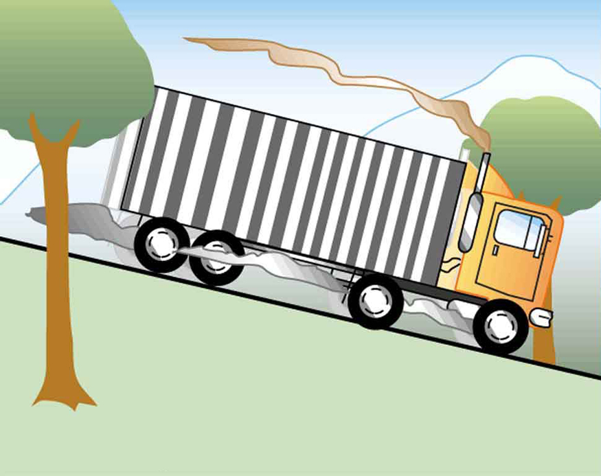

* Observe heat transfer and change in temperature and mass.
* Calculate final temperature after heat transfer between two objects.

One of the major effects of heat transfer is temperature change: heating increases the temperature while cooling decreases it. We assume that there is no phase change and that no work is done on or by the system. Experiments show that the transferred heat depends on three factors—the change in temperature, the mass of the system, and the substance and phase of the substance.

 ![Figure a shows a copper-colored cylinder of mass m and temperature change delta T. The heat Q, shown as a wavy rightward horizontal arrow, is transferred to the cylinder from the left. To the right of this image is a similar image, except that the heat transferred Q prime is twice the heat Q. The temperature change of this second cylinder, which is also labeled m, is two delta T. This cylinder is surrounded by small black wavy lines radiating outward. Figure b shows the same two cylinders as in Figure a. The left cylinder is labeled m and delta T and has a wavy heat arrow pointing at it from the left that is labeled Q. The right cylinder is labeled two m and delta T and has a wavy heat arrow pointing to it from the left labeled Q prime equals two Q. Figure c shows the same copper cylinder of mass m and with temperature change delta T, with heat Q being transferred to it. To the right of this cylinder, Q prime equals ten point eight times Q is being transferred to another cylinder filled with water whose mass and change in temperature are the same as that of the copper cylinder.](../resources/Figure_15_02_01.jpg "The heat Q size 12{Q} {} transferred to cause a temperature change depends on the magnitude of the temperature change, the mass of the system, and the substance and phase involved. (a) The amount of heat transferred is directly proportional to the temperature change. To double the temperature change of a mass m size 12{m} {}, you need to add twice the heat. (b) The amount of heat transferred is also directly proportional to the mass. To cause an equivalent temperature change in a doubled mass, you need to add twice the heat. (c) The amount of heat transferred depends on the substance and its phase. If it takes an amount Q size 12{Q} {} of heat to cause a temperature change &#x394;T size 12{&#x394;T} {} in a given mass of copper, it will take 10.8 times that amount of heat to cause the equivalent temperature change in the same mass of water assuming no phase change in either substance."){: #import-auto-id2456403 data-media-type="image/jpg"}

The dependence on temperature change and mass are easily understood. Owing to the fact that the (average) kinetic energy of an atom or molecule is proportional to the absolute temperature, the internal energy of a system is proportional to the absolute temperature and the number of atoms or molecules. Owing to the fact that the transferred heat is equal to the change in the internal energy, the heat is proportional to the mass of the substance and the temperature change. The transferred heat also depends on the substance so that, for example, the heat necessary to raise the temperature is less for alcohol than for water. For the same substance, the transferred heat also depends on the phase (gas, liquid, or solid).

Heat Transfer and Temperature Change

The quantitative relationship between heat transfer and temperature change contains all three factors:

<math xmlns="http://www.w3.org/1998/Math/MathML"> <semantics> <mrow> <mrow> <mrow> <mrow> <mi>Q</mi> <mo stretchy="false">=</mo> <mstyle fontstyle="italic"> <mrow> <mtext>mc</mtext> </mrow> </mstyle> </mrow> <mtext>Δ</mtext> <mi fontstyle="italic">T</mi> <mi>,</mi> </mrow> </mrow> <mrow /> </mrow> <annotation encoding="StarMath 5.0"> size 12{Q= ital "mc"ΔT,} {}</annotation> </semantics> </math>

where <math xmlns="http://www.w3.org/1998/Math/MathML"><semantics><mrow><mrow><mi>Q</mi></mrow><mrow /></mrow><annotation encoding="StarMath 5.0"> size 12{Q} {}</annotation></semantics></math>

 is the symbol for heat transfer, <math xmlns="http://www.w3.org/1998/Math/MathML"><semantics><mrow><mrow><mi>m</mi></mrow><mrow /></mrow><annotation encoding="StarMath 5.0"> size 12{m} {}</annotation></semantics></math>

 is the mass of the substance, and <math xmlns="http://www.w3.org/1998/Math/MathML"><semantics><mrow><mrow><mtext>Δ</mtext><mi fontstyle="italic">T</mi></mrow><mrow /></mrow></semantics></math>

 is the change in temperature. The symbol <math xmlns="http://www.w3.org/1998/Math/MathML"><semantics><mrow><mrow><mi>c</mi></mrow><mrow /></mrow><annotation encoding="StarMath 5.0"> size 12{c} {}</annotation></semantics></math>

 stands for **specific heat**{: data-type="term" #import-auto-id2514377} and depends on the material and phase. The specific heat is the amount of heat necessary to change the temperature of 1.00 kg of mass by <math xmlns="http://www.w3.org/1998/Math/MathML"><semantics><mrow><mrow><mrow><mn>1</mn><mtext>.00ºC</mtext></mrow></mrow><mrow /></mrow></semantics></math>

. The specific heat <math xmlns="http://www.w3.org/1998/Math/MathML"><semantics><mrow><mrow><mi>c</mi></mrow><mrow /></mrow></semantics></math>

 is a property of the substance; its SI unit is <math xmlns="http://www.w3.org/1998/Math/MathML"><semantics><mrow><mrow><mrow><mtext>J/</mtext><mo stretchy="false">(</mo><mrow><mtext>kg</mtext><mo stretchy="false">⋅</mo><mtext>K</mtext></mrow><mo stretchy="false">)</mo></mrow></mrow><mrow /></mrow></semantics></math>

 or <math xmlns="http://www.w3.org/1998/Math/MathML"><semantics><mrow><mrow><mrow><mtext>J/</mtext><mo stretchy="false">(</mo><mrow><mtext>kg</mtext><mo stretchy="false">⋅ºC</mo></mrow><mo stretchy="false">).</mo></mrow></mrow><mrow /></mrow></semantics></math>

 Recall that the temperature change <math xmlns="http://www.w3.org/1998/Math/MathML"><semantics><mrow><mrow><mrow><mo stretchy="false">(</mo><mtext>Δ</mtext><mi fontstyle="italic">T</mi><mo stretchy="false">)</mo></mrow></mrow><mrow /></mrow></semantics></math>

 is the same in units of kelvin and degrees Celsius. If heat transfer is measured in kilocalories, then *the unit of specific heat* is <math xmlns="http://www.w3.org/1998/Math/MathML"><semantics><mrow><mrow><mrow><mtext>kcal/</mtext><mo stretchy="false">(</mo><mrow><mtext>kg</mtext><mo stretchy="false">⋅ºC</mo></mrow><mo stretchy="false">).</mo></mrow></mrow></mrow></semantics></math>

Values of specific heat must generally be looked up in tables, because there is no simple way to calculate them. In general, the specific heat also depends on the temperature. [\[link\]](#import-auto-id1921148) lists representative values of specific heat for various substances. Except for gases, the temperature and volume dependence of the specific heat of most substances is weak. We see from this table that the specific heat of water is five times that of glass and ten times that of iron, which means that it takes five times as much heat to raise the temperature of water the same amount as for glass and ten times as much heat to raise the temperature of water as for iron. In fact, water has one of the largest specific heats of any material, which is important for sustaining life on Earth.

Calculating the Required Heat: Heating Water in an Aluminum Pan

A 0.500 kg aluminum pan on a stove is used to heat 0.250 liters of water from <math xmlns="http://www.w3.org/1998/Math/MathML"><semantics><mrow><mrow><mrow><mtext>20.0ºC</mtext></mrow></mrow><mrow /></mrow></semantics></math>

 to <math xmlns="http://www.w3.org/1998/Math/MathML"><semantics><mrow><mrow><mrow><mtext>80.0ºC</mtext></mrow></mrow><mrow /></mrow></semantics></math>

. (a) How much heat is required? What percentage of the heat is used to raise the temperature of (b) the pan and (c) the water?

**Strategy**

The pan and the water are always at the same temperature. When you put the pan on the stove, the temperature of the water and the pan is increased by the same amount. We use the equation for the heat transfer for the given temperature change and mass of water and aluminum. The specific heat values for water and aluminum are given in [\[link\]](#import-auto-id1921148).

**Solution**

Because water is in thermal contact with the aluminum, the pan and the water are at the same temperature.

1.  {: #import-auto-id862880} Calculate the temperature difference:
    

    <math xmlns="http://www.w3.org/1998/Math/MathML"><semantics><mrow><mrow><mrow><mrow><mrow><mtext>Δ</mtext><mi fontstyle="italic">T</mi><mo stretchy="false">=</mo><mrow><msub><mi>T</mi><mrow><mtext>f</mtext></mrow></msub><mo stretchy="false">−</mo><msub><mi>T</mi><mrow><mtext>i</mtext></mrow></msub></mrow></mrow><mo stretchy="false">=</mo><mtext>60.0ºC.</mtext></mrow></mrow></mrow></mrow></semantics></math>
    

2.  {: #import-auto-id2672011} Calculate the mass of water. Because the density of water is
    <math xmlns="http://www.w3.org/1998/Math/MathML"><semantics><mrow><mrow><mrow><mtext>1000</mtext><mspace width="0.25em" /><mi /><mspace width="0.25em" /><msup><mtext>kg/m</mtext><mrow><mn>3</mn></mrow></msup></mrow></mrow></mrow></semantics></math>
    
    , one liter of water has a mass of 1 kg, and the mass of 0.250 liters of water is
    <math xmlns="http://www.w3.org/1998/Math/MathML"><semantics><mrow><mrow><mrow><mrow><msub><mi>m</mi><mrow><mn>w</mn></mrow></msub><mo stretchy="false">=</mo><mn>0</mn></mrow><mtext>.</mtext><mtext>250</mtext><mi /><mspace width="0.25em" /><mtext>kg</mtext></mrow></mrow><mrow /></mrow><annotation encoding="StarMath 5.0"> size 12{m rSub { size 8{w} } =0 "." "25"`"kg"} {}</annotation></semantics></math>
    
    .
3.  {: #import-auto-id1848706} Calculate the heat transferred to the water. Use the specific heat of water in [\[link\]](#import-auto-id1921148)\:
    

    <math xmlns="http://www.w3.org/1998/Math/MathML"><semantics><mrow><mrow><mrow><mrow><msub><mi>Q</mi><mrow><mn>w</mn></mrow></msub><mo stretchy="false">=</mo><msub><mi>m</mi><mrow><mn>w</mn></mrow></msub></mrow><msub><mi>c</mi><mrow><mn>w</mn></mrow></msub><mrow><mtext>Δ</mtext><mi fontstyle="italic">T</mi><mo stretchy="false">=</mo><mfenced open="(" close=")"><mrow><mn>0</mn><mtext>.</mtext><mtext>250</mtext><mi /><mspace width="0.25em" /><mtext>kg</mtext></mrow></mfenced></mrow><mfenced open="(" close=")"><mrow><mtext>4186</mtext><mspace width="0.25em" /><mtext>J/kg</mtext><mtext>ºC</mtext></mrow></mfenced><mrow><mfenced open="(" close=")"><mrow><mtext>60.0</mtext><mtext>ºC</mtext></mrow></mfenced><mo stretchy="false">=</mo><mtext>62</mtext></mrow><mn>.8 kJ.</mn></mrow></mrow><mrow /></mrow></semantics></math>
    

4.  {: #import-auto-id2973422} Calculate the heat transferred to the aluminum. Use the specific heat for aluminum in [\[link\]](#import-auto-id1921148)\:
    

    <math xmlns="http://www.w3.org/1998/Math/MathML"><semantics><mrow><mrow><mrow><mrow><msub><mi>Q</mi><mrow><mtext>Al</mtext></mrow></msub><mo stretchy="false">=</mo><msub><mi>m</mi><mrow><mtext>Al</mtext></mrow></msub></mrow><msub><mi>c</mi><mrow><mtext>Al</mtext></mrow></msub><mrow><mtext>Δ</mtext><mi fontstyle="italic">T</mi><mo stretchy="false">=</mo><mfenced open="(" close=")"><mrow><mtext>0.500 kg</mtext></mrow></mfenced></mrow><mfenced open="(" close=")"><mrow><mtext>900 J/kgºC</mtext></mrow></mfenced><mfenced open="(" close=")"><mrow><mtext>60.0ºC</mtext></mrow></mfenced> <msup> <mtext>= 27.0 × 10</mtext> <mn>4</mn> </msup> <mtext>J = 27.0 kJ.</mtext></mrow></mrow></mrow></semantics></math>
    

5.  {: #import-auto-id1514408} Compare the percentage of heat going into the pan versus that going into the water. First, find the total transferred heat:
    

    <math xmlns="http://www.w3.org/1998/Math/MathML"><semantics><mrow><mrow><mrow><mrow><mrow><msub><mi>Q</mi><mrow><mtext>Total</mtext></mrow></msub><mo stretchy="false">=</mo><mrow><msub><mi>Q</mi><mrow><mtext>W</mtext></mrow></msub><mo stretchy="false">+</mo><msub><mi>Q</mi><mrow><mtext>Al</mtext></mrow></msub></mrow></mrow><mo stretchy="false">=</mo><mtext>62</mtext></mrow><mtext>.</mtext><mn>8</mn><mi /><mrow><mspace width="0.25em" /><mtext>kJ</mtext><mo stretchy="false">+</mo><mtext> 27</mtext></mrow><mtext>.</mtext><mn>0</mn><mi /><mspace width="0.25em" /><mspace width="0.25em" /><mtext>kJ = 89</mtext><mtext>.</mtext><mn>8</mn><mi /><mspace width="0.25em" /><mtext>kJ.</mtext></mrow></mrow><mrow /></mrow><annotation encoding="StarMath 5.0"> size 12{Q rSub { size 8{"Total"} } =Q rSub { size 8{W} } +Q rSub { size 8{"Al"} } ="62" "." 8`"kJ "+" 89" "." 5`"kJ = 152" "." 3`"kJ"} {}</annotation></semantics></math>
    

{: data-number-style="arabic"}

Thus, the amount of heat going into heating the pan is

<math xmlns="http://www.w3.org/1998/Math/MathML"><semantics><mrow><mrow><mrow><mrow><mfrac><mrow><mtext>27</mtext><mtext>.</mtext><mn>0</mn><mi /><mspace width="0.25em" /><mtext>kJ</mtext></mrow><mrow><mtext>89</mtext><mtext>.</mtext><mn>8</mn><mi /><mspace width="0.25em" /><mtext>kJ</mtext></mrow></mfrac><mo stretchy="false">×</mo><mtext>100%</mtext></mrow><mrow><mtext /><mo stretchy="false">=</mo><mtext>30.1%,</mtext></mrow><mtext /></mrow></mrow><mrow /></mrow><annotation encoding="StarMath 5.0"> size 12{ { {"62" "." 8`"kJ"} over {"152" "." 3`"kJ"} } times "100"%="41"%} {}</annotation></semantics></math>

and the amount going into heating the water is

<math xmlns="http://www.w3.org/1998/Math/MathML"> <semantics> <mrow> <mrow> <mrow> <mrow> <mfrac> <mrow> <mtext>62</mtext> <mtext>.</mtext> <mn>8</mn> <mi /> <mspace width="0.25em" /><mtext>kJ</mtext> </mrow> <mrow> <mtext>89</mtext> <mtext>.</mtext> <mn>8</mn> <mi /> <mspace width="0.25em" /><mtext>kJ</mtext> </mrow> </mfrac> <mo stretchy="false">×</mo> <mtext>100%</mtext> </mrow> <mrow> <mtext /> <mo stretchy="false">=</mo> <mtext>69.9%</mtext> </mrow> <mtext /> <mtext>.</mtext> </mrow> </mrow> <mrow /> </mrow> <annotation encoding="StarMath 5.0"> size 12{ { {"62" "." 8`"kJ"} over {"89" "." 8`"kJ"} } times "100"%="69.9"% "." } {}</annotation> </semantics> </math>

**Discussion**

In this example, the heat transferred to the container is a significant fraction of the total transferred heat. Although the mass of the pan is twice that of the water, the specific heat of water is over four times greater than that of aluminum. Therefore, it takes a bit more than twice the heat to achieve the given temperature change for the water as compared to the aluminum pan.

 {: #import-auto-id3026614 data-media-type="image/jpg"}

Calculating the Temperature Increase from the Work Done on a Substance: Truck Brakes Overheat on Downhill Runs

Truck brakes used to control speed on a downhill run do work, converting gravitational potential energy into increased internal energy (higher temperature) of the brake material. This conversion prevents the gravitational potential energy from being converted into kinetic energy of the truck. The problem is that the mass of the truck is large compared with that of the brake material absorbing the energy, and the temperature increase may occur too fast for sufficient heat to transfer from the brakes to the environment.

Calculate the temperature increase of 100 kg of brake material with an average specific heat of <math xmlns="http://www.w3.org/1998/Math/MathML"><semantics><mrow><mrow><mrow><mtext>800 J/kg</mtext><mo stretchy="false">⋅</mo><mtext>ºC</mtext></mrow></mrow><mrow /></mrow></semantics></math>

 if the material retains 10% of the energy from a 10,000-kg truck descending 75.0 m (in vertical displacement) at a constant speed.

**Strategy**

If the brakes are not applied, gravitational potential energy is converted into kinetic energy. When brakes are applied, gravitational potential energy is converted into internal energy of the brake material. We first calculate the gravitational potential energy <math xmlns="http://www.w3.org/1998/Math/MathML"><semantics><mrow><mrow><mrow><mo stretchy="false">(</mo><mstyle fontstyle="italic"><mrow><mtext>Mgh</mtext></mrow></mstyle><mo stretchy="false">)</mo></mrow></mrow><mrow /></mrow><annotation encoding="StarMath 5.0"> size 12{ \( ital "Mgh" \) } {}</annotation></semantics></math>

 that the entire truck loses in its descent and then find the temperature increase produced in the brake material alone.

**Solution**

1.  {: #import-auto-id3130222} Calculate the change in gravitational potential energy as the truck goes downhill
    

    <math xmlns="http://www.w3.org/1998/Math/MathML"><semantics><mrow><mrow><mrow><mrow><mstyle fontstyle="italic"><mrow><mtext>Mgh</mtext></mrow></mstyle><mo stretchy="false">=</mo><mfenced open="(" close=")"><mrow><mtext>10,000 kg</mtext></mrow></mfenced></mrow><mfenced open="(" close=")"><mrow><mn>9</mn><mtext>.</mtext><mtext>80 m</mtext><mi /><msup><mtext>/s</mtext><mrow><mn>2</mn></mrow></msup></mrow></mfenced><mfenced open="(" close=")"><mrow><mtext>75.0 m</mtext></mrow></mfenced><mo>=</mo><mtext>7.</mtext><mrow><mtext>35</mtext><mo stretchy="false">×</mo><msup><mtext>10</mtext><mrow><mn>6</mn></mrow></msup></mrow><mspace width="0.25em" /><mtext>J.</mtext></mrow></mrow><mrow /></mrow></semantics></math>
    

2.  {: #import-auto-id3036480} Calculate the temperature from the heat transferred using
    <math xmlns="http://www.w3.org/1998/Math/MathML"><semantics><mrow><mrow><mrow><mi>Q</mi><mtext>= </mtext><mstyle fontstyle="italic"><mrow><mtext>Mgh</mtext></mrow></mstyle></mrow></mrow><mrow /></mrow><annotation encoding="StarMath 5.0"> size 12{Q"= " ital "Mgh"} {}</annotation></semantics></math>
    
    and
    

    <math xmlns="http://www.w3.org/1998/Math/MathML"><semantics><mrow><mrow><mrow><mtext>Δ</mtext><mi fontstyle="italic">T</mi><mo stretchy="false">=</mo><mfrac><mi>Q</mi><mstyle fontstyle="italic"><mrow><mtext>mc</mtext></mrow></mstyle></mfrac></mrow></mrow><mrow /><mrow><mtext>,</mtext></mrow></mrow><annotation encoding="StarMath 5.0"> size 12{ΔT= { {Q} over { ital "mc"} } } {}</annotation></semantics></math>
    

    
    where <math xmlns="http://www.w3.org/1998/Math/MathML"><semantics><mrow><mi>m</mi></mrow></semantics></math>
    
     is the mass of the brake material. Insert the values <math xmlns="http://www.w3.org/1998/Math/MathML"><semantics><mrow><mrow><mi>m</mi><mo>=</mo><mtext>100 kg</mtext></mrow></mrow></semantics></math>
    
     and <math xmlns="http://www.w3.org/1998/Math/MathML"><semantics><mrow><mrow><mi>c</mi><mo stretchy="false">=</mo><mtext>800 J/kg</mtext><mo>⋅</mo><mtext>ºC</mtext></mrow></mrow></semantics></math>
    
     to find
    
    

    <math xmlns="http://www.w3.org/1998/Math/MathML"><semantics><mrow><mrow><mrow><mrow><mrow><mtext>Δ</mtext><mi fontstyle="italic">T</mi><mo stretchy="false">=</mo><mfrac><mrow><mfenced open="(" close=")"><mrow> <mn>7</mn><mtext>.35</mtext><mo stretchy="false">×</mo><msup><mtext>10</mtext><mrow><mn>6</mn></mrow></msup><mspace width="0.25em" /><mtext>J</mtext></mrow></mfenced></mrow><mrow><mfenced open="(" close=")"><mrow><mtext>100 kg</mtext></mrow></mfenced><mfenced open="(" close=")"><mrow><mtext>800 J/kgºC</mtext></mrow></mfenced></mrow></mfrac></mrow><mo stretchy="false">=</mo><mtext>92ºC.</mtext></mrow></mrow></mrow><mrow /></mrow></semantics></math>
    

{: data-number-style="arabic"}

**Discussion**

This temperature is close to the boiling point of water. If the truck had been traveling for some time, then just before the descent, the brake temperature would likely be higher than the ambient temperature. The temperature increase in the descent would likely raise the temperature of the brake material above the boiling point of water, so this technique is not practical. However, the same idea underlies the recent hybrid technology of cars, where mechanical energy (gravitational potential energy) is converted by the brakes into electrical energy (battery).

<table id="import-auto-id1921148" summary="Specific Heats of Various Substances"><caption>Specific HeatsThe values for solids and liquids are at constant volume and at <math xmlns="http://www.w3.org/1998/Math/MathML"><semantics><mrow><mrow><mrow><mtext>25ºC</mtext></mrow></mrow></mrow></semantics></math>, except as noted. of Various Substances</caption><thead><tr>
            <th>
              <strong>Substances</strong>
            </th>
            <th colspan="2"><strong>Specific heat</strong> (<em>c</em>)</th>
             </tr></thead><tbody><tr>
            <td>Solids</td>
            <td>J/kg⋅ºC</td>
            <td>kcal/kg⋅ºCThese values are identical in units of <math xmlns="http://www.w3.org/1998/Math/MathML"><semantics><mrow><mrow><mrow><mrow><mtext>cal/g</mtext><mo stretchy="false">⋅ºC</mo></mrow></mrow></mrow><mrow /></mrow></semantics></math>.
            </td>
          </tr><tr>
            <td>Aluminum</td>
            <td>900</td>
            <td>0.215</td>
          </tr><tr>
            <td>Asbestos</td>
            <td>800</td>
            <td>0.19</td>
          </tr><tr>
            <td>Concrete, granite (average)</td>
            <td>840</td>
            <td>0.20</td>
          </tr><tr>
            <td>Copper</td>
            <td>387</td>
            <td>0.0924</td>
          </tr><tr>
            <td>Glass</td>
            <td>840</td>
            <td>0.20</td>
          </tr><tr>
            <td>Gold</td>
            <td>129</td>
            <td>0.0308</td>
          </tr><tr>
              <td>Human body (average at 37 °C)</td>
            <td>3500</td>
            <td>0.83</td>
          </tr><tr>
              <td>Ice (average, -50°C to 0°C)</td>
            <td>2090</td>
            <td>0.50</td>
          </tr><tr>
            <td>Iron, steel</td>
            <td>452</td>
            <td>0.108</td>
          </tr><tr>
            <td>Lead</td>
            <td>128</td>
            <td>0.0305</td>
          </tr><tr>
            <td>Silver</td>
            <td>235</td>
            <td>0.0562</td>
          </tr><tr>
            <td>Wood</td>
            <td>1700</td>
            <td>0.4</td>
          </tr><tr>
            <td>
              <em>Liquids</em>
            </td>
            <td />
            <td />
          </tr><tr>
            <td>Benzene</td>
            <td>1740</td>
            <td>0.415</td>
          </tr><tr>
            <td>Ethanol</td>
            <td>2450</td>
            <td>0.586</td>
          </tr><tr>
            <td>Glycerin</td>
            <td>2410</td>
            <td>0.576</td>
          </tr><tr>
            <td>Mercury</td>
            <td>139</td>
            <td>0.0333</td>
          </tr><tr>
              <td>Water (15.0 °C)</td>
            <td>4186</td>
            <td>1.000</td>
          </tr><tr>
            <td>
             <em>Gases</em>
<math xmlns="http://www.w3.org/1998/Math/MathML"><semantics><mrow><mrow><msub><mi>c</mi><mrow><mtext>v</mtext></mrow></msub></mrow><mrow /></mrow></semantics></math> at constant volume and at <math xmlns="http://www.w3.org/1998/Math/MathML"><semantics><mrow><mrow><mrow><mtext>20</mtext><mtext>.</mtext><mn>0ºC</mn></mrow></mrow><mrow /></mrow></semantics></math>, except as noted, and at 1.00 atm average pressure. Values in parentheses are <math xmlns="http://www.w3.org/1998/Math/MathML"><semantics><mrow><mrow><msub><mi>c</mi><mrow><mtext>p</mtext></mrow></msub></mrow><mrow /></mrow></semantics></math> at a constant pressure of 1.00 atm.
            </td>
            <td />
            <td />
          </tr><tr>
            <td>Air (dry)</td>
            <td>721 (1015)</td>
            <td>0.172 (0.242)</td>
          </tr><tr>
            <td>Ammonia</td>
            <td>1670 (2190)</td>
            <td>0.399 (0.523)</td>
          </tr><tr>
            <td>Carbon dioxide</td>
            <td>638 (833)</td>
            <td>0.152 (0.199)</td>
          </tr><tr>
            <td>Nitrogen</td>
            <td>739 (1040)</td>
            <td>0.177 (0.248)</td>
          </tr><tr>
            <td>Oxygen</td>
            <td>651 (913)</td>
            <td>0.156 (0.218)</td>
          </tr><tr>
              <td>Steam (100°C)</td>
            <td>1520 (2020)</td>
            <td>0.363 (0.482)</td>
          </tr></tbody></table>

Note that [\[link\]](#fs-id3101672) is an illustration of the mechanical equivalent of heat. Alternatively, the temperature increase could be produced by a blow torch instead of mechanically.

Calculating the Final Temperature When Heat Is Transferred Between Two Bodies: Pouring Cold Water in a Hot Pan

Suppose you pour 0.250 kg of <math xmlns="http://www.w3.org/1998/Math/MathML"><semantics><mrow><mrow><mrow><mtext>20</mtext><mtext>.0ºC</mtext></mrow></mrow><mrow /></mrow></semantics></math>

 water (about a cup) into a 0.500-kg aluminum pan off the stove with a temperature of <math xmlns="http://www.w3.org/1998/Math/MathML"><semantics><mrow><mrow><mrow><mtext>150ºC</mtext></mrow></mrow><mrow /></mrow></semantics></math>

. Assume that the pan is placed on an insulated pad and that a negligible amount of water boils off. What is the temperature when the water and pan reach thermal equilibrium a short time later?

**Strategy**

The pan is placed on an insulated pad so that little heat transfer occurs with the surroundings. Originally the pan and water are not in thermal equilibrium: the pan is at a higher temperature than the water. Heat transfer then restores thermal equilibrium once the water and pan are in contact. Because heat transfer between the pan and water takes place rapidly, the mass of evaporated water is negligible and the magnitude of the heat lost by the pan is equal to the heat gained by the water. The exchange of heat stops once a thermal equilibrium between the pan and the water is achieved. The heat exchange can be written as <math xmlns="http://www.w3.org/1998/Math/MathML"><semantics><mrow><mrow><mrow><mo stretchy="false">∣</mo><msub><mi>Q</mi><mrow><mtext>hot</mtext></mrow></msub><mrow><mo stretchy="false">∣</mo><mo stretchy="false">=</mo><msub><mi>Q</mi><mrow><mtext>cold</mtext></mrow></msub></mrow></mrow></mrow><mrow /></mrow><annotation encoding="StarMath 5.0"> size 12{ \lline Q rSub { size 8{"hot"} } \lline =Q rSub { size 8{"cold"} } } {}</annotation></semantics></math>

.

**Solution**

1.  {: #import-auto-id3197158} Use the equation for heat transfer
    <math xmlns="http://www.w3.org/1998/Math/MathML"><semantics><mrow><mrow><mrow><mrow><mi>Q</mi><mo stretchy="false">=</mo><mstyle fontstyle="italic"><mrow><mtext>mc</mtext></mrow></mstyle></mrow><mtext>Δ</mtext><mi fontstyle="italic">T</mi></mrow></mrow><mrow /></mrow><annotation encoding="StarMath 5.0"> size 12{Q= ital "mc"ΔT} {}</annotation></semantics></math>
    
    to express the heat lost by the aluminum pan in terms of the mass of the pan, the specific heat of aluminum, the initial temperature of the pan, and the final temperature:
    

    <math xmlns="http://www.w3.org/1998/Math/MathML"><semantics><mrow><mrow><mrow><mrow><msub><mi>Q</mi><mrow><mtext>hot</mtext></mrow></msub><mo stretchy="false">=</mo><msub><mi>m</mi><mrow><mtext>Al</mtext></mrow></msub></mrow><msub><mi>c</mi><mrow><mtext>Al</mtext></mrow></msub><mfenced open="(" close=")"><mrow><mrow><msub><mi>T</mi><mrow><mtext>f</mtext></mrow></msub><mo stretchy="false">−</mo><mtext>150ºC</mtext></mrow></mrow></mfenced></mrow></mrow><mrow /><mrow><mtext>.</mtext></mrow></mrow></semantics></math>
    

2.  {: #import-auto-id1861449} Express the heat gained by the water in terms of the mass of the water, the specific heat of water, the initial temperature of the water and the final temperature:
    

    <math xmlns="http://www.w3.org/1998/Math/MathML"><semantics><mrow><mrow><mrow><mrow><msub><mi>Q</mi><mrow><mtext>cold</mtext></mrow></msub><mo stretchy="false">=</mo><msub><mi>m</mi><mrow><mn>W</mn></mrow></msub></mrow><msub><mi>c</mi><mrow><mn>W</mn></mrow></msub><mfenced open="(" close=")"><mrow><mrow><msub><mi>T</mi><mrow><mtext>f</mtext></mrow></msub><mo stretchy="false">−</mo></mrow><mtext>20.0ºC</mtext></mrow></mfenced></mrow></mrow><mrow><mtext>.</mtext></mrow></mrow></semantics></math>
    

3.  {: #import-auto-id2382813} Note that
    <math xmlns="http://www.w3.org/1998/Math/MathML"><semantics><mrow><mrow><mrow><msub><mi>Q</mi><mrow><mtext>hot</mtext></mrow></msub><mo stretchy="false">&lt;</mo><mn>0</mn></mrow></mrow><mrow /></mrow><annotation encoding="StarMath 5.0"> size 12{Q rSub { size 8{"hot"} } &lt;0} {}</annotation></semantics></math>
    
    and
    <math xmlns="http://www.w3.org/1998/Math/MathML"><semantics><mrow><mrow><mrow><msub><mi>Q</mi><mrow><mtext>cold</mtext></mrow></msub><mo stretchy="false">&gt;</mo><mn>0</mn></mrow></mrow><mrow /></mrow><annotation encoding="StarMath 5.0"> size 12{Q rSub { size 8{"cold"} } &gt;0} {}</annotation></semantics></math>
    
    and that they must sum to zero because the heat lost by the hot pan must be the same as the heat gained by the cold water:
    

    <math xmlns="http://www.w3.org/1998/Math/MathML"><semantics><mrow><mrow><mtable columnalign="left"><mtr> <mtd columnalign="right"> <msub> <mi>Q</mi> <mrow> <mtext>cold</mtext> </mrow> </msub> <mtext> + </mtext> <msub> <mi>Q</mi> <mrow> <mtext>hot</mtext> </mrow> </msub> </mtd> <mtd> <mtext>=</mtext> </mtd> <mtd> <mtext>0,</mtext> </mtd></mtr> <mtr><mtd columnalign="right"> <msub> <mi>Q</mi> <mrow> <mtext>cold</mtext> </mrow> </msub> </mtd> <mtd> <mo> = </mo> </mtd> <mtd> <mrow> <msub> <mtext>–Q</mtext> <mrow> <mtext>hot</mtext> </mrow> </msub> </mrow> <mi>,</mi> </mtd> </mtr> <mtr> <mtd> <msub> <mi>m</mi> <mrow> <mn>W</mn> </mrow> </msub> <msub> <mi>c</mi> <mrow> <mn>W</mn> </mrow> </msub> <mrow> <mfenced open="(" close=")"> <mrow> <mrow> <msub> <mi>T</mi> <mrow> <mtext>f</mtext> </mrow> </msub> <mo stretchy="false">−</mo> <mtext>20.0ºC</mtext> </mrow> </mrow> </mfenced></mrow> </mtd> <mtd> <mo stretchy="false">=</mo> </mtd> <mtd> <msub> <mi>−m</mi> <mrow> <mi>Al</mi> </mrow> </msub> <msub> <mi>c</mi> <mrow> <mi>Al</mi> </mrow> </msub> <mfenced open="(" close=")"> <mrow> <mrow> <msub> <mi>T</mi> <mrow> <mtext>f</mtext> </mrow> </msub> <mo stretchy="false">−</mo> <mtext>150ºC.</mtext> </mrow> </mrow> </mfenced> </mtd> </mtr></mtable><mrow /></mrow></mrow></semantics></math>
    

4.  {: #import-auto-id2678348} This an equation for the unknown final temperature,
    <math xmlns="http://www.w3.org/1998/Math/MathML"><semantics><mrow><mrow><msub><mi>T</mi><mrow><mtext>f</mtext></mrow></msub></mrow><mrow /></mrow><annotation encoding="StarMath 5.0"> size 12{T rSub { size 8{f} } } {}</annotation></semantics></math>

5.  {: #import-auto-id1570030} Bring all terms involving
    <math xmlns="http://www.w3.org/1998/Math/MathML"><semantics><mrow><mrow><msub><mi>T</mi><mrow><mtext>f</mtext></mrow></msub></mrow><mrow /></mrow><annotation encoding="StarMath 5.0"> size 12{T rSub { size 8{f} } } {}</annotation></semantics></math>
    
    on the left hand side and all other terms on the right hand side. Solve for
    <math xmlns="http://www.w3.org/1998/Math/MathML"><semantics><mrow><mrow><msub><mi>T</mi><mrow><mtext>f</mtext></mrow></msub></mrow><mrow /></mrow><annotation encoding="StarMath 5.0"> size 12{T rSub { size 8{f} } } {}</annotation></semantics></math>
    
    ,
    

    <math xmlns="http://www.w3.org/1998/Math/MathML"><semantics><mrow><mrow><mrow><msub><mi>T</mi><mrow><mtext>f</mtext></mrow></msub><mo stretchy="false">=</mo><mfrac><mrow><msub><mi>m</mi><mrow><mtext>Al</mtext></mrow></msub><msub><mi>c</mi><mrow><mtext>Al</mtext></mrow></msub><mrow><mfenced open="(" close=")"><mrow><mtext>150ºC</mtext></mrow></mfenced><mo stretchy="false">+</mo><msub><mi>m</mi><mrow><mn>W</mn></mrow></msub></mrow><msub><mi>c</mi><mrow><mn>W</mn></mrow></msub><mfenced open="(" close=")"><mrow><mtext>20</mtext><mtext>.0ºC</mtext></mrow></mfenced></mrow><mrow><msub><mi>m</mi><mrow><mtext>Al</mtext></mrow></msub><mrow><msub><mi>c</mi><mrow><mtext>Al</mtext></mrow></msub><mo stretchy="false">+</mo><msub><mi>m</mi><mrow><mn>W</mn></mrow></msub></mrow><msub><mi>c</mi><mrow><mn>W</mn></mrow></msub></mrow></mfrac></mrow></mrow><mrow><mtext>,</mtext></mrow></mrow></semantics></math>
    

    
    and insert the numerical values:
    
    

    <math xmlns="http://www.w3.org/1998/Math/MathML"> <semantics> <mrow><mrow> <mtable columnalign="left"> <mtr> <mtd> <msub> <mi>T</mi> <mtext>f</mtext> </msub> </mtd> <mtd> <mo stretchy="false">=</mo> </mtd> <mtd> <mfrac> <mrow> <mfenced open="(" close=")"> <mrow> <mtext>0.500 kg</mtext> </mrow> </mfenced> <mfenced open="(" close=")"> <mrow> <mtext>900 J/kgºC</mtext> </mrow> </mfenced> <mfenced open="(" close=")"> <mrow> <mtext>150ºC</mtext> </mrow> </mfenced> <mtext>+</mtext> <mfenced open="(" close=")"> <mtext>0.250 kg</mtext> </mfenced> <mfenced open="(" close=")"><mtext>4186 J/kgºC</mtext></mfenced> <mfenced open="(" close=")"><mtext>20.0ºC</mtext></mfenced> </mrow> <mrow> <mfenced open="(" close=")"><mtext>0.500 kg</mtext></mfenced> <mrow> <mfenced open="(" close=")"><mtext>900 J/kgºC</mtext></mfenced> <mo stretchy="false">+</mo><mfenced open="(" close=")"> <mrow> <mtext>0.250 kg</mtext> </mrow> </mfenced> </mrow> <mfenced open="(" close=")"><mtext>4186 J/kgºC</mtext></mfenced> </mrow> </mfrac> </mtd> </mtr> <mtr> <mtd> </mtd> <mtd> <mo stretchy="false">=</mo> </mtd> <mtd> <mfrac> <mrow> <mtext>88430 J</mtext> </mrow> <mrow> <mtext>1496.5 J/ºC</mtext> </mrow> </mfrac> </mtd> </mtr> <mtr> <mtd> </mtd> <mtd> <mo stretchy="false">=</mo></mtd> <mtd> <mtext>59</mtext> <mtext>.1ºC.</mtext> </mtd> </mtr></mtable></mrow> <mrow /></mrow></semantics></math>
    

{: data-number-style="arabic"}

**Discussion**

This is a typical *calorimetry* problem—two bodies at different temperatures are brought in contact with each other and exchange heat until a common temperature is reached. Why is the final temperature so much closer to <math xmlns="http://www.w3.org/1998/Math/MathML"><semantics><mrow><mrow><mrow><mtext>20.0ºC</mtext></mrow></mrow><mrow /></mrow></semantics></math>

 than <math xmlns="http://www.w3.org/1998/Math/MathML"><semantics><mrow><mrow><mrow><mtext>150ºC</mtext></mrow></mrow><mrow /></mrow></semantics></math>

? The reason is that water has a greater specific heat than most common substances and thus undergoes a small temperature change for a given heat transfer. A large body of water, such as a lake, requires a large amount of heat to increase its temperature appreciably. This explains why the temperature of a lake stays relatively constant during a day even when the temperature change of the air is large. However, the water temperature does change over longer times (e.g., summer to winter).

Take-Home Experiment: Temperature Change of Land and Water

What heats faster, land or water?

To study differences in heat capacity:

* {: #import-auto-id1917983} Place equal masses of dry sand (or soil) and water at the same temperature into two small jars. (The average density of soil or sand is about 1.6 times that of water, so you can achieve approximately equal masses by using
  <math xmlns="http://www.w3.org/1998/Math/MathML"><semantics><mrow><mrow><mtext>50% </mtext></mrow><mrow /></mrow><annotation encoding="StarMath 5.0"> size 12{"50% "} {}</annotation></semantics></math>
  
  more water by volume.)
* {: #import-auto-id3025674} Heat both (using an oven or a heat lamp) for the same amount of time.
* {: #import-auto-id3045349} Record the final temperature of the two masses.
* {: #import-auto-id1414223} Now bring both jars to the same temperature by heating for a longer period of time.
* {: #import-auto-id1930222} Remove the jars from the heat source and measure their temperature every 5 minutes for about 30 minutes.

Which sample cools off the fastest? This activity replicates the phenomena responsible for land breezes and sea breezes.

Check Your Understanding

If 25 kJ is necessary to raise the temperature of a block from <math xmlns="http://www.w3.org/1998/Math/MathML"><semantics><mrow><mrow><mrow><mtext>25ºC</mtext></mrow></mrow><mrow /></mrow></semantics></math>

 to <math xmlns="http://www.w3.org/1998/Math/MathML"><semantics><mrow><mrow><mrow><mtext>30ºC</mtext></mrow></mrow><mrow /></mrow></semantics></math>

, how much heat is necessary to heat the block from <math xmlns="http://www.w3.org/1998/Math/MathML"><semantics><mrow><mrow><mrow><mtext>45ºC</mtext></mrow></mrow><mrow /></mrow></semantics></math>

 to <math xmlns="http://www.w3.org/1998/Math/MathML"><semantics><mrow><mrow><mrow><mtext>50ºC</mtext></mrow></mrow><mrow /></mrow></semantics></math>

?

The heat transfer depends only on the temperature difference. Since the temperature differences are the same in both cases, the same 25 kJ is necessary in the second case.

# Summary

* {: #import-auto-id1823260} The transfer of heat
  <math xmlns="http://www.w3.org/1998/Math/MathML"><semantics><mrow><mrow><mi>Q</mi></mrow><mrow /></mrow><annotation encoding="StarMath 5.0"> size 12{Q} {}</annotation></semantics></math>
  
  that leads to a change
  <math xmlns="http://www.w3.org/1998/Math/MathML"><semantics><mrow><mrow><mtext>Δ</mtext><mi fontstyle="italic">T</mi></mrow><mrow /></mrow><annotation encoding="StarMath 5.0"> size 12{ΔT} {}</annotation></semantics></math>
  
  in the temperature of a body with mass
  <math xmlns="http://www.w3.org/1998/Math/MathML"><semantics><mrow><mrow><mi>m</mi></mrow><mrow /></mrow><annotation encoding="StarMath 5.0"> size 12{m} {}</annotation></semantics></math>
  
  is
  <math xmlns="http://www.w3.org/1998/Math/MathML"><semantics><mrow><mrow><mrow><mrow><mi>Q</mi><mo stretchy="false">=</mo><mstyle fontstyle="italic"><mrow><mtext>mc</mtext></mrow></mstyle></mrow><mtext>Δ</mtext><mi fontstyle="italic">T</mi></mrow></mrow><mrow /></mrow><annotation encoding="StarMath 5.0"> size 12{Q= ital "mc"ΔT} {}</annotation></semantics></math>
  
  , where
  <math xmlns="http://www.w3.org/1998/Math/MathML"><semantics><mrow><mrow><mi>c</mi></mrow><mrow /></mrow><annotation encoding="StarMath 5.0"> size 12{c} {}</annotation></semantics></math>
  
  is the specific heat of the material. This relationship can also be considered as the definition of specific heat.

# Conceptual Questions

What three factors affect the heat transfer that is necessary to change an object’s temperature?

The brakes in a car increase in temperature by <math xmlns="http://www.w3.org/1998/Math/MathML"><semantics><mrow><mrow><mtext>Δ</mtext><mi fontstyle="italic">T</mi></mrow><mrow /></mrow><annotation encoding="StarMath 5.0"> size 12{ΔT} {}</annotation></semantics></math>

 when bringing the car to rest from a speed <math xmlns="http://www.w3.org/1998/Math/MathML"><semantics><mrow><mrow><mi>v</mi></mrow><mrow /></mrow><annotation encoding="StarMath 5.0"> size 12{v} {}</annotation></semantics></math>

. How much greater would <math xmlns="http://www.w3.org/1998/Math/MathML"><semantics><mrow><mrow><mtext>Δ</mtext><mi fontstyle="italic">T</mi></mrow><mrow /></mrow><annotation encoding="StarMath 5.0"> size 12{ΔT} {}</annotation></semantics></math>

 be if the car initially had twice the speed? You may assume the car to stop sufficiently fast so that no heat transfers out of the brakes.

# Problems &amp; Exercises

On a hot day, the temperature of an 80,000-L swimming pool increases by <math xmlns="http://www.w3.org/1998/Math/MathML"><semantics><mrow><mrow><mrow><mn>1</mn><mtext>.</mtext><mtext>50ºC</mtext></mrow></mrow><mrow /></mrow><annotation encoding="StarMath 5.0"> size 12{1 "." "50"°C} {}</annotation></semantics></math>

. What is the net heat transfer during this heating? Ignore any complications, such as loss of water by evaporation.

<math xmlns="http://www.w3.org/1998/Math/MathML"> <semantics> <mrow> <mrow> <mrow> <mn>5</mn> <mtext>.</mtext> <mrow> <mtext>02</mtext> <mo stretchy="false">×</mo> <msup> <mtext>10</mtext> <mrow> <mn>8</mn> </mrow> </msup> </mrow> <mspace width="0.25em" /> <mtext>J</mtext> </mrow> </mrow> <mrow /> </mrow> <annotation encoding="StarMath 5.0"> size 12{5 "." "02" times "10" rSup { size 8{8} } `J} {}</annotation> </semantics> </math>

Show that <math xmlns="http://www.w3.org/1998/Math/MathML"><semantics><mrow><mrow><mrow><mn>1</mn><mi /><mrow><mspace width="0.25em" /><mtext>cal/g</mtext><mo stretchy="false">⋅</mo><mtext>ºC</mtext><mo stretchy="false">=</mo><mn>1</mn></mrow><mi /><mrow><mspace width="0.25em" /><mtext>kcal/kg</mtext><mo stretchy="false">⋅</mo></mrow><mtext>ºC</mtext></mrow></mrow><mrow /></mrow><annotation encoding="StarMath 5.0"> size 12{1`"cal/g" cdot °C=1`"kcal/kg" cdot °C} {}</annotation></semantics></math>

.

To sterilize a 50.0-g glass baby bottle, we must raise its temperature from <math xmlns="http://www.w3.org/1998/Math/MathML"><semantics><mrow><mrow><mrow><mtext>22</mtext><mtext>.</mtext><mn>0</mn><mtext>ºC</mtext></mrow></mrow><mrow /></mrow></semantics></math>

 to <math xmlns="http://www.w3.org/1998/Math/MathML"><semantics><mrow><mrow><mrow><mtext>95</mtext><mtext>.</mtext><mn>0º</mn><mtext>C</mtext></mrow></mrow><mrow /></mrow></semantics></math>

. How much heat transfer is required?

<math xmlns="http://www.w3.org/1998/Math/MathML"> <semantics> <mrow> <mrow> <mrow> <mtext>3.</mtext> <mrow> <mtext>07</mtext> <mo stretchy="false">×</mo> <msup> <mtext>10</mtext> <mrow> <mn>3</mn> </mrow> </msup> </mrow> <mspace width="0.25em" /> <mtext>J</mtext> </mrow> </mrow> </mrow> </semantics> </math>

The same heat transfer into identical masses of different substances produces different temperature changes. Calculate the final temperature when 1.00 kcal of heat transfers into 1.00 kg of the following, originally at <math xmlns="http://www.w3.org/1998/Math/MathML"><semantics><mrow><mrow><mrow><mtext>20</mtext><mtext>.</mtext><mn>0º</mn><mtext>C</mtext></mrow></mrow><mrow /></mrow></semantics></math>

: (a) water; (b) concrete; (c) steel; and (d) mercury.

Rubbing your hands together warms them by converting work into thermal energy. If a woman rubs her hands back and forth for a total of 20 rubs, at a distance of 7.50 cm per rub, and with an average frictional force of 40.0 N, what is the temperature increase? The mass of tissues warmed is only 0.100 kg, mostly in the palms and fingers.

<math xmlns="http://www.w3.org/1998/Math/MathML"> <semantics> <mrow> <mrow> <mrow> <mn>0</mn> <mtext>.</mtext> <mtext>171º</mtext> <mtext>C</mtext> </mrow> </mrow> <mrow /> </mrow> <annotation encoding="StarMath 5.0"> size 12{0 "." "171"°C} {}</annotation> </semantics> </math>

A 0.250-kg block of a pure material is heated from <math xmlns="http://www.w3.org/1998/Math/MathML"><semantics><mrow><mrow><mrow><mtext>20</mtext><mtext>.</mtext><mn>0º</mn><mtext>C</mtext></mrow></mrow><mrow /></mrow><annotation encoding="StarMath 5.0"> size 12{"20" "." 0°C} {}</annotation></semantics></math>

 to <math xmlns="http://www.w3.org/1998/Math/MathML"><semantics><mrow><mrow><mrow><mtext>65</mtext><mtext>.</mtext><mn>0º</mn><mtext>C</mtext></mrow></mrow><mrow /></mrow><annotation encoding="StarMath 5.0"> size 12{"65" "." 0°C} {}</annotation></semantics></math>

 by the addition of 4.35 kJ of energy. Calculate its specific heat and identify the substance of which it is most likely composed.

Suppose identical amounts of heat transfer into different masses of copper and water, causing identical changes in temperature. What is the ratio of the mass of copper to water?

10\.8

(a) The number of kilocalories in food is determined by calorimetry techniques in which the food is burned and the amount of heat transfer is measured. How many kilocalories per gram are there in a 5.00-g peanut if the energy from burning it is transferred to 0.500 kg of water held in a 0.100-kg aluminum cup, causing a <math xmlns="http://www.w3.org/1998/Math/MathML"><semantics><mrow><mrow><mrow><mtext>54</mtext><mtext>.</mtext><mn>9º</mn><mtext>C</mtext></mrow></mrow><mrow /></mrow></semantics></math>

 temperature increase? (b) Compare your answer to labeling information found on a package of peanuts and comment on whether the values are consistent.

Following vigorous exercise, the body temperature of an 80.0-kg person is <math xmlns="http://www.w3.org/1998/Math/MathML"><semantics><mrow><mrow><mrow><mtext>40</mtext><mtext>.</mtext><mn>0º</mn><mtext>C</mtext></mrow></mrow><mrow /></mrow></semantics></math>

. At what rate in watts must the person transfer thermal energy to reduce the the body temperature to <math xmlns="http://www.w3.org/1998/Math/MathML"><semantics><mrow><mrow><mrow><mtext>37</mtext><mtext>.</mtext><mn>0º</mn><mtext>C</mtext></mrow></mrow><mrow /></mrow></semantics></math>

 in 30.0 min, assuming the body continues to produce energy at the rate of 150 W? <math xmlns="http://www.w3.org/1998/Math/MathML"><semantics><mfenced open="(" close=")"><mrow><mrow><mrow><mtext>1 watt = 1 joule/second or 1 W = 1 J/s</mtext><mi /><mspace width="0.25em" /></mrow></mrow><mrow /></mrow></mfenced></semantics></math>

.

617 W

Even when shut down after a period of normal use, a large commercial nuclear reactor transfers thermal energy at the rate of 150 MW by the radioactive decay of fission products. This heat transfer causes a rapid increase in temperature if the cooling system fails <math xmlns="http://www.w3.org/1998/Math/MathML"><semantics><mrow><mrow><mrow><mo stretchy="false">(</mo><mtext>1 watt = 1 joule/second or 1 W = 1 J/s and 1 MW = 1 megawatt</mtext><mo stretchy="false">)</mo></mrow></mrow><mrow /></mrow></semantics></math>

. (a) Calculate the rate of temperature increase in degrees Celsius per second <math xmlns="http://www.w3.org/1998/Math/MathML"><semantics><mrow><mrow><mo stretchy="false">(</mo><mtext>ºC/s</mtext><mo stretchy="false">)</mo></mrow></mrow></semantics></math>

 if the mass of the reactor core is <math xmlns="http://www.w3.org/1998/Math/MathML"><semantics><mrow><mrow><mrow><mn>1</mn><mtext>.</mtext><mrow><mtext>60</mtext><mo stretchy="false">×</mo><msup><mtext>10</mtext><mrow><mn>5</mn></mrow></msup></mrow><mspace width="0.25em" /><mtext>kg</mtext></mrow></mrow></mrow></semantics></math>

 and it has an average specific heat of <math xmlns="http://www.w3.org/1998/Math/MathML"><semantics><mrow><mrow><mtext>0.3349 kJ/kgº</mtext><mo stretchy="false">⋅</mo><mtext>C</mtext></mrow></mrow></semantics></math>

. (b) How long would it take to obtain a temperature increase of <math xmlns="http://www.w3.org/1998/Math/MathML"><semantics><mrow><mrow><mrow><mtext>2000º</mtext><mtext>C</mtext></mrow></mrow></mrow></semantics></math>

, which could cause some metals holding the radioactive materials to melt? (The initial rate of temperature increase would be greater than that calculated here because the heat transfer is concentrated in a smaller mass. Later, however, the temperature increase would slow down because the <math xmlns="http://www.w3.org/1998/Math/MathML"><semantics><mrow><mrow><mrow><mrow><mn>5</mn><mo stretchy="false">×</mo><msup><mtext>10</mtext><mrow><mn>5</mn></mrow></msup></mrow><mtext>-kg</mtext></mrow></mrow><mrow /></mrow></semantics></math>

 steel containment vessel would also begin to heat up.)

"){: #import-auto-id864880 data-media-type="image/jpg"}

