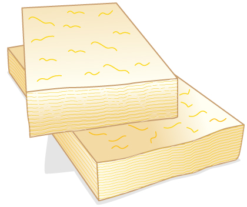

* Calculate thermal conductivity.
* Observe conduction of heat in collisions.
* Study thermal conductivities of common substances.

  and from the outside to the inside (in summers). (credit: Giles Douglas)"){: #import-auto-id3229112 data-media-type="image/jpg" height="250"}

Your feet feel cold as you walk barefoot across the living room carpet in your cold house and then step onto the kitchen tile floor. This result is intriguing, since the carpet and tile floor are both at the same temperature. The different sensation you feel is explained by the different rates of heat transfer: the heat loss during the same time interval is greater for skin in contact with the tiles than with the carpet, so the temperature drop is greater on the tiles.

Some materials conduct thermal energy faster than others. In general, good conductors of electricity (metals like copper, aluminum, gold, and silver) are also good heat conductors, whereas insulators of electricity (wood, plastic, and rubber) are poor heat conductors. [\[link\]](#import-auto-id2663815) shows molecules in two bodies at different temperatures. The (average) kinetic energy of a molecule in the hot body is higher than in the colder body. If two molecules collide, an energy transfer from the hot to the cold molecule occurs. The cumulative effect from all collisions results in a net flux of heat from the hot body to the colder body. The heat flux thus depends on the temperature difference <math xmlns="http://www.w3.org/1998/Math/MathML"><semantics><mrow><mrow><mrow><mtext>Δ</mtext><mi fontstyle="italic">Τ</mi><mo stretchy="false">=</mo><mrow><msub><mi>Τ</mi><mrow><mtext>hot</mtext></mrow></msub><mo stretchy="false">−</mo><msub><mi>T</mi><mrow><mtext>cold</mtext></mrow></msub></mrow></mrow></mrow><mrow /></mrow><annotation encoding="StarMath 5.0"> size 12{ΔΤ=Τ rSub { size 8{"hot"} } - T rSub { size 8{"cold"} } } {}</annotation></semantics></math>

. Therefore, you will get a more severe burn from boiling water than from hot tap water. Conversely, if the temperatures are the same, the net heat transfer rate falls to zero, and equilibrium is achieved. Owing to the fact that the number of collisions increases with increasing area, heat conduction depends on the cross-sectional area. If you touch a cold wall with your palm, your hand cools faster than if you just touch it with your fingertip.

![The figure shows a vertical line labeled &#x201C;surface&#x201D; that divides the figure in two. Just below the line is a horizontal rightward wavy arrow labeled Q, heat conduction. The area left of the surface line is labeled higher temperature and the area right of the surface line is labeled lower temperature. One spherical object, labeled &#x201C;high energy before collision&#x201D; is on the left bottom side, with an arrow from it pointing to the right and up toward the vertical midpoint of the surface line. There is another spherical object at the top left side close to the surface line with an arrow from it pointing to the left and up. A third spherical object labeled &#x201C;low energy before collision&#x201D; appears on the right top side with an arrow pointing from it to the left and down toward the vertical midpoint of the surface line. There is a final spherical object at the lower right side close to the surface line with an arrow pointing from it to the right and down. There are dotted lines coming from all the four particles, merging at the midpoint on the surface line.](../resources/Figure_15_05_02a.jpg "The molecules in two bodies at different temperatures have different average kinetic energies. Collisions occurring at the contact surface tend to transfer energy from high-temperature regions to low-temperature regions. In this illustration, a molecule in the lower temperature region (right side) has low energy before collision, but its energy increases after colliding with the contact surface. In contrast, a molecule in the higher temperature region (left side) has high energy before collision, but its energy decreases after colliding with the contact surface."){: #import-auto-id2663815 data-media-type="image/jpg" height="275"}

A third factor in the mechanism of conduction is the thickness of the material through which heat transfers. The figure below shows a slab of material with different temperatures on either side. Suppose that <math xmlns="http://www.w3.org/1998/Math/MathML"><semantics><mrow><mrow><msub><mi>T</mi><mrow><mn>2</mn></mrow></msub></mrow><mrow /></mrow><annotation encoding="StarMath 5.0"> size 12{T rSub { size 8{2} } } {}</annotation></semantics></math>

 is greater than <math xmlns="http://www.w3.org/1998/Math/MathML"><semantics><mrow><mrow><msub><mi>T</mi><mrow><mn>1</mn></mrow></msub></mrow><mrow /></mrow><annotation encoding="StarMath 5.0"> size 12{T rSub { size 8{1} } } {}</annotation></semantics></math>

, so that heat is transferred from left to right. Heat transfer from the left side to the right side is accomplished by a series of molecular collisions. The thicker the material, the more time it takes to transfer the same amount of heat. This model explains why thick clothing is warmer than thin clothing in winters, and why Arctic mammals protect themselves with thick blubber.

![Two rectangular blocks are shown with the right one labeled T one and the left one labeled T two. The blocks are placed on a surface at a distance d from each other, so that their largest face faces the opposite block. The block T one is cold and the block T two is hot. The blocks are connected to each other with a conducting rectangular block of thermal conductivity k and cross-sectional area A. A wavy line labeled Q is inside the conducting block and points from the hot block to the cold block.](../resources/Figure_15_05_03a.jpg "Heat conduction occurs through any material, represented here by a rectangular bar, whether window glass or walrus blubber. The temperature of the material is T2 size 12{T rSub { size 8{2} } } {} on the left and T1 size 12{T rSub { size 8{1} } } {} on the right, where T2 size 12{T rSub { size 8{2} } } {} is greater than T1 size 12{T rSub { size 8{1} } } {}. The rate of heat transfer by conduction is directly proportional to the surface area A size 12{A} {}, the temperature difference T2&#x2212;T1 size 12{T rSub { size 8{2} }  - T rSub { size 8{1} } } {}, and the substance&#x2019;s conductivity k size 12{k} {}. The rate of heat transfer is inversely proportional to the thickness d size 12{d} {}. "){: #import-auto-id3093648 data-media-type="image/jpg"}

Lastly, the heat transfer rate depends on the material properties described by the coefficient of thermal conductivity. All four factors are included in a simple equation that was deduced from and is confirmed by experiments. The **rate of conductive heat transfer**{: data-type="term" #import-auto-id1575873} through a slab of material, such as the one in [\[link\]](#import-auto-id3093648), is given by

<math xmlns="http://www.w3.org/1998/Math/MathML"><semantics><mrow><mrow><mrow><mrow><mfrac><mi>Q</mi><mi>t</mi></mfrac><mo stretchy="false">=</mo><mfrac><mrow><mstyle fontstyle="italic"><mrow><mtext>kA</mtext></mrow></mstyle><mo stretchy="false">(</mo><mrow><msub><mi>T</mi><mrow><mn>2</mn></mrow></msub><mo stretchy="false">−</mo><msub><mi>T</mi><mrow><mn>1</mn></mrow></msub></mrow><mo stretchy="false">)</mo></mrow><mi>d</mi></mfrac></mrow></mrow><mrow><mtext>,</mtext></mrow></mrow><mrow /></mrow><annotation encoding="StarMath 5.0"> size 12{ { {Q} over {t} } = { { ital "kA" \( T rSub { size 8{2} } - T rSub { size 8{1} } \) } over {d} } } {}</annotation></semantics></math>

where <math xmlns="http://www.w3.org/1998/Math/MathML"><semantics><mrow><mrow><mrow><mi>Q</mi><mo stretchy="false">/</mo><mi>t</mi></mrow></mrow><mrow /></mrow><annotation encoding="StarMath 5.0"> size 12{Q/t} {}</annotation></semantics></math>

 is the rate of heat transfer in watts or kilocalories per second, <math xmlns="http://www.w3.org/1998/Math/MathML"><semantics><mrow><mrow><mi>k</mi></mrow><mrow /></mrow><annotation encoding="StarMath 5.0"> size 12{k} {}</annotation></semantics></math>

 is the **thermal conductivity**{: data-type="term" #import-auto-id1871841} of the material, <math xmlns="http://www.w3.org/1998/Math/MathML"><semantics><mrow><mrow><mi>A</mi></mrow><mrow /></mrow><annotation encoding="StarMath 5.0"> size 12{A} {}</annotation></semantics></math>

 and <math xmlns="http://www.w3.org/1998/Math/MathML"><semantics><mrow><mrow><mi>d</mi></mrow><mrow /></mrow><annotation encoding="StarMath 5.0"> size 12{d} {}</annotation></semantics></math>

 are its surface area and thickness, as shown in [\[link\]](#import-auto-id3093648), and <math xmlns="http://www.w3.org/1998/Math/MathML"><semantics><mrow><mrow><mrow><mo stretchy="false">(</mo><mrow><msub><mi>T</mi><mrow><mn>2</mn></mrow></msub><mo stretchy="false">−</mo><msub><mi>T</mi><mrow><mn>1</mn></mrow></msub></mrow><mo stretchy="false">)</mo></mrow></mrow><mrow /></mrow><annotation encoding="StarMath 5.0"> size 12{ \( T rSub { size 8{2} } - T rSub { size 8{1} } \) } {}</annotation></semantics></math>

 is the temperature difference across the slab. [\[link\]](#import-auto-id1245788) gives representative values of thermal conductivity.

Calculating Heat Transfer Through Conduction: Conduction Rate Through an Ice Box

A Styrofoam ice box has a total area of <math xmlns="http://www.w3.org/1998/Math/MathML"><semantics><mrow><mrow><mrow><mn>0</mn><mtext>.950</mtext><mspace width="0.25em" /><msup><mtext> m</mtext><mrow><mn>2</mn></mrow></msup></mrow></mrow><mrow /></mrow></semantics></math>

 and walls with an average thickness of 2.50 cm. The box contains ice, water, and canned beverages at <math xmlns="http://www.w3.org/1998/Math/MathML"><semantics><mrow><mrow><mtext>0ºC</mtext></mrow><mrow /></mrow></semantics></math>

. The inside of the box is kept cold by melting ice. How much ice melts in one day if the ice box is kept in the trunk of a car at <math xmlns="http://www.w3.org/1998/Math/MathML"><semantics><mrow><mrow><mrow><mtext>35</mtext><mtext>.</mtext><mtext>0ºC</mtext></mrow></mrow><mrow /></mrow><annotation encoding="StarMath 5.0"> size 12{"35" "." "0°C"} {}</annotation></semantics></math>

?

**Strategy**

This question involves both heat for a phase change (melting of ice) and the transfer of heat by conduction. To find the amount of ice melted, we must find the net heat transferred. This value can be obtained by calculating the rate of heat transfer by conduction and multiplying by time.

**Solution**

1.  {: #import-auto-id3093510} Identify the knowns.
    

    <math xmlns="http://www.w3.org/1998/Math/MathML"><semantics><mrow><mrow><mrow><mrow><mi>A</mi><mo stretchy="false">=</mo><mn>0</mn></mrow><mtext>.</mtext><mtext>950</mtext><mi /><msup><mtext> m</mtext><mrow><mn>2</mn></mrow></msup><mi>; </mi><mi /><mrow><mi>d</mi><mo stretchy="false">=</mo><mn>2</mn></mrow><mtext>.</mtext><mtext>50</mtext><mi /><mrow><mtext> cm</mtext><mo stretchy="false">=</mo><mn>0</mn></mrow><mtext>.0250 m;</mtext><mspace width="0.25em" /><mrow><msub><mi>T</mi><mrow><mn>1</mn></mrow></msub><mo stretchy="false">=</mo><mn>0º</mn></mrow><mtext>C;</mtext><mspace width="0.25em" /><mrow><msub><mi>T</mi><mrow><mn>2</mn></mrow></msub><mo stretchy="false">=</mo><mtext>35</mtext></mrow><mtext>.</mtext><mn>0º</mn><mtext>C,</mtext><mspace width="0.25em" /><mrow><mi>t</mi><mo stretchy="false">=</mo><mtext>1 day</mtext><mo stretchy="false">=</mo><mtext>24 hours</mtext><mo stretchy="false">=</mo><mtext>86,400 s.</mtext></mrow></mrow></mrow></mrow></semantics></math>
    

2.  Identify the unknowns. We need to solve for the mass of the ice,
    <math xmlns="http://www.w3.org/1998/Math/MathML"><semantics><mrow><mrow><mi>m</mi></mrow><mrow /></mrow><annotation encoding="StarMath 5.0"> size 12{m} {}</annotation></semantics></math>
    
    . We will also need to solve for the net heat transferred to melt the ice,
    <math xmlns="http://www.w3.org/1998/Math/MathML"><semantics><mrow><mrow><mi>Q</mi></mrow><mrow /></mrow><annotation encoding="StarMath 5.0"> size 12{Q} {}</annotation></semantics></math>
    
    .
3.  {: #import-auto-id3450318} Determine which equations to use. The rate of heat transfer by conduction is given by
    

    <math xmlns="http://www.w3.org/1998/Math/MathML"><semantics><mrow><mrow><mrow><mrow><mfrac><mi>Q</mi><mi>t</mi></mfrac><mo stretchy="false">=</mo><mfrac><mrow><mstyle fontstyle="italic"><mrow><mtext>kA</mtext></mrow></mstyle><mo stretchy="false">(</mo><mrow><msub><mi>T</mi><mrow><mn>2</mn></mrow></msub><mo stretchy="false">−</mo><msub><mi>T</mi><mrow><mn>1</mn></mrow></msub></mrow><mo stretchy="false">)</mo></mrow><mi>d</mi></mfrac></mrow></mrow><mrow><mtext>.</mtext></mrow></mrow><mrow /></mrow><annotation encoding="StarMath 5.0"> size 12{ { {Q} over {t} } = { { ital "kA" \( T rSub { size 8{2} } - T rSub { size 8{1} } \) } over {d} } } {}</annotation></semantics></math>
    

4.  {: #import-auto-id1587803} The heat is used to melt the ice:
    <math xmlns="http://www.w3.org/1998/Math/MathML"><semantics><mrow><mrow><mrow><mi>Q</mi><mo stretchy="false">=</mo><mrow><msub><mstyle fontstyle="italic"><mtext>mL</mtext></mstyle><mrow><mtext>f</mtext></mrow></msub></mrow></mrow></mrow><mrow /><mo>.</mo></mrow><annotation encoding="StarMath 5.0"> size 12{Q= ital "mL" rSub { size 8{f} } } {}</annotation></semantics></math>

5.  {: #import-auto-id1441842} Insert the known values:
    

    <math xmlns="http://www.w3.org/1998/Math/MathML"><semantics><mrow> <mfrac><mi>Q</mi><mi>t</mi></mfrac> <mo stretchy="false">=</mo> <mfrac> <mrow><mfenced open="(" close=")"> <mrow><mtext>0.010 J/s</mtext><mo stretchy="false">⋅</mo><mtext>m</mtext> <mo stretchy="false">⋅º</mo><mtext>C</mtext></mrow></mfenced> <mfenced open="(" close=")"><mrow><mtext>0.950</mtext><mspace width="0.25em" /><msup><mtext> m</mtext><mrow><mn>2</mn></mrow></msup></mrow></mfenced> <mfenced open="(" close=")"><mrow><mtext>35.</mtext><mn>0º</mn><mrow><mtext>C</mtext><mo stretchy="false">−</mo><mn>0º</mn></mrow><mtext>C</mtext></mrow></mfenced> </mrow><mrow><mtext>0.0250 m</mtext></mrow> </mfrac> <mo stretchy="false">=</mo><mtext>13.3 J/s.</mtext></mrow></semantics></math>
    

6.  {: #import-auto-id2659945} Multiply the rate of heat transfer by the time (
    <math xmlns="http://www.w3.org/1998/Math/MathML"><semantics><mrow><mrow><mrow><mn>1</mn><mi /><mtext> day = 86,400</mtext><mi /><mtext> s</mtext></mrow></mrow><mrow /></mrow><annotation encoding="StarMath 5.0"> size 12{1`"day=86,400"`s} {}</annotation></semantics></math>
    
    ):
    

    <math xmlns="http://www.w3.org/1998/Math/MathML"> <semantics> <mrow> <mrow> <mrow> <mrow> <mi>Q</mi> <mo stretchy="false">=</mo> <mfenced open="(" close=")"> <mrow> <mi>Q</mi> <mo stretchy="false">/</mo> <mi>t</mi> </mrow> </mfenced> </mrow> <mrow> <mi>t</mi> <mo stretchy="false">=</mo> <mfenced open="(" close=")"> <mrow> <mtext>13</mtext> <mtext>.</mtext> <mn>3</mn> <mi /> <mtext> J/s</mtext> </mrow> </mfenced> </mrow> <mrow> <mfenced open="(" close=")"> <mrow> <mtext>86</mtext> <mi>,</mi> <mtext>400</mtext> <mi /> <mtext> s</mtext> </mrow> </mfenced> <mo stretchy="false">=</mo> <mn>1</mn> </mrow> <mtext>.</mtext> <mrow> <mtext>15</mtext> <mo stretchy="false">×</mo> <msup> <mtext>10</mtext> <mrow> <mn>6</mn> </mrow> </msup> </mrow> <mi /> <mtext> J.</mtext> </mrow> </mrow> <mrow /> </mrow> <annotation encoding="StarMath 5.0"> size 12{Q= left ( {Q} slash {t} right )t= left ("13" "." 3`"J/s" right ) left ("86","400"`s right )=1 "." "15" times "10" rSup { size 8{6} } `J} {}</annotation> </semantics> </math>
    

7.  {: #import-auto-id3217117} Set this equal to the heat transferred to melt the ice:
    <math xmlns="http://www.w3.org/1998/Math/MathML"><semantics><mrow><mrow><mrow><mi>Q</mi><mo stretchy="false">=</mo><mrow><msub><mstyle fontstyle="italic"><mtext>mL</mtext></mstyle><mrow><mtext>f</mtext></mrow></msub></mrow></mrow></mrow><mrow /></mrow><annotation encoding="StarMath 5.0"> size 12{Q= ital "mL" rSub { size 8{f} } } {}</annotation></semantics></math>
    
    . Solve for the mass
    <math xmlns="http://www.w3.org/1998/Math/MathML"><semantics><mrow><mrow><mi>m</mi></mrow><mrow /></mrow><annotation encoding="StarMath 5.0"> size 12{m} {}</annotation></semantics></math>
    
    \:
    

    <math xmlns="http://www.w3.org/1998/Math/MathML"><semantics><mrow><mrow><mrow><mrow><mrow><mrow><mi>m</mi><mo stretchy="false">=</mo><mfrac><mi>Q</mi><msub><mi>L</mi><mrow><mtext>f</mtext></mrow></msub></mfrac></mrow><mo stretchy="false">=</mo><mfrac><mrow><mn>1</mn><mtext>.</mtext><mrow><mtext>15</mtext><mo stretchy="false">×</mo><msup><mtext>10</mtext><mrow><mn>6</mn></mrow></msup></mrow><mi /><mtext> J</mtext></mrow><mrow><mrow><mtext>334 </mtext><mo stretchy="false">×</mo><msup><mtext>10</mtext><mrow><mn>3</mn></mrow></msup></mrow><mi /><mtext> J/kg</mtext></mrow></mfrac></mrow><mo stretchy="false">=</mo><mn>3</mn></mrow><mtext>.</mtext><mtext>44</mtext><mi /><mtext>kg.</mtext></mrow></mrow><mrow /></mrow><annotation encoding="StarMath 5.0"> size 12{m= { {Q} over {L rSub { size 8{f} } } } = { {1 "." "15" times "10" rSup { size 8{6} } `J} over {"334" times "10" rSup { size 8{3} } `"J/kg"} } =3 "." "44"`"kg"} {}</annotation></semantics></math>
    

{: data-number-style="arabic"}

**Discussion**

The result of 3.44 kg, or about 7.6 lbs, seems about right, based on experience. You might expect to use about a 4 kg (7–10 lb) bag of ice per day. A little extra ice is required if you add any warm food or beverages.

Inspecting the conductivities in [\[link\]](#import-auto-id1245788) shows that Styrofoam is a very poor conductor and thus a good insulator. Other good insulators include fiberglass, wool, and goose-down feathers. Like Styrofoam, these all incorporate many small pockets of air, taking advantage of air’s poor thermal conductivity.

<table id="import-auto-id1245788" summary="Thermal Conductivities of Common Substances"><caption>Thermal Conductivities of Common SubstancesAt temperatures near 0ºC.</caption><thead><tr>
            <th>
              <strong>Substance</strong>
            </th>
            <th>
              <strong>Thermal conductivity </strong>
              <math xmlns="http://www.w3.org/1998/Math/MathML">
        <semantics>
          <mrow>
            <mrow>
              <mrow>
               <mtext mathvariant="bold"> k (J/s⋅m⋅ºC)</mtext>
              </mrow>
            </mrow>
          </mrow>
        </semantics>
      </math>
            </th>
          </tr></thead><tbody><tr>
            <td>Silver</td>
            <td> 420</td>
          </tr><tr>
            <td>Copper</td>
          <td> 390</td>
          </tr><tr>
            <td>Gold</td>
            <td> 318</td>
          </tr><tr>
            <td>Aluminum</td>
       <td> 220</td>
          </tr><tr>
            <td>Steel iron</td>
         <td> 80</td>
          </tr><tr>
            <td>Steel (stainless)</td>
        <td> 14</td>
          </tr><tr>
            <td>Ice</td>
      <td> 2.2</td>
          </tr><tr>
            <td>Glass (average)</td>
  <td> 0.84</td>
          </tr><tr>
            <td>Concrete brick</td>
      <td> 0.84</td>
          </tr><tr>
            <td>Water</td>
     <td> 0.6</td>
          </tr><tr>
            <td>Fatty tissue (without blood)</td>
        <td> 0.2</td>
          </tr><tr>
            <td>Asbestos</td>
           <td> 0.16</td>
          </tr><tr>
            <td>Plasterboard</td>
          <td> 0.16</td>
          </tr><tr>
            <td>Wood</td>
           <td> 0.08–0.16</td>
          </tr><tr>
            <td>Snow (dry)</td>
           <td> 0.10</td>
          </tr><tr>
            <td>Cork</td>
         <td> 0.042</td>
          </tr><tr>
            <td>Glass wool</td>
 <td> 0.042</td>
          </tr><tr>
            <td>Wool</td>
        <td> 0.04</td>
          </tr><tr>
            <td>Down feathers</td>
        <td> 0.025</td>
          </tr><tr>
            <td>Air</td>
      <td> 0.023</td>
          </tr><tr>
            <td>Styrofoam</td>
       <td> 0.010</td>
          </tr></tbody></table>

A combination of material and thickness is often manipulated to develop good insulators—the smaller the conductivity <math xmlns="http://www.w3.org/1998/Math/MathML"><semantics><mrow><mrow><mi>k</mi></mrow><mrow /></mrow><annotation encoding="StarMath 5.0"> size 12{k} {}</annotation></semantics></math>

 and the larger the thickness <math xmlns="http://www.w3.org/1998/Math/MathML"><semantics><mrow><mrow><mi>d</mi></mrow><mrow /></mrow><annotation encoding="StarMath 5.0"> size 12{d} {}</annotation></semantics></math>

, the better. The ratio of <math xmlns="http://www.w3.org/1998/Math/MathML"><semantics><mrow><mrow><mrow><mi>d</mi><mo stretchy="false">/</mo><mi>k</mi></mrow></mrow><mrow /></mrow><annotation encoding="StarMath 5.0"> size 12{d/k} {}</annotation></semantics></math>

 will thus be large for a good insulator. The ratio <math xmlns="http://www.w3.org/1998/Math/MathML"><semantics><mrow><mrow><mrow><mi>d</mi><mo stretchy="false">/</mo><mi>k</mi></mrow></mrow><mrow /></mrow><annotation encoding="StarMath 5.0"> size 12{d/k} {}</annotation></semantics></math>

 is called the **<math xmlns="http://www.w3.org/1998/Math/MathML"><semantics><mrow><mrow><mi>R</mi></mrow><mrow /></mrow><annotation encoding="StarMath 5.0"> size 12{R} {}</annotation></semantics></math>

 factor**{: data-type="term"}. The rate of conductive heat transfer is inversely proportional to <math xmlns="http://www.w3.org/1998/Math/MathML"><semantics><mrow><mrow><mi>R</mi></mrow><mrow /></mrow><annotation encoding="StarMath 5.0"> size 12{R} {}</annotation></semantics></math>

. The larger the value of <math xmlns="http://www.w3.org/1998/Math/MathML"><semantics><mrow><mrow><mi>R</mi></mrow><mrow /></mrow><annotation encoding="StarMath 5.0"> size 12{R} {}</annotation></semantics></math>

, the better the insulation. <math xmlns="http://www.w3.org/1998/Math/MathML"><semantics><mrow><mrow><mi>R</mi></mrow><mrow /></mrow><annotation encoding="StarMath 5.0"> size 12{R} {}</annotation></semantics></math>

 factors are most commonly quoted for household insulation, refrigerators, and the like—unfortunately, it is still in non-metric units of ft2·°F·h/Btu, although the unit usually goes unstated (1 British thermal unit \[Btu\] is the amount of energy needed to change the temperature of 1.0 lb of water by 1.0 °F). A couple of representative values are an <math xmlns="http://www.w3.org/1998/Math/MathML"><semantics><mrow><mrow><mi>R</mi></mrow><mrow /></mrow><annotation encoding="StarMath 5.0"> size 12{R} {}</annotation></semantics></math>

 factor of 11 for 3.5-in-thick fiberglass batts (pieces) of insulation and an <math xmlns="http://www.w3.org/1998/Math/MathML"><semantics><mrow><mrow><mi>R</mi></mrow><mrow /></mrow><annotation encoding="StarMath 5.0"> size 12{R} {}</annotation></semantics></math>

 factor of 19 for 6.5-in-thick fiberglass batts. Walls are usually insulated with 3.5-in batts, while ceilings are usually insulated with 6.5-in batts. In cold climates, thicker batts may be used in ceilings and walls.

{: #import-auto-id2688094 data-media-type="image/jpg"}

Note that in [\[link\]](#import-auto-id1245788), the best thermal conductors—silver, copper, gold, and aluminum—are also the best electrical conductors, again related to the density of free electrons in them. Cooking utensils are typically made from good conductors.

Calculating the Temperature Difference Maintained by a Heat Transfer: Conduction Through an Aluminum Pan

Water is boiling in an aluminum pan placed on an electrical element on a stovetop. The sauce pan has a bottom that is 0.800 cm thick and 14.0 cm in diameter. The boiling water is evaporating at the rate of 1.00 g/s. What is the temperature difference across (through) the bottom of the pan?

**Strategy**

Conduction through the aluminum is the primary method of heat transfer here, and so we use the equation for the rate of heat transfer and solve for the temperature difference.

<math xmlns="http://www.w3.org/1998/Math/MathML"><semantics><mrow><mrow><mrow><mrow><mrow><msub><mi>T</mi><mrow><mn>2</mn></mrow></msub><mo stretchy="false">−</mo><msub><mi>T</mi><mrow><mn>1</mn></mrow></msub></mrow><mo stretchy="false">=</mo><mfrac><mi>Q</mi><mi>t</mi></mfrac></mrow><mfenced open="(" close=")"><mfrac><mi>d</mi><mstyle fontstyle="italic"><mrow><mtext>kA</mtext></mrow></mstyle></mfrac></mfenced><mrow><mtext>.</mtext></mrow></mrow></mrow><mrow /></mrow><annotation encoding="StarMath 5.0"> size 12{T rSub { size 8{2} } - T rSub { size 8{1} } = { {Q} over {t} } left ( { {d} over { ital "kA"} } right )} {}</annotation></semantics></math>

**Solution**

1.  {: #import-auto-id2009120} Identify the knowns and convert them to the SI units.
    The thickness of the pan, <math xmlns="http://www.w3.org/1998/Math/MathML"><semantics><mrow><mrow><mrow><mrow><mi>d</mi><mo stretchy="false">=</mo><mn>0</mn></mrow><mtext>.800 cm</mtext><mo stretchy="false">=</mo><mn>8.0</mn><mrow><mo stretchy="false">×</mo><msup><mtext>10</mtext><mrow><mrow><mo stretchy="false">−</mo><mn>3</mn></mrow></mrow></msup></mrow><mspace width="0.25em" /><mtext> m,</mtext></mrow></mrow></mrow></semantics></math>
    
     the area of the pan, <math xmlns="http://www.w3.org/1998/Math/MathML"><semantics><mrow><mrow><mrow><mrow><mi>A</mi><mo stretchy="false">=</mo><mi>π</mi></mrow><mo stretchy="false">(</mo><mn>0</mn><mtext>.14</mtext><mo stretchy="false">/</mo><mn>2</mn><msup><mo stretchy="false">)</mo><mrow><mn>2</mn></mrow></msup><mspace width="0.25em" /><mrow><msup><mtext> m</mtext><mrow><mn>2</mn></mrow></msup><mo stretchy="false">=</mo><mn>1</mn></mrow><mtext>.</mtext><mrow><mtext>54</mtext><mo stretchy="false">×</mo><msup><mtext>10</mtext><mrow><mrow><mo stretchy="false">−</mo><mn>2</mn></mrow></mrow></msup></mrow><mspace width="0.25em" /><msup><mtext> m</mtext><mrow><mn>2</mn></mrow></msup></mrow></mrow><mrow /></mrow></semantics></math>
    
    , and the thermal conductivity, <math xmlns="http://www.w3.org/1998/Math/MathML"><semantics><mrow><mrow><mrow><mrow><mi>k</mi><mo stretchy="false">=</mo><mtext>220 J/s</mtext><mo stretchy="false">⋅</mo><mn>m⋅°</mn></mrow><mn>C.</mn></mrow></mrow></mrow></semantics></math>

2.  {: #import-auto-id1861248} Calculate the necessary heat of vaporization of 1 g of water:
    

    <math xmlns="http://www.w3.org/1998/Math/MathML"><semantics><mrow><mrow><mrow><mrow><mrow><mi>Q</mi><mo stretchy="false">=</mo><mrow><msub><mstyle fontstyle="italic"><mtext>mL</mtext></mstyle><mrow><mtext>v</mtext></mrow></msub></mrow></mrow><mo stretchy="false">=</mo><mfenced open="(" close=")"><mrow><mn>1</mn><mtext>.</mtext><mrow><mn>00</mn><mo stretchy="false">×</mo><msup><mtext>10</mtext><mrow><mrow><mo stretchy="false">−</mo><mn>3</mn></mrow></mrow></msup></mrow><mi /><mtext> kg</mtext></mrow></mfenced></mrow><mrow><mfenced open="(" close=")"><mrow><mrow><mtext>2256</mtext><mo stretchy="false">×</mo><msup><mtext>10</mtext><mrow><mn>3</mn></mrow></msup></mrow><mi /><mtext> J/kg</mtext></mrow></mfenced><mo stretchy="false">=</mo><mtext>2256</mtext></mrow><mi /><mi> J.</mi></mrow></mrow><mrow /></mrow><annotation encoding="StarMath 5.0"> size 12{Q= ital "mL" rSub { size 8{v} } = left (1 "." 0 times "10" rSup { size 8{ - 3} } `"kg" right ) left ("2256" times "10" rSup { size 8{6} } `"J/kg" right )="2256"`J} {}</annotation></semantics></math>
    

3.  {: #import-auto-id2979769} Calculate the rate of heat transfer given that 1 g of water melts in one second:
    

    <math xmlns="http://www.w3.org/1998/Math/MathML"><semantics><mrow><mrow><mrow><mrow><mrow><mi>Q</mi><mo stretchy="false">/</mo><mi>t</mi></mrow><mo stretchy="false">=</mo><mtext>2256</mtext></mrow><mi /><mtext> J/s or 2.26 kW.</mtext></mrow></mrow><mrow /></mrow><annotation encoding="StarMath 5.0"> size 12{Q/t="2256"`"J/s"} {}</annotation></semantics></math>
    

4.  {: #import-auto-id2421283} Insert the knowns into the equation and solve for the temperature difference:
    

    <math xmlns="http://www.w3.org/1998/Math/MathML"><semantics><mrow><mrow><mrow><mrow><mrow><msub><mi>T</mi><mrow><mn>2</mn></mrow></msub><mo stretchy="false">−</mo><msub><mi>T</mi><mrow><mn>1</mn></mrow></msub></mrow><mo stretchy="false">=</mo><mfrac><mi>Q</mi><mi>t</mi></mfrac></mrow><mrow><mfenced open="(" close=")"><mfrac><mi>d</mi><mstyle fontstyle="italic"><mrow><mtext>kA</mtext></mrow></mstyle></mfrac></mfenced><mo stretchy="false">=</mo><mfenced open="(" close=")"><mrow><mtext>2256</mtext><mi /><mtext> J/s</mtext></mrow></mfenced></mrow><mrow><mfrac><mrow><mn>8</mn><mtext>.</mtext><mrow><mtext>00</mtext><mo stretchy="false"> × </mo><msup><mtext>10</mtext><mrow><mrow><mo stretchy="false">−</mo><mn>3</mn></mrow></mrow></msup></mrow><mi /><mtext>m</mtext></mrow><mrow><mfenced open="(" close=")"><mrow><mtext>220</mtext><mi /><mrow><mrow><mtext> J/s</mtext><mo stretchy="false">⋅</mo><mtext>m</mtext></mrow><mo stretchy="false">⋅º</mo></mrow><mtext>C</mtext></mrow></mfenced><mfenced open="(" close=")"><mrow><mn>1</mn><mtext>.</mtext><mrow><mtext>54</mtext><mo stretchy="false">×</mo><msup><mtext>10</mtext><mrow><mrow><mo stretchy="false">−</mo><mn>2</mn></mrow></mrow></msup></mrow><mi /><msup><mtext> m</mtext><mrow><mn>2</mn></mrow></msup></mrow></mfenced></mrow></mfrac><mo stretchy="false">=</mo><mn>5</mn></mrow><mtext>.</mtext><mn>33º</mn><mi>C.</mi></mrow></mrow><mrow /></mrow></semantics></math>
    

{: data-number-style="arabic"}

**Discussion**

The value for the heat transfer <math xmlns="http://www.w3.org/1998/Math/MathML"><semantics><mrow><mrow><mrow><mrow><mi>Q</mi><mo stretchy="false">/</mo><mi>t</mi></mrow><mtext> = 2</mtext><mtext>.</mtext><mtext>26</mtext><mi /><mtext>kW</mtext><mi /><mtext> or </mtext><mi /><mtext>2256</mtext><mi /><mtext> J/s </mtext></mrow></mrow><mrow /></mrow><annotation encoding="StarMath 5.0"> size 12{Q/t"=2" "." "26"`"kW"`"or"`"2256"`"J/s "} {}</annotation></semantics></math>

 is typical for an electric stove. This value gives a remarkably small temperature difference between the stove and the pan. Consider that the stove burner is red hot while the inside of the pan is nearly <math xmlns="http://www.w3.org/1998/Math/MathML"><semantics><mrow><mrow><mtext>100ºC</mtext></mrow><mrow /></mrow><annotation encoding="StarMath 5.0"> size 12{"100°C"} {}</annotation></semantics></math>

 because of its contact with boiling water. This contact effectively cools the bottom of the pan in spite of its proximity to the very hot stove burner. Aluminum is such a good conductor that it only takes this small temperature difference to produce a heat transfer of 2.26 kW into the pan.

Conduction is caused by the random motion of atoms and molecules. As such, it is an ineffective mechanism for heat transport over macroscopic distances and short time distances. Take, for example, the temperature on the Earth, which would be unbearably cold during the night and extremely hot during the day if heat transport in the atmosphere was to be only through conduction. In another example, car engines would overheat unless there was a more efficient way to remove excess heat from the pistons.

Check Your Understanding

How does the rate of heat transfer by conduction change when all spatial dimensions are doubled?

Because area is the product of two spatial dimensions, it increases by a factor of four when each dimension is doubled <math xmlns="http://www.w3.org/1998/Math/MathML"><semantics><mfenced open="(" close=")"><mrow><mrow><mrow><mrow><msub><mi>A</mi><mrow><mtext>final</mtext></mrow></msub><mo stretchy="false">=</mo><mo stretchy="false">(</mo></mrow><mn>2</mn><mi>d</mi><mrow><mrow><msup><mo stretchy="false">)</mo><mrow><mn>2</mn></mrow></msup><mo stretchy="false">=</mo><mn>4</mn><msup><mi>d</mi><mrow><mn>2</mn></mrow></msup></mrow><mo stretchy="false">=</mo><mn>4</mn><msub><mi>A</mi><mrow><mrow><mi>initial</mi></mrow></mrow></msub></mrow></mrow></mrow><mrow /></mrow></mfenced><annotation encoding="StarMath 5.0"> size 12{A rSub { size 8{"final"} } = \( 2d \) rSup { size 8{2} } =4d rSup { size 8{2} } =4A rSub { size 8{i"nitial"} } } {}</annotation></semantics></math>

. The distance, however, simply doubles. Because the temperature difference and the coefficient of thermal conductivity are independent of the spatial dimensions, the rate of heat transfer by conduction increases by a factor of four divided by two, or two:

<math xmlns="http://www.w3.org/1998/Math/MathML"><semantics><mrow><mrow><mrow><mrow><mrow><mrow><mrow><msub><mfenced open="(" close=")"><mfrac><mi>Q</mi><mi>t</mi></mfrac></mfenced><mrow><mtext>final</mtext></mrow></msub><mo stretchy="false">=</mo><mfrac><mrow><mrow><msub><mstyle fontstyle="italic"><mtext>kA</mtext></mstyle><mrow><mtext>final</mtext></mrow></msub></mrow><mfenced open="(" close=")"><mrow><msub><mi>T</mi><mrow><mn>2</mn></mrow></msub><mo stretchy="false">−</mo><msub><mi>T</mi><mrow><mn>1</mn></mrow></msub></mrow></mfenced></mrow><msub><mi>d</mi><mrow><mtext>final</mtext></mrow></msub></mfrac></mrow><mo stretchy="false">=</mo><mfrac><mrow><mi>k</mi><mfenced open="(" close=")"><msub><mtext>4A</mtext><mtext>initial</mtext></msub></mfenced><mfenced open="(" close=")"><mrow><msub><mi>T</mi><mrow><mn>2</mn></mrow></msub><mo stretchy="false">−</mo><msub><mi>T</mi><mrow><mn>1</mn></mrow></msub></mrow></mfenced></mrow><msub><mn>2d</mn><mrow><mtext>initial</mtext></mrow></msub></mfrac></mrow><mo stretchy="false">=</mo><mn>2</mn></mrow><mrow><mfrac><mrow><mrow><msub><mstyle fontstyle="italic"><mtext>kA</mtext></mstyle><mrow><mtext>initial</mtext></mrow></msub></mrow><mfenced open="(" close=")"><mrow><msub><mi>T</mi><mrow><mn>2</mn></mrow></msub><mo stretchy="false">−</mo><msub><mi>T</mi><mrow><mn>1</mn></mrow></msub></mrow></mfenced></mrow><msub><mi>d</mi><mrow><mtext>initial</mtext></mrow></msub></mfrac><mo stretchy="false">=</mo><mn>2</mn></mrow><msub><mfenced open="(" close=")"><mfrac><mi>Q</mi><mi>t</mi></mfrac></mfenced><mrow><mtext>initial</mtext></mrow></msub></mrow></mrow><mrow><mtext>.</mtext></mrow></mrow><mrow /></mrow><annotation encoding="StarMath 5.0"> size 12{ left ( { {Q} over {t} } right ) rSub { size 8{"final"} } = { { ital "kA" rSub { size 8{"final"} } left (T rSub { size 8{2} } - T rSub { size 8{1} } right )} over {d rSub { size 8{"final"} } } } = { {k left (4A rSub { size 8{"initial"} } right ) left (T rSub { size 8{2} } - T rSub { size 8{1} } right )} over {2d rSub { size 8{"initial"} } } } =2 { { ital "kA" rSub { size 8{"initial"} } left (T rSub { size 8{2} } - T rSub { size 8{1} } right )} over {d rSub { size 8{"initial"} } } } =2 left ( { {Q} over {t} } right ) rSub { size 8{"initial"} } } {}</annotation></semantics></math>

# Summary

* {: #import-auto-id3028815} Heat conduction is the transfer of heat between two objects in direct contact with each other.
* {: #import-auto-id2590834} The rate of heat transfer
  <math xmlns="http://www.w3.org/1998/Math/MathML"><semantics><mrow><mrow><mrow><mi>Q</mi><mo stretchy="false">/</mo><mi>t</mi></mrow></mrow><mrow /></mrow><annotation encoding="StarMath 5.0"> size 12{Q/t} {}</annotation></semantics></math>
  
  (energy per unit time) is proportional to the temperature difference
  <math xmlns="http://www.w3.org/1998/Math/MathML"><semantics><mrow><mrow><mrow><msub><mi>T</mi><mrow><mn>2</mn></mrow></msub><mo stretchy="false">−</mo><msub><mi>T</mi><mrow><mn>1</mn></mrow></msub></mrow></mrow><mrow /></mrow><annotation encoding="StarMath 5.0"> size 12{T rSub { size 8{2} } - T rSub { size 8{1} } } {}</annotation></semantics></math>
  
  and the contact area
  <math xmlns="http://www.w3.org/1998/Math/MathML"><semantics><mrow><mrow><mi>A</mi></mrow><mrow /></mrow><annotation encoding="StarMath 5.0"> size 12{A} {}</annotation></semantics></math>
  
  and inversely proportional to the distance
  <math xmlns="http://www.w3.org/1998/Math/MathML"><semantics><mrow><mrow><mi>d</mi></mrow><mrow /></mrow><annotation encoding="StarMath 5.0"> size 12{d} {}</annotation></semantics></math>
  
  between the objects:
  

  <math xmlns="http://www.w3.org/1998/Math/MathML"><semantics><mrow><mrow><mrow><mrow><mfrac><mi>Q</mi><mi>t</mi></mfrac><mo stretchy="false">=</mo><mfrac><mrow><mstyle fontstyle="italic"><mrow><mtext>kA</mtext></mrow></mstyle><mi /><mfenced open="(" close=")"><mrow><msub><mi>T</mi><mrow><mn>2</mn></mrow></msub><mo stretchy="false">−</mo><msub><mi>T</mi><mrow><mn>1</mn></mrow></msub></mrow></mfenced></mrow><mi>d</mi></mfrac></mrow></mrow><mrow><mtext>.</mtext></mrow></mrow><mrow /></mrow><annotation encoding="StarMath 5.0"> size 12{ { {Q} over {t} } = { { ital "kA"` left (T rSub { size 8{2} } - T rSub { size 8{1} } right )} over {d} } } {}</annotation></semantics></math>
  

# Conceptual Questions

Some electric stoves have a flat ceramic surface with heating elements hidden beneath. A pot placed over a heating element will be heated, while it is safe to touch the surface only a few centimeters away. Why is ceramic, with a conductivity less than that of a metal but greater than that of a good insulator, an ideal choice for the stove top?

Loose-fitting white clothing covering most of the body is ideal for desert dwellers, both in the hot Sun and during cold evenings. Explain how such clothing is advantageous during both day and night.

"){: #import-auto-id1890233 data-media-type="image/png" height="325"}

# Problems &amp; Exercises

(a) Calculate the rate of heat conduction through house walls that are 13.0 cm thick and that have an average thermal conductivity twice that of glass wool. Assume there are no windows or doors. The surface area of the walls is <math xmlns="http://www.w3.org/1998/Math/MathML"><semantics><mrow><mrow><mrow><mtext>120</mtext><mspace width="0.25em" /><msup><mtext>m</mtext><mrow><mn>2</mn></mrow></msup></mrow></mrow><mrow /></mrow></semantics></math>

 and their inside surface is at <math xmlns="http://www.w3.org/1998/Math/MathML"><semantics><mrow><mrow><mrow><mtext>18.</mtext><mn>0º</mn><mtext>C</mtext></mrow></mrow></mrow></semantics></math>

, while their outside surface is at <math xmlns="http://www.w3.org/1998/Math/MathML"><semantics><mrow><mrow><mrow><mn>5</mn><mtext>.00º</mtext><mtext>C</mtext></mrow></mrow><mrow /></mrow></semantics></math>

. (b) How many 1-kW room heaters would be needed to balance the heat transfer due to conduction?

(a) <math xmlns="http://www.w3.org/1998/Math/MathML"><mrow><mn>1.01</mn><mo>×</mo><msup><mn>10</mn><mn>3</mn></msup></mrow></math>

 W

(b) One

The rate of heat conduction out of a window on a winter day is rapid enough to chill the air next to it. To see just how rapidly the windows transfer heat by conduction, calculate the rate of conduction in watts through a <math xmlns="http://www.w3.org/1998/Math/MathML"><semantics><mrow><mrow><mrow><mn>3</mn><mtext>.</mtext><msup><mtext>00-m</mtext><mrow><mn>2</mn></mrow></msup></mrow></mrow><mrow /></mrow></semantics></math>

 window that is <math xmlns="http://www.w3.org/1998/Math/MathML"><semantics><mrow><mrow><mrow><mn>0</mn><mtext>.635 cm</mtext></mrow></mrow><mrow /></mrow><annotation encoding="StarMath 5.0"> size 12{0 "." "635"`"cm"} {}</annotation></semantics></math>

 thick (1/4 in) if the temperatures of the inner and outer surfaces are <math xmlns="http://www.w3.org/1998/Math/MathML"><semantics><mrow><mrow><mrow><mn>5</mn><mtext>.00ºC</mtext></mrow></mrow></mrow></semantics></math>

 and <math xmlns="http://www.w3.org/1998/Math/MathML"><semantics><mrow><mrow><mrow><mrow><mo stretchy="false">−</mo><mtext>10</mtext></mrow><mtext>.</mtext><mn>0º</mn><mtext>C</mtext></mrow></mrow><mrow /></mrow></semantics></math>

, respectively. This rapid rate will not be maintained—the inner surface will cool, and even result in frost formation.

Calculate the rate of heat conduction out of the human body, assuming that the core internal temperature is <math xmlns="http://www.w3.org/1998/Math/MathML"><semantics><mrow><mrow><mrow><mtext>37</mtext><mtext>.</mtext><mn>0º</mn><mtext>C</mtext></mrow></mrow><mrow /></mrow></semantics></math>

, the skin temperature is <math xmlns="http://www.w3.org/1998/Math/MathML"><semantics><mrow><mrow><mrow><mtext>34</mtext><mtext>.</mtext><mn>0º</mn><mtext>C</mtext></mrow></mrow><mrow /></mrow></semantics></math>

, the thickness of the tissues between averages <math xmlns="http://www.w3.org/1998/Math/MathML"><semantics><mrow><mrow><mrow><mn>1</mn><mtext>.00 cm</mtext></mrow></mrow></mrow></semantics></math>

, and the surface area is <math xmlns="http://www.w3.org/1998/Math/MathML"><semantics><mrow><mrow><mrow><mn>1</mn><mtext>.</mtext><mtext>40</mtext><mspace width="0.25em" /><msup><mtext>m</mtext><mrow><mn>2</mn></mrow></msup></mrow></mrow><mrow /></mrow></semantics></math>

.

84\.0 W

Suppose you stand with one foot on ceramic flooring and one foot on a wool carpet, making contact over an area of <math xmlns="http://www.w3.org/1998/Math/MathML"><semantics><mrow><mrow><mrow><mtext>80</mtext><mtext>.</mtext><mn>0</mn><mspace width="0.25em" /><msup><mtext>cm</mtext><mrow><mn>2</mn></mrow></msup></mrow></mrow><mrow /></mrow></semantics></math>

 with each foot. Both the ceramic and the carpet are 2.00 cm thick and are <math xmlns="http://www.w3.org/1998/Math/MathML"><semantics><mrow><mrow><mrow><mtext>10.</mtext><mn>0º</mn><mtext>C</mtext></mrow></mrow><mrow /></mrow></semantics></math>

 on their bottom sides. At what rate must heat transfer occur from each foot to keep the top of the ceramic and carpet at <math xmlns="http://www.w3.org/1998/Math/MathML"><semantics><mrow><mrow><mrow><mtext>33</mtext><mtext>.</mtext><mn>0º</mn><mtext>C</mtext></mrow></mrow></mrow></semantics></math>

?

A man consumes 3000 kcal of food in one day, converting most of it to maintain body temperature. If he loses half this energy by evaporating water (through breathing and sweating), how many kilograms of water evaporate?

2\.59 kg

(a) A firewalker runs across a bed of hot coals without sustaining burns. Calculate the heat transferred by conduction into the sole of one foot of a firewalker given that the bottom of the foot is a 3.00-mm-thick callus with a conductivity at the low end of the range for wood and its density is <math xmlns="http://www.w3.org/1998/Math/MathML"><semantics><mrow><mrow><mrow><mtext>300</mtext><mi /><msup><mtext> kg/m</mtext><mrow><mn>3</mn></mrow></msup></mrow></mrow><mrow /></mrow><annotation encoding="StarMath 5.0"> size 12{"300"`"kg/m" rSup { size 8{3} } } {}</annotation></semantics></math>

. The area of contact is <math xmlns="http://www.w3.org/1998/Math/MathML"><semantics><mrow><mrow><mrow><mtext>25</mtext><mtext>.</mtext><mn>0</mn><mi /><msup><mtext> cm</mtext><mrow><mn>2</mn></mrow></msup></mrow></mrow><mrow /></mrow><annotation encoding="StarMath 5.0"> size 12{"25" "." 0`"cm" rSup { size 8{2} } } {}</annotation></semantics></math>

, the temperature of the coals is <math xmlns="http://www.w3.org/1998/Math/MathML"><semantics><mrow><mrow><mrow><mtext>700º</mtext><mtext>C</mtext></mrow></mrow><mrow /></mrow><annotation encoding="StarMath 5.0"> size 12{"700"°C} {}</annotation></semantics></math>

, and the time in contact is 1.00 s.

(b) What temperature increase is produced in the <math xmlns="http://www.w3.org/1998/Math/MathML"><semantics><mrow><mrow><mrow><mtext>25</mtext><mtext>.</mtext><mn>0</mn><mi /><msup><mtext> cm</mtext><mrow><mn>3</mn></mrow></msup></mrow></mrow><mrow /></mrow><annotation encoding="StarMath 5.0"> size 12{"25" "." 0`"cm" rSup { size 8{3} } } {}</annotation></semantics></math>

 of tissue affected?

(c) What effect do you think this will have on the tissue, keeping in mind that a callus is made of dead cells?

(a) What is the rate of heat conduction through the 3.00-cm-thick fur of a large animal having a <math xmlns="http://www.w3.org/1998/Math/MathML"><semantics><mrow><mrow><mrow><mn>1</mn><mtext>.</mtext><msup><mtext>40-m</mtext><mrow><mn>2</mn></mrow></msup></mrow></mrow><mrow /></mrow><annotation encoding="StarMath 5.0"> size 12{1 "." "40-m" rSup { size 8{2} } } {}</annotation></semantics></math>

 surface area? Assume that the animal’s skin temperature is <math xmlns="http://www.w3.org/1998/Math/MathML"><semantics><mrow><mrow><mrow><mtext>32</mtext><mtext>.</mtext><mn>0º</mn><mtext>C</mtext></mrow></mrow><mrow /></mrow></semantics></math>

, that the air temperature is <math xmlns="http://www.w3.org/1998/Math/MathML"><semantics><mrow><mrow><mrow><mrow><mo stretchy="false">−</mo><mn>5</mn></mrow><mtext>.</mtext><mtext>00º</mtext><mtext>C</mtext></mrow></mrow><mrow /></mrow><annotation encoding="StarMath 5.0"> size 12{ - 5 "." "00"°C} {}</annotation></semantics></math>

, and that fur has the same thermal conductivity as air. (b) What food intake will the animal need in one day to replace this heat transfer?

(a) 39.7 W

(b) 820 kcal

A walrus transfers energy by conduction through its blubber at the rate of 150 W when immersed in <math xmlns="http://www.w3.org/1998/Math/MathML"><semantics><mrow><mrow><mrow><mrow><mo stretchy="false">−</mo><mn>1</mn></mrow><mtext>.00ºC</mtext></mrow></mrow><mrow /></mrow></semantics></math>

 water. The walrus’s internal core temperature is <math xmlns="http://www.w3.org/1998/Math/MathML"><semantics><mrow><mrow><mrow><mtext>37.</mtext><mn>0º</mn><mtext>C</mtext></mrow></mrow><mrow /></mrow><annotation encoding="StarMath 5.0"> size 12{"37" "." 0°C} {}</annotation></semantics></math>

, and it has a surface area of <math xmlns="http://www.w3.org/1998/Math/MathML"><semantics><mrow><mrow><mrow><mn>2</mn><mtext>.00</mtext><mspace width="0.25em" /><msup><mtext>m</mtext><mrow><mn>2</mn></mrow></msup></mrow></mrow></mrow></semantics></math>

. What is the average thickness of its blubber, which has the conductivity of fatty tissues without blood?

"){: #import-auto-id2441141 data-media-type="image/png"}

Compare the rate of heat conduction through a 13.0-cm-thick wall that has an area of <math xmlns="http://www.w3.org/1998/Math/MathML"><semantics><mrow><mrow><mrow><mtext>10</mtext><mtext>.</mtext><mn>0</mn><mi /><msup><mtext> m</mtext><mrow><mn>2</mn></mrow></msup></mrow></mrow><mrow /></mrow><annotation encoding="StarMath 5.0"> size 12{"10" "." 0`m rSup { size 8{2} } } {}</annotation></semantics></math>

 and a thermal conductivity twice that of glass wool with the rate of heat conduction through a window that is 0.750 cm thick and that has an area of <math xmlns="http://www.w3.org/1998/Math/MathML"><semantics><mrow><mrow><mrow><mn>2</mn><mtext>.</mtext><mtext>00</mtext><mi /><msup><mtext> m</mtext><mrow><mn>2</mn></mrow></msup></mrow></mrow><mrow /></mrow><annotation encoding="StarMath 5.0"> size 12{2 "." "00"`m rSup { size 8{2} } } {}</annotation></semantics></math>

, assuming the same temperature difference across each.

35 to 1, window to wall

Suppose a person is covered head to foot by wool clothing with average thickness of 2.00 cm and is transferring energy by conduction through the clothing at the rate of 50.0 W. What is the temperature difference across the clothing, given the surface area is <math xmlns="http://www.w3.org/1998/Math/MathML"><semantics><mrow><mrow><mrow><mn>1</mn><mtext>.</mtext><mtext>40</mtext><mi /><msup><mtext> m</mtext><mrow><mn>2</mn></mrow></msup></mrow></mrow><mrow /></mrow><annotation encoding="StarMath 5.0"> size 12{1 "." "40"`m rSup { size 8{2} } } {}</annotation></semantics></math>

?

Some stove tops are smooth ceramic for easy cleaning. If the ceramic is 0.600 cm thick and heat conduction occurs through the same area and at the same rate as computed in [[link]](#fs-id2520944), what is the temperature difference across it? Ceramic has the same thermal conductivity as glass and brick.

<math xmlns="http://www.w3.org/1998/Math/MathML"><semantics><mrow><mrow><mrow><mn>1</mn><mtext>.</mtext><mrow><mtext>05</mtext><mo stretchy="false">×</mo><msup><mtext>10</mtext><mrow><mn>3</mn></mrow></msup></mrow><mspace width="0.25em" /><mtext>K</mtext></mrow></mrow><mrow /></mrow><annotation encoding="StarMath 5.0"> size 12{1 "." "05" times "10" rSup { size 8{3} } `K} {}</annotation></semantics></math>

One easy way to reduce heating (and cooling) costs is to add extra insulation in the attic of a house. Suppose the house already had 15 cm of fiberglass insulation in the attic and in all the exterior surfaces. If you added an extra 8.0 cm of fiberglass to the attic, then by what percentage would the heating cost of the house drop? Take the single story house to be of dimensions 10 m by 15 m by 3.0 m. Ignore air infiltration and heat loss through windows and doors.

(a) Calculate the rate of heat conduction through a double-paned window that has a <math xmlns="http://www.w3.org/1998/Math/MathML"><semantics><mrow><mrow><mrow><mn>1</mn><mtext>.</mtext><mtext>50</mtext><msup><mtext>-m</mtext><mrow><mn>2</mn></mrow></msup></mrow></mrow></mrow></semantics></math>

 area and is made of two panes of 0.800-cm-thick glass separated by a 1.00-cm air gap. The inside surface temperature is <math xmlns="http://www.w3.org/1998/Math/MathML"><semantics><mrow><mrow><mrow><mtext>15</mtext><mtext>.</mtext><mn>0º</mn><mtext>C</mtext></mrow></mrow><mrow /></mrow><annotation encoding="StarMath 5.0"> size 12{"15" "." 0°C} {}</annotation></semantics></math>

, while that on the outside is <math xmlns="http://www.w3.org/1998/Math/MathML"><semantics><mrow><mrow><mrow><mrow><mo stretchy="false">−</mo><mtext>10</mtext></mrow><mtext>.</mtext><mn>0º</mn><mtext>C</mtext></mrow></mrow><mrow /></mrow><annotation encoding="StarMath 5.0"> size 12{ - "10" "." 0°C} {}</annotation></semantics></math>

. (Hint: There are identical temperature drops across the two glass panes. First find these and then the temperature drop across the air gap. This problem ignores the increased heat transfer in the air gap due to convection.)

(b) Calculate the rate of heat conduction through a 1.60-cm-thick window of the same area and with the same temperatures. Compare your answer with that for part (a).

(a) 83 W

(b) 24 times that of a double pane window.

Many decisions are made on the basis of the payback period: the time it will take through savings to equal the capital cost of an investment. Acceptable payback times depend upon the business or philosophy one has. (For some industries, a payback period is as small as two years.) Suppose you wish to install the extra insulation in [[link]](#fs-id1935172). If energy cost $1.00 per million joules and the insulation was $4.00 per square meter, then calculate the simple payback time. Take the average <math xmlns="http://www.w3.org/1998/Math/MathML"><semantics><mrow><mrow><mtext>Δ</mtext><mi fontstyle="italic">T</mi></mrow><mrow /></mrow></semantics></math>

 for the 120 day heating season to be <math xmlns="http://www.w3.org/1998/Math/MathML"><semantics><mrow><mrow><mrow><mtext>15.</mtext><mn>0º</mn><mtext>C</mtext></mrow></mrow></mrow></semantics></math>

.

For the human body, what is the rate of heat transfer by conduction through the body’s tissue with the following conditions: the tissue thickness is 3.00 cm, the change in temperature is <math xmlns="http://www.w3.org/1998/Math/MathML"><semantics><mrow><mrow><mrow><mn>2</mn><mtext>.</mtext><mtext>00º</mtext><mtext>C</mtext></mrow></mrow><mrow /></mrow><annotation encoding="StarMath 5.0"> size 12{2 "." "00"°C} {}</annotation></semantics></math>

, and the skin area is <math xmlns="http://www.w3.org/1998/Math/MathML"><semantics><mrow><mrow><mrow><mn>1</mn><mtext>.</mtext><mtext>50</mtext><mspace width="0.25em" /><msup><mtext> m</mtext><mrow><mn>2</mn></mrow></msup></mrow></mrow><mrow /></mrow><annotation encoding="StarMath 5.0"> size 12{1 "." "50"`m rSup { size 8{2} } } {}</annotation></semantics></math>

. How does this compare with the average heat transfer rate to the body resulting from an energy intake of about 2400 kcal per day? (No exercise is included.)

20\.0 W, 17.2% of 2400 kcal per day

