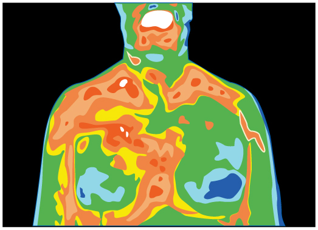

* Discuss heat transfer by radiation.
* Explain the power of different materials.

You can feel the heat transfer from a fire and from the Sun. Similarly, you can sometimes tell that the oven is hot without touching its door or looking inside—it may just warm you as you walk by. The space between the Earth and the Sun is largely empty, without any possibility of heat transfer by convection or conduction. In these examples, heat is transferred by radiation. That is, the hot body emits electromagnetic waves that are absorbed by our skin: no medium is required for electromagnetic waves to propagate. Different names are used for electromagnetic waves of different wavelengths: radio waves, microwaves, infrared **radiation**{: data-type="term" #import-auto-id3275108}, visible light, ultraviolet radiation, X-rays, and gamma rays.

"){: #import-auto-id1506960 data-media-type="image/jpg"}

The energy of electromagnetic radiation depends on the wavelength (color) and varies over a wide range: a smaller wavelength (or higher frequency) corresponds to a higher energy. Because more heat is radiated at higher temperatures, a temperature change is accompanied by a color change. Take, for example, an electrical element on a stove, which glows from red to orange, while the higher-temperature steel in a blast furnace glows from yellow to white. The radiation you feel is mostly infrared, which corresponds to a lower temperature than that of the electrical element and the steel. The radiated energy depends on its intensity, which is represented in the figure below by the height of the distribution.

[Electromagnetic Waves](/m42434) explains more about the electromagnetic spectrum and [Introduction to Quantum Physics](/m42550) discusses how the decrease in wavelength corresponds to an increase in energy.

![Figure a shows a graph of the intensity of electromagnetic radiation versus wavelength in nano meters. There are three curves on the graph labeled, from top to bottom, six thousand K, four thousand K, and three thousand K. The top curve peaks sharply at the beginning near about five hundred nano meters in what is labeled the visible range (violet to red). After the peak, this curve decays strongly by three thousand nano meters. The middle curve peaks more softly near nine hundred nano meters at a height about one third that of the first curve, and decays by three thousand nano meters. The lowest curve peaks very softly near one thousand nano meters curve and decreases slowly for higher wavelengths. The region between one thousand to two thousand nano meters is labeled the infrared range. Figure b shows two burners of a gas stove. One burner is closer and the other is in the background. The flame of the near burner is blue at the bottom and gradually changes to orange as you approach the top of the flame. The flame of the background burner is smaller and is essentially completely blue.](../resources/Figure_15_07_02a.jpg "(a) A graph of the spectra of electromagnetic waves emitted from an ideal radiator at three different temperatures. The intensity or rate of radiation emission increases dramatically with temperature, and the spectrum shifts toward the visible and ultraviolet parts of the spectrum. The shaded portion denotes the visible part of the spectrum. It is apparent that the shift toward the ultraviolet with temperature makes the visible appearance shift from red to white to blue as temperature increases. (b) Note the variations in color corresponding to variations in flame temperature. (credit: Tuohirulla)"){: #import-auto-id2436227 data-media-type="image/jpg"}

All objects absorb and emit electromagnetic radiation. The rate of heat transfer by radiation is largely determined by the color of the object. Black is the most effective, and white is the least effective. People living in hot climates generally avoid wearing black clothing, for instance (see [\[link\]](#fs-id1921098)). Similarly, black asphalt in a parking lot will be hotter than adjacent gray sidewalk on a summer day, because black absorbs better than gray. The reverse is also true—black radiates better than gray. Thus, on a clear summer night, the asphalt will be colder than the gray sidewalk, because black radiates the energy more rapidly than gray. An *ideal radiator* is the same color as an *ideal absorber*, and captures all the radiation that falls on it. In contrast, white is a poor absorber and is also a poor radiator. A white object reflects all radiation, like a mirror. (A perfect, polished white surface is mirror-like in appearance, and a crushed mirror looks white.)

, although both have been in the sunlight for the same time. The thermal conductivities of the pavements are the same."){: #import-auto-id1945572 data-media-type="image/png"}

Gray objects have a uniform ability to absorb all parts of the electromagnetic spectrum. Colored objects behave in similar but more complex ways, which gives them a particular color in the visible range and may make them special in other ranges of the nonvisible spectrum. Take, for example, the strong absorption of infrared radiation by the skin, which allows us to be very sensitive to it.

 ![In the figure two black and two silver polished blocks are shown. Radiant energy is incident on the first black block. Most of the energy is absorbed and only a small amount is shown as reflected. On the second black block more of the energy from inside the block is emitted than is retained. On the first silver polished block the incident energy is mostly reflected and only a small portion is absorbed. On the second silver polished block the energy from inside is mostly retained and only a small amount of energy is emitted.](../resources/Figure_15_07_04a.jpg "A black object is a good absorber and a good radiator, while a white (or silver) object is a poor absorber and a poor radiator. It is as if radiation from the inside is reflected back into the silver object, whereas radiation from the inside of the black object is &#x201C;absorbed&#x201D; when it hits the surface and finds itself on the outside and is strongly emitted."){: #import-auto-id3397174 data-media-type="image/jpg" height="325"}

The rate of heat transfer by emitted radiation is determined by the **Stefan-Boltzmann law of radiation**{: data-type="term" #import-auto-id2397799}\:

<math xmlns="http://www.w3.org/1998/Math/MathML"><semantics><mrow><mrow><mrow><mrow><mrow><mfrac><mi>Q</mi><mi>t</mi></mfrac><mo stretchy="false">=</mo><mi>σ</mi></mrow><mi /><mi>e</mi><mi /><mi>A</mi><mi /><msup><mi>T</mi><mrow><mn>4</mn></mrow></msup></mrow></mrow><mrow><mtext>,</mtext></mrow></mrow><mrow /></mrow><annotation encoding="StarMath 5.0"> size 12{ { {Q} over {A} } =σ`e`A`T rSup { size 8{4} } } {}</annotation></semantics></math>

where <math xmlns="http://www.w3.org/1998/Math/MathML"><semantics><mrow><mrow><mrow><mrow><mi>σ</mi><mo stretchy="false">=</mo><mn>5</mn></mrow><mtext>.</mtext><mrow><mtext>67</mtext><mo stretchy="false">×</mo><msup><mtext>10</mtext><mrow><mrow><mo stretchy="false">−</mo><mn>8</mn></mrow></mrow></msup></mrow><mspace width="0.25em" /><mrow><mrow><mtext>J/s</mtext><mo stretchy="false">⋅</mo><msup><mtext>m</mtext><mrow><mn>2</mn></mrow></msup></mrow><mo stretchy="false">⋅</mo><msup><mtext>K</mtext><mrow><mn>4</mn></mrow></msup></mrow></mrow></mrow><mrow /></mrow></semantics></math>

 is the Stefan-Boltzmann constant, <math xmlns="http://www.w3.org/1998/Math/MathML"><semantics><mrow><mrow><mi>A</mi></mrow></mrow></semantics></math>

 is the surface area of the object, and <math xmlns="http://www.w3.org/1998/Math/MathML"><semantics><mrow><mrow><mi>T</mi></mrow><mrow /></mrow></semantics></math>

 is its absolute temperature in kelvin. The symbol <math xmlns="http://www.w3.org/1998/Math/MathML"><semantics><mrow><mrow><mi>e</mi></mrow></mrow></semantics></math>

 stands for the **emissivity**{: data-type="term" #import-auto-id2640697} of the object, which is a measure of how well it radiates. An ideal jet-black (or black body) radiator has <math xmlns="http://www.w3.org/1998/Math/MathML"><semantics><mrow><mrow><mrow><mi>e</mi><mo stretchy="false">=</mo><mn>1</mn></mrow></mrow></mrow></semantics></math>

, whereas a perfect reflector has <math xmlns="http://www.w3.org/1998/Math/MathML"><semantics><mrow><mrow><mrow><mi>e</mi><mo stretchy="false">=</mo><mn>0</mn></mrow></mrow></mrow></semantics></math>

. Real objects fall between these two values. Take, for example, tungsten light bulb filaments which have an <math xmlns="http://www.w3.org/1998/Math/MathML"><semantics><mrow><mi>e</mi></mrow></semantics></math>

 of about <math xmlns="http://www.w3.org/1998/Math/MathML"><semantics><mrow><mrow><mn>0</mn><mtext>.</mtext><mn>5</mn></mrow></mrow></semantics></math>

, and carbon black (a material used in printer toner), which has the (greatest known) emissivity of about <math xmlns="http://www.w3.org/1998/Math/MathML"><semantics><mrow><mrow><mrow><mtext>0.99</mtext></mrow></mrow></mrow></semantics></math>

.

The radiation rate is directly proportional to the *fourth power* of the absolute temperature—a remarkably strong temperature dependence. Furthermore, the radiated heat is proportional to the surface area of the object. If you knock apart the coals of a fire, there is a noticeable increase in radiation due to an increase in radiating surface area.

 "){: #import-auto-id3417990 data-media-type="image/png"}

Skin is a remarkably good absorber and emitter of infrared radiation, having an emissivity of 0.97 in the infrared spectrum. Thus, we are all nearly (jet) black in the infrared, in spite of the obvious variations in skin color. This high infrared emissivity is why we can so easily feel radiation on our skin. It is also the basis for the use of night scopes used by law enforcement and the military to detect human beings. Even small temperature variations can be detected because of the <math xmlns="http://www.w3.org/1998/Math/MathML"><semantics><mrow><mrow><msup><mi>T</mi><mrow><mn>4</mn></mrow></msup></mrow><mrow /></mrow><annotation encoding="StarMath 5.0"> size 12{T rSup { size 8{4} } } {}</annotation></semantics></math>

 dependence. Images, called *thermographs*, can be used medically to detect regions of abnormally high temperature in the body, perhaps indicative of disease. Similar techniques can be used to detect heat leaks in homes [\[link\]](#import-auto-id3417990), optimize performance of blast furnaces, improve comfort levels in work environments, and even remotely map the Earth’s temperature profile.

All objects emit and absorb radiation. The *net* rate of heat transfer by radiation (absorption minus emission) is related to both the temperature of the object and the temperature of its surroundings. Assuming that an object with a temperature <math xmlns="http://www.w3.org/1998/Math/MathML"><semantics><mrow><mrow><msub><mi>T</mi><mrow><mn>1</mn></mrow></msub></mrow><mrow /></mrow><annotation encoding="StarMath 5.0"> size 12{T rSub { size 8{1} } } {}</annotation></semantics></math>

 is surrounded by an environment with uniform temperature <math xmlns="http://www.w3.org/1998/Math/MathML"><semantics><mrow><mrow><msub><mi>T</mi><mrow><mn>2</mn></mrow></msub></mrow><mrow /></mrow><annotation encoding="StarMath 5.0"> size 12{T rSub { size 8{2} } } {}</annotation></semantics></math>

, the **net rate of heat transfer by radiation**{: data-type="term" #import-auto-id1380870} is

<math xmlns="http://www.w3.org/1998/Math/MathML"><semantics><mrow><mrow><mrow><mrow><mrow><mfrac><msub><mi>Q</mi><mrow><mtext>net</mtext></mrow></msub><mi>t</mi></mfrac><mo stretchy="false">=</mo><mi>σ</mi></mrow><mi /><mi>e</mi><mi /><mi>A</mi><mi /><mfenced open="(" close=")"><mrow><msubsup><mi>T</mi><mrow><mn>2</mn></mrow><mrow><mn>4</mn></mrow></msubsup><mo stretchy="false">−</mo><msubsup><mi>T</mi><mrow><mn>1</mn></mrow><mrow><mn>4</mn></mrow></msubsup></mrow></mfenced></mrow></mrow><mrow><mtext>,</mtext></mrow></mrow><mrow /></mrow><annotation encoding="StarMath 5.0"> size 12{ { {Q rSub { size 8{"net"} } } over {t} } =σ`e`A` left (T rSub { size 8{2} } rSup { size 8{4} } - T rSub { size 8{1} } rSup { size 8{4} } right )} {}</annotation></semantics></math>

where <math xmlns="http://www.w3.org/1998/Math/MathML"><semantics><mrow><mrow><mi>e</mi></mrow><mrow /></mrow><annotation encoding="StarMath 5.0"> size 12{e} {}</annotation></semantics></math>

 is the emissivity of the object alone. In other words, it does not matter whether the surroundings are white, gray, or black; the balance of radiation into and out of the object depends on how well it emits and absorbs radiation. When <math xmlns="http://www.w3.org/1998/Math/MathML"><semantics><mrow><mrow><mrow><msub><mi>T</mi><mrow><mn>2</mn></mrow></msub><mo stretchy="false">&gt;</mo><msub><mi>T</mi><mrow><mn>1</mn></mrow></msub></mrow></mrow><mrow /></mrow><annotation encoding="StarMath 5.0"> size 12{T rSub { size 8{2} } &gt;T rSub { size 8{1} } } {}</annotation></semantics></math>

, the quantity <math xmlns="http://www.w3.org/1998/Math/MathML"><semantics><mrow><mrow><mrow><msub><mi>Q</mi><mrow><mtext>net</mtext></mrow></msub><mo stretchy="false">/</mo><mi>t</mi></mrow></mrow><mrow /></mrow><annotation encoding="StarMath 5.0"> size 12{Q rSub { size 8{"net"} } /t} {}</annotation></semantics></math>

 is positive; that is, the net heat transfer is from hot to cold.

Take-Home Experiment: Temperature in the Sun

Place a thermometer out in the sunshine and shield it from direct sunlight using an aluminum foil. What is the reading? Now remove the shield, and note what the thermometer reads. Take a handkerchief soaked in nail polish remover, wrap it around the thermometer and place it in the sunshine. What does the thermometer read?

Calculate the Net Heat Transfer of a Person: Heat Transfer by Radiation

What is the rate of heat transfer by radiation, with an unclothed person standing in a dark room whose ambient temperature is <math xmlns="http://www.w3.org/1998/Math/MathML"><semantics><mrow><mrow><mrow><mtext>22</mtext><mtext>.</mtext><mn>0º</mn><mtext>C</mtext></mrow></mrow><mrow /></mrow><annotation encoding="StarMath 5.0"> size 12{"22" "." 0°C} {}</annotation></semantics></math>

. The person has a normal skin temperature of <math xmlns="http://www.w3.org/1998/Math/MathML"><semantics><mrow><mrow><mrow><mtext>33</mtext><mtext>.</mtext><mn>0º</mn><mtext>C</mtext></mrow></mrow><mrow /></mrow></semantics></math>

 and a surface area of <math xmlns="http://www.w3.org/1998/Math/MathML"><semantics><mrow><mrow><mrow><mn>1</mn><mtext>.</mtext><mtext>50</mtext><mspace width="0.25em" /><msup><mtext>m</mtext><mrow><mn>2</mn></mrow></msup></mrow></mrow><mrow /></mrow><annotation encoding="StarMath 5.0"> size 12{1 "." "50"`m rSup { size 8{2} } } {}</annotation></semantics></math>

. The emissivity of skin is 0.97 in the infrared, where the radiation takes place.

**Strategy**

We can solve this by using the equation for the rate of radiative heat transfer.

**Solution**

Insert the temperatures values <math xmlns="http://www.w3.org/1998/Math/MathML"><semantics><mrow><mrow><mrow><msub><mi>T</mi><mrow><mn>2</mn></mrow></msub><mo stretchy="false">=</mo><mtext>295 K</mtext></mrow></mrow><mrow /></mrow></semantics></math>

 and <math xmlns="http://www.w3.org/1998/Math/MathML"><semantics><mrow><mrow><mrow><msub><mi>T</mi><mrow><mn>1</mn></mrow></msub><mo stretchy="false">=</mo><mtext>306 K</mtext></mrow></mrow></mrow></semantics></math>

, so that

<math xmlns="http://www.w3.org/1998/Math/MathML"> <semantics> <mrow> <mrow> <mrow> <mfrac> <mi>Q</mi> <mi>t</mi> </mfrac> <mtext>=</mtext> <mi>σ</mi> <mi /> <mi>e</mi> <mi /> <mi>A</mi> <mi /> <mfenced open="(" close=")"> <mrow> <msubsup> <mi>T</mi> <mrow> <mn>2</mn> </mrow> <mrow> <mn>4</mn> </mrow> </msubsup> <mo stretchy="false">−</mo> <msubsup> <mi>T</mi> <mrow> <mn>1</mn> </mrow> <mrow> <mn>4</mn> </mrow> </msubsup> </mrow> </mfenced> </mrow> </mrow> <mrow /> </mrow> <annotation encoding="StarMath 5.0"> size 12{ { {Q} over {t} } σ`e`A` left (T rSub { size 8{2} } rSup { size 8{4} } - T rSub { size 8{1} } rSup { size 8{4} } right )} {}</annotation> </semantics> </math>

<math xmlns="http://www.w3.org/1998/Math/MathML"> <semantics> <mrow> <mrow> <mrow> <mrow> <mrow /> <mo stretchy="false">=</mo> <mfenced open="(" close=")"> <mrow> <mn>5</mn> <mtext>.</mtext> <mrow> <mtext>67</mtext> <mo stretchy="false">×</mo> <msup> <mtext>10</mtext> <mrow> <mrow> <mo stretchy="false">−</mo> <mn>8</mn> </mrow> </mrow> </msup> </mrow> <mi /> <mrow> <mrow> <mtext> J/s</mtext> <mo stretchy="false">⋅</mo> <msup> <mtext> m</mtext> <mtext>2</mtext> </msup> </mrow> <mo stretchy="false">⋅</mo> <msup> <mtext> K</mtext> <mtext> 4</mtext> </msup> </mrow> </mrow> </mfenced> </mrow> <mfenced open="(" close=")"> <mrow> <mn>0</mn> <mtext>.</mtext> <mtext>97</mtext> </mrow> </mfenced> <mfenced open="(" close=")"> <mrow> <mn>1</mn> <mtext>.</mtext> <mtext>50</mtext> <mi /> <msup> <mtext> m</mtext> <mrow> <mn>2</mn> </mrow> </msup> </mrow> </mfenced> <mfenced open="[" close="]"> <mrow> <msup> <mfenced open="(" close=")"> <mrow> <mtext>295</mtext> <mi /> <mtext> K</mtext> </mrow> </mfenced> <mrow> <mn>4</mn> </mrow> </msup> <mo stretchy="false">−</mo> <msup> <mfenced open="(" close=")"> <mrow> <mtext>306 K</mtext> </mrow> </mfenced> <mrow> <mn>4</mn> </mrow> </msup> </mrow> </mfenced> </mrow> </mrow> <mrow /> </mrow> <annotation encoding="StarMath 5.0"> size 12{ {}= left (5 "." "67" times "10" rSup { size 8{ - 8} } `"J/s" cdot m cdot K right ) left (0 "." "97" right ) left (1 "." "50"`m rSup { size 8{2} } right ) left [ left ("295"`K right ) rSup { size 8{4} } - left ("306"`K right ) rSup { size 8{4} } right ]} {}</annotation> </semantics> </math>

<math xmlns="http://www.w3.org/1998/Math/MathML"> <semantics> <mrow> <mrow> <mrow> <mrow> <mrow /> <mo stretchy="false">=</mo> <mrow> <mo stretchy="false">−</mo> <mtext>99</mtext> </mrow> </mrow> <mi /> <mrow> <mtext> J/s</mtext> <mo stretchy="false">=</mo> <mrow> <mo stretchy="false">−</mo> <mtext>99 W.</mtext> </mrow> </mrow> <mi /> </mrow> </mrow> <mrow /> </mrow> <annotation encoding="StarMath 5.0"> size 12{ {}= - "100"`"J/s"= - "100"`W "." } {}</annotation> </semantics> </math>

**Discussion**

This value is a significant rate of heat transfer to the environment (note the minus sign), considering that a person at rest may produce energy at the rate of 125 W and that conduction and convection will also be transferring energy to the environment. Indeed, we would probably expect this person to feel cold. Clothing significantly reduces heat transfer to the environment by many methods, because clothing slows down both conduction and convection, and has a lower emissivity (especially if it is white) than skin.

The Earth receives almost all its energy from radiation of the Sun and reflects some of it back into outer space. Because the Sun is hotter than the Earth, the net energy flux is from the Sun to the Earth. However, the rate of energy transfer is less than the equation for the radiative heat transfer would predict because the Sun does not fill the sky. The average emissivity (<math xmlns="http://www.w3.org/1998/Math/MathML"><semantics><mrow><mrow><mi>e</mi></mrow><mrow /></mrow><annotation encoding="StarMath 5.0"> size 12{e} {}</annotation></semantics></math>

) of the Earth is about 0.65, but the calculation of this value is complicated by the fact that the highly reflective cloud coverage varies greatly from day to day. There is a negative feedback (one in which a change produces an effect that opposes that change) between clouds and heat transfer; greater temperatures evaporate more water to form more clouds, which reflect more radiation back into space, reducing the temperature. The often mentioned **greenhouse effect**{: data-type="term" #import-auto-id1349762} is directly related to the variation of the Earth’s emissivity with radiation type (see the figure given below). The greenhouse effect is a natural phenomenon responsible for providing temperatures suitable for life on Earth. The Earth’s relatively constant temperature is a result of the energy balance between the incoming solar radiation and the energy radiated from the Earth. Most of the infrared radiation emitted from the Earth is absorbed by carbon dioxide (<math xmlns="http://www.w3.org/1998/Math/MathML"><semantics><mrow><mrow><msub><mtext>CO</mtext><mrow><mn>2</mn></mrow></msub></mrow><mrow /></mrow><annotation encoding="StarMath 5.0"> size 12{"CO" rSub { size 8{2} } } {}</annotation></semantics></math>

) and water (<math xmlns="http://www.w3.org/1998/Math/MathML"><semantics><mrow><mrow><mrow><msub><mtext>H</mtext><mrow><mn>2</mn></mrow></msub><mtext>O</mtext></mrow></mrow><mrow /></mrow><annotation encoding="StarMath 5.0"> size 12{H rSub { size 8{2} } O} {}</annotation></semantics></math>

) in the atmosphere and then re-radiated back to the Earth or into outer space. Re-radiation back to the Earth maintains its surface temperature about <math xmlns="http://www.w3.org/1998/Math/MathML"><semantics><mrow><mrow><mrow><mtext>40º</mtext><mtext>C</mtext></mrow></mrow><mrow /></mrow><annotation encoding="StarMath 5.0"> size 12{"40"°C} {}</annotation></semantics></math>

 higher than it would be if there was no atmosphere, similar to the way glass increases temperatures in a greenhouse.

{: #import-auto-id2628682 data-media-type="image/jpg"}

The greenhouse effect is also central to the discussion of global warming due to emission of carbon dioxide and methane (and other so-called greenhouse gases) into the Earth’s atmosphere from industrial production and farming. Changes in global climate could lead to more intense storms, precipitation changes (affecting agriculture), reduction in rain forest biodiversity, and rising sea levels.

Heating and cooling are often significant contributors to energy use in individual homes. Current research efforts into developing environmentally friendly homes quite often focus on reducing conventional heating and cooling through better building materials, strategically positioning windows to optimize radiation gain from the Sun, and opening spaces to allow convection. It is possible to build a zero-energy house that allows for comfortable living in most parts of the United States with hot and humid summers and cold winters.

"){: #import-auto-id1840539 data-media-type="image/jpg"}

Conversely, dark space is very cold, about <math xmlns="http://www.w3.org/1998/Math/MathML"><semantics><mrow><mrow><mrow><mrow><mtext>3K</mtext><mo stretchy="false">(−</mo><mtext>454º</mtext></mrow><mtext>F)</mtext></mrow></mrow><mrow /></mrow><annotation encoding="StarMath 5.0"> size 12{ - "454"°F} {}</annotation></semantics></math>

, so that the Earth radiates energy into the dark sky. Owing to the fact that clouds have lower emissivity than either oceans or land masses, they reflect some of the radiation back to the surface, greatly reducing heat transfer into dark space, just as they greatly reduce heat transfer into the atmosphere during the day. The rate of heat transfer from soil and grasses can be so rapid that frost may occur on clear summer evenings, even in warm latitudes.

Check Your Understanding

What is the change in the rate of the radiated heat by a body at the temperature <math xmlns="http://www.w3.org/1998/Math/MathML"><semantics><mrow><mrow><mrow><mrow><msub><mi>T</mi><mrow><mn>1</mn></mrow></msub><mo stretchy="false">=</mo><mtext>20º</mtext></mrow><mtext>C</mtext></mrow></mrow><mrow /></mrow><annotation encoding="StarMath 5.0"> size 12{T rSub { size 8{1} } ="20"°C} {}</annotation></semantics></math>

 compared to when the body is at the temperature <math xmlns="http://www.w3.org/1998/Math/MathML"><semantics><mrow><mrow><mrow><mrow><msub><mi>T</mi><mrow><mn>2</mn></mrow></msub><mo stretchy="false">=</mo><mtext>40º</mtext></mrow><mtext>C</mtext></mrow></mrow><mrow /></mrow></semantics></math>

?

The radiated heat is proportional to the fourth power of the *absolute temperature*. Because <math xmlns="http://www.w3.org/1998/Math/MathML"><semantics><mrow><mrow><mrow><mrow><msub><mi>T</mi><mrow><mn>1</mn></mrow></msub><mo stretchy="false">=</mo><mtext>293</mtext></mrow><mi /><mtext> K</mtext></mrow></mrow><mrow /></mrow><annotation encoding="StarMath 5.0"> size 12{T rSub { size 8{1} } ="313"`K} {}</annotation></semantics></math>

 and <math xmlns="http://www.w3.org/1998/Math/MathML"><semantics><mrow><mrow><mrow><mrow><msub><mi>T</mi><mrow><mn>2</mn></mrow></msub><mo stretchy="false">=</mo><mtext>313</mtext></mrow><mi /><mtext> K</mtext></mrow></mrow><mrow /></mrow><annotation encoding="StarMath 5.0"> size 12{T rSub { size 8{2} } ="333"`K} {}</annotation></semantics></math>

, the rate of heat transfer increases by about 30 percent of the original rate.

Career Connection: Energy Conservation Consultation

The cost of energy is generally believed to remain very high for the foreseeable future. Thus, passive control of heat loss in both commercial and domestic housing will become increasingly important. Energy consultants measure and analyze the flow of energy into and out of houses and ensure that a healthy exchange of air is maintained inside the house. The job prospects for an energy consultant are strong.

# Summary

* {: #import-auto-id1474961} Radiation is the rate of heat transfer through the emission or absorption of electromagnetic waves.
* {: #import-auto-id3028645} The rate of heat transfer depends on the surface area and the fourth power of the absolute temperature:
  

  <math xmlns="http://www.w3.org/1998/Math/MathML"><semantics><mrow><mrow><mrow><mrow><mfrac><mi>Q</mi><mi>t</mi></mfrac><mo stretchy="false">=</mo><mi>σ</mi></mrow><mi /><mi>e</mi><mi /><mi>A</mi><mi /><msup><mi>T</mi><mrow><mn>4</mn></mrow></msup><mtext>,</mtext></mrow></mrow><mrow /></mrow><annotation encoding="StarMath 5.0"> size 12{ { {Q} over {t} } =σ`e`A`T rSup { size 8{4} } } {}</annotation></semantics></math>
  

  
  where <math xmlns="http://www.w3.org/1998/Math/MathML"><semantics><mrow><mrow><mrow><mrow><mi>σ</mi><mo stretchy="false">=</mo><mn>5</mn><mtext>.67</mtext><mo stretchy="false">×</mo><msup><mtext>10</mtext><mrow><mrow><mo stretchy="false">−</mo><mn>8</mn></mrow></mrow></msup></mrow><mspace width="0.25em" /><mrow><mrow><mtext>J/s</mtext><mo stretchy="false">⋅</mo><msup><mtext>m</mtext><mrow><mn>2</mn></mrow></msup></mrow><mo stretchy="false">⋅</mo><msup><mtext>K</mtext><mrow><mn>4</mn></mrow></msup></mrow></mrow></mrow><mrow /></mrow></semantics></math>
  
   is the Stefan-Boltzmann constant and <math xmlns="http://www.w3.org/1998/Math/MathML"><semantics><mrow><mrow><mi>e</mi></mrow><mrow /></mrow><annotation encoding="StarMath 5.0"> size 12{e} {}</annotation></semantics></math>
  
   is the emissivity of the body. For a black body, <math xmlns="http://www.w3.org/1998/Math/MathML"><semantics><mrow><mrow><mrow><mi>e</mi><mo stretchy="false">=</mo><mn>1</mn></mrow></mrow></mrow></semantics></math>
  
   whereas a shiny white or perfect reflector has <math xmlns="http://www.w3.org/1998/Math/MathML"><semantics><mrow><mrow><mrow><mi>e</mi><mo stretchy="false">=</mo><mn>0</mn></mrow></mrow><mrow /></mrow></semantics></math>
  
  , with real objects having values of <math xmlns="http://www.w3.org/1998/Math/MathML"><semantics><mrow><mrow><mi>e</mi></mrow></mrow></semantics></math>
  
   between 1 and 0. The net rate of heat transfer by radiation is
  
  

  <math xmlns="http://www.w3.org/1998/Math/MathML"> <semantics> <mrow> <mrow> <mrow> <mrow> <mfrac> <msub> <mi>Q</mi> <mrow> <mtext>net</mtext> </mrow> </msub> <mi>t</mi> </mfrac> <mo stretchy="false">=</mo> <mi>σ</mi> </mrow> <mi /> <mi>e</mi> <mi /> <mi>A</mi> <mi /> <mfenced open="(" close=")"> <mrow> <msubsup> <mi>T</mi> <mrow> <mn>2</mn> </mrow> <mrow> <mn>4</mn> </mrow> </msubsup> <mo stretchy="false">−</mo> <msubsup> <mi>T</mi> <mrow> <mn>1</mn> </mrow> <mrow> <mn>4</mn> </mrow> </msubsup> </mrow> </mfenced> </mrow> </mrow> <mrow /> </mrow> <annotation encoding="StarMath 5.0"> size 12{ { {Q rSub { size 8{"net"} } } over {t} } =σ`e`A` left (T rSub { size 8{2} } rSup { size 8{4} } - T rSub { size 8{1} } rSup { size 8{4} } right )} {}</annotation> </semantics> </math>
  

  
  where <math xmlns="http://www.w3.org/1998/Math/MathML"><semantics><mrow><mrow><msub><mi>T</mi><mrow><mn>1</mn></mrow></msub></mrow><mrow /></mrow><annotation encoding="StarMath 5.0"> size 12{T rSub { size 8{1} } } {}</annotation></semantics></math>
  
   is the temperature of an object surrounded by an environment with uniform temperature <math xmlns="http://www.w3.org/1998/Math/MathML"><semantics><mrow><mrow><msub><mi>T</mi><mrow><mn>2</mn></mrow></msub></mrow><mrow /></mrow><annotation encoding="StarMath 5.0"> size 12{T rSub { size 8{2} } } {}</annotation></semantics></math>
  
   and <math xmlns="http://www.w3.org/1998/Math/MathML"><semantics><mrow><mrow><mi>e</mi></mrow><mrow /></mrow><annotation encoding="StarMath 5.0"> size 12{e} {}</annotation></semantics></math>
  
   is the emissivity of the *object*.

Problem-Solving Strategies for the Methods of Heat Transfer

1.  {: #import-auto-id3112098} *Examine the situation to determine what type of heat transfer is involved.*
2.  {: #import-auto-id1972641} *Identify the type(s) of heat transfer—conduction, convection, or radiation.*
3.  {: #import-auto-id1871778} *Identify exactly what needs to be determined in the problem (identify the unknowns). A written list is very useful.*
4.  {: #import-auto-id3179622} *Make a list of what is given or can be inferred from the problem as stated (identify the knowns).*
5.  {: #import-auto-id3053368} *Solve the appropriate equation for the quantity to be determined (the unknown).*
6.  {: #import-auto-id3192933} For conduction, equation
    <math xmlns="http://www.w3.org/1998/Math/MathML"><semantics><mrow><mrow><mrow><mfrac><mi>Q</mi><mi>t</mi></mfrac><mo stretchy="false">=</mo><mfrac><mrow><mstyle fontstyle="italic"><mrow><mtext>kA</mtext></mrow></mstyle><mo stretchy="false">(</mo><mrow><msub><mi>T</mi><mrow><mn>2</mn></mrow></msub><mo stretchy="false">−</mo><msub><mi>T</mi><mrow><mn>1</mn></mrow></msub></mrow><mo stretchy="false">)</mo></mrow><mi>d</mi></mfrac></mrow></mrow><mrow /></mrow><annotation encoding="StarMath 5.0"> size 12{ { {Q} over {t} } = { { ital "kA" \( T rSub { size 8{2} } - T rSub { size 8{1} } \) } over {d} } } {}</annotation></semantics></math>
    
    is appropriate. [\[link\]](/m42228#import-auto-id1245788) lists thermal conductivities. For convection, determine the amount of matter moved and use equation
    <math xmlns="http://www.w3.org/1998/Math/MathML"><semantics><mrow><mrow><mrow><mrow><mi>Q</mi><mo stretchy="false">=</mo><mstyle fontstyle="italic"><mrow><mtext>mc</mtext></mrow></mstyle></mrow><mtext>Δ</mtext><mi fontstyle="italic">T</mi></mrow></mrow><mrow /></mrow><annotation encoding="StarMath 5.0"> size 12{Q= ital "mc"ΔT} {}</annotation></semantics></math>
    
    , to calculate the heat transfer involved in the temperature change of the fluid. If a phase change accompanies convection, equation
    <math xmlns="http://www.w3.org/1998/Math/MathML"><semantics><mrow><mrow><mrow><mi>Q</mi><mo stretchy="false">=</mo><mrow><msub><mstyle fontstyle="italic"><mtext>mL</mtext></mstyle><mrow><mtext>f</mtext></mrow></msub></mrow></mrow></mrow><mrow /></mrow><annotation encoding="StarMath 5.0"> size 12{Q= ital "mL" rSub { size 8{f} } } {}</annotation></semantics></math>
    
    or
    <math xmlns="http://www.w3.org/1998/Math/MathML"><mrow><mrow><mrow><mi>Q</mi><mo stretchy="false">=</mo><mrow><msub><mstyle fontstyle="italic"><mtext>mL</mtext></mstyle><mrow><mtext>v</mtext></mrow></msub></mrow></mrow></mrow><mrow /></mrow></math>
    
    is appropriate to find the heat transfer involved in the phase change. [\[link\]](/m42225#import-auto-id3260303) lists information relevant to phase change. For radiation, equation
    <math xmlns="http://www.w3.org/1998/Math/MathML"> <semantics> <mrow> <mrow> <mrow> <mrow> <mfrac> <msub> <mi>Q</mi> <mrow> <mtext>net</mtext> </mrow> </msub> <mi>t</mi> </mfrac> <mo stretchy="false">=</mo> <mi>σ</mi> </mrow> <mi /> <mi>e</mi> <mi /> <mi>A</mi> <mi /> <mfenced open="(" close=")"> <mrow> <msubsup> <mi>T</mi> <mrow> <mn>2</mn> </mrow> <mrow> <mn>4</mn> </mrow> </msubsup> <mo stretchy="false">−</mo> <msubsup> <mi>T</mi> <mrow> <mn>1</mn> </mrow> <mrow> <mn>4</mn> </mrow> </msubsup> </mrow> </mfenced> </mrow> </mrow> <mrow /> </mrow> <annotation encoding="StarMath 5.0"> size 12{ { {Q rSub { size 8{"net"} } } over {t} } =σ`e`A` left (T rSub { size 8{2} } rSup { size 8{4} } - T rSub { size 8{1} } rSup { size 8{4} } right )} {}</annotation> </semantics> </math>
    
    gives the net heat transfer rate.
7.  {: #import-auto-id3013095} *Insert the knowns along with their units into the appropriate equation and obtain numerical solutions complete with units.*
8.  {: #import-auto-id1506837} *Check the answer to see if it is reasonable. Does it make sense?*
{: data-number-style="arabic"}

# Conceptual Questions

When watching a daytime circus in a large, dark-colored tent, you sense significant heat transfer from the tent. Explain why this occurs.

Satellites designed to observe the radiation from cold (3 K) dark space have sensors that are shaded from the Sun, Earth, and Moon and that are cooled to very low temperatures. Why must the sensors be at low temperature?

Why are cloudy nights generally warmer than clear ones?

Why are thermometers that are used in weather stations shielded from the sunshine? What does a thermometer measure if it is shielded from the sunshine and also if it is not?

On average, would Earth be warmer or cooler without the atmosphere? Explain your answer.

# Problems &amp; Exercises

At what net rate does heat radiate from a <math xmlns="http://www.w3.org/1998/Math/MathML"><semantics><mrow><mrow><mrow><mtext>275</mtext><msup><mtext>-m</mtext><mrow><mn>2</mn></mrow></msup></mrow></mrow><mrow /></mrow><annotation encoding="StarMath 5.0"> size 12{"275""-m" rSup { size 8{2} } } {}</annotation></semantics></math>

 black roof on a night when the roof’s temperature is <math xmlns="http://www.w3.org/1998/Math/MathML"><semantics><mrow><mrow><mrow><mtext>30.</mtext><mn>0º</mn><mtext>C</mtext></mrow></mrow><mrow /></mrow></semantics></math>

 and the surrounding temperature is <math xmlns="http://www.w3.org/1998/Math/MathML"><semantics><mrow><mrow><mrow><mtext>15.</mtext><mn>0º</mn><mtext>C</mtext></mrow></mrow><mrow /></mrow><annotation encoding="StarMath 5.0"> size 12{"15" "." 0°C} {}</annotation></semantics></math>

? The emissivity of the roof is 0.900.

<math xmlns="http://www.w3.org/1998/Math/MathML"><semantics><mrow><mrow><mrow><mrow><mo stretchy="false">−</mo><mtext>21</mtext></mrow><mtext>.</mtext><mn>7</mn><mi /><mtext> kW</mtext></mrow></mrow><mrow /></mrow><annotation encoding="StarMath 5.0"> size 12{ - "21" "." 7`W} {}</annotation></semantics></math>

 Note that the negative answer implies heat loss to the surroundings.

(a) Cherry-red embers in a fireplace are at <math xmlns="http://www.w3.org/1998/Math/MathML"><semantics><mrow><mrow><mrow><mtext>850º</mtext><mtext>C</mtext></mrow></mrow><mrow /></mrow></semantics></math>

 and have an exposed area of <math xmlns="http://www.w3.org/1998/Math/MathML"><semantics><mrow><mrow><mrow><mn>0</mn><mtext>.</mtext><mtext>200</mtext><mspace width="0.25em" /><msup><mtext> m</mtext><mrow><mn>2</mn></mrow></msup></mrow></mrow><mrow /></mrow></semantics></math>

 and an emissivity of 0.980. The surrounding room has a temperature of <math xmlns="http://www.w3.org/1998/Math/MathML"><semantics><mrow><mrow><mrow><mtext>18</mtext><mtext>.</mtext><mn>0º</mn><mtext>C</mtext></mrow></mrow><mrow /></mrow></semantics></math>

. If 50% of the radiant energy enters the room, what is the net rate of radiant heat transfer in kilowatts? (b) Does your answer support the contention that most of the heat transfer into a room by a fireplace comes from infrared radiation?

Radiation makes it impossible to stand close to a hot lava flow. Calculate the rate of heat transfer by radiation from <math xmlns="http://www.w3.org/1998/Math/MathML"><semantics><mrow><mrow><mrow><mn>1</mn><mtext>.</mtext><mtext>00</mtext><mspace width="0.25em" /><msup><mtext> m</mtext><mrow><mn>2</mn></mrow></msup></mrow></mrow><mrow /></mrow></semantics></math>

 of <math xmlns="http://www.w3.org/1998/Math/MathML"><semantics><mrow><mrow><mrow><mtext>1200º</mtext><mtext>C</mtext></mrow></mrow><mrow /></mrow></semantics></math>

 fresh lava into <math xmlns="http://www.w3.org/1998/Math/MathML"><semantics><mrow><mrow><mrow><mtext>30</mtext><mtext>.</mtext><mn>0º</mn><mtext>C</mtext></mrow></mrow><mrow /></mrow></semantics></math>

 surroundings, assuming lava’s emissivity is 1.00.

<math xmlns="http://www.w3.org/1998/Math/MathML"><semantics><mrow><mrow><mrow><mrow><mo stretchy="false">−</mo><mtext>266</mtext></mrow><mi /><mtext> kW</mtext></mrow></mrow><mrow /></mrow><annotation encoding="StarMath 5.0"> size 12{ - "266"`"kW"} {}</annotation></semantics></math>

(a) Calculate the rate of heat transfer by radiation from a car radiator at <math xmlns="http://www.w3.org/1998/Math/MathML"> <mn>110</mn> <mi>°</mi><mtext>C</mtext> </math>

 into a <math xmlns="http://www.w3.org/1998/Math/MathML"> <mn>50.0º</mn><mtext>C</mtext> </math>

 environment, if the radiator has an emissivity of 0.750 and a <math xmlns="http://www.w3.org/1998/Math/MathML"> <mn>1.20</mn> <msup> <mi> -m</mi> <mn>2</mn> </msup> </math>

 surface area. (b) Is this a significant fraction of the heat transfer by an automobile engine? To answer this, assume a horsepower of <math xmlns="http://www.w3.org/1998/Math/MathML"> <mn>200</mn> <mspace width="0.25em" /> <mtext>hp</mtext><mspace width="0.25em" /> <mfenced open="(" close=")"> <mrow> <mn>1.5</mn> <mspace width="0.25em" /> <mtext>kW</mtext> </mrow> </mfenced> </math>

 and the efficiency of automobile engines as 25%.

Find the net rate of heat transfer by radiation from a skier standing in the shade, given the following. She is completely clothed in white (head to foot, including a ski mask), the clothes have an emissivity of 0.200 and a surface temperature of <math xmlns="http://www.w3.org/1998/Math/MathML"><semantics><mrow><mrow><mrow><mtext>10</mtext><mtext>.</mtext><mn>0º</mn><mtext>C</mtext></mrow></mrow><mrow /></mrow></semantics></math>

, the surroundings are at <math xmlns="http://www.w3.org/1998/Math/MathML"><semantics><mrow><mrow><mrow><mrow><mo stretchy="false">−</mo><mtext>15</mtext></mrow><mtext>.</mtext><mtext>0ºC</mtext></mrow></mrow><mrow /></mrow><annotation encoding="StarMath 5.0"> size 12{ - "15" "." "0°C"} {}</annotation></semantics></math>

, and her surface area is <math xmlns="http://www.w3.org/1998/Math/MathML"><semantics><mrow><mrow><mrow><mn>1</mn><mtext>.</mtext><mtext>60</mtext><mspace width="0.25em" /><msup><mtext>m</mtext><mrow><mn>2</mn></mrow></msup></mrow></mrow><mrow /></mrow><annotation encoding="StarMath 5.0"> size 12{1 "." "60"`m rSup { size 8{2} } } {}</annotation></semantics></math>

.

<math xmlns="http://www.w3.org/1998/Math/MathML"><semantics><mrow><mrow><mrow><mrow><mo stretchy="false">−</mo><mtext>36</mtext></mrow><mtext>.</mtext><mn>0</mn><mi /><mtext> W</mtext></mrow></mrow><mrow /></mrow><annotation encoding="StarMath 5.0"> size 12{ - "36" "." 0`W} {}</annotation></semantics></math>

Suppose you walk into a sauna that has an ambient temperature of <math xmlns="http://www.w3.org/1998/Math/MathML"><semantics><mrow><mrow><mrow><mtext>50</mtext><mtext>.0ºC</mtext></mrow></mrow><mrow /></mrow></semantics></math>

. (a) Calculate the rate of heat transfer to you by radiation given your skin temperature is <math xmlns="http://www.w3.org/1998/Math/MathML"><semantics><mrow><mrow><mrow><mtext>37</mtext><mtext>.0ºC</mtext></mrow></mrow><mrow /></mrow></semantics></math>

, the emissivity of skin is 0.98, and the surface area of your body is <math xmlns="http://www.w3.org/1998/Math/MathML"><semantics><mrow><mrow><mrow><mn>1</mn><mtext>.50</mtext><mspace width="0.25em" /><msup><mtext>m</mtext><mrow><mn>2</mn></mrow></msup></mrow></mrow><mrow /></mrow></semantics></math>

. (b) If all other forms of heat transfer are balanced (the net heat transfer is zero), at what rate will your body temperature increase if your mass is 75.0 kg?

Thermography is a technique for measuring radiant heat and detecting variations in surface temperatures that may be medically, environmentally, or militarily meaningful.(a) What is the percent increase in the rate of heat transfer by radiation from a given area at a temperature of <math xmlns="http://www.w3.org/1998/Math/MathML"><semantics><mrow><mrow><mrow><mtext>34.0ºC </mtext></mrow></mrow><mrow /></mrow></semantics></math>

 compared with that at <math xmlns="http://www.w3.org/1998/Math/MathML"><semantics><mrow><mrow><mrow><mtext>33</mtext><mtext>.</mtext><mtext>0ºC</mtext></mrow></mrow><mrow /></mrow></semantics></math>

, such as on a person’s skin? (b) What is the percent increase in the rate of heat transfer by radiation from a given area at a temperature of <math xmlns="http://www.w3.org/1998/Math/MathML"><semantics><mrow><mrow><mrow><mtext>34.0ºC </mtext></mrow></mrow></mrow></semantics></math>

 compared with that at <math xmlns="http://www.w3.org/1998/Math/MathML"><semantics><mrow><mrow><mrow><mtext>20.0ºC</mtext></mrow></mrow></mrow></semantics></math>

, such as for warm and cool automobile hoods?

{: #import-auto-id3110349 data-media-type="image/png"}

(a) 1.31%

(b) 20.5%

The Sun radiates like a perfect black body with an emissivity of exactly 1. (a) Calculate the surface temperature of the Sun, given that it is a sphere with a <math xmlns="http://www.w3.org/1998/Math/MathML"><semantics><mrow><mrow><mrow><mn>7</mn><mtext>.</mtext><mrow><mtext>00</mtext><mo stretchy="false">×</mo><msup><mtext>10</mtext><mrow><mn>8</mn></mrow></msup></mrow><mtext>-m</mtext></mrow></mrow><mrow /></mrow><annotation encoding="StarMath 5.0"> size 12{7 "." "00" times "10" rSup { size 8{8} } "-m"} {}</annotation></semantics></math>

 radius that radiates <math xmlns="http://www.w3.org/1998/Math/MathML"><semantics><mrow><mrow><mrow><mn>3</mn><mtext>.</mtext><mrow><mtext>80</mtext><mo stretchy="false">×</mo><msup><mtext>10</mtext><mrow><mtext>26</mtext></mrow></msup></mrow><mi /><mtext> W</mtext></mrow></mrow><mrow /></mrow><annotation encoding="StarMath 5.0"> size 12{3 "." "80" times "10" rSup { size 8{"26"} } `W} {}</annotation></semantics></math>

 into 3-K space. (b) How much power does the Sun radiate per square meter of its surface? (c) How much power in watts per square meter is that value at the distance of Earth, <math xmlns="http://www.w3.org/1998/Math/MathML"><semantics><mrow><mrow><mrow><mn>1</mn><mtext>.</mtext><mrow><mtext>50</mtext><mo stretchy="false">×</mo><msup><mtext>10</mtext><mrow><mtext>11</mtext></mrow></msup></mrow><mi /><mtext> m</mtext></mrow></mrow><mrow /></mrow><annotation encoding="StarMath 5.0"> size 12{1 "." "50" times "10" rSup { size 8{"11"} } `m} {}</annotation></semantics></math>

 away? (This number is called the solar constant.)

A large body of lava from a volcano has stopped flowing and is slowly cooling. The interior of the lava is at <math xmlns="http://www.w3.org/1998/Math/MathML"><semantics><mrow><mrow><mtext>1200ºC</mtext></mrow><mrow /></mrow><annotation encoding="StarMath 5.0"> size 12{"1200°C"} {}</annotation></semantics></math>

, its surface is at <math xmlns="http://www.w3.org/1998/Math/MathML"><semantics><mrow><mrow><mtext>450ºC</mtext></mrow><mrow /></mrow></semantics></math>

, and the surroundings are at <math xmlns="http://www.w3.org/1998/Math/MathML"><semantics><mrow><mrow><mrow><mtext>27</mtext><mtext>.</mtext><mtext>0ºC</mtext></mrow></mrow><mrow /></mrow><annotation encoding="StarMath 5.0"> size 12{"27" "." "0°C"} {}</annotation></semantics></math>

. (a) Calculate the rate at which energy is transferred by radiation from <math xmlns="http://www.w3.org/1998/Math/MathML"><semantics><mrow><mrow><mrow><mn>1</mn><mtext>.</mtext><mtext>00 </mtext><mspace width="0.25em" /><msup><mtext> m</mtext><mrow><mn>2</mn></mrow></msup></mrow></mrow><mrow /></mrow></semantics></math>

 of surface lava into the surroundings, assuming the emissivity is 1.00. (b) Suppose heat conduction to the surface occurs at the same rate. What is the thickness of the lava between the <math xmlns="http://www.w3.org/1998/Math/MathML"><semantics><mrow><mrow><mtext>450ºC</mtext></mrow><mrow /></mrow></semantics></math>

 surface and the <math xmlns="http://www.w3.org/1998/Math/MathML"><semantics><mrow><mrow><mtext>1200ºC</mtext></mrow><mrow /></mrow></semantics></math>

 interior, assuming that the lava’s conductivity is the same as that of brick?

(a) <math xmlns="http://www.w3.org/1998/Math/MathML"><semantics><mrow><mrow><mrow><mrow><mo stretchy="false">−</mo><mtext>15.0</mtext></mrow><mi /><mtext> kW</mtext></mrow></mrow><mrow /></mrow><annotation encoding="StarMath 5.0"> size 12{ - "15"`"kW"} {}</annotation></semantics></math>

(b) 4.2 cm

Calculate the temperature the entire sky would have to be in order to transfer energy by radiation at <math xmlns="http://www.w3.org/1998/Math/MathML"><semantics><mrow><mrow><mrow><mtext>1000</mtext><mspace width="0.25em" /><msup><mtext>W/m</mtext><mrow><mn>2</mn></mrow></msup></mrow></mrow><mrow /></mrow></semantics></math>

 —about the rate at which the Sun radiates when it is directly overhead on a clear day. This value is the effective temperature of the sky, a kind of average that takes account of the fact that the Sun occupies only a small part of the sky but is much hotter than the rest. Assume that the body receiving the energy has a temperature of <math xmlns="http://www.w3.org/1998/Math/MathML"><semantics><mrow><mrow><mrow><mtext>27</mtext><mtext>.</mtext><mtext>0ºC</mtext></mrow></mrow><mrow /></mrow><annotation encoding="StarMath 5.0"> size 12{"27" "." "0°C"} {}</annotation></semantics></math>

.

(a) A shirtless rider under a circus tent feels the heat radiating from the sunlit portion of the tent. Calculate the temperature of the tent canvas based on the following information: The shirtless rider’s skin temperature is <math xmlns="http://www.w3.org/1998/Math/MathML"><semantics><mrow><mrow><mrow><mtext>34</mtext><mtext>.</mtext><mtext>0ºC</mtext></mrow></mrow><mrow /></mrow><annotation encoding="StarMath 5.0"> size 12{"34" "." "0°C"} {}</annotation></semantics></math>

 and has an emissivity of 0.970. The exposed area of skin is <math xmlns="http://www.w3.org/1998/Math/MathML"><semantics><mrow><mrow><mrow><mn>0</mn><mtext>.</mtext><mtext>400</mtext><mspace width="0.25em" /><msup><mtext> m</mtext><mrow><mn>2</mn></mrow></msup></mrow></mrow><mrow /></mrow><annotation encoding="StarMath 5.0"> size 12{0 "." "400"`m rSup { size 8{2} } } {}</annotation></semantics></math>

. He receives radiation at the rate of 20.0 W—half what you would calculate if the entire region behind him was hot. The rest of the surroundings are at <math xmlns="http://www.w3.org/1998/Math/MathML"><semantics><mrow><mrow><mrow><mtext>34</mtext><mtext>.</mtext><mtext>0ºC</mtext></mrow></mrow><mrow /></mrow><annotation encoding="StarMath 5.0"> size 12{"34" "." "0°C"} {}</annotation></semantics></math>

. (b) Discuss how this situation would change if the sunlit side of the tent was nearly pure white and if the rider was covered by a white tunic.

(a) <math xmlns="http://www.w3.org/1998/Math/MathML"><semantics><mrow><mrow><mrow><mtext>48</mtext><mtext>.</mtext><mn>5º</mn><mtext>C</mtext></mrow></mrow><mrow /></mrow><annotation encoding="StarMath 5.0"> size 12{"48" "." 5°C} {}</annotation></semantics></math>

(b) A pure white object reflects more of the radiant energy that hits it, so a white tent would prevent more of the sunlight from heating up the inside of the tent, and the white tunic would prevent that heat which entered the tent from heating the rider. Therefore, with a white tent, the temperature would be lower than <math xmlns="http://www.w3.org/1998/Math/MathML"><semantics><mrow><mrow><mrow><mtext>48</mtext><mtext>.</mtext><mn>5º</mn><mtext>C</mtext></mrow></mrow><mrow /></mrow><annotation encoding="StarMath 5.0"> size 12{"48" "." 5°C} {}</annotation></semantics></math>

, and the rate of radiant heat transferred to the rider would be less than 20.0 W.

**Integrated Concepts**

One <math xmlns="http://www.w3.org/1998/Math/MathML"><semantics><mrow><mrow><mrow><mtext>30</mtext><mtext>.</mtext><mtext>0ºC</mtext></mrow></mrow><mrow /></mrow><annotation encoding="StarMath 5.0"> size 12{"30" "." "0°C"} {}</annotation></semantics></math>

 day the relative humidity is <math xmlns="http://www.w3.org/1998/Math/MathML"><semantics><mrow><mrow><mrow><mtext>75</mtext><mtext>.</mtext><mtext>0%</mtext></mrow></mrow><mrow /></mrow><annotation encoding="StarMath 5.0"> size 12{"75" "." "0%"} {}</annotation></semantics></math>

, and that evening the temperature drops to <math xmlns="http://www.w3.org/1998/Math/MathML"><semantics><mrow><mrow><mrow><mtext>20</mtext><mtext>.</mtext><mtext>0ºC</mtext></mrow></mrow><mrow /></mrow><annotation encoding="StarMath 5.0"> size 12{"20" "." "0°C"} {}</annotation></semantics></math>

, well below the dew point. (a) How many grams of water condense from each cubic meter of air? (b) How much heat transfer occurs by this condensation? (c) What temperature increase could this cause in dry air?

**Integrated Concepts**

Large meteors sometimes strike the Earth, converting most of their kinetic energy into thermal energy. (a) What is the kinetic energy of a <math xmlns="http://www.w3.org/1998/Math/MathML"><semantics><mrow><mrow><mrow><msup><mtext>10</mtext><mrow><mn>9</mn></mrow></msup><mi /><mtext> kg</mtext></mrow></mrow><mrow /></mrow><annotation encoding="StarMath 5.0"> size 12{"10" rSup { size 8{9} } `"kg"} {}</annotation></semantics></math>

 meteor moving at 25.0 km/s? (b) If this meteor lands in a deep ocean and <math xmlns="http://www.w3.org/1998/Math/MathML"><semantics><mrow><mrow><mtext>80%</mtext></mrow><mrow /></mrow><annotation encoding="StarMath 5.0"> size 12{"80%"} {}</annotation></semantics></math>

 of its kinetic energy goes into heating water, how many kilograms of water could it raise by <math xmlns="http://www.w3.org/1998/Math/MathML"><semantics><mrow><mrow><mrow><mn>5</mn><mtext>.</mtext><mtext>0ºC? </mtext></mrow></mrow><mrow /></mrow><annotation encoding="StarMath 5.0"> size 12{5 "." "0°C? "} {}</annotation></semantics></math>

 (c) Discuss how the energy of the meteor is more likely to be deposited in the ocean and the likely effects of that energy.

(a) <math xmlns="http://www.w3.org/1998/Math/MathML"><semantics><mrow><mrow><mrow><mrow><mn>3</mn><mo stretchy="false">×</mo><msup><mtext>10</mtext><mrow><mtext>17</mtext></mrow></msup></mrow><mi /><mtext> J</mtext></mrow></mrow><mrow /></mrow><annotation encoding="StarMath 5.0"> size 12{3 times "10" rSup { size 8{"17"} } `J} {}</annotation></semantics></math>

(b) <math xmlns="http://www.w3.org/1998/Math/MathML"><semantics><mrow><mrow><mrow><mrow><mn>1</mn><mo stretchy="false">×</mo><msup><mtext>10</mtext><mrow><mtext>13</mtext></mrow></msup></mrow><mi /><mtext> kg</mtext></mrow></mrow><mrow /></mrow><annotation encoding="StarMath 5.0"> size 12{1 times "10" rSup { size 8{"13"} } `"kg"} {}</annotation></semantics></math>

(c) When a large meteor hits the ocean, it causes great tidal waves, dissipating large amount of its energy in the form of kinetic energy of the water.

**Integrated Concepts**

Frozen waste from airplane toilets has sometimes been accidentally ejected at high altitude. Ordinarily it breaks up and disperses over a large area, but sometimes it holds together and strikes the ground. Calculate the mass of <math xmlns="http://www.w3.org/1998/Math/MathML"><semantics><mrow><mrow><mtext>0ºC</mtext></mrow><mrow /></mrow><annotation encoding="StarMath 5.0"> size 12{"0°C"} {}</annotation></semantics></math>

 ice that can be melted by the conversion of kinetic and gravitational potential energy when a <math xmlns="http://www.w3.org/1998/Math/MathML"><semantics><mrow><mrow><mrow><mtext>20</mtext><mtext>.0  kg</mtext></mrow></mrow><mrow /></mrow><annotation encoding="StarMath 5.0"> size 12{"20" "." 0`"kg"} {}</annotation></semantics></math>

 piece of frozen waste is released at 12.0 km altitude while moving at 250 m/s and strikes the ground at 100 m/s (since less than 20.0 kg melts, a significant mess results).

**Integrated Concepts**

(a) A large electrical power facility produces 1600 MW of “waste heat,” which is dissipated to the environment in cooling towers by warming air flowing through the towers by <math xmlns="http://www.w3.org/1998/Math/MathML"><semantics><mrow><mrow><mrow><mn>5</mn><mtext>.</mtext><mtext>00ºC</mtext></mrow></mrow><mrow /></mrow><annotation encoding="StarMath 5.0"> size 12{5 "." "00°C"} {}</annotation></semantics></math>

. What is the necessary flow rate of air in <math xmlns="http://www.w3.org/1998/Math/MathML"><semantics><mrow><mrow><mrow><msup><mtext>m</mtext><mrow><mn>3</mn></mrow></msup><mtext>/s</mtext></mrow></mrow><mrow /></mrow><annotation encoding="StarMath 5.0"> size 12{m rSup { size 8{3} } "/s"} {}</annotation></semantics></math>

? (b) Is your result consistent with the large cooling towers used by many large electrical power plants?

(a) <math xmlns="http://www.w3.org/1998/Math/MathML"><semantics><mrow><mrow><mrow><mn>3</mn><mtext>.</mtext><mrow><mtext>44</mtext><mo stretchy="false">×</mo><msup><mtext>10</mtext><mrow><mn>5</mn></mrow></msup></mrow><mi /><msup><mtext> m</mtext><mrow><mn>3</mn></mrow></msup><mtext>/s</mtext></mrow></mrow><mrow /></mrow><annotation encoding="StarMath 5.0"> size 12{3 "." "44" times "10" rSup { size 8{5} } `m rSup { size 8{3} } "/s"} {}</annotation></semantics></math>

(b) This is equivalent to 12 million cubic feet of air per second. That is tremendous. This is too large to be dissipated by heating the air by only <math xmlns="http://www.w3.org/1998/Math/MathML"><semantics><mrow><mrow><mrow><mn>5º</mn><mtext>C</mtext></mrow></mrow><mrow /></mrow><annotation encoding="StarMath 5.0"> size 12{5°C} {}</annotation></semantics></math>

. Many of these cooling towers use the circulation of cooler air over warmer water to increase the rate of evaporation. This would allow much smaller amounts of air necessary to remove such a large amount of heat because evaporation removes larger quantities of heat than was considered in part (a).

**Integrated Concepts**

(a) Suppose you start a workout on a Stairmaster, producing power at the same rate as climbing 116 stairs per minute. Assuming your mass is 76.0 kg and your efficiency is <math xmlns="http://www.w3.org/1998/Math/MathML"><semantics><mrow><mrow><mrow><mtext>20</mtext><mtext>.</mtext><mtext>0%</mtext></mrow></mrow><mrow /></mrow><annotation encoding="StarMath 5.0"> size 12{"20" "." "0%"} {}</annotation></semantics></math>

, how long will it take for your body temperature to rise <math xmlns="http://www.w3.org/1998/Math/MathML"><semantics><mrow><mrow><mrow><mn>1</mn><mtext>.</mtext><mtext>00ºC</mtext></mrow></mrow><mrow /></mrow><annotation encoding="StarMath 5.0"> size 12{1 "." "00ºC"} {}</annotation></semantics></math>

 if all other forms of heat transfer in and out of your body are balanced? (b) Is this consistent with your experience in getting warm while exercising?

**Integrated Concepts**

A 76.0-kg person suffering from hypothermia comes indoors and shivers vigorously. How long does it take the heat transfer to increase the person’s body temperature by <math xmlns="http://www.w3.org/1998/Math/MathML"><semantics><mrow><mrow><mrow><mn>2</mn><mtext>.</mtext><mtext>00ºC</mtext></mrow></mrow><mrow /></mrow><annotation encoding="StarMath 5.0"> size 12{2 "." "00ºC"} {}</annotation></semantics></math>

 if all other forms of heat transfer are balanced?

20\.9 min

**Integrated Concepts**

In certain large geographic regions, the underlying rock is hot. Wells can be drilled and water circulated through the rock for heat transfer for the generation of electricity. (a) Calculate the heat transfer that can be extracted by cooling <math xmlns="http://www.w3.org/1998/Math/MathML"><semantics><mrow><mrow><mrow><mn>1</mn><mtext>.00</mtext><mspace width="0.25em" /><msup><mtext> km</mtext><mrow><mn>3</mn></mrow></msup></mrow></mrow><mrow /></mrow></semantics></math>

 of granite by <math xmlns="http://www.w3.org/1998/Math/MathML"><semantics><mrow><mrow><mtext>100ºC</mtext></mrow><mrow /></mrow><annotation encoding="StarMath 5.0"> size 12{"100°C"} {}</annotation></semantics></math>

. (b) How long will it take for heat transfer at the rate of 300 MW, assuming no heat transfers back into the <math xmlns="http://www.w3.org/1998/Math/MathML"><semantics><mrow><mrow><mrow><mn>1</mn><mtext>.00</mtext><mspace width="0.25em" /><msup><mtext>km</mtext><mrow><mn>3</mn></mrow></msup></mrow></mrow></mrow></semantics></math>

 of rock by its surroundings?

**Integrated Concepts**

Heat transfers from your lungs and breathing passages by evaporating water. (a) Calculate the maximum number of grams of water that can be evaporated when you inhale 1.50 L of <math xmlns="http://www.w3.org/1998/Math/MathML"> <mn>37º</mn> <mtext>C</mtext> </math>

 air with an original relative humidity of 40.0%. (Assume that body temperature is also <math xmlns="http://www.w3.org/1998/Math/MathML"> <mn>37º</mn> <mtext>C</mtext> </math>

.) (b) How many joules of energy are required to evaporate this amount? (c) What is the rate of heat transfer in watts from this method, if you breathe at a normal resting rate of 10.0 breaths per minute?

(a) 3.96×10-2 g

(b) 96.2 J

(c) 16.0 W

**Integrated Concepts**

(a) What is the temperature increase of water falling 55.0 m over Niagara Falls? (b) What fraction must evaporate to keep the temperature constant?

**Integrated Concepts**

Hot air rises because it has expanded. It then displaces a greater volume of cold air, which increases the buoyant force on it. (a) Calculate the ratio of the buoyant force to the weight of <math xmlns="http://www.w3.org/1998/Math/MathML"> <mn>50.0º</mn> <mtext>C</mtext> </math>

 air surrounded by <math xmlns="http://www.w3.org/1998/Math/MathML"> <mn>20.0º</mn> <mtext>C</mtext> </math>

 air. (b) What energy is needed to cause <math xmlns="http://www.w3.org/1998/Math/MathML"> <mn>1.00</mn> <mspace width="0.25em" /> <msup> <mtext> m</mtext> <mn>3</mn> </msup> </math>

 of air to go from <math xmlns="http://www.w3.org/1998/Math/MathML"> <mn>20.0º</mn> <mtext>C</mtext> </math>

 to <math xmlns="http://www.w3.org/1998/Math/MathML"> <mn>50.0º</mn> <mtext>C</mtext> </math>

? (c) What gravitational potential energy is gained by this volume of air if it rises 1.00 m? Will this cause a significant cooling of the air?

(a) 1.102

(b) <math xmlns="http://www.w3.org/1998/Math/MathML"> <mn>2.79</mn> <mo>×</mo> <msup> <mn>10</mn> <mn>4</mn> </msup><mspace width="0.25em" /> <mtext> J</mtext> </math>

(c) 12.6 J. This will not cause a significant cooling of the air because it is much less than the energy found in part (b), which is the energy required to warm the air from <math xmlns="http://www.w3.org/1998/Math/MathML"> <mn>20.0º</mn> <mtext>C</mtext> </math>

 to <math xmlns="http://www.w3.org/1998/Math/MathML"> <mn>50.0º</mn> <mtext>C</mtext> </math>

.

**Unreasonable Results**

(a) What is the temperature increase of an 80.0 kg person who consumes 2500 kcal of food in one day with 95.0% of the energy transferred as heat to the body? (b) What is unreasonable about this result? (c) Which premise or assumption is responsible?

(a) <math xmlns="http://www.w3.org/1998/Math/MathML"><semantics><mrow><mrow><mrow><mtext>36º</mtext><mtext>C</mtext></mrow></mrow><mrow /></mrow></semantics></math>

(b) Any temperature increase greater than about <math xmlns="http://www.w3.org/1998/Math/MathML"><semantics><mrow><mrow><mrow><mn>3º</mn><mtext>C</mtext></mrow></mrow><mrow /></mrow></semantics></math>

 would be unreasonably large. In this case the final temperature of the person would rise to <math xmlns="http://www.w3.org/1998/Math/MathML"><semantics><mrow><mrow><mrow><mn>73º</mn><mtext>C</mtext><mspace width="0.25em" /><mo stretchy="false">(</mo><mtext>163º</mtext><mtext>F</mtext><mo stretchy="false">)</mo></mrow></mrow><mrow /></mrow></semantics></math>

.

(c) The assumption of <math xmlns="http://www.w3.org/1998/Math/MathML"><semantics><mrow><mrow><mtext>95%</mtext></mrow><mrow /></mrow><annotation encoding="StarMath 5.0"> size 12{"95%"} {}</annotation></semantics></math>

 heat retention is unreasonable.

**Unreasonable Results**

A slightly deranged Arctic inventor surrounded by ice thinks it would be much less mechanically complex to cool a car engine by melting ice on it than by having a water-cooled system with a radiator, water pump, antifreeze, and so on. (a) If <math xmlns="http://www.w3.org/1998/Math/MathML"><semantics><mrow><mrow><mrow><mtext>80</mtext><mtext>.</mtext><mtext>0%</mtext></mrow></mrow><mrow /></mrow><annotation encoding="StarMath 5.0"> size 12{"80" "." "0%"} {}</annotation></semantics></math>

 of the energy in 1.00 gal of gasoline is converted into “waste heat” in a car engine, how many kilograms of <math xmlns="http://www.w3.org/1998/Math/MathML"><semantics><mrow><mrow><mtext>0ºC</mtext></mrow><mrow /></mrow><annotation encoding="StarMath 5.0"> size 12{"0°C"} {}</annotation></semantics></math>

 ice could it melt? (b) Is this a reasonable amount of ice to carry around to cool the engine for 1.00 gal of gasoline consumption? (c) What premises or assumptions are unreasonable?

**Unreasonable Results**

(a) Calculate the rate of heat transfer by conduction through a window with an area of <math xmlns="http://www.w3.org/1998/Math/MathML"><semantics><mrow><mrow><mrow><mn>1</mn><mtext>.00</mtext><mspace width="0.25em" /><msup><mtext> m</mtext><mrow><mn>2</mn></mrow></msup></mrow></mrow><mrow /></mrow></semantics></math>

 that is 0.750 cm thick, if its inner surface is at <math xmlns="http://www.w3.org/1998/Math/MathML"><semantics><mrow><mrow><mrow><mtext>22.0ºC</mtext></mrow></mrow><mrow /></mrow></semantics></math>

 and its outer surface is at <math xmlns="http://www.w3.org/1998/Math/MathML"><semantics><mrow><mrow><mrow><mtext>35.0ºC</mtext></mrow></mrow><mrow /></mrow></semantics></math>

. (b) What is unreasonable about this result? (c) Which premise or assumption is responsible?

(a) 1.46 kW

(b) Very high power loss through a window. An electric heater of this power can keep an entire room warm.

(c) The surface temperatures of the window do not differ by as great an amount as assumed. The inner surface will be warmer, and the outer surface will be cooler.

**Unreasonable Results**

A meteorite 1.20 cm in diameter is so hot immediately after penetrating the atmosphere that it radiates 20.0 kW of power. (a) What is its temperature, if the surroundings are at <math xmlns="http://www.w3.org/1998/Math/MathML"><semantics><mrow><mrow><mrow><mtext>20.0ºC</mtext></mrow></mrow><mrow /></mrow><annotation encoding="StarMath 5.0"> size 12{"20" "." "0°C"} {}</annotation></semantics></math>

 and it has an emissivity of 0.800? (b) What is unreasonable about this result? (c) Which premise or assumption is responsible?

**Construct Your Own Problem**

Consider a new model of commercial airplane having its brakes tested as a part of the initial flight permission procedure. The airplane is brought to takeoff speed and then stopped with the brakes alone. Construct a problem in which you calculate the temperature increase of the brakes during this process. You may assume most of the kinetic energy of the airplane is converted to thermal energy in the brakes and surrounding materials, and that little escapes. Note that the brakes are expected to become so hot in this procedure that they ignite and, in order to pass the test, the airplane must be able to withstand the fire for some time without a general conflagration.

**Construct Your Own Problem**

Consider a person outdoors on a cold night. Construct a problem in which you calculate the rate of heat transfer from the person by all three heat transfer methods. Make the initial circumstances such that at rest the person will have a net heat transfer and then decide how much physical activity of a chosen type is necessary to balance the rate of heat transfer. Among the things to consider are the size of the person, type of clothing, initial metabolic rate, sky conditions, amount of water evaporated, and volume of air breathed. Of course, there are many other factors to consider and your instructor may wish to guide you in the assumptions made as well as the detail of analysis and method of presenting your results.

