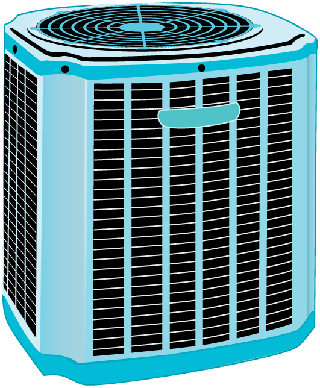

* Describe the use of heat engines in heat pumps and refrigerators.
* Demonstrate how a heat pump works to warm an interior space.
* Explain the differences between heat pumps and refrigerators.
* Calculate a heat pump’s coefficient of performance.

 "){: #import-auto-id1169737753764}

Heat pumps, air conditioners, and refrigerators utilize heat transfer from cold to hot. They are heat engines run backward. We say backward, rather than reverse, because except for Carnot engines, all heat engines, though they can be run backward, cannot truly be reversed. Heat transfer occurs from a cold reservoir <math xmlns="http://www.w3.org/1998/Math/MathML"><semantics><mrow><mrow><msub><mi>Q</mi><mrow><mtext>c</mtext></mrow></msub></mrow><mrow /></mrow><annotation encoding="StarMath 5.0"> size 12{Q rSub { size 8{c} } } {}</annotation></semantics></math>

 and into a hot one. This requires work input <math xmlns="http://www.w3.org/1998/Math/MathML"><semantics><mrow><mrow><mi>W</mi></mrow><mrow /></mrow><annotation encoding="StarMath 5.0"> size 12{W} {}</annotation></semantics></math>

, which is also converted to heat transfer. Thus the heat transfer to the hot reservoir is <math xmlns="http://www.w3.org/1998/Math/MathML"><semantics><mrow><mrow><mrow><msub><mi>Q</mi><mrow><mtext>h</mtext></mrow></msub><mo stretchy="false">=</mo><mrow><msub><mi>Q</mi><mrow><mtext>c</mtext></mrow></msub><mo stretchy="false">+</mo><mi>W</mi></mrow></mrow></mrow><mrow /></mrow><annotation encoding="StarMath 5.0"> size 12{Q rSub { size 8{h} } =Q rSub { size 8{c} } +W} {}</annotation></semantics></math>

. (Note that <math xmlns="http://www.w3.org/1998/Math/MathML"><semantics><mrow><mrow><msub><mi>Q</mi><mrow><mtext>h</mtext></mrow></msub></mrow><mrow /></mrow><annotation encoding="StarMath 5.0"> size 12{Q rSub { size 8{h} } } {}</annotation></semantics></math>

, <math xmlns="http://www.w3.org/1998/Math/MathML"><semantics><mrow><mrow><msub><mi>Q</mi><mrow><mtext>c</mtext></mrow></msub></mrow><mrow /></mrow><annotation encoding="StarMath 5.0"> size 12{Q rSub { size 8{c} } } {}</annotation></semantics></math>

, and <math xmlns="http://www.w3.org/1998/Math/MathML"><semantics><mrow><mrow><mi>W</mi></mrow><mrow /></mrow><annotation encoding="StarMath 5.0"> size 12{W} {}</annotation></semantics></math>

 are positive, with their directions indicated on schematics rather than by sign.) A heat pump’s mission is for heat transfer <math xmlns="http://www.w3.org/1998/Math/MathML"><semantics><mrow><mrow><msub><mi>Q</mi><mrow><mtext>h</mtext></mrow></msub></mrow><mrow /></mrow><annotation encoding="StarMath 5.0"> size 12{Q rSub { size 8{h} } } {}</annotation></semantics></math>

 to occur into a warm environment, such as a home in the winter. The mission of air conditioners and refrigerators is for heat transfer **<math xmlns="http://www.w3.org/1998/Math/MathML"><semantics><mrow><mrow><msub><mi>Q</mi><mrow><mtext>c</mtext></mrow></msub></mrow><mrow /></mrow><annotation encoding="StarMath 5.0"> size 12{Q rSub { size 8{c} } } {}</annotation></semantics></math>

 to occur from a cool environment, such as chilling a room or keeping food at lower temperatures than the environment. (Actually, a heat pump can be used both to heat and cool a space. It is essentially an air conditioner and a heating unit all in one. In this section we will concentrate on its heating mode.)

 ![Part a of the figure shows a heat pump, drawn as a circle. Work W, indicated by a bold orange arrow, is put in to to the pump to transfer heat Q sub c, indicated by a bold orange arrow, out of a cold temperature reservoir T sub c, drawn as a blue rectangle, and pumps heat Q sub h, indicated by a larger bold orange arrow, into high temperature reservoir T sub h. Part b of the figure shows a P V diagram for a Carnot cycle. The pressure P is along the Y axis and the volume V is along the X axis. The graph shows a complete cycle A D C B A. The path begins at point A, then it drops sharply down and slightly to the right until point D. This is marked as an adiabatic expansion. Then the curve drops down more gradually, still to the right, from point D to point C. This is marked as an isotherm at temperature T sub c, during which heat Q sub c enters the system. The curve then rises from point C to point B along the direction opposite to that of A D. This is an adiabatic compression. The last part of the curve rises up from point B back to A. This is marked as an isotherm at temperature T sub h, during which heat Q sub h leaves the system. The path D C is lower than path B A. Heat entering and leaving the system is indicated by bold orange arrows, with Q sub h larger than Q sub c.](../resources/Figure_16_05_01.jpg "Heat pumps, air conditioners, and refrigerators are heat engines operated backward. The one shown here is based on a Carnot (reversible) engine. (a) Schematic diagram showing heat transfer from a cold reservoir to a warm reservoir with a heat pump. The directions of W size 12{W} {}, Qh size 12{Q rSub { size 8{h} } } {}, and Qc size 12{Q rSub { size 8{c} } } {} are opposite what they would be in a heat engine. (b) PV size 12{ ital &quot;PV&quot;} {} diagram for a Carnot cycle similar to that in [link] but reversed, following path ADCBA. The area inside the loop is negative, meaning there is a net work input. There is heat transfer Qc size 12{Q rSub { size 8{c} } } {} into the system from a cold reservoir along path DC, and heat transfer Qh size 12{Q rSub { size 8{h} } } {} out of the system into a hot reservoir along path BA."){: #import-auto-id1169738163546}

# Heat Pumps

The great advantage of using a heat pump to keep your home warm, rather than just burning fuel, is that a heat pump supplies <math xmlns="http://www.w3.org/1998/Math/MathML"><semantics><mrow><mrow><mrow><msub><mi>Q</mi><mrow><mtext>h</mtext></mrow></msub><mo stretchy="false">=</mo><mrow><msub><mi>Q</mi><mrow><mtext>c</mtext></mrow></msub><mo stretchy="false">+</mo><mi>W</mi></mrow></mrow></mrow><mrow /></mrow><annotation encoding="StarMath 5.0"> size 12{Q rSub { size 8{h} } =Q rSub { size 8{c} } +W} {}</annotation></semantics></math>

. Heat transfer is from the outside air, even at a temperature below freezing, to the indoor space. You only pay for <math xmlns="http://www.w3.org/1998/Math/MathML"><semantics><mrow><mrow><mi>W</mi></mrow><mrow /></mrow><annotation encoding="StarMath 5.0"> size 12{W} {}</annotation></semantics></math>

, and you get an additional heat transfer of <math xmlns="http://www.w3.org/1998/Math/MathML"><semantics><mrow><mrow><msub><mi>Q</mi><mrow><mtext>c</mtext></mrow></msub></mrow><mrow /></mrow><annotation encoding="StarMath 5.0"> size 12{Q rSub { size 8{c} } } {}</annotation></semantics></math>

 from the outside at no cost; in many cases, at least twice as much energy is transferred to the heated space as is used to run the heat pump. When you burn fuel to keep warm, you pay for all of it. The disadvantage is that the work input (required by the second law of thermodynamics) is sometimes more expensive than simply burning fuel, especially if the work is done by electrical energy.

The basic components of a heat pump in its heating mode are shown in [\[link\]](#import-auto-id1169737781193). A working fluid such as a non-CFC refrigerant is used. In the outdoor coils (the evaporator), heat transfer <math xmlns="http://www.w3.org/1998/Math/MathML"><semantics><mrow><mrow><msub><mi>Q</mi><mrow><mtext>c</mtext></mrow></msub></mrow><mrow /></mrow><annotation encoding="StarMath 5.0"> size 12{Q rSub { size 8{c} } } {}</annotation></semantics></math>

 occurs to the working fluid from the cold outdoor air, turning it into a gas.

 &#xA0;condenser, (2)&#xA0;expansion valve, (3)&#xA0;evaporator, and (4)&#xA0;compressor. In the heating mode, heat transfer Qc size 12{Q rSub { size 8{c} } } {} occurs to the working fluid in the evaporator (3) from the colder outdoor air, turning it into a gas. The electrically driven compressor (4) increases the temperature and pressure of the gas and forces it into the condenser coils (1) inside the heated space. Because the temperature of the gas is higher than the temperature in the room, heat transfer from the gas to the room occurs as the gas condenses to a liquid. The working fluid is then cooled as it flows back through an expansion valve (2) to the outdoor evaporator coils."){: #import-auto-id1169737781193}

The electrically driven compressor (work input <math xmlns="http://www.w3.org/1998/Math/MathML"><semantics><mrow><mrow><mi>W</mi></mrow><mrow /></mrow><annotation encoding="StarMath 5.0"> size 12{W} {}</annotation></semantics></math>

) raises the temperature and pressure of the gas and forces it into the condenser coils that are inside the heated space. Because the temperature of the gas is higher than the temperature inside the room, heat transfer to the room occurs and the gas condenses to a liquid. The liquid then flows back through a pressure-reducing valve to the outdoor evaporator coils, being cooled through expansion. (In a cooling cycle, the evaporator and condenser coils exchange roles and the flow direction of the fluid is reversed.)

The quality of a heat pump is judged by how much heat transfer <math xmlns="http://www.w3.org/1998/Math/MathML"><semantics><mrow><mrow><msub><mi>Q</mi><mrow><mtext>h</mtext></mrow></msub></mrow><mrow /></mrow><annotation encoding="StarMath 5.0"> size 12{Q rSub { size 8{h} } } {}</annotation></semantics></math>

 occurs into the warm space compared with how much work input <math xmlns="http://www.w3.org/1998/Math/MathML"><semantics><mrow><mrow><mi>W</mi></mrow><mrow /></mrow><annotation encoding="StarMath 5.0"> size 12{W} {}</annotation></semantics></math>

 is required. In the spirit of taking the ratio of what you get to what you spend, we define a **heat pump’s coefficient of performance**{: data-type="term" #import-auto-id1169737930577} (<math xmlns="http://www.w3.org/1998/Math/MathML"><semantics><mrow><mrow><mstyle><mrow><msub><mtext fontstyle="italic">COP</mtext><mrow><mtext>hp</mtext></mrow></msub></mrow></mstyle></mrow><mrow /></mrow><annotation encoding="StarMath 5.0"> size 12{ ital "COP" rSub { size 8{"hp"} } } {}</annotation></semantics></math>

) to be

<math xmlns="http://www.w3.org/1998/Math/MathML"><semantics><mrow><mrow><mrow><mrow><mstyle><mrow><msub><mtext fontstyle="italic">COP</mtext><mrow><mtext>hp</mtext></mrow></msub></mrow></mstyle><mo stretchy="false">=</mo><mfrac><msub><mi>Q</mi><mrow><mtext>h</mtext></mrow></msub><mi>W</mi></mfrac></mrow></mrow><mrow><mtext>.</mtext></mrow></mrow><mrow /></mrow><annotation encoding="StarMath 5.0"> size 12{ ital "COP" rSub { size 8{"hp"} } = { {Q rSub { size 8{h} } } over {W} } } {}</annotation></semantics></math>

Since the efficiency of a heat engine is <math xmlns="http://www.w3.org/1998/Math/MathML"><semantics><mrow><mrow><mrow><mstyle><mrow><mtext fontstyle="italic">Eff</mtext></mrow></mstyle><mo stretchy="false">=</mo><mrow><mi>W</mi><mo stretchy="false">/</mo><msub><mi>Q</mi><mrow><mtext>h</mtext></mrow></msub></mrow></mrow></mrow><mrow /></mrow><annotation encoding="StarMath 5.0"> size 12{ ital "Eff"=W/Q rSub { size 8{h} } } {}</annotation></semantics></math>

, we see that <math xmlns="http://www.w3.org/1998/Math/MathML"><semantics><mrow><mrow><mrow><mstyle><mrow><msub><mtext fontstyle="italic">COP</mtext><mrow><mtext>hp</mtext></mrow></msub></mrow></mstyle><mo stretchy="false">=</mo><mrow><mn>1</mn><mo stretchy="false">/</mo><mstyle><mrow><mtext fontstyle="italic">Eff</mtext></mrow></mstyle></mrow></mrow></mrow><mrow /></mrow><annotation encoding="StarMath 5.0"> size 12{ ital "COP" rSub { size 8{"hp"} } =1/ ital "Eff"} {}</annotation></semantics></math>

, an important and interesting fact. First, since the efficiency of any heat engine is less than 1, it means that <math xmlns="http://www.w3.org/1998/Math/MathML"><semantics><mrow><mrow><mstyle><mrow><msub><mtext fontstyle="italic">COP</mtext><mrow><mtext>hp</mtext></mrow></msub></mrow></mstyle></mrow><mrow /></mrow><annotation encoding="StarMath 5.0"> size 12{ ital "COP" rSub { size 8{"hp"} } } {}</annotation></semantics></math>

 is always greater than 1—that is, a heat pump always has more heat transfer <math xmlns="http://www.w3.org/1998/Math/MathML"><semantics><mrow><mrow><msub><mi>Q</mi><mrow><mtext>h</mtext></mrow></msub></mrow><mrow /></mrow><annotation encoding="StarMath 5.0"> size 12{Q rSub { size 8{h} } } {}</annotation></semantics></math>

 than work put into it. Second, it means that heat pumps work best when temperature differences are small. The efficiency of a perfect, or Carnot, engine is <math xmlns="http://www.w3.org/1998/Math/MathML"><semantics><mrow><mrow><mrow><mstyle><mrow><msub><mtext fontstyle="italic">Eff</mtext><mrow><mtext>C</mtext></mrow></msub></mrow></mstyle><mo stretchy="false">=</mo><mrow><mn>1</mn><mo stretchy="false">−</mo><mfenced open="(" close=")"><mrow><msub><mi>T</mi><mrow><mtext>c</mtext></mrow></msub><mo stretchy="false">/</mo><msub><mi>T</mi><mrow><mtext>h</mtext></mrow></msub></mrow></mfenced></mrow></mrow></mrow><mrow /></mrow><annotation encoding="StarMath 5.0"> size 12{ ital "Eff" rSub { size 8{C} } =1 - left (T rSub { size 8{c} } /T rSub { size 8{h} } right )} {}</annotation></semantics></math>

; thus, the smaller the temperature difference, the smaller the efficiency and the greater the <math xmlns="http://www.w3.org/1998/Math/MathML"><semantics><mrow><mrow><mstyle><mrow><msub><mtext fontstyle="italic">COP</mtext><mrow><mtext>hp</mtext></mrow></msub></mrow></mstyle></mrow><mrow /></mrow><annotation encoding="StarMath 5.0"> size 12{ ital "COP" rSub { size 8{"hp"} } } {}</annotation></semantics></math>

** (because <math xmlns="http://www.w3.org/1998/Math/MathML"><semantics><mrow><mrow><mrow><mstyle><mrow><msub><mtext fontstyle="italic">COP</mtext><mrow><mtext>hp</mtext></mrow></msub></mrow></mstyle><mo stretchy="false">=</mo><mrow><mn>1</mn><mo stretchy="false">/</mo><mstyle><mrow><mtext fontstyle="italic">Eff</mtext></mrow></mstyle></mrow></mrow></mrow><mrow /></mrow><annotation encoding="StarMath 5.0"> size 12{ ital "COP" rSub { size 8{"hp"} } =1/ ital "Eff"} {}</annotation></semantics></math>

). In other words, heat pumps do not work as well in very cold climates as they do in more moderate climates.

Friction and other irreversible processes reduce heat engine efficiency, but they do **not** benefit the operation of a heat pump—instead, they reduce the work input by converting part of it to heat transfer back into the cold reservoir before it gets into the heat pump.

 ![A diagram of a heat pump (shown as a circle). Work W, indicated by a large, wavy orange arrow, is the total work put into the pump. Part of this work is done against friction and is lost in the form of frictional heat, Q sub f, to the cold reservoir. The portion of work that is used by the heat pump is represented by W prime. The pump transfers heat Q sub h, indicated by a large orange arrow, into the hot reservoir, a tan-colored rectangle, at temperature T sub h. Frictional heat Q sub f, indicated by a wavy orange arrow, is transferred to the cold reservoir, a blue rectangle at temperature T sub c. Heat Q sub c, indicated by a smaller wavy orange arrow, is transferred into the pump from the cold reservoir. Heat Q sub h is formed from a combination of W prime and Q sub c.](../resources/Figure_16_05_03.jpg "When a real heat engine is run backward, some of the intended work input &#10;    &#10;     &#10;      &#10;       &#10;        &#10;         &#10;W&#10;         &#10;        &#10;       &#10;      &#10;      &#10;     &#10;     &#10;{ left (W right )} {}&#10;     &#10;    &#10;    goes into heat transfer before it gets into the heat engine, thereby reducing its coefficient of performance COPhp size 12{ ital &quot;COP&quot; rSub { size 8{&quot;hp&quot;} } } {}. In this figure, &#10;    &#10;     &#10;      &#10;       &#10;W&#10;       &#10;       &#10;'&#10;       &#10;      &#10;      &#10;     &#10;     &#10;{W'} {}&#10;     &#10;    &#10;    represents the portion of   &#10;    &#10;     &#10;      &#10;       &#10;W&#10;       &#10;      &#10;      &#10;     &#10;     &#10;{W} {}&#10;     &#10;    &#10;    that goes into the heat pump, while the remainder of   &#10;    &#10;     &#10;      &#10;       &#10;W&#10;       &#10;      &#10;      &#10;     &#10;     &#10;{W} {}&#10;     &#10;    &#10;    is lost in the form of frictional heat &#10;    &#10;     &#10;      &#10;       &#10;        &#10;         &#10;          &#10;Q&#10;          &#10;          &#10;           &#10;            &#10;f&#10;            &#10;           &#10;          &#10;         &#10;        &#10;       &#10;      &#10;      &#10;     &#10;     &#10;{ left (Q rSub { {f} }  right )} {}&#10;     &#10;    &#10;     to the cold reservoir. If all of W size 12{W} {} had gone into the heat pump, then Qh size 12{Q rSub { size 8{h} } } {} would have been greater. The best heat pump uses adiabatic and isothermal processes, since, in theory, there would be no dissipative processes to reduce the heat transfer to the hot reservoir."){: #import-auto-id1169738011941}

The Best <em>COP </em>hp of a Heat Pump for Home Use

A heat pump used to warm a home must employ a cycle that produces a working fluid at temperatures greater than typical indoor temperature so that heat transfer to the inside can take place. Similarly, it must produce a working fluid at temperatures that are colder than the outdoor temperature so that heat transfer occurs from outside. Its hot and cold reservoir temperatures therefore cannot be too close, placing a limit on its <math xmlns="http://www.w3.org/1998/Math/MathML"><semantics><mrow><mrow><mstyle><mrow><msub><mtext fontstyle="italic">COP</mtext><mrow><mtext>hp</mtext></mrow></msub></mrow></mstyle></mrow><mrow /></mrow><annotation encoding="StarMath 5.0"> size 12{ ital "COP" rSub { size 8{"hp"} } } {}</annotation></semantics></math>

. (See [\[link\]](#import-auto-id1169738188695).) What is the best coefficient of performance possible for such a heat pump, if it has a hot reservoir temperature of <math xmlns="http://www.w3.org/1998/Math/MathML"><semantics><mrow><mrow><mrow><mtext>45</mtext><mtext>.</mtext><mn>0</mn><mtext>º</mtext><mtext>C</mtext></mrow></mrow><mrow /></mrow><annotation encoding="StarMath 5.0"> size 12{"45" "." 0°C} {}</annotation></semantics></math>

 and a cold reservoir temperature of <math xmlns="http://www.w3.org/1998/Math/MathML"><semantics><mrow><mrow><mrow><mrow><mo stretchy="false">−</mo><mtext>15</mtext></mrow><mtext>.</mtext><mn>0</mn><mtext>º</mtext><mtext>C</mtext></mrow></mrow><mrow /></mrow><annotation encoding="StarMath 5.0"> size 12{-"15" "." 0°C} {}</annotation></semantics></math>

?

**Strategy**

A Carnot engine reversed will give the best possible performance as a heat pump. As noted above, <math xmlns="http://www.w3.org/1998/Math/MathML"><semantics><mrow><mrow><mrow><mstyle><mrow><msub><mtext fontstyle="italic">COP</mtext><mrow><mtext>hp</mtext></mrow></msub></mrow></mstyle><mo stretchy="false">=</mo><mrow><mn>1</mn><mo stretchy="false">/</mo><mstyle><mrow><mtext fontstyle="italic">Eff</mtext></mrow></mstyle></mrow></mrow></mrow><mrow /></mrow><annotation encoding="StarMath 5.0"> size 12{ ital "COP" rSub { size 8{"hp"} } =1/ ital "Eff"} {}</annotation></semantics></math>

, so that we need to first calculate the Carnot efficiency to solve this problem.

**Solution**

Carnot efficiency in terms of absolute temperature is given by**\:**

<math xmlns="http://www.w3.org/1998/Math/MathML"><semantics><mrow><mrow><mrow><mrow><mstyle><mrow><msub><mtext fontstyle="italic">Eff</mtext><mrow><mtext>C</mtext></mrow></msub></mrow></mstyle><mo stretchy="false">=</mo><mrow><mn>1</mn><mo stretchy="false">−</mo><mfrac><msub><mi>T</mi><mrow><mtext>c</mtext></mrow></msub><msub><mi>T</mi><mrow><mtext>h</mtext></mrow></msub></mfrac></mrow></mrow></mrow><mrow><mtext>.</mtext></mrow></mrow><mrow /></mrow><annotation encoding="StarMath 5.0"> size 12{ ital "Eff" rSub { size 8{C} } =1 - { {T rSub { size 8{c} } } over {T rSub { size 8{h} } } } } {}</annotation></semantics></math>

The temperatures in kelvins are <math xmlns="http://www.w3.org/1998/Math/MathML"><semantics><mrow><mrow><mrow><mrow><msub><mi>T</mi><mrow><mtext>h</mtext></mrow></msub><mo stretchy="false">=</mo><mtext>318 K</mtext></mrow></mrow></mrow><mrow /></mrow><annotation encoding="StarMath 5.0"> size 12{T rSub { size 8{h} } ="318"" K"} {}</annotation></semantics></math>

 and <math xmlns="http://www.w3.org/1998/Math/MathML"><semantics><mrow><mrow><mrow><mrow><msub><mi>T</mi><mrow><mtext>c</mtext></mrow></msub><mo stretchy="false">=</mo><mtext>258 K</mtext></mrow></mrow></mrow><mrow /></mrow><annotation encoding="StarMath 5.0"> size 12{T rSub { size 8{c} } ="258"" K"} {}</annotation></semantics></math>

, so that

<math xmlns="http://www.w3.org/1998/Math/MathML"><semantics><mrow><mrow><mrow><mrow><mrow><mrow><mstyle><mrow><msub><mtext fontstyle="italic">Eff</mtext><mrow><mtext>C</mtext></mrow></msub></mrow></mstyle><mo stretchy="false">=</mo><mrow><mn>1</mn><mo stretchy="false">−</mo><mfrac><mrow><mtext>258 K</mtext></mrow><mtext>318 K</mtext></mfrac></mrow></mrow><mo stretchy="false">=</mo><mn>0</mn></mrow><mtext>.</mtext><mtext>1887</mtext></mrow></mrow><mrow><mtext>.</mtext></mrow></mrow><mrow /></mrow><annotation encoding="StarMath 5.0"> size 12{ ital "Eff" rSub { size 8{C} } =1 - { {"258"" K"} over {"318 K"} } =0 "." "1887"} {}</annotation></semantics></math>

Thus, from the discussion above,

<math xmlns="http://www.w3.org/1998/Math/MathML"> <semantics> <mrow> <mrow> <mrow> <mrow> <mrow> <mrow> <mstyle> <mrow> <msub> <mtext fontstyle="italic">COP</mtext> <mrow> <mtext>hp</mtext> </mrow> </msub> </mrow> </mstyle> <mo stretchy="false">=</mo> <mfrac> <mn>1</mn> <mstyle fontstyle="italic"> <mrow> <mtext>Eff</mtext> </mrow> </mstyle> </mfrac> </mrow> <mo stretchy="false">=</mo> <mfrac> <mn>1</mn> <mrow> <mn>0</mn> <mtext>.</mtext> <mtext>1887</mtext> </mrow> </mfrac> </mrow> <mo stretchy="false">=</mo> <mn>5</mn> </mrow> <mtext>.</mtext> <mtext>30</mtext> <mi>,</mi> </mrow> </mrow> <mrow /> </mrow> <annotation encoding="StarMath 5.0"> size 12{ ital "COP" rSub { size 8{"hp"} } = { {1} over { ital "Eff"} } = { {1} over {0 "." "1887"} } =5 "." "30",} {}</annotation> </semantics> </math>

or

<math xmlns="http://www.w3.org/1998/Math/MathML"> <semantics> <mrow> <mrow> <mrow> <mrow> <mrow> <mstyle> <mrow> <msub> <mtext fontstyle="italic">COP</mtext> <mrow> <mtext>hp</mtext> </mrow> </msub> </mrow> </mstyle> <mo stretchy="false">=</mo> <mfrac> <msub> <mi>Q</mi> <mrow> <mtext>h</mtext> </mrow> </msub> <mi>W</mi> </mfrac> </mrow> <mo stretchy="false">=</mo> <mn>5</mn> </mrow> <mtext>.</mtext> <mtext>30</mtext> <mtext>,</mtext> </mrow> </mrow> <mrow /> </mrow> <annotation encoding="StarMath 5.0"> size 12{ ital "COP" rSub { size 8{"hp"} } = { {Q rSub { size 8{h} } } over {W} } =5 "." "30",} {}</annotation> </semantics> </math>

so that

<math xmlns="http://www.w3.org/1998/Math/MathML"> <semantics> <mrow> <mrow> <mrow> <mrow> <msub> <mi>Q</mi> <mrow> <mtext>h</mtext> </mrow> </msub> <mo stretchy="false">=</mo> <mn>5.30 W</mn> </mrow> <mtext>.</mtext> </mrow> </mrow> <mrow /> </mrow> <annotation encoding="StarMath 5.0"> size 12{Q rSub { size 8{h} } =5 "." "30"" W" "." } {}</annotation> </semantics> </math>

**Discussion**

This result means that the heat transfer by the heat pump is 5.30 times as much as the work put into it. It would cost 5.30 times as much for the same heat transfer by an electric room heater as it does for that produced by this heat pump. This is not a violation of conservation of energy. Cold ambient air provides 4.3 J per 1 J of work from the electrical outlet.

![The figure shows a schematic diagram of a heat pump. The hot and cold reservoirs are shown as two rectangular boxes attached to a vertical rectangular wall. The hot reservoir is at temperature T sub c equals negative fifteen degrees Celsius and the hot reservoir is at a temperature T sub h equals forty five degrees Celsius. Work W is shown to enter from an electrical outlet. Heat Q sub c is shown to enter the cold reservoir at an outside air temperature of negative five degrees Celsius and Q sub h is shown to leave the hot reservoir at an inside air temperature of twenty degrees Celsius.](../resources/Figure_16_05_04.jpg "Heat transfer from the outside to the inside, along with work done to run the pump, takes place in the heat pump of the example above. Note that the cold temperature produced by the heat pump is lower than the outside temperature, so that heat transfer into the working fluid occurs. The pump&#x2019;s compressor produces a temperature greater than the indoor temperature in order for heat transfer into the house to occur.&#10; "){: #import-auto-id1169738188695}

Real heat pumps do not perform quite as well as the ideal one in the previous example; their values of <math xmlns="http://www.w3.org/1998/Math/MathML"><semantics><mrow><mrow><mstyle><mrow><msub><mtext fontstyle="italic">COP</mtext><mrow><mtext>hp</mtext></mrow></msub></mrow></mstyle></mrow><mrow /></mrow><annotation encoding="StarMath 5.0"> size 12{ ital "COP" rSub { size 8{"hp"} } } {}</annotation></semantics></math>

 range from about 2 to 4. This range means that the heat transfer <math xmlns="http://www.w3.org/1998/Math/MathML"><semantics><mrow><mrow><msub><mi>Q</mi><mrow><mtext>h</mtext></mrow></msub></mrow><mrow /></mrow><annotation encoding="StarMath 5.0"> size 12{Q rSub { size 8{h} } } {}</annotation></semantics></math>

 from the heat pumps is 2 to 4 times as great as the work <math xmlns="http://www.w3.org/1998/Math/MathML"><semantics><mrow><mrow><mi>W</mi></mrow><mrow /></mrow><annotation encoding="StarMath 5.0"> size 12{W} {}</annotation></semantics></math>

 put into them. Their economical feasibility is still limited, however, since <math xmlns="http://www.w3.org/1998/Math/MathML"><semantics><mrow><mrow><mi>W</mi></mrow><mrow /></mrow><annotation encoding="StarMath 5.0"> size 12{W} {}</annotation></semantics></math>

 is usually supplied by electrical energy that costs more per joule than heat transfer by burning fuels like natural gas. Furthermore, the initial cost of a heat pump is greater than that of many furnaces, so that a heat pump must last longer for its cost to be recovered. Heat pumps are most likely to be economically superior where winter temperatures are mild, electricity is relatively cheap, and other fuels are relatively expensive. Also, since they can cool as well as heat a space, they have advantages where cooling in summer months is also desired. Thus some of the best locations for heat pumps are in warm summer climates with cool winters. [\[link\]](#import-auto-id1169737818608) shows a heat pump, called a “*reverse cycle”* or “<em>split-system cooler” </em> in some countries.

 {: #import-auto-id1169737818608}

# Air Conditioners and Refrigerators

Air conditioners and refrigerators are designed to cool something down in a warm environment. As with heat pumps, work input is required for heat transfer from cold to hot, and this is expensive. The quality of air conditioners and refrigerators is judged by how much heat transfer <math xmlns="http://www.w3.org/1998/Math/MathML"><semantics><mrow><mrow><msub><mi>Q</mi><mrow><mtext>c</mtext></mrow></msub></mrow><mrow /></mrow><annotation encoding="StarMath 5.0"> size 12{Q rSub { size 8{c} } } {}</annotation></semantics></math>

 occurs from a cold environment compared with how much work input <math xmlns="http://www.w3.org/1998/Math/MathML"><semantics><mrow><mrow><mi>W</mi></mrow><mrow /></mrow><annotation encoding="StarMath 5.0"> size 12{W} {}</annotation></semantics></math>

 is required. What is considered the benefit in a heat pump is considered waste heat in a refrigerator. We thus define the **coefficient of performance**{: data-type="term" #import-auto-id1169737825579} <math xmlns="http://www.w3.org/1998/Math/MathML"><semantics><mrow><mrow><mstyle><mrow><msub><mtext fontstyle="italic">(COP</mtext><mrow><mtext>ref</mtext></mrow></msub><mtext>)</mtext></mrow></mstyle></mrow><mrow /></mrow><annotation encoding="StarMath 5.0"> size 12{ ital "COP" rSub { size 8{"ref"} } } {}</annotation></semantics></math>

 of an air conditioner or refrigerator to be

<math xmlns="http://www.w3.org/1998/Math/MathML"> <semantics> <mrow> <mrow> <mrow> <mrow> <mstyle> <mrow> <msub> <mtext fontstyle="italic">COP</mtext> <mrow> <mstyle> <mrow> <mtext>ref</mtext> </mrow> </mstyle> </mrow> </msub> </mrow> </mstyle> <mo stretchy="false">=</mo> <mfrac> <msub> <mi>Q</mi> <mrow> <mtext>c</mtext> </mrow> </msub> <mi>W</mi> </mfrac> </mrow> <mtext>.</mtext> </mrow> </mrow> <mrow /> </mrow> <annotation encoding="StarMath 5.0"> size 12{ ital "COP" rSub { size 8{ ital "ref"} } = { {Q rSub { size 8{c} } } over {W} } "." } {}</annotation> </semantics> </math>

Noting again that <math xmlns="http://www.w3.org/1998/Math/MathML"><semantics><mrow><mrow><mrow><msub><mi>Q</mi><mrow><mtext>h</mtext></mrow></msub><mo stretchy="false">=</mo><mrow><msub><mi>Q</mi><mrow><mtext>c</mtext></mrow></msub><mo stretchy="false">+</mo><mi>W</mi></mrow></mrow></mrow><mrow /></mrow><annotation encoding="StarMath 5.0"> size 12{Q rSub { size 8{h} } =Q rSub { size 8{c} } +W} {}</annotation></semantics></math>

, we can see that an air conditioner will have a lower coefficient of performance than a heat pump, because <math xmlns="http://www.w3.org/1998/Math/MathML"><semantics><mrow><mrow><mrow><mstyle><mrow><msub><mtext fontstyle="italic">COP</mtext><mrow><mtext>hp</mtext></mrow></msub></mrow></mstyle><mo stretchy="false">=</mo><mrow><msub><mi>Q</mi><mrow><mtext>h</mtext></mrow></msub><mo stretchy="false">/</mo><mi>W</mi></mrow></mrow></mrow><mrow /></mrow><annotation encoding="StarMath 5.0"> size 12{ ital "COP" rSub { size 8{"hp"} } =Q rSub { size 8{h} } /W} {}</annotation></semantics></math>

 and <math xmlns="http://www.w3.org/1998/Math/MathML"><semantics><mrow><mrow><msub><mi>Q</mi><mrow><mtext>h</mtext></mrow></msub></mrow><mrow /></mrow><annotation encoding="StarMath 5.0"> size 12{Q rSub { size 8{h} } } {}</annotation></semantics></math>

 is greater than <math xmlns="http://www.w3.org/1998/Math/MathML"><semantics><mrow><mrow><msub><mi>Q</mi><mrow><mtext>c</mtext></mrow></msub></mrow><mrow /></mrow><annotation encoding="StarMath 5.0"> size 12{Q rSub { size 8{c} } } {}</annotation></semantics></math>

. In this module’s Problems and Exercises, you will show that

<math xmlns="http://www.w3.org/1998/Math/MathML"> <semantics> <mrow> <mrow> <mrow> <mstyle> <mrow> <msub> <mtext fontstyle="italic">COP</mtext> <mrow> <mtext>ref</mtext> </mrow> </msub> </mrow> </mstyle> <mo stretchy="false">=</mo> <mrow> <mstyle> <mrow> <msub> <mtext fontstyle="italic">COP</mtext> <mrow> <mtext>hp</mtext> </mrow> </msub> </mrow> </mstyle> <mo stretchy="false">−</mo> <mn>1</mn> </mrow> </mrow> </mrow> <mrow /> </mrow> <annotation encoding="StarMath 5.0"> size 12{ ital "COP" rSub { size 8{"ref"} } = ital "COP" rSub { size 8{"hp"} } - 1} {}</annotation> </semantics> </math>

for a heat engine used as either an air conditioner or a heat pump operating between the same two temperatures. Real air conditioners and refrigerators typically do remarkably well, having values of <math xmlns="http://www.w3.org/1998/Math/MathML"><semantics><mrow><mrow><mstyle><mrow><msub><mtext fontstyle="italic">COP</mtext><mrow><mtext>ref</mtext></mrow></msub></mrow></mstyle></mrow><mrow /></mrow><annotation encoding="StarMath 5.0"> size 12{ ital "COP" rSub { size 8{"ref"} } } {}</annotation></semantics></math>

 ranging from 2 to 6. These numbers are better than the <math xmlns="http://www.w3.org/1998/Math/MathML"><semantics><mrow><mrow><mstyle><mrow><msub><mtext fontstyle="italic">COP</mtext><mrow><mtext>hp</mtext></mrow></msub></mrow></mstyle></mrow><mrow /></mrow><annotation encoding="StarMath 5.0"> size 12{ ital "COP" rSub { size 8{"hp"} } } {}</annotation></semantics></math>

 values for the heat pumps mentioned above, because the temperature differences are smaller, but they are less than those for Carnot engines operating between the same two temperatures.

A type of <math xmlns="http://www.w3.org/1998/Math/MathML"><semantics><mrow><mrow><mstyle fontstyle="italic"><mrow><mtext>COP</mtext></mrow></mstyle></mrow><mrow /></mrow><annotation encoding="StarMath 5.0"> size 12{ ital "COP"} {}</annotation></semantics></math>

 rating system called the “energy efficiency rating” (<math xmlns="http://www.w3.org/1998/Math/MathML"> <semantics> <mrow> <mrow> <mstyle fontstyle="italic"> <mrow> <mtext>EER</mtext> </mrow> </mstyle> </mrow> <mrow /> </mrow> <annotation encoding="StarMath 5.0"> size 12{ ital "EER"} {}</annotation> </semantics> </math>

 ) has been developed. This rating is an example where non-SI units are still used and relevant to consumers. To make it easier for the consumer, Australia, Canada, New Zealand, and the U.S. use an Energy Star Rating out of 5 stars—the more stars, the more energy efficient the appliance. <math xmlns="http://www.w3.org/1998/Math/MathML"> <semantics> <mrow> <mrow> <mstyle> <mrow> <mtext fontstyle="italic">EER</mtext> <mtext>s</mtext> </mrow> </mstyle> </mrow> <mrow /> </mrow> <annotation encoding="StarMath 5.0"> size 12{ ital "EER"} {}</annotation> </semantics> </math>

 are expressed in mixed units of British thermal units (Btu) per hour of heating or cooling divided by the power input in watts. Room air conditioners are readily available with <math xmlns="http://www.w3.org/1998/Math/MathML"> <semantics> <mrow> <mrow> <mstyle> <mrow> <mtext fontstyle="italic">EER</mtext> <mtext>s</mtext> </mrow> </mstyle> </mrow> <mrow /> </mrow> <annotation encoding="StarMath 5.0"> size 12{ ital "EER"} {}</annotation> </semantics> </math>

 ranging from 6 to 12. Although not the same as the <math xmlns="http://www.w3.org/1998/Math/MathML"><semantics><mrow><mrow><mstyle><mrow><mtext fontstyle="italic">COP</mtext><mtext>s</mtext></mrow></mstyle></mrow><mrow /></mrow><annotation encoding="StarMath 5.0"> size 12{ ital "COP"} {}</annotation></semantics></math>

 just described, these <math xmlns="http://www.w3.org/1998/Math/MathML"> <semantics> <mrow> <mrow> <mstyle> <mrow> <mtext fontstyle="italic">EER</mtext> <mtext>s</mtext> </mrow> </mstyle> </mrow> <mrow /> </mrow> <annotation encoding="StarMath 5.0"> size 12{ ital "EER"} {}</annotation> </semantics> </math>

 are good for comparison purposes—the greater the <math xmlns="http://www.w3.org/1998/Math/MathML"> <semantics> <mrow> <mrow> <mstyle fontstyle="italic"> <mrow> <mtext>EER</mtext> </mrow> </mstyle> </mrow> <mrow /> </mrow> <annotation encoding="StarMath 5.0"> size 12{ ital "EER"} {}</annotation> </semantics> </math>

, the cheaper an air conditioner is to operate (but the higher its purchase price is likely to be).

The <math xmlns="http://www.w3.org/1998/Math/MathML"> <semantics> <mrow> <mrow> <mstyle mathvariant="italic"> <mrow> <mtext> EER </mtext> </mrow> </mstyle> </mrow> <mrow /> </mrow> <annotation encoding="StarMath 5.0"> { ital "EER"s} {} </annotation> </semantics> </math>

 of an air conditioner or refrigerator can be expressed as

<math xmlns="http://www.w3.org/1998/Math/MathML"> <semantics> <mrow> <mrow> <mrow> <mstyle mathvariant="italic"> <mrow> <mtext> EER </mtext> </mrow> </mstyle> <mo stretchy="false"> = </mo> <mrow> <mfrac> <mrow> <mrow> <msub> <mi> Q </mi> <mrow> <mrow> <mtext> c </mtext> </mrow> </mrow> </msub> <mo stretchy="false"> / </mo> <msub> <mi> t </mi> <mrow> <mrow> <mn> 1 </mn> </mrow> </mrow> </msub> </mrow> </mrow> <mrow> <mrow> <mi> W </mi> <mo stretchy="false"> / </mo> <msub> <mi> t </mi> <mrow> <mstyle mathsize="8pt"> <mrow> <mrow> <mn> 2 </mn> </mrow> </mrow> </mstyle> </mrow> </msub> </mrow> </mrow> </mfrac> </mrow> </mrow> <mi> , </mi> </mrow> <mrow /> </mrow> <annotation encoding="StarMath 5.0"> { ital "EER"= { {Q rSub { {c} } /t rSub { {1} } } over {W/t rSub { size 8{2} } } } ,} {} </annotation> </semantics> </math>

where <math xmlns="http://www.w3.org/1998/Math/MathML"> <semantics> <mrow> <mrow> <msub> <mi> Q </mi> <mrow> <mrow> <mtext> c </mtext> </mrow> </mrow> </msub> </mrow> <mrow /> </mrow> <annotation encoding="StarMath 5.0"> {Q rSub { {c} } } {} </annotation> </semantics> </math>

 is the amount of heat transfer from a cold environment in British thermal units, <math xmlns="http://www.w3.org/1998/Math/MathML"> <semantics> <mrow> <mrow> <msub> <mi> t </mi> <mrow> <mrow> <mtext> 1 </mtext> </mrow> </mrow> </msub> </mrow> <mrow /> </mrow> <annotation encoding="StarMath 5.0"> {Q rSub { {c} } } {} </annotation> </semantics> </math>

 is time in hours, <math xmlns="http://www.w3.org/1998/Math/MathML"> <semantics> <mrow> <mrow> <mi> W </mi> </mrow> <mrow /> </mrow> <annotation encoding="StarMath 5.0"> {W} {} </annotation> </semantics> </math>

 is the work input in joules, and <math xmlns="http://www.w3.org/1998/Math/MathML"> <semantics> <mrow> <mrow> <msub> <mi> t </mi> <mrow> <mrow> <mtext> 2 </mtext> </mrow> </mrow> </msub> </mrow> <mrow /> </mrow> </semantics> </math>

 is time in seconds.

Problem-Solving Strategies for Thermodynamics

1.  {: #import-auto-id1169737786600} **Examine the situation to determine whether heat, work, or internal energy are involved*.* Look for any system where the primary methods of transferring energy are heat and work. Heat engines, heat pumps, refrigerators, and air conditioners are examples of such systems.
2.  {: #import-auto-id1169737929881} **Identify the system of interest and draw a labeled diagram of the system showing energy flow.**
3.  {: #import-auto-id1169736654386} **Identify exactly what needs to be determined in the problem (identify the unknowns)*.* A written list is useful. Maximum efficiency means a Carnot engine is involved. Efficiency is not the same as the coefficient of performance.
4.  {: #import-auto-id1169737778543} **Make a list of what is given or can be inferred from the problem as stated (identify the knowns)*.* Be sure to distinguish heat transfer into a system from heat transfer out of the system, as well as work input from work output. In many situations, it is useful to determine the type of process, such as isothermal or adiabatic.
5.  {: #import-auto-id1169737830995} **Solve the appropriate equation for the quantity to be determined (the unknown).**
6.  {: #import-auto-id1169737758055} **Substitute the known quantities along with their units into the appropriate equation and obtain numerical solutions complete with units.**
7.  {: #import-auto-id1169738249717} **Check the answer to see if it is reasonable: Does it make sense?** For example, efficiency is always less than 1, whereas coefficients of performance are greater than 1.
{: data-number-style="arabic"}

# Section Summary

* {: #import-auto-id1169738061384} An artifact of the second law of thermodynamics is the ability to heat an interior space using a heat pump. Heat pumps compress cold ambient air and, in so doing, heat it to room temperature without violation of conservation principles.
* {: #import-auto-id1169738250431} To calculate the heat pump’s coefficient of performance, use the equation
  <math xmlns="http://www.w3.org/1998/Math/MathML"><semantics><mrow><mrow><mrow><mstyle><mrow><msub><mtext fontstyle="italic">COP</mtext><mrow><mtext>hp</mtext></mrow></msub></mrow></mstyle><mo stretchy="false">=</mo><mfrac><msub><mi>Q</mi><mrow><mtext>h</mtext></mrow></msub><mi>W</mi></mfrac></mrow></mrow><mrow /></mrow><annotation encoding="StarMath 5.0"> size 12{ ital "COP" rSub { size 8{"hp"} } = { {Q rSub { size 8{h} } } over {W} } } {}</annotation></semantics></math>
  
  .
* {: #import-auto-id1169738136768} A refrigerator is a heat pump; it takes warm ambient air and expands it to chill it.

# Conceptual Questions

Explain why heat pumps do not work as well in very cold climates as they do in milder ones. Is the same true of refrigerators?

In some Northern European nations, homes are being built without heating systems of any type. They are very well insulated and are kept warm by the body heat of the residents. However, when the residents are not at home, it is still warm in these houses. What is a possible explanation?

Why do refrigerators, air conditioners, and heat pumps operate most cost-effectively for cycles with a small difference between <math xmlns="http://www.w3.org/1998/Math/MathML"><semantics><mrow><mrow><msub><mi>T</mi><mrow><mtext>h</mtext></mrow></msub></mrow><mrow /></mrow><annotation encoding="StarMath 5.0"> size 12{T rSub { size 8{h} } } {}</annotation></semantics></math>

 and <math xmlns="http://www.w3.org/1998/Math/MathML"><semantics><mrow><mrow><msub><mi>T</mi><mrow><mtext>c</mtext></mrow></msub></mrow><mrow /></mrow><annotation encoding="StarMath 5.0"> size 12{T rSub { size 8{c} } } {}</annotation></semantics></math>

? (Note that the temperatures of the cycle employed are crucial to its <math xmlns="http://www.w3.org/1998/Math/MathML"><semantics><mrow><mrow><mstyle fontstyle="italic"><mrow><mtext>COP</mtext></mrow></mstyle></mrow><mrow /></mrow><annotation encoding="StarMath 5.0"> size 12{ ital "COP"} {}</annotation></semantics></math>

.)

Grocery store managers contend that there is **less** total energy consumption in the summer if the store is kept at a **low** temperature. Make arguments to support or refute this claim, taking into account that there are numerous refrigerators and freezers in the store.

Can you cool a kitchen by leaving the refrigerator door open?

# Problem Exercises

What is the coefficient of performance of an ideal heat pump that has heat transfer from a cold temperature of <math xmlns="http://www.w3.org/1998/Math/MathML"><semantics><mrow><mrow><mrow><mrow><mo stretchy="false">−</mo><mtext>25</mtext></mrow><mtext>.</mtext><mn>0</mn><mtext>º</mtext><mtext>C</mtext></mrow></mrow><mrow /></mrow><annotation encoding="StarMath 5.0"> size 12{-"25" "." 0°C} {}</annotation></semantics></math>

 to a hot temperature of <math xmlns="http://www.w3.org/1998/Math/MathML"><semantics><mrow><mrow><mrow><mtext>40</mtext><mtext>.</mtext><mn>0</mn><mtext>º</mtext><mtext>C</mtext></mrow></mrow><mrow /></mrow><annotation encoding="StarMath 5.0"> size 12{"40" "." 0°C} {}</annotation></semantics></math>

?

4\.82

Suppose you have an ideal refrigerator that cools an environment at <math xmlns="http://www.w3.org/1998/Math/MathML"><semantics><mrow><mrow><mrow><mrow><mo stretchy="false">−</mo><mtext>20</mtext></mrow><mtext>.</mtext><mn>0</mn><mtext>º</mtext><mtext>C</mtext></mrow></mrow><mrow /></mrow><annotation encoding="StarMath 5.0"> size 12{-"20" "." 0°C} {}</annotation></semantics></math>

 and has heat transfer to another environment at <math xmlns="http://www.w3.org/1998/Math/MathML"><semantics><mrow><mrow><mrow><mtext>50</mtext><mtext>.</mtext><mn>0</mn><mtext>º</mtext><mtext>C</mtext></mrow></mrow><mrow /></mrow><annotation encoding="StarMath 5.0"> size 12{"50" "." 0°C} {}</annotation></semantics></math>

. What is its coefficient of performance?

What is the best coefficient of performance possible for a hypothetical refrigerator that could make liquid nitrogen at <math xmlns="http://www.w3.org/1998/Math/MathML"><semantics><mrow><mrow><mrow><mrow><mo stretchy="false">−</mo><mtext>200</mtext></mrow><mtext>º</mtext><mtext>C</mtext></mrow></mrow><mrow /></mrow><annotation encoding="StarMath 5.0"> size 12{-"200"°C} {}</annotation></semantics></math>

 and has heat transfer to the environment at <math xmlns="http://www.w3.org/1998/Math/MathML"><semantics><mrow><mrow><mrow><mtext>35</mtext><mtext>.</mtext><mn>0</mn><mtext>º</mtext><mtext>C</mtext></mrow></mrow><mrow /></mrow><annotation encoding="StarMath 5.0"> size 12{"35" "." 0°C} {}</annotation></semantics></math>

?

0\.311

In a very mild winter climate, a heat pump has heat transfer from an environment at <math xmlns="http://www.w3.org/1998/Math/MathML"><semantics><mrow><mrow><mrow><mn>5</mn><mtext>.</mtext><mtext>00</mtext><mtext>º</mtext><mtext>C</mtext></mrow></mrow><mrow /></mrow><annotation encoding="StarMath 5.0"> size 12{5 "." "00"°C} {}</annotation></semantics></math>

 to one at <math xmlns="http://www.w3.org/1998/Math/MathML"><semantics><mrow><mrow><mrow><mtext>35</mtext><mtext>.</mtext><mn>0</mn><mtext>º</mtext><mtext>C</mtext></mrow></mrow><mrow /></mrow><annotation encoding="StarMath 5.0"> size 12{"35" "." 0°C} {}</annotation></semantics></math>

. What is the best possible coefficient of performance for these temperatures? Explicitly show how you follow the steps in the [Problem-Solving Strategies for Thermodynamics](#fs-id1169738116696).

(a) What is the best coefficient of performance for a heat pump that has a hot reservoir temperature of <math xmlns="http://www.w3.org/1998/Math/MathML"><semantics><mrow><mrow><mrow><mtext>50</mtext><mtext>.</mtext><mn>0</mn><mtext>º</mtext><mtext>C</mtext></mrow></mrow><mrow /></mrow></semantics></math>

 and a cold reservoir temperature of <math xmlns="http://www.w3.org/1998/Math/MathML"><semantics><mrow><mrow><mrow><mrow><mo stretchy="false">−</mo><mtext>20</mtext></mrow><mtext>.0ºC</mtext></mrow></mrow><mrow /></mrow></semantics></math>

? (b) How much heat transfer occurs into the warm environment if <math xmlns="http://www.w3.org/1998/Math/MathML"><semantics><mrow><mrow><mrow><mn>3</mn><mtext>.60</mtext><mo>×</mo><msup><mtext>10</mtext><mrow><mn>7</mn></mrow></msup><mspace width="0.25em" /><mtext> J</mtext></mrow></mrow><mrow /></mrow></semantics></math>

 of work (<math xmlns="http://www.w3.org/1998/Math/MathML"><semantics><mrow><mrow><mrow><mtext>10</mtext><mtext>.</mtext><mn>0</mn><mrow><mtext> kW</mtext><mo stretchy="false">⋅</mo><mtext>h</mtext></mrow></mrow></mrow><mrow /></mrow></semantics></math>

) is put into it? (c) If the cost of this work input is <math xmlns="http://www.w3.org/1998/Math/MathML"><semantics><mrow><mrow><mrow><mtext>10.0 cents/kW</mtext><mo stretchy="false">⋅</mo><mtext>h</mtext></mrow></mrow></mrow></semantics></math>

, how does its cost compare with the direct heat transfer achieved by burning natural gas at a cost of 85.0 cents per therm. (A therm is a common unit of energy for natural gas and equals <math xmlns="http://www.w3.org/1998/Math/MathML"><semantics><mrow><mrow><mrow><mn>1</mn><mtext>.</mtext><mtext>055</mtext><mo>×</mo><msup><mtext>10</mtext><mrow><mn>8</mn></mrow></msup><mspace width="0.25em" /><mtext> J</mtext></mrow></mrow><mrow /></mrow><annotation encoding="StarMath 5.0"> size 12{1 "." "055"´"10" rSup { size 8{8} } " J"} {}</annotation></semantics></math>

.)

(a) 4.61

(b) <math xmlns="http://www.w3.org/1998/Math/MathML"> <semantics> <mrow> <mrow> <mn> 1 </mn> <mtext> . </mtext> <mrow> <mtext> 66 </mtext> <mo stretchy="false"> × </mo> <msup> <mtext> 10 </mtext> <mrow> <mrow> <mn> 8 </mn> </mrow> </mrow> </msup> </mrow><mspace width="0.25em" /> <mtext> J </mtext> <mspace width="0.25em" /> <mtext> or 3 </mtext> <mtext> . </mtext> <mrow> <mtext> 97 </mtext> <mo stretchy="false"> × </mo> <msup> <mtext> 10 </mtext> <mrow> <mrow> <mn> 4 </mn> </mrow> </mrow> </msup> </mrow> <mspace width="0.25em" /> <mtext> kcal </mtext> </mrow> <mrow /> </mrow> <annotation encoding="StarMath 5.0"> {1 "." "66" times "10" rSup { {8} } " J"`"or 3" "." "97" times "10" rSup { {4} } `"kcal"} {} </annotation> </semantics> </math>

(c) To transfer <math xmlns="http://www.w3.org/1998/Math/MathML"> <semantics> <mrow> <mrow> <mn> 1 </mn> <mtext> . </mtext> <mrow> <mtext> 66 </mtext> <mo stretchy="false"> × </mo> <msup> <mtext> 10 </mtext> <mrow> <mrow> <mn> 8 </mn> </mrow> </mrow> </msup> </mrow><mspace width="0.25em" /> <mtext> J </mtext> </mrow> <mrow /> </mrow> <annotation encoding="StarMath 5.0"> {1 "." "66" times "10" rSup { {8} } " J"} {} </annotation> </semantics> </math>

 , heat pump costs $1.00, natural gas costs $1.34.

(a) What is the best coefficient of performance for a refrigerator that cools an environment at <math xmlns="http://www.w3.org/1998/Math/MathML"><semantics><mrow><mrow><mrow><mrow><mo stretchy="false">−</mo><mtext>30</mtext></mrow><mtext>.</mtext><mn>0</mn><mtext>º</mtext><mtext>C</mtext></mrow></mrow><mrow /></mrow><annotation encoding="StarMath 5.0"> size 12{-"30" "." 0°C} {}</annotation></semantics></math>

 and has heat transfer to another environment at <math xmlns="http://www.w3.org/1998/Math/MathML"><semantics><mrow><mrow><mrow><mtext>45</mtext><mtext>.</mtext><mn>0º</mn><mtext>C</mtext></mrow></mrow><mrow /></mrow><annotation encoding="StarMath 5.0"> size 12{"45" "." 0°C} {}</annotation></semantics></math>

? (b) How much work in joules must be done for a heat transfer of 4186 kJ from the cold environment? (c) What is the cost of doing this if the work costs 10.0 cents per <math xmlns="http://www.w3.org/1998/Math/MathML"><semantics><mrow><mrow><mrow><mn>3</mn><mtext>.</mtext><mtext>60</mtext><mo>×</mo><msup><mtext>10</mtext><mrow><mn>6</mn></mrow></msup><mspace width="0.25em" /><mtext> J</mtext></mrow></mrow><mrow /></mrow><annotation encoding="StarMath 5.0"> size 12{3 "." "60"´"10" rSup { size 8{6} } " J"} {}</annotation></semantics></math>

 (a kilowatt-hour)? (d) How many kJ of heat transfer occurs into the warm environment? (e) Discuss what type of refrigerator might operate between these temperatures.

Suppose you want to operate an ideal refrigerator with a cold temperature of <math xmlns="http://www.w3.org/1998/Math/MathML"><semantics><mrow><mrow><mrow><mrow><mo stretchy="false">−</mo><mtext>10</mtext></mrow><mtext>.</mtext><mn>0º</mn><mtext>C</mtext></mrow></mrow><mrow /></mrow><annotation encoding="StarMath 5.0"> size 12{-"10" "." 0°C} {}</annotation></semantics></math>

, and you would like it to have a coefficient of performance of 7.00. What is the hot reservoir temperature for such a refrigerator?

<math xmlns="http://www.w3.org/1998/Math/MathML"> <semantics> <mtext>27.6ºC</mtext> </semantics> </math>

An ideal heat pump is being considered for use in heating an environment with a temperature of <math xmlns="http://www.w3.org/1998/Math/MathML"><semantics><mrow><mrow><mrow><mtext>22</mtext><mtext>.</mtext><mn>0</mn><mtext>º</mtext><mtext>C</mtext></mrow></mrow><mrow /></mrow><annotation encoding="StarMath 5.0"> size 12{"22" "." 0°C} {}</annotation></semantics></math>

. What is the cold reservoir temperature if the pump is to have a coefficient of performance of 12.0?

A 4-ton air conditioner removes <math xmlns="http://www.w3.org/1998/Math/MathML"><semantics><mrow><mrow><mrow><mn>5</mn><mtext>.</mtext><mtext>06</mtext><mi>×</mi><msup><mtext>10</mtext><mrow><mn>7</mn></mrow></msup><mspace width="0.25em" /><mtext> J</mtext></mrow></mrow></mrow></semantics></math>

 (48,000 British thermal units) from a cold environment in 1.00 h. (a) What energy input in joules is necessary to do this if the air conditioner has an energy efficiency rating (<math xmlns="http://www.w3.org/1998/Math/MathML"> <semantics> <mrow> <mrow> <mrow> <mtext fontstyle="italic">EER</mtext> </mrow> </mrow> </mrow> </semantics> </math>

) of 12.0? (b) What is the cost of doing this if the work costs 10.0 cents per <math xmlns="http://www.w3.org/1998/Math/MathML"><semantics><mrow><mrow><mrow><mn>3</mn><mtext>.</mtext><mtext>60</mtext><mi>×</mi><msup><mtext>10</mtext><mrow><mn>6</mn></mrow></msup><mspace width="0.25em" /><mtext> J</mtext></mrow></mrow><mrow /></mrow><annotation encoding="StarMath 5.0"> size 12{3 "." "60"´"10" rSup { size 8{6} } " J"} {}</annotation></semantics></math>

 (one kilowatt-hour)? (c) Discuss whether this cost seems realistic. Note that the energy efficiency rating (<math xmlns="http://www.w3.org/1998/Math/MathML"> <semantics> <mrow> <mrow> <mstyle fontstyle="italic"> <mrow> <mtext>EER</mtext> </mrow> </mstyle> </mrow> <mrow /> </mrow> <annotation encoding="StarMath 5.0"> size 12{ ital "EER"} {}</annotation> </semantics> </math>

) of an air conditioner or refrigerator is defined to be the number of British thermal units of heat transfer from a cold environment per hour divided by the watts of power input.

(a) <math xmlns="http://www.w3.org/1998/Math/MathML"> <semantics> <mrow> <mrow> <mn> 1 </mn> <mtext> . </mtext> <mrow> <mtext> 44 </mtext> <mo stretchy="false"> × </mo> <msup> <mtext> 10 </mtext> <mrow> <mrow> <mn> 7 </mn> </mrow> </mrow> </msup> </mrow><mspace width="0.25em" /> <mtext> J </mtext> </mrow> <mrow /> </mrow> <annotation encoding="StarMath 5.0"> {1 "." "44" times "10" rSup { {7} } "J"} {} </annotation> </semantics> </math>

(b) 40 cents

(c) This cost seems quite realistic; it says that running an air conditioner all day would cost $9.59 (if it ran continuously).

Show that the coefficients of performance of refrigerators and heat pumps are related by <math xmlns="http://www.w3.org/1998/Math/MathML"><semantics><mrow><mrow><mrow><mstyle><mrow><msub><mtext fontstyle="italic">COP</mtext><mrow><mtext>ref</mtext></mrow></msub></mrow></mstyle><mo stretchy="false">=</mo><mrow><mstyle><mrow><msub><mtext fontstyle="italic">COP</mtext><mrow><mtext>hp</mtext></mrow></msub></mrow></mstyle><mo stretchy="false">−</mo><mn>1</mn></mrow></mrow></mrow><mrow /></mrow><annotation encoding="StarMath 5.0"> size 12{ ital "COP" rSub { size 8{"ref"} } = ital "COP" rSub { size 8{"hp"} } -1} {}</annotation></semantics></math>

.

Start with the definitions of the <math xmlns="http://www.w3.org/1998/Math/MathML"><semantics><mrow><mrow><mstyle><mrow><mtext fontstyle="italic">COP</mtext></mrow></mstyle></mrow><mrow /></mrow><annotation encoding="StarMath 5.0"> size 12{ ital "COP"} {}</annotation></semantics></math>

 s and the conservation of energy relationship between <math xmlns="http://www.w3.org/1998/Math/MathML"><semantics><mrow><mrow><msub><mi>Q</mi><mrow><mtext>h</mtext></mrow></msub></mrow><mrow /></mrow><annotation encoding="StarMath 5.0"> size 12{Q rSub { size 8{h} } } {}</annotation></semantics></math>

, <math xmlns="http://www.w3.org/1998/Math/MathML"><semantics><mrow><mrow><msub><mi>Q</mi><mrow><mtext>c</mtext></mrow></msub></mrow><mrow /></mrow><annotation encoding="StarMath 5.0"> size 12{Q rSub { size 8{c} } } {}</annotation></semantics></math>

, and <math xmlns="http://www.w3.org/1998/Math/MathML"><semantics><mrow><mrow><mi>W</mi></mrow><mrow /></mrow><annotation encoding="StarMath 5.0"> size 12{W} {}</annotation></semantics></math>

*.*

