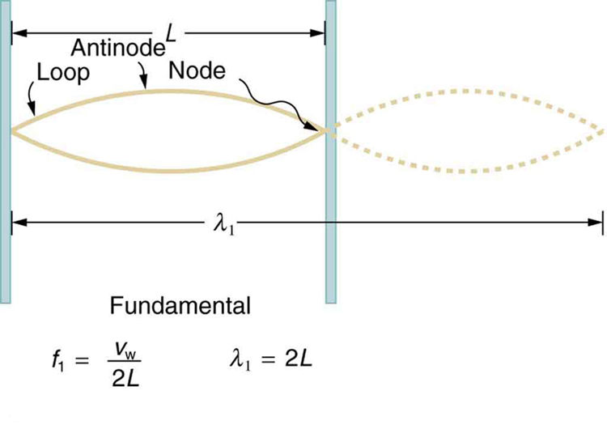

* Explain standing waves.
* Describe the mathematical representation of overtones and beat frequency.

 "){: #import-auto-id1386289 data-media-type="image/png"}

Most waves do not look very simple. They look more like the waves in [\[link\]](#import-auto-id1386289) than like the simple water wave considered in [Waves](/m42248). (Simple waves may be created by a simple harmonic oscillation, and thus have a sinusoidal shape). Complex waves are more interesting, even beautiful, but they look formidable. Most waves appear complex because they result from several simple waves adding together. Luckily, the rules for adding waves are quite simple.

When two or more waves arrive at the same point, they superimpose themselves on one another. More specifically, the disturbances of waves are superimposed when they come together—a phenomenon called **superposition**{: data-type="term" #import-auto-id3047530}. Each disturbance corresponds to a force, and forces add. If the disturbances are along the same line, then the resulting wave is a simple addition of the disturbances of the individual waves—that is, their amplitudes add. [\[link\]](#import-auto-id3008153) and [\[link\]](#import-auto-id2429185) illustrate superposition in two special cases, both of which produce simple results.

[\[link\]](#import-auto-id3008153) ****shows two identical waves that arrive at the same point exactly in phase. The crests of the two waves are precisely aligned, as are the troughs. This superposition produces pure **constructive interference**{: data-type="term" #import-auto-id1409672}. Because the disturbances add, pure constructive interference produces a wave that has twice the amplitude of the individual waves, but has the same wavelength.

[\[link\]](#import-auto-id2429185) shows two identical waves that arrive exactly out of phase—that is, precisely aligned crest to trough—producing pure **destructive interference**{: data-type="term" #import-auto-id3028441}. Because the disturbances are in the opposite direction for this superposition, the resulting amplitude is zero for pure destructive interference—the waves completely cancel.

 {: #import-auto-id3008153 data-media-type="image/jpg"}

{: #import-auto-id2429185 data-media-type="image/jpg"}

While pure constructive and pure destructive interference do occur, they require precisely aligned identical waves. The superposition of most waves produces a combination of constructive and destructive interference and can vary from place to place and time to time. Sound from a stereo, for example, can be loud in one spot and quiet in another. Varying loudness means the sound waves add partially constructively and partially destructively at different locations. A stereo has at least two speakers creating sound waves, and waves can reflect from walls. All these waves superimpose. An example of sounds that vary over time from constructive to destructive is found in the combined whine of airplane jets heard by a stationary passenger. The combined sound can fluctuate up and down in volume as the sound from the two engines varies in time from constructive to destructive. These examples are of waves that are similar.

An example of the superposition of two dissimilar waves is shown in [\[link\]](#import-auto-id2979404). Here again, the disturbances add and subtract, producing a more complicated looking wave.

{: #import-auto-id2979404 data-media-type="image/jpg"}

# Standing Waves

Sometimes waves do not seem to move; rather, they just vibrate in place. Unmoving waves can be seen on the surface of a glass of milk in a refrigerator, for example. Vibrations from the refrigerator motor create waves on the milk that oscillate up and down but do not seem to move across the surface. These waves are formed by the superposition of two or more moving waves, such as illustrated in [\[link\]](#import-auto-id3053471) for two identical waves moving in opposite directions. The waves move through each other with their disturbances adding as they go by. If the two waves have the same amplitude and wavelength, then they alternate between constructive and destructive interference. The resultant looks like a wave standing in place and, thus, is called a **standing wave**{: data-type="term" #import-auto-id1488365}. Waves on the glass of milk are one example of standing waves. There are other standing waves, such as on guitar strings and in organ pipes. With the glass of milk, the two waves that produce standing waves may come from reflections from the side of the glass.

A closer look at earthquakes provides evidence for conditions appropriate for resonance, standing waves, and constructive and destructive interference. A building may be vibrated for several seconds with a driving frequency matching that of the natural frequency of vibration of the building—producing a resonance resulting in one building collapsing while neighboring buildings do not. Often buildings of a certain height are devastated while other taller buildings remain intact. The building height matches the condition for setting up a standing wave for that particular height. As the earthquake waves travel along the surface of Earth and reflect off denser rocks, constructive interference occurs at certain points. Often areas closer to the epicenter are not damaged while areas farther away are damaged.

![Standing wave combinations of two waves is shown. At the time t is equal to zero. The waves are in the same phase so the amplitude of the superimposed wave is double that of wave one and two. In the second figure at time t is equal to one fourth of time period T , the waves are in opposite phase so their super imposed figure is a straight line. Again at the time t is equal to half the time period the waves are in the same phase and the process is repeated at t is equal to three fourth of time period and at the end of the time period T.](../resources/Figure_17_10_05a.jpg "Standing wave created by the superposition of two identical waves moving in opposite directions. The oscillations are at fixed locations in space and result from alternately constructive and destructive interference."){: #import-auto-id3053471 data-media-type="image/jpg"}

Standing waves are also found on the strings of musical instruments and are due to reflections of waves from the ends of the string. [\[link\]](#import-auto-id3165180) and [\[link\]](#import-auto-id3045433) show three standing waves that can be created on a string that is fixed at both ends. **Nodes**{: data-type="term" #import-auto-id1974297} are the points where the string does not move; more generally, nodes are where the wave disturbance is zero in a standing wave. The fixed ends of strings must be nodes, too, because the string cannot move there. The word **antinode**{: data-type="term" #import-auto-id3175302} is used to denote the location of maximum amplitude in standing waves. Standing waves on strings have a frequency that is related to the propagation speed <math xmlns="http://www.w3.org/1998/Math/MathML"><semantics><mrow><mrow><msub><mi>v</mi><mrow><mtext>w</mtext></mrow></msub></mrow><mrow /></mrow><annotation encoding="StarMath 5.0"> size 12{v rSub { size 8{w} } } {}</annotation></semantics></math>

 of the disturbance on the string. The wavelength <math xmlns="http://www.w3.org/1998/Math/MathML"><semantics><mrow><mrow><mi>λ</mi></mrow><mrow /></mrow><annotation encoding="StarMath 5.0"> size 12{λ} {}</annotation></semantics></math>

 is determined by the distance between the points where the string is fixed in place.

The lowest frequency, called the **fundamental frequency**{: data-type="term" #import-auto-id2392024}, is thus for the longest wavelength, which is seen to be <math xmlns="http://www.w3.org/1998/Math/MathML"><semantics><mrow><mrow><mrow><msub><mi>λ</mi><mrow><mn>1</mn></mrow></msub><mo stretchy="false">=</mo><mn>2</mn><mi /><mi>L</mi></mrow></mrow><mrow /></mrow><annotation encoding="StarMath 5.0"> size 12{λ rSub { size 8{1} } =2`"L"} {}</annotation></semantics></math>

. Therefore, the fundamental frequency is <math xmlns="http://www.w3.org/1998/Math/MathML"><semantics><mrow><mrow><mrow><mrow><msub><mi>f</mi><mrow><mn>1</mn></mrow></msub><mo stretchy="false">=</mo><mrow><msub><mi>v</mi><mrow><mtext>w</mtext></mrow></msub><mo stretchy="false">/</mo><msub><mi>λ</mi><mrow><mn>1</mn></mrow></msub></mrow></mrow><mo stretchy="false">=</mo><mrow><msub><mi>v</mi><mrow><mtext>w</mtext></mrow></msub><mo stretchy="false">/</mo><mn>2</mn><mi /><mi>L</mi></mrow></mrow></mrow><mrow /></mrow><annotation encoding="StarMath 5.0"> size 12{f rSub { size 8{1} } =v rSub { size 8{w} } /λ rSub { size 8{1} } =v rSub { size 8{w} } /2`"L"} {}</annotation></semantics></math>

. In this case, the **overtones**{: data-type="term" #import-auto-id2659292} or harmonics are multiples of the fundamental frequency. As seen in [\[link\]](#import-auto-id3045433), the first harmonic can easily be calculated since <math xmlns="http://www.w3.org/1998/Math/MathML"><semantics><mrow><mrow><mrow><msub><mi>λ</mi><mrow><mn>2</mn></mrow></msub><mo stretchy="false">=</mo><mi>L</mi></mrow></mrow><mrow /></mrow><annotation encoding="StarMath 5.0"> size 12{λ rSub { size 8{2} } =L} {}</annotation></semantics></math>

. Thus, <math xmlns="http://www.w3.org/1998/Math/MathML"><semantics><mrow><mrow><mrow><mrow><mrow><msub><mi>f</mi><mrow><mn>2</mn></mrow></msub><mo stretchy="false">=</mo><mrow><msub><mi>v</mi><mrow><mtext>w</mtext></mrow></msub><mo stretchy="false">/</mo><msub><mi>λ</mi><mrow><mn>2</mn></mrow></msub></mrow></mrow><mo stretchy="false">=</mo><mrow><msub><mi>v</mi><mrow><mtext>w</mtext></mrow></msub><mo stretchy="false">/</mo><mn>2</mn><mi /><mi>L</mi></mrow></mrow><mo stretchy="false">=</mo><msub><mrow><mn>2</mn><mi>f</mi></mrow><mrow><mn>1</mn></mrow></msub></mrow></mrow><mrow /></mrow><annotation encoding="StarMath 5.0"> size 12{f rSub { size 8{2} } =v rSub { size 8{w} } /λ rSub { size 8{2} } =v rSub { size 8{w} } /2`"L"=2f rSub { size 8{1} } } {}</annotation></semantics></math>

. Similarly, <math xmlns="http://www.w3.org/1998/Math/MathML"><semantics><mrow><mrow><mrow><msub><mi>f</mi><mrow><mn>3</mn></mrow></msub><mo stretchy="false">=</mo><msub><mrow><mn>3</mn><mi>f</mi></mrow><mrow><mn>1</mn></mrow></msub></mrow></mrow><mrow /></mrow><annotation encoding="StarMath 5.0"> size 12{f rSub { size 8{3} } =3f rSub { size 8{1} } } {}</annotation></semantics></math>

, and so on. All of these frequencies can be changed by adjusting the tension in the string. The greater the tension, the greater <math xmlns="http://www.w3.org/1998/Math/MathML"><semantics><mrow><mrow><msub><mi>v</mi><mrow><mtext>w</mtext></mrow></msub></mrow><mrow /></mrow><annotation encoding="StarMath 5.0"> size 12{v rSub { size 8{w} } } {}</annotation></semantics></math>

 is and the higher the frequencies. This observation is familiar to anyone who has ever observed a string instrument being tuned. We will see in later chapters that standing waves are crucial to many resonance phenomena, such as in sounding boxes on string instruments.

{: #import-auto-id3165180 data-media-type="image/jpg"}

{: #import-auto-id3045433 data-media-type="image/jpg"}

# Beats

Striking two adjacent keys on a piano produces a warbling combination usually considered to be unpleasant. The superposition of two waves of similar but not identical frequencies is the culprit. Another example is often noticeable in jet aircraft, particularly the two-engine variety, while taxiing. The combined sound of the engines goes up and down in loudness. This varying loudness happens because the sound waves have similar but not identical frequencies. The discordant warbling of the piano and the fluctuating loudness of the jet engine noise are both due to alternately constructive and destructive interference as the two waves go in and out of phase. [\[link\]](#import-auto-id3355582) illustrates this graphically.

{: #import-auto-id3355582 data-media-type="image/jpg"}

The wave resulting from the superposition of two similar-frequency waves has a frequency that is the average of the two. This wave fluctuates in amplitude, or *beats*, with a frequency called the **beat frequency**{: data-type="term" #import-auto-id2990553}. We can determine the beat frequency by adding two waves together mathematically. Note that a wave can be represented at one point in space as

<math xmlns="http://www.w3.org/1998/Math/MathML"><semantics><mrow><mrow><mrow><mrow><mi>x</mi><mo stretchy="false">=</mo><mi>X</mi></mrow><mspace width="0.25em" /><mtext>cos</mtext><mi /><mrow><mfenced open="(" close=")"><mfrac><mrow><mn>2π</mn><mspace width="0.25em" /><mi>t</mi></mrow><mi>T</mi></mfrac></mfenced><mo stretchy="false">=</mo><mi>X</mi></mrow><mspace width="0.25em" /><mtext>cos</mtext><mfenced open="(" close=")"><mrow><mn>2π</mn><mspace width="0.25em" /><mstyle fontstyle="italic"><mrow><mtext>ft</mtext></mrow></mstyle></mrow></mfenced></mrow></mrow><mtext>,</mtext><mrow /></mrow><annotation encoding="StarMath 5.0"> size 12{x=X" cos"` left ( { {2π t} over {T} } right )=X" cos " left (2π ital "ft" right )","} {}</annotation></semantics></math>

where <math xmlns="http://www.w3.org/1998/Math/MathML"><semantics><mrow><mrow><mrow><mi>f</mi><mo stretchy="false">=</mo><mrow><mn>1</mn><mo stretchy="false">/</mo><mi>T</mi></mrow></mrow></mrow><mrow /></mrow><annotation encoding="StarMath 5.0"> size 12{f= {1} slash {T} } {}</annotation></semantics></math>

 is the frequency of the wave. Adding two waves that have different frequencies but identical amplitudes produces a resultant

<math xmlns="http://www.w3.org/1998/Math/MathML"><semantics><mrow><mrow><mrow><mi>x</mi><mo stretchy="false">=</mo><mrow><msub><mi>x</mi><mrow><mn>1</mn></mrow></msub><mo stretchy="false">+</mo><msub><mi>x</mi><mrow><mn>2</mn></mrow></msub></mrow></mrow></mrow><mtext>.</mtext><mrow /></mrow><annotation encoding="StarMath 5.0"> size 12{x=x rSub { size 8{1} } +x rSub { size 8{2} } "."} {}</annotation></semantics></math>

More specifically,

<math xmlns="http://www.w3.org/1998/Math/MathML"><semantics><mrow><mrow><mrow><mrow><mi>x</mi><mo stretchy="false">=</mo><mi>X</mi></mrow><mspace width="0.25em" /><mtext>cos</mtext><mrow><mfenced open="(" close=")"><mrow><mn>2π</mn><mspace width="0.25em" /><msub><mi>f</mi><mrow><mn>1</mn></mrow></msub><mi>t</mi></mrow></mfenced><mo stretchy="false">+</mo><mi>X</mi></mrow><mspace width="0.25em" /><mtext>cos</mtext><mfenced open="(" close=")"><mrow><mn>2π</mn><mspace width="0.25em" /><msub><mi>f</mi><mrow><mn>2</mn></mrow></msub><mi>t</mi></mrow></mfenced></mrow></mrow><mtext>.</mtext><mrow /></mrow><annotation encoding="StarMath 5.0"> size 12{x=X"cos" left (2π`f rSub { size 8{1} } t right )+X"cos" left (2π`f rSub { size 8{2} } t right )"."} {}</annotation></semantics></math>

Using a trigonometric identity, it can be shown that

<math xmlns="http://www.w3.org/1998/Math/MathML"><semantics><mrow><mrow><mrow><mrow><mi>x</mi><mo stretchy="false">=</mo><mn>2</mn><mi /><mi>X</mi></mrow><mspace width="0.25em" /><mtext>cos</mtext><mfenced open="(" close=")"><mrow><mi>π</mi><mspace width="0.25em" /><msub><mi>f</mi><mrow><mtext>B</mtext></mrow></msub><mi>t</mi></mrow></mfenced><mtext>cos</mtext><mfenced open="(" close=")"><mrow><mn>2π</mn><mspace width="0.25em" /><msub><mi>f</mi><mrow><mtext>ave</mtext></mrow></msub><mi>t</mi></mrow></mfenced></mrow></mrow><mtext>,</mtext><mrow /></mrow><annotation encoding="StarMath 5.0"> size 12{x=2X"cos" left (π`f rSub { size 8{B} } t right )"cos" left (2π`f rSub { size 8{"ave"} } t right )","} {}</annotation></semantics></math>

where

<math xmlns="http://www.w3.org/1998/Math/MathML"> <semantics> <mrow> <mrow> <mrow> <msub> <mi>f</mi> <mrow> <mn>B</mn> </mrow> </msub> <mo stretchy="false">=</mo> <mrow> <mo stretchy="false">∣</mo> <mrow> <msub> <mi>f</mi> <mrow> <mn>1</mn> </mrow> </msub> <mo stretchy="false">−</mo> <msub> <mi>f</mi> <mrow> <mn>2</mn> </mrow> </msub> </mrow> <mo stretchy="false">∣</mo> </mrow> </mrow> </mrow> <mrow /> </mrow> <annotation encoding="StarMath 5.0"> size 12{f rSub { size 8{B} } = lline f rSub { size 8{1} } - f rSub { size 8{2} } rline } {}</annotation> </semantics> </math>

is the beat frequency, and <math xmlns="http://www.w3.org/1998/Math/MathML"><semantics><mrow><mrow><msub><mi>f</mi><mrow><mtext>ave</mtext></mrow></msub></mrow><mrow /></mrow><annotation encoding="StarMath 5.0"> size 12{f rSub { size 8{"ave"} } } {}</annotation></semantics></math>

 is the average of <math xmlns="http://www.w3.org/1998/Math/MathML"><semantics><mrow><mrow><msub><mi>f</mi><mrow><mn>1</mn></mrow></msub></mrow><mrow /></mrow><annotation encoding="StarMath 5.0"> size 12{f rSub { size 8{1} } } {}</annotation></semantics></math>

 and <math xmlns="http://www.w3.org/1998/Math/MathML"><semantics><mrow><mrow><msub><mi>f</mi><mrow><mn>2</mn></mrow></msub></mrow><mrow /></mrow><annotation encoding="StarMath 5.0"> size 12{f rSub { size 8{2} } } {}</annotation></semantics></math>

. These results mean that the resultant wave has twice the amplitude and the average frequency of the two superimposed waves, but it also fluctuates in overall amplitude at the beat frequency <math xmlns="http://www.w3.org/1998/Math/MathML"><semantics><mrow><mrow><msub><mi>f</mi><mrow><mtext>B</mtext></mrow></msub></mrow><mrow /></mrow><annotation encoding="StarMath 5.0"> size 12{f rSub { size 8{"B"} } } {}</annotation></semantics></math>

. The first cosine term in the expression effectively causes the amplitude to go up and down. **The second cosine term is the wave with frequency <math xmlns="http://www.w3.org/1998/Math/MathML"><semantics><mrow><mrow><msub><mi>f</mi><mrow><mtext>ave</mtext></mrow></msub></mrow><mrow /></mrow><annotation encoding="StarMath 5.0"> size 12{f rSub { size 8{"ave"} } } {}</annotation></semantics></math>

. This result is valid for all types of waves. However, if it is a sound wave, providing the two frequencies are similar, then what we hear is an average frequency that gets louder and softer (or warbles) at the beat frequency.

Making Career Connections

Piano tuners use beats routinely in their work. When comparing a note with a tuning fork, they listen for beats and adjust the string until the beats go away (to zero frequency). For example, if the tuning fork has a <math xmlns="http://www.w3.org/1998/Math/MathML"><semantics><mrow><mrow><mrow><mtext>256</mtext><mi /><mspace width="0.25em" /><mtext>Hz</mtext></mrow></mrow><mrow /></mrow><annotation encoding="StarMath 5.0"> size 12{"256"``"Hz"} {}</annotation></semantics></math>

 frequency and two beats per second are heard, then the other frequency is either <math xmlns="http://www.w3.org/1998/Math/MathML"><semantics><mrow><mrow><mtext>254</mtext></mrow><mrow /></mrow><annotation encoding="StarMath 5.0"> size 12{"254"} {}</annotation></semantics></math>

 or <math xmlns="http://www.w3.org/1998/Math/MathML"><semantics><mrow><mrow><mrow><mtext>258</mtext><mspace width="0.25em" /><mtext>Hz</mtext></mrow></mrow><mrow /></mrow><annotation encoding="StarMath 5.0"> size 12{"258"`"Hz"} {}</annotation></semantics></math>

. Most keys hit multiple strings, and these strings are actually adjusted until they have nearly the same frequency and give a slow beat for richness. Twelve-string guitars and mandolins are also tuned using beats.

While beats may sometimes be annoying in audible sounds, we will find that beats have many applications. Observing beats is a very useful way to compare similar frequencies. There are applications of beats as apparently disparate as in ultrasonic imaging and radar speed traps.

Check Your Understanding

Imagine you are holding one end of a jump rope, and your friend holds the other. If your friend holds her end still, you can move your end up and down, creating a transverse wave. If your friend then begins to move her end up and down, generating a wave in the opposite direction, what resultant wave forms would you expect to see in the jump rope?

The rope would alternate between having waves with amplitudes two times the original amplitude and reaching equilibrium with no amplitude at all. The wavelengths will result in both constructive and destructive interference

Check Your Understanding

Define nodes and antinodes.

Nodes are areas of wave interference where there is no motion. Antinodes are areas of wave interference where the motion is at its maximum point.

Check Your Understanding

You hook up a stereo system. When you test the system, you notice that in one corner of the room, the sounds seem dull. In another area, the sounds seem excessively loud. Describe how the sound moving about the room could result in these effects.

With multiple speakers putting out sounds into the room, and these sounds bouncing off walls, there is bound to be some wave interference. In the dull areas, the interference is probably mostly destructive. In the louder areas, the interference is probably mostly constructive.

PhET Explorations: Wave Interference

Make waves with a dripping faucet, audio speaker, or laser! Add a second source or a pair of slits to create an interference pattern.

<figure markdown="1" id="eip-id2746277">
<figcaption>
[Wave Interference](wave-interference_en.jar)
</figcaption>
 {: data-type="image"}  
</figure>

# Section Summary

* {: #import-auto-id2054185} Superposition is the combination of two waves at the same location.
* {: #import-auto-id1941066} Constructive interference occurs when two identical waves are superimposed in phase.
* {: #import-auto-id3358537} Destructive interference occurs when two identical waves are superimposed exactly out of phase.
* {: #import-auto-id1828289} A standing wave is one in which two waves superimpose to produce a wave that varies in amplitude but does not propagate.
* {: #import-auto-id1473416} Nodes are points of no motion in standing waves.
* {: #import-auto-id2668882} An antinode is the location of maximum amplitude of a standing wave.
* {: #import-auto-id3023110} Waves on a string are resonant standing waves with a fundamental frequency and can occur at higher multiples of the fundamental, called overtones or harmonics.
* {: #import-auto-id1593914} Beats occur when waves of similar frequencies
  <math xmlns="http://www.w3.org/1998/Math/MathML"><semantics><mrow><mrow><msub><mi>f</mi><mrow><mn>1</mn></mrow></msub></mrow><mrow /></mrow><annotation encoding="StarMath 5.0"> size 12{f rSub { size 8{1} } } {}</annotation></semantics></math>
  
  and
  <math xmlns="http://www.w3.org/1998/Math/MathML"><semantics><mrow><mrow><msub><mi>f</mi><mrow><mn>2</mn></mrow></msub></mrow><mrow /></mrow><annotation encoding="StarMath 5.0"> size 12{f rSub { size 8{2} } } {}</annotation></semantics></math>
  
  are superimposed. The resulting amplitude oscillates with a beat frequency given by
  

  <math xmlns="http://www.w3.org/1998/Math/MathML"> <semantics> <mrow> <mrow> <mrow> <msub> <mi>f</mi> <mrow> <mtext>B</mtext> </mrow> </msub> <mo stretchy="false">=</mo> <mrow> <mo stretchy="false">∣</mo> <mrow> <msub> <mi>f</mi> <mrow> <mn>1</mn> </mrow> </msub> <mo stretchy="false">−</mo> <msub> <mi>f</mi> <mrow> <mn>2</mn> </mrow> </msub> </mrow> <mo stretchy="false">∣</mo> </mrow> </mrow> </mrow> <mo>.</mo> <mrow /> </mrow> <annotation encoding="StarMath 5.0"> size 12{f rSub { size 8{B} } = lline f rSub { size 8{1} } - f rSub { size 8{2} } rline } {}</annotation> </semantics> </math>
  

# Conceptual Questions

Speakers in stereo systems have two color-coded terminals to indicate how to hook up the wires. If the wires are reversed, the speaker moves in a direction opposite that of a properly connected speaker. Explain why it is important to have both speakers connected the same way.

# Problems &amp; Exercises

A car has two horns, one emitting a frequency of 199 Hz and the other emitting a frequency of 203 Hz. What beat frequency do they produce?

<math xmlns="http://www.w3.org/1998/Math/MathML"> <semantics> <mrow> <mrow> <mrow> <mi>f</mi> <mo stretchy="false">=</mo> <mtext>4 Hz</mtext> </mrow> </mrow> <mrow /> </mrow> <annotation encoding="StarMath 5.0"> size 12{f= {underline {"4 Hz"}} } {}</annotation> </semantics> </math>

The middle-C hammer of a piano hits two strings, producing beats of 1.50 Hz. One of the strings is tuned to 260.00 Hz. What frequencies could the other string have?

Two tuning forks having frequencies of 460 and 464 Hz are struck simultaneously. What average frequency will you hear, and what will the beat frequency be?

462 Hz,

4 Hz

Twin jet engines on an airplane are producing an average sound frequency of 4100 Hz with a beat frequency of 0.500 Hz. What are their individual frequencies?

A wave traveling on a Slinky® that is stretched to 4 m takes 2.4 s to travel the length of the Slinky and back again. (a) What is the speed of the wave? (b) Using the same Slinky stretched to the same length, a standing wave is created which consists of three antinodes and four nodes. At what frequency must the Slinky be oscillating?

(a) 3.33 m/s

(b) 1.25 Hz

Three adjacent keys on a piano (F, F-sharp, and G) are struck simultaneously, producing frequencies of 349, 370, and 392 Hz. What beat frequencies are produced by this discordant combination?

