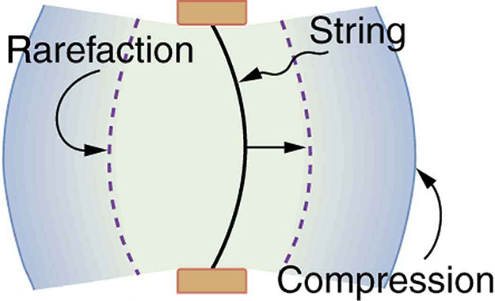
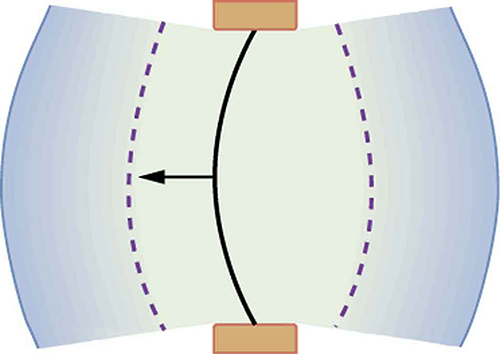
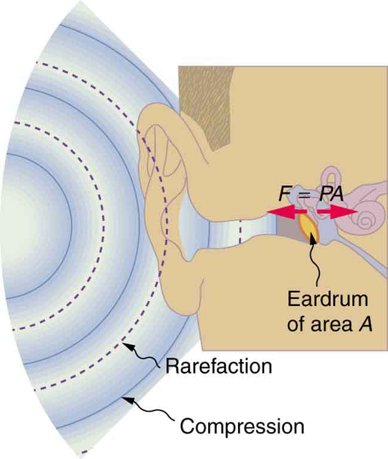

* Define sound and hearing.
* Describe sound as a longitudinal wave.

 "){: #import-auto-id2654311}

Sound can be used as a familiar illustration of waves. Because hearing is one of our most important senses, it is interesting to see how the physical properties of sound correspond to our perceptions of it. **Hearing**{: data-type="term" #import-auto-id2968532} is the perception of sound, just as vision is the perception of visible light. But sound has important applications beyond hearing. Ultrasound, for example, is not heard but can be employed to form medical images and is also used in treatment.

The physical phenomenon of **sound**{: data-type="term" #import-auto-id2392934} is defined to be a disturbance of matter that is transmitted from its source outward. Sound is a wave. On the atomic scale, it is a disturbance of atoms that is far more ordered than their thermal motions. In many instances, sound is a periodic wave, and the atoms undergo simple harmonic motion. In this text, we shall explore such periodic sound waves.

A vibrating string produces a sound wave as illustrated in [\[link\]](#import-auto-id2598538), [\[link\]](#import-auto-id2930001), and [\[link\]](#import-auto-id1932310). As the string oscillates back and forth, it transfers energy to the air, mostly as thermal energy created by turbulence. But a small part of the string’s energy goes into compressing and expanding the surrounding air, creating slightly higher and lower local pressures. These compressions (high pressure regions) and rarefactions (low pressure regions) move out as longitudinal pressure waves having the same frequency as the string—they are the disturbance that is a sound wave. (Sound waves in air and most fluids are longitudinal, because fluids have almost no shear strength. In solids, sound waves can be both transverse and longitudinal.) [\[link\]](#import-auto-id1932310) shows a graph of gauge pressure versus distance from the vibrating string.

 {: #import-auto-id2598538}

{: #import-auto-id2930001}

{: #import-auto-id1932310}

The amplitude of a sound wave decreases with distance from its source, because the energy of the wave is spread over a larger and larger area. But it is also absorbed by objects, such as the eardrum in [\[link\]](#import-auto-id2401534), and converted to thermal energy by the viscosity of air. In addition, during each compression a little heat transfers to the air and during each rarefaction even less heat transfers from the air, so that the heat transfer reduces the organized disturbance into random thermal motions. (These processes can be viewed as a manifestation of the second law of thermodynamics presented in [Introduction to the Second Law of Thermodynamics: Heat Engines and Their Efficiency](/m42234).) Whether the heat transfer from compression to rarefaction is significant depends on how far apart they are—that is, it depends on wavelength. Wavelength, frequency, amplitude, and speed of propagation are important for sound, as they are for all waves.

{: #import-auto-id2401534}

PhET Explorations: Wave Interference

WMake waves with a dripping faucet, audio speaker, or laser! Add a second source or a pair of slits to create an interference pattern.* * *
{: data-type="newline"}

<iframe width="660" height="371.4" src="https://archive.cnx.org/specials/2fe7ad15-b00e-4402-b068-ff503985a18f/wave-interference/"></iframe>

### Section Summary

* {: #import-auto-id2449165} Sound is a disturbance of matter that is transmitted from its source outward.
* {: #import-auto-id2667609} Sound is one type of wave.
* {: #import-auto-id3259124} Hearing is the perception of sound.

### Glossary
{: data-type="glossary-title"}

sound
: a disturbance of matter that is transmitted from its source outward
{: #import-auto-id2436523}

hearing
: the perception of sound
{: #import-auto-id2591175}

