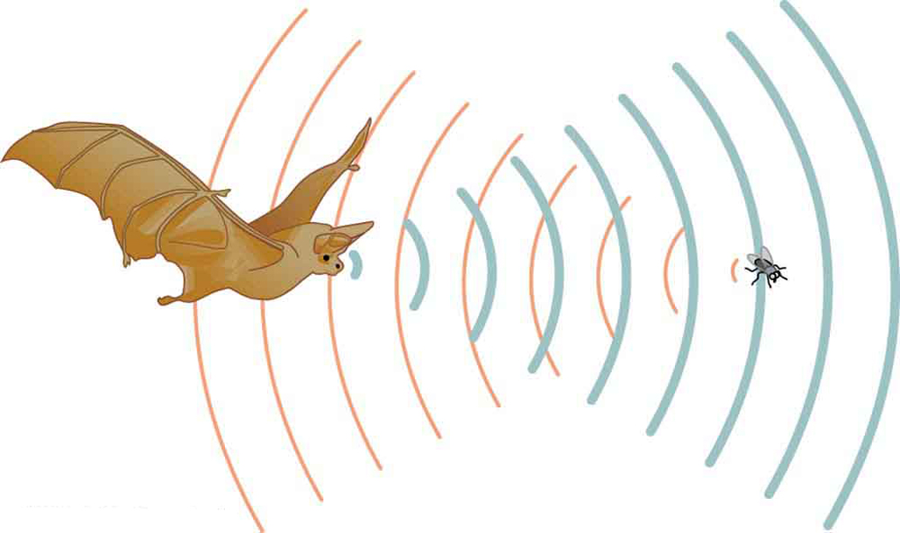
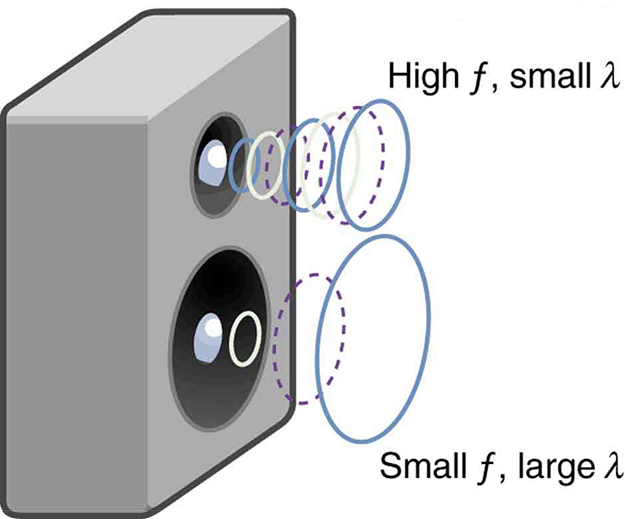

* Define pitch.
* Describe the relationship between the speed of sound, its frequency, and its wavelength.
* Describe the effects on the speed of sound as it travels through various media.
* Describe the effects of temperature on the speed of sound.

 "){: #import-auto-id2399763}

Sound, like all waves, travels at a certain speed and has the properties of frequency and wavelength. You can observe direct evidence of the speed of sound while watching a fireworks display. The flash of an explosion is seen well before its sound is heard, implying both that sound travels at a finite speed and that it is much slower than light. You can also directly sense the frequency of a sound. Perception of frequency is called **pitch**{: data-type="term" #import-auto-id1588064}. The wavelength of sound is not directly sensed, but indirect evidence is found in the correlation of the size of musical instruments with their pitch. Small instruments, such as a piccolo, typically make high-pitch sounds, while large instruments, such as a tuba, typically make low-pitch sounds. High pitch means small wavelength, and the size of a musical instrument is directly related to the wavelengths of sound it produces. So a small instrument creates short-wavelength sounds. Similar arguments hold that a large instrument creates long-wavelength sounds.

The relationship of the speed of sound, its frequency, and wavelength is the same as for all waves:

<math xmlns="http://www.w3.org/1998/Math/MathML"><semantics><mrow><mrow><msub><mi>v</mi><mtext>w</mtext></msub><mo stretchy="false">=</mo><mi fontstyle="italic">fλ,</mi></mrow><mrow /></mrow><annotation encoding="StarMath 5.0"> size 12{v size 8{w}=fλ} {}</annotation></semantics></math>

where <math xmlns="http://www.w3.org/1998/Math/MathML"><semantics><mrow><mrow><mrow><msub><mi>v</mi><mn>w</mn></msub></mrow></mrow><mrow /></mrow><annotation encoding="StarMath 5.0"> size 12{v size 8{w}} {}</annotation></semantics></math>

 is the speed of sound, <math xmlns="http://www.w3.org/1998/Math/MathML"><semantics><mrow><mrow><mi>f</mi></mrow><mrow /></mrow><annotation encoding="StarMath 5.0"> size 12{f} {}</annotation></semantics></math>

 is its frequency, and *<math xmlns="http://www.w3.org/1998/Math/MathML"><semantics><mrow><mrow><mi>λ</mi></mrow><mrow /></mrow><annotation encoding="StarMath 5.0"> size 12{λ} {}</annotation></semantics></math>

* is its wavelength. The wavelength of a sound is the distance between adjacent identical parts of a wave—for example, between adjacent compressions as illustrated in [\[link\]](#import-auto-id1538012). The frequency is the same as that of the source and is the number of waves that pass a point per unit time.

{: #import-auto-id1538012}

[\[link\]](#import-auto-id3177545) makes it apparent that the speed of sound varies greatly in different media. The speed of sound in a medium is determined by a combination of the medium’s rigidity (or compressibility in gases) and its density. The more rigid (or less compressible) the medium, the faster the speed of sound. This observation is analogous to the fact that the frequency of a simple harmonic motion is directly proportional to the stiffness of the oscillating object. The greater the density of a medium, the slower the speed of sound. This observation is analogous to the fact that the frequency of a simple harmonic motion is inversely proportional to the mass of the oscillating object. The speed of sound in air is low, because air is compressible. Because liquids and solids are relatively rigid and very difficult to compress, the speed of sound in such media is generally greater than in gases.

<table id="import-auto-id3177545" summary="Two-column table listing various media for sound in the first column and their speeds of sound in the second column. The list of media is divided into three groups: gases, liquids, and solids."><caption>Speed of Sound in Various Media</caption><thead><tr>
            <th>Medium</th>
            <th><em>v</em>w(m/s)</th>
          </tr></thead><tbody><tr>
            <td colspan="2"><strong><em>Gases at <math xmlns="http://www.w3.org/1998/Math/MathML">
 <semantics>
  <mtext fontstyle="italic">0ºC</mtext>
 </semantics>
</math></em></strong></td>
             </tr><tr>
            <td>Air</td>
            <td>331</td>
          </tr><tr>
            <td>Carbon dioxide</td>
            <td>259</td>
          </tr><tr>
            <td>Oxygen</td>
            <td>316</td>
          </tr><tr>
            <td>Helium</td>
            <td>965</td>
          </tr><tr>
            <td>Hydrogen</td>
            <td>1290</td>
          </tr><tr>
            <td colspan="2"><strong><em>Liquids at <math xmlns="http://www.w3.org/1998/Math/MathML">
 <semantics>
  <mtext fontstyle="italic">20ºC</mtext>
 </semantics>
</math></em></strong></td>
             </tr><tr>
            <td>Ethanol</td>
            <td>1160</td>
          </tr><tr>
            <td>Mercury</td>
            <td>1450</td>
          </tr><tr>
            <td>Water, fresh</td>
            <td>1480</td>
          </tr><tr>
            <td>Sea water</td>
            <td>1540</td>
          </tr><tr>
            <td>Human tissue</td>
            <td>1540</td>
          </tr><tr>
            <td colspan="2"><strong><em>Solids (longitudinal or bulk)</em></strong></td>
              </tr><tr>
            <td>Vulcanized rubber</td>
            <td>54</td>
          </tr><tr>
            <td>Polyethylene</td>
            <td>920</td>
          </tr><tr>
            <td>Marble</td>
            <td>3810</td>
          </tr><tr>
            <td>Glass, Pyrex</td>
            <td>5640</td>
          </tr><tr>
            <td>Lead</td>
            <td>1960</td>
          </tr><tr>
            <td>Aluminum</td>
            <td>5120</td>
          </tr><tr>
            <td>Steel</td>
            <td>5960</td>
          </tr></tbody></table>

Earthquakes, essentially sound waves in Earth’s crust, are an interesting example of how the speed of sound depends on the rigidity of the medium. Earthquakes have both longitudinal and transverse components, and these travel at different speeds. The bulk modulus of granite is greater than its shear modulus. For that reason, the speed of longitudinal or pressure waves (P-waves) in earthquakes in granite is significantly higher than the speed of transverse or shear waves (S-waves). Both components of earthquakes travel slower in less rigid material, such as sediments. P-waves have speeds of 4 to 7 km/s, and S-waves correspondingly range in speed from 2 to 5 km/s, both being faster in more rigid material. The P-wave gets progressively farther ahead of the S-wave as they travel through Earth’s crust. The time between the P- and S-waves is routinely used to determine the distance to their source, the epicenter of the earthquake.

The speed of sound is affected by temperature in a given medium. For air at sea level, the speed of sound is given by

<math xmlns="http://www.w3.org/1998/Math/MathML"><semantics><mrow><mrow><msub><mi>v</mi><mtext>w</mtext></msub><mo stretchy="false">=</mo><mfenced open="(" close=")"><mrow><mtext>331</mtext><mspace width="0.25em" /><mtext> m/s</mtext></mrow></mfenced><msqrt><mfrac><mi>T</mi><mrow><mtext>273</mtext><mspace width="0.25em" /><mtext>K</mtext></mrow></mfrac></msqrt></mrow><mo>,</mo></mrow><mrow /><annotation encoding="StarMath 5.0"> size 12{v size 8{w}= left ("331"" m/s" right ) sqrt { { {T} over {"273"" K"} } } } {}</annotation></semantics></math>

where the temperature (denoted as <math xmlns="http://www.w3.org/1998/Math/MathML"> <semantics> <mi>T</mi> </semantics> </math>

) is in units of kelvin. The speed of sound in gases is related to the average speed of particles in the gas, <math xmlns="http://www.w3.org/1998/Math/MathML"><semantics><mrow><mrow><msub><mi>v</mi><mtext>rms</mtext></msub></mrow><mrow /></mrow><annotation encoding="StarMath 5.0"> size 12{v size 8{ ital "rms"}} {}</annotation></semantics></math>

, and that

<math xmlns="http://www.w3.org/1998/Math/MathML"><semantics><mrow><mrow><msub><mi>v</mi><mtext>rms</mtext></msub><mo stretchy="false">=</mo><msqrt><mfrac><mrow><mtext>3</mtext><mi fontstyle="italic">kT</mi></mrow><mi>m</mi></mfrac></msqrt></mrow><mo>,</mo><mrow /></mrow><annotation encoding="StarMath 5.0"> size 12{v size 8{ ital "rms"}= sqrt { { {"3KT"} over {m} } } } {}</annotation></semantics></math>

where <math xmlns="http://www.w3.org/1998/Math/MathML"> <semantics> <mi>k</mi> </semantics> </math>

 is the Boltzmann constant (<math xmlns="http://www.w3.org/1998/Math/MathML"> <semantics> <mrow> <mn>1.38</mn> <mo>×</mo> <msup> <mtext>10</mtext> <mtext>−23</mtext> </msup> <mspace width="0.25em" /> <mtext>J/K</mtext> </mrow> </semantics> </math>

) and <math xmlns="http://www.w3.org/1998/Math/MathML"> <semantics> <mi>m</mi> </semantics> </math>

 is the mass of each (identical) particle in the gas. So, it is reasonable that the speed of sound in air and other gases should depend on the square root of temperature. While not negligible, this is not a strong dependence. At <math xmlns="http://www.w3.org/1998/Math/MathML"> <semantics> <mtext>0ºC</mtext> </semantics> </math>

, the speed of sound is 331 m/s, whereas at <math xmlns="http://www.w3.org/1998/Math/MathML"> <semantics> <mtext>20.0ºC</mtext> </semantics> </math>

 it is 343 m/s, less than a 4% increase. [\[link\]](#import-auto-id1578485) shows a use of the speed of sound by a bat to sense distances. Echoes are also used in medical imaging.

{: #import-auto-id1578485}

One of the more important properties of sound is that its speed is nearly independent of frequency. This independence is certainly true in open air for sounds in the audible range of 20 to 20,000 Hz. If this independence were not true, you would certainly notice it for music played by a marching band in a football stadium, for example. Suppose that high-frequency sounds traveled faster—then the farther you were from the band, the more the sound from the low-pitch instruments would lag that from the high-pitch ones. But the music from all instruments arrives in cadence independent of distance, and so all frequencies must travel at nearly the same speed. Recall that

<math xmlns="http://www.w3.org/1998/Math/MathML"><semantics><mrow><mrow><msub><mi>v</mi><mtext>w</mtext></msub><mo stretchy="false">=</mo><mi fontstyle="italic">fλ.</mi></mrow></mrow><annotation encoding="StarMath 5.0"> size 12{v size 8{w}=fλ} {}</annotation></semantics></math>

In a given medium under fixed conditions, <math xmlns="http://www.w3.org/1998/Math/MathML"><semantics><mrow><msub><mi>v</mi><mtext>w</mtext></msub></mrow></semantics></math>

 is constant, so that there is a relationship between <math xmlns="http://www.w3.org/1998/Math/MathML"><semantics><mrow><mrow><mi>f</mi></mrow><mrow /></mrow><annotation encoding="StarMath 5.0"> size 12{f} {}</annotation></semantics></math>

 and *<math xmlns="http://www.w3.org/1998/Math/MathML"><semantics><mrow><mrow><mi>λ</mi></mrow><mrow /></mrow><annotation encoding="StarMath 5.0"> size 12{λ} {}</annotation></semantics></math>

*; the higher the frequency, the smaller the wavelength. See [\[link\]](#import-auto-id1593942) and consider the following example.

{: #import-auto-id1593942}

Calculating Wavelengths: What Are the Wavelengths of Audible Sounds?

Calculate the wavelengths of sounds at the extremes of the audible range, 20 and 20,000 Hz, in <math xmlns="http://www.w3.org/1998/Math/MathML"> <semantics> <mtext>30.0ºC</mtext> </semantics> </math>

 air. (Assume that the frequency values are accurate to two significant figures.)

**Strategy**

To find wavelength from frequency, we can use <math xmlns="http://www.w3.org/1998/Math/MathML"><semantics><mrow><mrow><msub><mi>v</mi><mtext>w</mtext></msub><mrow><mrow><mo stretchy="false">=</mo><mi fontstyle="italic">fλ</mi></mrow></mrow></mrow><mrow /></mrow><annotation encoding="StarMath 5.0"> size 12{v size 8{w}=fλ} {}</annotation></semantics></math>

.

**Solution**

1.  {: #import-auto-id2010699} Identify knowns. The value for
    <math xmlns="http://www.w3.org/1998/Math/MathML"><semantics><mrow><mrow><msub><mi>v</mi><mtext>w</mtext></msub></mrow></mrow><mrow /><annotation encoding="StarMath 5.0"> size 12{v size 8{w}} {}</annotation></semantics></math>
    
    , is given by
    

    <math xmlns="http://www.w3.org/1998/Math/MathML"><semantics><mrow><mrow><mrow><msub><mi>v</mi><mtext>w</mtext></msub></mrow><mo stretchy="false">=</mo><mfenced open="(" close=")"><mrow><mtext>331</mtext><mspace width="0.25em" /><mtext>m/s</mtext></mrow></mfenced></mrow><msqrt><mfrac><mi>T</mi><mrow><mtext>273</mtext><mspace width="0.25em" /><mtext>K</mtext></mrow></mfrac></msqrt><mo>.</mo></mrow><mrow /><annotation encoding="StarMath 5.0"> size 12{v size 8{w}= left ("331"" m/s" right ) sqrt { { {T} over {"273"" K"} } } } {}</annotation></semantics></math>
    

2.  {: #import-auto-id1815176} Convert the temperature into kelvin and then enter the temperature into the equation
    

    <math xmlns="http://www.w3.org/1998/Math/MathML"><semantics><mrow><mrow><msub><mi>v</mi><mtext>w</mtext></msub><mo stretchy="false">=</mo><mfenced open="(" close=")"><mrow><mtext>331</mtext><mspace width="0.25em" /><mtext>m/s</mtext></mrow></mfenced></mrow><mrow><msqrt><mfrac><mtext>303 K</mtext><mrow><mtext>273</mtext><mspace width="0.25em" /><mtext>K</mtext></mrow></mfrac></msqrt><mo stretchy="false">=</mo><mtext>348</mtext></mrow><mtext>.</mtext><mn>7</mn><mspace width="0.25em" /><mtext>m/s</mtext><mo>.</mo></mrow></semantics></math>
    

3.  {: #import-auto-id2682073} Solve the relationship between speed and wavelength for *<math xmlns="http://www.w3.org/1998/Math/MathML"><semantics><mrow><mrow><mi>λ</mi></mrow><mrow /></mrow><annotation encoding="StarMath 5.0"> size 12{λ} {}</annotation></semantics></math>
    
    *\:
    

    <math xmlns="http://www.w3.org/1998/Math/MathML"><semantics><mrow><mrow><mrow><mi>λ</mi><mo stretchy="false">=</mo><mfrac><msub><mi>v</mi><mn>w</mn></msub><mi>f</mi></mfrac></mrow><mo>.</mo></mrow><mrow /></mrow><annotation encoding="StarMath 5.0"> size 12{λ= { {v size 8{w}} over {f} } } {}</annotation></semantics></math>
    

4.  {: #import-auto-id963388} Enter the speed and the minimum frequency to give the maximum wavelength:
    

    <math xmlns="http://www.w3.org/1998/Math/MathML"><semantics><mrow><mrow><mrow><mrow><mrow><mrow><msub><mi>λ</mi><mtext>max</mtext></msub></mrow><mo stretchy="false">=</mo><mfrac><mrow><mtext>348</mtext><mtext>.</mtext><mn>7</mn><mspace width="0.25em" /><mtext>m/s</mtext></mrow><mtext>20 Hz</mtext></mfrac></mrow><mo stretchy="false">=</mo><mtext>17</mtext></mrow><mspace width="0.25em" /><mtext>m</mtext></mrow><mo>.</mo></mrow><mrow /></mrow><annotation encoding="StarMath 5.0"> size 12{λ size 8{"max"}= { {"348" "." 7" m/s"} over {"20 Hz"} } ="17"" m"} {}</annotation></semantics></math>
    

5.  {: #import-auto-id1816494} Enter the speed and the maximum frequency to give the minimum wavelength:
    

    <math xmlns="http://www.w3.org/1998/Math/MathML"><semantics><mrow><mrow><mrow><msub><mi>λ</mi><mtext>min</mtext></msub><mrow><mrow><mo stretchy="false">=</mo><mfrac><mrow><mtext>348</mtext><mtext>.</mtext><mn>7</mn><mspace width="0.25em" /><mtext>m/s</mtext></mrow><mrow><mtext>20</mtext><mtext>,</mtext><mtext>000 Hz</mtext></mrow></mfrac></mrow><mo stretchy="false">=</mo><mn>0</mn></mrow><mtext>.</mtext><mtext>017</mtext><mrow><mspace width="0.25em" /><mtext>m</mtext><mo stretchy="false">=</mo><mn>1</mn></mrow><mtext>.</mtext><mtext>7 cm</mtext><mo>.</mo></mrow></mrow><mrow /></mrow><annotation encoding="StarMath 5.0"> size 12{λ size 8{"min"}= { {"348" "." 7" m/s"} over {"20" "." "000 Hz"} } =0 "." "0174"" m"=1 "." "74 cm"} {}</annotation></semantics></math>
    

{: type="1"}

**Discussion**

Because the product of <math xmlns="http://www.w3.org/1998/Math/MathML"><semantics><mrow><mrow><mi>f</mi></mrow><mrow /></mrow><annotation encoding="StarMath 5.0"> size 12{f} {}</annotation></semantics></math>

 multiplied by *<math xmlns="http://www.w3.org/1998/Math/MathML"><semantics><mrow><mrow><mi>λ</mi></mrow><mrow /></mrow><annotation encoding="StarMath 5.0"> size 12{λ} {}</annotation></semantics></math>

* equals a constant, the smaller <math xmlns="http://www.w3.org/1998/Math/MathML"><semantics><mrow><mrow><mi>f</mi></mrow><mrow /></mrow><annotation encoding="StarMath 5.0"> size 12{f} {}</annotation></semantics></math>

 is, the larger *<math xmlns="http://www.w3.org/1998/Math/MathML"><semantics><mrow><mrow><mi>λ</mi></mrow><mrow /></mrow><annotation encoding="StarMath 5.0"> size 12{λ} {}</annotation></semantics></math>

* must be, and vice versa.

The speed of sound can change when sound travels from one medium to another. However, the frequency usually remains the same because it is like a driven oscillation and has the frequency of the original source. If <math xmlns="http://www.w3.org/1998/Math/MathML"><semantics><mrow><mrow><msub><mi>v</mi><mtext>w</mtext></msub></mrow><mrow /></mrow><annotation encoding="StarMath 5.0"> size 12{v size 8{w}} {}</annotation></semantics></math>

 changes and <math xmlns="http://www.w3.org/1998/Math/MathML"><semantics><mrow><mrow><mi>f</mi></mrow><mrow /></mrow><annotation encoding="StarMath 5.0"> size 12{f} {}</annotation></semantics></math>

 remains the same, then the wavelength <math xmlns="http://www.w3.org/1998/Math/MathML"><semantics><mrow><mrow><mi>λ</mi></mrow><mrow /></mrow><annotation encoding="StarMath 5.0"> size 12{λ} {}</annotation></semantics></math>

 must change. That is, because <math xmlns="http://www.w3.org/1998/Math/MathML"><semantics><mrow><mrow><msub><mi>v</mi><mtext>w</mtext></msub><mo stretchy="false">=</mo><mi fontstyle="italic">fλ</mi></mrow></mrow></semantics></math>

, the higher the speed of a sound, the greater its wavelength for a given frequency.

Making Connections: Take-Home Investigation—Voice as a Sound Wave

Suspend a sheet of paper so that the top edge of the paper is fixed and the bottom edge is free to move. You could tape the top edge of the paper to the edge of a table. Gently blow near the edge of the bottom of the sheet and note how the sheet moves. Speak softly and then louder such that the sounds hit the edge of the bottom of the paper, and note how the sheet moves. Explain the effects.

Check Your Understanding

Imagine you observe two fireworks explode. You hear the explosion of one as soon as you see it. However, you see the other firework for several milliseconds before you hear the explosion. Explain why this is so.

Sound and light both travel at definite speeds. The speed of sound is slower than the speed of light. The first firework is probably very close by, so the speed difference is not noticeable. The second firework is farther away, so the light arrives at your eyes noticeably sooner than the sound wave arrives at your ears.

Check Your Understanding

You observe two musical instruments that you cannot identify. One plays high-pitch sounds and the other plays low-pitch sounds. How could you determine which is which without hearing either of them play?

Compare their sizes. High-pitch instruments are generally smaller than low-pitch instruments because they generate a smaller wavelength.

### Section Summary

The relationship of the speed of sound <math xmlns="http://www.w3.org/1998/Math/MathML"><semantics><mrow><mrow><mrow><msub><mi>v</mi><mn>w</mn></msub></mrow></mrow><mrow /></mrow><annotation encoding="StarMath 5.0"> size 12{v size 8{w}} {}</annotation></semantics></math>

, its frequency <math xmlns="http://www.w3.org/1998/Math/MathML"><semantics><mrow><mrow><mi>f</mi></mrow><mrow /></mrow><annotation encoding="StarMath 5.0"> size 12{f} {}</annotation></semantics></math>

, and its wavelength *<math xmlns="http://www.w3.org/1998/Math/MathML"><semantics><mrow><mrow><mi>λ</mi></mrow><mrow /></mrow><annotation encoding="StarMath 5.0"> size 12{λ} {}</annotation></semantics></math>

* is given by

<math xmlns="http://www.w3.org/1998/Math/MathML"><semantics><mrow><mrow><msub><mi>v</mi><mtext>w</mtext></msub><mo stretchy="false">=</mo><mi fontstyle="italic">fλ</mi></mrow><mo>,</mo></mrow></semantics></math>

which is the same relationship given for all waves.

In air, the speed of sound is related to air temperature *<math xmlns="http://www.w3.org/1998/Math/MathML"><semantics><mrow><mrow><mi>T</mi></mrow><mrow /></mrow><annotation encoding="StarMath 5.0"> size 12{T} {}</annotation></semantics></math>

* by

<math xmlns="http://www.w3.org/1998/Math/MathML"><semantics><mrow><mrow><msub><mi>v</mi><mtext>w</mtext></msub><mo stretchy="false">=</mo><mfenced open="(" close=")"><mrow><mtext>331</mtext><mspace width="0.25em" /><mtext>m/s</mtext></mrow></mfenced></mrow><msqrt><mfrac><mi>T</mi><mrow><mtext>273</mtext><mspace width="0.25em" /><mtext>K</mtext></mrow></mfrac></msqrt><mo>.</mo></mrow></semantics></math>

<math xmlns="http://www.w3.org/1998/Math/MathML"><semantics><mrow><mrow><msub><mi>v</mi><mtext>w</mtext></msub></mrow><mrow /></mrow><annotation encoding="StarMath 5.0"> size 12{v size 8{w}} {}</annotation></semantics></math>

 is the same for all frequencies and wavelengths.

### Conceptual Questions

How do sound vibrations of atoms differ from thermal motion?

When sound passes from one medium to another where its propagation speed is different, does its frequency or wavelength change? Explain your answer briefly.

### Problems &amp; Exercises

When poked by a spear, an operatic soprano lets out a 1200-Hz shriek. What is its wavelength if the speed of sound is 345 m/s?

0\.288 m

What frequency sound has a 0.10-m wavelength when the speed of sound is 340 m/s?

Calculate the speed of sound on a day when a 1500 Hz frequency has a wavelength of 0.221 m.

332 m/s

(a) What is the speed of sound in a medium where a 100-kHz frequency produces a 5.96-cm wavelength? (b) Which substance in [[link]](#import-auto-id3177545) is this likely to be?

Show that the speed of sound in <math xmlns="http://www.w3.org/1998/Math/MathML"> <semantics> <mtext>20.0ºC</mtext> </semantics> </math>

 air is 343 m/s, as claimed in the text.

<math xmlns="http://www.w3.org/1998/Math/MathML"> <semantics> <mrow> <mrow> <mtable columnalign="left"> <mtr><mtd> <msub> <mi>v</mi> <mrow> <mtext>w</mtext> </mrow> </msub></mtd> <mtd> <mo stretchy="false">=</mo></mtd> <mtd> <mo stretchy="false">(</mo> <mtext>331 m/s</mtext> <mo stretchy="false">)</mo> <msqrt> <mfrac> <mi>T </mi> <mtext>273 K</mtext> </mfrac> </msqrt> <mo stretchy="false">=</mo> <mo stretchy="false">(</mo> <mtext>331 m/s</mtext> <mo stretchy="false">)</mo> <msqrt> <mfrac> <mtext>293 K</mtext> <mtext>273 K</mtext> </mfrac> </msqrt></mtd> </mtr> <mtr><mtd /> <mtd><mo>=</mo></mtd> <mtd> <mtext>343 m/s</mtext> </mtd> </mtr> </mtable> <mrow /> </mrow> </mrow> <annotation encoding="StarMath 5.0">alignl { stack { size 12{v rSub { size 8{w} } = \( "331 m/s" \) sqrt { { {"T " \( K \) } over {"273 K"} } } = \( "331 m/s" \) sqrt { { {"293 K"} over {"273 K"} } } } {} # = {underline {"343 m/s"}} {} } } {}</annotation> </semantics> </math>

Air temperature in the Sahara Desert can reach <math xmlns="http://www.w3.org/1998/Math/MathML"> <semantics> <mtext>56.0ºC</mtext> </semantics> </math>

 (about <math xmlns="http://www.w3.org/1998/Math/MathML"> <semantics> <mtext>134ºF</mtext> </semantics> </math>

). What is the speed of sound in air at that temperature?

Dolphins make sounds in air and water. What is the ratio of the wavelength of a sound in air to its wavelength in seawater? Assume air temperature is <math xmlns="http://www.w3.org/1998/Math/MathML"> <semantics> <mtext>20.0ºC</mtext> </semantics> </math>

.

0\.223

A sonar echo returns to a submarine 1.20 s after being emitted. What is the distance to the object creating the echo? (Assume that the submarine is in the ocean, not in fresh water.)

(a) If a submarine’s sonar can measure echo times with a precision of 0.0100 s, what is the smallest difference in distances it can detect? (Assume that the submarine is in the ocean, not in fresh water.)

(b) Discuss the limits this time resolution imposes on the ability of the sonar system to detect the size and shape of the object creating the echo.

(a) 7.70 m

(b) This means that sonar is good for spotting and locating large objects, but it isn’t able to resolve smaller objects, or detect the detailed shapes of objects. Objects like ships or large pieces of airplanes can be found by sonar, while smaller pieces must be found by other means.

A physicist at a fireworks display times the lag between seeing an explosion and hearing its sound, and finds it to be 0.400 s. (a) How far away is the explosion if air temperature is <math xmlns="http://www.w3.org/1998/Math/MathML"> <semantics> <mtext>24.0ºC</mtext> </semantics> </math>

 and if you neglect the time taken for light to reach the physicist? (b) Calculate the distance to the explosion taking the speed of light into account. Note that this distance is negligibly greater.

Suppose a bat uses sound echoes to locate its insect prey, 3.00 m away. (See [[link]](#import-auto-id1578485).) (a) Calculate the echo times for temperatures of <math xmlns="http://www.w3.org/1998/Math/MathML"> <semantics> <mtext>5.00ºC</mtext> </semantics> </math>

 and <math xmlns="http://www.w3.org/1998/Math/MathML"> <semantics> <mtext>35.0ºC</mtext> </semantics> </math>

. (b) What percent uncertainty does this cause for the bat in locating the insect? (c) Discuss the significance of this uncertainty and whether it could cause difficulties for the bat. (In practice, the bat continues to use sound as it closes in, eliminating most of any difficulties imposed by this and other effects, such as motion of the prey.)

(a) 18.0 ms, 17.1 ms

(b) 5.00%

(c) This uncertainty could definitely cause difficulties for the bat, if it didn’t continue to use sound as it closed in on its prey. A 5% uncertainty could be the difference between catching the prey around the neck or around the chest, which means that it could miss grabbing its prey.

### Glossary
{: data-type="glossary-title"}

pitch
: the perception of the frequency of a sound
{: #import-auto-id2442201}

