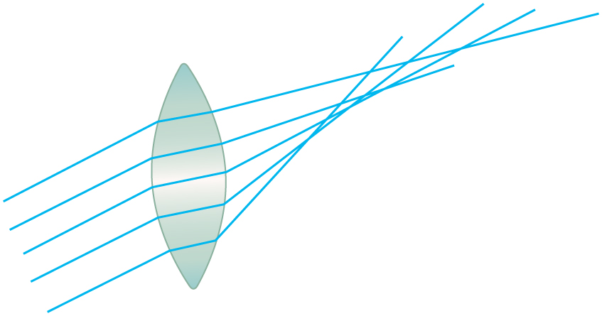
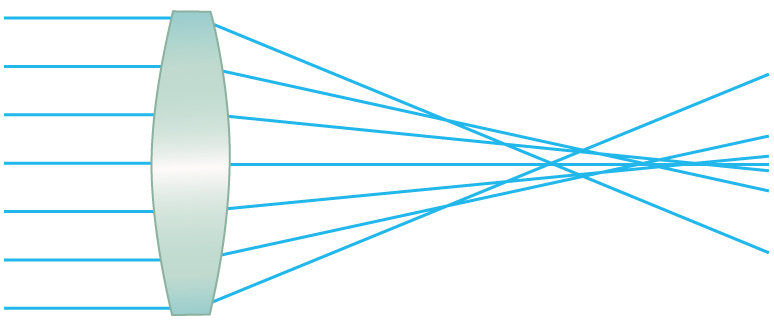

* Describe optical aberration.

Real lenses behave somewhat differently from how they are modeled using the thin lens equations, producing **aberrations**{: data-type="term" #import-auto-id2622740}. An aberration is a distortion in an image. There are a variety of aberrations due to a lens size, material, thickness, and position of the object. One common type of aberration is chromatic aberration, which is related to color. Since the index of refraction of lenses depends on color or wavelength, images are produced at different places and with different magnifications for different colors. (The law of reflection is independent of wavelength, and so mirrors do not have this problem. This is another advantage for mirrors in optical systems such as telescopes.) [\[link\]](#import-auto-id2594876)(a) shows chromatic aberration for a single convex lens and its partial correction with a two-lens system. Violet rays are bent more than red, since they have a higher index of refraction and are thus focused closer to the lens. The diverging lens partially corrects this, although it is usually not possible to do so completely. Lenses of different materials and having different dispersions may be used. For example an achromatic doublet consisting of a converging lens made of crown glass and a diverging lens made of flint glass in contact can dramatically reduce chromatic aberration (see [\[link\]](#import-auto-id2594876)(b)).

Quite often in an imaging system the object is off-center. Consequently, different parts of a lens or mirror do not refract or reflect the image to the same point. This type of aberration is called a coma and is shown in [\[link\]](#import-auto-id3402291). The image in this case often appears pear-shaped. Another common aberration is spherical aberration where rays converging from the outer edges of a lens converge to a focus closer to the lens and rays closer to the axis focus further (see [\[link\]](#import-auto-id3137283)). Aberrations due to astigmatism in the lenses of the eyes are discussed in [Vision Correction](/m42484), and a chart used to detect astigmatism is shown in [\[link\]](/m42484#import-auto-id2929041). Such aberrations and can also be an issue with manufactured lenses.

![Part a shows a single convex lens. White light source rays are striking the edges and the optical axis of the lens. Visible spectrum of light is refracted from the lens and is falling on the axis. Violet rays have bent more than red rays and are focused closer to the lens shown as V and R dots at different location. Part b shows an achromatic doublet lens. White light source rays are striking the edges and the optical axis of the lens. Rays are getting refracted within the lens and a visible spectrum of light is falling at one point of the axis shown as a dot.](../resources/Figure_27_06_01.jpg "(a) Chromatic aberration is caused by the dependence of a lens&#x2019;s index of refraction on color (wavelength). The lens is more powerful for violet (V) than for red (R), producing images with different locations and magnifications. (b) Multiple-lens systems can partially correct chromatic aberrations, but they may require lenses of different materials and add to the expense of optical systems such as cameras."){: #import-auto-id2594876}

 {: #import-auto-id3402291}

{: #import-auto-id3137283}

The image produced by an optical system needs to be bright enough to be discerned. It is often a challenge to obtain a sufficiently bright image. The brightness is determined by the amount of light passing through the optical system. The optical components determining the brightness are the diameter of the lens and the diameter of pupils, diaphragms or aperture stops placed in front of lenses. Optical systems often have entrance and exit pupils to specifically reduce aberrations but they inevitably reduce brightness as well. Consequently, optical systems need to strike a balance between the various components used. The iris in the eye dilates and constricts, acting as an entrance pupil. You can see objects more clearly by looking through a small hole made with your hand in the shape of a fist. Squinting, or using a small hole in a piece of paper, also will make the object sharper.

So how are aberrations corrected? The lenses may also have specially shaped surfaces, as opposed to the simple spherical shape that is relatively easy to produce. Expensive camera lenses are large in diameter, so that they can gather more light, and need several elements to correct for various aberrations. Further, advances in materials science have resulted in lenses with a range of refractive indices—technically referred to as graded index (GRIN) lenses. Spectacles often have the ability to provide a range of focusing ability using similar techniques. GRIN lenses are particularly important at the end of optical fibers in endoscopes. Advanced computing techniques allow for a range of corrections on images after the image has been collected and certain characteristics of the optical system are known. Some of these techniques are sophisticated versions of what are available on commercial packages like Adobe Photoshop.

# Section Summary

* {: #import-auto-id937162} Aberrations or image distortions can arise due to the finite thickness of optical instruments, imperfections in the optical components, and limitations on the ways in which the components are used.
* {: #import-auto-id3180514} The means for correcting aberrations range from better components to computational techniques.

# Conceptual Questions

List the various types of aberrations. What causes them and how can each be reduced?

# Problem Exercises

**Integrated Concepts**

(a) During laser vision correction, a brief burst of 193 nm ultraviolet light is projected onto the cornea of the patient. It makes a spot 1.00 mm in diameter and deposits 0.500 mJ of energy. Calculate the depth of the layer ablated, assuming the corneal tissue has the same properties as water and is initially at <math xmlns="http://www.w3.org/1998/Math/MathML"><semantics><mrow><mtext>34.0ºC</mtext></mrow></semantics></math>

. The tissue’s temperature is increased to <math xmlns="http://www.w3.org/1998/Math/MathML"><semantics><mrow><mtext>100ºC</mtext></mrow></semantics></math>

 and evaporated without further temperature increase.

(b) Does your answer imply that the shape of the cornea can be finely controlled?

(a) <math xmlns="http://www.w3.org/1998/Math/MathML"><semantics><mrow><mrow><mrow><mn>0</mn><mtext>.</mtext><mtext>251</mtext><mspace width="0.25em" /><mtext> μm</mtext></mrow></mrow><mrow /></mrow><annotation encoding="StarMath 5.0"> size 12{0 "." "251"" μm"} {}</annotation></semantics></math>

(b) Yes, this thickness implies that the shape of the cornea can be very finely controlled, producing normal distant vision in more than 90% of patients.

