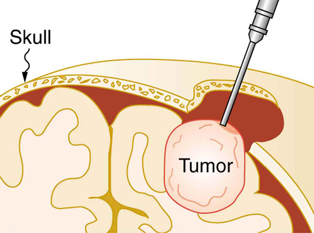
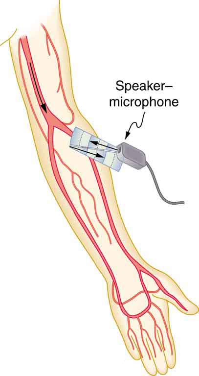

* Define acoustic impedance and intensity reflection coefficient.
* Describe medical and other uses of ultrasound technology.
* Calculate acoustic impedance using density values and the speed of ultrasound.
* Calculate the velocity of a moving object using Doppler-shifted ultrasound.

 "){: #import-auto-id3422542 data-media-type="image/png"}

Any sound with a frequency above 20,000 Hz (or 20 kHz)—that is, above the highest audible frequency—is defined to be ultrasound. In practice, it is possible to create ultrasound frequencies up to more than a gigahertz. (Higher frequencies are difficult to create; furthermore, they propagate poorly because they are very strongly absorbed.) Ultrasound has a tremendous number of applications, which range from burglar alarms to use in cleaning delicate objects to the guidance systems of bats. We begin our discussion of ultrasound with some of its applications in medicine, in which it is used extensively both for diagnosis and for therapy.

Characteristics of Ultrasound

The characteristics of ultrasound, such as frequency and intensity, are wave properties common to all types of waves. Ultrasound also has a wavelength that limits the fineness of detail it can detect. This characteristic is true of all waves. We can never observe details significantly smaller than the wavelength of our probe; for example, we will never see individual atoms with visible light, because the atoms are so small compared with the wavelength of light.

# Ultrasound in Medical Therapy

Ultrasound, like any wave, carries energy that can be absorbed by the medium carrying it, producing effects that vary with intensity. When focused to intensities of <math xmlns="http://www.w3.org/1998/Math/MathML"><semantics><mrow><msup><mtext>10</mtext><mrow><mrow><mtext>3</mtext></mrow></mrow></msup></mrow></semantics></math>

 to <math xmlns="http://www.w3.org/1998/Math/MathML"><semantics><mrow><msup><mtext>10</mtext><mrow><mrow><mtext>5</mtext></mrow></mrow></msup></mrow></semantics></math>

 <math xmlns="http://www.w3.org/1998/Math/MathML"><semantics><mrow><msup><mtext>W/m</mtext><mrow><mrow><mtext>2</mtext></mrow></mrow></msup></mrow></semantics></math>

, ultrasound can be used to shatter gallstones or pulverize cancerous tissue in surgical procedures. (See [\[link\]](#import-auto-id2669723).) Intensities this great can damage individual cells, variously causing their protoplasm to stream inside them, altering their permeability, or rupturing their walls through *cavitation*. Cavitation is the creation of vapor cavities in a fluid—the longitudinal vibrations in ultrasound alternatively compress and expand the medium, and at sufficient amplitudes the expansion separates molecules. Most cavitation damage is done when the cavities collapse, producing even greater shock pressures.

{: #import-auto-id2669723 data-media-type="image/jpg"}

Most of the energy carried by high-intensity ultrasound in tissue is converted to thermal energy. In fact, intensities of <math xmlns="http://www.w3.org/1998/Math/MathML"><semantics><mrow><mrow><msup><mtext>10</mtext><mrow><mn>3</mn></mrow></msup></mrow><mrow /></mrow><annotation encoding="StarMath 5.0"> size 12{"10" rSup { size 8{3} } } {}</annotation></semantics></math>

 to <math xmlns="http://www.w3.org/1998/Math/MathML"><semantics><mrow><mrow><mrow><msup><mtext>10</mtext><mrow><mn>4</mn></mrow></msup><mspace width="0.25em" /><msup><mtext>W/m</mtext><mrow><mn>2</mn></mrow></msup></mrow></mrow><mrow /></mrow><annotation encoding="StarMath 5.0"> size 12{"10" rSup { size 8{4} } "W/m" rSup { size 8{2} } } {}</annotation></semantics></math>

 are commonly used for deep-heat treatments called ultrasound diathermy. Frequencies of 0.8 to 1 MHz are typical. In both athletics and physical therapy, ultrasound diathermy is most often applied to injured or overworked muscles to relieve pain and improve flexibility. Skill is needed by the therapist to avoid “bone burns” and other tissue damage caused by overheating and cavitation, sometimes made worse by reflection and focusing of the ultrasound by joint and bone tissue.

In some instances, you may encounter a different decibel scale, called the sound *pressure* level, when ultrasound travels in water or in human and other biological tissues. We shall not use the scale here, but it is notable that numbers for sound pressure levels range 60 to 70 dB higher than you would quote for <math xmlns="http://www.w3.org/1998/Math/MathML"><semantics><mrow><mrow><mi>β</mi></mrow><mrow /></mrow><annotation encoding="StarMath 5.0"> size 12{β} {}</annotation></semantics></math>

, the sound intensity level used in this text. Should you encounter a sound pressure level of 220 decibels, then, it is not an astronomically high intensity, but equivalent to about 155 dB—high enough to destroy tissue, but not as unreasonably high as it might seem at first.

# Ultrasound in Medical Diagnostics

When used for imaging, ultrasonic waves are emitted from a transducer, a crystal exhibiting the piezoelectric effect (the expansion and contraction of a substance when a voltage is applied across it, causing a vibration of the crystal). These high-frequency vibrations are transmitted into any tissue in contact with the transducer. Similarly, if a pressure is applied to the crystal (in the form of a wave reflected off tissue layers), a voltage is produced which can be recorded. The crystal therefore acts as both a transmitter and a receiver of sound. Ultrasound is also partially absorbed by tissue on its path, both on its journey away from the transducer and on its return journey. From the time between when the original signal is sent and when the reflections from various boundaries between media are received, (as well as a measure of the intensity loss of the signal), the nature and position of each boundary between tissues and organs may be deduced.

Reflections at boundaries between two different media occur because of differences in a characteristic known as the <strong data-type="term" id="import-auto-id3007118">acoustic impedance </strong>*<math xmlns="http://www.w3.org/1998/Math/MathML"><semantics><mrow><mrow><mi>Z</mi></mrow><mrow /></mrow><annotation encoding="StarMath 5.0"> size 12{Z} {}</annotation></semantics></math>

* of each substance. Impedance is defined as

<math xmlns="http://www.w3.org/1998/Math/MathML"><semantics><mrow><mrow><mrow><mi>Z</mi><mo stretchy="false">=</mo><mstyle fontstyle="italic"><mrow><mtext>ρv</mtext></mrow></mstyle></mrow></mrow><mrow /><mo>,</mo></mrow><annotation encoding="StarMath 5.0"> size 12{Z= ital "pv"} {}</annotation></semantics></math>

where <math xmlns="http://www.w3.org/1998/Math/MathML"><semantics><mrow><mrow><mi>ρ</mi></mrow><mrow /></mrow></semantics></math>

 is the density of the medium (in <math xmlns="http://www.w3.org/1998/Math/MathML"><semantics><mrow><msup><mn>kg/m</mn><mn>3</mn></msup></mrow></semantics></math>

) and <math xmlns="http://www.w3.org/1998/Math/MathML"><semantics><mrow><mrow><mi>v</mi></mrow><mrow /></mrow><annotation encoding="StarMath 5.0"> size 12{v} {}</annotation></semantics></math>

 is the speed of sound through the medium (in m/s). The units for <math xmlns="http://www.w3.org/1998/Math/MathML"><semantics><mrow><mrow><mi>Z</mi></mrow><mrow /></mrow></semantics></math>

 are therefore <math xmlns="http://www.w3.org/1998/Math/MathML"><semantics><mrow><msup><mn>kg/(m</mn><mn>2</mn></msup><mo>·</mo><mtext>s)</mtext></mrow></semantics></math>

.

[\[link\]](#import-auto-id2672118) shows the density and speed of sound through various media (including various soft tissues) and the associated acoustic impedances. Note that the acoustic impedances for soft tissue do not vary much but that there is a big difference between the acoustic impedance of soft tissue and air and also between soft tissue and bone.

<table id="import-auto-id2672118" summary="A table containing four columns is shown, giving the ultrasound properties of various media related to the human body. The first column gives the name of each medium, the second column gives the value of density of the medium, the third column gives the speed of ultrasound in that medium, and the fourth column gives the acoustic impedance of the medium."><caption>The Ultrasound Properties of Various Media, Including Soft Tissue Found in the Body</caption><thead><tr>
            <th>Medium</th>
            <th>Density (kg/m3)</th>
            <th>Speed of Ultrasound (m/s)</th>
            <th>
              Acoustic Impedance <math xmlns="http://www.w3.org/1998/Math/MathML">
        <semantics>
          <mrow>
            <mrow>
              <mo>(</mo>
                <mrow>
                  <mtext>kg/</mtext>
                  <mo>(</mo>
                    <mrow>
                      <msup>
                        <mtext>m</mtext>
                        <mrow>
                          <mn>2</mn>
                        </mrow>
                      </msup>
                      <mo stretchy="false">⋅</mo>
                      <mtext>s</mtext>
                    </mrow>
                  <mo>)</mo>
                </mrow>
              <mo>)</mo>
            </mrow>
          </mrow>
        </semantics>
      </math>
    
            </th>
          </tr></thead><tbody><tr>
            <td>Air</td>
            <td>1.3</td>
            <td>330</td>
            <td><math xmlns="http://www.w3.org/1998/Math/MathML"><semantics><mrow><mn>429</mn></mrow></semantics></math></td>
          </tr><tr>
            <td>Water</td>
            <td>1000</td>
            <td>1500</td>
            <td><math xmlns="http://www.w3.org/1998/Math/MathML"><semantics><mrow><mn>1.5</mn><mo>×</mo><msup><mn>10</mn><mn>6</mn></msup></mrow></semantics></math></td>
          </tr><tr>
            <td>Blood</td>
            <td>1060</td>
            <td>1570</td>
            <td><math xmlns="http://www.w3.org/1998/Math/MathML"><semantics><mrow><mn>1.66</mn><mo>×</mo><msup><mn>10</mn><mn>6</mn></msup></mrow></semantics></math></td>
          </tr><tr>
            <td>Fat</td>
            <td>925</td>
            <td>1450</td>
            <td><math xmlns="http://www.w3.org/1998/Math/MathML"><semantics><mrow><mn>1.34</mn><mo>×</mo><msup><mn>10</mn><mn>6</mn></msup></mrow></semantics></math></td>
          </tr><tr>
            <td>Muscle (average)</td>
            <td>1075</td>
            <td>1590</td>
            <td><math xmlns="http://www.w3.org/1998/Math/MathML"><semantics><mrow><mn>1.70</mn><mo>×</mo><msup><mn>10</mn><mn>6</mn></msup></mrow></semantics></math></td>
          </tr><tr>
            <td>Bone (varies)</td>
            <td>1400–1900</td>
            <td>4080</td>
            <td><math xmlns="http://www.w3.org/1998/Math/MathML"><semantics><mrow><mn>5.7</mn><mo>×</mo><msup><mn>10</mn><mn>6</mn></msup></mrow></semantics></math> to <math xmlns="http://www.w3.org/1998/Math/MathML"><semantics><mrow><mn>7.8</mn><mo>×</mo><msup><mn>10</mn><mn>6</mn></msup></mrow></semantics></math></td>
          </tr><tr>
            <td>Barium titanate (transducer material)</td>
            <td>5600</td>
            <td>5500</td>
            <td><math xmlns="http://www.w3.org/1998/Math/MathML"><semantics><mrow><mn>30.8</mn><mo>×</mo><msup><mn>10</mn><mn>6</mn></msup></mrow></semantics></math></td>
          </tr></tbody></table>

At the boundary between media of different acoustic impedances, some of the wave energy is reflected and some is transmitted. The greater the **difference** in acoustic impedance between the two media, the greater the reflection and the smaller the transmission.

The **intensity reflection coefficient**{: data-type="term"} <math xmlns="http://www.w3.org/1998/Math/MathML"><semantics><mrow><mrow><mi>a</mi></mrow><mrow /></mrow><annotation encoding="StarMath 5.0"> size 12{a} {}</annotation></semantics></math>

 is defined as the ratio of the intensity of the reflected wave relative to the incident (transmitted) wave. This statement can be written mathematically as

<math xmlns="http://www.w3.org/1998/Math/MathML"><semantics><mrow><mrow><mrow><mi>a</mi><mo stretchy="false">=</mo><mfrac><msup><mfenced open="(" close=")"><mrow><msub><mi>Z</mi><mrow><mn>2</mn></mrow></msub><mo stretchy="false">−</mo><msub><mi>Z</mi><mrow><mn>1</mn></mrow></msub></mrow></mfenced><mrow><mn>2</mn></mrow></msup><msup><mfenced open="(" close=")"><mrow><msub><mi>Z</mi><mrow><mn>1</mn></mrow></msub><mo stretchy="false">+</mo><msub><mi>Z</mi><mrow><mn>2</mn></mrow></msub></mrow></mfenced><mrow><mn>2</mn></mrow></msup></mfrac></mrow></mrow><mrow /><mo>,</mo></mrow><annotation encoding="StarMath 5.0"> size 12{a= { { left (Z rSub { size 8{2} } - Z rSub { size 8{1} } right ) rSup { size 8{2} } } over { left (Z rSub { size 8{1} } +Z rSub { size 8{2} } right ) rSup { size 8{2} } } } } {}</annotation></semantics></math>

where <math xmlns="http://www.w3.org/1998/Math/MathML"><semantics><mrow><mrow><msub><mi>Z</mi><mrow><mn>1</mn></mrow></msub></mrow><mrow /></mrow><annotation encoding="StarMath 5.0"> size 12{Z rSub { size 8{1} } } {}</annotation></semantics></math>

 and <math xmlns="http://www.w3.org/1998/Math/MathML"><semantics><mrow><mrow><msub><mi>Z</mi><mrow><mn>2</mn></mrow></msub></mrow><mrow /></mrow><annotation encoding="StarMath 5.0"> size 12{Z rSub { size 8{2} } } {}</annotation></semantics></math>

 are the acoustic impedances of the two media making up the boundary. A reflection coefficient of zero (corresponding to total transmission and no reflection) occurs when the acoustic impedances of the two media are the same. An impedance “match” (no reflection) provides an efficient coupling of sound energy from one medium to another. The image formed in an ultrasound is made by tracking reflections (as shown in [\[link\]](#import-auto-id2672567)) and mapping the intensity of the reflected sound waves in a two-dimensional plane.

Calculate Acoustic Impedance and Intensity Reflection Coefficient: Ultrasound and Fat Tissue

(a) Using the values for density and the speed of ultrasound given in [\[link\]](#import-auto-id2672118), show that the acoustic impedance of fat tissue is indeed <math xmlns="http://www.w3.org/1998/Math/MathML"><semantics><mrow><mn>1.34</mn><mo>×</mo><msup><mn>10</mn><mn>6</mn></msup><mspace width="0.25em" /><msup><mn>kg/(m</mn><mn>2</mn></msup><mn>·s)</mn></mrow></semantics></math>

.

(b) Calculate the intensity reflection coefficient of ultrasound when going from fat to muscle tissue.

**Strategy for (a)**

The acoustic impedance can be calculated using <math xmlns="http://www.w3.org/1998/Math/MathML"><semantics><mrow><mrow><mrow><mi>Z</mi><mo stretchy="false">=</mo><mstyle fontstyle="italic"><mrow><mtext>ρv</mtext></mrow></mstyle></mrow></mrow><mrow /></mrow><annotation encoding="StarMath 5.0"> size 12{Z= ital "pv"} {}</annotation></semantics></math>

 and the values for <math xmlns="http://www.w3.org/1998/Math/MathML"><semantics><mrow><mi>ρ</mi></mrow></semantics></math>

 and <math xmlns="http://www.w3.org/1998/Math/MathML"><semantics><mrow><mi>v</mi></mrow></semantics></math>

 found in [\[link\]](#import-auto-id2672118).

**Solution for (a)**

(1) Substitute known values from [\[link\]](#import-auto-id2672118) into <math xmlns="http://www.w3.org/1998/Math/MathML"><semantics><mrow><mrow><mrow><mi>Z</mi><mo stretchy="false">=</mo><mstyle fontstyle="italic"><mrow><mtext>ρv</mtext></mrow></mstyle></mrow></mrow><mrow /></mrow><annotation encoding="StarMath 5.0"> size 12{Z= ital "pv"} {}</annotation></semantics></math>

.

<math xmlns="http://www.w3.org/1998/Math/MathML"> <semantics> <mrow> <mrow> <mrow> <mrow> <mrow> <mi>Z</mi> <mo stretchy="false">=</mo> <mi fontstyle="italic">ρv</mi> </mrow> <mo stretchy="false">=</mo> <mfenced open="(" close=")"> <mrow> <mtext>925 kg</mtext> <msup> <mtext>/m</mtext> <mrow> <mn>3</mn> </mrow> </msup> </mrow> </mfenced> </mrow> <mfenced open="(" close=")"> <mrow> <mtext>1450 m/s</mtext> </mrow> </mfenced> </mrow> </mrow> <mrow /> </mrow> <annotation encoding="StarMath 5.0"> size 12{Z=ρv= left ("925"" kg/m" rSup { size 8{3} } right ) left ("1450"" m/s" right )} {}</annotation> </semantics> </math>

(2) Calculate to find the acoustic impedance of fat tissue.

<math xmlns="http://www.w3.org/1998/Math/MathML"><semantics><mrow><mn>1.34</mn><mo>×</mo><msup><mn>10</mn><mn>6</mn></msup><mspace width="0.25em" /><msup><mn>kg/(m</mn><mn>2</mn></msup><mn>·s)</mn></mrow></semantics></math>

This value is the same as the value given for the acoustic impedance of fat tissue.

**Strategy for (b)**

The intensity reflection coefficient for any boundary between two media is given by <math xmlns="http://www.w3.org/1998/Math/MathML"><semantics><mrow><mrow><mrow><mi>a</mi><mo stretchy="false">=</mo><mfrac><msup><mfenced open="(" close=")"><mrow><msub><mi>Z</mi><mrow><mn>2</mn></mrow></msub><mo stretchy="false">−</mo><msub><mi>Z</mi><mrow><mn>1</mn></mrow></msub></mrow></mfenced><mrow><mn>2</mn></mrow></msup><msup><mfenced open="(" close=")"><mrow><msub><mi>Z</mi><mrow><mn>1</mn></mrow></msub><mspace width="0.25em" /><mo stretchy="false">+</mo><mspace width="0.25em" /><msub><mi>Z</mi><mrow><mn>2</mn></mrow></msub></mrow></mfenced><mrow><mn>2</mn></mrow></msup></mfrac></mrow></mrow><mrow /></mrow><annotation encoding="StarMath 5.0"> size 12{a= { { left (Z rSub { size 8{2} } - Z rSub { size 8{1} } right ) rSup { size 8{2} } } over { left (Z rSub { size 8{1} } + Z rSub { size 8{2} } right ) rSup { size 8{2} } } } } {}</annotation></semantics></math>

, and the acoustic impedance of muscle is given in [\[link\]](#import-auto-id2672118).

**Solution for (b)**

Substitute known values into <math xmlns="http://www.w3.org/1998/Math/MathML"><semantics><mrow><mrow><mrow><mi>a</mi><mo stretchy="false">=</mo><mfrac><msup><mfenced open="(" close=")"><mrow><msub><mi>Z</mi><mrow><mn>2</mn></mrow></msub><mo stretchy="false">−</mo><msub><mi>Z</mi><mrow><mn>1</mn></mrow></msub></mrow></mfenced><mrow><mn>2</mn></mrow></msup><msup><mfenced open="(" close=")"><mrow><msub><mi>Z</mi><mrow><mn>1</mn></mrow></msub><mspace width="0.25em" /><mo stretchy="false">+</mo><mspace width="0.25em" /><msub><mi>Z</mi><mrow><mn>2</mn></mrow></msub></mrow></mfenced><mrow><mn>2</mn></mrow></msup></mfrac></mrow></mrow><mrow /></mrow><annotation encoding="StarMath 5.0"> size 12{a= { { left (Z rSub { size 8{2} } - Z rSub { size 8{1} } right ) rSup { size 8{2} } } over { left (Z rSub { size 8{1} } + Z rSub { size 8{2} } right ) rSup { size 8{2} } } } } {}</annotation></semantics></math>

 to find the intensity reflection coefficient:

<math xmlns="http://www.w3.org/1998/Math/MathML"> <semantics> <mrow> <mrow> <mrow> <mrow> <mrow> <mrow> <mi>a</mi> <mo stretchy="false">=</mo> <mfrac> <msup> <mfenced open="(" close=")"> <mrow> <msub> <mi>Z</mi> <mrow> <mn>2</mn> </mrow> </msub> <mo stretchy="false">−</mo> <msub> <mi>Z</mi> <mrow> <mn>1</mn> </mrow> </msub> </mrow> </mfenced> <mrow> <mn>2</mn> </mrow> </msup> <msup> <mfenced open="(" close=")"> <mrow> <msub> <mi>Z</mi> <mrow> <mn>1</mn> </mrow> </msub> <mo stretchy="false">+</mo> <msub> <mi>Z</mi> <mrow> <mn>2</mn> </mrow> </msub> </mrow> </mfenced> <mrow> <mn>2</mn> </mrow> </msup> </mfrac> </mrow> <mo stretchy="false">=</mo> <mfrac> <msup> <mfenced open="(" close=")"> <mrow> <mn>1</mn> <mtext>.</mtext> <mrow> <mtext>34</mtext> <mo stretchy="false">×</mo> <msup> <mtext>10</mtext> <mrow> <mn>6</mn> </mrow> </msup> </mrow><mspace width="0.25em" /> <msup> <mtext>kg/(m</mtext> <mrow> <mtext>2</mtext> </mrow> </msup> <mrow> <mi> · s)</mi> <mo stretchy="false">−</mo> <mn>1.70</mn> <mo stretchy="false">×</mo> <msup> <mtext>10</mtext> <mrow> <mn>6</mn> </mrow> </msup> </mrow><mspace width="0.25em" /> <msup> <mtext>kg/(m</mtext> <mrow> <mtext>2</mtext> </mrow> </msup> <mn> · s)</mn> </mrow> </mfenced> <mrow> <mn>2</mn> </mrow> </msup> <msup> <mfenced open="(" close=")"> <mrow> <mn>1</mn> <mtext>.</mtext> <mrow> <mtext>70</mtext> <mo stretchy="false">×</mo> <msup> <mtext>10</mtext> <mrow> <mn>6</mn> </mrow> </msup><mspace width="0.25em" /> </mrow> <msup> <mtext>kg/(m</mtext> <mrow> <mtext>2</mtext> </mrow> </msup> <mrow> <mn> · s)</mn> <mo stretchy="false">+</mo> <mn>1</mn> </mrow> <mtext>.</mtext> <mrow> <mtext>34</mtext> <mo stretchy="false">×</mo> <msup> <mtext>10</mtext> <mrow> <mn>6</mn> </mrow> </msup> </mrow><mspace width="0.25em" /> <msup> <mtext>kg/(m</mtext> <mrow> <mtext>2</mtext> </mrow> </msup> <mn> · s)</mn> </mrow> </mfenced> <mrow> <mn>2</mn> </mrow> </msup> </mfrac> </mrow> <mo stretchy="false">=</mo> <mn>0</mn> </mrow> <mtext>.</mtext> <mtext>014</mtext> </mrow> </mrow> <mrow /> </mrow> <annotation encoding="StarMath 5.0"> size 12{a= { { left (Z rSub { size 8{2} } - Z rSub { size 8{1} } right ) rSup { size 8{2} } } over { left (Z rSub { size 8{1} } +Z rSub { size 8{2} } right ) rSup { size 8{2} } } } = { { left (1 "." "34" times "10" rSup { size 8{6} } "kgm" rSup { size 8{"-2"} } s rSup { size 8{ - 1} } - 1 "." "70" times "10" rSup { size 8{6} } "kgm" rSup { size 8{"-2"} } s rSup { size 8{"-1"} } right ) rSup { size 8{2} } } over { left (1 "." "70" times "10" rSup { size 8{6} } "kgm" rSup { size 8{"-2"} } s rSup { size 8{ - 1} } +1 "." "34" times "10" rSup { size 8{6} } "kgm" rSup { size 8{"-2"} } s rSup { size 8{"-1"} } right ) rSup { size 8{2} } } } =0 "." "014"} {}</annotation> </semantics> </math>

**Discussion**

This result means that only 1.4% of the incident intensity is reflected, with the remaining being transmitted.

The applications of ultrasound in medical diagnostics have produced untold benefits with no known risks. Diagnostic intensities are too low (about <math xmlns="http://www.w3.org/1998/Math/MathML"><semantics><mrow><mrow><mrow><msup><mtext>10</mtext><mrow><mrow><mo stretchy="false">−</mo><mn>2</mn></mrow></mrow></msup><mspace width="0.25em" /><msup><mtext>W/m</mtext><mrow><mn>2</mn></mrow></msup></mrow></mrow><mrow /></mrow><annotation encoding="StarMath 5.0"> size 12{"10" rSup { size 8{ - 2} } "W/m" rSup { size 8{2} } } {}</annotation></semantics></math>

) to cause thermal damage. More significantly, ultrasound has been in use for several decades and detailed follow-up studies do not show evidence of ill effects, quite unlike the case for x-rays.

 An ultrasound speaker doubles as a microphone. Brief bleeps are broadcast, and echoes are recorded from various depths. (b) Graph of echo intensity versus time. The time for echoes to return is directly proportional to the distance of the reflector, yielding this information noninvasively."){: #import-auto-id2672567 data-media-type="image/jpg"}

The most common ultrasound applications produce an image like that shown in [\[link\]](#import-auto-id3408221). The speaker-microphone broadcasts a directional beam, sweeping the beam across the area of interest. This is accomplished by having multiple ultrasound sources in the probe’s head, which are phased to interfere constructively in a given, adjustable direction. Echoes are measured as a function of position as well as depth. A computer constructs an image that reveals the shape and density of internal structures.

  An ultrasonic image is produced by sweeping the ultrasonic beam across the area of interest, in this case the woman&#x2019;s abdomen. Data are recorded and analyzed in a computer, providing a two-dimensional image. (b) Ultrasound image of 12-week-old fetus. (credit: Margaret W. Carruthers, Flickr)"){: #import-auto-id3408221 data-media-type="image/jpg"}

How much detail can ultrasound reveal? The image in [\[link\]](#import-auto-id3408221) is typical of low-cost systems, but that in [\[link\]](#import-auto-id1401205) shows the remarkable detail possible with more advanced systems, including 3D imaging. Ultrasound today is commonly used in prenatal care. Such imaging can be used to see if the fetus is developing at a normal rate, and help in the determination of serious problems early in the pregnancy. Ultrasound is also in wide use to image the chambers of the heart and the flow of blood within the beating heart, using the Doppler effect (echocardiology).

Whenever a wave is used as a probe, it is very difficult to detect details smaller than its wavelength <math xmlns="http://www.w3.org/1998/Math/MathML"><semantics><mrow><mrow><mi>λ</mi></mrow><mrow /></mrow><annotation encoding="StarMath 5.0"> size 12{λ} {}</annotation></semantics></math>

. Indeed, current technology cannot do quite this well. Abdominal scans may use a 7-MHz frequency, and the speed of sound in tissue is about 1540 m/s—so the wavelength limit to detail would be <math xmlns="http://www.w3.org/1998/Math/MathML"><semantics><mrow><mrow><mrow><mrow><mrow><mrow><mi>λ</mi><mo stretchy="false">=</mo><mfrac><msub><mi>v</mi><mrow><mn>w</mn></mrow></msub><mi>f</mi></mfrac></mrow><mo stretchy="false">=</mo><mfrac><mrow><mtext>1540 m/s</mtext></mrow><mrow><mrow><mn>7</mn><mo stretchy="false">×</mo><msup><mtext>10</mtext><mrow><mn>6</mn></mrow></msup><mspace width="0.25em" /></mrow><mtext>Hz</mtext></mrow></mfrac></mrow><mo stretchy="false">=</mo><mn>0</mn></mrow><mtext>.</mtext><mtext>22 mm</mtext></mrow></mrow><mrow /></mrow><annotation encoding="StarMath 5.0"> size 12{λ= { {v rSub { size 8{w} } } over {f} } = { {"1540""m/s"} over {7 times "10" rSup { size 8{6} } "Hz"} } =0 "." "22""mm"} {}</annotation></semantics></math>

. In practice, 1-mm detail is attainable, which is sufficient for many purposes. Higher-frequency ultrasound would allow greater detail, but it does not penetrate as well as lower frequencies do. The accepted rule of thumb is that you can effectively scan to a depth of about <math xmlns="http://www.w3.org/1998/Math/MathML"><semantics><mrow><mrow><mn>500</mn><mi>λ</mi></mrow><mrow /></mrow><annotation encoding="StarMath 5.0"> size 12{λ} {}</annotation></semantics></math>

 into tissue. For 7 MHz, this penetration limit is <math xmlns="http://www.w3.org/1998/Math/MathML"><semantics><mrow><mn>500</mn><mo>×</mo><mn>0.22 mm</mn></mrow></semantics></math>

, which is 0.11 m. Higher frequencies may be employed in smaller organs, such as the eye, but are not practical for looking deep into the body.

"){: #import-auto-id1401205 data-media-type="image/png"}

In addition to shape information, ultrasonic scans can produce density information superior to that found in X-rays, because the intensity of a reflected sound is related to changes in density. Sound is most strongly reflected at places where density changes are greatest.

Another major use of ultrasound in medical diagnostics is to detect motion and determine velocity through the Doppler shift of an echo, known as **Doppler-shifted ultrasound**{: data-type="term" #import-auto-id3101559}. This technique is used to monitor fetal heartbeat, measure blood velocity, and detect occlusions in blood vessels, for example. (See [\[link\]](#import-auto-id2032586).) The magnitude of the Doppler shift in an echo is directly proportional to the velocity of whatever reflects the sound. Because an echo is involved, there is actually a double shift. The first occurs because the reflector (say a fetal heart) is a moving observer and receives a Doppler-shifted frequency. The reflector then acts as a moving source, producing a second Doppler shift.

 "){: #import-auto-id2032586 data-media-type="image/png"}

A clever technique is used to measure the Doppler shift in an echo. The frequency of the echoed sound is superimposed on the broadcast frequency, producing beats. The beat frequency is <math xmlns="http://www.w3.org/1998/Math/MathML"><semantics><mrow><mrow><mrow><mrow><msub><mi>F</mi><mrow><mn>B</mn></mrow></msub><mo stretchy="false">=</mo><mo stretchy="false">∣</mo></mrow><mrow><msub><mi>f</mi><mrow><mn>1</mn></mrow></msub><mo stretchy="false">−</mo><msub><mi>f</mi><mrow><mn>2</mn></mrow></msub></mrow><mo stretchy="false">∣</mo></mrow></mrow><mrow /></mrow><annotation encoding="StarMath 5.0"> size 12{F rSub { size 8{b} } = \lline f rSub { size 8{1} } - f rSub { size 8{2} } line } {}</annotation></semantics></math>

, and so it is directly proportional to the Doppler shift (<math xmlns="http://www.w3.org/1998/Math/MathML"><semantics><mrow><mrow><mrow><msub><mi>f</mi><mrow><mn>1</mn></mrow></msub><mo stretchy="false">−</mo><msub><mi>f</mi><mrow><mn>2</mn></mrow></msub></mrow></mrow><mrow /></mrow><annotation encoding="StarMath 5.0"> size 12{f rSub { size 8{1} } - f rSub { size 8{2} } } {}</annotation></semantics></math>

) and hence, the reflector’s velocity. The advantage in this technique is that the Doppler shift is small (because the reflector’s velocity is small), so that great accuracy would be needed to measure the shift directly. But measuring the beat frequency is easy, and it is not affected if the broadcast frequency varies somewhat. Furthermore, the beat frequency is in the audible range and can be amplified for audio feedback to the medical observer.

Uses for Doppler-Shifted Radar

Doppler-shifted radar echoes are used to measure wind velocities in storms as well as aircraft and automobile speeds. The principle is the same as for Doppler-shifted ultrasound. There is evidence that bats and dolphins may also sense the velocity of an object (such as prey) reflecting their ultrasound signals by observing its Doppler shift.

Calculate Velocity of Blood: Doppler-Shifted Ultrasound

Ultrasound that has a frequency of 2.50 MHz is sent toward blood in an artery that is moving toward the source at 20.0 cm/s, as illustrated in [\[link\]](#import-auto-id3209774). Use the speed of sound in human tissue as 1540 m/s. (Assume that the frequency of 2.50 MHz is accurate to seven significant figures.)

1.  {: #import-auto-id1575930} What frequency does the blood receive?
2.  {: #import-auto-id3022839} What frequency returns to the source?
3.  {: #import-auto-id2625931} What beat frequency is produced if the source and returning frequencies are mixed?
{: data-number-style="lower-alpha"}

{: #import-auto-id3209774 data-media-type="image/jpg"}

**Strategy**

The first two questions can be answered using <math xmlns="http://www.w3.org/1998/Math/MathML"><semantics><mrow><mrow><mrow><mrow><msub><mi>f</mi><mrow><mtext>obs</mtext></mrow></msub><mo stretchy="false">=</mo><msub><mi>f</mi><mrow><mn>s</mn></mrow></msub></mrow><mfenced open="(" close=")"><mfrac><msub><mi>v</mi><mrow><mn>w</mn></mrow></msub><mrow><msub><mi>v</mi><mrow><mn>w</mn></mrow></msub><mspace width="0.25em" /><mo stretchy="false">±</mo><mspace width="0.25em" /><msub><mi>v</mi><mrow><mn>s</mn></mrow></msub></mrow></mfrac></mfenced></mrow></mrow><mrow /></mrow><annotation encoding="StarMath 5.0"> size 12{f rSub { size 8{"obs"} } =f rSub { size 8{s} } left ( { {v rSub { size 8{w} } } over {v rSub { size 8{w} } +- v rSub { size 8{s} } } } right )} {}</annotation></semantics></math>

 and <math xmlns="http://www.w3.org/1998/Math/MathML"><semantics><mrow><mrow><mrow><mrow><msub><mi>f</mi><mrow><mtext>obs</mtext></mrow></msub><mo stretchy="false">=</mo><msub><mi>f</mi><mrow><mn>s</mn></mrow></msub></mrow><mfenced open="(" close=")"><mfrac><mrow><msub><mi>v</mi><mrow><mn>w</mn></mrow></msub><mspace width="0.25em" /><mo stretchy="false">±</mo><mspace width="0.25em" /><msub><mi>v</mi><mrow><mtext>obs</mtext></mrow></msub></mrow><msub><mi>v</mi><mrow><mn>w</mn></mrow></msub></mfrac></mfenced></mrow></mrow><mrow /></mrow><annotation encoding="StarMath 5.0"> size 12{f rSub { size 8{"obs"} } =f rSub { size 8{s} } left ( { {v rSub { size 8{w} } +- v rSub { size 8{"obs"} } } over {v rSub { size 8{w} } } } right )} {}</annotation></semantics></math>

 for the Doppler shift. The last question asks for beat frequency, which is the difference between the original and returning frequencies.

**Solution for (a)**

(1) Identify knowns:

* The blood is a moving observer, and so the frequency it receives is given by
  

  <math xmlns="http://www.w3.org/1998/Math/MathML"><semantics><mrow><mrow><mrow><mrow><msub><mi>f</mi><mrow><mtext>obs</mtext></mrow></msub><mo stretchy="false">=</mo><msub><mi>f</mi><mrow><mn>s</mn></mrow></msub></mrow><mfenced open="(" close=")"><mfrac><mrow><msub><mi>v</mi><mrow><mn>w</mn></mrow></msub><mo stretchy="false">±</mo><msub><mi>v</mi><mrow><mtext>obs</mtext></mrow></msub></mrow><msub><mi>v</mi><mrow><mn>w</mn></mrow></msub></mfrac></mfenced></mrow></mrow><mo>.</mo></mrow><annotation encoding="StarMath 5.0"> size 12{f rSub { size 8{"obs"} } =f rSub { size 8{s} } left ( { {v rSub { size 8{w} } +- v rSub { size 8{"obs"} } } over {v rSub { size 8{w} } } } right )} {}</annotation></semantics></math>
  

* <math xmlns="http://www.w3.org/1998/Math/MathML"><semantics><mrow><mrow><msub><mi fontstyle="italic">v</mi><mrow><mn>b</mn></mrow></msub></mrow><mrow /></mrow><annotation encoding="StarMath 5.0"> size 12{v rSub { size 8{b} } } {}</annotation></semantics></math>
  
  is the blood velocity (
  <math xmlns="http://www.w3.org/1998/Math/MathML"><semantics><mrow><mrow><msub><mi fontstyle="italic">v</mi><mrow><mtext>obs</mtext></mrow></msub></mrow><mrow /></mrow><annotation encoding="StarMath 5.0"> size 12{v rSub { size 8{"obs"} } } {}</annotation></semantics></math>
  
  here) and the plus sign is chosen because the motion is toward the source.

(2) Enter the given values into the equation.

<math xmlns="http://www.w3.org/1998/Math/MathML"> <semantics> <mrow> <mrow> <mrow> <mrow> <msub> <mi>f</mi> <mrow> <mtext>obs</mtext> </mrow> </msub> <mo stretchy="false">=</mo> <mfenced open="(" close=")"> <mrow> <mn>2,</mn> <mtext>500</mtext> <mi>,</mi> <mtext>000 Hz</mtext> </mrow> </mfenced> </mrow> <mfenced open="(" close=")"> <mfrac> <mrow> <mtext>1540 m/s</mtext> <mrow> <mo stretchy="false">+</mo> <mn>0</mn> </mrow> <mtext>.</mtext> <mtext>2 m/s</mtext> </mrow> <mtext>1540 m/s</mtext> </mfrac> </mfenced> </mrow> </mrow> <mrow /> </mrow> <annotation encoding="StarMath 5.0"> size 12{f rSub { size 8{"obs"} } = left (2,"500","000"" Hz" right ) left ( { {"1540"" m/s"+0 "." "2 m/s"} over {"1540 m/s"} } right )} {}</annotation> </semantics> </math>

(3) Calculate to find the frequency: 20,500,325 Hz.

**Solution for (b)**

(1) Identify knowns:

* The blood acts as a moving source.
* The microphone acts as a stationary observer.
* The frequency leaving the blood is 2,500,325 Hz, but it is shifted upward as given by
  

  <math xmlns="http://www.w3.org/1998/Math/MathML"><semantics><mrow><mrow><mrow><mrow><msub><mi>f</mi><mrow><mtext>obs</mtext></mrow></msub><mo stretchy="false">=</mo><msub><mi>f</mi><mrow><mn>s</mn></mrow></msub></mrow><mfenced open="(" close=")"><mfrac><msub><mi>v</mi><mrow><mn>w</mn></mrow></msub><mrow><msub><mi>v</mi><mrow><mn>w</mn></mrow></msub><mspace width="0.25em" /><mo stretchy="false">–</mo><mspace width="0.25em" /><msub><mi>v</mi><mrow><mn>b</mn></mrow></msub></mrow></mfrac></mfenced></mrow></mrow><mrow /><mo>.</mo></mrow><annotation encoding="StarMath 5.0"> size 12{f rSub { size 8{"obs"} } =f rSub { size 8{s} } left ( { {v rSub { size 8{w} } } over {v rSub { size 8{w} } +- v rSub { size 8{b} } } } right )} {}</annotation></semantics></math>
  

  
  <math xmlns="http://www.w3.org/1998/Math/MathML"><semantics><mrow><msub><mi>f</mi><mn>obs</mn></msub></mrow></semantics></math>
  
   is the frequency received by the speaker-microphone.

* The source velocity is
  <math xmlns="http://www.w3.org/1998/Math/MathML"><semantics><mrow><mrow><msub><mi fontstyle="italic">v</mi><mrow><mn>b</mn></mrow></msub></mrow><mrow /></mrow><annotation encoding="StarMath 5.0"> size 12{v rSub { size 8{b} } } {}</annotation></semantics></math>
  
  .
* The minus sign is used because the motion is toward the observer.

The minus sign is used because the motion is toward the observer.

(2) Enter the given values into the equation:

<math xmlns="http://www.w3.org/1998/Math/MathML"> <semantics> <mrow> <mrow> <mrow> <mrow> <msub> <mi>f</mi> <mrow> <mtext>obs</mtext> </mrow> </msub> <mo stretchy="false">=</mo> <mfenced open="(" close=")"> <mrow> <mn>2,</mn> <mtext>500</mtext> <mi>,</mi> <mtext>325 Hz</mtext> </mrow> </mfenced> </mrow> <mfenced open="(" close=")"> <mfrac> <mrow> <mtext>1540 m/s</mtext> </mrow> <mrow> <mrow> <mtext>1540 m/s </mtext> <mo stretchy="false">−</mo> <mn>0</mn> </mrow> <mtext>.</mtext> <mtext>200 m/s</mtext> </mrow> </mfrac> </mfenced> </mrow> </mrow> <mrow /> </mrow> <annotation encoding="StarMath 5.0"> size 12{f rSub { size 8{"obs"} } = left (2,"500","325"" Hz" right ) left ( { {"1540"" m/s"} over {"1540 m/s " - 0 "." "200"" m/s"} } right )} {}</annotation> </semantics> </math>

(3) Calculate to find the frequency returning to the source: 2,500,649 Hz.

**Solution for (c)**

(1) Identify knowns:

* The beat frequency is simply the absolute value of the difference between
  <math xmlns="http://www.w3.org/1998/Math/MathML"><semantics><mrow><mrow><msub><mi>f</mi><mrow><mn>s</mn></mrow></msub></mrow><mrow /></mrow><annotation encoding="StarMath 5.0"> size 12{f rSub { size 8{s} } } {}</annotation></semantics></math>
  
  and
  <math xmlns="http://www.w3.org/1998/Math/MathML"><semantics><mrow><mrow><msub><mi>f</mi><mrow><mtext>obs</mtext></mrow></msub></mrow><mrow /></mrow><annotation encoding="StarMath 5.0"> size 12{f rSub { size 8{"obs"} } } {}</annotation></semantics></math>
  
  , as stated in:
  

  <math xmlns="http://www.w3.org/1998/Math/MathML"><semantics><mrow><mrow><msub><mi>f</mi><mn>B</mn></msub><mo stretchy="false">=</mo><mo stretchy="false">∣</mo><msub><mi>f</mi><mtext>obs</mtext></msub><mo stretchy="false">−</mo><msub><mi>f</mi><mrow><mn>s</mn></mrow></msub><mo stretchy="false">∣</mo></mrow><mo>.</mo></mrow></semantics></math>
  

(2) Substitute known values:

<math xmlns="http://www.w3.org/1998/Math/MathML"> <semantics> <mrow> <mrow> <mrow> <mo stretchy="false">∣</mo> <mrow> <mn>2,</mn> <mtext>500</mtext> <mi>,</mi> <mtext>649</mtext> <mi /><mspace width="0.25em" /> <mrow> <mtext>Hz</mtext> <mo stretchy="false">−</mo> <mn>2,</mn> </mrow> <mtext>500</mtext> <mi>,</mi> <mtext>000</mtext> <mi /><mspace width="0.25em" /> <mtext>Hz</mtext> </mrow> <mo stretchy="false">∣</mo> </mrow> </mrow> <mrow /> </mrow> <annotation encoding="StarMath 5.0"> size 12{ lline 2,"500","649"`"Hz" - 2,"500","000"`"Hz" rline } {}</annotation> </semantics> </math>

(3) Calculate to find the beat frequency: 649 Hz.

**Discussion**

The Doppler shifts are quite small compared with the original frequency of 2.50 MHz. It is far easier to measure the beat frequency than it is to measure the echo frequency with an accuracy great enough to see shifts of a few hundred hertz out of a couple of megahertz. Furthermore, variations in the source frequency do not greatly affect the beat frequency, because both <math xmlns="http://www.w3.org/1998/Math/MathML"><semantics><mrow><mrow><msub><mi>f</mi><mrow><mn>s</mn></mrow></msub></mrow><mrow /></mrow><annotation encoding="StarMath 5.0"> size 12{f rSub { size 8{s} } } {}</annotation></semantics></math>

 and <math xmlns="http://www.w3.org/1998/Math/MathML"><semantics><mrow><mrow><msub><mi>f</mi><mrow><mtext>obs</mtext></mrow></msub></mrow><mrow /></mrow><annotation encoding="StarMath 5.0"> size 12{f rSub { size 8{"obs"} } } {}</annotation></semantics></math>

would increase or decrease. Those changes subtract out in <math xmlns="http://www.w3.org/1998/Math/MathML"><semantics><mrow><mrow><msub><mi>f</mi><mn>B</mn></msub><mo stretchy="false">=</mo><mo stretchy="false">∣</mo><msub><mi>f</mi><mtext>obs</mtext></msub><mo stretchy="false">−</mo><msub><mi>f</mi><mrow><mn>s</mn></mrow></msub><mo stretchy="false">∣</mo></mrow><mo>.</mo></mrow></semantics></math>

Industrial and Other Applications of Ultrasound

Industrial, retail, and research applications of ultrasound are common. A few are discussed here. Ultrasonic cleaners have many uses. Jewelry, machined parts, and other objects that have odd shapes and crevices are immersed in a cleaning fluid that is agitated with ultrasound typically about 40 kHz in frequency. The intensity is great enough to cause cavitation, which is responsible for most of the cleansing action. Because cavitation-produced shock pressures are large and well transmitted in a fluid, they reach into small crevices where even a low-surface-tension cleaning fluid might not penetrate.

Sonar is a familiar application of ultrasound. Sonar typically employs ultrasonic frequencies in the range from 30.0 to 100 kHz. Bats, dolphins, submarines, and even some birds use ultrasonic sonar. Echoes are analyzed to give distance and size information both for guidance and finding prey. In most sonar applications, the sound reflects quite well because the objects of interest have significantly different density than the medium in which they travel. When the Doppler shift is observed, velocity information can also be obtained. Submarine sonar can be used to obtain such information, and there is evidence that some bats also sense velocity from their echoes.

Similarly, there are a range of relatively inexpensive devices that measure distance by timing ultrasonic echoes. Many cameras, for example, use such information to focus automatically. Some doors open when their ultrasonic ranging devices detect a nearby object, and certain home security lights turn on when their ultrasonic rangers observe motion. Ultrasonic “measuring tapes” also exist to measure such things as room dimensions. Sinks in public restrooms are sometimes automated with ultrasound devices to turn faucets on and off when people wash their hands. These devices reduce the spread of germs and can conserve water.

Ultrasound is used for nondestructive testing in industry and by the military. Because ultrasound reflects well from any large change in density, it can reveal cracks and voids in solids, such as aircraft wings, that are too small to be seen with x-rays. For similar reasons, ultrasound is also good for measuring the thickness of coatings, particularly where there are several layers involved.

Basic research in solid state physics employs ultrasound. Its attenuation is related to a number of physical characteristics, making it a useful probe. Among these characteristics are structural changes such as those found in liquid crystals, the transition of a material to a superconducting phase, as well as density and other properties.

These examples of the uses of ultrasound are meant to whet the appetites of the curious, as well as to illustrate the underlying physics of ultrasound. There are many more applications, as you can easily discover for yourself.

Check Your Understanding

Why is it possible to use ultrasound both to observe a fetus in the womb and also to destroy cancerous tumors in the body?

Ultrasound can be used medically at different intensities. Lower intensities do not cause damage and are used for medical imaging. Higher intensities can pulverize and destroy targeted substances in the body, such as tumors.
{: xmlns:fo="urn:oasis:names:tc:opendocument:xmlns:xsl-fo-compatible:1.0" fo:font-weight="normal"}

# Section Summary

* The acoustic impedance is defined as:
  

  <math xmlns="http://www.w3.org/1998/Math/MathML"><semantics><mrow><mi>Z</mi><mo>=</mo><mi fontstyle="italic">ρv</mi><mo>,</mo></mrow></semantics></math>
  

  
  <math xmlns="http://www.w3.org/1998/Math/MathML"><semantics><mrow><mi fontstyle="italic">ρ</mi></mrow></semantics></math>
  
  is the density of a medium through which the sound travels and
  <math xmlns="http://www.w3.org/1998/Math/MathML"><semantics><mrow><mi fontstyle="italic">v</mi></mrow></semantics></math>
  
  is the speed of sound through that medium.
* The intensity reflection coefficient
  <math xmlns="http://www.w3.org/1998/Math/MathML"><semantics><mrow><mi fontstyle="italic">a</mi></mrow></semantics></math>
  
  , a measure of the ratio of the intensity of the wave reflected off a boundary between two media relative to the intensity of the incident wave, is given by
  

  <math xmlns="http://www.w3.org/1998/Math/MathML"> <semantics> <mrow> <mrow> <mrow> <mi>a</mi> <mo stretchy="false">=</mo> <mfrac> <msup> <mfenced open="(" close=")"> <mrow> <msub> <mi>Z</mi> <mrow> <mn>2</mn> </mrow> </msub> <mo stretchy="false">−</mo> <msub> <mi>Z</mi> <mrow> <mn>1</mn> </mrow> </msub> </mrow> </mfenced> <mrow> <mn>2</mn> </mrow> </msup> <msup> <mfenced open="(" close=")"> <mrow> <msub> <mi>Z</mi> <mrow> <mn>1</mn> </mrow> </msub> <mo stretchy="false">+</mo> <msub> <mi>Z</mi> <mrow> <mn>2</mn> </mrow> </msub> </mrow> </mfenced> <mrow> <mn>2</mn> </mrow> </msup> </mfrac> </mrow> </mrow> <mo>.</mo> <mrow /> </mrow> <annotation encoding="StarMath 5.0"> size 12{a= { { left (Z rSub { size 8{2} } - Z rSub { size 8{1} } right ) rSup { size 8{2} } } over { left (Z rSub { size 8{1} } +Z rSub { size 8{2} } right ) rSup { size 8{2} } } } } {}</annotation> </semantics> </math>
  

* {: #import-auto-id1348329} The intensity reflection coefficient is a unitless quantity.

# Conceptual Questions

If audible sound follows a rule of thumb similar to that for ultrasound, in terms of its absorption, would you expect the high or low frequencies from your neighbor’s stereo to penetrate into your house? How does this expectation compare with your experience?

Elephants and whales are known to use infrasound to communicate over very large distances. What are the advantages of infrasound for long distance communication?

It is more difficult to obtain a high-resolution ultrasound image in the abdominal region of someone who is overweight than for someone who has a slight build. Explain why this statement is accurate.

Suppose you read that 210-dB ultrasound is being used to pulverize cancerous tumors. You calculate the intensity in watts per centimeter squared and find it is unreasonably high (<math xmlns="http://www.w3.org/1998/Math/MathML"><semantics><mrow><mrow><mrow><msup><mtext>10</mtext><mrow><mn>5</mn></mrow></msup><mspace width="0.25em" /><msup><mtext>W/cm</mtext><mrow><mn>2</mn></mrow></msup></mrow></mrow><mrow /></mrow><annotation encoding="StarMath 5.0"> size 12{"10" rSup { size 8{5} } "W/cm" rSup { size 8{2} } } {}</annotation></semantics></math>

). What is a possible explanation?

# Problems &amp; Exercises

**Unless otherwise indicated, for problems in this section, assume that the speed of sound through human tissues is 1540 m/s.**

What is the sound intensity level in decibels of ultrasound of intensity <math xmlns="http://www.w3.org/1998/Math/MathML"><semantics><mrow><mrow><mrow><msup><mtext>10</mtext><mrow><mn>5</mn></mrow></msup><mspace width="0.25em" /><msup><mtext>W/m</mtext><mrow><mn>2</mn></mrow></msup></mrow></mrow><mrow /></mrow></semantics></math>

, used to pulverize tissue during surgery?

170 dB

Is 155-dB ultrasound in the range of intensities used for deep heating? Calculate the intensity of this ultrasound and compare this intensity with values quoted in the text.

Find the sound intensity level in decibels of <math xmlns="http://www.w3.org/1998/Math/MathML"><semantics><mrow><mrow><mrow><mn>2.00</mn><mo>×</mo><msup><mtext>10</mtext><mrow><mn>–2</mn></mrow></msup><mspace width="0.25em" /><msup><mtext>W/m</mtext><mrow><mn>2</mn></mrow></msup></mrow></mrow><mrow /><mspace width="0.25em" /></mrow></semantics></math>

ultrasound used in medical diagnostics.

103 dB
{: xmlns:fo="urn:oasis:names:tc:opendocument:xmlns:xsl-fo-compatible:1.0" fo:font-weight="normal"}

The time delay between transmission and the arrival of the reflected wave of a signal using ultrasound traveling through a piece of fat tissue was 0.13 ms. At what depth did this reflection occur?

In the clinical use of ultrasound, transducers are always coupled to the skin by a thin layer of gel or oil, replacing the air that would otherwise exist between the transducer and the skin. (a) Using the values of acoustic impedance given in [[link]](#import-auto-id2672118) ** calculate the intensity reflection coefficient between transducer material and air. (b) Calculate the intensity reflection coefficient between transducer material and gel (assuming for this problem that its acoustic impedance is identical to that of water). (c) Based on the results of your calculations, explain why the gel is used.

(a) 1.00

(b) 0.823

(c) Gel is used to facilitate the transmission of the ultrasound between the transducer and the patient’s body.

(a) Calculate the minimum frequency of ultrasound that will allow you to see details as small as 0.250 mm in human tissue. (b) What is the effective depth to which this sound is effective as a diagnostic probe?

(a) Find the size of the smallest detail observable in human tissue with 20.0-MHz ultrasound. (b) Is its effective penetration depth great enough to examine the entire eye (about 3.00 cm is needed)? (c) What is the wavelength of such ultrasound in <math xmlns="http://www.w3.org/1998/Math/MathML"><semantics><mrow><mn>0ºC</mn></mrow></semantics></math>

 air?

(a) <math xmlns="http://www.w3.org/1998/Math/MathML"><semantics><mrow><mn>77.0 μm</mn></mrow></semantics></math>

(b) Effective penetration depth = 3.85 cm, which is enough to examine the eye.

(c) <math xmlns="http://www.w3.org/1998/Math/MathML"><semantics><mrow><mn>16.6 μm</mn></mrow></semantics></math>

(a) Echo times are measured by diagnostic ultrasound scanners to determine distances to reflecting surfaces in a patient. What is the difference in echo times for tissues that are 3.50 and 3.60 cm beneath the surface? (This difference is the minimum resolving time for the scanner to see details as small as 0.100 cm, or 1.00 mm. Discrimination of smaller time differences is needed to see smaller details.) (b) Discuss whether the period <math xmlns="http://www.w3.org/1998/Math/MathML"><semantics><mrow><mi>T</mi></mrow></semantics></math>

 of this ultrasound must be smaller than the minimum time resolution. If so, what is the minimum frequency of the ultrasound and is that out of the normal range for diagnostic ultrasound?

(a) How far apart are two layers of tissue that produce echoes having round-trip times (used to measure distances) that differ by <math xmlns="http://www.w3.org/1998/Math/MathML"><semantics><mrow><mn>0.750 μs</mn></mrow></semantics></math>

 ? (b) What minimum frequency must the ultrasound have to see detail this small?

(a) <math xmlns="http://www.w3.org/1998/Math/MathML"><semantics><mrow><mn>5.78</mn><mo>×</mo><msup><mn>10</mn><mn>–4</mn></msup><mspace width="0.25em" /><mtext>m</mtext></mrow></semantics></math>

(b) <math xmlns="http://www.w3.org/1998/Math/MathML"><semantics><mrow><mn>2.67</mn><mo>×</mo><msup><mn>10</mn><mn>6</mn></msup><mspace width="0.25em" /><mtext>Hz</mtext></mrow></semantics></math>

(a) A bat uses ultrasound to find its way among trees. If this bat can detect echoes 1.00 ms apart, what minimum distance between objects can it detect? (b) Could this distance explain the difficulty that bats have finding an open door when they accidentally get into a house?

A dolphin is able to tell in the dark that the ultrasound echoes received from two sharks come from two different objects only if the sharks are separated by 3.50 m, one being that much farther away than the other. (a) If the ultrasound has a frequency of 100 kHz, show this ability is not limited by its wavelength. (b) If this ability is due to the dolphin’s ability to detect the arrival times of echoes, what is the minimum time difference the dolphin can perceive?

(a) <math xmlns="http://www.w3.org/1998/Math/MathML"><semantics><mrow><msub><mi>v</mi><mn>w</mn></msub> <mo>=</mo> <mn>1540 m/s</mn> <mo>=</mo> <mi fontstyle="italic">fλ</mi> <mo>⇒</mo> <mi>λ</mi> <mo>=</mo> <mfrac> <mn>1540 m/s</mn> <mrow> <mn>100</mn><mo>×</mo><msup><mn>10</mn><mn>3</mn></msup><mspace width="0.25em" /><mtext>Hz</mtext> </mrow> </mfrac> <mo>=</mo> <mn>0.0154 m &lt; 3.50 m.</mn> </mrow></semantics></math>

 Because the wavelength is much shorter than the distance in question, the wavelength is not the limiting factor.

(b) 4.55 ms

A diagnostic ultrasound echo is reflected from moving blood and returns with a frequency 500 Hz higher than its original 2.00 MHz. What is the velocity of the blood? (Assume that the frequency of 2.00 MHz is accurate to seven significant figures and 500 Hz is accurate to three significant figures.)

Ultrasound reflected from an oncoming bloodstream that is moving at 30.0 cm/s is mixed with the original frequency of 2.50 MHz to produce beats. What is the beat frequency? (Assume that the frequency of 2.50 MHz is accurate to seven significant figures.)

974 Hz

(Note: extra digits were retained in order to show the difference.)

