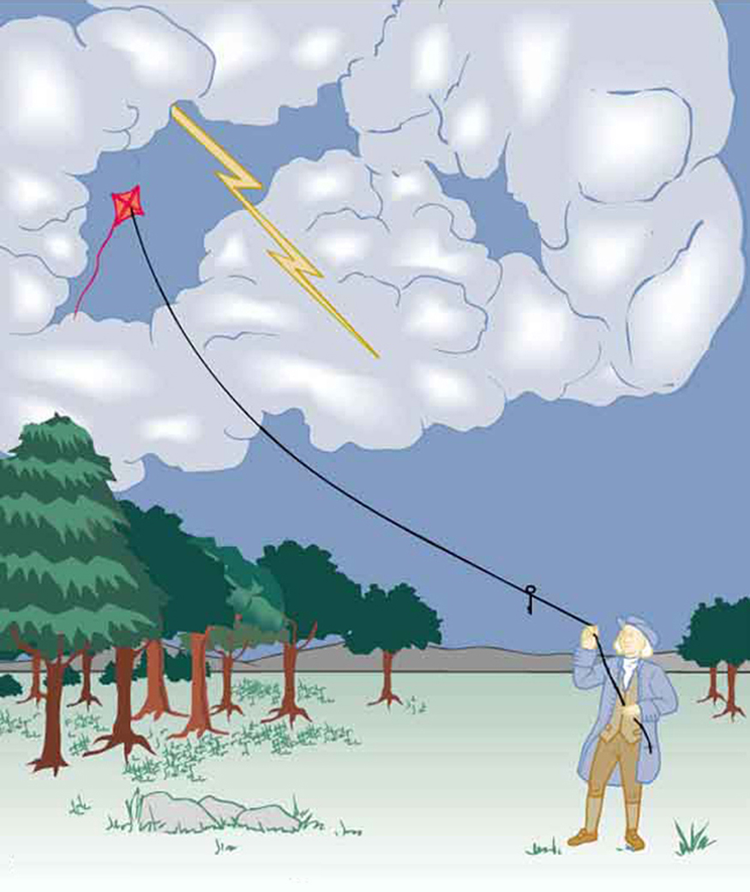

<cnx-pi data-type="cnx.flag.introduction"> class="introduction" </cnx-pi>

<cnx-pi data-type="cnx.eoc">class="section-summary" title="Section Summary"</cnx-pi>

<cnx-pi data-type="cnx.eoc">class="conceptual-questions" title="Conceptual Questions"</cnx-pi>

<cnx-pi data-type="cnx.eoc">class="problems-exercises" title="Problems &amp; Exercises"</cnx-pi>

 "){: #import-auto-id1697715}

The image of American politician and scientist Benjamin Franklin (1706–1790) flying a kite in a thunderstorm is familiar to every schoolchild. (See [\[link\]](#import-auto-id1492127).) In this experiment, Franklin demonstrated a connection between lightning and **static electricity**{: data-type="term" #import-auto-id1796940}. Sparks were drawn from a key hung on a kite string during an electrical storm. These sparks were like those produced by static electricity, such as the spark that jumps from your finger to a metal doorknob after you walk across a wool carpet. What Franklin demonstrated in his dangerous experiment was a connection between phenomena on two different scales: one the grand power of an electrical storm, the other an effect of more human proportions. Connections like this one reveal the underlying unity of the laws of nature, an aspect we humans find particularly appealing.

{: #import-auto-id1492127}

Much has been written about Franklin. His experiments were only part of the life of a man who was a scientist, inventor, revolutionary, statesman, and writer. Franklin’s experiments were not performed in isolation, nor were they the only ones to reveal connections.

For example, the Italian scientist Luigi Galvani (1737–1798) performed a series of experiments in which static electricity was used to stimulate contractions of leg muscles of dead frogs, an effect already known in humans subjected to static discharges. But Galvani also found that if he joined two metal wires (say copper and zinc) end to end and touched the other ends to muscles, he produced the same effect in frogs as static discharge. Alessandro Volta (1745–1827), partly inspired by Galvani’s work, experimented with various combinations of metals and developed the battery.

During the same era, other scientists made progress in discovering fundamental connections. The periodic table was developed as the systematic properties of the elements were discovered. This influenced the development and refinement of the concept of atoms as the basis of matter. Such submicroscopic descriptions of matter also help explain a great deal more.

Atomic and molecular interactions, such as the forces of friction, cohesion, and adhesion, are now known to be manifestations of the **electromagnetic force**{: data-type="term" #import-auto-id886042}. Static electricity is just one aspect of the electromagnetic force, which also includes moving electricity and magnetism.

All the macroscopic forces that we experience directly, such as the sensations of touch and the tension in a rope, are due to the electromagnetic force, one of the four fundamental forces in nature. The gravitational force, another fundamental force, is actually sensed through the electromagnetic interaction of molecules, such as between those in our feet and those on the top of a bathroom scale. (The other two fundamental forces, the strong nuclear force and the weak nuclear force, cannot be sensed on the human scale.)

This chapter begins the study of electromagnetic phenomena at a fundamental level. The next several chapters will cover static electricity, moving electricity, and magnetism—collectively known as electromagnetism. In this chapter, we begin with the study of electric phenomena due to charges that are at least temporarily stationary, called electrostatics, or static electricity.

### Glossary
{: data-type="glossary-title"}

static electricity
: a buildup of electric charge on the surface of an object
^

electromagnetic force
: one of the four fundamental forces of nature; the electromagnetic force consists of static electricity, moving electricity and magnetism

