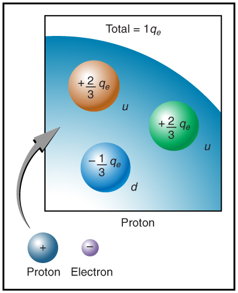

* Define electric charge, and describe how the two types of charge interact.
* Describe three common situations that generate static electricity.
* State the law of conservation of charge.

 "){: #import-auto-id1633795 data-media-type="image/png"}

What makes plastic wrap cling? Static electricity. Not only are applications of static electricity common these days, its existence has been known since ancient times. The first record of its effects dates to ancient Greeks who noted more than 500 years B.C. that polishing amber temporarily enabled it to attract bits of straw (see [\[link\]](#import-auto-id1633795)). The very word *electric* derives from the Greek word for amber (*electron*).

Many of the characteristics of static electricity can be explored by rubbing things together. Rubbing creates the spark you get from walking across a wool carpet, for example. Static cling generated in a clothes dryer and the attraction of straw to recently polished amber also result from rubbing. Similarly, lightning results from air movements under certain weather conditions. You can also rub a balloon on your hair, and the static electricity created can then make the balloon cling to a wall. We also have to be cautious of static electricity, especially in dry climates. When we pump gasoline, we are warned to discharge ourselves (after sliding across the seat) on a metal surface before grabbing the gas nozzle. Attendants in hospital operating rooms must wear booties with aluminum foil on the bottoms to avoid creating sparks which may ignite the oxygen being used.

Some of the most basic characteristics of static electricity include:

* The effects of static electricity are explained by a physical quantity not previously introduced, called electric charge.
* There are only two types of charge, one called positive and the other called negative.
* Like charges repel, whereas unlike charges attract.
* The force between charges decreases with distance.

How do we know there are two types of **electric charge**{: data-type="term" #import-auto-id2282938}? When various materials are rubbed together in controlled ways, certain combinations of materials always produce one type of charge on one material and the opposite type on the other. By convention, we call one type of charge “positive”, and the other type “negative.” For example, when glass is rubbed with silk, the glass becomes positively charged and the silk negatively charged. Since the glass and silk have opposite charges, they attract one another like clothes that have rubbed together in a dryer. Two glass rods rubbed with silk in this manner will repel one another, since each rod has positive charge on it. Similarly, two silk cloths so rubbed will repel, since both cloths have negative charge. [\[link\]](#import-auto-id1628664) shows how these simple materials can be used to explore the nature of the force between charges.

 The glass rod is attracted to the silk because their charges are opposite. (b) Two similarly charged glass rods repel. (c) Two similarly charged silk cloths repel."){: #import-auto-id1628664 data-media-type="image/png"}

More sophisticated questions arise. Where do these charges come from? Can you create or destroy charge? Is there a smallest unit of charge? Exactly how does the force depend on the amount of charge and the distance between charges? Such questions obviously occurred to Benjamin Franklin and other early researchers, and they interest us even today.

# Charge Carried by Electrons and Protons

Franklin wrote in his letters and books that he could see the effects of electric charge but did not understand what caused the phenomenon. Today we have the advantage of knowing that normal matter is made of atoms, and that atoms contain positive and negative charges, usually in equal amounts.

[\[link\]](#import-auto-id2235769) shows a simple model of an atom with negative **electrons**{: data-type="term" #import-auto-id1809439} orbiting its positive nucleus. The nucleus is positive due to the presence of positively charged **protons**{: data-type="term" #import-auto-id2258011}. Nearly all charge in nature is due to electrons and protons, which are two of the three building blocks of most matter. (The third is the neutron, which is neutral, carrying no charge.) Other charge-carrying particles are observed in cosmic rays and nuclear decay, and are created in particle accelerators. All but the electron and proton survive only a short time and are quite rare by comparison.

  view of an atom is called the planetary model of the atom. Negative electrons orbit a much heavier positive nucleus, as the planets orbit the much heavier sun. There the similarity ends, because forces in the atom are electromagnetic, whereas those in the planetary system are gravitational. Normal macroscopic amounts of matter contain immense numbers of atoms and molecules and, hence, even greater numbers of individual negative and positive charges."){: #import-auto-id2235769 data-media-type="image/jpg"}

The charges of electrons and protons are identical in magnitude but opposite in sign. Furthermore, all charged objects in nature are integral multiples of this basic quantity of charge, meaning that all charges are made of combinations of a basic unit of charge. Usually, charges are formed by combinations of electrons and protons. The magnitude of this basic charge is

<math xmlns="http://www.w3.org/1998/Math/MathML"> <semantics> <mrow> <mrow> <mrow> <mrow> <mrow> <mo stretchy="false">∣</mo> <msub> <mi>q</mi> <mrow> <mi>e</mi> </mrow> </msub> <mo stretchy="false">∣</mo> </mrow> <mo stretchy="false">=</mo> <mn>1</mn> </mrow> <mtext>.</mtext> <mrow> <mtext>60</mtext> <mo stretchy="false">×</mo> <msup> <mtext>10</mtext> <mrow> <mrow> <mo stretchy="false">−</mo> <mtext>19</mtext> </mrow> </mrow> </msup> </mrow><mspace width="0.25em" /> <mtext>C</mtext> </mrow> </mrow> <mo>.</mo> </mrow> <annotation encoding="StarMath 5.0"> size 12{ lline q rSub { size 8{e} } rline =1 "." "60" times "10" rSup { size 8{ - "19"} } C} {}</annotation> </semantics> </math>

The symbol <math xmlns="http://www.w3.org/1998/Math/MathML"><semantics><mrow><mrow><mi>q</mi></mrow><mrow /></mrow><annotation encoding="StarMath 5.0"> size 12{q} {}</annotation></semantics></math>

 is commonly used for charge and the subscript <math xmlns="http://www.w3.org/1998/Math/MathML"><semantics><mrow><mrow><mi>e</mi></mrow><mrow /></mrow><annotation encoding="StarMath 5.0"> size 12{e} {}</annotation></semantics></math>

 indicates the charge of a single electron (or proton).

The SI unit of charge is the coulomb (C). The number of protons needed to make a charge of 1.00 C is

<math xmlns="http://www.w3.org/1998/Math/MathML"><semantics><mrow><mrow><mrow><mn>1.</mn><mtext>00 C</mtext><mrow><mrow><mo stretchy="false">×</mo><mfrac><mrow><mn>1</mn><mspace width="0.25em" /><mrow><mtext>proton</mtext></mrow></mrow><mrow><mn>1</mn><mtext>.</mtext><mrow><mtext>60</mtext><mo stretchy="false">×</mo><msup><mtext>10</mtext><mrow><mrow><mo stretchy="false">−</mo><mtext>19</mtext></mrow></mrow></msup></mrow><mspace width="0.25em" /><mtext>C</mtext></mrow></mfrac></mrow><mo stretchy="false">=</mo><mn>6</mn></mrow><mtext>.</mtext><mrow><mtext>25</mtext><mo stretchy="false">×</mo><msup><mtext>10</mtext><mrow><mtext>18</mtext></mrow></msup></mrow><mspace width="0.25em" /><mrow><mtext>protons</mtext></mrow></mrow></mrow><mrow /><mo>.</mo></mrow></semantics></math>

Similarly, <math xmlns="http://www.w3.org/1998/Math/MathML"><semantics><mrow><mrow><mrow><mn>6</mn><mtext>.</mtext><mrow><mtext>25</mtext><mo stretchy="false">×</mo><msup><mtext>10</mtext><mrow><mtext>18</mtext></mrow></msup></mrow></mrow></mrow><mrow /></mrow><annotation encoding="StarMath 5.0"> size 12{6 "." "25" times "10" rSup { size 8{"18"} } } {}</annotation></semantics></math>

 electrons have a combined charge of −1.00 coulomb. Just as there is a smallest bit of an element (an atom), there is a smallest bit of charge. There is no directly observed charge smaller than <math xmlns="http://www.w3.org/1998/Math/MathML"><semantics><mrow><mrow><mrow><mo stretchy="false">∣</mo><msub><mi>q</mi><mrow><mi>e</mi></mrow></msub><mo stretchy="false">∣</mo></mrow></mrow><mrow /></mrow><annotation encoding="StarMath 5.0"> size 12{ lline q rSub { size 8{e} } rline } {}</annotation></semantics></math>

 (see [Things Great and Small: The Submicroscopic Origin of Charge](#import-auto-id2044673)), and all observed charges are integral multiples of <math xmlns="http://www.w3.org/1998/Math/MathML"><semantics><mrow><mrow><mrow><mo stretchy="false">∣</mo><msub><mi>q</mi><mrow><mi>e</mi></mrow></msub><mo stretchy="false">∣</mo></mrow></mrow><mrow /></mrow><annotation encoding="StarMath 5.0"> size 12{ lline q rSub { size 8{e} } rline } {}</annotation></semantics></math>

.

Things Great and Small: The Submicroscopic Origin of Charge

With the exception of exotic, short-lived particles, all charge in nature is carried by electrons and protons. Electrons carry the charge we have named negative. Protons carry an equal-magnitude charge that we call positive. (See [\[link\]](#import-auto-id1954395).) Electron and proton charges are considered fundamental building blocks, since all other charges are integral multiples of those carried by electrons and protons. Electrons and protons are also two of the three fundamental building blocks of ordinary matter. The neutron is the third and has zero total charge.

[\[link\]](#import-auto-id1954395) shows a person touching a Van de Graaff generator and receiving excess positive charge. The expanded view of a hair shows the existence of both types of charges but an excess of positive. The repulsion of these positive like charges causes the strands of hair to repel other strands of hair and to stand up. The further blowup shows an artist’s conception of an electron and a proton perhaps found in an atom in a strand of hair.

 , but we know a great deal about their measurable properties, such as the charges they carry."){: #import-auto-id1954395 data-media-type="image/jpg"}

The electron seems to have no substructure; in contrast, when the substructure of protons is explored by scattering extremely energetic electrons from them, it appears that there are point-like particles inside the proton. These sub-particles, named quarks, have never been directly observed, but they are believed to carry fractional charges as seen in [\[link\]](#import-auto-id1448640). Charges on electrons and protons and all other directly observable particles are unitary, but these quark substructures carry charges of either <math xmlns="http://www.w3.org/1998/Math/MathML"><semantics><mrow><mrow><mrow><mo stretchy="false">−</mo><mfrac><mn>1</mn><mn>3</mn></mfrac></mrow></mrow><mrow /></mrow><annotation encoding="StarMath 5.0"> size 12{ - { {1} over {3} } } {}</annotation></semantics></math>

 or <math xmlns="http://www.w3.org/1998/Math/MathML"><semantics><mrow><mrow><mrow><mo stretchy="false">+</mo><mfrac><mn>2</mn><mn>3</mn></mfrac></mrow></mrow><mrow /></mrow><annotation encoding="StarMath 5.0"> size 12{+ { {2} over {3} } } {}</annotation></semantics></math>

. There are continuing attempts to observe fractional charge directly and to learn of the properties of quarks, which are perhaps the ultimate substructure of matter.

 {: #import-auto-id1448640 data-media-type="image/jpg"}

# Separation of Charge in Atoms

Charges in atoms and molecules can be separated—for example, by rubbing materials together. Some atoms and molecules have a greater affinity for electrons than others and will become negatively charged by close contact in rubbing, leaving the other material positively charged. (See [\[link\]](#import-auto-id1629106).) Positive charge can similarly be induced by rubbing. Methods other than rubbing can also separate charges. Batteries, for example, use combinations of substances that interact in such a way as to separate charges. Chemical interactions may transfer negative charge from one substance to the other, making one battery terminal negative and leaving the first one positive.

 Both the amber and cloth are originally neutral, with equal positive and negative charges. Only a tiny fraction of the charges are involved, and only a few of them are shown here. (b) When rubbed together, some negative charge is transferred to the amber, leaving the cloth with a net positive charge. (c) When separated, the amber and cloth now have net charges, but the absolute value of the net positive and negative charges will be equal."){: #import-auto-id1629106 data-media-type="image/jpg"}

No charge is actually created or destroyed when charges are separated as we have been discussing. Rather, existing charges are moved about. In fact, in all situations the total amount of charge is always constant. This universally obeyed law of nature is called the **law of conservation of charge**{: data-type="term" #import-auto-id1675725}.

Law of Conservation of Charge

Total charge is constant in any process.

In more exotic situations, such as in particle accelerators, mass, <math xmlns="http://www.w3.org/1998/Math/MathML"><semantics><mrow><mrow><mn>Δ</mn><mi fontstyle="italic">m</mi></mrow><mrow /></mrow><annotation encoding="StarMath 5.0"> size 12{Δm} {}</annotation></semantics></math>

, can be created from energy in the amount <math xmlns="http://www.w3.org/1998/Math/MathML"><semantics><mrow><mrow><mrow><mn>Δ</mn><mi fontstyle="italic">m</mi><mo stretchy="false">=</mo><mfrac><mi>E</mi><msup><mi>c</mi><mrow><mn>2</mn></mrow></msup></mfrac></mrow></mrow><mrow /></mrow><annotation encoding="StarMath 5.0"> size 12{Δm= { {E} over {c rSup { size 8{2} } } } } {}</annotation></semantics></math>

. Sometimes, the created mass is charged, such as when an electron is created. Whenever a charged particle is created, another having an opposite charge is always created along with it, so that the total charge created is zero. Usually, the two particles are “matter-antimatter” counterparts. For example, an antielectron would usually be created at the same time as an electron. The antielectron has a positive charge (it is called a positron), and so the total charge created is zero. (See [\[link\]](#import-auto-id1749994).) All particles have antimatter counterparts with opposite signs. When matter and antimatter counterparts are brought together, they completely annihilate one another. By annihilate, we mean that the mass of the two particles is converted to energy *E*, again obeying the relationship <math xmlns="http://www.w3.org/1998/Math/MathML"><semantics><mrow><mrow><mrow><mn>Δ</mn><mi fontstyle="italic">m</mi><mo stretchy="false">=</mo><mfrac><mi>E</mi><msup><mi>c</mi><mrow><mn>2</mn></mrow></msup></mfrac></mrow></mrow><mrow /></mrow><annotation encoding="StarMath 5.0"> size 12{Δm= { {E} over {c rSup { size 8{2} } } } } {}</annotation></semantics></math>

. Since the two particles have equal and opposite charge, the total charge is zero before and after the annihilation; thus, total charge is conserved.

Making Connections: Conservation Laws

Only a limited number of physical quantities are universally conserved. Charge is one—energy, momentum, and angular momentum are others. Because they are conserved, these physical quantities are used to explain more phenomena and form more connections than other, less basic quantities. We find that conserved quantities give us great insight into the rules followed by nature and hints to the organization of nature. Discoveries of conservation laws have led to further discoveries, such as the weak nuclear force and the quark substructure of protons and other particles.

  When enough energy is present, it can be converted into matter. Here the matter created is an electron&#x2013;antielectron pair. (me size 12{m rSub { size 8{e} } } {} is the electron&#x2019;s mass.) The total charge before and after this event is zero. (b) When matter and antimatter collide, they annihilate each other; the total charge is conserved at zero before and after the annihilation."){: #import-auto-id1749994 data-media-type="image/jpg"}

The law of conservation of charge is absolute—it has never been observed to be violated. Charge, then, is a special physical quantity, joining a very short list of other quantities in nature that are always conserved. Other conserved quantities include energy, momentum, and angular momentum.

PhET Explorations: Balloons and Static Electricity

Why does a balloon stick to your sweater? Rub a balloon on a sweater, then let go of the balloon and it flies over and sticks to the sweater. View the charges in the sweater, balloons, and the wall.

<figure markdown="1" id="eip-id1686448">
<figcaption>
[Balloons and Static Electricity](balloons_en.jar)
</figcaption>
 {: data-type="image"}  
</figure>

# Section Summary

* There are only two types of charge, which we call positive and negative.
* Like charges repel, unlike charges attract, and the force between charges decreases with the square of the distance.
* The vast majority of positive charge in nature is carried by protons, while the vast majority of negative charge is carried by electrons.
* The electric charge of one electron is equal in magnitude and opposite in sign to the charge of one proton.
* An ion is an atom or molecule that has nonzero total charge due to having unequal numbers of electrons and protons.
* The SI unit for charge is the coulomb (C), with protons and electrons having charges of opposite sign but equal magnitude; the magnitude of this basic charge
  <math xmlns="http://www.w3.org/1998/Math/MathML"> <semantics> <mrow> <mrow> <mrow> <mrow> <mrow> <mo stretchy="false">∣</mo> <msub> <mi>q</mi> <mrow> <mi>e</mi> </mrow> </msub> <mo stretchy="false">∣</mo> </mrow> </mrow> </mrow> </mrow> </mrow> <annotation encoding="StarMath 5.0"> size 12{ lline q rSub { size 8{e} } rline} {}</annotation> </semantics> </math>
  
  is
  

  <math xmlns="http://www.w3.org/1998/Math/MathML"> <semantics> <mrow> <mrow> <mrow> <mrow> <mrow> <mo stretchy="false">∣</mo> <msub> <mi>q</mi> <mrow> <mi>e</mi> </mrow> </msub> <mo stretchy="false">∣</mo> </mrow> <mo stretchy="false">=</mo> <mn>1.60</mn> </mrow> <mrow> <mo stretchy="false">×</mo> <msup> <mtext>10</mtext> <mrow> <mrow> <mo stretchy="false">−</mo> <mtext>19</mtext> </mrow> </mrow> </msup> </mrow><mspace width="0.25em" /> <mtext>C</mtext> </mrow> </mrow> <mrow /> <mo>.</mo> </mrow> <annotation encoding="StarMath 5.0"> size 12{ lline q rSub { size 8{e} } rline =1 "." "60" times "10" rSup { size 8{ - "19"} } C} {}</annotation> </semantics> </math>
  

* Whenever charge is created or destroyed, equal amounts of positive and negative are involved.
* Most often, existing charges are separated from neutral objects to obtain some net charge.
* Both positive and negative charges exist in neutral objects and can be separated by rubbing one object with another. For macroscopic objects, negatively charged means an excess of electrons and positively charged means a depletion of electrons.
* The law of conservation of charge ensures that whenever a charge is created, an equal charge of the opposite sign is created at the same time.

# Conceptual Questions

There are very large numbers of charged particles in most objects. Why, then, don’t most objects exhibit static electricity?

Why do most objects tend to contain nearly equal numbers of positive and negative charges?

# Problems &amp; Exercises

Common static electricity involves charges ranging from nanocoulombs to microcoulombs. (a) How many electrons are needed to form a charge of <math xmlns="http://www.w3.org/1998/Math/MathML"><semantics><mrow><mn>–2.00</mn><mspace width="0.25em" /><mtext>nC</mtext></mrow></semantics></math>

 (b) How many electrons must be removed from a neutral object to leave a net charge of <math xmlns="http://www.w3.org/1998/Math/MathML"><semantics><mrow><mn>0.500</mn><mspace width="0.25em" /><mi>µ</mi><mtext>C</mtext></mrow></semantics></math>

?

(a) <math xmlns="http://www.w3.org/1998/Math/MathML"><semantics><mrow><mrow><mrow><mn>1.25</mn><mrow><mo stretchy="false">×</mo><msup><mtext>10</mtext><mrow><mtext>10</mtext></mrow></msup></mrow></mrow></mrow></mrow></semantics></math>

(b) <math xmlns="http://www.w3.org/1998/Math/MathML"><semantics><mrow><mrow><mrow><mn>3.13</mn><mrow><mo stretchy="false">×</mo><msup><mtext>10</mtext><mrow><mtext>12</mtext></mrow></msup></mrow></mrow></mrow></mrow></semantics></math>

If <math xmlns="http://www.w3.org/1998/Math/MathML"><semantics><mrow><mrow><mrow><mn>1</mn><mtext>.</mtext><mrow><mtext>80</mtext><mo stretchy="false">×</mo><msup><mtext>10</mtext><mrow><mtext>20</mtext></mrow></msup></mrow></mrow></mrow><mrow /></mrow><annotation encoding="StarMath 5.0"> size 12{1 "." "80" times "10" rSup { size 8{"20"} } } {}</annotation></semantics></math>

 electrons move through a pocket calculator during a full day’s operation, how many coulombs of charge moved through it?

To start a car engine, the car battery moves <math xmlns="http://www.w3.org/1998/Math/MathML"><semantics><mrow><mrow><mrow><mn>3</mn><mtext>.</mtext><mrow><mtext>75</mtext><mo stretchy="false">×</mo><msup><mtext>10</mtext><mrow><mtext>21</mtext></mrow></msup></mrow></mrow></mrow><mrow /></mrow><annotation encoding="StarMath 5.0"> size 12{3 "." "75" times "10" rSup { size 8{"21"} } } {}</annotation></semantics></math>

 electrons through the starter motor. How many coulombs of charge were moved?

-600 C

A certain lightning bolt moves 40.0 C of charge. How many fundamental units of charge <math xmlns="http://www.w3.org/1998/Math/MathML"> <semantics> <mrow> <mrow> <mrow> <mrow> <mrow> <mo stretchy="false">∣</mo> <msub> <mi>q</mi> <mrow> <mi>e</mi> </mrow> </msub> <mo stretchy="false">∣</mo> </mrow> </mrow> </mrow> </mrow> </mrow> <annotation encoding="StarMath 5.0"> size 12{ lline q rSub { size 8{e} } rline} {}</annotation> </semantics> </math>

 is this?

