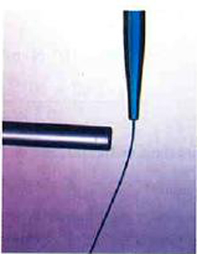

* Define conductor and insulator, explain the difference, and give examples of each.
* Describe three methods for charging an object.
* Explain what happens to an electric force as you move farther from the source.
* Define polarization.

 "){: #import-auto-id1814585 data-media-type="image/png"}

Some substances, such as metals and salty water, allow charges to move through them with relative ease. Some of the electrons in metals and similar conductors are not bound to individual atoms or sites in the material. These **free electrons**{: data-type="term" #import-auto-id1882039} can move through the material much as air moves through loose sand. Any substance that has free electrons and allows charge to move relatively freely through it is called a **conductor**{: data-type="term" #import-auto-id2849911}. The moving electrons may collide with fixed atoms and molecules, losing some energy, but they can move in a conductor. Superconductors allow the movement of charge without any loss of energy. Salty water and other similar conducting materials contain free ions that can move through them. An ion is an atom or molecule having a positive or negative (nonzero) total charge. In other words, the total number of electrons is not equal to the total number of protons.

Other substances, such as glass, do not allow charges to move through them. These are called **insulators**{: data-type="term" #import-auto-id2224557}. Electrons and ions in insulators are bound in the structure and cannot move easily—as much as <math xmlns="http://www.w3.org/1998/Math/MathML"><semantics><mrow><mrow><msup><mtext>10</mtext><mrow><mtext>23</mtext></mrow></msup></mrow><mrow /></mrow><annotation encoding="StarMath 5.0"> size 12{"10" rSup { size 8{"23"} } } {}</annotation></semantics></math>

 times more slowly than in conductors. Pure water and dry table salt are insulators, for example, whereas molten salt and salty water are conductors.

 ![In part a, an electroscope is shown. A glass rod with positive signs is close to the tip of the electroscope which has negative signs on it and the leaves have has plus signs on it. In part b, the glass rod with positive sign is in contact with the tip of electroscope having negative signs. The negative signs are shown moving to the rod by arrows pointing toward the rod. The surfaces of the leaves now have both positive and negative charge. In part c, the glass rod is absent. The tip and the leaves of the electroscope have both positive and negative signs on them.](../resources/Figure_19_02_02a.jpg "An electroscope is a favorite instrument in physics demonstrations and student laboratories. It is typically made with gold foil leaves hung from a (conducting) metal stem and is insulated from the room air in a glass-walled container. (a) A positively charged glass rod is brought near the tip of the electroscope, attracting electrons to the top and leaving a net positive charge on the leaves. Like charges in the light flexible gold leaves repel, separating them. (b) When the rod is touched against the ball, electrons are attracted and transferred, reducing the net charge on the glass rod but leaving the electroscope positively charged. (c) The excess charges are evenly distributed in the stem and leaves of the electroscope once the glass rod is removed."){: #import-auto-id1532130 data-media-type="image/jpg"}

# Charging by Contact

[\[link\]](#import-auto-id1532130) shows an electroscope being charged by touching it with a positively charged glass rod. Because the glass rod is an insulator, it must actually touch the electroscope to transfer charge to or from it. (Note that the extra positive charges reside on the surface of the glass rod as a result of rubbing it with silk before starting the experiment.) Since only electrons move in metals, we see that they are attracted to the top of the electroscope. There, some are transferred to the positive rod by touch, leaving the electroscope with a net positive charge.

**Electrostatic repulsion**{: data-type="term" #import-auto-id1794995} in the leaves of the charged electroscope separates them. The electrostatic force has a horizontal component that results in the leaves moving apart as well as a vertical component that is balanced by the gravitational force. Similarly, the electroscope can be negatively charged by contact with a negatively charged object.

# Charging by Induction

It is not necessary to transfer excess charge directly to an object in order to charge it. [\[link\]](#import-auto-id1633568) shows a method of **induction**{: data-type="term" #import-auto-id1706831} wherein a charge is created in a nearby object, without direct contact. Here we see two neutral metal spheres in contact with one another but insulated from the rest of the world. A positively charged rod is brought near one of them, attracting negative charge to that side, leaving the other sphere positively charged.

This is an example of induced **polarization**{: data-type="term" #import-auto-id1628719} of neutral objects. Polarization is the separation of charges in an object that remains neutral. If the spheres are now separated (before the rod is pulled away), each sphere will have a net charge. Note that the object closest to the charged rod receives an opposite charge when charged by induction. Note also that no charge is removed from the charged rod, so that this process can be repeated without depleting the supply of excess charge.

Another method of charging by induction is shown in [\[link\]](#import-auto-id2122248). The neutral metal sphere is polarized when a charged rod is brought near it. The sphere is then grounded, meaning that a conducting wire is run from the sphere to the ground. Since the earth is large and most ground is a good conductor, it can supply or accept excess charge easily. In this case, electrons are attracted to the sphere through a wire called the ground wire, because it supplies a conducting path to the ground. The ground connection is broken before the charged rod is removed, leaving the sphere with an excess charge opposite to that of the rod. Again, an opposite charge is achieved when charging by induction and the charged rod loses none of its excess charge.

 ![In part a, a pair of neutral metal spheres are in contact. In part b, a rod with positive signs is close to one surface of the sphere and the negative signs are shown on this surface toward the rod and positive signs are shown on the outermost face of the other sphere. In part c, the rod and the spheres are not in contact. The outermost surface of one sphere has negative signs and the outermost surface of another sphere has positive signs. In part d, the glass rod is not shown. The inner surfaces of the metallic spheres have opposite charges. One sphere has negative signs and the other has positive signs facing each other.](../resources/Figure_19_02_03a.jpg "Charging by induction. (a) Two uncharged or neutral metal spheres are in contact with each other but insulated from the rest of the world. (b) A positively charged glass rod is brought near the sphere on the left, attracting negative charge and leaving the other sphere positively charged. (c) The spheres are separated before the rod is removed, thus separating negative and positive charge. (d) The spheres retain net charges after the inducing rod is removed&#x2014;without ever having been touched by a charged object."){: #import-auto-id1633568 data-media-type="image/jpg"}

![ In part a, a rod with positive sign is brought near a neutral metal sphere. One surface toward the rod has negative signs and the other surface has positive signs. In part b, a rod with positive sign is close to one surface of the sphere having negative signs and the other surface has low number of positive signs and a wire is attached to that face which is connected to the ground. In part c, a rod with positive sign is close to one surface of the sphere having negative signs and the other surface has low number of positive signs. In part d, the positive rod is absent, and the sphere has negative signs on it.](../resources/Figure_19_02_04a.jpg "Charging by induction, using a ground connection. (a) A positively charged rod is brought near a neutral metal sphere, polarizing it. (b) The sphere is grounded, allowing electrons to be attracted from the earth&#x2019;s ample supply. (c) The ground connection is broken. (d) The positive rod is removed, leaving the sphere with an induced negative charge."){: #import-auto-id2122248 data-media-type="image/jpg"}

![Microscopic views of objects are shown. A positive rod with positive signs is close to an insulator. The negative ends of all the molecules of the insulator are aligned toward the rod and positive ends of all molecules shown as spheres are away from the rod. In part b, a negative rod with negative signs is close to an insulator. The positive ends of all the molecules of the insulator are aligned toward the rod and negative ends of all molecules shown as spheres are away from the rod. In part c, a rod with negative signs and insulator with the surface closer to the rod has positive signs. The other surface has negative signs.](../resources/Figure_19_02_05a.jpg "Both positive and negative objects attract a neutral object by polarizing its molecules. (a) A positive object brought near a neutral insulator polarizes its molecules. There is a slight shift in the distribution of the electrons orbiting the molecule, with unlike charges being brought nearer and like charges moved away. Since the electrostatic force decreases with distance, there is a net attraction. (b) A negative object produces the opposite polarization, but again attracts the neutral object. (c) The same effect occurs for a conductor; since the unlike charges are closer, there is a net attraction."){: #import-auto-id1973664 data-media-type="image/jpg"}

Neutral objects can be attracted to any charged object. The pieces of straw attracted to polished amber are neutral, for example. If you run a plastic comb through your hair, the charged comb can pick up neutral pieces of paper. [\[link\]](#import-auto-id1973664) shows how the polarization of atoms and molecules in neutral objects results in their attraction to a charged object.

When a charged rod is brought near a neutral substance, an insulator in this case, the distribution of charge in atoms and molecules is shifted slightly. Opposite charge is attracted nearer the external charged rod, while like charge is repelled. Since the electrostatic force decreases with distance, the repulsion of like charges is weaker than the attraction of unlike charges, and so there is a net attraction. Thus a positively charged glass rod attracts neutral pieces of paper, as will a negatively charged rubber rod. Some molecules, like water, are polar molecules. Polar molecules have a natural or inherent separation of charge, although they are neutral overall. Polar molecules are particularly affected by other charged objects and show greater polarization effects than molecules with naturally uniform charge distributions.

Check Your Understanding

Can you explain the attraction of water to the charged rod in the figure below? {: #import-auto-id1559308 data-media-type="image/jpg"}

Answer

Water molecules are polarized, giving them slightly positive and slightly negative sides. This makes water even more susceptible to a charged rod’s attraction. As the water flows downward, due to the force of gravity, the charged conductor exerts a net attraction to the opposite charges in the stream of water, pulling it closer.

PhET Explorations: John Travoltage

Make sparks fly with John Travoltage. Wiggle Johnnie\'s foot and he picks up charges from the carpet. Bring his hand close to the door knob and get rid of the excess charge.

<figure markdown="1" id="eip-id2664686">
<figcaption>
[John Travoltage](travoltage_en.jar)
</figcaption>
 {: data-type="image"}  
</figure>

# Section Summary

* Polarization is the separation of positive and negative charges in a neutral object.
* A conductor is a substance that allows charge to flow freely through its atomic structure.
* An insulator holds charge within its atomic structure.
* Objects with like charges repel each other, while those with unlike charges attract each other.
* A conducting object is said to be grounded if it is connected to the Earth through a conductor. Grounding allows transfer of charge to and from the earth’s large reservoir.
* Objects can be charged by contact with another charged object and obtain the same sign charge.
* If an object is temporarily grounded, it can be charged by induction, and obtains the opposite sign charge.
* Polarized objects have their positive and negative charges concentrated in different areas, giving them a non-symmetrical charge.
* Polar molecules have an inherent separation of charge.

# Conceptual Questions

An eccentric inventor attempts to levitate by first placing a large negative charge on himself and then putting a large positive charge on the ceiling of his workshop. Instead, while attempting to place a large negative charge on himself, his clothes fly off. Explain.

If you have charged an electroscope by contact with a positively charged object, describe how you could use it to determine the charge of other objects. Specifically, what would the leaves of the electroscope do if other charged objects were brought near its knob?

When a glass rod is rubbed with silk, it becomes positive and the silk becomes negative—yet both attract dust. Does the dust have a third type of charge that is attracted to both positive and negative? Explain.

Why does a car always attract dust right after it is polished? (Note that car wax and car tires are insulators.)

Describe how a positively charged object can be used to give another object a negative charge. What is the name of this process?

What is grounding? What effect does it have on a charged conductor? On a charged insulator?

# Problems &amp; Exercises

Suppose a speck of dust in an electrostatic precipitator has <math xmlns="http://www.w3.org/1998/Math/MathML"><semantics><mrow><mrow><mrow><mn>1</mn><mtext>.</mtext><mrow><mtext>0000</mtext><mo stretchy="false">×</mo><msup><mtext>10</mtext><mrow><mtext>12</mtext></mrow></msup></mrow></mrow></mrow><mrow /></mrow><annotation encoding="StarMath 5.0"> size 12{1 "." "0000" times "10" rSup { size 8{"12"} } } {}</annotation></semantics></math>

 protons in it and has a net charge of –5.00 nC (a very large charge for a small speck). How many electrons does it have?

<math xmlns="http://www.w3.org/1998/Math/MathML"><semantics><mrow><mn>1.03</mn><mo>×</mo><msup><mn>10</mn><mn>12</mn></msup></mrow></semantics></math>

An amoeba has <math xmlns="http://www.w3.org/1998/Math/MathML"><semantics><mrow><mn>1.00</mn><mo>×</mo><msup><mn>10</mn><mn>16</mn></msup></mrow></semantics></math>

 protons and a net charge of 0.300 pC. (a) How many fewer electrons are there than protons? (b) If you paired them up, what fraction of the protons would have no electrons?

A 50.0 g ball of copper has a net charge of <math xmlns="http://www.w3.org/1998/Math/MathML"><semantics><mrow><mn>2.00</mn><mspace width="0.25em" /><mi>µ</mi><mtext>C</mtext></mrow></semantics></math>

. What fraction of the copper’s electrons has been removed? (Each copper atom has 29 protons, and copper has an atomic mass of 63.5.)

<math xmlns="http://www.w3.org/1998/Math/MathML"> <semantics> <mrow> <mrow> <mrow> <mn>9</mn> <mtext>.</mtext> <mrow> <mtext>09</mtext> <mo stretchy="false">×</mo> <msup> <mtext>10</mtext> <mrow> <mrow> <mo stretchy="false">−</mo> <mtext>13</mtext> </mrow> </mrow> </msup> </mrow> </mrow> </mrow> <mrow /> </mrow> <annotation encoding="StarMath 5.0"> size 12{9 "." "09" times "10" rSup { size 8{ - "13"} } } {}</annotation> </semantics> </math>

What net charge would you place on a 100 g piece of sulfur if you put an extra electron on 1 in <math xmlns="http://www.w3.org/1998/Math/MathML"><semantics><mrow><mrow><msup><mtext>10</mtext><mrow><mtext>12</mtext></mrow></msup></mrow><mrow /></mrow><annotation encoding="StarMath 5.0"> size 12{"10" rSup { size 8{"12"} } } {}</annotation></semantics></math>

 of its atoms? (Sulfur has an atomic mass of 32.1.)

How many coulombs of positive charge are there in 4.00 kg of plutonium, given its atomic mass is 244 and that each plutonium atom has 94 protons?

<math xmlns="http://www.w3.org/1998/Math/MathML"><semantics><mrow><mrow><mrow><mn>1</mn><mtext>.</mtext><mrow><mtext>48</mtext><mo stretchy="false">×</mo><msup><mtext>10</mtext><mrow><mn>8</mn></mrow></msup></mrow><mspace width="0.25em" /><mtext>C</mtext></mrow></mrow></mrow><annotation encoding="StarMath 5.0"> size 12{1 "." "48" times "10" rSup { size 8{8} } } {}</annotation></semantics></math>

