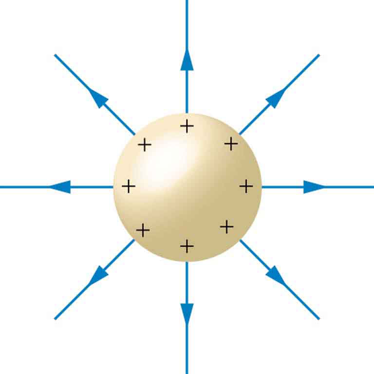
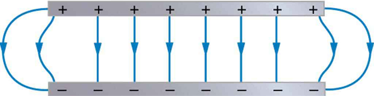
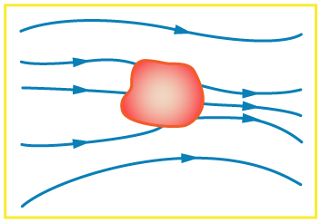
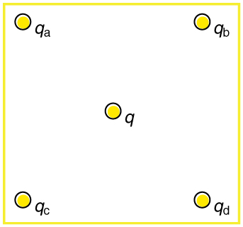
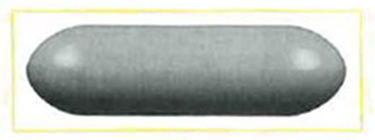
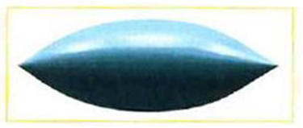
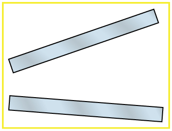
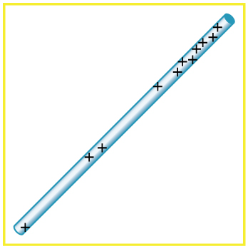
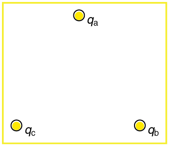

* List the three properties of a conductor in electrostatic equilibrium.
* Explain the effect of an electric field on free charges in a conductor.
* Explain why no electric field may exist inside a conductor.
* Describe the electric field surrounding Earth.
* Explain what happens to an electric field applied to an irregular conductor.
* Describe how a lightning rod works.
* Explain how a metal car may protect passengers inside from the dangerous electric fields caused by a downed line touching the car.

**Conductors**{: data-type="term" #import-auto-id2422804} contain **free charges**{: data-type="term" #import-auto-id1576423} that move easily. When excess charge is placed on a conductor or the conductor is put into a static electric field, charges in the conductor quickly respond to reach a steady state called **electrostatic equilibrium**{: data-type="term" #import-auto-id2056158}.

[\[link\]](#import-auto-id3230544) shows the effect of an electric field on free charges in a conductor. The free charges move until the field is perpendicular to the conductor’s surface. There can be no component of the field parallel to the surface in electrostatic equilibrium, since, if there were, it would produce further movement of charge. A positive free charge is shown, but free charges can be either positive or negative and are, in fact, negative in metals. The motion of a positive charge is equivalent to the motion of a negative charge in the opposite direction.

 ![In part a, an electric field E exists at some angle with the horizontal applied on a conductor. One component of this field E parallel is along x axis represented by a vector arrow and other E perpendicular, is along y axis represented by a vector arrow. Charge inside the conductor moves along x axis so the force acting on it is F parallel, which is equal to q multiplied by E parallel. In part b, a charge is shown inside the conductor and electric field is represented by a vector arrow pointing upward starting from the surface of the conductor.](../resources/Figure_19_07_02a.jpg "When an electric field E size 12{E} {} is applied to a conductor, free charges inside the conductor move until the field is perpendicular to the surface. (a) The electric field is a vector quantity, with both parallel and perpendicular components. The parallel component (E&#x2225; size 12{E rSub { size 8{ &#10;dline } } } {}) exerts a force (F&#x2225; size 12{F rSub { size 8{ &#10;dline } } } {}) on the free charge q size 12{q} {}, which moves the charge until F&#x2225;=0 size 12{F rSub { size 8{ &#10;dline } } =0} {}. (b) The resulting field is perpendicular to the surface. The free charge has been brought to the conductor&#x2019;s surface, leaving electrostatic forces in equilibrium."){: #import-auto-id3230544}

A conductor placed in an **electric field**{: data-type="term" #import-auto-id1487262} will be **polarized**{: data-type="term" #import-auto-id1561098}. [\[link\]](#import-auto-id2453144) shows the result of placing a neutral conductor in an originally uniform electric field. The field becomes stronger near the conductor but entirely disappears inside it.

 {: #import-auto-id2453144}

Misconception Alert: Electric Field inside a Conductor

Excess charges placed on a spherical conductor repel and move until they are evenly distributed, as shown in [\[link\]](#import-auto-id2594136). Excess charge is forced to the surface until the field inside the conductor is zero. Outside the conductor, the field is exactly the same as if the conductor were replaced by a point charge at its center equal to the excess charge.

{: #import-auto-id2594136}

Properties of a Conductor in Electrostatic Equilibrium

1.  {: #import-auto-id1577562} The electric field is zero inside a conductor.
2.  {: #import-auto-id1575688} Just outside a conductor, the electric field lines are perpendicular to its surface, ending or beginning on charges on the surface.
3.  {: #import-auto-id1236511} Any excess charge resides entirely on the surface or surfaces of a conductor.
{: data-number-style="arabic"}

The properties of a conductor are consistent with the situations already discussed and can be used to analyze any conductor in electrostatic equilibrium. This can lead to some interesting new insights, such as described below.

How can a very uniform electric field be created? Consider a system of two metal plates with opposite charges on them, as shown in [\[link\]](#import-auto-id2594161). The properties of conductors in electrostatic equilibrium indicate that the electric field between the plates will be uniform in strength and direction. Except near the edges, the excess charges distribute themselves uniformly, producing field lines that are uniformly spaced (hence uniform in strength) and perpendicular to the surfaces (hence uniform in direction, since the plates are flat). The edge effects are less important when the plates are close together.

 {: #import-auto-id2594161}

# Earth’s Electric Field

A near uniform electric field of approximately 150 N/C, directed downward, surrounds Earth, with the magnitude increasing slightly as we get closer to the surface. What causes the electric field? At around 100 km above the surface of Earth we have a layer of charged particles, called the **ionosphere**{: data-type="term" #import-auto-id1578229}. The ionosphere is responsible for a range of phenomena including the electric field surrounding Earth. In fair weather the ionosphere is positive and the Earth largely negative, maintaining the electric field ([\[link\]](#import-auto-id3162895)(a)).

In storm conditions clouds form and localized electric fields can be larger and reversed in direction ([\[link\]](#import-auto-id3162895)(b)). The exact charge distributions depend on the local conditions, and variations of [\[link\]](#import-auto-id3162895)(b) are possible.

If the electric field is sufficiently large, the insulating properties of the surrounding material break down and it becomes conducting. For air this occurs at around <math xmlns="http://www.w3.org/1998/Math/MathML"><semantics><mrow><mrow><mrow><mn>3</mn><mo stretchy="false">×</mo><msup><mtext>10</mtext><mrow><mn>6</mn></mrow></msup></mrow></mrow><mrow /></mrow><annotation encoding="StarMath 5.0"> size 12{3 times "10" rSup { size 8{6} } } {}</annotation></semantics></math>

 N/C. Air ionizes ions and electrons recombine, and we get discharge in the form of lightning sparks and corona discharge.

  Fair weather field. Earth and the ionosphere (a layer of charged particles) are both conductors. They produce a uniform electric field of about 150 N/C. (credit: D. H. Parks) (b) Storm fields. In the presence of storm clouds, the local electric fields can be larger. At very high fields, the insulating properties of the air break down and lightning can occur. (credit: Jan-Joost Verhoef)"){: #import-auto-id3162895}

# Electric Fields on Uneven Surfaces

So far we have considered excess charges on a smooth, symmetrical conductor surface. What happens if a conductor has sharp corners or is pointed? Excess charges on a nonuniform conductor become concentrated at the sharpest points. Additionally, excess charge may move on or off the conductor at the sharpest points.

To see how and why this happens, consider the charged conductor in [\[link\]](#import-auto-id2398984). The electrostatic repulsion of like charges is most effective in moving them apart on the flattest surface, and so they become least concentrated there. This is because the forces between identical pairs of charges at either end of the conductor are identical, but the components of the forces parallel to the surfaces are different. The component parallel to the surface is greatest on the flattest surface and, hence, more effective in moving the charge.

The same effect is produced on a conductor by an externally applied electric field, as seen in [\[link\]](#import-auto-id2398984) (c). Since the field lines must be perpendicular to the surface, more of them are concentrated on the most curved parts.

 ![In part a, a conductor is shown with the unsymmetrical shape. The identical pair of charges at opposite ends on the conductor have similar components of forces represented by arrows. In part b, the unsymmetrical object has positive charge on its surface. The electric field lines are shown emerging perpendicular from the surface of the conductor represented by vector arrow. In part c, the field lines in and around the conductor running from left to right is shown. The left surface of the conductor has negative charge and the right surface has positive charge. The field lines enter and leave the conductor at right angles.](../resources/Figure_19_07_07a.jpg "Excess charge on a nonuniform conductor becomes most concentrated at the location of greatest curvature. (a) The forces between identical pairs of charges at either end of the conductor are identical, but the components of the forces parallel to the surface are different. It is F&#x2225; size 12{F rSub { size 8{ &#10;dline } } } {} that moves the charges apart once they have reached the surface. (b) F&#x2225; size 12{F rSub { size 8{ &#10;dline } } } {} is smallest at the more pointed end, the charges are left closer together, producing the electric field shown. (c) An uncharged conductor in an originally uniform electric field is polarized, with the most concentrated charge at its most pointed end."){: #import-auto-id2398984}

# Applications of Conductors

On a very sharply curved surface, such as shown in [\[link\]](#import-auto-id2677542), the charges are so concentrated at the point that the resulting electric field can be great enough to remove them from the surface. This can be useful.

Lightning rods work best when they are most pointed. The large charges created in storm clouds induce an opposite charge on a building that can result in a lightning bolt hitting the building. The induced charge is bled away continually by a lightning rod, preventing the more dramatic lightning strike.

Of course, we sometimes wish to prevent the transfer of charge rather than to facilitate it. In that case, the conductor should be very smooth and have as large a radius of curvature as possible. (See [\[link\]](#import-auto-id1993313).) Smooth surfaces are used on high-voltage transmission lines, for example, to avoid leakage of charge into the air.

Another device that makes use of some of these principles is a **Faraday cage**{: data-type="term" #import-auto-id1934114}. This is a metal shield that encloses a volume. All electrical charges will reside on the outside surface of this shield, and there will be no electrical field inside. A Faraday cage is used to prohibit stray electrical fields in the environment from interfering with sensitive measurements, such as the electrical signals inside a nerve cell.

During electrical storms if you are driving a car, it is best to stay inside the car as its metal body acts as a Faraday cage with zero electrical field inside. If in the vicinity of a lightning strike, its effect is felt on the outside of the car and the inside is unaffected, provided you remain totally inside. This is also true if an active (“hot”) electrical wire was broken (in a storm or an accident) and fell on your car.

 {: #import-auto-id2677542}

 A lightning rod is pointed to facilitate the transfer of charge. (credit: Romaine, Wikimedia Commons) (b) This Van de Graaff generator has a smooth surface with a large radius of curvature to prevent the transfer of charge and allow a large voltage to be generated. The mutual repulsion of like charges is evident in the person&#x2019;s hair while touching the metal sphere. (credit: Jon &#x2018;ShakataGaNai&#x2019; Davis/Wikimedia Commons)."){: #import-auto-id1993313}

# Section Summary

* {: #import-auto-id1517252} A conductor allows free charges to move about within it.
* {: #import-auto-id1355895} The electrical forces around a conductor will cause free charges to move around inside the conductor until static equilibrium is reached.
* {: #import-auto-id1355534} Any excess charge will collect along the surface of a conductor.
* {: #import-auto-id2626177} Conductors with sharp corners or points will collect more charge at those points.
* {: #import-auto-id2599034} A lightning rod is a conductor with sharply pointed ends that collect excess charge on the building caused by an electrical storm and allow it to dissipate back into the air.
* {: #import-auto-id2011404} Electrical storms result when the electrical field of Earth’s surface in certain locations becomes more strongly charged, due to changes in the insulating effect of the air.
* {: #import-auto-id2000560} A Faraday cage acts like a shield around an object, preventing electric charge from penetrating inside.

# Conceptual Questions

Is the object in [[link]](#fs-id1586840) a conductor or an insulator? Justify your answer.

{:}

If the electric field lines in the figure above were perpendicular to the object, would it necessarily be a conductor? Explain.

The discussion of the electric field between two parallel conducting plates, in this module states that edge effects are less important if the plates are close together. What does close mean? That is, is the actual plate separation crucial, or is the ratio of plate separation to plate area crucial?

Would the self-created electric field at the end of a pointed conductor, such as a lightning rod, remove positive or negative charge from the conductor? Would the same sign charge be removed from a neutral pointed conductor by the application of a similar externally created electric field? (The answers to both questions have implications for charge transfer utilizing points.)

Why is a golfer with a metal club over her shoulder vulnerable to lightning in an open fairway? Would she be any safer under a tree?

Can the belt of a Van de Graaff accelerator be a conductor? Explain.

Are you relatively safe from lightning inside an automobile? Give two reasons.

Discuss pros and cons of a lightning rod being grounded versus simply being attached to a building.

Using the symmetry of the arrangement, show that the net Coulomb force on the charge *<math xmlns="http://www.w3.org/1998/Math/MathML"><semantics><mrow><mrow><mi>q</mi></mrow><mrow /></mrow><annotation encoding="StarMath 5.0"> size 12{q} {}</annotation></semantics></math>

* at the center of the square below ([[link]](#import-auto-id3009601)) is zero if the charges on the four corners are exactly equal.

 {: #import-auto-id3009601}

(a) Using the symmetry of the arrangement, show that the electric field at the center of the square in [[link]](#import-auto-id3009601) is zero if the charges on the four corners are exactly equal. (b) Show that this is also true for any combination of charges in which <math xmlns="http://www.w3.org/1998/Math/MathML"><semantics><mrow><mrow><mrow><msub><mi>q</mi><mrow><mi>a</mi></mrow></msub><mo stretchy="false">=</mo><msub><mi>q</mi><mrow><mi>d</mi></mrow></msub></mrow></mrow><mrow /></mrow><annotation encoding="StarMath 5.0"> size 12{q rSub { size 8{a} } =q rSub { size 8{d} } } {}</annotation></semantics></math>

 and <math xmlns="http://www.w3.org/1998/Math/MathML"><semantics><mrow><mrow><mrow><msub><mi>q</mi><mrow><mi>b</mi></mrow></msub><mo stretchy="false">=</mo><msub><mi>q</mi><mrow><mi>c</mi></mrow></msub></mrow></mrow><mrow /></mrow><annotation encoding="StarMath 5.0"> size 12{q rSub { size 8{b} } =q rSub { size 8{z} } } {}</annotation></semantics></math>

(a) What is the direction of the total Coulomb force on <math xmlns="http://www.w3.org/1998/Math/MathML"><semantics><mrow><mrow><mi>q</mi></mrow><mrow /></mrow><annotation encoding="StarMath 5.0"> size 12{q} {}</annotation></semantics></math>

 in [[link]](#import-auto-id3009601) if <math xmlns="http://www.w3.org/1998/Math/MathML"><semantics><mrow><mrow><mi>q</mi></mrow><mrow /></mrow><annotation encoding="StarMath 5.0"> size 12{q} {}</annotation></semantics></math>

 is negative, <math xmlns="http://www.w3.org/1998/Math/MathML"><semantics><mrow><mrow><mrow><msub><mi>q</mi><mrow><mi>a</mi></mrow></msub><mo stretchy="false">=</mo><msub><mi>q</mi><mrow><mi>c</mi></mrow></msub></mrow></mrow><mrow /></mrow><annotation encoding="StarMath 5.0"> size 12{q rSub { size 8{a} } =q rSub { size 8{c} } } {}</annotation></semantics></math>

 and both are negative, and <math xmlns="http://www.w3.org/1998/Math/MathML"><semantics><mrow><mrow><mrow><msub><mi>q</mi><mrow><mi>b</mi></mrow></msub><mo stretchy="false">=</mo><msub><mi>q</mi><mrow><mi>c</mi></mrow></msub></mrow></mrow><mrow /></mrow><annotation encoding="StarMath 5.0"> size 12{q rSub { size 8{b} } =q rSub { size 8{c} } } {}</annotation></semantics></math>

 and both are positive? (b) What is the direction of the electric field at the center of the square in this situation?

Considering [[link]](#import-auto-id3009601), suppose that <math xmlns="http://www.w3.org/1998/Math/MathML"><semantics><mrow><mrow><mrow><msub><mi>q</mi><mrow><mi>a</mi></mrow></msub><mo stretchy="false">=</mo><msub><mi>q</mi><mrow><mi>d</mi></mrow></msub></mrow></mrow><mrow /></mrow><annotation encoding="StarMath 5.0"> size 12{q rSub { size 8{a} } =q rSub { size 8{d} } } {}</annotation></semantics></math>

 and <math xmlns="http://www.w3.org/1998/Math/MathML"><semantics><mrow><mrow><mrow><msub><mi>q</mi><mrow><mi>b</mi></mrow></msub><mo stretchy="false">=</mo><msub><mi>q</mi><mrow><mi>c</mi></mrow></msub></mrow></mrow><mrow /></mrow><annotation encoding="StarMath 5.0"> size 12{q rSub { size 8{b} } =q rSub { size 8{c} } } {}</annotation></semantics></math>

. First show that *<math xmlns="http://www.w3.org/1998/Math/MathML"><semantics><mrow><mrow><mi>q</mi></mrow><mrow /></mrow><annotation encoding="StarMath 5.0"> size 12{q} {}</annotation></semantics></math>

* is in static equilibrium. (You may neglect the gravitational force.) Then discuss whether the equilibrium is stable or unstable, noting that this may depend on the signs of the charges and the direction of displacement of *<math xmlns="http://www.w3.org/1998/Math/MathML"><semantics><mrow><mrow><mi>q</mi></mrow><mrow /></mrow><annotation encoding="StarMath 5.0"> size 12{q} {}</annotation></semantics></math>

* from the center of the square.

If <math xmlns="http://www.w3.org/1998/Math/MathML"><semantics><mrow><mrow><mrow><msub><mi>q</mi><mrow><mi>a</mi></mrow></msub><mo stretchy="false">=</mo><mn>0</mn></mrow></mrow><mrow /></mrow><annotation encoding="StarMath 5.0"> size 12{q rSub { size 8{a} } =0} {}</annotation></semantics></math>

 in [[link]](#import-auto-id3009601), under what conditions will there be no net Coulomb force on *<math xmlns="http://www.w3.org/1998/Math/MathML"><semantics><mrow><mrow><mi>q</mi></mrow><mrow /></mrow><annotation encoding="StarMath 5.0"> size 12{q} {}</annotation></semantics></math>

*?

In regions of low humidity, one develops a special “grip” when opening car doors, or touching metal door knobs. This involves placing as much of the hand on the device as possible, not just the ends of one’s fingers. Discuss the induced charge and explain why this is done.

Tollbooth stations on roadways and bridges usually have a piece of wire stuck in the pavement before them that will touch a car as it approaches. Why is this done?

Suppose a woman carries an excess charge. To maintain her charged status can she be standing on ground wearing just any pair of shoes? How would you discharge her? What are the consequences if she simply walks away?

# Problems &amp; Exercises

Sketch the electric field lines in the vicinity of the conductor in [[link]](#fs-id2000560) given the field was originally uniform and parallel to the object’s long axis. Is the resulting field small near the long side of the object?

{:}

Sketch the electric field lines in the vicinity of the conductor in [[link]](#fs-id2000561) given the field was originally uniform and parallel to the object’s long axis. Is the resulting field small near the long side of the object?

{:}

Sketch the electric field between the two conducting plates shown in [[link]](#fs-id765824), given the top plate is positive and an equal amount of negative charge is on the bottom plate. Be certain to indicate the distribution of charge on the plates.

{:}

Sketch the electric field lines in the vicinity of the charged insulator in [[link]](#import-auto-id1409558) noting its nonuniform charge distribution.

{: #import-auto-id1409558}

What is the force on the charge located at <math xmlns="http://www.w3.org/1998/Math/MathML"><semantics><mrow><mrow><mrow><mrow><mi>x</mi><mo stretchy="false">=</mo><mn>8.00 cm</mn></mrow></mrow></mrow><mrow /></mrow></semantics></math>

 in [[link]](#fs-id1996672)(a) given that <math xmlns="http://www.w3.org/1998/Math/MathML"><semantics><mrow><mrow><mrow><mrow><mi>q</mi><mo stretchy="false">=</mo><mn>1</mn></mrow><mtext>.</mtext><mtext>00</mtext><mspace width="0.25em" /><mtext>μC</mtext></mrow></mrow><mrow /></mrow><annotation encoding="StarMath 5.0"> size 12{q=1 "." "00""μC"} {}</annotation></semantics></math>

?

 Point charges located at 3.00, 8.00, and 11.0 cm along the x-axis. (b) Point charges located at 1.00, 5.00, 8.00, and 14.0 cm along the x-axis."){:}

(a) Find the total electric field at <math xmlns="http://www.w3.org/1998/Math/MathML"><semantics><mrow><mrow><mrow><mrow><mi>x</mi><mo stretchy="false">=</mo><mn>1.00 cm</mn></mrow></mrow></mrow><mrow /></mrow></semantics></math>

 in [[link]](#fs-id1996672)(b) given that <math xmlns="http://www.w3.org/1998/Math/MathML"><semantics><mrow><mrow><mrow><mrow><mi>q</mi><mo stretchy="false">=</mo><mn>5.00 nC</mn></mrow></mrow></mrow></mrow></semantics></math>

. (b) Find the total electric field at <math xmlns="http://www.w3.org/1998/Math/MathML"><semantics><mrow><mrow><mrow><mrow><mi>x</mi><mo stretchy="false">=</mo><mn>11.00 cm</mn></mrow></mrow></mrow><mrow /></mrow></semantics></math>

 in [[link]](#fs-id1996672)(b). (c) If the charges are allowed to move and eventually be brought to rest by friction, what will the final charge configuration be? (That is, will there be a single charge, double charge, etc., and what will its value(s) be?)

(a) <math xmlns="http://www.w3.org/1998/Math/MathML"><semantics><mrow><mrow><mrow><msub><mi>E</mi><mrow><mrow><mrow><mi>x</mi><mo stretchy="false">=</mo></mrow><mtext>1.00 cm</mtext></mrow></mrow></msub><mo stretchy="false">=</mo><mrow><mo stretchy="false">−</mo><mo stretchy="false">∞</mo></mrow></mrow></mrow><mrow /></mrow><annotation encoding="StarMath 5.0"> size 12{E rSub { size 8{x=1 "." "00" ital "cm"} } = - infinity } {}</annotation></semantics></math>

(b) <math xmlns="http://www.w3.org/1998/Math/MathML"><semantics><mrow><mrow><mrow><mn>2</mn><mtext>.</mtext><mrow><mtext>12</mtext><mo stretchy="false">×</mo><msup><mtext>10</mtext><mrow><mn>5</mn></mrow></msup></mrow><mspace width="0.25em" /><mtext>N/C</mtext></mrow></mrow></mrow><annotation encoding="StarMath 5.0"> size 12{ {underline {2 "." "12" times "10" rSup { size 8{5} } " N/C" {underline {}} }} } {}</annotation></semantics></math>

(c) one charge of <math xmlns="http://www.w3.org/1998/Math/MathML"><semantics><mrow><mo>+</mo><mi>q</mi></mrow></semantics></math>

(a) Find the electric field at <math xmlns="http://www.w3.org/1998/Math/MathML"><semantics><mrow><mrow><mrow><mrow><mi>x</mi><mo stretchy="false">=</mo><mn>5.00 cm</mn></mrow></mrow></mrow><mrow /></mrow></semantics></math>

 in [[link]](#fs-id1996672)(a), given that <math xmlns="http://www.w3.org/1998/Math/MathML"><semantics><mrow><mrow><mrow><mrow><mi>q</mi><mo stretchy="false">=</mo><mn>1.00</mn></mrow><mspace width="0.25em" /><mtext>μC</mtext></mrow></mrow><mrow /></mrow><annotation encoding="StarMath 5.0"> size 12{q=1 "." "00""μC"} {}</annotation></semantics></math>

. (b) At what position between 3.00 and 8.00 cm is the total electric field the same as that for <math xmlns="http://www.w3.org/1998/Math/MathML"><semantics><mrow><mrow><mrow><mn>–2</mn><mi>q</mi></mrow></mrow></mrow></semantics></math>

 alone? (c) Can the electric field be zero anywhere between 0.00 and 8.00 cm? (d) At very large positive or negative values of *x*{::}*,* the electric field approaches zero in both (a) and (b). In which does it most rapidly approach zero and why? (e) At what position to the right of 11.0 cm is the total electric field zero, other than at infinity? (Hint: A graphing calculator can yield considerable insight in this problem.)

(a) Find the total Coulomb force on a charge of 2.00 nC located at <math xmlns="http://www.w3.org/1998/Math/MathML"><semantics><mrow><mrow><mrow><mrow><mi>x</mi><mo stretchy="false">=</mo><mn>4.00 cm</mn></mrow></mrow></mrow></mrow></semantics></math>

 in [[link]](#fs-id1996672) (b), given that <math xmlns="http://www.w3.org/1998/Math/MathML"><semantics><mrow><mrow><mrow><mrow><mi>q</mi><mo stretchy="false">=</mo><mn>1.00</mn></mrow><mspace width="0.25em" /><mtext>μC</mtext></mrow></mrow><mrow /></mrow><annotation encoding="StarMath 5.0"> size 12{q=1 "." "00""μC"} {}</annotation></semantics></math>

. (b) Find the *x*-position at which the electric field is zero in [[link]](#fs-id1996672) (b).

(a) 0.252 N to the left

(b) <math xmlns="http://www.w3.org/1998/Math/MathML"><semantics><mrow><mrow><mrow><mrow><mi>x</mi><mo stretchy="false">=</mo><mn>6.07 cm</mn></mrow></mrow></mrow><mrow /></mrow></semantics></math>

Using the symmetry of the arrangement, determine the direction of the force on <math xmlns="http://www.w3.org/1998/Math/MathML"><semantics><mrow><mrow><mi>q</mi></mrow><mrow /></mrow><annotation encoding="StarMath 5.0"> size 12{q} {}</annotation></semantics></math>

 in the figure below, given that <math xmlns="http://www.w3.org/1998/Math/MathML"><semantics><mrow><mrow><mrow><mrow><msub><mi>q</mi><mrow><mi>a</mi></mrow></msub><mo stretchy="false">=</mo><msub><mi>q</mi><mrow><mi>b</mi></mrow></msub></mrow><mtext>=+</mtext><mn>7</mn><mtext>.</mtext><mtext>50</mtext><mspace width="0.25em" /><mtext>μC</mtext></mrow></mrow><mrow /></mrow><annotation encoding="StarMath 5.0"> size 12{q rSub { size 8{a} } =q rSub { size 8{b} } "=+"7 "." "50""μC"} {}</annotation></semantics></math>

 and <math xmlns="http://www.w3.org/1998/Math/MathML"><semantics><mrow><mrow><mrow><mrow><mrow><msub><mi>q</mi><mrow><mi>c</mi></mrow></msub><mo stretchy="false">=</mo><msub><mi>q</mi><mrow><mi>d</mi></mrow></msub></mrow><mo stretchy="false">=</mo><mrow><mo stretchy="false">−</mo><mn>7</mn></mrow></mrow><mtext>.</mtext><mtext>50</mtext><mspace width="0.25em" /><mtext>μC</mtext></mrow></mrow><mrow /></mrow><annotation encoding="StarMath 5.0"> size 12{q rSub { size 8{c} } =q rSub { size 8{d} } = - 7 "." "50""μC"} {}</annotation></semantics></math>

. (b) Calculate the magnitude of the force on the charge *<math xmlns="http://www.w3.org/1998/Math/MathML"><semantics><mrow><mrow><mi>q</mi></mrow><mrow /></mrow><annotation encoding="StarMath 5.0"> size 12{q} {}</annotation></semantics></math>

*, given that the square is 10.0 cm on a side and <math xmlns="http://www.w3.org/1998/Math/MathML"><semantics><mrow><mrow><mrow><mrow><mi>q</mi><mo stretchy="false">=</mo><mn>2</mn></mrow><mtext>.</mtext><mtext>00</mtext><mspace width="0.25em" /><mtext>μC</mtext></mrow></mrow><mrow /></mrow><annotation encoding="StarMath 5.0"> size 12{q=2 "." "00""μC"} {}</annotation></semantics></math>

.

{: #import-auto-id2617305}

(a) Using the symmetry of the arrangement, determine the direction of the electric field at the center of the square in [[link]](#import-auto-id2617305), given that <math xmlns="http://www.w3.org/1998/Math/MathML"><semantics><mrow><mrow><mrow><mrow><mrow><msub><mi>q</mi><mrow><mi>a</mi></mrow></msub><mo stretchy="false">=</mo><msub><mi>q</mi><mrow><mi>b</mi></mrow></msub></mrow><mo stretchy="false">=</mo><mrow><mo stretchy="false">−</mo><mn>1</mn></mrow></mrow><mtext>.</mtext><mtext>00</mtext><mspace width="0.25em" /><mtext>μC</mtext></mrow></mrow><mrow /></mrow><annotation encoding="StarMath 5.0"> size 12{q rSub { size 8{a} } =q rSub { size 8{b} } = - 1 "." "00""μC"} {}</annotation></semantics></math>

 and <math xmlns="http://www.w3.org/1998/Math/MathML"><semantics><mrow><mrow><mrow><mrow><msub><mi>q</mi><mrow><mi>c</mi></mrow></msub><mo stretchy="false">=</mo><msub><mi>q</mi><mrow><mi>d</mi></mrow></msub></mrow><mtext>=+</mtext><mn>1</mn><mtext>.</mtext><mtext>00</mtext><mspace width="0.25em" /><mtext>μC</mtext></mrow></mrow><mrow /></mrow><annotation encoding="StarMath 5.0"> size 12{q rSub { size 8{c} } =q rSub { size 8{d} } "=+"1 "." "00""μC"} {}</annotation></semantics></math>

. (b) Calculate the magnitude of the electric field at the location of <math xmlns="http://www.w3.org/1998/Math/MathML"><semantics><mrow><mrow><mi>q</mi></mrow><mrow /></mrow><annotation encoding="StarMath 5.0"> size 12{q} {}</annotation></semantics></math>

, given that the square is 5.00 cm on a side.

(a)The electric field at the center of the square will be straight up, since <math xmlns="http://www.w3.org/1998/Math/MathML"><semantics><mrow><mrow><msub><mi>q</mi><mrow><mi>a</mi></mrow></msub></mrow><mrow /></mrow><annotation encoding="StarMath 5.0"> size 12{q rSub { size 8{a} } } {}</annotation></semantics></math>

 and <math xmlns="http://www.w3.org/1998/Math/MathML"><semantics><mrow><mrow><msub><mi>q</mi><mrow><mi>b</mi></mrow></msub></mrow><mrow /></mrow><annotation encoding="StarMath 5.0"> size 12{q rSub { size 8{b} } } {}</annotation></semantics></math>

 are positive and <math xmlns="http://www.w3.org/1998/Math/MathML"><semantics><mrow><mrow><msub><mi>q</mi><mrow><mi>c</mi></mrow></msub></mrow><mrow /></mrow><annotation encoding="StarMath 5.0"> size 12{q rSub { size 8{c} } } {}</annotation></semantics></math>

 and <math xmlns="http://www.w3.org/1998/Math/MathML"><semantics><mrow><mrow><msub><mi>q</mi><mrow><mi>d</mi></mrow></msub></mrow><mrow /></mrow><annotation encoding="StarMath 5.0"> size 12{q rSub { size 8{d} } } {}</annotation></semantics></math>

 are negative and all have the same magnitude.

(b) <math xmlns="http://www.w3.org/1998/Math/MathML"><semantics><mrow><mrow><mrow><mn>2</mn><mtext>.</mtext><mrow><mtext>04</mtext><mo stretchy="false">×</mo><msup><mtext>10</mtext><mrow><mn>7</mn></mrow></msup></mrow><mspace width="0.25em" /><mtext>N/C</mtext><mspace width="0.25em" /><mo stretchy="false">(</mo><mtext>upward</mtext><mo stretchy="false">)</mo></mrow></mrow><mrow /></mrow><annotation encoding="StarMath 5.0"> size 12{ {underline {2 "." "04" times "10" rSup { size 8{7} } " N/C" \( "upward" \) }} } {}</annotation></semantics></math>

Find the electric field at the location of <math xmlns="http://www.w3.org/1998/Math/MathML"><semantics><mrow><mrow><msub><mi>q</mi><mrow><mi>a</mi></mrow></msub></mrow><mrow /></mrow><annotation encoding="StarMath 5.0"> size 12{q rSub { size 8{a} } } {}</annotation></semantics></math>

 in [[link]](#import-auto-id2617305) given that <math xmlns="http://www.w3.org/1998/Math/MathML"><semantics><mrow><mrow><mrow><mrow><mrow><msub><mi>q</mi><mrow><mi>b</mi></mrow></msub><mo stretchy="false">=</mo><msub><mi>q</mi><mrow><mi>c</mi></mrow></msub></mrow><mo stretchy="false">=</mo><msub><mi>q</mi><mrow><mi>d</mi></mrow></msub></mrow><mtext>=+</mtext><mn>2</mn><mtext>.</mtext><mtext>00</mtext><mspace width="0.25em" /><mtext>nC</mtext></mrow></mrow><mrow /></mrow><annotation encoding="StarMath 5.0"> size 12{q rSub { size 8{b} } =q rSub { size 8{c} } =q rSub { size 8{d} } "=+"2 "." "00""nC"} {}</annotation></semantics></math>

, <math xmlns="http://www.w3.org/1998/Math/MathML"><semantics><mrow><mrow><mrow><mrow><mi>q</mi><mo stretchy="false">=</mo><mrow><mo stretchy="false">−</mo><mn>1</mn></mrow></mrow><mtext>.</mtext><mtext>00</mtext><mspace width="0.25em" /><mtext>nC</mtext></mrow></mrow><mrow /></mrow><annotation encoding="StarMath 5.0"> size 12{q= - 1 "." "00""nC"} {}</annotation></semantics></math>

, and the square is 20.0 cm on a side.

Find the total Coulomb force on the charge <math xmlns="http://www.w3.org/1998/Math/MathML"><semantics><mrow><mrow><mi>q</mi></mrow></mrow></semantics></math>

 in [[link]](#import-auto-id2617305), given that <math xmlns="http://www.w3.org/1998/Math/MathML"><semantics><mrow><mrow><mrow><mrow><mi>q</mi><mo stretchy="false">=</mo><mn>1</mn></mrow><mtext>.</mtext><mtext>00</mtext><mspace width="0.25em" /><mtext>μC</mtext></mrow></mrow><mrow /></mrow><annotation encoding="StarMath 5.0"> size 12{q=1 "." "00""μC"} {}</annotation></semantics></math>

, <math xmlns="http://www.w3.org/1998/Math/MathML"><semantics><mrow><mrow><mrow><mrow><msub><mi>q</mi><mrow><mi>a</mi></mrow></msub><mo stretchy="false">=</mo><mn>2</mn></mrow><mtext>.</mtext><mtext>00</mtext><mspace width="0.25em" /><mtext>μC</mtext></mrow></mrow><mrow /></mrow><annotation encoding="StarMath 5.0"> size 12{q rSub { size 8{a} } =2 "." "00""μC"} {}</annotation></semantics></math>

, <math xmlns="http://www.w3.org/1998/Math/MathML"><semantics><mrow><mrow><mrow><mrow><msub><mi>q</mi><mrow><mi>b</mi></mrow></msub><mo stretchy="false">=</mo><mrow><mo stretchy="false">−</mo><mn>3</mn></mrow></mrow><mtext>.</mtext><mtext>00</mtext><mspace width="0.25em" /><mtext>μC</mtext></mrow></mrow><mrow /></mrow><annotation encoding="StarMath 5.0"> size 12{q rSub { size 8{b} } = - 3 "." "00""μC"} {}</annotation></semantics></math>

, <math xmlns="http://www.w3.org/1998/Math/MathML"><semantics><mrow><mrow><mrow><mrow><msub><mi>q</mi><mrow><mi>c</mi></mrow></msub><mo stretchy="false">=</mo><mrow><mo stretchy="false">−</mo><mn>4</mn></mrow></mrow><mtext>.</mtext><mtext>00</mtext><mspace width="0.25em" /><mtext>μC</mtext></mrow></mrow><mrow /></mrow><annotation encoding="StarMath 5.0"> size 12{q rSub { size 8{c} } = - 4 "." "00""μC"} {}</annotation></semantics></math>

, and <math xmlns="http://www.w3.org/1998/Math/MathML"><semantics><mrow><mrow><mrow><msub><mi>q</mi><mrow><mi>d</mi></mrow></msub><mtext>=+</mtext><mn>1</mn><mtext>.</mtext><mtext>00</mtext><mspace width="0.25em" /><mtext>μC</mtext></mrow></mrow><mrow /></mrow><annotation encoding="StarMath 5.0"> size 12{q rSub { size 8{d} } "=+"1 "." "00""μC"} {}</annotation></semantics></math>

. The square is 50.0 cm on a side.

<math xmlns="http://www.w3.org/1998/Math/MathML"><semantics><mrow><mrow><mrow><mn>0</mn><mtext>.</mtext><mtext>102</mtext><mspace width="0.25em" /><mtext>N</mtext><mi>,</mi></mrow></mrow><mrow /></mrow><annotation encoding="StarMath 5.0"> size 12{0 "." "102"" N",} {}</annotation></semantics></math>

 in the <math xmlns="http://www.w3.org/1998/Math/MathML"><semantics><mrow><mrow><mrow><mrow><mo stretchy="false">−</mo><mi>y</mi></mrow><mstyle fontstyle="italic" /></mrow></mrow><mrow /></mrow><annotation encoding="StarMath 5.0"> size 12{ - y ital } {}</annotation></semantics></math>

<math xmlns="http://www.w3.org/1998/Math/MathML"><semantics><mrow /><annotation encoding="StarMath 5.0">{}</annotation></semantics></math>

<math xmlns="http://www.w3.org/1998/Math/MathML"><semantics><mrow /><annotation encoding="StarMath 5.0">{}</annotation></semantics></math>

<math xmlns="http://www.w3.org/1998/Math/MathML"><semantics><mrow /><annotation encoding="StarMath 5.0">{}</annotation></semantics></math>

 direction

(a) Find the electric field at the location of <math xmlns="http://www.w3.org/1998/Math/MathML"><semantics><mrow><mrow><msub><mi>q</mi><mrow><mi>a</mi></mrow></msub></mrow></mrow></semantics></math>

 in [[link]](#import-auto-id1427585), given that <math xmlns="http://www.w3.org/1998/Math/MathML"><semantics><mrow><msub><mi>q</mi><mtext>b</mtext></msub><mo>=</mo><mn>+10.00</mn><mspace width="0.25em" /><mi>μ</mi><mtext>C</mtext></mrow></semantics></math>

 and <math xmlns="http://www.w3.org/1998/Math/MathML"><semantics><mrow><mrow><msub><mi>q</mi><mtext>c</mtext></msub><mo>=</mo><mn>–5.00</mn><mspace width="0.25em" /><mi>μ</mi><mtext>C</mtext></mrow><mrow /></mrow></semantics></math>

. (b) What is the force on <math xmlns="http://www.w3.org/1998/Math/MathML"><semantics><mrow><mrow><msub><mi>q</mi><mrow><mi>a</mi></mrow></msub></mrow><mrow /></mrow></semantics></math>

, given that <math xmlns="http://www.w3.org/1998/Math/MathML"><semantics><mrow><mrow><msub><mi>q</mi><mrow><mtext>a</mtext></mrow></msub><mo>=</mo><mn>+1.50</mn><mspace width="0.25em" /><mtext>nC</mtext></mrow><mrow /></mrow></semantics></math>

?

{: #import-auto-id1427585}

(a) Find the electric field at the center of the triangular configuration of charges in [[link]](#import-auto-id1427585), given that <math xmlns="http://www.w3.org/1998/Math/MathML"><semantics><mrow><mrow><mrow><msub><mi>q</mi><mrow><mi>a</mi></mrow></msub><mtext>=+</mtext><mn>2</mn><mtext>.</mtext><mtext>50</mtext><mspace width="0.25em" /><mtext>nC</mtext></mrow></mrow><mrow /></mrow><annotation encoding="StarMath 5.0"> size 12{q rSub { size 8{a} } "=+"2 "." "50""nC"} {}</annotation></semantics></math>

, <math xmlns="http://www.w3.org/1998/Math/MathML"><semantics><mrow><mrow><mrow><mrow><msub><mi>q</mi><mrow><mi>b</mi></mrow></msub><mo stretchy="false">=</mo><mrow><mo stretchy="false">−</mo><mn>8</mn></mrow></mrow><mtext>.</mtext><mtext>00</mtext><mspace width="0.25em" /><mtext>nC</mtext></mrow></mrow><mrow /></mrow><annotation encoding="StarMath 5.0"> size 12{q rSub { size 8{b} } = - 8 "." "00""nC"} {}</annotation></semantics></math>

, and <math xmlns="http://www.w3.org/1998/Math/MathML"><semantics><mrow><mrow><mrow><msub><mi>q</mi><mrow><mi>c</mi></mrow></msub><mtext>=+</mtext><mn>1</mn><mtext>.</mtext><mtext>50</mtext><mspace width="0.25em" /><mtext>nC</mtext></mrow></mrow><mrow /></mrow><annotation encoding="StarMath 5.0"> size 12{q rSub { size 8{c} } "=+"1 "." "50""nC"} {}</annotation></semantics></math>

. (b) Is there any combination of charges, other than <math xmlns="http://www.w3.org/1998/Math/MathML"><semantics><mrow><mrow><mrow><mrow><msub><mi>q</mi><mrow><mi>a</mi></mrow></msub><mo stretchy="false">=</mo><msub><mi>q</mi><mrow><mi>b</mi></mrow></msub></mrow><mo stretchy="false">=</mo><msub><mi>q</mi><mrow><mi>c</mi></mrow></msub></mrow></mrow><mrow /></mrow><annotation encoding="StarMath 5.0"> size 12{q rSub { size 8{a} } =q rSub { size 8{b} } =q rSub { size 8{c} } } {}</annotation></semantics></math>

, that will produce a zero strength electric field at the center of the triangular configuration?

(a) <math xmlns="http://www.w3.org/1998/Math/MathML"><semantics><mrow><mrow><mrow><mrow><mover accent="true"><mi>E</mi><mo stretchy="false">→</mo></mover><mo stretchy="false">=</mo><mn>4.36</mn></mrow><mrow><mo stretchy="false">×</mo><msup><mtext>10</mtext><mrow><mn>3</mn></mrow></msup></mrow><mspace width="0.25em" /><mtext>N/C</mtext><mi>,</mi><mspace width="0.25em" /><mn>35.0º</mn></mrow></mrow></mrow></semantics></math>

, below the horizontal.

(b) No

