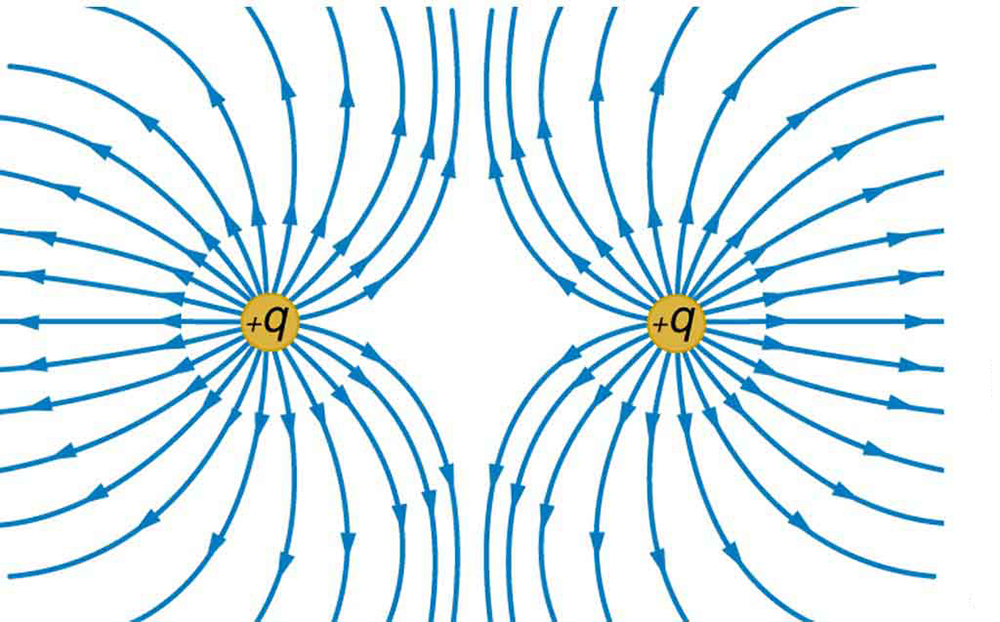
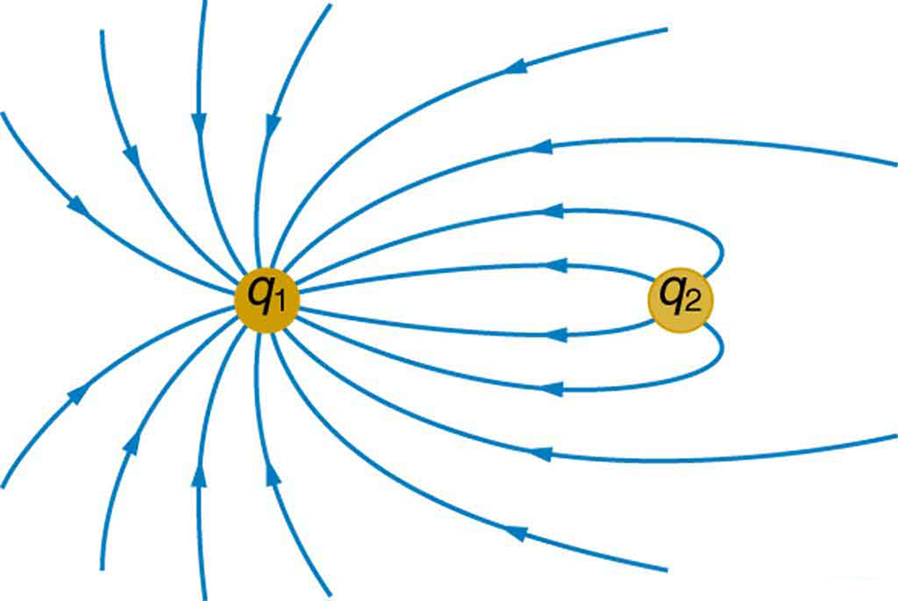
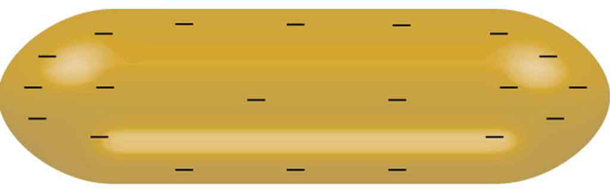
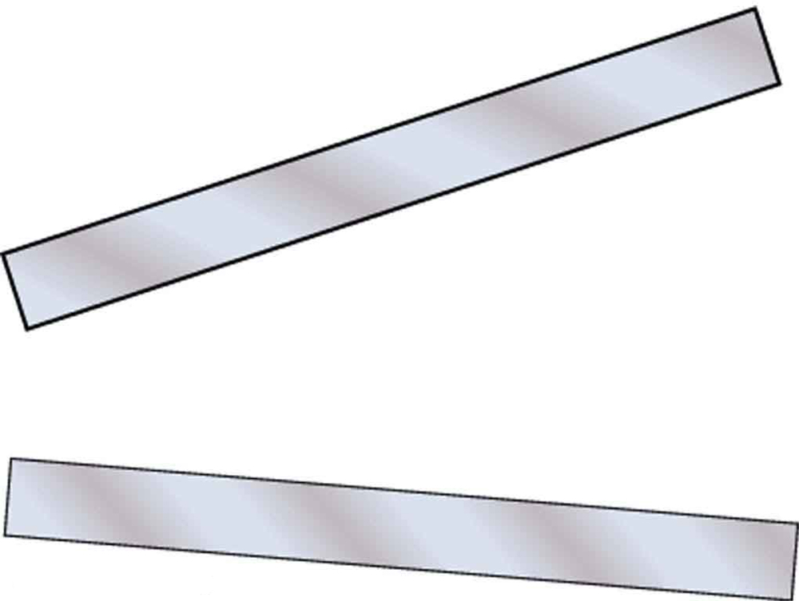
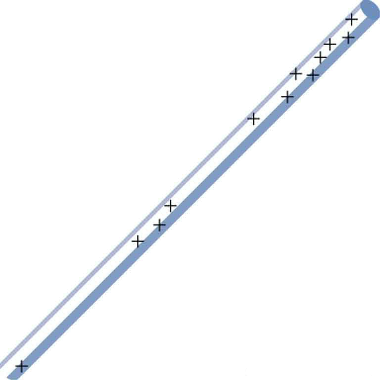

* Explain equipotential lines and equipotential surfaces.
* Describe the action of grounding an electrical appliance.
* Compare electric field and equipotential lines.

We can represent electric potentials (voltages) pictorially, just as we drew pictures to illustrate electric fields. Of course, the two are related. Consider [\[link\]](#import-auto-id1665740), which shows an isolated positive point charge and its electric field lines. Electric field lines radiate out from a positive charge and terminate on negative charges. While we use blue arrows to represent the magnitude and direction of the electric field, we use green lines to represent places where the electric potential is constant. These are called **equipotential lines**{: data-type="term" #import-auto-id1598142} in two dimensions, or *equipotential surfaces* in three dimensions. The term *equipotential* is also used as a noun, referring to an equipotential line or surface. The potential for a point charge is the same anywhere on an imaginary sphere of radius <math xmlns="http://www.w3.org/1998/Math/MathML"><semantics><mrow><mrow><mi>r</mi></mrow><mrow /></mrow><annotation encoding="StarMath 5.0"> size 12{r} {}</annotation></semantics></math>

 surrounding the charge. This is true since the potential for a point charge is given by <math xmlns="http://www.w3.org/1998/Math/MathML"><semantics><mrow><mrow><mrow><mi>V</mi><mo stretchy="false">=</mo><mrow><mstyle fontstyle="italic"><mrow><mtext>kQ</mtext></mrow></mstyle><mo stretchy="false">/</mo><mi>r</mi></mrow></mrow></mrow><mrow /></mrow><annotation encoding="StarMath 5.0"> size 12{V= ital "kQ"/r} {}</annotation></semantics></math>

 and, thus, has the same value at any point that is a given distance <math xmlns="http://www.w3.org/1998/Math/MathML"><semantics><mrow><mrow><mi>r</mi></mrow><mrow /></mrow><annotation encoding="StarMath 5.0"> size 12{r} {}</annotation></semantics></math>

 from the charge. An equipotential sphere is a circle in the two-dimensional view of [\[link\]](#import-auto-id1665740). Since the electric field lines point radially away from the charge, they are perpendicular to the equipotential lines.

{: #import-auto-id1665740 data-media-type="image/jpg"}

It is important to note that **equipotential lines are always perpendicular to electric field lines**{::}*.* No work is required to move a charge along an equipotential, since <math xmlns="http://www.w3.org/1998/Math/MathML"><semantics><mrow><mrow><mrow><mn>Δ</mn><mi>V</mi><mrow><mi /><mo stretchy="false">=</mo><mi /></mrow><mn>0</mn></mrow></mrow><mrow /></mrow><annotation encoding="StarMath 5.0"> size 12{?`V`=`0} {}</annotation></semantics></math>

. Thus the work is

<math xmlns="http://www.w3.org/1998/Math/MathML"><semantics><mrow><mrow><mrow><mrow><mi>W</mi><mo stretchy="false">=</mo><mspace width="0.25em" /><mrow><mo stretchy="false">–Δ</mo></mrow></mrow><mrow><mrow><mtext>PE</mtext><mo stretchy="false">=</mo><mspace width="0.25em" /><mrow><mo stretchy="false">–</mo><mi fontstyle="italic">q</mi><mn>Δ</mn><mi>V</mi></mrow></mrow><mo stretchy="false">=</mo><mn>0</mn></mrow><mo>.</mo></mrow></mrow><mrow /></mrow><annotation encoding="StarMath 5.0"> size 12{W=-?"PE"=-q?V=0} {}</annotation></semantics></math>

Work is zero if force is perpendicular to motion. Force is in the same direction as <math xmlns="http://www.w3.org/1998/Math/MathML"><semantics><mrow><mrow><mtext mathvariant="bold">E</mtext></mrow><mrow /></mrow><annotation encoding="StarMath 5.0"> size 12{E} {}</annotation></semantics></math>

, so that motion along an equipotential must be perpendicular to <math xmlns="http://www.w3.org/1998/Math/MathML"><semantics><mrow><mrow><mtext mathvariant="bold">E</mtext></mrow><mrow /></mrow><annotation encoding="StarMath 5.0"> size 12{E} {}</annotation></semantics></math>

. More precisely, work is related to the electric field by

<math xmlns="http://www.w3.org/1998/Math/MathML"> <semantics> <mrow> <mrow> <mrow> <mi>W</mi> <mo stretchy="false"> = </mo> <mrow> <mtext fontstyle="italic">Fd </mtext> </mrow><mspace width="0.25em" /> <mtext> cos </mtext><mspace width="0.25em" /> <mi>θ</mi> <mo stretchy="false"> = </mo> <mtext fontstyle="italic">qEd</mtext><mspace width="0.25em" /> <mtext>cos</mtext><mspace width="0.25em" /> <mi>θ</mi> <mrow> <mo stretchy="false"> = </mo> <mn>0</mn> </mrow> <mo>.</mo> </mrow> </mrow> </mrow> <annotation encoding="StarMath 5.0"> size 12{W=`` ital "Fd""cos"?`=` ital "qEd""cos"?`=0} {}</annotation> </semantics> </math>

Note that in the above equation, <math xmlns="http://www.w3.org/1998/Math/MathML"> <semantics> <mrow> <mrow> <mi>E</mi> </mrow> <mrow /> </mrow> <annotation encoding="StarMath 5.0"> size 12{E} {}</annotation> </semantics> </math>

 and <math xmlns="http://www.w3.org/1998/Math/MathML"> <semantics> <mrow> <mrow> <mi>F</mi> </mrow> </mrow> <annotation encoding="StarMath 5.0"> size 12{F} {}</annotation> </semantics> </math>

 symbolize the magnitudes of the electric field strength and force, respectively. Neither *<math xmlns="http://www.w3.org/1998/Math/MathML"><semantics><mrow><mrow><mi>q</mi></mrow><mrow /></mrow><annotation encoding="StarMath 5.0"> size 12{q} {}</annotation></semantics></math>

* nor **<math xmlns="http://www.w3.org/1998/Math/MathML"><semantics><mrow><mrow><mtext mathvariant="bold">E</mtext></mrow><mrow /></mrow></semantics></math>

** nor <math xmlns="http://www.w3.org/1998/Math/MathML"><semantics><mrow><mrow><mi>d</mi></mrow><mrow /></mrow></semantics></math>

 is zero, and so <math xmlns="http://www.w3.org/1998/Math/MathML"><semantics><mrow><mrow><mrow><mtext>cos</mtext><mspace width="0.25em" /><mi>θ</mi></mrow></mrow><mrow /></mrow></semantics></math>

 must be 0, meaning <math xmlns="http://www.w3.org/1998/Math/MathML"><semantics><mrow><mrow><mi>θ</mi></mrow><mrow /></mrow><annotation encoding="StarMath 5.0"> size 12{?} {}</annotation></semantics></math>

 must be <math xmlns="http://www.w3.org/1998/Math/MathML"> <semantics> <mtext>90º</mtext> </semantics> </math>

. In other words, motion along an equipotential is perpendicular to <math xmlns="http://www.w3.org/1998/Math/MathML"><semantics><mrow><mrow><mtext mathvariant="bold">E</mtext></mrow><mrow /></mrow><annotation encoding="StarMath 5.0"> size 12{E} {}</annotation></semantics></math>

.

One of the rules for static electric fields and conductors is that the electric field must be perpendicular to the surface of any conductor. This implies that a **conductor is an equipotential surface in static situations**{::}*.* There can be no voltage difference across the surface of a conductor, or charges will flow. One of the uses of this fact is that a conductor can be fixed at zero volts by connecting it to the earth with a good conductor—a process called **grounding**{: data-type="term" #import-auto-id3098122}. Grounding can be a useful safety tool. For example, grounding the metal case of an electrical appliance ensures that it is at zero volts relative to the earth.

Grounding

A conductor can be fixed at zero volts by connecting it to the earth with a good conductor—a process called grounding.

Because a conductor is an equipotential, it can replace any equipotential surface. For example, in [\[link\]](#import-auto-id1665740) a charged spherical conductor can replace the point charge, and the electric field and potential surfaces outside of it will be unchanged, confirming the contention that a spherical charge distribution is equivalent to a point charge at its center.

[\[link\]](#import-auto-id2749788) shows the electric field and equipotential lines for two equal and opposite charges. Given the electric field lines, the equipotential lines can be drawn simply by making them perpendicular to the electric field lines. Conversely, given the equipotential lines, as in [\[link\]](#import-auto-id2757381)(a), the electric field lines can be drawn by making them perpendicular to the equipotentials, as in [\[link\]](#import-auto-id2757381)(b).

 near the positive charge and least (most negative) near the negative charge. "){: #import-auto-id2749788 data-media-type="image/jpg"}

 These equipotential lines might be measured with a voltmeter in a laboratory experiment. (b) The corresponding electric field lines are found by drawing them perpendicular to the equipotentials. Note that these fields are consistent with two equal negative charges. "){: #import-auto-id2757381 data-media-type="image/jpg"}

One of the most important cases is that of the familiar parallel conducting plates shown in [\[link\]](#import-auto-id2004698). Between the plates, the equipotentials are evenly spaced and parallel. The same field could be maintained by placing conducting plates at the equipotential lines at the potentials shown.

{: #import-auto-id2004698 data-media-type="image/jpg"}

An important application of electric fields and equipotential lines involves the heart. The heart relies on electrical signals to maintain its rhythm. The movement of electrical signals causes the chambers of the heart to contract and relax. When a person has a heart attack, the movement of these electrical signals may be disturbed. An artificial pacemaker and a defibrillator can be used to initiate the rhythm of electrical signals. The equipotential lines around the heart, the thoracic region, and the axis of the heart are useful ways of monitoring the structure and functions of the heart. An electrocardiogram (ECG) measures the small electric signals being generated during the activity of the heart. More about the relationship between electric fields and the heart is discussed in [Energy Stored in Capacitors](/m42395).

PhET Explorations: Charges and Fields

Move point charges around on the playing field and then view the electric field, voltages, equipotential lines, and more. It\'s colorful, it\'s dynamic, it\'s free.

<figure markdown="1" id="eip-id999210">
<figcaption>
[Charges and Fields](charges-and-fields_en.jar)
</figcaption>
 {: data-type="image"}  
</figure>

# Section Summary

* An equipotential line is a line along which the electric potential is constant.
* An equipotential surface is a three-dimensional version of equipotential lines.
* {: #import-auto-id2908098} Equipotential lines are always perpendicular to electric field lines.
* {: #import-auto-id1315976} The process by which a conductor can be fixed at zero volts by connecting it to the earth with a good conductor is called grounding.

# Conceptual Questions

What is an equipotential line? What is an equipotential surface?

Explain in your own words why equipotential lines and surfaces must be perpendicular to electric field lines.

Can different equipotential lines cross? Explain.

# Problems &amp; Exercises

(a) Sketch the equipotential lines near a point charge + *<math xmlns="http://www.w3.org/1998/Math/MathML"><semantics><mrow><mrow><mi>q</mi></mrow><mrow /></mrow><annotation encoding="StarMath 5.0"> size 12{q} {}</annotation></semantics></math>

*. Indicate the direction of increasing potential. (b) Do the same for a point charge <math xmlns="http://www.w3.org/1998/Math/MathML"><semantics><mrow><mrow><mrow><mrow><mo stretchy="false">–</mo><mn>3</mn><mspace width="0.25em" /></mrow><mi>q</mi></mrow></mrow><mrow /></mrow><annotation encoding="StarMath 5.0"> size 12{ - 3 "." "00"q} {}</annotation></semantics></math>

.

Sketch the equipotential lines for the two equal positive charges shown in [[link]](#import-auto-id1536206). Indicate the direction of increasing potential.

{: #import-auto-id1536206 data-media-type="image/jpg"}

[[link]](#import-auto-id2772911) shows the electric field lines near two charges <math xmlns="http://www.w3.org/1998/Math/MathML"><semantics><mrow><mrow><msub><mi>q</mi><mrow><mn>1</mn></mrow></msub></mrow><mrow /></mrow><annotation encoding="StarMath 5.0"> size 12{q rSub { size 8{1} } } {}</annotation></semantics></math>

 and <math xmlns="http://www.w3.org/1998/Math/MathML"><semantics><mrow><mrow><msub><mi>q</mi><mrow><mn>2</mn></mrow></msub></mrow><mrow /></mrow><annotation encoding="StarMath 5.0"> size 12{q rSub { size 8{2} } } {}</annotation></semantics></math>

, the first having a magnitude four times that of the second. Sketch the equipotential lines for these two charges, and indicate the direction of increasing potential.

Sketch the equipotential lines a long distance from the charges shown in [[link]](#import-auto-id2772911). Indicate the direction of increasing potential.

{: #import-auto-id2772911 data-media-type="image/jpg"}

Sketch the equipotential lines in the vicinity of two opposite charges, where the negative charge is three times as great in magnitude as the positive. See [[link]](#import-auto-id2772911) for a similar situation. Indicate the direction of increasing potential.

Sketch the equipotential lines in the vicinity of the negatively charged conductor in [[link]](#import-auto-id1500503). How will these equipotentials look a long distance from the object?

{: #import-auto-id1500503 data-media-type="image/jpg"}

Sketch the equipotential lines surrounding the two conducting plates shown in [[link]](#import-auto-id2837614), given the top plate is positive and the bottom plate has an equal amount of negative charge. Be certain to indicate the distribution of charge on the plates. Is the field strongest where the plates are closest? Why should it be?

{: #import-auto-id2837614 data-media-type="image/jpg"}

(a) Sketch the electric field lines in the vicinity of the charged insulator in [[link]](#import-auto-id1359573). Note its non-uniform charge distribution. (b) Sketch equipotential lines surrounding the insulator. Indicate the direction of increasing potential.

{: #import-auto-id1359573 data-media-type="image/jpg"}

The naturally occurring charge on the ground on a fine day out in the open country is <math xmlns="http://www.w3.org/1998/Math/MathML"><semantics><mrow><mrow><mrow><mtext>–1</mtext><mtext>.</mtext><mtext>00</mtext><mspace width="0.25em" /><msup><mtext>nC/m</mtext><mrow><mn>2</mn></mrow></msup></mrow></mrow><mrow /></mrow><annotation encoding="StarMath 5.0"> size 12{"Š1" "." "00" "nC/m" rSup { size 8{2} } } {}</annotation></semantics></math>

. (a) What is the electric field relative to ground at a height of 3.00 m? (b) Calculate the electric potential at this height. (c) Sketch electric field and equipotential lines for this scenario.

The lesser electric ray (**Narcine bancroftii**)** maintains an incredible charge on its head and a charge equal in magnitude but opposite in sign on its tail ([[link]](#import-auto-id1284133)). (a) Sketch the equipotential lines surrounding the ray. (b) Sketch the equipotentials when the ray is near a ship with a conducting surface. (c) How could this charge distribution be of use to the ray?

 (credit: National Oceanic and Atmospheric Administration, NOAA's Fisheries Collection)."){: #import-auto-id1284133 data-media-type="image/png"}

