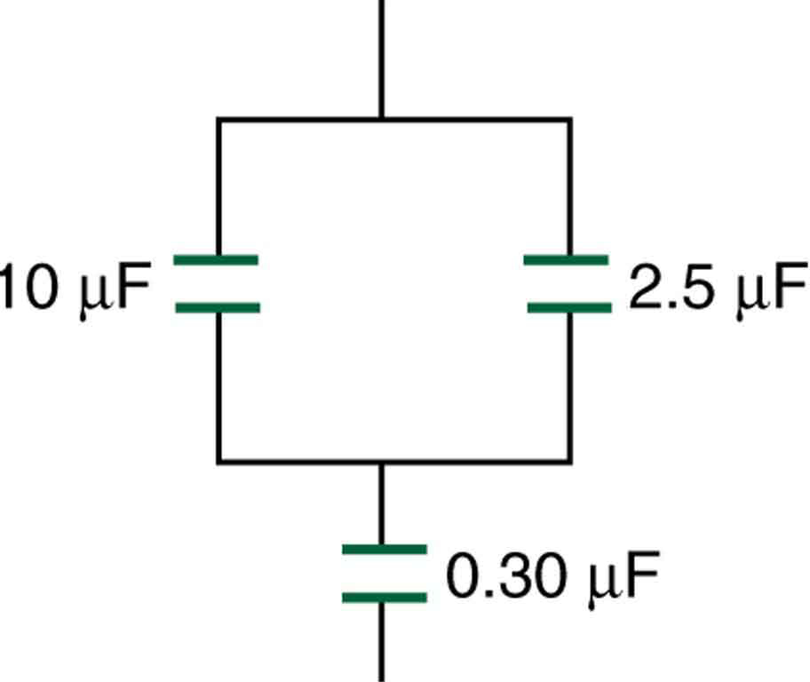

* Derive expressions for total capacitance in series and in parallel.
* Identify series and parallel parts in the combination of connection of capacitors.
* Calculate the effective capacitance in series and parallel given individual capacitances.

Several capacitors may be connected together in a variety of applications. Multiple connections of capacitors act like a single equivalent capacitor. The total capacitance of this equivalent single capacitor depends both on the individual capacitors and how they are connected. There are two simple and common types of connections, called **series** and **parallel**, for which we can easily calculate the total capacitance. Certain more complicated connections can also be related to combinations of series and parallel.

# Capacitance in Series

[\[link\]](#import-auto-id2499137)(a) shows a series connection of three capacitors with a voltage applied. As for any capacitor, the capacitance of the combination is related to charge and voltage by <math xmlns="http://www.w3.org/1998/Math/MathML"><semantics><mrow><mrow><mrow><mi>C</mi><mo stretchy="false">=</mo><mfrac><mi>Q</mi><mi>V</mi></mfrac></mrow></mrow><mrow /></mrow><annotation encoding="StarMath 5.0"> size 12{C= { {Q} over {V} } } {}</annotation></semantics></math>

.

Note in [\[link\]](#import-auto-id2499137) that opposite charges of magnitude **<math xmlns="http://www.w3.org/1998/Math/MathML"><semantics><mrow><mrow><mi>Q</mi></mrow><mrow /></mrow><annotation encoding="StarMath 5.0"> size 12{Q} {}</annotation></semantics></math>

** flow to either side of the originally uncharged combination of capacitors when the voltage <math xmlns="http://www.w3.org/1998/Math/MathML"><semantics><mrow><mrow><mi>V</mi></mrow><mrow /></mrow><annotation encoding="StarMath 5.0"> size 12{V} {}</annotation></semantics></math>

 is applied. Conservation of charge requires that equal-magnitude charges be created on the plates of the individual capacitors, since charge is only being separated in these originally neutral devices. The end result is that the combination resembles a single capacitor with an effective plate separation greater than that of the individual capacitors alone. (See [\[link\]](#import-auto-id2499137)(b).) Larger plate separation means smaller capacitance. It is a general feature of series connections of capacitors that the total capacitance is less than any of the individual capacitances.

 Capacitors connected in series. The magnitude of the charge on each plate is  &#10; &#10;  Q&#10; &#10;. (b) An equivalent capacitor has a larger plate separation d size 12{d} {}. Series connections produce a total capacitance that is less than that of any of the individual capacitors."){: #import-auto-id2499137}

We can find an expression for the total capacitance by considering the voltage across the individual capacitors shown in [\[link\]](#import-auto-id2499137). Solving <math xmlns="http://www.w3.org/1998/Math/MathML"><semantics><mrow><mrow><mrow><mi>C</mi><mo stretchy="false">=</mo><mfrac><mi>Q</mi><mi>V</mi></mfrac></mrow></mrow><mrow /></mrow><annotation encoding="StarMath 5.0"> size 12{C= { {Q} over {V} } } {}</annotation></semantics></math>

 for <math xmlns="http://www.w3.org/1998/Math/MathML"><semantics><mrow><mrow><mi>V</mi></mrow><mrow /></mrow><annotation encoding="StarMath 5.0"> size 12{V} {}</annotation></semantics></math>

 gives <math xmlns="http://www.w3.org/1998/Math/MathML"><semantics><mrow><mrow><mrow><mi>V</mi><mo stretchy="false">=</mo><mfrac><mi>Q</mi><mi>C</mi></mfrac></mrow></mrow><mrow /></mrow><annotation encoding="StarMath 5.0"> size 12{V= { {Q} over {C} } } {}</annotation></semantics></math>

. The voltages across the individual capacitors are thus <math xmlns="http://www.w3.org/1998/Math/MathML"><semantics><mrow><mrow><mrow><msub><mi>V</mi><mrow><mn>1</mn></mrow></msub><mo stretchy="false">=</mo><mfrac><mi>Q</mi><msub><mi>C</mi><mrow><mn>1</mn></mrow></msub></mfrac></mrow></mrow><mrow /></mrow><annotation encoding="StarMath 5.0"> size 12{ {V} rSub { size 8{1} } = { {Q} over { {C} rSub { size 8{1} } } } } {}</annotation></semantics></math>

, <math xmlns="http://www.w3.org/1998/Math/MathML"><semantics><mrow><mrow><mrow><msub><mi>V</mi><mrow><mn>2</mn></mrow></msub><mo stretchy="false">=</mo><mfrac><mi>Q</mi><msub><mi>C</mi><mrow><mn>2</mn></mrow></msub></mfrac></mrow></mrow><mrow /></mrow><annotation encoding="StarMath 5.0"> size 12{ {V} rSub { size 8{2} } = { {Q} over { {C} rSub { size 8{2} } } } } {}</annotation></semantics></math>

, and <math xmlns="http://www.w3.org/1998/Math/MathML"><semantics><mrow><mrow><mrow><msub><mi>V</mi><mrow><mn>3</mn></mrow></msub><mo stretchy="false">=</mo><mfrac><mi>Q</mi><msub><mi>C</mi><mrow><mn>3</mn></mrow></msub></mfrac></mrow></mrow><mrow /></mrow><annotation encoding="StarMath 5.0"> size 12{ {V} rSub { size 8{3} } = { {Q} over { {C} rSub { size 8{3} } } } } {}</annotation></semantics></math>

. The total voltage is the sum of the individual voltages:

<math xmlns="http://www.w3.org/1998/Math/MathML"><semantics><mrow><mrow><mrow><mi>V</mi><mo stretchy="false">=</mo><mrow><mrow><msub><mi>V</mi><mrow><mn>1</mn></mrow></msub><mo stretchy="false">+</mo><msub><mi>V</mi><mrow><mn>2</mn></mrow></msub></mrow><mo stretchy="false">+</mo><msub><mi>V</mi><mrow><mn>3</mn></mrow></msub></mrow><mo>.</mo></mrow></mrow><mrow /></mrow><annotation encoding="StarMath 5.0"> size 12{V= {V} rSub { size 8{1} } + {V} rSub { size 8{2} } + {V} rSub { size 8{3} } } {}</annotation></semantics></math>

Now, calling the total capacitance <math xmlns="http://www.w3.org/1998/Math/MathML"><semantics><mrow><mrow><msub><mi>C</mi><mrow><mtext>S</mtext></mrow></msub></mrow><mrow /></mrow><annotation encoding="StarMath 5.0"> size 12{C rSub { size 8{S} } } {}</annotation></semantics></math>

 for series capacitance, consider that

<math xmlns="http://www.w3.org/1998/Math/MathML"> <semantics> <mrow> <mrow> <mrow> <mrow> <mi>V</mi> <mo stretchy="false">=</mo> <mfrac> <mi>Q</mi> <msub> <mi>C</mi> <mrow> <mtext>S</mtext> </mrow> </msub> </mfrac> </mrow> <mo stretchy="false">=</mo> <mrow> <mrow> <msub> <mi>V</mi> <mrow> <mn>1</mn> </mrow> </msub> <mo stretchy="false">+</mo> <msub> <mi>V</mi> <mrow> <mn>2</mn> </mrow> </msub> </mrow> <mo stretchy="false">+</mo> <msub> <mi>V</mi> <mrow> <mn>3</mn> </mrow> </msub> <mn>.</mn> </mrow> </mrow> </mrow> <mrow /> </mrow> <annotation encoding="StarMath 5.0"> size 12{V= { {Q} over { {C} rSub { size 8{S} } } } = {V} rSub { size 8{1} } + {V} rSub { size 8{2} } + {V} rSub { size 8{3} } } {}</annotation> </semantics> </math>

Entering the expressions for <math xmlns="http://www.w3.org/1998/Math/MathML"><semantics><mrow><mrow><msub><mi>V</mi><mrow><mn>1</mn></mrow></msub></mrow><mrow /></mrow><annotation encoding="StarMath 5.0"> size 12{V rSub { size 8{1} } } {}</annotation></semantics></math>

, <math xmlns="http://www.w3.org/1998/Math/MathML"><semantics><mrow><mrow><msub><mi>V</mi><mrow><mn>2</mn></mrow></msub></mrow><mrow /></mrow><annotation encoding="StarMath 5.0"> size 12{V rSub { size 8{2} } } {}</annotation></semantics></math>

, and <math xmlns="http://www.w3.org/1998/Math/MathML"><semantics><mrow><mrow><msub><mi>V</mi><mrow><mn>3</mn></mrow></msub></mrow><mrow /></mrow><annotation encoding="StarMath 5.0"> size 12{V rSub { size 8{3} } } {}</annotation></semantics></math>

, we get

<math xmlns="http://www.w3.org/1998/Math/MathML"><semantics><mrow><mrow><mrow><mfrac><mi>Q</mi><msub><mi>C</mi><mrow><mtext>S</mtext></mrow></msub></mfrac><mo stretchy="false">=</mo><mrow><mrow><mfrac><mi>Q</mi><msub><mi>C</mi><mrow><mn>1</mn></mrow></msub></mfrac><mo stretchy="false">+</mo><mfrac><mi>Q</mi><msub><mi>C</mi><mrow><mn>2</mn></mrow></msub></mfrac></mrow><mo stretchy="false">+</mo><mfrac><mi>Q</mi><msub><mi>C</mi><mrow><mn>3</mn></mrow></msub></mfrac></mrow><mo>.</mo></mrow></mrow><mrow /></mrow><annotation encoding="StarMath 5.0"> size 12{ { {Q} over { {C} rSub { size 8{S} } } } = { {Q} over { {C} rSub { size 8{1} } } } + { {Q} over { {C} rSub { size 8{2} } } } + { {Q} over { {C} rSub { size 8{3} } } } } {}</annotation></semantics></math>

Canceling the <math xmlns="http://www.w3.org/1998/Math/MathML"><semantics><mrow><mrow><mi>Q</mi></mrow><mrow /></mrow><annotation encoding="StarMath 5.0"> size 12{Q} {}</annotation></semantics></math>

s, we obtain the equation for the total capacitance in series <math xmlns="http://www.w3.org/1998/Math/MathML"><semantics><mrow><mrow><msub><mi>C</mi><mrow><mtext>S</mtext></mrow></msub></mrow><mrow /></mrow><annotation encoding="StarMath 5.0"> size 12{ {C} rSub { size 8{S} } } {}</annotation></semantics></math>

 to be

<math xmlns="http://www.w3.org/1998/Math/MathML"><semantics><mrow><mrow><mrow><mrow><mfrac><mn>1</mn><msub><mi>C</mi><mrow><mtext>S</mtext></mrow></msub></mfrac><mo stretchy="false">=</mo><mrow><mrow><mrow><mfrac><mn>1</mn><msub><mi>C</mi><mrow><mn>1</mn></mrow></msub></mfrac><mo stretchy="false">+</mo><mfrac><mn>1</mn><msub><mi>C</mi><mrow><mn>2</mn></mrow></msub></mfrac></mrow><mo stretchy="false">+</mo><mfrac><mn>1</mn><msub><mi>C</mi><mrow><mn>3</mn></mrow></msub></mfrac></mrow><mo stretchy="false">+</mo><mtext>.</mtext></mrow></mrow><mtext>.</mtext><mtext>.</mtext></mrow><mo>,</mo></mrow><mrow /></mrow><annotation encoding="StarMath 5.0"> size 12{ { {1} over { {C} rSub { size 8{S} } } } = { {1} over { {C} rSub { size 8{1} } } } + { {1} over { {C} rSub { size 8{2} } } } + { {1} over { {C} rSub { size 8{3} } } } + "." "." "." } {}</annotation></semantics></math>

where “...” indicates that the expression is valid for any number of capacitors connected in series. An expression of this form always results in a total capacitance <math xmlns="http://www.w3.org/1998/Math/MathML"><semantics><mrow><mrow><msub><mi>C</mi><mrow><mtext>S</mtext></mrow></msub></mrow><mrow /></mrow><annotation encoding="StarMath 5.0"> size 12{ {C} rSub { size 8{S} } } {}</annotation></semantics></math>

 that is less than any of the individual capacitances <math xmlns="http://www.w3.org/1998/Math/MathML"><semantics><mrow><mrow><msub><mi>C</mi><mrow><mn>1</mn></mrow></msub></mrow><mrow /></mrow><annotation encoding="StarMath 5.0"> size 12{ {C} rSub { size 8{1} } } {}</annotation></semantics></math>

, <math xmlns="http://www.w3.org/1998/Math/MathML"><semantics><mrow><mrow><msub><mi>C</mi><mrow><mn>2</mn></mrow></msub></mrow><mrow /></mrow><annotation encoding="StarMath 5.0"> size 12{ {C} rSub { size 8{2} } } {}</annotation></semantics></math>

, ..., as the next example illustrates.

Total Capacitance in Series,
<math xmlns="http://www.w3.org/1998/Math/MathML"> <semantics> <mrow> <mrow> <msub> <mi>C</mi> <mrow> <mtext>s</mtext> </mrow> </msub> </mrow> <mrow /> </mrow> <annotation encoding="StarMath 5.0"> size 12{ {C} rSub { size 8{S} } } {}</annotation> </semantics> </math>

Total capacitance in series: <math xmlns="http://www.w3.org/1998/Math/MathML"><semantics><mrow><mrow><mrow><mrow><mfrac><mn>1</mn><msub><mi>C</mi><mrow><mtext>S</mtext></mrow></msub></mfrac><mo stretchy="false">=</mo><mrow><mrow><mrow><mfrac><mn>1</mn><msub><mi>C</mi><mrow><mn>1</mn></mrow></msub></mfrac><mo stretchy="false">+</mo><mfrac><mn>1</mn><msub><mi>C</mi><mrow><mn>2</mn></mrow></msub></mfrac></mrow><mo stretchy="false">+</mo><mfrac><mn>1</mn><msub><mi>C</mi><mrow><mn>3</mn></mrow></msub></mfrac></mrow><mo stretchy="false">+</mo><mtext>.</mtext></mrow></mrow><mtext>.</mtext><mtext>.</mtext></mrow></mrow><mrow /></mrow><annotation encoding="StarMath 5.0"> size 12{ { {1} over { {C} rSub { size 8{S} } } } = { {1} over { {C} rSub { size 8{1} } } } + { {1} over { {C} rSub { size 8{2} } } } + { {1} over { {C} rSub { size 8{3} } } } + "." "." "." } {}</annotation></semantics></math>

<strong> </strong>

What Is the Series Capacitance?

Find the total capacitance for three capacitors connected in series, given their individual capacitances are 1.000, 5.000, and 8.000 <math xmlns="http://www.w3.org/1998/Math/MathML"><semantics><mrow><mrow><mtext>µF</mtext></mrow><mrow /></mrow><annotation encoding="StarMath 5.0"> size 12{mF} {}</annotation></semantics></math>

.

**Strategy**

With the given information, the total capacitance can be found using the equation for capacitance in series.

**Solution**

Entering the given capacitances into the expression for <math xmlns="http://www.w3.org/1998/Math/MathML"><semantics><mrow><mrow><mfrac><mn>1</mn><msub><mi>C</mi><mrow><mtext>S</mtext></mrow></msub></mfrac></mrow><mrow /></mrow><annotation encoding="StarMath 5.0"> size 12{ { {1} over { {C} rSub { size 8{S} } } } } {}</annotation></semantics></math>

 gives <math xmlns="http://www.w3.org/1998/Math/MathML"><semantics><mrow><mrow><mrow><mfrac><mn>1</mn><msub><mi>C</mi><mrow><mi>S</mi></mrow></msub></mfrac><mo stretchy="false">=</mo><mrow><mrow><mfrac><mn>1</mn><msub><mi>C</mi><mrow><mn>1</mn></mrow></msub></mfrac><mo stretchy="false">+</mo><mfrac><mn>1</mn><msub><mi>C</mi><mrow><mn>2</mn></mrow></msub></mfrac></mrow><mo stretchy="false">+</mo><mfrac><mn>1</mn><msub><mi>C</mi><mrow><mn>3</mn></mrow></msub></mfrac></mrow></mrow></mrow><mrow /></mrow><annotation encoding="StarMath 5.0"> size 12{ { {1} over { {C} rSub { size 8{S} } } } = { {1} over { {C} rSub { size 8{1} } } } + { {1} over { {C} rSub { size 8{2} } } } + { {1} over { {C} rSub { size 8{3} } } } } {}</annotation></semantics></math>

.

<math xmlns="http://www.w3.org/1998/Math/MathML"> <semantics> <mrow> <mrow> <mrow> <mrow> <mfrac> <mn>1</mn> <msub> <mi>C</mi> <mrow> <mtext>S</mtext> </mrow> </msub> </mfrac> <mo stretchy="false">=</mo> <mrow> <mrow> <mfrac> <mn>1</mn> <mrow> <mn>1</mn> <mtext>.</mtext> <mtext>000 µF</mtext> </mrow> </mfrac> <mo stretchy="false">+</mo> <mfrac> <mn>1</mn> <mrow> <mn>5</mn> <mtext>.</mtext> <mtext>000 µF</mtext> </mrow> </mfrac> </mrow> <mo stretchy="false">+</mo> <mfrac> <mn>1</mn> <mrow> <mn>8</mn> <mtext>.</mtext> <mtext>000 µF</mtext> </mrow> </mfrac> </mrow> </mrow> <mo stretchy="false">=</mo> <mfrac> <mrow> <mn>1</mn> <mtext>.</mtext> <mtext>325</mtext> </mrow> <mrow><mtext>µF</mtext> </mrow> </mfrac> </mrow> </mrow> <mrow /> </mrow> <annotation encoding="StarMath 5.0"> size 12{ { {1} over { {C} rSub { size 8{S} } } } = { {1} over {1 "." "00" mF} } + { {1} over {5 "." "00" mF} } + { {1} over {8 "." "00" mF} } = { {1 "." "325"} over {mF} } } {}</annotation> </semantics> </math>

Inverting to find <math xmlns="http://www.w3.org/1998/Math/MathML"><semantics><mrow><mrow><msub><mi>C</mi><mrow><mtext>S</mtext></mrow></msub></mrow><mrow /></mrow><annotation encoding="StarMath 5.0"> size 12{C rSub { size 8{S} } } {}</annotation></semantics></math>

 yields <math xmlns="http://www.w3.org/1998/Math/MathML"><semantics><mrow /><annotation encoding="StarMath 5.0">{}</annotation></semantics></math>

<math xmlns="http://www.w3.org/1998/Math/MathML"><semantics><mrow><mrow><mrow><mrow><mrow><msub><mi>C</mi><mrow><mtext>S</mtext></mrow></msub><mo stretchy="false">=</mo><mfrac><mtext>µF</mtext><mrow><mn>1</mn><mtext>.</mtext><mtext>325</mtext></mrow></mfrac></mrow><mo stretchy="false">=</mo><mn>0</mn></mrow><mtext>.</mtext><mtext>755 µF</mtext></mrow></mrow><mrow /></mrow><annotation encoding="StarMath 5.0"> size 12{ {C} rSub { size 8{S} } = { {mF} over {1 "." "325"} } =0 "." "755" mF} {}</annotation></semantics></math>

.

**Discussion**

The total series capacitance <math xmlns="http://www.w3.org/1998/Math/MathML"><semantics><mrow><mrow><msub><mi>C</mi><mrow><mtext>s</mtext></mrow></msub></mrow><mrow /></mrow><annotation encoding="StarMath 5.0"> size 12{ {C} rSub { size 8{S} } } {}</annotation></semantics></math>

 is less than the smallest individual capacitance, as promised. In series connections of capacitors, the sum is less than the parts. In fact, it is less than any individual. Note that it is sometimes possible, and more convenient, to solve an equation like the above by finding the least common denominator, which in this case (showing only whole-number calculations) is 40. Thus,

<math xmlns="http://www.w3.org/1998/Math/MathML"><semantics><mrow><mrow><mrow><mrow><mfrac><mn>1</mn><msub><mi>C</mi><mrow><mtext>S</mtext></mrow></msub></mfrac><mo stretchy="false">=</mo><mrow><mrow><mfrac><mtext>40</mtext><mrow><mtext>40 µF</mtext></mrow></mfrac><mo stretchy="false">+</mo><mfrac><mn>8</mn><mrow><mtext>40 µF</mtext></mrow></mfrac></mrow><mo stretchy="false">+</mo><mfrac><mn>5</mn><mrow><mtext>40 µF</mtext></mrow></mfrac></mrow></mrow><mo stretchy="false">=</mo><mfrac><mtext>53</mtext><mrow><mtext>40 µF</mtext></mrow></mfrac></mrow></mrow><mo>,</mo><mrow /></mrow><annotation encoding="StarMath 5.0"> size 12{ { {1} over { {C} rSub { size 8{S} } } } = { {"40"} over {"40" mF} } + { {8} over {"40" mF} } + { {5} over {"40" mF} } = { {"53"} over {"40" mF} } } {}</annotation></semantics></math>

so that

<math xmlns="http://www.w3.org/1998/Math/MathML"><semantics><mrow><mrow><mrow><mrow><mrow><msub><mi>C</mi><mrow><mtext>S</mtext></mrow></msub><mo stretchy="false">=</mo><mfrac><mrow><mtext>40 µF</mtext></mrow><mtext>53</mtext></mfrac></mrow><mo stretchy="false">=</mo><mn>0</mn></mrow><mtext>.</mtext><mtext>755 µF</mtext></mrow><mo>.</mo></mrow><mrow /></mrow><annotation encoding="StarMath 5.0"> size 12{ {C} rSub { size 8{S} } = { {"40" µF} over {"53"} } =0 "." "755" µF} {}</annotation></semantics></math>

# Capacitors in Parallel

[\[link\]](#import-auto-id2511423)(a) shows a parallel connection of three capacitors with a voltage applied. Here the total capacitance is easier to find than in the series case. To find the equivalent total capacitance <math xmlns="http://www.w3.org/1998/Math/MathML"><semantics><mrow><mrow><msub><mi>C</mi><mrow><mtext>p</mtext></mrow></msub></mrow><mrow /></mrow><annotation encoding="StarMath 5.0"> size 12{ {C} rSub { size 8{p} } } {}</annotation></semantics></math>

, we first note that the voltage across each capacitor is <math xmlns="http://www.w3.org/1998/Math/MathML"><semantics><mrow><mrow><mi>V</mi></mrow><mrow /></mrow><annotation encoding="StarMath 5.0"> size 12{V} {}</annotation></semantics></math>

, the same as that of the source, since they are connected directly to it through a conductor. (Conductors are equipotentials, and so the voltage across the capacitors is the same as that across the voltage source.) Thus the capacitors have the same charges on them as they would have if connected individually to the voltage source. The total charge **<math xmlns="http://www.w3.org/1998/Math/MathML"><semantics><mrow><mrow><mi>Q</mi></mrow><mrow /></mrow><annotation encoding="StarMath 5.0"> size 12{Q} {}</annotation></semantics></math>

** is the sum of the individual charges:

<math xmlns="http://www.w3.org/1998/Math/MathML"><semantics><mrow><mrow><mrow><mi>Q</mi><mo stretchy="false">=</mo><mrow><mrow><msub><mi>Q</mi><mrow><mn>1</mn></mrow></msub><mo stretchy="false">+</mo><msub><mi>Q</mi><mrow><mn>2</mn></mrow></msub></mrow><mo stretchy="false">+</mo><msub><mi>Q</mi><mrow><mn>3</mn></mrow></msub></mrow><mo>.</mo></mrow></mrow><mrow /></mrow><annotation encoding="StarMath 5.0"> size 12{Q= {Q} rSub { size 8{1} } + {Q} rSub { size 8{2} } + {Q} rSub { size 8{3} } } {}</annotation></semantics></math>

 Capacitors in parallel. Each is connected directly to the voltage source just as if it were all alone, and so the total capacitance in parallel is just the sum of the individual capacitances. (b) The equivalent capacitor has a larger plate area and can therefore hold more charge than the individual capacitors. "){: #import-auto-id2511423}

Using the relationship <math xmlns="http://www.w3.org/1998/Math/MathML"><semantics><mrow><mrow><mrow><mi>Q</mi><mo stretchy="false">=</mo><mstyle fontstyle="italic"><mrow><mtext>CV</mtext></mrow></mstyle></mrow></mrow><mrow /></mrow><annotation encoding="StarMath 5.0"> size 12{Q= ital "CV"} {}</annotation></semantics></math>

, we see that the total charge is <math xmlns="http://www.w3.org/1998/Math/MathML"><semantics><mrow><mrow><mrow><mrow><mi>Q</mi><mo stretchy="false">=</mo><msub><mi>C</mi><mrow><mtext>p</mtext></mrow></msub></mrow><mi>V</mi></mrow></mrow><mrow /></mrow><annotation encoding="StarMath 5.0"> size 12{Q= {C} rSub { size 8{p} } V} {}</annotation></semantics></math>

, and the individual charges are <math xmlns="http://www.w3.org/1998/Math/MathML"><semantics><mrow><mrow><mrow><mrow><msub><mi>Q</mi><mrow><mn>1</mn></mrow></msub><mo stretchy="false">=</mo><msub><mi>C</mi><mrow><mn>1</mn></mrow></msub></mrow><mi>V</mi></mrow></mrow><mrow /></mrow><annotation encoding="StarMath 5.0"> size 12{ {Q} rSub { size 8{1} } = {C} rSub { size 8{1} } V} {}</annotation></semantics></math>

<em>, </em><math xmlns="http://www.w3.org/1998/Math/MathML"><semantics><mrow><mrow><mrow><mrow><msub><mi>Q</mi><mrow><mn>2</mn></mrow></msub><mo stretchy="false">=</mo><msub><mi>C</mi><mrow><mn>2</mn></mrow></msub></mrow><mi>V</mi></mrow></mrow><mrow /></mrow><annotation encoding="StarMath 5.0"> size 12{ {Q} rSub { size 8{2} } = {C} rSub { size 8{2} } V} {}</annotation></semantics></math>

*,* and <math xmlns="http://www.w3.org/1998/Math/MathML"><semantics><mrow><mrow><mrow><mrow><msub><mi>Q</mi><mrow><mn>3</mn></mrow></msub><mo stretchy="false">=</mo><msub><mi>C</mi><mrow><mn>3</mn></mrow></msub></mrow><mi>V</mi></mrow></mrow><mrow /></mrow><annotation encoding="StarMath 5.0"> size 12{ {Q} rSub { size 8{3} } = {C} rSub { size 8{3} } V} {}</annotation></semantics></math>

. Entering these into the previous equation gives

<math xmlns="http://www.w3.org/1998/Math/MathML"><semantics><mrow><mrow><mrow><msub><mi>C</mi><mrow><mtext>p</mtext></mrow></msub><mrow><mi>V</mi><mo stretchy="false">=</mo><msub><mi>C</mi><mrow><mn>1</mn></mrow></msub></mrow><mrow><mi>V</mi><mo stretchy="false">+</mo><msub><mi>C</mi><mrow><mn>2</mn></mrow></msub></mrow><mrow><mi>V</mi><mo stretchy="false">+</mo><msub><mi>C</mi><mrow><mn>3</mn></mrow></msub></mrow><mi>V</mi></mrow><mo>.</mo></mrow><mrow /></mrow><annotation encoding="StarMath 5.0"> size 12{ {C} rSub { size 8{p} } V= {C} rSub { size 8{1} } V+ {C} rSub { size 8{2} } V+ {C} rSub { size 8{3} } V} {}</annotation></semantics></math>

Canceling <math xmlns="http://www.w3.org/1998/Math/MathML"><semantics><mrow><mrow><mi>V</mi></mrow><mrow /></mrow><annotation encoding="StarMath 5.0"> size 12{V} {}</annotation></semantics></math>

 from the equation, we obtain the equation for the total capacitance in parallel <math xmlns="http://www.w3.org/1998/Math/MathML"><semantics><mrow><mrow><msub><mi>C</mi><mrow><mtext>p</mtext></mrow></msub></mrow><mrow /></mrow><annotation encoding="StarMath 5.0"> size 12{C rSub { size 8{p} } } {}</annotation></semantics></math>

\:

<math xmlns="http://www.w3.org/1998/Math/MathML"><semantics><mrow><mrow><mrow><mrow><msub><mi>C</mi><mrow><mn>p</mn></mrow></msub><mo stretchy="false">=</mo><mrow><mrow><mrow><msub><mi>C</mi><mrow><mn>1</mn></mrow></msub><mo stretchy="false">+</mo><msub><mi>C</mi><mrow><mn>2</mn></mrow></msub></mrow><mo stretchy="false">+</mo><msub><mi>C</mi><mrow><mn>3</mn></mrow></msub></mrow><mo stretchy="false">+</mo><mtext>.</mtext></mrow></mrow><mtext>.</mtext><mtext>.</mtext></mrow></mrow><mo>.</mo><mrow /></mrow><annotation encoding="StarMath 5.0"> size 12{ {C} rSub { size 8{p} } = {C} rSub { size 8{1} } + {C} rSub { size 8{2} } + {C} rSub { size 8{3} } + "." "." "." } {}</annotation></semantics></math>

Total capacitance in parallel is simply the sum of the individual capacitances. (Again the “*...*” indicates the expression is valid for any number of capacitors connected in parallel.) So, for example, if the capacitors in the example above were connected in parallel, their capacitance would be

<math xmlns="http://www.w3.org/1998/Math/MathML"><semantics><mrow><mrow><mrow><mrow><msub><mi>C</mi><mrow><mtext>p</mtext></mrow></msub><mo stretchy="false">=</mo><mn>1</mn></mrow><mtext>.</mtext><mtext>000 µF</mtext><mrow><mo stretchy="false">+</mo><mn>5</mn></mrow><mtext>.</mtext><mtext>000 µF</mtext><mrow><mo stretchy="false">+</mo><mn>8</mn></mrow><mtext>.</mtext><mtext>000 µF</mtext><mrow><mo stretchy="false">=</mo><mtext>14</mtext></mrow><mtext>.</mtext><mn>000 µF</mn></mrow><mo>.</mo></mrow><mrow /></mrow><annotation encoding="StarMath 5.0"> size 12{ {C} rSub { size 8{p} } =1 "." "00" µF+5 "." "00" µF+8 "." "00" µF="14" "." 0 µF} {}</annotation></semantics></math>

The equivalent capacitor for a parallel connection has an effectively larger plate area and, thus, a larger capacitance, as illustrated in [\[link\]](#import-auto-id2511423)(b).

Total Capacitance in Parallel,
<math xmlns="http://www.w3.org/1998/Math/MathML"><semantics><mrow><mrow><msub><mi>C</mi><mrow><mtext>p</mtext></mrow></msub></mrow><mrow /></mrow><annotation encoding="StarMath 5.0"> size 12{C rSub { size 8{p} } } {}</annotation></semantics></math>

Total capacitance in parallel <math xmlns="http://www.w3.org/1998/Math/MathML"><semantics><mrow><mrow><mrow><mrow><msub><mi>C</mi><mrow><mtext>p</mtext></mrow></msub><mo stretchy="false">=</mo><mrow><mrow><mrow><msub><mi>C</mi><mrow><mn>1</mn></mrow></msub><mo stretchy="false">+</mo><msub><mi>C</mi><mrow><mn>2</mn></mrow></msub></mrow><mo stretchy="false">+</mo><msub><mi>C</mi><mrow><mn>3</mn></mrow></msub></mrow><mo stretchy="false">+</mo><mtext>.</mtext></mrow></mrow><mtext>.</mtext><mtext>.</mtext></mrow></mrow><mrow /></mrow><annotation encoding="StarMath 5.0"> size 12{ {C} rSub { size 8{p} } = {C} rSub { size 8{1} } + {C} rSub { size 8{2} } + {C} rSub { size 8{3} } + "." "." "." } {}</annotation></semantics></math>

More complicated connections of capacitors can sometimes be combinations of series and parallel. (See [\[link\]](#import-auto-id2506336).) To find the total capacitance of such combinations, we identify series and parallel parts, compute their capacitances, and then find the total.

 This circuit contains both series and parallel connections of capacitors. See [link] for the calculation of the overall capacitance of the circuit. (b) C1 size 12{ {C}  rSub { size 8{1} } } {} and C2 size 12{ {C}  rSub { size 8{2} } } {} are in series; their equivalent capacitance CS size 12{ {C}  rSub { size 8{S} } } {} is less than either of them. (c) Note that CS size 12{ {C}  rSub { size 8{S} } } {} is in parallel with C3 size 12{ {C}  rSub { size 8{3} } } {}. The total capacitance is, thus, the sum of CS size 12{ {C}  rSub { size 8{S} } } {} and C3 size 12{ {C}  rSub { size 8{3} } } {}."){: #import-auto-id2506336}

A Mixture of Series and Parallel Capacitance

Find the total capacitance of the combination of capacitors shown in [\[link\]](#import-auto-id2506336). Assume the capacitances in [\[link\]](#import-auto-id2506336) are known to three decimal places ( <math xmlns="http://www.w3.org/1998/Math/MathML"><semantics><mrow><msub><mi>C</mi><mn>1</mn></msub><mo stretchy="false">=</mo><mn>1.000 µF</mn></mrow></semantics></math>

, <math xmlns="http://www.w3.org/1998/Math/MathML"><semantics><mrow><msub><mi>C</mi><mn>2</mn></msub><mo stretchy="false">=</mo><mn>3.000 µF</mn></mrow></semantics></math>

, and <math xmlns="http://www.w3.org/1998/Math/MathML"><semantics><mrow><msub><mi>C</mi><mn>3</mn></msub><mo stretchy="false">=</mo><mn>8.000 µF</mn></mrow></semantics></math>

), and round your answer to three decimal places.

**Strategy**

To find the total capacitance, we first identify which capacitors are in series and which are in parallel. Capacitors <math xmlns="http://www.w3.org/1998/Math/MathML"><semantics><mrow><mrow><msub><mi>C</mi><mrow><mn>1</mn></mrow></msub></mrow><mrow /></mrow><annotation encoding="StarMath 5.0"> size 12{ {C} rSub { size 8{1} } } {}</annotation></semantics></math>

 and <math xmlns="http://www.w3.org/1998/Math/MathML"><semantics><mrow><mrow><msub><mi>C</mi><mrow><mn>2</mn></mrow></msub></mrow><mrow /></mrow><annotation encoding="StarMath 5.0"> size 12{ {C} rSub { size 8{2} } } {}</annotation></semantics></math>

 are in series. Their combination, labeled <math xmlns="http://www.w3.org/1998/Math/MathML"><semantics><mrow><mrow><msub><mi>C</mi><mrow><mtext>S</mtext></mrow></msub></mrow><mrow /></mrow><annotation encoding="StarMath 5.0"> size 12{ {C} rSub { size 8{S} } } {}</annotation></semantics></math>

 in the figure, is in parallel with <math xmlns="http://www.w3.org/1998/Math/MathML"><semantics><mrow><mrow><msub><mi>C</mi><mrow><mn>3</mn></mrow></msub></mrow><mrow /></mrow><annotation encoding="StarMath 5.0"> size 12{ {C} rSub { size 8{3} } } {}</annotation></semantics></math>

.

**Solution**

Since <math xmlns="http://www.w3.org/1998/Math/MathML"><semantics><mrow><mrow><msub><mi>C</mi><mrow><mn>1</mn></mrow></msub></mrow><mrow /></mrow><annotation encoding="StarMath 5.0"> size 12{ {C} rSub { size 8{1} } } {}</annotation></semantics></math>

 and <math xmlns="http://www.w3.org/1998/Math/MathML"><semantics><mrow><mrow><msub><mi>C</mi><mrow><mn>2</mn></mrow></msub></mrow><mrow /></mrow><annotation encoding="StarMath 5.0"> size 12{ {C} rSub { size 8{2} } } {}</annotation></semantics></math>

 are in series, their total capacitance is given by <math xmlns="http://www.w3.org/1998/Math/MathML"><semantics><mrow><mrow><mrow><mfrac><mn>1</mn><msub><mi>C</mi><mrow><mtext>S</mtext></mrow></msub></mfrac><mo stretchy="false">=</mo><mrow><mrow><mfrac><mn>1</mn><msub><mi>C</mi><mrow><mn>1</mn></mrow></msub></mfrac><mo stretchy="false">+</mo><mfrac><mn>1</mn><msub><mi>C</mi><mrow><mn>2</mn></mrow></msub></mfrac></mrow><mo stretchy="false">+</mo><mfrac><mn>1</mn><msub><mi>C</mi><mrow><mn>3</mn></mrow></msub></mfrac></mrow></mrow></mrow><mrow /></mrow><annotation encoding="StarMath 5.0"> size 12{ { {1} over { {C} rSub { size 8{S} } } } = { {1} over { {C} rSub { size 8{1} } } } + { {1} over { {C} rSub { size 8{2} } } } + { {1} over { {C} rSub { size 8{3} } } } } {}</annotation></semantics></math>

. Entering their values into the equation gives

<math xmlns="http://www.w3.org/1998/Math/MathML"> <semantics> <mrow> <mrow> <mrow> <mrow> <mrow> <mfrac> <mn>1</mn> <msub> <mi>C</mi> <mrow> <mtext>S</mtext> </mrow> </msub> </mfrac> <mo stretchy="false">=</mo> <mrow> <mfrac> <mn>1</mn> <msub> <mi>C</mi> <mrow> <mn>1</mn> </mrow> </msub> </mfrac> <mo stretchy="false">+</mo> <mfrac> <mn>1</mn> <msub> <mi>C</mi> <mrow> <mn>2</mn> </mrow> </msub> </mfrac> </mrow> </mrow> <mo stretchy="false">=</mo> <mrow> <mfrac> <mn>1</mn> <mrow> <mn>1</mn> <mtext>.</mtext> <mtext>000</mtext><mspace width="0.25em" /> <mtext>μF</mtext> </mrow> </mfrac> <mo stretchy="false">+</mo> <mfrac> <mn>1</mn> <mrow> <mn>5</mn> <mtext>.</mtext> <mtext>000</mtext><mspace width="0.25em" /> <mtext> μF</mtext> </mrow> </mfrac> </mrow> </mrow> <mo stretchy="false">=</mo> <mfrac> <mrow> <mn>1</mn> <mtext>.</mtext> <mtext>200</mtext> </mrow> <mtext>μF</mtext> </mfrac> </mrow> <mo>.</mo> </mrow> <mrow /> </mrow> <annotation encoding="StarMath 5.0"> size 12{ { {1} over { {C} rSub { size 8{S} } } } = { {1} over { {C} rSub { size 8{1} } } } + { {1} over { {C} rSub { size 8{2} } } } = { {1} over {1 "." "000"" μF"} } + { {1} over {5 "." "000"" μF"} } = { {1 "." "200"} over {"μF"} } } {}</annotation> </semantics> </math>

Inverting gives

<math xmlns="http://www.w3.org/1998/Math/MathML"><semantics><mrow><mrow><mrow><mrow><msub><mi>C</mi><mrow><mtext>S</mtext></mrow></msub><mo stretchy="false">=</mo><mn>0</mn></mrow><mtext>.</mtext><mtext>833 µF</mtext></mrow><mo>.</mo></mrow><mrow /></mrow><annotation encoding="StarMath 5.0"> size 12{ {C} rSub { size 8{S} } =0 "." "833" µF} {}</annotation></semantics></math>

This equivalent series capacitance is in parallel with the third capacitor; thus, the total is the sum

<math xmlns="http://www.w3.org/1998/Math/MathML"> <semantics> <mrow> <mrow> <mtable columnalign="left"> <mtr> <mtd> <msub> <mi>C</mi> <mrow> <mtext>tot</mtext> </mrow> </msub> </mtd> <mtd> <mo stretchy="false">=</mo> </mtd> <mtd> <mrow> <msub> <mi>C</mi> <mrow> <mtext>S</mtext> </mrow> </msub> <mo stretchy="false">+</mo> <msub> <mi>C</mi> <mrow> <mtext>S</mtext> </mrow> </msub> </mrow> </mtd> </mtr> <mtr> <mtd /> <mtd><mo stretchy="false">=</mo></mtd> <mtd> <mn>0</mn> <mtext>.</mtext> <mtext>833</mtext><mspace width="0.25em" /> <mrow> <mtext> μF </mtext> <mo stretchy="false">+</mo> <mn>8</mn> </mrow> <mtext>.</mtext> <mtext>000</mtext><mspace width="0.25em" /> <mtext> μF</mtext> <mrow /> </mtd> </mtr> <mtr> <mtd /> <mtd><mo stretchy="false">=</mo></mtd> <mtd> <mrow> <mrow /> <mn>8</mn> <mtext>.</mtext> <mtext>833</mtext><mspace width="0.25em" /> <mtext>μF</mtext><mo>.</mo> <mrow /> </mrow> </mtd> </mtr> </mtable> <mrow /> </mrow> </mrow> <annotation encoding="StarMath 5.0">alignl { stack { size 12{C rSub { size 8{"tot"} } =C rSub { size 8{S} } +C rSub { size 8{S} } } {} # =0 "." "833"" μF "+ 8 "." "000"" μF" {} # =8 "." "833"" μF" {} } } {}</annotation> </semantics> </math>

**Discussion**

This technique of analyzing the combinations of capacitors piece by piece until a total is obtained can be applied to larger combinations of capacitors.

<!--
        <figure markdown="1" id="import-auto-id2698061">
      <media id="import-auto-id2720972" alt="">

      </media>
      <caption><m:math xmlns:m="http://www.w3.org/1998/Math/MathML" display="block"><m:semantics><m:mrow><m:mstyle fontsize="12pt"><m:mrow><m:msub><m:mi>C</m:mi><m:mstyle fontsize="8pt"><m:mrow><m:mn>1</m:mn></m:mrow></m:mstyle></m:msub></m:mrow></m:mstyle><m:mrow/></m:mrow><m:annotation encoding="StarMath 5.0"> size 12{ {C}  rSub { size 8{1} } } {}</m:annotation></m:semantics></m:math><m:math xmlns:m="http://www.w3.org/1998/Math/MathML" display="block"><m:semantics><m:mrow><m:mstyle fontsize="12pt"><m:mrow><m:msub><m:mi>C</m:mi><m:mstyle fontsize="8pt"><m:mrow><m:mn>2</m:mn></m:mrow></m:mstyle></m:msub></m:mrow></m:mstyle><m:mrow/></m:mrow><m:annotation encoding="StarMath 5.0"> size 12{ {C}  rSub { size 8{2} } } {}</m:annotation></m:semantics></m:math><m:math xmlns:m="http://www.w3.org/1998/Math/MathML" display="block"><m:semantics><m:mrow><m:mstyle fontsize="12pt"><m:mrow><m:msub><m:mi>C</m:mi><m:mstyle fontsize="8pt"><m:mrow><m:mi>S</m:mi></m:mrow></m:mstyle></m:msub></m:mrow></m:mstyle><m:mrow/></m:mrow><m:annotation encoding="StarMath 5.0"> size 12{ {C}  rSub { size 8{S} } } {}</m:annotation></m:semantics></m:math><m:math xmlns:m="http://www.w3.org/1998/Math/MathML" display="block"><m:semantics><m:mrow><m:mstyle fontsize="12pt"><m:mrow><m:msub><m:mi>C</m:mi><m:mstyle fontsize="8pt"><m:mrow><m:mi>S</m:mi></m:mrow></m:mstyle></m:msub></m:mrow></m:mstyle><m:mrow/></m:mrow><m:annotation encoding="StarMath 5.0"> size 12{ {C}  rSub { size 8{S} } } {}</m:annotation></m:semantics></m:math><m:math xmlns:m="http://www.w3.org/1998/Math/MathML" display="block"><m:semantics><m:mrow><m:mstyle fontsize="12pt"><m:mrow><m:msub><m:mi>C</m:mi><m:mstyle fontsize="8pt"><m:mrow><m:mn>3</m:mn></m:mrow></m:mstyle></m:msub></m:mrow></m:mstyle><m:mrow/></m:mrow><m:annotation encoding="StarMath 5.0"> size 12{ {C}  rSub { size 8{3} } } {}</m:annotation></m:semantics></m:math><m:math xmlns:m="http://www.w3.org/1998/Math/MathML" display="block"><m:semantics><m:mrow><m:mstyle fontsize="12pt"><m:mrow><m:msub><m:mi>C</m:mi><m:mstyle fontsize="8pt"><m:mrow><m:mi>S</m:mi></m:mrow></m:mstyle></m:msub></m:mrow></m:mstyle><m:mrow/></m:mrow><m:annotation encoding="StarMath 5.0"> size 12{ {C}  rSub { size 8{S} } } {}</m:annotation></m:semantics></m:math><m:math xmlns:m="http://www.w3.org/1998/Math/MathML" display="block"><m:semantics><m:mrow><m:mstyle fontsize="12pt"><m:mrow><m:msub><m:mi>C</m:mi><m:mstyle fontsize="8pt"><m:mrow><m:mn>3</m:mn></m:mrow></m:mstyle></m:msub></m:mrow></m:mstyle><m:mrow/></m:mrow><m:annotation encoding="StarMath 5.0"> size 12{ {C}  rSub { size 8{3} } } {}</m:annotation></m:semantics></m:math></caption>
      </figure>-->

# Section Summary

* {: #import-auto-id3143144} Total capacitance in series
  <math xmlns="http://www.w3.org/1998/Math/MathML"><semantics><mrow><mrow><mrow><mrow><mfrac><mn>1</mn><msub><mi>C</mi><mrow><mtext>S</mtext></mrow></msub></mfrac><mo stretchy="false">=</mo><mrow><mrow><mrow><mfrac><mn>1</mn><msub><mi>C</mi><mrow><mn>1</mn></mrow></msub></mfrac><mo stretchy="false">+</mo><mfrac><mn>1</mn><msub><mi>C</mi><mrow><mn>2</mn></mrow></msub></mfrac></mrow><mo stretchy="false">+</mo><mfrac><mn>1</mn><msub><mi>C</mi><mrow><mn>3</mn></mrow></msub></mfrac></mrow><mo stretchy="false">+</mo><mtext>.</mtext></mrow></mrow><mtext>.</mtext><mtext>.</mtext></mrow></mrow><mrow /></mrow><annotation encoding="StarMath 5.0"> size 12{ { {1} over { {C} rSub { size 8{S} } } } = { {1} over { {C} rSub { size 8{1} } } } + { {1} over { {C} rSub { size 8{2} } } } + { {1} over { {C} rSub { size 8{3} } } } + "." "." "." } {}</annotation></semantics></math>
  
  ****
* {: #import-auto-id1988889} Total capacitance in parallel
  <math xmlns="http://www.w3.org/1998/Math/MathML"><semantics><mrow><mrow><mrow><mrow><msub><mi>C</mi><mrow><mtext>p</mtext></mrow></msub><mo stretchy="false">=</mo><mrow><mrow><mrow><msub><mi>C</mi><mrow><mn>1</mn></mrow></msub><mo stretchy="false">+</mo><msub><mi>C</mi><mrow><mn>2</mn></mrow></msub></mrow><mo stretchy="false">+</mo><msub><mi>C</mi><mrow><mn>3</mn></mrow></msub></mrow><mo stretchy="false">+</mo><mtext>.</mtext></mrow></mrow><mtext>.</mtext><mtext>.</mtext></mrow></mrow><mrow /></mrow><annotation encoding="StarMath 5.0"> size 12{ {C} rSub { size 8{p} } = {C} rSub { size 8{1} } + {C} rSub { size 8{2} } + {C} rSub { size 8{3} } + "." "." "." } {}</annotation></semantics></math>

* If a circuit contains a combination of capacitors in series and parallel, identify series and parallel parts, compute their capacitances, and then find the total.

# Conceptual Questions   {#import-auto-id2559751}

If you wish to store a large amount of energy in a capacitor bank, would you connect capacitors in series or parallel? Explain.

# Problems &amp; Exercises

Find the total capacitance of the combination of capacitors in [[link]](#import-auto-id1579779).

{: #import-auto-id1579779}

<math xmlns="http://www.w3.org/1998/Math/MathML"> <semantics> <mtext>0.293 μF</mtext> </semantics> </math>

Suppose you want a capacitor bank with a total capacitance of 0.750 F and you possess numerous 1.50 mF capacitors. What is the smallest number you could hook together to achieve your goal, and how would you connect them?

What total capacitances can you make by connecting a <math xmlns="http://www.w3.org/1998/Math/MathML"><semantics><mrow><mrow><mrow><mn>5</mn><mtext>.</mtext><mtext>00 µF</mtext></mrow></mrow><mrow /></mrow><annotation encoding="StarMath 5.0"> size 12{8 "." "00" mF} {}</annotation></semantics></math>

 and an <math xmlns="http://www.w3.org/1998/Math/MathML"><semantics><mrow><mrow><mrow><mn>8</mn><mtext>.</mtext><mtext>00 µF</mtext></mrow></mrow><mrow /></mrow><annotation encoding="StarMath 5.0"> size 12{8 "." "00" mF} {}</annotation></semantics></math>

 capacitor together?

<math xmlns="http://www.w3.org/1998/Math/MathML"><semantics><mrow><mrow><mrow><mn>3</mn><mtext>.</mtext><mtext>08 µF</mtext></mrow></mrow><mrow /></mrow><annotation encoding="StarMath 5.0"> size 12{3 "." "08" µF } {}</annotation></semantics></math>

 in series combination, <math xmlns="http://www.w3.org/1998/Math/MathML"><semantics><mrow><mrow><mrow><mtext>13</mtext><mtext>.</mtext><mtext>0 µF</mtext></mrow></mrow><mrow /></mrow><annotation encoding="StarMath 5.0"> size 12{"13" "." "0 "µF} {}</annotation></semantics></math>

 in parallel combination

Find the total capacitance of the combination of capacitors shown in [[link]](#import-auto-id1959375).

{: #import-auto-id1959375}

<math xmlns="http://www.w3.org/1998/Math/MathML"> <semantics> <mrow> <mrow> <mrow> <mn>2</mn> <mtext>.</mtext> <mtext>79 µF</mtext> </mrow> </mrow> <mrow /> </mrow> <annotation encoding="StarMath 5.0"> size 12{2 "." "79"" µF"} {}</annotation> </semantics> </math>

Find the total capacitance of the combination of capacitors shown in [[link]](#import-auto-id2695900).

![The figure shows a circuit that is a combination of series and parallel connections of capacitors. On the left of the circuit is a five point zero microfarad capacitor in series with a three point five microfarad capacitor. In the middle is an eight point zero microfarad capacitor. On the right, a zero point seven five microfarad capacitor is in parallel with a fifteen microfarad capacitor, and together they are in series with a one point five microfarad capacitor. Altogether, the system of capacitors on the left, the capacitor in the middle, and the system of capacitors on the right are connected in parallel.](../resources/Figure_20_05_10a.jpg "A combination of series and parallel connections of capacitors."){: #import-auto-id2695900}

**Unreasonable Results**

(a) An <math xmlns="http://www.w3.org/1998/Math/MathML"><semantics><mrow><mrow><mrow><mn>8</mn><mtext>.</mtext><mtext>00 µF</mtext></mrow></mrow><mrow /></mrow><annotation encoding="StarMath 5.0"> size 12{8 "." "00" mF} {}</annotation></semantics></math>

 capacitor is connected in parallel to another capacitor, producing a total capacitance of <math xmlns="http://www.w3.org/1998/Math/MathML"><semantics><mrow><mrow><mrow><mn>5</mn><mtext>.</mtext><mtext>00 µF</mtext></mrow></mrow><mrow /></mrow><annotation encoding="StarMath 5.0"> size 12{5 "." "00" mF} {}</annotation></semantics></math>

. What is the capacitance of the second capacitor? (b) What is unreasonable about this result? (c) Which assumptions are unreasonable or inconsistent?

(a) <math xmlns="http://www.w3.org/1998/Math/MathML"><semantics><mrow><mrow><mrow><mn>–3</mn><mtext>.</mtext><mtext>00 µF</mtext></mrow></mrow><mrow /></mrow><annotation encoding="StarMath 5.0"> size 12{8 "." "00" mF} {}</annotation></semantics></math>

(b) You cannot have a negative value of capacitance.

(c) The assumption that the capacitors were hooked up in parallel, rather than in series, was incorrect. A parallel connection always produces a greater capacitance, while here a smaller capacitance was assumed. This could happen only if the capacitors are connected in series.

