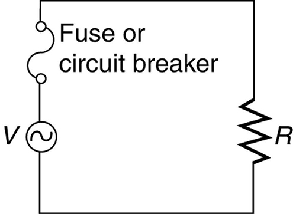

* Define thermal hazard, shock hazard, and short circuit.
* Explain what effects various levels of current have on the human body.

There are two known hazards of electricity—thermal and shock. A **thermal hazard**{: data-type="term" #import-auto-id1985911} is one where excessive electric power causes undesired thermal effects, such as starting a fire in the wall of a house. A **shock hazard**{: data-type="term" #import-auto-id1401812} occurs when electric current passes through a person. Shocks range in severity from painful, but otherwise harmless, to heart-stopping lethality. This section considers these hazards and the various factors affecting them in a quantitative manner. [Electrical Safety: Systems and Devices](/m42416) will consider systems and devices for preventing electrical hazards.

### Thermal Hazards

Electric power causes undesired heating effects whenever electric energy is converted to thermal energy at a rate faster than it can be safely dissipated. A classic example of this is the **short circuit**{: data-type="term" #import-auto-id3036602}, a low-resistance path between terminals of a voltage source. An example of a short circuit is shown in [\[link\]](#import-auto-id2670067). Insulation on wires leading to an appliance has worn through, allowing the two wires to come into contact. Such an undesired contact with a high voltage is called a *short*. Since the resistance of the short, <math xmlns="http://www.w3.org/1998/Math/MathML"><semantics><mrow><mrow><mi>r</mi></mrow><mrow /></mrow><annotation encoding="StarMath 5.0"> size 12{r} {}</annotation></semantics></math>

, is very small, the power dissipated in the short, <math xmlns="http://www.w3.org/1998/Math/MathML"><semantics><mrow><mrow><mrow><mi>P</mi><mo stretchy="false">=</mo><mrow><msup><mi>V</mi><mrow><mn>2</mn></mrow></msup><mo stretchy="false">/</mo><mi>r</mi></mrow></mrow></mrow><mrow /></mrow><annotation encoding="StarMath 5.0"> size 12{P = V rSup { size 8{2} } /r} {}</annotation></semantics></math>

, is very large. For example, if <math xmlns="http://www.w3.org/1998/Math/MathML"><semantics><mrow><mrow><mi>V</mi></mrow><mrow /></mrow><annotation encoding="StarMath 5.0"> size 12{V} {}</annotation></semantics></math>

 is 120 V and <math xmlns="http://www.w3.org/1998/Math/MathML"><semantics><mrow><mrow><mi>r</mi></mrow><mrow /></mrow><annotation encoding="StarMath 5.0"> size 12{r} {}</annotation></semantics></math>

 is <math xmlns="http://www.w3.org/1998/Math/MathML"><semantics><mrow><mrow><mrow><mn>0</mn><mtext>.</mtext><mtext>100</mtext><mspace width="0.25em" /><mo stretchy="false">Ω</mo></mrow></mrow><mrow /></mrow><annotation encoding="StarMath 5.0"> size 12{0 "." "100" %OMEGA } {}</annotation></semantics></math>

, then the power is 144 kW, *much* greater than that used by a typical household appliance. Thermal energy delivered at this rate will very quickly raise the temperature of surrounding materials, melting or perhaps igniting them.

![Part a shows an electric toaster of resistance capital R connected to an A C voltage source. The wires used to connect the toaster to the supply are worn out in one place, allowing them to come into contact with an undesired, lower resistance path, symbolized by lowercase r. Part b of the figure represents the circuit diagram for the electric connection described in part a. The voltage source is connected to two paths in parallel: the toaster with resistance capital R, and the undesired lower resistance path, symbolized by lowercase r.](../resources/Figure_21_06_01a.jpg "A short circuit is an undesired low-resistance path across a voltage source. (a) Worn insulation on the wires of a toaster allow them to come into contact with a low resistance r size 12{r} {}. Since P=V2/r size 12{P = V rSup { size 8{2} } /r} {}, thermal power is created so rapidly that the cord melts or burns. (b) A schematic of the short circuit."){: #import-auto-id2670067}

One particularly insidious aspect of a short circuit is that its resistance may actually be decreased due to the increase in temperature. This can happen if the short creates ionization. These charged atoms and molecules are free to move and, thus, lower the resistance <math xmlns="http://www.w3.org/1998/Math/MathML"><semantics><mrow><mrow><mi>r</mi></mrow><mrow /></mrow><annotation encoding="StarMath 5.0"> size 12{r} {}</annotation></semantics></math>

. Since <math xmlns="http://www.w3.org/1998/Math/MathML"><semantics><mrow><mrow><mrow><mi>P</mi><mo stretchy="false">=</mo><mrow><msup><mi>V</mi><mrow><mn>2</mn></mrow></msup><mo stretchy="false">/</mo><mi>r</mi></mrow></mrow></mrow><mrow /></mrow><annotation encoding="StarMath 5.0"> size 12{P = V rSup { size 8{2} } /r} {}</annotation></semantics></math>

, the power dissipated in the short rises, possibly causing more ionization, more power, and so on. High voltages, such as the 480-V AC used in some industrial applications, lend themselves to this hazard, because higher voltages create higher initial power production in a short.

Another serious, but less dramatic, thermal hazard occurs when wires supplying power to a user are overloaded with too great a current. As discussed in the previous section, the power dissipated in the supply wires is <math xmlns="http://www.w3.org/1998/Math/MathML"><semantics><mrow><mrow><mrow><mrow><mi>P</mi><mo stretchy="false">=</mo><msup><mi>I</mi><mrow><mn>2</mn></mrow></msup></mrow><msub><mi>R</mi><mrow><mtext>w</mtext></mrow></msub></mrow></mrow><mrow /></mrow><annotation encoding="StarMath 5.0"> size 12{P = I rSup { size 8{2} } R rSub { size 8{w} } } {}</annotation></semantics></math>

, where <math xmlns="http://www.w3.org/1998/Math/MathML"><semantics><mrow><mrow><msub><mi>R</mi><mrow><mtext>w</mtext></mrow></msub></mrow><mrow /></mrow><annotation encoding="StarMath 5.0"> size 12{R rSub { size 8{w} } } {}</annotation></semantics></math>

 is the resistance of the wires and <math xmlns="http://www.w3.org/1998/Math/MathML"><semantics><mrow><mrow><mi>I</mi></mrow><mrow /></mrow><annotation encoding="StarMath 5.0"> size 12{I} {}</annotation></semantics></math>

 the current flowing through them. If either <math xmlns="http://www.w3.org/1998/Math/MathML"><semantics><mrow><mrow><mi>I</mi></mrow><mrow /></mrow><annotation encoding="StarMath 5.0"> size 12{I} {}</annotation></semantics></math>

 or <math xmlns="http://www.w3.org/1998/Math/MathML"><semantics><mrow><mrow><msub><mi>R</mi><mrow><mtext>w</mtext></mrow></msub></mrow><mrow /></mrow><annotation encoding="StarMath 5.0"> size 12{R rSub { size 8{w} } } {}</annotation></semantics></math>

 is too large, the wires overheat. For example, a worn appliance cord (with some of its braided wires broken) may have <math xmlns="http://www.w3.org/1998/Math/MathML"><semantics><mrow><mrow><mrow><mrow><msub><mi>R</mi><mrow><mtext>w</mtext></mrow></msub><mo stretchy="false">=</mo><mn>2</mn></mrow><mtext>.</mtext><mtext>00</mtext><mspace width="0.25em" /><mo stretchy="false">Ω</mo></mrow></mrow><mrow /></mrow><annotation encoding="StarMath 5.0"> size 12{R rSub { size 8{w} } =2 "." "00"` %OMEGA } {}</annotation></semantics></math>

 rather than the <math xmlns="http://www.w3.org/1998/Math/MathML"><semantics><mrow><mrow><mrow><mn>0</mn><mtext>.</mtext><mtext>100</mtext><mspace width="0.25em" /><mo stretchy="false">Ω</mo></mrow></mrow><mrow /></mrow><annotation encoding="StarMath 5.0"> size 12{0 "." "100" %OMEGA } {}</annotation></semantics></math>

 it should be. If 10.0 A of current passes through the cord, then <math xmlns="http://www.w3.org/1998/Math/MathML"><semantics><mrow><mrow><mrow><mrow><mi>P</mi><mo stretchy="false">=</mo><msup><mi>I</mi><mrow><mn>2</mn></mrow></msup></mrow><mrow><msub><mi>R</mi><mrow><mtext>w</mtext></mrow></msub><mo stretchy="false">=</mo><mtext>200 W</mtext></mrow></mrow></mrow><mrow /></mrow><annotation encoding="StarMath 5.0"> size 12{P = I rSup { size 8{2} } R rSub { size 8{w} } ="200"`W} {}</annotation></semantics></math>

 is dissipated in the cord—much more than is safe. Similarly, if a wire with a <math xmlns="http://www.w3.org/1998/Math/MathML"><semantics><mrow><mrow><mrow><mn>0</mn><mtext>.</mtext><mrow><mtext>100</mtext><mspace width="0.25em" /><mtext>-</mtext><mspace width="0.25em" /><mo stretchy="false">Ω</mo></mrow></mrow></mrow><mrow /></mrow><annotation encoding="StarMath 5.0"> size 12{0 "." "100"- %OMEGA } {}</annotation></semantics></math>

 resistance is meant to carry a few amps, but is instead carrying 100 A, it will severely overheat. The power dissipated in the wire will in that case be <math xmlns="http://www.w3.org/1998/Math/MathML"><semantics><mrow><mrow><mrow><mrow><mi>P</mi><mo stretchy="false">=</mo><mtext>1000 W</mtext></mrow></mrow></mrow><mrow /></mrow><annotation encoding="StarMath 5.0"> size 12{P = "1000"`W} {}</annotation></semantics></math>

. Fuses and circuit breakers are used to limit excessive currents. (See [\[link\]](#import-auto-id1945437) and [\[link\]](#import-auto-id3098314).) Each device opens the circuit automatically when a sustained current exceeds safe limits.

![Part a of the figure shows an electric fuse with metal having low melting point enclosed in a case with wires leading to the circuit and voltage source. There is a viewing window in the fuse casing. Part b shows a circuit breaker. There is a movable metal strip at one end from which a connector to the circuit is attached at a fixed contact point. There is a compressed spring and switch gear attached adjacent to each other at the other end of the movable metal strip. The movable metallic strip has a bimetallic strip attached perpendicular to it at its center. At the opposite end of the bimetallic strip, there is a connector to the voltage source.](../resources/Figure_21_06_02a.jpg "(a) A fuse has a metal strip with a low melting point that, when overheated by an excessive current, permanently breaks the connection of a circuit to a voltage source. (b) A circuit breaker is an automatic but restorable electric switch. The one shown here has a bimetallic strip that bends to the right and into the notch if overheated. The spring then forces the metal strip downward, breaking the electrical connection at the points."){: #import-auto-id1945437}

{: #import-auto-id3098314}

Fuses and circuit breakers for typical household voltages and currents are relatively simple to produce, but those for large voltages and currents experience special problems. For example, when a circuit breaker tries to interrupt the flow of high-voltage electricity, a spark can jump across its points that ionizes the air in the gap and allows the current to continue flowing. Large circuit breakers found in power-distribution systems employ insulating gas and even use jets of gas to blow out such sparks. Here AC is safer than DC, since AC current goes through zero 120 times per second, giving a quick opportunity to extinguish these arcs.

### Shock Hazards

Electrical currents through people produce tremendously varied effects. An electrical current can be used to block back pain. The possibility of using electrical current to stimulate muscle action in paralyzed limbs, perhaps allowing paraplegics to walk, is under study. TV dramatizations in which electrical shocks are used to bring a heart attack victim out of ventricular fibrillation (a massively irregular, often fatal, beating of the heart) are more than common. Yet most electrical shock fatalities occur because a current put the heart into fibrillation. A pacemaker uses electrical shocks to stimulate the heart to beat properly. Some fatal shocks do not produce burns, but warts can be safely burned off with electric current (though freezing using liquid nitrogen is now more common). Of course, there are consistent explanations for these disparate effects. The major factors upon which the effects of electrical shock depend are

1.  {: #import-auto-id3028954} The amount of current
    <math xmlns="http://www.w3.org/1998/Math/MathML"><semantics><mrow><mrow><mi>I</mi></mrow><mrow /></mrow><annotation encoding="StarMath 5.0"> size 12{I} {}</annotation></semantics></math>

2.  {: #import-auto-id3209453} The path taken by the current
3.  {: #import-auto-id1848789} The duration of the shock
4.  {: #import-auto-id3424657} The frequency
    <math xmlns="http://www.w3.org/1998/Math/MathML"><semantics><mrow><mrow><mi>f</mi></mrow><mrow /></mrow><annotation encoding="StarMath 5.0"> size 12{f} {}</annotation></semantics></math>
    
    of the current (*<math xmlns="http://www.w3.org/1998/Math/MathML"><semantics><mrow><mrow><mrow><mi>f</mi><mo stretchy="false">=</mo><mn>0</mn></mrow></mrow><mrow /></mrow><annotation encoding="StarMath 5.0"> size 12{f=0} {}</annotation></semantics></math>
    
    * for DC)
{: data-number-style="arabic"}

[\[link\]](#import-auto-id3063438) gives the effects of electrical shocks as a function of current for a typical accidental shock. The effects are for a shock that passes through the trunk of the body, has a duration of 1 s, and is caused by 60-Hz power.

  The victim is &#x201C;thrown&#x201D; backward by involuntary muscle contractions that extend the legs and torso. (b) The victim can&#x2019;t let go of the wire that is stimulating all the muscles in the hand. Those that close the fingers are stronger than those that open them."){: #import-auto-id1431810}

<table id="import-auto-id3063438" summary="The table shows how different amounts of current produce different effects on the human body. The left column shows various magnitudes of current in milliamperes, and the right column shows its effects on body."><caption>Effects of Electrical Shock as a Function of Current<a data-type="footnote-link" href="#footnote1">1</a></caption><thead><tr>
            <th>Current (mA)</th>
            <th>Effect</th>
          </tr></thead><tbody><tr>
            <td>1</td>
            <td>Threshold of sensation</td>
          </tr><tr>
            <td>5</td>
            <td>Maximum harmless current</td>
          </tr><tr>
            <td>10–20</td>
            <td>Onset of sustained muscular contraction; cannot let go for duration of shock; contraction of chest muscles may stop breathing during shock</td>
          </tr><tr>
            <td>50</td>
            <td>Onset of pain</td>
          </tr><tr>
            <td>100–300+</td>
            <td>Ventricular fibrillation possible; often fatal</td>
          </tr><tr>
            <td>300</td>
            <td>Onset of burns depending on concentration of current</td>
          </tr><tr>
            <td>6000 (6 A)</td>
            <td>Onset of sustained ventricular contraction and respiratory paralysis; both cease when shock ends; heartbeat may return to normal; used to defibrillate the heart</td>
          </tr></tbody></table>

Our bodies are relatively good conductors due to the water in our bodies. Given that larger currents will flow through sections with lower resistance (to be further discussed in the next chapter), electric currents preferentially flow through paths in the human body that have a minimum resistance in a direct path to earth. The earth is a natural electron sink. Wearing insulating shoes, a requirement in many professions, prohibits a pathway for electrons by providing a large resistance in that path. Whenever working with high-power tools (drills), or in risky situations, ensure that you do not provide a pathway for current flow (especially through the heart).

Very small currents pass harmlessly and unfelt through the body. This happens to you regularly without your knowledge. The threshold of sensation is only 1 mA and, although unpleasant, shocks are apparently harmless for currents less than 5 mA. A great number of safety rules take the 5-mA value for the maximum allowed shock. At 10 to 20 mA and above, the current can stimulate sustained muscular contractions much as regular nerve impulses do. People sometimes say they were knocked across the room by a shock, but what really happened was that certain muscles contracted, propelling them in a manner not of their own choosing. (See [\[link\]](#import-auto-id1431810)(a).) More frightening, and potentially more dangerous, is the “can’t let go” effect illustrated in [\[link\]](#import-auto-id1431810)(b). The muscles that close the fingers are stronger than those that open them, so the hand closes involuntarily on the wire shocking it. This can prolong the shock indefinitely. It can also be a danger to a person trying to rescue the victim, because the rescuer’s hand may close about the victim’s wrist. Usually the best way to help the victim is to give the fist a hard knock/blow/jar with an insulator or to throw an insulator at the fist. Modern electric fences, used in animal enclosures, are now pulsed on and off to allow people who touch them to get free, rendering them less lethal than in the past.

Greater currents may affect the heart. Its electrical patterns can be disrupted, so that it beats irregularly and ineffectively in a condition called “ventricular fibrillation.” This condition often lingers after the shock and is fatal due to a lack of blood circulation. The threshold for ventricular fibrillation is between 100 and 300 mA. At about 300 mA and above, the shock can cause burns, depending on the concentration of current—the more concentrated, the greater the likelihood of burns.

Very large currents cause the heart and diaphragm to contract for the duration of the shock. Both the heart and breathing stop. Interestingly, both often return to normal following the shock. The electrical patterns on the heart are completely erased in a manner that the heart can start afresh with normal beating, as opposed to the permanent disruption caused by smaller currents that can put the heart into ventricular fibrillation. The latter is something like scribbling on a blackboard, whereas the former completely erases it. TV dramatizations of electric shock used to bring a heart attack victim out of ventricular fibrillation also show large paddles. These are used to spread out current passed through the victim to reduce the likelihood of burns.

Current is the major factor determining shock severity (given that other conditions such as path, duration, and frequency are fixed, such as in the table and preceding discussion). A larger voltage is more hazardous, but since <math xmlns="http://www.w3.org/1998/Math/MathML"><semantics><mrow><mrow><mrow><mi>I</mi><mo stretchy="false">=</mo><mstyle fontstyle="italic"><mrow><mtext>V/R</mtext></mrow></mstyle></mrow></mrow><mrow /></mrow><annotation encoding="StarMath 5.0"> size 12{I = ital "V/R"} {}</annotation></semantics></math>

, the severity of the shock depends on the combination of voltage and resistance. For example, a person with dry skin has a resistance of about <math xmlns="http://www.w3.org/1998/Math/MathML"><semantics><mrow><mrow><mrow><mtext>200</mtext><mspace width="0.25em" /><mtext> k</mtext><mo stretchy="false">Ω</mo></mrow></mrow><mrow /></mrow><annotation encoding="StarMath 5.0"> size 12{"200"" k" %OMEGA } {}</annotation></semantics></math>

. If he comes into contact with 120-V AC, a current <math xmlns="http://www.w3.org/1998/Math/MathML"><semantics><mrow><mrow><mrow><mrow><mi>I</mi><mo stretchy="false">=</mo><mo stretchy="false">(</mo></mrow><mtext>120 V</mtext><mrow><mo stretchy="false">)</mo><mo stretchy="false">/</mo><mo stretchy="false">(</mo></mrow><mtext>200 k </mtext><mo stretchy="false">Ω</mo><mo stretchy="false">)</mo><mtext> = 0</mtext><mtext>.</mtext><mtext>6 mA </mtext></mrow></mrow><mrow /></mrow><annotation encoding="StarMath 5.0"> size 12{I = \( "120 V" \) / \( "200 k " %OMEGA \) " = 0" "." "6 mA "} {}</annotation></semantics></math>

 passes harmlessly through him. The same person soaking wet may have a resistance of <math xmlns="http://www.w3.org/1998/Math/MathML"><semantics><mrow><mrow><mrow><mtext>10</mtext><mtext>.</mtext><mn>0</mn><mspace width="0.25em" /><mtext> k</mtext><mo stretchy="false">Ω</mo></mrow></mrow><mrow /></mrow><annotation encoding="StarMath 5.0"> size 12{"10" "." 0" k" %OMEGA } {}</annotation></semantics></math>

 and the same 120 V will produce a current of 12 mA—above the “can’t let go” threshold and potentially dangerous.

Most of the body’s resistance is in its dry skin. When wet, salts go into ion form, lowering the resistance significantly. The interior of the body has a much lower resistance than dry skin because of all the ionic solutions and fluids it contains. If skin resistance is bypassed, such as by an intravenous infusion, a catheter, or exposed pacemaker leads, a person is rendered **microshock sensitive**{: data-type="term" #import-auto-id2688655}. In this condition, currents about 1/1000 those listed in [\[link\]](#import-auto-id3063438) produce similar effects. During open-heart surgery, currents as small as <math xmlns="http://www.w3.org/1998/Math/MathML"><semantics><mrow><mrow><mrow><mtext mathvariant="normal">20 μA</mtext></mrow></mrow><mrow /></mrow><annotation encoding="StarMath 5.0"> size 12{"20" μ"A"} {}</annotation></semantics></math>

 can be used to still the heart. Stringent electrical safety requirements in hospitals, particularly in surgery and intensive care, are related to the doubly disadvantaged microshock-sensitive patient. The break in the skin has reduced his resistance, and so the same voltage causes a greater current, and a much smaller current has a greater effect.

![The graph of average values for the threshold of sensation and the Can&#x2019;t let go current as a function of frequency, with current in milliamperes verses frequency in hertz. The current is plotted along the vertical axis and frequency along the horizontal axis. The plot has two curves. The curve for Can&#x2019;t let go current starts off at a value nearly eighteen milliamps on the vertical axis. The curve is smooth and dips until frequency equals about one hundred hertz and then rises for values of frequency above one hundred hertz. The curve for Threshold of sensation current starts off at a value nearly four milliamps on the vertical axis. The curve is smooth and dips until frequency equals about one hundred hertz and then rises for values of frequency above one hundred hertz. The maximum value of current reached for this curve is nearly equal to the initial value for the Can&#x2019;t let go current curve. The Threshold of sensation curve lies below the curve for Can&#x2019;t let go current.](../resources/Figure_21_06_05a.jpg "Graph of average values for the threshold of sensation and the &#x201C;can&#x2019;t let go&#x201D; current as a function of frequency. The lower the value, the more sensitive the body is at that frequency."){: #import-auto-id3190768}

Factors other than current that affect the severity of a shock are its path, duration, and AC frequency. Path has obvious consequences. For example, the heart is unaffected by an electric shock through the brain, such as may be used to treat manic depression. And it is a general truth that the longer the duration of a shock, the greater its effects. [\[link\]](#import-auto-id3190768) presents a graph that illustrates the effects of frequency on a shock. The curves show the minimum current for two different effects, as a function of frequency. The lower the current needed, the more sensitive the body is at that frequency. Ironically, the body is most sensitive to frequencies near the 50- or 60-Hz frequencies in common use. The body is slightly less sensitive for DC (<math xmlns="http://www.w3.org/1998/Math/MathML"><semantics><mrow><mrow><mrow><mi>f</mi><mo stretchy="false">=</mo><mn>0</mn></mrow></mrow><mrow /></mrow><annotation encoding="StarMath 5.0"> size 12{f=0} {}</annotation></semantics></math>

), mildly confirming Edison’s claims that AC presents a greater hazard. At higher and higher frequencies, the body becomes progressively less sensitive to any effects that involve nerves. This is related to the maximum rates at which nerves can fire or be stimulated. At very high frequencies, electrical current travels only on the surface of a person. Thus a wart can be burned off with very high frequency current without causing the heart to stop. (Do not try this at home with 60-Hz AC!) Some of the spectacular demonstrations of electricity, in which high-voltage arcs are passed through the air and over people’s bodies, employ high frequencies and low currents. (See [\[link\]](#import-auto-id3163065).) Electrical safety devices and techniques are discussed in detail in [Electrical Safety: Systems and Devices](/m42416).

"){: #import-auto-id3163065}

### Section Summary

* {: #import-auto-id1368860} The two types of electric hazards are thermal (excessive power) and shock (current through a person).
* {: #import-auto-id2394106} Shock severity is determined by current, path, duration, and AC frequency.
* {: #import-auto-id2016339} [\[link\]](#import-auto-id3063438) lists shock hazards as a function of current.
* {: #import-auto-id3192020} [\[link\]](#import-auto-id3190768) graphs the threshold current for two hazards as a function of frequency.

### Conceptual Questions

Using an ohmmeter, a student measures the resistance between various points on his body. He finds that the resistance between two points on the same finger is about the same as the resistance between two points on opposite hands—both are several hundred thousand ohms. Furthermore, the resistance decreases when more skin is brought into contact with the probes of the ohmmeter. Finally, there is a dramatic drop in resistance (to a few thousand ohms) when the skin is wet. Explain these observations and their implications regarding skin and internal resistance of the human body.

What are the two major hazards of electricity?

Why isn’t a short circuit a shock hazard?

What determines the severity of a shock? Can you say that a certain voltage is hazardous without further information?

An electrified needle is used to burn off warts, with the circuit being completed by having the patient sit on a large butt plate. Why is this plate large?

Some surgery is performed with high-voltage electricity passing from a metal scalpel through the tissue being cut. Considering the nature of electric fields at the surface of conductors, why would you expect most of the current to flow from the sharp edge of the scalpel? Do you think high- or low-frequency AC is used?

Some devices often used in bathrooms, such as hairdryers, often have safety messages saying “Do not use when the bathtub or basin is full of water.” Why is this so?

We are often advised to not flick electric switches with wet hands, dry your hand first. We are also advised to never throw water on an electric fire. Why is this so?

Before working on a power transmission line, linemen will touch the line with the back of the hand as a final check that the voltage is zero. Why the back of the hand?

Why is the resistance of wet skin so much smaller than dry, and why do blood and other bodily fluids have low resistances?

Could a person on intravenous infusion (an IV) be microshock sensitive?

In view of the small currents that cause shock hazards and the larger currents that circuit breakers and fuses interrupt, how do they play a role in preventing shock hazards?

### Problem Exercises

(a) How much power is dissipated in a short circuit of 240-V AC through a resistance of <math xmlns="http://www.w3.org/1998/Math/MathML"><semantics><mrow><mrow><mrow><mn>0</mn><mtext>.</mtext><mtext>250</mtext><mspace width="0.25em" /><mo stretchy="false">Ω</mo></mrow></mrow><mrow /></mrow><annotation encoding="StarMath 5.0"> size 12{0 "." "250" %OMEGA } {}</annotation></semantics></math>

? (b) What current flows?

(a) 230 kW

(b) 960 A

What voltage is involved in a 1.44-kW short circuit through a <math xmlns="http://www.w3.org/1998/Math/MathML"><semantics><mrow><mrow><mrow><mn>0</mn><mtext>.</mtext><mrow><mtext>100</mtext><mspace width="0.25em" /><mtext>-</mtext><mspace width="0.25em" /><mo stretchy="false">Ω</mo></mrow></mrow></mrow><mrow /></mrow><annotation encoding="StarMath 5.0"> size 12{0 "." "100""-" %OMEGA } {}</annotation></semantics></math>

 resistance?

Find the current through a person and identify the likely effect on her if she touches a 120-V AC source: (a) if she is standing on a rubber mat and offers a total resistance of <math xmlns="http://www.w3.org/1998/Math/MathML"><semantics><mrow><mrow><mrow><mtext>300 k</mtext><mo stretchy="false">Ω</mo></mrow></mrow><mrow /></mrow><annotation encoding="StarMath 5.0"> size 12{"300"" k" %OMEGA } {}</annotation></semantics></math>

; (b) if she is standing barefoot on wet grass and has a resistance of only <math xmlns="http://www.w3.org/1998/Math/MathML"><semantics><mrow><mrow><mrow><mtext>4000 k</mtext><mo stretchy="false">Ω</mo></mrow></mrow><mrow /></mrow><annotation encoding="StarMath 5.0"> size 12{"4000"" k" %OMEGA } {}</annotation></semantics></math>

.

(a) 0.400 mA, no effect

(b) 26.7 mA, muscular contraction for duration of the shock (can't let go)

While taking a bath, a person touches the metal case of a radio. The path through the person to the drainpipe and ground has a resistance of <math xmlns="http://www.w3.org/1998/Math/MathML"><semantics><mrow><mrow><mrow><mtext>4000</mtext><mspace width="0.25em" /><mo stretchy="false">Ω</mo></mrow></mrow><mrow /></mrow><annotation encoding="StarMath 5.0"> size 12{"4000" %OMEGA } {}</annotation></semantics></math>

. What is the smallest voltage on the case of the radio that could cause ventricular fibrillation?

Foolishly trying to fish a burning piece of bread from a toaster with a metal butter knife, a man comes into contact with 120-V AC. He does not even feel it since, luckily, he is wearing rubber-soled shoes. What is the minimum resistance of the path the current follows through the person?

<math xmlns="http://www.w3.org/1998/Math/MathML"> <semantics> <mrow> <mrow> <mrow> <mn>1</mn> <mtext>.</mtext> <mtext>20</mtext> <mi>×</mi> <msup> <mtext>10</mtext> <mrow> <mn>5</mn> </mrow> </msup><mspace width="0.25em" /> <mo stretchy="false">Ω</mo> </mrow> </mrow> <mrow /> </mrow> <annotation encoding="StarMath 5.0"> size 12{1 "." "20"´"10" rSup { size 8{5} } %OMEGA } {}</annotation> </semantics> </math>

(a) During surgery, a current as small as <math xmlns="http://www.w3.org/1998/Math/MathML"><semantics><mrow><mrow><mrow><mtext mathvariant="normal">20.0 μA</mtext></mrow></mrow><mrow /></mrow><annotation encoding="StarMath 5.0"> size 12{"20" "." 0 μ"A"} {}</annotation></semantics></math>

 applied directly to the heart may cause ventricular fibrillation. If the resistance of the exposed heart is <math xmlns="http://www.w3.org/1998/Math/MathML"><semantics><mrow><mrow><mrow><mtext>300</mtext><mspace width="0.25em" /><mo stretchy="false">Ω</mo></mrow></mrow><mrow /></mrow><annotation encoding="StarMath 5.0"> size 12{"300" %OMEGA } {}</annotation></semantics></math>

, what is the smallest voltage that poses this danger? (b) Does your answer imply that special electrical safety precautions are needed?

(a) What is the resistance of a 220-V AC short circuit that generates a peak power of 96.8 kW? (b) What would the average power be if the voltage was 120 V AC?

(a) <math xmlns="http://www.w3.org/1998/Math/MathML"><semantics><mrow><mrow><mrow><mn>1</mn><mtext>.</mtext><mtext>00</mtext><mspace width="0.25em" /><mo stretchy="false">Ω</mo></mrow></mrow><mrow /></mrow><annotation encoding="StarMath 5.0"> size 12{1 "." "00" %OMEGA } {}</annotation></semantics></math>

(b) 14.4 kW

A heart defibrillator passes 10.0 A through a patient’s torso for 5.00 ms in an attempt to restore normal beating. (a) How much charge passed? (b) What voltage was applied if 500 J of energy was dissipated? (c) What was the path’s resistance? (d) Find the temperature increase caused in the 8.00 kg of affected tissue.

**Integrated Concepts**

A short circuit in a 120-V appliance cord has a <math xmlns="http://www.w3.org/1998/Math/MathML"><semantics><mrow><mrow><mrow><mn>0</mn><mtext>.</mtext><mrow><mtext>500</mtext><mtext>-</mtext><mo stretchy="false">Ω</mo></mrow></mrow></mrow><mrow /></mrow><annotation encoding="StarMath 5.0"> size 12{0 "." "500""-" %OMEGA } {}</annotation></semantics></math>

 resistance. Calculate the temperature rise of the 2.00 g of surrounding materials, assuming their specific heat capacity is <math xmlns="http://www.w3.org/1998/Math/MathML"><semantics><mrow><mrow><mrow><mn>0.200</mn><mrow><mspace width="0.25em" /> <mtext> cal/g</mtext><mo stretchy="false">⋅º</mo></mrow><mtext>C</mtext></mrow></mrow><mrow /></mrow><annotation encoding="StarMath 5.0"> size 12{0 "." "200"" cal/g" cdot °C} {}</annotation></semantics></math>

 and that it takes 0.0500 s for a circuit breaker to interrupt the current. Is this likely to be damaging?

Temperature increases <math xmlns="http://www.w3.org/1998/Math/MathML"><semantics><mrow><mrow><mrow><mtext>860º C</mtext></mrow></mrow><mrow /></mrow><annotation encoding="StarMath 5.0"> size 12{"860"°C} {}</annotation></semantics></math>

. It is very likely to be damaging.

**Construct Your Own Problem**

Consider a person working in an environment where electric currents might pass through her body. Construct a problem in which you calculate the resistance of insulation needed to protect the person from harm. Among the things to be considered are the voltage to which the person might be exposed, likely body resistance (dry, wet, …), and acceptable currents (safe but sensed, safe and unfelt, …).

### Footnotes
{: data-type="footnote-refs-title"}

* {: data-type="footnote-ref" #footnote1} [1](#footnote-ref1){: data-type="footnote-ref-link"} For an average male shocked through trunk of body for 1 s by 60-Hz AC. Values for females are 60–80% of those listed.
{: data-list-type="bulleted" data-bullet-style="none"}

### Glossary
{: data-type="glossary-title"}

thermal hazard
: a hazard in which electric current causes undesired thermal effects
{: #import-auto-id937261}

shock hazard
: when electric current passes through a person
{: #import-auto-id3353450}

short circuit
: also known as a “short,” a low-resistance path between terminals of a voltage source
{: #import-auto-id2055777}

microshock sensitive
: a condition in which a person’s skin resistance is bypassed, possibly by a medical procedure, rendering the person vulnerable to electrical shock at currents about 1/1000 the normally required level
{: #import-auto-id1908263}

