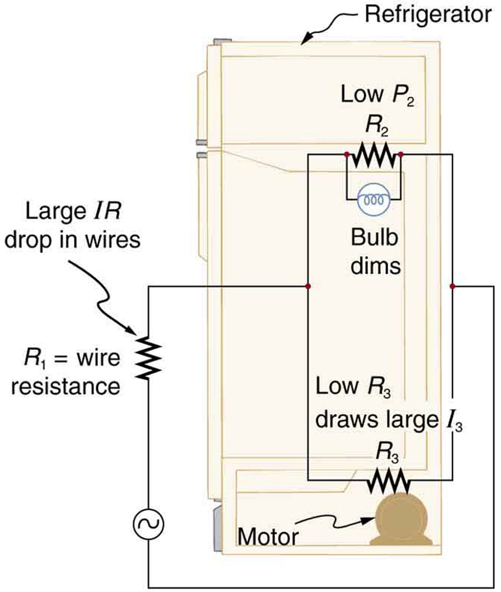

* Draw a circuit with resistors in parallel and in series.
* Calculate the voltage drop of a current across a resistor using Ohm’s law.
* Contrast the way total resistance is calculated for resistors in series and in parallel.
* Explain why total resistance of a parallel circuit is less than the smallest resistance of any of the resistors in that circuit.
* Calculate total resistance of a circuit that contains a mixture of resistors connected in series and in parallel.

Most circuits have more than one component, called a **resistor**{: data-type="term"} that limits the flow of charge in the circuit. A measure of this limit on charge flow is called **resistance**{: data-type="term"}. The simplest combinations of resistors are the series and parallel connections illustrated in [\[link\]](#import-auto-id2989840). The total resistance of a combination of resistors depends on both their individual values and how they are connected.

 A series connection of resistors. (b) A parallel connection of resistors."){: #import-auto-id2989840 data-media-type="image/jpg"}

# Resistors in Series

When are resistors in **series**{: data-type="term" #import-auto-id2680205}? Resistors are in series whenever the flow of charge, called the **current**{: data-type="term" #import-auto-id2006019}, must flow through devices sequentially. For example, if current flows through a person holding a screwdriver and into the Earth, then <math xmlns="http://www.w3.org/1998/Math/MathML"><semantics><mrow><mrow><msub><mi>R</mi><mrow><mn>1</mn></mrow></msub></mrow><mrow /></mrow><annotation encoding="StarMath 5.0"> size 12{R rSub { size 8{1} } } {}</annotation></semantics></math>

 in [\[link\]](#import-auto-id2989840)(a) could be the resistance of the screwdriver’s shaft, <math xmlns="http://www.w3.org/1998/Math/MathML"><semantics><mrow><mrow><msub><mi>R</mi><mrow><mn>2</mn></mrow></msub></mrow><mrow /></mrow><annotation encoding="StarMath 5.0"> size 12{R rSub { size 8{2} } } {}</annotation></semantics></math>

 the resistance of its handle, <math xmlns="http://www.w3.org/1998/Math/MathML"><semantics><mrow><mrow><msub><mi>R</mi><mrow><mn>3</mn></mrow></msub></mrow><mrow /></mrow><annotation encoding="StarMath 5.0"> size 12{R rSub { size 8{3} } } {}</annotation></semantics></math>

 the person’s body resistance, and <math xmlns="http://www.w3.org/1998/Math/MathML"><semantics><mrow><mrow><msub><mi>R</mi><mrow><mn>4</mn></mrow></msub></mrow><mrow /></mrow><annotation encoding="StarMath 5.0"> size 12{R rSub { size 8{4} } } {}</annotation></semantics></math>

 the resistance of her shoes.

[\[link\]](#import-auto-id3043995) shows resistors in series connected to a **voltage**{: data-type="term" #import-auto-id2612966} source. It seems reasonable that the total resistance is the sum of the individual resistances, considering that the current has to pass through each resistor in sequence. (This fact would be an advantage to a person wishing to avoid an electrical shock, who could reduce the current by wearing high-resistance rubber-soled shoes. It could be a disadvantage if one of the resistances were a faulty high-resistance cord to an appliance that would reduce the operating current.)

  and the equivalent single or series resistance (right)."){: #import-auto-id3043995 data-media-type="image/jpg"}

To verify that resistances in series do indeed add, let us consider the loss of electrical power, called a **voltage drop**{: data-type="term" #import-auto-id1404820}, in each resistor in [\[link\]](#import-auto-id3043995).

According to **Ohm’s law**{: data-type="term" #import-auto-id2075129}, the voltage drop, <math xmlns="http://www.w3.org/1998/Math/MathML"><semantics><mrow><mrow><mi>V</mi></mrow><mrow /></mrow><annotation encoding="StarMath 5.0"> size 12{V} {}</annotation></semantics></math>

, across a resistor when a current flows through it is calculated using the equation <math xmlns="http://www.w3.org/1998/Math/MathML"><semantics><mrow><mrow><mrow><mi>V</mi><mo stretchy="false">=</mo><mstyle fontstyle="italic"><mrow><mtext>IR</mtext></mrow></mstyle></mrow></mrow><mrow /></mrow><annotation encoding="StarMath 5.0"> size 12{V= ital "IR"} {}</annotation></semantics></math>

, where <math xmlns="http://www.w3.org/1998/Math/MathML"><semantics><mrow><mrow><mi>I</mi></mrow><mrow /></mrow><annotation encoding="StarMath 5.0"> size 12{I} {}</annotation></semantics></math>

 equals the current in amps (A) and <math xmlns="http://www.w3.org/1998/Math/MathML"><semantics><mrow><mrow><mi>R</mi></mrow><mrow /></mrow><annotation encoding="StarMath 5.0"> size 12{R} {}</annotation></semantics></math>

 is the resistance in ohms <math xmlns="http://www.w3.org/1998/Math/MathML"><semantics><mrow><mrow><mfenced open="(" close=")"><mo stretchy="false">Ω</mo></mfenced></mrow><mrow /></mrow><annotation encoding="StarMath 5.0"> size 12{ left ( %OMEGA right )} {}</annotation></semantics></math>

. Another way to think of this is that <math xmlns="http://www.w3.org/1998/Math/MathML"><semantics><mrow><mrow><mi>V</mi></mrow><mrow /></mrow><annotation encoding="StarMath 5.0"> size 12{V} {}</annotation></semantics></math>

 is the voltage necessary to make a current <math xmlns="http://www.w3.org/1998/Math/MathML"><semantics><mrow><mrow><mi>I</mi></mrow><mrow /></mrow><annotation encoding="StarMath 5.0"> size 12{I} {}</annotation></semantics></math>

 flow through a resistance <math xmlns="http://www.w3.org/1998/Math/MathML"><semantics><mrow><mrow><mi>R</mi></mrow><mrow /></mrow><annotation encoding="StarMath 5.0"> size 12{R} {}</annotation></semantics></math>

.

So the voltage drop across <math xmlns="http://www.w3.org/1998/Math/MathML"><semantics><mrow><mrow><msub><mi>R</mi><mrow><mn>1</mn></mrow></msub></mrow><mrow /></mrow><annotation encoding="StarMath 5.0"> size 12{R rSub { size 8{1} } } {}</annotation></semantics></math>

 is <math xmlns="http://www.w3.org/1998/Math/MathML"><semantics><mrow><mrow><mrow><msub><mi>V</mi><mrow><mn>1</mn></mrow></msub><mo stretchy="false">=</mo><mrow><msub><mi mathvariant="italic">IR</mi><mrow><mn>1</mn></mrow></msub></mrow></mrow></mrow><mrow /></mrow><annotation encoding="StarMath 5.0"> size 12{V rSub { size 8{1} } = ital "IR" rSub { size 8{1} } } {}</annotation></semantics></math>

, that across <math xmlns="http://www.w3.org/1998/Math/MathML"><semantics><mrow><mrow><msub><mi>R</mi><mrow><mn>2</mn></mrow></msub></mrow><mrow /></mrow><annotation encoding="StarMath 5.0"> size 12{R rSub { size 8{2} } } {}</annotation></semantics></math>

 is <math xmlns="http://www.w3.org/1998/Math/MathML"><semantics><mrow><mrow><mrow><msub><mi>V</mi><mrow><mn>2</mn></mrow></msub><mo stretchy="false">=</mo><mrow><msub><mi mathvariant="italic">IR</mi><mrow><mn>2</mn></mrow></msub></mrow></mrow></mrow><mrow /></mrow><annotation encoding="StarMath 5.0"> size 12{V rSub { size 8{2} } = ital "IR" rSub { size 8{2} } } {}</annotation></semantics></math>

, and that across <math xmlns="http://www.w3.org/1998/Math/MathML"><semantics><mrow><mrow><msub><mi>R</mi><mrow><mn>3</mn></mrow></msub></mrow><mrow /></mrow><annotation encoding="StarMath 5.0"> size 12{R rSub { size 8{3} } } {}</annotation></semantics></math>

 is <math xmlns="http://www.w3.org/1998/Math/MathML"><semantics><mrow><mrow><mrow><msub><mi>V</mi><mrow><mn>3</mn></mrow></msub><mo stretchy="false">=</mo><mrow><msub><mi mathvariant="italic">IR</mi><mrow><mn>3</mn></mrow></msub></mrow></mrow></mrow><mrow /></mrow><annotation encoding="StarMath 5.0"> size 12{V rSub { size 8{3} } = ital "IR" rSub { size 8{3} } } {}</annotation></semantics></math>

. The sum of these voltages equals the voltage output of the source; that is,

<math xmlns="http://www.w3.org/1998/Math/MathML"><semantics><mrow><mrow><mrow><mi>V</mi><mo stretchy="false">=</mo><mrow><mrow><msub><mi>V</mi><mrow><mn>1</mn></mrow></msub><mo stretchy="false">+</mo><msub><mi>V</mi><mrow><mn>2</mn></mrow></msub></mrow><mo stretchy="false">+</mo><msub><mi>V</mi><mrow><mn>3</mn></mrow></msub></mrow></mrow></mrow><mrow /><mo>.</mo></mrow><annotation encoding="StarMath 5.0"> size 12{V=V rSub { size 8{1} } +V rSub { size 8{2} } +V rSub { size 8{3} } } {}</annotation></semantics></math>

This equation is based on the conservation of energy and conservation of charge. Electrical potential energy can be described by the equation <math xmlns="http://www.w3.org/1998/Math/MathML"><semantics><mrow><mrow><mrow><mstyle fontstyle="italic"><mrow><mtext>PE</mtext></mrow></mstyle><mo stretchy="false">=</mo><mstyle fontstyle="italic"><mrow><mtext>qV</mtext></mrow></mstyle></mrow></mrow><mrow /></mrow><annotation encoding="StarMath 5.0"> size 12{ ital "PE"= ital "qV"} {}</annotation></semantics></math>

, where <math xmlns="http://www.w3.org/1998/Math/MathML"><semantics><mrow><mrow><mi>q</mi></mrow><mrow /></mrow><annotation encoding="StarMath 5.0"> size 12{q} {}</annotation></semantics></math>

 is the electric charge and <math xmlns="http://www.w3.org/1998/Math/MathML"><semantics><mrow><mrow><mi>V</mi></mrow><mrow /></mrow><annotation encoding="StarMath 5.0"> size 12{V} {}</annotation></semantics></math>

 is the voltage. Thus the energy supplied by the source is <math xmlns="http://www.w3.org/1998/Math/MathML"><semantics><mrow><mrow><mstyle fontstyle="italic"><mrow><mtext>qV</mtext></mrow></mstyle></mrow><mrow /></mrow><annotation encoding="StarMath 5.0"> size 12{ ital "qV"} {}</annotation></semantics></math>

, while that dissipated by the resistors is

<math xmlns="http://www.w3.org/1998/Math/MathML"><semantics><mrow><mrow><mrow><mrow><mrow><msub><mtext fontstyle="italic">qV</mtext><mrow><mn>1</mn></mrow></msub></mrow><mo stretchy="false">+</mo><mrow><msub><mtext fontstyle="italic">qV</mtext><mrow><mn>2</mn></mrow></msub></mrow></mrow><mo stretchy="false">+</mo><mrow><msub><mtext fontstyle="italic">qV</mtext><mrow><mn>3</mn></mrow></msub></mrow></mrow></mrow><mrow /><mo>.</mo></mrow><annotation encoding="StarMath 5.0"> size 12{ ital "qV" rSub { size 8{1} } + ital "qV" rSub { size 8{2} } + ital "qV" rSub { size 8{3} } } {}</annotation></semantics></math>

Connections: Conservation Laws

The derivations of the expressions for series and parallel resistance are based on the laws of conservation of energy and conservation of charge, which state that total charge and total energy are constant in any process. These two laws are directly involved in all electrical phenomena and will be invoked repeatedly to explain both specific effects and the general behavior of electricity.

These energies must be equal, because there is no other source and no other destination for energy in the circuit. Thus, <math xmlns="http://www.w3.org/1998/Math/MathML"><semantics><mrow><mrow><mrow><mrow><mi mathvariant="italic">qV</mi></mrow><mo stretchy="false">=</mo><mrow><mrow><mrow><msub><mi mathvariant="italic">qV</mi><mrow><mn>1</mn></mrow></msub></mrow><mo stretchy="false">+</mo><mrow><msub><mi mathvariant="italic">qV</mi><mrow><mn>2</mn></mrow></msub></mrow></mrow><mo stretchy="false">+</mo><mrow><msub><mi mathvariant="italic">qV</mi><mrow><mn>3</mn></mrow></msub></mrow></mrow></mrow></mrow><mrow /></mrow><annotation encoding="StarMath 5.0"> size 12{ ital "qV"= ital "qV" rSub { size 8{1} } + ital "qV" rSub { size 8{2} } + ital "qV" rSub { size 8{3} } } {}</annotation></semantics></math>

. The charge <math xmlns="http://www.w3.org/1998/Math/MathML"><semantics><mrow><mrow><mi>q</mi></mrow><mrow /></mrow><annotation encoding="StarMath 5.0"> size 12{q} {}</annotation></semantics></math>

 cancels, yielding <math xmlns="http://www.w3.org/1998/Math/MathML"><semantics><mrow><mrow><mrow><mi>V</mi><mo stretchy="false">=</mo><mrow><mrow><msub><mi>V</mi><mrow><mn>1</mn></mrow></msub><mo stretchy="false">+</mo><msub><mi>V</mi><mrow><mn>2</mn></mrow></msub></mrow><mo stretchy="false">+</mo><msub><mi>V</mi><mrow><mn>3</mn></mrow></msub></mrow></mrow></mrow><mrow /></mrow><annotation encoding="StarMath 5.0"> size 12{V=V rSub { size 8{1} } +V rSub { size 8{2} } +V rSub { size 8{3} } } {}</annotation></semantics></math>

, as stated. (Note that the same amount of charge passes through the battery and each resistor in a given amount of time, since there is no capacitance to store charge, there is no place for charge to leak, and charge is conserved.)

Now substituting the values for the individual voltages gives

<math xmlns="http://www.w3.org/1998/Math/MathML"><semantics><mrow><mrow><mrow><mrow><mrow><mi>V</mi><mo stretchy="false">=</mo><mrow><mrow><mrow><msub><mtext fontstyle="italic">IR</mtext><mrow><mn>1</mn></mrow></msub></mrow><mo stretchy="false">+</mo><mrow><msub><mtext fontstyle="italic">IR</mtext><mrow><mn>2</mn></mrow></msub></mrow> </mrow><mo stretchy="false">+</mo><mrow><msub><mtext fontstyle="italic">IR</mtext><mrow><mn>3</mn></mrow></msub></mrow> </mrow></mrow><mo stretchy="false">=</mo><mi>I</mi></mrow><mo stretchy="false">(</mo><mrow><mrow><msub><mi>R</mi><mrow><mn>1</mn></mrow></msub><mo stretchy="false">+</mo><msub><mi>R</mi><mrow><mn>2</mn></mrow></msub></mrow><mo stretchy="false">+</mo><msub><mi>R</mi><mrow><mn>3</mn></mrow></msub></mrow><mo stretchy="false">)</mo></mrow></mrow><mrow /><mo>.</mo></mrow><annotation encoding="StarMath 5.0"> size 12{V= ital "IR" rSub { size 8{1} } + ital "IR" rSub { size 8{2} } + ital "IR" rSub { size 8{3} } =I \( R rSub { size 8{1} } +R rSub { size 8{2} } +R rSub { size 8{3} } \) } {}</annotation></semantics></math>

Note that for the equivalent single series resistance <math xmlns="http://www.w3.org/1998/Math/MathML"><semantics><mrow><mrow><msub><mi>R</mi><mrow><mtext>s</mtext></mrow></msub></mrow></mrow></semantics></math>

, we have

<math xmlns="http://www.w3.org/1998/Math/MathML"><semantics><mrow><mrow><mrow><mi>V</mi><mo stretchy="false">=</mo><mrow><msub><mtext fontstyle="italic">IR</mtext><mrow><mtext fontstyle="normal">s</mtext></mrow></msub></mrow></mrow></mrow><mo>.</mo></mrow></semantics></math>

This implies that the total or equivalent series resistance <math xmlns="http://www.w3.org/1998/Math/MathML"><semantics><mrow><mrow><msub><mi>R</mi><mrow><mtext>s</mtext></mrow></msub></mrow></mrow></semantics></math>

 of three resistors is <math xmlns="http://www.w3.org/1998/Math/MathML"><semantics><mrow><mrow><mrow><msub><mi>R</mi><mrow><mtext>s</mtext></mrow></msub><mo stretchy="false">=</mo><mrow><mrow><msub><mi>R</mi><mrow><mn>1</mn></mrow></msub><mo stretchy="false">+</mo><msub><mi>R</mi><mrow><mn>2</mn></mrow></msub></mrow><mo stretchy="false">+</mo><msub><mi>R</mi><mrow><mn>3</mn></mrow></msub></mrow></mrow></mrow><mrow /></mrow><annotation encoding="StarMath 5.0"> size 12{R rSub { size 8{s} } =R rSub { size 8{1} } +R rSub { size 8{2} } +R rSub { size 8{3} } } {}</annotation></semantics></math>

.

This logic is valid in general for any number of resistors in series; thus, the total resistance <math xmlns="http://www.w3.org/1998/Math/MathML"><semantics><mrow><mrow><msub><mi>R</mi><mrow><mtext>s</mtext></mrow></msub></mrow></mrow></semantics></math>

 of a series connection is

<math xmlns="http://www.w3.org/1998/Math/MathML"><semantics><mrow><mrow><mrow><mrow><msub><mi>R</mi><mrow><mtext>s</mtext></mrow></msub><mo stretchy="false">=</mo><mrow><mrow><mrow><msub><mi>R</mi><mrow><mn>1</mn></mrow></msub><mo stretchy="false">+</mo><msub><mi>R</mi><mrow><mn>2</mn></mrow></msub></mrow><mo stretchy="false">+</mo><msub><mi>R</mi><mrow><mn>3</mn></mrow></msub></mrow><mo stretchy="false">+</mo><mtext>.</mtext></mrow></mrow><mtext>.</mtext><mtext>.</mtext></mrow></mrow><mrow /><mo>,</mo></mrow><annotation encoding="StarMath 5.0"> size 12{R rSub { size 8{s} } =R rSub { size 8{1} } +R rSub { size 8{2} } +R rSub { size 8{3} } + "." "." "." } {}</annotation></semantics></math>

as proposed. Since all of the current must pass through each resistor, it experiences the resistance of each, and resistances in series simply add up.

Calculating Resistance, Current, Voltage Drop, and Power Dissipation: Analysis of a Series Circuit

Suppose the voltage output of the battery in [\[link\]](#import-auto-id3043995) is <math xmlns="http://www.w3.org/1998/Math/MathML"><semantics><mrow><mrow><mrow><mtext>12</mtext><mtext>.</mtext><mn>0</mn><mspace width="0.25em" /><mtext>V</mtext></mrow></mrow><mrow /></mrow><annotation encoding="StarMath 5.0"> size 12{"12" "." 0`V} {}</annotation></semantics></math>

, and the resistances are <math xmlns="http://www.w3.org/1998/Math/MathML"><semantics><mrow><mrow><mrow><mrow><msub><mi>R</mi><mrow><mn>1</mn></mrow></msub><mo stretchy="false">=</mo><mn>1</mn></mrow><mtext>.</mtext><mtext>00</mtext><mspace width="0.25em" /><mo stretchy="false">Ω</mo></mrow></mrow><mrow /></mrow><annotation encoding="StarMath 5.0"> size 12{R rSub { size 8{1} } =1 "." "00" %OMEGA } {}</annotation></semantics></math>

, <math xmlns="http://www.w3.org/1998/Math/MathML"><semantics><mrow><mrow><mrow><mrow><msub><mi>R</mi><mrow><mn>2</mn></mrow></msub><mo stretchy="false">=</mo><mn>6</mn></mrow><mtext>.</mtext><mtext>00</mtext><mspace width="0.25em" /><mo stretchy="false">Ω</mo></mrow></mrow><mrow /></mrow><annotation encoding="StarMath 5.0"> size 12{R rSub { size 8{2} } =6 "." "00" %OMEGA } {}</annotation></semantics></math>

, and <math xmlns="http://www.w3.org/1998/Math/MathML"><semantics><mrow><mrow><mrow><mrow><msub><mi>R</mi><mrow><mn>3</mn></mrow></msub><mo stretchy="false">=</mo><mtext>13</mtext></mrow><mtext>.</mtext><mn>0</mn><mspace width="0.25em" /><mo stretchy="false">Ω</mo></mrow></mrow><mrow /></mrow><annotation encoding="StarMath 5.0"> size 12{R rSub { size 8{3} } ="13" "." 0 %OMEGA } {}</annotation></semantics></math>

. (a) What is the total resistance? (b) Find the current. (c) Calculate the voltage drop in each resistor, and show these add to equal the voltage output of the source. (d) Calculate the power dissipated by each resistor. (e) Find the power output of the source, and show that it equals the total power dissipated by the resistors.

**Strategy and Solution for (a)**

The total resistance is simply the sum of the individual resistances, as given by this equation:

<math xmlns="http://www.w3.org/1998/Math/MathML"> <semantics><mtable columnalign="left"><mtr><mtd> <msub> <mi>R</mi> <mtext>s</mtext> </msub></mtd> <mtd><mo stretchy="false">=</mo></mtd> <mtd> <msub> <mi>R</mi> <mn>1</mn> </msub> <mo stretchy="false">+</mo> <msub> <mi>R</mi> <mn>2</mn> </msub> <mo stretchy="false">+</mo> <msub> <mi>R</mi> <mn>3</mn></msub></mtd></mtr> <mtr><mtd /><mtd> <mo stretchy="false">=</mo></mtd> <mtd> <mn>1.00 Ω</mn><mo stretchy="false">+</mo><mn>6.00 Ω</mn><mo stretchy="false">+</mo><mtext>13.0 Ω</mtext></mtd></mtr> <mtr><mtd /> <mtd> <mo stretchy="false">=</mo></mtd><mtd><mtext>20.0 Ω.</mtext></mtd></mtr></mtable></semantics></math>

**Strategy and Solution for (b)**

The current is found using Ohm’s law, <math xmlns="http://www.w3.org/1998/Math/MathML"><semantics><mrow><mrow><mrow><mi>V</mi><mo stretchy="false">=</mo><mstyle fontstyle="italic"><mrow><mtext>IR</mtext></mrow></mstyle></mrow></mrow><mrow /></mrow><annotation encoding="StarMath 5.0"> size 12{V= ital "IR"} {}</annotation></semantics></math>

. Entering the value of the applied voltage and the total resistance yields the current for the circuit:

<math xmlns="http://www.w3.org/1998/Math/MathML"><semantics><mrow><mrow><mrow><mrow><mrow><mrow><mi>I</mi><mo stretchy="false">=</mo><mfrac><mi>V</mi><msub><mi>R</mi><mrow><mtext>s</mtext></mrow></msub></mfrac></mrow><mo stretchy="false">=</mo><mfrac><mrow><mtext>12</mtext><mtext>.</mtext><mn>0</mn><mspace width="0.25em" /><mtext> V</mtext></mrow><mrow><mtext>20</mtext><mtext>.</mtext><mtext>0 </mtext><mspace width="0.25em" /><mo stretchy="false">Ω</mo></mrow></mfrac></mrow><mo stretchy="false">=</mo><mn>0</mn></mrow><mtext>.</mtext><mtext>600</mtext><mspace width="0.25em" /><mtext> A</mtext></mrow></mrow><mrow /><mo>.</mo></mrow><annotation encoding="StarMath 5.0"> size 12{I= { {V} over {R rSub { size 8{s} } } } = { {"12" "." 0" V"} over {"20" "." "0 " %OMEGA } } =0 "." "600"" A"} {}</annotation></semantics></math>

**Strategy and Solution for (c)**

The voltage—or <math xmlns="http://www.w3.org/1998/Math/MathML"><semantics><mrow><mrow><mstyle fontstyle="italic"><mrow><mtext>IR</mtext></mrow></mstyle></mrow><mrow /></mrow><annotation encoding="StarMath 5.0"> size 12{ ital "IR"} {}</annotation></semantics></math>

 drop—in a resistor is given by Ohm’s law. Entering the current and the value of the first resistance yields

<math xmlns="http://www.w3.org/1998/Math/MathML"><semantics><mrow><mrow><mrow><mrow><mrow><msub><mi>V</mi><mrow><mn>1</mn></mrow></msub><mo stretchy="false">=</mo><mrow><msub><mi mathvariant="italic">IR</mi><mrow><mn>1</mn></mrow></msub></mrow></mrow><mo stretchy="false">=</mo><mo stretchy="false">(</mo></mrow><mn>0</mn><mtext>.</mtext><mtext>600</mtext><mspace width="0.25em" /><mtext> A</mtext><mo stretchy="false">)</mo><mo stretchy="false">(</mo><mn>1</mn><mtext>.</mtext><mn>0</mn><mspace width="0.25em" /><mo stretchy="false">Ω</mo><mrow><mo stretchy="false">)</mo><mo stretchy="false">=</mo><mn>0</mn></mrow><mtext>.</mtext><mtext>600</mtext><mspace width="0.25em" /><mtext> V</mtext></mrow></mrow><mrow /><mo>.</mo></mrow><annotation encoding="StarMath 5.0"> size 12{V rSub { size 8{1} } = ital "IR" rSub { size 8{1} } = \( 0 "." "600"" A" \) \( 1 "." 0 %OMEGA \) =0 "." "600"" V"} {}</annotation></semantics></math>

Similarly,

<math xmlns="http://www.w3.org/1998/Math/MathML"> <semantics> <mrow> <mrow> <mrow> <mrow> <mrow> <msub> <mi>V</mi> <mrow> <mn>2</mn> </mrow> </msub> <mo stretchy="false">=</mo> <mrow> <msub> <mi mathvariant="italic">IR</mi> <mrow> <mn>2</mn> </mrow> </msub> </mrow> </mrow> <mo stretchy="false">=</mo> <mo stretchy="false">(</mo> </mrow> <mn>0</mn> <mtext>.</mtext> <mtext>600</mtext><mspace width="0.25em" /> <mtext> A</mtext> <mo stretchy="false">)</mo> <mo stretchy="false">(</mo> <mn>6</mn> <mtext>.</mtext> <mn>0</mn><mspace width="0.25em" /> <mo stretchy="false">Ω</mo> <mrow> <mo stretchy="false">)</mo> <mo stretchy="false">=</mo> <mn>3</mn> </mrow> <mtext>.</mtext> <mtext>60</mtext><mspace width="0.25em" /> <mtext> V</mtext> </mrow> </mrow> <mrow /> </mrow> <annotation encoding="StarMath 5.0"> size 12{V rSub { size 8{2} } = ital "IR" rSub { size 8{2} } = \( 0 "." "600"" A" \) \( 6 "." 0 %OMEGA \) =3 "." "60"" V"} {}</annotation> </semantics> </math>

and

<math xmlns="http://www.w3.org/1998/Math/MathML"><semantics><mrow><mrow><mrow><mrow><mrow><msub><mi>V</mi><mrow><mn>3</mn></mrow></msub><mo stretchy="false">=</mo><mrow><msub><mi mathvariant="italic">IR</mi><mrow><mn>3</mn></mrow></msub></mrow></mrow><mo stretchy="false">=</mo><mo stretchy="false">(</mo></mrow><mn>0</mn><mtext>.</mtext><mtext>600</mtext><mspace width="0.25em" /><mtext> A</mtext><mo stretchy="false">)</mo><mo stretchy="false">(</mo><mtext>13</mtext><mtext>.</mtext><mn>0</mn><mspace width="0.25em" /><mo stretchy="false">Ω</mo><mrow><mo stretchy="false">)</mo><mo stretchy="false">=</mo><mn>7</mn></mrow><mtext>.</mtext><mtext>80</mtext><mspace width="0.25em" /><mtext> V</mtext></mrow></mrow><mrow /><mo>.</mo></mrow><annotation encoding="StarMath 5.0"> size 12{V rSub { size 8{3} } = ital "IR" rSub { size 8{3} } = \( 0 "." "600"" A" \) \( "13" "." 0 %OMEGA \) =7 "." "80"" V"} {}</annotation></semantics></math>

**Discussion for (c)**

The three <math xmlns="http://www.w3.org/1998/Math/MathML"><semantics><mrow><mrow><mstyle fontstyle="italic"><mrow><mtext>IR</mtext></mrow></mstyle></mrow><mrow /></mrow><annotation encoding="StarMath 5.0"> size 12{ ital "IR"} {}</annotation></semantics></math>

 drops add to <math xmlns="http://www.w3.org/1998/Math/MathML"><semantics><mrow><mrow><mrow><mtext>12</mtext><mtext>.</mtext><mn>0</mn><mspace width="0.25em" /><mtext>V</mtext></mrow></mrow><mrow /></mrow><annotation encoding="StarMath 5.0"> size 12{"12" "." 0`V} {}</annotation></semantics></math>

, as predicted:

<math xmlns="http://www.w3.org/1998/Math/MathML"><semantics><mrow><mrow><mrow><mrow><mrow><mrow><msub><mi>V</mi><mrow><mn>1</mn></mrow></msub><mo stretchy="false">+</mo><msub><mi>V</mi><mrow><mn>2</mn></mrow></msub></mrow><mo stretchy="false">+</mo><msub><mi>V</mi><mrow><mn>3</mn></mrow></msub></mrow><mo stretchy="false">=</mo><mo stretchy="false">(</mo></mrow><mn>0</mn><mtext>.</mtext><mrow><mtext>600</mtext><mo stretchy="false">+</mo><mn>3</mn></mrow><mtext>.</mtext><mrow><mtext>60</mtext><mo stretchy="false">+</mo><mn>7</mn></mrow><mtext>.</mtext><mtext>80</mtext><mo stretchy="false">)</mo><mspace width="0.25em" /><mrow><mtext>V</mtext><mo stretchy="false">=</mo><mtext>12</mtext></mrow><mtext>.</mtext><mn>0</mn><mspace width="0.25em" /><mtext> V</mtext></mrow></mrow><mrow /><mo>.</mo></mrow><annotation encoding="StarMath 5.0"> size 12{V rSub { size 8{1} } +V rSub { size 8{2} } +V rSub { size 8{3} } = \( 0 "." "600" +3 "." "60"+7 "." "80" \) " V"="12" "." 0" V"} {}</annotation></semantics></math>

**Strategy and Solution for (d)**

The easiest way to calculate power in watts (W) dissipated by a resistor in a DC circuit is to use **Joule’s law**{: data-type="term" #import-auto-id2017186}, <math xmlns="http://www.w3.org/1998/Math/MathML"><semantics><mrow><mrow><mrow><mi>P</mi><mo stretchy="false">=</mo><mstyle fontstyle="italic"><mrow><mtext>IV</mtext></mrow></mstyle></mrow></mrow><mrow /></mrow><annotation encoding="StarMath 5.0"> size 12{P= ital "IV"} {}</annotation></semantics></math>

, where <math xmlns="http://www.w3.org/1998/Math/MathML"><semantics><mrow><mrow><mi>P</mi></mrow><mrow /></mrow><annotation encoding="StarMath 5.0"> size 12{P} {}</annotation></semantics></math>

 is electric power. In this case, each resistor has the same full current flowing through it. By substituting Ohm’s law <math xmlns="http://www.w3.org/1998/Math/MathML"><semantics><mrow><mrow><mrow><mi>V</mi><mo stretchy="false">=</mo><mstyle fontstyle="italic"><mrow><mtext>IR</mtext></mrow></mstyle></mrow></mrow><mrow /></mrow><annotation encoding="StarMath 5.0"> size 12{V= ital "IR"} {}</annotation></semantics></math>

 into Joule’s law, we get the power dissipated by the first resistor as

<math xmlns="http://www.w3.org/1998/Math/MathML"><semantics><mrow><mrow><mrow><mrow><msub><mi>P</mi><mrow><mn>1</mn></mrow></msub><mo stretchy="false">=</mo><msup><mi>I</mi><mrow><mn>2</mn></mrow></msup></mrow><mrow><msub><mi>R</mi><mrow><mn>1</mn></mrow></msub><mo stretchy="false">=</mo><mo stretchy="false">(</mo></mrow><mn>0</mn><mtext>.</mtext><mtext>600</mtext><mspace width="0.25em" /><mtext> A</mtext><msup><mo stretchy="false">)</mo><mrow><mn>2</mn></mrow></msup><mo stretchy="false">(</mo><mn>1</mn><mtext>.</mtext><mtext>00</mtext><mspace width="0.25em" /><mo stretchy="false">Ω</mo><mrow><mo stretchy="false">)</mo><mo stretchy="false">=</mo><mn>0</mn></mrow><mtext>.</mtext><mtext>360</mtext><mspace width="0.25em" /><mtext> W</mtext></mrow></mrow><mrow /><mo>.</mo></mrow><annotation encoding="StarMath 5.0"> size 12{P rSub { size 8{1} } =I rSup { size 8{2} } R rSub { size 8{1} } = \( 0 "." "600"" A" \) rSup { size 8{2} } \( 1 "." "00" %OMEGA \) =0 "." "360"" W"} {}</annotation></semantics></math>

Similarly,

<math xmlns="http://www.w3.org/1998/Math/MathML"> <semantics> <mrow> <mrow> <mrow> <mrow> <msub> <mi>P</mi> <mrow> <mn>2</mn> </mrow> </msub> <mo stretchy="false">=</mo> <msup> <mi>I</mi> <mrow> <mn>2</mn> </mrow> </msup> </mrow> <mrow> <msub> <mi>R</mi> <mrow> <mn>2</mn> </mrow> </msub> <mo stretchy="false">=</mo> <mo stretchy="false">(</mo> </mrow> <mn>0</mn> <mtext>.</mtext> <mtext>600</mtext><mspace width="0.25em" /> <mtext> A</mtext> <msup> <mo stretchy="false">)</mo> <mrow> <mn>2</mn> </mrow> </msup> <mo stretchy="false">(</mo> <mn>6</mn> <mtext>.</mtext> <mtext>00</mtext><mspace width="0.25em" /> <mo stretchy="false">Ω</mo> <mrow> <mo stretchy="false">)</mo> <mo stretchy="false">=</mo> <mn>2</mn> </mrow> <mtext>.</mtext> <mtext>16</mtext><mspace width="0.25em" /> <mtext> W</mtext> </mrow> </mrow> <mrow /> </mrow> <annotation encoding="StarMath 5.0"> size 12{P rSub { size 8{2} } =I rSup { size 8{2} } R rSub { size 8{2} } = \( 0 "." "600"" A" \) rSup { size 8{2} } \( 6 "." "00" %OMEGA \) =2 "." "16"" W"} {}</annotation> </semantics> </math>

and

<math xmlns="http://www.w3.org/1998/Math/MathML"><semantics><mrow><mrow><mrow><mrow><msub><mi>P</mi><mrow><mn>3</mn></mrow></msub><mo stretchy="false">=</mo><msup><mi>I</mi><mrow><mn>2</mn></mrow></msup></mrow><mrow><msub><mi>R</mi><mrow><mn>3</mn></mrow></msub><mo stretchy="false">=</mo><mo stretchy="false">(</mo></mrow><mn>0</mn><mtext>.</mtext><mtext>600</mtext><mspace width="0.25em" /><mtext> A</mtext><msup><mo stretchy="false">)</mo><mrow><mn>2</mn></mrow></msup><mo stretchy="false">(</mo><mtext>13</mtext><mtext>.</mtext><mn>0</mn><mspace width="0.25em" /><mo stretchy="false">Ω</mo><mrow><mo stretchy="false">)</mo><mo stretchy="false">=</mo><mn>4</mn></mrow><mtext>.</mtext><mtext>68</mtext><mspace width="0.25em" /><mtext> W</mtext></mrow></mrow><mrow /><mo>.</mo></mrow><annotation encoding="StarMath 5.0"> size 12{P rSub { size 8{3} } =I rSup { size 8{2} } R rSub { size 8{3} } = \( 0 "." "600"" A" \) rSup { size 8{2} } \( "13" "." 0 %OMEGA \) =4 "." "68"" W"} {}</annotation></semantics></math>

**Discussion for (d)**

Power can also be calculated using either <math xmlns="http://www.w3.org/1998/Math/MathML"><semantics><mrow><mrow><mrow><mi>P</mi><mo stretchy="false">=</mo><mstyle fontstyle="italic"><mrow><mtext>IV</mtext></mrow></mstyle></mrow></mrow><mrow /></mrow><annotation encoding="StarMath 5.0"> size 12{P= ital "IV"} {}</annotation></semantics></math>

 or <math xmlns="http://www.w3.org/1998/Math/MathML"><semantics><mrow><mrow><mrow><mi>P</mi><mo stretchy="false">=</mo><mfrac><msup><mi>V</mi><mrow><mn>2</mn></mrow></msup><mi>R</mi></mfrac></mrow></mrow><mrow /></mrow><annotation encoding="StarMath 5.0"> size 12{P= { {V rSup { size 8{2} } } over {R} } } {}</annotation></semantics></math>

, where <math xmlns="http://www.w3.org/1998/Math/MathML"><semantics><mrow><mrow><mi>V</mi></mrow><mrow /></mrow><annotation encoding="StarMath 5.0"> size 12{V} {}</annotation></semantics></math>

 is the voltage drop across the resistor (not the full voltage of the source). The same values will be obtained.

**Strategy and Solution for (e)**

The easiest way to calculate power output of the source is to use <math xmlns="http://www.w3.org/1998/Math/MathML"><semantics><mrow><mrow><mrow><mi>P</mi><mo stretchy="false">=</mo><mstyle fontstyle="italic"><mrow><mtext>IV</mtext></mrow></mstyle></mrow></mrow><mrow /></mrow><annotation encoding="StarMath 5.0"> size 12{P= ital "IV"} {}</annotation></semantics></math>

, where <math xmlns="http://www.w3.org/1998/Math/MathML"><semantics><mrow><mrow><mi>V</mi></mrow><mrow /></mrow><annotation encoding="StarMath 5.0"> size 12{V} {}</annotation></semantics></math>

 is the source voltage. This gives

<math xmlns="http://www.w3.org/1998/Math/MathML"><semantics><mrow><mrow><mrow><mrow><mi>P</mi><mo stretchy="false">=</mo><mo stretchy="false">(</mo></mrow><mn>0</mn><mtext>.</mtext><mtext>600</mtext><mspace width="0.25em" /><mtext> A</mtext><mo stretchy="false">)</mo><mo stretchy="false">(</mo><mtext>12</mtext><mtext>.</mtext><mn>0</mn><mspace width="0.25em" /><mtext> V</mtext><mrow><mo stretchy="false">)</mo><mo stretchy="false">=</mo><mn>7</mn></mrow><mtext>.</mtext><mtext>20</mtext><mspace width="0.25em" /><mtext> W</mtext></mrow></mrow><mrow /><mo>.</mo></mrow><annotation encoding="StarMath 5.0"> size 12{P= \( 0 "." "600"" A" \) \( "12" "." 0" V" \) =7 "." "20"" W"} {}</annotation></semantics></math>

**Discussion for (e)**

Note, coincidentally, that the total power dissipated by the resistors is also 7.20 W, the same as the power put out by the source. That is,

<math xmlns="http://www.w3.org/1998/Math/MathML"><semantics><mrow><mrow><mrow><mrow><mrow><mrow><msub><mi>P</mi><mrow><mn>1</mn></mrow></msub><mo stretchy="false">+</mo><msub><mi>P</mi><mrow><mn>2</mn></mrow></msub></mrow><mo stretchy="false">+</mo><msub><mi>P</mi><mrow><mn>3</mn></mrow></msub></mrow><mo stretchy="false">=</mo><mo stretchy="false">(</mo></mrow><mn>0</mn><mtext>.</mtext><mrow><mtext>360</mtext><mo stretchy="false">+</mo><mn>2</mn></mrow><mtext>.</mtext><mrow><mtext>16</mtext><mo stretchy="false">+</mo><mn>4</mn></mrow><mtext>.</mtext><mtext>68</mtext><mo stretchy="false">)</mo><mrow><mspace width="0.25em" /><mtext>W</mtext><mo stretchy="false">=</mo><mn>7</mn></mrow><mtext>.</mtext><mtext>20</mtext><mspace width="0.25em" /><mtext> W</mtext></mrow></mrow><mrow /><mo>.</mo></mrow><annotation encoding="StarMath 5.0"> size 12{P rSub { size 8{1} } +P rSub { size 8{2} } +P rSub { size 8{3} } = \( 0 "." "360"+2 "." "16"+4 "." "68" \) " W"=7 "." "20"" W"} {}</annotation></semantics></math>

Power is energy per unit time (watts), and so conservation of energy requires the power output of the source to be equal to the total power dissipated by the resistors.

Major Features of Resistors in Series

1.  {: #import-auto-id2514884} Series resistances add:
    <math xmlns="http://www.w3.org/1998/Math/MathML"><semantics><mrow><mrow><mrow><mrow><msub><mi>R</mi><mrow><mtext>s</mtext></mrow></msub><mo stretchy="false">=</mo><mrow><mrow><mrow><msub><mi>R</mi><mrow><mn>1</mn></mrow></msub><mo stretchy="false">+</mo><msub><mi>R</mi><mrow><mn>2</mn></mrow></msub></mrow><mo stretchy="false">+</mo><msub><mi>R</mi><mrow><mn>3</mn></mrow></msub></mrow><mo stretchy="false">+</mo><mtext>.</mtext></mrow></mrow><mtext>.</mtext><mtext>.</mtext><mtext>.</mtext></mrow></mrow><mrow /></mrow><annotation encoding="StarMath 5.0"> size 12{R rSub { size 8{s} } =R rSub { size 8{1} } +R rSub { size 8{2} } +R rSub { size 8{3} } + "." "." "." "." } {}</annotation></semantics></math>

2.  {: #import-auto-id3119625} The same current flows through each resistor in series.
3.  {: #import-auto-id2407789} Individual resistors in series do not get the total source voltage, but divide it.
{: data-number-style="arabic"}

# Resistors in Parallel

[\[link\]](#import-auto-id1926821) shows resistors in **parallel**{: data-type="term" #import-auto-id1431979}, wired to a voltage source. Resistors are in parallel when each resistor is connected directly to the voltage source by connecting wires having negligible resistance. Each resistor thus has the full voltage of the source applied to it.

Each resistor draws the same current it would if it alone were connected to the voltage source (provided the voltage source is not overloaded). For example, an automobile’s headlights, radio, and so on, are wired in parallel, so that they utilize the full voltage of the source and can operate completely independently. The same is true in your house, or any building. (See [\[link\]](#import-auto-id1926821)(b).)

 ![Part a shows two electrical circuits which are compared. The first electrical circuit is arranged with resistors in parallel. The circuit has three paths, with a voltage source V at one end. Just after the voltage source, the circuit has current I. The first path has resistor R sub one and current I sub one after the resistor. The second path has resistor R sub two and current I sub two after the resistor. The third path has resistor R sub three with current I sub three after the resistor. The first circuit is equivalent to the second circuit. The second circuit has a voltage source V and an equivalent parallel resistance R sub p. Part b shows a complicated electrical wiring diagram of a distribution board that supplies electricity to a house.](../resources/Figure_22_01_04.jpg "(a) Three resistors connected in parallel to a battery and the equivalent single or parallel resistance. (b) Electrical power setup in a house. (credit: Dmitry G, Wikimedia Commons)"){: #import-auto-id1926821 data-media-type="image/jpg"}

To find an expression for the equivalent parallel resistance <math xmlns="http://www.w3.org/1998/Math/MathML"><semantics><mrow><mrow><msub><mi>R</mi><mrow><mtext>p</mtext></mrow></msub></mrow><mrow /></mrow><annotation encoding="StarMath 5.0"> size 12{R rSub { size 8{p} } } {}</annotation></semantics></math>

, let us consider the currents that flow and how they are related to resistance. Since each resistor in the circuit has the full voltage, the currents flowing through the individual resistors are <math xmlns="http://www.w3.org/1998/Math/MathML"><semantics><mrow><mrow><mrow><msub><mi>I</mi><mrow><mn>1</mn></mrow></msub><mo stretchy="false">=</mo><mfrac><mi>V</mi><msub><mi>R</mi><mrow><mn>1</mn></mrow></msub></mfrac></mrow></mrow><mrow /></mrow><annotation encoding="StarMath 5.0"> size 12{I rSub { size 8{1} } = { {V} over {R rSub { size 8{1} } } } } {}</annotation></semantics></math>

, <math xmlns="http://www.w3.org/1998/Math/MathML"><semantics><mrow><mrow><mrow><msub><mi>I</mi><mrow><mn>2</mn></mrow></msub><mo stretchy="false">=</mo><mfrac><mi>V</mi><msub><mi>R</mi><mrow><mn>2</mn></mrow></msub></mfrac></mrow></mrow><mrow /></mrow><annotation encoding="StarMath 5.0"> size 12{I rSub { size 8{2} } = { {V} over {R rSub { size 8{2} } } } } {}</annotation></semantics></math>

, and <math xmlns="http://www.w3.org/1998/Math/MathML"><semantics><mrow><mrow><mrow><msub><mi>I</mi><mrow><mn>3</mn></mrow></msub><mo stretchy="false">=</mo><mfrac><mi>V</mi><msub><mi>R</mi><mrow><mn>3</mn></mrow></msub></mfrac></mrow></mrow><mrow /></mrow><annotation encoding="StarMath 5.0"> size 12{I rSub { size 8{3} } = { {V} over {R rSub { size 8{3} } } } } {}</annotation></semantics></math>

. Conservation of charge implies that the total current <math xmlns="http://www.w3.org/1998/Math/MathML"><semantics><mrow><mrow><mi>I</mi></mrow><mrow /></mrow><annotation encoding="StarMath 5.0"> size 12{I} {}</annotation></semantics></math>

 produced by the source is the sum of these currents:

<math xmlns="http://www.w3.org/1998/Math/MathML"><semantics><mrow><mrow><mrow><mi>I</mi><mo stretchy="false">=</mo><mrow><mrow><msub><mi>I</mi><mrow><mn>1</mn></mrow></msub><mo stretchy="false">+</mo><msub><mi>I</mi><mrow><mn>2</mn></mrow></msub></mrow><mo stretchy="false">+</mo><msub><mi>I</mi><mrow><mn>3</mn></mrow></msub></mrow></mrow></mrow><mrow /><mo>.</mo></mrow><annotation encoding="StarMath 5.0"> size 12{I=I rSub { size 8{1} } +I rSub { size 8{2} } +I rSub { size 8{3} } } {}</annotation></semantics></math>

Substituting the expressions for the individual currents gives

<math xmlns="http://www.w3.org/1998/Math/MathML"><semantics><mrow><mrow><mrow><mrow><mrow><mi>I</mi><mo stretchy="false">=</mo><mrow><mrow><mfrac><mi>V</mi><msub><mi>R</mi><mrow><mn>1</mn></mrow></msub></mfrac><mo stretchy="false">+</mo><mfrac><mi>V</mi><msub><mi>R</mi><mrow><mn>2</mn></mrow></msub></mfrac></mrow><mo stretchy="false">+</mo><mfrac><mi>V</mi><msub><mi>R</mi><mrow><mn>3</mn></mrow></msub></mfrac></mrow></mrow><mo stretchy="false">=</mo><mi>V</mi></mrow><mfenced open="(" close=")"><mrow><mrow><mfrac><mn>1</mn><msub><mi>R</mi><mrow><mn>1</mn></mrow></msub></mfrac><mo stretchy="false">+</mo><mfrac><mn>1</mn><msub><mi>R</mi><mrow><mn>2</mn></mrow></msub></mfrac></mrow><mo stretchy="false">+</mo><mfrac><mn>1</mn><msub><mi>R</mi><mrow><mn>3</mn></mrow></msub></mfrac></mrow></mfenced></mrow></mrow><mrow /><mo>.</mo></mrow><annotation encoding="StarMath 5.0"> size 12{I= { {V} over {R rSub { size 8{1} } } } + { {V} over {R rSub { size 8{2} } } } + { {V} over {R rSub { size 8{3} } } } =V left ( { {1} over {R rSub { size 8{1} } } } + { {1} over {R rSub { size 8{2} } } } + { {1} over {R rSub { size 8{3} } } } right )} {}</annotation></semantics></math>

Note that Ohm’s law for the equivalent single resistance gives

<math xmlns="http://www.w3.org/1998/Math/MathML"><semantics><mrow><mrow><mrow><mrow><mrow><mi>I</mi><mo stretchy="false">=</mo><mfrac><mi>V</mi><msub><mi>R</mi><mrow><mn>p</mn></mrow></msub></mfrac></mrow><mo stretchy="false">=</mo><mi>V</mi></mrow><mfenced open="(" close=")"><mfrac><mn>1</mn><msub><mi>R</mi><mrow><mn>p</mn></mrow></msub></mfrac></mfenced></mrow></mrow><mrow /><mo>.</mo></mrow><annotation encoding="StarMath 5.0"> size 12{I= { {V} over {R rSub { size 8{p} } } } =V left ( { {1} over {R rSub { size 8{p} } } } right )} {}</annotation></semantics></math>

The terms inside the parentheses in the last two equations must be equal. Generalizing to any number of resistors, the total resistance <math xmlns="http://www.w3.org/1998/Math/MathML"><semantics><mrow><mrow><msub><mi>R</mi><mrow><mtext>p</mtext></mrow></msub></mrow><mrow /></mrow><annotation encoding="StarMath 5.0"> size 12{R rSub { size 8{p} } } {}</annotation></semantics></math>

 of a parallel connection is related to the individual resistances by

<math xmlns="http://www.w3.org/1998/Math/MathML"> <semantics> <mrow> <mrow> <mfrac> <mn>1</mn> <msub> <mi>R</mi> <mrow> <mn>p</mn> </mrow> </msub> </mfrac> <mo stretchy="false">=</mo> <mrow> <mrow> <mrow> <mfrac> <mn>1</mn> <msub> <mi>R</mi> <mrow> <mn>1</mn> </mrow> </msub> </mfrac> <mo stretchy="false">+</mo> <mfrac> <mn>1</mn> <msub> <mi>R</mi> <mrow> <mn>2</mn> </mrow> </msub> </mfrac> </mrow> <mo stretchy="false">+</mo> <mfrac> <mn>1</mn> <msub> <mi>R</mi> <mrow> <mrow> <mtext>.</mtext> <mn>3</mn> </mrow> </mrow> </msub> </mfrac> </mrow> <mo stretchy="false">+</mo> <mtext>.</mtext> </mrow> <mtext>...</mtext> </mrow> </mrow> <annotation encoding="StarMath 5.0"> size 12{ { {1} over {R rSub { size 8{p} } } } = { {1} over {R rSub { size 8{1} } } } + { {1} over {R rSub { size 8{2} } } } + { {1} over {R rSub { size 8{ "." 3} } } } + "." "." "." "." } {}</annotation> </semantics> </math>

This relationship results in a total resistance <math xmlns="http://www.w3.org/1998/Math/MathML"><semantics><mrow><mrow><msub><mi>R</mi><mrow><mn>p</mn></mrow></msub></mrow></mrow><annotation encoding="StarMath 5.0"> size 12{R rSub { size 8{p} } } {}</annotation></semantics></math>

 that is less than the smallest of the individual resistances. (This is seen in the next example.) When resistors are connected in parallel, more current flows from the source than would flow for any of them individually, and so the total resistance is lower.

Calculating Resistance, Current, Power Dissipation, and Power Output: Analysis of a Parallel Circuit

Let the voltage output of the battery and resistances in the parallel connection in [\[link\]](#import-auto-id1926821) be the same as the previously considered series connection: <math xmlns="http://www.w3.org/1998/Math/MathML"><semantics><mrow><mrow><mrow><mrow><mi>V</mi><mo stretchy="false">=</mo><mtext>12</mtext></mrow><mtext>.</mtext><mn>0</mn><mspace width="0.25em" /><mtext> V</mtext></mrow></mrow><mrow /></mrow><annotation encoding="StarMath 5.0"> size 12{V="12" "." 0" V"} {}</annotation></semantics></math>

, <math xmlns="http://www.w3.org/1998/Math/MathML"><semantics><mrow><mrow><mrow><mrow><msub><mi>R</mi><mrow><mn>1</mn></mrow></msub><mo stretchy="false">=</mo><mn>1</mn></mrow><mtext>.</mtext><mtext>00</mtext><mspace width="0.25em" /><mo stretchy="false">Ω</mo></mrow></mrow><mrow /></mrow><annotation encoding="StarMath 5.0"> size 12{R rSub { size 8{1} } =1 "." "00" %OMEGA } {}</annotation></semantics></math>

, <math xmlns="http://www.w3.org/1998/Math/MathML"><semantics><mrow><mrow><mrow><mrow><msub><mi>R</mi><mrow><mn>2</mn></mrow></msub><mo stretchy="false">=</mo><mn>6</mn></mrow><mtext>.</mtext><mtext>00</mtext><mspace width="0.25em" /><mo stretchy="false">Ω</mo></mrow></mrow><mrow /></mrow><annotation encoding="StarMath 5.0"> size 12{R rSub { size 8{2} } =6 "." "00" %OMEGA } {}</annotation></semantics></math>

, and <math xmlns="http://www.w3.org/1998/Math/MathML"><semantics><mrow><mrow><mrow><mrow><msub><mi>R</mi><mrow><mn>3</mn></mrow></msub><mo stretchy="false">=</mo><mtext>13</mtext></mrow><mtext>.</mtext><mn>0</mn><mspace width="0.25em" /><mo stretchy="false">Ω</mo></mrow></mrow><mrow /></mrow><annotation encoding="StarMath 5.0"> size 12{R rSub { size 8{3} } ="13" "." 0 %OMEGA } {}</annotation></semantics></math>

. (a) What is the total resistance? (b) Find the total current. (c) Calculate the currents in each resistor, and show these add to equal the total current output of the source. (d) Calculate the power dissipated by each resistor. (e) Find the power output of the source, and show that it equals the total power dissipated by the resistors.

**Strategy and Solution for (a)**

The total resistance for a parallel combination of resistors is found using the equation below. Entering known values gives

<math xmlns="http://www.w3.org/1998/Math/MathML"><semantics><mrow><mrow><mrow><mrow><mfrac><mn>1</mn><msub><mi>R</mi><mrow><mn>p</mn></mrow></msub></mfrac><mo stretchy="false">=</mo><mrow><mrow><mfrac><mn>1</mn><msub><mi>R</mi><mrow><mn>1</mn></mrow></msub></mfrac><mo stretchy="false">+</mo><mfrac><mn>1</mn><msub><mi>R</mi><mrow><mn>2</mn></mrow></msub></mfrac></mrow><mo stretchy="false">+</mo><mfrac><mn>1</mn><msub><mi>R</mi><mrow><mn>3</mn></mrow></msub></mfrac></mrow></mrow><mo stretchy="false">=</mo><mrow><mrow><mfrac><mn>1</mn><mrow><mn>1</mn><mtext>.</mtext><mtext>00</mtext><mspace width="0.25em" /><mo stretchy="false">Ω</mo></mrow></mfrac><mo stretchy="false">+</mo><mfrac><mn>1</mn><mrow><mn>6</mn><mtext>.</mtext><mtext>00</mtext><mspace width="0.25em" /><mo stretchy="false">Ω</mo></mrow></mfrac></mrow><mo stretchy="false">+</mo><mfrac><mn>1</mn><mrow><mtext>13</mtext><mtext>.</mtext><mn>0</mn><mspace width="0.25em" /><mo stretchy="false">Ω</mo></mrow></mfrac></mrow></mrow></mrow><mrow /><mo>.</mo></mrow><annotation encoding="StarMath 5.0"> size 12{ { {1} over {R rSub { size 8{p} } } } = { {1} over {R rSub { size 8{1} } } } + { {1} over {R rSub { size 8{2} } } } + { {1} over {R rSub { size 8{3} } } } = { {1} over {1 "." "00" %OMEGA } } + { {1} over {6 "." "00" %OMEGA } } + { {1} over {"13" "." 0 %OMEGA } } } {}</annotation></semantics></math>

Thus,

<math xmlns="http://www.w3.org/1998/Math/MathML"><semantics><mrow><mrow><mrow><mrow><mfrac><mn>1</mn><msub><mi>R</mi><mrow><mn>p</mn></mrow></msub></mfrac><mo stretchy="false">=</mo><mrow><mrow><mfrac><mrow><mn>1.00 </mn></mrow><mo stretchy="false">Ω</mo></mfrac><mo stretchy="false">+</mo><mfrac><mrow><mn>0</mn><mtext>.</mtext><mtext>1667</mtext></mrow><mo stretchy="false">Ω</mo></mfrac></mrow><mo stretchy="false">+</mo><mfrac><mrow><mn>0</mn><mtext>.</mtext><mtext>07692</mtext></mrow><mo stretchy="false">Ω</mo></mfrac></mrow></mrow><mo stretchy="false">=</mo><mfrac><mrow><mn>1</mn><mtext>.</mtext><mtext>2436</mtext></mrow><mo stretchy="false">Ω</mo></mfrac></mrow></mrow><mrow /><mo>.</mo></mrow><annotation encoding="StarMath 5.0"> size 12{ { {1} over {R rSub { size 8{p} } } } = { {1 "." "00"} over { %OMEGA } } + { {0 "." "167"} over { %OMEGA } } + { {0 "." "0769"} over { %OMEGA } } = { {1 "." "244"} over { %OMEGA } } } {}</annotation></semantics></math>

(Note that in these calculations, each intermediate answer is shown with an extra digit.)

We must invert this to find the total resistance <math xmlns="http://www.w3.org/1998/Math/MathML"><semantics><mrow><mrow><msub><mi>R</mi><mrow><mtext>p</mtext></mrow></msub></mrow><mrow /></mrow><annotation encoding="StarMath 5.0"> size 12{R rSub { size 8{p} } } {}</annotation></semantics></math>

. This yields

<math xmlns="http://www.w3.org/1998/Math/MathML"> <semantics> <mrow> <mrow> <mrow> <mrow> <msub> <mi>R</mi> <mrow> <mtext>p</mtext> </mrow> </msub> <mo stretchy="false">=</mo> <mfrac> <mn>1</mn> <mrow> <mn>1</mn> <mtext>.</mtext> <mtext>2436</mtext> </mrow> </mfrac> </mrow> <mrow> <mo stretchy="false">Ω</mo> <mo stretchy="false">=</mo> <mn>0</mn> </mrow> <mtext>.</mtext> <mtext>8041 </mtext><mspace width="0.25em" /> <mo stretchy="false">Ω</mo> </mrow> </mrow> <mrow /><mo>.</mo> </mrow> <annotation encoding="StarMath 5.0"> size 12{R rSub { size 8{p} } = { {1} over {1 "." "2436"} } %OMEGA =0 "." "8041 " %OMEGA } {}</annotation> </semantics> </math>

The total resistance with the correct number of significant digits is <math xmlns="http://www.w3.org/1998/Math/MathML"> <semantics> <mrow> <mrow> <mrow> <mrow> <msub> <mi>R</mi> <mrow> <mtext>p</mtext> </mrow> </msub> <mo stretchy="false">=</mo> <mn>0</mn> </mrow> <mtext>.</mtext> <mtext>804</mtext><mspace width="0.25em" /> <mo stretchy="false">Ω</mo> </mrow> </mrow> <mrow /><mo>.</mo> </mrow> <annotation encoding="StarMath 5.0"> size 12{R rSub { size 8{p} } =0 "." "804" %OMEGA } {}</annotation> </semantics> </math>

**Discussion for (a)**

<math xmlns="http://www.w3.org/1998/Math/MathML"><semantics><mrow><mrow><msub><mi>R</mi><mrow><mtext>p</mtext></mrow></msub></mrow><mrow /></mrow></semantics></math>

 is, as predicted, less than the smallest individual resistance.

**Strategy and Solution for (b)**

The total current can be found from Ohm’s law, substituting <math xmlns="http://www.w3.org/1998/Math/MathML"><semantics><mrow><mrow><msub><mi>R</mi><mrow><mtext>p</mtext></mrow></msub></mrow><mrow /></mrow><annotation encoding="StarMath 5.0"> size 12{R rSub { size 8{p} } } {}</annotation></semantics></math>

 for the total resistance. This gives

<math xmlns="http://www.w3.org/1998/Math/MathML"><semantics><mrow><mrow><mrow><mrow><mrow><mrow><mi>I</mi><mo stretchy="false">=</mo><mfrac><mi>V</mi><msub><mi>R</mi><mrow><mtext>p</mtext></mrow></msub></mfrac></mrow><mo stretchy="false">=</mo><mfrac><mrow><mtext>12.0 V</mtext></mrow><mrow><mtext>0.8041 Ω</mtext></mrow></mfrac></mrow><mo stretchy="false">=</mo><mtext>14</mtext></mrow><mtext>.</mtext><mtext>92 A</mtext></mrow></mrow><mrow /><mo>.</mo></mrow><annotation encoding="StarMath 5.0"> size 12{I= { {V} over {R rSub { size 8{p} } } } = { {"12" "." 0" V"} over {0 "." "804 " %OMEGA } } ="14" "." "92"" A"} {}</annotation></semantics></math>

**Discussion for (b)**

Current <math xmlns="http://www.w3.org/1998/Math/MathML"><semantics><mrow><mrow><mi>I</mi></mrow><mrow /></mrow><annotation encoding="StarMath 5.0"> size 12{I} {}</annotation></semantics></math>

 for each device is much larger than for the same devices connected in series (see the previous example). A circuit with parallel connections has a smaller total resistance than the resistors connected in series.

**Strategy and Solution for (c)**

The individual currents are easily calculated from Ohm’s law, since each resistor gets the full voltage. Thus,

<math xmlns="http://www.w3.org/1998/Math/MathML"><semantics><mrow><mrow><mrow><mrow><mrow><mrow><msub><mi>I</mi><mrow><mn>1</mn></mrow></msub><mo stretchy="false">=</mo><mfrac><mi>V</mi><msub><mi>R</mi><mrow><mn>1</mn></mrow></msub></mfrac></mrow><mo stretchy="false">=</mo><mfrac><mrow><mtext>12</mtext><mtext>.</mtext><mn>0</mn><mspace width="0.25em" /><mtext> V</mtext></mrow><mrow><mn>1</mn><mtext>.</mtext><mtext>00 </mtext><mspace width="0.15em" /><mo stretchy="false">Ω</mo></mrow></mfrac></mrow><mo stretchy="false">=</mo><mtext>12</mtext></mrow><mtext>.</mtext><mn>0</mn><mspace width="0.25em" /><mtext> A</mtext></mrow></mrow><mrow /><mo>.</mo></mrow><annotation encoding="StarMath 5.0"> size 12{I rSub { size 8{1} } = { {V} over {R rSub { size 8{1} } } } = { {"12" "." 0" V"} over {1 "." "00 " %OMEGA } } ="12" "." 0" A"} {}</annotation></semantics></math>

Similarly,

<math xmlns="http://www.w3.org/1998/Math/MathML"> <semantics> <mrow> <mrow> <mrow> <mrow> <mrow> <mrow> <msub> <mi>I</mi> <mrow> <mn>2</mn> </mrow> </msub> <mo stretchy="false">=</mo> <mfrac> <mi>V</mi> <msub> <mi>R</mi> <mrow> <mn>2</mn> </mrow> </msub> </mfrac> </mrow> <mo stretchy="false">=</mo> <mfrac> <mrow> <mtext>12</mtext> <mtext>.</mtext> <mn>0</mn><mspace width="0.25em" /> <mtext> V</mtext> </mrow> <mrow> <mn>6</mn> <mtext>.</mtext> <mtext>00 </mtext><mspace width="0.15em" /> <mo stretchy="false">Ω</mo> </mrow> </mfrac> </mrow> <mo stretchy="false">=</mo> <mn>2</mn> </mrow> <mtext>.</mtext> <mtext>00</mtext><mspace width="0.25em" /> <mtext> A</mtext> </mrow> </mrow> <mrow /> </mrow> <annotation encoding="StarMath 5.0"> size 12{I rSub { size 8{2} } = { {V} over {R rSub { size 8{2} } } } = { {"12" "." 0" V"} over {6 "." "00 " %OMEGA } } =2 "." "00"" A"} {}</annotation> </semantics> </math>

and

<math xmlns="http://www.w3.org/1998/Math/MathML"><semantics><mrow><mrow><mrow><mrow><mrow><mrow><msub><mi>I</mi><mrow><mn>3</mn></mrow></msub><mo stretchy="false">=</mo><mfrac><mi>V</mi><msub><mi>R</mi><mrow><mn>3</mn></mrow></msub></mfrac></mrow><mo stretchy="false">=</mo><mfrac><mrow><mtext>12</mtext><mtext>.</mtext><mn>0</mn><mspace width="0.25em" /><mtext> V</mtext></mrow><mrow><mtext>13</mtext><mtext>.</mtext><mtext>0 </mtext><mspace width="0.15em" /><mo stretchy="false">Ω</mo></mrow></mfrac></mrow><mo stretchy="false">=</mo><mn>0</mn></mrow><mtext>.</mtext><mtext>92</mtext><mspace width="0.25em" /><mtext> A</mtext></mrow></mrow><mrow /><mo>.</mo></mrow><annotation encoding="StarMath 5.0"> size 12{I rSub { size 8{3} } = { {V} over {R rSub { size 8{3} } } } = { {"12" "." 0" V"} over {"13" "." "0 " %OMEGA } } =0 "." "92"" A"} {}</annotation></semantics></math>

**Discussion for (c)**

The total current is the sum of the individual currents:

<math xmlns="http://www.w3.org/1998/Math/MathML"><semantics><mrow><mrow><mrow><mrow><mrow><mrow><msub><mi>I</mi><mrow><mn>1</mn></mrow></msub><mo stretchy="false">+</mo><msub><mi>I</mi><mrow><mn>2</mn></mrow></msub></mrow><mo stretchy="false">+</mo><msub><mi>I</mi><mrow><mn>3</mn></mrow></msub></mrow><mo stretchy="false">=</mo><mtext>14</mtext></mrow><mtext>.</mtext><mtext>92</mtext><mspace width="0.25em" /><mtext> A</mtext></mrow></mrow><mrow /><mo>.</mo></mrow><annotation encoding="StarMath 5.0"> size 12{I rSub { size 8{1} } +I rSub { size 8{2} } +I rSub { size 8{3} } ="14" "." "92"" A"} {}</annotation></semantics></math>

This is consistent with conservation of charge.

**Strategy and Solution for (d)**

The power dissipated by each resistor can be found using any of the equations relating power to current, voltage, and resistance, since all three are known. Let us use <math xmlns="http://www.w3.org/1998/Math/MathML"><semantics><mrow><mrow><mrow><mi>P</mi><mo stretchy="false">=</mo><mfrac><msup><mi>V</mi><mrow><mn>2</mn></mrow></msup><mi>R</mi></mfrac></mrow></mrow><mrow /></mrow><annotation encoding="StarMath 5.0"> size 12{P= { {V rSup { size 8{2} } } over {R} } } {}</annotation></semantics></math>

, since each resistor gets full voltage. Thus,

<math xmlns="http://www.w3.org/1998/Math/MathML"><semantics><mrow><mrow><mrow><mrow><mrow><mrow><msub><mi>P</mi><mrow><mn>1</mn></mrow></msub><mo stretchy="false">=</mo><mfrac><msup><mi>V</mi><mrow><mn>2</mn></mrow></msup><msub><mi>R</mi><mrow><mn>1</mn></mrow></msub></mfrac></mrow><mo stretchy="false">=</mo><mfrac><mrow><mo stretchy="false">(</mo><mtext>12</mtext><mtext>.</mtext><mn>0</mn><mspace width="0.25em" /><mtext> V</mtext><msup><mo stretchy="false">)</mo><mrow><mn>2</mn></mrow></msup></mrow><mrow><mn>1</mn><mtext>.</mtext><mtext>00 </mtext><mspace width="0.25em" /><mo stretchy="false">Ω</mo></mrow></mfrac></mrow><mo stretchy="false">=</mo><mtext>144</mtext></mrow><mspace width="0.25em" /><mtext> W</mtext></mrow></mrow><mrow /><mo>.</mo></mrow><annotation encoding="StarMath 5.0"> size 12{P rSub { size 8{1} } = { {V rSup { size 8{2} } } over {R rSub { size 8{1} } } } = { { \( "12" "." 0" V" \) rSup { size 8{2} } } over {1 "." "00 " %OMEGA } } ="144"" W"} {}</annotation></semantics></math>

Similarly,

<math xmlns="http://www.w3.org/1998/Math/MathML"> <semantics> <mrow> <mrow> <mrow> <mrow> <mrow> <mrow> <msub> <mi>P</mi> <mrow> <mn>2</mn> </mrow> </msub> <mo stretchy="false">=</mo> <mfrac> <msup> <mi>V</mi> <mrow> <mn>2</mn> </mrow> </msup> <msub> <mi>R</mi> <mrow> <mn>2</mn> </mrow> </msub> </mfrac> </mrow> <mo stretchy="false">=</mo> <mfrac> <mrow> <mo stretchy="false">(</mo> <mtext>12</mtext> <mtext>.</mtext> <mn>0</mn><mspace width="0.25em" /> <mtext> V</mtext> <msup> <mo stretchy="false">)</mo> <mrow> <mn>2</mn> </mrow> </msup> </mrow> <mrow> <mn>6</mn> <mtext>.</mtext> <mtext>00 </mtext><mspace width="0.25em" /> <mo stretchy="false">Ω</mo> </mrow> </mfrac> </mrow> <mo stretchy="false">=</mo> <mtext>24</mtext> </mrow> <mtext>.</mtext> <mn>0</mn><mspace width="0.25em" /> <mtext> W</mtext> </mrow> </mrow> <mrow /> </mrow> <annotation encoding="StarMath 5.0"> size 12{P rSub { size 8{2} } = { {V rSup { size 8{2} } } over {R rSub { size 8{2} } } } = { { \( "12" "." 0" V" \) rSup { size 8{2} } } over {6 "." "00 " %OMEGA } } ="24" "." 0" W"} {}</annotation> </semantics> </math>

and

<math xmlns="http://www.w3.org/1998/Math/MathML"><semantics><mrow><mrow><mrow><mrow><mrow><mrow><msub><mi>P</mi><mrow><mn>3</mn></mrow></msub><mo stretchy="false">=</mo><mfrac><msup><mi>V</mi><mrow><mn>2</mn></mrow></msup><msub><mi>R</mi><mrow><mn>3</mn></mrow></msub></mfrac></mrow><mo stretchy="false">=</mo><mfrac><mrow><mo stretchy="false">(</mo><mtext>12</mtext><mtext>.</mtext><mn>0</mn><mspace width="0.25em" /><mtext> V</mtext><msup><mo stretchy="false">)</mo><mrow><mn>2</mn></mrow></msup></mrow><mrow><mtext>13</mtext><mtext>.</mtext><mtext>0 </mtext><mspace width="0.25em" /><mo stretchy="false">Ω</mo></mrow></mfrac></mrow><mo stretchy="false">=</mo><mtext>11</mtext></mrow><mtext>.</mtext><mn>1</mn><mspace width="0.25em" /><mtext> W</mtext></mrow></mrow><mrow /><mo>.</mo></mrow><annotation encoding="StarMath 5.0"> size 12{P rSub { size 8{3} } = { {V rSup { size 8{2} } } over {R rSub { size 8{3} } } } = { { \( "12" "." 0" V" \) rSup { size 8{2} } } over {"13" "." "0 " %OMEGA } } ="11" "." 1" W"} {}</annotation></semantics></math>

**Discussion for (d)**

The power dissipated by each resistor is considerably higher in parallel than when connected in series to the same voltage source.

**Strategy and Solution for (e)**

The total power can also be calculated in several ways. Choosing <math xmlns="http://www.w3.org/1998/Math/MathML"><semantics><mrow><mrow><mrow><mi>P</mi><mo stretchy="false">=</mo><mstyle fontstyle="italic"><mrow><mtext>IV</mtext></mrow></mstyle></mrow></mrow><mrow /></mrow><annotation encoding="StarMath 5.0"> size 12{P= ital "IV"} {}</annotation></semantics></math>

, and entering the total current, yields

<math xmlns="http://www.w3.org/1998/Math/MathML"><semantics><mrow><mrow><mrow><mrow><mrow><mi>P</mi><mo stretchy="false">=</mo><mstyle fontstyle="italic"><mrow><mtext>IV</mtext></mrow></mstyle></mrow><mo stretchy="false">=</mo><mo stretchy="false">(</mo></mrow><mtext>14.92 A</mtext><mo stretchy="false">)</mo><mo stretchy="false">(</mo><mtext>12.0 V</mtext><mo stretchy="false">)</mo><mo stretchy="false">=</mo><mtext>179 W</mtext></mrow></mrow><mrow /><mo>.</mo></mrow><annotation encoding="StarMath 5.0"> size 12{P= ital "IV"= \( "14" "." "92"" A" \) \( "12" "." 0" V" \) ="179" "." 1" W"} {}</annotation></semantics></math>

**Discussion for (e)**

Total power dissipated by the resistors is also 179 W:

<math xmlns="http://www.w3.org/1998/Math/MathML"> <semantics> <mrow> <mrow> <mrow> <mrow> <mrow> <mrow> <msub> <mi>P</mi> <mrow> <mn>1</mn> </mrow> </msub> <mo stretchy="false">+</mo> <msub> <mi>P</mi> <mrow> <mn>2</mn> </mrow> </msub> </mrow> <mo stretchy="false">+</mo> <msub> <mi>P</mi> <mrow> <mn>3</mn> </mrow> </msub> </mrow> <mo stretchy="false">=</mo> <mtext>144</mtext> </mrow><mspace width="0.25em" /> <mrow> <mtext>W</mtext> <mo stretchy="false">+</mo> <mtext>24</mtext> </mrow> <mtext>.</mtext> <mn>0</mn><mspace width="0.25em" /> <mrow> <mtext>W</mtext> <mo stretchy="false">+</mo> <mtext>11</mtext> </mrow> <mtext>.</mtext> <mn>1</mn><mspace width="0.25em" /> <mrow> <mtext>W</mtext> <mo stretchy="false">=</mo> <mtext>179</mtext><mspace width="0.25em" /> </mrow> <mtext>W</mtext> </mrow> </mrow><mo>.</mo> <mrow /> </mrow> <annotation encoding="StarMath 5.0"> size 12{P rSub { size 8{1} } +P rSub { size 8{2} } +P rSub { size 8{3} } ="144"" W"+"24" "." 0" W"+"11" "." 1" W"="179"" W"} {}</annotation> </semantics> </math>

This is consistent with the law of conservation of energy.

**Overall Discussion**

Note that both the currents and powers in parallel connections are greater than for the same devices in series.

Major Features of Resistors in Parallel

1.  {: #import-auto-id2600367} Parallel resistance is found from
    <math xmlns="http://www.w3.org/1998/Math/MathML"><semantics><mrow><mrow><mrow><mrow><mfrac><mn>1</mn><msub><mi>R</mi><mrow><mtext>p</mtext></mrow></msub></mfrac><mo stretchy="false">=</mo><mrow><mrow><mrow><mfrac><mn>1</mn><msub><mi>R</mi><mrow><mn>1</mn></mrow></msub></mfrac><mo stretchy="false">+</mo><mfrac><mn>1</mn><msub><mi>R</mi><mrow><mn>2</mn></mrow></msub></mfrac></mrow><mo stretchy="false">+</mo><mfrac><mn>1</mn><msub><mi>R</mi><mrow><mn>3</mn></mrow></msub></mfrac></mrow><mo stretchy="false">+</mo><mtext>.</mtext></mrow></mrow><mtext>.</mtext><mtext>.</mtext></mrow></mrow><mrow /></mrow><annotation encoding="StarMath 5.0"> size 12{ { {1} over {R rSub { size 8{p} } } } = { {1} over {R rSub { size 8{1} } } } + { {1} over {R rSub { size 8{2} } } } + { {1} over {R rSub { size 8{3} } } } + "." "." "." } {}</annotation></semantics></math>
    
    , and it is smaller than any individual resistance in the combination.
2.  {: #import-auto-id3016922} Each resistor in parallel has the same full voltage of the source applied to it. (Power distribution systems most often use parallel connections to supply the myriad devices served with the same voltage and to allow them to operate independently.)
3.  {: #import-auto-id3016926} Parallel resistors do not each get the total current; they divide it.
{: data-number-style="arabic"}

# Combinations of Series and Parallel

More complex connections of resistors are sometimes just combinations of series and parallel. These are commonly encountered, especially when wire resistance is considered. In that case, wire resistance is in series with other resistances that are in parallel.

Combinations of series and parallel can be reduced to a single equivalent resistance using the technique illustrated in [\[link\]](#import-auto-id3357836). Various parts are identified as either series or parallel, reduced to their equivalents, and further reduced until a single resistance is left. The process is more time consuming than difficult.

 ![The diagram has a set of five circuits. The first circuit has a combination of seven resistors in series and parallel combinations. It has a resistor R sub one in series with a set of three resistors R sub two, R sub three, and R sub four in parallel and connected in series with a combination of resistors R sub five and R sub six, which are parallel. A resistor R sub seven is connected in parallel to R sub one and the voltage source. The second circuit calculates combinations of all parallel resistors in circuit one and replaces them with their equivalent resistance. It has a resistor R sub one in series with R sub p and R sub p prime. A resistor R sub seven is connected in parallel to R sub one and the voltage source. The third circuit takes the combination of the series resistors R sub p and R sub p prime and replaces it with R sub s. It has a resistor R sub one in series with R sub s. A resistor R sub seven is connected in parallel to R sub s and the voltage source. The fourth circuit shows a parallel combination of R sub seven and R sub s are calculated and replaced by R sub p double prime. The circuit now has a series combination voltage source, R sub one and R sub p double prime. The fifth circuit shows the final equivalent of the first circuit. It has a voltage source connecting across a final equivalent resistance R sub s prime.](../resources/Figure_22_01_05.jpg "This combination of seven resistors has both series and parallel parts. Each is identified and reduced to an equivalent resistance, and these are further reduced until a single equivalent resistance is reached."){: #import-auto-id3357836 data-media-type="image/jpg"}

The simplest combination of series and parallel resistance, shown in [\[link\]](#import-auto-id3085827), is also the most instructive, since it is found in many applications. For example, <math xmlns="http://www.w3.org/1998/Math/MathML"><semantics><mrow><mrow><msub><mi>R</mi><mrow><mn>1</mn></mrow></msub></mrow><mrow /></mrow><annotation encoding="StarMath 5.0"> size 12{R rSub { size 8{1} } } {}</annotation></semantics></math>

 could be the resistance of wires from a car battery to its electrical devices, which are in parallel. <math xmlns="http://www.w3.org/1998/Math/MathML"><semantics><mrow><mrow><msub><mi>R</mi><mrow><mn>2</mn></mrow></msub></mrow><mrow /></mrow><annotation encoding="StarMath 5.0"> size 12{R rSub { size 8{1} } } {}</annotation></semantics></math>

 and <math xmlns="http://www.w3.org/1998/Math/MathML"><semantics><mrow><mrow><msub><mi>R</mi><mrow><mn>3</mn></mrow></msub></mrow><mrow /></mrow><annotation encoding="StarMath 5.0"> size 12{R rSub { size 8{1} } } {}</annotation></semantics></math>

 could be the starter motor and a passenger compartment light. We have previously assumed that wire resistance is negligible, but, when it is not, it has important effects, as the next example indicates.

Calculating Resistance,
<math xmlns="http://www.w3.org/1998/Math/MathML"><semantics><mrow><mrow><mstyle fontstyle="italic"><mrow><mtext>IR</mtext></mrow></mstyle></mrow><mrow /></mrow><annotation encoding="StarMath 5.0"> size 12{ ital "IR"} {}</annotation></semantics></math>
Drop, Current, and Power Dissipation: Combining Series and Parallel Circuits

[\[link\]](#import-auto-id3085827) shows the resistors from the previous two examples wired in a different way—a combination of series and parallel. We can consider <math xmlns="http://www.w3.org/1998/Math/MathML"><semantics><mrow><mrow><msub><mi>R</mi><mrow><mn>1</mn></mrow></msub></mrow><mrow /></mrow><annotation encoding="StarMath 5.0"> size 12{R rSub { size 8{1} } } {}</annotation></semantics></math>

 to be the resistance of wires leading to <math xmlns="http://www.w3.org/1998/Math/MathML"><semantics><mrow><mrow><msub><mi>R</mi><mrow><mn>2</mn></mrow></msub></mrow><mrow /></mrow><annotation encoding="StarMath 5.0"> size 12{R rSub { size 8{2} } } {}</annotation></semantics></math>

 and <math xmlns="http://www.w3.org/1998/Math/MathML"><semantics><mrow><mrow><msub><mi>R</mi><mrow><mn>3</mn></mrow></msub></mrow><mrow /></mrow><annotation encoding="StarMath 5.0"> size 12{R rSub { size 8{3} } } {}</annotation></semantics></math>

. (a) Find the total resistance. (b) What is the <math xmlns="http://www.w3.org/1998/Math/MathML"><semantics><mrow><mrow><mstyle fontstyle="italic"><mrow><mtext>IR</mtext></mrow></mstyle></mrow><mrow /></mrow><annotation encoding="StarMath 5.0"> size 12{ ital "IR"} {}</annotation></semantics></math>

 drop in <math xmlns="http://www.w3.org/1998/Math/MathML"><semantics><mrow><mrow><msub><mi>R</mi><mrow><mn>1</mn></mrow></msub></mrow><mrow /></mrow><annotation encoding="StarMath 5.0"> size 12{R rSub { size 8{1} } } {}</annotation></semantics></math>

? (c) Find the current <math xmlns="http://www.w3.org/1998/Math/MathML"><semantics><mrow><mrow><msub><mi>I</mi><mrow><mn>2</mn></mrow></msub></mrow><mrow /></mrow><annotation encoding="StarMath 5.0"> size 12{I rSub { size 8{2} } } {}</annotation></semantics></math>

 through <math xmlns="http://www.w3.org/1998/Math/MathML"><semantics><mrow><mrow><msub><mi>R</mi><mrow><mn>2</mn></mrow></msub></mrow><mrow /></mrow><annotation encoding="StarMath 5.0"> size 12{R rSub { size 8{2} } } {}</annotation></semantics></math>

. (d) What power is dissipated by <math xmlns="http://www.w3.org/1998/Math/MathML"><semantics><mrow><mrow><msub><mi>R</mi><mrow><mn>2</mn></mrow></msub></mrow><mrow /></mrow><annotation encoding="StarMath 5.0"> size 12{R rSub { size 8{2} } } {}</annotation></semantics></math>

?

{: #import-auto-id3085827 data-media-type="image/jpg"}

**Strategy and Solution for (a)**

To find the total resistance, we note that <math xmlns="http://www.w3.org/1998/Math/MathML"><semantics><mrow><mrow><msub><mi>R</mi><mrow><mn>2</mn></mrow></msub></mrow><mrow /></mrow><annotation encoding="StarMath 5.0"> size 12{R rSub { size 8{2} } } {}</annotation></semantics></math>

 and <math xmlns="http://www.w3.org/1998/Math/MathML"><semantics><mrow><mrow><msub><mi>R</mi><mrow><mn>3</mn></mrow></msub></mrow><mrow /></mrow><annotation encoding="StarMath 5.0"> size 12{R rSub { size 8{3} } } {}</annotation></semantics></math>

 are in parallel and their combination <math xmlns="http://www.w3.org/1998/Math/MathML"><semantics><mrow><mrow><msub><mi>R</mi><mrow><mtext>p</mtext></mrow></msub></mrow><mrow /></mrow><annotation encoding="StarMath 5.0"> size 12{R rSub { size 8{p} } } {}</annotation></semantics></math>

 is in series with <math xmlns="http://www.w3.org/1998/Math/MathML"><semantics><mrow><mrow><msub><mi>R</mi><mrow><mn>1</mn></mrow></msub></mrow><mrow /></mrow><annotation encoding="StarMath 5.0"> size 12{R rSub { size 8{1} } } {}</annotation></semantics></math>

. Thus the total (equivalent) resistance of this combination is

<math xmlns="http://www.w3.org/1998/Math/MathML"><semantics><mrow><mrow><mrow><msub><mi>R</mi><mrow><mtext>tot</mtext></mrow></msub><mo stretchy="false">=</mo><mrow><msub><mi>R</mi><mrow><mn>1</mn></mrow></msub><mo stretchy="false">+</mo><msub><mi>R</mi><mrow><mtext>p</mtext></mrow></msub></mrow></mrow></mrow><mrow /><mo>.</mo></mrow><annotation encoding="StarMath 5.0"> size 12{R rSub { size 8{"tot"} } =R rSub { size 8{1} } +R rSub { size 8{p} } } {}</annotation></semantics></math>

First, we find <math xmlns="http://www.w3.org/1998/Math/MathML"><semantics><mrow><mrow><msub><mi>R</mi><mrow><mtext>p</mtext></mrow></msub></mrow><mrow /></mrow><annotation encoding="StarMath 5.0"> size 12{R rSub { size 8{p} } } {}</annotation></semantics></math>

 using the equation for resistors in parallel and entering known values:

<math xmlns="http://www.w3.org/1998/Math/MathML"><semantics><mrow><mrow><mrow><mrow><mrow><mfrac><mn>1</mn><msub><mi>R</mi><mrow><mtext>p</mtext></mrow></msub></mfrac><mo stretchy="false">=</mo><mrow><mfrac><mn>1</mn><msub><mi>R</mi><mrow><mn>2</mn></mrow></msub></mfrac><mo stretchy="false">+</mo><mfrac><mn>1</mn><msub><mi>R</mi><mrow><mn>3</mn></mrow></msub></mfrac></mrow></mrow><mo stretchy="false">=</mo><mrow><mfrac><mn>1</mn><mrow><mn>6</mn><mtext>.</mtext><mtext>00</mtext><mspace width="0.25em" /><mo stretchy="false">Ω</mo></mrow></mfrac><mo stretchy="false">+</mo><mfrac><mn>1</mn><mrow><mtext>13</mtext><mtext>.</mtext><mn>0</mn><mspace width="0.25em" /><mo stretchy="false">Ω</mo></mrow></mfrac></mrow></mrow><mo stretchy="false">=</mo><mfrac><mrow><mn>0</mn><mtext>.</mtext><mtext>2436</mtext></mrow><mo stretchy="false">Ω</mo></mfrac></mrow></mrow><mrow /><mo>.</mo></mrow><annotation encoding="StarMath 5.0"> size 12{ { {1} over {R rSub { size 8{p} } } } = { {1} over {R rSub { size 8{2} } } } + { {1} over {R rSub { size 8{3} } } } = { {1} over {6 "." "00" %OMEGA } } + { {1} over {"13" "." 0 %OMEGA } } = { {0 "." "2436"} over { %OMEGA } } } {}</annotation></semantics></math>

Inverting gives

<math xmlns="http://www.w3.org/1998/Math/MathML"><semantics><mrow><mrow><mrow><mrow><msub><mi>R</mi><mrow><mtext>p</mtext></mrow></msub><mo stretchy="false">=</mo><mfrac><mn>1</mn><mrow><mn>0</mn><mtext>.</mtext><mtext>2436</mtext></mrow></mfrac></mrow><mrow><mo stretchy="false">Ω</mo><mo stretchy="false">=</mo><mn>4</mn></mrow><mtext>.</mtext><mtext>11</mtext><mspace width="0.25em" /><mo stretchy="false">Ω</mo></mrow></mrow><mrow /><mo>.</mo></mrow><annotation encoding="StarMath 5.0"> size 12{R rSub { size 8{p} } = { {1} over {0 "." "2436"} } %OMEGA =4 "." "11" %OMEGA } {}</annotation></semantics></math>

So the total resistance is

<math xmlns="http://www.w3.org/1998/Math/MathML"><semantics><mrow><mrow><mrow><mrow><mrow><msub><mi>R</mi><mrow><mtext>tot</mtext></mrow></msub><mo stretchy="false">=</mo><mrow><msub><mi>R</mi><mrow><mn>1</mn></mrow></msub><mo stretchy="false">+</mo><msub><mi>R</mi><mrow><mtext>p</mtext></mrow></msub></mrow></mrow><mo stretchy="false">=</mo><mn>1</mn></mrow><mtext>.</mtext><mtext>00</mtext><mspace width="0.25em" /><mrow><mo stretchy="false">Ω</mo><mo stretchy="false">+</mo><mn>4</mn></mrow><mtext>.</mtext><mtext>11 </mtext><mrow><mspace width="0.25em" /><mo stretchy="false">Ω</mo><mo stretchy="false">=</mo><mn>5</mn></mrow><mtext>.</mtext><mtext>11 </mtext><mspace width="0.25em" /><mo stretchy="false">Ω</mo></mrow></mrow><mrow /><mo>.</mo></mrow><annotation encoding="StarMath 5.0"> size 12{R rSub { size 8{"tot"} } =R rSub { size 8{1} } +R rSub { size 8{p} } =1 "." "00" %OMEGA +4 "." "11 " %OMEGA =5 "." "11 " %OMEGA } {}</annotation></semantics></math>

**Discussion for (a)**

The total resistance of this combination is intermediate between the pure series and pure parallel values (<math xmlns="http://www.w3.org/1998/Math/MathML"><semantics><mrow><mn>20.0 Ω</mn></mrow></semantics></math>

 and <math xmlns="http://www.w3.org/1998/Math/MathML"><semantics><mrow><mn>0.804 Ω</mn></mrow></semantics></math>

, respectively) found for the same resistors in the two previous examples.

**Strategy and Solution for (b)**

To find the <math xmlns="http://www.w3.org/1998/Math/MathML"><semantics><mrow><mrow><mstyle fontstyle="italic"><mrow><mtext>IR</mtext></mrow></mstyle></mrow><mrow /></mrow><annotation encoding="StarMath 5.0"> size 12{ ital "IR"} {}</annotation></semantics></math>

 drop in <math xmlns="http://www.w3.org/1998/Math/MathML"><semantics><mrow><mrow><msub><mi>R</mi><mrow><mn>1</mn></mrow></msub></mrow><mrow /></mrow><annotation encoding="StarMath 5.0"> size 12{R rSub { size 8{1} } } {}</annotation></semantics></math>

, we note that the full current <math xmlns="http://www.w3.org/1998/Math/MathML"><semantics><mrow><mrow><mi>I</mi></mrow><mrow /></mrow><annotation encoding="StarMath 5.0"> size 12{I} {}</annotation></semantics></math>

 flows through <math xmlns="http://www.w3.org/1998/Math/MathML"><semantics><mrow><mrow><msub><mi>R</mi><mrow><mn>1</mn></mrow></msub></mrow><mrow /></mrow><annotation encoding="StarMath 5.0"> size 12{R rSub { size 8{1} } } {}</annotation></semantics></math>

. Thus its <math xmlns="http://www.w3.org/1998/Math/MathML"><semantics><mrow><mrow><mstyle fontstyle="italic"><mrow><mtext>IR</mtext></mrow></mstyle></mrow><mrow /></mrow><annotation encoding="StarMath 5.0"> size 12{ ital "IR"} {}</annotation></semantics></math>

 drop is

<math xmlns="http://www.w3.org/1998/Math/MathML"><semantics><mrow><mrow><mrow><msub><mi>V</mi><mrow><mn>1</mn></mrow></msub><mo stretchy="false">=</mo><mstyle fontstyle="italic"><mrow><msub><mtext>IR</mtext><mrow><mn fontstyle="normal">1</mn></mrow></msub></mrow></mstyle></mrow></mrow><mrow /><mo>.</mo></mrow><annotation encoding="StarMath 5.0"> size 12{V rSub { size 8{1} } = ital "IR" rSub { size 8{1} } } {}</annotation></semantics></math>

We must find <math xmlns="http://www.w3.org/1998/Math/MathML"><semantics><mrow><mrow><mi>I</mi></mrow><mrow /></mrow><annotation encoding="StarMath 5.0"> size 12{I} {}</annotation></semantics></math>

 before we can calculate <math xmlns="http://www.w3.org/1998/Math/MathML"><semantics><mrow><mrow><msub><mi>V</mi><mrow><mn>1</mn></mrow></msub></mrow><mrow /></mrow><annotation encoding="StarMath 5.0"> size 12{V rSub { size 8{1} } } {}</annotation></semantics></math>

. The total current <math xmlns="http://www.w3.org/1998/Math/MathML"><semantics><mrow><mrow><mi>I</mi></mrow><mrow /></mrow><annotation encoding="StarMath 5.0"> size 12{I} {}</annotation></semantics></math>

 is found using Ohm’s law for the circuit. That is,

<math xmlns="http://www.w3.org/1998/Math/MathML"><semantics><mrow><mrow><mrow><mrow><mrow><mrow><mi>I</mi><mo stretchy="false">=</mo><mfrac><mi>V</mi><msub><mi>R</mi><mrow><mtext>tot</mtext></mrow></msub></mfrac></mrow><mo stretchy="false">=</mo><mfrac><mrow><mtext>12</mtext><mtext>.</mtext><mn>0</mn><mspace width="0.25em" /><mtext> V</mtext></mrow><mrow><mn>5</mn><mtext>.</mtext><mtext>11 </mtext><mspace width="0.25em" /><mo stretchy="false">Ω</mo></mrow></mfrac></mrow><mo stretchy="false">=</mo><mn>2</mn></mrow><mtext>.</mtext><mtext>35</mtext><mspace width="0.25em" /><mtext>A</mtext></mrow></mrow><mrow /><mo>.</mo></mrow><annotation encoding="StarMath 5.0"> size 12{I= { {V} over {R rSub { size 8{"tot"} } } } = { {"12" "." 0" V"} over {5 "." "11 " %OMEGA } } =2 "." "35"" A"} {}</annotation></semantics></math>

Entering this into the expression above, we get

<math xmlns="http://www.w3.org/1998/Math/MathML"><semantics><mrow><mrow><mrow><mrow><mrow><msub><mi>V</mi><mrow><mn>1</mn></mrow></msub><mo stretchy="false">=</mo><mstyle fontstyle="italic"><mrow><msub><mtext>IR</mtext><mrow><mn fontstyle="normal">1</mn></mrow></msub></mrow></mstyle></mrow><mo stretchy="false">=</mo><mo stretchy="false">(</mo></mrow><mn>2</mn><mtext>.</mtext><mtext>35</mtext><mspace width="0.25em" /><mtext> A</mtext><mo stretchy="false">)</mo><mo stretchy="false">(</mo><mn>1</mn><mtext>.</mtext><mtext>00</mtext><mspace width="0.25em" /><mo stretchy="false">Ω</mo><mrow><mo stretchy="false">)</mo><mo stretchy="false">=</mo><mn>2</mn></mrow><mtext>.</mtext><mtext>35</mtext><mspace width="0.25em" /><mtext> V</mtext></mrow></mrow><mrow /><mo>.</mo></mrow><annotation encoding="StarMath 5.0"> size 12{V rSub { size 8{1} } = ital "IR" rSub { size 8{1} } = \( 2 "." "35"" A" \) \( 1 "." "00" %OMEGA \) =2 "." "35"" V"} {}</annotation></semantics></math>

**Discussion for (b)**

The voltage applied to <math xmlns="http://www.w3.org/1998/Math/MathML"><semantics><mrow><mrow><msub><mi>R</mi><mrow><mn>2</mn></mrow></msub></mrow><mrow /></mrow><annotation encoding="StarMath 5.0"> size 12{R rSub { size 8{2} } } {}</annotation></semantics></math>

 and <math xmlns="http://www.w3.org/1998/Math/MathML"><semantics><mrow><mrow><msub><mi>R</mi><mrow><mn>3</mn></mrow></msub></mrow><mrow /></mrow><annotation encoding="StarMath 5.0"> size 12{R rSub { size 8{3} } } {}</annotation></semantics></math>

 is less than the total voltage by an amount <math xmlns="http://www.w3.org/1998/Math/MathML"><semantics><mrow><mrow><msub><mi>V</mi><mrow><mn>1</mn></mrow></msub></mrow><mrow /></mrow><annotation encoding="StarMath 5.0"> size 12{V rSub { size 8{1} } } {}</annotation></semantics></math>

. When wire resistance is large, it can significantly affect the operation of the devices represented by <math xmlns="http://www.w3.org/1998/Math/MathML"><semantics><mrow><mrow><msub><mi>R</mi><mrow><mn>2</mn></mrow></msub></mrow><mrow /></mrow><annotation encoding="StarMath 5.0"> size 12{R rSub { size 8{2} } } {}</annotation></semantics></math>

 and <math xmlns="http://www.w3.org/1998/Math/MathML"><semantics><mrow><mrow><msub><mi>R</mi><mrow><mn>3</mn></mrow></msub></mrow><mrow /></mrow><annotation encoding="StarMath 5.0"> size 12{R rSub { size 8{3} } } {}</annotation></semantics></math>

.

**Strategy and Solution for (c)**

To find the current through <math xmlns="http://www.w3.org/1998/Math/MathML"><semantics><mrow><mrow><msub><mi>R</mi><mrow><mn>2</mn></mrow></msub></mrow><mrow /></mrow><annotation encoding="StarMath 5.0"> size 12{R rSub { size 8{2} } } {}</annotation></semantics></math>

, we must first find the voltage applied to it. We call this voltage <math xmlns="http://www.w3.org/1998/Math/MathML"><semantics><mrow><mrow><msub><mi>V</mi><mrow><mtext>p</mtext></mrow></msub></mrow><mrow /></mrow><annotation encoding="StarMath 5.0"> size 12{V rSub { size 8{p} } } {}</annotation></semantics></math>

, because it is applied to a parallel combination of resistors. The voltage applied to both <math xmlns="http://www.w3.org/1998/Math/MathML"><semantics><mrow><mrow><msub><mi>R</mi><mrow><mn>2</mn></mrow></msub></mrow><mrow /></mrow><annotation encoding="StarMath 5.0"> size 12{R rSub { size 8{2} } } {}</annotation></semantics></math>

 and <math xmlns="http://www.w3.org/1998/Math/MathML"><semantics><mrow><mrow><msub><mi>R</mi><mrow><mn>3</mn></mrow></msub></mrow><mrow /></mrow><annotation encoding="StarMath 5.0"> size 12{R rSub { size 8{3} } } {}</annotation></semantics></math>

 is reduced by the amount <math xmlns="http://www.w3.org/1998/Math/MathML"><semantics><mrow><mrow><msub><mi>V</mi><mrow><mn>1</mn></mrow></msub></mrow><mrow /></mrow><annotation encoding="StarMath 5.0"> size 12{V rSub { size 8{1} } } {}</annotation></semantics></math>

, and so it is

<math xmlns="http://www.w3.org/1998/Math/MathML"><semantics><mrow><mrow><mrow><mrow><mrow><msub><mi>V</mi><mrow><mtext>p</mtext></mrow></msub><mo stretchy="false">=</mo><mrow><mi>V</mi><mo stretchy="false">−</mo><msub><mi>V</mi><mrow><mn>1</mn></mrow></msub></mrow></mrow><mo stretchy="false">=</mo><mtext>12</mtext></mrow><mtext>.</mtext><mn>0</mn><mrow><mspace width="0.25em" /><mtext> V</mtext><mo stretchy="false">−</mo><mn>2</mn></mrow><mtext>.</mtext><mtext>35</mtext><mrow><mspace width="0.25em" /><mtext> V</mtext><mo stretchy="false">=</mo><mn>9</mn></mrow><mtext>.</mtext><mtext>65</mtext><mspace width="0.25em" /><mtext> V</mtext></mrow></mrow><mrow /><mo>.</mo></mrow><annotation encoding="StarMath 5.0"> size 12{V rSub { size 8{p} } =V - V rSub { size 8{1} } ="12" "." 0" V" - 2 "." "35"" V"=9 "." "65"" V"} {}</annotation></semantics></math>

Now the current <math xmlns="http://www.w3.org/1998/Math/MathML"><semantics><mrow><mrow><msub><mi>I</mi><mrow><mn>2</mn></mrow></msub></mrow><mrow /></mrow><annotation encoding="StarMath 5.0"> size 12{I rSub { size 8{2} } } {}</annotation></semantics></math>

 through resistance <math xmlns="http://www.w3.org/1998/Math/MathML"><semantics><mrow><mrow><msub><mi>R</mi><mrow><mn>2</mn></mrow></msub></mrow><mrow /></mrow><annotation encoding="StarMath 5.0"> size 12{R rSub { size 8{2} } } {}</annotation></semantics></math>

 is found using Ohm’s law:

<math xmlns="http://www.w3.org/1998/Math/MathML"><semantics><mrow><mrow><mrow><mrow><mrow><mrow><msub><mi>I</mi><mrow><mn>2</mn></mrow></msub><mo stretchy="false">=</mo><mfrac><msub><mi>V</mi><mrow><mtext>p</mtext></mrow></msub><msub><mi>R</mi><mrow><mn>2</mn></mrow></msub></mfrac></mrow><mo stretchy="false">=</mo><mfrac><mrow><mn>9</mn><mtext>.</mtext><mtext>65 V</mtext></mrow><mrow><mn>6</mn><mtext>.</mtext><mtext>00 </mtext><mspace width="0.25em" /><mo stretchy="false">Ω</mo></mrow></mfrac></mrow><mo stretchy="false">=</mo><mn>1</mn></mrow><mtext>.</mtext><mtext>61</mtext><mspace width="0.25em" /><mtext> A</mtext></mrow></mrow><mrow /><mo>.</mo></mrow><annotation encoding="StarMath 5.0"> size 12{I rSub { size 8{2} } = { {V rSub { size 8{p} } } over {R rSub { size 8{2} } } } = { {9 "." "65 V"} over {6 "." "00 " %OMEGA } } =1 "." "61"" A"} {}</annotation></semantics></math>

**Discussion for (c)**

The current is less than the 2.00 A that flowed through <math xmlns="http://www.w3.org/1998/Math/MathML"><semantics><mrow><mrow><msub><mi>R</mi><mrow><mn>2</mn></mrow></msub></mrow><mrow /></mrow><annotation encoding="StarMath 5.0"> size 12{R rSub { size 8{2} } } {}</annotation></semantics></math>

 when it was connected in parallel to the battery in the previous parallel circuit example.

**Strategy and Solution for (d)**

The power dissipated by <math xmlns="http://www.w3.org/1998/Math/MathML"><semantics><mrow><mrow><msub><mi>R</mi><mrow><mn>2</mn></mrow></msub></mrow><mrow /></mrow><annotation encoding="StarMath 5.0"> size 12{R rSub { size 8{2} } } {}</annotation></semantics></math>

 is given by

<math xmlns="http://www.w3.org/1998/Math/MathML"><semantics><mrow><mrow><mrow><mrow><msub><mi>P</mi><mrow><mn>2</mn></mrow></msub><mo stretchy="false">=</mo><mo stretchy="false">(</mo></mrow><msub><mi>I</mi><mrow><mn>2</mn></mrow></msub><msup><mo stretchy="false">)</mo><mrow><mn>2</mn></mrow></msup><mrow><msub><mi>R</mi><mrow><mn>2</mn></mrow></msub><mo stretchy="false">=</mo><mo stretchy="false">(</mo></mrow><mn>1</mn><mtext>.</mtext><mtext>61</mtext><mspace width="0.25em" /><mtext> A</mtext><msup><mo stretchy="false">)</mo><mrow><mn>2</mn></mrow></msup><mo stretchy="false">(</mo><mn>6</mn><mtext>.</mtext><mtext>00</mtext><mspace width="0.25em" /><mo stretchy="false">Ω</mo><mrow><mo stretchy="false">)</mo><mo stretchy="false">=</mo><mtext>15</mtext></mrow><mtext>.</mtext><mn>5</mn><mspace width="0.25em" /><mtext> W</mtext></mrow></mrow><mrow /><mo>.</mo></mrow><annotation encoding="StarMath 5.0"> size 12{P rSub { size 8{2} } = \( I rSub { size 8{2} } \) rSup { size 8{2} } R rSub { size 8{2} } = \( 1 "." "61"" A" \) rSup { size 8{2} } \( 6 "." "00" %OMEGA \) ="15" "." 5" W"} {}</annotation></semantics></math>

**Discussion for (d)**

The power is less than the 24.0 W this resistor dissipated when connected in parallel to the 12.0-V source.

# Practical Implications

One implication of this last example is that resistance in wires reduces the current and power delivered to a resistor. If wire resistance is relatively large, as in a worn (or a very long) extension cord, then this loss can be significant. If a large current is drawn, the <math xmlns="http://www.w3.org/1998/Math/MathML"><semantics><mrow><mrow><mstyle fontstyle="italic"><mrow><mtext>IR</mtext></mrow></mstyle></mrow><mrow /></mrow><annotation encoding="StarMath 5.0"> size 12{ ital "IR"} {}</annotation></semantics></math>

 drop in the wires can also be significant.

For example, when you are rummaging in the refrigerator and the motor comes on, the refrigerator light dims momentarily. Similarly, you can see the passenger compartment light dim when you start the engine of your car (although this may be due to resistance inside the battery itself).

What is happening in these high-current situations is illustrated in [\[link\]](#import-auto-id2452527). The device represented by <math xmlns="http://www.w3.org/1998/Math/MathML"><semantics><mrow><mrow><msub><mi>R</mi><mrow><mn>3</mn></mrow></msub></mrow><mrow /></mrow><annotation encoding="StarMath 5.0"> size 12{R rSub { size 8{3} } } {}</annotation></semantics></math>

 has a very low resistance, and so when it is switched on, a large current flows. This increased current causes a larger <math xmlns="http://www.w3.org/1998/Math/MathML"><semantics><mrow><mrow><mstyle fontstyle="italic"><mrow><mtext>IR</mtext></mrow></mstyle></mrow><mrow /></mrow><annotation encoding="StarMath 5.0"> size 12{ ital "IR"} {}</annotation></semantics></math>

 drop in the wires represented by <math xmlns="http://www.w3.org/1998/Math/MathML"><semantics><mrow><mrow><msub><mi>R</mi><mrow><mn>1</mn></mrow></msub></mrow><mrow /></mrow><annotation encoding="StarMath 5.0"> size 12{R rSub { size 8{1} } } {}</annotation></semantics></math>

, reducing the voltage across the light bulb (which is <math xmlns="http://www.w3.org/1998/Math/MathML"><semantics><mrow><mrow><msub><mi>R</mi><mrow><mn>2</mn></mrow></msub></mrow><mrow /></mrow><annotation encoding="StarMath 5.0"> size 12{R rSub { size 8{2} } } {}</annotation></semantics></math>

), which then dims noticeably.

 {: #import-auto-id2452527 data-media-type="image/jpg"}

<section data-depth="1">

Check Your Understanding

Can any arbitrary combination of resistors be broken down into series and parallel combinations? See if you can draw a circuit diagram of resistors that cannot be broken down into combinations of series and parallel.

No, there are many ways to connect resistors that are not combinations of series and parallel, including loops and junctions. In such cases Kirchhoff’s rules, to be introduced in [Kirchhoff’s Rules](/m42359), will allow you to analyze the circuit.

</section>

Problem-Solving Strategies for Series and Parallel Resistors

1.  {: #import-auto-id3078675} Draw a clear circuit diagram, labeling all resistors and voltage sources. This step includes a list of the knowns for the problem, since they are labeled in your circuit diagram.
2.  {: #import-auto-id3078422} Identify exactly what needs to be determined in the problem (identify the unknowns). A written list is useful.
3.  {: #import-auto-id3078425} Determine whether resistors are in series, parallel, or a combination of both series and parallel. Examine the circuit diagram to make this assessment. Resistors are in series if the same current must pass sequentially through them.
4.  {: #import-auto-id2953099} Use the appropriate list of major features for series or parallel connections to solve for the unknowns. There is one list for series and another for parallel. If your problem has a combination of series and parallel, reduce it in steps by considering individual groups of series or parallel connections, as done in this module and the examples. Special note: When finding
    <math xmlns="http://www.w3.org/1998/Math/MathML"> <semantics> <mrow> <mrow> <mrow> <mi>R</mi> <mmultiscripts> <mtext /> <mprescripts /> <mrow> <mtext>p</mtext> </mrow> <none /> </mmultiscripts> </mrow> </mrow> <mrow /> </mrow> <annotation encoding="StarMath 5.0"> size 12{R"" lSub { size 8{p} } } {}</annotation> </semantics> </math>
    
    , the reciprocal must be taken with care.
5.  {: #import-auto-id3217069} Check to see whether the answers are reasonable and consistent. Units and numerical results must be reasonable. Total series resistance should be greater, whereas total parallel resistance should be smaller, for example. Power should be greater for the same devices in parallel compared with series, and so on.
{: data-number-style="arabic"}

# Section Summary

* The total resistance of an electrical circuit with resistors wired in a series is the sum of the individual resistances:
  <math xmlns="http://www.w3.org/1998/Math/MathML"><semantics><mrow><mrow><mrow><mrow><msub><mi>R</mi><mrow><mtext>s</mtext></mrow></msub><mo stretchy="false">=</mo><mrow><mrow><mrow><msub><mi>R</mi><mrow><mn>1</mn></mrow></msub><mo stretchy="false">+</mo><msub><mi>R</mi><mrow><mn>2</mn></mrow></msub></mrow><mo stretchy="false">+</mo><msub><mi>R</mi><mrow><mn>3</mn></mrow></msub></mrow><mo stretchy="false">+</mo><mtext>.</mtext></mrow></mrow><mtext>.</mtext><mtext>.</mtext><mtext>.</mtext></mrow></mrow><mrow /></mrow><annotation encoding="StarMath 5.0"> size 12{R rSub { size 8{s} } =R rSub { size 8{1} } +R rSub { size 8{2} } +R rSub { size 8{3} } + "." "." "." "." } {}</annotation></semantics></math>

* Each resistor in a series circuit has the same amount of current flowing through it.
* The voltage drop, or power dissipation, across each individual resistor in a series is different, and their combined total adds up to the power source input.
* The total resistance of an electrical circuit with resistors wired in parallel is less than the lowest resistance of any of the components and can be determined using the formula:
  

  <math xmlns="http://www.w3.org/1998/Math/MathML"> <semantics> <mrow> <mrow> <mrow> <mrow> <mfrac> <mn>1</mn> <msub> <mi>R</mi> <mrow> <mtext>p</mtext> </mrow> </msub> </mfrac> <mo stretchy="false">=</mo> <mrow> <mrow> <mrow> <mfrac> <mn>1</mn> <msub> <mi>R</mi> <mrow> <mn>1</mn> </mrow> </msub> </mfrac> <mo stretchy="false">+</mo> <mfrac> <mn>1</mn> <msub> <mi>R</mi> <mrow> <mn>2</mn> </mrow> </msub> </mfrac> </mrow> <mo stretchy="false">+</mo> <mfrac> <mn>1</mn> <msub> <mi>R</mi> <mrow> <mn>3</mn> </mrow> </msub> </mfrac> </mrow> <mo stretchy="false">+</mo> <mtext>.</mtext> </mrow> </mrow> <mtext>.</mtext> <mtext>.</mtext> <mtext>.</mtext> </mrow> </mrow> <mrow /> </mrow> <annotation encoding="StarMath 5.0"> size 12{ { {1} over {R rSub { size 8{p} } } } = { {1} over {R rSub { size 8{1} } } } + { {1} over {R rSub { size 8{2} } } } + { {1} over {R rSub { size 8{3} } } } + "." "." "." "." } {}</annotation> </semantics> </math>
  

* Each resistor in a parallel circuit has the same full voltage of the source applied to it.
* The current flowing through each resistor in a parallel circuit is different, depending on the resistance.
* If a more complex connection of resistors is a combination of series and parallel, it can be reduced to a single equivalent resistance by identifying its various parts as series or parallel, reducing each to its equivalent, and continuing until a single resistance is eventually reached.

# Conceptual Questions

A switch has a variable resistance that is nearly zero when closed and extremely large when open, and it is placed in series with the device it controls. Explain the effect the switch in [[link]](#import-auto-id3095078) has on current when open and when closed.

 of the battery.)"){: #import-auto-id3095078 data-media-type="image/jpg"}

What is the voltage across the open switch in [[link]](#import-auto-id3095078)?

There is a voltage across an open switch, such as in [[link]](#import-auto-id3095078). Why, then, is the power dissipated by the open switch small?

Why is the power dissipated by a closed switch, such as in [[link]](#import-auto-id3095078), small?

A student in a physics lab mistakenly wired a light bulb, battery, and switch as shown in [[link]](#import-auto-id1617216). Explain why the bulb is on when the switch is open, and off when the switch is closed. (Do not try this—it is hard on the battery!)

 of the battery.)"){: #import-auto-id1617216 data-media-type="image/jpg"}

Knowing that the severity of a shock depends on the magnitude of the current through your body, would you prefer to be in series or parallel with a resistance, such as the heating element of a toaster, if shocked by it? Explain.

Would your headlights dim when you start your car’s engine if the wires in your automobile were superconductors? (Do not neglect the battery’s internal resistance.) Explain.

Some strings of holiday lights are wired in series to save wiring costs. An old version utilized bulbs that break the electrical connection, like an open switch, when they burn out. If one such bulb burns out, what happens to the others? If such a string operates on 120 V and has 40 identical bulbs, what is the normal operating voltage of each? Newer versions use bulbs that short circuit, like a closed switch, when they burn out. If one such bulb burns out, what happens to the others? If such a string operates on 120 V and has 39 remaining identical bulbs, what is then the operating voltage of each?

If two household lightbulbs rated 60 W and 100 W are connected in series to household power, which will be brighter? Explain.

Suppose you are doing a physics lab that asks you to put a resistor into a circuit, but all the resistors supplied have a larger resistance than the requested value. How would you connect the available resistances to attempt to get the smaller value asked for?

Before World War II, some radios got power through a “resistance cord” that had a significant resistance. Such a resistance cord reduces the voltage to a desired level for the radio’s tubes and the like, and it saves the expense of a transformer. Explain why resistance cords become warm and waste energy when the radio is on.

Some light bulbs have three power settings (not including zero), obtained from multiple filaments that are individually switched and wired in parallel. What is the minimum number of filaments needed for three power settings?

# Problem Exercises

**Note: Data taken from figures can be assumed to be accurate to three significant digits.**

(a) What is the resistance of ten <math xmlns="http://www.w3.org/1998/Math/MathML"><semantics><mrow><mrow><mrow><mtext>275-Ω</mtext></mrow></mrow><mrow /></mrow><annotation encoding="StarMath 5.0"> size 12{"275"- %OMEGA } {}</annotation></semantics></math>

 resistors connected in series? (b) In parallel?

(a) <math xmlns="http://www.w3.org/1998/Math/MathML"><semantics><mrow><mrow><mrow><mn>2</mn><mtext>.</mtext><mtext>75</mtext><mspace width="0.25em" /><mtext> k</mtext><mo stretchy="false">Ω</mo></mrow></mrow><mrow /></mrow><annotation encoding="StarMath 5.0"> size 12{2 "." "75"" k" %OMEGA } {}</annotation></semantics></math>

(b) <math xmlns="http://www.w3.org/1998/Math/MathML"><semantics><mrow><mrow><mrow><mtext>27</mtext><mtext>.</mtext><mn>5</mn><mspace width="0.25em" /><mo stretchy="false">Ω</mo></mrow></mrow><mrow /></mrow><annotation encoding="StarMath 5.0"> size 12{"27" "." 5 %OMEGA } {}</annotation></semantics></math>

(a) What is the resistance of a <math xmlns="http://www.w3.org/1998/Math/MathML"><semantics><mrow><mrow><mrow><mtext>1.00</mtext><mo>×</mo><msup><mn>10</mn><mn>2</mn></msup><mo stretchy="false">-Ω</mo></mrow></mrow><mrow /></mrow></semantics></math>

, a <math xmlns="http://www.w3.org/1998/Math/MathML"><semantics><mrow><mrow><mrow><mn>2</mn><mtext>.</mtext><mrow><mtext>50-kΩ</mtext></mrow></mrow></mrow></mrow></semantics></math>

, and a <math xmlns="http://www.w3.org/1998/Math/MathML"><semantics><mrow><mrow><mrow><mn>4</mn><mtext>.</mtext><mtext>00-k</mtext><mo stretchy="false">Ω</mo></mrow></mrow><mrow /></mrow><annotation encoding="StarMath 5.0"> size 12{4 "." "00""-k" %OMEGA } {}</annotation></semantics></math>

 resistor connected in series? (b) In parallel?

What are the largest and smallest resistances you can obtain by connecting a <math xmlns="http://www.w3.org/1998/Math/MathML"><semantics><mrow><mrow><mrow><mtext>36</mtext><mtext>.</mtext><mrow><mn>0-Ω</mn></mrow></mrow></mrow></mrow></semantics></math>

, a <math xmlns="http://www.w3.org/1998/Math/MathML"><semantics><mrow><mrow><mrow><mtext>50</mtext><mtext>.</mtext><mrow><mn>0-Ω</mn></mrow></mrow></mrow><mrow /></mrow><annotation encoding="StarMath 5.0"> size 12{"50" "." 0- %OMEGA } {}</annotation></semantics></math>

, and a <math xmlns="http://www.w3.org/1998/Math/MathML"><semantics><mrow><mrow><mrow><mtext>700-Ω</mtext></mrow></mrow><mrow /></mrow><annotation encoding="StarMath 5.0"> size 12{"700"- %OMEGA } {}</annotation></semantics></math>

 resistor together?

(a) <math xmlns="http://www.w3.org/1998/Math/MathML"><semantics><mrow><mrow><mrow><mtext>786</mtext><mspace width="0.25em" /><mo stretchy="false">Ω</mo></mrow></mrow><mrow /></mrow><annotation encoding="StarMath 5.0"> size 12{"786" %OMEGA } {}</annotation></semantics></math>

(b) <math xmlns="http://www.w3.org/1998/Math/MathML"><semantics><mrow><mrow><mrow><mtext>20</mtext><mtext>.</mtext><mn>3</mn><mspace width="0.25em" /><mo stretchy="false">Ω</mo></mrow></mrow><mrow /></mrow><annotation encoding="StarMath 5.0"> size 12{"20" "." 3 %OMEGA } {}</annotation></semantics></math>

An 1800-W toaster, a 1400-W electric frying pan, and a 75-W lamp are plugged into the same outlet in a 15-A, 120-V circuit. (The three devices are in parallel when plugged into the same socket.). (a) What current is drawn by each device? (b) Will this combination blow the 15-A fuse?

Your car’s 30.0-W headlight and 2.40-kW starter are ordinarily connected in parallel in a 12.0-V system. What power would one headlight and the starter consume if connected in series to a 12.0-V battery? (Neglect any other resistance in the circuit and any change in resistance in the two devices.)

<math xmlns="http://www.w3.org/1998/Math/MathML"> <semantics> <mrow> <mrow> <mrow> <mtext>29</mtext> <mtext>.</mtext> <mn>6</mn><mspace width="0.25em" /> <mtext> W</mtext> </mrow> </mrow> <mrow /> </mrow> <annotation encoding="StarMath 5.0"> size 12{"29" "." 6" W"} {}</annotation> </semantics> </math>

(a) Given a 48.0-V battery and <math xmlns="http://www.w3.org/1998/Math/MathML"><semantics><mrow><mrow><mrow><mtext>24</mtext><mtext>.</mtext><mrow><mn>0-Ω</mn></mrow></mrow></mrow><mrow /></mrow><annotation encoding="StarMath 5.0"> size 12{"24" "." 0- %OMEGA } {}</annotation></semantics></math>

 and <math xmlns="http://www.w3.org/1998/Math/MathML"><semantics><mrow><mrow><mrow><mtext>96</mtext><mtext>.</mtext><mrow><mn>0-Ω</mn></mrow></mrow></mrow><mrow /></mrow><annotation encoding="StarMath 5.0"> size 12{"96" "." 0- %OMEGA } {}</annotation></semantics></math>

 resistors, find the current and power for each when connected in series. (b) Repeat when the resistances are in parallel.

Referring to the example combining series and parallel circuits and [[link]](#import-auto-id3085827), calculate <math xmlns="http://www.w3.org/1998/Math/MathML"><semantics><mrow><mrow><msub><mi>I</mi><mrow><mn>3</mn></mrow></msub></mrow><mrow /></mrow><annotation encoding="StarMath 5.0"> size 12{I rSub { size 8{3} } } {}</annotation></semantics></math>

 in the following two different ways: (a) from the known values of <math xmlns="http://www.w3.org/1998/Math/MathML"><semantics><mrow><mrow><mi>I</mi></mrow><mrow /></mrow><annotation encoding="StarMath 5.0"> size 12{I} {}</annotation></semantics></math>

 and <math xmlns="http://www.w3.org/1998/Math/MathML"><semantics><mrow><mrow><msub><mi>I</mi><mrow><mn>2</mn></mrow></msub></mrow><mrow /></mrow><annotation encoding="StarMath 5.0"> size 12{I rSub { size 8{2} } } {}</annotation></semantics></math>

; (b) using Ohm’s law for <math xmlns="http://www.w3.org/1998/Math/MathML"><semantics><mrow><mrow><msub><mi>R</mi><mrow><mn>3</mn></mrow></msub></mrow><mrow /></mrow><annotation encoding="StarMath 5.0"> size 12{R rSub { size 8{3} } } {}</annotation></semantics></math>

. In both parts explicitly show how you follow the steps in the [Problem-Solving Strategies for Series and Parallel Resistors](#fs-id2401854).

(a) 0.74 A

(b) 0.742 A

Referring to [[link]](#import-auto-id3085827): (a) Calculate <math xmlns="http://www.w3.org/1998/Math/MathML"><semantics><mrow><mrow><msub><mi>P</mi><mrow><mn>3</mn></mrow></msub></mrow><mrow /></mrow><annotation encoding="StarMath 5.0"> size 12{P rSub { size 8{3} } } {}</annotation></semantics></math>

 and note how it compares with <math xmlns="http://www.w3.org/1998/Math/MathML"><semantics><mrow><mrow><msub><mi>P</mi><mrow><mn>3</mn></mrow></msub></mrow><mrow /></mrow><annotation encoding="StarMath 5.0"> size 12{P rSub { size 8{3} } } {}</annotation></semantics></math>

 found in the first two example problems in this module. (b) Find the total power supplied by the source and compare it with the sum of the powers dissipated by the resistors.

Refer to [[link]](#import-auto-id2452527) and the discussion of lights dimming when a heavy appliance comes on. (a) Given the voltage source is 120 V, the wire resistance is <math xmlns="http://www.w3.org/1998/Math/MathML"><semantics><mrow><mrow><mrow><mn>0</mn><mtext>.</mtext><mtext>400</mtext><mspace width="0.25em" /><mo stretchy="false">Ω</mo></mrow></mrow><mrow /></mrow><annotation encoding="StarMath 5.0"> size 12{0 "." "800" %OMEGA } {}</annotation></semantics></math>

, and the bulb is nominally 75.0 W, what power will the bulb dissipate if a total of 15.0 A passes through the wires when the motor comes on? Assume negligible change in bulb resistance. (b) What power is consumed by the motor?

(a) 60.8 W

(b) 3.18 kW

A 240-kV power transmission line carrying <math xmlns="http://www.w3.org/1998/Math/MathML"><semantics><mrow><mn>5.00</mn><mo>×</mo><msup><mn>10</mn><mn>2</mn></msup><mspace width="0.25em" /><mtext>A</mtext></mrow></semantics></math>

 is hung from grounded metal towers by ceramic insulators, each having a <math xmlns="http://www.w3.org/1998/Math/MathML"><semantics><mrow><mrow><mrow><mn>1</mn><mtext>.</mtext><mtext>00</mtext><mi>×</mi><mrow><msup><mtext>10</mtext><mrow><mn>9</mn></mrow></msup><mo stretchy="false">-Ω</mo></mrow></mrow></mrow><mrow /></mrow><annotation encoding="StarMath 5.0"> size 12{1 "." "00"´"10" rSup { size 8{9} } - %OMEGA } {}</annotation></semantics></math>

 resistance. [[link]](#import-auto-id2584502). (a) What is the resistance to ground of 100 of these insulators? (b) Calculate the power dissipated by 100 of them. (c) What fraction of the power carried by the line is this? Explicitly show how you follow the steps in the [Problem-Solving Strategies for Series and Parallel Resistors](#fs-id2401854).

 transmission line carrying 5.00&#xD7;102A is hung from a grounded metal transmission tower. The row of ceramic insulators provide 1.00&#xD7;109&#x3A9; size 12{1 &quot;.&quot; 0 times &quot;10&quot; rSup { size 8{9} }  %OMEGA } {} of resistance each."){: #import-auto-id2584502 data-media-type="image/jpg"}

Show that if two resistors <math xmlns="http://www.w3.org/1998/Math/MathML"><semantics><mrow><mrow><msub><mi>R</mi><mrow><mn>1</mn></mrow></msub></mrow><mrow /></mrow><annotation encoding="StarMath 5.0"> size 12{R rSub { size 8{1} } } {}</annotation></semantics></math>

 and <math xmlns="http://www.w3.org/1998/Math/MathML"><semantics><mrow><mrow><msub><mi>R</mi><mrow><mn>2</mn></mrow></msub></mrow><mrow /></mrow><annotation encoding="StarMath 5.0"> size 12{R rSub { size 8{2} } } {}</annotation></semantics></math>

 are combined and one is much greater than the other (<math xmlns="http://www.w3.org/1998/Math/MathML"><semantics><mrow><mrow><mrow><msub><mi>R</mi><mrow><mn>1</mn></mrow></msub><mtext>&gt;&gt;</mtext><msub><mi>R</mi><mrow><mn>2</mn></mrow></msub></mrow></mrow><mrow /></mrow><annotation encoding="StarMath 5.0"> size 12{R rSub { size 8{1} } "&gt;&gt;"R rSub { size 8{2} } } {}</annotation></semantics></math>

): (a) Their series resistance is very nearly equal to the greater resistance <math xmlns="http://www.w3.org/1998/Math/MathML"><semantics><mrow><mrow><msub><mi>R</mi><mrow><mn>1</mn></mrow></msub></mrow><mrow /></mrow><annotation encoding="StarMath 5.0"> size 12{R rSub { size 8{1} } } {}</annotation></semantics></math>

. (b) Their parallel resistance is very nearly equal to smaller resistance <math xmlns="http://www.w3.org/1998/Math/MathML"><semantics><mrow><mrow><msub><mi>R</mi><mrow><mn>2</mn></mrow></msub></mrow><mrow /></mrow><annotation encoding="StarMath 5.0"> size 12{R rSub { size 8{2} } } {}</annotation></semantics></math>

.

(a) <math xmlns="http://www.w3.org/1998/Math/MathML"><semantics><mrow><mrow><mtable><mtr><mrow><mrow><mrow><msub><mi>R</mi><mrow><mtext>s</mtext></mrow></msub><mo stretchy="false">=</mo><mrow><msub><mi>R</mi><mrow><mn>1</mn></mrow></msub><mo stretchy="false">+</mo><msub><mi>R</mi><mrow><mn>2</mn></mrow></msub></mrow></mrow></mrow><mrow /></mrow></mtr><mtr><mrow><mo stretchy="false">⇒</mo><msub><mi>R</mi><mrow><mtext>s</mtext></mrow></msub><mspace width="0.25em" /><mi>≈</mi><mspace width="0.25em" /><msub><mi>R</mi><mrow><mn>1</mn></mrow></msub><mfenced open="(" close=")"><mrow><msub><mi>R</mi><mrow><mn>1</mn></mrow></msub><mtext>&gt;&gt;</mtext><msub><mi>R</mi><mrow><mn>2</mn></mrow></msub></mrow></mfenced><mrow /></mrow></mtr></mtable><mrow /></mrow></mrow><annotation encoding="StarMath 5.0">alignl { stack { size 12{R rSub { size 8{s} } =R rSub { size 8{1} } +R rSub { size 8{2} } } {} # drarrow R rSub { size 8{s} } »R rSub { size 8{1} } left (R rSub { size 8{1} } "&gt;&gt;"R rSub { size 8{2} } right ) {} } } {}</annotation></semantics></math>

(b) <math xmlns="http://www.w3.org/1998/Math/MathML"><semantics><mrow><mrow><mrow><mrow><mfrac><mn>1</mn><msub><mi>R</mi><mrow><mn>p</mn></mrow></msub></mfrac><mo stretchy="false">=</mo><mrow><mfrac><mn>1</mn><msub><mi>R</mi><mrow><mn>1</mn></mrow></msub></mfrac><mo stretchy="false">+</mo><mfrac><mn>1</mn><msub><mi>R</mi><mrow><mn>2</mn></mrow></msub></mfrac></mrow></mrow><mo stretchy="false">=</mo><mfrac><mrow><msub><mi>R</mi><mrow><mn>1</mn></mrow></msub><mo stretchy="false">+</mo><msub><mi>R</mi><mrow><mn>2</mn></mrow></msub></mrow><mrow><msub><mi>R</mi><mrow><mn>1</mn></mrow></msub><msub><mi>R</mi><mrow><mn>2</mn></mrow></msub></mrow></mfrac></mrow></mrow><mrow /></mrow><annotation encoding="StarMath 5.0"> size 12{ { {1} over {R rSub { size 8{p} } } } = { {1} over {R rSub { size 8{1} } } } + { {1} over {R rSub { size 8{2} } } } = { {R rSub { size 8{1} } +R rSub { size 8{2} } } over {R rSub { size 8{1} } R rSub { size 8{2} } } } } {}</annotation></semantics></math>

,

so that

<math xmlns="http://www.w3.org/1998/Math/MathML"> <semantics> <mrow> <mrow> <mtable> <mtr> <mrow> <mrow> <mrow> <mrow> <msub> <mi>R</mi> <mrow> <mn>p</mn> </mrow> </msub> <mo stretchy="false">=</mo> <mfrac> <mrow> <msub> <mi>R</mi> <mrow> <mn>1</mn> </mrow> </msub> <msub> <mi>R</mi> <mrow> <mn>2</mn> </mrow> </msub> </mrow> <mrow> <msub> <mi>R</mi> <mrow> <mn>1</mn> </mrow> </msub> <mo stretchy="false">+</mo> <msub> <mi>R</mi> <mrow> <mn>2</mn> </mrow> </msub> </mrow> </mfrac> </mrow> <mi>≈</mi> <mfrac> <mrow> <msub> <mi>R</mi> <mrow> <mn>1</mn> </mrow> </msub> <msub> <mi>R</mi> <mrow> <mn>2</mn> </mrow> </msub> </mrow> <msub> <mi>R</mi> <mrow> <mn>1</mn> </mrow> </msub> </mfrac> </mrow> </mrow><mo>=</mo> <msub> <mi> R</mi> <mrow> <mn>2</mn> </mrow> </msub> <mfenced open="(" close=")"> <mrow> <msub> <mi>R</mi> <mrow> <mn>1</mn> </mrow> </msub> <mtext>&gt;&gt;</mtext> <msub> <mi>R</mi> <mrow> <mn>2</mn> </mrow> </msub> </mrow> </mfenced> <mtext>.</mtext> <mrow /> </mrow> </mtr> </mtable> <mrow /> </mrow> </mrow> <annotation encoding="StarMath 5.0">alignl { stack { size 12{R rSub { size 8{p} } = { {R rSub { size 8{1} } R rSub { size 8{2} } } over {R rSub { size 8{1} } +R rSub { size 8{2} } } } » { {R rSub { size 8{1} } R rSub { size 8{2} } } over {R rSub { size 8{1} } } } } {} # =R rSub { size 8{2} } left (R rSub { size 8{1} } "&gt;&gt;"R rSub { size 8{2} } right ) "." {} } } {}</annotation> </semantics> </math>

**Unreasonable Results**

Two resistors, one having a resistance of <math xmlns="http://www.w3.org/1998/Math/MathML"><semantics><mrow><mrow><mrow><mn>1</mn><mtext>45 </mtext><mspace width="0.25em" /><mo stretchy="false">Ω</mo></mrow></mrow><mrow /></mrow><annotation encoding="StarMath 5.0"> size 12{1"45 " %OMEGA } {}</annotation></semantics></math>

, are connected in parallel to produce a total resistance of <math xmlns="http://www.w3.org/1998/Math/MathML"><semantics><mrow><mrow><mrow><mn>150</mn><mspace width="0.25em" /><mo stretchy="false">Ω</mo></mrow></mrow><mrow /></mrow><annotation encoding="StarMath 5.0"> size 12{150 %OMEGA } {}</annotation></semantics></math>

. (a) What is the value of the second resistance? (b) What is unreasonable about this result? (c) Which assumptions are unreasonable or inconsistent?

**Unreasonable Results**

Two resistors, one having a resistance of <math xmlns="http://www.w3.org/1998/Math/MathML"><semantics><mrow><mrow><mrow><mn>9</mn><mtext>00 kΩ</mtext></mrow></mrow><mrow /></mrow><annotation encoding="StarMath 5.0"> size 12{9"00 k" %OMEGA } {}</annotation></semantics></math>

, are connected in series to produce a total resistance of <math xmlns="http://www.w3.org/1998/Math/MathML"><semantics><mrow><mrow><mrow><mn>0</mn><mtext>.</mtext><mtext>500 MΩ</mtext></mrow></mrow><mrow /></mrow><annotation encoding="StarMath 5.0"> size 12{0 "." "500 M" %OMEGA } {}</annotation></semantics></math>

. (a) What is the value of the second resistance? (b) What is unreasonable about this result? (c) Which assumptions are unreasonable or inconsistent?

(a) <math xmlns="http://www.w3.org/1998/Math/MathML"><semantics><mrow><mrow><mrow><mrow><mo stretchy="false">-</mo><mtext>400 k</mtext></mrow><mo stretchy="false">Ω</mo></mrow></mrow><mrow /></mrow><annotation encoding="StarMath 5.0"> size 12{ +- "400 k" %OMEGA } {}</annotation></semantics></math>

(b) Resistance cannot be negative.

(c) Series resistance is said to be less than one of the resistors, but it must be greater than any of the resistors.

