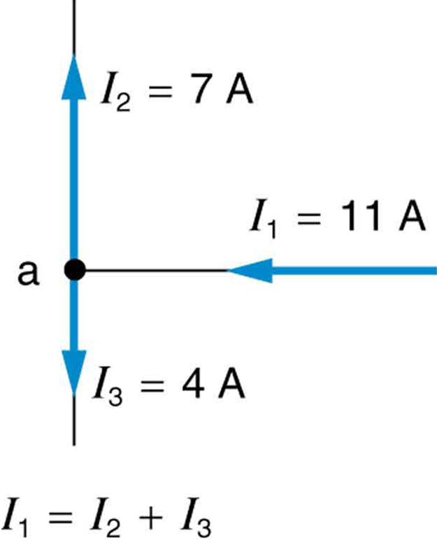
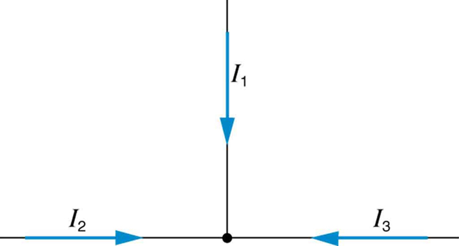

* Analyze a complex circuit using Kirchhoff’s rules, using the conventions for determining the correct signs of various terms.

Many complex circuits, such as the one in [\[link\]](#import-auto-id1907339), cannot be analyzed with the series-parallel techniques developed in [Resistors in Series and Parallel](/m42356) and [Electromotive Force: Terminal Voltage](/m42357). There are, however, two circuit analysis rules that can be used to analyze any circuit, simple or complex. These rules are special cases of the laws of conservation of charge and conservation of energy. The rules are known as **Kirchhoff’s rules**{: data-type="term" #import-auto-id3202695}, after their inventor Gustav Kirchhoff (1824–1887).

"){: #import-auto-id1907339}

Kirchhoff’s Rules

* {: xmlns:fo="urn:oasis:names:tc:opendocument:xmlns:xsl-fo-compatible:1.0" #import-auto-id953301 fo:font-weight="normal"} Kirchhoff’s first rule—the junction rule. The sum of all currents entering a junction must equal the sum of all currents leaving the junction.
* {: xmlns:fo="urn:oasis:names:tc:opendocument:xmlns:xsl-fo-compatible:1.0" #import-auto-id2971586 fo:font-weight="normal"} Kirchhoff’s second rule—the loop rule. The algebraic sum of changes in potential around any closed circuit path (loop) must be zero.

Explanations of the two rules will now be given, followed by problem-solving hints for applying Kirchhoff’s rules, and a worked example that uses them.

### Kirchhoff’s First Rule

Kirchhoff’s first rule (the **junction rule**{: data-type="term" #import-auto-id2680883}) is an application of the conservation of charge to a junction; it is illustrated in [\[link\]](#import-auto-id2052595). Current is the flow of charge, and charge is conserved; thus, whatever charge flows into the junction must flow out. Kirchhoff’s first rule requires that <math xmlns="http://www.w3.org/1998/Math/MathML"><semantics><mrow><mrow><mrow><msub><mi>I</mi><mrow><mn>1</mn></mrow></msub><mo stretchy="false">=</mo><mrow><msub><mi>I</mi><mrow><mn>2</mn></mrow></msub><mo stretchy="false">+</mo><msub><mi>I</mi><mrow><mn>3</mn></mrow></msub></mrow></mrow></mrow><mrow /></mrow><annotation encoding="StarMath 5.0"> size 12{I rSub { size 8{1} } =I rSub { size 8{2} } +I rSub { size 8{3} } } {}</annotation></semantics></math>

 (see figure). Equations like this can and will be used to analyze circuits and to solve circuit problems.

Making Connections: Conservation Laws

Kirchhoff’s rules for circuit analysis are applications of **conservation laws**{: data-type="term" #import-auto-id3260670} to circuits. The first rule is the application of conservation of charge, while the second rule is the application of conservation of energy. Conservation laws, even used in a specific application, such as circuit analysis, are so basic as to form the foundation of that application.

 {: #import-auto-id2052595}

### Kirchhoff’s Second Rule

Kirchhoff’s second rule (the **loop rule**{: data-type="term" #import-auto-id2598920}) is an application of conservation of energy. The loop rule is stated in terms of potential, <math xmlns="http://www.w3.org/1998/Math/MathML"><semantics><mrow><mrow><mi>V</mi></mrow><mrow /></mrow><annotation encoding="StarMath 5.0"> size 12{V} {}</annotation></semantics></math>

, rather than potential energy, but the two are related since <math xmlns="http://www.w3.org/1998/Math/MathML"><semantics><mrow><mrow><mrow><mrow><msub><mtext>PE</mtext><mrow><mtext>elec</mtext></mrow></msub></mrow><mo stretchy="false">=</mo><mstyle fontstyle="italic"><mrow><mtext>qV</mtext></mrow></mstyle></mrow></mrow><mrow /></mrow><annotation encoding="StarMath 5.0"> size 12{ ital "PE" rSub { size 8{"elec"} } = ital "qV"} {}</annotation></semantics></math>

. Recall that **emf**{: data-type="term"} is the potential difference of a source when no current is flowing. In a closed loop, whatever energy is supplied by emf must be transferred into other forms by devices in the loop, since there are no other ways in which energy can be transferred into or out of the circuit. [\[link\]](#import-auto-id1024606) illustrates the changes in potential in a simple series circuit loop.

Kirchhoff’s second rule requires <math xmlns="http://www.w3.org/1998/Math/MathML"><semantics><mrow><mrow><mrow><mrow><mrow><mrow><mtext>emf</mtext><mo stretchy="false">−</mo><mstyle fontstyle="italic"><mrow><mtext>Ir</mtext></mrow></mstyle></mrow><mo stretchy="false">−</mo><mrow><msub><mstyle fontstyle="italic"><mtext>IR</mtext></mstyle><mrow><mn>1</mn></mrow></msub></mrow></mrow><mo stretchy="false">−</mo><mrow><msub><mstyle fontstyle="italic"><mtext>IR</mtext></mstyle><mrow><mn>2</mn></mrow></msub></mrow></mrow><mo stretchy="false">=</mo><mn>0</mn></mrow></mrow><mrow /></mrow><annotation encoding="StarMath 5.0"> size 12{"emf" - ital "Ir" - ital "IR" rSub { size 8{1} } - ital "IR" rSub { size 8{2} } =0} {}</annotation></semantics></math>

. Rearranged, this is <math xmlns="http://www.w3.org/1998/Math/MathML"><semantics><mrow><mrow><mrow><mtext>emf</mtext><mo stretchy="false">=</mo><mrow><mrow><mstyle fontstyle="italic"><mrow><mtext>Ir</mtext></mrow></mstyle><mo stretchy="false">+</mo><mrow><msub><mtext fontstyle="italic">IR</mtext><mrow><mn>1</mn></mrow></msub></mrow></mrow><mo stretchy="false">+</mo><mrow><msub><mtext fontstyle="italic">IR</mtext><mrow><mn>2</mn></mrow></msub></mrow></mrow></mrow></mrow><mrow /></mrow><annotation encoding="StarMath 5.0"> size 12{"emf"= ital "Ir"+ ital "IR" rSub { size 8{1} } + ital "IR" rSub { size 8{2} } } {}</annotation></semantics></math>

, which means the emf equals the sum of the <math xmlns="http://www.w3.org/1998/Math/MathML"><semantics><mrow><mrow><mstyle fontstyle="italic"><mrow><mtext>IR</mtext></mrow></mstyle></mrow><mrow /></mrow><annotation encoding="StarMath 5.0"> size 12{ ital "IR"} {}</annotation></semantics></math>

 (voltage) drops in the loop.

 In this standard schematic of a simple series circuit, the emf supplies 18 V, which is reduced to zero by the resistances, with 1 V across the internal resistance, and 12 V and 5 V across the two load resistances, for a total of 18 V. (b) This perspective view represents the potential as something like a roller coaster, where charge is raised in potential by the emf and lowered by the resistances. (Note that the script E stands for emf.)"){: #import-auto-id1024606}

### Applying Kirchhoff’s Rules

By applying Kirchhoff’s rules, we generate equations that allow us to find the unknowns in circuits. The unknowns may be currents, emfs, or resistances. Each time a rule is applied, an equation is produced. If there are as many independent equations as unknowns, then the problem can be solved. There are two decisions you must make when applying Kirchhoff’s rules. These decisions determine the signs of various quantities in the equations you obtain from applying the rules.

1.  {: #import-auto-id2594136} When applying Kirchhoff’s first rule, the junction rule, you must label the current in each branch and decide in what direction it is going. For example, in [\[link\]](#import-auto-id1907339), [\[link\]](#import-auto-id2052595), and [\[link\]](#import-auto-id1024606), currents are labeled
    <math xmlns="http://www.w3.org/1998/Math/MathML"><semantics><mrow><mrow><msub><mi>I</mi><mrow><mn>1</mn></mrow></msub></mrow><mrow /></mrow><annotation encoding="StarMath 5.0"> size 12{I rSub { size 8{1} } } {}</annotation></semantics></math>
    
    ,
    <math xmlns="http://www.w3.org/1998/Math/MathML"><semantics><mrow><mrow><msub><mi>I</mi><mrow><mn>2</mn></mrow></msub></mrow><mrow /></mrow><annotation encoding="StarMath 5.0"> size 12{I rSub { size 8{2} } } {}</annotation></semantics></math>
    
    ,
    <math xmlns="http://www.w3.org/1998/Math/MathML"><semantics><mrow><mrow><msub><mi>I</mi><mrow><mn>3</mn></mrow></msub></mrow><mrow /></mrow><annotation encoding="StarMath 5.0"> size 12{I rSub { size 8{3} } } {}</annotation></semantics></math>
    
    , and
    <math xmlns="http://www.w3.org/1998/Math/MathML"><semantics><mrow><mrow><mi>I</mi></mrow><mrow /></mrow><annotation encoding="StarMath 5.0"> size 12{I} {}</annotation></semantics></math>
    
    , and arrows indicate their directions. There is no risk here, for if you choose the wrong direction, the current will be of the correct magnitude but negative.
2.  {: #import-auto-id2584409} When applying Kirchhoff’s second rule, the loop rule, you must identify a closed loop and decide in which direction to go around it, clockwise or counterclockwise. For example, in [\[link\]](#import-auto-id1024606) the loop was traversed in the same direction as the current (clockwise). Again, there is no risk; going around the circuit in the opposite direction reverses the sign of every term in the equation, which is like multiplying both sides of the equation by
    <math xmlns="http://www.w3.org/1998/Math/MathML"><semantics><mrow><mn>–1.</mn></mrow></semantics></math>
{: type="1"}

[\[link\]](#import-auto-id3116736) and the following points will help you get the plus or minus signs right when applying the loop rule. Note that the resistors and emfs are traversed by going from a to b. In many circuits, it will be necessary to construct more than one loop. In traversing each loop, one needs to be consistent for the sign of the change in potential. (See [\[link\]](#fs-id3008416).)

"){: #import-auto-id3116736}

* {: #import-auto-id1418233} When a resistor is traversed in the same direction as the current, the change in potential is
  <math xmlns="http://www.w3.org/1998/Math/MathML"><semantics><mrow><mrow><mrow><mo stretchy="false">−</mo><mstyle fontstyle="italic"><mrow><mtext>IR</mtext></mrow></mstyle></mrow></mrow><mrow /></mrow><annotation encoding="StarMath 5.0"> size 12{- ital "IR"} {}</annotation></semantics></math>
  
  . (See [\[link\]](#import-auto-id3116736).)
* {: #import-auto-id1934212} When a resistor is traversed in the direction opposite to the current, the change in potential is
  <math xmlns="http://www.w3.org/1998/Math/MathML"><semantics><mrow><mrow><mrow><mo stretchy="false">+</mo><mstyle fontstyle="italic"><mrow><mtext>IR</mtext></mrow></mstyle></mrow></mrow><mrow /></mrow><annotation encoding="StarMath 5.0"> size 12{+ ital "IR"} {}</annotation></semantics></math>
  
  . (See [\[link\]](#import-auto-id3116736).)
* {: #import-auto-id3144926} When an emf is traversed from
  <math xmlns="http://www.w3.org/1998/Math/MathML"><semantics><mrow><mo>–</mo></mrow></semantics></math>
  
  to + (the same direction it moves positive charge), the change in potential is +emf. (See [\[link\]](#import-auto-id3116736).)
* {: #import-auto-id2680713} When an emf is traversed from + to
  <math xmlns="http://www.w3.org/1998/Math/MathML"><semantics><mrow><mo>–</mo></mrow></semantics></math>
  
  (opposite to the direction it moves positive charge), the change in potential is
  <math xmlns="http://www.w3.org/1998/Math/MathML"> <semantics> <mrow> <mrow> <mrow> <mo stretchy="false">−</mo> <mrow /> </mrow> </mrow> <mrow /> </mrow> <annotation encoding="StarMath 5.0"> size 12{ - {}} {}</annotation> </semantics> </math>
  
  emf. (See [\[link\]](#import-auto-id3116736).)

Calculating Current: Using Kirchhoff’s Rules

Find the currents flowing in the circuit in [\[link\]](#import-auto-id2440725).

 The currents in each branch are labeled and assumed to move in the directions shown. This example uses Kirchhoff&#x2019;s rules to find the currents."){: #import-auto-id2440725}

**Strategy**

This circuit is sufficiently complex that the currents cannot be found using Ohm’s law and the series-parallel techniques—it is necessary to use Kirchhoff’s rules. Currents have been labeled <math xmlns="http://www.w3.org/1998/Math/MathML"><semantics><mrow><mrow><msub><mi>I</mi><mrow><mn>1</mn></mrow></msub></mrow><mrow /></mrow><annotation encoding="StarMath 5.0"> size 12{I rSub { size 8{1} } } {}</annotation></semantics></math>

, <math xmlns="http://www.w3.org/1998/Math/MathML"><semantics><mrow><mrow><msub><mi>I</mi><mrow><mn>2</mn></mrow></msub></mrow><mrow /></mrow><annotation encoding="StarMath 5.0"> size 12{I rSub { size 8{2} } } {}</annotation></semantics></math>

, and <math xmlns="http://www.w3.org/1998/Math/MathML"><semantics><mrow><mrow><msub><mi>I</mi><mrow><mn>3</mn></mrow></msub></mrow><mrow /></mrow><annotation encoding="StarMath 5.0"> size 12{I rSub { size 8{3} } } {}</annotation></semantics></math>

 in the figure and assumptions have been made about their directions. Locations on the diagram have been labeled with letters a through h. In the solution we will apply the junction and loop rules, seeking three independent equations to allow us to solve for the three unknown currents.

**Solution**

We begin by applying Kirchhoff’s first or junction rule at point a. This gives

<math xmlns="http://www.w3.org/1998/Math/MathML"><semantics><mrow><mrow><mrow><msub><mi>I</mi><mrow><mn>1</mn></mrow></msub><mo stretchy="false">=</mo><mrow><msub><mi>I</mi><mrow><mn>2</mn></mrow></msub><mo stretchy="false">+</mo><msub><mi>I</mi><mrow><mn>3</mn></mrow></msub></mrow></mrow></mrow><mrow /><mo>,</mo></mrow><annotation encoding="StarMath 5.0"> size 12{I rSub { size 8{1} } =I rSub { size 8{2} } +I rSub { size 8{3} } } {}</annotation></semantics></math>

since <math xmlns="http://www.w3.org/1998/Math/MathML"><semantics><mrow><mrow><msub><mi>I</mi><mrow><mn>1</mn></mrow></msub></mrow><mrow /></mrow><annotation encoding="StarMath 5.0"> size 12{I rSub { size 8{1} } } {}</annotation></semantics></math>

 flows into the junction, while <math xmlns="http://www.w3.org/1998/Math/MathML"><semantics><mrow><mrow><msub><mi>I</mi><mrow><mn>2</mn></mrow></msub></mrow><mrow /></mrow><annotation encoding="StarMath 5.0"> size 12{I rSub { size 8{2} } } {}</annotation></semantics></math>

 and <math xmlns="http://www.w3.org/1998/Math/MathML"><semantics><mrow><mrow><msub><mi>I</mi><mrow><mn>3</mn></mrow></msub></mrow><mrow /></mrow><annotation encoding="StarMath 5.0"> size 12{I rSub { size 8{3} } } {}</annotation></semantics></math>

 flow out. Applying the junction rule at e produces exactly the same equation, so that no new information is obtained. This is a single equation with three unknowns—three independent equations are needed, and so the loop rule must be applied.

Now we consider the loop abcdea. Going from a to b, we traverse <math xmlns="http://www.w3.org/1998/Math/MathML"><semantics><mrow><mrow><msub><mi>R</mi><mrow><mn>2</mn></mrow></msub></mrow><mrow /></mrow><annotation encoding="StarMath 5.0"> size 12{R rSub { size 8{2} } } {}</annotation></semantics></math>

 in the same (assumed) direction of the current <math xmlns="http://www.w3.org/1998/Math/MathML"><semantics><mrow><mrow><msub><mi>I</mi><mrow><mn>2</mn></mrow></msub></mrow><mrow /></mrow><annotation encoding="StarMath 5.0"> size 12{I rSub { size 8{2} } } {}</annotation></semantics></math>

, and so the change in potential is <math xmlns="http://www.w3.org/1998/Math/MathML"><semantics><mrow><mrow><mrow><mrow><mo stretchy="false">−</mo><msub><mi>I</mi><mrow><mn>2</mn></mrow></msub></mrow><msub><mi>R</mi><mrow><mn>2</mn></mrow></msub></mrow></mrow><mrow /></mrow><annotation encoding="StarMath 5.0"> size 12{ - I rSub { size 8{2} } R rSub { size 8{2} } } {}</annotation></semantics></math>

. Then going from b to c, we go from <math xmlns="http://www.w3.org/1998/Math/MathML"><semantics><mrow><mo>–</mo></mrow></semantics></math>

 to +, so that the change in potential is <math xmlns="http://www.w3.org/1998/Math/MathML"><semantics><mrow><mrow><mrow><mo stretchy="false">+</mo><msub><mtext>emf</mtext><mrow><mn>1</mn></mrow></msub></mrow></mrow><mrow /></mrow><annotation encoding="StarMath 5.0"> size 12{+"emf" rSub { size 8{1} } } {}</annotation></semantics></math>

. Traversing the internal resistance <math xmlns="http://www.w3.org/1998/Math/MathML"><semantics><mrow><mrow><msub><mi>r</mi><mrow><mn>1</mn></mrow></msub></mrow><mrow /></mrow><annotation encoding="StarMath 5.0"> size 12{r rSub { size 8{1} } } {}</annotation></semantics></math>

 from c to d gives <math xmlns="http://www.w3.org/1998/Math/MathML"><semantics><mrow><mrow><mrow><mrow><mo stretchy="false">−</mo><msub><mi>I</mi><mrow><mn>2</mn></mrow></msub></mrow><msub><mi>r</mi><mrow><mn>1</mn></mrow></msub></mrow></mrow><mrow /></mrow><annotation encoding="StarMath 5.0"> size 12{ - I rSub { size 8{2} } r rSub { size 8{1} } } {}</annotation></semantics></math>

. Completing the loop by going from d to a again traverses a resistor in the same direction as its current, giving a change in potential of <math xmlns="http://www.w3.org/1998/Math/MathML"><semantics><mrow><mrow><mrow><mrow><mo stretchy="false">−</mo><msub><mi>I</mi><mrow><mn>1</mn></mrow></msub></mrow><msub><mi>R</mi><mrow><mn>1</mn></mrow></msub></mrow></mrow><mrow /></mrow><annotation encoding="StarMath 5.0"> size 12{ - I rSub { size 8{1} } R rSub { size 8{1} } } {}</annotation></semantics></math>

.

The loop rule states that the changes in potential sum to zero. Thus,

<math xmlns="http://www.w3.org/1998/Math/MathML"><semantics><mrow><mrow><mrow><mrow><mo stretchy="false">−</mo><msub><mi>I</mi><mrow><mn>2</mn></mrow></msub></mrow><mrow><mrow><msub><mi>R</mi><mrow><mn>2</mn></mrow></msub><mo stretchy="false">+</mo><msub><mtext>emf</mtext><mrow><mn>1</mn></mrow></msub></mrow><mo stretchy="false">−</mo><msub><mi>I</mi><mrow><mn>2</mn></mrow></msub></mrow><mrow><msub><mi>r</mi><mrow><mn>1</mn></mrow></msub><mo stretchy="false">−</mo><msub><mi>I</mi><mrow><mn>1</mn></mrow></msub></mrow><mrow><msub><mi>R</mi><mrow><mn>1</mn></mrow></msub><mo stretchy="false">=</mo><mrow><mo stretchy="false">−</mo><msub><mi>I</mi><mrow><mn>2</mn></mrow></msub></mrow></mrow><mo stretchy="false">(</mo><mrow><msub><mi>R</mi><mrow><mn>2</mn></mrow></msub><mo stretchy="false">+</mo><msub><mi>r</mi><mrow><mn>1</mn></mrow></msub></mrow><mrow><mrow><mo stretchy="false">)</mo><mo stretchy="false">+</mo><msub><mtext>emf</mtext><mrow><mn>1</mn></mrow></msub></mrow><mo stretchy="false">−</mo><msub><mi>I</mi><mrow><mn>1</mn></mrow></msub></mrow><mrow><msub><mi>R</mi><mrow><mn>1</mn></mrow></msub><mo stretchy="false">=</mo><mn>0</mn></mrow></mrow></mrow><mrow /><mo>.</mo></mrow><annotation encoding="StarMath 5.0"> size 12{ - I rSub { size 8{2} } R rSub { size 8{2} } +"emf" rSub { size 8{1} } - I rSub { size 8{2} } r rSub { size 8{1} } - I rSub { size 8{1} } R rSub { size 8{1} } = - I rSub { size 8{2} } \( R rSub { size 8{2} } +r rSub { size 8{1} } \) +"emf" rSub { size 8{1} } - I rSub { size 8{1} } R rSub { size 8{1} } =0} {}</annotation></semantics></math>

Substituting values from the circuit diagram for the resistances and emf, and canceling the ampere unit gives

<math xmlns="http://www.w3.org/1998/Math/MathML"><semantics><mrow><mrow><mrow><mrow><mrow><mrow><mo stretchy="false">−</mo><msub><mrow><mn>3</mn><mi>I</mi></mrow><mrow><mn>2</mn></mrow></msub></mrow><mo stretchy="false">+</mo><mtext>18</mtext></mrow><mo stretchy="false">−</mo><msub><mrow><mn>6</mn><mi>I</mi></mrow><mrow><mn>1</mn></mrow></msub></mrow><mo stretchy="false">=</mo><mn>0</mn></mrow></mrow><mrow /><mo>.</mo></mrow><annotation encoding="StarMath 5.0"> size 12{ - 3I rSub { size 8{2} } +"18" - 6I rSub { size 8{1} } =0} {}</annotation></semantics></math>

Now applying the loop rule to aefgha (we could have chosen abcdefgha as well) similarly gives

<math xmlns="http://www.w3.org/1998/Math/MathML"><semantics><mrow><mrow><mrow><mrow><mo stretchy="false">+</mo><mspace width="0.25em" /><msub><mi>I</mi><mrow><mn>1</mn></mrow></msub></mrow><mrow><msub><mi>R</mi><mrow><mn>1</mn></mrow></msub><mo stretchy="false">+</mo><msub><mi>I</mi><mrow><mn>3</mn></mrow></msub></mrow><mrow><msub><mi>R</mi><mrow><mn>3</mn></mrow></msub><mo stretchy="false">+</mo><msub><mi>I</mi><mrow><mn>3</mn></mrow></msub></mrow><mrow><msub><mi>r</mi><mrow><mn>2</mn></mrow></msub><mo stretchy="false">−</mo><msub><mtext>emf</mtext><mrow><mn>2</mn></mrow></msub></mrow><mtext>= +</mtext><msub><mi>I</mi><mrow><mn>1</mn></mrow></msub><mrow><msub><mi>R</mi><mrow><mn>1</mn></mrow></msub><mo stretchy="false">+</mo><msub><mi>I</mi><mrow><mn>3</mn></mrow></msub></mrow><mrow><mrow><mfenced open="(" close=")"><mrow><msub><mi>R</mi><mrow><mn>3</mn></mrow></msub><mo stretchy="false">+</mo><msub><mi>r</mi><mrow><mn>2</mn></mrow></msub></mrow></mfenced><mo stretchy="false">−</mo><msub><mtext>emf</mtext><mrow><mn>2</mn></mrow></msub></mrow><mo stretchy="false">=</mo><mn>0</mn></mrow></mrow></mrow><mrow /><mo>.</mo></mrow><annotation encoding="StarMath 5.0"> size 12{+I rSub { size 8{1} } R rSub { size 8{1} } +I rSub { size 8{3} } R rSub { size 8{3} } +I rSub { size 8{3} } r rSub { size 8{2} } - "emf" rSub { size 8{2} } "=+"I rSub { size 8{1} } R rSub { size 8{1} } +I rSub { size 8{3} } left (R rSub { size 8{3} } +r rSub { size 8{2} } right ) - "emf" rSub { size 8{2} } =0} {}</annotation></semantics></math>

Note that the signs are reversed compared with the other loop, because elements are traversed in the opposite direction. With values entered, this becomes

<math xmlns="http://www.w3.org/1998/Math/MathML"><semantics><mrow><mrow><mrow><mrow><mrow><mrow><mo stretchy="false">+</mo><mspace width="0.25em" /><msub><mrow><mn>6</mn><mi>I</mi></mrow><mrow><mn>1</mn></mrow></msub></mrow><mo stretchy="false">+</mo><msub><mrow><mn>2</mn><mi>I</mi></mrow><mrow><mn>3</mn></mrow></msub></mrow><mo stretchy="false">−</mo><mtext>45</mtext></mrow><mo stretchy="false">=</mo><mn>0</mn></mrow></mrow><mrow /><mo>.</mo></mrow><annotation encoding="StarMath 5.0"> size 12{+6I rSub { size 8{1} } +2I rSub { size 8{3} } - "45"=0} {}</annotation></semantics></math>

These three equations are sufficient to solve for the three unknown currents. First, solve the second equation for <math xmlns="http://www.w3.org/1998/Math/MathML"><semantics><mrow><mrow><msub><mi>I</mi><mrow><mn>2</mn></mrow></msub></mrow><mrow /></mrow><annotation encoding="StarMath 5.0"> size 12{I rSub { size 8{2} } } {}</annotation></semantics></math>

\:

<math xmlns="http://www.w3.org/1998/Math/MathML"><semantics><mrow><mrow><mrow><msub><mi>I</mi><mrow><mn>2</mn></mrow></msub><mo stretchy="false">=</mo><mrow><mn>6</mn><mo stretchy="false">−</mo><msub><mrow><mn>2</mn><mi>I</mi></mrow><mrow><mn>1</mn></mrow></msub></mrow></mrow></mrow><mrow /><mo>.</mo></mrow><annotation encoding="StarMath 5.0"> size 12{I rSub { size 8{2} } =6 - 2I rSub { size 8{1} } } {}</annotation></semantics></math>

Now solve the third equation for <math xmlns="http://www.w3.org/1998/Math/MathML"><semantics><mrow><mrow><msub><mi>I</mi><mrow><mn>3</mn></mrow></msub></mrow><mrow /></mrow><annotation encoding="StarMath 5.0"> size 12{I rSub { size 8{3} } } {}</annotation></semantics></math>

\:

<math xmlns="http://www.w3.org/1998/Math/MathML"><semantics><mrow><mrow><mrow><mrow><msub><mi>I</mi><mrow><mn>3</mn></mrow></msub><mo stretchy="false">=</mo><mtext>22</mtext></mrow><mtext>.</mtext><mrow><mn>5</mn><mo stretchy="false">−</mo><msub><mrow><mn>3</mn><mi>I</mi></mrow><mrow><mn>1</mn></mrow></msub></mrow></mrow></mrow><mrow /><mo>.</mo></mrow><annotation encoding="StarMath 5.0"> size 12{I rSub { size 8{3} } ="22" "." 5 - 3I rSub { size 8{1} } } {}</annotation></semantics></math>

Substituting these two new equations into the first one allows us to find a value for <math xmlns="http://www.w3.org/1998/Math/MathML"><semantics><mrow><mrow><msub><mi>I</mi><mrow><mn>1</mn></mrow></msub></mrow><mrow /></mrow><annotation encoding="StarMath 5.0"> size 12{I rSub { size 8{1} } } {}</annotation></semantics></math>

\:

<math xmlns="http://www.w3.org/1998/Math/MathML"><semantics><mrow><mrow><mrow><mrow><mrow><msub><mi>I</mi><mrow><mn>1</mn></mrow></msub><mo stretchy="false">=</mo><mrow><msub><mi>I</mi><mrow><mn>2</mn></mrow></msub><mo stretchy="false">+</mo><msub><mi>I</mi><mrow><mn>3</mn></mrow></msub></mrow></mrow><mo stretchy="false">=</mo><mo stretchy="false">(</mo></mrow><mrow><mn>6</mn><mo stretchy="false">−</mo><msub><mrow><mn>2</mn><mi>I</mi></mrow><mrow><mn>1</mn></mrow></msub></mrow><mrow><mo stretchy="false">)</mo><mo stretchy="false">+</mo><mo stretchy="false">(</mo></mrow><mtext>22</mtext><mtext>.</mtext><mrow><mn>5</mn><mo stretchy="false">−</mo> <msub><mrow><mn>3</mn><mi>I</mi></mrow><mrow><mn>1</mn></mrow></msub></mrow><mrow><mo stretchy="false">)</mo><mo stretchy="false">=</mo><mtext>28</mtext></mrow><mtext>.</mtext><mrow><mn>5</mn><mo stretchy="false">−</mo> <msub><mrow><mn>5</mn><mi>I</mi></mrow><mrow><mn>1</mn></mrow></msub></mrow></mrow></mrow><mrow /><mo>.</mo></mrow><annotation encoding="StarMath 5.0"> size 12{I rSub { size 8{1} } =I rSub { size 8{2} } +I rSub { size 8{3} } = \( 6 - 2I rSub { size 8{1} } \) + \( "22" "." 5 - 3I rSub { size 8{1} } \) ="28" "." 5 - 5I rSub { size 8{1} } } {}</annotation></semantics></math>

Combining terms gives

<math xmlns="http://www.w3.org/1998/Math/MathML"><semantics><mrow><mrow><mrow><mrow><msub><mrow><mn>6</mn><mi>I</mi></mrow><mrow><mn>1</mn></mrow></msub><mo stretchy="false">=</mo><mtext>28</mtext></mrow><mtext>.</mtext><mn>5, and</mn></mrow></mrow><mrow /></mrow><annotation encoding="StarMath 5.0"> size 12{6I rSub { size 8{1} } ="28" "." 5} {}</annotation></semantics></math>

<math xmlns="http://www.w3.org/1998/Math/MathML"><semantics><mrow><mrow><mrow><mrow><msub><mi>I</mi><mrow><mn>1</mn></mrow></msub><mo stretchy="false">=</mo><mn>4</mn></mrow><mtext>.</mtext><mtext>75 A</mtext></mrow></mrow><mrow /><mo>.</mo></mrow><annotation encoding="StarMath 5.0"> size 12{I rSub { size 8{1} } =4 "." "75"" A"} {}</annotation></semantics></math>

Substituting this value for <math xmlns="http://www.w3.org/1998/Math/MathML"><semantics><mrow><mrow><msub><mi>I</mi><mrow><mn>1</mn></mrow></msub></mrow><mrow /></mrow><annotation encoding="StarMath 5.0"> size 12{I rSub { size 8{1} } } {}</annotation></semantics></math>

 back into the fourth equation gives

<math xmlns="http://www.w3.org/1998/Math/MathML"> <semantics> <mrow> <mrow> <mrow> <mrow> <mrow> <msub> <mi>I</mi> <mrow> <mn>2</mn> </mrow> </msub> <mo stretchy="false">=</mo> <mrow> <mn>6</mn> <mo stretchy="false">−</mo> <msub><mrow> <mn>2</mn><mi>I</mi> </mrow> <mrow> <mn>1</mn> </mrow> </msub> </mrow> </mrow> <mo stretchy="false">=</mo> <mrow> <mn>6</mn> <mo stretchy="false">−</mo> <mn>9.50</mn> </mrow> </mrow> </mrow> </mrow> <mrow /> </mrow> <annotation encoding="StarMath 5.0"> size 12{I rSub { size 8{2} } =6 - 2I rSub { size 8{1} } =6 - 9 "." "50"} {}</annotation> </semantics> </math>

<math xmlns="http://www.w3.org/1998/Math/MathML"><semantics><mrow><mrow><mrow><mrow><msub><mi>I</mi><mrow><mn>2</mn></mrow></msub><mo stretchy="false">=</mo><mrow><mo stretchy="false">−</mo><mn>3</mn></mrow></mrow><mtext>.</mtext><mtext>50 A</mtext></mrow></mrow><mrow /><mo>.</mo></mrow><annotation encoding="StarMath 5.0"> size 12{I rSub { size 8{2} } = - 3 "." "50"" A"} {}</annotation></semantics></math>

The minus sign means <math xmlns="http://www.w3.org/1998/Math/MathML"><semantics><mrow><mrow><msub><mi>I</mi><mrow><mn>2</mn></mrow></msub></mrow><mrow /></mrow><annotation encoding="StarMath 5.0"> size 12{I rSub { size 8{2} } } {}</annotation></semantics></math>

 flows in the direction opposite to that assumed in [\[link\]](#import-auto-id2440725).

Finally, substituting the value for <math xmlns="http://www.w3.org/1998/Math/MathML"><semantics><mrow><mrow><msub><mi>I</mi><mrow><mn>1</mn></mrow></msub></mrow><mrow /></mrow><annotation encoding="StarMath 5.0"> size 12{I rSub { size 8{1} } } {}</annotation></semantics></math>

 into the fifth equation gives

<math xmlns="http://www.w3.org/1998/Math/MathML"> <semantics> <mrow> <mrow> <mrow> <mrow> <msub> <mi>I</mi> <mrow> <mn>3</mn> </mrow> </msub> <mo stretchy="false">=</mo> <mtext>22.5</mtext> <mrow> <mo stretchy="false">−</mo> <msub><mrow> <mn>3</mn><mi>I</mi></mrow> <mrow> <mn>1</mn> </mrow> </msub> </mrow> <mo stretchy="false">=</mo> <mtext>22.5</mtext> <mo stretchy="false">−</mo> <mtext>14</mtext> </mrow> <mtext>.</mtext> <mtext>25</mtext> </mrow> </mrow> <mrow /> </mrow> <annotation encoding="StarMath 5.0"> size 12{I rSub { size 8{3} } ="22" "." 5 - 3I rSub { size 8{1} } ="22" "." 5 - "14" "." "25"} {}</annotation> </semantics> </math>

<math xmlns="http://www.w3.org/1998/Math/MathML"><semantics><mrow><mrow><mrow><mrow><msub><mi>I</mi><mrow><mn>3</mn></mrow></msub><mo stretchy="false">=</mo><mn>8</mn></mrow><mtext>.</mtext><mtext>25 A</mtext></mrow></mrow><mrow /><mo>.</mo></mrow><annotation encoding="StarMath 5.0"> size 12{I rSub { size 8{3} } =8 "." "25"" A"} {}</annotation></semantics></math>

**Discussion**

Just as a check, we note that indeed <math xmlns="http://www.w3.org/1998/Math/MathML"><semantics><mrow><mrow><mrow><msub><mi>I</mi><mrow><mn>1</mn></mrow></msub><mo stretchy="false">=</mo><mrow><msub><mi>I</mi><mrow><mn>2</mn></mrow></msub><mo stretchy="false">+</mo><msub><mi>I</mi><mrow><mn>3</mn></mrow></msub></mrow></mrow></mrow><mrow /></mrow><annotation encoding="StarMath 5.0"> size 12{I rSub { size 8{1} } =I rSub { size 8{2} } +I rSub { size 8{3} } } {}</annotation></semantics></math>

. The results could also have been checked by entering all of the values into the equation for the abcdefgha loop.

Problem-Solving Strategies for Kirchhoff’s Rules

1.  {: #import-auto-id3245843} Make certain there is a clear circuit diagram on which you can label all known and unknown resistances, emfs, and currents. If a current is unknown, you must assign it a direction. This is necessary for determining the signs of potential changes. If you assign the direction incorrectly, the current will be found to have a negative value—no harm done.
2.  {: #import-auto-id2062624} Apply the junction rule to any junction in the circuit. Each time the junction rule is applied, you should get an equation with a current that does not appear in a previous application—if not, then the equation is redundant.
3.  {: #import-auto-id1815013} Apply the loop rule to as many loops as needed to solve for the unknowns in the problem. (There must be as many independent equations as unknowns.) To apply the loop rule, you must choose a direction to go around the loop. Then carefully and consistently determine the signs of the potential changes for each element using the four bulleted points discussed above in conjunction with [\[link\]](#import-auto-id3116736).
4.  {: #import-auto-id1425727} Solve the simultaneous equations for the unknowns. This may involve many algebraic steps, requiring careful checking and rechecking.
5.  {: #import-auto-id2963669} Check to see whether the answers are reasonable and consistent. The numbers should be of the correct order of magnitude, neither exceedingly large nor vanishingly small. The signs should be reasonable—for example, no resistance should be negative. Check to see that the values obtained satisfy the various equations obtained from applying the rules. The currents should satisfy the junction rule, for example.
{: type="1"}

The material in this section is correct in theory. We should be able to verify it by making measurements of current and voltage. In fact, some of the devices used to make such measurements are straightforward applications of the principles covered so far and are explored in the next modules. As we shall see, a very basic, even profound, fact results—making a measurement alters the quantity being measured.

Check Your Understanding

Can Kirchhoff’s rules be applied to simple series and parallel circuits or are they restricted for use in more complicated circuits that are not combinations of series and parallel?

Kirchhoff's rules can be applied to any circuit since they are applications to circuits of two conservation laws. Conservation laws are the most broadly applicable principles in physics. It is usually mathematically simpler to use the rules for series and parallel in simpler circuits so we emphasize Kirchhoff’s rules for use in more complicated situations. But the rules for series and parallel can be derived from Kirchhoff’s rules. Moreover, Kirchhoff’s rules can be expanded to devices other than resistors and emfs, such as capacitors, and are one of the basic analysis devices in circuit analysis.

### Section Summary

* {: #import-auto-id1899657} Kirchhoff’s rules can be used to analyze any circuit, simple or complex.
* {: xmlns:fo="urn:oasis:names:tc:opendocument:xmlns:xsl-fo-compatible:1.0" #import-auto-id1954890 fo:font-weight="normal"} Kirchhoff’s first rule—the junction rule: The sum of all currents entering a junction must equal the sum of all currents leaving the junction.
* {: xmlns:fo="urn:oasis:names:tc:opendocument:xmlns:xsl-fo-compatible:1.0" #import-auto-id2670222 fo:font-weight="normal"} Kirchhoff’s second rule—the loop rule: The algebraic sum of changes in potential around any closed circuit path (loop) must be zero.
* {: #import-auto-id2683482} The two rules are based, respectively, on the laws of conservation of charge and energy.
* {: #import-auto-id2595427} When calculating potential and current using Kirchhoff’s rules, a set of conventions must be followed for determining the correct signs of various terms.
* {: #import-auto-id2639010} The simpler series and parallel rules are special cases of Kirchhoff’s rules.

### Conceptual Questions

Can all of the currents going into the junction in [[link]](#import-auto-id3353151) be positive? Explain.

 {: #import-auto-id3353151}

Apply the junction rule to junction b in [[link]](#import-auto-id2616676). Is any new information gained by applying the junction rule at e? (In the figure, each emf is represented by script E.)

 {: #import-auto-id2616676}

(a) What is the potential difference going from point a to point b in [[link]](#import-auto-id2616676)? (b) What is the potential difference going from c to b? (c) From e to g? (d) From e to d?

Apply the loop rule to loop afedcba in [[link]](#import-auto-id2616676).

Apply the loop rule to loops abgefa and cbgedc in [[link]](#import-auto-id2616676).

### Problem Exercises

Apply the loop rule to loop abcdefgha in [[link]](#import-auto-id2440725).

<math xmlns="http://www.w3.org/1998/Math/MathML"> <semantics> <mrow> <mrow> <mrow> <mrow> <mo stretchy="false">−</mo> <msub> <mi>I</mi> <mrow> <mn>2</mn> </mrow> </msub> </mrow> <mrow> <mrow> <msub> <mi>R</mi> <mrow> <mn>2</mn> </mrow> </msub> <mo stretchy="false">+</mo> <msub> <mtext>emf</mtext> <mrow> <mn>1</mn> </mrow> </msub> </mrow> <mo stretchy="false">−</mo> <mrow> <msub> <mstyle fontstyle="italic"> <mtext> I</mtext> </mstyle> <mrow> <mn>2</mn> </mrow> </msub> </mrow> </mrow> <mrow> <msub> <mi>r</mi> <mrow> <mn>1</mn> </mrow> </msub> <mo stretchy="false">+</mo> <mrow> <msub> <mstyle fontstyle="italic"> <mtext> I</mtext> </mstyle> <mrow> <mn>3</mn> </mrow> </msub> </mrow> </mrow> <mrow> <msub> <mi>R</mi> <mrow> <mn>3</mn> </mrow> </msub> <mo stretchy="false">+</mo> <mrow> <msub> <mstyle fontstyle="italic"> <mtext> I</mtext> </mstyle> <mrow> <mn>3</mn> </mrow> </msub> </mrow> </mrow> <mrow> <mrow> <msub> <mi>r</mi> <mrow> <mn>2</mn> </mrow> </msub> <mo stretchy="false">-</mo> <msub> <mtext>emf</mtext> <mrow> <mn>2</mn> </mrow> </msub> </mrow> <mo stretchy="false">=</mo> <mtext> 0</mtext> </mrow> </mrow> </mrow> </mrow> <annotation encoding="StarMath 5.0"> size 12{ {underline {-I rSub { size 8{2} } R rSub { size 8{3} } + "emf" rSub { size 8{1} } - ital " I" rSub { size 8{2} } r rSub { size 8{1} } + ital " I" rSub { size 8{3} } r rSub { size 8{3} } + ital " I" rSub { size 8{3} } r rSub { size 8{2} } +- "emf" rSub { size 8{2} } =" 0"}} } {}</annotation> </semantics> </math>

Apply the loop rule to loop aedcba in [[link]](#import-auto-id2440725).

Verify the second equation in [[link]](#fs-id3008416) by substituting the values found for the currents <math xmlns="http://www.w3.org/1998/Math/MathML"><semantics><mrow><mrow><msub><mi>I</mi><mrow><mn>1</mn></mrow></msub></mrow><mrow /></mrow><annotation encoding="StarMath 5.0"> size 12{I rSub { size 8{1} } } {}</annotation></semantics></math>

 and <math xmlns="http://www.w3.org/1998/Math/MathML"><semantics><mrow><mrow><msub><mi>I</mi><mrow><mn>2</mn></mrow></msub></mrow><mrow /></mrow><annotation encoding="StarMath 5.0"> size 12{I rSub { size 8{2} } } {}</annotation></semantics></math>

.

Verify the third equation in [[link]](#fs-id3008416) by substituting the values found for the currents <math xmlns="http://www.w3.org/1998/Math/MathML"><semantics><mrow><mrow><msub><mi>I</mi><mrow><mn>1</mn></mrow></msub></mrow><mrow /></mrow><annotation encoding="StarMath 5.0"> size 12{I rSub { size 8{1} } } {}</annotation></semantics></math>

 and <math xmlns="http://www.w3.org/1998/Math/MathML"><semantics><mrow><mrow><msub><mi>I</mi><mrow><mn>3</mn></mrow></msub></mrow><mrow /></mrow><annotation encoding="StarMath 5.0"> size 12{I rSub { size 8{3} } } {}</annotation></semantics></math>

.

Apply the junction rule at point a in [[link]](#import-auto-id3173348).

{: #import-auto-id3173348}

<math xmlns="http://www.w3.org/1998/Math/MathML"> <semantics> <mrow> <mrow> <mrow> <msub> <mi>I</mi> <mrow> <mn>3</mn> </mrow> </msub> <mo stretchy="false">=</mo> <mrow> <mstyle> <mrow> <msub> <mtext fontstyle="italic"> I</mtext> <mrow> <mn>1</mn> </mrow> </msub> </mrow> </mstyle> <mo stretchy="false">+</mo> <mrow> <msub> <mtext fontstyle="italic"> I</mtext> <mrow> <mn>2</mn> </mrow> </msub> </mrow> </mrow> </mrow> </mrow> <mrow /> </mrow> <annotation encoding="StarMath 5.0"> size 12{I rSub { size 8{3} } = ital " I" rSub { size 8{1} } + ital " I" rSub { size 8{2} } } {}</annotation> </semantics> </math>

Apply the loop rule to loop abcdefghija in [[link]](#import-auto-id3173348).

Apply the loop rule to loop akledcba in [[link]](#import-auto-id3173348).

<math xmlns="http://www.w3.org/1998/Math/MathML"> <semantics> <mrow> <mrow> <mrow> <mrow> <msub> <mtext>emf</mtext> <mrow> <mn>2</mn> </mrow> </msub> <mo stretchy="false">-</mo> <mrow> <msub> <mtext fontstyle="italic"> I</mtext> <mrow> <mn>2</mn> </mrow> </msub> </mrow> </mrow> <mrow> <msub> <mi>r</mi> <mrow> <mn>2</mn> </mrow> </msub> <mo stretchy="false">-</mo> <mrow> <msub> <mtext fontstyle="italic"> I</mtext> <mrow> <mn>2</mn> </mrow> </msub> </mrow> </mrow> <mrow> <msub> <mi>R</mi> <mrow> <mn>2</mn> </mrow> </msub> <mo stretchy="false">+</mo> <mrow> <msub> <mtext fontstyle="italic"> I</mtext> <mn>1</mn> </msub> </mrow> </mrow> <mrow> <msub> <mi>R</mi> <mrow> <mn>5</mn> </mrow> </msub> <mo stretchy="false">+</mo> <msub> <mi>I</mi> <mrow> <mn>1</mn> </mrow> </msub> </mrow> <mrow> <mrow> <msub> <mi>r</mi> <mrow> <mn>1</mn> </mrow> </msub> <mo stretchy="false">-</mo> <msub> <mtext>emf</mtext> <mrow> <mn>1</mn> </mrow> </msub> </mrow> <mo stretchy="false">+</mo> <mrow> <msub> <mtext fontstyle="italic"> I</mtext> <mn>1</mn> </msub> </mrow> </mrow> <mrow> <msub> <mi>R</mi> <mrow> <mn>1</mn> </mrow> </msub> <mo stretchy="false">=</mo> <mn>0</mn> </mrow> </mrow> </mrow> <mrow /> </mrow> <annotation encoding="StarMath 5.0"> size 12{ {underline { "emf" rSub { size 8{2} } +- ital " I" rSub { size 8{2} } r rSub { size 8{2} } +- ital " I" rSub { size 8{2} } R rSub { size 8{2} } + ital " I" rSub { size 8{1} } R rSub { size 8{5} } +I rSub { size 8{1} } r rSub { size 8{1} } +- "emf" rSub { size 8{1} } + ital " I" rSub { size 8{1} } R rSub { size 8{1} } = 0}} } {}</annotation> </semantics> </math>

Find the currents flowing in the circuit in [[link]](#import-auto-id3173348). Explicitly show how you follow the steps in the [Problem-Solving Strategies for Series and Parallel Resistors](/m42356#fs-id2401854).

Solve [[link]](#fs-id3008416), but use loop abcdefgha instead of loop akledcba. Explicitly show how you follow the steps in the [Problem-Solving Strategies for Series and Parallel Resistors](/m42356#fs-id2401854).

(a) <math xmlns="http://www.w3.org/1998/Math/MathML"><semantics><mrow><mrow><mrow><msub><mtext>I</mtext><mrow><mn>1</mn></mrow></msub><mo stretchy="false">=</mo><mrow><mtext>4.75 A</mtext></mrow></mrow></mrow><mrow /></mrow><annotation encoding="StarMath 5.0"> size 12{I rSub { size 8{1} } =4 cdot "75 A"} {}</annotation></semantics></math>

(b) <math xmlns="http://www.w3.org/1998/Math/MathML"><semantics><mrow><mrow><mrow><mrow><msub><mtext>I</mtext><mrow><mtext>2 </mtext></mrow></msub><mo stretchy="false">=</mo><mrow><mo stretchy="false">-</mo><mn>3</mn></mrow></mrow><mtext>.</mtext><mtext>5 A</mtext></mrow></mrow><mrow /></mrow><annotation encoding="StarMath 5.0"> size 12{I rSub { size 8{"2 "} } = +- 3 "." "5 A"} {}</annotation></semantics></math>

<math xmlns="http://www.w3.org/1998/Math/MathML"><semantics><mrow /><annotation encoding="StarMath 5.0">{}</annotation></semantics></math>

(c) <math xmlns="http://www.w3.org/1998/Math/MathML"><semantics><mrow><mrow><mrow><mrow><msub><mtext>I</mtext><mrow><mn>3</mn></mrow></msub><mo stretchy="false">=</mo><mn>8</mn></mrow><mtext>.</mtext><mtext>25 A</mtext></mrow></mrow><mrow /></mrow><annotation encoding="StarMath 5.0"> size 12{I rSub { size 8{3} } =8 "." "25"" A"} {}</annotation></semantics></math>

Find the currents flowing in the circuit in [[link]](#import-auto-id2616676).

**Unreasonable Results**

Consider the circuit in [[link]](#fs-id1947335), and suppose that the emfs are unknown and the currents are given to be <math xmlns="http://www.w3.org/1998/Math/MathML"><semantics><mrow><mrow><mrow><mrow><msub><mi>I</mi><mrow><mn>1</mn></mrow></msub><mo stretchy="false">=</mo><mn>5</mn></mrow><mtext>.</mtext><mtext>00 A</mtext></mrow></mrow><mrow /></mrow></semantics></math>

, <math xmlns="http://www.w3.org/1998/Math/MathML"><semantics><mrow><mrow><mrow><mrow><msub><mi>I</mi><mrow><mn>2</mn></mrow></msub><mo stretchy="false">=</mo><mn>3</mn></mrow><mtext>.0 A</mtext></mrow></mrow><mrow /></mrow><annotation encoding="StarMath 5.0"> size 12{I rSub { size 8{2} } =3 "." 0" A"} {}</annotation></semantics></math>

, and <math xmlns="http://www.w3.org/1998/Math/MathML"><semantics><mrow><mrow><mrow><msub><mi>I</mi><mrow><mn>3</mn></mrow></msub><mo>=</mo><mn>–2</mn><mtext>.</mtext><mtext>00 A</mtext></mrow></mrow><mrow /></mrow><annotation encoding="StarMath 5.0"> size 12{I rSub { size 8{3} } "=-"2 "." "00"" A"} {}</annotation></semantics></math>

. (a) Could you find the emfs? (b) What is wrong with the assumptions?

{:}

(a) No, you would get inconsistent equations to solve.

(b) <math xmlns="http://www.w3.org/1998/Math/MathML"><semantics><mrow><mrow><mrow><msub><mi>I</mi><mrow><mn>1</mn></mrow></msub><mo stretchy="false">≠</mo><mrow><msub><mi>I</mi><mrow><mn>2</mn></mrow></msub><mo stretchy="false">+</mo><msub><mi>I</mi><mrow><mn>3</mn></mrow></msub></mrow></mrow></mrow><mrow /></mrow><annotation encoding="StarMath 5.0"> size 12{I rSub { size 8{1} } &lt;&gt; I rSub { size 8{2} } +I rSub { size 8{3} } } {}</annotation></semantics></math>

. The assumed currents violate the junction rule.

### Glossary
{: data-type="glossary-title"}

Kirchhoff’s rules
: a set of two rules, based on conservation of charge and energy, governing current and changes in potential in an electric circuit
{: #import-auto-id2930940}

junction rule
: Kirchhoff’s first rule, which applies the conservation of charge to a junction; current is the flow of charge; thus, whatever charge flows into the junction must flow out; the rule can be stated
  <math xmlns="http://www.w3.org/1998/Math/MathML"><semantics><mrow><mrow><mrow><msub><mi>I</mi><mrow><mn>1</mn></mrow></msub><mo stretchy="false">=</mo><mrow><msub><mi>I</mi><mrow><mn>2</mn></mrow></msub><mo stretchy="false">+</mo><msub><mi>I</mi><mrow><mn>3</mn></mrow></msub></mrow></mrow></mrow><mrow /></mrow><annotation encoding="StarMath 5.0"> size 12{I rSub { size 8{1} } =I rSub { size 8{2} } +I rSub { size 8{3} } } {}</annotation></semantics></math>
{: #import-auto-id1571021}

loop rule
: Kirchhoff’s second rule, which states that in a closed loop, whatever energy is supplied by emf must be transferred into other forms by devices in the loop, since there are no other ways in which energy can be transferred into or out of the circuit. Thus, the emf equals the sum of the
  <math xmlns="http://www.w3.org/1998/Math/MathML"><semantics><mrow><mrow><mstyle fontstyle="italic"><mrow><mtext>IR</mtext></mrow></mstyle></mrow><mrow /></mrow><annotation encoding="StarMath 5.0"> size 12{ ital "IR"} {}</annotation></semantics></math>
  
  (voltage) drops in the loop and can be stated:
  <math xmlns="http://www.w3.org/1998/Math/MathML"><semantics><mrow><mrow><mrow><mtext>emf</mtext><mo stretchy="false">=</mo><mrow><mrow><mstyle><mrow><mtext fontstyle="italic">Ir</mtext></mrow></mstyle><mo stretchy="false">+</mo><mstyle><mrow><msub><mtext fontstyle="italic">IR</mtext><mrow><mn>1</mn></mrow></msub></mrow></mstyle></mrow><mo stretchy="false">+</mo><mstyle><mrow><msub><mtext fontstyle="italic">IR</mtext><mrow><mn>2</mn></mrow></msub></mrow></mstyle></mrow></mrow></mrow><mrow /></mrow><annotation encoding="StarMath 5.0"> size 12{"emf"= ital "Ir"+ ital "IR" rSub { size 8{1} } + ital "IR" rSub { size 8{2} } } {}</annotation></semantics></math>
{: #import-auto-id2423277}

conservation laws
: require that energy and charge be conserved in a system
{: #import-auto-id2405199}

