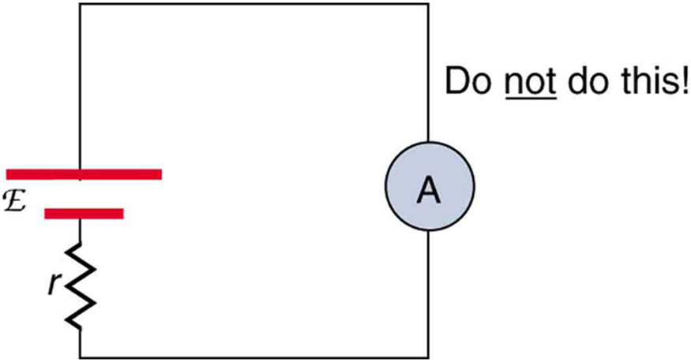
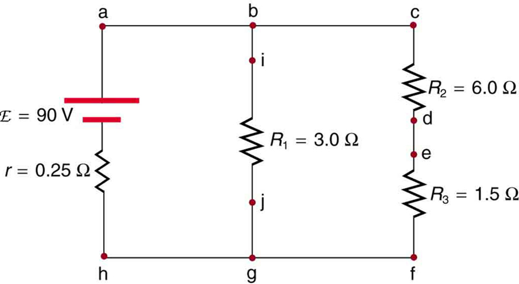
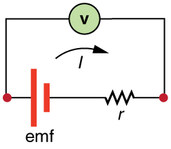
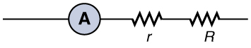

* Explain why a voltmeter must be connected in parallel with the circuit.
* Draw a diagram showing an ammeter correctly connected in a circuit.
* Describe how a galvanometer can be used as either a voltmeter or an ammeter.
* Find the resistance that must be placed in series with a galvanometer to allow it to be used as a voltmeter with a given reading.
* Explain why measuring the voltage or current in a circuit can never be exact.

**Voltmeters**{: data-type="term" #import-auto-id2601418} measure voltage, whereas **ammeters**{: data-type="term"} measure current. Some of the meters in automobile dashboards, digital cameras, cell phones, and tuner-amplifiers are voltmeters or ammeters. (See [\[link\]](#import-auto-id2654311).) The internal construction of the simplest of these meters and how they are connected to the system they monitor give further insight into applications of series and parallel connections.

 in this 1996 Volkswagen are voltmeters that register the voltage output of &#x201C;sender&#x201D; units, which are hopefully proportional to the amount of gasoline in the tank and the engine temperature. (credit: Christian Giersing)"){: #import-auto-id2654311}

Voltmeters are connected in parallel with whatever device’s voltage is to be measured. A parallel connection is used because objects in parallel experience the same potential difference. (See [\[link\]](#import-auto-id1934441), where the voltmeter is represented by the symbol V.)

Ammeters are connected in series with whatever device’s current is to be measured. A series connection is used because objects in series have the same current passing through them. (See [\[link\]](#import-auto-id2692802), where the ammeter is represented by the symbol A.)

  To measure potential differences in this series circuit, the voltmeter (V) is placed in parallel with the voltage source or either of the resistors. Note that terminal voltage is measured between points a and b. It is not possible to connect the voltmeter directly across the emf without including its internal resistance, r. (b) A digital voltmeter in use. (credit: Messtechniker, Wikimedia Commons)"){: #import-auto-id1934441}

 is placed in series to measure current. All of the current in this circuit flows through the meter. The ammeter would have the same reading if located between points d and e or between points f and a as it does in the position shown. (Note that the script capital E stands for emf, and r  stands for the internal resistance of the source of potential difference.)"){: #import-auto-id2692802}

# Analog Meters: Galvanometers

**Analog meters**{: data-type="term" #import-auto-id2687462} have a needle that swivels to point at numbers on a scale, as opposed to **digital meters**{: data-type="term" #import-auto-id1815921}, which have numerical readouts similar to a hand-held calculator. The heart of most analog meters is a device called a **galvanometer**{: data-type="term" #import-auto-id3126414}, denoted by G. Current flow through a galvanometer, <math xmlns="http://www.w3.org/1998/Math/MathML"><semantics><mrow><mrow><msub><mi>I</mi><mrow><mtext>G</mtext></mrow></msub></mrow><mrow /></mrow><annotation encoding="StarMath 5.0"> size 12{I rSub { size 8{G} } } {}</annotation></semantics></math>

, produces a proportional needle deflection. (This deflection is due to the force of a magnetic field upon a current-carrying wire.)

The two crucial characteristics of a given galvanometer are its resistance and current sensitivity. **Current sensitivity**{: data-type="term" #import-auto-id3112511} is the current that gives a **full-scale deflection**{: data-type="term" #import-auto-id3026908} of the galvanometer’s needle, the maximum current that the instrument can measure. For example, a galvanometer with a current sensitivity of <math xmlns="http://www.w3.org/1998/Math/MathML"><semantics><mrow><mrow><mrow><mtext>50 μA</mtext></mrow></mrow><mrow /></mrow></semantics></math>

 has a maximum deflection of its needle when <math xmlns="http://www.w3.org/1998/Math/MathML"><semantics><mrow><mrow><mrow><mtext>50 μA</mtext></mrow></mrow><mrow /></mrow></semantics></math>

 flows through it, reads half-scale when <math xmlns="http://www.w3.org/1998/Math/MathML"><semantics><mrow><mrow><mrow><mn>25 μA</mn></mrow></mrow><mrow /></mrow><annotation encoding="StarMath 5.0"> size 12{2"5 "μA} {}</annotation></semantics></math>

 flows through it, and so on.

If such a galvanometer has a <math xmlns="http://www.w3.org/1998/Math/MathML"><semantics><mrow><mrow><mrow><mn>2</mn><mtext>5-</mtext><mo stretchy="false">Ω</mo></mrow></mrow><mrow /></mrow><annotation encoding="StarMath 5.0"> size 12{2"5-" %OMEGA } {}</annotation></semantics></math>

 resistance, then a voltage of only <math xmlns="http://www.w3.org/1998/Math/MathML"><semantics><mrow><mrow><mrow><mrow><mrow><mi>V</mi><mo stretchy="false">=</mo><mstyle fontstyle="italic"><mrow><mtext>IR</mtext></mrow></mstyle></mrow><mo stretchy="false">=</mo><mfenced open="(" close=")"><mrow><mtext>50 μA</mtext></mrow></mfenced></mrow><mrow><mfenced open="(" close=")"><mrow><mtext>25 Ω</mtext></mrow></mfenced><mo stretchy="false">=</mo><mn>1</mn></mrow><mtext>.</mtext><mtext>25 mV</mtext></mrow></mrow><mrow /></mrow><annotation encoding="StarMath 5.0"> size 12{V= ital "IR"= left ("50" μA right ) left ("25" %OMEGA right )=1 "." "25"" mV"} {}</annotation></semantics></math>

 produces a full-scale reading. By connecting resistors to this galvanometer in different ways, you can use it as either a voltmeter or ammeter that can measure a broad range of voltages or currents.

## Galvanometer as Voltmeter

[\[link\]](#import-auto-id1404084) shows how a galvanometer can be used as a voltmeter by connecting it in series with a large resistance, <math xmlns="http://www.w3.org/1998/Math/MathML"><semantics><mrow><mi>R</mi></mrow></semantics></math>

. The value of the resistance <math xmlns="http://www.w3.org/1998/Math/MathML"><semantics><mrow><mrow><mi>R</mi></mrow><mrow /></mrow><annotation encoding="StarMath 5.0"> size 12{R} {}</annotation></semantics></math>

 is determined by the maximum voltage to be measured. Suppose you want 10 V to produce a full-scale deflection of a voltmeter containing a <math xmlns="http://www.w3.org/1998/Math/MathML"><semantics><mrow><mrow><mrow><mn>2</mn><mtext>5-Ω</mtext></mrow></mrow><mrow /></mrow><annotation encoding="StarMath 5.0"> size 12{2"5-" %OMEGA } {}</annotation></semantics></math>

 galvanometer with a <math xmlns="http://www.w3.org/1998/Math/MathML"><semantics><mrow><mrow><mrow><mtext>50-μA</mtext></mrow></mrow><mrow /></mrow></semantics></math>

 sensitivity. Then 10 V applied to the meter must produce a current of <math xmlns="http://www.w3.org/1998/Math/MathML"><semantics><mrow><mrow><mrow><mtext>50 μA</mtext></mrow></mrow><mrow /></mrow><annotation encoding="StarMath 5.0"> size 12{"50" μA} {}</annotation></semantics></math>

. The total resistance must be

<math xmlns="http://www.w3.org/1998/Math/MathML"><semantics><mrow><mrow><mrow><mrow><mrow><mrow><mrow><msub><mi>R</mi><mrow><mtext>tot</mtext></mrow></msub><mo stretchy="false">=</mo><mrow><mi>R</mi><mo stretchy="false">+</mo><mi>r</mi></mrow></mrow><mo stretchy="false">=</mo><mfrac><mi>V</mi><mi>I</mi></mfrac></mrow><mo stretchy="false">=</mo><mfrac><mrow><mtext>10</mtext><mspace width="0.25em" /><mtext> V</mtext></mrow><mrow><mtext>50 μA</mtext></mrow></mfrac></mrow><mo stretchy="false">=</mo><mtext>200</mtext></mrow><mspace width="0.25em" /><mtext> k</mtext><mo stretchy="false">Ω, or</mo></mrow></mrow><mrow /></mrow><annotation encoding="StarMath 5.0"> size 12{R rSub { size 8{"tot"} } =R+r= { {V} over {I} } = { {"10"" V"} over {"50" μA} } ="200"" k" %OMEGA } {}</annotation></semantics></math>

<math xmlns="http://www.w3.org/1998/Math/MathML"><semantics><mrow><mrow><mrow><mrow><mrow><mi>R</mi><mo stretchy="false">=</mo><mrow><msub><mi>R</mi><mrow><mtext>tot</mtext></mrow></msub><mo stretchy="false">−</mo><mi>r</mi></mrow></mrow><mo stretchy="false">=</mo><mtext>200 kΩ</mtext><mo stretchy="false">−</mo><mtext>25</mtext></mrow><mspace width="0.25em" /><mo stretchy="false">Ω</mo><mo stretchy="false">≈</mo><mtext>200</mtext><mspace width="0.25em" /><mtext> k</mtext><mo stretchy="false">Ω</mo></mrow></mrow><mrow /><mo>.</mo></mrow><annotation encoding="StarMath 5.0"> size 12{R=R rSub { size 8{"tot"} } -r="200"k %OMEGA -"25" %OMEGA »"200"" k" %OMEGA } {}</annotation></semantics></math>

(<math xmlns="http://www.w3.org/1998/Math/MathML"><semantics><mrow><mrow><mi>R</mi></mrow><mrow /></mrow><annotation encoding="StarMath 5.0"> size 12{R} {}</annotation></semantics></math>

 is so large that the galvanometer resistance, <math xmlns="http://www.w3.org/1998/Math/MathML"><semantics><mrow><mi>r</mi></mrow></semantics></math>

, is nearly negligible.) Note that 5 V applied to this voltmeter produces a half-scale deflection by producing a <math xmlns="http://www.w3.org/1998/Math/MathML"><semantics><mrow><mrow><mrow><mn>2</mn><mtext>5-μA</mtext></mrow></mrow><mrow /></mrow><annotation encoding="StarMath 5.0"> size 12{2"5-"μA} {}</annotation></semantics></math>

 current through the meter, and so the voltmeter’s reading is proportional to voltage as desired.

This voltmeter would not be useful for voltages less than about half a volt, because the meter deflection would be small and difficult to read accurately. For other voltage ranges, other resistances are placed in series with the galvanometer. Many meters have a choice of scales. That choice involves switching an appropriate resistance into series with the galvanometer.

 "){: #import-auto-id1404084}

## Galvanometer as Ammeter

The same galvanometer can also be made into an ammeter by placing it in parallel with a small resistance <math xmlns="http://www.w3.org/1998/Math/MathML"><semantics><mrow><mrow><mi>R</mi></mrow><mrow /></mrow><annotation encoding="StarMath 5.0"> size 12{R} {}</annotation></semantics></math>

, often called the **shunt resistance**{: data-type="term" #import-auto-id1614455}, as shown in [\[link\]](#import-auto-id2932271). Since the shunt resistance is small, most of the current passes through it, allowing an ammeter to measure currents much greater than those producing a full-scale deflection of the galvanometer.

Suppose, for example, an ammeter is needed that gives a full-scale deflection for 1.0 A, and contains the same <math xmlns="http://www.w3.org/1998/Math/MathML"><semantics><mrow><mrow><mrow><mn>2</mn><mtext>5-</mtext><mo stretchy="false">Ω</mo></mrow></mrow><mrow /></mrow><annotation encoding="StarMath 5.0"> size 12{2"5-" %OMEGA } {}</annotation></semantics></math>

 galvanometer with its <math xmlns="http://www.w3.org/1998/Math/MathML"><semantics><mrow><mrow><mrow><mtext>50-μA</mtext></mrow></mrow><mrow /></mrow><annotation encoding="StarMath 5.0"> size 12{"50"-μA} {}</annotation></semantics></math>

 sensitivity. Since <math xmlns="http://www.w3.org/1998/Math/MathML"><semantics><mrow><mrow><mi>R</mi></mrow><mrow /></mrow><annotation encoding="StarMath 5.0"> size 12{R} {}</annotation></semantics></math>

 and <math xmlns="http://www.w3.org/1998/Math/MathML"><semantics><mrow><mrow><mi>r</mi></mrow><mrow /></mrow><annotation encoding="StarMath 5.0"> size 12{r} {}</annotation></semantics></math>

 are in parallel, the voltage across them is the same.

These <math xmlns="http://www.w3.org/1998/Math/MathML"><semantics><mrow><mrow><mstyle fontstyle="italic"><mrow><mtext>IR</mtext></mrow></mstyle></mrow><mrow /></mrow><annotation encoding="StarMath 5.0"> size 12{ ital "IR"} {}</annotation></semantics></math>

 drops are <math xmlns="http://www.w3.org/1998/Math/MathML"><semantics><mrow><mrow><mrow><mrow><mstyle fontstyle="italic"><mrow><mtext>IR</mtext></mrow></mstyle><mo stretchy="false">=</mo><msub><mi>I</mi><mrow><mtext>G</mtext></mrow></msub></mrow><mi>r</mi></mrow></mrow><mrow /></mrow><annotation encoding="StarMath 5.0"> size 12{ ital "IR"=I rSub { size 8{G} } r} {}</annotation></semantics></math>

 so that <math xmlns="http://www.w3.org/1998/Math/MathML"><semantics><mrow><mrow><mrow><mrow><mstyle fontstyle="italic"><mrow><mtext>IR</mtext></mrow></mstyle><mo stretchy="false">=</mo><mfrac><msub><mi>I</mi><mrow><mtext>G</mtext></mrow></msub><mi>I</mi></mfrac></mrow><mo stretchy="false">=</mo><mfrac><mi>R</mi><mi>r</mi></mfrac></mrow></mrow><mrow /></mrow><annotation encoding="StarMath 5.0"> size 12{ ital "IR"= { {I rSub { size 8{G} } } over {I} } = { {R} over {r} } } {}</annotation></semantics></math>

. Solving for <math xmlns="http://www.w3.org/1998/Math/MathML"><semantics><mrow><mrow><mi>R</mi></mrow><mrow /></mrow><annotation encoding="StarMath 5.0"> size 12{R} {}</annotation></semantics></math>

, and noting that <math xmlns="http://www.w3.org/1998/Math/MathML"><semantics><mrow><mrow><msub><mi>I</mi><mrow><mtext>G</mtext></mrow></msub></mrow><mrow /></mrow><annotation encoding="StarMath 5.0"> size 12{I rSub { size 8{G} } } {}</annotation></semantics></math>

 is <math xmlns="http://www.w3.org/1998/Math/MathML"><semantics><mrow><mrow><mrow><mtext>50 μA</mtext></mrow></mrow><mrow /></mrow><annotation encoding="StarMath 5.0"> size 12{"50" μA} {}</annotation></semantics></math>

 and <math xmlns="http://www.w3.org/1998/Math/MathML"><semantics><mrow><mrow><mi>I</mi></mrow><mrow /></mrow><annotation encoding="StarMath 5.0"> size 12{I} {}</annotation></semantics></math>

 is 0.999950 A, we have

<math xmlns="http://www.w3.org/1998/Math/MathML"><semantics><mrow><mrow><mrow><mrow><mi>R</mi><mo stretchy="false">=</mo><mi>r</mi></mrow><mrow><mfrac><msub><mi>I</mi><mrow><mtext>G</mtext></mrow></msub><mi>I</mi></mfrac><mo stretchy="false">=</mo><mo stretchy="false">(</mo></mrow><mtext>25</mtext><mspace width="0.15em" /><mo stretchy="false">Ω</mo><mo stretchy="false">)</mo><mrow><mfrac><mrow><mtext>50 μA</mtext></mrow><mrow><mn>0</mn><mtext>.</mtext><mtext>999950 A</mtext></mrow></mfrac><mo stretchy="false">=</mo><mn>1</mn></mrow><mtext>.</mtext><mtext>25</mtext><mi>×</mi><msup><mtext>10</mtext><mrow><mrow><mo stretchy="false">−</mo><mn>3</mn></mrow></mrow></msup><mspace width="0.15em" /><mo stretchy="false">Ω</mo></mrow></mrow><mrow /><mo>.</mo></mrow><annotation encoding="StarMath 5.0"> size 12{R=r { {I rSub { size 8{G} } } over {I} } = \( "25" %OMEGA \) { {"50" mA} over {0 "." "999950 A"} } =1 "." "25"´"10" rSup { size 8{-3} } %OMEGA } {}</annotation></semantics></math>

 flowing through the meter is shunted through R size 12{R} {} to protect the galvanometer.  (Note that r  represents the internal resistance of the galvanometer.) Ammeters may also have multiple scales for greater flexibility in application. The various scales are achieved by switching various shunt resistances in parallel with the galvanometer&#x2014;the greater the maximum current to be measured, the smaller the shunt resistance must be."){: #import-auto-id2932271}

# Taking Measurements Alters the Circuit

When you use a voltmeter or ammeter, you are connecting another resistor to an existing circuit and, thus, altering the circuit. Ideally, voltmeters and ammeters do not appreciably affect the circuit, but it is instructive to examine the circumstances under which they do or do not interfere.

First, consider the voltmeter, which is always placed in parallel with the device being measured. Very little current flows through the voltmeter if its resistance is a few orders of magnitude greater than the device, and so the circuit is not appreciably affected. (See [\[link\]](#import-auto-id2602156)(a).) (A large resistance in parallel with a small one has a combined resistance essentially equal to the small one.) If, however, the voltmeter’s resistance is comparable to that of the device being measured, then the two in parallel have a smaller resistance, appreciably affecting the circuit. (See [\[link\]](#import-auto-id2602156)(b).) The voltage across the device is not the same as when the voltmeter is out of the circuit.

  A voltmeter having a resistance much larger than the device (RVoltmeter&gt;&gt;R size 12{V&quot;&gt;&gt;&quot;R} {}) with which it is in parallel produces a parallel resistance essentially the same as the device and does not appreciably affect the circuit being measured. (b) Here the voltmeter has the same resistance as the device (RVoltmeter&#x2245;R size 12{V simeq R} {}), so that the parallel resistance is half of what it is when the voltmeter is not connected. This is an example of a significant alteration of the circuit and is to be avoided."){: #import-auto-id2602156}

An ammeter is placed in series in the branch of the circuit being measured, so that its resistance adds to that branch. Normally, the ammeter’s resistance is very small compared with the resistances of the devices in the circuit, and so the extra resistance is negligible. (See [\[link\]](#import-auto-id1927668)(a).) However, if very small load resistances are involved, or if the ammeter is not as low in resistance as it should be, then the total series resistance is significantly greater, and the current in the branch being measured is reduced. (See [\[link\]](#import-auto-id1927668)(b).)

A practical problem can occur if the ammeter is connected incorrectly. If it was put in parallel with the resistor to measure the current in it, you could possibly damage the meter; the low resistance of the ammeter would allow most of the current in the circuit to go through the galvanometer, and this current would be larger since the effective resistance is smaller.

  An ammeter normally has such a small resistance that the total series resistance in the branch being measured is not appreciably increased. The circuit is essentially unaltered compared with when the ammeter is absent. (b) Here the ammeter&#x2019;s resistance is the same as that of the branch, so that the total resistance is doubled and the current is half what it is without the ammeter. This significant alteration of the circuit is to be avoided."){: #import-auto-id1927668}

One solution to the problem of voltmeters and ammeters interfering with the circuits being measured is to use galvanometers with greater sensitivity. This allows construction of voltmeters with greater resistance and ammeters with smaller resistance than when less sensitive galvanometers are used.

There are practical limits to galvanometer sensitivity, but it is possible to get analog meters that make measurements accurate to a few percent. Note that the inaccuracy comes from altering the circuit, not from a fault in the meter.

Connections: Limits to Knowledge

Making a measurement alters the system being measured in a manner that produces uncertainty in the measurement. For macroscopic systems, such as the circuits discussed in this module, the alteration can usually be made negligibly small, but it cannot be eliminated entirely. For submicroscopic systems, such as atoms, nuclei, and smaller particles, measurement alters the system in a manner that cannot be made arbitrarily small. This actually limits knowledge of the system—even limiting what nature can know about itself. We shall see profound implications of this when the Heisenberg uncertainty principle is discussed in the modules on quantum mechanics.

There is another measurement technique based on drawing no current at all and, hence, not altering the circuit at all. These are called null measurements and are the topic of [Null Measurements](/m42362). Digital meters that employ solid-state electronics and null measurements can attain accuracies of one part in <math xmlns="http://www.w3.org/1998/Math/MathML"><semantics><mrow><mrow><msup><mtext>10</mtext><mrow><mn>6</mn></mrow></msup></mrow><mrow /></mrow><annotation encoding="StarMath 5.0"> size 12{"10" rSup { size 8{6} } } {}</annotation></semantics></math>

.

Check Your Understanding

Digital meters are able to detect smaller currents than analog meters employing galvanometers. How does this explain their ability to measure voltage and current more accurately than analog meters?

Since digital meters require less current than analog meters, they alter the circuit less than analog meters. Their resistance as a voltmeter can be far greater than an analog meter, and their resistance as an ammeter can be far less than an analog meter. Consult [[link]](#import-auto-id1934441) and [[link]](#import-auto-id2692802) and their discussion in the text.

PhET Explorations: Circuit Construction Kit (DC Only), Virtual Lab

Stimulate a neuron and monitor what happens. Pause, rewind, and move forward in time in order to observe the ions as they move across the neuron membrane.

<figure markdown="1" id="eip-id1684099">
<figcaption>
[Circuit Construction Kit (DC Only), Virtual Lab](circuit-construction-kit-dc-virtual-lab_en.jar)
</figcaption>
 {: data-type="image"}  
</figure>

# Section Summary

* {: #import-auto-id3051257} Voltmeters measure voltage, and ammeters measure current.
* {: #import-auto-id2207403} A voltmeter is placed in parallel with the voltage source to receive full voltage and must have a large resistance to limit its effect on the circuit.
* {: #import-auto-id2591290} An ammeter is placed in series to get the full current flowing through a branch and must have a small resistance to limit its effect on the circuit.
* {: #import-auto-id1909073} Both can be based on the combination of a resistor and a galvanometer, a device that gives an analog reading of current.
* {: #import-auto-id1859324} Standard voltmeters and ammeters alter the circuit being measured and are thus limited in accuracy.

# Conceptual Questions

Why should you not connect an ammeter directly across a voltage source as shown in [[link]](#import-auto-id2399391)? (Note that script E in the figure stands for emf.)

{: #import-auto-id2399391}

Suppose you are using a multimeter (one designed to measure a range of voltages, currents, and resistances) to measure current in a circuit and you inadvertently leave it in a voltmeter mode. What effect will the meter have on the circuit? What would happen if you were measuring voltage but accidentally put the meter in the ammeter mode?

Specify the points to which you could connect a voltmeter to measure the following potential differences in [[link]](#import-auto-id2618382): (a) the potential difference of the voltage source; (b) the potential difference across <math xmlns="http://www.w3.org/1998/Math/MathML"><semantics><mrow><mrow><msub><mi>R</mi><mrow><mn>1</mn></mrow></msub></mrow><mrow /></mrow><annotation encoding="StarMath 5.0"> size 12{R rSub { size 8{1} } } {}</annotation></semantics></math>

; (c) across <math xmlns="http://www.w3.org/1998/Math/MathML"><semantics><mrow><mrow><msub><mi>R</mi><mrow><mn>2</mn></mrow></msub></mrow><mrow /></mrow><annotation encoding="StarMath 5.0"> size 12{R rSub { size 8{2} } } {}</annotation></semantics></math>

; (d) across <math xmlns="http://www.w3.org/1998/Math/MathML"><semantics><mrow><mrow><msub><mi>R</mi><mrow><mn>3</mn></mrow></msub></mrow><mrow /></mrow><annotation encoding="StarMath 5.0"> size 12{R rSub { size 8{3} } } {}</annotation></semantics></math>

; (e) across <math xmlns="http://www.w3.org/1998/Math/MathML"><semantics><mrow><mrow><msub><mi>R</mi><mrow><mn>2</mn></mrow></msub></mrow><mrow /></mrow><annotation encoding="StarMath 5.0"> size 12{R rSub { size 8{2} } } {}</annotation></semantics></math>

 and <math xmlns="http://www.w3.org/1998/Math/MathML"><semantics><mrow><mrow><msub><mi>R</mi><mrow><mn>3</mn></mrow></msub></mrow><mrow /></mrow><annotation encoding="StarMath 5.0"> size 12{R rSub { size 8{3} } } {}</annotation></semantics></math>

. Note that there may be more than one answer to each part.

{: #import-auto-id2618382}

To measure currents in [[link]](#import-auto-id2618382), you would replace a wire between two points with an ammeter. Specify the points between which you would place an ammeter to measure the following: (a) the total current; (b) the current flowing through <math xmlns="http://www.w3.org/1998/Math/MathML"><semantics><mrow><mrow><msub><mi>R</mi><mrow><mn>1</mn></mrow></msub></mrow><mrow /></mrow><annotation encoding="StarMath 5.0"> size 12{R rSub { size 8{1} } } {}</annotation></semantics></math>

; (c) through <math xmlns="http://www.w3.org/1998/Math/MathML"><semantics><mrow><mrow><msub><mi>R</mi><mrow><mn>2</mn></mrow></msub></mrow><mrow /></mrow><annotation encoding="StarMath 5.0"> size 12{R rSub { size 8{2} } } {}</annotation></semantics></math>

; (d) through <math xmlns="http://www.w3.org/1998/Math/MathML"><semantics><mrow><mrow><msub><mi>R</mi><mrow><mn>3</mn></mrow></msub></mrow><mrow /></mrow><annotation encoding="StarMath 5.0"> size 12{R rSub { size 8{3} } } {}</annotation></semantics></math>

. Note that there may be more than one answer to each part.

# Problem Exercises

What is the sensitivity of the galvanometer (that is, what current gives a full-scale deflection) inside a voltmeter that has a <math xmlns="http://www.w3.org/1998/Math/MathML"><semantics><mrow><mrow><mrow><mn>1</mn><mtext>.</mtext><mtext>00</mtext><mtext>-M</mtext><mo stretchy="false">Ω</mo></mrow></mrow><mrow /></mrow><annotation encoding="StarMath 5.0"> size 12{1 "." "00""-M" %OMEGA } {}</annotation></semantics></math>

 resistance on its 30.0-V scale?

<math xmlns="http://www.w3.org/1998/Math/MathML"> <semantics> <mrow> <mrow> <mrow> <mtext>30</mtext><mspace width="0.25em" /> <mi fontstyle="italic">μA</mi> </mrow> </mrow> <mrow /> </mrow> <annotation encoding="StarMath 5.0"> size 12{"30" μA} {}</annotation> </semantics> </math>

What is the sensitivity of the galvanometer (that is, what current gives a full-scale deflection) inside a voltmeter that has a <math xmlns="http://www.w3.org/1998/Math/MathML"><semantics><mrow><mrow><mrow><mtext>25</mtext><mtext>.</mtext><mn>0</mn><mtext>-k</mtext><mo stretchy="false">Ω</mo></mrow></mrow><mrow /></mrow><annotation encoding="StarMath 5.0"> size 12{"25" "." 0"-k" %OMEGA } {}</annotation></semantics></math>

 resistance on its 100-V scale?

Find the resistance that must be placed in series with a <math xmlns="http://www.w3.org/1998/Math/MathML"><semantics><mrow><mrow><mrow><mtext>25</mtext><mtext>.</mtext><mrow><mn>0-Ω</mn></mrow></mrow></mrow><mrow /></mrow><annotation encoding="StarMath 5.0"> size 12{"25" "." 0- %OMEGA } {}</annotation></semantics></math>

 galvanometer having a <math xmlns="http://www.w3.org/1998/Math/MathML"><semantics><mrow><mrow><mrow><mtext>50.0</mtext><mrow><mn>-μA</mn></mrow></mrow></mrow><mrow /></mrow><annotation encoding="StarMath 5.0"> size 12{"50" "." 0-μA} {}</annotation></semantics></math>

 sensitivity (the same as the one discussed in the text) to allow it to be used as a voltmeter with a 0.100-V full-scale reading.

<math xmlns="http://www.w3.org/1998/Math/MathML"> <semantics> <mrow> <mrow> <mrow> <mn>1</mn> <mtext>.</mtext> <mtext>98 k</mtext> <mo stretchy="false">Ω</mo> </mrow> </mrow> <mrow /> </mrow> <annotation encoding="StarMath 5.0"> size 12{1 "." "98 k" %OMEGA } {}</annotation> </semantics> </math>

Find the resistance that must be placed in series with a <math xmlns="http://www.w3.org/1998/Math/MathML"><semantics><mrow><mrow><mrow><mtext>25</mtext><mtext>.</mtext><mrow><mn>0-Ω</mn></mrow></mrow></mrow><mrow /></mrow><annotation encoding="StarMath 5.0"> size 12{"25" "." 0- %OMEGA } {}</annotation></semantics></math>

 galvanometer having a <math xmlns="http://www.w3.org/1998/Math/MathML"><semantics><mrow><mrow><mrow><mtext>50</mtext><mtext>.</mtext><mrow><mn>0-μA</mn></mrow></mrow></mrow><mrow /></mrow><annotation encoding="StarMath 5.0"> size 12{"50" "." 0-μA} {}</annotation></semantics></math>

 sensitivity (the same as the one discussed in the text) to allow it to be used as a voltmeter with a 3000-V full-scale reading. Include a circuit diagram with your solution.

Find the resistance that must be placed in parallel with a <math xmlns="http://www.w3.org/1998/Math/MathML"><semantics><mrow><mrow><mrow><mtext>25</mtext><mtext>.</mtext><mrow><mn>0-Ω</mn></mrow></mrow></mrow><mrow /></mrow><annotation encoding="StarMath 5.0"> size 12{"25" "." 0- %OMEGA } {}</annotation></semantics></math>

 galvanometer having a <math xmlns="http://www.w3.org/1998/Math/MathML"><semantics><mrow><mrow><mrow><mtext>50</mtext><mtext>.</mtext><mrow><mn>0-μA</mn></mrow></mrow></mrow><mrow /></mrow><annotation encoding="StarMath 5.0"> size 12{"50" "." 0-μA} {}</annotation></semantics></math>

 sensitivity (the same as the one discussed in the text) to allow it to be used as an ammeter with a 10.0-A full-scale reading. Include a circuit diagram with your solution.

<math xmlns="http://www.w3.org/1998/Math/MathML"> <semantics> <mrow> <mrow> <mrow> <mn>1</mn> <mtext>.</mtext> <mtext>25</mtext> <mi>×</mi> <msup> <mtext>10</mtext> <mrow> <mrow> <mo stretchy="false">-</mo> <mn>4</mn> </mrow> </mrow> </msup><mspace width="0.25em" /> <mo stretchy="false">Ω</mo> </mrow> </mrow> <mrow /> </mrow> <annotation encoding="StarMath 5.0"> size 12{1 "." "25"´"10" rSup { size 8{ +- 4} } %OMEGA } {}</annotation> </semantics> </math>

Find the resistance that must be placed in parallel with a <math xmlns="http://www.w3.org/1998/Math/MathML"><semantics><mrow><mrow><mrow><mtext>25</mtext><mtext>.</mtext><mrow><mn>0-Ω</mn></mrow></mrow></mrow><mrow /></mrow><annotation encoding="StarMath 5.0"> size 12{"25" "." 0- %OMEGA } {}</annotation></semantics></math>

 galvanometer having a <math xmlns="http://www.w3.org/1998/Math/MathML"><semantics><mrow><mrow><mrow><mtext>50</mtext><mtext>.</mtext><mrow><mn>0-μA</mn></mrow></mrow></mrow><mrow /></mrow><annotation encoding="StarMath 5.0"> size 12{"50" "." 0-μA} {}</annotation></semantics></math>

 sensitivity (the same as the one discussed in the text) to allow it to be used as an ammeter with a 300-mA full-scale reading.

Find the resistance that must be placed in series with a <math xmlns="http://www.w3.org/1998/Math/MathML"><semantics><mrow><mrow><mrow><mtext>10</mtext><mtext>.</mtext><mrow><mn>0-Ω</mn></mrow></mrow></mrow><mrow /></mrow><annotation encoding="StarMath 5.0"> size 12{"10" "." 0- %OMEGA } {}</annotation></semantics></math>

 galvanometer having a <math xmlns="http://www.w3.org/1998/Math/MathML"><semantics><mrow><mrow><mrow><mtext>100-μA</mtext></mrow></mrow><mrow /></mrow><annotation encoding="StarMath 5.0"> size 12{"100"-μA} {}</annotation></semantics></math>

 sensitivity to allow it to be used as a voltmeter with: (a) a 300-V full-scale reading, and (b) a 0.300-V full-scale reading.

(a) <math xmlns="http://www.w3.org/1998/Math/MathML"><semantics><mrow><mrow><mrow><mn>3</mn><mtext>.</mtext><mtext>00 M</mtext><mo stretchy="false">Ω</mo></mrow></mrow><mrow /></mrow><annotation encoding="StarMath 5.0"> size 12{3 "." "00 M" %OMEGA } {}</annotation></semantics></math>

(b) <math xmlns="http://www.w3.org/1998/Math/MathML"><semantics><mrow><mrow><mrow><mn>2</mn><mtext>.</mtext><mtext>99 k</mtext><mo stretchy="false">Ω</mo></mrow></mrow><mrow /></mrow><annotation encoding="StarMath 5.0"> size 12{2 "." "99 k" %OMEGA } {}</annotation></semantics></math>

Find the resistance that must be placed in parallel with a <math xmlns="http://www.w3.org/1998/Math/MathML"><semantics><mrow><mrow><mrow><mtext>10</mtext><mtext>.</mtext><mrow><mn>0-Ω</mn></mrow></mrow></mrow><mrow /></mrow><annotation encoding="StarMath 5.0"> size 12{"10" "." 0- %OMEGA } {}</annotation></semantics></math>

 galvanometer having a <math xmlns="http://www.w3.org/1998/Math/MathML"><semantics><mrow><mrow><mrow><mtext>100-μA</mtext></mrow></mrow><mrow /></mrow><annotation encoding="StarMath 5.0"> size 12{"100"-μA} {}</annotation></semantics></math>

 sensitivity to allow it to be used as an ammeter with: (a) a 20.0-A full-scale reading, and (b) a 100-mA full-scale reading.

Suppose you measure the terminal voltage of a 1.585-V alkaline cell having an internal resistance of <math xmlns="http://www.w3.org/1998/Math/MathML"><semantics><mrow><mrow><mrow><mn>0</mn><mtext>.</mtext><mtext>100</mtext><mspace width="0.15em" /><mo stretchy="false">Ω</mo></mrow></mrow><mrow /></mrow><annotation encoding="StarMath 5.0"> size 12{0 "." "100" %OMEGA } {}</annotation></semantics></math>

 by placing a <math xmlns="http://www.w3.org/1998/Math/MathML"><semantics><mrow><mrow><mrow><mn>1</mn><mtext>.</mtext><mtext>00</mtext><mtext>-k</mtext><mo stretchy="false">Ω</mo></mrow></mrow><mrow /></mrow><annotation encoding="StarMath 5.0"> size 12{1 "." "00""-k" %OMEGA } {}</annotation></semantics></math>

 voltmeter across its terminals. (See [[link]](#import-auto-id1349482).) (a) What current flows? (b) Find the terminal voltage. (c) To see how close the measured terminal voltage is to the emf, calculate their ratio.

{: #import-auto-id1349482}

(a) 1.58 mA

(b) 1.5848 V (need four digits to see the difference)

(c) 0.99990 (need five digits to see the difference from unity)

Suppose you measure the terminal voltage of a 3.200-V lithium cell having an internal resistance of <math xmlns="http://www.w3.org/1998/Math/MathML"><semantics><mrow><mrow><mrow><mn>5</mn><mtext>.</mtext><mtext>00</mtext><mspace width="0.15em" /><mo stretchy="false">Ω</mo></mrow></mrow><mrow /></mrow><annotation encoding="StarMath 5.0"> size 12{5 "." "00" %OMEGA } {}</annotation></semantics></math>

 by placing a <math xmlns="http://www.w3.org/1998/Math/MathML"><semantics><mrow><mrow><mrow><mn>1</mn><mtext>.</mtext><mtext>00</mtext><mtext>-k</mtext><mo stretchy="false">Ω</mo></mrow></mrow><mrow /></mrow><annotation encoding="StarMath 5.0"> size 12{1 "." "00""-k" %OMEGA } {}</annotation></semantics></math>

 voltmeter across its terminals. (a) What current flows? (b) Find the terminal voltage. (c) To see how close the measured terminal voltage is to the emf, calculate their ratio.

A certain ammeter has a resistance of <math xmlns="http://www.w3.org/1998/Math/MathML"><semantics><mrow><mrow><mrow><mn>5</mn><mtext>.</mtext><mtext>00</mtext><mi>×</mi><msup><mtext>10</mtext><mrow><mrow><mo stretchy="false">−</mo><mn>5</mn></mrow></mrow></msup><mspace width="0.25em" /><mo stretchy="false">Ω</mo></mrow></mrow><mrow /></mrow><annotation encoding="StarMath 5.0"> size 12{5 "." "00"´"10" rSup { size 8{-5} } %OMEGA } {}</annotation></semantics></math>

 on its 3.00-A scale and contains a <math xmlns="http://www.w3.org/1998/Math/MathML"><semantics><mrow><mrow><mrow><mtext>10</mtext><mtext>.</mtext><mrow><mn>0-Ω</mn></mrow></mrow></mrow><mrow /></mrow><annotation encoding="StarMath 5.0"> size 12{"10" "." 0- %OMEGA } {}</annotation></semantics></math>

 galvanometer. What is the sensitivity of the galvanometer?

<math xmlns="http://www.w3.org/1998/Math/MathML"> <semantics> <mrow> <mrow> <mrow> <mtext>15</mtext> <mtext>.</mtext> <mn>0 μA</mn> </mrow> </mrow> <mrow /> </mrow> <annotation encoding="StarMath 5.0"> size 12{"15" "." 0 mA} {}</annotation> </semantics> </math>

A <math xmlns="http://www.w3.org/1998/Math/MathML"><semantics><mrow><mrow><mrow><mn>1</mn><mtext>.</mtext><mtext>00</mtext><mtext>-MΩ</mtext></mrow></mrow><mrow /></mrow><annotation encoding="StarMath 5.0"> size 12{1 "." "00""-M" %OMEGA } {}</annotation></semantics></math>

 voltmeter is placed in parallel with a <math xmlns="http://www.w3.org/1998/Math/MathML"><semantics><mrow><mrow><mrow><mtext>75</mtext><mtext>.</mtext><mn>0</mn><mtext>-k</mtext><mo stretchy="false">Ω</mo></mrow></mrow><mrow /></mrow><annotation encoding="StarMath 5.0"> size 12{"75" "." 0"-k" %OMEGA } {}</annotation></semantics></math>

 resistor in a circuit. (a) Draw a circuit diagram of the connection. (b) What is the resistance of the combination? (c) If the voltage across the combination is kept the same as it was across the <math xmlns="http://www.w3.org/1998/Math/MathML"><semantics><mrow><mrow><mrow><mtext>75</mtext><mtext>.</mtext><mn>0</mn><mtext>-k</mtext><mo stretchy="false">Ω</mo></mrow></mrow><mrow /></mrow><annotation encoding="StarMath 5.0"> size 12{"75" "." 0"-k" %OMEGA } {}</annotation></semantics></math>

 resistor alone, what is the percent increase in current? (d) If the current through the combination is kept the same as it was through the <math xmlns="http://www.w3.org/1998/Math/MathML"><semantics><mrow><mrow><mrow><mtext>75</mtext><mtext>.</mtext><mn>0</mn><mtext>-k</mtext><mo stretchy="false">Ω</mo></mrow></mrow><mrow /></mrow><annotation encoding="StarMath 5.0"> size 12{"75" "." 0"-k" %OMEGA } {}</annotation></semantics></math>

 resistor alone, what is the percentage decrease in voltage? (e) Are the changes found in parts (c) and (d) significant? Discuss.

A <math xmlns="http://www.w3.org/1998/Math/MathML"><semantics><mrow><mrow><mrow><mn>0</mn><mtext>.</mtext><mrow><mtext>0200-Ω</mtext></mrow></mrow></mrow><mrow /></mrow></semantics></math>

 ammeter is placed in series with a <math xmlns="http://www.w3.org/1998/Math/MathML"><semantics><mrow><mrow><mrow><mtext>10</mtext><mtext>.</mtext><mrow><mtext>00-Ω</mtext></mrow></mrow></mrow><mrow /></mrow><annotation encoding="StarMath 5.0"> size 12{"10" "." "00"- %OMEGA } {}</annotation></semantics></math>

 resistor in a circuit. (a) Draw a circuit diagram of the connection. (b) Calculate the resistance of the combination. (c) If the voltage is kept the same across the combination as it was through the <math xmlns="http://www.w3.org/1998/Math/MathML"><semantics><mrow><mrow><mrow><mtext>10</mtext><mtext>.</mtext><mrow><mtext>00-Ω</mtext></mrow></mrow></mrow><mrow /></mrow><annotation encoding="StarMath 5.0"> size 12{"10" "." "00"- %OMEGA } {}</annotation></semantics></math>

 resistor alone, what is the percent decrease in current? (d) If the current is kept the same through the combination as it was through the <math xmlns="http://www.w3.org/1998/Math/MathML"><semantics><mrow><mrow><mrow><mtext>10</mtext><mtext>.</mtext><mrow><mtext>00-Ω</mtext></mrow></mrow></mrow><mrow /></mrow><annotation encoding="StarMath 5.0"> size 12{"10" "." "00"- %OMEGA } {}</annotation></semantics></math>

 resistor alone, what is the percent increase in voltage? (e) Are the changes found in parts (c) and (d) significant? Discuss.

(a)

{: #import-auto-id1614060}

(b) <math xmlns="http://www.w3.org/1998/Math/MathML"><semantics><mrow><mrow><mrow><mn>10</mn><mtext>.</mtext><mtext>02 </mtext><mspace width="0.25em" /><mo stretchy="false">Ω</mo></mrow></mrow><mrow /></mrow><annotation encoding="StarMath 5.0"> size 12{10 "." "02 " %OMEGA } {}</annotation></semantics></math>

(c) 0.9980, or a <math xmlns="http://www.w3.org/1998/Math/MathML"><semantics><mrow><mn>2.0</mn><mo>×</mo><msup><mn>10</mn><mn>–1</mn></msup></mrow></semantics></math>

 percent decrease

(d) 1.002, or a <math xmlns="http://www.w3.org/1998/Math/MathML"><semantics><mrow><mn>2.0</mn><mo>×</mo><msup><mn>10</mn><mn>–1</mn></msup></mrow></semantics></math>

 percent increase

(e) Not significant.

**Unreasonable Results**

Suppose you have a <math xmlns="http://www.w3.org/1998/Math/MathML"><semantics><mrow><mrow><mrow><mtext>40</mtext><mtext>.</mtext><mrow><mn>0-Ω</mn></mrow></mrow></mrow><mrow /></mrow><annotation encoding="StarMath 5.0"> size 12{"40" "." 0- %OMEGA } {}</annotation></semantics></math>

 galvanometer with a <math xmlns="http://www.w3.org/1998/Math/MathML"><semantics><mrow><mrow><mrow><mtext>25</mtext><mtext>.</mtext><mrow><mn>0-μA</mn></mrow></mrow></mrow><mrow /></mrow><annotation encoding="StarMath 5.0"> size 12{"25" "." 0-mA} {}</annotation></semantics></math>

 sensitivity. (a) What resistance would you put in series with it to allow it to be used as a voltmeter that has a full-scale deflection for 0.500 mV? (b) What is unreasonable about this result? (c) Which assumptions are responsible?

**Unreasonable Results**

(a) What resistance would you put in parallel with a <math xmlns="http://www.w3.org/1998/Math/MathML"><semantics><mrow><mrow><mrow><mtext>40</mtext><mtext>.</mtext><mrow><mn>0-Ω</mn></mrow></mrow></mrow><mrow /></mrow><annotation encoding="StarMath 5.0"> size 12{"40" "." 0- %OMEGA } {}</annotation></semantics></math>

 galvanometer having a <math xmlns="http://www.w3.org/1998/Math/MathML"><semantics><mrow><mrow><mrow><mtext>25.</mtext><mrow><mn>0-μA</mn></mrow></mrow></mrow></mrow></semantics></math>

 sensitivity to allow it to be used as an ammeter that has a full-scale deflection for <math xmlns="http://www.w3.org/1998/Math/MathML"><semantics><mrow><mrow><mrow> <mtext>10</mtext><mtext>.</mtext><mn>0-μA</mn></mrow></mrow><mrow /></mrow><annotation encoding="StarMath 5.0"> size 12{"10" "." 0 μA} {}</annotation></semantics></math>

? (b) What is unreasonable about this result? (c) Which assumptions are responsible?

(a) <math xmlns="http://www.w3.org/1998/Math/MathML"><semantics><mrow><mrow><mrow><mrow><mo stretchy="false">−</mo><mtext>66</mtext></mrow><mtext>.</mtext><mn>7</mn><mspace width="0.25em" /><mo stretchy="false">Ω</mo></mrow></mrow><mrow /></mrow><annotation encoding="StarMath 5.0"> size 12{-"66" "." 7 %OMEGA } {}</annotation></semantics></math>

(b) You can’t have negative resistance.

(c) It is unreasonable that <math xmlns="http://www.w3.org/1998/Math/MathML"><semantics><mrow><mrow><msub><mi>I</mi><mrow><mn>G</mn></mrow></msub></mrow><mrow /></mrow><annotation encoding="StarMath 5.0"> size 12{I rSub { size 8{G} } } {}</annotation></semantics></math>

 is greater than <math xmlns="http://www.w3.org/1998/Math/MathML"><semantics><mrow><mrow><msub><mi>I</mi><mrow><mtext>tot</mtext></mrow></msub></mrow><mrow /></mrow><annotation encoding="StarMath 5.0"> size 12{I rSub { size 8{"tot"} } } {}</annotation></semantics></math>

 (see [[link]](#import-auto-id2932271)). You cannot achieve a full-scale deflection using a current less than the sensitivity of the galvanometer.

