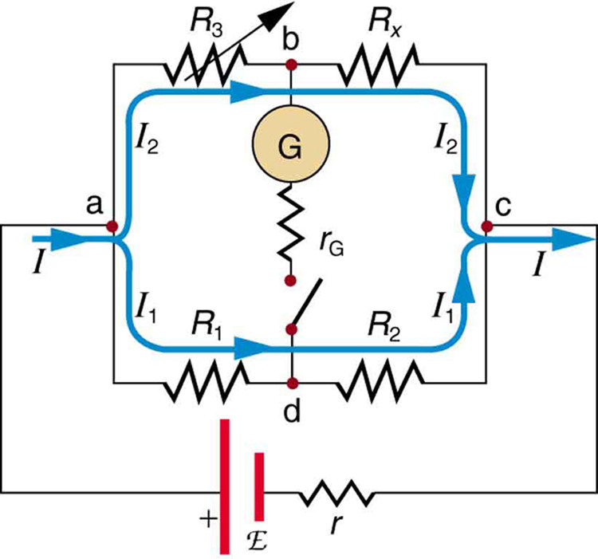

* Explain why a null measurement device is more accurate than a standard voltmeter or ammeter.
* Demonstrate how a Wheatstone bridge can be used to accurately calculate the resistance in a circuit.

Standard measurements of voltage and current alter the circuit being measured, introducing uncertainties in the measurements. Voltmeters draw some extra current, whereas ammeters reduce current flow. **Null measurements**{: data-type="term" #import-auto-id3163834} balance voltages so that there is no current flowing through the measuring device and, therefore, no alteration of the circuit being measured.

Null measurements are generally more accurate but are also more complex than the use of standard voltmeters and ammeters, and they still have limits to their precision. In this module, we shall consider a few specific types of null measurements, because they are common and interesting, and they further illuminate principles of electric circuits.

# The Potentiometer

Suppose you wish to measure the emf of a battery. Consider what happens if you connect the battery directly to a standard voltmeter as shown in [\[link\]](#import-auto-id2691925). (Once we note the problems with this measurement, we will examine a null measurement that improves accuracy.) As discussed before, the actual quantity measured is the terminal voltage <math xmlns="http://www.w3.org/1998/Math/MathML"><semantics><mrow><mrow><mi>V</mi></mrow><mrow /></mrow><annotation encoding="StarMath 5.0"> size 12{V} {}</annotation></semantics></math>

, which is related to the emf of the battery by <math xmlns="http://www.w3.org/1998/Math/MathML"><semantics><mrow><mrow><mrow><mi>V</mi><mo stretchy="false">=</mo><mrow><mtext>emf</mtext><mo stretchy="false">−</mo><mstyle fontstyle="italic"><mrow><mtext>Ir</mtext></mrow></mstyle></mrow></mrow></mrow><mrow /></mrow><annotation encoding="StarMath 5.0"> size 12{V="emf" - ital "Ir"} {}</annotation></semantics></math>

, where <math xmlns="http://www.w3.org/1998/Math/MathML"><semantics><mrow><mrow><mi>I</mi></mrow><mrow /></mrow><annotation encoding="StarMath 5.0"> size 12{I} {}</annotation></semantics></math>

 is the current that flows and <math xmlns="http://www.w3.org/1998/Math/MathML"><semantics><mrow><mrow><mi>r</mi></mrow><mrow /></mrow><annotation encoding="StarMath 5.0"> size 12{r} {}</annotation></semantics></math>

 is the internal resistance of the battery.

The emf could be accurately calculated if <math xmlns="http://www.w3.org/1998/Math/MathML"><semantics><mrow><mrow><mi>r</mi></mrow><mrow /></mrow><annotation encoding="StarMath 5.0"> size 12{r} {}</annotation></semantics></math>

 were very accurately known, but it is usually not. If the current <math xmlns="http://www.w3.org/1998/Math/MathML"><semantics><mrow><mrow><mi>I</mi></mrow><mrow /></mrow><annotation encoding="StarMath 5.0"> size 12{I} {}</annotation></semantics></math>

 could be made zero, then <math xmlns="http://www.w3.org/1998/Math/MathML"><semantics><mrow><mrow><mrow><mi>V</mi><mo stretchy="false">=</mo><mtext>emf</mtext></mrow></mrow><mrow /></mrow><annotation encoding="StarMath 5.0"> size 12{V="emf"} {}</annotation></semantics></math>

, and so emf could be directly measured. However, standard voltmeters need a current to operate; thus, another technique is needed.

 Since the internal resistance of the battery is not known precisely, it is not possible to calculate the emf precisely."){: #import-auto-id2691925 data-media-type="image/jpg"}

A **potentiometer**{: data-type="term" #import-auto-id1366643} is a null measurement device for measuring potentials (voltages). (See [\[link\]](#import-auto-id3170075).) A voltage source is connected to a resistor <math xmlns="http://www.w3.org/1998/Math/MathML"><semantics><mrow><mrow><mi>R,</mi></mrow><mrow /></mrow></semantics></math>

 say, a long wire, and passes a constant current through it. There is a steady drop in potential (an <math xmlns="http://www.w3.org/1998/Math/MathML"><semantics><mrow><mrow><mstyle fontstyle="italic"><mrow><mtext>IR</mtext></mrow></mstyle></mrow><mrow /></mrow><annotation encoding="StarMath 5.0"> size 12{ ital "IR"} {}</annotation></semantics></math>

 drop) along the wire, so that a variable potential can be obtained by making contact at varying locations along the wire.

[\[link\]](#import-auto-id3170075)(b) shows an unknown <math xmlns="http://www.w3.org/1998/Math/MathML"><semantics><mrow><mrow><msub><mtext>emf</mtext><mrow><mn>x</mn></mrow></msub></mrow><mrow /></mrow><annotation encoding="StarMath 5.0"> size 12{"emf" rSub { size 8{x} } } {}</annotation></semantics></math>

 (represented by script <math xmlns="http://www.w3.org/1998/Math/MathML"><semantics><mrow><mrow><msub><mi>E</mi><mrow><mn>x</mn></mrow></msub></mrow><mrow /></mrow><annotation encoding="StarMath 5.0"> size 12{"emf" rSub { size 8{x} } } {}</annotation></semantics></math>

 in the figure) connected in series with a galvanometer. Note that <math xmlns="http://www.w3.org/1998/Math/MathML"><semantics><mrow><mrow><msub><mtext>emf</mtext><mrow><mn>x</mn></mrow></msub></mrow><mrow /></mrow><annotation encoding="StarMath 5.0"> size 12{"emf" rSub { size 8{x} } } {}</annotation></semantics></math>

 opposes the other voltage source. The location of the contact point (see the arrow on the drawing) is adjusted until the galvanometer reads zero. When the galvanometer reads zero, <math xmlns="http://www.w3.org/1998/Math/MathML"><semantics><mrow><mrow><mrow><msub><mtext>emf</mtext><mrow><mn>x</mn></mrow></msub><mo stretchy="false">=</mo><mstyle><mrow><msub><mtext fontstyle="italic">IR</mtext><mrow><mn>x</mn></mrow></msub></mrow></mstyle></mrow></mrow><mrow /></mrow><annotation encoding="StarMath 5.0"> size 12{"emf" rSub { size 8{x} } = ital "IR" rSub { size 8{x} } } {}</annotation></semantics></math>

, where <math xmlns="http://www.w3.org/1998/Math/MathML"><semantics><mrow><mrow><msub><mi>R</mi><mrow><mn>x</mn></mrow></msub></mrow><mrow /></mrow><annotation encoding="StarMath 5.0"> size 12{R rSub { size 8{x} } } {}</annotation></semantics></math>

 is the resistance of the section of wire up to the contact point. Since no current flows through the galvanometer, none flows through the unknown emf, and so <math xmlns="http://www.w3.org/1998/Math/MathML"><semantics><mrow><mrow><msub><mtext>emf</mtext><mrow><mn>x</mn></mrow></msub></mrow><mrow /></mrow><annotation encoding="StarMath 5.0"> size 12{"emf" rSub { size 8{x} } } {}</annotation></semantics></math>

 is directly sensed.

Now, a very precisely known standard <math xmlns="http://www.w3.org/1998/Math/MathML"><semantics><mrow><mrow><msub><mtext>emf</mtext><mrow><mn>s</mn></mrow></msub></mrow><mrow /></mrow><annotation encoding="StarMath 5.0"> size 12{"emf" rSub { size 8{s} } } {}</annotation></semantics></math>

 is substituted for <math xmlns="http://www.w3.org/1998/Math/MathML"><semantics><mrow><mrow><msub><mtext>emf</mtext><mrow><mn>x</mn></mrow></msub></mrow><mrow /></mrow><annotation encoding="StarMath 5.0"> size 12{"emf" rSub { size 8{x} } } {}</annotation></semantics></math>

, and the contact point is adjusted until the galvanometer again reads zero, so that <math xmlns="http://www.w3.org/1998/Math/MathML"><semantics><mrow><mrow><mrow><msub><mtext>emf</mtext><mrow><mn>s</mn></mrow></msub><mo stretchy="false">=</mo><mstyle><mrow><msub><mtext fontstyle="italic">IR</mtext><mrow><mn>s</mn></mrow></msub></mrow></mstyle></mrow></mrow><mrow /></mrow><annotation encoding="StarMath 5.0"> size 12{"emf" rSub { size 8{s} } = ital "IR" rSub { size 8{s} } } {}</annotation></semantics></math>

. In both cases, no current passes through the galvanometer, and so the current <math xmlns="http://www.w3.org/1998/Math/MathML"><semantics><mrow><mrow><mi>I</mi></mrow><mrow /></mrow><annotation encoding="StarMath 5.0"> size 12{I} {}</annotation></semantics></math>

 through the long wire is the same. Upon taking the ratio <math xmlns="http://www.w3.org/1998/Math/MathML"><semantics><mrow><mrow> <mfrac><msub><mtext>emf</mtext><mrow><mn>x</mn></mrow></msub><msub><mtext>emf</mtext><mrow><mn>s</mn></mrow></msub></mfrac></mrow><mrow /></mrow><annotation encoding="StarMath 5.0"> size 12{ { {"emf" rSub { size 8{x} } } over {"emf" rSub { size 8{s} } } } } {}</annotation></semantics></math>

, <math xmlns="http://www.w3.org/1998/Math/MathML"><semantics><mrow><mrow><mi>I</mi></mrow><mrow /></mrow><annotation encoding="StarMath 5.0"> size 12{I} {}</annotation></semantics></math>

 cancels, giving

<math xmlns="http://www.w3.org/1998/Math/MathML"><semantics><mrow><mrow><mrow><mrow><mfrac><msub><mtext>emf</mtext><mrow><mn>x</mn></mrow></msub><msub><mtext>emf</mtext><mrow><mn>s</mn></mrow></msub></mfrac><mo stretchy="false">=</mo><mfrac><mstyle><mrow><msub><mtext fontstyle="italic">IR</mtext><mrow><mn>x</mn></mrow></msub></mrow></mstyle><mstyle><mrow><msub><mtext fontstyle="italic">IR</mtext><mrow><mn>s</mn></mrow></msub></mrow></mstyle></mfrac></mrow><mo stretchy="false">=</mo><mfrac><msub><mi>R</mi><mrow><mn>x</mn></mrow></msub><msub><mi>R</mi><mrow><mn>s</mn></mrow></msub></mfrac></mrow></mrow><mrow /><mo>.</mo></mrow><annotation encoding="StarMath 5.0"> size 12{ { {"emf" rSub { size 8{x} } } over {"emf" rSub { size 8{s} } } } = { { ital "IR" rSub { size 8{x} } } over { ital "IR" rSub { size 8{s} } } } = { {R rSub { size 8{x} } } over {R rSub { size 8{s} } } } } {}</annotation></semantics></math>

Solving for <math xmlns="http://www.w3.org/1998/Math/MathML"><semantics><mrow><mrow><msub><mtext>emf</mtext><mrow><mn>x</mn></mrow></msub></mrow><mrow /></mrow><annotation encoding="StarMath 5.0"> size 12{"emf" rSub { size 8{x} } } {}</annotation></semantics></math>

 gives

<math xmlns="http://www.w3.org/1998/Math/MathML"><semantics><mrow><mrow><mrow><mrow><msub><mtext>emf</mtext><mrow><mn>x</mn></mrow></msub><mo stretchy="false">=</mo><msub><mtext>emf</mtext><mrow><mn>s</mn></mrow></msub></mrow><mfrac><msub><mi>R</mi><mrow><mn>x</mn></mrow></msub><msub><mi>R</mi><mrow><mn>s</mn></mrow></msub></mfrac></mrow></mrow><mrow /><mo>.</mo></mrow><annotation encoding="StarMath 5.0"> size 12{"emf" rSub { size 8{x} } ="emf" rSub { size 8{s} } { {R rSub { size 8{x} } } over {R rSub { size 8{s} } } } } {}</annotation></semantics></math>

 A voltage source connected to a long wire resistor passes a constant current I size 12{I} {} through it. (b) An unknown emf (labeled script Ex in the figure) is connected as shown, and the point of contact along R size 12{R} {} is adjusted until the galvanometer reads zero. The segment of wire has a resistance Rx size 12{R rSub { size 8{x} } } {} and script Ex=IRx size 12{E rSub { size 8{x} } = ital &quot;IR&quot; rSub { size 8{x} } } {}, where I size 12{I} {} is unaffected by the connection since no current flows through the galvanometer. The unknown emf is thus proportional to the resistance of the wire segment."){: #import-auto-id3170075 data-media-type="image/jpg"}

Because a long uniform wire is used for <math xmlns="http://www.w3.org/1998/Math/MathML"><semantics><mrow><mrow><mi>R</mi></mrow><mrow /></mrow><annotation encoding="StarMath 5.0"> size 12{R} {}</annotation></semantics></math>

, the ratio of resistances <math xmlns="http://www.w3.org/1998/Math/MathML"><semantics><mrow><mrow><mrow><msub><mi>R</mi><mrow><mtext>x</mtext></mrow></msub><mo stretchy="false">/</mo><msub><mi>R</mi><mrow><mtext>s</mtext></mrow></msub></mrow></mrow><mrow /></mrow><annotation encoding="StarMath 5.0"> size 12{R rSub { size 8{x} } /R rSub { size 8{s} } } {}</annotation></semantics></math>

 is the same as the ratio of the lengths of wire that zero the galvanometer for each emf. The three quantities on the right-hand side of the equation are now known or measured, and <math xmlns="http://www.w3.org/1998/Math/MathML"><semantics><mrow><mrow><msub><mtext>emf</mtext><mrow><mtext>x</mtext></mrow></msub></mrow><mrow /></mrow><annotation encoding="StarMath 5.0"> size 12{"emf" rSub { size 8{x} } } {}</annotation></semantics></math>

 can be calculated. The uncertainty in this calculation can be considerably smaller than when using a voltmeter directly, but it is not zero. There is always some uncertainty in the ratio of resistances <math xmlns="http://www.w3.org/1998/Math/MathML"><semantics><mrow><mrow><mrow><msub><mi>R</mi><mrow><mtext>x</mtext></mrow></msub><mo stretchy="false">/</mo><msub><mi>R</mi><mrow><mtext>s</mtext></mrow></msub></mrow></mrow><mrow /></mrow><annotation encoding="StarMath 5.0"> size 12{R rSub { size 8{x} } /R rSub { size 8{s} } } {}</annotation></semantics></math>

 and in the standard <math xmlns="http://www.w3.org/1998/Math/MathML"><semantics><mrow><mrow><msub><mtext>emf</mtext><mrow><mn>s</mn></mrow></msub></mrow><mrow /></mrow><annotation encoding="StarMath 5.0"> size 12{"emf" rSub { size 8{s} } } {}</annotation></semantics></math>

. Furthermore, it is not possible to tell when the galvanometer reads exactly zero, which introduces error into both <math xmlns="http://www.w3.org/1998/Math/MathML"><semantics><mrow><mrow><msub><mi>R</mi><mrow><mtext>x</mtext></mrow></msub></mrow><mrow /></mrow><annotation encoding="StarMath 5.0"> size 12{R rSub { size 8{x} } } {}</annotation></semantics></math>

 and <math xmlns="http://www.w3.org/1998/Math/MathML"><semantics><mrow><mrow><msub><mi>R</mi><mrow><mtext>s</mtext></mrow></msub></mrow><mrow /></mrow><annotation encoding="StarMath 5.0"> size 12{R rSub { size 8{s} } } {}</annotation></semantics></math>

, and may also affect the current <math xmlns="http://www.w3.org/1998/Math/MathML"><semantics><mrow><mrow><mi>I</mi></mrow><mrow /></mrow><annotation encoding="StarMath 5.0"> size 12{I} {}</annotation></semantics></math>

.

# Resistance Measurements and the Wheatstone Bridge

There is a variety of so-called **ohmmeters**{: data-type="term" #import-auto-id1228614} that purport to measure resistance. What the most common ohmmeters actually do is to apply a voltage to a resistance, measure the current, and calculate the resistance using Ohm’s law. Their readout is this calculated resistance. Two configurations for ohmmeters using standard voltmeters and ammeters are shown in [\[link\]](#import-auto-id3027669). Such configurations are limited in accuracy, because the meters alter both the voltage applied to the resistor and the current that flows through it.

 Assuming a known voltage for the source, an ammeter measures current, and resistance is calculated as R=VI size 12{R= {  {V}  over  {I} } } {}. (b) Since the terminal voltage V size 12{V} {} varies with current, it is better to measure it. V size 12{V} {} is most accurately known when I size 12{I} {} is small, but I size 12{I} {} itself is most accurately known when it is large."){: #import-auto-id3027669 data-media-type="image/jpg"}

The **Wheatstone bridge**{: data-type="term" #import-auto-id2384409} is a null measurement device for calculating resistance by balancing potential drops in a circuit. (See [\[link\]](#import-auto-id2446499).) The device is called a bridge because the galvanometer forms a bridge between two branches. A variety of **bridge devices**{: data-type="term" #import-auto-id2058145} are used to make null measurements in circuits.

Resistors <math xmlns="http://www.w3.org/1998/Math/MathML"><semantics><mrow><mrow><msub><mi>R</mi><mrow><mn>1</mn></mrow></msub></mrow><mrow /></mrow><annotation encoding="StarMath 5.0"> size 12{R rSub { size 8{1} } } {}</annotation></semantics></math>

 and <math xmlns="http://www.w3.org/1998/Math/MathML"><semantics><mrow><mrow><msub><mi>R</mi><mrow><mn>2</mn></mrow></msub></mrow><mrow /></mrow><annotation encoding="StarMath 5.0"> size 12{R rSub { size 8{2} } } {}</annotation></semantics></math>

 are precisely known, while the arrow through <math xmlns="http://www.w3.org/1998/Math/MathML"><semantics><mrow><mrow><msub><mi>R</mi><mrow><mn>3</mn></mrow></msub></mrow><mrow /></mrow><annotation encoding="StarMath 5.0"> size 12{R rSub { size 8{3} } } {}</annotation></semantics></math>

 indicates that it is a variable resistance. The value of <math xmlns="http://www.w3.org/1998/Math/MathML"><semantics><mrow><mrow><msub><mi>R</mi><mrow><mn>3</mn></mrow></msub></mrow><mrow /></mrow><annotation encoding="StarMath 5.0"> size 12{R rSub { size 8{3} } } {}</annotation></semantics></math>

 can be precisely read. With the unknown resistance <math xmlns="http://www.w3.org/1998/Math/MathML"><semantics><mrow><mrow><msub><mi>R</mi><mrow><mn>x</mn></mrow></msub></mrow><mrow /></mrow><annotation encoding="StarMath 5.0"> size 12{R rSub { size 8{x} } } {}</annotation></semantics></math>

 in the circuit, <math xmlns="http://www.w3.org/1998/Math/MathML"><semantics><mrow><mrow><msub><mi>R</mi><mrow><mn>3</mn></mrow></msub></mrow><mrow /></mrow><annotation encoding="StarMath 5.0"> size 12{R rSub { size 8{3} } } {}</annotation></semantics></math>

 is adjusted until the galvanometer reads zero. The potential difference between points b and d is then zero, meaning that b and d are at the same potential. With no current running through the galvanometer, it has no effect on the rest of the circuit. So the branches abc and adc are in parallel, and each branch has the full voltage of the source. That is, the <math xmlns="http://www.w3.org/1998/Math/MathML"><semantics><mrow><mrow><mstyle fontstyle="italic"><mrow><mtext>IR</mtext></mrow></mstyle></mrow><mrow /></mrow><annotation encoding="StarMath 5.0"> size 12{ ital "IR"} {}</annotation></semantics></math>

 drops along abc and adc are the same. Since b and d are at the same potential, the <math xmlns="http://www.w3.org/1998/Math/MathML"><semantics><mrow><mrow><mstyle fontstyle="italic"><mrow><mtext>IR</mtext></mrow></mstyle></mrow><mrow /></mrow><annotation encoding="StarMath 5.0"> size 12{ ital "IR"} {}</annotation></semantics></math>

 drop along ad must equal the <math xmlns="http://www.w3.org/1998/Math/MathML"><semantics><mrow><mrow><mstyle><mrow><mtext fontstyle="italic">IR</mtext></mrow></mstyle></mrow><mrow /></mrow><annotation encoding="StarMath 5.0"> size 12{ ital "IR"} {}</annotation></semantics></math>

 drop along ab. Thus,

<math xmlns="http://www.w3.org/1998/Math/MathML"><semantics><mrow><mrow><mrow><msub><mi>I</mi><mrow><mn>1</mn></mrow></msub><mrow><msub><mi>R</mi><mrow><mn>1</mn></mrow></msub><mo stretchy="false">=</mo><msub><mi>I</mi><mrow><mn>2</mn></mrow></msub></mrow><msub><mi>R</mi><mrow><mn>3</mn></mrow></msub></mrow></mrow><mrow /><mo>.</mo></mrow><annotation encoding="StarMath 5.0"> size 12{I rSub { size 8{1} } R rSub { size 8{1} } =I rSub { size 8{2} } R rSub { size 8{3} } } {}</annotation></semantics></math>

Again, since b and d are at the same potential, the <math xmlns="http://www.w3.org/1998/Math/MathML"><semantics><mrow><mrow><mstyle fontstyle="italic"><mrow><mtext>IR</mtext></mrow></mstyle></mrow><mrow /></mrow><annotation encoding="StarMath 5.0"> size 12{ ital "IR"} {}</annotation></semantics></math>

 drop along dc must equal the <math xmlns="http://www.w3.org/1998/Math/MathML"><semantics><mrow><mrow><mstyle fontstyle="italic"><mrow><mtext>IR</mtext></mrow></mstyle></mrow><mrow /></mrow><annotation encoding="StarMath 5.0"> size 12{ ital "IR"} {}</annotation></semantics></math>

 drop along bc. Thus,

<math xmlns="http://www.w3.org/1998/Math/MathML"><semantics><mrow><mrow><mrow><msub><mi>I</mi><mrow><mn>1</mn></mrow></msub><mrow><msub><mi>R</mi><mrow><mn>2</mn></mrow></msub><mo stretchy="false">=</mo><msub><mi>I</mi><mrow><mn>2</mn></mrow></msub></mrow><msub><mi>R</mi><mrow><mtext>x</mtext></mrow></msub></mrow></mrow><mrow /><mo>.</mo></mrow><annotation encoding="StarMath 5.0"> size 12{I rSub { size 8{1} } R rSub { size 8{2} } =I rSub { size 8{2} } R rSub { size 8{x} } } {}</annotation></semantics></math>

Taking the ratio of these last two expressions gives

<math xmlns="http://www.w3.org/1998/Math/MathML"><semantics><mrow><mrow><mrow><mfrac><mrow><msub><mi>I</mi><mrow><mn>1</mn></mrow></msub><msub><mi>R</mi><mrow><mn>1</mn></mrow></msub></mrow><mrow><msub><mi>I</mi><mrow><mn>1</mn></mrow></msub><msub><mi>R</mi><mrow><mn>2</mn></mrow></msub></mrow></mfrac><mo stretchy="false">=</mo><mfrac><mrow><msub><mi>I</mi><mrow><mn>2</mn></mrow></msub><msub><mi>R</mi><mrow><mn>3</mn></mrow></msub></mrow><mrow><msub><mi>I</mi><mrow><mn>2</mn></mrow></msub><msub><mi>R</mi><mrow><mn>x</mn></mrow></msub></mrow></mfrac></mrow></mrow><mrow /><mo>.</mo></mrow><annotation encoding="StarMath 5.0"> size 12{ { {I rSub { size 8{1} } R rSub { size 8{1} } } over {I rSub { size 8{1} } R rSub { size 8{2} } } } = { {I rSub { size 8{2} } R rSub { size 8{3} } } over {I rSub { size 8{2} } R rSub { size 8{x} } } } } {}</annotation></semantics></math>

Canceling the currents and solving for Rx yields

<math xmlns="http://www.w3.org/1998/Math/MathML"><semantics><mrow><mrow><mrow><mrow><msub><mi>R</mi><mrow><mtext>x</mtext></mrow></msub><mo stretchy="false">=</mo><msub><mi>R</mi><mrow><mn>3</mn></mrow></msub></mrow><mfrac><msub><mi>R</mi><mrow><mn>2</mn></mrow></msub><msub><mi>R</mi><mrow><mn>1</mn></mrow></msub></mfrac></mrow></mrow><mrow /><mo>.</mo></mrow><annotation encoding="StarMath 5.0"> size 12{R rSub { size 8{x} } =R rSub { size 8{3} } { {R rSub { size 8{2} } } over {R rSub { size 8{1} } } } } {}</annotation></semantics></math>

{: #import-auto-id2446499 data-media-type="image/jpg"}

This equation is used to calculate the unknown resistance when current through the galvanometer is zero. This method can be very accurate (often to four significant digits), but it is limited by two factors. First, it is not possible to get the current through the galvanometer to be exactly zero. Second, there are always uncertainties in <math xmlns="http://www.w3.org/1998/Math/MathML"><semantics><mrow><mrow><msub><mi>R</mi><mrow><mn>1</mn></mrow></msub></mrow><mrow /></mrow><annotation encoding="StarMath 5.0"> size 12{R rSub { size 8{1} } } {}</annotation></semantics></math>

, <math xmlns="http://www.w3.org/1998/Math/MathML"><semantics><mrow><mrow><msub><mi>R</mi><mrow><mn>2</mn></mrow></msub></mrow><mrow /></mrow><annotation encoding="StarMath 5.0"> size 12{R rSub { size 8{2} } } {}</annotation></semantics></math>

, and <math xmlns="http://www.w3.org/1998/Math/MathML"><semantics><mrow><mrow><msub><mi>R</mi><mrow><mn>3</mn></mrow></msub></mrow><mrow /></mrow><annotation encoding="StarMath 5.0"> size 12{R rSub { size 8{3} } } {}</annotation></semantics></math>

, which contribute to the uncertainty in <math xmlns="http://www.w3.org/1998/Math/MathML"><semantics><mrow><mrow><msub><mi>R</mi><mrow><mn>x</mn></mrow></msub></mrow><mrow /></mrow><annotation encoding="StarMath 5.0"> size 12{R rSub { size 8{x} } } {}</annotation></semantics></math>

.

Check Your Understanding

Identify other factors that might limit the accuracy of null measurements. Would the use of a digital device that is more sensitive than a galvanometer improve the accuracy of null measurements?

One factor would be resistance in the wires and connections in a null measurement. These are impossible to make zero, and they can change over time. Another factor would be temperature variations in resistance, which can be reduced but not completely eliminated by choice of material. Digital devices sensitive to smaller currents than analog devices do improve the accuracy of null measurements because they allow you to get the current closer to zero.
{: xmlns:fo="urn:oasis:names:tc:opendocument:xmlns:xsl-fo-compatible:1.0" fo:font-weight="normal"}

# Section Summary

* {: #import-auto-id2396485} Null measurement techniques achieve greater accuracy by balancing a circuit so that no current flows through the measuring device.
* {: #import-auto-id2971477} One such device, for determining voltage, is a potentiometer.
* {: #import-auto-id1596308} Another null measurement device, for determining resistance, is the Wheatstone bridge.
* {: #import-auto-id2648444} Other physical quantities can also be measured with null measurement techniques.

# Conceptual questions

Why can a null measurement be more accurate than one using standard voltmeters and ammeters? What factors limit the accuracy of null measurements?

If a potentiometer is used to measure cell emfs on the order of a few volts, why is it most accurate for the standard <math xmlns="http://www.w3.org/1998/Math/MathML"><semantics><mrow><mrow><msub><mtext>emf</mtext><mrow><mtext>s</mtext></mrow></msub></mrow><mrow /></mrow><annotation encoding="StarMath 5.0"> size 12{"emf" rSub { size 8{s} } } {}</annotation></semantics></math>

 to be the same order of magnitude and the resistances to be in the range of a few ohms?

# Problem Exercises

What is the <math xmlns="http://www.w3.org/1998/Math/MathML"><semantics><mrow><mrow><msub><mtext>emf</mtext><mrow><mtext>x</mtext></mrow></msub></mrow><mrow /></mrow><annotation encoding="StarMath 5.0"> size 12{"emf" rSub { size 8{x} } } {}</annotation></semantics></math>

 of a cell being measured in a potentiometer, if the standard cell’s emf is 12.0 V and the potentiometer balances for <math xmlns="http://www.w3.org/1998/Math/MathML"><semantics><mrow><mrow><mrow><mrow><msub><mi>R</mi><mrow><mtext>x</mtext></mrow></msub><mo stretchy="false">=</mo><mn>5</mn></mrow><mtext>.</mtext><mtext>000</mtext><mspace width="0.15em" /><mo stretchy="false">Ω</mo></mrow></mrow><mrow /></mrow><annotation encoding="StarMath 5.0"> size 12{R rSub { size 8{x} } =5 "." "000" %OMEGA } {}</annotation></semantics></math>

 and <math xmlns="http://www.w3.org/1998/Math/MathML"><semantics><mrow><mrow><mrow><mrow><msub><mi>R</mi><mrow><mtext>s</mtext></mrow></msub><mo stretchy="false">=</mo><mn>2</mn></mrow><mtext>.</mtext><mtext>500</mtext><mspace width="0.15em" /><mo stretchy="false">Ω</mo></mrow></mrow><mrow /></mrow><annotation encoding="StarMath 5.0"> size 12{R rSub { size 8{s} } =2 "." "500" %OMEGA } {}</annotation></semantics></math>

?

24\.0 V

Calculate the <math xmlns="http://www.w3.org/1998/Math/MathML"><semantics><mrow><mrow><msub><mtext>emf</mtext><mrow><mtext>x</mtext></mrow></msub></mrow><mrow /></mrow><annotation encoding="StarMath 5.0"> size 12{"emf" rSub { size 8{x} } } {}</annotation></semantics></math>

 of a dry cell for which a potentiometer is balanced when <math xmlns="http://www.w3.org/1998/Math/MathML"><semantics><mrow><mrow><mrow><mrow><msub><mi>R</mi><mrow><mtext>x</mtext></mrow></msub><mo stretchy="false">=</mo><mn>1</mn></mrow><mtext>.</mtext><mtext>200</mtext><mspace width="0.25em" /><mo stretchy="false">Ω</mo></mrow></mrow><mrow /></mrow><annotation encoding="StarMath 5.0"> size 12{R rSub { size 8{x} } =1 "." "200" %OMEGA } {}</annotation></semantics></math>

, while an alkaline standard cell with an emf of 1.600 V requires <math xmlns="http://www.w3.org/1998/Math/MathML"><semantics><mrow><mrow><mrow><mrow><msub><mi>R</mi><mrow><mtext>s</mtext></mrow></msub><mo stretchy="false">=</mo><mn>1</mn></mrow><mtext>.</mtext><mtext>247</mtext><mspace width="0.25em" /><mo stretchy="false">Ω</mo></mrow></mrow><mrow /></mrow><annotation encoding="StarMath 5.0"> size 12{R rSub { size 8{s} } =1 "." "247" %OMEGA } {}</annotation></semantics></math>

 to balance the potentiometer.

When an unknown resistance <math xmlns="http://www.w3.org/1998/Math/MathML"><semantics><mrow><mrow><msub><mi>R</mi><mrow><mtext>x</mtext></mrow></msub></mrow><mrow /></mrow><annotation encoding="StarMath 5.0"> size 12{R rSub { size 8{x} } } {}</annotation></semantics></math>

 is placed in a Wheatstone bridge, it is possible to balance the bridge by adjusting <math xmlns="http://www.w3.org/1998/Math/MathML"><semantics><mrow><mrow><msub><mi>R</mi><mrow><mn>3</mn></mrow></msub></mrow><mrow /></mrow><annotation encoding="StarMath 5.0"> size 12{R rSub { size 8{3} } } {}</annotation></semantics></math>

 to be <math xmlns="http://www.w3.org/1998/Math/MathML"><semantics><mrow><mrow><mrow><mtext>2500</mtext><mspace width="0.25em" /><mo stretchy="false">Ω</mo></mrow></mrow><mrow /></mrow><annotation encoding="StarMath 5.0"> size 12{"2500" %OMEGA } {}</annotation></semantics></math>

. What is <math xmlns="http://www.w3.org/1998/Math/MathML"><semantics><mrow><mrow><msub><mi>R</mi><mrow><mtext>x</mtext></mrow></msub></mrow><mrow /></mrow><annotation encoding="StarMath 5.0"> size 12{R rSub { size 8{x} } } {}</annotation></semantics></math>

 if <math xmlns="http://www.w3.org/1998/Math/MathML"><semantics><mrow><mrow><mrow><mrow><mfrac><msub><mi>R</mi><mrow><mn>2</mn></mrow></msub><msub><mi>R</mi><mrow><mn>1</mn></mrow></msub></mfrac><mo stretchy="false">=</mo><mn>0</mn></mrow><mtext>.</mtext><mtext>625</mtext></mrow></mrow><mrow /></mrow><annotation encoding="StarMath 5.0"> size 12{ { {R rSub { size 8{2} } } over {R rSub { size 8{1} } } } =0 "." "625"} {}</annotation></semantics></math>

?

<math xmlns="http://www.w3.org/1998/Math/MathML"> <semantics> <mrow> <mrow> <mrow> <mn>1</mn> <mtext>.</mtext> <mtext>56 k</mtext> <mo stretchy="false">Ω</mo> </mrow> </mrow> <mrow /> </mrow> <annotation encoding="StarMath 5.0"> size 12{1 "." "56 k" %OMEGA } {}</annotation> </semantics> </math>

To what value must you adjust <math xmlns="http://www.w3.org/1998/Math/MathML"><semantics><mrow><mrow><msub><mi>R</mi><mrow><mn>3</mn></mrow></msub></mrow><mrow /></mrow><annotation encoding="StarMath 5.0"> size 12{R rSub { size 8{3} } } {}</annotation></semantics></math>

 to balance a Wheatstone bridge, if the unknown resistance <math xmlns="http://www.w3.org/1998/Math/MathML"><semantics><mrow><mrow><msub><mi>R</mi><mrow><mtext>x</mtext></mrow></msub></mrow><mrow /></mrow><annotation encoding="StarMath 5.0"> size 12{R rSub { size 8{x} } } {}</annotation></semantics></math>

 is <math xmlns="http://www.w3.org/1998/Math/MathML"><semantics><mrow><mrow><mrow><mtext>100</mtext><mspace width="0.15em" /><mo stretchy="false">Ω</mo></mrow></mrow><mrow /></mrow><annotation encoding="StarMath 5.0"> size 12{"100" %OMEGA } {}</annotation></semantics></math>

, <math xmlns="http://www.w3.org/1998/Math/MathML"><semantics><mrow><mrow><msub><mi>R</mi><mrow><mn>1</mn></mrow></msub></mrow><mrow /></mrow><annotation encoding="StarMath 5.0"> size 12{R rSub { size 8{1} } } {}</annotation></semantics></math>

 is <math xmlns="http://www.w3.org/1998/Math/MathML"><semantics><mrow><mrow><mrow><mtext>50</mtext><mtext>.</mtext><mn>0</mn><mspace width="0.15em" /><mo stretchy="false">Ω</mo></mrow></mrow><mrow /></mrow><annotation encoding="StarMath 5.0"> size 12{"50" "." 0 %OMEGA } {}</annotation></semantics></math>

, and <math xmlns="http://www.w3.org/1998/Math/MathML"><semantics><mrow><mrow><msub><mi>R</mi><mrow><mn>2</mn></mrow></msub></mrow><mrow /></mrow><annotation encoding="StarMath 5.0"> size 12{R rSub { size 8{2} } } {}</annotation></semantics></math>

 is <math xmlns="http://www.w3.org/1998/Math/MathML"><semantics><mrow><mrow><mrow><mtext>175</mtext><mspace width="0.15em" /><mo stretchy="false">Ω</mo></mrow></mrow><mrow /></mrow><annotation encoding="StarMath 5.0"> size 12{"175" %OMEGA } {}</annotation></semantics></math>

?

(a) What is the unknown <math xmlns="http://www.w3.org/1998/Math/MathML"><semantics><mrow><mrow><msub><mtext>emf</mtext><mrow><mtext>x</mtext></mrow></msub></mrow><mrow /></mrow><annotation encoding="StarMath 5.0"> size 12{"emf" rSub { size 8{x} } } {}</annotation></semantics></math>

 in a potentiometer that balances when <math xmlns="http://www.w3.org/1998/Math/MathML"><semantics><mrow><mrow><msub><mi>R</mi><mrow><mtext>x</mtext></mrow></msub></mrow><mrow /></mrow><annotation encoding="StarMath 5.0"> size 12{R rSub { size 8{x} } } {}</annotation></semantics></math>

 is <math xmlns="http://www.w3.org/1998/Math/MathML"><semantics><mrow><mrow><mrow><mtext>10</mtext><mtext>.</mtext><mn>0</mn><mspace width="0.15em" /><mo stretchy="false">Ω</mo></mrow></mrow><mrow /></mrow><annotation encoding="StarMath 5.0"> size 12{"10" "." 0 %OMEGA } {}</annotation></semantics></math>

, and balances when <math xmlns="http://www.w3.org/1998/Math/MathML"><semantics><mrow><mrow><msub><mi>R</mi><mrow><mtext>s</mtext></mrow></msub></mrow><mrow /></mrow><annotation encoding="StarMath 5.0"> size 12{R rSub { size 8{s} } } {}</annotation></semantics></math>

 is <math xmlns="http://www.w3.org/1998/Math/MathML"><semantics><mrow><mrow><mrow><mtext>15</mtext><mtext>.</mtext><mn>0</mn><mspace width="0.15em" /><mo stretchy="false">Ω</mo></mrow></mrow><mrow /></mrow><annotation encoding="StarMath 5.0"> size 12{"15" "." 0 %OMEGA } {}</annotation></semantics></math>

 for a standard 3.000-V emf? (b) The same <math xmlns="http://www.w3.org/1998/Math/MathML"><semantics><mrow><mrow><msub><mtext>emf</mtext><mrow><mtext>x</mtext></mrow></msub></mrow><mrow /></mrow><annotation encoding="StarMath 5.0"> size 12{"emf" rSub { size 8{x} } } {}</annotation></semantics></math>

 is placed in the same potentiometer, which now balances when <math xmlns="http://www.w3.org/1998/Math/MathML"><semantics><mrow><mrow><msub><mi>R</mi><mrow><mtext>s</mtext></mrow></msub></mrow><mrow /></mrow><annotation encoding="StarMath 5.0"> size 12{R rSub { size 8{s} } } {}</annotation></semantics></math>

 is <math xmlns="http://www.w3.org/1998/Math/MathML"><semantics><mrow><mrow><mrow><mtext>15</mtext><mtext>.</mtext><mn>0</mn><mspace width="0.15em" /><mo stretchy="false">Ω</mo></mrow></mrow><mrow /></mrow><annotation encoding="StarMath 5.0"> size 12{"15" "." 0 %OMEGA } {}</annotation></semantics></math>

 for a standard emf of 3.100 V. At what resistance <math xmlns="http://www.w3.org/1998/Math/MathML"><semantics><mrow><mrow><msub><mi>R</mi><mrow><mtext>x</mtext></mrow></msub></mrow><mrow /></mrow><annotation encoding="StarMath 5.0"> size 12{R rSub { size 8{x} } } {}</annotation></semantics></math>

 will the potentiometer balance?

(a) 2.00 V

(b) <math xmlns="http://www.w3.org/1998/Math/MathML"><semantics><mrow><mrow><mrow><mn>9</mn><mtext>.</mtext><mtext>68 </mtext><mspace width="0.25em" /><mo stretchy="false">Ω</mo></mrow></mrow><mrow /></mrow><annotation encoding="StarMath 5.0"> size 12{9 "." "68 " %OMEGA } {}</annotation></semantics></math>

Suppose you want to measure resistances in the range from <math xmlns="http://www.w3.org/1998/Math/MathML"><semantics><mrow><mrow><mrow><mtext>10</mtext><mtext>.</mtext><mn>0</mn><mspace width="0.25em" /><mo stretchy="false">Ω</mo></mrow></mrow><mrow /></mrow><annotation encoding="StarMath 5.0"> size 12{"10" "." 0 %OMEGA } {}</annotation></semantics></math>

 to <math xmlns="http://www.w3.org/1998/Math/MathML"><semantics><mrow><mrow><mrow><mtext>10</mtext><mtext>.</mtext><mn>0 kΩ</mn></mrow></mrow><mrow /></mrow><annotation encoding="StarMath 5.0"> size 12{"10" "." 0" k" %OMEGA } {}</annotation></semantics></math>

 using a Wheatstone bridge that has <math xmlns="http://www.w3.org/1998/Math/MathML"><semantics><mrow><mrow><mrow><mrow><mfrac><msub><mi>R</mi><mrow><mn>2</mn></mrow></msub><msub><mi>R</mi><mrow><mn>1</mn></mrow></msub></mfrac><mo stretchy="false">=</mo><mn>2</mn></mrow><mtext>.</mtext><mtext>000</mtext></mrow></mrow><mrow /></mrow><annotation encoding="StarMath 5.0"> size 12{ { {R rSub { size 8{2} } } over {R rSub { size 8{1} } } } =2 "." "000"} {}</annotation></semantics></math>

. Over what range should <math xmlns="http://www.w3.org/1998/Math/MathML"><semantics><mrow><mrow><msub><mi>R</mi><mrow><mn>3</mn></mrow></msub></mrow><mrow /></mrow><annotation encoding="StarMath 5.0"> size 12{R rSub { size 8{3} } } {}</annotation></semantics></math>

 be adjustable?

<math xmlns="http://www.w3.org/1998/Math/MathML"> <semantics> <mrow> <mrow> <mrow> <mtext>Range = 5</mtext> <mtext>.</mtext> <mtext>00 </mtext><mspace width="0.25em" /> <mo stretchy="false">Ω</mo><mspace width="0.25em" /> <mtext> to </mtext><mspace width="0.25em" /> <mn>5</mn> <mtext>.</mtext> <mtext>00</mtext><mspace width="0.25em" /> <mtext> k</mtext> <mo stretchy="false">Ω</mo> </mrow> </mrow> <mrow /> </mrow> <annotation encoding="StarMath 5.0"> size 12{"Range=5" "." "00 " %OMEGA " to "5 "." "00"" k" %OMEGA } {}</annotation> </semantics> </math>

