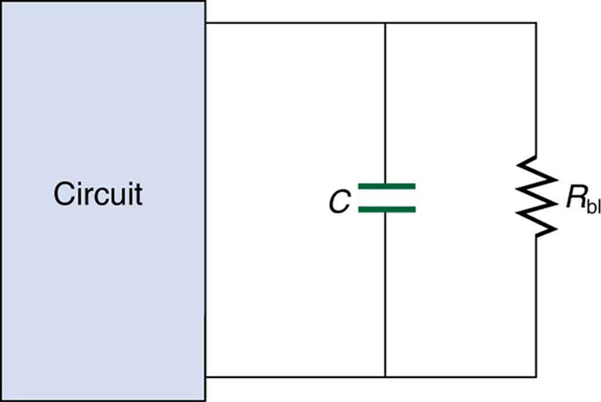

* Explain the importance of the time constant, τ , and calculate the time constant for a given resistance and capacitance.
* Explain why batteries in a flashlight gradually lose power and the light dims over time.
* Describe what happens to a graph of the voltage across a capacitor over time as it charges.
* Explain how a timing circuit works and list some applications.
* Calculate the necessary speed of a strobe flash needed to “stop” the movement of an object over a particular length.

When you use a flash camera, it takes a few seconds to charge the capacitor that powers the flash. The light flash discharges the capacitor in a tiny fraction of a second. Why does charging take longer than discharging? This question and a number of other phenomena that involve charging and discharging capacitors are discussed in this module.

# *RC* Circuits

An **<math xmlns="http://www.w3.org/1998/Math/MathML"><semantics><mrow><mrow><mstyle fontstyle="italic"><mrow><mtext mathvariant="bold">RC</mtext></mrow></mstyle></mrow><mrow /></mrow><annotation encoding="StarMath 5.0"> size 12{ ital "RC"} {}</annotation></semantics></math>

 circuit**{: data-type="term" #import-auto-id2660453} is one containing a **resistor**{: data-type="term" #import-auto-id1930108}<math xmlns="http://www.w3.org/1998/Math/MathML"><semantics><mrow><mrow><mspace width="0.25em" /><mi>R</mi></mrow><mrow /></mrow><annotation encoding="StarMath 5.0"> size 12{R} {}</annotation></semantics></math>

 and a **capacitor**{: data-type="term" #import-auto-id1615970} <math xmlns="http://www.w3.org/1998/Math/MathML"><semantics><mrow><mrow><mi>C</mi></mrow><mrow /></mrow><annotation encoding="StarMath 5.0"> size 12{C} {}</annotation></semantics></math>

. The capacitor is an electrical component that stores electric charge.

[\[link\]](#import-auto-id1907896) shows a simple <math xmlns="http://www.w3.org/1998/Math/MathML"><semantics><mrow><mrow><mstyle fontstyle="italic"><mrow><mtext>RC</mtext></mrow></mstyle></mrow><mrow /></mrow><annotation encoding="StarMath 5.0"> size 12{ ital "RC"} {}</annotation></semantics></math>

 circuit that employs a DC (direct current) voltage source. The capacitor is initially uncharged. As soon as the switch is closed, current flows to and from the initially uncharged capacitor. As charge increases on the capacitor plates, there is increasing opposition to the flow of charge by the repulsion of like charges on each plate.

In terms of voltage, this is because voltage across the capacitor is given by <math xmlns="http://www.w3.org/1998/Math/MathML"><semantics><mrow><mrow><mrow><msub><mi>V</mi><mrow><mtext>c</mtext></mrow></msub><mo stretchy="false">=</mo><mrow><mi>Q</mi><mo stretchy="false">/</mo><mi>C</mi></mrow></mrow></mrow><mrow /></mrow><annotation encoding="StarMath 5.0"> size 12{V rSub { size 8{c} } =Q/C} {}</annotation></semantics></math>

, where <math xmlns="http://www.w3.org/1998/Math/MathML"><semantics><mrow><mrow><mi>Q</mi></mrow><mrow /></mrow><annotation encoding="StarMath 5.0"> size 12{Q} {}</annotation></semantics></math>

 is the amount of charge stored on each plate and <math xmlns="http://www.w3.org/1998/Math/MathML"><semantics><mrow><mrow><mi>C</mi></mrow><mrow /></mrow><annotation encoding="StarMath 5.0"> size 12{C} {}</annotation></semantics></math>

 is the **capacitance**{: data-type="term" #import-auto-id2970956}. This voltage opposes the battery, growing from zero to the maximum emf when fully charged. The current thus decreases from its initial value of <math xmlns="http://www.w3.org/1998/Math/MathML"><semantics><mrow><mrow><mrow><msub><mi>I</mi><mrow><mn>0</mn></mrow></msub><mo stretchy="false">=</mo><mfrac><mtext>emf</mtext><mi>R</mi></mfrac></mrow></mrow><mrow /></mrow><annotation encoding="StarMath 5.0"> size 12{I rSub { size 8{0} } = { {"emf"} over {R} } } {}</annotation></semantics></math>

 to zero as the voltage on the capacitor reaches the same value as the emf. When there is no current, there is no <math xmlns="http://www.w3.org/1998/Math/MathML"><semantics><mrow><mrow><mstyle fontstyle="italic"><mrow><mtext>IR</mtext></mrow></mstyle></mrow><mrow /></mrow><annotation encoding="StarMath 5.0"> size 12{ ital "IR"} {}</annotation></semantics></math>

 drop, and so the voltage on the capacitor must then equal the emf of the voltage source. This can also be explained with Kirchhoff’s second rule (the loop rule), discussed in [Kirchhoff’s Rules](/m42359), which says that the algebraic sum of changes in potential around any closed loop must be zero.

The initial current is <math xmlns="http://www.w3.org/1998/Math/MathML"><semantics><mrow><mrow><mrow><msub><mi>I</mi><mrow><mn>0</mn></mrow></msub><mo stretchy="false">=</mo><mfrac><mtext>emf</mtext><mi>R</mi></mfrac></mrow></mrow><mrow /></mrow><annotation encoding="StarMath 5.0"> size 12{I rSub { size 8{0} } = { {"emf"} over {R} } } {}</annotation></semantics></math>

, because all of the <math xmlns="http://www.w3.org/1998/Math/MathML"><semantics><mrow><mrow><mstyle fontstyle="italic"><mrow><mtext>IR</mtext></mrow></mstyle></mrow><mrow /></mrow><annotation encoding="StarMath 5.0"> size 12{ ital "IR"} {}</annotation></semantics></math>

 drop is in the resistance. Therefore, the smaller the resistance, the faster a given capacitor will be charged. Note that the internal resistance of the voltage source is included in <math xmlns="http://www.w3.org/1998/Math/MathML"><semantics><mrow><mrow><mi>R</mi></mrow><mrow /></mrow><annotation encoding="StarMath 5.0"> size 12{R} {}</annotation></semantics></math>

, as are the resistances of the capacitor and the connecting wires. In the flash camera scenario above, when the batteries powering the camera begin to wear out, their internal resistance rises, reducing the current and lengthening the time it takes to get ready for the next flash.

![Part a shows a circuit with a cell of e m f script E connected in series with a resistor R, a capacitor C, and a switch to close the circuit. The current is shown flowing in a clockwise direction. The capacitor plates are shown to have a charge positive q and negative q respectively. Part b shows a graph of the variation of voltage of the capacitor with time. The voltage is plotted along the vertical axis and the time is along the horizontal axis. The graph shows a smooth upward rising curve which approaches a maximum and flattens out at maximum voltage equal to e m f script E over time.](../resources/Figure_22_06_01.jpg "(a) An RC size 12{ ital &quot;RC&quot;} {} circuit with an initially uncharged capacitor. Current flows in the direction shown (opposite of electron flow) as soon as the switch is closed. Mutual repulsion of like charges in the capacitor progressively slows the flow as the capacitor is charged, stopping the current when the capacitor is fully charged and Q=C&#x22C5;emf size 12{Q=C cdot &quot;emf&quot;} {}. (b) A graph of voltage across the capacitor versus time, with the switch closing at time t=0 size 12{t=0} {}. (Note that in the two parts of the figure, the capital script E stands for emf, q  stands for the charge stored on the capacitor, and  &#x3C4; is the RC  time constant.)"){: #import-auto-id1907896}

Voltage on the capacitor is initially zero and rises rapidly at first, since the initial current is a maximum. [\[link\]](#import-auto-id1907896)(b) shows a graph of capacitor voltage versus time (<math xmlns="http://www.w3.org/1998/Math/MathML"><semantics><mrow><mrow><mi>t</mi></mrow><mrow /></mrow><annotation encoding="StarMath 5.0"> size 12{t} {}</annotation></semantics></math>

) starting when the switch is closed at <math xmlns="http://www.w3.org/1998/Math/MathML"><semantics><mrow><mrow><mrow><mi>t</mi><mo stretchy="false">=</mo><mn>0</mn></mrow></mrow><mrow /></mrow><annotation encoding="StarMath 5.0"> size 12{t=0} {}</annotation></semantics></math>

. The voltage approaches emf asymptotically, since the closer it gets to emf the less current flows. The equation for voltage versus time when charging a capacitor <math xmlns="http://www.w3.org/1998/Math/MathML"><semantics><mrow><mrow><mi>C</mi></mrow><mrow /></mrow><annotation encoding="StarMath 5.0"> size 12{C} {}</annotation></semantics></math>

 through a resistor <math xmlns="http://www.w3.org/1998/Math/MathML"><semantics><mrow><mrow><mi>R</mi></mrow><mrow /></mrow><annotation encoding="StarMath 5.0"> size 12{R} {}</annotation></semantics></math>

, derived using calculus, is

<math xmlns="http://www.w3.org/1998/Math/MathML"><semantics><mrow><mrow><mrow><mrow><mi>V</mi><mo stretchy="false">=</mo><mtext>emf</mtext></mrow><mo stretchy="false">(</mo><mrow><mn>1</mn><mo stretchy="false">−</mo><msup><mi>e</mi><mrow><mrow><mrow><mo stretchy="false">−</mo><mi>t</mi></mrow><mo stretchy="false">/</mo><mstyle fontstyle="italic"><mrow><mtext>RC</mtext></mrow></mstyle></mrow></mrow></msup></mrow><mo stretchy="false">) (charging),</mo></mrow></mrow><mrow /></mrow><annotation encoding="StarMath 5.0"> size 12{V="emf" \( 1 - e rSup { size 8{ - t/ ital "RC"} } \) } {}</annotation></semantics></math>

where <math xmlns="http://www.w3.org/1998/Math/MathML"><semantics><mrow><mrow><mi>V</mi></mrow><mrow /></mrow><annotation encoding="StarMath 5.0"> size 12{V} {}</annotation></semantics></math>

 is the voltage across the capacitor, emf is equal to the emf of the DC voltage source, and the exponential e = 2.718 … is the base of the natural logarithm. Note that the units of <math xmlns="http://www.w3.org/1998/Math/MathML"><semantics><mrow><mrow><mstyle fontstyle="italic"><mrow><mtext>RC</mtext></mrow></mstyle></mrow><mrow /></mrow><annotation encoding="StarMath 5.0"> size 12{ ital "RC"} {}</annotation></semantics></math>

 are seconds. We define

<math xmlns="http://www.w3.org/1998/Math/MathML"><semantics><mrow><mrow><mrow><mi>τ</mi><mo stretchy="false">=</mo><mstyle fontstyle="italic"><mrow><mtext>RC</mtext></mrow></mstyle></mrow></mrow><mrow /><mo>,</mo></mrow><annotation encoding="StarMath 5.0"> size 12{τ= ital "RC"} {}</annotation></semantics></math>

where <math xmlns="http://www.w3.org/1998/Math/MathML"><semantics><mrow><mrow><mi>τ</mi></mrow><mrow /></mrow><annotation encoding="StarMath 5.0"> size 12{τ} {}</annotation></semantics></math>

 (the Greek letter tau) is called the time constant for an <math xmlns="http://www.w3.org/1998/Math/MathML"><semantics><mrow><mrow><mstyle fontstyle="italic"><mrow><mtext>RC</mtext></mrow></mstyle></mrow><mrow /></mrow><annotation encoding="StarMath 5.0"> size 12{ ital "RC"} {}</annotation></semantics></math>

 circuit. As noted before, a small resistance <math xmlns="http://www.w3.org/1998/Math/MathML"><semantics><mrow><mrow><mi>R</mi></mrow><mrow /></mrow><annotation encoding="StarMath 5.0"> size 12{R} {}</annotation></semantics></math>

 allows the capacitor to charge faster. This is reasonable, since a larger current flows through a smaller resistance. It is also reasonable that the smaller the capacitor <math xmlns="http://www.w3.org/1998/Math/MathML"><semantics><mrow><mrow><mi>C</mi></mrow><mrow /></mrow><annotation encoding="StarMath 5.0"> size 12{C} {}</annotation></semantics></math>

, the less time needed to charge it. Both factors are contained in <math xmlns="http://www.w3.org/1998/Math/MathML"><semantics><mrow><mrow><mrow><mi>τ</mi><mo stretchy="false">=</mo><mstyle fontstyle="italic"><mrow><mtext>RC</mtext></mrow></mstyle></mrow></mrow><mrow /></mrow><annotation encoding="StarMath 5.0"> size 12{τ= ital "RC"} {}</annotation></semantics></math>

.

More quantitatively, consider what happens when <math xmlns="http://www.w3.org/1998/Math/MathML"><semantics><mrow><mrow><mrow><mrow><mi>t</mi><mo stretchy="false">=</mo><mi>τ</mi></mrow><mo stretchy="false">=</mo><mstyle fontstyle="italic"><mrow><mtext>RC</mtext></mrow></mstyle></mrow></mrow><mrow /></mrow><annotation encoding="StarMath 5.0"> size 12{t=τ= ital "RC"} {}</annotation></semantics></math>

. Then the voltage on the capacitor is

<math xmlns="http://www.w3.org/1998/Math/MathML"><semantics><mrow><mrow><mrow><mrow><mi>V</mi><mo stretchy="false">=</mo><mtext>emf</mtext></mrow><mrow><mfenced open="(" close=")"><mrow><mn>1</mn><mo stretchy="false">−</mo><msup><mi>e</mi><mrow><mrow><mo stretchy="false">−</mo><mn>1</mn></mrow></mrow></msup></mrow></mfenced><mo stretchy="false">=</mo><mtext>emf</mtext></mrow><mrow><mfenced open="(" close=")"><mrow><mrow><mn>1</mn><mo stretchy="false">−</mo><mn>0</mn></mrow><mtext>.</mtext><mtext>368</mtext></mrow></mfenced><mo stretchy="false">=</mo><mn>0</mn></mrow><mtext>.</mtext><mrow><mtext>632</mtext><mo stretchy="false">⋅</mo><mtext>emf</mtext></mrow></mrow></mrow><mrow /><mo>.</mo></mrow><annotation encoding="StarMath 5.0"> size 12{V="emf" left (1 - e rSup { size 8{ - 1} } right )="emf" left (1 - 0 "." "368" right )=0 "." "632" cdot "emf"} {}</annotation></semantics></math>

This means that in the time <math xmlns="http://www.w3.org/1998/Math/MathML"><semantics><mrow><mrow><mrow><mi>τ</mi><mo stretchy="false">=</mo><mstyle fontstyle="italic"><mrow><mtext>RC</mtext></mrow></mstyle></mrow></mrow><mrow /></mrow><annotation encoding="StarMath 5.0"> size 12{τ= ital "RC"} {}</annotation></semantics></math>

, the voltage rises to 0.632 of its final value. The voltage will rise 0.632 of the remainder in the next time <math xmlns="http://www.w3.org/1998/Math/MathML"><semantics><mrow><mrow><mi>τ</mi></mrow><mrow /></mrow><annotation encoding="StarMath 5.0"> size 12{τ} {}</annotation></semantics></math>

. It is a characteristic of the exponential function that the final value is never reached, but 0.632 of the remainder to that value is achieved in every time, <math xmlns="http://www.w3.org/1998/Math/MathML"><semantics><mrow><mrow><mi>τ</mi></mrow><mrow /></mrow><annotation encoding="StarMath 5.0"> size 12{τ} {}</annotation></semantics></math>

. In just a few multiples of the time constant <math xmlns="http://www.w3.org/1998/Math/MathML"><semantics><mrow><mrow><mi>τ</mi></mrow><mrow /></mrow><annotation encoding="StarMath 5.0"> size 12{τ} {}</annotation></semantics></math>

, then, the final value is very nearly achieved, as the graph in [\[link\]](#import-auto-id1907896)(b) illustrates.

# Discharging a Capacitor

Discharging a capacitor through a resistor proceeds in a similar fashion, as [\[link\]](#import-auto-id3397057) illustrates. Initially, the current is <math xmlns="http://www.w3.org/1998/Math/MathML"><semantics><mrow><mrow><mrow><msub><mi>I</mi><mrow><mn>0</mn></mrow></msub><mo stretchy="false">=</mo><mfrac><msub><mi>V</mi><mrow><mn>0</mn></mrow></msub><mi>R</mi></mfrac></mrow></mrow><mrow /></mrow><annotation encoding="StarMath 5.0"> size 12{I rSub { size 8{0} } = { {V rSub { size 8{0} } } over {R} } } {}</annotation></semantics></math>

, driven by the initial voltage <math xmlns="http://www.w3.org/1998/Math/MathML"><semantics><mrow><mrow><msub><mi>V</mi><mrow><mn>0</mn></mrow></msub></mrow><mrow /></mrow><annotation encoding="StarMath 5.0"> size 12{V rSub { size 8{0} } } {}</annotation></semantics></math>

 on the capacitor. As the voltage decreases, the current and hence the rate of discharge decreases, implying another exponential formula for <math xmlns="http://www.w3.org/1998/Math/MathML"><semantics><mrow><mrow><mi>V</mi></mrow><mrow /></mrow><annotation encoding="StarMath 5.0"> size 12{V} {}</annotation></semantics></math>

. Using calculus, the voltage <math xmlns="http://www.w3.org/1998/Math/MathML"><semantics><mrow><mrow><mi>V</mi></mrow><mrow /></mrow><annotation encoding="StarMath 5.0"> size 12{V} {}</annotation></semantics></math>

 on a capacitor <math xmlns="http://www.w3.org/1998/Math/MathML"><semantics><mrow><mrow><mi>C</mi></mrow><mrow /></mrow><annotation encoding="StarMath 5.0"> size 12{C} {}</annotation></semantics></math>

 being discharged through a resistor <math xmlns="http://www.w3.org/1998/Math/MathML"><semantics><mrow><mrow><mi>R</mi></mrow><mrow /></mrow><annotation encoding="StarMath 5.0"> size 12{R} {}</annotation></semantics></math>

 is found to be

<math xmlns="http://www.w3.org/1998/Math/MathML"><semantics><mrow><mrow><mrow><mrow><mi>V</mi><mo stretchy="false">=</mo><mi /></mrow><mi>V</mi><mmultiscripts><mtext /><mprescripts /><mrow><mn>0</mn></mrow><none /></mmultiscripts><mi /><mspace width="0.25em" /><msup><mi>e</mi><mrow><mrow><mrow><mo stretchy="false">−</mo><mi>t</mi></mrow><mo stretchy="false">/</mo><mstyle fontstyle="italic"><mrow><mtext>RC</mtext></mrow></mstyle></mrow></mrow></msup></mrow></mrow><mrow /><mrow><mtext> (discharging).</mtext></mrow></mrow><annotation encoding="StarMath 5.0"> size 12{V=`V"" lSub { size 8{0} } `e rSup { size 8{ - t/ ital "RC"} } } {}</annotation></semantics></math>

![Part a shows a circuit with a capacitor C connected in series with a resistor R and a switch to close the circuit. The current is shown flowing in a counterclockwise direction. The capacitor plates are shown to have a charge positive q and negative q respectively. Part b shows a graph of the variation of voltage across the capacitor with time. The voltage is plotted along the vertical axis and the time is along the horizontal axis. The graph shows a smooth downward falling curve which approaches a minimum and flattens out close to zero over time.](../resources/Figure_22_06_02.jpg "(a) Closing the switch discharges the capacitor C size 12{C} {} through the resistor R size 12{R} {}. Mutual repulsion of like charges on each plate drives the current. (b) A graph of voltage across the capacitor versus time, with &#10;        &#10;          &#10;            &#10;              &#10;                &#10;                  V&#10;                  =&#10;                  &#10;                    V&#10;                    &#10;                      &#10;                        0&#10;                      &#10;                    &#10;                  &#10;                &#10;              &#10;            &#10;            &#10;          &#10;           size 12{V=V rSub { size 8{0} } } {}&#10;        &#10;       at t=0. The voltage decreases exponentially, falling a fixed fraction of the way to zero in each subsequent time constant &#x3C4; size 12{&#x3C4;} {}."){: #import-auto-id3397057}

The graph in [\[link\]](#import-auto-id3397057)(b) is an example of this exponential decay. Again, the time constant is <math xmlns="http://www.w3.org/1998/Math/MathML"><semantics><mrow><mrow><mrow><mi>τ</mi><mo stretchy="false">=</mo><mstyle fontstyle="italic"><mrow><mtext>RC</mtext></mrow></mstyle></mrow></mrow><mrow /></mrow><annotation encoding="StarMath 5.0"> size 12{τ= ital "RC"} {}</annotation></semantics></math>

. A small resistance <math xmlns="http://www.w3.org/1998/Math/MathML"><semantics><mrow><mrow><mi>R</mi></mrow><mrow /></mrow><annotation encoding="StarMath 5.0"> size 12{R} {}</annotation></semantics></math>

 allows the capacitor to discharge in a small time, since the current is larger. Similarly, a small capacitance requires less time to discharge, since less charge is stored. In the first time interval <math xmlns="http://www.w3.org/1998/Math/MathML"><semantics><mrow><mrow><mrow><mi>τ</mi><mo stretchy="false">=</mo><mstyle fontstyle="italic"><mrow><mtext>RC</mtext></mrow></mstyle></mrow></mrow><mrow /></mrow><annotation encoding="StarMath 5.0"> size 12{τ= ital "RC"} {}</annotation></semantics></math>

 after the switch is closed, the voltage falls to 0.368 of its initial value, since <math xmlns="http://www.w3.org/1998/Math/MathML"><semantics><mrow><mrow><mrow><mrow><mrow><mi>V</mi><mo stretchy="false">=</mo><mrow><msub><mi>V</mi><mrow><mn>0</mn></mrow></msub><mo stretchy="false">⋅</mo><msup><mi>e</mi><mrow><mrow><mo stretchy="false">−</mo><mn>1</mn></mrow></mrow></msup></mrow></mrow><mo stretchy="false">=</mo><mn>0</mn></mrow><mtext>.</mtext><mtext>368</mtext><msub><mi>V</mi><mrow><mn>0</mn></mrow></msub></mrow></mrow><mrow /></mrow><annotation encoding="StarMath 5.0"> size 12{V=V rSub { size 8{0} } cdot e rSup { size 8{ - 1} } =0 "." "368"V rSub { size 8{0} } } {}</annotation></semantics></math>

.

During each successive time <math xmlns="http://www.w3.org/1998/Math/MathML"><semantics><mrow><mrow><mi>τ</mi></mrow><mrow /></mrow><annotation encoding="StarMath 5.0"> size 12{τ} {}</annotation></semantics></math>

, the voltage falls to 0.368 of its preceding value. In a few multiples of <math xmlns="http://www.w3.org/1998/Math/MathML"><semantics><mrow><mrow><mi>τ</mi></mrow><mrow /></mrow><annotation encoding="StarMath 5.0"> size 12{τ} {}</annotation></semantics></math>

, the voltage becomes very close to zero, as indicated by the graph in [\[link\]](#import-auto-id3397057)(b).

Now we can explain why the flash camera in our scenario takes so much longer to charge than discharge; the resistance while charging is significantly greater than while discharging. The internal resistance of the battery accounts for most of the resistance while charging. As the battery ages, the increasing internal resistance makes the charging process even slower. (You may have noticed this.)

The flash discharge is through a low-resistance ionized gas in the flash tube and proceeds very rapidly. Flash photographs, such as in [\[link\]](#import-auto-id2691569), can capture a brief instant of a rapid motion because the flash can be less than a microsecond in duration. Such flashes can be made extremely intense.

During World War II, nighttime reconnaissance photographs were made from the air with a single flash illuminating more than a square kilometer of enemy territory. The brevity of the flash eliminated blurring due to the surveillance aircraft’s motion. Today, an important use of intense flash lamps is to pump energy into a laser. The short intense flash can rapidly energize a laser and allow it to reemit the energy in another form.

  feeding on a flower was obtained with an extremely brief and intense flash of light powered by the discharge of a capacitor through a gas. (credit: Dean E. Biggins, U.S. Fish and Wildlife Service)"){: #import-auto-id2691569}

Integrated Concept Problem: Calculating Capacitor Size—Strobe Lights

High-speed flash photography was pioneered by Doc Edgerton in the 1930s, while he was a professor of electrical engineering at MIT. You might have seen examples of his work in the amazing shots of hummingbirds in motion, a drop of milk splattering on a table, or a bullet penetrating an apple (see [\[link\]](#import-auto-id2691569)). To stop the motion and capture these pictures, one needs a high-intensity, very short pulsed flash, as mentioned earlier in this module.

Suppose one wished to capture the picture of a bullet (moving at <math xmlns="http://www.w3.org/1998/Math/MathML"><semantics><mrow><mn>5.0</mn><mo>×</mo><msup><mn>10</mn><mn>2</mn></msup><mspace width="0.25em" /><mtext>m/s</mtext></mrow></semantics></math>

) that was passing through an apple. The duration of the flash is related to the <math xmlns="http://www.w3.org/1998/Math/MathML"><semantics><mrow><mrow><mstyle fontstyle="italic"><mrow><mtext>RC</mtext></mrow></mstyle></mrow><mrow /></mrow><annotation encoding="StarMath 5.0"> size 12{ ital "RC"} {}</annotation></semantics></math>

 time constant, <math xmlns="http://www.w3.org/1998/Math/MathML"><semantics><mrow><mrow><mi>τ</mi></mrow><mrow /></mrow><annotation encoding="StarMath 5.0"> size 12{τ} {}</annotation></semantics></math>

. What size capacitor would one need in the <math xmlns="http://www.w3.org/1998/Math/MathML"><semantics><mrow><mrow><mstyle fontstyle="italic"><mrow><mtext>RC</mtext></mrow></mstyle></mrow><mrow /></mrow><annotation encoding="StarMath 5.0"> size 12{ ital "RC"} {}</annotation></semantics></math>

 circuit to succeed, if the resistance of the flash tube was <math xmlns="http://www.w3.org/1998/Math/MathML"><semantics><mrow><mrow><mrow><mtext>10.0 Ω</mtext></mrow></mrow><mrow /></mrow><annotation encoding="StarMath 5.0"> size 12{"10" %OMEGA } {}</annotation></semantics></math>

? Assume the apple is a sphere with a diameter of <math xmlns="http://www.w3.org/1998/Math/MathML"><semantics><mrow><mn>8.0</mn><mo>×</mo><msup><mn>10</mn><mn>–2</mn></msup><mspace width="0.25em" /><mtext>m.</mtext></mrow></semantics></math>

**Strategy**

We begin by identifying the physical principles involved. This example deals with the strobe light, as discussed above. [\[link\]](#import-auto-id3397057) shows the circuit for this probe. The characteristic time <math xmlns="http://www.w3.org/1998/Math/MathML"><semantics><mrow><mrow><mi>τ</mi></mrow><mrow /></mrow><annotation encoding="StarMath 5.0"> size 12{τ} {}</annotation></semantics></math>

 of the strobe is given as <math xmlns="http://www.w3.org/1998/Math/MathML"><semantics><mrow><mrow><mrow><mi>τ</mi><mo stretchy="false">=</mo><mstyle fontstyle="italic"><mrow><mtext>RC</mtext></mrow></mstyle></mrow></mrow><mrow /></mrow><annotation encoding="StarMath 5.0"> size 12{τ= ital "RC"} {}</annotation></semantics></math>

.

**Solution**

We wish to find <math xmlns="http://www.w3.org/1998/Math/MathML"><semantics><mrow><mrow><mi>C</mi></mrow><mrow /></mrow><annotation encoding="StarMath 5.0"> size 12{C} {}</annotation></semantics></math>

, but we don’t know <math xmlns="http://www.w3.org/1998/Math/MathML"><semantics><mrow><mrow><mi>τ</mi></mrow><mrow /></mrow><annotation encoding="StarMath 5.0"> size 12{τ} {}</annotation></semantics></math>

. We want the flash to be on only while the bullet traverses the apple. So we need to use the kinematic equations that describe the relationship between distance <math xmlns="http://www.w3.org/1998/Math/MathML"><semantics><mrow><mrow><mi>x</mi></mrow><mrow /></mrow><annotation encoding="StarMath 5.0"> size 12{x} {}</annotation></semantics></math>

, velocity <math xmlns="http://www.w3.org/1998/Math/MathML"><semantics><mrow><mrow><mi>v</mi></mrow><mrow /></mrow><annotation encoding="StarMath 5.0"> size 12{v} {}</annotation></semantics></math>

, and time <math xmlns="http://www.w3.org/1998/Math/MathML"><semantics><mrow><mrow><mi>t</mi></mrow><mrow /></mrow><annotation encoding="StarMath 5.0"> size 12{t} {}</annotation></semantics></math>

\:

<math xmlns="http://www.w3.org/1998/Math/MathML"><semantics><mrow><mrow><mrow><mi>x</mi><mo stretchy="false">=</mo><mstyle fontstyle="italic"><mrow><mtext>vt</mtext></mrow></mstyle></mrow></mrow><mspace width="0.25em" /><mtext>or</mtext><mspace width="0.25em" /><mrow><mi>t</mi><mo stretchy="false">=</mo><mfrac><mi>x</mi><mi>v</mi></mfrac></mrow><mo>.</mo></mrow><mrow /><annotation encoding="StarMath 5.0"> size 12{t= { {x} over {v} } } {}</annotation></semantics></math>

The bullet’s velocity is given as <math xmlns="http://www.w3.org/1998/Math/MathML"><semantics><mrow><mn>5.0</mn><mo>×</mo><msup><mn>10</mn><mn>2</mn></msup><mspace width="0.25em" /><mtext>m/s</mtext></mrow></semantics></math>

, and the distance <math xmlns="http://www.w3.org/1998/Math/MathML"><semantics><mrow><mrow><mi>x</mi></mrow><mrow /></mrow><annotation encoding="StarMath 5.0"> size 12{x} {}</annotation></semantics></math>

 is <math xmlns="http://www.w3.org/1998/Math/MathML"><semantics><mrow><mn>8.0</mn><mo>×</mo><msup><mn>10</mn><mn>–2</mn></msup><mspace width="0.25em" /><mtext>m.</mtext></mrow></semantics></math>

 The traverse time, then, is

<math xmlns="http://www.w3.org/1998/Math/MathML"><semantics><mrow><mrow><mrow><mrow><mrow><mrow><mi>t</mi><mo stretchy="false">=</mo><mfrac><mi>x</mi><mi>v</mi></mfrac></mrow><mo stretchy="false">=</mo><mfrac><mrow><mn>8.0</mn><mo>×</mo><msup><mn>10</mn><mn>–2</mn></msup><mspace width="0.25em" /><mtext>m</mtext></mrow><mrow><mn>5.0</mn><mo>×</mo><msup><mn>10</mn><mn>2</mn></msup><mspace width="0.25em" /><mtext>m/s</mtext></mrow></mfrac></mrow><mo stretchy="false">=</mo><mn>1</mn></mrow><mtext>.</mtext><mrow><mn>6</mn><mo stretchy="false">×</mo><msup><mtext>10</mtext><mrow><mrow><mo stretchy="false">−</mo><mn>4</mn></mrow></mrow></msup></mrow><mspace width="0.25em" /><mtext>s.</mtext></mrow></mrow><mrow /></mrow><annotation encoding="StarMath 5.0"> size 12{t= { {x} over {v} } = { {0 "." "08"" m"} over {"500 m/s"} } =1 "." 6 times "10" rSup { size 8{ - 4} } " s"} {}</annotation></semantics></math>

We set this value for the crossing time <math xmlns="http://www.w3.org/1998/Math/MathML"><semantics><mrow><mrow><mi>t</mi></mrow><mrow /></mrow><annotation encoding="StarMath 5.0"> size 12{t} {}</annotation></semantics></math>

 equal to <math xmlns="http://www.w3.org/1998/Math/MathML"><semantics><mrow><mrow><mi>τ</mi></mrow><mrow /></mrow><annotation encoding="StarMath 5.0"> size 12{τ} {}</annotation></semantics></math>

. Therefore,

<math xmlns="http://www.w3.org/1998/Math/MathML"><semantics><mrow><mrow><mrow><mrow><mrow><mrow><mi>C</mi><mo stretchy="false">=</mo><mfrac><mi>t</mi><mi>R</mi></mfrac></mrow><mo stretchy="false">=</mo><mfrac><mrow><mn>1</mn><mtext>.</mtext><mn>6</mn><mi>×</mi><msup><mtext>10</mtext><mrow><mrow><mo stretchy="false">−</mo><mn>4</mn></mrow></mrow></msup><mspace width="0.25em" /><mn>s</mn></mrow><mtext>10.0 Ω</mtext></mfrac></mrow><mo stretchy="false">=</mo><mtext>16</mtext></mrow><mspace width="0.25em" /><mtext>μF.</mtext></mrow></mrow><mrow /></mrow><annotation encoding="StarMath 5.0"> size 12{C= { {t} over {R} } = { { left (1 "." 6´"10" rSup { size 8{-4} } right )} over {"10"} } ="16" μF} {}</annotation></semantics></math>

(Note: Capacitance <math xmlns="http://www.w3.org/1998/Math/MathML"><semantics><mrow><mrow><mi>C</mi></mrow><mrow /></mrow><annotation encoding="StarMath 5.0"> size 12{C} {}</annotation></semantics></math>

 is typically measured in farads, <math xmlns="http://www.w3.org/1998/Math/MathML"> <semantics> <mi>F</mi> </semantics> </math>

, defined as Coulombs per volt. From the equation, we see that <math xmlns="http://www.w3.org/1998/Math/MathML"><semantics><mrow><mrow><mi>C</mi></mrow><mrow /></mrow><annotation encoding="StarMath 5.0"> size 12{C} {}</annotation></semantics></math>

 can also be stated in units of seconds per ohm.)

**Discussion**

The flash interval of <math xmlns="http://www.w3.org/1998/Math/MathML"><semantics><mrow><mrow><mrow><mtext>160 μs</mtext></mrow></mrow><mrow /></mrow><annotation encoding="StarMath 5.0"> size 12{"160" ms} {}</annotation></semantics></math>

 (the traverse time of the bullet) is relatively easy to obtain today. Strobe lights have opened up new worlds from science to entertainment. The information from the picture of the apple and bullet was used in the Warren Commission Report on the assassination of President John F. Kennedy in 1963 to confirm that only one bullet was fired.

# *RC* Circuits for Timing

<math xmlns="http://www.w3.org/1998/Math/MathML"><semantics><mrow><mrow><mstyle fontstyle="italic"><mrow><mtext>RC</mtext></mrow></mstyle></mrow><mrow /></mrow><annotation encoding="StarMath 5.0"> size 12{ ital "RC"} {}</annotation></semantics></math>

 circuits are commonly used for timing purposes. A mundane example of this is found in the ubiquitous intermittent wiper systems of modern cars. The time between wipes is varied by adjusting the resistance in an <math xmlns="http://www.w3.org/1998/Math/MathML"><semantics><mrow><mrow><mstyle fontstyle="italic"><mrow><mtext>RC</mtext></mrow></mstyle></mrow><mrow /></mrow><annotation encoding="StarMath 5.0"> size 12{ ital "RC"} {}</annotation></semantics></math>

 circuit. Another example of an <math xmlns="http://www.w3.org/1998/Math/MathML"><semantics><mrow><mrow><mstyle fontstyle="italic"><mrow><mtext>RC</mtext></mrow></mstyle></mrow><mrow /></mrow><annotation encoding="StarMath 5.0"> size 12{ ital "RC"} {}</annotation></semantics></math>

 circuit is found in novelty jewelry, Halloween costumes, and various toys that have battery-powered flashing lights. (See [\[link\]](#import-auto-id2056751) for a timing circuit.)

A more crucial use of <math xmlns="http://www.w3.org/1998/Math/MathML"><semantics><mrow><mrow><mstyle fontstyle="italic"><mrow><mtext>RC</mtext></mrow></mstyle></mrow><mrow /></mrow><annotation encoding="StarMath 5.0"> size 12{ ital "RC"} {}</annotation></semantics></math>

 circuits for timing purposes is in the artificial pacemaker, used to control heart rate. The heart rate is normally controlled by electrical signals generated by the sino-atrial (SA) node, which is on the wall of the right atrium chamber. This causes the muscles to contract and pump blood. Sometimes the heart rhythm is abnormal and the heartbeat is too high or too low.

The artificial pacemaker is inserted near the heart to provide electrical signals to the heart when needed with the appropriate time constant. Pacemakers have sensors that detect body motion and breathing to increase the heart rate during exercise to meet the body’s increased needs for blood and oxygen.

 ![Part a shows a charging circuit containing cell of e m f script E connected to a resistor R and capacitor C and a closed switch to complete the circuit. The current is shown to flow clockwise through this arm of the circuit alone. A bulb of high resistance R is connected across the capacitor. Part b shows a discharging circuit containing a cell of e m f script E connected to a resistor R and capacitor C and a closed switch to complete the circuit. A bulb of low resistance R is connected across the capacitor. Current flows clockwise through the arm containing the capacitor and the low resistance bulb. Part c is a graph showing variation of voltage verses time for the bulb in above circuit. The voltage is plotted along the vertical axis and the time is plotted along the horizontal axis. The curve has a smooth rise from the origin, reaches a plateau at threshold value of voltage where it begins to drop and rise as a small sawtooth wave with maxima lying along the threshold line.](../resources/Figure_22_06_04.jpg "(a) The lamp in this RC size 12{ ital &quot;RC&quot;} {} circuit ordinarily has a very high resistance, so that the battery charges the capacitor as if the lamp were not there. When the voltage reaches a threshold value, a current flows through the lamp that dramatically reduces its resistance, and the capacitor discharges through the lamp as if the battery and charging resistor were not there. Once discharged, the process starts again, with the flash period determined by the RC size 12{ ital &quot;RC&quot;} {} constant &#x3C4; size 12{&#x3C4;} {}. (b) A graph of voltage versus time for this circuit."){: #import-auto-id2056751}

Calculating Time: *RC* Circuit in a Heart Defibrillator

A heart defibrillator is used to resuscitate an accident victim by discharging a capacitor through the trunk of her body. A simplified version of the circuit is seen in [\[link\]](#import-auto-id3397057). (a) What is the time constant if an <math xmlns="http://www.w3.org/1998/Math/MathML"><semantics><mrow><mrow><mrow><mrow><mn>8.00-μF</mn></mrow></mrow></mrow><mrow /></mrow><annotation encoding="StarMath 5.0"> size 12{8 "." "00"-mF} {}</annotation></semantics></math>

 capacitor is used and the path resistance through her body is <math xmlns="http://www.w3.org/1998/Math/MathML"><semantics><mrow><mrow><mrow><mtext>1.00</mtext><mo>×</mo><msup><mn>10</mn><mn>3</mn></msup><mspace width="0.25em" /><mo stretchy="false">Ω</mo></mrow></mrow><mrow /></mrow></semantics></math>

? (b) If the initial voltage is 10.0 kV, how long does it take to decline to <math xmlns="http://www.w3.org/1998/Math/MathML"><semantics><mrow><mn>5.00</mn><mo>×</mo><msup><mn>10</mn><mn>2</mn></msup><mspace width="0.25em" /><mtext>V</mtext></mrow></semantics></math>

?

**Strategy**

Since the resistance and capacitance are given, it is straightforward to multiply them to give the time constant asked for in part (a). To find the time for the voltage to decline to <math xmlns="http://www.w3.org/1998/Math/MathML"><semantics><mrow><mn>5.00</mn><mo>×</mo><msup><mn>10</mn><mn>2</mn></msup><mspace width="0.25em" /><mtext>V</mtext></mrow></semantics></math>

, we repeatedly multiply the initial voltage by 0.368 until a voltage less than or equal to <math xmlns="http://www.w3.org/1998/Math/MathML"><semantics><mrow><mn>5.00</mn><mo>×</mo><msup><mn>10</mn><mn>2</mn></msup><mspace width="0.25em" /><mtext>V</mtext></mrow></semantics></math>

 is obtained. Each multiplication corresponds to a time of <math xmlns="http://www.w3.org/1998/Math/MathML"><semantics><mrow><mrow><mi>τ</mi></mrow><mrow /></mrow><annotation encoding="StarMath 5.0"> size 12{τ} {}</annotation></semantics></math>

 seconds.

**Solution for (a)**

The time constant <math xmlns="http://www.w3.org/1998/Math/MathML"><semantics><mrow><mrow><mi>τ</mi></mrow><mrow /></mrow><annotation encoding="StarMath 5.0"> size 12{τ} {}</annotation></semantics></math>

 is given by the equation <math xmlns="http://www.w3.org/1998/Math/MathML"><semantics><mrow><mrow><mrow><mi>τ</mi><mo stretchy="false">=</mo><mstyle fontstyle="italic"><mrow><mtext>RC</mtext></mrow></mstyle></mrow></mrow><mrow /></mrow><annotation encoding="StarMath 5.0"> size 12{τ= ital "RC"} {}</annotation></semantics></math>

. Entering the given values for resistance and capacitance (and remembering that units for a farad can be expressed as <math xmlns="http://www.w3.org/1998/Math/MathML"><semantics><mrow><mrow><mrow><mn>s</mn><mo stretchy="false">/</mo><mo stretchy="false">Ω</mo></mrow></mrow><mrow /></mrow><annotation encoding="StarMath 5.0"> size 12{s/ %OMEGA } {}</annotation></semantics></math>

) gives

<math xmlns="http://www.w3.org/1998/Math/MathML"><semantics><mrow><mrow><mrow><mrow><mrow><mi>τ</mi><mo stretchy="false">=</mo><mstyle fontstyle="italic"><mrow><mtext>RC</mtext></mrow></mstyle></mrow><mo stretchy="false">=</mo><mo stretchy="false">(</mo></mrow><mn>1.00</mn><mo>× </mo><msup> <mn>10</mn> <mn>3</mn> </msup> <mspace width="0.15em" /><mo stretchy="false">Ω</mo><mo stretchy="false">)</mo><mo stretchy="false">(</mo><mn>8</mn><mtext>.</mtext><mtext>00</mtext><mspace width="0.25em" /><mi fontstyle="italic">μF</mi><mrow><mo stretchy="false">)</mo><mo stretchy="false">=</mo><mn>8</mn></mrow><mtext>.</mtext><mtext>00</mtext><mspace width="0.25em" /><mtext>ms.</mtext></mrow></mrow><mrow /></mrow><annotation encoding="StarMath 5.0"> size 12{τ= ital "RC"= \( "1000" %OMEGA \) \( 8 "." "00" μF \) =8 "." "00"" ms"} {}</annotation></semantics></math>

**Solution for (b)**

In the first 8.00 ms, the voltage (10.0 kV) declines to 0.368 of its initial value. That is:

<math xmlns="http://www.w3.org/1998/Math/MathML"><semantics><mrow><mrow><mrow><mrow><mi>V</mi><mo stretchy="false">=</mo><mn>0</mn></mrow><mtext>.</mtext><mtext>368</mtext><mrow><msub><mi>V</mi><mrow><mn>0</mn></mrow></msub><mo stretchy="false">=</mo></mrow> <mtext>3.680</mtext><mo>×</mo><msup><mn>10</mn><mn>3</mn></msup><mspace width="0.25em" /><mtext> V at </mtext></mrow><mrow><mi>t</mi><mo stretchy="false">=</mo><mn>8</mn></mrow><mtext>.</mtext><mtext>00</mtext><mspace width="0.25em" /><mtext>ms.</mtext></mrow></mrow><annotation encoding="StarMath 5.0"> size 12{t=8 "." "00"" ms"} {}</annotation></semantics></math>

(Notice that we carry an extra digit for each intermediate calculation.) After another 8.00 ms, we multiply by 0.368 again, and the voltage is

<math xmlns="http://www.w3.org/1998/Math/MathML"> <mtable columnalign="left"> <mtr> <mtd> <mi>V</mi> <mo>′</mo> </mtd> <mtd> <mo>=</mo> </mtd> <mtd> <mn>0.368</mn> <mi>V</mi> </mtd> </mtr> <mtr> <mtd /> <mtd> <mo>=</mo> </mtd> <mtd> <mfenced open="(" close=")"> <mn>0.368</mn> </mfenced> <mfenced open="(" close=")"> <mrow> <mn>3.680</mn> <mo>×</mo> <msup> <mn>10</mn> <mn>3</mn> </msup> <mspace width="0.25em" /> <mtext>V</mtext> </mrow> </mfenced> </mtd> </mtr> <mtr> <mtd /> <mtd><mo>=</mo></mtd> <mtd> <mn>1.354</mn> <mo>×</mo> <msup> <mn>10</mn> <mn>3</mn> </msup> <mspace width="0.25em" /> <mtext>V</mtext> <mspace width="0.25em" /> <mtext>at</mtext> <mspace width="0.25em" /> <mi>t</mi> <mo>=</mo> <mn>16.0</mn> <mspace width="0.25em" /> <mtext>ms.</mtext> </mtd> </mtr> </mtable> </math>

Similarly, after another 8.00 ms, the voltage is

<math xmlns="http://www.w3.org/1998/Math/MathML"> <semantics> <mrow> <mrow> <mtable columnalign="left"> <mtr><mtd> <mi>V</mi> <mtext>′′</mtext></mtd> <mtd> <mo stretchy="false">=</mo></mtd> <mtd> <mrow> <mrow> <mrow> <mtext>0.368</mtext> <mi>V</mi> <mi>′</mi> <mo stretchy="false">=</mo> <mo stretchy="false">(</mo> <mtext>0.368</mtext> <mo stretchy="false">)</mo> <mo stretchy="false">(</mo> <mtext>1.354</mtext> <mo stretchy="false">×</mo> <msup> <mtext>10</mtext> <mn>3</mn> </msup><mspace width="0.25em" /> <mtext> V</mtext> <mo stretchy="false">)</mo> </mrow> </mrow> </mrow></mtd> </mtr> <mtr><mtd /> <mtd><mo stretchy="false">=</mo></mtd> <mtd> <mrow> <mtext>498 V at </mtext><mspace width="0.25em" /> <mi>t</mi> <mo stretchy="false">=</mo> <mtext>24</mtext> <mtext>.0 ms.</mtext> </mrow></mtd> </mtr> </mtable> </mrow> </mrow> </semantics> </math>

**Discussion**

So after only 24.0 ms, the voltage is down to 498 V, or 4.98% of its original value.Such brief times are useful in heart defibrillation, because the brief but intense current causes a brief but effective contraction of the heart. The actual circuit in a heart defibrillator is slightly more complex than the one in [\[link\]](#import-auto-id3397057), to compensate for magnetic and AC effects that will be covered in [Magnetism](/m42365).

Check Your Understanding

When is the potential difference across a capacitor an emf?

Only when the current being drawn from or put into the capacitor is zero. Capacitors, like batteries, have internal resistance, so their output voltage is not an emf unless current is zero. This is difficult to measure in practice so we refer to a capacitor’s voltage rather than its emf. But the source of potential difference in a capacitor is fundamental and it is an emf.

PhET Explorations: Circuit Construction Kit (DC only)

An electronics kit in your computer! Build circuits with resistors, light bulbs, batteries, and switches. Take measurements with the realistic ammeter and voltmeter. View the circuit as a schematic diagram, or switch to a life-like view.

<figure markdown="1" id="eip-id1566199">
<figcaption>
[Circuit Construction Kit (DC only)](circuit-construction-kit-dc_en.jar)
</figcaption>
 [{: data-print="false"}](circuit-construction-kit-dc_en.jar){: data-type="image"}  
</figure>

# Section Summary

* {: #import-auto-id2626248} An
  <math xmlns="http://www.w3.org/1998/Math/MathML"><semantics><mrow><mrow><mstyle fontstyle="italic"><mrow><mtext>RC</mtext></mrow></mstyle></mrow><mrow /></mrow><annotation encoding="StarMath 5.0"> size 12{ ital "RC"} {}</annotation></semantics></math>
  
  circuit is one that has both a resistor and a capacitor.
* {: #import-auto-id2639676} The time constant
  <math xmlns="http://www.w3.org/1998/Math/MathML"><semantics><mrow><mrow><mi>τ</mi></mrow><mrow /></mrow><annotation encoding="StarMath 5.0"> size 12{τ} {}</annotation></semantics></math>
  
  for an
  <math xmlns="http://www.w3.org/1998/Math/MathML"><semantics><mrow><mrow><mstyle fontstyle="italic"><mrow><mtext>RC</mtext></mrow></mstyle></mrow><mrow /></mrow><annotation encoding="StarMath 5.0"> size 12{ ital "RC"} {}</annotation></semantics></math>
  
  circuit is
  <math xmlns="http://www.w3.org/1998/Math/MathML"><semantics><mrow><mrow><mrow><mi>τ</mi><mo stretchy="false">=</mo><mstyle fontstyle="italic"><mrow><mtext>RC</mtext></mrow></mstyle></mrow></mrow><mrow /></mrow><annotation encoding="StarMath 5.0"> size 12{τ= ital "RC"} {}</annotation></semantics></math>
  
  .
* {: #import-auto-id3079513} When an initially uncharged (
  <math xmlns="http://www.w3.org/1998/Math/MathML"><semantics><mrow><mrow><mrow><msub><mi>V</mi><mrow><mn>0</mn></mrow></msub><mo stretchy="false">=</mo><mn>0</mn></mrow></mrow><mrow /></mrow><annotation encoding="StarMath 5.0"> size 12{V rSub { size 8{0} } =0} {}</annotation></semantics></math>
  
  at
  <math xmlns="http://www.w3.org/1998/Math/MathML"><semantics><mrow><mrow><mrow><mi>t</mi><mo stretchy="false">=</mo><mn>0</mn></mrow></mrow><mrow /></mrow><annotation encoding="StarMath 5.0"> size 12{t=0} {}</annotation></semantics></math>
  
  ) capacitor in series with a resistor is charged by a DC voltage source, the voltage rises, asymptotically approaching the emf of the voltage source; as a function of time,
  

  <math xmlns="http://www.w3.org/1998/Math/MathML"><semantics><mrow><mrow><mrow><mrow><mi>V</mi><mo stretchy="false">=</mo><mtext>emf</mtext></mrow><mo stretchy="false">(</mo><mrow><mn>1</mn><mo stretchy="false">−</mo><msup><mi>e</mi><mrow><mrow><mrow><mo stretchy="false">−</mo><mi>t</mi></mrow><mo stretchy="false">/</mo><mstyle fontstyle="italic"><mrow><mtext>RC</mtext></mrow></mstyle></mrow></mrow></msup></mrow><mo stretchy="false">)</mo><mtext> (charging).</mtext></mrow></mrow><mrow /></mrow><annotation encoding="StarMath 5.0"> size 12{V="emf" \( 1 - e rSup { size 8{ - t/ ital "RC"} } \) } {}</annotation></semantics></math>
  

* {: #import-auto-id3063882} Within the span of each time constant
  <math xmlns="http://www.w3.org/1998/Math/MathML"><semantics><mrow><mrow><mi>τ</mi></mrow><mrow /></mrow><annotation encoding="StarMath 5.0"> size 12{τ} {}</annotation></semantics></math>
  
  , the voltage rises by 0.632 of the remaining value, approaching the final voltage asymptotically.
* {: #import-auto-id1985538} If a capacitor with an initial voltage
  <math xmlns="http://www.w3.org/1998/Math/MathML"><semantics><mrow><mrow><msub><mi>V</mi><mrow><mn>0</mn></mrow></msub></mrow><mrow /></mrow><annotation encoding="StarMath 5.0"> size 12{V rSub { size 8{0} } } {}</annotation></semantics></math>
  
  is discharged through a resistor starting at
  <math xmlns="http://www.w3.org/1998/Math/MathML"><semantics><mrow><mrow><mrow><mi>t</mi><mo stretchy="false">=</mo><mn>0</mn></mrow></mrow><mrow /></mrow><annotation encoding="StarMath 5.0"> size 12{t=0} {}</annotation></semantics></math>
  
  , then its voltage decreases exponentially as given by
  

  <math xmlns="http://www.w3.org/1998/Math/MathML"><semantics><mrow><mrow><mrow><mrow><mi>V</mi><mo stretchy="false">=</mo><msub><mi>V</mi><mrow><mn>0</mn></mrow></msub></mrow><msup><mi>e</mi><mrow><mrow><mrow><mo stretchy="false">−</mo><mi>t</mi></mrow><mo stretchy="false">/</mo><mstyle fontstyle="italic"><mrow><mtext>RC</mtext></mrow></mstyle></mrow></mrow></msup><mtext> (discharging).</mtext></mrow></mrow><mrow /></mrow><annotation encoding="StarMath 5.0"> size 12{V=V rSub { size 8{0} } e rSup { size 8{ - t/ ital "RC"} } \) } {}</annotation></semantics></math>
  

* {: #import-auto-id3089962} In each time constant
  <math xmlns="http://www.w3.org/1998/Math/MathML"><semantics><mrow><mrow><mi>τ</mi></mrow><mrow /></mrow><annotation encoding="StarMath 5.0"> size 12{τ} {}</annotation></semantics></math>
  
  , the voltage falls by 0.368 of its remaining initial value, approaching zero asymptotically.

# Conceptual questions

Regarding the units involved in the relationship <math xmlns="http://www.w3.org/1998/Math/MathML"><semantics><mrow><mrow><mrow><mi>τ</mi><mo stretchy="false">=</mo><mstyle fontstyle="italic"><mrow><mtext>RC</mtext></mrow></mstyle></mrow></mrow><mrow /></mrow><annotation encoding="StarMath 5.0"> size 12{τ= ital "RC"} {}</annotation></semantics></math>

, verify that the units of resistance times capacitance are time, that is, <math xmlns="http://www.w3.org/1998/Math/MathML"><semantics><mrow><mrow><mrow><mrow><mo stretchy="false">Ω</mo><mo stretchy="false">⋅</mo><mn>F</mn></mrow><mo stretchy="false">=</mo><mn>s</mn></mrow></mrow><mrow /></mrow><annotation encoding="StarMath 5.0"> size 12{ %OMEGA cdot F=s} {}</annotation></semantics></math>

.

The <math xmlns="http://www.w3.org/1998/Math/MathML"><semantics><mrow><mrow><mstyle fontstyle="italic"><mrow><mtext>RC</mtext></mrow></mstyle></mrow><mrow /></mrow><annotation encoding="StarMath 5.0"> size 12{ ital "RC"} {}</annotation></semantics></math>

 time constant in heart defibrillation is crucial to limiting the time the current flows. If the capacitance in the defibrillation unit is fixed, how would you manipulate resistance in the circuit to adjust the <math xmlns="http://www.w3.org/1998/Math/MathML"><semantics><mrow><mrow><mstyle fontstyle="italic"><mrow><mtext>RC</mtext></mrow></mstyle></mrow><mrow /></mrow><annotation encoding="StarMath 5.0"> size 12{ ital "RC"} {}</annotation></semantics></math>

 constant <math xmlns="http://www.w3.org/1998/Math/MathML"><semantics><mrow><mrow><mi>τ</mi></mrow><mrow /></mrow><annotation encoding="StarMath 5.0"> size 12{τ} {}</annotation></semantics></math>

? Would an adjustment of the applied voltage also be needed to ensure that the current delivered has an appropriate value?

When making an ECG measurement, it is important to measure voltage variations over small time intervals. The time is limited by the <math xmlns="http://www.w3.org/1998/Math/MathML"><semantics><mrow><mrow><mstyle fontstyle="italic"><mrow><mtext>RC</mtext></mrow></mstyle></mrow><mrow /></mrow><annotation encoding="StarMath 5.0"> size 12{ ital "RC"} {}</annotation></semantics></math>

 constant of the circuit—it is not possible to measure time variations shorter than <math xmlns="http://www.w3.org/1998/Math/MathML"><semantics><mrow><mrow><mstyle fontstyle="italic"><mrow><mtext>RC</mtext></mrow></mstyle></mrow><mrow /></mrow><annotation encoding="StarMath 5.0"> size 12{ ital "RC"} {}</annotation></semantics></math>

. How would you manipulate <math xmlns="http://www.w3.org/1998/Math/MathML"><semantics><mrow><mrow><mi>R</mi></mrow><mrow /></mrow><annotation encoding="StarMath 5.0"> size 12{R} {}</annotation></semantics></math>

 and <math xmlns="http://www.w3.org/1998/Math/MathML"><semantics><mrow><mrow><mi>C</mi></mrow><mrow /></mrow><annotation encoding="StarMath 5.0"> size 12{C} {}</annotation></semantics></math>

 in the circuit to allow the necessary measurements?

Draw two graphs of charge versus time on a capacitor. Draw one for charging an initially uncharged capacitor in series with a resistor, as in the circuit in [[link]](#import-auto-id1907896), starting from <math xmlns="http://www.w3.org/1998/Math/MathML"><semantics><mrow><mrow><mrow><mtext>t</mtext><mo stretchy="false">=</mo><mn>0</mn></mrow></mrow><mrow /></mrow><annotation encoding="StarMath 5.0"> size 12{t=0} {}</annotation></semantics></math>

. Draw the other for discharging a capacitor through a resistor, as in the circuit in [[link]](#import-auto-id3397057), starting at <math xmlns="http://www.w3.org/1998/Math/MathML"><semantics><mrow><mrow><mrow><mtext>t</mtext><mo stretchy="false">=</mo><mn>0</mn></mrow></mrow><mrow /></mrow><annotation encoding="StarMath 5.0"> size 12{t=0} {}</annotation></semantics></math>

, with an initial charge <math xmlns="http://www.w3.org/1998/Math/MathML"><semantics><mrow><mrow><msub><mi>Q</mi><mrow><mn>0</mn></mrow></msub></mrow><mrow /></mrow><annotation encoding="StarMath 5.0"> size 12{Q rSub { size 8{0} } } {}</annotation></semantics></math>

. Show at least two intervals of <math xmlns="http://www.w3.org/1998/Math/MathML"><semantics><mrow><mrow><mi>τ</mi></mrow><mrow /></mrow><annotation encoding="StarMath 5.0"> size 12{τ} {}</annotation></semantics></math>

.

When charging a capacitor, as discussed in conjunction with [[link]](#import-auto-id1907896), how long does it take for the voltage on the capacitor to reach emf? Is this a problem?

When discharging a capacitor, as discussed in conjunction with [[link]](#import-auto-id3397057), how long does it take for the voltage on the capacitor to reach zero? Is this a problem?

Referring to [[link]](#import-auto-id1907896), draw a graph of potential difference across the resistor versus time, showing at least two intervals of <math xmlns="http://www.w3.org/1998/Math/MathML"><semantics><mrow><mrow><mi>τ</mi></mrow><mrow /></mrow><annotation encoding="StarMath 5.0"> size 12{τ} {}</annotation></semantics></math>

. Also draw a graph of current versus time for this situation.

A long, inexpensive extension cord is connected from inside the house to a refrigerator outside. The refrigerator doesn’t run as it should. What might be the problem?

In [[link]](#import-auto-id2056751), does the graph indicate the time constant is shorter for discharging than for charging? Would you expect ionized gas to have low resistance? How would you adjust <math xmlns="http://www.w3.org/1998/Math/MathML"><semantics><mrow><mrow><mi>R</mi></mrow><mrow /></mrow><annotation encoding="StarMath 5.0"> size 12{R} {}</annotation></semantics></math>

 to get a longer time between flashes? Would adjusting <math xmlns="http://www.w3.org/1998/Math/MathML"><semantics><mrow><mrow><mi>R</mi></mrow><mrow /></mrow><annotation encoding="StarMath 5.0"> size 12{R} {}</annotation></semantics></math>

 affect the discharge time?

An electronic apparatus may have large capacitors at high voltage in the power supply section, presenting a shock hazard even when the apparatus is switched off. A “bleeder resistor” is therefore placed across such a capacitor, as shown schematically in [[link]](#import-auto-id1613583), to bleed the charge from it after the apparatus is off. Why must the bleeder resistance be much greater than the effective resistance of the rest of the circuit? How does this affect the time constant for discharging the capacitor?

{: #import-auto-id1613583}

# Problem Exercises

The timing device in an automobile’s intermittent wiper system is based on an <math xmlns="http://www.w3.org/1998/Math/MathML"><semantics><mrow><mrow><mstyle fontstyle="italic"><mrow><mtext>RC</mtext></mrow></mstyle></mrow><mrow /></mrow><annotation encoding="StarMath 5.0"> size 12{ ital "RC"} {}</annotation></semantics></math>

 time constant and utilizes a <math xmlns="http://www.w3.org/1998/Math/MathML"><semantics><mrow><mrow><mrow><mn>0</mn><mtext>.</mtext><mtext>500-μF</mtext></mrow></mrow><mrow /></mrow><annotation encoding="StarMath 5.0"> size 12{0 "." "500-"μF} {}</annotation></semantics></math>

 capacitor and a variable resistor. Over what range must <math xmlns="http://www.w3.org/1998/Math/MathML"><semantics><mrow><mrow><mi>R</mi></mrow><mrow /></mrow><annotation encoding="StarMath 5.0"> size 12{R} {}</annotation></semantics></math>

 be made to vary to achieve time constants from 2.00 to 15.0 s?

<math xmlns="http://www.w3.org/1998/Math/MathML"> <semantics> <mrow> <mrow> <mrow> <mtext>range 4</mtext> <mtext>.</mtext> <mtext>00 to 30</mtext> <mtext>.</mtext> <mtext>0 M</mtext> <mo stretchy="false">Ω</mo> </mrow> </mrow> <mrow /> </mrow> <annotation encoding="StarMath 5.0"> size 12{"range 4" "." "00 to 30" "." "0 M" %OMEGA } {}</annotation> </semantics> </math>

A heart pacemaker fires 72 times a minute, each time a 25.0-nF capacitor is charged (by a battery in series with a resistor) to 0.632 of its full voltage. What is the value of the resistance?

The duration of a photographic flash is related to an <math xmlns="http://www.w3.org/1998/Math/MathML"><semantics><mrow><mrow><mstyle fontstyle="italic"><mrow><mtext>RC</mtext></mrow></mstyle></mrow><mrow /></mrow><annotation encoding="StarMath 5.0"> size 12{ ital "RC"} {}</annotation></semantics></math>

 time constant, which is <math xmlns="http://www.w3.org/1998/Math/MathML"><semantics><mrow><mrow><mrow><mn>0</mn><mtext>.</mtext><mtext>100 μs</mtext></mrow></mrow><mrow /></mrow><annotation encoding="StarMath 5.0"> size 12{0 "." "100" μs} {}</annotation></semantics></math>

 for a certain camera. (a) If the resistance of the flash lamp is <math xmlns="http://www.w3.org/1998/Math/MathML"><semantics><mrow><mrow><mrow><mn>0</mn><mtext>.</mtext><mtext>0400</mtext><mspace width="0.15em" /><mo stretchy="false">Ω</mo></mrow></mrow><mrow /></mrow><annotation encoding="StarMath 5.0"> size 12{0 "." "0400" %OMEGA } {}</annotation></semantics></math>

 during discharge, what is the size of the capacitor supplying its energy? (b) What is the time constant for charging the capacitor, if the charging resistance is <math xmlns="http://www.w3.org/1998/Math/MathML"><semantics><mrow><mrow><mrow><mtext>800</mtext><mspace width="0.25em" /><mtext> kΩ</mtext></mrow></mrow><mrow /></mrow><annotation encoding="StarMath 5.0"> size 12{"800"" k" %OMEGA } {}</annotation></semantics></math>

?

(a) <math xmlns="http://www.w3.org/1998/Math/MathML"><semantics><mrow><mrow><mrow><mn>2</mn><mtext>.</mtext><mtext>50 μF</mtext></mrow></mrow><mrow /></mrow><annotation encoding="StarMath 5.0"> size 12{2 "." "50 "mF} {}</annotation></semantics></math>

(b) 2.00 s

A 2.00- and a <math xmlns="http://www.w3.org/1998/Math/MathML"><semantics><mrow><mrow><mrow><mn>7</mn><mtext>.</mtext><mrow><mtext>50-μF</mtext></mrow></mrow></mrow><mrow /></mrow><annotation encoding="StarMath 5.0"> size 12{7 "." "50"-mF} {}</annotation></semantics></math>

 capacitor can be connected in series or parallel, as can a 25.0- and a <math xmlns="http://www.w3.org/1998/Math/MathML"><semantics><mrow><mrow><mrow><mtext>100-kΩ</mtext></mrow></mrow><mrow /></mrow><annotation encoding="StarMath 5.0"> size 12{"100""-k" %OMEGA } {}</annotation></semantics></math>

 resistor. Calculate the four <math xmlns="http://www.w3.org/1998/Math/MathML"><semantics><mrow><mrow><mstyle fontstyle="italic"><mrow><mtext>RC</mtext></mrow></mstyle></mrow><mrow /></mrow><annotation encoding="StarMath 5.0"> size 12{ ital "RC"} {}</annotation></semantics></math>

 time constants possible from connecting the resulting capacitance and resistance in series.

After two time constants, what percentage of the final voltage, emf, is on an initially uncharged capacitor <math xmlns="http://www.w3.org/1998/Math/MathML"><semantics><mrow><mrow><mi>C</mi></mrow><mrow /></mrow><annotation encoding="StarMath 5.0"> size 12{C} {}</annotation></semantics></math>

, charged through a resistance <math xmlns="http://www.w3.org/1998/Math/MathML"><semantics><mrow><mrow><mi>R</mi></mrow><mrow /></mrow><annotation encoding="StarMath 5.0"> size 12{R} {}</annotation></semantics></math>

?

86\.5%

A <math xmlns="http://www.w3.org/1998/Math/MathML"><semantics><mrow><mrow><mrow><mtext>500-Ω</mtext></mrow></mrow><mrow /></mrow><annotation encoding="StarMath 5.0"> size 12{"500"- %OMEGA } {}</annotation></semantics></math>

 resistor, an uncharged <math xmlns="http://www.w3.org/1998/Math/MathML"><semantics><mrow><mrow><mrow><mn>1</mn><mtext>.</mtext><mrow><mtext>50-μF</mtext></mrow></mrow></mrow><mrow /></mrow><annotation encoding="StarMath 5.0"> size 12{1 "." "50"-mF} {}</annotation></semantics></math>

 capacitor, and a 6.16-V emf are connected in series. (a) What is the initial current? (b) What is the <math xmlns="http://www.w3.org/1998/Math/MathML"><semantics><mrow><mrow><mstyle fontstyle="italic"><mrow><mtext>RC</mtext></mrow></mstyle></mrow><mrow /></mrow><annotation encoding="StarMath 5.0"> size 12{ ital "RC"} {}</annotation></semantics></math>

 time constant? (c) What is the current after one time constant? (d) What is the voltage on the capacitor after one time constant?

A heart defibrillator being used on a patient has an <math xmlns="http://www.w3.org/1998/Math/MathML"><semantics><mrow><mrow><mstyle fontstyle="italic"><mrow><mtext>RC</mtext></mrow></mstyle></mrow><mrow /></mrow><annotation encoding="StarMath 5.0"> size 12{ ital "RC"} {}</annotation></semantics></math>

 time constant of 10.0 ms due to the resistance of the patient and the capacitance of the defibrillator. (a) If the defibrillator has an <math xmlns="http://www.w3.org/1998/Math/MathML"><semantics><mrow><mrow><mrow><mn>8</mn><mtext>.</mtext><mrow><mtext>00-μF</mtext></mrow></mrow></mrow><mrow /></mrow><annotation encoding="StarMath 5.0"> size 12{8 "." "00"-mF} {}</annotation></semantics></math>

 capacitance, what is the resistance of the path through the patient? (You may neglect the capacitance of the patient and the resistance of the defibrillator.) (b) If the initial voltage is 12.0 kV, how long does it take to decline to <math xmlns="http://www.w3.org/1998/Math/MathML"><semantics><mrow><mn>6.00</mn><mo>×</mo><msup><mn>10</mn><mn>2</mn></msup><mspace width="0.25em" /><mtext>V</mtext></mrow></semantics></math>

?

(a) <math xmlns="http://www.w3.org/1998/Math/MathML"><semantics><mrow><mrow><mrow><mn>1</mn><mtext>.</mtext><mtext>25 k</mtext><mo stretchy="false">Ω</mo></mrow></mrow><mrow /></mrow><annotation encoding="StarMath 5.0"> size 12{1 "." "25 k" %OMEGA } {}</annotation></semantics></math>

(b) 30.0 ms

An ECG monitor must have an <math xmlns="http://www.w3.org/1998/Math/MathML"><semantics><mrow><mrow><mstyle fontstyle="italic"><mrow><mtext>RC</mtext></mrow></mstyle></mrow><mrow /></mrow><annotation encoding="StarMath 5.0"> size 12{ ital "RC"} {}</annotation></semantics></math>

 time constant less than <math xmlns="http://www.w3.org/1998/Math/MathML"><semantics><mrow><mrow><mrow><mn>1.00</mn><mo>×</mo><msup><mn>10</mn><mn>2</mn></msup><mspace width="0.25em" /><mtext>μs</mtext></mrow></mrow><mrow /></mrow><annotation encoding="StarMath 5.0"> size 12{"100" ms} {}</annotation></semantics></math>

 to be able to measure variations in voltage over small time intervals. (a) If the resistance of the circuit (due mostly to that of the patient’s chest) is <math xmlns="http://www.w3.org/1998/Math/MathML"><semantics><mrow><mrow><mrow><mn>1</mn><mtext>.</mtext><mn>00 kΩ</mn></mrow></mrow><mrow /></mrow><annotation encoding="StarMath 5.0"> size 12{1 "." 00" k" %OMEGA } {}</annotation></semantics></math>

, what is the maximum capacitance of the circuit? (b) Would it be difficult in practice to limit the capacitance to less than the value found in (a)?

[[link]](#import-auto-id1828373) shows how a bleeder resistor is used to discharge a capacitor after an electronic device is shut off, allowing a person to work on the electronics with less risk of shock. (a) What is the time constant? (b) How long will it take to reduce the voltage on the capacitor to 0.250% (5% of 5%) of its full value once discharge begins? (c) If the capacitor is charged to a voltage <math xmlns="http://www.w3.org/1998/Math/MathML"><semantics><mrow><mrow><msub><mi>V</mi><mrow><mn>0</mn></mrow></msub></mrow><mrow /></mrow><annotation encoding="StarMath 5.0"> size 12{V rSub { size 8{0} } } {}</annotation></semantics></math>

 through a <math xmlns="http://www.w3.org/1998/Math/MathML"><semantics><mrow><mrow><mrow><mtext>100-Ω</mtext></mrow></mrow><mrow /></mrow><annotation encoding="StarMath 5.0"> size 12{"100"- %OMEGA } {}</annotation></semantics></math>

 resistance, calculate the time it takes to rise to <math xmlns="http://www.w3.org/1998/Math/MathML"><semantics><mrow><mrow><mrow><mn>0</mn><mtext>.</mtext><mtext>865</mtext><msub><mi>V</mi><mrow><mn>0</mn></mrow></msub></mrow></mrow><mrow /></mrow><annotation encoding="StarMath 5.0"> size 12{0 "." "865"`V rSub { size 8{0} } } {}</annotation></semantics></math>

 (This is about two time constants.)

{: #import-auto-id1828373}

(a) 20.0 s

(b) 120 s

(c) 16.0 ms

Using the exact exponential treatment, find how much time is required to discharge a <math xmlns="http://www.w3.org/1998/Math/MathML"><semantics><mrow><mrow><mrow><mtext>250-μF</mtext></mrow></mrow><mrow /></mrow><annotation encoding="StarMath 5.0"> size 12{"250"-mF} {}</annotation></semantics></math>

 capacitor through a <math xmlns="http://www.w3.org/1998/Math/MathML"><semantics><mrow><mrow><mrow><mtext>500-Ω</mtext></mrow></mrow><mrow /></mrow><annotation encoding="StarMath 5.0"> size 12{"500"- %OMEGA } {}</annotation></semantics></math>

 resistor down to 1.00% of its original voltage.

Using the exact exponential treatment, find how much time is required to charge an initially uncharged 100-pF capacitor through a <math xmlns="http://www.w3.org/1998/Math/MathML"><semantics><mrow><mrow><mrow><mtext>75</mtext><mtext>.</mtext><mn>0</mn><mtext>-M</mtext><mo stretchy="false">Ω</mo></mrow></mrow><mrow /></mrow><annotation encoding="StarMath 5.0"> size 12{"75" "." 0"-M" %OMEGA } {}</annotation></semantics></math>

 resistor to 90.0% of its final voltage.

<math xmlns="http://www.w3.org/1998/Math/MathML"> <semantics> <mrow> <mrow> <mrow> <mn>1</mn> <mtext>.</mtext> <mrow> <mtext>73</mtext> <mo stretchy="false">×</mo> <msup> <mtext>10</mtext> <mrow> <mrow> <mo stretchy="false">−</mo> <mn>2</mn> </mrow> </mrow> </msup> </mrow><mspace width="0.25em" /> <mtext> s</mtext> </mrow> </mrow> <mrow /> </mrow> <annotation encoding="StarMath 5.0"> size 12{1 "." "73" times "10" rSup { size 8{ - 2} } " s"} {}</annotation> </semantics> </math>

**Integrated Concepts**

If you wish to take a picture of a bullet traveling at 500 m/s, then a very brief flash of light produced by an <math xmlns="http://www.w3.org/1998/Math/MathML"><semantics><mrow><mrow><mstyle fontstyle="italic"><mrow><mtext>RC</mtext></mrow></mstyle></mrow><mrow /></mrow><annotation encoding="StarMath 5.0"> size 12{ ital "RC"} {}</annotation></semantics></math>

 discharge through a flash tube can limit blurring. Assuming 1.00 mm of motion during one <math xmlns="http://www.w3.org/1998/Math/MathML"><semantics><mrow><mrow><mstyle fontstyle="italic"><mrow><mtext>RC</mtext></mrow></mstyle></mrow><mrow /></mrow><annotation encoding="StarMath 5.0"> size 12{ ital "RC"} {}</annotation></semantics></math>

 constant is acceptable, and given that the flash is driven by a <math xmlns="http://www.w3.org/1998/Math/MathML"><semantics><mrow><mrow><mrow><mtext>600-μF</mtext></mrow></mrow><mrow /></mrow><annotation encoding="StarMath 5.0"> size 12{"600"-mF} {}</annotation></semantics></math>

 capacitor, what is the resistance in the flash tube?

<math xmlns="http://www.w3.org/1998/Math/MathML"> <semantics> <mrow> <mrow> <mrow> <mn>3</mn> <mtext>.</mtext> <mtext>33</mtext> <mi>×</mi> <msup> <mtext>10</mtext> <mrow> <mrow> <mo stretchy="false">−</mo> <mn>3</mn> </mrow> </mrow> </msup><mspace width="0.25em" /> <mo stretchy="false">Ω</mo> </mrow> </mrow> <mrow /> </mrow> <annotation encoding="StarMath 5.0"> size 12{3 "." "33"´"10" rSup { size 8{-3} } %OMEGA } {}</annotation> </semantics> </math>

**Integrated Concepts**

A flashing lamp in a Christmas earring is based on an <math xmlns="http://www.w3.org/1998/Math/MathML"><semantics><mrow><mrow><mstyle fontstyle="italic"><mrow><mtext>RC</mtext></mrow></mstyle></mrow><mrow /></mrow><annotation encoding="StarMath 5.0"> size 12{ ital "RC"} {}</annotation></semantics></math>

 discharge of a capacitor through its resistance. The effective duration of the flash is 0.250 s, during which it produces an average 0.500 W from an average 3.00 V. (a) What energy does it dissipate? (b) How much charge moves through the lamp? (c) Find the capacitance. (d) What is the resistance of the lamp?

**Integrated Concepts**

A <math xmlns="http://www.w3.org/1998/Math/MathML"><semantics><mrow><mrow><mrow><mtext>160-μF</mtext></mrow></mrow><mrow /></mrow><annotation encoding="StarMath 5.0"> size 12{"160"-mF} {}</annotation></semantics></math>

 capacitor charged to 450 V is discharged through a <math xmlns="http://www.w3.org/1998/Math/MathML"><semantics><mrow><mrow><mrow><mn>31</mn><mtext>.</mtext><mtext>2-k</mtext><mo stretchy="false">Ω</mo></mrow></mrow><mrow /></mrow><annotation encoding="StarMath 5.0"> size 12{31 "." "2-k" %OMEGA } {}</annotation></semantics></math>

 resistor. (a) Find the time constant. (b) Calculate the temperature increase of the resistor, given that its mass is 2.50 g and its specific heat is <math xmlns="http://www.w3.org/1998/Math/MathML"><semantics><mrow><mrow><mrow><mn>1</mn><mtext>.</mtext><mtext>67</mtext><mfrac><mtext>kJ</mtext><mrow><mrow><mtext>kg</mtext><mspace width="0.15em" /><mo stretchy="false">⋅</mo></mrow><mspace width="0.15em" /><mtext>ºC</mtext></mrow></mfrac></mrow></mrow><mrow /></mrow><annotation encoding="StarMath 5.0"> size 12{1 "." "67" { {"kJ"} over {"kg" cdot "deg"C} } } {}</annotation></semantics></math>

, noting that most of the thermal energy is retained in the short time of the discharge. (c) Calculate the new resistance, assuming it is pure carbon. (d) Does this change in resistance seem significant?

(a) 4.99 s

(b) <math xmlns="http://www.w3.org/1998/Math/MathML"><semantics><mrow><mrow><mrow><mn>3</mn><mtext>.</mtext><mtext>87ºC</mtext></mrow></mrow><mrow /></mrow><annotation encoding="StarMath 5.0"> size 12{3 "." "87"°C} {}</annotation></semantics></math>

(c) <math xmlns="http://www.w3.org/1998/Math/MathML"><semantics><mrow><mrow><mrow><mtext>31</mtext><mtext>.</mtext><mtext>1 k</mtext><mo stretchy="false">Ω</mo></mrow></mrow><mrow /></mrow><annotation encoding="StarMath 5.0"> size 12{"31" "." "1 k" %OMEGA } {}</annotation></semantics></math>

(d) No

**Unreasonable Results**

(a) Calculate the capacitance needed to get an <math xmlns="http://www.w3.org/1998/Math/MathML"><semantics><mrow><mrow><mstyle fontstyle="italic"><mrow><mtext>RC</mtext></mrow></mstyle></mrow><mrow /></mrow><annotation encoding="StarMath 5.0"> size 12{ ital "RC"} {}</annotation></semantics></math>

 time constant of <math xmlns="http://www.w3.org/1998/Math/MathML"><semantics><mrow><mn>1.00</mn><mo>×</mo><msup><mn>10</mn><mn>3</mn></msup><mspace width="0.25em" /><mtext>s</mtext></mrow></semantics></math>

 with a <math xmlns="http://www.w3.org/1998/Math/MathML"><semantics><mrow><mrow><mrow><mn>0</mn><mtext>.</mtext><mrow><mtext>100-Ω</mtext></mrow></mrow></mrow><mrow /></mrow><annotation encoding="StarMath 5.0"> size 12{0 "." "100"- %OMEGA } {}</annotation></semantics></math>

 resistor. (b) What is unreasonable about this result? (c) Which assumptions are responsible?

**Construct Your Own Problem**

Consider a camera’s flash unit. Construct a problem in which you calculate the size of the capacitor that stores energy for the flash lamp. Among the things to be considered are the voltage applied to the capacitor, the energy needed in the flash and the associated charge needed on the capacitor, the resistance of the flash lamp during discharge, and the desired <math xmlns="http://www.w3.org/1998/Math/MathML"><semantics><mrow><mrow><mstyle fontstyle="italic"><mrow><mtext>RC</mtext></mrow></mstyle></mrow><mrow /></mrow><annotation encoding="StarMath 5.0"> size 12{ ital "RC"} {}</annotation></semantics></math>

 time constant.

**Construct Your Own Problem**

Consider a rechargeable lithium cell that is to be used to power a camcorder. Construct a problem in which you calculate the internal resistance of the cell during normal operation. Also, calculate the minimum voltage output of a battery charger to be used to recharge your lithium cell. Among the things to be considered are the emf and useful terminal voltage of a lithium cell and the current it should be able to supply to a camcorder.

## Glossary
{: data-type="glossary-title"}

RC circuit
: a circuit that contains both a resistor and a capacitor
{: .definition #import-auto-id2616425}

capacitor
: an electrical component used to store energy by separating electric charge on two opposing plates
{: .definition #import-auto-id1416811}

capacitance
: the maximum amount of electric potential energy that can be stored (or separated) for a given electric potential
{: .definition #import-auto-id3091826}

